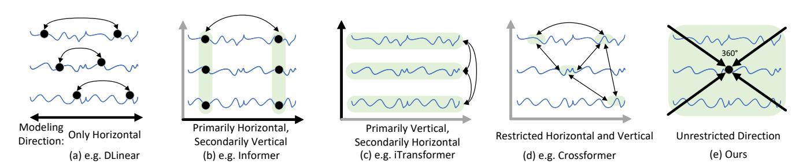
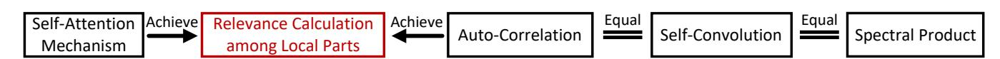
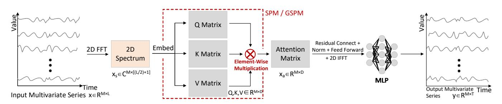
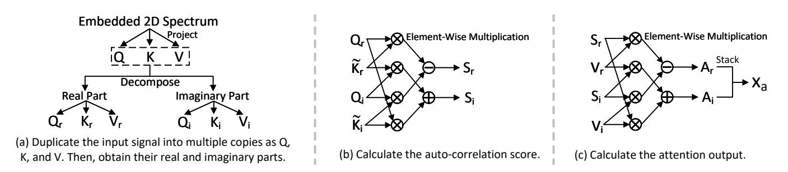
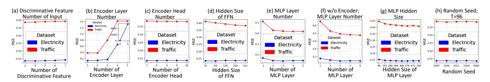
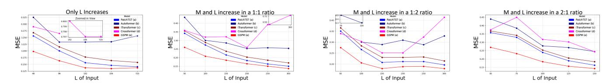
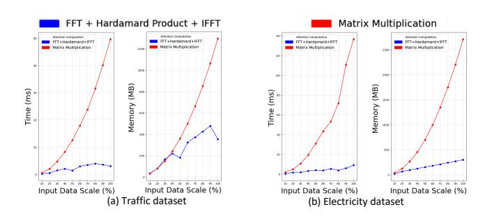
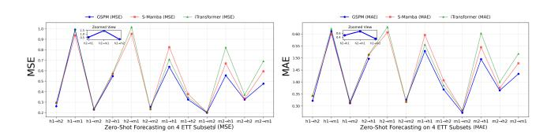
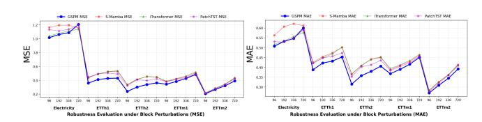

# Modeling Point-to-Point Dependency for High-Dimensional Long-Term Series Forecasting

| Xinyu Li                           |                                    |
|------------------------------------|------------------------------------|
| Shanghai Key Laboratory of         |                                    |
| Intelligent Information Processing |                                    |
| Fudan University                   |                                    |
| Shanghai, China                    |                                    |
| Kexi                               | Chen                               |
| Fudan                              | University                         |
| Shanghai,                          | China                              |
|                                    | Ying Zheng                         |
|                                    | Fudan University                   |
|                                    | Shanghai, China                    |
| Zhiyi Yao                          |                                    |
| Fudan University                   |                                    |
| Shanghai, China                    |                                    |
|                                    | Yi Xie                             |
| Fudan                              | University                         |
| Shanghai,                          | China                              |
|                                    | Jihan Dai                          |
|                                    | Fudan University                   |
|                                    | Shanghai, China                    |
| Lei Bai                            |                                    |
| Shanghai AI Laboratory             |                                    |
| Shanghai, China                    |                                    |
| Jin                                | Zhao ∗                             |
| Fudan                              | University                         |
| Shanghai,                          | China                              |
|                                    | Jiajie Shen                        |
|                                    | Fudan University                   |
|                                    | Shanghai, China                    |
| Yunqi Cai                          |                                    |
| Fudan University                   |                                    |
| Shanghai, China                    |                                    |
| Hong                               | Lu                                 |
| Fudan                              | University                         |
| Shanghai,                          | China                              |
|                                    | Xin Wang ∗                         |
|                                    | Shanghai Key Laboratory of         |
|                                    | Intelligent Information Processing |
|                                    | Fudan University                   |

Intelligent Information Processing Shanghai, China

### Abstract

The strategic planning and reliability of modern web services, from cloud infrastructures to e-commerce platforms, increasingly hinge on accurate long-term forecasting of high-dimensional time series. A fundamental challenge within this task is modeling the intricate point-to-point dependencies that span across both time and variable dimensions. However, many existing methods face restricted direction modeling and computational inefficiency due to their reliance on localized paradigms and Transformer architectures. To address these, we propose replacing Self-Attention with autocorrelation, achieving two key innovations: 1) We propose calculating autocorrelation across both variable and time dimensions, which is a global paradigm, to model point-to-point dependencies. 2) Our proposed Spectral Product Mechanism (SPM) optimizes traditional autocorrelation into a data-driven form suitable for deep learning. Moreover, SPM reformulates autocorrelation as spectral product and reduces the complexity from ��(�� ) to ��(����������), while its Hadamard product-based correlation score matrix further reduces

∗Corresponding authors.

[This work is licensed under a Creative Commons Attribution 4.0 International License.](https://creativecommons.org/licenses/by/4.0) WWW '26, Dubai, United Arab Emirates © 2026 Copyright held by the owner/author(s). ACM ISBN 979-8-4007-2307-0/2026/04 <https://doi.org/10.1145/3774904.3792503>

core computation to ��(��) compared to Self-Attention's ��(�� ) matrix multiplication. We further propose a Generalized Spectral Product Mechanism (GSPM), which extends traditional autocorrelation by mapping input into distinct feature representations, enabling modeling of complex dependencies through cross-feature correlations. SPM and GSPM surpass current state-of-the-art (SOTA) methods on 14 authoritative benchmarks, collectively securing the top rank on 22 out of 28 metrics, while ranking 1st in time, 2nd in memory, and 2nd in parameter overhead. Source code is available at: [https://github.com/lxy-PhD2022/SPM.](https://github.com/lxy-PhD2022/SPM)

### CCS Concepts

- Computing methodologies → Temporal reasoning; Spectral methods.

# Keywords

Multivariate long-term time series forecasting; Model point-topoint dependencies; Spectral product

### ACM Reference Format:

Xinyu Li, Kexi Chen, Ying Zheng, Zhiyi Yao, Yi Xie, Jihan Dai, Lei Bai, Jin Zhao, Jiajie Shen, Yunqi Cai, Hong Lu, and Xin Wang. 2026. Modeling Pointto-Point Dependency for High-Dimensional Long-Term Series Forecasting. In Proceedings of the ACM Web Conference 2026 (WWW '26), April 13–17, 2026, Dubai, United Arab Emirates. ACM, New York, NY, USA, [12](#page-11-0) pages. <https://doi.org/10.1145/3774904.3792503>

Resource Availability: An archival snapshot is available at [https://doi.](https://doi.org/10.5281/zenodo.18371278) [org/10.5281/zenodo.18371278.](https://doi.org/10.5281/zenodo.18371278)

### 1 Introduction

Accurate time series forecasting is a cornerstone of the modern World Wide Web, enabling intelligent services from resource management in cloud infrastructures [\[19\]](#page-8-0) and e-commerce inventory planning [\[1\]](#page-8-1) to user engagement tracking on digital platforms [\[15\]](#page-8-2). The data from these critical web systems is often extreme in scale, characterized by both long temporal histories and high-dimensional variables. The task, formally known as multivariate long-term series forecasting (MLTSF), aims to predict extended future trends across all these variables based on their shared history. In MLTSF, the data is best conceptualized as a 2D plane of time and variables [\[2\]](#page-8-3). Within this 2D plane, dependencies may exist between any two points, regardless of direction or distance. For instance, a sharp spike in CPU load on a core authentication server at a specific timestamp (point 1: ���������� , ������������������) can trigger cascading effects, leading to an abnormal query latency on a downstream recommendation service later (point 2: ����������+�� , ������������������). Therefore, accurately capturing this point-to-point (P2P) dependency that crosses both time and variable dimensions is essential for building robust web services, yet it remains a largely open challenge.

The primary dilemma in P2P modeling is preserving temporal semantic continuity. To avoid disrupting this continuity, existing methods adopt various rule-based paradigms, as illustrated in Figure [1.](#page-2-0) These paradigms, which we critique in detail in the Related Work section, fall into two main categories: 1) Axis-aligned paradigms (Figure [1\(](#page-2-0)a,b,c)) are structurally biased toward horizontal and vertical interactions. An attempt to overcome this by combining the two directions [\[28\]](#page-8-4) still fails to achieve P2P modeling, because true P2P dependencies cannot be linearly decomposed; 2) Patch-based paradigm (Figure [1\(](#page-2-0)d)) allows for some oblique but inaccurate dependencies due to the loss of boundary information [\[8\]](#page-8-5). Although these rule-based paradigms preserve continuity, they introduce a largely overlooked yet fatal flaw: unrestricted distances but restricted directions, which prevents true P2P dependency modeling. Building upon these paradigms, many SOTA methods extensively adopt the Transformer as the backbone, resulting in high computational complexity.

To address these, we turn to 2D autocorrelation. In theory, it provides the perfect solution: its mechanism of computing correlations across all spotiotemporal lags inherently preserves semantic continuity, thus achieving true P2P modeling. At the same time, this pair-wise similarity calculation fulfills the core function of Self-Attention. However, this classical tool is rendered unusable for modern deep learning by two fatal flaws: it is a fixed, non-datadriven measure, and its own prohibitive ��(�� ) complexity.

In this work, we tackle these two flaws by proposing Spectral Product Mechanism (SPM), as shown in Figure [1\(](#page-2-0)e). Firstly, SPM makes the process data-driven by computing autocorrelation within a latent space created by a learnable embedding layer. Secondly, SPM solves the computational bottleneck by reformulating autocorrelation as an efficient spectral product. Crucially, SPM replaces the ��(�� ) matrix multiplication bottleneck in Self-Attention, computing correlation scores with a highly efficient ��(��) Hadamard

product. While the overall ��(����������) complexity is governed by FFT and IFFT, their overhead contributes only 0.019% to time, 0.306% to memory, and 0% to parameters. Thus, SPM's complexity is nearly linear in practice. Although Autoformer [\[25\]](#page-8-6) and FEDformer [\[32\]](#page-8-7) have respectively reduced complexity to��(����������) and��(��), their actual overhead of time, memory, and parameter number are respectively {56.12%, 176.22%}, {62.14%, 12.74%}, and {785.89%, 2769.94%} higher than SPM (details in Table [3\)](#page-7-0).

In order to further model complex dependencies, we improve the traditional autocorrelation to cross-feature correlation computation. Since different feature projections of the same input still represent the same underlying signal, this operation can be regarded as a generalized form of autocorrelation. It can separate different important features from the input signal and then capture more complex dependencies from the cross-feature correlations. We call this method GSPM. Our contributions can be summarized as follows:

- We propose SPM and GSPM that model point-to-point dependencies across both time and variable dimensions, overcoming the directional limitations of existing methods.
- SPM and GSPM reinvent classical autocorrelation into a datadriven form, enabling it to act as a functional replacement for Self-Attention with only��(��) core complexity and extended cross-feature correlation modeling.
- SPM and GSPM collectively secure the top rank on 22 out of 28 metrics across 14 authoritative benchmarks, while ranking 1st in time, 2nd in memory, and 2nd in parameter overhead.

### 2 Related work

We review prior work through the P2P dependency challenge, which requires a global modeling scope and temporal continuity. We argue that local modeling paradigms restrict existing methods to specific directions, preventing true P2P modeling.

Figure [1\(](#page-2-0)a) shows the channel-independent paradigm. Methods such as PatchTST [\[18\]](#page-8-8), DLinear [\[29\]](#page-8-9), TimesNet [\[24\]](#page-8-10), TimeMixer [\[21\]](#page-8-11), TimeKAN [\[10\]](#page-8-12), TimeBase [\[9\]](#page-8-13), Sequence Complementor (Seq-Com) [\[4\]](#page-8-14), and WPMixer [\[17\]](#page-8-15) adopt a channel-independent strategy that runs the model in parallel across each variable sequence for independent prediction. This strategy determines the model coefficients by summing the ACFs of all channels, which can mitigate distribution drift and improve the model's prediction accuracy [\[7\]](#page-8-16). However, iTransformer [\[14\]](#page-8-17) indicates that this approach might lead to suboptimal outcomes due to the neglect of inter-variable dependencies.

Figure [1\(](#page-2-0)b) shows the paradigm that embeds all variable information at each time step into independent feature vectors. Methods like Informer [\[31\]](#page-8-18), Autoformer [\[25\]](#page-8-6), and Liu, et al. [\[13,](#page-8-19) [32\]](#page-8-7) process each time step's variable information independently through local segmentation and models them accordingly. This approach often results in attention maps lacking in meaningful information due to the insufficient semantic integration of variables, consequently reducing the accuracy of modeling variable relationships.

Figure [1\(](#page-2-0)d) shows the paradigm that segments each variable sequence into patches and models dependencies between patches across variables. Unlike the above methods, Crossformer

Table 1: Quantitative results averaged from all prediction length�� ∈ {96, 192, 336, 720} of ours and latest SOTA methods published in 2025. The full results and results of earlier methods published before 2025 can be found in the Appendix Table [6](#page-10-0) and Table [7,](#page-11-1) respectively. Red and blue: 1st and 2nd. "-": unreported in its paper, unmeasurable as its code not open-sourced.

| Models Venue Metric | MSE   | GSPM MAE | MSE   | SPM MAE | MSE   | S-Mamba [23] NC 25 MAE | MSE   | TimeKAN [10] ICLR 25 MAE | MSE   | TimePro [16] ICML 25 MAE | MSE   | FreDF [20] ICLR 25 MAE | MSE   | TimeBase [9] ICML 25 MAE | MSE   | WPMixer [17] AAAI 25 MAE | MSE   | Seq-Com [4] AAAI 25 MAE |
|---------------------|-------|----------|-------|---------|-------|------------------------|-------|--------------------------|-------|--------------------------|-------|------------------------|-------|--------------------------|-------|--------------------------|-------|-------------------------|
| Traffic             | 0.413 | 0.269    | 0.416 | 0.270   | 0.414 | 0.276                  | 0.572 | 0.370                    | 0.439 | 0.286                    | 0.421 | 0.279                  | 0.682 | 0.375                    | 0.489 | 0.297                    | 0.472 | 0.301                   |
| Electricity         | 0.166 | 0.261    | 0.164 | 0.260   | 0.170 | 0.265                  | 0.197 | 0.286                    | 0.169 | 0.262                    | 0.170 | 0.259                  | 0.227 | 0.296                    | 0.177 | 0.267                    | 0.192 | 0.282                   |
| Solar               | 0.229 | 0.263    | 0.233 | 0.265   | 0.240 | 0.273                  | 0.276 | 0.310                    | 0.233 | 0.267                    | 0.240 | 0.255                  | 0.621 | 0.488                    | 0.237 | 0.260                    |       |                         |
| Weather             | 0.239 | 0.271    | 0.239 | 0.271   | 0.251 | 0.276                  | 0.243 | 0.272                    | 0.252 | 0.276                    | 0.254 | 0.274                  | 0.252 | 0.279                    | 0.243 | 0.269                    | 0.243 | 0.273                   |
| Exchange            | 0.324 | 0.377    | 0.372 | 0.400   | 0.367 | 0.408                  | 0.385 | 0.415                    | 0.352 | 0.399                    | 0.399 | 0.432                  | 0.476 | 0.483                    | 0.391 | 0.418                    | 0.356 | 0.400                   |
| ILI                 | 1.040 | 0.652    | 1.397 | 0.754   | 2.817 | 1.126                  | 2.174 | 0.959                    | 2.966 | 1.172                    | 4.095 | 1.475                  | 5.786 | 1.731                    | 2.093 | 0.900                    |       |                         |
| ETTh1               | 0.408 | 0.424    | 0.432 | 0.438   | 0.455 | 0.450                  | 0.418 | 0.427                    | 0.438 | 0.438                    | 0.437 | 0.435                  | 0.463 | 0.429                    | 0.422 | 0.423                    | 0.429 | 0.435                   |
| ETTh2               | 0.311 | 0.365    | 0.327 | 0.376   | 0.381 | 0.405                  | 0.383 | 0.404                    | 0.377 | 0.404                    | 0.372 | 0.396                  | 0.410 | 0.426                    | 0.355 | 0.387                    | 0.368 | 0.398                   |
| ETTm1               | 0.376 | 0.394    | 0.380 | 0.397   | 0.398 | 0.405                  | 0.377 | 0.395                    | 0.391 | 0.401                    | 0.392 | 0.399                  | 0.431 | 0.420                    | 0.376 | 0.388                    | 0.381 | 0.398                   |
| ETTm2               | 0.269 | 0.317    | 0.277 | 0.323   | 0.288 | 0.332                  | 0.277 | 0.323                    | 0.281 | 0.326                    | 0.278 | 0.319                  | 0.290 | 0.332                    | 0.271 | 0.317                    | 0.275 | 0.323                   |
| PEMS03              | 0.239 | 0.325    | 0.222 | 0.314   | 0.264 | 0.346                  | 0.527 | 0.509                    | 0.376 | 0.422                    | 0.309 | 0.378                  | 1.290 | 0.875                    | 0.432 | 0.452                    |       |                         |
| PEMS04              | 0.196 | 0.300    | 0.164 | 0.273   | 0.162 | 0.266                  | 0.516 | 0.514                    | 0.297 | 0.379                    | 0.340 | 0.400                  | 1.379 | 0.917                    | 0.449 | 0.474                    |       |                         |
| PEMS07              | 0.159 | 0.257    | 0.144 | 0.244   | 0.161 | 0.256                  | 0.546 | 0.522                    | 0.378 | 0.414                    | 0.262 | 0.339                  | 1.322 | 0.894                    | 0.427 | 0.443                    |       |                         |
| PEMS08              | 0.351 | 0.322    | 0.308 | 0.303   | 0.374 | 0.352                  | 0.731 | 0.544                    | 0.616 | 0.494                    | 0.482 | 0.412                  | 1.502 | 0.926                    | 0.641 | 0.504                    |       |                         |
| 1st Count:          | 9     | 5        | 5     | 3       | 1     | 1                      | 0     | 0                        | 0     | 0                        | 0     | 2                      | 0     | 0                        | 1     | 4                        | 0     | 0                       |

Table 2: Component ablation study results. GSPM is the optimal one overall. The full results are in the Appendix Table [5.](#page-10-1) We set the training epochs for Traffic to 300 to speed up the experiment.

| Model Dataset | w/o MSE | Vari FFT MAE | w/o MSE | Time FFT MAE | MSE   | w/o FFT MAE | MSE   | SPM MAE | SPM MSE | w/o Emb MAE | w/ MSE | Nonl-QKV MAE | w/ MSE | Sigm-Scor MAE | w/o MSE | Nonl-FFN MAE | w/o MSE | Nonl-MLP MAE | w/ MSE | Mult MAE | MSE   | w/ Add MAE | w/o MSE | FFT; w/ Add MAE | MSE   | GSPM MAE |
|---------------|---------|--------------|---------|--------------|-------|-------------|-------|---------|---------|-------------|--------|--------------|--------|---------------|---------|--------------|---------|--------------|--------|----------|-------|------------|---------|-----------------|-------|----------|
| Traffic       | 0.456   | 0.286        | 0.418   | 0.272        | 0.460 | 0.288       | 0.416 | 0.270   | 0.437   | 0.282       | 0.415  | 0.271        | 0.425  | 0.273         | 0.424   | 0.275        | 0.513   | 0.337        | 0.422  | 0.273    | 0.425 | 0.273      | 0.463   | 0.291           | 0.419 | 0.272    |
| Electricity   | 0.177   | 0.269        | 0.166   | 0.263        | 0.177 | 0.269       | 0.164 | 0.260   | 0.171   | 0.267       | 0.166  | 0.263        | 0.168  | 0.264         | 0.168   | 0.264        | 0.199   | 0.287        | 0.177  | 0.272    | 0.166 | 0.261      | 0.178   | 0.270           | 0.166 | 0.261    |
| Solar         | 0.239   | 0.269        | 0.235   | 0.269        | 0.242 | 0.273       | 0.233 | 0.265   | 0.235   | 0.268       | 0.229  | 0.263        | 0.234  | 0.265         | 0.234   | 0.268        | 0.275   | 0.291        | 0.242  | 0.278    | 0.232 | 0.264      | 0.247   | 0.278           | 0.229 | 0.263    |
| Weather       | 0.239   | 0.272        | 0.241   | 0.273        | 0.240 | 0.272       | 0.239 | 0.271   | 0.240   | 0.272       | 0.240  | 0.272        | 0.240  | 0.272         | 0.239   | 0.271        | 0.248   | 0.278        | 0.242  | 0.273    | 0.242 | 0.274      | 0.240   | 0.272           | 0.239 | 0.271    |
| Exchange      | 0.317   | 0.375        | 0.368   | 0.392        | 0.314 | 0.373       | 0.372 | 0.400   | 0.344   | 0.385       | 0.373  | 0.394        | 0.327  | 0.380         | 0.358   | 0.387        | 0.339   | 0.382        | 0.334  | 0.380    | 0.347 | 0.388      | 0.312   | 0.372           | 0.324 | 0.377    |
| ILI           | 1.483   | 0.767        | 1.298   | 0.719        | 1.409 | 0.761       | 1.397 | 0.754   | 1.475   | 0.775       | 1.306  | 0.727        | 1.560  | 0.794         | 1.375   | 0.754        | 1.431   | 0.774        | 1.423  | 0.762    | 1.325 | 0.727      | 1.336   | 0.731           | 1.040 | 0.652    |
| ETTh1         | 0.435   | 0.436        | 0.435   | 0.441        | 0.422 | 0.433       | 0.432 | 0.438   | 0.431   | 0.437       | 0.430  | 0.439        | 0.431  | 0.436         | 0.429   | 0.437        | 0.430   | 0.437        | 0.433  | 0.437    | 0.430 | 0.436      | 0.420   | 0.430           | 0.408 | 0.424    |
| ETTh2         | 0.327   | 0.374        | 0.329   | 0.376        | 0.334 | 0.377       | 0.327 | 0.376   | 0.331   | 0.377       | 0.327  | 0.375        | 0.329  | 0.377         | 0.328   | 0.376        | 0.329   | 0.375        | 0.324  | 0.373    | 0.330 | 0.377      | 0.333   | 0.376           | 0.311 | 0.365    |
| ETTm1         | 0.382   | 0.397        | 0.386   | 0.399        | 0.382 | 0.397       | 0.380 | 0.397   | 0.380   | 0.398       | 0.381  | 0.397        | 0.381  | 0.397         | 0.382   | 0.398        | 0.395   | 0.402        | 0.382  | 0.398    | 0.383 | 0.399      | 0.383   | 0.398           | 0.376 | 0.394    |
| ETTm2         | 0.274   | 0.322        | 0.276   | 0.323        | 0.273 | 0.321       | 0.277 | 0.323   | 0.280   | 0.325       | 0.275  | 0.322        | 0.275  | 0.322         | 0.274   | 0.322        | 0.280   | 0.325        | 0.278  | 0.324    | 0.278 | 0.325      | 0.273   | 0.321           | 0.269 | 0.317    |
| AVG           | 0.433   | 0.377        | 0.415   | 0.373        | 0.425 | 0.377       | 0.424 | 0.375   | 0.432   | 0.379       | 0.414  | 0.372        | 0.437  | 0.378         | 0.421   | 0.375        | 0.444   | 0.389        | 0.426  | 0.377    | 0.416 | 0.372      | 0.419   | 0.374           | 0.378 | 0.360    |
| 1st Count:    | 1       | 0            | 0       | 0            | 0     | 0           | 2     | 3       | 0       | 0           | 2      | 1            | 0      | 0             | 1       | 1            | 0       | 0            | 0      | 0        | 0     | 0          | 1       | 1               | 8     | 8        |

models the dependencies across variables and the time dimension. It treats the time and variable dimensions equally to model the dependencies with unrestricted direction. In this way, our method can overcome this limitation and achieve the lowest average MSE and MAE in the greatest number of cases, significantly surpassing the latest SOTA methods.

Comparison between GSPM and SPM. Considering the overall MSE and MAE, GSPM achieves 175% more 1st-place rankings than SPM, with its MSE and MAE decreasing by up to 25.55% and 13.53%, respectively. This verifies the effectiveness of extending the traditional autocorrelation by mapping the input into distinct feature representations, which enables the modeling of complex dependencies through cross-feature correlations. This approach can improve the adaptability to generalized scenarios, capturing complex patterns.

# 4.3 Ablation Study

Component ablation. We explore this from four aspects and report the results in Table [2.](#page-5-1) The first part is to investigate the role of global modeling across both variable and time dimensions. We remove the FFT of variables, time, and all dimensions respectively, as shown in the left 1st to 3rd columns. Their overall average MSEs

are 14.6%, 9.8%, and 12.4% higher than that of the 2D FFT of GSPM, verifying the effectiveness of global modeling.

The second part investigates whether optimizing the 2D autocorrelation into a data-driven form is effective. We remove this optimization from the pure SPM, and the results are shown in the left 4th to 5th columns. The data-driven SPM ranks first in five cases, whereas the original 2D autocorrelation not only drops to zero but also increases the MSE by up to 5.58%. This demonstrates that the data-driven optimization in SPM is highly effective.

The third part is to explore the source of GSPM's non-linear modeling ability. We conduct the following studies respectively: adding non-linear mapping to ��, ��, and �� (left 6th) increases the average MSE by 9.52%; adding a sigmoid non-linear activation function (because GSPM does not employ matrix multiplication, Softmax is not applicable) to the correlation score matrix (left 7th) increases the average MSE by 15.61%. These two studies indicate that non-linear mapping is not needed when capturing the discriminative features of the input and is not needed for the score matrix either. Then, we remove the non-linear activation function from the feed-forward network (left 8th), only two indicators are on par with GSPM, but the average MSE increase by 11.38%; removing the non-linear activation function from the MLP (left 9th), the average MSE increase

Figure 5: Hyperparameter sensitivity analysis on largest-scaled datasets Traffic and Electricity. For the encoder and decoder, smaller and larger depths are respectively more optimal. The random seed has no effect.

Figure 6: Influence of look-back window size on Electricity dataset with �� =96 and unified hyper-parameters. GSPM achieves consistently decreased and lower MSE than baselines under all settings.

by 17.46%. The last two studies indicate that the non-linear modeling ability of GSPM mainly comes from the MLP, followed by the FFN.

The fourth part is to study the effectiveness of the Hadamard product. We replace it with matrix multiplication (left 10th) and addition (left 11th), respectively. Moreover, to exclude the influence of FFT, we construct a time-domain addition (left 12th). Their average MSE increases by 12.70%, 10.05%, and 10.85% , respectively, indicating that the Hadamard product is more suitable for the spectral product mechanism both in theory and in practice.

Hyperparameter sensitivity analysis. We conduct this study in four parts. Firstly, we study the impact of the number of discriminative features (like ��, ��, ��), as shown in Figure [5\(](#page-6-0)a). Taking three as the basic version, the MSE is already the lowest. This indicates that three feature matrices can already accurately calculate the autocorrelation and assign values. The second part is to study the impact of the number of parameters in the encoder. Figures 5(b) and 5(c) respectively show that increasing the number of layers and heads of the encoder has no benefits and too many layers significantly increases MSE. These results are because the autocorrelation scores will be distorted due to repeated calculations. In fact, we only use one layer and one head, confirming that we rely on an efficient theory, not parameter piling. Moreover, Figure [5\(](#page-6-0)d) shows that expand feed-forward network decreases MSE in the partial dataset.

The third part is to study the impact of the number of parameters in the decoder. Figure [5\(](#page-6-0)e) shows that increasing the number of layers of the MLP can gradually reduce the MSE. To verify whether the effectiveness comes from our method (located in the encoder), we further conduct experiments by removing the encoder, as shown in Figure [5\(](#page-6-0)f). At this time, although the trend also remains downward, the lowest MSE of traffic and electricity increases by 14.149% and 2.11%, respectively (note that the scales of the vertical axes are different). Moreover, it requires two more layers to converge, leading to a larger number of parameters and higher costs but also

a larger error. These verify that the effectiveness comes from our method. In addition, we also studied the impact of the hidden size of the MLP, as shown in Figure [5\(](#page-6-0)g). A larger model generally yields higher accuracy, as the encoder captures large and complex P2P dependencies requiring stronger nonlinear decoding. Increasing the decoder's layers and hidden size enhances this ability, but once sufficient (3 layers, 576 size), further growth brings no gain. The fourth part focuses on robustness, as shown in Figure [5\(](#page-6-0)h). Changing the random seed over a large range almost does not change the MSE, which verifies our robustness.

Influence of look-back window size. We specifically study the impact of the common input time length (��) and the input size at unrestricted direction. The latter refers to the situation where the variable (��) and time (��) dimensions change simultaneously. We increase �� and �� at multiple ratios and compare with four most representative local paradigm methods shown in Figure [1\(](#page-2-0)a), (b), (c), and (d). The first sub-figure of Figure [6](#page-6-1) shows that GSPM is optimal in terms of the conventional utilization of time length input. Its MSE not only gradually decreases but is also the lowest throughout the process. The other three sub-figures illustrate that GSPM performs the same when the input size at unrestricted direction with multiple ratios increases. These jointly verify that GSPM fully leverages more input by modeling true P2P dependencies, resulting in more accurate high-dimension long-term forecasting.

More results. Figure [8](#page-7-1) and Figure [9](#page-7-2) show that GSPM achieves lower MSE and MAE than the baselines globally, verifying its strong zero-shot forecasting ability and anti-disturbance robustness.

### 4.4 Resource Overhead Analysis

Since one of our goals is to reduce the overhead of Transformer, our baselines are the Transformer-based methods and the latest Mamba-based method, as shown in Table [3.](#page-7-0) GSPM has the secondlowest computational complexity, outperforming most square-level methods. It trails only FEDformer and S-Mamba's linear-level complexity. In fact, the autocorrelation score calculation in GSPM and

Table 3: Comparison of training resource overhead to Transformer- and Mamba-based models on the largest-scale dataset Traffic. We adopt a unified parameter setting (e.g., batch size) to ensure a fair comparison of computational overhead, and adopt the prediction errors reported in publicly published papers to enable an optimal comparison of predictive accuracy. Red and blue: 1st and 2nd. We use "��" to denote the number of varying time steps or variables, and simplify the complexity expression by keeping only the highest-order term. GSPM is optimal overall.

Figure 7: For the Self-Attention, a comparison of the spatiotemporal overhead between our "(I)FFT + Hadamard product" and matrix multiplication on the large-scale datasets. Ours grows linearly, while matrix multiplication grows quadratically. This verifies the validity of our SPM theory.

Figure 8: Zero-Shot forecasting results on 4 ETT subsets. From a global perspective, the two blue lines of GSPM are at the bottom of their group, achieving the global optimum.

Figure 9: Results of the robustness verification based on 5% block perturbation under multiple electricity scenarios. From a global perspective, the two blue lines of GSPM are at the bottom of their group, verified its excellent robustness.

SPM has ��(��) complexity. Although FFT adds ��(����������), its impact on time, memory, and parameters is minimal (4.38%, 1.61%, 0% respectively), making GSPM and SPM almost ��(��) overall.

To verify this, we will independently compare the above computational form with the matrix multiplication of Self-Attention. On the two largest datasets as shown in Figure [7,](#page-7-3) our spatiotemporal overhead (blue line) increases linearly with the size of the input data, while that of matrix multiplication (red line) increases quadratically, which strongly verifies that GSPM and SPM are almost��(��) complexity in general. Crucially, under respective hyperparameters, GSPM's overall average MSE/MAE is 44.01%/38.37% and 38.82%/16.80% lower than FEDformer and S-Mamba, respectively, giving higher practical value.

In time overhead, GSPM ranks 1st across all prediction lengths. Notably, FEDformer, despite its lowest complexity, has an average time overhead 1.77 times and 1.65 times larger than Autoformer and PatchTST respectively, proving lower complexity does not always translate to better practicality. For memory and parameter overhead, GSPM ranks 2nd in the average prediction length and 1st in the longest prediction. This shows that the advantage of GSPM lies in ultra-long-term prediction, which is exactly the problem scenario we are targeting. By comprehensively comparing the four indicators, it can be verified that GSPM has achieved our goal. While achieving the lowest MSE by modeling true P2P dependencies, GSPM effectively reduces the overhead of Transformer.

### 5 Conclusion

To achieve more accurate high-dimensional long-term time series forecasting, we propose a new global modeling paradigm. It models true P2P dependencies across variable and time dimensions. To reduce Transformer's cost, we replace the Self-Attention with autocorrelation and reformulate it into Spectral Product Mechanism (SPM), reducing complexity from ��(�� 2 ) to ��(����������). Moreover, its Hadamard product-based correlation score matrix further reduces core computation to ��(��) compared to Self-Attention's ��(�� ) matrix multiplication. For more complex patterns, we introduce GSPM, which maps and models cross-feature correlations. Our method surpasses the latest SOTA methods on 14 authoritative benchmarks.

### Acknowledgments

This work was supported by the National Natural Science Foundation of China (Grant No. 62472101) and the Songshan Laboratory Research Fund (Grant No. ZZK202402010).

References [1] Aakanksha Ankit Gandhi, Sivaramakrishnan Kaveri, and Vineet Chaoji. [n. d.]. Spatio-temporal Multi-graph Networks for Demand Forecasting in Online Marketplaces. ([n. d.]). [2] Ali Behrouz, Michele Santacatterina, and Ramin Zabih. 2024. Chimera: Effectively modeling multivariate time series with 2-dimensional state space models. Advances in Neural Information Processing Systems 37 (2024), 119886–119918. [3] Wanlin Cai, Yuxuan Liang, Xianggen Liu, Jianshuai Feng, and Yuankai Wu. 2024. Msgnet: Learning multi-scale inter-series correlations for multivariate time series forecasting. In Proceedings of the AAAI Conference on Artificial Intelligence, Vol. 38. 11141–11149. [4] Xiwen Chen, Peijie Qiu, Wenhui Zhu, Huayu Li, Hao Wang, Aristeidis Sotiras, Yalin Wang, and Abolfazl Razi. 2025. Sequence Complementor: Complementing Transformers For Time Series Forecasting with Learnable Sequences. 39 (2025). [5] Wei Fan, Pengyang Wang, Dongkun Wang, Dongjie Wang, Yuanchun Zhou, and Yanjie Fu. 2023. Dish-ts: a general paradigm for alleviating distribution shift in time series forecasting. In Proceedings of the AAAI conference on artificial intelligence, Vol. 37. 7522–7529. [6] Shanghua Gao, Zhong-Yu Li, Qi Han, Ming-Ming Cheng, and Liang Wang. 2022. Rf-next: Efficient receptive field search for convolutional neural networks. IEEE transactions on pattern analysis and machine intelligence 45, 3 (2022), 2984–3002. [7] Lu Han, Han-Jia Ye, and De-Chuan Zhan. 2024. The capacity and robustness trade-off: Revisiting the channel independent strategy for multivariate time series forecasting. IEEE Transactions on Knowledge and Data Engineering (2024). [8] Qihe Huang, Lei Shen, Ruixin Zhang, Jiahuan Cheng, Shouhong Ding, Zhengyang Zhou, and Yang Wang. 2024. Hdmixer: Hierarchical dependency with extendable patch for multivariate time series forecasting. In Proceedings of the AAAI conference on artificial intelligence, Vol. 38. 12608–12616. [9] Qihe Huang, Zhengyang Zhou, Kuo Yang, Zhongchao Yi, Xu Wang, and Yang Wang. [n. d.]. TimeBase: The Power of Minimalism in Efficient Long-term Time Series Forecasting. In Forty-second International Conference on Machine Learning. [10] Songtao Huang, Zhen Zhao, Can Li, and Lei Bai. 2025. Timekan: Kan-based frequency decomposition learning architecture for long-term time series forecasting. arXiv preprint arXiv:2502.06910 (2025). [11] B Hunt. 1971. A matrix theory proof of the discrete convolution theorem. IEEE Transactions on Audio and Electroacoustics 19, 4 (1971), 285–288. [12] Taesung Kim, Jinhee Kim, Yunwon Tae, Cheonbok Park, Jang-Ho Choi, and Jaegul Choo. 2021. Reversible instance normalization for accurate time-series forecasting against distribution shift. In International Conference on Learning Representations. [13] Shizhan Liu, Hang Yu, Cong Liao, Jianguo Li, Weiyao Lin, Alex X Liu, and Schahram Dustdar. 2021. Pyraformer: Low-complexity pyramidal attention for long-range time series modeling and forecasting. In International conference on learning representations. [14] Yong Liu, Tengge Hu, Haoran Zhang, Haixu Wu, Shiyu Wang, Lintao Ma, and Mingsheng Long. 2023. itransformer: Inverted transformers are effective for time series forecasting. arXiv preprint arXiv:2310.06625 (2023). [15] Yozen Liu, Xiaolin Shi, Lucas Pierce, and Xiang Ren. 2019. Characterizing and forecasting user engagement with in-app action graph: A case study of snapchat. In Proceedings of the 25th ACM SIGKDD international conference on knowledge discovery & data mining. 2023–2031. [16] Xiaowen Ma, Zhenliang Ni, Shuai Xiao, and Xinghao Chen. 2025. TimePro: Efficient Multivariate Long-term Time Series Forecasting with Variable-and Time-Aware Hyper-state. arXiv preprint arXiv:2505.20774 (2025). [17] Md Mahmuddun Nabi Murad, Mehmet Aktukmak, and Yasin Yilmaz. 2025. WP-Mixer: Efficient multi-resolution mixing for long-term time series forecasting. In Proceedings of the AAAI Conference on Artificial Intelligence, Vol. 39. 19581–19588. [18] Yuqi Nie, Nam H Nguyen, Phanwadee Sinthong, and Jayant Kalagnanam. 2022. A time series is worth 64 words: Long-term forecasting with transformers. arXiv preprint arXiv:2211.14730 (2022). [19] Arnak V. Poghosyan, Ashot N. Harutyunyan, Naira Grigoryan, Clement Pang, George Oganesyan, Sirak Ghazaryan, and Narek A. Hovhannisyan. 2021. An Enterprise Time Series Forecasting System for Cloud Applications Using Transfer Learning †. Sensors (Basel, Switzerland) 21 (2021). [https://api.semanticscholar.](https://api.semanticscholar.org/CorpusID:232128975) [org/CorpusID:232128975](https://api.semanticscholar.org/CorpusID:232128975) [20] Hao Wang, Licheng Pan, Zhichao Chen, Degui Yang, Sen Zhang, Yifei Yang, Xinggao Liu, Haoxuan Li, and Dacheng Tao. 2024. Fredf: Learning to forecast in the frequency domain. arXiv preprint arXiv:2402.02399 (2024). [21] Shiyu Wang, Haixu Wu, Xiaoming Shi, Tengge Hu, Huakun Luo, Lintao Ma, James Y Zhang, and Jun Zhou. 2024. Timemixer: Decomposable multiscale mixing for time series forecasting. arXiv preprint arXiv:2405.14616 (2024). [22] Yuxuan Wang, Haixu Wu, Jiaxiang Dong, Guo Qin, Haoran Zhang, Yong Liu, Yunzhong Qiu, Jianmin Wang, and Mingsheng Long. 2024. Timexer: Empowering transformers for time series forecasting with exogenous variables. Advances in Neural Information Processing Systems 37 (2024), 469–498. [23] Zihan Wang, Fanheng Kong, Shi Feng, Ming Wang, Xiaocui Yang, Han Zhao, Daling Wang, and Yifei Zhang. 2024. Is mamba effective for time series forecasting? Neurocomputing (2024), 129178. [24] Haixu Wu, Tengge Hu, Yong Liu, Hang Zhou, Jianmin Wang, and Mingsheng Long. 2022. Timesnet: Temporal 2d-variation modeling for general time series analysis. arXiv preprint arXiv:2210.02186 (2022). [25] Haixu Wu, Jiehui Xu, Jianmin Wang, and Mingsheng Long. 2021. Autoformer: Decomposition transformers with auto-correlation for long-term series forecasting. Advances in neural information processing systems 34 (2021), 22419–22430. [26] Weiwei Ye, Songgaojun Deng, Qiaosha Zou, and Ning Gui. 2024. Frequency Adaptive Normalization For Non-stationary Time Series Forecasting. In The Thirty-eighth Annual Conference on Neural Information Processing Systems. [27] Kun Yi, Qi Zhang, Wei Fan, Shoujin Wang, Pengyang Wang, Hui He, Ning An, Defu Lian, Longbing Cao, and Zhendong Niu. 2024. Frequency-domain MLPs are more effective learners in time series forecasting. Advances in Neural Information Processing Systems 36 (2024). [28] Guoqi Yu, Jing Zou, Xiaowei Hu, Angelica I Aviles-Rivero, Jing Qin, and Shujun Wang. 2024. Revitalizing Multivariate Time Series Forecasting: Learnable Decomposition with Inter-Series Dependencies and Intra-Series Variations Modeling. In Forty-first International Conference on Machine Learning. <https://openreview.net/forum?id=87CYNyCGOo> [29] Ailing Zeng, Muxi Chen, Lei Zhang, and Qiang Xu. 2023. Are transformers effective for time series forecasting?. In Proceedings of the AAAI conference on artificial intelligence, Vol. 37. 11121–11128. [30] Yunhao Zhang and Junchi Yan. 2023. Crossformer: Transformer utilizing crossdimension dependency for multivariate time series forecasting. In The eleventh international conference on learning representations. [31] Haoyi Zhou, Shanghang Zhang, Jieqi Peng, Shuai Zhang, Jianxin Li, Hui Xiong, and Wancai Zhang. 2021. Informer: Beyond efficient transformer for long sequence time-series forecasting. In Proceedings of the AAAI conference on artificial intelligence, Vol. 35. 11106–11115. [32] Tian Zhou, Ziqing Ma, Qingsong Wen, Xue Wang, Liang Sun, and Rong Jin. 2022. Fedformer: Frequency enhanced decomposed transformer for long-term series forecasting. In International conference on machine learning. PMLR, 27268–27286. A Related work A.1 Existing MLTSF Modeling Paradigms The paradigm that mixes Figure [1\(](#page-2-0)a) and Figure [1\(](#page-2-0)c). Leddam [\[28\]](#page-8-4) and Timexer [\[22\]](#page-8-24) add a channel-independent learning branch on this basis to take into account the dependency modeling of interand intra- variables. However, the dependencies of different sampling points in any direction cannot be linearly decomposed into the superposition of horizontal and vertical directions as a whole. Therefore, this method does not accurately model P2P dependencies in an unrestricted direction. A.2 Distinctions from Autoformer and FEDformer It is crucial to distinguish our method from prior works that also leverage similar signal processing concepts, in order to precisely delineate our core innovations. The common and most important distinction is that they follow a local paradigm (Figure [1\(](#page-2-0)b)), while ours follows a global modeling paradigm (Figure [1\(](#page-2-0)e)). Specific distinctions are as follows. Autoformer [\[25\]](#page-8-6): The primary distinction is not a simple extension from 1D to 2D, but a fundamental difference in goal and mechanism. Autoformer [\[25\]](#page-8-6) employs classical, fixed autocorrelation as a pre-processing step to identify and aggregate the most relevant periodic sub-series. In sharp contrast, our work's central thesis is to transform autocorrelation from this fixed measure into a fully learnable, data-driven operator (SPM/GSPM) that operates in a latent space to model the entire P2P dependency structure, not just periodicity. FEDformer [\[32\]](#page-8-7): This method does not use autocorrelation.

While it operates in the frequency domain, it relies on the standard,

Table 4: The statistic information of benchmarks.

| Datasets    | Traffic | Electricity | Solar | PEMS03 | PEMS04 | PEMS07 | PEMS08 | Weather | Exchange | ILI   | ETTh1 | ETTh2 | ETTm1 | ETTm2 |
|-------------|---------|-------------|-------|--------|--------|--------|--------|---------|----------|-------|-------|-------|-------|-------|
| Variates    | 862     | 321         | 137   | 358    | 307    | 883    | 170    | 21      | 8        | 7     | 7     | 7     | 7     | 7     |
| Timesteps   | 17544   | 26304       | 52560 | 26209  | 16992  | 28224  | 17856  | 52696   | 7588     | 966   | 17420 | 17420 | 69680 | 69680 |
| Granularity | 1hour   | 1hour       | 10min | 5min   | 5min   | 5min   | 5min   | 10min   | 1day     | 1week | 1hour | 1hour | 5min  | 5min  |

Table 5: The full component ablation study results. GSPM is the optimal one overall.

| Dataset     | w/o MSE | Vari FFT MAE | w/o MSE | Time FFT MAE | MSE   | w/o FFT MAE | MSE   | SPM MAE | SPM MSE | w/o Emb MAE | w/ MSE | Nonl-QKV MAE | w/ MSE | Sigm-Scor MAE | w/o MSE | Nonl-FFN MAE | w/o MSE | Nonl-MLP MAE | w/ MSE | Mult MAE | MSE   | w/ Add MAE | w/o MSE | FFT; w/ MAE | Add MSE | GSPM MAE |
|-------------|---------|--------------|---------|--------------|-------|-------------|-------|---------|---------|-------------|--------|--------------|--------|---------------|---------|--------------|---------|--------------|--------|----------|-------|------------|---------|-------------|---------|----------|
| 96          | 0.432   | 0.275        | 0.385   | 0.255        | 0.437 | 0.277       | 0.384 | 0.253   | 0.410   | 0.270       | 0.380  | 0.253        | 0.393  | 0.257         | 0.389   | 0.257        | 0.502   | 0.339        | 0.391  | 0.258    | 0.393 | 0.257      | 0.440   | 0.280       | 0.385   | 0.254    |
| 192         | 0.445   | 0.279        | 0.406   | 0.265        | 0.446 | 0.280       | 0.403 | 0.263   | 0.426   | 0.277       | 0.404  | 0.264        | 0.414  | 0.266         | 0.413   | 0.268        | 0.498   | 0.327        | 0.411  | 0.266    | 0.414 | 0.266      | 0.449   | 0.282       | 0.408   | 0.266    |
| 336         | 0.456   | 0.284        | 0.422   | 0.274        | 0.461 | 0.289       | 0.420 | 0.271   | 0.439   | 0.282       | 0.420  | 0.272        | 0.429  | 0.274         | 0.428   | 0.276        | 0.508   | 0.330        | 0.426  | 0.274    | 0.429 | 0.276      | 0.464   | 0.290       | 0.424   | 0.274    |
| 720         | 0.490   | 0.304        | 0.458   | 0.295        | 0.495 | 0.309       | 0.457 | 0.294   | 0.472   | 0.301       | 0.458  | 0.295        | 0.463  | 0.294         | 0.467   | 0.299        | 0.545   | 0.351        | 0.461  | 0.294    | 0.462 | 0.294      | 0.497   | 0.310       | 0.459   | 0.294    |
| AVG         | 0.456   | 0.286        | 0.418   | 0.272        | 0.460 | 0.288       | 0.416 | 0.270   | 0.437   | 0.282       | 0.415  | 0.271        | 0.425  | 0.273         | 0.424   | 0.275        | 0.513   | 0.337        | 0.422  | 0.273    | 0.425 | 0.273      | 0.463   | 0.291       | 0.419   | 0.272    |
| 96          | 0.145   | 0.244        | 0.135   | 0.238        | 0.145 | 0.244       | 0.132 | 0.236   | 0.135   | 0.238       | 0.135  | 0.238        | 0.135  | 0.237         | 0.139   | 0.242        | 0.167   | 0.265        | 0.136  | 0.241    | 0.133 | 0.235      | 0.148   | 0.247       | 0.136   | 0.238    |
| 192         | 0.164   | 0.255        | 0.155   | 0.249        | 0.164 | 0.254       | 0.156 | 0.249   | 0.160   | 0.254       | 0.157  | 0.252        | 0.156  | 0.249         | 0.158   | 0.251        | 0.183   | 0.271        | 0.170  | 0.263    | 0.156 | 0.249      | 0.164   | 0.255       | 0.157   | 0.249    |
| 336         | 0.181   | 0.273        | 0.171   | 0.269        | 0.180 | 0.271       | 0.171 | 0.266   | 0.173   | 0.269       | 0.173  | 0.270        | 0.171  | 0.266         | 0.174   | 0.268        | 0.198   | 0.288        | 0.189  | 0.280    | 0.171 | 0.266      | 0.179   | 0.271       | 0.171   | 0.267    |
| 720         | 0.218   | 0.306        | 0.201   | 0.296        | 0.221 | 0.306       | 0.196 | 0.291   | 0.214   | 0.307       | 0.198  | 0.292        | 0.208  | 0.302         | 0.201   | 0.294        | 0.247   | 0.323        | 0.215  | 0.306    | 0.203 | 0.295      | 0.220   | 0.305       | 0.198   | 0.291    |
| AVG         | 0.177   | 0.269        | 0.166   | 0.263        | 0.177 | 0.269       | 0.164 | 0.260   | 0.171   | 0.267       | 0.166  | 0.263        | 0.168  | 0.264         | 0.168   | 0.264        | 0.199   | 0.287        | 0.177  | 0.272    | 0.166 | 0.261      | 0.178   | 0.270       | 0.166   | 0.261    |
| 96          | 0.205   | 0.244        | 0.203   | 0.245        | 0.211 | 0.251       | 0.194 | 0.235   | 0.193   | 0.239       | 0.193  | 0.233        | 0.198  | 0.236         | 0.194   | 0.238        | 0.227   | 0.261        | 0.217  | 0.264    | 0.195 | 0.233      | 0.227   | 0.266       | 0.190   | 0.231    |
| 192         | 0.244   | 0.275        | 0.241   | 0.273        | 0.234 | 0.268       | 0.232 | 0.266   | 0.232   | 0.265       | 0.229  | 0.263        | 0.232  | 0.265         | 0.230   | 0.266        | 0.260   | 0.283        | 0.245  | 0.280    | 0.232 | 0.266      | 0.235   | 0.268       | 0.227   | 0.263    |
| 336         | 0.256   | 0.282        | 0.247   | 0.276        | 0.267 | 0.288       | 0.254 | 0.282   | 0.253   | 0.280       | 0.246  | 0.276        | 0.255  | 0.283         | 0.251   | 0.281        | 0.291   | 0.303        | 0.251  | 0.281    | 0.252 | 0.281      | 0.268   | 0.292       | 0.244   | 0.279    |
| 720         | 0.249   | 0.276        | 0.251   | 0.282        | 0.256 | 0.285       | 0.250 | 0.276   | 0.261   | 0.288       | 0.250  | 0.281        | 0.249  | 0.276         | 0.262   | 0.289        | 0.321   | 0.315        | 0.256  | 0.286    | 0.250 | 0.276      | 0.258   | 0.286       | 0.253   | 0.280    |
| AVG         | 0.239   | 0.269        | 0.235   | 0.269        | 0.242 | 0.273       | 0.233 | 0.265   | 0.235   | 0.268       | 0.229  | 0.263        | 0.234  | 0.265         | 0.234   | 0.268        | 0.275   | 0.291        | 0.242  | 0.278    | 0.232 | 0.264      | 0.247   | 0.278       | 0.229   | 0.263    |
| 96          | 0.164   | 0.209        | 0.165   | 0.209        | 0.165 | 0.210       | 0.162 | 0.207   | 0.164   | 0.209       | 0.162  | 0.207        | 0.162  | 0.207         | 0.163   | 0.208        | 0.172   | 0.218        | 0.162  | 0.206    | 0.164 | 0.209      | 0.165   | 0.210       | 0.161   | 0.206    |
| 192         | 0.211   | 0.251        | 0.213   | 0.252        | 0.211 | 0.251       | 0.209 | 0.250   | 0.210   | 0.251       | 0.210  | 0.251        | 0.209  | 0.250         | 0.211   | 0.251        | 0.223   | 0.261        | 0.210  | 0.251    | 0.212 | 0.252      | 0.211   | 0.251       | 0.208   | 0.249    |
| 336         | 0.254   | 0.288        | 0.258   | 0.292        | 0.255 | 0.290       | 0.256 | 0.290   | 0.258   | 0.291       | 0.261  | 0.293        | 0.259  | 0.292         | 0.255   | 0.289        | 0.262   | 0.295        | 0.265  | 0.297    | 0.261 | 0.294      | 0.255   | 0.289       | 0.258   | 0.291    |
| 720 Weather | 0.327   | 0.338        | 0.331   | 0.340        | 0.329 | 0.338       | 0.328 | 0.338   | 0.327   | 0.336       | 0.329  | 0.339        | 0.328  | 0.338         | 0.328   | 0.338        | 0.333   | 0.340        | 0.330  | 0.340    | 0.330 | 0.340      | 0.328   | 0.337       | 0.329   | 0.339    |
| AVG         | 0.239   | 0.272        | 0.241   | 0.273        | 0.240 | 0.272       | 0.239 | 0.271   | 0.240   | 0.272       | 0.240  | 0.272        | 0.240  | 0.272         | 0.239   | 0.271        | 0.248   | 0.278        | 0.242  | 0.273    | 0.242 | 0.274      | 0.240   | 0.272       | 0.239   | 0.271    |
| 96          | 0.082   | 0.198        | 0.081   | 0.199        | 0.087 | 0.203       | 0.103 | 0.224   | 0.086   | 0.204       | 0.083  | 0.199        | 0.085  | 0.203         | 0.087   | 0.205        | 0.084   | 0.201        | 0.088  | 0.205    | 0.091 | 0.208      | 0.082   | 0.197       | 0.079   | 0.196    |
| 192         | 0.179   | 0.300        | 0.172   | 0.295        | 0.169 | 0.293       | 0.184 | 0.305   | 0.181   | 0.305       | 0.184  | 0.304        | 0.199  | 0.315         | 0.193   | 0.311        | 0.179   | 0.298        | 0.192  | 0.309    | 0.198 | 0.316      | 0.183   | 0.304       | 0.164   | 0.289    |
| 336         | 0.330   | 0.415        | 0.333   | 0.418        | 0.325 | 0.412       | 0.399 | 0.456   | 0.341   | 0.422       | 0.337  | 0.420        | 0.323  | 0.410         | 0.333   | 0.417        | 0.336   | 0.417        | 0.324  | 0.410    | 0.327 | 0.413      | 0.323   | 0.410       | 0.378   | 0.445    |
| 720         | 0.678   | 0.585        | 0.884   | 0.655        | 0.676 | 0.585       | 0.803 | 0.617   | 0.766   | 0.609       | 0.889  | 0.655        | 0.702  | 0.590         | 0.821   | 0.615        | 0.756   | 0.612        | 0.731  | 0.597    | 0.773 | 0.617      | 0.661   | 0.575       | 0.676   | 0.578    |
| AVG         | 0.317   | 0.375        | 0.368   | 0.392        | 0.314 | 0.373       | 0.372 | 0.400   | 0.344   | 0.385       | 0.373  | 0.394        | 0.327  | 0.380         | 0.358   | 0.387        | 0.339   | 0.382        | 0.334  | 0.380    | 0.347 | 0.388      | 0.312   | 0.372       | 0.324   | 0.377    |
| 24          | 1.557   | 0.766        | 1.302   | 0.734        | 1.340 | 0.721       | 1.348 | 0.712   | 1.610   | 0.762       | 1.112  | 0.645        | 1.322  | 0.722         | 1.302   | 0.693        | 1.370   | 0.749        | 1.106  | 0.671    | 1.126 | 0.651      | 1.447   | 0.740       | 0.928   | 0.609    |
| 36          | 1.579   | 0.776        | 1.211   | 0.674        | 1.247 | 0.714       | 1.509 | 0.790   | 1.345   | 0.747       | 1.462  | 0.776        | 1.338  | 0.708         | 1.516   | 0.802        | 1.629   | 0.837        | 1.552  | 0.792    | 1.435 | 0.749      | 1.188   | 0.693       | 1.110   | 0.673    |
| 48          | 1.286   | 0.727        | 1.299   | 0.728        | 1.651 | 0.837       | 1.375 | 0.748   | 1.429   | 0.774       | 1.288  | 0.730        | 1.743  | 0.849         | 1.296   | 0.735        | 1.288   | 0.738        | 1.466  | 0.776    | 1.439 | 0.759      | 1.358   | 0.737       | 1.007   | 0.645    |
| 60          | 1.509   | 0.799        | 1.379   | 0.741        | 1.397 | 0.773       | 1.355 | 0.766   | 1.514   | 0.817       | 1.364  | 0.756        | 1.837  | 0.897         | 1.385   | 0.788        | 1.437   | 0.773        | 1.570  | 0.811    | 1.298 | 0.747      | 1.353   | 0.754       | 1.114   | 0.683    |
| AVG         | 1.483   | 0.767        | 1.298   | 0.719        | 1.409 | 0.761       | 1.397 | 0.754   | 1.475   | 0.775       | 1.306  | 0.727        | 1.560  | 0.794         | 1.375   | 0.754        | 1.431   | 0.774        | 1.423  | 0.762    | 1.325 | 0.727      | 1.336   | 0.731       | 1.040   | 0.652    |
| 96          | 0.360   | 0.387        | 0.362   | 0.390        | 0.359 | 0.387       | 0.362 | 0.389   | 0.365   | 0.392       | 0.361  | 0.389        | 0.362  | 0.389         | 0.361   | 0.388        | 0.374   | 0.391        | 0.361  | 0.389    | 0.362 | 0.390      | 0.359   | 0.387       | 0.360   | 0.388    |
| 192         | 0.440   | 0.436        | 0.443   | 0.446        | 0.400 | 0.420       | 0.432 | 0.430   | 0.420   | 0.429       | 0.427  | 0.435        | 0.424  | 0.427         | 0.424   | 0.428        | 0.428   | 0.432        | 0.433  | 0.433    | 0.425 | 0.430      | 0.399   | 0.417       | 0.412   | 0.422    |
| 336         | 0.453   | 0.450        | 0.456   | 0.449        | 0.446 | 0.445       | 0.454 | 0.450   | 0.464   | 0.453       | 0.454  | 0.450        | 0.457  | 0.448         | 0.453   | 0.450        | 0.452   | 0.450        | 0.454  | 0.449    | 0.456 | 0.449      | 0.434   | 0.437       | 0.427   | 0.431    |
| 720         | 0.489   | 0.471        | 0.477   | 0.480        | 0.482 | 0.479       | 0.479 | 0.482   | 0.475   | 0.475       | 0.479  | 0.482        | 0.482  | 0.478         | 0.478   | 0.482        | 0.465   | 0.476        | 0.484  | 0.479    | 0.475 | 0.476      | 0.490   | 0.478       | 0.432   | 0.453    |
| AVG         | 0.435   | 0.436        | 0.435   | 0.441        | 0.422 | 0.433       | 0.432 | 0.438   | 0.431   | 0.437       | 0.430  | 0.439        | 0.431  | 0.436         | 0.429   | 0.437        | 0.430   | 0.437        | 0.433  | 0.437    | 0.430 | 0.436      | 0.420   | 0.430       | 0.408   | 0.424    |
| 96          | 0.257   | 0.329        | 0.254   | 0.325        | 0.255 | 0.327       | 0.256 | 0.329   | 0.250   | 0.322       | 0.256  | 0.328        | 0.261  | 0.331         | 0.260   | 0.331        | 0.259   | 0.326        | 0.245  | 0.317    | 0.258 | 0.329      | 0.258   | 0.327       | 0.241   | 0.315    |
| 192         | 0.313   | 0.363        | 0.320   | 0.364        | 0.324 | 0.367       | 0.315 | 0.364   | 0.314   | 0.364       | 0.314  | 0.363        | 0.315  | 0.364         | 0.314   | 0.363        | 0.323   | 0.369        | 0.319  | 0.367    | 0.315 | 0.364      | 0.323   | 0.366       | 0.302   | 0.357    |
| 336         | 0.357   | 0.388        | 0.355   | 0.394        | 0.369 | 0.395       | 0.354 | 0.392   | 0.355   | 0.392       | 0.354  | 0.392        | 0.354  | 0.391         | 0.355   | 0.392        | 0.344   | 0.384        | 0.355  | 0.393    | 0.357 | 0.393      | 0.366   | 0.391       | 0.339   | 0.380    |
| 720         | 0.379   | 0.416        | 0.388   | 0.421        | 0.387 | 0.421       | 0.384 | 0.419   | 0.404   | 0.432       | 0.384  | 0.419        | 0.388  | 0.421         | 0.383   | 0.419        | 0.392   | 0.423        | 0.379  | 0.416    | 0.389 | 0.421      | 0.386   | 0.421       | 0.363   | 0.406    |
| AVG         | 0.327   | 0.374        | 0.329   | 0.376        | 0.334 | 0.377       | 0.327 | 0.376   | 0.331   | 0.377       | 0.327  | 0.375        | 0.329  | 0.377         | 0.328   | 0.376        | 0.329   | 0.375        | 0.324  | 0.373    | 0.330 | 0.377      | 0.333   | 0.376       | 0.311   | 0.365    |
| 96          | 0.316   | 0.362        | 0.323   | 0.365        | 0.313 | 0.359       | 0.315 | 0.361   | 0.317   | 0.363       | 0.315  | 0.361        | 0.314  | 0.361         | 0.317   | 0.362        | 0.334   | 0.372        | 0.320  | 0.364    | 0.319 | 0.365      | 0.317   | 0.361       | 0.308   | 0.355    |
| 192         | 0.352   | 0.380        | 0.354   | 0.382        | 0.355 | 0.382       | 0.351 | 0.380   | 0.352   | 0.382       | 0.351  | 0.379        | 0.351  | 0.380         | 0.352   | 0.380        | 0.367   | 0.386        | 0.351  | 0.381    | 0.352 | 0.380      | 0.356   | 0.382       | 0.349   | 0.378    |
| 336         | 0.397   | 0.406        | 0.398   | 0.406        | 0.398 | 0.407       | 0.397 | 0.406   | 0.396   | 0.405       | 0.396  | 0.406        | 0.398  | 0.407         | 0.397   | 0.406        | 0.411   | 0.410        | 0.396  | 0.406    | 0.398 | 0.407      | 0.399   | 0.406       | 0.391   | 0.403    |
| 720         | 0.462   | 0.442        | 0.468   | 0.445        | 0.460 | 0.441       | 0.460 | 0.442   | 0.454   | 0.441       | 0.462  | 0.442        | 0.459  | 0.441         | 0.462   | 0.442        | 0.469   | 0.440        | 0.459  | 0.443    | 0.462 | 0.443      | 0.461   | 0.441       | 0.455   | 0.441    |
| AVG         | 0.382   | 0.397        | 0.386   | 0.399        | 0.382 | 0.397       | 0.380 | 0.397   | 0.380   | 0.398       | 0.381  | 0.397        | 0.381  | 0.397         | 0.382   | 0.398        | 0.395   | 0.402        | 0.382  | 0.398    | 0.383 | 0.399      | 0.383   | 0.398       | 0.376   | 0.394    |
| 96          | 0.177   | 0.259        | 0.178   | 0.261        | 0.179 | 0.261       | 0.178 | 0.261   | 0.179   | 0.260       | 0.178  | 0.261        | 0.178  | 0.259         | 0.178   | 0.261        | 0.181   | 0.263        | 0.175  | 0.258    | 0.178 | 0.259      | 0.177   | 0.259       | 0.173   | 0.254    |
| 192         | 0.240   | 0.300        | 0.239   | 0.299        | 0.240 | 0.299       | 0.241 | 0.301   | 0.242   | 0.301       | 0.240  | 0.300        | 0.242  | 0.302         | 0.241   | 0.301        | 0.245   | 0.304        | 0.243  | 0.302    | 0.243 | 0.303      | 0.239   | 0.299       | 0.236   | 0.296    |
| 336         | 0.296   | 0.336        | 0.300   | 0.339        | 0.296 | 0.336       | 0.295 | 0.335   | 0.296   | 0.336       | 0.295  | 0.336        | 0.298  | 0.338         | 0.295   | 0.335        | 0.304   | 0.341        | 0.306  | 0.343    | 0.300 | 0.339      | 0.297   | 0.336       | 0.292   | 0.333    |
| 720         | 0.382   | 0.391        | 0.386   | 0.394        | 0.380 | 0.389       | 0.393 | 0.395   | 0.403   | 0.402       | 0.385  | 0.392        | 0.383  | 0.391         | 0.384   | 0.391        | 0.390   | 0.394        | 0.387  | 0.392    | 0.391 | 0.398      | 0.381   | 0.390       | 0.375   | 0.386    |
| AVG         | 0.274   | 0.322        | 0.276   | 0.323        | 0.273 | 0.321       | 0.277 | 0.323   | 0.280   | 0.325       | 0.275  | 0.322        | 0.275  | 0.322         | 0.274   | 0.322        | 0.280   | 0.325        | 0.278  | 0.324    | 0.278 | 0.325      | 0.273   | 0.321       | 0.269   | 0.317    |

Table 6: Full quantitative results of ours and latest SOTA methods published in 2025. The results of earlier methods published before 2025 can be found in the Table [7.](#page-11-1) Red and blue: 1st and 2nd. "-": unreported in its paper, unmeasurable as its code not open-sourced.

| Models Venue Metric | MSE   | GSPM MAE | MSE   | SPM MAE | MSE   | S-Mamba NC 25 MAE | MSE   | TimeKAN ICLR 25 MAE | MSE   | TimePro ICML 25 MAE | MSE   | FreDF ICLR 25 MAE | MSE   | TimeBase ICML 25 MAE | MSE   | WPMixer AAAI 25 MAE | MSE   | Sequence-Com AAAI 25 MAE |
|---------------------|-------|----------|-------|---------|-------|-------------------|-------|---------------------|-------|---------------------|-------|-------------------|-------|----------------------|-------|---------------------|-------|--------------------------|
| 96                  | 0.378 | 0.249    | 0.384 | 0.253   | 0.382 | 0.261             | 0.570 | 0.376               | 0.406 | 0.269               | 0.391 | 0.265             | 0.713 | 0.385                | 0.465 | 0.286               | 0.455 | 0.291                    |
| 192                 | 0.400 | 0.262    | 0.403 | 0.263   | 0.396 | 0.267             | 0.553 | 0.362               | 0.424 | 0.276               | 0.410 | 0.273             | 0.652 | 0.362                | 0.475 | 0.290               | 0.460 | 0.291                    |
| 336                 | 0.417 | 0.272    | 0.420 | 0.271   | 0.417 | 0.276             | 0.557 | 0.363               | 0.444 | 0.287               | 0.424 | 0.280             | 0.660 | 0.365                | 0.489 | 0.296               | 0.473 | 0.302                    |
| 720                 | 0.457 | 0.295    | 0.457 | 0.294   | 0.460 | 0.300             | 0.606 | 0.379               | 0.483 | 0.312               | 0.460 | 0.298             | 0.702 | 0.386                | 0.527 | 0.318               | 0.500 | 0.321                    |
| AVG                 | 0.413 | 0.269    | 0.416 | 0.270   | 0.414 | 0.276             | 0.572 | 0.370               | 0.439 | 0.286               | 0.421 | 0.279             | 0.682 | 0.375                | 0.489 | 0.297               | 0.472 | 0.301                    |
| 96                  | 0.136 | 0.238    | 0.132 | 0.236   | 0.139 | 0.235             | 0.174 | 0.266               | 0.139 | 0.234               | 0.144 | 0.233             | 0.212 | 0.279                | 0.150 | 0.241               | 0.156 | 0.252                    |
| 192                 | 0.157 | 0.249    | 0.156 | 0.249   | 0.159 | 0.255             | 0.182 | 0.273               | 0.156 | 0.249               | 0.159 | 0.247             | 0.209 | 0.281                | 0.162 | 0.252               | 0.175 | 0.269                    |
| 336                 | 0.171 | 0.267    | 0.171 | 0.266   | 0.176 | 0.272             | 0.197 | 0.286               | 0.172 | 0.267               | 0.172 | 0.263             | 0.223 | 0.295                | 0.179 | 0.270               | 0.190 | 0.284                    |
| 720                 | 0.198 | 0.291    | 0.196 | 0.291   | 0.204 | 0.298             | 0.236 | 0.320               | 0.209 | 0.299               | 0.204 | 0.294             | 0.264 | 0.327                | 0.217 | 0.304               | 0.246 | 0.324                    |
| AVG                 | 0.166 | 0.261    | 0.164 | 0.260   | 0.170 | 0.265             | 0.197 | 0.286               | 0.169 | 0.262               | 0.170 | 0.259             | 0.227 | 0.296                | 0.177 | 0.267               | 0.192 | 0.282                    |
| 96                  | 0.190 | 0.231    | 0.194 | 0.235   | 0.205 | 0.244             | 0.232 | 0.288               | 0.196 | 0.237               | 0.207 | 0.221             | 0.619 | 0.492                | 0.205 | 0.239               |       |                          |
| 192                 | 0.227 | 0.263    | 0.232 | 0.266   | 0.237 | 0.270             | 0.279 | 0.311               | 0.231 | 0.263               | 0.244 | 0.254             | 0.642 | 0.505                | 0.234 | 0.257               |       |                          |
| 336                 | 0.244 | 0.279    | 0.254 | 0.282   | 0.258 | 0.288             | 0.297 | 0.324               | 0.250 | 0.281               | 0.253 | 0.269             | 0.638 | 0.496                | 0.254 | 0.270               |       |                          |
| 720                 | 0.253 | 0.280    | 0.250 | 0.276   | 0.260 | 0.288             | 0.294 | 0.318               | 0.253 | 0.285               | 0.256 | 0.274             | 0.584 | 0.457                | 0.253 | 0.272               |       |                          |
| AVG                 | 0.229 | 0.263    | 0.233 | 0.265   | 0.240 | 0.273             | 0.276 | 0.310               | 0.233 | 0.267               | 0.240 | 0.255             | 0.621 | 0.488                | 0.237 | 0.260               |       |                          |
| 96                  | 0.161 | 0.206    | 0.162 | 0.207   | 0.165 | 0.210             | 0.162 | 0.208               | 0.166 | 0.207               | 0.164 | 0.202             | 0.170 | 0.215                | 0.162 | 0.204               | 0.159 | 0.206                    |
| 192                 | 0.208 | 0.249    | 0.209 | 0.250   | 0.214 | 0.252             | 0.207 | 0.249               | 0.216 | 0.254               | 0.220 | 0.253             | 0.216 | 0.256                | 0.209 | 0.246               | 0.205 | 0.249                    |
| 336                 | 0.258 | 0.291    | 0.256 | 0.290   | 0.274 | 0.297             | 0.263 | 0.290               | 0.273 | 0.296               | 0.275 | 0.294             | 0.271 | 0.297                | 0.263 | 0.287               | 0.263 | 0.291                    |
| 720 Weather         | 0.329 | 0.339    | 0.328 | 0.338   | 0.350 | 0.345             | 0.338 | 0.340               | 0.351 | 0.346               | 0.356 | 0.347             | 0.351 | 0.348                | 0.339 | 0.338               | 0.344 | 0.345                    |
| AVG                 | 0.239 | 0.271    | 0.239 | 0.271   | 0.251 | 0.276             | 0.243 | 0.272               | 0.252 | 0.276               | 0.254 | 0.274             | 0.252 | 0.279                | 0.243 | 0.269               | 0.243 | 0.273                    |
| 96                  | 0.079 | 0.196    | 0.103 | 0.224   | 0.086 | 0.207             | 0.088 | 0.207               | 0.085 | 0.204               | 0.102 | 0.228             | 0.111 | 0.238                | 0.094 | 0.211               | 0.082 | 0.200                    |
| 192                 | 0.164 | 0.289    | 0.184 | 0.305   | 0.182 | 0.304             | 0.192 | 0.310               | 0.178 | 0.299               | 0.204 | 0.326             | 0.280 | 0.399                | 0.187 | 0.306               | 0.175 | 0.297                    |
| 336                 | 0.378 | 0.445    | 0.399 | 0.456   | 0.332 | 0.418             | 0.357 | 0.433               | 0.328 | 0.414               | 0.360 | 0.438             | 0.499 | 0.522                | 0.360 | 0.432               | 0.325 | 0.413                    |
| 720                 | 0.676 | 0.578    | 0.803 | 0.617   | 0.867 | 0.703             | 0.901 | 0.711               | 0.817 | 0.679               | 0.928 | 0.734             | 1.015 | 0.771                | 0.923 | 0.724               | 0.840 | 0.690                    |
| AVG                 | 0.324 | 0.377    | 0.372 | 0.400   | 0.367 | 0.408             | 0.385 | 0.415               | 0.352 | 0.399               | 0.399 | 0.432             | 0.476 | 0.483                | 0.391 | 0.418               | 0.356 | 0.400                    |
| 24                  | 0.928 | 0.609    | 1.348 | 0.712   | 2.908 | 1.139             | 2.265 | 1.029               | 2.822 | 1.125               | 4.250 | 1.528             | 6.804 | 1.902                | 2.107 | 0.909               |       |                          |
| 36                  | 1.110 | 0.673    | 1.509 | 0.790   | 2.778 | 1.115             | 2.105 | 0.955               | 2.747 | 1.119               | 4.102 | 1.472             | 6.166 | 1.794                | 1.652 | 0.805               |       |                          |
| 48                  | 1.007 | 0.645    | 1.375 | 0.748   | 2.760 | 1.112             | 2.409 | 0.955               | 2.784 | 1.131               | 3.992 | 1.452             | 5.282 | 1.634                | 1.982 | 0.851               |       |                          |
| 60                  | 1.114 | 0.683    | 1.355 | 0.766   | 2.821 | 1.136             | 1.917 | 0.896               | 3.511 | 1.314               | 4.037 | 1.449             | 4.893 | 1.592                | 2.630 | 1.035               |       |                          |
| AVG                 | 1.040 | 0.652    | 1.397 | 0.754   | 2.817 | 1.126             | 2.174 | 0.959               | 2.966 | 1.172               | 4.095 | 1.475             | 5.786 | 1.731                | 2.093 | 0.900               |       |                          |
| 96                  | 0.360 | 0.388    | 0.362 | 0.389   | 0.386 | 0.405             | 0.367 | 0.395               | 0.375 | 0.398               | 0.382 | 0.400             | 0.399 | 0.392                | 0.368 | 0.394               | 0.375 | 0.394                    |
| 192                 | 0.412 | 0.422    | 0.432 | 0.430   | 0.443 | 0.437             | 0.414 | 0.420               | 0.427 | 0.429               | 0.430 | 0.427             | 0.455 | 0.423                | 0.420 | 0.418               | 0.423 | 0.425                    |
| 336                 | 0.427 | 0.431    | 0.454 | 0.450   | 0.489 | 0.468             | 0.445 | 0.434               | 0.472 | 0.450               | 0.474 | 0.451             | 0.501 | 0.443                | 0.452 | 0.433               | 0.457 | 0.448                    |
| 720                 | 0.432 | 0.453    | 0.479 | 0.482   | 0.502 | 0.489             | 0.444 | 0.459               | 0.476 | 0.474               | 0.463 | 0.462             | 0.498 | 0.458                | 0.449 | 0.449               | 0.462 | 0.472                    |
| AVG                 | 0.408 | 0.424    | 0.432 | 0.438   | 0.455 | 0.450             | 0.418 | 0.427               | 0.438 | 0.438               | 0.437 | 0.435             | 0.463 | 0.429                | 0.422 | 0.423               | 0.429 | 0.435                    |
| 96                  | 0.241 | 0.315    | 0.256 | 0.329   | 0.296 | 0.348             | 0.290 | 0.340               | 0.293 | 0.345               | 0.289 | 0.337             | 0.338 | 0.376                | 0.282 | 0.334               | 0.283 | 0.337                    |
| 192                 | 0.302 | 0.357    | 0.315 | 0.364   | 0.376 | 0.396             | 0.375 | 0.392               | 0.367 | 0.394               | 0.363 | 0.385             | 0.402 | 0.405                | 0.359 | 0.385               | 0.362 | 0.388                    |
| 336                 | 0.339 | 0.380    | 0.354 | 0.392   | 0.424 | 0.431             | 0.423 | 0.435               | 0.419 | 0.431               | 0.419 | 0.426             | 0.439 | 0.444                | 0.374 | 0.404               | 0.408 | 0.425                    |
| 720                 | 0.363 | 0.406    | 0.384 | 0.419   | 0.426 | 0.444             | 0.443 | 0.449               | 0.427 | 0.445               | 0.415 | 0.437             | 0.460 | 0.477                | 0.405 | 0.427               | 0.419 | 0.441                    |
| AVG                 | 0.311 | 0.365    | 0.327 | 0.376   | 0.381 | 0.405             | 0.383 | 0.404               | 0.377 | 0.404               | 0.372 | 0.396             | 0.410 | 0.426                | 0.355 | 0.387               | 0.368 | 0.398                    |
| 96                  | 0.308 | 0.355    | 0.315 | 0.361   | 0.333 | 0.368             | 0.322 | 0.361               | 0.326 | 0.364               | 0.324 | 0.362             | 0.373 | 0.388                | 0.314 | 0.350               | 0.321 | 0.359                    |
| 192                 | 0.349 | 0.378    | 0.351 | 0.380   | 0.376 | 0.390             | 0.357 | 0.383               | 0.367 | 0.383               | 0.373 | 0.385             | 0.411 | 0.409                | 0.358 | 0.375               | 0.362 | 0.386                    |
| 336                 | 0.391 | 0.403    | 0.397 | 0.406   | 0.408 | 0.413             | 0.382 | 0.401               | 0.402 | 0.409               | 0.402 | 0.404             | 0.436 | 0.421                | 0.384 | 0.395               | 0.393 | 0.406                    |
| 720                 | 0.455 | 0.441    | 0.460 | 0.442   | 0.475 | 0.448             | 0.445 | 0.435               | 0.469 | 0.446               | 0.469 | 0.444             | 0.503 | 0.461                | 0.448 | 0.432               | 0.450 | 0.442                    |
| AVG                 | 0.376 | 0.394    | 0.380 | 0.397   | 0.398 | 0.405             | 0.377 | 0.395               | 0.391 | 0.401               | 0.392 | 0.399             | 0.431 | 0.420                | 0.376 | 0.388               | 0.381 | 0.398                    |
| 96                  | 0.173 | 0.254    | 0.178 | 0.261   | 0.179 | 0.263             | 0.174 | 0.255               | 0.178 | 0.260               | 0.173 | 0.252             | 0.188 | 0.271                | 0.171 | 0.253               | 0.172 | 0.256                    |
| 192                 | 0.236 | 0.296    | 0.241 | 0.301   | 0.250 | 0.309             | 0.239 | 0.299               | 0.242 | 0.303               | 0.241 | 0.298             | 0.251 | 0.309                | 0.234 | 0.294               | 0.236 | 0.299                    |
| 336                 | 0.292 | 0.333    | 0.295 | 0.335   | 0.312 | 0.349             | 0.301 | 0.340               | 0.303 | 0.342               | 0.298 | 0.334             | 0.311 | 0.346                | 0.292 | 0.333               | 0.298 | 0.339                    |
| 720                 | 0.375 | 0.386    | 0.393 | 0.395   | 0.411 | 0.406             | 0.395 | 0.396               | 0.400 | 0.399               | 0.398 | 0.393             | 0.411 | 0.401                | 0.387 | 0.390               | 0.395 | 0.397                    |
| AVG                 | 0.269 | 0.317    | 0.277 | 0.323   | 0.288 | 0.332             | 0.277 | 0.323               | 0.281 | 0.326               | 0.278 | 0.319             | 0.290 | 0.332                | 0.271 | 0.317               | 0.275 | 0.323                    |
| 96                  | 0.186 | 0.291    | 0.179 | 0.285   | 0.209 | 0.313             | 0.504 | 0.507               | 0.653 | 0.597               | 0.281 | 0.368             | 1.436 | 0.967                | 0.360 | 0.410               |       |                          |
| 192                 | 0.222 | 0.318    | 0.208 | 0.309   | 0.242 | 0.335             | 0.586 | 0.546               | 0.266 | 0.359               | 0.305 | 0.380             | 1.472 | 0.965                | 0.489 | 0.491               |       |                          |
| 336                 | 0.241 | 0.323    | 0.223 | 0.310   | 0.286 | 0.363             | 0.460 | 0.462               | 0.252 | 0.339               | 0.284 | 0.356             | 1.048 | 0.749                | 0.436 | 0.449               |       |                          |
| 720                 | 0.308 | 0.369    | 0.277 | 0.350   | 0.317 | 0.373             | 0.558 | 0.521               | 0.332 | 0.393               | 0.365 | 0.408             | 1.203 | 0.820                | 0.443 | 0.459               |       |                          |
| AVG                 | 0.239 | 0.325    | 0.222 | 0.314   | 0.264 | 0.346             | 0.527 | 0.509               | 0.376 | 0.422               | 0.309 | 0.378             | 1.290 | 0.875                | 0.432 | 0.452               |       |                          |
| 96                  | 0.164 | 0.275    | 0.142 | 0.254   | 0.127 | 0.237             | 0.486 | 0.505               | 0.248 | 0.346               | 0.319 | 0.389             | 1.534 | 1.000                | 0.377 | 0.431               |       |                          |
| 192                 | 0.191 | 0.299    | 0.157 | 0.268   | 0.151 | 0.256             | 0.569 | 0.550               | 0.298 | 0.383               | 0.363 | 0.417             | 1.552 | 0.999                | 0.543 | 0.534               |       |                          |
| 336                 | 0.199 | 0.297    | 0.165 | 0.270   | 0.169 | 0.270             | 0.462 | 0.473               | 0.300 | 0.374               | 0.302 | 0.369             | 1.119 | 0.787                | 0.423 | 0.453               |       |                          |
| 720                 | 0.230 | 0.330    | 0.193 | 0.300   | 0.201 | 0.299             | 0.545 | 0.526               | 0.343 | 0.411               | 0.374 | 0.423             | 1.312 | 0.883                | 0.453 | 0.478               |       |                          |
| AVG                 | 0.196 | 0.300    | 0.164 | 0.273   | 0.162 | 0.266             | 0.516 | 0.514               | 0.297 | 0.379               | 0.340 | 0.400             | 1.379 | 0.917                | 0.449 | 0.474               |       |                          |
| 96                  | 0.129 | 0.237    | 0.118 | 0.222   | 0.132 | 0.235             | 0.512 | 0.513               | 0.790 | 0.659               | 0.239 | 0.324             | 1.473 | 0.983                | 0.379 | 0.405               |       |                          |
| 192                 | 0.163 | 0.256    | 0.142 | 0.242   | 0.167 | 0.267             | 0.617 | 0.566               | 0.240 | 0.335               | 0.278 | 0.352             | 1.508 | 0.985                | 0.495 | 0.487               |       |                          |
| 336                 | 0.154 | 0.253    | 0.139 | 0.239   | 0.159 | 0.251             | 0.481 | 0.476               | 0.210 | 0.306               | 0.232 | 0.315             | 1.074 | 0.767                | 0.415 | 0.439               |       |                          |
| 720                 | 0.190 | 0.280    | 0.178 | 0.273   | 0.187 | 0.272             | 0.572 | 0.532               | 0.271 | 0.357               | 0.297 | 0.366             | 1.231 | 0.841                | 0.418 | 0.442               |       |                          |
| AVG                 | 0.159 | 0.257    | 0.144 | 0.244   | 0.161 | 0.256             | 0.546 | 0.522               | 0.378 | 0.414               | 0.262 | 0.339             | 1.322 | 0.894                | 0.427 | 0.443               |       |                          |
| 96                  | 0.232 | 0.289    | 0.209 | 0.276   | 0.284 | 0.332             | 0.596 | 0.515               | 0.986 | 0.725               | 0.384 | 0.396             | 1.579 | 1.007                | 0.487 | 0.453               |       |                          |
| 192                 | 0.349 | 0.325    | 0.284 | 0.298   | 0.370 | 0.364             | 0.830 | 0.580               | 0.599 | 0.510               | 0.490 | 0.421             | 1.672 | 1.008                | 0.711 | 0.542               |       |                          |
| 336                 | 0.374 | 0.314    | 0.341 | 0.298   | 0.382 | 0.331             | 0.697 | 0.510               | 0.405 | 0.343               | 0.478 | 0.381             | 1.301 | 0.809                | 0.711 | 0.517               |       |                          |
| 720                 | 0.450 | 0.361    | 0.399 | 0.339   | 0.458 | 0.380             | 0.799 | 0.569               | 0.475 | 0.397               | 0.577 | 0.450             | 1.455 | 0.881                | 0.655 | 0.504               |       |                          |
| AVG                 | 0.351 | 0.322    | 0.308 | 0.303   | 0.374 | 0.352             | 0.731 | 0.544               | 0.616 | 0.494               | 0.482 | 0.412             | 1.502 | 0.926                | 0.641 | 0.504               |       |                          |

(2) Linear-based methods: TimeMixer [\[21\]](#page-8-11), DLinear [\[29\]](#page-8-9); (3) CNNbased methods: TimesNet [\[24\]](#page-8-10).

Implementation Details. Our method is implemented using PyTorch with Adam optimizer on a single RTX 3090 GPU. Full hyperparameter settings are reported in the scripts of the source code [https://github.com/lxy-PhD2022/SPM.](https://github.com/lxy-PhD2022/SPM) In addition, in Table [3](#page-7-0) of Section 4.4 (Resource Overhead Analysis), we unify the loss function of all models to MSE and keep the encoder hyper-parameters consistent. Since the baselines mainly employ a single-layer linear decoder while ours uses a multi-layer MLP, we set the MLP to two layers to reduce potential unfairness caused by non-core factors.

For Loss Function, we compute a frequency domain loss for Traffic dataset and MSE loss for others. The formalized representations of the frequency domain and MSE loss are as follows, respectively.

L�� ���� = E�� ∥�� ���� (����+1:��+�� ) − �� ���� (����+1:��+�� )∥1 , (14)

L������ = E�� ∥����+1:��+�� − ����+1:��+�� ∥ (15)

where L�� ���� , L������ , ����+1:��+�� , and ����+1:��+�� denote the frequency domain loss, MSE loss, true future sequences, and predicted future sequences of length �� across �� variables, respectively. Let �� ���� (·) denotes the FFT transformation along the temporal dimension.

We set the training epoch and patience of the Traffic dataset to {1000, 1000}, and set those of other datasets to {300, 20}.

### C.2 Main Results

Full quantitative results of ours and 2025 latest methods are shown in Table [6.](#page-10-0) The results of earlier methods published before 2025 can be found in Table [7.](#page-11-1) It can be seen that SPM and GSPM achieve Top-2 performance in the vast majority of metrics. Our method is capable of modeling dependencies across both variables and time while treating these two dimensions on an equal footing, enabling unrestricted directional dependency modeling. As a result, it overcomes the P2P modeling limitation and attains the lowest MSE and MAE in the largest number of cases, significantly outperforming the vast number of methods published from 2021 to 2025.

### C.3 Ablation Study

Component ablation. Table [5](#page-10-1) shows the full component ablation study results: (i) Removing variable/time/all FFT components increases the average MSE by 14.6%/9.8%/12.4%, confirming the value of global modeling across both dimensions. (ii) Disabling the data-driven optimization raises 5.58% MSE, validating its effectiveness. (iii) Adding nonlinearities to ��, ��, �� or the score matrix increases MSE by 9.52%-15.61%, while removing activations from FFN and MLP increases MSE by 11.38% and 17.46%. (iv) Replacing the Hadamard product with multiplication/addition (including a

Table 7: The results of earlier methods published before 2025. Red and blue: 1st and 2nd.

| Models Venue Metric | MSE   | GSPM MAE | MSE   | SPM MAE | MSE   | iTransformer ICLR 24 MAE | MSE   | Leddam ICML 24 MAE | MSE   | MSGNet AAAI 24 MAE | MSE   | PatchTST ICLR 23 MAE | MSE   | Crossformer ICLR 23 MAE | MSE   | TimesNet ICLR 23 MAE | MSE   | DLinear AAAI 23 MAE | MSE   | FEDformer ICML 22 MAE | MSE   | Autoformer NeurIPS 21 MAE | MSE   | Informer AAAI 21 MAE |
|---------------------|-------|----------|-------|---------|-------|--------------------------|-------|--------------------|-------|--------------------|-------|----------------------|-------|-------------------------|-------|----------------------|-------|---------------------|-------|-----------------------|-------|---------------------------|-------|----------------------|
| 96                  | 0.378 | 0.249    | 0.384 | 0.253   | 0.395 | 0.268                    | 0.426 | 0.276              | 0.609 | 0.349              | 0.526 | 0.347                | 0.522 | 0.290                   | 0.593 | 0.321                | 0.650 | 0.396               | 0.587 | 0.366                 | 0.613 | 0.388                     | 0.719 | 0.391                |
| 192                 | 0.400 | 0.262    | 0.403 | 0.263   | 0.417 | 0.276                    | 0.458 | 0.289              | 0.636 | 0.371              | 0.522 | 0.332                | 0.530 | 0.293                   | 0.617 | 0.336                | 0.598 | 0.370               | 0.604 | 0.373                 | 0.616 | 0.382                     | 0.696 | 0.379                |
| 336                 | 0.417 | 0.272    | 0.420 | 0.271   | 0.433 | 0.283                    | 0.486 | 0.297              | 0.671 | 0.393              | 0.517 | 0.334                | 0.558 | 0.305                   | 0.629 | 0.336                | 0.605 | 0.373               | 0.621 | 0.383                 | 0.622 | 0.337                     | 0.777 | 0.420                |
| 720                 | 0.457 | 0.295    | 0.457 | 0.294   | 0.467 | 0.302                    | 0.498 | 0.313              | 0.727 | 0.422              | 0.552 | 0.352                | 0.589 | 0.328                   | 0.640 | 0.350                | 0.645 | 0.394               | 0.626 | 0.382                 | 0.660 | 0.408                     | 0.864 | 0.472                |
| AVG                 | 0.413 | 0.269    | 0.416 | 0.270   | 0.428 | 0.282                    | 0.467 | 0.294              | 0.661 | 0.384              | 0.529 | 0.341                | 0.550 | 0.304                   | 0.620 | 0.336                | 0.625 | 0.383               | 0.610 | 0.376                 | 0.628 | 0.379                     | 0.764 | 0.416                |
| 96                  | 0.136 | 0.238    | 0.132 | 0.236   | 0.148 | 0.240                    | 0.141 | 0.235              | 0.165 | 0.274              | 0.190 | 0.296                | 0.219 | 0.314                   | 0.168 | 0.272                | 0.197 | 0.282               | 0.193 | 0.308                 | 0.201 | 0.317                     | 0.274 | 0.368                |
| 192                 | 0.157 | 0.249    | 0.156 | 0.249   | 0.162 | 0.253                    | 0.159 | 0.252              | 0.184 | 0.292              | 0.199 | 0.304                | 0.231 | 0.322                   | 0.184 | 0.289                | 0.196 | 0.285               | 0.201 | 0.315                 | 0.222 | 0.334                     | 0.296 | 0.386                |
| 336                 | 0.171 | 0.267    | 0.171 | 0.266   | 0.178 | 0.269                    | 0.173 | 0.268              | 0.195 | 0.302              | 0.217 | 0.319                | 0.246 | 0.337                   | 0.198 | 0.300                | 0.209 | 0.301               | 0.214 | 0.329                 | 0.231 | 0.338                     | 0.300 | 0.394                |
| 720                 | 0.198 | 0.291    | 0.196 | 0.291   | 0.225 | 0.317                    | 0.201 | 0.295              | 0.231 | 0.332              | 0.258 | 0.352                | 0.280 | 0.363                   | 0.220 | 0.320                | 0.245 | 0.333               | 0.246 | 0.355                 | 0.254 | 0.361                     | 0.373 | 0.439                |
| AVG                 | 0.166 | 0.261    | 0.164 | 0.260   | 0.178 | 0.270                    | 0.169 | 0.263              | 0.194 | 0.300              | 0.216 | 0.318                | 0.244 | 0.334                   | 0.193 | 0.295                | 0.212 | 0.300               | 0.214 | 0.327                 | 0.227 | 0.338                     | 0.311 | 0.397                |
| 96                  | 0.190 | 0.231    | 0.194 | 0.235   | 0.203 | 0.237                    | 0.197 | 0.241              | 0.225 | 0.263              | 0.234 | 0.286                | 0.310 | 0.331                   | 0.250 | 0.292                | 0.290 | 0.378               | 0.242 | 0.342                 | 0.884 | 0.711                     | 0.212 | 0.260                |
| 192                 | 0.227 | 0.263    | 0.232 | 0.266   | 0.233 | 0.261                    | 0.231 | 0.264              | 0.265 | 0.285              | 0.267 | 0.310                | 0.734 | 0.725                   | 0.296 | 0.318                | 0.320 | 0.398               | 0.285 | 0.380                 | 0.834 | 0.692                     | 0.243 | 0.259                |
| 336                 | 0.244 | 0.279    | 0.254 | 0.282   | 0.248 | 0.273                    | 0.241 | 0.268              | 0.293 | 0.315              | 0.290 | 0.315                | 0.750 | 0.735                   | 0.319 | 0.330                | 0.353 | 0.415               | 0.282 | 0.376                 | 0.941 | 0.723                     | 0.270 | 0.276                |
| 720                 | 0.253 | 0.280    | 0.250 | 0.276   | 0.249 | 0.275                    | 0.250 | 0.281              | 0.291 | 0.315              | 0.289 | 0.317                | 0.769 | 0.765                   | 0.338 | 0.337                | 0.356 | 0.413               | 0.357 | 0.427                 | 0.882 | 0.717                     | 0.241 | 0.300                |
| AVG                 | 0.229 | 0.263    | 0.233 | 0.265   | 0.233 | 0.262                    | 0.230 | 0.264              | 0.269 | 0.295              | 0.270 | 0.307                | 0.641 | 0.639                   | 0.301 | 0.319                | 0.330 | 0.401               | 0.292 | 0.381                 | 0.885 | 0.711                     | 0.242 | 0.274                |
| 96                  | 0.161 | 0.206    | 0.162 | 0.207   | 0.174 | 0.214                    | 0.156 | 0.202              | 0.163 | 0.212              | 0.186 | 0.227                | 0.158 | 0.230                   | 0.172 | 0.220                | 0.196 | 0.255               | 0.217 | 0.296                 | 0.266 | 0.336                     | 0.300 | 0.384                |
| 192                 | 0.208 | 0.249    | 0.209 | 0.250   | 0.221 | 0.254                    | 0.207 | 0.250              | 0.212 | 0.254              | 0.234 | 0.265                | 0.206 | 0.277                   | 0.219 | 0.261                | 0.237 | 0.296               | 0.276 | 0.336                 | 0.307 | 0.367                     | 0.598 | 0.544                |
| 336                 | 0.258 | 0.291    | 0.256 | 0.290   | 0.278 | 0.296                    | 0.262 | 0.291              | 0.272 | 0.299              | 0.284 | 0.301                | 0.272 | 0.335                   | 0.280 | 0.306                | 0.283 | 0.335               | 0.339 | 0.380                 | 0.359 | 0.395                     | 0.578 | 0.523                |
| 720                 | 0.329 | 0.339    | 0.328 | 0.338   | 0.358 | 0.347                    | 0.343 | 0.343              | 0.350 | 0.348              | 0.356 | 0.349                | 0.398 | 0.418                   | 0.365 | 0.359                | 0.345 | 0.381               | 0.403 | 0.428                 | 0.419 | 0.428                     | 1.059 | 0.741                |
| AVG                 | 0.239 | 0.271    | 0.239 | 0.271   | 0.258 | 0.278                    | 0.242 | 0.272              | 0.249 | 0.278              | 0.265 | 0.286                | 0.259 | 0.315                   | 0.259 | 0.287                | 0.265 | 0.317               | 0.309 | 0.360                 | 0.338 | 0.382                     | 0.634 | 0.548                |
| 96                  | 0.079 | 0.196    | 0.103 | 0.224   | 0.086 | 0.206                    | 0.084 | 0.204              | 0.102 | 0.230              | 0.081 | 0.198                | 0.256 | 0.367                   | 0.107 | 0.234                | 0.088 | 0.219               | 0.148 | 0.278                 | 0.197 | 0.323                     | 0.847 | 0.752                |
| 192                 | 0.164 | 0.289    | 0.184 | 0.305   | 0.177 | 0.299                    | 0.189 | 0.312              | 0.195 | 0.317              | 0.171 | 0.293                | 0.470 | 0.509                   | 0.226 | 0.344                | 0.176 | 0.315               | 0.271 | 0.380                 | 0.300 | 0.369                     | 1.204 | 0.895                |
| 336                 | 0.378 | 0.445    | 0.399 | 0.456   | 0.331 | 0.417                    | 0.338 | 0.421              | 0.359 | 0.436              | 0.319 | 0.407                | 1.268 | 0.883                   | 0.367 | 0.448                | 0.313 | 0.427               | 0.460 | 0.500                 | 0.509 | 0.524                     | 1.672 | 1.036                |
| 720                 | 0.676 | 0.578    | 0.803 | 0.617   | 0.847 | 0.691                    | 1.072 | 0.771              | 0.940 | 0.738              | 0.836 | 0.688                | 1.767 | 1.068                   | 0.964 | 0.746                | 0.839 | 0.695               | 1.195 | 0.841                 | 1.447 | 0.941                     | 2.478 | 1.310                |
| AVG                 | 0.324 | 0.377    | 0.372 | 0.400   | 0.360 | 0.403                    | 0.421 | 0.427              | 0.399 | 0.430              | 0.352 | 0.397                | 0.940 | 0.707                   | 0.416 | 0.443                | 0.354 | 0.414               | 0.519 | 0.500                 | 0.613 | 0.539                     | 1.550 | 0.998                |
| 24                  | 0.928 | 0.609    | 1.348 | 0.712   | 1.832 | 0.861                    | 1.815 | 0.838              | 3.993 | 1.411              | 1.581 | 0.787                | 3.442 | 1.240                   | 2.317 | 0.934                | 2.398 | 1.040               | 3.228 | 1.260                 | 3.483 | 1.287                     | 5.764 | 1.677                |
| 36                  | 1.110 | 0.673    | 1.509 | 0.790   | 1.638 | 0.832                    | 2.077 | 0.930              | 3.728 | 1.310              | 1.254 | 0.733                | 3.463 | 1.257                   | 1.972 | 0.920                | 2.646 | 1.088               | 2.679 | 1.080                 | 3.103 | 1.148                     | 4.755 | 1.467                |
| 48                  | 1.007 | 0.645    | 1.375 | 0.748   | 2.117 | 0.914                    | 2.084 | 0.887              | 3.379 | 1.259              | 1.999 | 0.854                | 3.640 | 1.296                   | 2.238 | 0.940                | 2.614 | 1.086               | 2.622 | 1.078                 | 2.669 | 1.085                     | 4.763 | 1.469                |
| 60                  | 1.114 | 0.683    | 1.355 | 0.766   | 1.838 | 0.885                    | 1.997 | 0.896              | 4.055 | 1.430              | 1.697 | 0.829                | 3.928 | 1.352                   | 2.027 | 0.928                | 2.804 | 1.146               | 2.857 | 1.157                 | 2.770 | 1.125                     | 5.264 | 1.564                |
| AVG                 | 1.040 | 0.652    | 1.397 | 0.754   | 1.856 | 0.873                    | 1.993 | 0.888              | 3.789 | 1.353              | 1.633 | 0.801                | 3.618 | 1.286                   | 2.139 | 0.931                | 2.616 | 1.090               | 2.847 | 1.144                 | 3.006 | 1.161                     | 5.137 | 1.544                |
| 96                  | 0.360 | 0.388    | 0.362 | 0.389   | 0.386 | 0.405                    | 0.377 | 0.394              | 0.39  | 0.411              | 0.460 | 0.447                | 0.423 | 0.448                   | 0.384 | 0.402                | 0.386 | 0.400               | 0.376 | 0.419                 | 0.449 | 0.459                     | 0.865 | 0.713                |
| 192                 | 0.412 | 0.422    | 0.432 | 0.430   | 0.441 | 0.436                    | 0.424 | 0.422              | 0.442 | 0.442              | 0.512 | 0.477                | 0.471 | 0.474                   | 0.436 | 0.429                | 0.437 | 0.432               | 0.420 | 0.448                 | 0.500 | 0.482                     | 1.008 | 0.792                |
| 336                 | 0.427 | 0.431    | 0.454 | 0.450   | 0.487 | 0.458                    | 0.459 | 0.442              | 0.480 | 0.468              | 0.546 | 0.496                | 0.570 | 0.546                   | 0.491 | 0.469                | 0.481 | 0.459               | 0.459 | 0.465                 | 0.521 | 0.496                     | 1.107 | 0.809                |
| 720                 | 0.432 | 0.453    | 0.479 | 0.482   | 0.503 | 0.491                    | 0.463 | 0.459              | 0.494 | 0.488              | 0.544 | 0.517                | 0.653 | 0.621                   | 0.521 | 0.500                | 0.519 | 0.516               | 0.506 | 0.507                 | 0.514 | 0.512                     | 1.181 | 0.865                |
| AVG                 | 0.408 | 0.424    | 0.432 | 0.438   | 0.454 | 0.448                    | 0.431 | 0.429              | 0.452 | 0.452              | 0.516 | 0.484                | 0.529 | 0.522                   | 0.458 | 0.450                | 0.456 | 0.452               | 0.440 | 0.460                 | 0.496 | 0.487                     | 1.040 | 0.795                |
| 96                  | 0.241 | 0.315    | 0.256 | 0.329   | 0.297 | 0.349                    | 0.292 | 0.343              | 0.328 | 0.371              | 0.308 | 0.355                | 0.745 | 0.584                   | 0.340 | 0.374                | 0.333 | 0.387               | 0.358 | 0.397                 | 0.346 | 0.388                     | 3.755 | 1.525                |
| 192                 | 0.302 | 0.357    | 0.315 | 0.364   | 0.380 | 0.400                    | 0.367 | 0.389              | 0.402 | 0.414              | 0.393 | 0.405                | 0.877 | 0.656                   | 0.402 | 0.414                | 0.477 | 0.476               | 0.429 | 0.439                 | 0.456 | 0.452                     | 5.602 | 1.931                |
| 336                 | 0.339 | 0.380    | 0.354 | 0.392   | 0.428 | 0.432                    | 0.412 | 0.424              | 0.435 | 0.443              | 0.427 | 0.436                | 1.043 | 0.731                   | 0.452 | 0.452                | 0.594 | 0.541               | 0.496 | 0.487                 | 0.482 | 0.486                     | 4.721 | 1.835                |
| 720                 | 0.363 | 0.406    | 0.384 | 0.419   | 0.427 | 0.445                    | 0.419 | 0.438              | 0.417 | 0.441              | 0.436 | 0.450                | 1.104 | 0.763                   | 0.462 | 0.468                | 0.831 | 0.657               | 0.463 | 0.474                 | 0.515 | 0.511                     | 3.647 | 1.625                |
| AVG                 | 0.311 | 0.365    | 0.327 | 0.376   | 0.383 | 0.407                    | 0.373 | 0.399              | 0.396 | 0.417              | 0.391 | 0.412                | 0.942 | 0.684                   | 0.414 | 0.427                | 0.559 | 0.515               | 0.437 | 0.449                 | 0.450 | 0.459                     | 4.431 | 1.729                |
| 96                  | 0.308 | 0.355    | 0.315 | 0.361   | 0.334 | 0.368                    | 0.319 | 0.359              | 0.319 | 0.366              | 0.352 | 0.374                | 0.404 | 0.426                   | 0.338 | 0.375                | 0.345 | 0.372               | 0.379 | 0.419                 | 0.505 | 0.475                     | 0.672 | 0.571                |
| 192                 | 0.349 | 0.378    | 0.351 | 0.380   | 0.377 | 0.391                    | 0.369 | 0.383              | 0.376 | 0.397              | 0.390 | 0.393                | 0.450 | 0.451                   | 0.374 | 0.387                | 0.380 | 0.389               | 0.426 | 0.441                 | 0.553 | 0.496                     | 0.795 | 0.669                |
| 336                 | 0.391 | 0.403    | 0.397 | 0.406   | 0.426 | 0.420                    | 0.394 | 0.402              | 0.417 | 0.422              | 0.421 | 0.414                | 0.532 | 0.515                   | 0.410 | 0.411                | 0.413 | 0.413               | 0.445 | 0.459                 | 0.621 | 0.537                     | 1.212 | 0.871                |
| 720                 | 0.455 | 0.441    | 0.460 | 0.442   | 0.491 | 0.459                    | 0.460 | 0.442              | 0.481 | 0.458              | 0.462 | 0.449                | 0.666 | 0.589                   | 0.478 | 0.450                | 0.474 | 0.453               | 0.543 | 0.490                 | 0.671 | 0.561                     | 1.166 | 0.823                |
| AVG                 | 0.376 | 0.394    | 0.380 | 0.397   | 0.407 | 0.410                    | 0.386 | 0.397              | 0.398 | 0.411              | 0.406 | 0.408                | 0.513 | 0.495                   | 0.400 | 0.406                | 0.403 | 0.407               | 0.448 | 0.452                 | 0.588 | 0.517                     | 0.961 | 0.734                |
| 96                  | 0.173 | 0.254    | 0.178 | 0.261   | 0.180 | 0.264                    | 0.176 | 0.257              | 0.177 | 0.262              | 0.183 | 0.270                | 0.287 | 0.366                   | 0.187 | 0.267                | 0.193 | 0.292               | 0.203 | 0.287                 | 0.255 | 0.339                     | 0.365 | 0.453                |
| 192                 | 0.236 | 0.296    | 0.241 | 0.301   | 0.250 | 0.309                    | 0.243 | 0.303              | 0.247 | 0.307              | 0.255 | 0.314                | 0.414 | 0.492                   | 0.249 | 0.309                | 0.248 | 0.362               | 0.269 | 0.328                 | 0.281 | 0.340                     | 0.533 | 0.563                |
| 336                 | 0.292 | 0.333    | 0.295 | 0.335   | 0.311 | 0.348                    | 0.303 | 0.402              | 0.312 | 0.346              | 0.309 | 0.347                | 0.597 | 0.542                   | 0.321 | 0.351                | 0.369 | 0.427               | 0.325 | 0.366                 | 0.339 | 0.372                     | 1.363 | 0.887                |
| 720                 | 0.375 | 0.386    | 0.393 | 0.395   | 0.412 | 0.407                    | 0.400 | 0.442              | 0.414 | 0.403              | 0.412 | 0.404                | 1.730 | 1.042                   | 0.408 | 0.403                | 0.554 | 0.522               | 0.421 | 0.415                 | 0.433 | 0.432                     | 3.379 | 1.338                |
| AVG                 | 0.269 | 0.317    | 0.277 | 0.323   | 0.288 | 0.332                    | 0.281 | 0.351              | 0.288 | 0.330              | 0.290 | 0.334                | 0.757 | 0.611                   | 0.291 | 0.333                | 0.341 | 0.401               | 0.305 | 0.349                 | 0.327 | 0.371                     | 1.410 | 0.810                |
| 96                  | 0.186 | 0.291    | 0.179 | 0.285   | 0.276 | 0.369                    | 0.252 | 0.347              | 0.267 | 0.341              | 0.505 | 0.517                | 0.262 | 0.367                   | 0.228 | 0.317                | 0.457 | 0.515               | 0.348 | 0.434                 | 1.031 | 0.796                     | 0.225 | 0.316                |
| 192                 | 0.222 | 0.318    | 0.208 | 0.309   | 0.325 | 0.400                    | 0.286 | 0.370              | 0.425 | 0.610              | 0.549 | 0.545                | 0.173 | 0.279                   | 0.290 | 0.364                | 0.477 | 0.527               | 0.486 | 0.535                 | 2.893 | 1.401                     | 0.204 | 0.304                |
| 336                 | 0.241 | 0.323    | 0.223 | 0.310   | 0.306 | 0.373                    | 0.273 | 0.354              | 0.412 | 0.605              | 0.431 | 0.459                | 0.221 | 0.303                   | 0.264 | 0.342                | 0.396 | 0.456               | 0.579 | 0.564                 | 1.654 | 0.999                     | 0.206 | 0.301                |
| 720                 | 0.308 | 0.369    | 0.277 | 0.350   | 0.371 | 0.419                    | 0.331 | 0.395              | 0.471 | 0.675              | 0.540 | 0.528                | 0.252 | 0.320                   | 0.335 | 0.391                | 0.439 | 0.492               | 0.710 | 0.631                 | 1.772 | 1.078                     | 0.245 | 0.332                |
| AVG                 | 0.239 | 0.325    | 0.222 | 0.314   | 0.320 | 0.390                    | 0.286 | 0.367              | 0.394 | 0.558              | 0.506 | 0.512                | 0.227 | 0.317                   | 0.279 | 0.354                | 0.442 | 0.498               | 0.531 | 0.541                 | 1.838 | 1.069                     | 0.220 | 0.313                |
| 96                  | 0.164 | 0.275    | 0.142 | 0.254   | 0.314 | 0.392                    | 0.170 | 0.285              | 0.194 | 0.314              | 0.644 | 0.594                | 0.402 | 0.457                   | 0.190 | 0.303                | 0.452 | 0.504               | 0.341 | 0.427                 | 0.912 | 0.748                     | 0.128 | 0.243                |
| 192                 | 0.191 | 0.299    | 0.157 | 0.268   | 0.354 | 0.419                    | 0.213 | 0.319              | 0.395 | 0.550              | 0.689 | 0.616                | 0.199 | 0.292                   | 0.223 | 0.332                | 0.470 | 0.516               | 0.599 | 0.595                 | 1.651 | 1.005                     | 0.151 | 0.260                |
| 336                 | 0.199 | 0.297    | 0.165 | 0.270   | 0.314 | 0.383                    | 0.207 | 0.305              | 0.394 | 0.558              | 0.536 | 0.517                | 0.188 | 0.289                   | 0.215 | 0.321                | 0.399 | 0.459               | 0.637 | 0.598                 | 1.412 | 0.926                     | 0.161 | 0.700                |
| 720                 | 0.230 | 0.330    | 0.193 | 0.300   | 0.366 | 0.423                    | 0.215 | 0.318              | 0.461 | 0.637              | 0.629 | 0.578                | 0.210 | 0.293                   | 0.262 | 0.362                | 0.462 | 0.501               | 0.753 | 0.659                 | 1.707 | 1.060                     | 0.219 | 0.310                |
| AVG                 | 0.196 | 0.300    | 0.164 | 0.273   | 0.337 | 0.404                    | 0.201 | 0.307              | 0.361 | 0.515              | 0.625 | 0.576                | 0.250 | 0.333                   | 0.223 | 0.330                | 0.446 | 0.495               | 0.583 | 0.570                 | 1.421 | 0.935                     | 0.165 | 0.378                |
| 96                  | 0.129 | 0.237    | 0.118 | 0.222   | 0.240 | 0.336                    | 0.162 | 0.267              | 0.187 | 0.289              | 0.492 | 0.507                | 0.396 | 0.442                   | 0.181 | 0.279                | 0.594 | 0.553               | 0.262 | 0.376                 | 0.554 | 0.578                     | 0.201 | 0.274                |
| 192                 | 0.163 | 0.256    | 0.142 | 0.242   | 0.284 | 0.368                    | 0.239 | 0.336              | 0.359 | 0.545              | 0.545 | 0.538                | 0.196 | 0.274                   | 0.223 | 0.315                | 0.621 | 0.567               | 0.419 | 0.489                 | 1.257 | 0.897                     | 0.206 | 0.272                |
| 336                 | 0.154 | 0.253    | 0.139 | 0.239   | 0.238 | 0.329                    | 0.186 | 0.288              | 0.344 | 0.526              | 0.432 | 0.463                | 0.192 | 0.265                   | 0.214 | 0.312                | 0.491 | 0.490               | 0.445 | 0.494                 | 1.421 | 0.898                     | 0.221 | 0.284                |
| 720                 | 0.190 | 0.280    | 0.178 | 0.273   | 0.316 | 0.386                    | 0.246 | 0.339              | 0.263 |                    | 0.509 | 0.513                | 0.233 | 0.291                   | 0.271 | 0.353                | 0.561 | 0.532               | 0.482 | 0.519                 | 1.325 | 0.923                     | 0.306 | 0.345                |
| AVG                 | 0.159 | 0.257    | 0.144 | 0.244   | 0.270 | 0.355                    | 0.208 | 0.308              | 0.288 | 0.453              | 0.495 | 0.505                | 0.254 | 0.318                   | 0.222 | 0.315                | 0.567 | 0.536               | 0.402 | 0.470                 | 1.139 | 0.824                     | 0.234 | 0.294                |
| 96                  | 0.232 | 0.289    | 0.209 | 0.276   | 0.384 | 0.402                    | 0.253 | 0.320              | 0.370 | 0.400              | 0.682 | 0.591                | 0.377 | 0.397                   | 0.320 | 0.351                | 0.674 | 0.565               | 0.442 | 0.465                 | 1.385 | 0.915                     | 0.455 | 0.421                |
| 192                 | 0.349 | 0.325    | 0.284 | 0.298   | 0.506 | 0.441                    | 0.365 | 0.352              | 0.486 | 0.782              | 0.778 | 0.599                | 0.251 | 0.274                   | 0.496 | 0.445                | 0.727 | 0.58                | 0.743 | 0.621                 | 1.754 | 1.016                     | 0.425 | 0.390                |
| 336                 | 0.374 | 0.314    | 0.341 | 0.298   | 0.495 | 0.400                    | 0.392 | 0.340              | 0.462 | 0.790              | 0.711 | 0.540                | 0.292 | 0.304                   | 0.488 | 0.401                | 0.65  | 0.518               | 1.047 | 0.724                 | 0.938 | 0.702                     | 0.427 | 0.383                |
| 720                 | 0.450 | 0.361    | 0.399 | 0.339   | 0.587 | 0.460                    | 0.640 | 0.500              | 0.523 | 0.876              | 0.807 | 0.599                | 0.343 | 0.317                   | 0.588 | 0.448                | 0.713 | 0.563               | 1.050 | 0.739                 | 1.537 | 0.964                     | 0.425 | 0.387                |
| AVG                 | 0.351 | 0.322    | 0.308 | 0.303   | 0.493 | 0.426                    | 0.413 | 0.378              | 0.460 | 0.712              | 0.745 | 0.582                | 0.316 | 0.323                   | 0.473 | 0.411                | 0.691 | 0.557               | 0.821 | 0.637                 | 1.404 | 0.899                     | 0.433 | 0.395                |

time-domain variant) increases MSE by 10.05%–12.70%, indicating it best matches the spectral product mechanism.