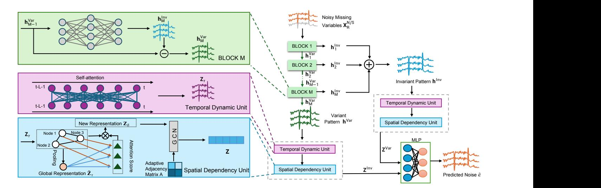
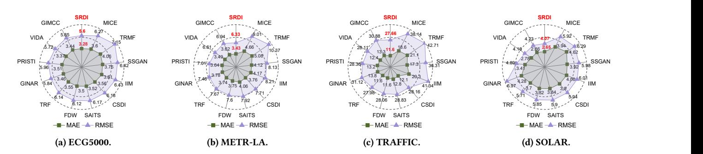
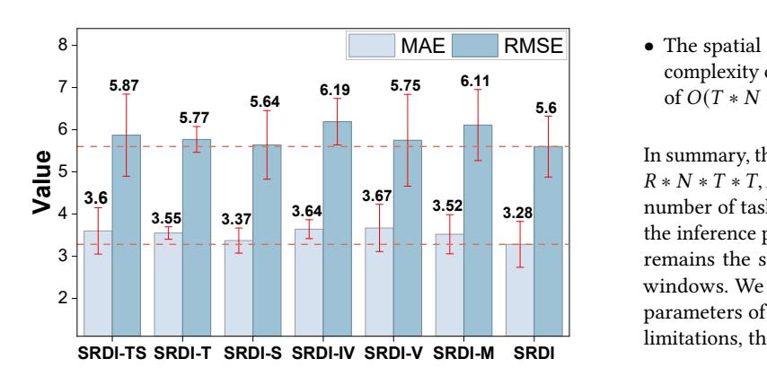
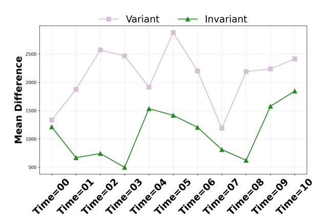
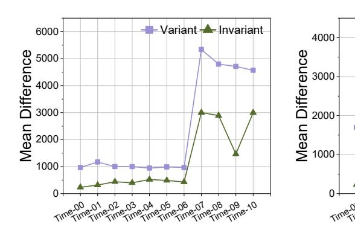
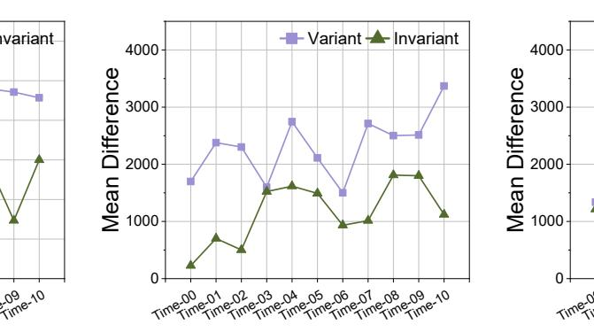
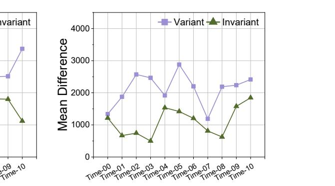

# Shift-Resilient Diffusive Imputation for Variable Subset Forecasting

[Haihua Xu](https://orcid.org/0009-0006-4112-7931)∗ yc37901@um.edu.mo SKL-IOTSC, Department of CIS, University of Macau Macau SAR, Macau

[Qi Hao](https://orcid.org/0009-0005-7173-6722)∗ asteriaqq.xin@connect.um.edu.mo SKL-IOTSC, Department of CIS, University of Macau Macau SAR, Macau

[He Zhang](https://orcid.org/0009-0005-9811-9986) hzhang185@nenu.edu.cn Information Science and Technology, Northeast Normal University Changchun, Jilin, China

[Jianpeng Zhao](https://orcid.org/0000-0001-9907-2028) zhaojianpengcs@gmail.com SKL-IOTSC, Department of CIS, University of Macau Macau SAR, Macau

[Ziyue Qiao](https://orcid.org/0000-0002-9485-4861) zyqiao@gbu.edu.cn School of Computing and Information Technology, Great Bay University Dongguan, Guangdong, China

[Lu Jiang](https://orcid.org/0000-0003-4529-8114) jiangl761@dlmu.edu.cn Information Science Technology, Dalian Maritime University Dalian, Liaoning, China

[Pengfei Wang](https://orcid.org/0000-0003-1075-0684) pfwang@cnic.cn Computer Network Information Center, Chinese Academy of Sciences Beijing, China

[Yingjie Zhou](https://orcid.org/0000-0002-1129-0213) yjzhou09@gmail.com College of Computer Science, Sichuan University Chengdu, Sichuan, China

[Pengyang Wang](https://orcid.org/0000-0003-3961-5523)† pywang@um.edu.mo SKL-IOTSC, Department of CIS, University of Macau Macau SAR, Macau

## Abstract

As an important task in modern web technologies, multivariate time series forecasting drives many core functionalities. However, in realistic web-scale environments, sensor failures, privacy filtering, sampling, and instrumentation churn frequently yield missing variables, making training sets complete while test sets contain only a small subset of variables. The challenge lies in utilizing incomplete data for forecasting, which is known as Variable Subset Forecasting (VSF). Distribution shift is inherent to time series and remains in VSF, including inter-series shift as changes in crossseries correlations and intra-series shift as substantial distribution differences within the same series across different time windows. Existing VSF approaches typically impute missing variables and then forecast on the completed series, yet they overlook these shifts and thus underperform in realistic web-scale scenarios. To address these challenges, we propose Shift Resilient Diffusive Imputation (SRDI), a framework tailored to VSF and robust to distribution shift. Specifically, SRDI integrates a divide-conquer strategy with the denoising process, which decomposes the input into invariant patterns and variant patterns, representing the temporally stable parts of inter-series correlation and the highly fluctuating parts, respectively. By extracting spatiotemporal features from each part separately and then appropriately combining them, inter-series shift can be effectively mitigated. Then, we innovatively organize SRDI and the forecasting model into a meta-learning paradigm

∗Both authors contributed equally to this research.

†Corresponding author.

[This work is licensed under a Creative Commons Attribution 4.0 International License.](https://creativecommons.org/licenses/by/4.0) WWW '26, Dubai, United Arab Emirates

© 2026 Copyright held by the owner/author(s). ACM ISBN 979-8-4007-2307-0/2026/04 <https://doi.org/10.1145/3774904.3792511>

tailored for VSF scenarios. We address the intra-series shift by treating time windows as tasks during training and employing an adaptation process before testing, which naturally supports robust forecasting in dynamic web environments. Extensive experiments on four datasets have demonstrated our superior performance compared with state-of-the-art methods. Our code is available at [https://github.com/xhhmacau/SRDI.](https://github.com/xhhmacau/SRDI)

## CCS Concepts

• Information systems → Data streaming; Data mining; • Computing methodologies → Supervised learning by regression.

## Keywords

Variable Subset Forecasting, Distribution Shift, Data Mining

#### ACM Reference Format:

Haihua Xu, Qi Hao, He Zhang, Jianpeng Zhao, Ziyue Qiao, Lu Jiang, Pengfei Wang, Yingjie Zhou, and Pengyang Wang. 2026. Shift-Resilient Diffusive Imputation for Variable Subset Forecasting. In Proceedings of the ACM Web Conference 2026 (WWW '26), April 13–17, 2026, Dubai, United Arab Emirates. ACM, New York, NY, USA, [12](#page-11-0) pages.<https://doi.org/10.1145/3774904.3792511>

## 1 Introduction

In modern web technologies, multivariate time series forecasting supports core functionalities such as climate [\[1\]](#page-8-0), energy [\[5\]](#page-8-1) and finance [\[38\]](#page-8-2). However, real-world web-scale deployments frequently encounter missing variables due to sensor malfunctions [\[6\]](#page-8-3), privacy filtering [\[10\]](#page-8-4), sampling [\[3\]](#page-8-5), and instrumentation churn [\[23\]](#page-8-6), which complicate predictive modeling and impair forecasting performance in production. A particularly challenging case arises when entire data sequences are absent, for example owing to sensor damage caused by extreme weather or transient outages in service telemetry. This scenario, known as Variable Subset Forecasting (VSF) [\[7\]](#page-8-7), requires making predictions with only a subset of the variables used

during training, posing significant challenges for achieving accurate forecasts. The main challenge of VSF lies in the fact that, during inference, only a small subset of variables is available, which restricts the exploitation of inter-variable dependencies and makes it difficult to maintain performance relative to fully observed settings.

One of the most intuitive solutions is to impute the missing variables before making predictions and numerous imputation methods have been proposed. Forecast Distance Weighting (FDW) [\[7\]](#page-8-7) leverages historical similar time steps and weighted aggregation to impute missing variables, and its effectiveness relies on the assumption that inter-variable neighbor relationships or dependency patterns remain relatively stable over time. Time-series Reconstruction Flows (TRF) [\[15\]](#page-8-8) reconstruct missing variables by modeling their conditional distribution given observed variables, and its effectiveness relies on the assumption that these conditional relationships remain stable between training and inference. Variable Subset Imputation via Domain Adaptation (VIDA) [\[19\]](#page-8-9) imputes missing variables by transferring knowledge from fully observed domains, and its effectiveness relies on the assumption that the transferred knowledge is consistent with the current domain. Generative Imputation with Multi-level Causal Consistency (GIMCC) [\[13\]](#page-8-10) imputes missing variables using a generative model guided by multi-level causal consistency constraints, and its effectiveness relies on the assumption that inter-variable causal relationships remain consistent between training and inference. Although many effective methods have been proposed for VSF task, they generally do not account for the fact that real-world time series often exhibit distribution shift [\[33\]](#page-8-11), which may prevent these methods from performing optimally under practical, non-ideal conditions.

Distribution shift, reflected in changing statistics over time and evolving inter-variable relationships [\[33\]](#page-8-11), poses a significant challenge for VSF tasks by severely impacting model performance. Specifically, we categorize the distribution shift encountered in VSF into two main types: (i) Inter-Series Shift: In VSF scenarios, the absence of variables disrupts the ability to accurately capture relationships between variables. Additionally, the correlations between variables may change over time, leading to systemic inaccuracies in learning these relationships [\[29\]](#page-8-12). This variability significantly degrades the model's performance as it fails to adapt to shifting inter-variable dynamics. (ii) Intra-Series Shift: Data in time series forecasting tasks is typically segmented into time windows, each with its own distinct distribution [\[11\]](#page-8-13). These distributions may change abruptly over time, rendering the model trained on past data ineffective for new, unseen distributions. This intra-series shift poses a substantial challenge to the imputation model's generalization ability across varying data distributions. Given these two types of shift, existing imputation methods prove inadequate for sustaining robust performance in VSF task. Our objective is to develop a robust imputation model that effectively handles both inter-series and intra-series shift, ensuring satisfying performance for VSF. To tackle these challenges, we propose a Shift-Resilient Diffusive Imputation (SRDI) framework for VSF, with tailored solutions for the two types of shift.

To effectively manage inter-series shift in VSF, our approach integrates a Divide-Conquer strategy during the denoising process in the diffusive imputation, decomposing time series data into invariant and variant patterns. The fundamental premise of this

decomposition is to facilitate the specialized learning and processing of heterogeneous data characteristics, leading to enhanced robustness against distribution shift. The invariant pattern captures stable, underlying correlations, providing a robust foundation for the model. In contrast, the variant pattern addresses the dynamic correlations that are susceptible to shift. By processing these distinct patterns separately and subsequently recombining them, our model effectively isolates and compensates for variability induced by inter-series shift.

For intra-series shift, which occurs due to abrupt changes in data distribution within the same series over different time windows, we employ a meta-learning strategy within our diffusive imputation framework. This strategy trains the model to rapidly adapt to new distributions by treating imputation over each time window as a distinct task. Meta-learning enables the diffusive imputation framework to learn from a variety of distribution scenarios, enhancing its flexibility and generalization capability. By continuously updating its parameters in response to new data characteristics, the model is equipped to handle previously unseen distributions effectively.

Our contributions can be summarized as:

- We introduce a novel diffusive imputation method specifically designed for Variable Subset Forecasting (VSF) tasks, marking the first known application in this context.
- We are the first to consider distribution shift in VSF tasks, addressing it with a divide-and-conquer denoising model for inter-series shift and a meta-learning strategy for intra-series shift.
- We validate our approach through extensive experimentation on four real-world datasets, demonstrating consistent superiority in effectiveness compared with existing state-of-the-art methods tailored to VSF tasks.

## 2 Related Work

## 2.1 Missing Data Patterns

Missing data patterns are categorized into three types: Missing Completely at Random (MCAR), Missing at Random (MAR), and Missing Not at Random (MNAR) [\[28\]](#page-8-14). MCAR indicates missingness entirely independent of observed and unobserved data. MAR depends on observed data but not unobserved data. MNAR, the most complex, depends on unobserved data itself [\[28\]](#page-8-14). In the VSF task, the missing mechanism is MCAR, meaning missing variables are entirely unpredictable [\[7\]](#page-8-7). Note that missing data and distribution shift are distinct concepts. Distribution shift is a widespread phenomenon, occurring regardless of missing data presence [\[18\]](#page-8-15).

## 2.2 Time Series Imputation

Time series imputation technologies fill missing data in series and can be categorized into simple and machine learning-based methods [\[22\]](#page-8-16). Early research primarily utilized statistical methods [\[2,](#page-8-17) [8,](#page-8-18) [17\]](#page-8-19) for missing data imputation, however, these approaches were soon surpassed by machine learning-based techniques, such as K-Nearest Neighbors [\[24\]](#page-8-20), SSGAN [\[25\]](#page-8-21), and SAITS [\[9\]](#page-8-22). Traditional time series imputation methods focus on missing points but neglect entire series missingness, a gap highlighted by the VSF task [\[7\]](#page-8-7), which demands robust solutions for disrupted inter-series relationships. FDW [\[7\]](#page-8-7) has shown strong VSF performance. However, these methods overlook the distribution shift challenges inherent in time

Figure 1: Framework overview. The input variable subset is residually decomposed into invariant and variant patterns, each independently capturing temporal features via self-attention and spatial correlations through global-local attention and an adaptive GCN. The two outputs are then aggregated to produce the final output.

to the well-trained denoising function, ��Φ, to derive the conditional probability ��Φ(X �� /�� 0 |X �� /�� 1 , X �� ), i.e., ��Φ(X �� /�� |X �� /�� 1 , X �� ) according to Equation [3.](#page-2-0) Finally, the imputed data X �� /�� can be derived by sampling from ��Φ(X �� /�� |X �� /�� 1 , X �� ), i.e., X �� /�� ∼ ��Φ(X �� /�� |X �� /�� 1 , X ).

It is evident that the success of the diffusion model in imputation depends on the rational design of the denoise function [\[20,](#page-8-26) [30\]](#page-8-25). Therefore, we design the denoising function in a divide-conquer manner to facilitate the diffusive imputation model with the capability of addressing the inter-series shift. Specifically, we decompose the complicated and nested parts into the invariant pattern (parts with relatively stable inter-variable correlations) and the variant pattern (parts with inter-variable correlation changes). By learning spatiotemporal characteristics separately for these components and then integrating them, we can effectively mitigate the interference of inter-series shift, thereby enhancing the performance of the variable imputation. We introduce the detailed design of the divide-conquer denoising function in the following section.

### 4.2 Divide-Conquer Denoising

4.2.1 Disentangling Invariant-Variant Patterns. We introduce the Invariant-variant Dispatcher for disentangling invariant and variant patterns. The dispatcher is composed of �� blocks [\[27\]](#page-8-27), and blocks are stacked and collaboratively contribute to disentangling invariant and variant patterns. For a general description, we take the��-th block for illustration. Formally, let h Var ��−1 denote the learned variant patterns from the (�� − 1)-th block. The ��-th block takes the variant patterns h Var ��−1 as input, and further refines it into more specific invariant patterns h Inv �� and variant patterns h Var �� . Thus, the ��-th block can be represented as

h Inv �� = MLP�� (h Var ��−1 ), h Var �� = h Var ��−1 − h Inv �� , (7)

where MLP�� denotes the multi-layer perceptron at the ��-th block, and h Var ��−1 and h Var �� are of the same size. We set the input of the first block as the noisy missing variables X �� /�� .

To ensure MLP�� indeed learns the invariant patterns, we constrain the correlation disparity between the consecutive time steps to be as small as possible. Let C�� and C��+1 denote the correlation matrix of h Inv �� at the time step �� and �� + 1, respectively. Then, we implement the constraint by minimizing the following loss function

L disp �� = ��∑︁−1 ��=1 ||C��+1 − C�� ||2 2 . (8)

Due to the page limitation, we introduce the calculation of the correlation matrix C�� in Appendix [A.7.](#page-10-0)

Then, we accumulate the invariant patterns from all �� blocks as the final invariant patterns h Inv, and take the derived variant patterns from the last block as the final variant patterns h Var:

h Inv = ∑︁�� ��=1 h Inv �� , h Var = h Var �� . (9)

Additionally, for the entire dispatcher, we accumulate all the correlation disparity loss functions to serve as regularization, ensuring invariant pattern learning:

L disp = ∑︁�� ��=1 L disp �� . (10)

Through the continual refinement and collaboration by the ��-block dispatcher, the generated invariant patterns and variant patterns can be effectively disentangled.

4.2.2 Preserving Spatiotemporal Characteristics. After disentangling invariant and variant patterns, we proceed to capture the

spatiotemporal characteristics of each branch. Specifically, we develop the Temporal-Spatial Representation (TSR) Module, which consists of the Temporal Dynamic Unit and the Spatial Dependency Unit. The invariant and variant patterns exploit the same TSR module architecture but learn the parameters separately. To avoid redundancy, we represent the disentangled pattern as h and omit the subscripts "Inv" and "Var" in the following description.

Temporal Dynamic Unit. We exploit self-attention to encode temporal dynamics at each time step, yielding the temporally-learned representation Z�� as input for the Spatial Dependency Unit.

Z�� = SoftMax( W (h)W�� (h) √ ���� )W�� (h), (11)

where ���� denotes the hidden dimension; W , W�� , and W�� represent the learnable weight matrix corresponding to the query, key, and value, respectively.

Spatial Dependency Unit. We formulate the dependencies between variables from a graph perspective, where each node represents a variable, edges encode inter-variable relationships, and the temporal representations Z�� serve as initial node features. For a unified representation in the spatial scope, we first calibrate node representations through a global-local attention mechanism. Specifically, we perform a graph pooling operation on Z�� ∈ R �� ×�� to obtain Z˜ �� ∈ R �� ×1 , which represents a global representation encapsulating information from all variables:

Z˜ �� = Pooling(Z�� ). (12)

Then, we calculate the attention scores between the global representation Z˜ �� and each node in Z�� . These global-local attention scores are used to calibrate the representation as:

Z�� = SoftMax( W (Z˜ �� )W�� �� (Z�� ) √︁ ���� )W�� �� (Z�� ), (13)

where ���� denotes the hidden dimension; W �� , W�� �� , and W�� �� represent the learnable weight matrix corresponding to the query, key, and value, respectively.

Moreover, we employ an adaptive Graph Convolutional Network (GCN) [\[4\]](#page-8-28) to learn spatial dependencies. We first initialize a learnable embedding E ∈ R �� ×���� , with ���� hidden dimension, to reconstruct an adaptive adjacency matrix A:

A = SoftMax(ReLU(EE�� )). (14)

The spatiotemporal representations Z can be calculated with the message passing mechanism [\[39\]](#page-8-29):

Z = AZ��W, (15)

where W denotes the learnable weight matrix. We follow the same pipeline to generate the invariant pattern representations Z Inv and the variant pattern representations Z Var .

4.2.3 Fusing Noise Prediction. After separately learning the representations of invariant and variant patterns, we concatenate Z Inv and Z Var for the final noise prediction

��ˆ = MLP(Z Inv || Z Var), (16)

where ��ˆ denotes the predicted noise, represented as

��ˆ = ��Φ(X �� /�� �� , X �� , ��). (17)

We substitute Equation [16](#page-4-0) and Equation [17](#page-4-1) to Equation [6](#page-2-1) for calculating the diffusion loss Ldiff .

Therefore, considering the invariant-variant disentanglement, the Divide-Conquer Denoising (DCD) loss can be represented as

L DCD = L diff + �� · Ldisp , (18)

where �� is a hyperparameter to control the contribution of Ldisp.

### 5 Meta Learning Strategy Against Intra-Series Shift

In this section, we introduce a meta-learning strategy to mitigate the intra-series shift. We divide the time series into multiple windows, treating each window as a separate task. By the inner-outer loop of training the model parameters across these different tasks, we aim to ensure that the trained model can effectively adapt to tasks across different time windows, thereby addressing intra-series shift. Specifically, the proposed meta-learning strategy mainly includes two stages: Stage 1, the meta training stage: we optimize the initial parameters through the learning of multiple diffusion models followed by a forecasting backbone, enabling rapid adaptation to the inference phase. Stage 2, the meta adaptation stage: we use the variable subset in the inference phase to quickly adjust the initial meta-model parameters, enabling it to adapt to and address the VSF task. Next, we introduce the two stages in detail.

#### Algorithm 1 Meta Training Stage

Require: ��(��): distribution over windows(tasks)

Require: ��,�� :learning rate

1: randomly initialize Θ, Φ 2: while not done do 3: Sample batch of tasks �� ∼ ��(��) 4: for all �� do 5: Evaluate ∇ΦLDCD �� with respect to �� examples 6: Compute adapted parameters of diffusion model with gradient descent and update: Φ�� ← Φ − �� · ∇ΦLDCD �� 7: Do inference and compute the forecasting loss Lfcst �� 8: end for 9: Jointly update the diffusion model and forecasting model Φ ← Φ −�� · ∇Φ Í �� ∈K(LDCD �� + Lfcst �� ) ; Θ ← Θ −�� · ∇Θ Í �� ∈K Lfcst �� 10: end while

#### 5.1 Meta Training Stage

The meta training stage is divided into two parts: the inner loop and the outer loop, which are responsible for rapid adaptation and global optimization of the model, respectively. The full algorithm is outlined in Algorithm [1.](#page-4-2)

Inner Loop. We take imputation and forecasting for each �� length time window as a task. Specifically, for the ��-th task, the corresponding parameters set and the denoising loss can be denoted as �� and LDCD �� respectively. Then, the parameter update is represented as

Φ�� ← Φ − �� · ∇ΦL DCD �� , (19)

where �� is the learning rate. We iterate over all tasks to update the diffusive imputation model and forecasting model for each respective task.

Outer Loop. For each task, we leverage the updated diffusive imputation model to generate the missing data, and apply the imputed data to train a forecasting model. Note that all the imputation tasks share the same forecasting model. Let Lfcst �� denote the forecasting loss on the ��-th imputed data. Then, we update the meta-model for the diffusive imputation and forecasting model simultaneously as

Φ ← Φ −�� · ∇Φ ∑︁ �� ∈K (LDCD �� + Lfcst �� ), (20)

Θ ← Θ −�� · ∇Θ ∑︁ �� ∈K L fcst �� , (21)

where �� is the learning rate.

#### 5.2 Meta Adaptation Stage

5.2.1 Fine-tuning. Given a new variable subset, we aim to apply the trained imputation model and forecasting model for inference. Considering the new variable subset as a new task, we will first conduct fine-tuning for the trained diffusive imputation model following the convention of the meta learning paradigm. In other words, the imputation model needs multiple training iterations on the new subset. Unfortunately, due to the existence of missing variables, where the ground truth is unavailable, it is impractical to re-conduct the original training pipeline. To address the issue, we temporarily ignore the missing variables, but randomly select pseudo-missing variables from the available subset. We will take the newly selected pseudo-missing variables as the imputation target (with ground truth), and re-launch the inner-loop training pipeline indicated in Equation [19.](#page-4-3) During the process, the forecasting model is fixed and no longer updated.

5.2.2 Inference. After fine-tuning, we shift the focus to the real missing variables as the target and the original available subset as the condition. We then apply the fine-tuned diffusive imputation model to impute the missing variables. This process is described by Equation [3,](#page-2-0) where the denoise function is known, allowing us to obtain the final imputed data. Next, the imputed data is fed into the forecasting model to generate the final predicted values.

### 6 Experiments

## 6.1 Experimental Setup

Datasets. We conducted experiments on four datasets: 1) METR-LA: traffic speed from 207 Los Angeles highway sensors; 2) SOLAR: solar power from 137 Alabama plants; 3) TRAFFIC: occupancy rates from 862 San Francisco Bay area sensors; and 4) ECG5000: 140 electrocardiograms from the UCR Archive. For more details about these datasets, please refer to Appendix [A.5.](#page-10-1)

Time Series Forecasting Model Backbone Setting. For fair comparison, we follow the same setting as the literature [\[14,](#page-8-30) [19\]](#page-8-9) to select the following forecasting models as backbones: MTGNN [\[32\]](#page-8-31), ASTGCN [\[12\]](#page-8-32), MSTGCN [\[16\]](#page-8-33) , and T-GCN [\[40\]](#page-8-34). For a detailed description of the backbones, please refer to Appendix [A.3.](#page-9-0) In the VSF setting, where the training data is fully observed but the test data is only partially available, we address missing values by applying

data imputation prior to forecasting. To validate the effectiveness of our model, we consider the following two scenarios: 1) missing: Prediction relies solely on �� variables without imputation, reflecting the model's inherent performance in VSF task. 2) w/o missing: An idealized scenario where all �� variables are known.

Evaluation Metrics. We assess the performance using two commonly employed metrics in multivariate time series forecasting: Mean Absolute Error (MAE) and Root Mean Squared Error (RMSE). To demonstrate the improvement of our model in the variable missing setting, we calculated the improvement ratio ����������������. For detailed information of the metrics, please refer to [A.2.](#page-9-1)

Implementation. We used PyTorch to implement our model and baselines, evaluating them on a Linux server with a single GPU. Following the previous work [\[7\]](#page-8-7), we randomly selected 15% of the variables to form subset ��. Both the lookback and horizon window lengths were 12. The dataset was split into training, validation, and testing sets in a 7:1:2 ratio. For further details on implementation details and hyperparameter settings, please refer to Appendix [A.8.](#page-10-2)

#### 6.2 Overall Performance

Comparison with missing & w/o missing scenarios. Table [1](#page-6-0) presents the experimental results of our model using four different backbones across four datasets. The results show that, in the missing scenario, our model achieved average MAE improvements of 20.62%, 12.38%, 32.75%, and 18.87% on the METR-LA, TRAFFIC, SOLAR, and ECG5000 datasets, respectively, demonstrating the effectiveness of SRDI. In addition, our model outperforms the scenario without missing in some cases due to our strategy of jointly training imputation model and forecasting model, while addressing the issue of distribution shift in the VSF task. Due to space constraints, a detailed explanation of the reasons for outperforming the scenario without missing is provided in Appendix [C.1](#page-11-1) . Furthermore, to demonstrate that our training strategy does not involve potential fairness issues, we provide a detailed discussion in Appendix [C.2.](#page-11-2) Comparison with Imputation Methods. To validate the reliability of the proposed SRDI method, we conducted a comparative analysis with several state-of-the-art imputation models known for their excellent performance: MICE [\[31\]](#page-8-35), IIM [\[37\]](#page-8-36), TRMF [\[36\]](#page-8-37), CSDI [\[30\]](#page-8-25), FDW [\[7\]](#page-8-7), SSGAN [\[25\]](#page-8-21), TRF [\[15\]](#page-8-8), PRISTI [\[20\]](#page-8-26), GINAR [\[35\]](#page-8-38), SAITS [\[9\]](#page-8-22), VIDA [\[19\]](#page-8-9), and GIMCC [\[13\]](#page-8-10). More information regarding the baselines can be found in Appendix [A.4.](#page-9-2) Due to space limitations, we only present the experimental results with MGTNN as the backbone. As shown in Figure [2,](#page-6-1) our model achieves the best performance. These results underscore current imputation methods' limitations in tackling the complete-missing variable problem for the VSF task. Conversely, SRDI adeptly handles distribution shift issues in missing variable scenarios, achieving superior performance.

## 6.3 Ablation Studies

To verify the efficacy of each model component, we conducted ablation experiments. Due to space constraints, we only show results for the ECG5000 dataset here.

6.3.1 Spatial and Temporal Characteristics Preservation. To validate the effectiveness of our innovations in the extraction of spatiotemporal features, we designed the following experiments: 1) SRDI-TS:

Table 1: Comparison with missing and w/o missing scenarios regarding different backbones.

Figure 2: Comparison of imputation model performance across four datasets.

This configuration removes the Temporal Relation Extraction Module and the Global-Local Attention Adaptive GCN, replacing them with a linear layer. 2) SRDI-T: This setup removes the Temporal Relation Extraction Module, focusing solely on learning spatial features. 3) SRDI-S: In this version, the Global-Local Attention Adaptive GCN is removed, concentrating only on learning temporal features. The experimental results presented in Figure [3](#page-7-0) indicate that SRDI-T, SRDI-S, and SRDI-ST all perform worse than SRDI, leading to the conclusion that extracting spatio-temporal features from time series is critical for missing variable imputation.

6.3.2 The Rationale and Utilization of Invariant and Variant Patterns. To validate the effectiveness of our innovation in decomposing time series into invariant and variant patterns, we designed the following ablation experiments: 1) SRDI-IV: This configuration eliminates the Series Invariant-Variant Dispatcher component, directly feeding the input into the Temporal Relation Extraction Module. 2) SRDI-V: This configuration excludes the influence of the variant pattern, utilizing only the invariant pattern for the denoising process. Figure [3](#page-7-0) shows SRDI-IV underperforms relative to SRDI, confirming the effectiveness of separately imputing invariant and variant time series patterns due to their distinct dynamics. SRDI-V's worse performance than SRDI indicates the variant pattern holds irreplaceable information. We performed visualization experiments to confirm the dispatcher's ability to decompose time series into invariant and variant patterns.

6.3.3 Meta-learning Strategy Against Intra-series Shift. To demonstrate the effectiveness of our innovation in addressing intra-series shift using the meta-learning framework, we designed the following ablation experiment: SRDI-M: We removed the inner and outer loop training structure of meta-learning, reorganized them into a pipeline process, and eliminated adaptation during the testing phase. Figure [3](#page-7-0) indicates that SRDI-M underperforms compared to SRDI,

3.67 3.52 3.28 In summary, the overall time complexity of our model is��(max(�� ∗ �� ∗ �� ∗ �� ∗ �� , �� ∗ �� ∗ �� ∗ �� ∗ �� )) . During the training phase, the number of tasks �� is equal to the number of training windows. In the inference phase, due to the need for adaptation, the complexity remains the same, with �� replaced by the number of inference windows. We compared the training speed, inference speed and parameters of several classical imputation methods. Due to space limitations, the results are provided in the Appendix [B.1.](#page-10-3)

- 6.19 5.75 6.11 5.6 MAE RMSE
  - The spatial dependency unit uses global-local attention, with a complexity of ��(�� ∗�� ), and an adaptive GCN, with a complexity of ��(�� ∗ �� ∗ ��).

Figure 3: Performance comparison between SRDI and its various model variants on the ECG5000 dataset.

Figure 4: Comparison of inter-series correlation fluctuations between invariant and variant patterns on the ECG5000 dataset.

highlighting the effectiveness of our meta-learning framework in addressing intra-series shift and enhancing accuracy.

## 6.4 Time Complexity Analysis

In the framework of meta-learning, we consider �� tasks, with each task involving one execution of the diffusion model and the forecasting model. The forecasting model serves as our backbone and is freely selectable. Therefore, when analyzing algorithmic complexity, we focus solely on our proposed model and exclude the forecasting model from consideration.

- For the diffusion model, the time complexity of the forward process is ��(��) , where �� represents the number of diffusion steps. The backward process primarily depends on the design of our denoising model.
- Disentangling invariant-variant patterns requires computing a relationship matrix for each time step, resulting in a complexity of ��(�� ∗ �� ∗ ��) , where �� is the length of a time window, and �� is the number of variables.
- The temporal dynamic unit employs self-attention, with a time complexity of ��(�� ∗ �� ∗ �� ).

#### 6.5 Analysis of the Effect of Decoupling Time Series into Invariant and Variant Patterns

To verify the effectiveness of the Series Invariant-Variant Dispatcher in distinguishing invariant from variant patterns, we conducted a visualization experiment. We computed adjacency matrices for both patterns at each time point, and for all but the first, calculated the difference between the current and previous matrices to capture inter-series correlation changes. To reduce randomness, we selected 10 samples, averaged the results, and plotted the differences as line graphs (Figure [4\)](#page-7-0). The variant pattern showed more significant fluctuations, confirming the dispatcher's ability to distinguish between patterns. Due to space limitation, the experiments were conducted only on the ECG5000 dataset using only the MTGNN as the backbone.

## 7 Conclusion

In this paper, we propose the Shift-Resilient Diffusive Imputation (SRDI) model to address the challenge of distribution shift in variable subset forecasting task, achieving promising results. Specifically, we classify distribution shift in VSF into two types: inter-series shift and intra-series shift. To tackle these challenges, SRDI introduces a diffusion-based imputation framework that integrates two complementary strategies. A divide-and-conquer strategy is employed to decompose time series into invariant and variant patterns, effectively isolating stable and dynamic components to enhance robustness against inter-series shift. For intra-series shift, we incorporate a meta-learning strategy that enables fast adaptation to varying temporal distributions, treating imputation in each time window as a separate task to improve generalization. Extensive experiments on four real-world datasets demonstrate that SRDI outperforms state-of-the-art methods, highlighting its effectiveness in addressing the distribution shift challenge in VSF tasks.

## Acknowledgments

This research is funded by the Science and Technology Development Fund (FDCT), Macau SAR (file no. 0123/2023/RIA2, 001/2024/SKL), the Multi-Year Research Grant of University of Macau (File no. MYRG-GRG2025-00241-IOTSC), the National Natural Science Foundation of China (No. 62406056, 62171302), and the Guangdong Basic and Applied Basic Research Foundation (No. 2024A1515140114).

#### References

- [1] 2023. Accurate medium-range global weather forecasting with 3D neural networks. Nature (2023). [doi:10.1038/s41586-023-06185-7](https://doi.org/10.1038/s41586-023-06185-7) Also known as Pangu-Weather. [2] Edgar Acuna and Caroline Rodriguez. 2004. The treatment of missing values and its effect on classifier accuracy. In Classification, Clustering, and Data Mining Applications: Proceedings of the Meeting of the International Federation of Classification Societies (IFCS), Illinois Institute of Technology, Chicago, 15–18 July 2004. Springer, 639–647. [3] Colin Adams, Luis Alonso, Benjamin Atkin, John Banning, Sumeer Bhola, Rick Buskens, Ming Chen, Xi Chen, Yoo Chung, Qin Jia, et al. 2020. Monarch: Google's planet-scale in-memory time series database. Proceedings of the VLDB Endowment 13, 12 (2020), 3181–3194. [4] LEI BAI, Lina Yao, Can Li, Xianzhi Wang, and Can Wang. 2020. Adaptive Graph Convolutional Recurrent Network for Traffic Forecasting. In Advances in Neural Information Processing Systems, H. Larochelle, M. Ranzato, R. Hadsell, M.F. Balcan, and H. Lin (Eds.), Vol. 33. Curran Associates, Inc., 17804–17815. [https://proceedings.neurips.cc/paper\\_files/paper/2020/file/](https://proceedings.neurips.cc/paper_files/paper/2020/file/ce1aad92b939420fc17005e5461e6f48-Paper.pdf) [ce1aad92b939420fc17005e5461e6f48-Paper.pdf](https://proceedings.neurips.cc/paper_files/paper/2020/file/ce1aad92b939420fc17005e5461e6f48-Paper.pdf) [5] Oussama Boussif, Ghait Boukachab, Dan Assouline, Stefano Massaroli, Tianle Yuan, Loubna Benabbou, and Yoshua Bengio. 2023. Improving\* day-ahead\* solar irradiance time series forecasting by leveraging spatio-temporal context. Advances in Neural Information Processing Systems 36 (2023), 2342–2367. [6] Wei Cao, Dong Wang, Jian Li, Hao Zhou, Lei Li, and Yitan Li. 2018. Brits: Bidirectional recurrent imputation for time series. Advances in neural information processing systems 31 (2018). [7] Jatin Chauhan, Aravindan Raghuveer, Rishi Saket, Jay Nandy, and Balaraman Ravindran. 2022. Multi-Variate Time Series Forecasting on Variable Subsets. In Proceedings of the 28th ACM SIGKDD Conference on Knowledge Discovery and Data Mining. 76–86. [8] A Rogier T Donders, Geert JMG Van Der Heijden, Theo Stijnen, and Karel GM Moons. 2006. A gentle introduction to imputation of missing values. Journal of clinical epidemiology 59, 10 (2006), 1087–1091. [9] Wenjie Du, David Côté, and Yan Liu. 2023. Saits: Self-attention-based imputation for time series. Expert Systems with Applications 219 (2023), 119619. [10] Úlfar Erlingsson, Vasyl Pihur, and Aleksandra Korolova. 2014. Rappor: Randomized aggregatable privacy-preserving ordinal response. In Proceedings of the 2014 ACM SIGSAC conference on computer and communications security. 1054–1067. [11] Wei Fan, Pengyang Wang, Dongkun Wang, Dongjie Wang, Yuanchun Zhou, and Yanjie Fu. 2023. Dish-ts: a general paradigm for alleviating distribution shift in time series forecasting. In Proceedings of the AAAI conference on artificial intelligence, Vol. 37. 7522–7529. [12] Shengnan Guo, Youfang Lin, Ning Feng, Chao Song, and Huaiyu Wan. 2019. Attention based spatial-temporal graph convolutional networks for traffic flow forecasting. In Proceedings of the AAAI conference on artificial intelligence, Vol. 33. 922–929. [13] Qi Hao, Yue Gao, Runchang Liang, Yunhe Zhang, and Pengyang Wang. 2025. Generative Imputation with Multi-level Causal Consistency for Variable Subset Forecasting (KDD '25). Association for Computing Machinery, New York, NY, USA, 838–849. [doi:10.1145/3711896.3736980](https://doi.org/10.1145/3711896.3736980) [14] Qi Hao, Runchang Liang, Yue Gao, Hao Dong, Wei Fan, Lu Jiang, and Pengyang Wang. 2024. Is Precise Recovery Necessary? A Task-Oriented Imputation Approach for Time Series Forecasting on Variable Subset. arXiv preprint arXiv:2411.09928 (2024). [15] Xuanming Hu, Wei Fan, Haifeng Chen, Pengyang Wang, and Yanjie Fu. 2024. Reconstructing Missing Variables for Multivariate Time Series Forecasting via Conditional Generative Flows. (2024). [16] Ziyu Jia, Youfang Lin, Jing Wang, Xiaojun Ning, Yuanlai He, Ronghao Zhou, Yuhan Zhou, and H Lehman Li-wei. 2021. Multi-view spatial-temporal graph convolutional networks with domain generalization for sleep stage classification. IEEE Transactions on Neural Systems and Rehabilitation Engineering 29 (2021), 1977–1986. [17] Mehmed Kantardzic. 2011. Data mining: concepts, models, methods, and algorithms. John Wiley & Sons. [18] Pang Wei Koh, Shiori Sagawa, Henrik Marklund, Sang Michael Xie, Marvin Zhang, Akshay Balsubramani, Weihua Hu, Michihiro Yasunaga, Richard Lanas Phillips, Irena Gao, et al. 2021. Wilds: A benchmark of in-the-wild distribution shifts. In International conference on machine learning. PMLR, 5637–5664. [19] Runchang Liang, Qi Hao, Yue Gao, Kunpeng Liu, Lu Jiang, Pengyang Wang, and Minghao Yin. 2025. Imputation via Domain Adaptation: Rethinking Variable Subset Forecasting from Knowledge Transfer (KDD '25). Association for Computing Machinery, New York, NY, USA. [doi:10.1145/3711896.3737007](https://doi.org/10.1145/3711896.3737007) [20] Mingzhe Liu, Han Huang, Hao Feng, Leilei Sun, Bowen Du, and Yanjie Fu. 2023. PriSTI: A Conditional Diffusion Framework for Spatiotemporal Imputation. arXiv preprint arXiv:2302.09746 (2023). [21] Yixin Liu, Thalaiyasingam Ajanthan, Hisham Husain, and Vu Nguyen. 2024. Self-supervision improves diffusion models for tabular data imputation. In Proceedings of the 33rd ACM International Conference on Information and Knowledge Management. 1513–1522. [22] Yonghong Luo, Xiangrui Cai, Ying ZHANG, Jun Xu, and Yuan xiaojie. 2018. Multivariate Time Series Imputation with Generative Adversarial Networks. In Advances in Neural Information Processing Systems, S. Bengio, H. Wallach,
  - H. Larochelle, K. Grauman, N. Cesa-Bianchi, and R. Garnett (Eds.), Vol. 31. Curran Associates, Inc. [https://proceedings.neurips.cc/paper\\_files/paper/2018/file/](https://proceedings.neurips.cc/paper_files/paper/2018/file/96b9bff013acedfb1d140579e2fbeb63-Paper.pdf) [96b9bff013acedfb1d140579e2fbeb63-Paper.pdf](https://proceedings.neurips.cc/paper_files/paper/2018/file/96b9bff013acedfb1d140579e2fbeb63-Paper.pdf) [23] Jonathan Mace, Ryan Roelke, and Rodrigo Fonseca. 2018. Pivot tracing: Dynamic causal monitoring for distributed systems. ACM Transactions on Computer Systems (TOCS) 35, 4 (2018), 1–28. [24] R MATLAB and Statistics Toolbox Release. 2019. The MathWorks, Inc., Natick, Massachusetts, United States. [25] Xiaoye Miao, Yangyang Wu, Jun Wang, Yunjun Gao, Xudong Mao, and Jianwei Yin. 2021. Generative semi-supervised learning for multivariate time series imputation. In Proceedings of the AAAI conference on artificial intelligence, Vol. 35. 8983–8991. [26] Alex Nichol, Joshua Achiam, and John Schulman. 2018. On first-order metalearning algorithms. arXiv preprint arXiv:1803.02999 (2018). [27] Boris N Oreshkin, Dmitri Carpov, Nicolas Chapados, and Yoshua Bengio. 2019. N-BEATS: Neural basis expansion analysis for interpretable time series forecasting. arXiv preprint arXiv:1905.10437 (2019). [28] Donald B Rubin. 1976. Inference and missing data. Biometrika 63, 3 (1976), 581–592. [29] Steffen Schneider, Evgenia Rusak, Luisa Eck, Oliver Bringmann, Wieland Brendel, and Matthias Bethge. 2020. Improving robustness against common corruptions by covariate shift adaptation. In Advances in Neural Information Processing Systems,
  - H. Larochelle, M. Ranzato, R. Hadsell, M.F. Balcan, and H. Lin (Eds.), Vol. 33. Curran Associates, Inc., 11539–11551. [https://proceedings.neurips.cc/paper\\_](https://proceedings.neurips.cc/paper_files/paper/2020/file/85690f81aadc1749175c187784afc9ee-Paper.pdf) [files/paper/2020/file/85690f81aadc1749175c187784afc9ee-Paper.pdf](https://proceedings.neurips.cc/paper_files/paper/2020/file/85690f81aadc1749175c187784afc9ee-Paper.pdf) [30] Yusuke Tashiro, Jiaming Song, Yang Song, and Stefano Ermon. 2021. CSDI: Conditional Score-based Diffusion Models for Probabilistic Time Series Imputation. 34 (2021), 24804–24816. [https://proceedings.neurips.cc/paper\\_files/paper/2021/](https://proceedings.neurips.cc/paper_files/paper/2021/file/cfe8504bda37b575c70ee1a8276f3486-Paper.pdf) [file/cfe8504bda37b575c70ee1a8276f3486-Paper.pdf](https://proceedings.neurips.cc/paper_files/paper/2021/file/cfe8504bda37b575c70ee1a8276f3486-Paper.pdf) [31] Stef Van Buuren and Karin Groothuis-Oudshoorn. 2011. mice: Multivariate imputation by chained equations in R. Journal of statistical software 45 (2011), 1–67. [32] Zonghan Wu, Shirui Pan, Guodong Long, Jing Jiang, Xiaojun Chang, and Chengqi Zhang. 2020. Connecting the dots: Multivariate time series forecasting with graph neural networks. In Proceedings of the 26th ACM SIGKDD international conference on knowledge discovery & data mining. 753–763. [33] Haihua Xu, Wei Fan, Kun Yi, and Pengyang Wang. 2024. Decoupled Invariant Attention Network for Multivariate Time-series Forecasting. In Proceedings of the Thirty-Third International Joint Conference on Artificial Intelligence, IJCAI-24, Kate Larson (Ed.). International Joint Conferences on Artificial Intelligence Organization, 2487–2495. [doi:10.24963/ijcai.2024/275](https://doi.org/10.24963/ijcai.2024/275) Main Track. [34] Yiyuan Yang, Ming Jin, Haomin Wen, Chaoli Zhang, Yuxuan Liang, Lintao Ma, Yi Wang, Chenghao Liu, Bin Yang, Zenglin Xu, Jiang Bian, Shirui Pan, and Qingsong Wen. 2024. A Survey on Diffusion Models for Time Series and Spatio-Temporal Data. arXiv[:2404.18886](https://arxiv.org/abs/2404.18886) [cs.LG]<https://arxiv.org/abs/2404.18886> [35] Chengqing Yu, Fei Wang, Zezhi Shao, Tangwen Qian, Zhao Zhang, Wei Wei, and Yongjun Xu. 2024. GinAR: An End-To-End Multivariate Time Series Forecasting Model Suitable for Variable Missing. arXiv[:2405.11333](https://arxiv.org/abs/2405.11333) [cs.LG] [https://arxiv.org/](https://arxiv.org/abs/2405.11333) [abs/2405.11333](https://arxiv.org/abs/2405.11333) [36] Hsiang-Fu Yu, Nikhil Rao, and Inderjit S Dhillon. 2016. Temporal regularized matrix factorization for high-dimensional time series prediction. Advances in neural information processing systems 29 (2016). [37] Aoqian Zhang, Shaoxu Song, Yu Sun, and Jianmin Wang. 2019. Learning individual models for imputation. In 2019 IEEE 35th International Conference on Data Engineering (ICDE). IEEE, 160–171. [38] Lifan Zhao, Shuming Kong, and Yanyan Shen. 2023. Doubleadapt: A metalearning approach to incremental learning for stock trend forecasting. In Proceedings of the 29th ACM SIGKDD Conference on Knowledge Discovery and Data Mining. 3492–3503. [39] Ling Zhao, Yujiao Song, Chao Zhang, Yu Liu, Pu Wang, Tao Lin, Min Deng, and Haifeng Li. 2020. T-GCN: A Temporal Graph Convolutional Network for Traffic Prediction. IEEE Transactions on Intelligent Transportation Systems 21, 9 (2020), 3848–3858. [doi:10.1109/TITS.2019.2935152](https://doi.org/10.1109/TITS.2019.2935152) [40] Ling Zhao, Yujiao Song, Chao Zhang, Yu Liu, Pu Wang, Tao Lin, Min Deng, and Haifeng Li. 2020. T-GCN: A Temporal Graph Convolutional Network for Traffic Prediction. IEEE Transactions on Intelligent Transportation Systems 21, 9 (Sept. 2020), 3848–3858. [doi:10.1109/tits.2019.2935152](https://doi.org/10.1109/tits.2019.2935152)

## A Details of Experimental Settings

### A.1 Implementation Details

We employed the PyTorch framework to implement our model and baselines, and the models were evaluated on a Linux server with a single GPU. We utilized MAE (Mean Absolute Errors) as the loss function During the testing phase, we only had access to a subset ��. In the main experiment, we selected 15% of the variables to form subset ��. During the training phase, to demonstrate the reliability of our model, we randomly constructed the subset 100 times to cover as much of the dataset as possible, and trained for 100 epochs. We computed the mean and standard deviation of the models, based on the results. Following [\[7\]](#page-8-7), the forecasting horizon length, denoted as ��, was set to 12, and the lookback window length, denoted as ��, was also set to 12. In terms of dataset segmentation, 70% of the samples were allocated for training, 10% for validation, and 20% for testing.

## A.2 Metric Details

This paper employs the metrics of two commonly used evaluation models: MAE (Mean Absolute Error) and RMSE (Root Mean Square Error). Their formulas are as follows:

MAE = 1 |�� | ∑︁ |�� | ��=1 |���� − ��ˆ�� RMSE = vut 1 |�� | ∑︁ |�� | ��=1 (���� − ��ˆ��) 2

where ��ˆ�� and ���� represent the predicted value and the ground truth, respectively, while �� denotes the variable index.

Our model is evaluated in a variable-missing setting. Therefore, we provide the improvement ratio of accuracy under the missing setting, as defined by the following formula:

���������������� = ����missing − ������������ ����missing × 100%

where ���� denotes the error (MAE, RMSE).

### A.3 Backbones

The basic introduction and implementation details of the backbone models we use are shown as follows:

- MTGNN leverages graph learning to capture uni-directional relationships among temporal variables, combining mix-hop propagation, dilated inception, and temporal convolution layers to model spatial-temporal dependencies. We used the same hyperparameters as in the original paper.
- ASTGCN employs spatial-temporal attention and convolution to model dynamic traffic flow patterns, fusing these features to produce final predictions. Hyperparameters were set as in the original paper.
- MSTGCN models spatiotemporal data via multi-scale graph and temporal convolutions, effectively capturing dependencies across time scales, e.g., in traffic flow prediction. Parameters followed the original paper.
- T-GCN combines graph convolutional networks (GCN) with gated recurrent units (GRU) to learn spatial-temporal dependencies. We adopted the original hyperparameter settings.

#### A.4 Baselines

In this paper, we compare the proposed model with 12 existing state-of-the-art imputation models. Below is a detailed introduction to these 12 models:

- MICE imputes missing data via variable-wise conditional densities, iterating efficiently without requiring a joint multivariate distribution.
- IIM uses regression models on complete neighbors to handle sparsity, adaptively selecting neighbors to improve imputation accuracy.
- TRMF applies autoregressive temporal regularization on latent embeddings to capture temporal structure, enabling scalable highdimensional forecasting with missing data.
- CSDI leverages score-based diffusion conditioned on observed data for probabilistic and deterministic imputation, as well as interpolation and forecasting.
- FDW retrieves nearest neighbors based on available variables and uses ensemble weighting to impute missing values, restoring forecast performance without retraining.
- SSGAN combines a generator, discriminator, and classifier with a temporal reminder matrix to impute missing values while preserving data distribution and labels.
- TRF is a flow-based generative framework that reconstructs missing variables via invertible flows and meta-learning, generalizing across different variable subsets without retraining.
- SAITS uses diagonally-masked self-attention blocks with joint optimization to capture temporal-feature dependencies, providing fast, accurate, non-autoregressive imputation.
- PRISTI is a conditional diffusion framework leveraging global spatiotemporal correlations and geographic relations, transforming noise into realistic imputation values.
- GINAR integrates Simple Recursive Units with Interpolation Attention and Adaptive Graph Convolution to restore missing variables and reconstruct spatial dependencies for robust forecasting.
- GIMCC is a generative imputation framework establishing multilevel causal consistency through frequency-domain convolutions and dual DAG isomorphism constraints to preserve invariant causal structures for robust variable subset forecasting.
- VIDA is a domain adaptation framework that transfers timefrequency representations via Sinkhorn-regularized optimal transport and task-driven consistency constraints, enabling imputationfree forecasting under variable absence through global distribution alignment.

Table 2: Detailed description of the datasets.

| Type METR-LA | Variable 207 | Period 2012.3-2012.6 | Time Interval 5 minutes     |
|--------------|--------------|----------------------|-----------------------------|
| SOLAR        | 137          | 2007                 | 10 minutes                  |
| TRAFFIC      | 862          | 2015 and 2016        | 1 hour                      |
| ECG5000      | 140          | 20 hours             | 5000 data randomly selected |

Table 3: Imputation performance Comparison between Stationary and Raw Data

| Dataset | Missing Stationary | timepoints Raw | Missing Stationary | variables Raw |
|---------|--------------------|----------------|--------------------|---------------|
| ECG5000 | 0.101              | 1.033          | 0.726              | 6.276         |
| TRAFFIC | 0.207              | 13.848         | 0.676              | 52.460        |
| SOLAR   | 0.057              | 0.870          | 0.752              | 4.651         |

#### A.5 Datasets

Four commonly used datasets are employed in this paper. A detailed description of each dataset is provided in Table [2.](#page-9-3)

#### A.6 Data Processing

For each dataset, the data is divided into training, validation, and testing sets with a ratio of 7:1:2. The data is then partitioned into fixed-length time windows according to the specified parameters. For 85% of the variables, missing values are replaced with zeros to create a subset, which is used for either training or testing.

#### A.7 Construction of Adjacency Matrix

To express the relationships between variables, we computed an adjacency matrix between the variables. The commonly used cosine similarity was selected as the metric for measuring the correlation. The formula is as follows:

Cosine Similarity(X 1 , X 2 ) = X 1 · X 2 ∥X1 ∥ ∥X2 ∥

where X 1 and X 2 are the time series of two variables. For �� variables, we calculated the correlation for each pair, and the resulting relationship matrix �� ∈ R �� ×�� .

### A.8 Hyperparameter Settings

We used identical hyperparameter settings for the ECG5000, SO-LAR, and METR-LA datasets, while for the TRAFFIC dataset we reduced the diffusion embedding dimension due to its significantly larger number of variables. Specifically, we trained all models for 100 epochs with a batch size of 64, learning rate of 1.0 × 10−3 , �� = 0.0001, 3 blocks, dropout rate of 0.1, 1 layer, 64 channels, and 8 heads. The diffusion process was configured with ��start = 0.001, ��end = 0.5, a quadratic schedule, and non-linear scaling. For embeddings, we set the time embedding dimension to 128, the feature embedding dimension to 16, and adopted the random target strategy. The diffusion embedding dimension was set to 128 for ECG5000, SOLAR, and METR-LA, and 32 for TRAFFIC.

### B Supplementary Experiments

### B.1 Computational Efficiency Analysis

To evaluate the efficiency of the model, we compared SRDI with several classical and lightweight models in terms of efficiency. Specifically, we compared FDW, KNNE, MICE, TRMF, IIM, SSGAN, CSDI, and SAITS, using MTGNN as the backbone, and conducted experiments on the ECG5000 dataset. The experimental results are presented in Table [4.](#page-10-4) Since FDW, KNNE, MICE, TRMF, and IIM are methods used during the inference phase, only the backbone

needs to be trained during the training stage, with the parameter count corresponding solely to the backbone. From the experimental results, it can be observed that although SRDI does not have a significantly larger number of parameters compared to other models, it incurs much longer training times. This is primarily due to the meta-learning architecture, where each time window is treated as a separate task for model training, as opposed to other models that process time windows in batches. This is the fundamental reason behind the prolonged training duration. Our aim is to propose a general methodological framework (MAML) and validate meta-learning's feasibility. In practice, improved versions like FOMAML [\[26\]](#page-8-39), which enhances efficiency by ignoring second-order derivatives and using only first-order ones, can simplify computation. Thus, in real-world scenarios with large-scale data or high real-time demands, one can flexibly choose appropriate improved versions for efficient SRDI use.

Table 4: Comparisons of training and inference time costs and parameter volumes on dataset ECG5000 with MTGNN backbone, where T Speed represents training speed and I Speed represents inference speed.

| Model      | T Speed(s/epoch) | Parameters | I Speed(s/run) |
|------------|------------------|------------|----------------|
| FDW        | 3.4874           | 308,796    | 0.6404         |
| KNNE       | 3.4874           | 308,796    | 2.2879         |
| MICE       | 3.4874           | 308,796    | 1.0900         |
| TRMF       | 3.4874           | 308,796    | 829.0948       |
| IIM        | 3.4874           | 308,796    | 1642.9600      |
| SSGAN      | 7.9635           | 6,280,556  | 1.2740         |
| CSDI       | 18.3770          | 1,548,161  | 37.5270        |
| SAITS      | 4.9719           | 1,573,344  | 0.2123         |
| SRDI(OURS) | 1725.1084        | 457,019    | 263.3200       |

#### B.2 Analysis of the Impact of Shift on Imputation Performance

To verify that shifts affect imputation effectiveness, we conducted a comparative experiment. We employed SAITS [\[9\]](#page-8-22), a state-ofthe-art time series imputation model, across three datasets in two experimental settings: traditional imputation with random timepoint missing (10% masked) and variable missing (85% masked). By applying regularization to eliminate shifts in the input data, we compared the imputation loss against that from raw data. The results, presented in table [3,](#page-10-5) demonstrate that shift-eliminated data yields lower MAE than raw data across both tasks. This confirms that shifts in data degrade the imputation performance of SAITS, highlighting the importance of addressing data shifts for accurate time series imputation.

#### B.3 Analysis of the Impact of Decoupling Time Series on VSF Task

The dispatcher used for decoupling time series is a key component of SRDI, and the critical factor influencing the degree of decoupling is the impact of correlation disparity loss on the model. �� serves as a hyperparameter that governs the relative weight of the correlation disparity loss within the overall loss function of the model. The

Figure 5: Comparison of inter-series correlation fluctuations between invariant and variant patterns on the METR-LA dataset.

Figure 6: Comparison of inter-series correlation fluctuations between invariant and variant patterns on the SOLAR dataset.

Figure 7: Comparison of inter-series correlation fluctuations between invariant and variant patterns on the TRAFFIC dataset.

selection of an appropriate value for �� is critical, as it plays a pivotal role in balancing the different components of the loss. A small�� may fail to distinguish between invariant and variant patterns, while a large �� can dominate other loss components, hindering diffusion model training and slowing convergence. Additional experiments on �� using the ECG5000 dataset with MTGNN as the backbone are shown in table [5.](#page-11-3) From the results in table, it can be observed that the model performs best when �� is set to 0.0005. As �� decreases or increases from this value, the model's performance shows a declining trend.

Table 5: Model performance under different weights of correlation disparity loss.

| ��   | 0          | 0.0001     | 0.0005     | 0.001      |
|------|------------|------------|------------|------------|
| MAE  | 3.23(0.73) | 3.28(0.51) | 3.01(0.73) | 3.12(0.62) |
| RMSE | 5.56(1.04) | 5.60(0.97) | 4.87(1.12) | 5.01(1.03) |
| ��   | 0.01       | 0.1        | 0.3        | 0.5        |
| MAE  | 3.59(0.64) | 3.28(0.56) | 3.61(0.71) | 3.31(0.66) |
| RMSE | 5.86(1.06) | 5.76(1.13) | 5.94(1.17) | 5.78(1.03) |

#### C Discussion

#### C.1 Why Do Predictions Outperform the Scenario without Data Missing When 85% of the Data Is Missing?

Despite 85% sequence missing, SRDI still outperforms scenarios without missing data. This counterintuitive performance stems from our joint learning framework that integrates imputation and forecasting models. In VSF tasks, forecasting serves as the primary objective, with imputation functioning as a supportive step specifically tailored to enhance forecasting performance. From a feature engineering perspective, this approach acknowledges that precise data reconstruction may not always improve forecasting, as some variables could introduce noise or redundancy. Prior research [\[14\]](#page-8-30)

has demonstrated that imputation methods designed with the forecasting task can outperform models that rely on complete datasets.

#### C.2 Are There Any Fairness Issues During the Testing Process?

There is no fairness issue during the testing process in our model. All models, including ours, are provided with the same visible data during testing, ensuring fairness in evaluation. A key innovation of our approach is the use of a meta-learning framework to address intra-series shifts, where the adaptation process involves only the imputation model, not the forecasting model. By fixing the parameters of the forecasting model, we eliminate potential fairness concerns related to parameter adjustments. Additionally, we mask part of the test variables, treat them as pseudo-missing, and update the imputation model using the forecasting loss, ensuring that the imputation process remains consistent with the baseline settings. This approach effectively resolves any fairness concerns and prevents data leakage, which would otherwise occur if the model used the ground truth during adaptation. Unlike baseline methods that focus on accurate imputation, our adaptation process is tailored to improve forecasting, making it an integral part of the model without compromising fairness.

### C.3 How Does the Invariant-Variant Dispatcher Innovate Compared to N-BEATS [\[27\]](#page-8-27)?

The proposed method aims to decouple time series into invariant and variant patterns. However, a single dispatcher block alone is insufficient to fully achieve this decoupling. To address this, a residual structure is used to stack multiple dispatcher blocks, allowing the model to better separate these patterns. This approach shares similarities with N-BEATS, which also employs the technique of stacking residuals multiple times to learn different patterns in the data. While both methods leverage residual structures for pattern learning, the key distinction lies in the specific task of decoupling time series into invariant and variant components, a focus that is not explicitly emphasized in N-BEATS. For the sake of rigor, N-BEATS has already been cited in the paper.