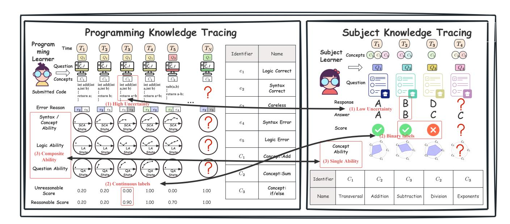
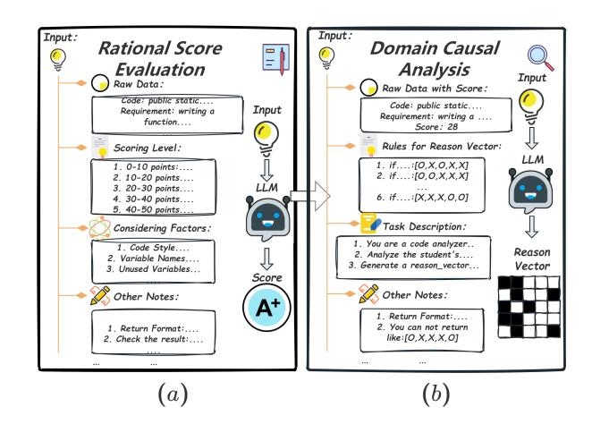
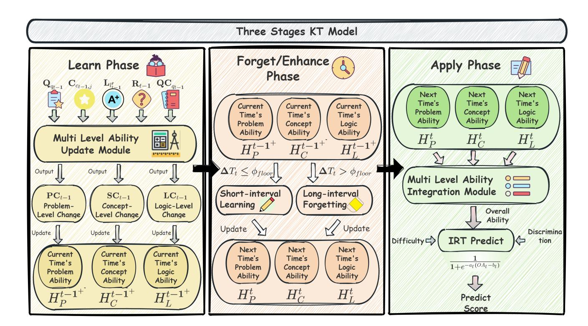
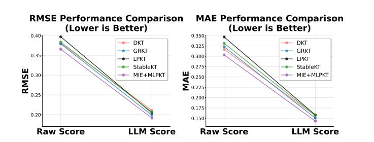
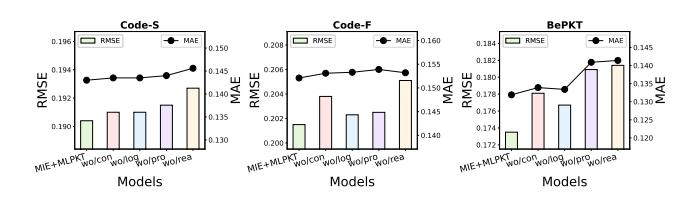
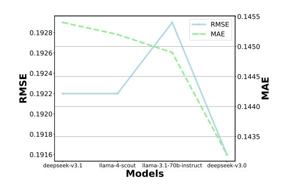
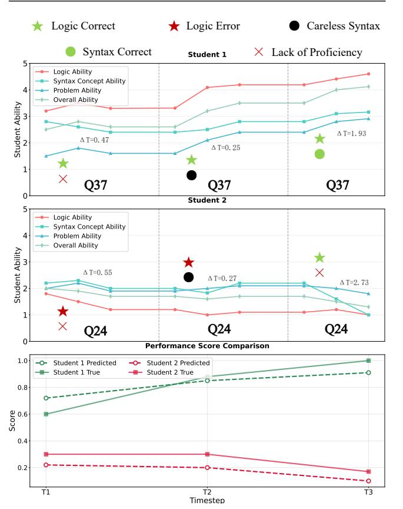

# Leveraging LLM and Multiscale Knowledge States to Improve Knowledge Tracing in Programming Tasks

Mingxing Shao 2301935@stu.neu.edu.cn School of Computer Science and Engineering, Northeastern University Shenyang, 110819, China

Tiancheng Zhang∗ tczhang@mail.neu.edu.cn School of Computer Science and Engineering, Northeastern University Shenyang, 110819, China

Yifang Yin yin\_yifang@a-star.edu.sg Institute for Infocomm Research, A\*STAR Singapore

Wenhui Wu wuwh3@mails.neu.edu.cn School of Computer Science and Engineering, Northeastern University Shenyang, 110819, China

Zikai Li 2301903@stu.neu.edu.cn School of Computer Science and Engineering, Northeastern University Shenyang, 110819, China

Minghe Yu yuminghe@mail.neu.edu.cn College of Software, Northeastern University Shenyang, 110819, China

Fangling Leng lengfangling@mail.neu.edu.cn School of Computer Science and Engineering, Northeastern University Shenyang, 110819, China

Ge Yu yuge@mail.neu.edu.cn School of Computer Science and Engineering, Northeastern University Shenyang, 110819, China

# Abstract

Knowledge Tracing (KT) is a core task in intelligent tutoring systems, designed to model the dynamic evolution of students' knowledge states by predicting their performance on specific problems. However, existing KT models, primarily developed for traditional subject domains, exhibit poor generalization to programming tasks due to several distinct challenges. First, student responses in programming tasks are characterized by high uncertainty. Second, programming tasks typically provide continuous scores based on the proportion of passed test cases, in contrast to the binary correctness assumed by traditional KT models, with these test-casebased scores often being noisy. Third, most KT models rely exclusively on the understanding of knowledge concepts for performance prediction, whereas success in programming tasks is heavily contingent upon logical reasoning and problem-specific comprehension. To address these issues, we propose an LLM-driven Interaction Enrichment Framework (MIE) to mitigate high uncertainty and problematic labeling, and introduce the Multi-Level Programming Knowledge Tracing (MLPKT) model to capture students' knowledge states across multiple dimensions. MLPKT conducts multi-layer analysis of student submissions to identify the root causes of errors and assign semantically meaningful finegrained labels. Additionally, we propose a three-level, three-phase KT architecture that captures knowledge dynamics across three dimensions—problems, concepts, and logical skills—through the

∗Corresponding author.

[This work is licensed under a Creative Commons Attribution 4.0 International License.](https://creativecommons.org/licenses/by/4.0) WWW '26, Dubai, United Arab Emirates

© 2026 Copyright held by the owner/author(s). ACM ISBN 979-8-4007-2307-0/2026/04 <https://doi.org/10.1145/3774904.3792525>

phases of learning, forgetting/reinforcement, and application. Extensive experiments on three datasets demonstrate that MIE+MLPKT consistently outperforms 18 baseline methods. Our code is available at: [https://anonymous.4open.science/r/MIE-MLPKT](https://anonymous.4open.science/r/MIE-MLPKT-D654)-[D654.](https://anonymous.4open.science/r/MIE-MLPKT-D654)

# CCS Concepts

• Social and professional topics → Student assessment; • Computing methodologies → Neural networks; • Information systems → Data mining.

# Keywords

Programming knowledge tracing, data mining enhanced by llm, knowledge state representation

### ACM Reference Format:

Mingxing Shao, Tiancheng Zhang, Yifang Yin, Wenhui Wu, Zikai Li, Minghe Yu, Fangling Leng, and Ge Yu. 2026. Leveraging LLM and Multiscale Knowledge States to Improve Knowledge Tracing in Programming Tasks. In Proceedings of the ACM Web Conference 2026 (WWW '26), April 13–17, 2026, Dubai, United Arab Emirates. ACM, New York, NY, USA, [12](#page-11-0) pages. <https://doi.org/10.1145/3774904.3792525>

# 1 Introduction

With the rapid development of the computer science industry, online programming education platforms in major universities have proliferated, accumulating vast amounts of educational records. In online judge (OJ) platforms, tracking students' knowledge states to recommend appropriate learning materials is crucial for enhancing learning efficiency. Although various knowledge tracing (KT) methods have been proposed to monitor students' knowledge states, these methods are primarily designed for subject-specific knowledge tracing tasks, such as mathematics and English. As illustrated

in Figure [1,](#page-2-0) compared to subject-specific knowledge tracing tasks, programming task data exhibits the following characteristics:

(1) High uncertainty: At each time step, students submit code rather than simple selections, leading to greater interaction uncertainty. For instance, in time step 3 of Figure [1,](#page-2-0) a student nearly completes the program correctly but fails due to an oversight in omitting a semicolon (';') after "return a+b". Traditional KT models struggle to distinguish errors caused by insufficient ability from those due to carelessness.

(2) Continuous labels: In programming tasks, score labels are continuous rather than binary. Scores are calculated based on the proportion of test cases passed by the student's submitted code and their weights. However, current scoring methods have limitations: they require meticulously designed backend test cases and cannot reasonably evaluate code that fails to compile.

(3) Composite abilities: Assessing students' knowledge states involves not only evaluating the correctness of code syntax or mastery of specific concepts but also considering students' ability to integrate these elements. Furthermore, when students repeatedly attempt the same problem, their understanding should deepen progressively.

These characteristics render traditional KT models ineffective for programming tasks.

To address these challenges, we propose a novel programming knowledge tracing model enhanced by LLMs. First, to tackle the high uncertainty and continuous labels in programming task data, we design an LLM-Driven Interaction Enrichment Framework (MIE) that performs reasonable score evaluation and domain-specific error analysis. In reasonable score evaluation, we establish scoring criteria and prompts to evaluate student submissions, serving as new interaction labels. In domain-specific error analysis, we employ cause analysis prompts where the LLM identifies error causes at different levels, such as careless syntax errors or logical errors. The error classification hierarchy can be adapted in practical applications based on the target audience. Since this paper is oriented toward novice programmers, we categorize errors into two distinct levels: the syntactic concept level and the logical ability level.

To address the composite abilities in programming tasks, we propose a three-level, three-phase knowledge tracing framework inspired by LPKT and GRKT [\[8,](#page-8-0) [23\]](#page-8-1). This framework integrates LLM-extracted scores and error causes to accurately model students' knowledge states from their learning processes. We divide the learning process into three phases: learning, forgetting/enhancement, and application, while tracing abilities across three levels: syntax, logic, and problem-specific.

Learning phase: The student's submitted problem, related concepts, and scores are input into a multi-level ability computation module to calculate changes in students' abilities at logic, syntax, and problem-specific levels. For problem-specific ability changes, we design an exponential enhancement function to model the gradual deepening of understanding during repeated attempts. Based on LLM-extracted syntax and logic errors or correctness, we determine the direction of changes in logic and syntax abilities.

Forgetting/enhancement phase: This phase dynamically selects enhancement or forgetting based on interaction intervals. For interactions with intervals below a threshold, a short-interval enhancement module simulates the learning process; for intervals

exceeding the threshold, a long-interval forgetting module simulates the forgetting process.

Application phase: Syntax, logic, and problem-specific abilities related to the current problem are input into a multi-level student ability application module to predict the student's score. To enhance model interpretability, we design a multi-level ability integration module that makes it applicable to the 2-parameter item response theory (IRT) [\[28\]](#page-8-2).

Overall, our contributions are as follows:

- Motivation: We outline the differences between traditional subject-specific knowledge tracing tasks and programming tracing tasks, identify the key challenges, and explain why existing KT models struggle in programming learning tasks.
- Method: We propose an LLM-Driven Interaction Enrichment Framework (MIE) to tackle high uncertainty and unreasonable labeling problems, and further introduce MLPKT (Multi-Level Programming Knowledge Tracing) to model students' knowledge states across multiple levels. MLPKT conducts multi-layer analysis of student submissions to identify root causes of errors and assign semantically meaningful fine-grained labels, while introducing a three-level, threephase knowledge tracing approach that captures knowledge dynamics across problems, concepts, and logical skills.
- Experiments: Through comparisons with 18 baseline models across 3 datasets, we demonstrate MLPKT's applicability in programming tasks and validate its ability to produce accurate knowledge tracing results.
- Datasets: We also release all annotated programming datasets to assist future research.

## 2 Related Work

## 2.1 Knowledge Tracing

Since John R. Anderson proposed the concept of knowledge tracing (KT) [\[7\]](#page-8-3), KT research can be roughly divided into two phases. The first phase centers on Bayesian Knowledge Tracing (BKT), which is based on Bayesian probability formulas and enhances BKT by incorporating additional information [\[7,](#page-8-3) [20,](#page-8-4) [21,](#page-8-5) [34\]](#page-8-6). Although these methods offer a certain degree of interpretability, their performance is often limited. In the second phase, researchers began to adopt deep learning-based KT methods, utilizing recurrent neural networks (RNNs) [\[18,](#page-8-7) [22,](#page-8-8) [31\]](#page-8-9) and self-attention networks [\[27\]](#page-8-10) to track students' knowledge states [\[9,](#page-8-11) [12,](#page-8-12) [15,](#page-8-13) [16,](#page-8-14) [19\]](#page-8-15). Deep learning knowledge tracing (DLKT) methods typically achieve superior results; however, due to the inherent black-box nature of deep neural networks, these methods often lack interpretability in their outcomes. To enhance interpretability, some scholars have attempted to model knowledge states from the perspective of students' learning processes [\[8,](#page-8-0) [23,](#page-8-1) [30\]](#page-8-16), thereby developing approaches that balance interpretability and accuracy.

Nevertheless, the aforementioned methods primarily target knowledge tracing tasks in specific disciplines, such as mathematics and English, which emphasize concept mastery. In contrast, during the programming learning process, students submit code rather than simple multiple-choice or true/false answers; Online Judge (OJ) platforms typically have access to students' code submissions, which hold significant value for assessing students' knowledge states.

Figure 1: Differences Between Programming KT Tasks and Subject-Specific KT Tasks: High Uncertainty; Continuous Labels; and Diversity in Ability Requirements.

Moreover, scores in programming tasks are not simply binary values. These characteristics indicate that traditional KT methods still have substantial room for improvement when applied to programming learning tasks.

# 2.2 Programming Knowledge Tracing

Research on knowledge tracing (KT) for programming tasks remains limited. Early studies employed statistical analysis of student errors and common structures, subsequently applying the Bayesian knowledge tracing algorithm [\[6\]](#page-8-17) to structured data to model the learning process and estimate the final programming knowledge level. Wang et al. [\[26\]](#page-8-18) input embedded program submissions into a recurrent neural network and trained it to predict students' success or failure in subsequent programming exercises. Building on this, Code-DKT [\[24\]](#page-8-19) utilizes the code2vec model [\[2\]](#page-8-20) to learn meaningful representations of student code, then combines it with deep knowledge tracing to track students' knowledge states. Swamy et al. [\[25\]](#page-8-21) compute TF-IDF scores for each string token in the source code and use these scores to form representation vectors of the code, which are concatenated with other auxiliary features as input to an RNN. Zhu et al. [\[36\]](#page-8-22) represent student code parsed into syntax trees through an attention mechanism and combine it with DKT to track students' knowledge states. OKT [\[17\]](#page-8-23) introduces a code generation method that combines language models for program synthesis with student knowledge tracing, enabling prediction of students' responses in programming tasks and pioneering the concept of open-ended knowledge tracing. Wu et al. [\[29\]](#page-8-24) propose a heterogeneous graph-based programming knowledge tracing method, constructing a heterogeneous graph of knowledge concepts, programming problems, and student code, utilizing graph structure learning and attention mechanisms to enhance representations and evaluate mastery levels of knowledge concepts.

Although the aforementioned methods apply knowledge tracing (KT) models to programming tasks, they often focus exclusively on superficial code features, lacking fine-grained modeling of deeper attributes such as code quality and error patterns. Additionally, the datasets employed typically utilize coarse-grained labeling, which limits the precision of knowledge state assessments.

# 3 Problem Formulation

Let Q denote the set of problems, L the original set of scores, C the set of concepts, and M the set of codes submitted by students. We first design prompts using the set of problems Q and the set of students' codes M to enable the LLM to derive the set of code labels Lˆ and the corresponding set of reasons R. For student ���� ∈ S, the interaction tuples prior to time step �� are denoted as ���� = {(��1, ��1, ˆ ��1, ��1), . . . , (����−1, ����−1, ˆ ����−1, ����−1)}, where �� ∈ Q represents the problem identifier, �� ∈ C represents the multiple concept identifiers associated with the problem, ˆ �� ∈ Lˆ represents the student's code score graded by LLM, and �� ∈ R represents the student's error causes. Our objective is to model the student's knowledge state �� ��−1 based on the interaction tuples ����−1 prior to time step ��, and further predict the student's score on problem ���� at time step ��, formulated as ���� = �� (���� , ���� | ����−1).

# 4 The MIE Framework

As illustrated in Figure 2, we design an LLM-Driven Interaction Enrichment Framework to provide reasonable score labels and code analysis results for the three-level knowledge tracing framework.

# 4.1 Rational Score Evaluation

To adapt the labels in programming datasets for knowledge tracing models, for the code ���� ∈ M submitted by student ���� at time step ��,

Table 2: Statistical information of the datasets

|               | Code-S | Code-F  | BePKT  |
|---------------|--------|---------|--------|
| # Student     | 413    | 506     | 1,638  |
| # Question    | 50     | 50      | 606    |
| # Concept     | 18     | 18      | 106    |
| # Interaction | 69,627 | 125,571 | 76,657 |

6.1.2 Baselines. To evaluate the performance of our proposed method on the programming knowledge tracing (KT) task, we compared it against 18 state-of-the-art methods: AKT [\[9\]](#page-8-11), DTransformer [\[32\]](#page-8-26), EXKT [\[16\]](#page-8-14), FlucKT [\[11\]](#page-8-27), FoLiBiKT [\[12\]](#page-8-12), LefoAKT [\[5\]](#page-8-28), SAKT [\[19\]](#page-8-15), StableKT [\[15\]](#page-8-13), ATKT [\[10\]](#page-8-29), CSKT [\[4\]](#page-8-30), DKT [\[22\]](#page-8-8), DKVMN [\[35\]](#page-8-31), SKVMN [\[1\]](#page-8-32), GRKT [\[8\]](#page-8-0), LPKT [\[23\]](#page-8-1). DKT+ [\[26\]](#page-8-18), Code-DKT [\[24\]](#page-8-19), ECKT [\[33\]](#page-8-33). A detailed description of the aforementioned models will be provided in the Appendix C.2.

6.1.3 Implementation Details. To ensure a fair comparison across all baseline models, we standardized the sequence length to 200 and the batch size to 24. Additionally, we set the embedding dimension to 256 for all baselines, with a dropout rate of 0.05. All experiments were implemented using PyTorch in Python and conducted on a device equipped with an NVIDIA A800 GPU.

Since the labels are continuous values ranging from 0 to 1, we employed Root Mean Square Error (RMSE) and Mean Absolute Error (MAE) as the evaluation metrics for the models. Furthermore, in the performance comparison, to additionally validate the performance of MLPKT on traditional classification tasks, the scores provided by the LLM were binarized (where scores >= 0.5 are assigned 1, and 0 otherwise), based on which the Area Under the Curve (AUC) and Accuracy (ACC) were calculated.

### 6.2 Reasonableness of LLM Data Scoring (Q1)

We selected the Code-S dataset and conducted experiments from two perspectives to validate the rationality of scoring based on large language models (LLMs). First, from the perspective of the data itself, we engaged experts to evaluate 10,000 code submissions. The expert scores were compared with scores from four LLMs and the initial test-case-based scoring by computing the average error rate. Specifically, we employed metrics such as Mean Absolute Error (MAE), Mean Relative Error (MRE), Median Absolute Error (Median AE), Standard Absolute Error (Std AE), and Root Mean Square Error (RMSE) to assess the discrepancies between model scores and expert scores. The results, as presented in Table 3, demonstrate that LLM-based scores for code submissions are significantly closer to expert scores compared to test-case-based scores. Notably, the scores from deepseek-v3.1 outperform other LLMs in terms of proximity to expert scores, surpassing both other models and the test-case-based raw\_score. Consequently, this study adopts the deepseek-v3.1 scores as the reference labels.

Subsequently, we validated the rationality of our approach from the model perspective. Specifically, we evaluated performance on programming knowledge tracking tasks using StableKT [\[15\]](#page-8-13), DKT [\[22\]](#page-8-8), LPKT [\[23\]](#page-8-1), GRKT [\[8\]](#page-8-0), and MIE+MLPKT. We used LLMScore and RawScore as labels for training and validation, while employing expert scores on the test set for final evaluation of model performance. As shown in Figure 4, the results demonstrate that LLMbased scoring significantly enhances model performance. A consistent pattern emerges across all examined methods: both MLPKT and the four baseline approaches exhibit markedly improved performance on the expert-scored test set when trained and validated using LLM-generated scores, as opposed to raw score labels. This empirical evidence corroborates the soundness of our proposed MIE scoring mechanism from the perspective of downstream model performance.

Thus, from both the data and model perspectives, we demonstrate the rationality of the proposed MIE framework for evaluating student code submissions.

Table 3: Error Metrics Comparison Across Models

| Model Name             |    | MAE | MRE | (%) | Median | AE | Std | AE |    | RMSE |
|------------------------|----|-----|-----|-----|--------|----|-----|----|----|------|
| deepseek-v3.1          | 3  | 94  | 16  | 65  | 3      | 00 | 4   | 08 | 5  | 67   |
| llama-4-scout          | 6  | 09  | 26  | 50  | 4      | 00 | 5   | 58 | 8  | 26   |
| deepseek-v3.0          | 6  | 10  | 26  | 39  | 4      | 00 | 4   | 92 | 7  | 84   |
| llama-3.1-70b-instruct | 8  | 64  | 39  | 61  | 7      | 00 | 6   | 29 | 10 | 69   |
| raw-score              | 26 | 87  | 98  | 59  | 23     | 74 | 10  | 41 | 28 | 82   |

Figure 4: Performance Comparison of Knowledge Tracking Models with Different Label Types

### 6.3 Performance Comparison (Q2)

Table 4 presents the predictive performance of our MIE+MLPKT model compared with other baseline methods across four datasets. To ensure the reliability of the experimental results, we employed a 5-fold cross-validation strategy, reporting the average values for all metrics. The best results are highlighted in blue background , while the second-best results are marked in green background . As observed, the MIE+MLPKT framework consistently achieves the highest performance among all models, demonstrating the superiority of our proposed approach in programming knowledge tracing tasks.

# 6.4 Ablation Study (Q3)

To validate our design philosophy of decomposing student ability into multiple levels, we compared the complete MIE+MLPKT model with three variant models—lacking concept-level ability (wo /con), logical-level ability (wo /log), and problem-level ability (wo /pro)—on the Code-S dataset. As shown in Figure 5, the results

Table 4: Model Performance Metrics on Code-S, Code-F, and BePKT Datasets (With Programming KT Indicator)

| Model            | Programming KT RMSE | MAE    | Code-S AUC | ACC    | RMSE   | MAE    | Code-F AUC | ACC    | RMSE   | MAE    | BePKT AUC | ACC    |
|------------------|---------------------|--------|------------|--------|--------|--------|------------|--------|--------|--------|-----------|--------|
| AKT              | ✗ 0.2588            | 0.2212 | 0.6893     | 0.6832 | 0.2634 | 0.2224 | 0.6486     | 0.6901 | 0.2257 | 0.1767 | 0.6822    | 0.6971 |
| DTransformer     | ✗ 0.2034            | 0.1582 | 0.8637     | 0.8285 | 0.2160 | 0.1693 | 0.8398     | 0.8176 | 0.2189 | 0.1768 | 0.6860    | 0.7020 |
| EXKT             | ✗ 0.2591            | 0.2210 | 0.6861     | 0.6828 | 0.2635 | 0.2233 | 0.6440     | 0.6900 | 0.2269 | 0.1764 | 0.6762    | 0.6885 |
| FlucKT           | ✗ 0.2568            | 0.2217 | 0.6874     | 0.6835 | 0.2636 | 0.2236 | 0.6465     | 0.6896 | 0.2252 | 0.1765 | 0.6771    | 0.6895 |
| FoLiBiKT         | ✗ 0.2590            | 0.2219 | 0.6887     | 0.6825 | 0.2660 | 0.2250 | 0.6442     | 0.6892 | 0.2263 | 0.1769 | 0.6749    | 0.6918 |
| LefoKT-AKT       | ✗ 0.2589            | 0.2218 | 0.6913     | 0.6833 | 0.2618 | 0.2248 | 0.6492     | 0.6905 | 0.2654 | 0.2121 | 0.6746    | 0.6748 |
| SAKT             | ✗ 0.2209            | 0.1880 | 0.7474     | 0.7003 | 0.2464 | 0.2009 | 0.7108     | 0.7110 | 0.2327 | 0.1825 | 0.6633    | 0.6635 |
| StableKT         | ✗ 0.2068            | 0.1598 | 0.8501     | 0.8182 | 0.2186 | 0.1722 | 0.8368     | 0.8156 | 0.2098 | 0.1675 | 0.7246    | 0.7197 |
| ATKT             | ✗ 0.2067            | 0.1571 | 0.8684     | 0.8239 | 0.2168 | 0.1657 | 0.8446     | 0.8112 | 0.2274 | 0.1783 | 0.6703    | 0.6908 |
| CSKT             | ✗ 0.1976            | 0.1486 | 0.8751     | 0.8432 | 0.2097 | 0.1614 | 0.8560     | 0.8250 | 0.2104 | 0.1667 | 0.6997    | 0.7040 |
| DKT              | ✗ 0.2109            | 0.1563 | 0.8588     | 0.8203 | 0.2219 | 0.1654 | 0.8422     | 0.8079 | 0.2370 | 0.1879 | 0.6571    | 0.6730 |
| DKVMN            | ✗ 0.1978            | 0.1506 | 0.8782     | 0.8348 | 0.2100 | 0.1624 | 0.8584     | 0.8193 | 0.1981 | 0.1558 | 0.7612    | 0.7421 |
| SKVMN            | ✗ 0.2186            | 0.1818 | 0.7067     | 0.7006 | 0.2467 | 0.2003 | 0.6920     | 0.6981 | 0.2445 | 0.1997 | 0.5652    | 0.6546 |
| GRKT             | ✗ 0.1987            | 0.1504 | 0.8688     | 0.8339 | 0.2123 | 0.1645 | 0.8436     | 0.8212 | 0.1793 | 0.1388 | 0.8258    | 0.8256 |
| LPKT             | ✗ 0.2043            | 0.1583 | 0.8600     | 0.8217 | 0.2180 | 0.1739 | 0.8357     | 0.8165 | 0.1863 | 0.1472 | 0.8150    | 0.8152 |
| Code-DKT         | ✓ 0.1952            | 0.1512 | 0.8845     | 0.8440 | 0.2108 | 0.1628 | 0.8565     | 0.8260 | 0.1852 | 0.1447 | 0.8225    | 0.8210 |
| ECKT             | ✓ 0.2060            | 0.1580 | 0.8510     | 0.8195 | 0.2175 | 0.1690 | 0.8375     | 0.8158 | 0.2185 | 0.1760 | 0.7020    | 0.7015 |
| DKT+             | ✓ 0.2105            | 0.1637 | 0.8545     | 0.8205 | 0.2274 | 0.1803 | 0.8150     | 0.8010 | 0.2111 | 0.1639 | 0.7180    | 0.7130 |
| MIE+MLPKT-DK-V31 | ✓ 0.1904            | 0.1430 | 0.8926     | 0.8451 | 0.2015 | 0.1521 | 0.8738     | 0.8305 | 0.1735 | 0.1319 | 0.8380    | 0.8408 |

demonstrate that the complete MIE+MLPKT model outperforms all three variants that lack specific ability levels, confirming the necessity of our approach to modeling student ability across three distinct levels.

Figure 5: Performance of MIE+MLPKT and Variants on Three Datasets

Additionally, to investigate whether the reason vectors extracted by the large language model (LLM) contribute to model performance, we also presented the performance of the model without reason vectors (wo /rea) in Figure 5. The results indicate that the LLM-generated reason vectors can enhance model performance. Furthermore, to examine the impact of reasons extracted by different LLMs on the results, we used deepseek-v3.0, llama-3.1-70binstruct, and llama-4-scout to extract error reasons from the Code-S dataset and compared them with the baseline deepseek-v3.1. The results are shown in Figure 6. Although deepseek-v3.1's scoring results were the closest to expert ratings, the reason analysis from deepseek-v3.0 demonstrated a greater enhancement to model performance.

# 7 Conclusion

This paper elucidates three distinctive characteristics of programming knowledge tracing tasks compared to traditional subjectbased knowledge tracing, which often result in suboptimal performance of existing KT models on programming benchmarks. To

Figure 6: Ablation Study: Impact of Different LLMs on Error Reason Extraction and Model Performance on Code-S Dataset

address these challenges, we propose the MIE+MLPKT framework. The MIE component leverages carefully designed prompts to elicit from large language models (LLMs) reasonable scoring labels alongside multi-level error cause analyses, thereby mitigating issues of label continuity and irrationality while further alleviating high uncertainty. Concurrently, to accommodate the multi-layered nature of student proficiency requirements in programming tasks, we introduce MLPKT, a three-tiered knowledge tracing framework that integrates the error analysis vectors extracted by MIE. Extensive experiments across three datasets and 18 baselines substantiate the efficacy of our proposed framework. In future work, we plan to evaluate MIE+MLPKT in authentic educational settings.

# Acknowledgments

This research was funded by the National Natural Science Foundation of China (Nos. 62272093,62137001)

References [1] Ghodai Abdelrahman and Qing Wang. 2019. Knowledge tracing with sequential key-value memory networks. In Proceedings of the 42nd international ACM SIGIR conference on research and development in information retrieval. 175–184. [2] Uri Alon, Meital Zilberstein, Omer Levy, and Eran Yahav. 2018. A general pathbased representation for predicting program properties. ACM SIGPLAN Notices 53, 4 (2018), 404–419. [3] Uri Alon, Meital Zilberstein, Omer Levy, and Eran Yahav. 2019. code2vec: Learning distributed representations of code. Proceedings of the ACM on Programming Languages 3, POPL (2019), 1–29. [4] Youheng Bai, Xueyi Li, Zitao Liu, Yaying Huang, Teng Guo, Mingliang Hou, Feng Xia, and Weiqi Luo. 2025. csKT: Addressing cold-start problem in knowledge tracing via kernel bias and cone attention. Expert Systems with Applications 266 (2025), 125988. [5] Youheng Bai, Xueyi Li, Zitao Liu, Yaying Huang, Mi Tian, and Weiqi Luo. 2025. Rethinking and improving student learning and forgetting processes for attention based knowledge tracing models. In Proceedings of the AAAI Conference on Artificial Intelligence, Vol. 39. 27822–27830. [6] Ryan SJ d Baker, Albert T Corbett, and Vincent Aleven. 2008. More accurate student modeling through contextual estimation of slip and guess probabilities in bayesian knowledge tracing. In Intelligent Tutoring Systems: 9th International Conference, ITS 2008, Montreal, Canada, June 23-27, 2008 Proceedings 9. Springer, 406–415. [7] Albert T Corbett and John R Anderson. 1994. Knowledge tracing: Modeling the acquisition of procedural knowledge. User modeling and user-adapted interaction 4 (1994), 253–278. [8] Jiajun Cui, Hong Qian, Bo Jiang, and Wei Zhang. 2024. Leveraging pedagogical theories to understand student learning process with graph-based reasonable knowledge tracing. In Proceedings of the 30th ACM SIGKDD Conference on Knowledge Discovery and Data Mining. 502–513. [9] Aritra Ghosh, Neil Heffernan, and Andrew S Lan. 2020. Context-aware attentive knowledge tracing. In SIGKDD. 2330–2339. [10] Xiaopeng Guo, Zhijie Huang, Jie Gao, Mingyu Shang, Maojing Shu, and Jun Sun. 2021. Enhancing knowledge tracing via adversarial training. In Proceedings of the 29th ACM International Conference on Multimedia. 367–375. [11] Mingliang Hou, Xueyi Li, Teng Guo, Zitao Liu, Mi Tian, Renqiang Luo, and Weiqi Luo. 2025. Cognitive Fluctuations Enhanced Attention Network for Knowledge Tracing. In Proceedings of the AAAI Conference on Artificial Intelligence, Vol. 39. 14265–14273. [12] Yoonjin Im, Eunseong Choi, Heejin Kook, and Jongwuk Lee. 2023. Forgettingaware Linear Bias for Attentive Knowledge Tracing. In CIKM. 3958–3962. [13] Diederik P. Kingma and Jimmy Ba. 2015. Adam: A Method for Stochastic Optimization. In 3rd International Conference on Learning Representations, ICLR 2015, San Diego, CA, USA, May 7-9, 2015, Conference Track Proceedings, Yoshua Bengio and Yann LeCun (Eds.). [14] Ruixin Li, Yu Yin, Le Dai, Shuanghong Shen, Xin Lin, Yu Su, and Enhong Chen. 2022. PST: measuring skill proficiency in programming exercise process via programming skill tracing. In Proceedings of the 45th international acm sigir conference on research and development in information retrieval. 2601–2606. [15] Xueyi Li, Youheng Bai, Teng Guo, Zitao Liu, Yaying Huang, Xiangyu Zhao, Feng Xia, Weiqi Luo, and Jian Weng. 2024. Enhancing length generalization for attention based knowledge tracing models with linear biases. In IJCAI. 5918– 5926. [16] Xueyi Li, Youheng Bai, Teng Guo, Ying Zheng, Mingliang Hou, Bojun Zhan, Yaying Huang, Zitao Liu, Boyu Gao, and Weiqi Luo. 2024. Extending Context Window of Attention Based Knowledge Tracing Models via Length Extrapolation. In ECAI. IOS Press, 1479–1486. [17] Naiming Liu, Zichao Wang, Richard Baraniuk, and Andrew Lan. 2022. Openended knowledge tracing for computer science education. In Proceedings of the 2022 Conference on Empirical Methods in Natural Language Processing. [18] Koki Nagatani, Qian Zhang, Masahiro Sato, Yan-Ying Chen, Francine Chen, and Tomoko Ohkuma. 2019. Augmenting knowledge tracing by considering forgetting behavior. In The world wide web conference. 3101–3107. [19] Shalini Pandey and George Karypis. 2019. A Self-Attentive Model for Knowledge Tracing. In Proceedings of the 12th International Conference on Educational Data Mining (EDM 2019). Montréal, Canada, 384–389.<https://arxiv.org/abs/1907.06837> arXiv:1907.06837. [20] Zachary A Pardos and Neil T Heffernan. 2010. Modeling individualization in a bayesian networks implementation of knowledge tracing. In User Modeling, Adaptation, and Personalization: 18th International Conference, UMAP 2010, Big Island, HI, USA, June 20-24, 2010. Proceedings 18. Springer, 255–266. [21] Zachary A Pardos and Neil T Heffernan. 2011. KT-IDEM: Introducing item difficulty to the knowledge tracing model. In User Modeling, Adaption and Personalization: 19th International Conference, UMAP 2011, Girona, Spain, July 11-15, 2011. Proceedings 19. Springer, 243–254. [22] Chris Piech, Jonathan Bassen, Jonathan Huang, Surya Ganguli, Mehran Sahami, Leonidas J Guibas, and Jascha Sohl-Dickstein. 2015. Deep knowledge tracing. Advances in neural information processing systems 28 (2015). [23] Shuanghong Shen, Qi Liu, Enhong Chen, Zhenya Huang, Wei Huang, Yu Yin, Yu Su, and Shijin Wang. 2021. Learning process-consistent knowledge tracing. In Proceedings of the 27th ACM SIGKDD conference on knowledge discovery & data mining. 1452–1460. [24] Yang Shi, Min Chi, Tiffany Barnes, and Thomas Price. 2022. Code-dkt: A code-based knowledge tracing model for programming tasks. arXiv preprint arXiv:2206.03545 (2022). [25] Vinitra Swamy, Allen Guo, Samuel Lau, Wilton Wu, Madeline Wu, Zachary Pardos, and David Culler. 2018. Deep knowledge tracing for free-form student code progression. In Artificial Intelligence in Education: 19th International Conference, AIED 2018, London, UK, June 27–30, 2018, Proceedings, Part II 19. Springer, 348–352. [26] Lisa Wang, Angela Sy, Larry Liu, and Chris Piech. 2017. Deep knowledge tracing on programming exercises. In Proceedings of the fourth (2017) ACM conference on learning@ scale. 201–204. [27] A Waswani, N Shazeer, N Parmar, J Uszkoreit, L Jones, A Gomez, L Kaiser, and I Polosukhin. 2017. Attention is all you need. In NIPS. [28] Kevin H Wilson, Yan Karklin, Bojian Han, and Chaitanya Ekanadham. 2016. Back to the basics: Bayesian extensions of IRT outperform neural networks for proficiency estimation. (2016). [29] Yaqiang Wu, Hui Zhu, Chenyang Wang, Fujian Song, Haiping Zhu, Yan Chen, Qinghua Zheng, and Feng Tian. 2024. Programming knowledge tracing based on heterogeneous graph representation. Knowledge-Based Systems 300 (2024), 112161. [doi:10.1016/j.knosys.2024.112161](https://doi.org/10.1016/j.knosys.2024.112161) [30] Bihan Xu, Zhenya Huang, Jiayu Liu, Shuanghong Shen, Qi Liu, Enhong Chen, Jinze Wu, and Shijin Wang. 2023. Learning behavior-oriented knowledge tracing. In Proceedings of the 29th ACM SIGKDD conference on knowledge discovery and data mining. 2789–2800. [31] Chun-Kit Yeung and Dit-Yan Yeung. 2018. Addressing two problems in deep knowledge tracing via prediction-consistent regularization. In Proceedings of the fifth annual ACM conference on learning at scale. 1–10. [32] Yu Yin, Le Dai, Zhenya Huang, Shuanghong Shen, Fei Wang, Qi Liu, Enhong Chen, and Xin Li. 2023. Tracing knowledge instead of patterns: Stable knowledge tracing with diagnostic transformer. In WWW. 855–864. [33] Yang Yu, Yingbo Zhou, Yaokang Zhu, Yutong Ye, Liangyu Chen, and Mingsong Chen. 2024. Eckt: Enhancing code knowledge tracing via large language models. In Proceedings of the Annual Meeting of the Cognitive Science Society, Vol. 46. [34] Michael V Yudelson, Kenneth R Koedinger, and Geoffrey J Gordon. 2013. Individualized bayesian knowledge tracing models. In Artificial intelligence in education: 16th international conference, AIED 2013, Memphis, TN, USA, July 9-13, 2013. proceedings 16. Springer, 171–180. [35] Jiani Zhang, Xingjian Shi, Irwin King, and Dit-Yan Yeung. 2017. Dynamic keyvalue memory networks for knowledge tracing. In WWW. 765–774. [36] Mengxia Zhu, Siqi Han, Peisen Yuan, and Xuesong Lu. 2022. Enhancing Programming Knowledge Tracing by Interacting Programming Skills and Student Code. In LAK22: 12th International Learning Analytics and Knowledge Conference (Online, USA) (LAK22). Association for Computing Machinery, New York, NY, USA, 438–443. [doi:10.1145/3506860.3506870](https://doi.org/10.1145/3506860.3506870) A PROMPT TEMPLATE The rating prompt and the reason analysis prompt mentioned in 4.2 are shown in Table 5 and Table 6. B EMBEDDING GENERATION B.1 Score Embedding Score embedding captures the impact of student performance on their knowledge state. For the score ���� ∈ [0, 1] at time ��, we discretize it into 101 integer values from 0 to 100 and define a score embedding matrix L ∈ R 101×�� , where �� is the embedding dimension. For convenience, all dimensions used in this paper are uniformly denoted as ��. The score is scaled and converted to an integer index as �� ′ �� = ⌊���� · 100⌋. The embedding of the score is calculated as: L���� = Softplus(E�� (�� ′ )), (26) where E�� : {0, 1, . . . , 100} → R �� is a learnable embedding function

that maps the integer index to a vector.

Table 5: Grading Criteria and Instructions for Programming Code Assessment

| Task        | Description                                                                                                                                       |
|-------------|---------------------------------------------------------------------------------------------------------------------------------------------------|
| You         | are a helpful assistant. I will provide a programming problem description, a piece of code written by a student, and the code’s ID. Now, you need |
| to grade    | this code on a scale from 0 to 50.                                                                                                                |
| Raw         | Data                                                                                                                                              |
| Problem     | Requirements: {requirement}                                                                                                                       |
| CodeID:     | {code_id}                                                                                                                                         |
| Grading     | Criteria                                                                                                                                          |
| 0-10        | points: The student has not solved the problem at all.                                                                                            |
| 10-20       | points: The student has not successfully solved the problem but made a reasonable attempt.                                                        |
| 20-30       | points: The student has not successfully solved the problem, but the code contains logic that aligns with the requirements of the problem.        |
| 30-40       | points: The student has not fully solved the problem, but their solution is very close to the correct answer, with only minor missing syntax      |
| 40-50       | points: The student has fully solved the problem correctly.                                                                                       |
| Considering | Factors                                                                                                                                           |
| 1. Code     | style,                                                                                                                                            |
| 2. Whether  | variable names are reasonable,                                                                                                                    |
| 3. Whether  | there are unused variables,                                                                                                                       |
| 4. Whether  | there are unreachable code blocks.                                                                                                                |
| Other       | Notes                                                                                                                                             |
| Your        | return format must be in JSON format, where the key is the code ID and the value is the score for the code! Your response should be as accurate   |
| as possible | (like 21, 24, 31, 38), rather than simply taking the minimum, middle, or maximum value of each level (like 10, 15, 20...)!                        |

Table 6: Prompt Template Used in Code Analysis for Generating Reason Vectors

| Task         | Description                                                                                                                                          |
|--------------|------------------------------------------------------------------------------------------------------------------------------------------------------|
| You          | are a code analyzer. I have a programming problem that includes the student’s answer, the correctness score of the student’s answer (0-50), the ID   |
| of the       | programming problem, and the number of errors in the code. You need to analyze the student’s submitted code from both logical and syntactic          |
| dimensions   | based on the problem description and generate a reason_vector                                                                                        |
| Raw          | Data with Score                                                                                                                                      |
| Code         | ID: {id}                                                                                                                                             |
| Requirement: | {requirement}                                                                                                                                        |
| Score:       | {score}                                                                                                                                              |
| Submitted    | Code: {code}                                                                                                                                         |
| Number       | of Errors: {error_num}                                                                                                                               |
| Rules        | for Reason Vector                                                                                                                                    |
| The          | reason_vector has five dimensions, with two correctness attributes and three error attributes in the following order: logical correctness, syntactic |
| correctness, | careless syntax mistakes, syntax errors due to lack of proficiency, and logical errors. The reason_vector can take the following values:             |
| 1. If        | the code’s score is 50, the reason_vector must be: [1,1,0,0,0].                                                                                      |
| 2. If        | the code’s score is not 50 and the number of errors in the code is 0, the reason_vector must be: [0,1,0,0,1].                                        |
| 3. If        | neither of the above conditions is met, you must analyze the student’s errors and determine the reason, as follows:                                  |
| a. If        | you believe the student’s code is logically correct but has syntax mistakes due to carelessness, the reason_vector should be: [1,0,1,0,0].           |
| b. If        | you believe the student’s code is logically correct but has errors due to lack of proficiency in syntax, the reason_vector should be: [1,0,0,1,0].   |
| c. If        | you believe the student’s code has logical errors and also careless syntax mistakes, the reason_vector should be: [0,0,1,0,1].                       |
| d. If        | you believe the student’s code has logical errors and syntax errors due to lack of proficiency, the reason_vector should be: [0,0,0,1,1].            |
| Other        | Notes                                                                                                                                                |
| The          | response must be in JSON format: {{“id”:reason_vector}} (e.g., {{“3”:[1,1,0,0,0]}}) and no newline in the vector!                                    |

- • GRKT [\[8\]](#page-8-0): Leverages graph-based structures for knowledge propagation.
- LPKT [\[23\]](#page-8-1): Models learning progress with fine-grained knowledge tracing.
- DKT+ [\[26\]](#page-8-18): Uses abstract syntax trees (AST) [\[3,](#page-8-34) [14\]](#page-8-35) to represent programs and uses recurrent neural networks to track learners' knowledge states.
- Code-DKT [\[24\]](#page-8-19): Constructs the AST and adopts both node embedding and path embedding to effectively model the problem text.
- ECKT [\[33\]](#page-8-33): Integrates code features with questions' knowledge concepts and descriptions generated by an LLM from codes. Due to limitations in the implementation method, we solely utilize the concepts and question IDs from the original datasets for generating embeddings.

### C.3 Case Study (Q4)

To investigate the efficacy of the MIE+MLPKT framework in tracking students' knowledge states, we visualized the experimental results of MIE+MLPKT monitoring the knowledge state changes of two students across three time steps, as illustrated in Figure 7. The following observations can be drawn from the results: (1) Syntactic Concept Ability: When the first student, at the first time step, commits an error due to insufficient syntactic proficiency (denoted by a × in Figure 7), the model's assessment of their syntactic ability decreases. Conversely, when the first student makes an error due to carelessness at the second time step (indicated by a ● in Figure 7), their syntactic concept proficiency improves. This is attributed to the fact that errors stemming from carelessness are typically rectified quickly, leading the model to interpret this interaction as contributing to an enhancement in the student's syntactic concepts. Furthermore, when the first student correctly answers question Q37 (marked by a ● in Figure 7), their syntactic concept proficiency exhibits a significant improvement. (2) Problem Understanding Ability: As both students repeatedly engage with the same problem, their understanding of that problem progressively increases. (3) Logical Ability: When the MIE framework evaluates an interaction as logically correct (indicated by a ★ in Figure 7), the model's assessment of the student's logical reasoning ability typically improves. In contrast, when an interaction is evaluated as logically incorrect (denoted by a ★ in Figure 7), the model's assessment of the student's logical reasoning ability decreases. (4) Impact of Time Intervals: When the time interval is less than ��floor = 2.57, students' various abilities tend to improve during that period. Conversely, when the time interval exceeds ��floor, students' abilities are likely to decline during that period.

# C.4 Efficiency and Robustness Analysis (Q5)

To evaluate the practical deployability of our method, we conducted a comparative analysis of inference time and performance tradeoffs, as shown in Table 7.

Inference Efficiency: The results indicate that the inference time of MIE+MLPKT is 1049.21 ms/batch. While our model requires more computation time than lightweight models like Code-DKT (410.21 ms) and LPKT (106.43 ms) due to its multi-level architecture,

Table 7: Comparison of Inference Time and Performance Significance on Code-S Dataset

| Model            | Test Time | (ms/batch) RMSE | p-value |    | (vs  | Ours) | AUC    |
|------------------|-----------|-----------------|---------|----|------|-------|--------|
| LPKT             | 106.43    | 0.2043          | 1       | 83 | × 10 | − 6   | 0.8600 |
| Code-DKT         | 410.21    | 0.1952          | 2       | 59 | × 10 | − 5   | 0.8845 |
| GRKT             | 1112.41   | 0.1987          | 1       | 54 | × 10 | − 5   | 0.8688 |
| MIE+MLPKT (Ours) | 1049.21   | 0.1904          |         |    |      |       | 0.8926 |

Figure 7: The Process of MIE+MLPKT in Tracking Students' Knowledge States

it is notably more efficient than the complex graph-based baseline GRKT (1112.41 ms). Considering the substantial improvement in predictive accuracy (RMSE reduced to 0.1904), we believe this computational cost is acceptable for real-world applications.

Significance and Robustness: To further validate the reliability of these performance gains, we conducted significance tests. As presented in Table 7, the low p-values confirm that our improvements are statistically significant. Additionally, we introduced the AUC metric (binarized at 0.5), where our model achieved 0.8926, consistently outperforming all baselines.