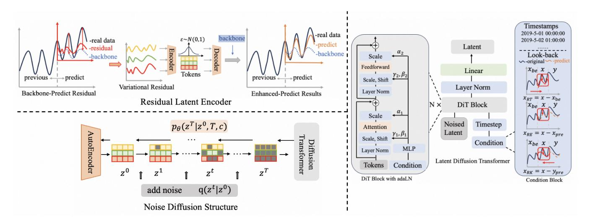
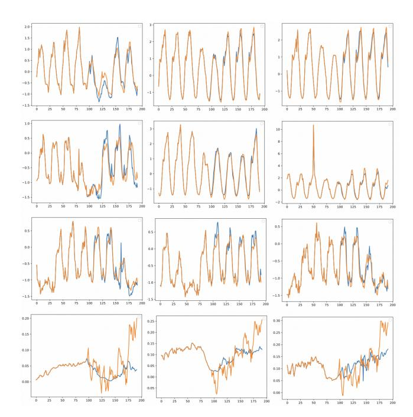
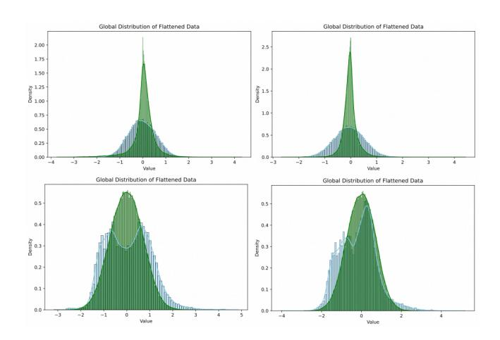

# Re-Diffusion: Modeling Latent Residuals with Diffusion for Time-Series Forecasting

Boning Zhang College of Computer Science Zhejiang University zhangbn@zju.edu.cn

Haishuai Wang∗ College of Computer Science Zhejiang University haishuai.wang@zju.edu.cn

Zehong Hu Alibaba Group Hangzhou, China zehong.hzh@alibaba-inc.com

Jiajun Wang Alibaba Group Hangzhou, China wjj178316@alibaba-inc.com

Hongyi Zhang Alibaba Group Hangzhou, China zhanghongyi.zhy@alibaba-inc.com

Jia Jia Alibaba Group Hangzhou, China jj229618@alibaba-inc.com

# Abstract

Generative latent diffusion models (LDMs) have been extensively applied in various fields yet underperform in time-series prediction. Therefore, We propose the Re-Diffusion model, a latent diffusion approach that generates backbone residuals specifically tailored for time-series forecasting. The model comprises a variational autoencoder that compresses the residuals between the actual future values and the predictions from the backbone into latent space. It also includes a conditional diffusion generator to forecast the potential distribution of these residuals. Our findings reveal that this latent-space methodology particularly enhances existing backbone predictors, by effectively reducing prediction bias through an advanced estimation of complex error distributions. While previous diffusion-based models tend to struggle with long-term forecasting, Re-Diffusion integrates the strengths of diffusion methods, leading to improvements in long-term predictions. Our experimental results indicate that the Re-Diffusion model achieves a 10% promotion over state-of-art predictors, marking a significant advancement in the field of time-series forecasting.

# CCS Concepts

• Computing methodologies → Temporal reasoning.

# Keywords

Diffusion Model, Time Series Prediction

### ACM Reference Format:

Boning Zhang, Haishuai Wang, Zehong Hu, Jiajun Wang, Hongyi Zhang, and Jia Jia. 2026. Re-Diffusion: Modeling Latent Residuals with Diffusion for Time-Series Forecasting. In Proceedings of the ACM Web Conference 2026 (WWW '26), April 13–17, 2026, Dubai, United Arab Emirates. ACM, New York, NY, USA, [11](#page-10-0) pages.<https://doi.org/10.1145/3774904.3792539>

[This work is licensed under a Creative Commons Attribution 4.0 International License.](https://creativecommons.org/licenses/by/4.0)

WWW '26, Dubai, United Arab Emirates © 2026 Copyright held by the owner/author(s). ACM ISBN 979-8-4007-2307-0/2026/04 <https://doi.org/10.1145/3774904.3792539>

# 1 Introduction

Time series data is a collection of sequential data points, representing phenomena across various fields that change over time, such as economic trends[\[4\]](#page-8-0), traffic flow[\[7\]](#page-8-1), and power usage etc. By extracting and studying meaningful information, time series forecasting plays a critical role in decision-making for downstream applications. Forecasting models shall detect the historical data represented as ��0:��1 ∈ R ��1×�� , where various patterns such as long-term trends, seasonality, cyclicality, and irregularities can be recognized by function �� (��0:��1)to predict future data, represented as ��0:��2 ∈ R ��2×�� .

After the application of traditional statistical techniques and deep learning approaches such as MLPs[\[33\]](#page-8-2), RNNs[\[15\]](#page-8-3), CNNs[\[21\]](#page-8-4), and GNNs[\[10\]](#page-8-5) in the past, the development of transformer models has marked a significant advancement in tackling time series forecasting problems. In these models, each data point reflects the state or value at a specific moment, making transformers inherently suitable for point estimation. Specifically, they can express expected outcomes mathematically as E -��0:��2 | ��0:��1 = �� (��0:��1). The capacity empowers transformer-based models to capture modeling long-term dependencies with sequential data[\[45\]](#page-9-0). In recent years, various methods have been developed to leverage the great potential of Transformer models, such as patching[\[28\]](#page-8-6) and cross-dimension modeling[\[50\]](#page-9-1) to capture efficient features upon Transformer architectures. While these models demonstrate improved performance compared to traditional Transformer-based approaches, there are still limitations that researchers need to address.

When we look back to those functions �� ��0:��1 , they commonly employ an additive noise model to represent the future time series data ��0:��2 as ��0:��2 = �� ��0:��1 + ��0, where ��0 is assumed to follow a normal distribution N 0, �� . However, whether the noise distribution can accurately capture the uncertainty surrounding ��0:��2 given ��0:��1 is ignored. In time series forecasting modeling tasks, the establishment of uncertainty approximation plays a crucial roe in shaping final predictions. While prior research frequently incorporates timestamps modeling to enhance the predictors[\[41,](#page-8-7) [49\]](#page-9-2), these constructions typically involve linear inputs that vary across different datasets. Moreover, the integration of these plug-in designs necessitates concurrent training with foundational transformer models, compromising overall stability.

Recently, diffusion-based generative models have garnered significant attention due to their exceptional outperformance across various fields[\[3,](#page-8-8) [30\]](#page-8-9). These models operate through a two-step

∗Corresponding author: Haishuai Wang

samples ����−1 conditioned on the previously noisier samples ���� , expressed mathematically as follows:

��−1 = ��ˆ������ +��ˆ������ �� , �� | �� + ������ (17)

where the parameters are defined as follows: ��ˆ�� = √ ���� (1−��¯��−1 ) 1−��¯�� ,��ˆ�� = √ ��¯��−1 (1−���� ) 1−��¯�� , ���� = (1−���� ) (1−��¯��−1 ) 1−��¯�� , and �� ∼ N (0, 1). The detailed derivations are in Appendix [A.](#page-9-4)

Residual Decoder At the conclusion of the final DiT block, the model decodes the residual sequence into the output prediction and combines it with the backbone's prediction. The decoder projects the predicted �� ′ ���� ∈ R �� ×�� into �� ′ ���� ∈ R �� ×�� with an autodecoder, which has been pretrained as detailed in Section 3.1. The final output is then computed as:

�� ′ = �� ′ ���� + �� ′ ������ = D (�� ′ ���� ) + �� ′ ������ (18)

where �������� is the prediction made by the pretrained backbone given the input ��.

# 4 Experiments

# 4.1 Experiment Setup

Dataset: In our experiments, we extensively use seven real-world datasets, including ECL, ETT (four subsets), Traffic, and Weather datasets. Table [1](#page-5-1) presents basic statistical information about these datasets.

Table 1: Detailed dataset descriptions. Dim denotes the variate number of each dataset. Frequency denotes the sampling interval of time point

| Dasaset     | Dim | Frequency | Information    |
|-------------|-----|-----------|----------------|
| ETTh1,ETTh2 | 7   | Hourly    | Electricity    |
| ETTm1,ETTm2 | 7   | 15min     | Electricity    |
| ECL         | 321 | Hourly    | Electricity    |
| Traffic     | 862 | Hourly    | Transportation |
| Weather     | 21  | 10min     | Weather        |

Implementation details: Our experiments contain three steps: Backbone Pretrain, Latent Autoencoder Pretrain, and Diffusion Train and Infer. We give a detailed description of our experiments from the three aspects as below:

- Backbone Pretrain. As our framework aims at enhancing forecasting models through residuals, we first train the backbone forecasting models as statical indicators according to the open source best performance parameters.
- Latent Autoencoder Pretrain. After we excel the residuals, we use autoencoder structure to turn them into latent space and reconstruct. In our autoencoder structure, both the encoder and decoder utilize 3 Transformer layers with 8 heads of the attention. The bridge between the encoder and the decoder is a linear layer, with embedding dimension �� ∈ {32, 64, 128, 256} according to variational numbers and predict length of the datasets. The optimization is upon ADAM with an initial learning rate of 5�� −5 and training epochs of 10. We use operations such as cyclic regression loss and limitation of epochs to balance the constraints on

reconstruction and normalization. We will also use calculation formulas such as kurtosis and skewness to verify the standardization of distributions as an auxiliary to the experimental steps. As we give a detailed expression in the Appendi[xB.](#page-9-7)

- Diffusion Train and Infer. The transformer diffusion adapts to adaLN's structure with 3 DiT-Blocks. We set the number of timesteps as �� = [50, 100, 150, 200], employ squareroot noise schedule �� 1 = 10−3 and quad variance schedule �� �� = 0.5. As for the conditional embeddings, we set the look-back windows to 96 for long-term forecasting. We also employ 3 layers of attention with 4 heads to capture condition features. The embedding size is the same as set in the latent autoencoder.

### 4.2 Main Result

Baselines We carefully choose seven well-acknowledged longterm forecasting models, including (1) Transformer-based methods: Informer[\[52\]](#page-9-8), Autoformer[\[46\]](#page-9-6), PatchTST[\[28\]](#page-8-6), iTransformer[\[26\]](#page-8-22), and TimeXer[\[42\]](#page-8-42)(2) Linear-based methods: DLinear[\[48\]](#page-9-9), (3) TCNbased methods: TimesNet[\[44\]](#page-8-26) as our backbone benchmark. We extensively compare our model with baselines from generative forecasting methods. Including diffusion-based time series models: TimeGrad[\[31\]](#page-8-16),CSDI[\[40\]](#page-8-11),TimeDiff[\[37\]](#page-8-10), promotion-aimed models: GLAFF[\[22\]](#page-8-32),TMDM[\[22\]](#page-8-32) which are combined with transformerbased models.

Performance promotion To emphasize our enhancement of multivariate long-term time series forecasting frameworks, we conduct a comparative analysis of prediction results derived from seven datasets using seven backbone models. In Table [2,](#page-6-0) we establish long-term forecasting frameworks as baseline models, with +�������� indicating enhancements based on these frameworks and the best in red. The lower MSE/MAE indicates the more accurate prediction result.

When evaluating our proposed model, we observe strong performance improvements over the baseline models. Notably, we achieve an enhancement of 46.57% on the Informer model, underscoring the significant impact of noise estimation. As the transformer-based models evolve from Informer to Autoformer, PatchTST and iTransformer, we observe a consistent increase in accuracy. Although the degree of improvement from our models decreases within this context, we still achieve notable enhancements across various backbone models. In our comparisons with state-of-the-art models like iTransformer and TimeXer, we document a substantial reduction of 12.67% in MSE, illustrating the vital role of effective estimation as a supplement.

Performance Comparison We evaluate Re-Diffusion with various forecasting models, including diffusion-based models such as CSDI, TimeGard, TimeDiff and TMDM, as well as CNN-based model: TimesNet and the Transformer-based model: iTransformer and GLAFF in Table [3.](#page-6-1) Re-Diffusion(i) denotes that we employ iTransformer as our backbone. Re-Diffusion achieves remarkable improvement on diffusion-based models as 71.4% promotion TimeGrad, 69.8% promotion on CSDI, 49.5% over TimeDiff in long-term forecasting with the length of 96. These results indicate that Re-Diffusion effectively overcomes the limitations of relying solely on diffusion

Table 2: Performance promotion on seven real-world datasets by applying the proposed framework to long-term forecasting backbones with prediction length �� = 96, regarding MSE and MAE (lower is better).

| Dataset Method | MSE    | Electricity MAE | MSE    | Traffic MAE | MSE    | Weather MAE | MSE    | ETTh1 MAE | MSE    | ETTh2 MAE | MSE    | ETTm1 MAE | MSE    | ETTm2 MAE |
|----------------|--------|-----------------|--------|-------------|--------|-------------|--------|-----------|--------|-----------|--------|-----------|--------|-----------|
| Informer       | 0.350  | 0.425           | 0.886  | 0.506       | 0.422  | 0.446       | 1.02   | 0.793     | 1.12   | 1.151     | 0.695  | 0.594     | 0.798  | 0.704     |
| +Ours          | 0.239  | 0.328           | 0.675  | 0.388       | 0.341  | 0.324       | 0.545  | 0.667     | 0.876  | 0.954     | 0.494  | 0.503     | 0.576  | 0.654     |
| Promotion      | 31.71% | 22.82%          | 23.81% | 23.31%      | 19.22% | 27.04%      | 46.57% | 15.97%    | 22.32% | 17.13%    | 29.04% | 15.38%    | 27.82% | 7.14%     |
| Dlinear        | 0.196  | 0.279           | 0.648  | 0.396       | 0.195  | 0.254       | 0.386  | 0.401     | 0.339  | 0.394     | 0.344  | 0.370     | 0.189  | 0.284     |
| +Ours          | 0.176  | 0.246           | 0.547  | 0.324       | 0.176  | 0.213       | 0.383  | 0.399     | 0.327  | 0.388     | 0.332  | 0.365     | 0.187  | 0.273     |
| Promotion      | 10.20% | 11.84%          | 15.62% | 18.18%      | 9.74%  | 16.14%      | 0.78%  | 0.50%     | 3.54%  | 1.52%     | 3.49%  | 1.35%     | 1.06%  | 3.87%     |
| Autoformer     | 0.185  | 0.299           | 0.640  | 0.402       | 0.245  | 0.321       | 0.437  | 0.454     | 0.347  | 0.394     | 0.450  | 0.454     | 0.212  | 0.293     |
| +Ours          | 0.164  | 0.257           | 0.504  | 0.322       | 0.232  | 0.307       | 0.412  | 0.424     | 0.321  | 0.364     | 0.423  | 0.403     | 0.205  | 0.287     |
| Promotion      | 11.35% | 14.06%          | 21.25% | 19.95%      | 5.31%  | 4.37%       | 5.72%  | 6.60%     | 7.56%  | 7.61%     | 6.00%  | 11.23%    | 3.54%  | 2.05%     |
| PatchTST       | 0.165  | 0.259           | 0.428  | 0.281       | 0.176  | 0.216       | 0.392  | 0.413     | 0.316  | 0.361     | 0.332  | 0.370     | 0.196  | 0.273     |
| +Ours          | 0.145  | 0.232           | 0.398  | 0.242       | 0.167  | 0.203       | 0.391  | 0.405     | 0.312  | 0.354     | 0.323  | 0.362     | 0.187  | 0.261     |
| Promotion      | 12.12% | 10.42%          | 7.01%  | 13.82%      | 5.11%  | 6.02%       | 0.25%  | 1.94%     | 1.27%  | 1.94%     | 2.71%  | 2.16%     | 4.59%  | 4.39%     |
| TimeMixer      | 0.152  | 0.252           | 0.501  | 0.332       | 0.167  | 0.215       | 0.551  | 0.489     | 0.422  | 0.420     | 0.352  | 0.383     | 0.299  | 0.228     |
| +Ours          | 0.142  | 0.229           | 0.432  | 0.316       | 0.154  | 0.208       | 0.512  | 0.432     | 0.406  | 0.387     | 0.338  | 0.376     | 0.256  | 0.221     |
| Promotion      | 6.58%  | 9.13%           | 13.77% | 4.82%       | 7.78%  | 3.26%       | 7.08%  | 11.60%    | 3.79%  | 7.86%     | 3.98%  | 1.83%     | 14.48% | 3.08%     |
| iTransformer   | 0.150  | 0.243           | 0.416  | 0.286       | 0.180  | 0.218       | 0.411  | 0.419     | 0.323  | 0.363     | 0.345  | 0.375     | 0.189  | 0.268     |
| +Ours          | 0.131  | 0.228           | 0.379  | 0.268       | 0.165  | 0.204       | 0.409  | 0.413     | 0.319  | 0.348     | 0.319  | 0.361     | 0.178  | 0.257     |
| Promotion      | 12.67% | 6.16%           | 8.89%  | 6.29%       | 8.30%  | 6.40%       | 0.49%  | 1.43%     | 1.24%  | 4.13%     | 7.5%   | 3.73%     | 5.81%  | 4.11%     |
| TimeXer        | 0.143  | 0.247           | 0.458  | 0.276       | 0.158  | 0.206       | 0.391  | 0.409     | 0.290  | 0.339     | 0.330  | 0.365     | 0.255  | 0.172     |
| +Ours          | 0.133  | 0.227           | 0.432  | 0.263       | 0.154  | 0.195       | 0.392  | 0.406     | 0.287  | 0.336     | 0.304  | 0.357     | 0.248  | 0.169     |
| Promotion      | 6.99%  | 8.09%           | 5.67%  | 4.71%       | 2.53%  | 5.34%       | -0.26% | 0.73%     | 1.03%  | 0.88%     | 7.88%  | 2.19%     | 2.75%  | 1.74%     |

Table 3: Multivariate long-term forecasting results on four real-world datasets regarding MSE and MAE.

| Dataset         | Electricity |            |            | Traffic    |            | Weather    |            | ETTm2      |
|-----------------|-------------|------------|------------|------------|------------|------------|------------|------------|
| Method          | MSE         | MAE        | MSE        | MAE        | MSE        | MAE        | MSE        | MAE        |
| TimeGrad        | 0.65±0.188  | 0.71±0.149 | 0.96±0.133 | 0.81±0.067 | 0.90±0.129 | 0.57±0.037 | 1.36±0.133 | 0.74±0.113 |
| CSDI            | 0.56±0.205  | 0.80±0.156 | 0.94±0.093 | 0.67±0.176 | 0.84±0.073 | 0.56±0.094 | 1.28±0.074 | 0.67±0.064 |
| TimeDiff        | 0.25±0.024  | 0.32±0.131 | 0.68±0.113 | 0.43±0.052 | 0.34±0.146 | 0.37±0.052 | 0.41±0.014 | 0.42±0.013 |
| TMDM            | 0.19±0.007  | 0.27±0.008 | 0.60±0.008 | 0.35±0.009 | 0.28±0.095 | 0.25±0.103 | 0.27±0.023 | 0.35±0.015 |
| iTransformer    | 0.15±0.152  | 0.24±0.132 | 0.42±0.065 | 0.29±0.052 | 0.18±0.104 | 0.22±0.017 | 0.19±0.113 | 0.27±0.014 |
| TimesNet        | 0.17±0.024  | 0.27±0.113 | 0.55±0.038 | 0.36±0.102 | 0.18±0.126 | 0.23±0.064 | 0.19±0.109 | 0.28±0.126 |
| GLAFF           | 0.15±0.096  | 0.24±0.007 | 0.43±0.109 | 0.29±0.044 | 0.18±0.007 | 0.22±0.099 | 0.17±0.033 | 0.27±0.044 |
| Re-Diffusion(i) | 0.13±0.052  | 0.23±0.051 | 0.38±0.007 | 0.26±0.176 | 0.17±0.095 | 0.22±0.109 | 0.18±0.064 | 0.26±0.064 |

model for long-term predictions. In the case of TMDM, which utilizes transformer predictions as prior knowledge for diffusion, we adapt to the best results in the paper because their code is inaccessible. For GLAFF, which integrates backbone with timestamps embedding through a linear function, we experiment with its open-source code on iTransformer. Our comparison reveals that Re-Diffusion(i) outperforms them with average 21.2% improvement over TMDM and 7.6% improvement over GLAFF. Based on the same backbone iTransformer, Re-Diffusion(i) outperforms the GLAFF even with static results offered by the pre-trained backbone. We also exhibit the performance of Re-Diffusion on four datasets in Figure [2.](#page-7-1) The results highlight the effective design of the transformer predictor and its excellent integration with diffusion processes.

Table 4: Results with different conditional styles and the corresponding average relation rate with Residuals. X���� , X����, X����, T denotes the residual trends, residual error, residual knowledge and timestamps, respectively. WO denotes without any conditions and the Backbone is iTransformer.

Figure 2: Estimation of the prediction in Electricity, Traffic, Weather and ETTm1 datasets.

### 4.3 Ablation Study

Residual Autoencoder We compare our residual autoencoder with the autoencoder in LDT[\[8\]](#page-8-17) in terms of the efficiency for compressing into latent space distribution. In the figure [3,](#page-7-0) we flatten the data into a one-dimensional vector, and plot the kernel density estimation to visualize the global distribution. The blue line represents the latent space for ��, and the green line represents the original space for ��. In our autoencoder �� is the latent vector of residual data �� = ������ , with the regularization term 1 ∥��∥ (figures in the first line). In LDT autoencoder, �� corresponds to the latent vector of the original data ��, with the regularization term ���� applied (figures in the second line). Our findings indicate that ������ ∼ N (0, ��2 ), which supports the validity of our assumptions. Additionally, this demonstrates the existence of the Out-of-Distribution phenomenon. In contrast, the traditional method that utilizes ���� with ���� − �������������� (weight the ���� term by a factor like 10−8 ) strategy as mentioned in LDT, fails to achieve the desired standardization effect in the latent space. These results underscore the importance of effectively leveraging the structure of the original data to compress it into a standardized space. Furthermore, our method offers a viable reference solution for maximizing the potential of Variational Autoencoders (VAEs) in the time-series domain.

Condition ConstructionAs we have demonstrated in our work, we conclude four aspects of information as our conditions, residual trends X���� , residual error X����, and residual knowledge X���� and TimeStamps T. We concatenate and represent them as Eq. [13,](#page-4-0) and use the attention mechanism as Eq. [14](#page-4-1) to select the best conditional embeddings. We disassemble the conditions in the four directions and combine them separately as condition input for diffusion in Table [4.](#page-6-2) We also measure their correlation rate with latent residuals

Figure 3: Comparison of original data �� and latent �� results from our autoencoder(first line) and LDT-encoder[\[8\]](#page-8-17)(second line). The blue line represents the latent space for ��, and the green line represents the original space for ��.In our autoencoder, �� is the latent vector of residual data �� = ������ with the regularization 1 ∥��∥ . In LDT autoencoder, �� is the latent vector of original data �� with the regularization KL.

to support our multiple selection. Timestamps T, whether used independently or in combination, provide conditional information, illustrating the help of extracting timestamp information to improve prediction capabilities. Comparison of WO and Backbone illustrates the necessity of intergrating conditional information for diffusion.

### 5 Conclusion

In this paper, we propose Re-Diffusion, an innovative framework designed for enhancing previous forecasting framework by modeling residuals with diffusion. The optimization function algorithms of previous framework assumes the error residual distribution as Gaussian distribution, and lacks capture of the distribution. However, as latent diffusion model mainly based on compressed Gaussian latent space, which matches the residuals from previous framework naturally. By employing the diffusion, uncertainty distribution can be effectively estimated, which is a supplication to previous forecasting work. Re-Diffusion also stands out as a versatile plugand-play framework, which can excel on pretrained network results. It also close the gap between point estimates (mostly tansformerbased long-term) and distribution based (mostly diffusion-based short-term). Our comprehensive experiments on seven real-world datasets consistently demonstrate Re-Diffusion's superior performance.

### 6 Acknowledgements

This work was supported by the National Natural Science Foundation of China (Grant Nos. 62202422 and 62372408), and the Zhejiang Province Vanguard Goose-Leading Initiative (2024C03205).

References [1] Juan Miguel Lopez Alcaraz and Nils Strodthoff. 2022. Diffusion-based Time Series Imputation and Forecasting with Structured State Space Models. ArXiv abs/2208.09399 (2022).<https://api.semanticscholar.org/CorpusID:251710482> [2] Marin Bilos, Kashif Rasul, Anderson Schneider, Yuriy Nevmyvaka, and Stephan Günnemann. 2022. Modeling Temporal Data as Continuous Functions with Process Diffusion. ArXiv abs/2211.02590 (2022). [https://api.semanticscholar.org/](https://api.semanticscholar.org/CorpusID:253370446) [CorpusID:253370446](https://api.semanticscholar.org/CorpusID:253370446) [3] Hanqun Cao, Cheng Tan, Zhangyang Gao, Yilun Xu, Guangyong Chen, Pheng-Ann Heng, and Stan Z. Li. 2022. A Survey on Generative Diffusion Models. IEEE Transactions on Knowledge and Data Engineering 36 (2022), 2814–2830. <https://api.semanticscholar.org/CorpusID:265039918> [4] Lijuan Cao and Francis Eng Hock Tay. 2001. Financial Forecasting Using Support Vector Machines. Neural Computing & Applications 10 (2001), 184–192. [https:](https://api.semanticscholar.org/CorpusID:14475198) [//api.semanticscholar.org/CorpusID:14475198](https://api.semanticscholar.org/CorpusID:14475198) [5] Prafulla Dhariwal and Alex Nichol. 2021. Diffusion Models Beat GANs on Image Synthesis. ArXiv abs/2105.05233 (2021). [https://api.semanticscholar.org/](https://api.semanticscholar.org/CorpusID:234357997) [CorpusID:234357997](https://api.semanticscholar.org/CorpusID:234357997) [6] Alexey Dosovitskiy, Lucas Beyer, Alexander Kolesnikov, Dirk Weissenborn, Xiaohua Zhai, Thomas Unterthiner, Mostafa Dehghani, Matthias Minderer, Georg Heigold, Sylvain Gelly, Jakob Uszkoreit, and Neil Houlsby. 2020. An Image is Worth 16x16 Words: Transformers for Image Recognition at Scale. ArXiv abs/2010.11929 (2020).<https://api.semanticscholar.org/CorpusID:225039882> [7] Hui Fang, Zhu Xiao, Pengfei Zheng, Hongyang Chen, Zhao Li, Jiajun Bu, and Haishuai Wang. 2023. Learning co-occurrence patterns for next destination recommendation. IEEE Transactions on Mobile Computing 23, 6 (2023), 7225– 7237. [8] Shibo Feng, Chunyan Miao, Zhong Zhang, and Peilin Zhao. 2024. Latent Diffusion Transformer for Probabilistic Time Series Forecasting. Proceedings of the AAAI Conference on Artificial Intelligence 38, 11 (Mar. 2024), 11979–11987. [doi:10.1609/](https://doi.org/10.1609/aaai.v38i11.29085) [aaai.v38i11.29085](https://doi.org/10.1609/aaai.v38i11.29085) [9] Hans Fischer. 2011. A History of the Central Limit Theorem: From Classical to Modern Probability Theory. springer:10.1007/978-0-387-87857-7. ISBN 978-0-387- 87856-0. MR 2743162. Zbl 1226.60004. [cs.LG] [10] Yang Gao, Xiang Zhang, Zhongquan Sun, Payal Chandak, Jiajun Bu, and Haishuai Wang. 2025. Precision adverse drug reactions prediction with heterogeneous graph neural network. Advanced Science 12, 4 (2025), 2404671. [11] Houxin Gong, Haishuai Wang, Peng Zhang, Sheng Zhou, Hongyang Chen, and Jiajun Bu. 2024. FedMTPP: Federated Multivariate Temporal Point Processes for Distributed Event Sequence Forecasting. IEEE Transactions on Mobile Computing (2024). [12] Adele Gouttes, Kashif Rasul, Mateusz Koren, Johannes Stephan, and Tofigh Naghibi. 2021. Probabilistic Time Series Forecasting with Implicit Quantile Networks. ArXiv abs/2107.03743 (2021). [https://api.semanticscholar.org/CorpusID:](https://api.semanticscholar.org/CorpusID:235765702) [235765702](https://api.semanticscholar.org/CorpusID:235765702) [13] Albert Gu, Karan Goel, and Christopher R'e. 2021. Efficiently Modeling Long Sequences with Structured State Spaces. ArXiv abs/2111.00396 (2021). [https:](https://api.semanticscholar.org/CorpusID:240354066) [//api.semanticscholar.org/CorpusID:240354066](https://api.semanticscholar.org/CorpusID:240354066) [14] Jonathan Ho, Ajay Jain, and Pieter Abbeel. 2020. Denoising Diffusion Probabilistic Models. arXiv[:2006.11239](https://arxiv.org/abs/2006.11239) [cs.LG]<https://arxiv.org/abs/2006.11239> [15] John J. Hopfield. 1982. Neural networks and physical systems with emergent collective computational abilities. Proceedings of the National Academy of Sciences of the United States of America 79 8 (1982), 2554–8. [https://api.semanticscholar.](https://api.semanticscholar.org/CorpusID:784288) [org/CorpusID:784288](https://api.semanticscholar.org/CorpusID:784288) [16] Nan Huang, Haishuai Wang, Zihuai He, Marinka Zitnik, and Xiang Zhang. 2024. Repurposing foundation model for generalizable medical time series classification. arXiv preprint arXiv:2410.03794 (2024). [17] Yuxin Jia, Youfang Lin, Xinyan Hao, Yan Lin, Shengnan Guo, and Huaiyu Wan. 2023. WITRAN: water-wave information transmission and recurrent acceleration network for long-range time series forecasting. In Proceedings of the 37th International Conference on Neural Information Processing Systems (NIPS '23). Article 544, 68 pages. [18] Xin Jie, Xixi Zhou, Chanfei Su, Zijun Zhou, Yuqing Yuan, Jiajun Bu, and Haishuai Wang. 2024. Disentangled anomaly detection for multivariate time series. In Companion Proceedings of the ACM Web Conference 2024. 931–934. [19] Diederik P. Kingma and Max Welling. 2013. Auto-Encoding Variational Bayes. CoRR abs/1312.6114 (2013).<https://api.semanticscholar.org/CorpusID:216078090> [20] Marcel Kollovieh, Abdul Fatir Ansari, Michael Bohlke-Schneider, Jasper Zschiegner, Hao Wang, and Yuyang Wang. 2023. Predict, Refine, Synthesize: Self-Guiding Diffusion Models for Probabilistic Time Series Forecasting. arXiv[:2307.11494](https://arxiv.org/abs/2307.11494) [cs.LG]<https://arxiv.org/abs/2307.11494> [21] Yann LeCun, Léon Bottou, Yoshua Bengio, and Patrick Haffner. 1998. Gradientbased learning applied to document recognition. Proc. IEEE 86 (1998), 2278–2324. <https://api.semanticscholar.org/CorpusID:14542261> [22] Yuxin Li, Wenchao Chen, Xinyue Hu, Bo Chen, Baolin Sun, and Mingyuan Zhou. 2024. Transformer-Modulated Diffusion Models for Probabilistic Multivariate Time Series Forecasting. In International Conference on Learning Representations. <https://api.semanticscholar.org/CorpusID:268880173> [23] Y. Li, Xin xin Lu, Yaqing Wang, and De-Yu Dou. 2023. Generative Time Series Forecasting with Diffusion, Denoise, and Disentanglement. ArXiv abs/2301.03028 (2023).<https://api.semanticscholar.org/CorpusID:255546031> [24] Ke Liu, Mengxuan Li, Jiajun Bu, Hongwei Wang, and Haishuai Wang. 2025. CSTSINR: improving temporal continuity via convolutional structured implicit neural representations for time series anomaly detection. Neural Networks (2025), 108129. [25] Xiao Liu, Yan Li, and Haishuai Wang. 2025. Unraveling Spatial-Temporal and Outof-Distribution Patterns for Multivariate Time Series Classification. In Companion Proceedings of the ACM on Web Conference 2025. 1128–1132. [26] Yong Liu, Tengge Hu, Haoran Zhang, Haixu Wu, Shiyu Wang, Lintao Ma, and Mingsheng Long. 2024. iTransformer: Inverted Transformers Are Effective for Time Series Forecasting. arXiv[:2310.06625](https://arxiv.org/abs/2310.06625) [cs.LG] [https://arxiv.org/abs/2310.](https://arxiv.org/abs/2310.06625) [06625](https://arxiv.org/abs/2310.06625) [27] Jielong Lu, Zhihao Wu, Jiajun Yu, Qianqian Shen, Jiajun Bu, and Haishuai Wang. 2025. Where Views Meet Curves: Virtual Anchors for Hyperbolic Multi-View Graph Diffusion. In Proceedings of the 33rd ACM International Conference on Multimedia. 2131–2140. [28] Yuqi Nie, Nam H. Nguyen, Phanwadee Sinthong, and Jayant Kalagnanam. 2022. A Time Series is Worth 64 Words: Long-term Forecasting with Transformers. ArXiv abs/2211.14730 (2022).<https://api.semanticscholar.org/CorpusID:254044221> [29] William Peebles and Saining Xie. 2023. Scalable Diffusion Models with Transformers. arXiv[:2212.09748](https://arxiv.org/abs/2212.09748) [cs.CV]<https://arxiv.org/abs/2212.09748> [30] Aditya Ramesh, Prafulla Dhariwal, Alex Nichol, Casey Chu, and Mark Chen. 2022. Hierarchical Text-Conditional Image Generation with CLIP Latents. ArXiv abs/2204.06125 (2022).<https://api.semanticscholar.org/CorpusID:248097655> [31] Kashif Rasul, Calvin Seward, Ingmar Schuster, and Roland Vollgraf. 2021. Autoregressive Denoising Diffusion Models for Multivariate Probabilistic Time Series Forecasting. arXiv[:2101.12072](https://arxiv.org/abs/2101.12072) [cs.LG]<https://arxiv.org/abs/2101.12072> [32] Robin Rombach, Andreas Blattmann, Dominik Lorenz, Patrick Esser, and Björn Ommer. 2022. High-Resolution Image Synthesis with Latent Diffusion Models. arXiv[:2112.10752](https://arxiv.org/abs/2112.10752) [cs.CV]<https://arxiv.org/abs/2112.10752> [33] David E. Rumelhart, Geoffrey E. Hinton, and Ronald J. Williams. 1986. Learning representations by back-propagating errors. Nature 323 (1986), 533–536. [https:](https://api.semanticscholar.org/CorpusID:205001834) [//api.semanticscholar.org/CorpusID:205001834](https://api.semanticscholar.org/CorpusID:205001834) [34] Chitwan Saharia, William Chan, Saurabh Saxena, Lala Li, Jay Whang, Emily L. Denton, Seyed Kamyar Seyed Ghasemipour, Burcu Karagol Ayan, Seyedeh Sara Mahdavi, Raphael Gontijo Lopes, Tim Salimans, Jonathan Ho, David J. Fleet, and Mohammad Norouzi. 2022. Photorealistic Text-to-Image Diffusion Models with Deep Language Understanding. ArXiv abs/2205.11487 (2022). [https://api.](https://api.semanticscholar.org/CorpusID:248986576) [semanticscholar.org/CorpusID:248986576](https://api.semanticscholar.org/CorpusID:248986576) [35] Chitwan Saharia, Jonathan Ho, William Chan, Tim Salimans, David J. Fleet, and Mohammad Norouzi. 2021. Image Super-Resolution via Iterative Refinement. IEEE Transactions on Pattern Analysis and Machine Intelligence 45 (2021), 4713– 4726.<https://api.semanticscholar.org/CorpusID:233241040> [36] Lifeng Shen, Weiyu Chen, and James T. Kwok. 2024. Multi-Resolution Diffusion Models for Time Series Forecasting. In International Conference on Learning Representations.<https://api.semanticscholar.org/CorpusID:271746131> [37] Lifeng Shen and James Kwok. 2023. Non-autoregressive Conditional Diffusion Models for Time Series Prediction. ArXiv abs/2306.05043 (2023). [https://api.](https://api.semanticscholar.org/CorpusID:259108326) [semanticscholar.org/CorpusID:259108326](https://api.semanticscholar.org/CorpusID:259108326) [38] Yang Song, Jascha Narain Sohl-Dickstein, Diederik P. Kingma, Abhishek Kumar, Stefano Ermon, and Ben Poole. 2020. Score-Based Generative Modeling through Stochastic Differential Equations. ArXiv abs/2011.13456 (2020). [https://api.](https://api.semanticscholar.org/CorpusID:227209335) [semanticscholar.org/CorpusID:227209335](https://api.semanticscholar.org/CorpusID:227209335) [39] Yan Lindsay Sun, Qifan Song, and Faming Liang. 2021. Consistent Sparse Deep Learning: Theory and Computation. J. Amer. Statist. Assoc. 117 (2021), 1981 – 1995.<https://api.semanticscholar.org/CorpusID:232068722> [40] Yusuke Tashiro, Jiaming Song, Yang Song, and Stefano Ermon. 2021. CSDI: Conditional Score-based Diffusion Models for Probabilistic Time Series Imputation. In Neural Information Processing Systems. [https://api.semanticscholar.org/CorpusID:](https://api.semanticscholar.org/CorpusID:235765577) [235765577](https://api.semanticscholar.org/CorpusID:235765577) [41] Chengsen Wang, Qi Qi, Jingyu Wang, Haifeng Sun, Zirui Zhuang, Jinming Wu, and Jianxin Liao. 2024. Rethinking the Power of Timestamps for Robust Time Series Forecasting: A Global-Local Fusion Perspective. arXiv[:2409.18696](https://arxiv.org/abs/2409.18696) [cs.LG] <https://arxiv.org/abs/2409.18696> [42] Yuxuan Wang, Haixu Wu, Jiaxiang Dong, Yong Liu, Yunzhong Qiu, Haoran Zhang, Jianmin Wang, and Mingsheng Long. 2024. TimeXer: Empowering Transformers for Time Series Forecasting with Exogenous Variables. ArXiv abs/2402.19072 (2024).<https://api.semanticscholar.org/CorpusID:268063560> [43] Chenrui Wu, Haishuai Wang, Xiang Zhang, Zhen Fang, and Jiajun Bu. 2024. Spatio-temporal heterogeneous federated learning for time series classification with multi-view orthogonal training. In Proceedings of the 32nd ACM International Conference on Multimedia. 2613–2622. [44] Haixu Wu, Teng Hu, Yong Liu, Hang Zhou, Jianmin Wang, and Mingsheng Long. 2022. TimesNet: Temporal 2D-Variation Modeling for General Time Series Analysis. ArXiv abs/2210.02186 (2022). [https://api.semanticscholar.org/CorpusID:](https://api.semanticscholar.org/CorpusID:252715491) [252715491](https://api.semanticscholar.org/CorpusID:252715491)

Table 5: Full results of the long-term forecasting task. The input sequence length is set to 96 for all baslines.

| Dataset Method |     | MSE   | Electricity MAE | Traffic MSE | MAE   | Weather MSE | MAE   | MSE   | ETTh1 MAE | ETTh2 MSE | MAE   | ETTm1 MSE | MAE   | MSE   | ETTm2 MAE |
|----------------|-----|-------|-----------------|-------------|-------|-------------|-------|-------|-----------|-----------|-------|-----------|-------|-------|-----------|
|                | 96  | 0.185 | 0.299           | 0.640       | 0.402 | 0.245       | 0.321 | 0.437 | 0.454     | 0.347     | 0.394 | 0.450     | 0.454 | 0.212 | 0.293     |
|                | 192 | 0.208 | 0.334           | 0.616       | 0.382 | 0.307       | 0.367 | 0.500 | 0.482     | 0.456     | 0.452 | 0.553     | 0.496 | 0.281 | 0.340     |
| Autoformer     | 336 | 0.231 | 0.338           | 0.622       | 0.337 | 0.359       | 0.395 | 0.521 | 0.496     | 0.482     | 0.486 | 0.621     | 0.537 | 0.339 | 0.372     |
|                | 720 | 0.254 | 0.361           | 0.660       | 0.408 | 0.419       | 0.428 | 0.514 | 0.512     | 0.515     | 0.511 | 0.671     | 0.561 | 0.433 | 0.432     |
|                | 96  | 0.196 | 0.279           | 0.648       | 0.396 | 0.195       | 0.254 | 0.386 | 0.401     | 0.339     | 0.394 | 0.344     | 0.370 | 0.189 | 0.284     |
|                | 192 | 0.196 | 0.285           | 0.598       | 0.370 | 0.237       | 0.296 | 0.437 | 0.432     | 0.477     | 0.476 | 0.380     | 0.389 | 0.284 | 0.362     |
| Dlinear        | 336 | 0.209 | 0.301           | 0.605       | 0.373 | 0.283       | 0.335 | 0.481 | 0.459     | 0.594     | 0.541 | 0.413     | 0.413 | 0.369 | 0.427     |
|                | 720 | 0.245 | 0.333           | 0.645       | 0.394 | 0.345       | 0.381 | 0.519 | 0.516     | 0.831     | 0.657 | 0.474     | 0.453 | 0.554 | 0.522     |
|                | 96  | 0.171 | 0.274           | 0.546       | 0.364 | 0.180       | 0.220 | 0.384 | 0.402     | 0.340     | 0.374 | 0.338     | 0.375 | 0.187 | 0.267     |
| TimesNet       | 192 | 0.184 | 0.289           | 0.617       | 0.366 | 0.219       | 0.261 | 0.436 | 0.429     | 0.402     | 0.414 | 0.374     | 0.387 | 0.249 | 0.309     |
|                | 336 | 0.198 | 0.300           | 0.629       | 0.366 | 0.280       | 0.306 | 0.491 | 0.469     | 0.452     | 0.452 | 0.410     | 0.411 | 0.321 | 0.351     |
|                | 720 | 0.220 | 0.320           | 0.640       | 0.373 | 0.365       | 0.356 | 0.521 | 0.500     | 0.462     | 0.462 | 0.478     | 0.450 | 0.408 | 0.403     |
|                | 96  | 0.165 | 0.259           | 0.428       | 0.281 | 0.176       | 0.216 | 0.392 | 0.413     | 0.316     | 0.361 | 0.332     | 0.370 | 0.196 | 0.273     |
|                | 192 | 0.199 | 0.269           | 0.466       | 0.296 | 0.225       | 0.259 | 0.460 | 0.445     | 0.388     | 0.400 | 0.367     | 0.385 | 0.241 | 0.302     |
| PatchTST       | 336 | 0.215 | 0.295           | 0.482       | 0.304 | 0.278       | 0.297 | 0.501 | 0.466     | 0.426     | 0.433 | 0.399     | 0.410 | 0.305 | 0.343     |
|                | 720 | 0.256 | 0.327           | 0.514       | 0.322 | 0.354       | 0.348 | 0.500 | 0.488     | 0.431     | 0.446 | 0.454     | 0.439 | 0.407 | 0.398     |
|                | 96  | 0.150 | 0.243           | 0.416       | 0.286 | 0.180       | 0.218 | 0.411 | 0.419     | 0.323     | 0.363 | 0.345     | 0.375 | 0.189 | 0.268     |
|                | 192 | 0.162 | 0.253           | 0.417       | 0.287 | 0.221       | 0.254 | 0.441 | 0.436     | 0.380     | 0.400 | 0.387     | 0.426 | 0.250 | 0.309     |
| iTransformer   | 336 | 0.178 | 0.269           | 0.433       | 0.283 | 0.278       | 0.296 | 0.487 | 0.458     | 0.428     | 0.432 | 0.426     | 0.420 | 0.311 | 0.348     |
|                | 720 | 0.225 | 0.317           | 0.467       | 0.302 | 0.358       | 0.349 | 0.503 | 0.491     | 0.427     | 0.463 | 0.491     | 0.456 | 0.412 | 0.407     |
|                | 96  | 0.143 | 0.247           | 0.458       | 0.276 | 0.158       | 0.206 | 0.391 | 0.409     | 0.290     | 0.339 | 0.330     | 0.365 | 0.172 | 0.255     |
|                | 192 | 0.157 | 0.256           | 0.453       | 0.282 | 0.204       | 0.247 | 0.429 | 0.435     | 0.363     | 0.389 | 0.362     | 0.383 | 0.237 | 0.299     |
| TimeXer        | 336 | 0.176 | 0.275           | 0.473       | 0.289 | 0.261       | 0.290 | 0.468 | 0.448     | 0.414     | 0.423 | 0.395     | 0.407 | 0.296 | 0.338     |
|                | 720 | 0.211 | 0.306           | 0.516       | 0.307 | 0.340       | 0.341 | 0.469 | 0.461     | 0.408     | 0.432 | 0.452     | 0.441 | 0.392 | 0.394     |
| Re-Diffusion   | 96  | 0.131 | 0.228           | 0.379       | 0.268 | 0.165       | 0.204 | 0.409 | 0.413     | 0.319     | 0.348 | 0.319     | 0.361 | 0.178 | 0.252     |
| (i)            | 192 | 0.147 | 0.244           | 0.404       | 0.279 | 0.221       | 0.249 | 0.439 | 0.431     | 0.376     | 0.401 | 0.385     | 0.425 | 0.248 | 0.301     |
|                | 336 | 0.165 | 0.253           | 0.428       | 0.283 | 0.272       | 0.291 | 0.481 | 0.452     | 0.423     | 0.426 | 0.419     | 0.418 | 0.310 | 0.339     |
|                | 720 | 0.213 | 0.302           | 0.451       | 0.298 | 0.342       | 0.342 | 0.501 | 0.484     | 0.421     | 0.457 | 0.478     | 0.449 | 0.408 | 0.401     |
| Re-Diffusion   | 96  | 0.133 | 0.227           | 0.432       | 0.263 | 0.154       | 0.195 | 0.392 | 0.406     | 0.287     | 0.336 | 0.304     | 0.357 | 0.248 | 0.169     |
| (T)            | 192 | 0.144 | 0.251           | 0.450       | 0.281 | 0.199       | 0.244 | 0.431 | 0.429     | 0.361     | 0.384 | 0.354     | 0.381 | 0.233 | 0.294     |
|                | 336 | 0.171 | 0.269           | 0.469       | 0.285 | 0.258       | 0.288 | 0.462 | 0.443     | 0.415     | 0.420 | 0.396     | 0.401 | 0.291 | 0.332     |
|                | 720 | 0.209 | 0.297           | 0.501       | 0.301 | 0.337       | 0.339 | 0.464 | 0.457     | 0.401     | 0.430 | 0.448     | 0.439 | 0.386 | 0.397     |

# Kurtosis

The kurtosis quantifies the "tailedness" of a distribution. It is defined as the standardized fourth central moment. For a random variable ��:

Kurtosis ≡ ��2 = E " �� − �� �� 4 = E[(�� − ��) 4 �� 4 . (32)

For a Gaussian distribution N (��, ��2 ), the kurtosis is:

��2 = 3. (33)

# C Full Forecasting Results

The full multivariate forecasting results are provided in the following section due to the space limitation of the main text. We extensively evaluate competitive counterparts on long-term forecasting tasks in Table [5.](#page-10-1) It contains the detailed results of all prediction lengths of well-acknowledged forecasting benchmarks, with the best results among all methods represented in red and the best results among backbones represented in bold. Re-Diffusion(i) and Re-Diffusion(T) denotes the different backbone with iTransformer and TimeXer.