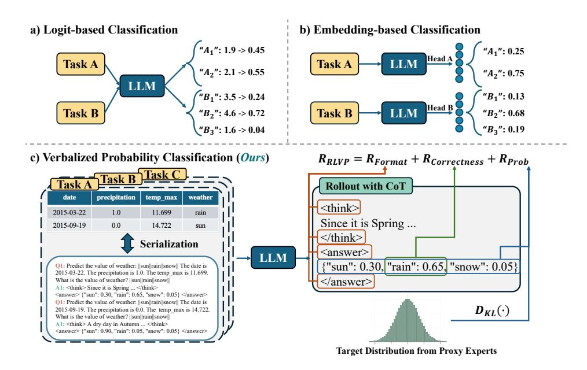
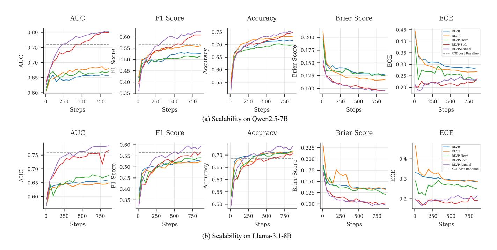
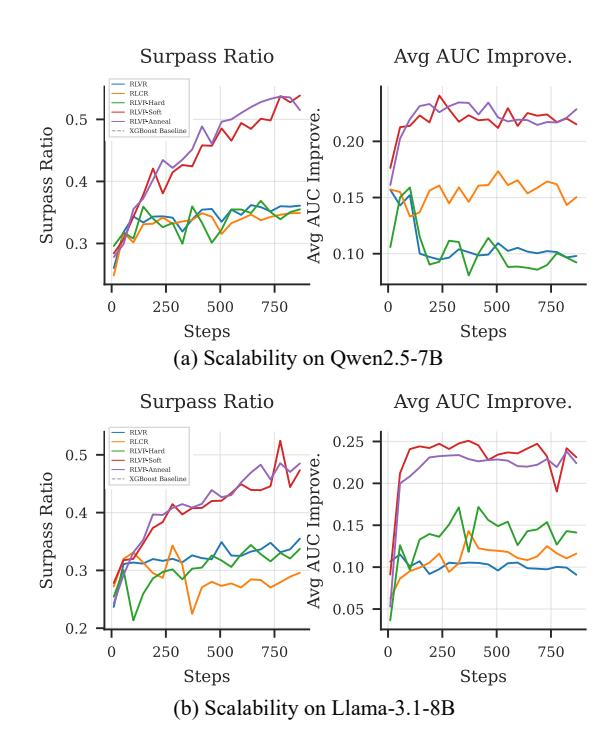
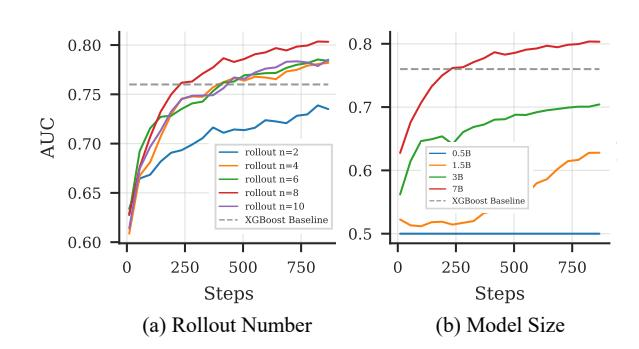

# Reinforcement Learning with Verbalized Probabilities for LLM Classification

Liyao Li∗ Zhejiang University Hangzhou, Zhejiang, China liliyao@zju.edu.cn

Hao Chen Zhejiang University Hangzhou, Zhejiang, China h.c.chen@zju.edu.cn

Jiaming Tian Zhejiang University Hangzhou, Zhejiang, China hsxz2@zju.edu.cn

Wentao Ye Zhejiang University Hangzhou, Zhejiang, China yewt01@zju.edu.cn

Lirong Gao Zhejiang University Hangzhou, Zhejiang, China gaolirong@zju.edu.cn

Chao Ye Zhejiang University Hangzhou, Zhejiang, China ye.chao@zju.edu.cn

Ningtao Wang† Ant Group Hangzhou, Zhejiang, China ningtao.nt@antgroup.com

Xing Fu Ant Group Hangzhou, Zhejiang, China zicai.fx@antgroup.com

Yu Cheng Ant Group Hangzhou, Zhejiang, China cy122623@antgroup.com

Haobo Wang Zhejiang University Hangzhou, Zhejiang, China wanghaobo@zju.edu.cn

Gang Chen† Zhejiang University Hangzhou, Zhejiang, China cg@zju.edu.cn

Junbo Zhao Zhejiang University Hangzhou, Zhejiang, China j.zhao@zju.edu.cn

# Abstract

While Large Language Models (LLMs) excel at many reasoning tasks, their native inability to produce calibrated, multi-class probability distributions limits their use in high-stakes Web applications like content moderation and fraud detection. Existing methods to elicit probabilities from LLMs either sacrifice their crucial Chainof-Thought (CoT) reasoning capabilities or suffer from poor calibration. To address this, we introduce a new paradigm, Verbalized Probability Distribution, and a novel training framework, RLVP (Reinforcement Learning with Verbalized Probabilities [1](#page-0-0) ). RLVP finetunes an LLM to generate both an interpretable CoT and a complete, verbalized probability distribution. We overcome the "insufficient reward granularity" problem in standard Reinforcement Learning (RL) for classification by using soft probabilities from expert tabular models as a dense reward curriculum. Through large-scale joint training on 169 tabular tasks, we demonstrate that a single RLVPtrained model can surpass a strong, task-specific XGBoost baseline on up to 55% of tasks. More importantly, the trained model achieves state-of-the-art few-shot performance on unseen, heterogeneous Web benchmarks that mix structured data with free text, achieving performance comparable to or superior than expert models

© 2026 Copyright held by the owner/author(s). ACM ISBN 979-8-4007-2307-0/2026/04 <https://doi.org/10.1145/3774904.3792540>

trained on the same limited data. This showcases a strong capability for generalization and knowledge transfer to complex Web data. Our work presents a viable path toward building general-purpose, probabilistically-sound, and interpretable foundation models for the Web.

# CCS Concepts

• Information systems → Data mining; • Computing methodologies → Transfer learning.

# Keywords

Large Language Models; Reinforcement Learning; Chain-of-Thought Reasoning; Data Mining

#### ACM Reference Format:

Liyao Li, Hao Chen, Jiaming Tian, Wentao Ye, Lirong Gao, Chao Ye, Ningtao Wang, Xing Fu, Yu Cheng, Haobo Wang, Gang Chen, and Junbo Zhao. 2026. Reinforcement Learning with Verbalized Probabilities for LLM Classification. In Proceedings of the ACM Web Conference 2026 (WWW '26), April 13–17, 2026, Dubai, United Arab Emirates. ACM, New York, NY, USA, [11](#page-10-0) pages. <https://doi.org/10.1145/3774904.3792540>

# 1 Introduction

Large Language Models (LLMs) [\[1,](#page-7-0) [15,](#page-8-0) [40\]](#page-8-1), particularly reasoning models capable of generating explicit chain-of-thought (CoT) [\[17,](#page-8-2) [22\]](#page-8-3), have demonstrated remarkable performance across diverse tasks due to their rich world knowledge and emergent reasoning abilities. However, the autoregressive nature of their training makes LLMs inherently inclined to output a single most probable label. This limitation becomes critical in high-stakes Web-related decisionmaking scenarios—including harmful content moderation [\[2,](#page-8-4) [28\]](#page-8-5), ecommerce fraud detection [\[27,](#page-8-6) [32\]](#page-8-7), and financial risk assessment [\[8,](#page-8-8)

∗Work done at Ant Group.

†Corresponding authors.

1Code and datasets are on [https://github.com/liyaooi/RLVP.](https://github.com/liyaooi/RLVP)

[This work is licensed under a Creative Commons Attribution 4.0 International License.](https://creativecommons.org/licenses/by/4.0) WWW '26, Dubai, United Arab Emirates

[39\]](#page-8-9)—where models must not only output a single prediction but also provide a well-calibrated probability distribution over all possible outcomes. Such distributions are vital for downstream decisionmaking, including setting risk thresholds, estimating uncertainty, and supporting effective human-in-the-loop verification [\[7\]](#page-8-10).

To elicit a full probability distribution from an LLM for classification, existing research has primarily explored two paradigms (Figure [1a](#page-3-0),b). The first, Logit-based Classification [\[10,](#page-8-11) [18,](#page-8-12) [30\]](#page-8-13), derives a probability distribution over the classes by normalizing the logits of label-specific tokens via a softmax function. The second, Embedding-based Classification [\[6\]](#page-8-14), treats the LLM as a feature extractor, training a task-specific classification head—typically a multi-layer perceptron (MLP)—on its final hidden-state embeddings. However, both approaches suffer from fundamental flaws. Logitbased approaches have been shown to produce severely miscalibrated probabilities when applying token-level logits over a large vocabulary space [\[24,](#page-8-15) [41,](#page-8-16) [48\]](#page-8-17). In contrast, embedding-based methods, while easier to optimize, inherently sacrifice the generative and reasoning capabilities of LLMs—especially their ability to produce interpretable reasoning chains.

A promising recent direction is verbalized confidence [\[38,](#page-8-18) [43,](#page-8-19) [45\]](#page-8-20), where an LLM expresses its belief in a single answer in natural language, a method shown to be better calibrated than logit-based approaches. This work has, however, been confined to single-label probabilities, largely due to its focus on open-ended question answering tasks where enumerating the answer space is intractable. Inspired by this, we see the nascent form of a new paradigm: Verbalized Probabilities Classification (Figure [1c](#page-3-0)), which would prompt the LLM to articulate a complete probability distribution over all classes. Concurrently, the reinforcement learning with verifiable rewards (RLVR) [\[17\]](#page-8-2) framework has proven effective in transforming vanilla LLMs into reasoning models that generate CoT, demonstrating generalization capabilities beyond supervised fine-tuning (SFT). The confluence of these needs and opportunities leads us to a novel research question: Can we train a single LLM to act as a probabilistic reasoning engine for the Web, capable of generating both an interpretable chain-of-thought and a well-calibrated verbalized probabilities distribution?

To address this, we initially applied the standard RLVR framework to classification, using only correctness as the reward signal. However, our experiments revealed a critical failure mode. Unlike the open-ended domains where RLVR has thrived, classification tasks possess a small, discrete answer space. This leads to a reward degeneracy problem due to insufficient reward granularity. For instance, two rollouts of the same question may produce different verbalized probability distributions, such as {A: 0.80, B: 0.15, C: 0.05} and {A: 0.51, B: 0.21, C: 0.28}, yet receive the same reward since both assign the maximum probability to the correct class A. This flat yet coarse-grained reward landscape offers no meaningful gradient for optimizing the model's ranking ability (measured by AUC) or its calibration (measured by ECE), causing performance stagnation and over-confident errors.

This challenge demands a denser, more informative probability reward signal: we measure the similarity between the model's verbalized distribution and a proxy of the true posterior. In Web datasets we only observe one-hot (hard) labels—a vector with 1 on the realized class and 0 elsewhere—so per-instance posteriors

are unavailable. We propose to leverage the soft probability outputs from highly-optimized expert models (e.g., XGBoost [\[29\]](#page-8-21), FT-Transformer [\[14\]](#page-8-22)) not as a target for imitation, but as a dense reward curriculum within our RL framework. An annealing schedule for a KL-divergence-based reward first guides the LLM to learn the "shape" of the probabilistic landscape from the expert, then allows it to fine-tune and ultimately surpass this guidance using the groundtruth labels. Our main contributions are:

- (1) We are the first to formulate and address the task of training an LLM to generate full, multi-class Verbalized Probability Distributions for Web classification tasks, complete with an interpretable Chain-of-Thought.
- (2) We identify the "insufficient reward granularity" problem of standard RLVR in this context and propose a novel expertguided RL framework that uses knowledge distillation as a reward curriculum to overcome it.
- (3) Through large-scale joint training and evaluation, we demonstrate that our single model achieves state-of-the-art few-shot performance on diverse Web-related benchmarks, significantly outperforming task-specific expert models on up to 55% of tasks.
- (4) We provide strong evidence of probabilistic reasoning transfer from structured Web data to unstructured Web text, showcasing a viable path toward bridging heterogeneous data silos on the Web.

# 2 Methodology

We introduce Reinforcement Learning with Verbalized Probabilities (RLVP), a framework designed to train a Large Language Model (LLM) to output not only a well-calibrated multi-class probability distribution but also a faithful chain-of-thought that justifies its prediction. RLVP achieves this by optimizing a composite reward signal that evaluates both the final prediction (the "what") and the reasoning process (the "why").

# 2.1 Problem Formulation

We formulate the task as multi-class probabilistic prediction on tabular data. Let D be a dataset of instances (x, ��∗ ), where x is a feature vector and �� ∗ is the ground-truth class label. Each feature vector consists of �� key-value pairs, x = {(��1, ��1), . . . , (����, ���� )}, where ���� is the name of the ��-th feature and ���� is its value. The label set is denoted by Y = {��1, . . . , ���� }, where �� is the number of classes, and �� ∗ ∈ Y.

To make this data accessible to an LLM, we first serialize the feature vector x into a natural language prompt, promptx = �� (x), using a key-value template:

The ��1 is ��1. The ��2 is ��2. . . . The ���� is ���� .

Given this prompt, our policy ���� , parameterized by the weights �� of an LLM, autoregressively generates a textual response �� = (��1, . . . , ����). This response �� is structured to contain two distinct components, which are parsed post-generation:

- A reasoning trace, or chain-of-thought, ��, enclosed in <think> ... </think> tags.
- A final answer, which is a verbalized probability distribution p�� (x) over the label set Y, enclosed in <answer> ... </answer>

tags. This is parsed from a JSON object (e.g., {"A": 0.45, "B": 0.30, ...}) into a probability vector p�� (x) = [��1, . . . , ���� ] such that �� ��=1 ���� = 1.

The objective of our framework is to learn the optimal policy parameters �� ∗ that maximize the expected composite reward, ��RLVP. This reward is a function of the generated components (��, p�� (x)) and the ground-truth label �� ∗ . The optimization objective is thus:

�� ∗ = arg max �� E(x,��∗ )∼D -��RLVP (��, p�� (x)), ��∗ (1)

where the generated components (��, p�� (x)) are parsed from the full textual response �� ∼ ���� (�� (x)). The design of reward ��RLVP is detailed in the following section.

#### 2.2 Reward Design

To address the challenge of insufficient reward granularity, we design a composite reward signal, ��RLVP, consisting of three key components that collectively guide the model towards becoming an accurate and calibrated probabilistic reasoner.

2.2.1 Probabilistic Alignment Reward. This component is central to our framework and provides a dense, fine-grained signal for calibration. To guide the LLM's predicted distribution p�� (x) towards a target distribution, we use a probability reward based on the Kullback-Leibler (KL) divergence [\[26\]](#page-8-23). To ensure the reward is well-behaved within a composite signal, we map the KL divergence, which ranges from [0, ∞), to a normalized score in [0, 1] by taking its negative exponential. The reward is formulated as:

��Prob = exp − (1 − ��)������ (y ∗ ��ℎ ||p�� (x)) + �������� (qsoft||p�� (x)) (2)

Here, y ∗ ��ℎ is the one-hot vector for the ground-truth label �� ∗ , and qsoft is a soft probability distribution from an expert model. The weighted sum of KL divergences allows us to dynamically balance two objectives: aligning with the certain but over-confident groundtruth (one-hot) and distilling the nuanced but potentially biased knowledge from the expert (soft probabilities). The hyperparameter �� ∈ [0, 1] acts as an annealing factor, enabling a curriculum learning strategy. In our experiments, a linear decay of �� from 1 to 0 during training was more effective than a fixed value, as it allows the LLM to first learn the general probabilistic landscape from the expert and then gradually focus on fitting the ground-truth, preventing it from overfitting to the teacher's biases.

2.2.2 Correctness Reward. While the probabilistic reward encourages calibration, a direct incentive for accuracy remains crucial. We include a binary reward that mirrors the standard result-centric reward in RLVP, providing an unambiguous signal for correctness. A reward of 1 is given if the class with the highest predicted probability corresponds to the true class �� ∗ :

��Correctness = I arg max �� (p�� (x))�� = arg max �� (y ∗ ��ℎ)�� (3)

where I(·) is the indicator function. This component ensures that the primary goal of the classification task is always maintained, preventing the model from producing well-calibrated but inaccurate predictions.

2.2.3 Format Reward. To ensure the practical usability of the LLM's output in automated pipelines, we introduce a strict format reward. This binary signal acts as a structural guardrail for the generation process. The model receives ��Format = 1 if and only if its output adheres to all predefined structural rules: it must contain both the <think> and <answer> tags, the content within the answer tag must be a parsable JSON object, and the probabilities within this object must sum to 1 (within a floating-point tolerance of �� = 10−5 ). Otherwise, the reward is 0. This component is essential for maintaining a high rate of valid and machine-readable outputs during training and inference.

2.2.4 Composite Reward. The final reward signal is the unweighted sum of these three components. This balanced approach ensures that the model is simultaneously encouraged to be syntactically reliable (��Format), accurate (��Correctness), and well-calibrated (��Prob).

��RLVP = ��Format + ��Correctness + ��Prob (4)

This scalar reward provides a rich, multi-faceted learning signal that is then used to estimate policy gradients via a standard RL algorithm such as Group Relative Policy Optimization (GRPO) [\[35\]](#page-8-24).

# 2.3 Soft Probabilities for the Reward

The effectiveness of our probabilistic alignment reward hinges on the quality of the soft probability target, qsoft. The use of soft targets is conceptually related to established techniques like Knowledge Distillation (KD) [\[20\]](#page-8-25) and Label Smoothing [\[37\]](#page-8-26). However, our approach is fundamentally distinct in both the source of these probabilities and their application.

First, unlike Label Smoothing, which uses a static, instanceagnostic mixture of the one-hot label and a uniform distribution, our soft targets are instance-specific and adaptive. We generate them using a pre-trained expert model, such as XGBoost [\[29\]](#page-8-21), which has learned a robust approximation of the posterior probability �� (��|x) by training on the entire dataset. This expert can assign high confidence to an easy sample and low confidence to an ambiguous one, providing a far richer and more informative signal than a uniform distribution.

Second, and more critically, we depart from the standard KD paradigm. Traditional KD employs soft labels as a supervised target within a loss function, directly training a student to mimic a teacher. In contrast, we re-purpose the expert's knowledge as a dynamic reward signal within a reinforcement learning framework. This transforms the teacher's outputs from a static "answer key" to be imitated into a "guidance curriculum" that shapes the LLM's exploration of the policy space. This allows the LLM to leverage the expert's insights to navigate the complex landscape of probabilistic reasoning more effectively, without being strictly bounded by the teacher's limitations, enabling the potential to surpass it.

In our implementation, for each task, we first train an XGBoost model on the full training split of the dataset to serve as the expert. This model is then used to infer the soft probabilities, qsoft, for all samples in the training set. To mitigate the impact of potentially noisy or incorrect signals from the teacher, we apply a crucial filtering step: only those samples where the expert model's predicted class (i.e., the class with the highest probability) matches

推荐使⽤⽅法 这样可以获得⾼质量的 ⽂件 如果你 https://claude.ai/chat/36e107aa-29d5-4910-b041-18135e0648e3 1/1 Figure 1: An illustration of three paradigms for LLM-based classification. (a) Logit-based Classification derives probabilities by normalizing the logits of specific class tokens from the LLM's vast vocabulary. (b) Embedding-based Classification uses the LLM as a feature extractor for a separate, non-generative classification head, sacrificing CoT capabilities. (c) Our proposed Verbalized Probability Classification trains the LLM end-to-end to generate an explicit Chain-of-Thought (CoT) and a full probability distribution, guided by a composite reward signal that includes a probabilistic alignment component from an expert model.

the ground-truth label are used for calculating the ��Prob component. This ensures that the LLM is guided by a high-fidelity reward signal.

## 3 Experiments

We conduct a series of comprehensive experiments to rigorously evaluate our proposed framework, RLVP. The experimental design is structured to systematically answer four core Research Questions that investigate the framework's foundational effectiveness, its internal reasoning mechanism, and its capabilities for large-scale learning and generalization, particularly in the context of Web data. Our primary research questions are:

- RQ1 (Effectiveness): How effective is our RLVP framework on individual tabular tasks compared to traditional expert models and alternative LLM-based probabilistic classification paradigms (e.g., logit-based, embedding-based with a classification head)?
- RQ2 (Scalability): How does RLVP perform when scaled up via joint multi-task training on a large and diverse corpus of tabular datasets, and does this demonstrate a scaling law indicative of emergent capabilities?
- RQ3 (Generalization): Can a single model, jointly trained via RLVP, exhibit strong zero-shot or few-shot generalization to entirely unseen tasks, including both structured tabular data and unstructured Web text?
- RQ4 (Ablation): How do key training configurations—specifically the number of rollouts per prompt and the size of the base LLM—impact the learning dynamics and final performance of RLVP?

#### 3.1 Experimental Setup

3.1.1 Datasets. Our evaluation spans three categories of datasets to ensure a comprehensive assessment. More details are in the Appendix [A.1.](#page-9-0)

- Representative Web Tasks: We selected a curated set of 6 diverse, publicly available tabular tasks with semantically rich column names, reflecting real-world Web mining scenarios: IMDb Movies [\[34\]](#page-8-27), Loan Amount [\[23\]](#page-8-28), Employee Attrition [\[31\]](#page-8-29), Customer Churn [\[4\]](#page-8-30), Stroke Prediction [\[11\]](#page-8-31), and Uber Analysis [\[3\]](#page-8-32). For datasets with abbreviated column names, we expanded them to their full descriptions based on official documentation to leverage the LLM's semantic understanding. Datasets with anonymized column names were not considered. For each dataset, we create a stratified 80/20 train/test split. The soft probabilities for each training sample were obtained by first training an XGBoost model on the full training split, then generating predictions for the training set, and finally retaining only those samples where the XGBoost model's prediction was correct. These 6 datasets are primarily used to address RQ1.
- Large-Scale Structured Benchmark: We use the "supervised" subset of 169 datasets from the UniPredict benchmark, adopting the corrected version from [\[13\]](#page-8-33) which resolves issues of erroneously treated categorical targets in the original. These are high-quality tabular datasets with generally informative column names drawn directly from Kaggle. For each individual dataset, we apply the same 80/20 splitting and soft probability generation process as described above. During training, the training splits from all datasets are randomly mixed for joint multi-task

Table 1: Performance comparison on representative Web tasks. We report AUC, Accuracy (ACC), and ECE for all methods. The best result in each column is bold. The proposed RLVP-Anneal method (highlighted in gray) achieves leading performance among generative reasoning models and surpasses strong tabular baselines on most tasks.

| Model           | AUC    | IMDB ACC | Movies ECE | ↓ AUC  | Loan ACC | Amount ECE | ↓ AUC  | Employee ACC Traditional | Attrition ECE Tabular | ↓ AUC Models | Customer ACC | Churn ECE | ↓ AUC  | Stroke ACC | Prediction ECE | ↓ AUC  | Uber ACC | Analysis ECE ↓ |
|-----------------|--------|----------|------------|--------|----------|------------|--------|--------------------------|-----------------------|--------------|--------------|-----------|--------|------------|----------------|--------|----------|----------------|
| XGBoost         | 0.7314 | 0.4950   | 0.0492     | 0.8388 | 0.8306   | 0.1424     | 0.7668 | 0.8475                   | 0.0235                | 0.8380       | 0.7949       | 0.1681    | 0.8434 | 0.9501     | 0.0194         | 0.8558 | 0.9483   | 0.0431         |
| LightGBM        | 0.6740 | 0.4505   | 0.0352     | 0.7991 | 0.8306   | 0.1535     | 0.7570 | 0.8508                   | 0.0459                | 0.8466       | 0.7892       | 0.0350    | 0.8331 | 0.9511     | 0.0181         | 0.7444 | 0.9310   | 0.0177         |
| FT-Transformer  | 0.5785 | 0.3069   | 0.0282     | 0.7695 | 0.7500   | 0.0394     | 0.6576 | 0.8305                   | 0.0595                | 0.6375       | 0.6615       | 0.3214    | 0.8060 | 0.9501     | 0.0038         | 0.8845 | 0.9224   | 0.0632         |
|                 |        |          |            |        |          |            |        | Alternative              | LLM                   | Paradigms    |              |           |        |            |                |        |          |                |
| SFT-Hard        | 0.6898 | 0.6089   | 0.1321     | 0.9806 | 0.9597   | 0.2579     | 0.9613 | 0.9119                   | 0.1053                | 0.9279       | 0.8673       | 0.1325    | 0.9719 | 0.9824     | 0.0282         | 0.9731 | 0.9526   | 0.0426         |
| SFT-Soft        | 0.6892 | 0.6089   | 0.1273     | 0.9809 | 0.9597   | 0.2574     | 0.9610 | 0.9085                   | 0.1059                | 0.9259       | 0.8687       | 0.1311    | 0.9800 | 0.9892     | 0.0296         | 0.9790 | 0.9569   | 0.0382         |
| Logit-based     | 0.6685 | 0.6733   | 0.1777     | 0.9746 | 0.9516   | 0.0529     | 0.9672 | 0.9559                   | 0.1286                | 0.9454       | 0.8055       | 0.1004    | 0.5001 | 0.9932     | 0.4932         | 0.8850 | 0.9741   | 0.0242         |
| Embedding-based | 0.5509 | 0.5594   | 0.0827     | 0.9746 | 0.9597   | 0.0500     | 0.9479 | 0.9356                   | 0.0722                | 0.9499       | 0.8744       | 0.0315    | 0.5567 | 0.9932     | 0.0066         | 0.8986 | 0.9741   | 0.0236         |
|                 |        |          |            |        |          |            |        | RL Baselines             | and                   | Ablations    |              |           |        |            |                |        |          |                |
| RLVR            | 0.6098 | 0.6485   | 0.0614     | 0.9764 | 0.9597   | 0.1081     | 0.6538 | 0.9695                   | 0.0215                | 0.5000       | 0.7963       | 0.2037    | 0.5000 | 0.9932     | 0.0068         | 0.5000 | 0.9741   | 0.0259         |
| RLCR            | 0.6220 | 0.6832   | 0.3168     | 0.9764 | 0.9597   | 0.0403     | 0.5000 | 0.9695                   | 0.0305                | 0.5000       | 0.7963       | 0.2037    | 0.5000 | 0.9932     | 0.0068         | 0.5000 | 0.9741   | 0.0259         |
| RLVP-Hard       | 0.6776 | 0.6634   | 0.2460     | 0.9764 | 0.9597   | 0.0403     | 0.5938 | 0.9695                   | 0.0305                | 0.7853       | 0.6586       | 0.3384    | 0.5000 | 0.9932     | 0.0068         | 0.5000 | 0.9741   | 0.0259         |
| RLVP-Soft       | 0.7614 | 0.6634   | 0.1644     | 0.9811 | 0.9597   | 0.2525     | 0.9023 | 0.9695                   | 0.0466                | 0.8868       | 0.7963       | 0.1519    | 0.9431 | 0.9932     | 0.0218         | 0.7765 | 0.9741   | 0.0247         |
| RLVP-Anneal     | 0.7830 | 0.6436   | 0.1693     | 0.9803 | 0.9597   | 0.2444     | 0.9187 | 0.9660                   | 0.0735                | 0.9506       | 0.9269       | 0.0726    | 0.9596 | 0.9932     | 0.0280         | 0.9841 | 0.9741   | 0.0153         |

learning. The single resulting model is then evaluated on the corresponding test sets for in-distribution validation. This benchmark is primarily used to address RQ2.

- Unseen Generalization Tasks: To test generalization (RQ3), we use the 8 classification datasets from the AutoML Multimodal Benchmark (AMLB) [\[36\]](#page-8-34). This suite includes tables with one or more free-text fields (such as an Airbnb description or a product review), which are considered challenging for traditional tabular models due to non-standard text features, and also for LLMs due to the highly variable lengths of text. These datasets are used exclusively for zero- and few-shot testing without any prior splitting.

3.1.2 Methods. We compare our full RLVP approach against a series of strong baselines and ablations to systematically evaluate its components.

- Traditional Tabular Models: State-of-the-art GBDTs (XGBoost [\[29\]](#page-8-21), LightGBM [\[25\]](#page-8-35)) and a leading deep learning model for tabular data (FT-Transformer [\[14\]](#page-8-22)).
- Alternative LLM Paradigms: We compare against several distinct paradigms for LLM-based classification. First, to provide direct comparisons within the same verbalized probability output format as our RL method, we include two supervised fine-tuning (SFT) baselines: SFT-Hard, fine-tuned on one-hot labels, and SFT-Soft, fine-tuned on the expert model's soft probabilities. We then evaluate two alternative paradigms that do not generate probability distributions as text. The Logit-based approach [\[33\]](#page-8-36) treats classification as a constrained generation task, mapping labels to verbalizer tokens (e.g., "good") to compute probabilities. The Embedding-based approach [\[6\]](#page-8-14) instead utilizes the LLM as a frozen feature extractor, training a linear classification head on the final hidden states. Implementation details for both paradigms are provided in Appendix [A.5.](#page-10-1) Notably, none of these alternative paradigms can generate an explainable CoT.
- RL Baselines and Ablations: We ablate our reward design with several variants.

RLVR: Represents the standard application of RL for accuracy, using only correctness and format rewards: ��RLVR = ��Format + ��Correctness.

RLCR: A recent paradigm for eliciting a model's intrinsic confidence without external soft labels [\[9\]](#page-8-37). We adapt this singlecalibrated against the one-hot correctness of that answer.

answer calibration approach to our multi-class setting. It uses the model's self-reported confidence in its chosen answer, This serves as a strong baseline to contrast with our external knowledge-based method. The reward is: ��RLCR = ��RLVR + ����������(p, I(arg max(p) = �� ∗ )). RLVP-Hard (�� = 0): A variant of our method that only uses hard one-hot labels for the probabilistic reward. RLVP-Soft (�� = 1): A variant that only uses soft probabilities from the expert model. RLVP-Anneal: Our main proposal, where �� anneals linearly from 1 to 0 over the course of training.

3.1.3 Evaluation Metrics. To provide a holistic view of model performance, we evaluate using metrics that assess both classification accuracy and probabilistic calibration. All metrics are computed against the ground-truth one-hot labels.

- Area under ROC curve (AUC): Measures the ability of a classifier to distinguish between classes across all thresholds. For a multi-class setting with �� classes, it is defined as:

AUC = 1 �� ∑︁�� ��=1 ∫ 1 0 TPR�� (FPR−1 �� (��))���� (5)

- F1-Score and Accuracy: Standard metrics based on the class with the highest predicted probability.
- Brier Score: A proper scoring rule measuring the mean squared error between the predicted probability distribution p and the one-hot ground-truth outcome y ∗ .

Brier Score = 1 �� ∑︁�� ��=1 ∑︁�� ��=1 (������ − �� ∗ ���� ) 2 (6)

Figure 2: Average performance over 169 UniPredict test sets as a function of training steps. Our RLVP-Anneal method achieves the best overall performance, surpassing the average of individually trained XGBoost models.

where �� is the number of samples and ������ is the predicted probability of sample �� for class ��.

- Expected Calibration Error (ECE): Measures the discrepancy between predicted probabilities and empirical accuracy. We use �� = 10 bins.

ECE = ∑︁�� ��=1 |���� | �� |acc(����) − conf(����)| (7)

where ���� is the set of predictions whose confidence falls into the ��-th bin.

3.1.4 Training Details. We use Group Relative Policy Optimization (GRPO) [\[35\]](#page-8-24) as the base RL algorithm. Following recent work on RL training for LM reasoning, we initialize directly from the RL policy and do not use any KL regularization against a reference model [\[5,](#page-8-38) [19\]](#page-8-39). Specifically, we primarily use the Qwen2.5-7B Instruct model, part of the Qwen family [\[44\]](#page-8-40) recognized for strong performance in RL tasks [\[12,](#page-8-41) [21,](#page-8-42) [47\]](#page-8-43), as our base LLM due to its strong instruction-following capabilities. In each training step, we generate 8 responses per prompt with a temperature of 0.7, and use an effective batch size of 1024. See Appendices [A.2](#page-9-1) and [A.3](#page-9-2) for hyperparameters and computational resources.

# 3.2 Effectiveness on Individual Tasks (RQ1)

To answer RQ1, we validate the foundational effectiveness of RLVP on our 6 representative Web tasks. This experiment is designed to demonstrate the superiority of our proposed paradigm over existing methods on a task-by-task basis. The comprehensive results

are presented in Table [1.](#page-4-0) Our main proposal, RLVP-Anneal, consistently demonstrates the strongest performance overall, achieving the highest average scores across the critical metrics of AUC and ECE. Notably, RLVP-Anneal surpasses the powerful XGBoost baseline on 6 tasks in AUC, establishing itself as a robust alternative to traditional expert models.

A key technical insight from these results is the divergent behavior between discrete-reward and soft-reward paradigms. We observed that baselines relying on discrete rewards (RLVR, RLCR, RLVP-Hard) frequently suffer from "probability collapse," where the model tends to output a probability for only a single predicted label (often 1.0) rather than a complete distribution over the entire label space. This failure to express probabilities for non-predicted classes destroys the granular ranking information required for AUC. Consequently, the metric degenerates to 0.500 (random) on tasks like Customer Churn, even when the accuracy remains high due to the model unexpectedly acting as a deterministic, majority-class classifier. This failure mode underscores a critical limitation of standard RL: without dense signals, it fails to constrain the model to output a comprehensive, calibrated probability distribution. In contrast, by incorporating soft labels from expert models as a dense reward signal, RLVP-Anneal benefits from a significantly smoother optimization landscape. This prevents the model from being trapped in deterministic local optima and provides a dense curriculum for navigating the probabilistic space, supporting the generation of stable, well-calibrated distributions.

Furthermore, comparison with alternative LLM paradigms highlights the unique benefits of our framework. The superior AUC and ECE of RLVP-Anneal over SFT-Soft validates the necessity of the RL

Figure 3: Analysis of LLMs surpassing the XGBoost teacher on AUC. Left: Percentage of datasets where the LLM outperforms the teacher ("Surpass Ratio"). Right: Average AUC gain on those specific datasets.

framework for moving beyond simple imitation of teacher biases. While Logit-based and SFT-Hard methods exhibit poor calibration, and Embedding-based methods sacrifice the model's generative reasoning ability, RLVP-Anneal successfully balances the calibration benefits of soft expert guidance with the accuracy focus of hard ground-truth labels. This annealing strategy achieves the best of both worlds, ensuring the model evolves into a rational reasoner capable of producing both highly accurate predictions and well-calibrated verbalized probability distributions.

#### 3.3 Scalability via Large-Scale Training (RQ2)

To answer RQ2, we test the hypothesis that RLVP enables scalable learning. We conduct this experiment on two powerful base models: Qwen2.5-7B-Instruct and Llama-3.1-8B-Instruct. A single model for each family was jointly trained on the mixed training samples from all 169 UniPredict tasks for 3 epochs.

Figure [2](#page-5-0) shows the average performance of our RL variants across all test sets as training progresses, compared to a static XGBoost baseline. We observe a distinct performance hierarchy: while standard RLVR is able to improve over random guessing, it converges to a suboptimal level and fails to match the strong baseline established by the XGBoost teacher. This suggests that the sparse binary correctness reward, while useful, is insufficient for guiding the model to master fine-grained probabilistic ranking. In contrast, the RLVP variants leveraging soft expert labels significantly outperform both RLVR and the XGBoost baseline in probabilistic metrics (AUC, Brier, ECE). This confirms that incorporating soft probabilities acts as a dense reward curriculum, creating a smoother optimization landscape that prevents the policy from stagnating.

Among the variants, RLVP-Anneal and RLVP-Soft perform better than the hard-label-only RLVP-Hard. For both base models, RLVP-Anneal achieves the highest AUC and F1-score, consistently surpassing the XGBoost baseline. Notably, while RLVP-Soft is strong on calibration, it exhibits a significant drop in accuracy and F1. We hypothesize this is due to the model overfitting to potential biases or errors in the teacher's soft probabilities. This validates our annealing strategy, which uses soft probabilities for an initial warmup of probabilistic shaping before gradually shifting focus to ground-truth hard labels to ultimately surpass the teacher's limitations. More concretely, Figure [3](#page-6-0) illustrates that RLVP variants using soft probabilities achieve the highest "Surpass Ratio" against the XGBoost teacher—reaching up to 55% on Qwen and 50% on Llama—while yielding superior average AUC gains compared to other RL baselines. This variance implies the method's performance ceiling depends on the base model's capabilities, consistent with the ablation results in Section [3.5.](#page-7-1)

Table 2: Zero-shot and few-shot performance on unseen tasks from the AMLB benchmark. We compare our single, jointly trained RLVP-Anneal model (�� = 0, 32) against a task-specific XGBoost trained on �� = 32 shots.

| Dataset                | XGB (k=32) | AUC RLVP (k=0) | RLVP (k=32) |
|------------------------|------------|----------------|-------------|
| data_scientist_salary  | 0.4577     | 0.6959         | 0.5941      |
| imdb_genre_prediction  | 0.6075     | 0.8282         | 0.8258      |
| jigsaw_unintended_bias | 0.5000     | 0.8943         | 0.9573      |
| kick_starter_funding   | 0.5660     | 0.4331         | 0.4393      |
| melbourne_airbnb       | 0.6541     | 0.5618         | 0.5008      |
| news_channel           | 0.5613     | 0.5534         | 0.5016      |
| product_sentiment      | 0.5382     | 0.3703         | 0.6417      |
| wine_reviews           | 0.6406     | 0.8734         | 0.8012      |

#### 3.4 Generalization to Unseen Tasks (RQ3)

To answer RQ3, we evaluate the single model jointly trained on the UniPredict benchmark on its zero- and few-shot performance on the held-out AMLB benchmark. This benchmark is particularly suitable as it contains complex, real-world Web data mixing structured features with rich, unstructured free-text fields.

To ensure a fair comparison, we evaluate our model against an XGBoost baseline that is also trained in a few-shot manner. For each task, we train and tune a separate XGBoost model on the exact same �� = 32 examples that our LLM sees in its context. As shown in Table [2,](#page-6-1) our model demonstrates strong generalization capabilities. In the zero-shot setting (�� = 0), it already achieves competitive performance, surpassing the few-shot XGBoost baseline (�� = 32) on half of the tasks—a feat impossible for traditional models which require training data. Furthermore, providing in-context examples (�� = 32) leads to substantial performance gains on specific challenging datasets, showing the model's ability to adapt via context. Overall, RLVP exhibits performance that is comparable to or superior than task-specific expert models on the majority of

Figure 4: Ablation studies. (a) Rollout Number (��): Training stability improves with larger ��, saturating at �� = 8. (b) Model Size: Performance scales with capacity; the 0.5B model fails to learn, while the 7B model achieves optimal results.

heterogeneous Web tasks. This demonstrates that our framework learns abstract reasoning skills robustly applicable to unseen data, fulfilling a key goal of a true tabular foundation model.

# 3.5 Ablation Study (RQ4)

To answer RQ4, we investigate the impact of rollout quantity and model scale on RLVP. First, since the generation of rollouts dominates the computational time in RL post-training, identifying the minimum number of rollouts (��) required for stable convergence is crucial for training efficiency. As shown in Figure [4\(](#page-7-2)a), training with a low sample size (�� = 2) results in high variance and suboptimal convergence due to noisy advantage estimation. Performance improves consistently as �� increases and effectively saturates around �� = 8. Consequently, we adopt �� = 8 as the default setting to balance the computational cost of generation with the stability of the gradient updates.

Second, we explore the boundaries of model capacity to determine if lower-cost models can effectively support RLVP. We compared Qwen2.5 models ranging from 0.5B to 7B. Figure [4\(](#page-7-2)b) reveals a stark scaling law. The 0.5B model fails to learn the task, with AUC remaining near random guessing (0.5), indicating that very small models lack the requisite reasoning capabilities to align with the composite reward. However, incorporating a "cold start" SFT phase could stabilize optimization [\[17\]](#page-8-2), potentially unlocking the capabilities of these smaller architectures. While 1.5B and 3B models show progressive improvements, the 7B model demonstrates the most robust learning curve and highest final AUC. This suggests that the ability to jointly optimize for interpretable reasoning and calibrated probabilities is an emergent property that relies on sufficient model scale.

# 4 Related Work

Research into LLMs for tabular classification has evolved alongside the dominant GBDT paradigm [\[16\]](#page-8-44), branching primarily into Embedding-based Fine-tuning [\[6\]](#page-8-14) and Direct Generative Classification [\[13\]](#page-8-33). The former treats LLMs as feature extractors for nongenerative heads, leveraging the model's ability to encode structured information into an invariant latent space [\[46\]](#page-8-45). While often yielding calibrated outputs, this setup inherently sacrifices the

model's generative interpretability and Chain-of-Thought (CoT) capabilities [\[42\]](#page-8-46). Conversely, the latter reframes classification as next-token prediction, preserving end-to-end reasoning but typically producing deterministic labels that preclude probabilistic analysis. RLVP bridges this divide by unifying multi-class probabilistic outputs with generative reasoning.

Regarding probabilistic calibration, reliable uncertainty estimation in LLMs remains a significant bottleneck. Logit-based Probing [\[10,](#page-8-11) [18,](#page-8-12) [30\]](#page-8-13) is frequently used but is prone to severe miscalibration within the massive vocabulary space of LLMs [\[24\]](#page-8-15). While Verbalized Confidence [\[38,](#page-8-18) [43,](#page-8-19) [45\]](#page-8-20) has emerged as a better-calibrated alternative [\[41\]](#page-8-16), prior research has been largely confined to singlelabel estimation in open-ended contexts. We extend this paradigm to a complete, multi-class Verbalized Probability Distribution, enabling both calibrated and interpretable probabilistic reasoning within a unified generative framework.

Finally, in the context of RL alignment and knowledge distillation, traditional frameworks like RLVR [\[17\]](#page-8-2) align models via correctness-based rewards, but these discrete signals are often too coarse for the requirements of multi-class classification. Inspired by Knowledge Distillation (KD) [\[20\]](#page-8-25), RLVP repurposes expert soft probabilities not as static imitation targets, but as a dense reward curriculum within the RL framework. This approach provides a smoother optimization landscape, facilitating the learning of wellcalibrated distributions while preserving the essential generative reasoning ability of the base LLM.

# 5 Conclusion

In this work, we addressed a fundamental limitation of LLMs in Web applications: their inability to function as robust, interpretable probabilistic reasoners. We introduced RLVP, a reinforcement learning framework that successfully trains an LLM to generate both an explanatory Chain-of-Thought and a well-calibrated, multi-class Verbalized Probability Distribution. By identifying the "insufficient reward granularity" problem of standard RL in classification, and solving it with a novel reward curriculum that distills knowledge from expert models, we have established a new paradigm for this task.

Our extensive experiments show that a single model trained with RLVP on a large corpus of tabular data achieves state-of-the-art few-shot performance on a wide range of unseen, heterogeneous Web benchmarks, significantly outperforming task-specific expert models. More importantly, we provide the first evidence that abstract probabilistic reasoning skills learned on structured data can generalize to improve calibration on unstructured text. This work represents a significant step towards building AI systems for the Web that are not only knowledgeable but also rational, self-aware, and trustworthy.

# Acknowledgments

This paper is supported by the National Regional Innovationand Development Joint Fund (No. U24A20254). This work is also supported by Ant Group.

# References

[1] Josh Achiam, Steven Adler, Sandhini Agarwal, Lama Ahmad, Ilge Akkaya, Florencia Leoni Aleman, Diogo Almeida, Janko Altenschmidt, Sam Altman, Shyamal

Anadkat, et al. 2023. Gpt-4 technical report. arXiv preprint arXiv:2303.08774 (2023). [2] Vashist Avadhanula, Omar Abdul Baki, Hamsa Bastani, Osbert Bastani, Caner Gocmen, Daniel Haimovich, Darren Hwang, Dima Karamshuk, Thomas Leeper, Jiayuan Ma, et al. 2022. Bandits for online calibration: An application to content moderation on social media platforms. arXiv preprint arXiv:2211.06516 (2022). [3] Bhanu Pratap Biswas. 2020. Uber Data Analysis. [https://www.kaggle.com/](https://www.kaggle.com/datasets/bhanupratapbiswas/uber-data-analysis) [datasets/bhanupratapbiswas/uber-data-analysis](https://www.kaggle.com/datasets/bhanupratapbiswas/uber-data-analysis) [4] BlastChar. 2018. Telco Customer Churn. [https://www.kaggle.com/datasets/](https://www.kaggle.com/datasets/blastchar/telco-customer-churn) [blastchar/telco-customer-churn](https://www.kaggle.com/datasets/blastchar/telco-customer-churn) [5] Xiangxiang Chu, Hailang Huang, Xiao Zhang, Fei Wei, and Yong Wang. 2025. Gpg: A simple and strong reinforcement learning baseline for model reasoning. arXiv preprint arXiv:2504.02546 (2025). [6] ChunLiu ChunLiu, Hongguang Zhang, Kainan Zhao, Xinghai Ju, and Lin Yang. 2024. LLMEmbed: Rethinking Lightweight LLM's Genuine Function in Text Classification. In ACL (1). 7994–8004. [https://doi.org/10.18653/v1/2024.acl-long.](https://doi.org/10.18653/v1/2024.acl-long.433) [433](https://doi.org/10.18653/v1/2024.acl-long.433) [7] Jesse C. Cresswell, Yi Sui, Bhargava Kumar, and Noël Vouitsis. 2024. Conformal Prediction Sets Improve Human Decision Making. In Forty-first International Conference on Machine Learning.<https://openreview.net/forum?id=4CO45y7Mlv> [8] Mark Cummins, Fabian Gogolin, Fearghal Kearney, Greg Kiely, and Bernard Murphy. 2023. Practice-relevant model validation: distributional parameter risk analysis in financial model risk management. Annals of Operations Research 330, 1 (2023), 431–455. [9] Mehul Damani, Isha Puri, Stewart Slocum, Idan Shenfeld, Leshem Choshen, Yoon Kim, and Jacob Andreas. 2025. Beyond Binary Rewards: Training LMs to Reason About Their Uncertainty. arXiv preprint arXiv:2507.16806 (2025). [10] Ekaterina Fadeeva, Aleksandr Rubashevskii, Artem Shelmanov, Sergey Petrakov, Haonan Li, Hamdy Mubarak, Evgenii Tsymbalov, Gleb Kuzmin, Alexander Panchenko, Timothy Baldwin, et al. 2024. Fact-checking the output of large language models via token-level uncertainty quantification. arXiv preprint arXiv:2403.04696 (2024). [11] Fedesoriano. 2020. Stroke Prediction Dataset. [https://www.kaggle.com/datasets/](https://www.kaggle.com/datasets/fedesoriano/stroke-prediction-dataset) [fedesoriano/stroke-prediction-dataset](https://www.kaggle.com/datasets/fedesoriano/stroke-prediction-dataset) [12] Zhaopeng Feng, Shaosheng Cao, Jiahan Ren, Jiayuan Su, Ruizhe Chen, Yan Zhang, Zhe Xu, Yao Hu, Jian Wu, and Zuozhu Liu. 2025. Mt-r1-zero: Advancing llmbased machine translation via r1-zero-like reinforcement learning. arXiv preprint arXiv:2504.10160 (2025). [13] Josh Gardner, Juan C Perdomo, and Ludwig Schmidt. 2024. Large scale transfer learning for tabular data via language modeling. Advances in Neural Information Processing Systems 37 (2024), 45155–45205. [14] Yury Gorishniy, Ivan Rubachev, Valentin Khrulkov, and Artem Babenko. 2021. Revisiting deep learning models for tabular data. Advances in neural information processing systems 34 (2021), 18932–18943. [15] Aaron Grattafiori, Abhimanyu Dubey, Abhinav Jauhri, Abhinav Pandey, Abhishek Kadian, Ahmad Al-Dahle, Aiesha Letman, Akhil Mathur, Alan Schelten, Alex Vaughan, et al. 2024. The llama 3 herd of models. arXiv preprint arXiv:2407.21783 (2024). [16] Léo Grinsztajn, Edouard Oyallon, and Gaël Varoquaux. 2022. Why do tree-based models still outperform deep learning on typical tabular data? Advances in neural information processing systems 35 (2022), 507–520. [17] Daya Guo, Dejian Yang, Haowei Zhang, Junxiao Song, Ruoyu Zhang, Runxin Xu, Qihao Zhu, Shirong Ma, Peiyi Wang, Xiao Bi, et al. 2025. Deepseek-r1: Incentivizing reasoning capability in llms via reinforcement learning. arXiv preprint arXiv:2501.12948 (2025). [18] Neha Gupta, Harikrishna Narasimhan, Wittawat Jitkrittum, Ankit Singh Rawat, Aditya Krishna Menon, and Sanjiv Kumar. 2024. Language model cascades: Token-level uncertainty and beyond. arXiv preprint arXiv:2404.10136 (2024). [19] Yaru Hao, Li Dong, Xun Wu, Shaohan Huang, Zewen Chi, and Furu Wei. 2025. On-Policy RL with Optimal Reward Baseline. arXiv preprint arXiv:2505.23585 (2025). [20] Geoffrey Hinton, Oriol Vinyals, and Jeff Dean. 2015. Distilling the knowledge in a neural network. arXiv preprint arXiv:1503.02531 (2015). [21] Jingcheng Hu, Yinmin Zhang, Qi Han, Daxin Jiang, Xiangyu Zhang, and Heung-Yeung Shum. 2025. Open-reasoner-zero: An open source approach to scaling up reinforcement learning on the base model. arXiv preprint arXiv:2503.24290 (2025). [22] Aaron Jaech, Adam Kalai, Adam Lerer, Adam Richardson, Ahmed El-Kishky, Aiden Low, Alec Helyar, Aleksander Madry, Alex Beutel, Alex Carney, et al. 2024. Openai o1 system card. arXiv preprint arXiv:2412.16720 (2024). [23] Ashish Kumar Jayswal. 2023. Loan Amount Approval. [https://www.kaggle.com/](https://www.kaggle.com/datasets/ashishkumarjayswal/loanamount-approval) [datasets/ashishkumarjayswal/loanamount-approval](https://www.kaggle.com/datasets/ashishkumarjayswal/loanamount-approval) [24] Saurav Kadavath, Tom Conerly, Amanda Askell, Tom Henighan, Dawn Drain, Ethan Perez, Nicholas Schiefer, Zac Hatfield-Dodds, Nova DasSarma, Eli Tran-Johnson, et al. 2022. Language models (mostly) know what they know. arXiv preprint arXiv:2207.05221 (2022). [25] Guolin Ke, Qi Meng, Thomas Finley, Taifeng Wang, Wei Chen, Weidong Ma, Qiwei Ye, and Tie-Yan Liu. 2017. Lightgbm: A highly efficient gradient boosting decision tree. Advances in neural information processing systems 30 (2017). [26] Solomon Kullback and Richard A Leibler. 1951. On information and sufficiency. The annals of mathematical statistics 22, 1 (1951), 79–86. [27] JiaoLong Li. 2022. E-Commerce Fraud Detection Model by Computer Artificial Intelligence Data Mining. Computational Intelligence and Neuroscience 2022, 1 (2022), 8783783. [28] Hongfu Liu, Hengguan Huang, Xiangming Gu, Hao Wang, and Ye Wang. 2025. On Calibration of LLM-based Guard Models for Reliable Content Moderation. In The Thirteenth International Conference on Learning Representations. [https:](https://openreview.net/forum?id=wUbum0nd9N) [//openreview.net/forum?id=wUbum0nd9N](https://openreview.net/forum?id=wUbum0nd9N) [29] Yao Lu, Max Bartolo, Alastair Moore, Sebastian Riedel, and Pontus Stenetorp. 2021. Fantastically ordered prompts and where to find them: Overcoming few-shot prompt order sensitivity. arXiv preprint arXiv:2104.08786 (2021). [30] Hadas Orgad, Michael Toker, Zorik Gekhman, Roi Reichart, Idan Szpektor, Hadas Kotek, and Yonatan Belinkov. 2024. Llms know more than they show: On the intrinsic representation of llm hallucinations. arXiv preprint arXiv:2410.02707 (2024). [31] Prashant Patel. 2017. Employee Attrition. [https://www.kaggle.com/datasets/](https://www.kaggle.com/datasets/patelprashant/employee-attrition) [patelprashant/employee-attrition](https://www.kaggle.com/datasets/patelprashant/employee-attrition) [32] Manuel Sánchez-Paniagua, Eduardo Fidalgo, Enrique Alegre, and Francisco Jáñez-Martino. 2025. Fraud detection in e-commerce: a comparative analysis of features to enhance machine learning models. Electronic Commerce Research (2025), 1–36. [33] Timo Schick and Hinrich Schütze. 2021. Exploiting Cloze Questions for Few Shot Text Classification and Natural Language Inference. In Proceedings of the 16th Conference of the European Chapter of the Association for Computational Linguistics: Main Volume. 255–269. [34] Harshit Shankhdhar. 2020. IMDB Dataset of Top 1000 Movies and TV Shows. [https://www.kaggle.com/datasets/harshitshankhdhar/imdb-dataset](https://www.kaggle.com/datasets/harshitshankhdhar/imdb-dataset-of-top-1000-movies-and-tv-shows)[of-top-1000-movies-and-tv-shows](https://www.kaggle.com/datasets/harshitshankhdhar/imdb-dataset-of-top-1000-movies-and-tv-shows) [35] Zhihong Shao, Peiyi Wang, Qihao Zhu, Runxin Xu, Junxiao Song, Xiao Bi, Haowei Zhang, Mingchuan Zhang, YK Li, Yang Wu, et al. 2024. Deepseekmath: Pushing the limits of mathematical reasoning in open language models. arXiv preprint arXiv:2402.03300 (2024). [36] Xingjian Shi, Jonas Mueller, Nick Erickson, Mu Li, and Alex Smola. 2021. Benchmarking Multimodal AutoML for Tabular Data with Text Fields. In Thirty-fifth Conference on Neural Information Processing Systems Datasets and Benchmarks Track (Round 2).<https://openreview.net/forum?id=Q0zOIaec8HF> [37] Christian Szegedy, Vincent Vanhoucke, Sergey Ioffe, Jon Shlens, and Zbigniew Wojna. 2016. Rethinking the inception architecture for computer vision. In Proceedings of the IEEE conference on computer vision and pattern recognition. 2818–2826. [38] Sree Harsha Tanneru, Chirag Agarwal, and Himabindu Lakkaraju. 2024. Quantifying uncertainty in natural language explanations of large language models. In International Conference on Artificial Intelligence and Statistics. PMLR, 1072–1080. [39] Nikola A Tarashev and Haibin Zhu. 2007. Modeling and calibration errors in measures of portfolio credit risk. Available at SSRN 1001939 (2007). [40] Qwen Team. 2025. Qwen3 Technical Report. arXiv[:2505.09388](https://arxiv.org/abs/2505.09388) [cs.CL] [https:](https://arxiv.org/abs/2505.09388) [//arxiv.org/abs/2505.09388](https://arxiv.org/abs/2505.09388) [41] Katherine Tian, Eric Mitchell, Allan Zhou, Archit Sharma, Rafael Rafailov, Huaxiu Yao, Chelsea Finn, and Christopher D Manning. 2023. Just ask for calibration: Strategies for eliciting calibrated confidence scores from language models finetuned with human feedback. arXiv preprint arXiv:2305.14975 (2023). [42] Jason Wei, Xuezhi Wang, Dale Schuurmans, Maarten Bosma, Fei Xia, Ed Chi, Quoc V Le, Denny Zhou, et al. 2022. Chain-of-thought prompting elicits reasoning in large language models. Advances in neural information processing systems 35 (2022), 24824–24837. [43] Miao Xiong, Zhiyuan Hu, Xinyang Lu, Yifei Li, Jie Fu, Junxian He, and Bryan Hooi. 2023. Can llms express their uncertainty? an empirical evaluation of confidence elicitation in llms. arXiv preprint arXiv:2306.13063 (2023). [44] An Yang, Baosong Yang, Beichen Zhang, Binyuan Hui, Bo Zheng, Bowen Yu, Chengyuan Li, Dayiheng Liu, Fei Huang, Haoran Wei, et al. 2024. Qwen2. 5 technical report. arXiv preprint arXiv:2412.15115 (2024). [45] Daniel Yang, Yao-Hung Hubert Tsai, and Makoto Yamada. 2024. On verbalized confidence scores for llms. arXiv preprint arXiv:2412.14737 (2024). [46] Wentao Ye, Jiaqi Hu, Haobo Wang, Xinpeng Ti, Zhiqing Xiao, Hao Chen, Liyao Li, Lei Feng, Sai Wu, and Junbo Zhao. 2025. An Invariant Latent Space Perspective on Language Model Inversion. arXiv preprint arXiv:2511.19569 (2025). [47] Qiying Yu, Zheng Zhang, Ruofei Zhu, Yufeng Yuan, Xiaochen Zuo, Yu Yue, Weinan Dai, Tiantian Fan, Gaohong Liu, Lingjun Liu, et al. 2025. Dapo: An opensource llm reinforcement learning system at scale. arXiv preprint arXiv:2503.14476 (2025). [48] Mozhi Zhang, Mianqiu Huang, Rundong Shi, Linsen Guo, Chong Peng, Peng Yan, Yaqian Zhou, and Xipeng Qiu. 2024. Calibrating the Confidence of Large Language Models by Eliciting Fidelity. In Proceedings of the 2024 Conference on Empirical Methods in Natural Language Processing, Yaser Al-Onaizan, Mohit Bansal, and Yun-Nung Chen (Eds.). Association for Computational Linguistics, Miami, Florida, USA, 2959–2979. [doi:10.18653/v1/2024.emnlp-main.173](https://doi.org/10.18653/v1/2024.emnlp-main.173)

#### A Appendix

#### A.1 Dataset Details

This section provides detailed descriptions of the datasets used in our experiments.

A.1.1 Representative Web Tasks. Table [3](#page-9-3) lists the 6 datasets used for single-task evaluation, including their source, number of samples, features, and classes.

Table 3: Details of the 6 representative Web task datasets. All datasets are publicly available on Kaggle.

| Dataset  |            | #Samples | #Features | #Classes | Source |
|----------|------------|----------|-----------|----------|--------|
| IMDb     | Movies     | 1,000    | 15        | 4        | [34]   |
| Loan     | Amount     | 614      | 12        | 2        | [23]   |
| Employee | Attrition  | 1,470    | 34        | 2        | [31]   |
| Customer | Churn      | 7,043    | 20        | 2        | [4]    |
| Stroke   | Prediction | 5,110    | 11        | 2        | [11]   |
| Uber     | Analysis   | 1,155    | 6         | 2        | [3]    |

A.1.2 UniPredict Benchmark. To equip RLVP with generalist capabilities across diverse structured data, we utilize the UniPredict benchmark, which comprises 169 high-quality classification datasets collected from Kaggle. These datasets span multiple domains, including finance, healthcare, e-commerce, and social media, with sample sizes ranging from hundreds to hundreds of thousands. The feature sets are highly heterogeneous, involving numerical, categorical, and short-text fields. In our experiments, this benchmark serves as the foundation for the joint training phase (RQ2), enabling the model to learn universal patterns in tabular-text reasoning.

A.1.3 AutoML Multimodal Benchmark. To evaluate the zero-shot and few-shot generalization capabilities of RLVP (RQ3), we employ 8 classification datasets from the AutoML Multimodal Benchmark (AMLB). These tasks are specifically chosen because they contain complex, "messy" Web data that blends structured tabular columns with unstructured free-text fields (e.g., product descriptions or user reviews). Crucially, these datasets are strictly held out during the joint training phase, representing completely unseen tasks that test whether the model's verbalized probability reasoning can generalize to novel data distributions without task-specific fine-tuning.

# A.2 Hyperparameter Settings

This section details the hyperparameter configurations for our models and baselines. For XGBoost, we performed a random search over a predefined grid. For RLVP, we generally used a fixed set of hyperparameters detailed in Table [4.](#page-9-4) The only exception is the training duration: while the large-scale joint training employed 3 epochs, we increased this to 6 epochs for the individual task experiments in Section [3.2](#page-5-1) (RQ1) to ensure sufficient convergence given the smaller dataset sizes.

# A.3 Computational Resources

Our experiments were conducted on a high-performance GPU cluster. We provide details below to ensure transparency and aid reproducibility.

Table 4: Key hyperparameters for our RLVP-Anneal model.

| Hyperparameter        | Value                                 |
|-----------------------|---------------------------------------|
| Base Model            | Qwen2.5-7B-Instruct                   |
| RL Algorithm          | GRPO                                  |
| Learning Rate         | 2 × 10 − 6                            |
| Epochs                | 3 (Joint Training) / 6 (Single Tasks) |
| Effective Batch Size  | 1024                                  |
| Rollouts per Prompt   | 8                                     |
| Temperature           | 0.7                                   |
| �� Annealing Schedule | Linear Decay (1.0 to 0.0)             |

- Large-Scale Joint Training (RQ3): The most computationally intensive experiments, involving joint training on the 169 UniPredict datasets, were performed on a cluster of 4 nodes, with each node equipped with 8 NVIDIA A100 80GB GPUs (totaling 32 GPUs). The full 3-epoch training run for a single base model (e.g., Qwen2.5-7B) took approximately 48 hours.
- Single-Task Experiments (RQ1, RQ2): The single-task experiments and ablations were conducted on a smaller scale, typically using a single node with 8 NVIDIA A100 80GB GPUs.
- Baseline Model Training: The training of traditional models (XGBoost, LightGBM, FT-Transformer) and the expert models was primarily performed on a high-performance CPU cluster equipped with AMD EPYC 7742 processors.
- Total Compute Estimate: We estimate that the total computational cost for all experiments, including development, hyperparameter tuning, and final runs, is in the range of 10,000-12,000 GPU-hours.

# A.4 Qualitative Examples of CoT

To provide insight into the model's reasoning process, we present two examples from the Fraud Detection task.

Example 1: Successful Reasoning. <think> The user has a very low number of reviews (2) and the review scores for cleanliness and location are unusually low (3 and 4 respectively). The host has a low response rate (55%). These factors combined suggest a higher risk profile. The price is also slightly below average for the area. Therefore, I will assign a higher probability to the 'Fraud' class. </think>

<answer> {"Fraud": 0.75, "Not Fraud": 0.25} </answer>

Example 2: Flawed Reasoning. <think> The price of \$150 is normal. The user has many reviews, which is good. The host is a superhost. Everything looks fine. Therefore, I predict 'Not Fraud' with high confidence. </think> <answer> {"Fraud": 0.05, "Not Fraud": 0.95} </answer> Analysis: In this case, the model correctly identified positive signals but missed a subtle negative signal (e.g., a mismatch between review text and scores), leading to an overconfident but incorrect prediction. This highlights areas for improvement in future work on process-based rewards.

# A.5 Implementation of Alternative Paradigms

This section details the implementation of the non-generative LLM baselines used in our experiments.

Logit-based Classification. Following the pattern-exploiting training paradigm [\[33\]](#page-8-36), this approach treats classification as a next-token prediction task using a verbalizer. We map each class label to a set of representative words in the vocabulary (e.g., mapping class "Positive" to {"good", "great"}). To improve training efficiency, we employ a logical approximation: instead of generating the full text of the label, we focus solely on the first token of these verbalizer words. specifically, we extract the logits corresponding to these specific tokens from the model's output at the final position of the prompt. For classes mapped to multiple words, we aggregate their scores by taking the maximum logit. The model is then fine-tuned by optimizing the cross-entropy loss directly on these class-specific logits.

Embedding-based Classification. Adopting the strategy from Chun-Liu et al. [\[6\]](#page-8-14), this method adapts the LLM architecture by appending a linear classification head. It extracts the final hidden state of the

last token in the sequence—serving as a compressed semantic representation of the context—and projects it directly to the label space using a learnable linear layer. The model is then optimized via cross-entropy loss on the class indices, effectively bypassing the language modeling head used in standard generation.

#### A.6 Limitations and Future Work

While the training cost of RLVP on arbitrary tasks is significantly higher than traditional task-specific models, it introduces a novel pre-training scaling paradigm for high-value, cost-insensitive domains such as financial risk management and advertising. In these sectors where interpretability is paramount, the resulting performance gains can yield immense economic value, justifying the intensive computational investment.

Additionally, RLVP's reliance on a single expert introduces the risk of inheriting teacher biases. Future work will mitigate this by introducing Ensemble Teacher Rewards to aggregate diverse expert signals for robust de-biasing. Ultimately, however, we aim to eliminate external dependencies entirely by advancing intrinsic confidence methods (e.g., RLCR) to achieve fully autonomous and calibrated reasoning in complex multi-class scenarios.