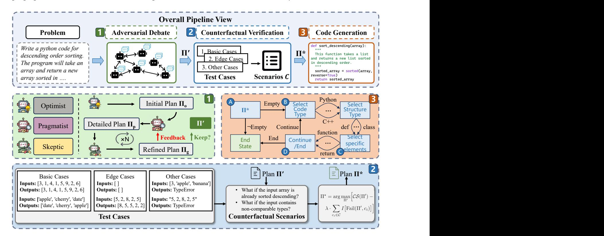
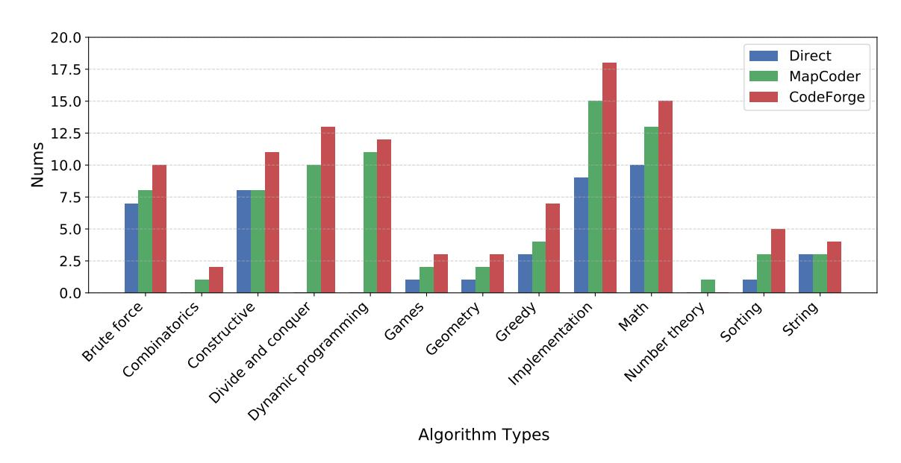
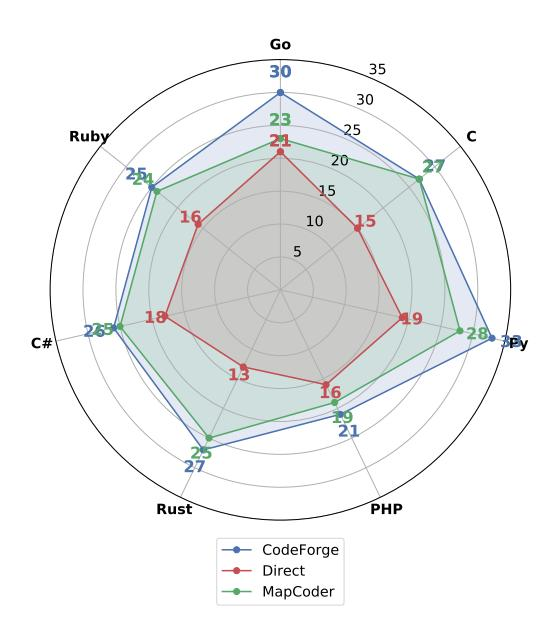

# Mitigating Cognitive Vulnerabilities in Code Generation via Multi-Agent Adversarial Debate

Shuofu Liu

University of Electronic Science and Technology of China Chengdu, Sichuan, China 202444060128@std.uestc.edu.cn

Quanjiang Guo∗

University of Electronic Science and Technology of China Chengdu, Sichuan, China guochance1999@163.com

Xiao Liu

University of Electronic Science and Technology of China Chengdu, Sichuan, China 202312081636@std.uestc.edu.cn

Ying Liu

China Nuclear Power Research and Design Institute Chengdu, Sichuan, China liuyingheu@126.com

## Abstract

Although Large Language Models (LLMs) have demonstrated significant proficiency in code generation, their monolithic and correlationdriven nature renders them susceptible to systematic cognitive biases, deficient counterfactual reasoning, and adversarial manipulation—a characteristic we term cognitive vulnerability. Such vulnerabilities compromise the reliability and security of AI-assisted software development, potentially resulting in code that is not only functionally incorrect but also biased, insecure, and difficult to validate using conventional testing paradigms. While recent multiagent systems enhance workflow efficiency via task decomposition, they do not fundamentally address these reasoning deficits. This highlights the need for a framework capable of proactively identifying and mitigating the cognitive flaws of an LLM during the reasoning process. To address this challenge, we introduce CodeForge, a multi-agent adversarial reasoning framework that reframes code generation as a cognitive crucible. This process involves a structured debate among three specialized agents—an Optimist, a Pragmatist, and an Adversarial Skeptic—who iteratively cross-examine and refine solution plans. Following convergence, an adversarial verification module systematically generates counterfactual perturbations to stress-test and enhance the final plan. Comprehensive evaluations on the HumanEval and MBPP benchmarks demonstrate that CodeForge significantly outperforms state-of-the-art methods, achieving a pass@1 of 97.3% with GPT-4. Ablation studies confirm the necessity of both the adversarial dialogue and counterfactual verification components. This work represents a shift from passive debugging to proactive cognitive hardening, establishing a pathway toward more trustworthy automated software engineering. [1](#page-0-0)

## CCS Concepts

• Computing methodologies → Multi-agent systems.

© 2026 Copyright held by the owner/author(s). ACM ISBN 979-8-4007-2307-0/2026/04 <https://doi.org/10.1145/3774904.3792557>

## Keywords

Code Generation, Multi-Agent Systems, Large Language Models

#### ACM Reference Format:

Shuofu Liu, Quanjiang Guo, Xiao Liu, and Ying Liu. 2026. Mitigating Cognitive Vulnerabilities in Code Generation via Multi-Agent Adversarial Debate. In Proceedings of the ACM Web Conference 2026 (WWW '26), April 13–17, 2026, Dubai, United Arab Emirates. ACM, New York, NY, USA, [9](#page-8-0) pages. <https://doi.org/10.1145/3774904.3792557>

## 1 Introduction

Large Language Models (LLMs) have significantly advanced the automation of software development by generating code from natural language descriptions. Their ability to produce fluent and syntactically correct programs has accelerated prototyping and lowered the entry barrier for programming [\[9,](#page-8-1) [26\]](#page-8-2). Despite these advantages, LLMs fundamentally operate as next-token predictors, relying on statistical correlations in training data rather than true causal reasoning or logical understanding. As a result, they can produce code that appears correct at first glance but fails under rigorous testing or in corner cases.

Beyond traditional algorithmic exercises, modern software is increasingly web-native: programs must compose heterogeneous Web APIs, parse semi-structured content (HTML/JSON), respect authentication and rate limits, and remain resilient to unreliable networks, pagination quirks, and evolving schemas. In such settings, silent logic errors and brittle assumptions propagate quickly through continuous integration pipelines and open-source reuse, creating outsized risks for reliability and security at Web scale. Consequently, ensuring that LLM-generated code is not merely syntactically plausible but also robust to web-ecosystem pathologies is essential for trustworthy deployment in production and for the broader Web community.

This phenomenon exposes what we term cognitive vulnerabilities, encompassing three primary issues: (i) inherited cognitive biases from human-written training data, leading to suboptimal or insecure coding patterns [\[2,](#page-8-3) [23](#page-8-4)? ]; (ii) deficient counterfactual reasoning, which limits the model's ability to anticipate rare or adversarial scenarios [\[16\]](#page-8-5); and (iii) susceptibility to adversarial manipulation, where carefully crafted prompts can induce incorrect or even malicious outputs [\[3,](#page-8-6) [28,](#page-8-7) [31\]](#page-8-8). These vulnerabilities pose serious risks to the reliability and security of AI-assisted software development. Importantly, such flaws often evade conventional

∗Corresponding author.

1The source code: [https://github.com/UESTC-GQJ/CodeForge\\_code](https://github.com/UESTC-GQJ/CodeForge_code)

[This work is licensed under a Creative Commons Attribution 4.0 International License.](https://creativecommons.org/licenses/by/4.0) WWW '26, Dubai, United Arab Emirates

debugging or post-hoc filtering because they originate from reasoning deficiencies during the generation process, rather than from superficial syntax or formatting errors.

Recent work on multi-agent systems (MAS) [\[10\]](#page-8-9) has explored dividing code generation into subtasks handled by specialized agents. For instance, one agent might generate code while another checks for errors or refines outputs. Although MAS approaches improve efficiency through task decomposition, they generally assume that individual agents can reason reliably. In practice, these agents often inherit the same cognitive limitations as the underlying LLM, merely orchestrating flawed outputs more effectively. This limitation becomes pronounced in web scenarios—e.g., composing multiple REST endpoints or scraping semi-trusted content—where subtle reasoning failures (incorrect pagination, mis-handled HTTP status codes, unsafe string interpolation leading to injections) may pass surface-level checks yet later trigger cascading failures in deployment.

To bridge this gap, we propose CodeForge, a multi-agent adversarial reasoning framework that explicitly targets the reasoning weaknesses of LLMs during the planning stage of code generation. Rather than relying on post-hoc correction, CodeForge aims to proactively harden the reasoning process itself. Inspired by the generator–discriminator dynamics of GANs, CodeForge introduces the Cognitive Crucible, a structured debate in which three specialized agents collaboratively reason about the problem: an Optimist, responsible for proposing diverse high-level solutions; a Pragmatist, which grounds these ideas into concrete, executable implementation details; and an Adversarial Skeptic, which plays an "attacker" role by critically challenging the plan's assumptions and identifying potential flaws. Through multi-turn debate and critique, these agents iteratively refine a solution plan until it withstands adversarial scrutiny. Once the debate converges, CodeForge applies an adversarial verification module that systematically generates counterfactual test cases—covering basic, edge, and pathological scenarios—to rigorously evaluate and further improve the plan before final code generation. This design ensures that the resulting code is not only syntactically valid but also logically sound, robust to edge cases, and resistant to adversarial manipulations.

Conceptually, CodeForge complements and extends prior paradigms. The Cognitive Crucible exposes and repairs hidden assumptions before they crystallize into brittle implementations, while adversarial verification closes the loop with executable evidence that the refined plan survives realistic perturbations typical in Web environments.

Evaluations on HumanEval and MBPP benchmarks show that CodeForge achieves a 97.3% pass@1 success rate with GPT-4, outperforming all baseline methods. Ablation studies further confirm that both adversarial debate and automated verification are indispensable to achieve state-of-the-art performance. Our framework marks a paradigm shift from reactive filtering to proactive cognitive hardening, laying a foundation for trustworthy LLMsdriven software engineering.

Our main contributions are as follows:

- We identify and formalize cognitive vulnerabilities that cause LLMs to fail in web-native software settings and argue for proactive reasoning hardening as a first-class objective.

- We are the first to reformulate LLM-based code generation as a collaborative and verifiable multi-agent process, where structured debate and verification are jointly used to improve reasoning quality and reliability.
- We design a counterfactual verification module that automatically generates counterfactual scenarios and applies deterministic programming language-based rules to validate outputs, enabling precise and iterative refinement.
- Comprehensive experiments on benchmarks with multiple LLMs demonstrate that CodeForge achieves state-of-the-art performance, while ablation studies confirm the necessity of both the debate mechanism and the verification process.

## 2 Related Work

## 2.1 Large Language Model for programming

The application of LLMs has significantly advanced the field of code generation. Recent research has produced specialized models for tasks such as code generation[\[4\]](#page-8-10), code completion[\[6\]](#page-8-11), and code summarization[\[24\]](#page-8-12). Prominent models, including CodeBERT and CodeGPT[\[8\]](#page-8-13)[\[29\]](#page-8-14), are pre-trained on extensive code corpora and exhibit strong capabilities in syntactic understanding and program structure analysis. More recent models, such as CodeGeeX[\[30\]](#page-8-15), have further expanded model utility by integrating features like web search, tool invocation, and code interpretation modules[\[22\]](#page-8-16).

While individual agents are effective for discrete tasks, they often face limitations when addressing complex, multifaceted programming challenges. Mainstream LLMs, such as GPT-3.5-turbo and GPT-4, have demonstrated considerable proficiency in code-related tasks[\[19\]](#page-8-17). These models can maintain natural human-computer dialogue while executing programming tasks from natural language instructions. The efficacy of these models has been further improved by advanced prompting techniques, including chain-of-thought and self-reflection mechanisms. Nevertheless, despite achieving strong performance on standard code generation benchmarks like HumanEval and MBPP, these models continue to exhibit persistent challenges.

## 2.2 Multi-Agent for Code Generation

The paradigm of multi-agent collaboration driven by LLMs has become a prominent research area, yielding significant results across various domains[\[18\]](#page-8-18). This approach, which simulates human societal cooperation, enhances model capabilities while mitigating hallucination issues. For instance, MapCoder[\[12\]](#page-8-19) enhances code generation accuracy by employing a retrieval agent to provide relevant examples to a dedicated coding agent. AgentCoder[\[11\]](#page-8-20) utilizes specialized agents for automated test case generation to improve overall code quality. ChatDev[\[21\]](#page-8-21) implements a multi-agent framework that mirrors the division of labor in software development teams to guide the code generation process systematically. Similarly, CodeTree[\[17\]](#page-8-22) incorporates thinker agents to systematically explore and refine solutions, while other frameworks[\[4\]](#page-8-10) adopt test-driven development (TDD) paradigms, wherein agents iteratively validate and refine code through test case verification[\[20\]](#page-8-23). The advancements from these studies demonstrate that multi-agent systems can significantly improve automated code generation by emulating

Figure 1: Overview of the CodeForge framework. Given a programming problem, CodeForge performs (1) adversarial debate, where three specialized agents (Optimist, Pragmatist, Skeptic) iteratively refine a solution plan through multi-turn critique and defense; (2) counterfactual verification, which generates basic, edge, and other test cases to stress-test the plan under counterfactual scenarios, producing the final verified plan Π ★; and (3) FSM-guided code generation, where a finite state machine constrains decoding to ensure syntactic and semantic correctness. This pipeline proactively mitigates cognitive vulnerabilities, resulting in logically sound, schema-compliant, and robust code generation.

sophisticated human problem-solving strategies and collaborative workflows.

However, these role-playing multi-agent frameworks primarily improve coverage and throughput by decomposing end-to-end software processes. In contrast, CodeForge is designed to target reasoning defects at planning time via adversarial critique, making error discovery and correction an explicit optimization objective. Practically, role-playing systems excel at process completeness, while CodeForge emphasizes logic soundness under counterfactual stress. Since these paradigms are complementary rather than mutually exclusive, our debate mechanism can function as a plug-in reasoning module within larger role-playing pipelines.

## 3 Methodology

The proposed CodeForge framework transforms the process of LLM-based code generation into a structured adversarial reasoning pipeline that proactively mitigates cognitive vulnerabilities before code is produced. The framework enforces a two-stage process: (i) adversarial dialogue-based planning that produces a logically robust solution plan, and (ii) automated adversarial verification that stress-tests the plan prior to code generation.

### 3.1 Task Definition

Formally, let a programming problem be denoted as ��, described by a natural language specification ��(��). The objective is to generate a function ���� such that ���� passes all unit tests T (��):

���� = arg max �� ∈ F Pr-∀�� ∈ T (��), ��(�� ) = 1 , (1)

where F is the function space parameterized by the LLM. Unlike conventional prompting that directly samples ���� ∼ ���� (�� |��(��)), CodeForge introduces an intermediate planning stage that iteratively produces and verifies a structured plan Π before code generation:

Π ★ = arg max Π S (Π), (2)

where S (Π) is a composite score that accounts for the plan's confidence, logical consistency, and robustness under adversarial perturbations.

## 3.2 Adversarial Debate: The Cognitive Crucible

CodeForge employs three specialized agents—Optimist, Pragmatist, and Adversarial Skeptic—which interact through a GANinspired adversarial loop.

Optimist (Ideation and Exploration). The Optimist serves as the creative engine of the system. Given��(��), it proposes high-level solution strategies �� without immediate concern for feasibility or edge cases. Its primary role is to ensure diversity and novelty in potential solutions, preventing the system from prematurely converging to suboptimal, bias-driven patterns. However, the Optimist may produce overconfident or incomplete solutions, motivating the need for subsequent refinement. The prompt for this agent is illustrated in Figure [2.](#page-3-0)

Figure 2: Prompt for Optimist agent.

Pragmatist (Grounding and Detailing). The Pragmatist transforms the Optimist's abstract strategies into an actionable implementation plan �� , specifying concrete libraries, APIs, data structures, and algorithmic steps. It ensures that the proposed plan is technically feasible and executable. While effective at grounding abstract ideas, the Pragmatist may exhibit confirmation bias, tending to refine the Optimist's plan superficially rather than fundamentally reconsider flawed logic. The prompt for this agent is illustrated in Figure [3.](#page-3-1)

Figure 3: Prompt for Pragmatist agent.

Adversarial Skeptic (Falsification and Stress Testing). The Adversarial Skeptic acts as the internal "red team," adversarially probing �� (the combined plan) for flaws. It challenges assumptions, questions design decisions, and generates counterfactual attack scenarios. Specifically, it (i) attacks biases by asking why particular

libraries or patterns were chosen, (ii) introduces hostile scenarios such as malformed inputs or unavailable dependencies, and (iii) identifies security vulnerabilities including possible prompt injections or unsafe coding practices. Its feedback forces iterative plan refinement. The prompt for this agent is illustrated in Figure [4.](#page-3-2)

Figure 4: Prompt for Adversarial Skeptic agent.

The Optimist and Pragmatist collectively function as the Generator, while the Skeptic serves as the Discriminator. The adversarial loop continues until the refined plan Π ′ withstands all critiques:

Π ′ = Refine(Π��, FeedbackSkeptic), (3)

where Refine(·) denotes iterative plan improvement conditioned on adversarial feedback.

All three debate roles are role-prompted instances of the same base LLM (no separate trainable parameters). The final code generation reuses the same base LLM but switches to an FSM-constrained decoding procedure; it is a decoding mode, not a new agent.

## 3.3 Automated Counterfactual Verification

After the dialogue converges, CodeForge applies an counterfactual verification module that algorithmically generates counterfactual scenarios C = {��1, ��2, . . . , ����} to stress-test the plan. Each ���� perturbs assumptions about inputs, dependencies, or resource constraints. The final plan Π ★ is obtained by maximizing the score penalized by failure cases:

Π ★ = arg max Π′ h CS (Π ′ ) − �� · ∑︁ ���� ∈ C Fail(Π ′ , ����) i , (4)

where CS (Π ′ ) represents the combined confidence and consistency score, �� penalizes failures under counterfactual tests, and I[·] is the indicator function, which is 1 if the condition Fail(Π ′ , ����) is true and 0 otherwise. This step ensures that even after adversarial dialogue, unexamined edge cases are detected and corrected.

#### 3.4 Code Generation

Finally, verified plan Π ★ is subsequently employed to guide the LLMs in the deterministic generation of the target code. Recognizing that conventional free decoding strategies are prone to structural and semantic drift—specifically affecting elements like bracketing, indentation, and type consistency—during longhorizon reasoning, CodeForge adopts a Finite State Machine (FSM)-guided decoding approach. This method imposes strict structural and semantic constraints by restricting the action space, thereby ensuring the stability of the underlying code structure before content generation, offering a robust alternative to direct sampling from the model's distribution ���� (�� |Π ★).

Formally, let A denote the set of allowed decoding actions, and let FFSM represent a deterministic transition function derived from the target code schema. At each decoding step ��, the FSM constrains the model output space to a subset A�� ⊆ A:

���� = arg max ��∈A�� ���� (��|��<�� , Π ★), s.t. A�� = FFSM(��<��). (5)

This ensures that every generated token sequence strictly adheres to syntactic rules (e.g., matching brackets, indentation, type declarations) and schema-level constraints (e.g., argument types, function signatures).

By combining FSM-guided decoding with the verified plan Π ★, the final code ���� is generated in a constrained yet deterministic manner:

���� = DecodeFSM(���� (·|Π ★)). (6)

This design enforces compliance with predefined structural and type constraints, effectively eliminating common formatting and logical consistency errors. Consequently, the two-stage —reasoned planning followed by FSM-guided constrained decoding— not only mitigates correlation-driven generation tendencies of LLMs but also ensures that the final output is logically grounded, robust to edge cases, and schema-compliant by construction.

### 3.5 Algorithm Description

Given ��(��), we initialize an empty plan and iterate until consensus or a preset budget. Each round proceeds as follows: (1) Optimist-Generate drafts �� (diverse strategies + assumptions); (2) PragmatistRefine grounds �� into �� (signature/APIs/steps/invariants); (3) Combine merges into ��; (4) SkepticAttack produces failure hypotheses and counterexamples; (5) UpdatePlan integrates validated critiques into ��. After convergence, Automated Counterfactual Verification expands stress tests and scores candidate plans; finally, FSM-guided decoding emits code under schema constraints.

#### 4 Experiments

## 4.1 Experimental Setup

Datasets. To evaluate the effectiveness of CodeForge, we conducted experiments on six benchmark datasets: HumanEval [\[5\]](#page-8-24), HumanEval-ET [\[7\]](#page-8-25), MBPP [\[1\]](#page-8-26), MBPP-ET, APPS, and xCodeEval [\[15\]](#page-8-27). HumanEval-ET and MBPP-ET are extended versions of HumanEval and MBPP with increased question counts to provide a higher level of challenge. We choose function-level benchmarks (HumanEval,

#### Algorithm 1: CodeForge Framework for Proactive Cognitive Hardening

Input: Programming problem �� with description ��(��) Output: Verified function ���� passing all tests T (��)

Initialize plan Π�� ← ∅; convergence flag done ← False;

while done = False do

Π�� ← OptimistGenerate(��(��)); Π�� ← PragmatistRefine(Π�� ); Π�� ← Combine(Π��, Π�� ); feedback ← SkepticAttack(Π��); Π�� ← UpdatePlan(Π��, feedback);

if Converged(Π��) then done ← True;

Π ′ ← Π��;

Π

★ ← Counterfactual Verify(Π

′ );

���� ∼ ����

(�� |Π ★);

return ����

MBPP) to isolate planning-time reasoning while controlling confounders from large repositories (tooling, environment setup, dependency resolution). On APPS and xCodeEval, which require deeper reasoning and schema adherence, CodeForge still yields consistent gains, suggesting that debate-driven planning transfers beyond toy tasks. In addition to the main experiments, ablation studies were performed on the benchmark datasets to examine the contributions of the debate mechanism and semantic consistency verification. Further evaluations were conducted on open-source models to assess the generalizability of the framework.

Baselines. We compared CodeForge with several benchmark methods and state-of-the-art approaches. Direct generates code directly from prompts without additional reasoning steps. Chain of Thought (CoT) [\[25\]](#page-8-28) decomposes problems into intermediate reasoning steps before code generation. Self-Planning [\[14\]](#page-8-29) separates code generation into planning and execution stages. Analogical Reasoning [\[27\]](#page-8-30) improves performance by prompting the model to recall and adapt solutions from similar problems in training data. We also include two multi-agent approaches. MapCoder [\[13\]](#page-8-31) employs four specialized agents for example retrieval, planning, code generation, and debugging, mimicking the human program synthesis cycle. AgentCoder [\[11\]](#page-8-20) uses a programmer, test designer, and test executor agent in a collaborative loop to iteratively generate, test, and refine code.

Base LLMs and Evaluation Metrics. To ensure consistency in the experimental setup, we adopted ChatGPT (gpt-3.5-turbo-1106) and GPT-4 (gpt-4-1106-preview) as baseline models. All methods were evaluated against these baselines. Additionally, we incorporated the open-source models Qwen2.5-7B and llama3.1-8b for method validation. The pass@1 metric was employed throughout our evaluations. For our proposed approach, the debate is not configured for a fixed number of rounds but instead continues until a state of convergence is reached.

Table 1: Pass@1 results on HumanEval, HumanEval-ET, MBPP, and MBPP-ET (simple problems) as well as APPS and xCodeEval (contest problems). We compare CodeForge with various strategies under both ChatGPT and GPT-4. The best results for each setting are highlighted in bold.

| LLM Strategy          | HumanEval | Simple HumanEval-ET | Problems MBPP | MBPP-ET | Avg.  | APPS  | Contest xCodeEval | Problems Avg. |
|-----------------------|-----------|---------------------|---------------|---------|-------|-------|-------------------|---------------|
| Direct                | 71.3%     | 73.2%               | 79.9%         | 37.7%   | 65.5% | 8.0%  | 17.9%             | 13.0%         |
| CoT                   | 68.3%     | 74.4%               | 80.1%         | 39.6%   | 65.6% | 7.3%  | 23.6%             | 15.5%         |
| Self-Planning ChatGPT | 70.1%     | 66.5%               | 74.6%         | 41.9%   | 63.3% | 9.3%  | 18.9%             | 14.1%         |
| Analogical            | 69.5%     | 63.4%               | 71.5%         | 46.1%   | 62.6% | 6.7%  | 15.1%             | 10.9%         |
| MapCoder              | 79.9%     | 77.4%               | 86.9%         | 54.4%   | 74.7% | 11.3% | 27.4%             | 19.4%         |
| AgentCoder            | 79.9%     | 74.4%               | 83.2%         | 53.7%   | 72.8% | 10.9% | 19.7%             | 15.3%         |
| CodeForge             | 83.2%     | 78.6%               | 87.9%         | 56.1%   | 76.5% | 12.8% | 28.7%             | 20.8%         |
| Direct                | 80.1%     | 73.8%               | 81.1%         | 54.7%   | 72.4% | 12.7% | 32.1%             | 22.4%         |
| CoT                   | 89.0%     | 61.6%               | 82.4%         | 56.2%   | 72.3% | 11.3% | 36.8%             | 24.1%         |
| Self-Planning GPT-4   | 85.4%     | 62.2%               | 75.8%         | 50.4%   | 68.5% | 14.7% | 34.0%             | 24.4%         |
| Analogical            | 66.5%     | 48.8%               | 58.4%         | 40.3%   | 40.3% | 12.0% | 26.4%             | 19.2%         |
| MapCoder              | 93.9%     | 82.9%               | 83.1%         | 57.7%   | 79.4% | 22.0% | 45.3%             | 33.7%         |
| AgentCoder            | 96.3%     | 86.0%               | 85.1%         | 56.8%   | 81.1% | 20.9% | 44.1%             | 32.5%         |
| CodeForge             | 97.3%     | 89.7%               | 88.4%         | 59.5%   | 83.7% | 22.7% | 46.4%             | 34.6%         |

Table 2: Ablation study on GPT-4 using pass@1 scores across six datasets. Each row removes one component from CodeForge to evaluate its contribution.

|      | Ablation       | Setting      | HumanEval | HumanEval-ET | MBPP  | MBPP-ET | APPS  | xCodeEval |
|------|----------------|--------------|-----------|--------------|-------|---------|-------|-----------|
| Full | CodeForge      |              | 97.3%     | 89.7%        | 88.4% | 59.5%   | 22.7% | 46.4%     |
| w/o  | Adversarial    | Debate       | 90.4%     | 84.1%        | 83.7% | 51.3%   | 17.9% | 38.2%     |
| w/o  | Skeptic        | Agent        | 92.1%     | 86.5%        | 84.2% | 52.1%   | 18.4% | 39.6%     |
| w/o  | Counterfactual | Verification | 94.0%     | 87.2%        | 85.1% | 53.0%   | 19.6% | 40.7%     |
| w/o  | FSM-guided     | Decoding     | 95.1%     | 88.0%        | 86.7% | 55.2%   | 20.4% | 42.1%     |

## 4.2 Experimental Results and Analysis

4.2.1 Performance on simple code generation. As shown in Table [1,](#page-5-0) on the HumanEval, HumanEval-ET, MBPP, and MBPP-ET benchmarks, CodeForge consistently achieves the highest pass@1 scores with both ChatGPT and GPT-4. For GPT-4, CodeForge attains pass@1 scores of 97.3%, 89.7%, 88.4%, and 59.5% on the four datasets, resulting in an average performance of 83.7%. Although multi-agent approaches (MapCoder, AgentCoder) surpass baseline methods, their accuracy remains constrained due to insufficient problem analysis and neglect of code semantic consistency. In contrast, our method results surpass those of the strongest baselines, AgentCoder and MapCoder, by approximately 2.6% and 4.3%, respectively, indicating the effectiveness of CodeForge in producing logically sound and executable plans. For ChatGPT, CodeForge also attains the highest or near-highest scores across all datasets, achieving an average of 76.5%, which exceeds AgentCoder and MapCoder. These findings demonstrate that CodeForge provides consistent improvements even when applied to a less capable LLM.

4.2.2 Performance on contest code generation. As shown in Table [1,](#page-5-0) on the more challenging APPS and xCodeEval benchmarks, CodeForge also outperforms all comparison methods. With GPT-4, CodeForge achieves pass@1 scores of 22.7% and 46.4% on APPS and xCodeEval, respectively, with an average of 34.6%. This performance exceeds that of AgentCoder and MapCoder, as well as other baseline strategies such as Direct decoding, CoT, and Self-Planning. When using ChatGPT, CodeForge attains 12.8% and 28.7% on APPS and xCodeEval, achieving an average of 20.8%, which is higher than AgentCoder and MapCoder. These results suggest that CodeForge enhances code generation robustness and reasoning quality, particularly for problems that require multi-step reasoning and strict adherence to structural constraints.

4.2.3 Single-agent self-correction vs. multi-agent debate. The selfreflection loops improve a single planner's consistency, but they remain vulnerable to confirmation bias and narrow exploration. CodeForge factorizes cognition: the Optimist enforces diversity of

Figure 5: Number of correct answers for xCodeEval algorithm type (tags)

plans, the Pragmatist enforces feasibility, and the Skeptic injects adversarial falsification. Empirically, ablating debate causes the largest drop across datasets; moreover, performance saturates around 4 rounds (Table [3\)](#page-6-0), indicating an effective depth for critique before diminishing returns.

## 4.3 Ablation Study

Table [2](#page-5-1) reports the results of the ablation study on GPT-4. Removing the adversarial debate causes the largest performance drop across all datasets, indicating that iterative plan refinement through multiturn agent interaction is crucial for generating robust solutions. Excluding the Skeptic Agent also leads to a notable degradation, which confirms that adversarial critique effectively identifies potential flaws during planning.

Disabling the counterfactual verification module reduces performance on both simple and contest problems, especially on APPS and xCodeEval, where robustness to adversarial or edge-case scenarios is critical. Similarly, removing the FSM-guided decoding step results in lower pass@1 scores, particularly on HumanEval-ET and xCodeEval, showing that structural constraints during decoding improve schema compliance and reduce logical errors. These findings collectively demonstrate that each component of CodeForge is essential, and their integration yields the best overall performance across diverse benchmarks.

## 4.4 Impact of debate rounds ��

Table [3](#page-6-0) shows the impact of varying the number of debate rounds on CodeForge performance with GPT-4. Increasing the number of rounds from 1 to 4 consistently improves pass@1 across all benchmarks, demonstrating that multi-turn agent interaction facilitates more comprehensive plan refinement. The largest gains occur when increasing from 1 to 3 rounds, with diminishing returns beyond 3 rounds.

Table 3: Impact of the number �� of debate rounds on pass@1 performance using GPT-4. Rows correspond to datasets, and columns correspond to the number of debate rounds. Code-Forge achieves the best overall results with 4 rounds, after which performance slightly saturates or decreases.

At 4 rounds, CodeForge achieves the highest pass@1 scores on all datasets. Adding a fifth round slightly reduces performance on some benchmarks, likely due to over-refinement or the introduction of noise from additional debate steps. These results indicate that a moderate number of debate rounds is optimal, balancing reasoning depth with stability in plan generation.

#### 4.5 Performance of open-source LLMs

Table [4](#page-7-0) presents the pass@1 results of CodeForge, MapCoder, and Direct decoding on two open-source models, Qwen2.5-7B and Llama3.1-8B, across six benchmarks. CodeForge consistently achieves the best or comparable performance in all settings. On Qwen2.5- 7B, CodeForge outperforms both baselines on every dataset, with improvements of up to 6.3% over Direct decoding (HumanEval-ET) and 5.4% over MapCoder (MBPP). Similar trends are observed on Llama3.1-8B, where CodeForge yields the highest scores on

Figure 6: The number of correct answers across different programming languages (xCodeEval dataset).

Table 4: Pass@1 results with using Qwen2.5-7B and Llama3.1- 8B.

| Dataset Method      | Qwen2.5-7B | Model Llama3.1-8B |
|---------------------|------------|-------------------|
| Direct              | 58.3%      | 54.1%             |
| MapCoder HumanEval  | 64.3%      | 59.2%             |
| CodeForge           | 64.5%      | 58.7%             |
| Direct HumanEval-ET | 53.1%      | 51.4%             |
| MapCoder            | 57.2%      | 51.1%             |
| CodeForge           | 60.4%      | 54.3%             |
| Direct MBPP         | 54.8%      | 48.3%             |
| MapCoder            | 54.0%      | 47.6%             |
| CodeForge           | 59.4%      | 52.3%             |
| Direct MBPP-ET      | 41.9%      | 38.8%             |
| MapCoder            | 45.8%      | 40.3%             |
| CodeForge           | 46.2%      | 45.1%             |
| Direct APPS         | 13.2%      | 9.1%              |
| MapCoder            | 13.3%      | 10.1%             |
| CodeForge           | 13.6%      | 11.7%             |
| Direct              | 23.5%      | 24.9%             |
| MapCoder xCodeEval  | 29.9%      | 24.8%             |
| CodeForge           | 29.4%      | 25.9%             |

all datasets except HumanEval, where it remains close to the best baseline.

These results indicate that CodeForge effectively enhances the reasoning and code generation capabilities of smaller open source models, demonstrating its adaptability and robustness across different model architectures and capacities.

#### 4.6 Performance of different types of algorithms

Figure [5](#page-6-1) presents the number of correct solutions for different algorithm types on the xCodeEval benchmark. CodeForge consistently outperforms both Direct decoding and MapCoder across most categories. The improvements are particularly evident in algorithm types that require more complex reasoning, such as divide and conquer, dynamic programming, and math, where CodeForge produces 2–4 more correct solutions than MapCoder and significantly more than Direct decoding.

For relatively simpler categories, such as implementation and greedy, CodeForge also achieves noticeable gains, indicating that the adversarial debate and counterfactual verification enhance solution robustness even in less complex tasks. In contrast, for algorithm types with inherently low occurrence, such as constructive and number theory, all methods perform similarly due to the limited number of relevant test cases. These results suggest that CodeForge is particularly effective for algorithmic problems requiring structured reasoning and multi-step planning, while maintaining competitive performance on simpler tasks.

### 4.7 Performance of different programming languages

Furthermore, we evaluate CodeForge's cross-lingual capabilities on the xCodeEval multi-language suite, covering a mix of dynamically and statically typed languages and diverse idioms. As shown in Figure [6,](#page-7-1) CodeForge consistently outperforms comparative methods across all evaluated languages. We attribute these gains to (i) a language-agnostic planning stage (Optimist→Pragmatist) that expresses algorithms in verifiable steps before committing to syntax, (ii) the Skeptic's language-aware stress tests (e.g., integer division and overflow, off-by-one and indexing, exception/null handling, Unicode/JSON parsing, module import and version drift), and (iii) FSM-guided decoding that adapts constraints to the target grammar (e.g., indentation vs. braces, type annotations, exception signatures).

## 5 Conclusion

We introduced CodeForge, a multi-agent adversarial reasoning framework for LLM-based code generation. CodeForge incorporates a structured debate among three specialized agents—the Optimist, Pragmatist, and Adversarial Skeptic—followed by an adversarial verification module that generates counterfactual scenarios to stress-test and refine solution plans. This design enables the production of code that is logically consistent, robust to edge cases, and resistant to adversarial inputs. Experiments on HumanEval, MBPP, and other benchmarks show that CodeForge consistently outperforms both standard prompting and recent multi-agent baselines. Ablation studies verify the contributions of adversarial debate, counterfactual verification, and FSM-guided decoding. CodeForge represents the first formulation of code generation as a collaborative and verifiable multi-agent reasoning process, providing a general approach that may be extended to other tasks requiring structured reasoning, such as mathematical problem solving and complex question answering.

#### References

- [1] Jacob Austin, Augustus Odena, Maxwell Nye, Maarten Bosma, Henryk Michalewski, David Dohan, Ellen Jiang, Carrie Cai, Michael Terry, Quoc Le, et al. 2021. Program synthesis with large language models. arXiv preprint arXiv:2108.07732 (2021). [2] Rishi Bommasani, Drew A Hudson, Ehsan Adeli, Russ Altman, Simran Arora, Sydney von Arx, Michael S Bernstein, Jeannette Bohg, Antoine Bosselut, Emma Brunskill, et al. 2021. On the opportunities and risks of foundation models. arXiv preprint arXiv:2108.07258 (2021). [3] Nicholas Carlini, Matthew Jagielski, Christopher A Choquette-Choo, Daniel Paleka, Will Pearce, Hyrum Anderson, Andreas Terzis, Kurt Thomas, and Florian Tramèr. 2024. Poisoning web-scale training datasets is practical. In 2024 IEEE Symposium on Security and Privacy (SP). IEEE, 407–425. [4] Bei Chen, Fengji Zhang, Anh Nguyen, Daoguang Zan, Zeqi Lin, Jian-Guang Lou, and Weizhu Chen. 2023. CodeT: Code Generation with Generated Tests. In ICLR. [5] Mark Chen, Jerry Tworek, Heewoo Jun, Qiming Yuan, Henrique Ponde de Oliveira Pinto, Jared Kaplan, Harri Edwards, Yuri Burda, Nicholas Joseph, Greg Brockman, Alex Ray, Raul Puri, Gretchen Krueger, Michael Petrov, Heidy Khlaaf, Girish Sastry, Pamela Mishkin, Brooke Chan, Scott Gray, Nick Ryder, Mikhail Pavlov, Alethea Power, Lukasz Kaiser, Mohammad Bavarian, Clemens Winter, Philippe Tillet, Felipe Petroski Such, Dave Cummings, Matthias Plappert, Fotios Chantzis, Elizabeth Barnes, Ariel Herbert-Voss, William Hebgen Guss, Alex Nichol, Alex Paino, Nikolas Tezak, Jie Tang, Igor Babuschkin, Suchir Balaji, Shantanu Jain, William Saunders, Christopher Hesse, Andrew N. Carr, Jan Leike, Josh Achiam, Vedant Misra, Evan Morikawa, Alec Radford, Matthew Knight, Miles Brundage, Mira Murati, Katie Mayer, Peter Welinder, Bob McGrew, Dario Amodei, Sam McCandlish, Ilya Sutskever, and Wojciech Zaremba. 2021. Evaluating Large Language Models Trained on Code. (2021). arXiv[:2107.03374](https://arxiv.org/abs/2107.03374) [cs.LG] [6] Tuan Dinh, Jinman Zhao, Samson Tan, Renato Negrinho, Leonard Lausen, Sheng Zha, and George Karypis. 2023. Large Language Models of Code Fail at Completing Code with Potential Bugs. In Advances in Neural Information Processing Systems, A. Oh, T. Naumann, A. Globerson,
- K. Saenko, M. Hardt, and S. Levine (Eds.), Vol. 36. Curran Associates, Inc., 41386–41412. [https://proceedings.neurips.cc/paper\\_files/paper/2023/file/](https://proceedings.neurips.cc/paper_files/paper/2023/file/819cebb05f993840e8a52d7564c5c282-Paper-Conference.pdf) [819cebb05f993840e8a52d7564c5c282-Paper-Conference.pdf](https://proceedings.neurips.cc/paper_files/paper/2023/file/819cebb05f993840e8a52d7564c5c282-Paper-Conference.pdf) [7] Yihong Dong, Jiazheng Ding, Xue Jiang, Ge Li, Zhuo Li, and Zhi Jin. 2025. Codescore: Evaluating code generation by learning code execution. ACM Transactions on Software Engineering and Methodology 34, 3 (2025), 1–22. [8] Zhangyin Feng, Daya Guo, Duyu Tang, Nan Duan, Xiaocheng Feng, Ming Gong, Linjun Shou, Bing Qin, Ting Liu, Daxin Jiang, et al. 2020. CodeBERT: A Pre-Trained Model for Programming and Natural Languages. Findings of the Association for Computational Linguistics: EMNLP 2020 (2020). [9] Taicheng Guo, Xiuying Chen, Yaqi Wang, Ruidi Chang, Shichao Pei, Nitesh V. Chawla, Olaf Wiest, and Xiangliang Zhang. 2024. Large Language Model Based Multi-agents: A Survey of Progress and Challenges. In Proceedings of the Thirty-Third International Joint Conference on Artificial Intelligence, IJCAI-24, Kate Larson (Ed.). International Joint Conferences on Artificial Intelligence Organization, 8048–8057. [doi:10.24963/ijcai.2024/890](https://doi.org/10.24963/ijcai.2024/890) Survey Track. [10] Shanshan Han, Qifan Zhang, Yuhang Yao, Weizhao Jin, and Zhaozhuo Xu. 2024. LLM multi-agent systems: Challenges and open problems. arXiv preprint arXiv:2402.03578 (2024). [11] Dong Huang, Jie M Zhang, Michael Luck, Qingwen Bu, Yuhao Qing, and Heming Cui. 2023. Agentcoder: Multi-agent-based code generation with iterative testing and optimisation. arXiv preprint arXiv:2312.13010 (2023). [12] Md. Ashraful Islam, Mohammed Eunus Ali, and Md Rizwan Parvez. 2024. Map-Coder: Multi-Agent Code Generation for Competitive Problem Solving. In Proceedings of the 62nd Annual Meeting of the Association for Computational Linguistics (Volume 1: Long Papers), Lun-Wei Ku, Andre Martins, and Vivek Srikumar (Eds.). Association for Computational Linguistics, Bangkok, Thailand, 4912–4944. [doi:10.18653/v1/2024.acl-long.269](https://doi.org/10.18653/v1/2024.acl-long.269) [13] Md Ashraful Islam, Mohammed Eunus Ali, and Md Rizwan Parvez. 2024. Map-Coder: Multi-Agent Code Generation for Competitive Problem Solving. In Proceedings of the 62nd Annual Meeting of the Association for Computational Linguistics (Volume 1: Long Papers). 4912–4944. [14] Xue Jiang, Yihong Dong, Lecheng Wang, Zheng Fang, Qiwei Shang, Ge Li, Zhi Jin, and Wenpin Jiao. 2024. Self-planning code generation with large language models. ACM Transactions on Software Engineering and Methodology 33, 7 (2024), 1–30. [15] Mohammad Abdullah Matin Khan, M Saiful Bari, Xuan Long Do, Weishi Wang, Md Rizwan Parvez, and Shafiq Joty. 2024. XCodeEval: An Execution-based Large Scale Multilingual Multitask Benchmark for Code Understanding, Generation, Translation and Retrieval. In Proceedings of the 62nd Annual Meeting of the Association for Computational Linguistics (Volume 1: Long Papers), Lun-Wei Ku, Andre Martins, and Vivek Srikumar (Eds.). Association for Computational Linguistics, Bangkok, Thailand, 6766–6805. [doi:10.18653/v1/2024.acl-long.367](https://doi.org/10.18653/v1/2024.acl-long.367) [16] Emre Kiciman, Robert Ness, Amit Sharma, and Chenhao Tan. 2023. Causal reasoning and large language models: Opening a new frontier for causality. Transactions on Machine Learning Research (2023). [17] Jierui Li, Hung Le, Yingbo Zhou, Caiming Xiong, Silvio Savarese, and Doyen Sahoo. 2024. Codetree: Agent-guided tree search for code generation with large language models. arXiv preprint arXiv:2411.04329 (2024). [18] Xinyi Li, Sai Wang, Siqi Zeng, Yu Wu, and Yi Yang. 2024. A survey on LLM-based multi-agent systems: workflow, infrastructure, and challenges. Vicinagearth 1, 1 (2024), 9. [19] Aman Madaan, Niket Tandon, Prakhar Gupta, Skyler Hallinan, Luyu Gao, Sarah Wiegreffe, Uri Alon, Nouha Dziri, Shrimai Prabhumoye, Yiming Yang, et al. 2023. Self-refine: Iterative refinement with self-feedback. Advances in Neural Information Processing Systems 36 (2023), 46534–46594. [20] Noble Saji Mathews and Meiyappan Nagappan. 2024. Test-Driven Development for Code Generation. arXiv preprint arXiv:2402.13521 (2024). [21] Chen Qian, Wei Liu, Hongzhang Liu, Nuo Chen, Yufan Dang, Jiahao Li, Cheng Yang, Weize Chen, Yusheng Su, Xin Cong, Juyuan Xu, Dahai Li, Zhiyuan Liu, and Maosong Sun. 2024. ChatDev: Communicative Agents for Software Development. In Proceedings of the 62nd Annual Meeting of the Association for Computational Linguistics (Volume 1: Long Papers), Lun-Wei Ku, Andre Martins, and Vivek Srikumar (Eds.). Association for Computational Linguistics, Bangkok, Thailand, 15174–15186. [doi:10.18653/v1/2024.acl-long.810](https://doi.org/10.18653/v1/2024.acl-long.810) [22] Yujia Qin, Shihao Liang, Yining Ye, Kunlun Zhu, Lan Yan, Yaxi Lu, Yankai Lin, Xin Cong, Xiangru Tang, Bill Qian, et al. 2024. ToolLLM: Facilitating Large Language Models to Master 16000+ Real-world APIs. In ICLR. [23] Emily Sheng, Kai-Wei Chang, Prem Natarajan, and Nanyun Peng. 2021. Societal Biases in Language Generation: Progress and Challenges. In Proceedings of the 59th Annual Meeting of the Association for Computational Linguistics and the 11th International Joint Conference on Natural Language Processing (Volume 1: Long Papers). 4275–4293. [24] Weisong Sun, Yun Miao, Yuekang Li, Hongyu Zhang, Chunrong Fang, Yi Liu, Gelei Deng, Yang Liu, and Zhenyu Chen. 2024. Source Code Summarization in the Era of Large Language Models. CoRR (2024). [25] Jason Wei, Xuezhi Wang, Dale Schuurmans, Maarten Bosma, Fei Xia, Ed Chi, Quoc V Le, Denny Zhou, et al. 2022. Chain-of-thought prompting elicits reasoning in large language models. Advances in neural information processing systems 35 (2022), 24824–24837. [26] Zhiheng Xi, Wenxiang Chen, Xin Guo, Wei He, Yiwen Ding, Boyang Hong, Ming Zhang, Junzhe Wang, Senjie Jin, Enyu Zhou, et al. 2025. The rise and potential of large language model based agents: A survey. Science China Information Sciences 68, 2 (2025), 121101. [27] Michihiro Yasunaga, Xinyun Chen, Yujia Li, Panupong Pasupat, Jure Leskovec, Percy Liang, Ed H Chi, and Denny Zhou. 2023. Large Language Models as Analogical Reasoners. CoRR (2023). [28] Sibo Yi, Yule Liu, Zhen Sun, Tianshuo Cong, Xinlei He, Jiaxing Song, Ke Xu, and Qi Li. 2024. Jailbreak attacks and defenses against large language models: A survey. arXiv preprint arXiv:2407.04295 (2024). [29] Daoguang Zan, Bei Chen, Dejian Yang, Zeqi Lin, Minsu Kim, Bei Guan, Yongji Wang, Weizhu Chen, and Jian-Guang Lou. 2022. CERT: Continual Pre-training on Sketches for Library-oriented Code Generation. In Proceedings of the Thirty-First International Joint Conference on Artificial Intelligence. International Joint Conferences on Artificial Intelligence Organization. [30] Qinkai Zheng, Xiao Xia, Xu Zou, Yuxiao Dong, Shan Wang, Yufei Xue, Lei Shen, Zihan Wang, Andi Wang, Yang Li, et al. 2023. Codegeex: A pre-trained model for code generation with multilingual benchmarking on humaneval-x. In Proceedings of the 29th ACM SIGKDD Conference on Knowledge Discovery and Data Mining. 5673–5684. [31] Andy Zou, Zifan Wang, Nicholas Carlini, Milad Nasr, J Zico Kolter, and Matt Fredrikson. 2023. Universal and transferable adversarial attacks on aligned language models. arXiv preprint arXiv:2307.15043 (2023).