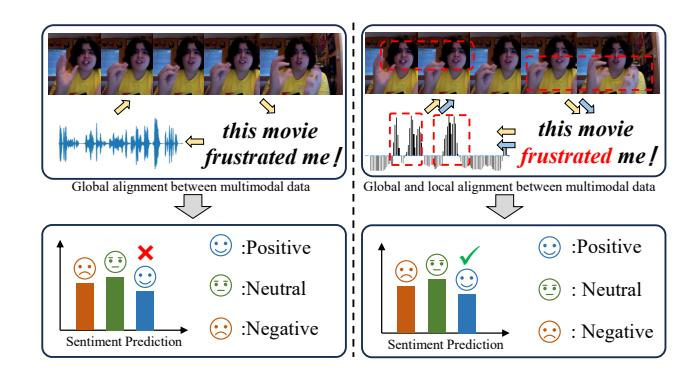
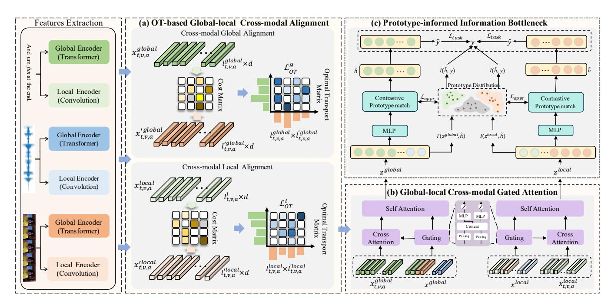
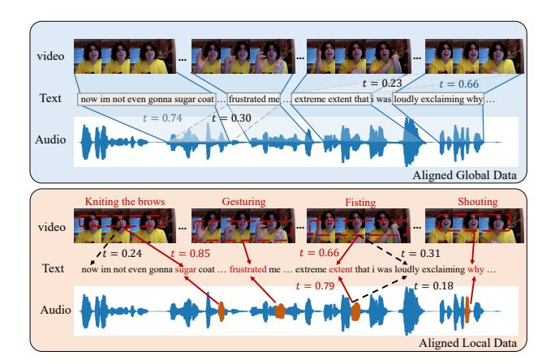
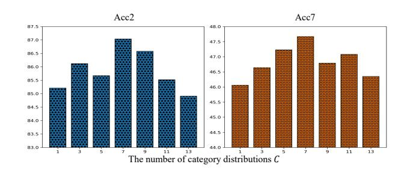
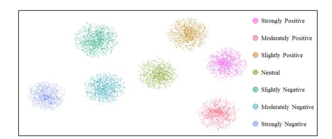
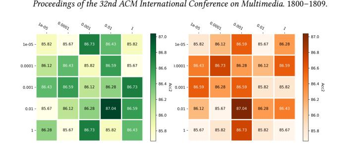

# CCAF: Coarse-to-fine Cross-Modal Alignment and Fusion for Multimodal Sentiment Analysis

Xianbing Zhao Harbin Institute of Technology, Shenzhen Jiangnan University Wuxi, China Guangdong Provincial Key Laboratory of Intelligent Information Processing Shenzhen, China zhaoxianbing\_hitsz@163.com

Shengzun Yang Harbin Institute of Technology, Shenzhen Shenzhen, China 24S151174@stu.hit.edu.cn

Buzhou Tang∗ Harbin Institute of Technology, Shenzhen Pengcheng Laboratory Guangdong Provincial Key Laboratory of Intelligent Information Processing Shenzhen, China tangbuzhou@hit.edu.cn

## Abstract

Multimodal sentiment analysis (MSA) has witnessed remarkable advancements in recent years. Existing MSA methods focus primarily on learning coarse-grained representations from different modalities to perform global cross-modal alignment or fusion. However, these approaches often neglect fine-grained valuable sentimental clues derived from local cross-modal interactions. Furthermore, the cross-modal alignment and fusion of complex global and local crossmodal information pose significant challenges in MSA tasks. To address this issue, we propose a novel MSA framework that simultaneously captures coarse-grained and fine-grained cross-modal sentiment cues through global and local cross-modal alignment and fusion. Our approach consists of three key components: i) optimal transport-based global and local cross-modal alignment, which separately aligns valuable global and local sentiment clues across modalities, ii) global and local cross-modal gated attention, which respectively fuse the aligned global and local cross-modal representations, and iii) prototype-informed information bottleneck, which utilizes learnable sentiment prototypes and contrastive prototype match to eliminate redundant cross-modal information at both global and local levels. Extensive experiments conducted on two publicly available MSA datasets demonstrate the effectiveness and superiority of our proposed model.

## CCS Concepts

• Information systems → Data mining.

### Keywords

Multimodal Sentiment Analysis, Information Bottleneck, Prototype Learning

### ACM Reference Format:

Xianbing Zhao, Shengzun Yang, and Buzhou Tang. 2026. CCAF: Coarse-tofine Cross-Modal Alignment and Fusion for Multimodal Sentiment Analysis.

∗Buzhou Tang is the corresponding author.

[This work is licensed under a Creative Commons Attribution 4.0 International License.](https://creativecommons.org/licenses/by/4.0) WWW '26, Dubai, United Arab Emirates © 2026 Copyright held by the owner/author(s). ACM ISBN 979-8-4007-2307-0/2026/04 <https://doi.org/10.1145/3774904.3792569>

In Proceedings of the ACM Web Conference 2026 (WWW '26), April 13–17, 2026, Dubai, United Arab Emirates. ACM, New York, NY, USA, [10](#page-9-0) pages. <https://doi.org/10.1145/3774904.3792569>

Figure 1: Previous works have primarily focused on global alignment and fusion across multimodal sequences. In contrast, our proposed approach not only considers global crossmodal correlations, but also explicitly models local dependencies, such as those among consecutive video or audio frames, to capture fine-grained local cross-modal correlations.

### 1 Introduction

The explosive growth and widespread popularity of short-form videos on social media platforms have driven significant interest from both academia and industry toward developing MSA methods [\[29,](#page-8-0) [32,](#page-8-1) [39,](#page-8-2) [47\]](#page-9-1) to automatically identify the sentiment polarity of videos. Accurately understanding multimodal information, such as text, video, and audio, is crucial for enhancing machine comprehension capabilities. MSA is a fundamental and important task within the field of affective computing. However, it remains challenging due to the necessity for precise cross-modal alignment [\[41,](#page-8-3) [52,](#page-9-2) [54\]](#page-9-3) and fusion [\[38,](#page-8-4) [39,](#page-8-2) [56\]](#page-9-4) from a global perspective. Specifically, the former employs global cross-modal alignment techniques to learn cross-modal sentiment cues, while the latter leverages global crossmodal fusion methods to integrate multimodal representations. These methods, which are based on Transformer architectures, focus exclusively on global relationships between sequences and overlook the rich sentiment cues present in local tokens, video frames, and audio frames. As illustrated in Figure [1,](#page-0-0) certain tokens in the text modality exhibit cross-modal associations with contiguous segments of frames in the visual modality within the context of MSA. These local sentiment cues should be effectively aligned and fused.

Although significant efforts have been made in recent years to address the above challenges through modeling cross-modal alignment and fusion methods [\[15,](#page-8-5) [32,](#page-8-1) [45,](#page-8-6) [55\]](#page-9-5), these approaches mainly focus on the global interactions between two sequences. For example, they often consider all tokens in the text modality, all video frames in the visual modality, and all audio frames in the acoustic modality during cross-modal alignment and fusion. Such methods neglect the associations between local representations across modalities. Local representations contain rich sentiment cues. For instance, a contiguous sequence of video frames capturing facial expression changes in the visual modality, or a segment of audio frames reflecting energy fluctuations in the acoustic modality, both of which can provide valuable evidence for MSA models. Therefore, how to explicitly consider both global and local representations during cross-modal alignment and fusion remains an open research question.

To tackle these downsides, we propose a novel coarse-to-fine cross-modal alignment and fusion network that explicitly considers both global and local multimodal representations during crossmodal alignment and fusion. As shown in Figure 1, we first design global and local encoders to learn both the global and local representations for each modality. Next, we develop an optimal transport-based global-local cross-modal alignment module, which aligns not only the holistic representations of two sequences but also the representations of contiguous local tokens (or frames). We then introduce a cross-modal Gated Attention module to separately fuse the aligned global and local multimodal representations, further enabling the dynamic filtering of irrelevant information during cross-modal fusion. Finally, we design a prototype-informed information bottleneck, which utilizes learnable sentiment prototypes and contrastive prototype match to eliminate redundant information that may arise when fusing global and local multimodal representations. Extensive experiments conducted on two publicly available datasets demonstrate the effectiveness and superiority of our proposed model.

The main contributions of this work are threefold:

- We introduce an optimal transport-based global-local crossmodal alignment module that effectively aligns global and local cross-modal sentiment cues to facilitate efficient crossmodal fusion.
- We design a global-local cross-modal gated attention module that dynamically fuses and filters the aligned global and local multimodal representations.
- To eliminate the redundancy introduced by global and local multimodal representations, we propose a prototypeinformed information bottleneck, which utilizes learnable sentiment prototypes and contrastive prototype match to

constrain the model to retain only the multimodal representations relevant to sentiment semantics.

# 2 Related Work

## 2.1 Multimodal Sentiment Analysis

MSA aims to capture sentiment information from multimodal data, such as text, audio, and video, and leverage this information to predict sentiment categories. Existing methods can be broadly classified into two categories: modality fusion-based approaches and modality alignment-based approaches.

The former integrates features from different modalities through fine-grained interactions across multiple dimensions, constructing a shared representation space for otherwise independent features and aggregating semantic information from each modality [\[9,](#page-8-7) [23,](#page-8-8) [32,](#page-8-1) [47,](#page-9-1) [52\]](#page-9-2). MFM [\[33\]](#page-8-9) learns decomposed subspaces to capture both modality-shared and modality-specific representations. MISA [\[10\]](#page-8-10) employs similarity and dissimilarity loss constraints to guide modalities in learning shared features, thereby alleviating modality heterogeneity. Self-MM [\[46\]](#page-8-11) adopts a semi-supervised learning mechanism to refine unimodal labels. ConKi [\[47\]](#page-9-1) leverages contrastive learning to construct modality-shared and modality-private representations. DMD [\[15\]](#page-8-5) builds upon shared and private representations by applying knowledge distillation techniques to transfer knowledge across subspaces. Specifically, MMIM [\[9\]](#page-8-7) proposed a hierarchical approach that integrates and fuses both cross-modal and intra-modal semantic information through a layered architecture. MFON [\[52\]](#page-9-2) identifies modules with weaker representational capacity and enhances them through targeted prompting to improve their performance.

The latter aligns the semantic spaces of different modalities at a fine-grained level, enabling semantic-level matching and correspondence between multimodal features [\[16,](#page-8-12) [19,](#page-8-13) [40,](#page-8-14) [41\]](#page-8-3). Specifically, TFN [\[48\]](#page-9-6) designs a tensor fusion framework that learns unimodal, bimodal, and trimodal interaction tensors to capture cross-modal correlations, thereby enhancing the performance of multimodal sentiment analysis models. LMF [\[20\]](#page-8-15) addresses the high computational complexity of TFN by introducing a low-rank approximation strategy to improve computational efficiency. MuLT [\[32\]](#page-8-1) leverages attention mechanisms to design cross-modal attention modules tailored for multimodal sentiment analysis, enabling the modeling of asynchronous temporal correlations across modalities. PMR [\[21\]](#page-8-16) extends MuLT by proposing an iterative attention refinement mechanism that progressively enhances multimodal representations, leading to improved model performance. MAG-BERT [\[29\]](#page-8-0) embeds multimodal features into the intermediate layers of a pretrained language model, thereby extending its perceptual capability to multimodal data. SemiIN [\[18\]](#page-8-17) introduces a semi-supervised learning approach that employs masked attention and gating mechanisms to model both intra-modal and inter-modal relationships. GLoMo [\[58\]](#page-9-7) utilizes a multi-expert network to capture both global and local details, further strengthening the representational capacity of multimodal sentiment analysis models. AlignMamba [\[16\]](#page-8-12) utilizs optimal transport to align audio and visual features with textual features, thereby enhancing the representational capacity of the audio and visual modalities. QaP [\[17\]](#page-8-18) embeds multimodal queries as prompts into a large language model (LLM), enhancing

| Models    |             | CMU-MOSI    |        |       |             | CMU-MOSEI   |        |       |
|-----------|-------------|-------------|--------|-------|-------------|-------------|--------|-------|
|           | Acc2 ↑      | F1 ↑        | Corr ↑ | MAE ↓ | Acc2 ↑      | F1 ↑        | Corr ↑ | MAE ↓ |
| TFN       | -/80.8      | -/80.7      | 0.698  | 0.901 | -/82.5      | -/82.1      | 0.700  | 0.593 |
| LMF       | -/82.5      | -/82.4      | 0.695  | 0.917 | -/82.0      | -/82.1      | 0.677  | 0.623 |
| Mult      | 81.5/84.1   | 80.6/83.9   | 0.711  | 0.861 | -/82.5      | -/82.3      | 0.703  | 0.580 |
| MISA      | 80.79/82.10 | 80.77/82.03 | 0.764  | 0.804 | 82.59/84.23 | 82.67/83.97 | 0.724  | 0.568 |
| Self-MM   | 82.54/84.77 | 82.68/84.91 | 0.795  | 0.712 | 82.68/84.96 | 82.95/84.93 | 0.767  | 0.529 |
| MMIM      | 84.14/86.06 | 84.00/85.98 | 0.800  | 0.700 | 82.24/85.97 | 82.66/85.94 | 0.772  | 0.526 |
| FDMER     | -/84.6      | -/84.7      | 0.788  | 0.724 | -/86.1      | -/85.8      | 0.773  | 0.536 |
| AMML      | -/84.9      | -/84.8      | 0.792  | 0.723 | -/85.3      | -/85.2      | 0.776  | 0.614 |
| ConKI     | 84.37/86.13 | 84.33/86.13 | 0.816  | 0.681 | 82.73/86.25 | 83.08/86.15 | 0.782  | 0.529 |
| HyDiscGAN | 84.1/86.7   | 83.7/86.3   | 0.782  | 0.749 | 81.9/86.3   | 82.1/86.2   | 0.761  | 0.533 |
| MFON      | 84.84/86.89 | 84.75/86.86 | 0.797  | 0.725 | 82.70/86.32 | 83.13/86.29 | 0.780  | 0.528 |
| DMD       | -/86.00     | -/86.00     |        |       | -/86.60     | -/86.60     |        |       |
| ConFEDE   | 84.17/85.52 | 84.13/85.52 | 0.784  | 0.742 | 81.65/85.82 | 82.17/85.83 | 0.780  | 0.522 |
| DTN       | -/86.20     | -/86.20     | 0.807  | 0.714 | -/86.30     | -/86.30     | 0.788  | 0.579 |
| DEVA      | 84.40/86.29 | 84.48/86.30 | 0.730  | 0.787 | 83.26/86.13 | 82.93/86.21 | 0.541  | 0.769 |
| DLF       | -/85.06     | -/85.04     | 0.781  | 0.731 | -/85.42     | -/85.27     | 0.764  | 0.536 |
| GLoMo     | 84.1/86.7   | 83.9/86.6   | 0.782  | 0.718 | 83.7/86.5   | 84.0/86.4   | 0.771  | 0.539 |
| CCAF      | 85.82/87.04 | 85.75/86.89 | 0.790  | 0.743 | 85.90/86.54 | 85.91/86.53 | 0.794  | 0.592 |

Table 1: Comparative experiments with the best-performing MSA models conducted on the CMU-MOSI and CMU-MOSEI datasets. The values to the left and right of '/' represent the mean and maximum results across five runs, respectively. The symbol '-' indicates that the corresponding result was not reported in the original literature.

| Models        | Acc2 ↑ | CMU-MOSI Acc7 ↑ | Acc2 ↑ | CMU-MOSEI Acc7 ↑ |
|---------------|--------|-----------------|--------|------------------|
| GPT-4V        | 90.91  | 61.19           | 87.10  | 49.44            |
| Claude3-V     | 78.79  | 32.84           | 79.93  | 30.73            |
| Gemini-V      | 88.34  | 48.68           | 87.14  | 38.86            |
| Chatgpt       | 89.60  | 44.44           | 84.97  | 40.77            |
| LLama2-7B     | 67.68  | 26.38           | 77.30  | 16.78            |
| LLama2-13B    | 81.86  | 31.49           | 81.66  | 24.33            |
| Flan-T5-XXL   | 89.60  | 42.86           | 86.52  | 46.29            |
| QwenVL-Chat   | 85.93  | 33.92           | 80.41  | 44.12            |
| BLIP-2        | 88.99  | 43.42           | 86.88  | 45.79            |
| Instruct-BLIP | 88.68  | 43.28           | 85.98  | 45.68            |
| CCAF          | 91.31  | 48.25           | 88.00  | 53.39            |

Table 2: Comparison experiments with state-of-the-art multimodal large language models conducted on the CMU-MOSI and CMU-MOSEI datasets.

accuracy (Acc7). To compute Acc2 and Acc7, we convert the regression outputs into categorical predictions. For all metrics, higher values indicate better performance except MAE.

4.2.2 Implementation Details. Our model is trained on an A100 GPU with the AdamW optimizer and a batch size of 32. For the CMU-MOSI dataset, the number of epochs is set to 50 with a learning rate of 5e-5. For the CMU-MOSEI dataset, the number of epochs is set to 20 with a learning rate of 5e-6. The hyperparameters ��1 and

��2 are set to 0.01 and 0.001, while the hyperparameters ��1 and ��2 are both set to 0.01. The convolution kernel size is set to 3, and the hidden layer dimension is 768.

### 4.3 Baselines

We evaluate the performance of our model by comparing it with state-of-the-art models in the field of MSA. These baselines can be broadly categorized into two groups.

- Methods that aim to explore multimodal representation learning or alignment, namely, TFN [\[48\]](#page-9-6), MISA [\[10\]](#page-8-10), FDMER [\[42\]](#page-8-31), ConKI [\[47\]](#page-9-1), ConFEDE [\[43\]](#page-8-32), DTN [\[51\]](#page-9-12), DLF [\[35\]](#page-8-33), namely, AMML [\[30\]](#page-8-34), DMD [\[15\]](#page-8-5), HyDiscGAN [\[39\]](#page-8-2), MFON [\[52\]](#page-9-2).
- Methods that focus on advanced cross-modal fusion strategies, namely, MULT [\[32\]](#page-8-1), LMF [\[20\]](#page-8-15), Self-MM [\[46\]](#page-8-11), MMIM [\[9\]](#page-8-7), DEVA [\[38\]](#page-8-4).

Moreover, we also include several high-performing multimodal large language models from benchmark evaluations [\[44\]](#page-8-35) as our baselines. such as Chatgpt [\[26\]](#page-8-36), LLama2 [\[31\]](#page-8-37), Flan-T5 [\[6\]](#page-8-38), Qwen-VLs [\[3\]](#page-8-39), BLIP-2 [\[14\]](#page-8-40), InstructBLIP [\[7\]](#page-8-41), GPT-4V [\[27\]](#page-8-42), Claude3-V [\[2\]](#page-8-43), and Gemini-V [\[8\]](#page-8-44).

### 4.4 Performance Comparison

Table [1](#page-5-0) presents the comparison results between our model and existing MSA models. Among all compared methods, MFON achieves the best Acc2 and F1 scores on both datasets by specifically optimizing the underperforming modalities through targeted training. Specifically, MFON employs prompting to focus information on

the underperforming modalities and introduces a distillation strategy to enhance the utilization of information within these modalities. This result demonstrates the importance of fully leveraging intra-modal semantic information and improving intra-modal information utilization for emotion recognition. Compared to MFON, our proposed model achieves relative gains of 0.15% and 0.22% in Acc2 on the two datasets, respectively. This improvement can be attributed to our model's ability to align features from different modalities at both global and local levels while simultaneously eliminating redundant or noisy information. By jointly optimizing cross-modal global and local alignments through Optimal Transport, the model effectively captures both coarse-grained semantic consistency and fine-grained sentiment correspondence. This dual-level alignment enables complementary information from text, visual, and audio modalities to be fully leveraged rather than being dominated by any single modality. Furthermore, the incorporation of the prototype-informed information bottleneck allows the model to selectively filter out modality-specific redundancy, ensuring that only sentiment-relevant representations are preserved. As a result, our framework maximizes the utilization of multimodal information, enhancing both the discriminative power and robustness of the learned representations.

Table [2](#page-5-1) presents the comparison between our model and MLLMs. To ensure a fair comparison with the baselines, we replace the text encoder in our model with the pretrained T5 encoder [\[6\]](#page-8-38). As shown in the table [2,](#page-5-1) on CMU-MOSI, GPT-4V achieves the best performance in both Acc2 and Acc7, while on CMU-MOSEI, Gemini-V and GPT-4V achieve the best results in Acc2 and Acc7, respectively, and both generally outperform the best MSA models. This highlights the strong semantic representation capability of large models. Compared to the best results, our model achieves relative gains of 0.4% and 0.5% in Acc2 on CMU-MOSI and CMU-MOSEI, respectively, and a relative gain of 0.2% in Acc7 on CMU-MOSEI, while our Acc7 score on CMU-MOSI is second only to GPT-4V. These results further demonstrate that our model can effectively enrich and preserve informative semantic representations while reducing redundant and noisy information. While MLLMs achieve significantly better performance than traditional MSA models owing to their powerful language representation capabilities enabled by large-scale parameters, they often exhibit a strong bias toward textual cues, which can limit their effectiveness in scenarios requiring fine-grained visual understanding. In contrast, our proposed CCAF model leverages a prototype-informed information bottleneck to achieve more balanced cross-modal feature integration. Compared to the best-performing MLLM results, CCAF still achieves consistent improvements across multiple metrics, demonstrating its ability to effectively mitigate the modality bias inherent in large multimodal models. This enhancement primarily stems from CCAF's superior cross-modal alignment mechanism, which enables it to better capture the complementary relationships between visual, audio and textual modalities.

### 4.5 Ablation Study

To further investigate the effectiveness of our model, we conducted ablation studies as follows: 1) w/o L �� ���� , removing the global crossmodal alignment loss. 2) w/o L�� ���� , eliminating the local cross-modal

Table 3: The ablation experiments on the CMU-MOSI and CMU-MOSEI datasets.

alignment loss. 3) w/o L�������� , excluding the prototype-informed information bottleneck module. 4) w/o Gating, removing the gating function from the fusion module. The detailed results are presented in Table [3.](#page-6-0)

Compared to our full model, w/o L ���� and w/o L�� ���� leads to the most significant performance drops, confirming the critical role of cross-modal alignment in ensuring semantic consistency across modalities. The significant drops indicate that aligning features at both the global and local levels is essential for effectively capturing complementary sentiment cues and avoiding modality imbalance during fusion. Additionally, w/o L�������� causes a noticeable decrease in performance, which verifies that the fused multimodal representations inevitably contain redundant or noisy information. The bottleneck effectively filters such irrelevant information, allowing the model to retain only sentiment-relevant representations. Finally, w/o Gating also leads to a moderate decline. This suggests that dynamically regulating the contribution of each modality during fusion helps the model focus on the most informative features while suppressing misleading or less relevant cues. Collectively, these results confirm that each module in our framework plays a complementary and indispensable role, jointly contributing to the overall performance improvement of CCAF.

These findings further validate the rationality and effectiveness of our model design. Each component plays a complementary role in enhancing cross-modal understanding—global and local alignment jointly ensure semantic coherence, the prototype-informed information bottleneck effectively suppresses redundancy, and the gating mechanism facilitates adaptive and robust fusion. Together, these modules form a unified framework that enables CCAF to achieve stable and superior performance across different datasets and backbone architectures.

### 4.6 Optimal Transport alignment and prototype distribution Visualization

To gain a deeper understanding of the process of aligning different modalities using the optimal transport method, we visualize the aligned global and local features, as shown in Figure [3.](#page-7-0) Specifically, in the global alignment module, OT operates on the holistic feature distributions of each modality, where it minimizes the transport cost between high-level semantic embeddings. This allows the model to establish coarse-grained semantic correspondences across modalities. As a result, global feature alignment typically occurs at the segment level, since global features encode overall

Figure 3: Visualization of global and local features aligned using the optimal transport method. For clarity, only the alignment results between the acoustic/visual modalities and the text modality are shown. Here, �� denotes the weight in the optimal transport plan �� .

Figure 4: Visualization of prototype distributions.

sentiment trends and contextual semantics, yet lack the granularity needed to perceive subtle affective variations. In contrast, in the local alignment module, OT is applied at a finer granularity, aligning contiguous feature units (e.g., short video frame sequences or word segments). This alignment captures fine-grained sentiment cues—such as facial expression changes or voice intensity fluctuations—but is less effective in modeling long-range dependencies due to the absence of global contextual information. Consequently, the global OT alignment focuses on semantic consistency across entire modalities, whereas the local OT alignment emphasizes localized, emotion-relevant interactions. These visualized differences confirm that OT plays complementary roles at two distinct levels: global OT alignment ensures holistic semantic coherence, while local OT alignment enhances the capture of detailed emotional signals. Together, they enable the model to balance contextual understanding and sentiment sensitivity, which is essential for accurate multimodal affective analysis.

Furthermore, we also visualize the learned prototype distributions. Specifically, we sample 1,000 points from each prototype distribution and apply t-SNE [\[22\]](#page-8-45) to reduce the dimensionality. The results are presented in Figure [4.](#page-7-1) We can observe that there is a high degree of separation between different prototype distributions,

Figure 5: Analysis of the impact of the number of prototype distributions on model performance based on the CMU-MOSI dataset.

indicating that our defined distributions can effectively distinguish between different categories.

### 4.7 prototype Distribution Analysis

To validate the effectiveness of the prototype distributions, we conducted experiments to investigate the impact of the number of prototype distributions �� on model performance. The results are shown in Figure [5.](#page-7-2) As illustrated in Figure [5,](#page-7-2) both Acc2 and Acc7 initially increase and then decrease as the number of prototype distributions increases, reaching their peak when �� is set to 7.

This indicates that an appropriate number of prototype distributions is crucial for maintaining a balance between semantic granularity and representational compactness. When �� is too small, each prototype covers overly broad sentiment semantics, blurring fine-grained distinctions. Conversely, an excessively large �� causes overlaps among adjacent prototypes, introducing redundancy and noise. Setting �� = 7 achieves an optimal balance, allowing the model to capture detailed yet distinct sentiment information, thus enhancing overall performance and interpretability.

# 5 Conclusion

We propose a coarse-to-fine cross-modal alignment and fusion framework. First, we employ global and local encoders to learn coarse-grained and fine-grained representations, respectively. We then align these global and local representations using an optimal transport-based technique. Next, we design a cross-modal gated attention mechanism to separately fuse the global and local representations. Finally, to eliminate redundancy introduced during fusion, we incorporate a prototype-informed information bottleneck to compress the global and local multimodal representations. Experiments conducted on two publicly available multimodal sentiment datasets demonstrate the effectiveness and superiority of our proposed model.

# Acknowledgments

This study is partially supported by Shenzhen Science and Technology Research and Development Fund (KJZD20240903102802003), Shenzhen Science and Technology Research and Development Fund for Sustainable Development Project (GXWD20231128103819001) and Guangdong Provincial Key Laboratory Grant (2023B1212060076).

### References

- [1] Alexander A Alemi, Ian Fischer, Joshua V Dillon, and Kevin Murphy. 2016. Deep variational information bottleneck. arXiv preprint arXiv:1612.00410 (2016). [2] Anthropic. 2024. Meet claude. [https://www.anthropic.com/claude](https://www. anthropic.com/claude) [3] Jinze Bai, Shuai Bai, Shusheng Yang, Shijie Wang, Sinan Tan, Peng Wang, Junyang Lin, Chang Zhou, and Jingren Zhou. 2023. Qwen-vl: A frontier large visionlanguage model with versatile abilities. arXiv preprint arXiv:2308.12966 1, 2 (2023), 3. [https://arxiv.org/abs/2308.12966](https://arxiv.org/abs/ 2308.12966) [4] Mohamed Ishmael Belghazi, Aristide Baratin, Sai Rajeshwar, Sherjil Ozair, Yoshua Bengio, Aaron Courville, and Devon Hjelm. 2018. Mutual information neural estimation. In International conference on machine learning. PMLR, 531–540. [5] Qiong Cao, Li Shen, Weidi Xie, Omkar M Parkhi, and Andrew Zisserman. 2018. Vggface2: A dataset for recognising faces across pose and age. In 2018 13th IEEE international conference on automatic face & gesture recognition (FG 2018). IEEE, 67–74. [6] Hyung Won Chung, Le Hou, Shayne Longpre, Barret Zoph, Yi Tay, William Fedus, Yunxuan Li, Xuezhi Wang, Mostafa Dehghani, Siddhartha Brahma, et al. 2024. Scaling instruction-finetuned language models. Journal of Machine Learning Research 25, 70 (2024), 1–53. [7] Wenliang Dai, Junnan Li, Dongxu Li, Anthony Meng Huat Tiong, Junqi Zhao, Weisheng Wang, Boyang Li, Pascale Fung, and Steven Hoi. 2023. InstructBLIP: Towards General-purpose Vision-Language Models with Instruction Tuning. arXiv[:2305.06500](https://arxiv.org/abs/2305.06500) [cs.CV]<https://arxiv.org/abs/2305.06500> [8] Google. 2023. Gemini: our largest and most capable ai model. [https://blog.](https://blog.google/technology/ ai/google-gemini-ai/#sundar-note) [google/technology/ai/google-gemini-ai/#sundar-note](https://blog.google/technology/ ai/google-gemini-ai/#sundar-note) [9] Wei Han, Hui Chen, and Soujanya Poria. 2021. Improving Multimodal Fusion with Hierarchical Mutual Information Maximization for Multimodal Sentiment Analysis. In Proceedings of the 2021 Conference on Empirical Methods in Natural Language Processing. 9180–9192. [10] Devamanyu Hazarika, Roger Zimmermann, and Soujanya Poria. 2020. Misa: Modality-invariant and-specific representations for multimodal sentiment analysis. In Proceedings of the 28th ACM international conference on multimedia. 1122– 1131. [11] Kaiming He, Xiangyu Zhang, Shaoqing Ren, and Jian . 2015. Delving deep into rectifiers: Surpassing human-level performance on imagenet classification. In Proceedings of the IEEE international conference on computer vision. 1026–1034. [12] Wei-Ning Hsu, Benjamin Bolte, Yao-Hung Hubert Tsai, Kushal Lakhotia, Ruslan Salakhutdinov, and Abdelrahman Mohamed. 2021. Hubert: Self-supervised speech representation learning by masked prediction of hidden units. IEEE/ACM transactions on audio, speech, and language processing 29 (2021), 3451–3460. [13] Changhee Lee and Mihaela Van der Schaar. 2021. A variational information bottleneck approach to multi-omics data integration. In International Conference on Artificial Intelligence and Statistics. PMLR, 1513–1521. [14] Junnan Li, Dongxu Li, Silvio Savarese, and Steven Hoi. 2023. BLIP-2: Bootstrapping Language-Image Pre-training with Frozen Image Encoders and Large Language Models. arXiv[:2301.12597](https://arxiv.org/abs/2301.12597) [cs.CV]<https://arxiv.org/abs/2301.12597> [15] Yong Li, Yuanzhi Wang, and Zhen Cui. 2023. Decoupled multimodal distilling for emotion recognition. In Proceedings of the IEEE/CVF conference on computer vision and pattern recognition. 6631–6640. [16] Yan Li, Yifei Xing, Xiangyuan Lan, Xin Li, Haifeng Chen, and Dongmei Jiang. 2025. AlignMamba: Enhancing Multimodal Mamba with Local and Global Crossmodal Alignment. In Proceedings of the Computer Vision and Pattern Recognition Conference. 24774–24784. [17] Tian Liang, Jing Huang, Ming Kong, Luyuan Chen, and Qiang Zhu. 2024. Querying as Prompt: Parameter-efficient learning for multimodal language model. In Proceedings of the IEEE/CVF Conference on Computer Vision and Pattern Recognition. 26855–26865. [18] Jinhao Lin, Yifei Wang, Yanwu Xu, and Qi Liu. 2025. Semi-IIN: Semi-supervised Intra-inter modal Interaction Learning Network for Multimodal Sentiment Analysis. In Proceedings of the AAAI Conference on Artificial Intelligence, Vol. 39. 1411–1419. [19] Chenxi Liu, Qianxiong Xu, Hao Miao, Sun Yang, Lingzheng Zhang, Cheng Long, Ziyue Li, and Rui Zhao. 2025. Timecma: Towards llm-empowered multivariate time series forecasting via cross-modality alignment. In Proceedings of the AAAI Conference on Artificial Intelligence, Vol. 39. 18780–18788. [20] Zhun Liu and Ying Shen. 2018. Efficient Low-rank Multimodal Fusion with Modality-Specific Factors. In Proceedings of the 56th Annual Meeting of the Association for Computational Linguistics (Long Papers). [21] Fengmao Lv, Xiang Chen, Yanyong Huang, Lixin Duan, and Guosheng Lin. 2021. Progressive modality reinforcement for human multimodal emotion recognition from unaligned multimodal sequences. In Proceedings of the IEEE/CVF conference on computer vision and pattern recognition. 2554–2562. [22] Laurens van der Maaten and Geoffrey Hinton. 2008. Visualizing data using t-SNE. Journal of machine learning research 9, Nov (2008), 2579–2605. [23] Sijie Mai, Ya Sun, Ying Zeng, and Haifeng Hu. 2023. Excavating multimodal correlation for representation learning. Information Fusion 91 (2023), 542–555. [24] Sijie Mai, Ying Zeng, and Haifeng Hu. 2022. Multimodal information bottleneck: Learning minimal sufficient unimodal and multimodal representations. IEEE Transactions on Multimedia 25 (2022), 4121–4134. [25] Shibin Mei, Bingbing Ni, Hang Wang, Chenglong Zhao, Fengfa Hu, Zhiming Pi, and Bilian Ke. 2024. Object-Oriented Anchoring and Modal Alignment in Multimodal Learning. In European Conference on Computer Vision. Springer, 179–
  - 196. [26] OpenAI. 2023a. Chatgpt: Large-scale language model fine-tuned for conversational applications.<https://openai.com> [27] OpenAI. 2023b. Gpt-4v(ision) system card. [https://openai.com/research/gpt-4v](https://openai.com/research/ gpt-4v-system-card)[system-card](https://openai.com/research/ gpt-4v-system-card) [28] Colin Raffel, Noam Shazeer, Adam Roberts, Katherine Lee, Sharan Narang, Michael Matena, Yanqi Zhou, Wei Li, and Peter J Liu. 2020. Exploring the limits of transfer learning with a unified text-to-text transformer. Journal of machine learning research 21, 140 (2020), 1–67. [29] Wasifur Rahman, Md Kamrul Hasan, Sangwu Lee, Amir Zadeh, Chengfeng Mao, Louis-Philippe Morency, and Ehsan Hoque. 2020. Integrating multimodal information in large pretrained transformers. In Proceedings of the conference. Association for computational linguistics. Meeting, Vol. 2020. 2359. [30] Ya Sun, Sijie Mai, and Haifeng Hu. 2022. Learning to learn better unimodal representations via adaptive multimodal meta-learning. IEEE Transactions on Affective Computing 14, 3 (2022), 2209–2223. [31] Hugo Touvron, Louis Martin, Kevin Stone, Peter Albert, Amjad Almahairi, Yasmine Babaei, Nikolay Bashlykov, Soumya Batra, Prajjwal Bhargava, Shruti Bhosale, et al. 2023. Llama 2: Open foundation and fine-tuned chat models. arXiv preprint arXiv:2307.09288 (2023). [32] Yao-Hung Hubert Tsai, Shaojie Bai, Paul Pu Liang, J Zico Kolter, Louis-Philippe Morency, and Ruslan Salakhutdinov. 2019. Multimodal transformer for unaligned multimodal language sequences. In Proceedings of the conference. Association for computational linguistics. Meeting, Vol. 2019. 6558. [33] Yao-Hung Hubert Tsai, Paul Pu Liang, Amir Zadeh, Louis-Philippe Morency, and Ruslan Salakhutdinov. [n. d.]. Learning Factorized Multimodal Representations. In International Conference on Learning Representations. [34] Ashish Vaswani, Noam Shazeer, Niki Parmar, Jakob Uszkoreit, Llion Jones, Aidan N Gomez, Łukasz Kaiser, and Illia Polosukhin. 2017. Attention is all you need. Advances in neural information processing systems 30 (2017). [35] Pan Wang, Qiang Zhou, Yawen Wu, Tianlong Chen, and Jingtong Hu. 2025. DLF: Disentangled-language-focused multimodal sentiment analysis. In Proceedings of the AAAI Conference on Artificial Intelligence, Vol. 39. 21180–21188. [36] Qi Wang, Claire Boudreau, Qixing Luo, Pang-Ning Tan, and Jiayu Zhou. 2019. Deep multi-view information bottleneck. In Proceedings of the 2019 SIAM International Conference on Data Mining. SIAM, 37–45. [37] Mike Wu and Noah Goodman. 2018. Multimodal generative models for scalable weakly-supervised learning. Advances in neural information processing systems 31 (2018). [38] Sheng Wu, Dongxiao He, Xiaobao Wang, Longbiao Wang, and Jianwu Dang. 2025. Enriching multimodal sentiment analysis through textual emotional descriptions of visual-audio content. In Proceedings of the AAAI Conference on Artificial Intelligence, Vol. 39. 1601–1609. [39] Zhuojia Wu, Qi Zhang, Duoqian Miao, Kun Yi, Wei Fan, and Liang Hu. 2024. HyDiscGAN: a hybrid distributed cGAN for audio-visual privacy preservation in multimodal sentiment analysis. In Proceedings of the Thirty-Third International Joint Conference on Artificial Intelligence. 6550–6558. [40] Yi Xin, Junlong Du, Qiang Wang, Ke Yan, and Shouhong Ding. 2024. Mmap: Multimodal alignment prompt for cross-domain multi-task learning. In Proceedings of the AAAI Conference on Artificial Intelligence, Vol. 38. 16076–16084. [41] Yingxue Xu and Hao Chen. 2023. Multimodal optimal transport-based coattention transformer with global structure consistency for survival prediction. In Proceedings of the IEEE/CVF international conference on computer vision. 21241– 21251. [42] Dingkang Yang, Shuai Huang, Haopeng Kuang, Yangtao Du, and Lihua Zhang. 2022. Disentangled representation learning for multimodal emotion recognition. In Proceedings of the 30th ACM international conference on multimedia. 1642–1651. [43] Jiuding Yang, Yakun Yu, Di Niu, Weidong Guo, and Yu Xu. 2023. Confede: Contrastive feature decomposition for multimodal sentiment analysis. In Proceedings of the 61st Annual Meeting of the Association for Computational Linguistics (Volume 1: Long Papers). 7617–7630. [44] Xiaocui Yang, Wenfang Wu, Shi Feng, Ming Wang, Daling Wang, Yang Li, Qi Sun, Yifei Zhang, Xiaoming Fu, and Soujanya Poria. 2025. MM-InstructEval: Zero-shot evaluation of (Multimodal) Large Language Models on multimodal reasoning tasks. Information Fusion (2025), 103204. [45] Yang Yang, Xunde Dong, and Yupeng Qiang. 2025. MSE-Adapter: A Lightweight Plugin Endowing LLMs with the Capability to Perform Multimodal Sentiment Analysis and Emotion Recognition. In Proceedings of the AAAI Conference on Artificial Intelligence, Vol. 39. 25642–25650. [46] Wenmeng Yu, Hua Xu, Ziqi Yuan, and Jiele Wu. 2021. Learning modality-specific representations with self-supervised multi-task learning for multimodal senti-

Vol. 35. 10790–10797. [47] Yakun Yu, Mingjun Zhao, Shi-ang Qi, Feiran Sun, Baoxun Wang, Weidong Guo, Xiaoli Wang, Lei Yang, and Di Niu. 2023. ConKI: Contrastive Knowledge Injection for Multimodal Sentiment Analysis. In Findings of the Association for Computational Linguistics: ACL 2023. 13610–13624. [48] Amir Zadeh, Minghai Chen, Soujanya Poria, Erik Cambria, and Louis-Philippe Morency. 2017. Tensor Fusion Network for Multimodal Sentiment Analysis. In Proceedings of the 2017 Conference on Empirical Methods in Natural Language Processing. 1103–1114. [49] Amir Zadeh, Rowan Zellers, Eli Pincus, and Louis-Philippe Morency. [n. d.]. Mosi: Multimodal corpus of sentiment intensity and subjectivity analysis in online opinion videos. arXiv 2016. arXiv preprint arXiv:1606.06259 6 ([n. d.]). [50] AmirAli Bagher Zadeh, Paul Pu Liang, Soujanya Poria, Erik Cambria, and Louis-Philippe Morency. 2018. Multimodal language analysis in the wild: Cmu-mosei dataset and interpretable dynamic fusion graph. In Proceedings of the 56th Annual Meeting of the Association for Computational Linguistics (Volume 1: Long Papers). 2236–2246. [51] Ying Zeng, Wenjun Yan, Sijie Mai, and Haifeng Hu. 2024. Disentanglement translation network for multimodal sentiment analysis. Information Fusion 102 (2024), 102031. [52] Xiangmin Zhang, Wei Wei, and Shihao Zou. 2025. Modal Feature Optimization Network with Prompt for Multimodal Sentiment Analysis. In Proceedings of the 31st International Conference on Computational Linguistics. 4611–4621. [53] Yilan Zhang, Yingxue Xu, Jianqi Chen, Fengying Xie, and Hao Chen. 2024. Prototypical information bottlenecking and disentangling for multimodal cancer survival prediction. arXiv preprint arXiv:2401.01646 (2024). [54] Xianbing Zhao, Yixin Chen, Wanting Li, Lei Gao, and Buzhou Tang. 2022. MAG+: An extended multimodal adaptation gate for multimodal sentiment analysis. In ICASSP 2022-2022 IEEE International Conference on Acoustics, Speech and Signal Processing (ICASSP). IEEE, 4753–4757. [55] Xianbing Zhao, Yinxin Chen, Sicen Liu, and Buzhou Tang. 2022. Shared-private memory networks for multimodal sentiment analysis. IEEE Transactions on Affective Computing 14, 4 (2022), 2889–2900. [56] Xianbing Zhao, Yixin Chen, Sicen Liu, Xuan Zang, Yang Xiang, and Buzhou Tang. 2023. Tmmda: A new token mixup multimodal data augmentation for multimodal sentiment analysis. In Proceedings of the ACM Web Conference 2023. 1714–1722. [57] Yaochen Zhu, Jiayi Xie, and Zhenzhong Chen. 2020. Predicting the popularity of micro-videos with multimodal variational encoder-decoder framework. arXiv preprint arXiv:2003.12724 (2020). [58] Yan Zhuang, Yanru Zhang, Zheng Hu, Xiaoyue Zhang, Jiawen Deng, and Fuji Ren. 2024. GLoMo: Global-local modal fusion for multimodal sentiment analysis. In

Figure 6: Analysis of the impact of hyperparameters on model performance. The left figure presents the analysis of hyperparameters ��1 and ��2, while the right figure shows the analysis of hyperparameters ��1 and ��2.

### A Parameter Analysis

To investigate the impact of hyperparameters on model performance, we conducted a series of experiments with different hyperparameter combinations. The results are presented in Figure [6.](#page-9-13) As shown in the figure [6,](#page-9-13) our model consistently achieves stable performance across different hyperparameter settings, demonstrating strong robustness. In the left figure, the best performance is achieved when both hyperparameters ��1 and ��2 are set to 0.01. In the right figure, the optimal results are obtained when ��1 is set to 0.01 and ��2 is set to 0.001. These findings suggest that both global feature alignment and local feature alignment are equally important, further validating the necessity of incorporating local features to capture detailed sentiment information.