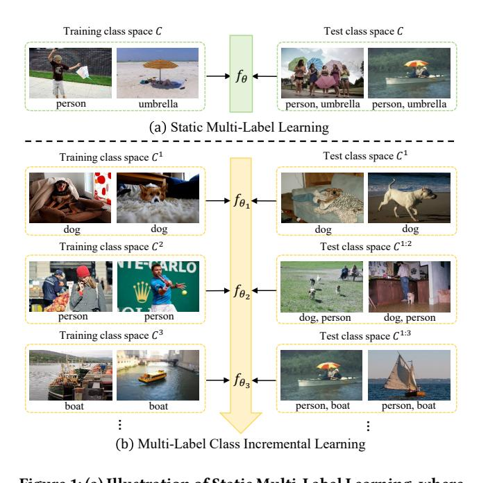
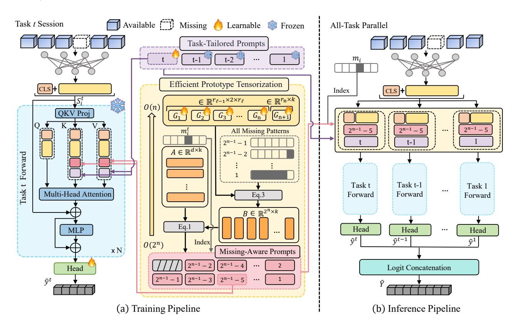
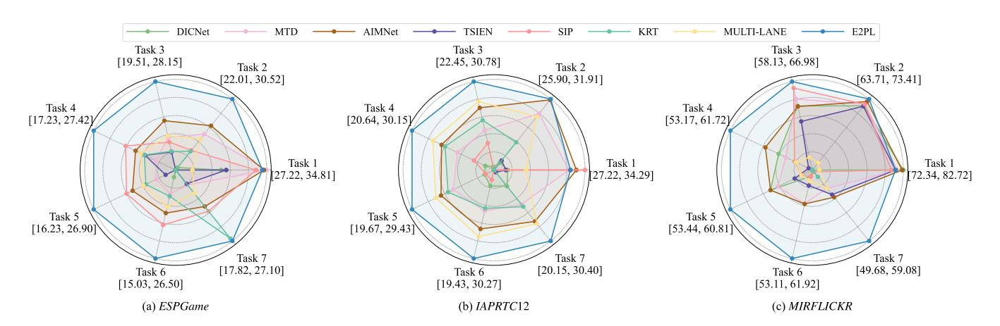
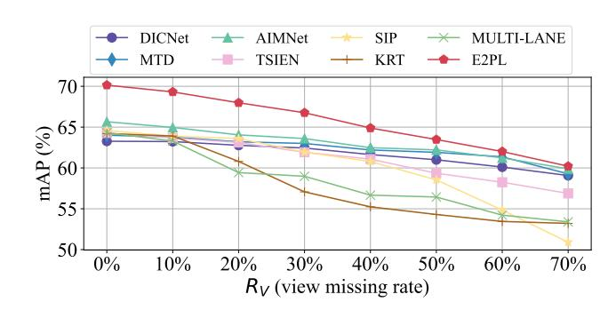
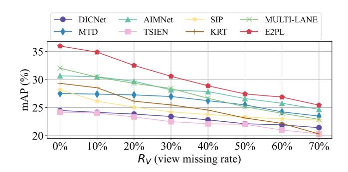
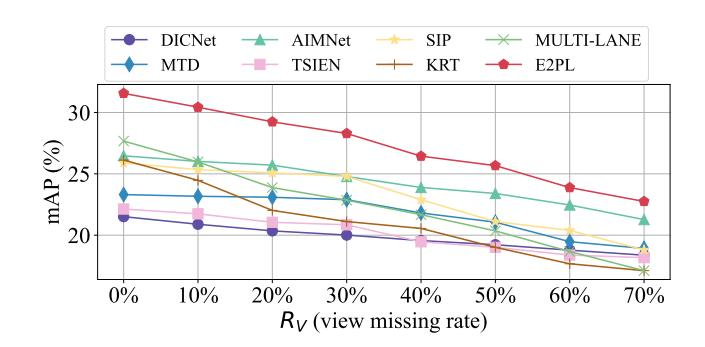
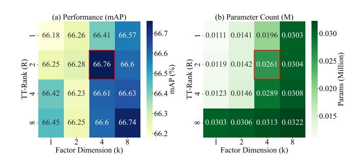

# E2PL: Effective and Efficient Prompt Learning for Incomplete Multi-view Multi-Label Class Incremental Learning

Jiajun Chen Zhejiang University Center for Data Science Hangzhou, Zhejiang, China chenjjcccc@zju.edu.cn

Yue Wu Ant Group Hangzhou, Zhejiang, China yuyue.wy@antgroup.com

Kai Huang Ant Group Hangzhou, Zhejiang, China kevin.hk@antgroup.com

Wenxi Zhao Zhejiang University School of Software Technology Ningbo, Zhejiang, China 2840126Z@student.gla.ac.uk

Yangyang Wu∗ Zhejiang University School of Software Technology Ningbo, Zhejiang, China zjuwuyy@zju.edu.cn

Xiaoye Miao Zhejiang University Center for Data Science Hangzhou, Zhejiang, China miaoxy@zju.edu.cn

Mengying Zhu Zhejiang University School of Software Technology Ningbo, Zhejiang, China mengyingzhu@zju.edu.cn

Meng Xi Zhejiang University School of Software Technology Ningbo, Zhejiang, China ximeng@zju.edu.cn

Guanjie Cheng Zhejiang University School of Software Technology Ningbo, Zhejiang, China zhaoxinkui@zju.edu.cn

### Abstract

Multi-view multi-label classification (MvMLC) is indispensable for modern web applications aggregating information from diverse sources. However, real-world web-scale settings are rife with missing views and continuously emerging classes, which pose significant obstacles to robust learning. Prevailing methods are illequipped for this reality, as they either lack adaptability to new classes or incur exponential parameter growth when handling all possible missing-view patterns, severely limiting their scalability in web environments. To systematically address this gap, we formally introduce a novel task, termed incomplete multi-view multi-label class incremental learning (IMvMLCIL), which requires models to simultaneously address heterogeneous missing views and dynamic class expansion. To tackle this task, we propose E2PL, an Effective and Efficient Prompt Learning framework for IMvMLCIL. E2PL unifies two novel prompt designs: task-tailored prompts for classincremental adaptation and missing-aware prompts for the flexible integration of arbitrary view-missing scenarios. To fundamentally address the exponential parameter explosion inherent in missingaware prompts, we devise an efficient prototype tensorization module, which leverages atomic tensor decomposition to elegantly reduce the prompt parameter complexity from exponential to linear w.r.t. the number of views. We further incorporate a dynamic contrastive

∗Corresponding author.

Permission to make digital or hard copies of all or part of this work for personal or classroom use is granted without fee provided that copies are not made or distributed for profit or commercial advantage and that copies bear this notice and the full citation on the first page. Copyrights for components of this work owned by others than the author(s) must be honored. Abstracting with credit is permitted. To copy otherwise, or republish, to post on servers or to redistribute to lists, requires prior specific permission and/or a fee. Request permissions from permissions@acm.org.

WWW '26, Dubai, United Arab Emirates © 2026 Copyright held by the owner/author(s). Publication rights licensed to ACM. ACM ISBN 978-1-4503-XXXX-X/2018/06

<https://doi.org/10.1145/3774904.3792572>

learning strategy explicitly model the complex dependencies among diverse missing-view patterns, thus enhancing the model's robustness. Extensive experiments on three benchmarks demonstrate that E2PL consistently outperforms state-of-the-art methods in both effectiveness and efficiency. The codes and datasets are available at https://anonymous.4open.science/r/code-for-E2PL.

# CCS Concepts

• Computing methodologies → Supervised learning by classification.

# Keywords

Incomplete multi-view data, multi-label classification, class incremental learning, prompt learning, contrastive learning

#### ACM Reference Format:

Jiajun Chen, Yue Wu, Kai Huang, Wenxi Zhao, Yangyang Wu, Xiaoye Miao, Mengying Zhu, Meng Xi, and Guanjie Cheng. 2026. E2PL: Effective and Efficient Prompt Learning for Incomplete Multi-view Multi-Label Class Incremental Learning. In Proceedings of the ACM WEB Conference (WWW '26). ACM, New York, NY, USA, [11](#page-10-0) pages. [https://doi.org/10.1145/3774904.](https://doi.org/10.1145/3774904.3792572) [3792572](https://doi.org/10.1145/3774904.3792572)

Multi-view multi-label classification (MvMLC) has emerged as a cornerstone technique for web applications that seek to integrate heterogeneous information from multiple sources and capture intricate semantic dependencies among labels [\[15,](#page-8-0) [31,](#page-8-1) [34\]](#page-8-2). By combining distinct feature representations across views, MvMLC not only enhances predictive accuracy but also increases robustness compared to its single-view counterparts, enabling a wide range of applications such as multimedia retrieval, medical diagnosis, and remote sensing. In practice, however, multi-view data collected from real-world web environments are often incomplete due to sensor malfunctions, occlusions, user privacy restrictions, or prohibitive acquisition costs. This leads to the incomplete multi-view

multi-label classification (IMvMLC) problem, which has attracted significant attention for its practical importance and inherent complexity [\[19,](#page-8-3) [20,](#page-8-4) [28\]](#page-8-5). Despite notable progress, existing IMvMLC solutions still encounter two core obstacles that hinder large-scale deployment in dynamic web systems:

Class-Incremental Flexibility Barrier (CH1): The prevailing paradigm [\[17,](#page-8-6) [22,](#page-8-7) [33\]](#page-8-8) is grounded in static multi-label learning, where the mapping from input features to labels is constructed statically and assumed fixed during deployment as depicted in Figure [1](#page-1-0) (a). However, in open-world web applications, the continual introduction of new categories is the norm rather than the exception. For instance, in medical image analysis, the discovery of novel disease subtypes is an ongoing process due to advances in research and the accumulation of clinical data [\[1,](#page-8-9) [11\]](#page-8-10). This necessitates that deployed models not only retain knowledge of previously seen categories, but also incrementally incorporate and recognize new classes as they arise, often without access to the original training data and while avoiding catastrophic forgetting illustrated in Figure [1](#page-1-0) (b). Unfortunately, existing IMvMLC methods, which are typically built on static learning assumptions, lack the flexibility to efficiently accommodate such incremental categories. This incremental inadaptability poses a critical barrier, severely limiting the practical deployment of these models in evolving web environments.

Scalability and Parameter Explosion (CH2): Existing IMvMLC methods predominantly rely on complex network architectures, such as autoencoder-based frameworks [\[15,](#page-8-0) [18,](#page-8-11) [21\]](#page-8-12), which, while effective in handling missing data, often incur high computational overhead and challenging optimization problems. Their rigid designs fundamentally limit scalability and adaptability in scenarios with continuously expanding categories. Recently, prompt-based methods [\[12,](#page-8-13) [13,](#page-8-14) [36\]](#page-8-15) have been proposed as lightweight and potentially scalable alternatives for incomplete data learning. However, these methods require designing specific prompt templates for all possible missing-view patterns, resulting in exponential complexity, specifically O (2 ), where �� is the number of views and 2 corresponds to all possible missing-view patterns. This inevitably leads to a parameter explosion.

To address these critical challenges, we introduce a novel task of incomplete multi-view multi-label class incremental learning (IMvML-CIL), which demands models to jointly manage heterogeneous missing views and dynamically expanding label spaces. To tackle this, we present E2PL—an Effective and Efficient Prompt Learning framework that unifies both task-tailored prompts (TTPs) for swift adaptation to new classes and missing-aware prompts (MAPs) for flexible integration of arbitrary missing-view patterns. To address the associated parameter explosion in MAPs, we introduce an efficient prototype tensorization (EPT) module based on atomic tensor decomposition, compressing the prompt space from exponential to linear complexity. Furthermore, the dynamic contrastive learning (DCL) strategy is employed to capture nuanced interrelations among diverse missing-view patterns, further enhancing robustness and adaptability. In summary, our paper makes several notable contributions:

- Towards the IMvMLCIL task, we propose a prompt-based framework E2PL, effectively addressing the challenges of heterogeneous missing views and dynamically expanding

Figure 1: (a) Illustration of Static Multi-Label Learning, where the model is trained and evaluated on a fixed set of classes. (b) Illustration of Multi-Label Class Incremental Learning, where new classes (e.g., "dog", "person", "boat") are introduced sequentially, requiring the model to adapt to an expanding class set while retaining prior knowledge.

label spaces. To the best of our knowledge, this is the first work to holistically address the IMvMLCIL problem within a unified framework.

- We design an efficient prototype tensorization module via atomic tensor decomposition, reducing the parameter complexity of missing-aware prompts from exponential O (2 ) to linear O (��) w.r.t. the number of views.
- We propose a dynamic contrastive learning strategy to capture nuanced interrelations among diverse missing-view patterns, further enhancing the model's robustness and adaptability in incremental learning scenarios.
- Extensive experiments on three benchmark datasets, demonstrating that E2PL consistently outperforms state-of-the-art methods in both effectiveness and efficiency.

# 1 Related Work

# 1.1 Multi-View Multi-Label Classification

Multi-view multi-label classification (MvMLC) has emerged as a pivotal research direction, situated at the intersection of multiview learning and multi-label classification. Its recent prominence is largely propelled by significant advances in multi-view representation learning. Zhang et al. [\[31\]](#page-8-1) introduced a matrix factorization approach to align latent representations across views. Wu et al. [\[29\]](#page-8-16) proposed SIMM to jointly exploit a shared subspace and captureview-specific features through adversarial, multi-label lossand orthogonal constraints. Zhao et al. [\[35\]](#page-8-17) presented CDMM, which learns independent predictions for each view and maximizes

feature-label dependence via the Hilbert–Schmidt Independence Criterion. The challenge of data incompleteness in both features and labels adds further complexity. Incomplete Multi-view Multi-label Classification (IMvMLC), first addressed by Tan et al. [\[25\]](#page-8-18), projects incomplete data into a common subspace and bridges it to the label space with a projection matrix and learnable label correlations. Subsequent work has improved robustness and representation: DICNet [\[19\]](#page-8-3) employs autoencoders and instance-level contrastive learning; TSIEN [\[26\]](#page-8-19) disentangles task-relevant and irrelevant information using information bottleneck theory; and DRLS [\[30\]](#page-8-20) separates and exploits consistent and view-specific representations via disentangled learning. Nevertheless, class-incremental flexibility barrier (CH1) and scalability and parameter explosion (CH2) remain insufficiently addressed, hindering the real-world deployment in dynamic environments.

### 1.2 Prompt Learning

Prompt learning [\[9,](#page-8-21) [14,](#page-8-22) [16\]](#page-8-23) adapts pre-trained models to diverse downstream tasks by designing effective prompts. Recently, the integration of prompt learning techniques into multimodal learning under the general missing modality scenario—where each specific missing pattern is regarded as a distinct task—has emerged as a lightweight and efficient adaptation strategy [\[6,](#page-8-24) [12,](#page-8-13) [13\]](#page-8-14). Despite significant progress, existing approaches typically require separate prompts for each missing modality pattern, leading to exponential growth in parameters as the number of modalities increases. Jang et al. [\[8\]](#page-8-25) mitigate this by introducing Modality-Specific Prompts, reducing parameter complexity from exponential to linear by assigning independent prompts to each modality. Building on this, Chen et al. [\[2\]](#page-8-26) proposed EPE-P, which further improves efficiency and performance by integrating cross-modal prompts. However, as the number of modalities increases, such independent modeling approaches fail to capture the nuanced dependencies across missing scenarios, ultimately limiting their adaptability and expressiveness. In this work, we retain the independent prompt design for each missing case and further propose a parameter decomposition technique that minimizes parameter overhead while achieving optimal performance.

### 2 Methodology

# 2.1 Problem Definition

Assume there are a total of�� incremental sessions {(X1 , Y1 , C 1 ), · · · (X�� , Y�� , C �� )}, where each session�� provides a training set (X�� , Y�� ) and a newly introduced, disjoint label set C (i.e., C �� ∩ C�� = ∅ for �� ≠ ��). For each session, X�� = n �� ��,1 , · · · , ���� ��,�� ,���� o���� ��=1 denotes the multi-view features of ���� samples, where �� is the number of views, �� ��,�� is the feature vector of the ��-th view, and ���� ∈ {0, 1} is a view-indicator vector with ���� ��,�� = 1 if the ��-th view is available and 0 otherwise, allowing for missing views. The corresponding label set Y�� = {�� �� ���� ��=1 contains multi-label annotations for the current session, where each �� ∈ {0, 1} | C�� . The goal of incomplete multi-view multi-label class incremental learning (IMvMLCIL) is to incrementally train a unified multi-label classification model that can accurately predict labels over all encountered classes for samples with missing multi-view features. At each session ��, only the

current training data (X�� , Y�� ) are available for model update. After session ��, the model is evaluated on a test set covering all classes seen so far, i.e., the cumulative class space C 1:�� = �� ��=1 C . For each test sample, the model must predict a multi-label vector over C 1:�� based on its possibly incomplete multi-view features. During preprocessing, missing values in X are imputed with zeros.

#### 2.2 Prompt Design

Existing IMvMLC methods [\[15,](#page-8-0) [18,](#page-8-11) [21\]](#page-8-12) mainly use autoencoderbased models to extract unimodal and multimodal features, which are fused and classified by multi-layer perceptrons. While effective, these architectures are often cumbersome and lack scalability and adaptability, especially in class-incremental scenarios common to real-world applications. To address these limitations, we propose a unified prompt-based framework that leverages the efficiency and flexibility of prompt learning, as illustrated in Figure [2.](#page-3-0) Our proposed framework E2PL orchestrates two complementary prompt types—task-tailored for class increments and missing-aware for data incompleteness—to achieve robust performance in dynamic and imperfect data environments.

Task-Tailored Prompts (TTPs). To support class incremental learning scenario, we structure the problem as a sequence of tasks, each bringing in new classes. For each task, we design TTPs specific to its requirements. Formally, let ���� = {�� 1 �� , ��2 �� , · · · , ���� �� }, where �� �� denotes the prompt uniquely learned for the ��-th task. These prompts are attached to a frozen, pre-trained transformer backbone, allowing efficient injection of task-specific knowledge without retraining the model. During training for the ��-th task, only �� �� is updated, while prompts from previous tasks remain fixed to prevent catastrophic forgetting illustrated in Figure [2](#page-3-0) (a). At inference (Figure [2](#page-3-0) (b)), all task-tailored prompts are processed in parallel, and the outputs from the corresponding task-specific classification heads are concatenated for final prediction.

Missing-Aware Prompts (MAPs). To address the challenge posed by varying missing-view configurations in incomplete multi-view data, we propose Missing-Aware Prompts (MAPs), where each prompt is explicitly engineered to represent a unique pattern of view availability. For �� input views, there exist 2 �� − 1 possible missing-view patterns, as each view can be either present or absent (for convenience, we use 2 in the following discussion). Ideally, each pattern would be assigned a unique prompt, denoted as ���� = {�� 1 , · · · , ��2 �� }, where �� corresponds to the ��-th missingview pattern.

### 2.3 Efficient Prototype Tensorization

The direct parameterization of MAPs presents a fundamental scalability bottleneck. By assigning a distinct prompt to each of the 2 �� possible missing-view configurations for �� input views, the approach incurs an exponential parameter complexity of O (2 ), rendering it intractable for real-world applications with a large number of views. To mitigate the parameter explosion, we propose an efficient prototype tensorization (EPT) module, which leverages atomic tensor decomposition to reduce the parameter complexity from exponential to linear in ��, i.e., O (��), while preserving the expressiveness of distinct prompts.

Specifically, we define a MAPs matrix ���� ∈ R ��×2 , where �� is the prompt length and each column �� �� �� represents the prompt for

first is the standard binary cross-entropy (BCE) loss, which governs performance on the primary classification task, i.e.,

L������ = − 1 |Y�� ∑︁ ��∈Y�� �� log��ˆ �� + (1 − �� ) log(1 − ��ˆ ) , (13)

where �� is the ground truth binary label and ��ˆ is the corresponding model prediction. The second, a dynamic contrastive learning loss L������, regularizes the latent space by enforcing semantic consistency and discriminability among diverse missing-view patterns.

Hence, the final objective for E2PL, denoted L���������� , is the weighted aggregation of these two components:

L���������� = L������ + �� · L������, (14)

where �� is a hyperparameter that balances two loss terms.

Inference Pipeline. During the inference stage, for a test sample X�� , the MAP �� �� is generated by the EPT module according to the view-indicator vector ���� . Meanwhile, all TTPs from the �� tasks are attached in parallel to the backbone network, resulting in �� forward propagation pathways, as shown in Figure [2](#page-3-0) (b). The [CLS] representation from each pathway is fed into its corresponding classification head to obtain the task-specific logit. All logits are then concatenated to form the final prediction vector:

��ˆ = [��ˆ 1 ; · · · ;��ˆ �� ], (15)

where [·; ·] denotes the concatenation operation. The final multilabel prediction is obtained by independently thresholding each sigmoid-normalized logit, which is the standard practice in multilabel and binary classification tasks.

### 3 Experiment

Datasets. Following the protocol established in previous works [\[17\]](#page-8-6), we conduct experiments on three widely used multi-view multilabel datasets: ESPGame [\[27\]](#page-8-29), IAPRTC12 [\[5\]](#page-8-30), and MIRFLICKR [\[7\]](#page-8-31). Each dataset is represented by six distinct feature types, including GIST, HSV, DenseHue, DenseSift, RGB, and LAB. Detailed statistics for all datasets are provided in Appendix A. For each dataset, we randomly choose 15% samples for the test, 15% for validation, and the rest for training.

Metrics. Following [\[4\]](#page-8-32) and [\[32\]](#page-8-33), we adopt the mean average precision (mAP) as the primary evaluation metric for each incremental task, and report both the average mAP (the average of the mAP across all tasks) and the last mAP (the mAP of the last task). We also report the per-class F1 score (CF1) and overall F1 score (OF1) for performance evaluation.

Baselines. We compare E2PL with five state-of-the-art IMvMLC methods: DICNet [\[19\]](#page-8-3), MTD [\[18\]](#page-8-11), AIMNet [\[17\]](#page-8-6), TSIEN [\[26\]](#page-8-19), and SIP [\[21\]](#page-8-12); and three MLCIL methods: PSR [\[10\]](#page-8-34), KRT [\[4\]](#page-8-32), and MULTI-LANE [\[3\]](#page-8-35). We include the Upper-bound baseline, which assumes access to all task data simultaneously and represents the ideal performance. Following [\[4\]](#page-8-32), we set three different memory sizes: 0, 200, and 2/class. To ensure fair and rigorous experimental comparisons, we strictly adhere to the original implementation protocols for all MLCIL methods. As these methods are limited to single-view inputs, we independently train each method on every available view and report the best performance achieved across all views.

Implementation Details. Since all datasets are originally complete in terms of view availability, we artificially introduce missing data to emulate real-world incomplete scenarios. Following [\[19\]](#page-8-3), we generate a missing instance rate of ��% (i.e., view missing rate ���� = ��%), by randomly removing ��% of the instances from each view, while ensuring every instance remains observable in at least one view. To simulate a class-incremental learning scenario, each dataset is partitioned into �� = 7 incremental tasks, with an equal number of classes introduced at each stage. For our proposed method, the dimension �� of all prompts is set to 128, and all TT-ranks are set as ��0 = ��1 = · · · = ���� = 2. Other hyperparameters are set as follows: �� = 3, �� = 4, �� = 1, and �� = 0.001. The Adam optimizer is used for all experiments, with a batch size of 128 and a learning rate of 0.02. The detailed experimental setups are provided in Appendix B. For fairness, all results are averaged over five times.

#### 3.1 Comparison Study

Table [1](#page-6-0) summarizes the performance across all datasets, showing that E2PL consistently outperforms all baselines. On the MIRFLICKR dataset, under the strict zero-memory setting, E2PL achieves a mAP of 66.76, surpassing the best IMvMLC baseline AIMNet-R and the leading MLCIL method KRT-R by 2.47 and 5.75 points, corresponding to relative gains of 3.8% and 9.4%. For the last-increment mAP, E2PL reaches 59.08, exceeding all baselines by 4.78 to 6.46 points. Similarly, E2PL achieves the highest CF1 and OF1 scores without memory replay. Consistent trends are observed on ESPGame and IAPRTC12, where E2PL achieves the best results on all metrics. Notably, E2PL is the only method that consistently maintains high performance under the most challenging incremental learning scenarios, underscoring its robustness and generalizability in both class-incremental and incomplete multi-view settings.

Figure [3](#page-6-1) provides a fine-grained depiction of mAP progression across incremental learning tasks. Unlike other methods that suffer significant drops as new classes are introduced, E2PL maintains stable performance, with fluctuations below 2% across all increments. This resilience to forgetting is attributed to its prompt-based architecture, which preserves previously learned knowledge while effectively integrating new information, ensuring both stability and adaptability in class incremental learning.

# 3.2 Effect of View Missing Rates

Figure [4](#page-7-0) illustrates the robustness of different methods under varying view missing rates (���� ) in the CIL setting. E2PL consistently achieves the highest mAP across all missing rates. At ���� = 0%, E2PL attains a mAP of 70.14, exceeding the best baseline AIMNet by 4.48 points. When ���� rises to 30%, E2PL maintains a leading mAP of 66.76, while AIMNet drops to 63.60, resulting in a margin of 3.16 points. Even at ���� = 70%, E2PL achieves 60.21 mAP, outperforming the nearest competitor AIMNet by 6.13 points. Notably, as ���� increases, the performance gap between E2PL and the baseline methods gradually narrows, decreasing from 4.48% at ���� = 0% to 2.0% at ���� = 70%-which is anticipated, as higher missing rates mean less available information and greater learning difficulty, particularly in class incremental settings. Nevertheless, the prompt-based architecture of E2PL exhibits substantial robustness and adaptability, consistently outperforming state-of-the-art methods and ensuring reliable performance even under severe view missing scenarios. Additional experiments on two other datasets,

Table 1: Evaluation on three datasets at ���� = 30%. "Memory" denotes the number of replay samples; "-R" indicates the memory allocated to the method. Bold and underlined values indicate the best and second-best results, respectively.

| Methods     | Types    | Memory | Avg. mAP | CF1  | ESPGame Last OF1 | mAP   | Avg. mAP | CF1  | IAPRTC12 Last OF1 | mAP   | Avg. mAP | CF1   | MIRFLICKR Last OF1 | mAP   |
|-------------|----------|--------|----------|------|------------------|-------|----------|------|-------------------|-------|----------|-------|--------------------|-------|
| Upper-bound | Baseline | 0      |          | 2.99 | 13.54            | 30.17 |          | 3.24 | 17.49             | 32.45 |          | 36.71 | 51.25              | 62.47 |
| DICNet      | IMvMLC   |        |          |      |                  |       |          |      |                   |       |          |       |                    |       |
|             |          |        | 20.01    | 0.61 | 5.82             | 17.82 | 23.42    | 0.58 | 12.67             | 22.50 | 61.29    | 19.04 | 43.13              | 49.68 |
| MTD         | IMvMLC   |        | 22.89    | 0.95 | 8.92             | 19.79 | 26.98    | 1.23 | 13.30             | 25.12 | 63.00    | 22.34 | 43.66              | 52.11 |
| AIMNet      | IMvMLC   |        | 24.78    | 1.42 | 8.82             | 22.59 | 28.17    | 2.10 | 13.34             | 27.57 | 63.60    | 25.79 | 45.42              | 53.28 |
| TSIEN       | IMvMLC   |        | 20.85    | 0.73 | 6.17             | 19.63 | 22.50    | 0.92 | 10.35             | 20.47 | 61.92    | 12.95 | 33.89              | 52.94 |
| SIP         | IMvMLC   |        | 24.79    | 1.02 | 8.11             | 23.21 | 24.23    | 2.18 | 13.21             | 20.15 | 61.93    | 24.92 | 38.13              | 49.92 |
| KRT         | MLCIL    |        | 21.11    | 0.72 | 5.23             | 19.97 | 26.78    | 1.45 | 11.21             | 25.44 | 57.07    | 10.63 | 35.12              | 50.59 |
| MULTI-LANE  | MLCIL    |        | 22.85    | 0.97 | 7.14             | 20.88 | 28.41    | 2.24 | 13.61             | 27.91 | 58.98    | 11.61 | 37.09              | 52.13 |
| AIMNet-R    | IMvMLC   |        |          |      |                  |       |          |      |                   |       |          |       |                    |       |
|             |          |        | 25.59    | 1.47 | 8.82             | 23.33 | 28.40    | 2.53 | 13.37             | 28.34 | 64.59    | 26.43 | 41.36              | 54.18 |
| SIP-R       | IMvMLC   |        | 25.89    | 1.53 | 8.81             | 24.13 | 26.61    | 1.92 | 11.87             | 25.29 | 63.98    | 26.23 | 40.11              | 52.94 |
| PRS         | MLCIL    |        | 20.12    | 0.58 | 5.82             | 17.23 | 22.34    | 1.13 | 9.24              | 22.11 | 56.66    | 9.67  | 33.13              | 51.88 |
| KRT-R       | MLCIL    |        | 22.56    | 0.79 | 7.21             | 21.12 | 27.42    | 1.69 | 12.19             | 26.77 | 61.01    | 16.12 | 39.98              | 52.62 |
| AIMNet-R    | IMvMLC   |        |          |      |                  |       |          |      |                   |       |          |       |                    |       |
|             |          |        | 25.79    | 1.56 | 9.84             | 24.01 | 28.03    | 2.12 | 12.34             | 27.56 | 64.29    | 26.45 | 46.32              | 54.30 |
| SIP-R       | IMvMLC   |        | 25.36    | 1.47 | 8.97             | 24.43 | 26.72    | 1.83 | 11.13             | 25.34 | 63.71    | 25.80 | 39.50              | 52.63 |
| PRS         | MLCIL    |        | 20.38    | 0.62 | 6.42             | 17.83 | 22.44    | 1.18 | 9.55              | 21.44 | 56.65    | 9.28  | 31.98              | 50.23 |
| KRT-R       | MLCIL    |        | 22.89    | 0.82 | 7.56             | 21.44 | 28.01    | 1.78 | 12.56             | 26.72 | 60.11    | 15.34 | 39.50              | 52.77 |
| E2PL        | IMvMLCIL | 0      | 28.29    | 2.37 | 11.37            | 27.10 | 30.74    | 2.91 | 14.82             | 30.40 | 66.76    | 30.73 | 47.14              | 59.08 |

Figure 3: Comparison of performance (mAP) on three datasets at ���� = 30% over �� = 7 incremental tasks (Memory = 0).

detailed in Appendix C, further confirm the effectiveness and generalizability of E2PL.

### 3.3 Analysis of Effectiveness and Efficiency

To rigorously assess the effectiveness and efficiency of E2PL, we perform controlled experiments by substituting the EPT module with MAP [\[13\]](#page-8-14), MSP [\[8\]](#page-8-25), and EPE-P [\[2\]](#page-8-26) within a unified framework. Here, the parameter count specifically refers to the number of prompt parameters required to model all possible missing-view patterns, where �� is the total number of views. Other variables, including ��, ��, ��, and ��, are treated as constants, and all other factors are held fixed. As summarized in Table [2,](#page-7-1) MAP and MSP exhibit

exponential parameter growth (O (2 )), and EPE-P shows cubic complexity, while EPT achieves linear growth (O (��)) owing to its efficient modeling strategy. EPT leverages atomic tensor decomposition for dimension reduction, enabling customized modeling for each missing-view pattern while simultaneously enhancing interactions and knowledge sharing across different patterns. Notably, EPT achieves the highest mAP among all compared methods, with minimal storage overhead. These results convincingly demonstrate both the effectiveness and efficiency of EPT in the IMvMLCIL setting. We further validate the superior efficiency of E2PL through experiments on two additional datasets in Appendix D.

Figure 4: Performance demonstration under different view missing rates on the MIRFLICKR dataset.

Table 2: Analysis of effectiveness and efficiency on the MIR-FLICKR dataset at ���� = 30%. Bold and underlined values indicate the best and second-best results, respectively.

Table [3](#page-7-2) further elucidates the resource efficiency of our approach. E2PL requires only 0.026M parameters—an 86% reduction compared to MAP (0.193M)—and maintains a competitive training time of 335 ms per epoch. The marginally increased training time, relative to MAP (268 ms), is primarily due to the dynamic generation of all missing-aware prompts during optimization. In the inference phase, however, E2PL utilizes the missing-view indicator to generate only the necessary prompt for each instance, yielding a significant advantage in inference speed (11.4 ms) over MSP (27.6 ms) and EPE-P (30.1 ms), and closely approaching MAP (10.5 ms). GPU memory consumption remains moderate at 889 MB, further highlighting the method's practical efficiency. E2PL thus establishes a new paradigm for IMvMLCIL by simultaneously advancing both effectiveness and efficiency in large-scale, real-world scenarios.

# 3.4 Ablation Study

To assess the effectiveness of each proposed component, we conduct an ablation study on the MIRFLICKR dataset, as shown in Table [4.](#page-7-3) Using only task-tailored prompts (TTPs) yields an mAP of 62.04, serving as the baseline for class-incremental adaptation. Introducing missing-aware prompts (MAPs) increases the mAP to 64.18, underscoring the value of explicitly modeling incomplete view configurations. Incorporating efficient prototype tensorization (EPT) further improves the mAP to 65.71; importantly, EPT not only reduces parameter complexity but also enhances interaction modeling across different missing-view scenarios, enabling more expressive and scalable prompt generation. The addition of dynamic contrastive learning (DCL) results in a further performance gain (mAP 65.38), as DCL dynamically captures the underlying relationships among various missing patterns, facilitating robust representation learning. When all modules are integrated, E2PL

Table 3: Resource consumption and computational efficiency of different methods. Bold and underlined values indicate the best and second-best results, respectively. TT/E refers to the training time per epoch for the model, IT/B denotes the inference time for a single batch sample, and MGM indicates the maximum GPU memory usage recorded during the experimental process.

| Methods | Params (M) | TT/E (ms) | IT/B (ms) | MGM (MB) |
|---------|------------|-----------|-----------|----------|
| MAP     | 0.193      | 268       | 10.5      | 998      |
| MSP     | 0.049      | 315       | 27.6      | 822      |
| EPE-P   | 0.044      | 405       | 30.1      | 801      |
| E2PL    | 0.026      | 335       | 11.4      | 889      |

Table 4: Ablation results of E2PT on the MIRFLICKR dataset at ���� = 30%. Bold and underlined values indicate the best and second-best results, respectively.

|       | Components |      |       | mAP    |
|-------|------------|------|-------|--------|
| +TTPs | +MAPs +EPT | +DCL |       |        |
|       | ✓          | ✓ ✓  | 62.04 | ± 0.11 |
| ✓     |            |      | 64.18 | ± 0.05 |
| ✓     | ✓          | ✓    | 65.71 | ± 0.08 |
| ✓     | ✓          | ✓    | 65.38 | ± 0.07 |
| ✓     | ✓          | ✓ ✓  | 66.76 | ± 0.03 |

achieves the highest performance, outperforming all partial configurations. These results clearly demonstrate that each module addresses a distinct aspect of the IMvMLCIL task, and their synergistic integration is key for achieving state-of-the-art performance. Furthermore, the effectiveness of each module in E2PL is substantiated by consistent ablation studies on two additional datasets, with detailed results in Appendix E.

# 4 Conclusion

In this work, we propose E2PL, an effective and efficient prompt learning framework that integrates TTPs for class-incremental adaptation with MSPs for flexible handling of missing views. Our EPT module reduces prompt space complexity from exponential to linear and enables expressive modeling across diverse missingview scenarios. Additionally, the DCL strategy further enhances robustness by capturing latent relationships among missing patterns. Extensive experiments on three benchmarks demonstrate that E2PL consistently outperforms existing methods, highlighting its effectiveness and scalability in incremental scenarios.

# Acknowledgments

This work is supported by the Leading Goose R&D Program of Zhejiang under Grant No. 2024C01109, the Zhejiang Provincial Natural Science Foundation of China under Grant No.QN26F020098, the Young Doctoral Innovation Research Program of Ningbo Natural Science Foundation Grant No. 2024J207, and the Ningbo Yongjiang Talent Program Grant 2024A-158-G. Yangyang Wu is the corresponding author of the work.

- References [1] Xiaoyang Chen, Hao Zheng, Yifang Xie, Yuncong Ma, and Tengfei Li. 2024. A Classifier-Free Incremental Learning Framework for Scalable Medical Image Segmentation. arXiv preprint arXiv:2405.16328 (2024). [2] Zhe Chen, Xun Lin, Yawen Cui, and Zitong Yu. 2024. EPE-P: Evidence-based Parameter-efficient Prompting for Multimodal Learning with Missing Modalities. arXiv preprint arXiv:2412.17677 (2024). [3] Thomas De Min, Massimiliano Mancini, Stéphane Lathuilière, Subhankar Roy, and Elisa Ricci. 2024. Less is more: Summarizing patch tokens for efficient multi-label class-incremental learning. arXiv preprint arXiv:2405.15633 (2024). [4] Songlin Dong, Haoyu Luo, Yuhang He, Xing Wei, Jie Cheng, and Yihong Gong. 2023. Knowledge restore and transfer for multi-label class-incremental learning. In Proceedings of the IEEE/CVF International Conference on Computer Vision. 18711– 18720. [5] Michael Grubinger, Paul Clough, Henning Müller, and Thomas Deselaers. 2006. The iapr tc-12 benchmark: A new evaluation resource for visual information systems. In International workshop ontoImage, Vol. 2. [6] Zirun Guo, Tao Jin, and Zhou Zhao. 2024. Multimodal prompt learning with missing modalities for sentiment analysis and emotion recognition. arXiv preprint arXiv:2407.05374 (2024). [7] Mark J Huiskes and Michael S Lew. 2008. The mir flickr retrieval evaluation. In Proceedings of the 1st ACM international conference on Multimedia information retrieval. 39–43. [8] Jaehyuk Jang, Yooseung Wang, and Changick Kim. 2024. Towards robust multimodal prompting with missing modalities. In ICASSP 2024-2024 IEEE International Conference on Acoustics, Speech and Signal Processing (ICASSP). IEEE, 8070–8074. [9] Muhammad Uzair Khattak, Hanoona Rasheed, Muhammad Maaz, Salman Khan, and Fahad Shahbaz Khan. 2023. Maple: Multi-modal prompt learning. In Proceedings of the IEEE/CVF conference on computer vision and pattern recognition. 19113–19122. [10] Chris Dongjoo Kim, Jinseo Jeong, and Gunhee Kim. 2020. Imbalanced continual learning with partitioning reservoir sampling. In Computer Vision–ECCV 2020: 16th European Conference, Glasgow, UK, August 23–28, 2020, Proceedings, Part XIII
- 16. Springer, 411–428. [11] Pratyush Kumar and Muktabh Mayank Srivastava. 2018. Example mining for incremental learning in medical imaging. In 2018 IEEE symposium series on computational intelligence (SSCI). IEEE, 48–51. [12] Jian Lang, Zhangtao Cheng, Ting Zhong, and Fan Zhou. 2025. Retrievalaugmented dynamic prompt tuning for incomplete multimodal learning. In Proceedings of the AAAI Conference on Artificial Intelligence, Vol. 39. 18035–18043. [13] Yi-Lun Lee, Yi-Hsuan Tsai, Wei-Chen Chiu, and Chen-Yu Lee. 2023. Multimodal prompting with missing modalities for visual recognition. In Proceedings of the IEEE/CVF Conference on Computer Vision and Pattern Recognition. 14943–14952. [14] Brian Lester, Rami Al-Rfou, and Noah Constant. 2021. The power of scale for parameter-efficient prompt tuning. arXiv preprint arXiv:2104.08691 (2021). [15] Quanjiang Li, Tingjin Luo, Mingdie Jiang, Zhangqi Jiang, Chenping Hou, and Feijiang Li. 2025. Semi-Supervised Multi-View Multi-Label Learning with View-Specific Transformer and Enhanced Pseudo-Label. In Proceedings of the AAAI Conference on Artificial Intelligence, Vol. 39. 18430–18438. [16] Sheng Liang, Mengjie Zhao, and Hinrich Schütze. 2022. Modular and parameterefficient multimodal fusion with prompting. arXiv preprint arXiv:2203.08055 (2022). [17] Chengliang Liu, Jinlong Jia, Jie Wen, Yabo Liu, Xiaoling Luo, Chao Huang, and Yong Xu. 2024. Attention-induced embedding imputation for incomplete multiview partial multi-label classification. In Proceedings of the AAAI Conference on Artificial Intelligence, Vol. 38. 13864–13872. [18] Chengliang Liu, Jie Wen, Yabo Liu, Chao Huang, Zhihao Wu, Xiaoling Luo, and Yong Xu. 2023. Masked two-channel decoupling framework for incomplete multi-view weak multi-label learning. Advances in Neural Information Processing Systems 36 (2023), 32387–32400. [19] Chengliang Liu, Jie Wen, Xiaoling Luo, Chao Huang, Zhihao Wu, and Yong Xu. 2023. Dicnet: Deep instance-level contrastive network for double incomplete multi-view multi-label classification. In Proceedings of the AAAI conference on artificial intelligence, Vol. 37. 8807–8815. [20] Chengliang Liu, Jie Wen, Yong Xu, Bob Zhang, Liqiang Nie, and Min Zhang. 2025. Reliable representation learning for incomplete multi-view missing multi-label classification. IEEE Transactions on Pattern Analysis and Machine Intelligence (2025). [21] Chengliang Liu, Gehui Xu, Jie Wen, Yabo Liu, Chao Huang, and Yong Xu. 2024. Partial multi-view multi-label classification via semantic invariance learning and prototype modeling. In Forty-first International Conference on Machine Learning. [22] Wei Liu, Jiazheng Yuan, Gengyu Lyu, and Songhe Feng. 2023. Label driven latent subspace learning for multi-view multi-label classification. Applied Intelligence 53, 4 (2023), 3850–3863. [23] Ivan V Oseledets. 2011. Tensor-train decomposition. SIAM Journal on Scientific Computing 33, 5 (2011), 2295–2317. [24] Tara N Sainath, Brian Kingsbury, Vikas Sindhwani, Ebru Arisoy, and Bhuvana Ramabhadran. 2013. Low-rank matrix factorization for deep neural network training with high-dimensional output targets. In 2013 IEEE international conference on acoustics, speech and signal processing. IEEE, 6655–6659. [25] Qiaoyu Tan, Guoxian Yu, Carlotta Domeniconi, Jun Wang, and Zili Zhang. 2018. Incomplete multi-view weak-label learning.. In Ijcai. 2703–2709. [26] Xin Tan, Ce Zhao, Chengliang Liu, Jie Wen, and Zhanyan Tang. 2024. A twostage information extraction network for incomplete multi-view multi-label classification. In Proceedings of the AAAI Conference on Artificial Intelligence, Vol. 38. 15249–15257. [27] Luis Von Ahn and Laura Dabbish. 2004. Labeling images with a computer game. In Proceedings of the SIGCHI conference on Human factors in computing systems. 319–326. [28] Jie Wen, Chengliang Liu, Shijie Deng, Yicheng Liu, Lunke Fei, Ke Yan, and Yong Xu. 2023. Deep double incomplete multi-view multi-label learning with incomplete labels and missing views. IEEE transactions on neural networks and learning systems (2023). [29] Xuan Wu, Qing-Guo Chen, Yao Hu, Dengbao Wang, Xiaodong Chang, Xiaobo Wang, and Min-Ling Zhang. 2019. Multi-View Multi-Label Learning with View-Specific Information Extraction.. In IJCAI. 3884–3890. [30] Xu Yan, Jun Yin, and Jie Wen. 2025. Incomplete Multi-View Multi-label Learning via Disentangled Representation and Label Semantic Embedding. In Proceedings of the Computer Vision and Pattern Recognition Conference. 30722–30731. [31] Changqing Zhang, Ziwei Yu, Qinghua Hu, Pengfei Zhu, Xinwang Liu, and Xiaobo Wang. 2018. Latent semantic aware multi-view multi-label classification. In Proceedings of the AAAI conference on artificial intelligence, Vol. 32. [32] Xiang Zhang, Run He, Jiao Chen, Di Fang, Ming Li, Ziqian Zeng, Cen Chen, and Huiping Zhuang. 2025. L3A: Label-Augmented Analytic Adaptation for Multi-Label Class Incremental Learning. arXiv preprint arXiv:2506.00816 (2025). [33] Dawei Zhao, Qingwei Gao, Yixiang Lu, and Dong Sun. 2022. Learning viewspecific labels and label-feature dependence maximization for multi-view multilabel classification. Applied Soft Computing 124 (2022), 109071. [34] Dawei Zhao, Qingwei Gao, Yixiang Lu, and Dong Sun. 2022. Non-aligned multiview multi-label classification via learning view-specific labels. IEEE Transactions on Multimedia 25 (2022), 7235–7247. [35] Dawei Zhao, Qingwei Gao, Yixiang Lu, Dong Sun, and Yusheng Cheng. 2021. Consistency and diversity neural network multi-view multi-label learning. Knowledge-Based Systems 218 (2021), 106841. [36] Hongling Zheng, Li Shen, Yong Luo, Tongliang Liu, Jialie Shen, and Dacheng Tao. 2024. Decomposed prompt decision transformer for efficient unseen task generalization. Advances in Neural Information Processing Systems 37 (2024), 122984–123006. A Dataset Statistics and Descriptions For our experiments, we selected three popular benchmark datasets: ESPGame [\[27\]](#page-8-29), IAPRTC12 [\[5\]](#page-8-30), and MIRFLICKR [\[7\]](#page-8-31). All datasets consist of six distinct views, including GIST, HSV, Hue, Sift, RGB, and LAB. Table [5](#page-9-0) presents an overview of the all datasets, including the number of samples (# Samples), the number of labels (# Labels), and average labels per sample (# Label Density). The details of each dataset are described as follows:
  - ESPGame: The ESPGame dataset consists of 20770 images and 20 categories, and each image can be associated with multiple tags.
  - IAPRTC12: The IAPRTC12 dataset contains 20000 images from the IAPR project, annotated with multiple categories such as indoor and outdoor scenes, objects, and animals. In our experiments, we choose 19627 samples with 291 categories annotated.
  - MIRFLICKR: The MIRFLICKR dataset includes 25000 images from the Flickr platform and includes 38 tags. B Experimental Setup The experiments were conducted on the Ubuntu 22.04 system with Intel(R) Xeon(R) Gold 6326 CPU @ 2.90GHz, 256GB RAM, and NVIDIA L40 GPU (46GB memory size).

Class Incremental Task Setup. We evaluate our method under the incomplete multi-view multi-label class incremental learning

Table 5: Statistics of all datasets used in our experiments.

| Datasets  | # Samples | # Labels | # Label Density |
|-----------|-----------|----------|-----------------|
| ESPGame   | 20770     | 268      | 4.686           |
| IAPRTC12  | 19627     | 291      | 5.719           |
| MIRFLICKR | 25000     | 38       | 4.716           |

Table 6: Analysis of efficiency on the ESPGame and IAPRTC12 datasets at ���� = 30%. Bold and underlined values indicate the best and second-best results, respectively.

(IMvMLCIL) setting, as defined above. The dataset is organized into �� incremental sessions {(X1 , Y1 , C 1 ), · · · , (X�� , Y�� , C �� )}, where each session �� introduces a disjoint class set C (C �� ∩ C�� = ∅ for �� ≠ ��). Given �� total classes, the first session contains ��base base classes, and the remaining �� −��base classes are evenly divided among the subsequent �� − 1 sessions. The number of new classes per incremental session is

��inc = �� − ��base �� − 1 , (16)

where ��inc is required to be an integer for balanced partitioning.

In the multi-label scenario, each sample may be annotated with multiple labels spanning different sessions. To ensure all relevant supervisory signals are available, a sample ���� is included in session �� if its label set overlaps with C , i.e.,

���� ∈ X�� ⇐⇒ Label(����) ∩ C�� ≠ ∅. (17)

This protocol allows the model to observe samples containing both current and previously seen classes, which is essential for mitigating catastrophic forgetting in MvMLCIL. Notably, this may result in the same sample appearing in multiple sessions—a natural property of multi-label incremental learning.

For all datasets, we set �� = 7 and adopt the following configurations: ESPGame (��base = 208, ��inc = 10), IAPRTC12 (��base = 231, ��inc = 10), and MIRFLICKR (��base = 7,��inc = 8). This setup enables a rigorous evaluation of model plasticity and stability under realistic, complex IMvMLCIL conditions.

# C Effect of View Missing Rates

To further validate the robustness of E2PL under varying degrees of view incompleteness, we conduct additional experiments on the ESPGame and IAPRTC12 datasets, systematically increasing the view missing rate ���� from 0% to 70%. Figure [6](#page-9-1) and Figure [5](#page-9-2) present the mean Average Precision (mAP) of E2PL and several state-of-the-art baselines under different ���� settings.

On the ESPGame dataset, E2PL consistently achieves the highest mAP across all missing rates. For example, at ���� = 0%, E2PL obtains an mAP of 31.56, outperforming the best baseline (MULTI-LANE, 27.67) by 3.89 points. As the missing rate increases to 30%, E2PL maintains a leading mAP of 28.29, which is 5.44 points higher than both AIMNet and MULTI-LANE (22.85). Even under the most challenging scenario with ���� = 70%, E2PL achieves 22.75 mAP, still surpassing AIMNet (21.27) by 1.48 points. A similar trend is observed on the IAPRTC12 dataset. E2PL achieves an mAP of 35.98 at ���� = 0%, which is 3.95 points higher than MULTI-LANE (32.03). As ���� increases to 30%, E2PL maintains a strong lead with 30.74 mAP, compared to 28.41 for MULTI-LANE and 28.17 for AIMNet. Even at ���� = 70%, E2PL achieves 25.44 mAP, outperforming all baselines by at least 2.53 points.

Figure 5: Performance demonstration under different view missing rates on the IAPRTC12 dataset.

Figure 6: Performance demonstration under different view missing rates on the ESPGame dataset.

These findings are highly consistent with the results reported in the main text (see Section 5.2), where E2PL demonstrates remarkable robustness and stability under increasing view missing rates on the MIRFLICKR dataset. Across all three benchmarks, E2PL exhibits a significantly slower performance degradation compared to existing methods, confirming the effectiveness of our efficient prototype tensorization and dynamic contrastive learning strategies. This strong and consistent advantage highlights the generalizability and practical value of E2PL for real-world incomplete multi-view learning scenarios.

Figure 7: Parameter Sensitivity Analysis of TT-Rank �� and Factor Dimension �� on the MIRFLICKR dataset at ���� = 30%.

Table 7: Ablation results of E2PT on the ESPGame and IAPRTC12 datasets at ���� = 30%. Bold and underlined values indicate the best and second-best results, respectively.

| +TTPs Component +MAPs ✓ | +EPT ✓ +DCL ✓ | ESPGame 23.87 ± 0.11 | mAP IAPRTC12 24.12 ± 0.06 |
|-------------------------|---------------|----------------------|---------------------------|
| ✓                       |               | 26.23 ± 0.06         | 28.12 ± 0.03              |
| ✓ ✓                     | ✓             | 27.55 ± 0.03         | 29.62 ± 0.05              |
| ✓ ✓                     | ✓             | 27.40 ± 0.02         | 29.37 ± 0.04              |
| ✓ ✓                     | ✓ ✓           | 28.29 ± 0.02         | 30.74 ± 0.04              |

#### D Efficiency Analysis

To rigorously evaluate the effectiveness and efficiency of E2PL, we conduct controlled experiments by replacing the Efficient Prototype Tensorization (EPT) module with MAP [\[13\]](#page-8-14), MSP [\[8\]](#page-8-25), and EPE-P [\[2\]](#page-8-26) within a unified framework, thereby enabling a direct and systematic comparison of prompt parameterization strategies in terms of predictive performance and parameter complexity.

As reported in Table [6,](#page-9-3) E2PL consistently achieves the highest mAP on both ESPGame (28.29) and IAPRTC12 (30.74), substantially outperforming MAP (27.12/29.78), MSP (26.78/29.19), and EPE-P (27.44/29.90). Importantly, E2PL attains these results with only O (��) parameter complexity, in stark contrast to the exponential growth of MAP and the cubic complexity of EPE-P. This linear scalability, enabled by the EPT module, allows for expressive and efficient

modeling of arbitrary missing-view patterns while preserving computational tractability.

#### E Ablation Studies

To further validate the necessity and effectiveness of each module in E2PL, we conduct comprehensive ablation studies on the ESPGame and IAPRTC12 datasets, as shown in Table [7.](#page-10-1) Consistent with the main text, we observe that each component contributes distinct and complementary improvements. Starting from the baseline with only task-tailored prompts (TTPs), the introduction of missingaware prompts (MAPs) consistently yields a notable boost in mAP, with relative improvements exceeding 10% on both datasets. Incorporating the efficient prototype tensorization (EPT) module not only further enhances performance, but also dramatically reduces parameter complexity, enabling scalable prompt generation for arbitrary missing-view patterns. The addition of dynamic contrastive learning (DCL) brings further, albeit more moderate, gains, particularly in challenging scenarios with severe view incompleteness. When all modules are integrated, E2PL achieves the best overall results, outperforming all ablated variants by a clear margin. These trends are fully aligned with those observed on MIRFLICKR in the main paper, underscoring the robustness and generalizability of our approach. Collectively, these findings confirm that the synergy among TTPs, MAPs, EPT, and DCL is essential for achieving state-of-the-art performance in the IMvMLCIL setting.

### F Parameter Evaluation

We perform a comprehensive sensitivity analysis on the TT-rank �� and factor dimension �� of the Efficient Prototype Tensorization module, varying both parameters within the set {1, 2, 4, 8}. As illustrated in Figure [7,](#page-10-2) increasing �� and �� generally leads to improved mAP; however, the performance gains become marginal once �� and �� surpass moderate values. Notably, the configuration �� = 4, �� = 2 achieves the optimal balance between performance and parameter efficiency, yielding the highest mAP (66.76%) with minimal parameter (0.026��) overhead. This configuration strikes a crucial balance: it is expressive enough to capture diverse missing-view patterns, but remains compact to prevent overfitting and excessive resource consumption. Consequently, we adopt �� = 4, �� = 2 in our main experiments, demonstrating that E2PL attains robust and efficient performance with a compact parameterization, which is essential for scalable deployment in practical applications.