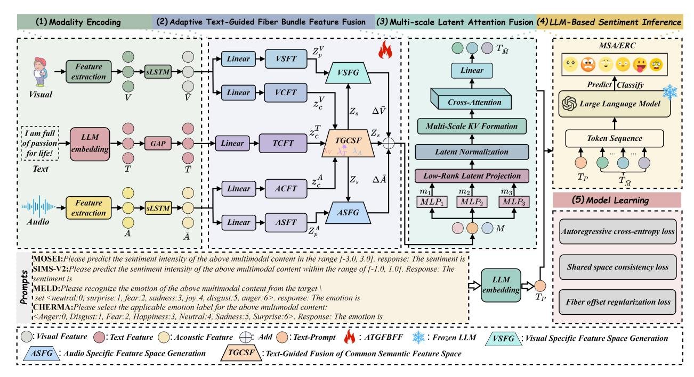
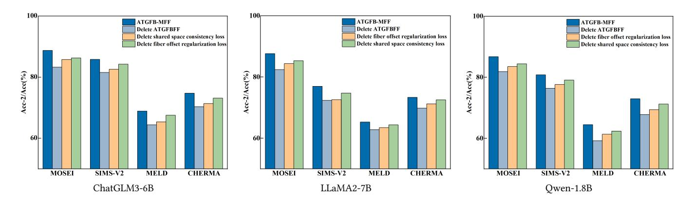
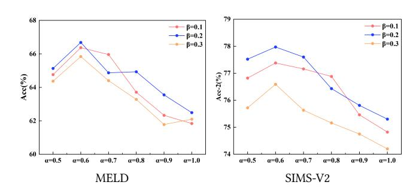

# ATGFB-MFF: Adaptive Text-Guided Fiber Bundle Feature Fusion with LLMs for Multimodal Sentiment Analysis and Emotion Recognition in Conversations

Zhaowei Liu∗ lzw@ytu.edu.cn Yantai University Yantai, Shandong, China

Sheng Liu 15763803605@s.ytu.edu.cn Yantai University Yantai, Shandong, China

Weiqing Yan† wqyan@tju.edu.cn Yantai University Yantai, Shandong, China

Peng Song pengsongseu@gmail.com Yantai University Yantai, Shandong, China

Yongchao Song ycsong@ytu.edu.cn Yantai University Yantai, Shandong, China

Rufei Gao gaorufei@yitsd.edu.cn Yantai Institute of Technology Yantai, Shandong, China

# Abstract

Multimodal Sentiment Analysis (MSA) and Emotion Recognition in Conversations (ERC) have rapidly developed into pivotal tasks in artificial intelligence. Large Language Models (LLMs) offer powerful semantic reasoning and computational capabilities, showing great potential for understanding emotional content. However, when applied to multimodal sentiment data, LLMs face significant challenges, including the inability to directly process heterogeneous data, difficulties in coping with feature misalignment and suboptimal cross-modal fusion. To address these challenges, we propose a novel multimodal sentiment inference framework named ATGFB-MFF which grounded in fiber bundle theory. This method decomposes multimodal features into an adaptive text-guided shared semantic space and fiber offset spaces to achieve structured alignment and fusion. Then the fused features are converted into structured pseudo-token sequences for effective inference via frozen LLMs. We also introduce two loss functions respectively called shared space consistency loss and fiber offset regularization loss which are used to improve representation stability. Extensive experiments on four benchmark datasets demonstrate that ATGFB-MFF consistently outperforms state-of-the-art baselines. These results highlight the efficacy of geometric structural modeling in unlocking the potential of LLMs for multimodal sentiment inference.

# CCS Concepts

• Information systems → Sentiment analysis.

# Keywords

Fiber Bundle Theory, Multimodal Feature Fusion, Multimodal Sentiment Analysis, Emotion Recognition in Conversations, Large Language Models

© 2026 Copyright held by the owner/author(s). ACM ISBN 979-8-4007-2307-0/2026/04 <https://doi.org/10.1145/3774904.3792577>

### ACM Reference Format:

Zhaowei Liu, Sheng Liu, Weiqing Yan, Peng Song, Yongchao Song, and Rufei Gao. 2026. ATGFB-MFF: Adaptive Text-Guided Fiber Bundle Feature Fusion with LLMs for Multimodal Sentiment Analysis and Emotion Recognition in Conversations. In Proceedings of the ACM Web Conference 2026 (WWW '26), April 13–17, 2026, Dubai, United Arab Emirates. ACM, New York, NY, USA, [12](#page-11-0) pages.<https://doi.org/10.1145/3774904.3792577>

# 1 Introduction

Multimodal Sentiment Analysis [\[38,](#page-9-0) [39\]](#page-9-1) and Emotion Recognition in Conversations [\[1,](#page-8-0) [4\]](#page-8-1) are core tasks for understanding human behaviors, which widely applied in human-computer interaction, psychological assessment, and social media analysis [\[40\]](#page-9-2). These tasks requires integrating multimodal information to capture comprehensive emotional signal. Significant breakthroughs have been achieved in recent advancements for unimodal sentiment analysis. In the field of audio processing, the Transformer model based on convolutional neural networks [\[34\]](#page-9-3) extracts local time-frequency patterns from mel-spectrograms via convolutional modules, then enhances acoustically prominent emotional regions using spatiotemporal channel attention mechanisms, which enabling achieve robust speech emotion recognition. In the visual modality, the CSTAN [\[46\]](#page-9-4) cascaded attention framework integrates a ResNetbased spatial encoder to extract frame-level appearance features, followed by a bidirectional LSTM to capture the temporal dynamics of facial expressions. Three attention modules respectively focus on discriminative feature maps, regions, and temporal steps across the channel, spatial, and temporal dimensions. Despite these advances, multimodal fusion faces three major challenges: modal heterogeneity, semantic misalignment, and the difficulty in balancing shared semantics with modality-specific nuances during fusion.

Large Language Models (LLMs) play a pivotal role in nature language processing due to their exceptional generalization capabilities and rich semantic representation abilities [\[3,](#page-8-2) [16,](#page-8-3) [28\]](#page-8-4). Their capacity to encode contextual knowledge enables outstanding performance in text-based sentiment analysis, spurring research to extend LLMs to multimodal tasks. However, applying LLMs to MSA and ERC faces significant hurdles. Firstly, LLMs are naturally textcentric and cannot directly process non-text modalities like audio or vision. Secondly, multimodal features often suffer from alignment

∗Corresponding author.

†Corresponding author.

[This work is licensed under a Creative Commons Attribution 4.0 International License.](https://creativecommons.org/licenses/by/4.0) WWW '26, Dubai, United Arab Emirates

issues, degrading representation learning. Thirdly, traditional fusion methods process data within a single flat latent space, reducing interpretability and limiting the generalization potential of LLMs.

Existing approaches attempt to address these issues via decomposition but remain limited. For instance, ConFEDE [\[41\]](#page-9-5) employs contrastive learning to separate shared and modality-specific features but struggles to achieve text-guided alignment in complex sentiment tasks. MISA [\[12\]](#page-8-5) decomposes multimodal features into shared and private subspaces using mutual information, yet lacks the geometric structure required for interpretable alignment. Similarly, recent graph-based approaches [\[18,](#page-8-6) [20,](#page-8-7) [27,](#page-8-8) [37\]](#page-9-6) has achieved success in modeling speaker dependencies via complex topological structures. However, these methods such as statistical or graph-based often lack an explicit geometric interpretation of how modalityspecific features deviate from the semantic core. They typically treat features as vectors in a flat space, overlooking the intrinsic curvature and bundle structure of multimodal data. MiniCPM-V [\[45\]](#page-9-7) employs a decoupled vision-language architecture to reduce computational costs but lacks robust mechanisms for heterogeneous modality alignment in frozen LLM environments.

To address these challenges, we propose the adaptive text-guided fiber bundle multimodal sentiment inference framework named ATGFB-MFF. Drawing inspiration from fiber bundle theory in differential geometry. we treating the text modality as the Base Space and non-textual modalities as fiber spaces onto this base. Unlike traditional residual learning which simply adds features, our approach enforces strict geometric constraints via the ATGFBFF module. This module decomposes features into an adaptive text-guided shared semantic space and modality-specific fiber offset spaces. This mechanism ensures robust alignment while preserving the attributes of audio and visual modalities. Crucially, while the feature fusion operates at the utterance level to ensure precise alignment, the subsequent frozen LLM effectively models conversational context and inter-speaker dependencies via its inherent self-attention mechanism. By generating pseudo-tokens compatible with pretrained LLMs, ATGFB-MFF integrates non-text modalities with text prompts without full parameter fine-tuning. Extensive experiments on four benchmark datasets related to MSA and ERC tasks demonstrate that ATGFB-MFF achieves superior performance and interpretability compared to existing methods.

The contributions are as follows:

- We propose ATGFB-MFF, a novel multimodal sentiment inference framework for frozen LLMs, enabling efficient MSA and ERC tasks through pseudo-token generation.
- We introduce a fiber bundle-based feature alignment and fusion strategy via the ATGFBFF module. It decomposes multimodal features into an adaptive text-guided shared semantic space and fiber offset spaces, explicitly modeling modality-specific deviations.
- We employ multi-scale latent attention fusion to generate pseudo-tokens, optimizing multimodal feature integration and enabling the frozen LLM to effectively capture conversational context.
- We validate ATGFB-MFF on multiple benchmark datasets, demonstrating its superior cross-domain robustness and generalization capability in MSA and ERC tasks.

# 2 Related Work

### 2.1 Multimodal Fusion and Decomposition Methods

Recent advances in multimodal learning have introduced diverse strategies for aligning and fusing cross-modal representation. Early fusion approaches, such as element operations like the Hadamard product [\[17\]](#page-8-9), which multiplies corresponding elements of input vectors to capture nonlinear interactions with linear computational complexity, have been widely applied in multimodal tasks like visual question answering. This method combines raw features from different modalities into a single representation in a straightforward manner, leveraging element-wise multiplication to emphasize correlated patterns. However, its simplicity limits adaptability to varying data distributions or complex inter-modal dependencies. Attentionbased fusion mechanisms [\[36,](#page-9-8) [50\]](#page-9-9) dynamically compute modality interactions at the feature level by assigning attention weights based on relevance, enabling more adaptive and content-aware alignment across modalities like text and audio. These methods utilize self-attention or cross-attention mechanisms to prioritize informative features.

In parallel, contrastive learning frameworks [\[22,](#page-8-10) [44\]](#page-9-10) learn a shared embedding space by maximizing similarity between paired samples while minimizing dissimilarities with negative samples by leveraging loss functions like InfoNCE to enforce cross-modal consistency. This approach enhance generalization across datasets but may overlook modality-specific nuances. Additionally, graph-based modeling approach [\[42\]](#page-9-11) represent multimodal data as structured graphs, where nodes denote features from different modalities and edges capture high-order dependencies or temporal dynamics in sequential tasks like video emotion recognition. These methods employ graph neural networks to propagate information, offering a robust framework for modeling complex relationship.

Shared and private decomposition methods, such as MISA [\[12\]](#page-8-5), which decomposes multimodal feature into modality-invariant and modality-specific representations using mutual information maximization to enhance sentiment analysis by aligning shared semantics while preserving unique characteristics, use mutual information to separate invariant and modality-specific subspaces. Similarly, ConFEDE [\[41\]](#page-9-5) employ contrastive decomposition, optimizing a contrastive loss to align invariant features across modalities while disentangling specific attributes, thereby improving robustness against noise. Language-guided methods like ALMT [\[51\]](#page-9-12) align features via adaptive text guidance, using text as a pivot to regularize cross-modal mappings, particularly effective in vision-language tasks. However, these approaches often lack geometric structure, leading to less interpretable alignments and suboptimal preservation of modality-specific details.

The ATGFB-MFF framework leverages fiber bundle theory [\[5,](#page-8-11) [52\]](#page-9-13) achieving structured separation by constructing multimodal features within both a adaptive text-guided shared semantic space and fiber offset spaces. The shared semantic space represents common semantic feature, whilst the fiber offset spaces captures modal specific features. Unlike MISA's mutual information or ConFEDE's contrastive loss, the ATGFBFF module uses adaptive text-guided weights and regularization losses to ensure text dominance and offset stability, enhancing interpretability for MSA and ERC tasks.

Figure 1: The overall architecture of the proposed ATGFB-MFF framework. It primarily consists of five synergistic components: (1) Modality Encoding for multimodal feature extraction (2) Adaptive Text-Guided Fiber Bundle Feature Fusion for disentangling and fusing modality-specific and common semantic spaces (3) Multi-scale Latent Attention Fusion to capture high-order cross-modal correlations (4) LLM-Based Sentiment Inference for generative emotion prediction and (5) Model Learning for multi-objective optimization. A detailed legend of the symbols used is provided at the bottom.

### 2.2 Multimodal Integration with Pre-trained Language Models

Large-scale pre-trained language models (LLMs) have advanced natural language processing, showing potential for multimodal tasks [\[28\]](#page-8-4). However, enabling LLMs to process acoustic and visual data remains challenging due to structural difference across modalities. Early methods, such as CHFN [\[9\]](#page-8-12), which employs a cascaded hierarchical fusion network to integrate cross-modal interaction in a stepwise manner for MSA, concatenate non-textual features before input to BERT [\[6\]](#page-8-13), requiring costly fine-tuning and risking generalization loss. Modality translation approaches like TextMI [\[11\]](#page-8-14), which converts visual and audio signals into synthetic text description using pre-trained encoder to bridge the modality gap for MSA, convert non-text inputs to text-like forms, simplifying pipelines but losing temporal or prosodic details.

Advanced methods, such as UniMSE [\[14\]](#page-8-15), which unifies MSA task into a sequence generation paradigm using an encoder-decoder LLM with enhanced attention for cross-modal fusion, and UniSA [\[21\]](#page-8-16), which standardizes sub-tasks into sequence generation with contrastive pretraining on BART, T5, or GPT2 backbones, modify LLMs with attention mechanisms and multimodal pretraining, but increase computational complexity. Non-LLM fusion models like TFN [\[48\]](#page-9-14), which employs tensor fusion to model unimodal, bimodal, and trimodal interactions for sentiment analysis, and MulT [\[36\]](#page-9-8), which uses directional pairwise cross-modal transformer to enable interactions between modalities for efficient fusion, achieve

competitive performance on MOSEI/MELD but require higher computational budgets.

Token-based interfaces for frozen LLMs, such as SPAE's [\[47\]](#page-9-15) semantic pyramid autoencoder, which hierarchically encodes multimodal inputs into tokens for frozen LLMs in generation tasks, and morph-tokens [\[29\]](#page-8-17), which learns adaptive morph-tokens to represent images for both comprehension and generation in multimodal LLMs, enable multimodal integration without fine-tuning. Frozen transformer design [\[30\]](#page-9-16), which demonstrates that frozen LLM layers can serve as effective visual encoders when combined with trainable adapter, treat LLMs as fixed encoder to preserve pre-trained knowledge.

Unlike SPAE's pyramid encoding, the ATGFB-MFF framework generates pseudo-tokens through multi-scale latent attention fusion, integrating non-text modalities with text and prompt tokens for frozen LLMs. This approach ensures semantic fidelity and stability while maintaining computational efficiency.

### 3 Methods

# 3.1 Overall Architecture

Figure [1](#page-2-0) illustrates the proposed framework for MSA and ERC tasks, which is systematically organized into five primary components: modality encoding, adaptive text-guided fiber bundle feature fusion (ATGFBFF), multi-scale latent attention fusion, LLM-based sentiment inference, and model learning. The workflow begins with the modality encoding stage, where temporal dynamics are captured

Table 1: Comparative results of MSA on MOSEI and SIMS-V2 datasets. All baselines' results without MSE on SIMS-V2 are cited from literature [\[24\]](#page-8-21). Results are averaged over three random seeds, with standard deviations reported. Bold indicates the best performance.

| Model             |       | Acc-2  |       | F1     |       | Acc-7 MOSEI |       | MAE     |       | Corr    |       | Acc-2  |       | F1     |       | Acc2-weak SIMS-V2 |       | MAE     |       | Corr    |
|-------------------|-------|--------|-------|--------|-------|-------------|-------|---------|-------|---------|-------|--------|-------|--------|-------|-------------------|-------|---------|-------|---------|
| TFN               | 79.66 | ± 0.32 | 78.41 | ± 0.35 | 50.60 | ± 0.41      | 0.567 | ± 0.015 | 0.718 | ± 0.012 | 76.77 | ± 0.38 | 76.31 | ± 0.40 | 66.32 | ± 0.45            | 0.520 | ± 0.018 | 0.616 | ± 0.014 |
| LMF               | 80.82 | ± 0.30 | 80.59 | ± 0.33 | 51.55 | ± 0.39      | 0.561 | ± 0.014 | 0.721 | ± 0.011 | 77.15 | ± 0.36 | 76.93 | ± 0.39 | 68.74 | ± 0.43            | 0.541 | ± 0.017 | 0.644 | ± 0.013 |
| MulT              | 81.35 | ± 0.29 | 81.29 | ± 0.31 | 52.64 | ± 0.38      | 0.552 | ± 0.013 | 0.743 | ± 0.010 | 80.22 | ± 0.34 | 79.61 | ± 0.36 | 71.67 | ± 0.41            | 0.510 | ± 0.016 | 0.715 | ± 0.012 |
| MAG-BERT          | 82.63 | ± 0.28 | 82.44 | ± 0.30 | 51.37 | ± 0.40      | 0.588 | ± 0.016 | 0.738 | ± 0.011 | 80.35 | ± 0.33 | 79.54 | ± 0.35 | 72.09 | ± 0.40            | 0.527 | ± 0.015 | 0.698 | ± 0.011 |
| MISA              | 83.77 | ± 0.27 | 83.85 | ± 0.29 | 52.61 | ± 0.37      | 0.550 | ± 0.013 | 0.764 | ± 0.009 |       |        |       |        |       |                   |       |         |       |         |
| ConFEDE           | 84.20 | ± 0.26 | 84.10 | ± 0.28 | 52.80 | ± 0.36      | 0.548 | ± 0.013 | 0.768 | ± 0.009 |       |        |       |        |       |                   |       |         |       |         |
| ALMT              | 84.50 | ± 0.26 | 84.30 | ± 0.28 | 53.00 | ± 0.36      | 0.545 | ± 0.012 | 0.770 | ± 0.009 |       |        |       |        |       |                   |       |         |       |         |
| SPAE              | 83.90 | ± 0.27 | 83.95 | ± 0.29 | 52.70 | ± 0.37      | 0.549 | ± 0.013 | 0.765 | ± 0.009 |       |        |       |        |       |                   |       |         |       |         |
| MMIM              | 82.56 | ± 0.28 | 82.66 | ± 0.30 | 54.61 | ± 0.36      | 0.537 | ± 0.012 | 0.776 | ± 0.009 | 81.45 | ± 0.32 | 80.94 | ± 0.34 | 72.41 | ± 0.39            | 0.523 | ± 0.014 | 0.714 | ± 0.011 |
| CHFN              | 83.81 | ± 0.27 | 83.69 | ± 0.29 | 54.70 | ± 0.36      | 0.530 | ± 0.012 | 0.778 | ± 0.009 |       |        |       |        |       |                   |       |         |       |         |
| UniMSE            | 85.90 | ± 0.25 | 85.75 | ± 0.27 | 54.49 | ± 0.35      | 0.527 | ± 0.011 | 0.771 | ± 0.008 |       |        |       |        |       |                   |       |         |       |         |
| UniSA GPT2        | 74.60 | ± 0.35 |       |        | 45.36 | ± 0.42      | 0.803 | ± 0.018 |       |         |       |        |       |        |       |                   |       |         |       |         |
| UniSA T5          | 84.73 | ± 0.26 |       |        | 52.94 | ± 0.37      | 0.541 | ± 0.013 |       |         |       |        |       |        |       |                   |       |         |       |         |
| UniSA BART        | 85.11 | ± 0.26 |       |        | 50.13 | ± 0.39      | 0.582 | ± 0.014 |       |         |       |        |       |        |       |                   |       |         |       |         |
| MSE-Qwen-1.8B     | 84.88 | ± 0.26 | 84.15 | ± 0.28 | 53.05 | ± 0.36      | 0.563 | ± 0.013 | 0.743 | ± 0.010 | 81.64 | ± 0.32 | 79.41 | ± 0.34 | 73.27 | ± 0.39            | 0.314 | ± 0.010 | 0.660 | ± 0.012 |
| ATGFB-Qwen-1.8B   | 87.75 | ± 0.24 | 87.52 | ± 0.26 | 54.23 | ± 0.35      | 0.531 | ± 0.012 | 0.779 | ± 0.011 | 80.82 | ± 0.33 | 80.67 | ± 0.35 | 74.50 | ± 0.38            | 0.362 | ± 0.011 | 0.692 | ± 0.012 |
| MSE-LLaMA2-7B     | 86.47 | ± 0.25 | 85.71 | ± 0.27 | 55.79 | ± 0.34      | 0.514 | ± 0.011 | 0.766 | ± 0.009 | 75.84 | ± 0.36 | 75.38 | ± 0.38 | 67.91 | ± 0.42            | 0.387 | ± 0.013 | 0.568 | ± 0.014 |
| ATGFB-LLaMA2-7B   | 88.63 | ± 0.23 | 87.84 | ± 0.25 | 57.76 | ± 0.33      | 0.486 | ± 0.010 | 0.798 | ± 0.008 | 77.97 | ± 0.35 | 77.74 | ± 0.36 | 71.59 | ± 0.40            | 0.379 | ± 0.012 | 0.556 | ± 0.014 |
| MSE-ChatGLM3-6B   | 85.78 | ± 0.25 | 85.32 | ± 0.27 | 54.19 | ± 0.35      | 0.541 | ± 0.012 | 0.771 | ± 0.009 | 82.66 | ± 0.31 | 82.34 | ± 0.33 | 75.06 | ± 0.38            | 0.313 | ± 0.010 | 0.708 | ± 0.011 |
| ATGFB-ChatGLM3-6B | 89.83 | ± 0.22 | 89.49 | ± 0.24 | 58.04 | ± 0.32      | 0.529 | ± 0.011 | 0.803 | ± 0.008 | 86.85 | ± 0.30 | 85.75 | ± 0.32 | 79.43 | ± 0.36            | 0.284 | ± 0.009 | 0.736 | ± 0.010 |

Table 2: Experimental results of ERC on MELD and CHERMA datasets. All baselines' results without MSE on CHERMA are cited from literature [\[33\]](#page-9-20). Results are averaged over three random seeds, with standard deviations reported. Bold indicates the best performance.

| Model             |       | Acc    | MELD  | WF1 CHERMA Acc WF1               |
|-------------------|-------|--------|-------|----------------------------------|
| TFN               | 61.27 | ± 0.40 | 57.89 | ± 0.42 68.63 ± 0.38              |
| LMF               | 61.45 | ± 0.39 | 58.55 | ± 0.41 68.39 ± 0.39              |
| MulT              | 62.50 | ± 0.38 | 59.20 | ± 0.40 69.50 ± 0.37              |
| MMGCN             | 60.92 | ± 0.40 | 58.74 | ± 0.41                           |
| MM-DFN            | 62.45 | ± 0.38 | 59.88 | ± 0.40                           |
| GA2MIF            | 62.15 | ± 0.39 | 59.34 | ± 0.40                           |
| ConFEDE           | 63.80 | ± 0.37 | 60.50 | ± 0.39                           |
| ALMT              | 64.00 | ± 0.37 | 61.00 | ± 0.39                           |
| SPAE              | 63.90 | ± 0.37 | 60.70 | ± 0.39                           |
| UniMSE            | 64.43 | ± 0.37 | 65.51 | ± 0.38                           |
| UniSA GPT2        | 48.51 | ± 0.45 | 33.74 | ± 0.48                           |
| UniSA T5          | 64.42 | ± 0.37 | 62.58 | ± 0.39                           |
| UniSA BART        | 63.09 | ± 0.38 | 62.97 | ± 0.39                           |
| MSE-Qwen-1.8B     | 62.73 | ± 0.38 | 60.26 | ± 0.40 70.41 ± 0.36 70.52 ± 0.35 |
| ATGFB-Qwen-1.8B   | 65.48 | ± 0.36 | 62.56 | ± 0.38 73.99 ± 0.34 73.70 ± 0.33 |
| MSE-LLaMA2-7B     | 65.28 | ± 0.36 | 63.75 | ± 0.37 71.59 ± 0.35 71.33 ± 0.34 |
| ATGFB-LLaMA2-7B   | 66.68 | ± 0.35 | 63.55 | ± 0.37 74.36 ± 0.33 73.58 ± 0.32 |
| MSE-ChatGLM3-6B   | 66.45 | ± 0.35 | 65.33 | ± 0.36 73.26 ± 0.33 72.88 ± 0.32 |
| ATGFB-ChatGLM3-6B | 69.91 | ± 0.33 | 68.93 | ± 0.34 75.79 ± 0.31 75.42 ± 0.31 |

# 4.2 Experimental Settings

We describe the experimental setup used to evaluate the ATGFB-MFF module. We employ three pre-trained large language models as base networks: Qwen-1.8B [\[2\]](#page-8-22), ChatGLM3-6B [\[8\]](#page-8-23), and LLaMA2- 7B [\[35\]](#page-9-21), all of which were frozen during training. All experiments were conducted on six NVIDIA RTX 4090 GPUs, with results averaged across three random seeds [1111, 3333] to ensure statistical reliability. The number of trainable parameters shown in appendix

varies due to dataset-specific input dimensions and task complexity (e.g., CHERMA's multi-turn dialogue task requires larger projection matrices in ATGFBFF). Detailed hyperparameters and task-specific configurations are provided in Appendix [D.](#page-10-3)

### 4.3 Baseline

In order to comprehensively assess the effectiveness of the proposed ATGFB-MFF framework, we compare its performance with a range of baselines respectively called TFN [\[48\]](#page-9-14), LMF [\[25\]](#page-8-24), MISA [\[12\]](#page-8-5), MAG-BERT [\[32\]](#page-9-22), MMIM [\[10\]](#page-8-25), CHFN [\[9\]](#page-8-12), MulT [\[36\]](#page-9-8), UniMSE [\[14\]](#page-8-15), ConFEDE [\[41\]](#page-9-5), ALMT [\[51\]](#page-9-12), SPAE [\[47\]](#page-9-15), UniSABART, UniSAT5, UniSAGPT2 [\[21\]](#page-8-16), MMGCN [\[15\]](#page-8-26), MM-DFN [\[13\]](#page-8-27), GA2MIF [\[19\]](#page-8-28), MSE-Adapter [\[43\]](#page-9-17). A description of the contents of the relevant baselines can be found in Appendix [E.](#page-11-1)

### 4.4 Metrics

Due to differences in the types and granularity of sentiment labels across datasets, we adopt customized evaluation metrics tailored to each dataset. For MOSEI dataset, we report MAE, Corr, Acc-2, Acc-7, and F1 to be the metrics. For SIMS-V2 dataset, we use MAE, Corr, Acc-2, Acc2-weak, and F1. For both MELD and CHERMA datasets, Acc and weighted F1 (WF1) are selected. It should be noted that in the MOSEI, SIMS-V2, MELD, and CHERMA datasets, the values of the six indicators Acc-2, Acc2-weak, F1, Acc-7, Acc, and WF1 all omit the unit of %. For a detailed description of the Metrics, please refer to Appendix [F.](#page-11-2)

### 4.5 Results and Analysis

We report the experimental results of ATGFB-MFF on the MOSEI, SIMS-V2, MELD, and CHERMA datasets in Table [1](#page-5-0) and Table [2.](#page-5-1) Compared to various baseline methods including TFN, LMF, MulT,

Figure 2: Ablation Analysis of ATGFB-MFF module. Compare the full model with three variants: one without the ATGFBFF, one without the shared space consistency loss, and another without the fiber offset regularization loss. Experiments are performed on three different LLMs.

Table 3: The Robustness experiments results on MOSEI and CHERMA datasets. T, V, and A respectively represents text, visual, and audio modalities. The 'w/o' means remove the corresponding module.

|     |           | Acc-2 | MOSEI F1 | Acc   | CHERMA WF1 |
|-----|-----------|-------|----------|-------|------------|
| w/o | A         | 85.50 | 84.80    | 72.00 | 71.50      |
| w/o | V         | 84.90 | 84.20    | 71.50 | 71.00      |
| w/o | T         | 80.50 | 79.98    | 67.10 | 66.72      |
| w/o | A,V       | 81.06 | 80.30    | 69.42 | 69.00      |
| w/o | ATGFBFF   | 83.56 | 83.30    | 71.00 | 70.50      |
|     | ATGFB-MFF | 89.83 | 89.49    | 75.79 | 75.42      |

MAG-BERT, MISA, ConFEDE, ALMT, SPAE, UniMSE and MSE-Adapter, our method achieves consistently excellent performance on all major metrics.

On MOSEI, ATGFB-ChatGLM3-6B gets highest Acc-2 and F1 respectively achieves 89.83% and 89.49%, while ATGFB-LaMA2-7B obtains the lowest MAE (0.486) and the highest Corr (0.798), indicating higher regression accuracy. Similarly, on SIMS-V2, ATGFB-ChatGLM3-6B again outperforms all baselines with Acc-2 and F1 of 86.85% and 85.75%, respectively, suggesting its strong generalization ability in multilingual sentiment analysis.

ATGFB-MFF brings continuous improvement compared to the MSE-Adapter baseline under the same backbone. On MOSEI, the Acc-2 and F1 of ATGFB-ChatGLM3-6B are 4.05% and 4.17% higher than MSE-ChatGLM3-6B, respectively. Similar improvements were observed for other LLMs, confirming the advantages of the adaptive fiber bundle text-guided structural modeling approach over the original adapter-based design.

ATGFB-MFF also performs well in MELD and CHERMA, outperforming models such as MSE-Adapter and ALMT by an average of 3% in weighted F1. Notably, ATGFB-ChatGLM3-6B achieved the best results on both datasets, reaching 69.91% Acc and 68.93% WF1

on MELD and 75.79% Acc and 75.42% WF1 on CHERMA. Performance outperforms all baseline models in comparison.

Overall, these results highlight the effective and processing power of ATGFB-MFF. Across multiple LLMs (Qwen-1.8B, LLaMA2- 7B, ChatGLM3-6B), our approach maintains strong compatibility without the need to fine-tune the LLMs. The performance enhancement stems from the proposed adaptive text-guided fiber bundle multimodal constructed data structure modeling method, which structurally decouples shared representations and fiber offset representations to achieve robust multimodal fusion.

### 5 Discussion

### 5.1 Ablation Studies

To validate the contribution of each component, we performed ablation studies across all datasets and backbone LLMs, as summarized in Figure [2.](#page-6-0) The ATGFBFF module proves fundamental; its removal precipitates the most significant performance decline, with Acc-2 falling from 89.83% to 86.90% on MOSEI. This confirms the necessity of structurally decomposing features into base and fiber spaces. The shared space consistency Loss is also essential for semantic alignment; eliminating it causes a notable reduction, decreasing accuracy on SIMS-V2 from 86.85% to 85.32%, indicating its role in ensuring cross-modal coherence.

Finally, omitting the fiber offset regularization Loss results in only marginal variations (approximately 0.6% difference), suggesting it functions primarily as a fine-grained stabilizer rather than a core structural driver. This hierarchy validates our geometric approach: ATGFBFF establishes the structure, consistency loss ensures alignment, and regularization loss refines stability.

## 5.2 The Robustness under Missing Modalities

To evaluate the model's robustness under missing modalities, we conducted experiments on the MOSEI and CHERMA datasets, removing the text, visual, or audio modality separately. The experimental results are detailed in Table [3.](#page-6-1) Removing any non-text modality, either individually or in combination, resulted in a decrease in accuracy, indicating that these modalities are crucial for

Figure 3: Loss function parameter analysis for MELD and SIMS-V2 datasets.

sentiment inference. The most significant drop in accuracy occurred when the text modality was removed, highlighting the core role of text in capturing sentiment context.

The ATGFB-MFF framework effectively addresses these issues through its ATGFBFF module. The adaptive text-guided shared semantic space ���� ensures stable model performance by maintaining core semantic consistency across the remaining modalities, while the feature fiber offset spaces Δ�� , ¯ Δ��¯ filter out modal specific noise. This decomposition strategy enhances the model's robustness to missing modalities, as demonstrated by the results of the ATGFB-MFF model in various experiments.

# 5.3 Model Learning Parameter Analysis

To investigate the impact of auxiliary constraints, we conducted a sensitivity analysis on the shared space consistency weight �� ∈ [0.5, 1.0] and fiber offset regularization weight �� ∈ [0.1, 0.3] using LLaMA2-7B.

As illustrated in Figure [3,](#page-7-0) optimal performance is achieved at �� = 0.6 and �� = 0.1 across both MELD and SIMS-V2 datasets. Deviating from this configuration reveals distinct trends: increasing �� leads to consistent performance degradation (e.g., SIMS-V2 accuracy drops from 77.97% to 75.30% at �� = 1.0), suggesting that excessive alignment homogenizes features and erodes unique modalityspecific cues. Similarly, higher �� values impose overly strict constraints on fiber offsets, hindering feature adaptability and resulting in underfitting. These results confirm that moderate auxiliary supervision (�� = 0.6, �� = 0.2) strikes the necessary balance between cross-modal semantic consistency and the preservation of diverse modality attributes.

# 5.4 Feature Representation Visualization

To demonstrate the superior representational power of ATGFBFF, we visualize the feature topology via t-SNE in Figure [4.](#page-7-1) The visualization reveals two critical strengths of our learned representations. Firstly, the high compactness of the text clusters (shown in red) confirms that the adaptive Base Space works as a stable semantic anchor. This stability is crucial because it filters out modal noise and keeps the sentiment grounding consistent. Secondly, the audio and visual clusters show a clear dispersion with sharp boundaries and zero overlap. This pattern is significant as it proves the model's ability to strictly separate modality-specific nuances.

(a) MOSEI (b) SIMS-V2 (c) MELD (d) CHERMA

Figure 4: t-SNE visualization of feature representations on MOSEI, SIMS-V2, MELD, and CHERMA datasets using ChatGLM3-6B. Red, blue, and green clusters represent text, audio, and visual modalities, respectively. The nonoverlapping clusters demonstrate effective modality separation by ATGFBFF.

By isolating these vertical fiber components, the model captures non-redundant modal variations without interfering with the shared semantic core. This distinct geometric separation ensures that ATGFB-MFF learns highly discriminative features. As a result, it effectively reduces cross-modal ambiguity while preserving the independent information needed for robust sentiment inference.

### 6 Conclusion

In this study, we propose ATGFB-MFF, a novel multimodal sentiment inference framework based on fiber bundle theory, which structurally separates shared semantic consensus from modalityspecific information. This is achieved by explicitly modeling the representation space which consisting of an adaptive text-guided shared semantic space and fiber offset spaces. In addition, we introduce shared space consistency loss and fiber offset regularization loss to enhance cross-modal alignment and stabilize representation learning. The fused features are encoded as structured pseudotoken sequences and directly fed into a frozen LLM to effectively process MSA and ERC tasks by leveraging its inherent reasoning capabilities. Extensive experiments on four benchmark datasets demonstrate that ATGFB-MFF achieves remarkable performance.

# Acknowledgments

This work was supported in part by the National Natural Science Foundation of China under Grant 62572420, the Shandong Province Key R&D Program under Grant 2024CXGC010801, the Shandong Province Science and Technology-based Small and Medium-sized Enterprises Innovation Capacity Enhancement project under Grant 2025TSGCCZZB0514 and 2024TSGC0485.

References [1] Ghada Alhussein, Ioannis Ziogas, Shiza Saleem, and Leontios J. Hadjileontiadis. 2025. Speech emotion recognition in conversations using artificial intelligence: a systematic review and meta-analysis. Artif. Intell. Rev. 58, 7 (2025), 198. [doi:10.](https://doi.org/10.1007/S10462-025-11197-8) [1007/S10462-025-11197-8](https://doi.org/10.1007/S10462-025-11197-8) [2] Jinze Bai, Shuai Bai, Yunfei Chu, Zeyu Cui, Kai Dang, Xiaodong Deng, Yang Fan, Wenbin Ge, Yu Han, Fei Huang, Binyuan Hui, Luo Ji, Mei Li, Junyang Lin, Runji Lin, Dayiheng Liu, Gao Liu, Chengqiang Lu, Keming Lu, Jianxin Ma, Rui Men, Xingzhang Ren, Xuancheng Ren, Chuanqi Tan, Sinan Tan, Jianhong Tu, Peng Wang, Shijie Wang, Wei Wang, Shengguang Wu, Benfeng Xu, Jin Xu, An Yang, Hao Yang, Jian Yang, Shusheng Yang, Yang Yao, Bowen Yu, Hongyi Yuan, Zheng Yuan, Jianwei Zhang, Xingxuan Zhang, Yichang Zhang, Zhenru Zhang, Chang Zhou, Jingren Zhou, Xiaohuan Zhou, and Tianhang Zhu. 2023. Qwen Technical Report. CoRR abs/2309.16609 (2023). arXiv[:2309.16609](https://arxiv.org/abs/2309.16609) [doi:10.48550/ARXIV.2309.](https://doi.org/10.48550/ARXIV.2309.16609) [16609](https://doi.org/10.48550/ARXIV.2309.16609) [3] Qingyu Chen, Yan Hu, Xueqing Peng, Qianqian Xie, Qiao Jin, Aidan Gilson, Maxwell B Singer, Xuguang Ai, Po-Ting Lai, Zhizheng Wang, et al. 2025. Benchmarking large language models for biomedical natural language processing applications and recommendations. Nature communications 16, 1 (2025), 3280. [4] Vishal M. Chudasama, Purbayan Kar, Ashish Gudmalwar, Nirmesh Shah, Pankaj Wasnik, and Naoyuki Onoe. 2022. M2FNet: Multi-modal Fusion Network for Emotion Recognition in Conversation. In IEEE/CVF Conference on Computer Vision and Pattern Recognition Workshops, CVPR Workshops 2022, New Orleans, LA, USA, June 19-20, 2022. IEEE, 4651–4660. [doi:10.1109/CVPRW56347.2022.00511](https://doi.org/10.1109/CVPRW56347.2022.00511) [5] C Cisowski, JB Götte, and S Franke-Arnold. 2022. Colloquium: Geometric phases of light: Insights from fiber bundle theory. Reviews of Modern Physics 94, 3 (2022), 031001. [6] Jacob Devlin, Ming-Wei Chang, Kenton Lee, and Kristina Toutanova. 2019. BERT: Pre-training of Deep Bidirectional Transformers for Language Understanding. In Proceedings of the 2019 Conference of the North American Chapter of the Association for Computational Linguistics: Human Language Technologies, NAACL-HLT 2019, Minneapolis, MN, USA, June 2-7, 2019, Volume 1 (Long and Short Papers), Jill Burstein, Christy Doran, and Thamar Solorio (Eds.). Association for Computational Linguistics, 4171–4186. [doi:10.18653/V1/N19-1423](https://doi.org/10.18653/V1/N19-1423) [7] Rares Dolga, Lucas Maystre, Marius Cobzarenco, and David Barber. 2024. Latte: Latent attention for linear time transformers. arXiv preprint arXiv:2402.17512 (2024). [8] Zhengxiao Du, Yujie Qian, Xiao Liu, Ming Ding, Jiezhong Qiu, Zhilin Yang, and Jie Tang. 2022. GLM: General Language Model Pretraining with Autoregressive Blank Infilling. In Proceedings of the 60th Annual Meeting of the Association for Computational Linguistics (Volume 1: Long Papers), ACL 2022, Dublin, Ireland, May 22-27, 2022, Smaranda Muresan, Preslav Nakov, and Aline Villavicencio (Eds.). Association for Computational Linguistics, 320–335. [doi:10.18653/V1/2022.ACL-](https://doi.org/10.18653/V1/2022.ACL-LONG.26)[LONG.26](https://doi.org/10.18653/V1/2022.ACL-LONG.26) [9] Jiwei Guo, Jiajia Tang, Weichen Dai, Yu Ding, and Wanzeng Kong. 2022. Dynamically Adjust Word Representations Using Unaligned Multimodal Information. In MM '22: The 30th ACM International Conference on Multimedia, Lisboa, Portugal, October 10 - 14, 2022, João Magalhães, Alberto Del Bimbo, Shin'ichi Satoh, Nicu Sebe, Xavier Alameda-Pineda, Qin Jin, Vincent Oria, and Laura Toni (Eds.). ACM, 3394–3402. [doi:10.1145/3503161.3548137](https://doi.org/10.1145/3503161.3548137) [10] Wei Han, Hui Chen, and Soujanya Poria. 2021. Improving Multimodal Fusion with Hierarchical Mutual Information Maximization for Multimodal Sentiment Analysis. In Proceedings of the 2021 Conference on Empirical Methods in Natural Language Processing, EMNLP 2021, Virtual Event / Punta Cana, Dominican Republic, 7-11 November, 2021, Marie-Francine Moens, Xuanjing Huang, Lucia Specia, and Scott Wen-tau Yih (Eds.). Association for Computational Linguistics, 9180–9192. [doi:10.18653/V1/2021.EMNLP-MAIN.723](https://doi.org/10.18653/V1/2021.EMNLP-MAIN.723) [11] Md. Kamrul Hasan, Md. Saiful Islam, Sangwu Lee, Wasifur Rahman, Iftekhar Naim, Mohammed Ibrahim Khan, and Ehsan Hoque. 2023. TextMI: Textualize Multimodal Information for Integrating Non-verbal Cues in Pre-trained Language Models. CoRR abs/2303.15430 (2023). arXiv[:2303.15430](https://arxiv.org/abs/2303.15430) [doi:10.48550/ARXIV.2303.](https://doi.org/10.48550/ARXIV.2303.15430) [15430](https://doi.org/10.48550/ARXIV.2303.15430) [12] Devamanyu Hazarika, Roger Zimmermann, and Soujanya Poria. 2020. MISA: Modality-Invariant and -Specific Representations for Multimodal Sentiment Analysis. In MM '20: The 28th ACM International Conference on Multimedia, Virtual Event / Seattle, WA, USA, October 12-16, 2020, Chang Wen Chen, Rita Cucchiara, Xian-Sheng Hua, Guo-Jun Qi, Elisa Ricci, Zhengyou Zhang, and Roger Zimmermann (Eds.). ACM, 1122–1131. [doi:10.1145/3394171.3413678](https://doi.org/10.1145/3394171.3413678) [13] Dou Hu, Xiaolong Hou, Lingwei Wei, Lian-Xin Jiang, and Yang Mo. 2022. MM-DFN: Multimodal Dynamic Fusion Network for Emotion Recognition in Conversations. In IEEE International Conference on Acoustics, Speech and Signal Processing, ICASSP 2022, Virtual and Singapore, 23-27 May 2022. IEEE, 7037–7041. [doi:10.1109/ICASSP43922.2022.9747397](https://doi.org/10.1109/ICASSP43922.2022.9747397) [14] Guimin Hu, Ting-En Lin, Yi Zhao, Guangming Lu, Yuchuan Wu, and Yongbin Li. 2022. UniMSE: Towards Unified Multimodal Sentiment Analysis and Emotion Recognition. In Proceedings of the 2022 Conference on Empirical Methods in Natural Language Processing, EMNLP 2022, Abu Dhabi, United Arab Emirates, December 7- 11, 2022, Yoav Goldberg, Zornitsa Kozareva, and Yue Zhang (Eds.). Association for Computational Linguistics, 7837–7851. [doi:10.18653/V1/2022.EMNLP-MAIN.534](https://doi.org/10.18653/V1/2022.EMNLP-MAIN.534) [15] Jingwen Hu, Yuchen Liu, Jinming Zhao, and Qin Jin. 2021. MMGCN: Multimodal Fusion via Deep Graph Convolution Network for Emotion Recognition in Conversation. In Proceedings of the 59th Annual Meeting of the Association for Computational Linguistics and the 11th International Joint Conference on Natural Language Processing, ACL/IJCNLP 2021, (Volume 1: Long Papers), Virtual Event, August 1-6, 2021, Chengqing Zong, Fei Xia, Wenjie Li, and Roberto Navigli (Eds.). Association for Computational Linguistics, 5666–5675. [doi:10.18653/V1/2021.ACL-LONG.440](https://doi.org/10.18653/V1/2021.ACL-LONG.440) [16] Nikitas Karanikolas, Eirini Manga, Nikoletta E. Samaridi, Eleni Tousidou, and Michael Vassilakopoulos. 2023. Large Language Models versus Natural Language Understanding and Generation. In Proceedings of the 27th Pan-Hellenic Conference on Progress in Computing and Informatics, PCI 2023, Lamia, Greece, November 24-26, 2023, Nikitas N. Karanikolas, Michael Vassilakopoulos, Catherine Marinagi, Athanasios Kakarountas, and Ioannis Voyiatzis (Eds.). ACM, 278–290. [doi:10.](https://doi.org/10.1145/3635059.3635104) [1145/3635059.3635104](https://doi.org/10.1145/3635059.3635104) [17] Jin-Hwa Kim, Kyoung Woon On, Woosang Lim, Jeonghee Kim, Jung-Woo Ha, and Byoung-Tak Zhang. 2017. Hadamard Product for Low-rank Bilinear Pooling. In 5th International Conference on Learning Representations, ICLR 2017, Toulon, France, April 24-26, 2017, Conference Track Proceedings. OpenReview.net. [https:](https://openreview.net/forum?id=r1rhWnZkg) [//openreview.net/forum?id=r1rhWnZkg](https://openreview.net/forum?id=r1rhWnZkg) [18] Jiang Li, Xiaoping Wang, Guoqing Lv, and Zhigang Zeng. 2023. GraphMFT: A graph network based multimodal fusion technique for emotion recognition in conversation. Neurocomputing 550 (2023), 126427. [doi:10.1016/J.NEUCOM.2023.](https://doi.org/10.1016/J.NEUCOM.2023.126427) [126427](https://doi.org/10.1016/J.NEUCOM.2023.126427) [19] Jiang Li, Xiaoping Wang, Guoqing Lv, and Zhigang Zeng. 2024. GA2MIF: Graph and Attention Based Two-Stage Multi-Source Information Fusion for Conversational Emotion Detection. IEEE Trans. Affect. Comput. 15, 1 (2024), 130–143. [doi:10.1109/TAFFC.2023.3261279](https://doi.org/10.1109/TAFFC.2023.3261279) [20] Jiang Li, Xiaoping Wang, and Zhigang Zeng. 2025. Tracing Intricate Cues in Dialogue: Joint Graph Structure and Sentiment Dynamics for Multimodal Emotion Recognition. IEEE Trans. Pattern Anal. Mach. Intell. 47, 10 (2025), 8786–8803. [doi:10.1109/TPAMI.2025.3581236](https://doi.org/10.1109/TPAMI.2025.3581236) [21] Zaijing Li, Ting-En Lin, Yuchuan Wu, Meng Liu, Fengxiao Tang, Ming Zhao, and Yongbin Li. 2023. UniSA: Unified Generative Framework for Sentiment Analysis. In Proceedings of the 31st ACM International Conference on Multimedia, MM 2023, Ottawa, ON, Canada, 29 October 2023- 3 November 2023, Abdulmotaleb El-Saddik, Tao Mei, Rita Cucchiara, Marco Bertini, Diana Patricia Tobon Vallejo, Pradeep K. Atrey, and M. Shamim Hossain (Eds.). ACM, 6132–6142. [doi:10.1145/3581783.](https://doi.org/10.1145/3581783.3612336) [3612336](https://doi.org/10.1145/3581783.3612336) [22] Xixun Lin, Rui Liu, Yanan Cao, Lixin Zou, Qian Li, Yongxuan Wu, Yang Liu, Dawei Yin, and Guandong Xu. 2025. Contrastive Modality-Disentangled Learning for Multimodal Recommendation. ACM Trans. Inf. Syst. 43, 3 (2025), 70:1–70:31. [doi:10.1145/3715876](https://doi.org/10.1145/3715876) [23] Zhouhan Lin, Minwei Feng, Cícero Nogueira dos Santos, Mo Yu, Bing Xiang, Bowen Zhou, and Yoshua Bengio. 2017. A Structured Self-Attentive Sentence Embedding. In 5th International Conference on Learning Representations, ICLR 2017, Toulon, France, April 24-26, 2017, Conference Track Proceedings. OpenReview.net. [https://openreview.net/forum?id=BJC\\_jUqxe](https://openreview.net/forum?id=BJC_jUqxe) [24] Yihe Liu, Ziqi Yuan, Huisheng Mao, Zhiyun Liang, Wanqiuyue Yang, Yuanzhe Qiu, Tie Cheng, Xiaoteng Li, Hua Xu, and Kai Gao. 2022. Make Acoustic and Visual Cues Matter: CH-SIMS v2.0 Dataset and AV-Mixup Consistent Module. In International Conference on Multimodal Interaction, ICMI 2022, Bengaluru, India, November 7-11, 2022, Raj Tumuluri, Nicu Sebe, Gopal Pingali, Dinesh Babu Jayagopi, Abhinav Dhall, Richa Singh, Lisa Anthony, and Albert Ali Salah (Eds.). ACM, 247–258. [doi:10.1145/3536221.3556630](https://doi.org/10.1145/3536221.3556630) [25] Zhun Liu, Ying Shen, Varun Bharadhwaj Lakshminarasimhan, Paul Pu Liang, Amir Zadeh, and Louis-Philippe Morency. 2018. Efficient Low-rank Multimodal Fusion With Modality-Specific Factors. In Proceedings of the 56th Annual Meeting of the Association for Computational Linguistics, ACL 2018, Melbourne, Australia, July 15-20, 2018, Volume 1: Long Papers, Iryna Gurevych and Yusuke Miyao (Eds.). Association for Computational Linguistics, 2247–2256. [doi:10.18653/V1/P18-1209](https://doi.org/10.18653/V1/P18-1209) [26] Fanxu Meng, Zengwei Yao, and Muhan Zhang. 2025. TransMLA: Multi-Head Latent Attention Is All You Need. CoRR abs/2502.07864 (2025). arXiv[:2502.07864](https://arxiv.org/abs/2502.07864) [doi:10.48550/ARXIV.2502.07864](https://doi.org/10.48550/ARXIV.2502.07864) [27] Tao Meng, Fuchen Zhang, Yuntao Shou, Wei Ai, Nan Yin, and Keqin Li. 2024. Revisiting Multimodal Emotion Recognition in Conversation from the Perspective of Graph Spectrum. CoRR abs/2404.17862 (2024). arXiv[:2404.17862](https://arxiv.org/abs/2404.17862) [doi:10.48550/](https://doi.org/10.48550/ARXIV.2404.17862) [ARXIV.2404.17862](https://doi.org/10.48550/ARXIV.2404.17862) [28] Bonan Min, Hayley Ross, Elior Sulem, Amir Pouran Ben Veyseh, Thien Huu Nguyen, Oscar Sainz, Eneko Agirre, Ilana Heintz, and Dan Roth. 2024. Recent Advances in Natural Language Processing via Large Pre-trained Language Models: A Survey. ACM Comput. Surv. 56, 2 (2024), 30:1–30:40. [doi:10.1145/3605943](https://doi.org/10.1145/3605943) [29] Kaihang Pan, Siliang Tang, Juncheng Li, Zhaoyu Fan, Wei Chow, Shuicheng Yan, Tat-Seng Chua, Yueting Zhuang, and Hanwang Zhang. 2024. Auto-Encoding Morph-Tokens for Multimodal LLM. In Forty-first International Conference on Machine Learning, ICML 2024, Vienna, Austria, July 21-27, 2024. OpenReview.net.

<https://openreview.net/forum?id=U97MIrs35l> [30] Ziqi Pang, Ziyang Xie, Yunze Man, and Yu-Xiong Wang. 2024. Frozen Transformers in Language Models Are Effective Visual Encoder Layers. In The Twelfth International Conference on Learning Representations, ICLR 2024, Vienna, Austria, May 7-11, 2024. OpenReview.net.<https://openreview.net/forum?id=t0FI3Q66K5> [31] Soujanya Poria, Devamanyu Hazarika, Navonil Majumder, Gautam Naik, Erik Cambria, and Rada Mihalcea. 2019. MELD: A Multimodal Multi-Party Dataset for Emotion Recognition in Conversations. In Proceedings of the 57th Conference of the Association for Computational Linguistics, ACL 2019, Florence, Italy, July 28- August 2, 2019, Volume 1: Long Papers, Anna Korhonen, David R. Traum, and Lluís Màrquez (Eds.). Association for Computational Linguistics, 527–536. [doi:10.18653/V1/P19-1050](https://doi.org/10.18653/V1/P19-1050) [32] Wasifur Rahman, Md. Kamrul Hasan, Sangwu Lee, AmirAli Bagher Zadeh, Chengfeng Mao, Louis-Philippe Morency, and Mohammed E. Hoque. 2020. Integrating Multimodal Information in Large Pretrained Transformers. In Proceedings of the 58th Annual Meeting of the Association for Computational Linguistics, ACL 2020, Online, July 5-10, 2020, Dan Jurafsky, Joyce Chai, Natalie Schluter, and Joel R. Tetreault (Eds.). Association for Computational Linguistics, 2359–2369. [doi:10.18653/V1/2020.ACL-MAIN.214](https://doi.org/10.18653/V1/2020.ACL-MAIN.214) [33] Jun Sun, Shoukang Han, Yu-Ping Ruan, Xiaoning Zhang, Shu-Kai Zheng, Yulong Liu, Yuxin Huang, and Taihao Li. 2023. Layer-wise Fusion with Modality Independence Modeling for Multi-modal Emotion Recognition. In Proceedings of the 61st Annual Meeting of the Association for Computational Linguistics (Volume 1: Long Papers), ACL 2023, Toronto, Canada, July 9-14, 2023, Anna Rogers, Jordan L. Boyd-Graber, and Naoaki Okazaki (Eds.). Association for Computational Linguistics, 658–670. [doi:10.18653/V1/2023.ACL-LONG.39](https://doi.org/10.18653/V1/2023.ACL-LONG.39) [34] Xiaoyu Tang, Jiazheng Huang, Yixin Lin, Ting Dang, and Jintao Cheng. 2025. Speech Emotion Recognition via CNN-Transformer and multidimensional attention mechanism. Speech Commun. 171 (2025), 103242. [doi:10.1016/J.SPECOM.](https://doi.org/10.1016/J.SPECOM.2025.103242) [2025.103242](https://doi.org/10.1016/J.SPECOM.2025.103242) [35] Hugo Touvron, Louis Martin, Kevin Stone, Peter Albert, Amjad Almahairi, Yasmine Babaei, Nikolay Bashlykov, Soumya Batra, Prajjwal Bhargava, Shruti Bhosale, Dan Bikel, Lukas Blecher, Cristian Canton-Ferrer, Moya Chen, Guillem Cucurull, David Esiobu, Jude Fernandes, Jeremy Fu, Wenyin Fu, Brian Fuller, Cynthia Gao, Vedanuj Goswami, Naman Goyal, Anthony Hartshorn, Saghar Hosseini, Rui Hou, Hakan Inan, Marcin Kardas, Viktor Kerkez, Madian Khabsa, Isabel Kloumann, Artem Korenev, Punit Singh Koura, Marie-Anne Lachaux, Thibaut Lavril, Jenya Lee, Diana Liskovich, Yinghai Lu, Yuning Mao, Xavier Martinet, Todor Mihaylov, Pushkar Mishra, Igor Molybog, Yixin Nie, Andrew Poulton, Jeremy Reizenstein, Rashi Rungta, Kalyan Saladi, Alan Schelten, Ruan Silva, Eric Michael Smith, Ranjan Subramanian, Xiaoqing Ellen Tan, Binh Tang, Ross Taylor, Adina Williams, Jian Xiang Kuan, Puxin Xu, Zheng Yan, Iliyan Zarov, Yuchen Zhang, Angela Fan, Melanie Kambadur, Sharan Narang, Aurélien Rodriguez, Robert Stojnic, Sergey Edunov, and Thomas Scialom. 2023. Llama 2: Open Foundation and Fine-Tuned Chat Models. CoRR abs/2307.09288 (2023). arXiv[:2307.09288](https://arxiv.org/abs/2307.09288) [doi:10.48550/ARXIV.2307.09288](https://doi.org/10.48550/ARXIV.2307.09288) [36] Yao-Hung Hubert Tsai, Shaojie Bai, Paul Pu Liang, J. Zico Kolter, Louis-Philippe Morency, and Ruslan Salakhutdinov. 2019. Multimodal Transformer for Unaligned Multimodal Language Sequences. In Proceedings of the 57th Conference of the Association for Computational Linguistics, ACL 2019, Florence, Italy, July 28- August 2, 2019, Volume 1: Long Papers, Anna Korhonen, David R. Traum, and Lluís Màrquez (Eds.). Association for Computational Linguistics, 6558–6569. [doi:10.](https://doi.org/10.18653/V1/P19-1656) [18653/V1/P19-1656](https://doi.org/10.18653/V1/P19-1656) [37] Geng Tu, Tian Xie, Bin Liang, Hongpeng Wang, and Ruifeng Xu. 2024. Adaptive Graph Learning for Multimodal Conversational Emotion Detection. In Thirty-Eighth AAAI Conference on Artificial Intelligence, AAAI 2024, Thirty-Sixth Conference on Innovative Applications of Artificial Intelligence, IAAI 2024, Fourteenth Symposium on Educational Advances in Artificial Intelligence, EAAI 2014, February 20-27, 2024, Vancouver, Canada, Michael J. Wooldridge, Jennifer G. Dy, and Sriraam Natarajan (Eds.). AAAI Press, 19089–19097. [doi:10.1609/AAAI.V38I17.29876](https://doi.org/10.1609/AAAI.V38I17.29876) [38] V. Vinitha and S. K. Manju Bargavi. 2024. Transforming recommender system by integrating attention-based neural network for multimodal sentiment analysis using artificial intelligence. Int. J. Comput. Appl. Technol. 74, 1/2 (2024), 136–145. [doi:10.1504/IJCAT.2024.141373](https://doi.org/10.1504/IJCAT.2024.141373) [39] Wenbin Wang, Liang Ding, Li Shen, Yong Luo, Han Hu, and Dacheng Tao. 2024. WisdoM: Improving Multimodal Sentiment Analysis by Fusing Contextual World Knowledge. In Proceedings of the 32nd ACM International Conference on Multimedia, MM 2024, Melbourne, VIC, Australia, 28 October 2024 - 1 November 2024, Jianfei Cai, Mohan S. Kankanhalli, Balakrishnan Prabhakaran, Susanne Boll, Ramanathan Subramanian, Liang Zheng, Vivek K. Singh, Pablo César, Lexing Xie, and Dong Xu (Eds.). ACM, 2282–2291. [doi:10.1145/3664647.3681403](https://doi.org/10.1145/3664647.3681403) [40] Zehui Wu, Ziwei Gong, Jaywon Koo, and Julia Hirschberg. 2024. Multimodal Multi-loss Fusion Network for Sentiment Analysis. In Proceedings of the 2024 Conference of the North American Chapter of the Association for Computational Linguistics: Human Language Technologies (Volume 1: Long Papers), NAACL 2024, Mexico City, Mexico, June 16-21, 2024, Kevin Duh, Helena Gómez-Adorno, and Steven Bethard (Eds.). Association for Computational Linguistics, 3588–3602. [doi:10.18653/V1/2024.NAACL-LONG.197](https://doi.org/10.18653/V1/2024.NAACL-LONG.197) [41] Jiuding Yang, Yakun Yu, Di Niu, Weidong Guo, and Yu Xu. 2023. ConFEDE: Contrastive Feature Decomposition for Multimodal Sentiment Analysis. In Proceedings of the 61st Annual Meeting of the Association for Computational Linguistics (Volume 1: Long Papers), ACL 2023, Toronto, Canada, July 9-14, 2023, Anna Rogers, Jordan L. Boyd-Graber, and Naoaki Okazaki (Eds.). Association for Computational Linguistics, 7617–7630. [doi:10.18653/V1/2023.ACL-LONG.421](https://doi.org/10.18653/V1/2023.ACL-LONG.421) [42] Liangwei Yang, Zhiwei Liu, Chen Wang, Mingdai Yang, Xiaolong Liu, Jing Ma, and Philip S. Yu. 2023. Graph-based Alignment and Uniformity for Recommendation. In Proceedings of the 32nd ACM International Conference on Information and Knowledge Management, CIKM 2023, Birmingham, United Kingdom, October 21-25, 2023, Ingo Frommholz, Frank Hopfgartner, Mark Lee, Michael Oakes, Mounia Lalmas, Min Zhang, and Rodrygo L. T. Santos (Eds.). ACM, 4395–4399. [doi:10.](https://doi.org/10.1145/3583780.3615185) [1145/3583780.3615185](https://doi.org/10.1145/3583780.3615185) [43] Yang Yang, Xunde Dong, and Yupeng Qiang. 2025. MSE-Adapter: A Lightweight Plugin Endowing LLMs with the Capability to Perform Multimodal Sentiment Analysis and Emotion Recognition. In AAAI-25, Sponsored by the Association for the Advancement of Artificial Intelligence, February 25 - March 4, 2025, Philadelphia, PA, USA, Toby Walsh, Julie Shah, and Zico Kolter (Eds.). AAAI Press, 25642–25650. [doi:10.1609/AAAI.V39I24.34755](https://doi.org/10.1609/AAAI.V39I24.34755) [44] Yuncong Yang, Jiawei Ma, Shiyuan Huang, Long Chen, Xudong Lin, Guangxing Han, and Shih-Fu Chang. 2023. TempCLR: Temporal Alignment Representation with Contrastive Learning. In The Eleventh International Conference on Learning Representations, ICLR 2023, Kigali, Rwanda, May 1-5, 2023. OpenReview.net. [https:](https://openreview.net/forum?id=CIFOsnhZvON) [//openreview.net/forum?id=CIFOsnhZvON](https://openreview.net/forum?id=CIFOsnhZvON) [45] Yuan Yao, Tianyu Yu, Ao Zhang, Chongyi Wang, Junbo Cui, Hongji Zhu, Tianchi Cai, Chi Chen, Haoyu Li, Weilin Zhao, et al. 2025. Efficient GPT-4V level multimodal large language model for deployment on edge devices. Nature Communications 16, 1 (2025), 5509. [46] Yaoguang Ye, Yongqi Pan, Yan Liang, and Jiahui Pan. 2023. A cascaded spatiotemporal attention network for dynamic facial expression recognition. Appl. Intell. 53, 5 (2023), 5402–5415. [doi:10.1007/S10489-022-03781-0](https://doi.org/10.1007/S10489-022-03781-0) [47] Lijun Yu, Yong Cheng, Zhiruo Wang, Vivek Kumar, Wolfgang Macherey, Yanping Huang, David A. Ross, Irfan Essa, Yonatan Bisk, Ming-Hsuan Yang, Kevin P. Murphy, Alexander G. Hauptmann, and Lu Jiang. 2023. SPAE: Semantic Pyramid AutoEncoder for Multimodal Generation with Frozen LLMs. In Advances in Neural Information Processing Systems 36: Annual Conference on Neural Information Processing Systems 2023, NeurIPS 2023, New Orleans, LA, USA, December 10 - 16, 2023, Alice Oh, Tristan Naumann, Amir Globerson, Kate Saenko, Moritz Hardt, and Sergey Levine (Eds.). [http://papers.nips.cc/paper\\_files/paper/2023/hash/](http://papers.nips.cc/paper_files/paper/2023/hash/a526cc8f6ffb74bedb6ff313e3fdb450-Abstract-Conference.html) [a526cc8f6ffb74bedb6ff313e3fdb450-Abstract-Conference.html](http://papers.nips.cc/paper_files/paper/2023/hash/a526cc8f6ffb74bedb6ff313e3fdb450-Abstract-Conference.html) [48] Amir Zadeh, Minghai Chen, Soujanya Poria, Erik Cambria, and Louis-Philippe Morency. 2017. Tensor Fusion Network for Multimodal Sentiment Analysis. In Proceedings of the 2017 Conference on Empirical Methods in Natural Language Processing, EMNLP 2017, Copenhagen, Denmark, September 9-11, 2017, Martha Palmer, Rebecca Hwa, and Sebastian Riedel (Eds.). Association for Computational Linguistics, 1103–1114. [doi:10.18653/V1/D17-1115](https://doi.org/10.18653/V1/D17-1115) [49] Amir Zadeh, Paul Pu Liang, Soujanya Poria, Erik Cambria, and Louis-Philippe Morency. 2018. Multimodal Language Analysis in the Wild: CMU-MOSEI Dataset and Interpretable Dynamic Fusion Graph. In Proceedings of the 56th Annual Meeting of the Association for Computational Linguistics, ACL 2018, Melbourne, Australia, July 15-20, 2018, Volume 1: Long Papers, Iryna Gurevych and Yusuke Miyao (Eds.). Association for Computational Linguistics, 2236–2246. [doi:10.18653/](https://doi.org/10.18653/V1/P18-1208) [V1/P18-1208](https://doi.org/10.18653/V1/P18-1208) [50] Jiandian Zeng, Tianyi Liu, and Jiantao Zhou. 2022. Tag-assisted Multimodal Sentiment Analysis under Uncertain Missing Modalities. In SIGIR '22: The 45th International ACM SIGIR Conference on Research and Development in Information Retrieval, Madrid, Spain, July 11 - 15, 2022, Enrique Amigó, Pablo Castells, Julio Gonzalo, Ben Carterette, J. Shane Culpepper, and Gabriella Kazai (Eds.). ACM, 1545–1554. [doi:10.1145/3477495.3532064](https://doi.org/10.1145/3477495.3532064) [51] Haoyu Zhang, Yu Wang, Guanghao Yin, Kejun Liu, Yuanyuan Liu, and Tianshu Yu. 2023. Learning Language-guided Adaptive Hyper-modality Representation for Multimodal Sentiment Analysis. In Proceedings of the 2023 Conference on Empirical Methods in Natural Language Processing, EMNLP 2023, Singapore, December 6- 10, 2023, Houda Bouamor, Juan Pino, and Kalika Bali (Eds.). Association for Computational Linguistics, 756–767. [doi:10.18653/V1/2023.EMNLP-MAIN.49](https://doi.org/10.18653/V1/2023.EMNLP-MAIN.49) [52] Dongfang Zhao. 2024. Approximate Fiber Product: A Preliminary Algebraic-Geometric Perspective on Multimodal Embedding Alignment. CoRR abs/2412.00373 (2024). arXiv[:2412.00373](https://arxiv.org/abs/2412.00373) [doi:10.48550/ARXIV.2412.00373](https://doi.org/10.48550/ARXIV.2412.00373)

Table 4: Trainable parameters (in millions, M) of the ATGFB-MFF framework.

| Model             |      |       |      | Trainable |      | parameters |      |        |
|-------------------|------|-------|------|-----------|------|------------|------|--------|
|                   |      | MOSEI |      | SIMS-V2   |      | MELD       |      | CHERMA |
| ATGFB-Qwen-1.8B   | 1.30 | M     | 1.17 | M         | 1.25 | M          | 1.66 | M      |
| ATGFB-LLaMA2-7B   | 2.27 | M     | 1.95 | M         | 2.18 | M          | 2.44 | M      |
| ATGFB-ChatGLM3-6B | 2.27 | M     | 1.95 | M         | 2.18 | M          | 2.44 | M      |

CHERMA), ���� encodes "Emotion Recognition:". Prompts un-

- dergo embedding via the LLM's tokenizer.
- Label Semantization: In classification tasks (MELD, CHERMA), labels appear as words (e.g., "happy", "sad"). For regression tasks (MOSEI, SIMS-V2), sentiment scores are discretized into 7 intervals (MOSEI: -3 to +3; SIMS-V2: 0 to 2). The final numerical prediction corresponds to the interval center value (e.g., "bin3" corresponds to 0 in MOSEI).
- Decoding Mechanism: Output words are generated via greedy decoding, selecting the word with the highest probability at each step.
- Word Layout: The input sequence is �� = [���� ;����¯ ], where ���� is the prompt embedding, ����¯ contains �� = 4 pseudo-labels.

Detailed hyperparameter and trainable parameters settings are summarized in Table [4](#page-11-3) and Table [5.](#page-11-4)

Table 5: ATGFB-MFF training hyperparameters and environment settings across four datasets.

# E Details of Baselines

TFN: Models unimodal and cross-modal dynamics using tensor fusion of all modality combinations.

LMF: Uses low-rank approximation to reduce the computational complexity of multimodal fusion.

MISA: Encodes modality-specific and invariant factors explicitly using mutual information learning.

ConFEDE: Utilizes contrastive learning to decompose multimodal features into shared and modality-specific subspaces for multimodal sentiment analysis.

ALMT: Employs adaptive hyper-modality learning to achieve languageguided cross-modal alignment, enhancing sentiment representations.

SPAE: Leverages a semantic pyramid autoencoder to encode multimodal inputs into tokens compatible with frozen LLMs.

MAG-BERT: Aligns modalities by adaptively gating non-textual features into the BERT encoder.

MMIM: Explores modality interaction via hierarchical memory

fusion and attention mechanisms.

CHFN: Employs a hierarchical fusion network to combine multiple modality pairs at different semantic levels.

MulT: Multimodal Transformer that introduces cross-modal attention modules to enable direct interactions between modalities, achieving efficient and fine-grained fusion through temporal attention flows.

UniMSE: Unifies MSA and ERC tasks into a generation-based formulation using the T5 backbone.

UniSA: A unified framework for multimodal sentiment analysis that standardizes different sub-tasks into a unified sequence generation paradigm. It includes three backbone variants—UniSABART, UniSAT5, and UniSAGPT2—based on BART, T5, and GPT2 respectively. These variants are pretrained with contrastive objectives and fine-tuned on sentiment datasets.

MMGCN: Introduces multimodal graph convolutional networks for sentiment representation learning.

MM-DFN: Decomposes features into shared and private parts, and aligns them using contrastive objectives.

GA2MIF: Enhances multimodal fusion through gated adaptive alignment and mutual information fusion.

MSE-Adapter: Recently proposed models that combine large language models with the MSE-Adapter architecture for text-guided multimodal generation.

# F Evaluation Metrics

To evaluate the performance of our ATGFB-MFF framework across the MOSEI, SIMS-V2, MELD, and CHERMA datasets, we introduced each metric used in the experiments:

MAE: MAE measures the average absolute difference between predicted and ground-truth sentiment scores. Lower MAE indicates better performance.

Corr: Corr measures the linear correlation between predicted and ground-truth sentiment scores, defined as

Corr = Í�� ��=1 (��ˆ�� − ¯��ˆ) (���� −��¯) √︃Í�� (��ˆ�� − ¯��ˆ) Í�� (���� −��¯) , where ¯��ˆ and ��¯ are the means of pre-

��=1 ��=1 dicted and true scores, respectively. Higher Corr indicates stronger alignment.

Acc-2: Acc-2 measures the accuracy of binary sentiment classification, computed as the proportion of correct predictions.

Acc2-weak: Acc2-weak evaluates binary classification accuracy with a relaxed threshold, accounting for ambiguous or low-confidence sentiment predictions near the neutral boundary.

Acc-7: Acc-7 measures the accuracy of 7-class sentiment classification, where continuous scores (−3 to +3) are discretized into 7 bins, and the proportion of correct bin predictions is reported.

F1: F1 is the harmonic mean of precision and recall for binary or multi-class sentiment classification, defined as F1 = 2 · precision·recall precision+recall . Higher F1 indicates better balance between precision and recall. WF1: WF1 is the weighted F1 score, computed as the average F1 score across emotion categories, weighted by the number of samples in each category. This accounts for class imbalance in multi-class emotion recognition tasks.