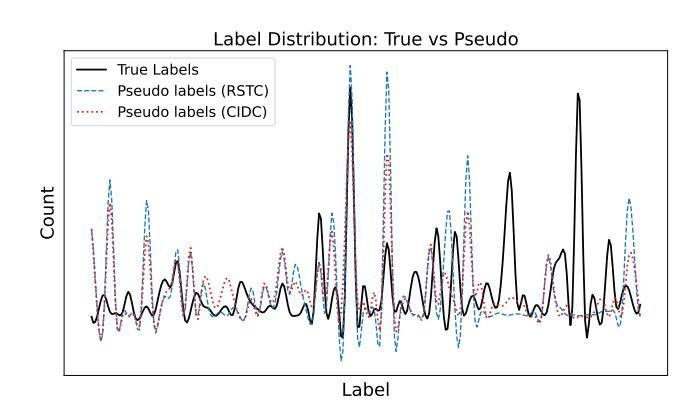
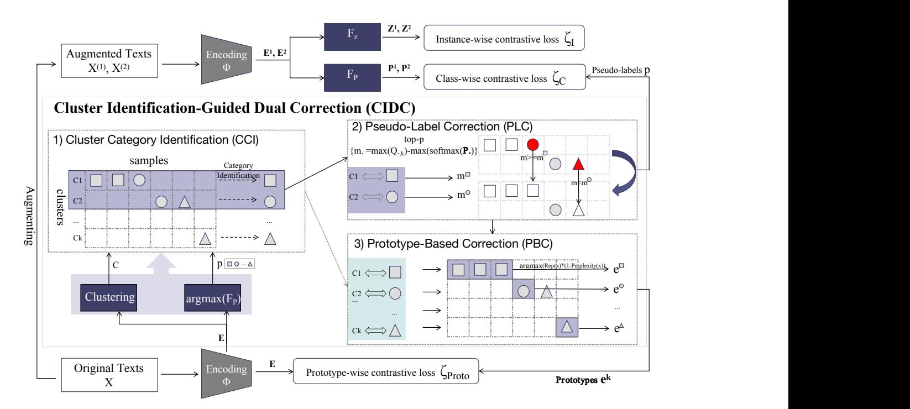
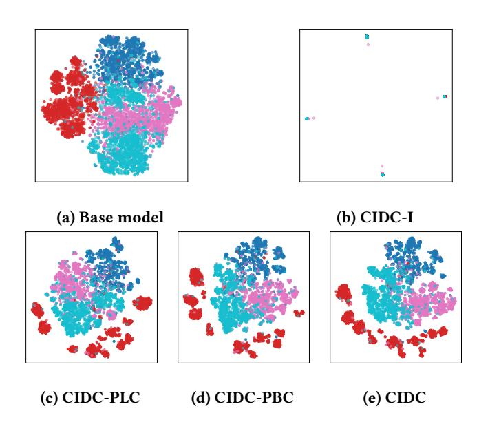
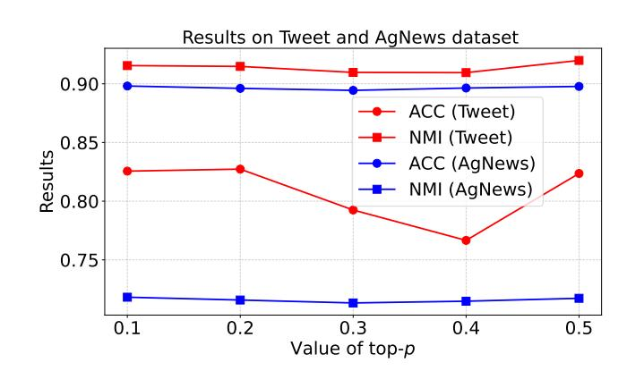
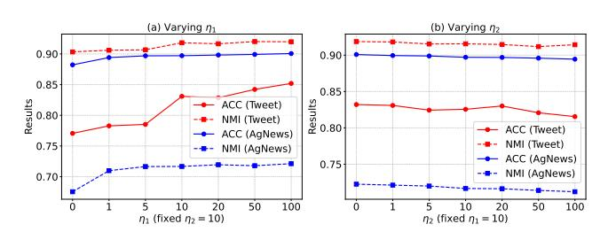

# CIDC: Cluster Identification-Guided Dual Correction for Robust Short Text Clustering

[Yuhua Zhao](https://orcid.org/0009-0001-5160-2859) College of Software, Nankai University & Shenzhen Loop Area Institute Tianjin, China zyh22@mail.nankai.edu.cn

[Zhixin Han](https://orcid.org/0009-0003-4710-8019) College of Software, Nankai University Tianjin, China

Xuan Li College of Software, Nankai University Tianjin, China

Peiyu Xu College of Software, Nankai University Tianjin, China

Hang Gao∗ College of Artificial Intelligence, Tianjin University of Science and Technology Tianjin, China gaohang@tust.edu.cn

Mengting Hu∗ College of Software, Nankai University & Tianjin Key Laboratory of Software Experience and Human Computer Interaction Tianjin, China mthu@mail.nankai.edu.cn

Tiegang Gao College of Software, Nankai University Tianjin, China

# Abstract

The rapid growth of online short texts has made specialized analysis essential, as these texts are sparse and information-limited. Short text clustering (STC) is critical for automatically grouping unlabeled texts into meaningful clusters, supporting applications such as sentiment analysis, spam filtering, and social media personalization. In the context of massive online content, deep clustering seeks to uncover semantic categories by measuring distances in the representation space. Consequently, aligning clustering pseudolabels with the true category distribution is crucial for effective self-supervised training, particularly under class imbalance and distribution skew commonly observed in web data. To address this challenge, we propose the Cluster Identification-Guided Dual Correction (CIDC) framework, which generates reliable pseudo-labels to guide deep clustering. Specifically, given cluster partitions and model-estimated class distributions, we perform Cluster Category Identification (CCI) at each training epoch to determine the most probable category for each cluster. This identification provides the foundation for the Pseudo-Label Correction (PLC) and Prototype-Based Correction (PBC) modules, which jointly enhance pseudolabel reliability and representation learning. In the PLC module, samples whose model-estimated class distributions conflict with the assigned cluster category are corrected, thereby improving semantic alignment within clusters. In the PBC module, representative and reliable prototypes are selected according to cluster categories and model predictions to guide training, further strengthening representation discriminability. Extensive experiments demonstrate that CIDC consistently outperforms existing methods in terms of

∗Corresponding author

© 2026 Copyright held by the owner/author(s). ACM ISBN 979-8-4007-2307-0/2026/04 <https://doi.org/10.1145/3774904.3792578>

clustering accuracy and mutual information, particularly in unsupervised settings characterized by class imbalance and noisy data.

## CCS Concepts

• Theory of computation → Unsupervised learning and clustering; • Information systems → Clustering.

## Keywords

Short Text Clustering, Unsupervised Learning

### ACM Reference Format:

Yuhua Zhao, Zhixin Han, Xuan Li, Peiyu Xu, Hang Gao, Mengting Hu, and Tiegang Gao. 2026. CIDC: Cluster Identification-Guided Dual Correction for Robust Short Text Clustering. In Proceedings of the ACM Web Conference 2026 (WWW '26), April 13–17, 2026, Dubai, United Arab Emirates. ACM, New York, NY, USA, [10](#page-9-0) pages.<https://doi.org/10.1145/3774904.3792578>

# 1 Introduction

Recent years have witnessed a rapid growth in online documents, making text analysis an essential task for preparing, storing, visualizing, and mining information [\[2\]](#page-8-0). Social media platforms such as Twitter, Instagram, and Facebook generate vast amounts of unstructured text daily. Text clustering, a fundamental task in text mining, aims to group text instances into clusters in an unsupervised manner. It has proven valuable in many applications, including recommendation systems [\[14,](#page-8-1) [15\]](#page-8-2), information retrieval [\[11\]](#page-8-3), opinion mining [\[26\]](#page-8-4), and stance detection [\[11\]](#page-8-3). Short text clustering (STC) is particularly challenging because text representations in the original lexical space are often sparse, an issue that is further amplified in short texts [\[1,](#page-8-5) [36,](#page-8-6) [39\]](#page-8-7). Therefore, STC is critical for automatically grouping unlabeled texts into meaningful clusters, and its success relies on learning effective text representation schemes suitable for clustering.

Short text clustering (STC) builds on classical algorithms such as K-means [\[8\]](#page-8-8) and has developed along two main lines: Bayesian topic models, such as LDA [\[4\]](#page-8-9), and deep learning approaches [\[10\]](#page-8-10).

[This work is licensed under a Creative Commons Attribution 4.0 International License.](https://creativecommons.org/licenses/by/4.0) WWW '26, Dubai, United Arab Emirates

Figure 1: The label distribution on the Tweet dataset, comparing true labels and pseudo-labels, is derived from different methods.

Topic models rely on bag-of-words representations, which are often sparse and lack expressive power [\[39\]](#page-8-7). Deep clustering, in contrast, learns semantic representations that are fed into clustering algorithms to improve performance. Short texts typically contain many categories with highly imbalanced distributions, making clustering assignments unreliable and introducing noise during training. Therefore, aligning clustering assignments with the true category distribution is crucial for robust training under class imbalance and distribution skew in web data. Existing short text clustering methods address the noise problem through three main approaches [\[41\]](#page-8-11): (1) text preprocessing, (2) outlier postprocessing, and (3) enhancing model robustness. Early methods [\[6\]](#page-8-12) focus on preprocessing techniques to mitigate the negative impact of noise in raw text. More recent approaches [\[22\]](#page-8-13) incorporate outlier detection algorithms to identify and remove outliers from clusters, thereby improving clustering performance. A more advanced method, SCCL [\[37\]](#page-8-14), incorporates contrastive learning to enhance clustering by improving model robustness to noise. However, although preprocessing and postprocessing techniques can mitigate noise, they do not fundamentally enhance the model's inherent robustness. Moreover, SCCL's learned representations still lack discriminability due to the absence of supervision, resulting in features that are not sufficiently robust. Additionally, the sparse semantic content of short texts further complicates the identification of shared categories, often leading to low intra-cluster cohesion. To address these challenges, recent studies [\[19,](#page-8-15) [41\]](#page-8-11) have adopted pseudo-labeling strategies that assign pseudo labels to unlabeled data, offering additional supervision to guide representation learning and improve clustering quality.

Real-world text datasets are typically characterized by diverse and imbalanced class distributions. As a result, the pseudo-labels predicted by the model often deviate significantly from the true label distribution. This distributional shift severely affects both the quality of learned representations and the clustering outcomes based on learned representations, particularly on imbalanced datasets. As shown in Figure [1,](#page-1-0) the pseudo-labels predicted by a representative method (RSTC) [\[41\]](#page-8-11) on an imbalanced tweet dataset deviate significantly from the ground-truth distribution. Otherwise, prior

studies [\[32\]](#page-8-16) have shown that deep clustering models often suffer from inaccurate pseudo-labels due to underfitted decision boundaries, particularly in imbalanced scenarios. The pseudo-labeling process tends to favor dominant classes, leading to biased learning and degraded performance.

To address the aforementioned issues, we seeks to reduce the discrepancy between predicted pseudo-labels and the true label distribution, while simultaneously enhancing the discriminability of learned representations. To this end, we propose the Cluster Identification-Guided Dual Correction (CIDC) training framework. Specifically, to address the mismatch between predicted pseudolabels and the true label distribution, we perform Cluster Category Identification (CCI) at each training epoch to determine the most likely category for each cluster. Since pretrained models on largescale data possess useful prior knowledge, we identify cluster categories based on the cluster partitions and the class distribution predicted by the model. The proposed CCI ensures accurate alignment between clusters and categories while explicitly addressing the underrepresentation of minority classes caused by data imbalance. Once the cluster categories are identified, we apply Pseudo-Label Correction (PLC) by correcting pseudo-labels within each cluster that conflict with the assigned category, thereby improving label consistency and guiding more effective representation learning. As illustrated in Figure [1,](#page-1-0) the pseudo-labels generated by our approach are much closer to the ground truth. In addition, to enhance representation discriminability, we introduce a Prototype-Based Correction (PBC) module for joint training. Specifically, PBC constructs prototypes based on the identified cluster categories and corrected pseudo-labels. To ensure the representativeness and reliability of these prototypes, we assess data based on feature similarity among samples as well as the model's perplexity regarding the predicted class distribution. These prototypes are subsequently utilized to guide the training process, aiming to refine feature representations and improve clustering quality.

Our contributions can be summarized as follows:

- To address the mismatch between pseudo-label distributions and the true class distribution, as well as to enhance representation discriminability, we propose a Cluster Identification-Guided Dual Correction (CIDC) training framework. The framework includes Cluster Category Identification (CCI) at each training epoch to determine the most probable category for each cluster, along with two modules: Pseudo-Label Correction (PLC) and Prototype-Based Correction (PBC).
- To the best of our knowledge, this is the first work to improve clustering semantic consistency by correcting pseudo-labels through consideration of data within each cluster, integrating heuristic cluster-category identification with a joint consideration of clustering assignments and model prediction.
- We conduct extensive experiments on eight short text clustering datasets, and the results demonstrate the effectiveness and superiority of the proposed method CIDC. The code for our method is publicly available online.[1](#page-1-1)

1<https://github.com/z-flower/CIDC>

### 2 Related Work

### 2.1 Short Text Clustering

While general text clustering has been extensively studied in the literature [\[3,](#page-8-17) [12,](#page-8-18) [17\]](#page-8-19), short text clustering (STC) [\[23\]](#page-8-20) has attracted less attention until recently, due to the rapid growth of user-generated content on social media. Existing approaches to STC can be broadly categorized into two groups.

The first group consists of topic modeling approaches, which build on the principles of LDA to uncover latent topic distributions by modeling word co-occurrence patterns. Unlike LDA, which assumes that each word in a document is generated from a topic, GSDMM [\[34\]](#page-8-21) assumes that all words in a short text share the same topic, naturally treating this topic as the text's cluster. More recently, two models [\[13,](#page-8-22) [33\]](#page-8-23) have been proposed to incrementally cluster streaming short texts. In this work, we focus on the general clustering setting, leaving the adaptation to streaming short texts for future research.

Inspired by the success of deep learning, the second group of approaches leverages deep neural representations to enhance clustering performance. Recent deep clustering methods often adopt a multi-stage framework, where feature representations are first learned and then used for clustering [\[18,](#page-8-24) [29\]](#page-8-25). However, this sequential approach can lead to a misalignment between representation learning and clustering objectives, resulting in suboptimal clustering performance. To overcome this limitation, joint deep clustering methods [\[6,](#page-8-12) [28,](#page-8-26) [31\]](#page-8-27) have been proposed to integrate representation learning and clustering into a unified framework, allowing the clustering objective to directly guide representation learning. Among these, SCCL [\[37\]](#page-8-14) represents the current state-of-the-art, performing end-to-end optimization by combining contrastive learning with a clustering loss. This enables better separation of overlapping categories in the data space, significantly improving clustering results. Other contrastive learning-based approaches have also been explored for short text clustering. For example, virtual data augmentation has been proposed to better adapt contrastive learning to the discrete nature of text [\[38\]](#page-8-28). In parallel, several studies focus on clustering enhancement strategies to improve cluster quality. HAC-SD [\[22\]](#page-8-13) introduces an iterative classification framework that filters out noisy samples and demonstrates the effectiveness of combining hierarchical clustering with refinement. More recently, two-module frameworks have gained attention for short text clustering [\[19,](#page-8-15) [41\]](#page-8-11), consisting of a pseudo-label generation module and a robust representation learning module. These pseudo-labels provide supervision to guide representation learning in both self-supervised and semi-supervised settings.

### 2.2 Pseudo-labels for Self-Supervised Learning

Self-supervised learning has become a powerful approach for unsupervised representation learning, supporting a wide range of downstream tasks. A core technique in this paradigm is pseudolabeling, which assigns predicted labels to unlabeled data to guide discriminative representation learning [\[7\]](#page-8-29). For example, Caron et al. [\[5\]](#page-8-30) show that k-means clustering can be used to generate pseudolabels for visual representation learning. However, pseudo-labeling is highly sensitive to label accuracy, as noisy labels can mislead the model and impair generalization. FixMatch [\[25\]](#page-8-31) addresses this by

introducing consistency regularization, encouraging stable predictions under input perturbations. Yang et al. [\[32\]](#page-8-16) further improve pseudo-labeling by incorporating prototype learning, which separates low-density regions in the feature space and alleviates class imbalance by assigning labels based on prototype similarity. To mitigate label imbalance, RSTC [\[41\]](#page-8-11) aligns the pseudo-label distribution with the class distribution within each batch, helping preserve the clustering structure. Nonetheless, the predicted pseudo-labels still often diverge significantly from the true label distribution, typically favoring majority classes. Our method improves the consistency between clustering assignments and model predictions while enhancing robustness to class imbalance and noisy labels.

### 3 Method

Our research focuses on integrating clustering with deep representation learning by optimizing a clustering objective within the embedding space. As shown in Figure [2,](#page-3-0) the proposed CIDC framework consists of three key modules: 1) Cluster Category Identification (CCI), 2) Pseudo-Label Correction (PLC) and 3) Prototype-Based Correction (PBC). In the following sections, we provide a detailed introduction to each component of the CIDC framework.

Our training data includes both original and augmented instances. For each data instance in unlabeled dataset�� = {��1, ��2, . . . , ���� }, we utilize contextual augmenter [\[16\]](#page-8-32) to generate two augmentations �� (1) , �� (2) . We then employ encoding network Φ to generate embeddings E = Φ(��) = {e1, e2, . . . , e�� } of the original texts ��, E (1) and E (2) of the augmented texts �� (1) , �� (2) .

### 3.1 Cluster Category Identification (CCI)

The CCI module is responsible for assigning a category to each cluster by leveraging both the cluster partitions and the modelpredicted class distribution. To obtain cluster partitions, we apply ��-means on the embeddings E, with the number of clusters set to match the number of classes �� in the dataset. The resulting clusters are denoted as:

�� = {��1,��2, . . . ,���� }. (1)

where C�� is the set of samples assigned to cluster ��, �� ∈ {1, 2, . . . , ��}.

To predict the class of each sample, we employ a classification head ���� (·), consisting of a transformation network followed by a linear classifier. This head maps the embeddings E to a probability distribution over �� classes:

P = ���� (E) = {P1, P2, . . . , P�� }, P ∈ R ��×�� , (2)

where P�� denotes the predicted class probability vector for the sample ���� . The predicted pseudo-label ���� is determined by selecting the class with the highest probability:

���� = arg max �� P�� , for �� = 1, . . . , ��. (3)

These predicted pseudo-labels are visualized using different shapes (e.g., a square □, a circle ◦, and a triangle △), as shown in Figure [2.](#page-3-0)

Given the cluster partitions �� and the predicted pseudo-labels ��, the distribution of pseudo-labels within each cluster with respect to a target class ��ˆ ∈ 1, . . . , �� can be computed as follows:

Dist�� (��ˆ) = 1 |C�� | ∑︁ ��∈ C�� I(���� = ��ˆ), (4)

Figure 2: CIDC consists of three joint modules: 1) Cluster Category Identification (CCI) to assign categories to clusters, 2) Pseudo-Label Correction (PLC) to correct pseudo-labels, and 3) Prototype-Based Correction (PBC) to guide training with reliable prototypes.

where I(·) is the indicator function that returns 1 if the condition holds and 0 otherwise. The category assigned to cluster C�� , denoted as��ˆ�� , is determined based on the pseudo-label distribution, selecting with the highest proportion of pseudo-labels within the cluster:

��ˆ�� = arg max ��ˆ∈ {1,...,��} Dist�� (��ˆ). (5)

However, in imbalanced datasets, clusters is dominated by majority classes, leading to the neglect of minority categories during clusterto-category assignment. We incorporate a rarity-aware strategy into the assignment process, giving higher priority to classes with lower global frequency. Specifically, for each pseudo-label, we calculate its overall proportion as global frequency across the entire dataset:

Freq(��ˆ) = 1 �� ∑︁�� ��=1 I(���� = ��ˆ), (6)

We then define the priority of each cluster ���� as a tuple consisting of the highest pseudo-label proportion within the cluster and the negative global frequency of its dominant class. Formally, for each cluster ���� , we define:

Priority(���� ) = (max Dist�� (��ˆ), − min Freq(��ˆ)) , (7)

Following the established priority order, clusters are sequentially assigned to categories according to the assignment criterion in Equation [5.](#page-3-1) Specifically, if a cluster shows full confidence for a single category (��ˆ�� = 1.0), it is directly assigned to that category. Otherwise, the algorithm selects the highest-probability category that has not yet been assigned to another cluster, ensuring uniqueness

across clusters. If no unassigned category is available, the cluster is assigned to its most probable category even if it has already been taken. This process continues until all clusters in the priority order have been processed. The Cluster Category Identification (CCI) module offers a principled method to associate unsupervised clusters with assigned cluster-level categories.

## 3.2 Pseudo-Label Correction (PLC)

After assigning cluster-level categories, some samples within each cluster have pseudo-labels inconsistent with the assigned category. To determine the true labels of these samples and better align clusters with their underlying semantics, we correct the samples' pseudo-labels based on the discrepancy between the modelpredicted class probabilities and the cluster-based soft assignment probabilities.

First, more accurate cluster centroids are obtained by applying K-means only to the samples whose predicted pseudo-labels match their assigned cluster categories :

e���� = 1 |���� | ∑︁ ��∈���� e�� , (8)

wheree���� denote the refined centroid of cluster���� ,���� = {�� | ���� = ��ˆ�� } denotes the set of samples whose pseudo-label matches the assigned cluster category in cluster���� . For each sample e��, its soft assignment probabilities ����, �� over all clusters as follows:

����,�� = exp (−|e�� − e���� |) Í�� ��=1 exp −|e�� − e���� . (9)

Table 1: Statistics of the datasets. C: number of classes, N: number of samples, A: average length, R: avg. samples per class.

| Dataset        | C   | N      | A  | R   |
|----------------|-----|--------|----|-----|
| AgNews         | 4   | 8,000  | 23 | 1   |
| StackOverflow  | 20  | 20,000 | 8  | 1   |
| Biomedical     | 20  | 20,000 | 13 | 1   |
| SearchSnippets | 8   | 12,340 | 18 | 7   |
| GoogleNews-TS  | 152 | 11,109 | 28 | 143 |
| GoogleNews-T   | 152 | 11,108 | 6  | 143 |
| GoogleNews-S   | 152 | 11,108 | 22 | 143 |
| Tweet          | 89  | 2,472  | 9  | 249 |

GoogleNews-S and Tweet are heavy imbalanced datasets. Following [\[37\]](#page-8-14), we take unpreprocessed data as input to demonstrate that our model is robust to noise, for a fair comparison. The detailed statistics of these datasets are shown in Table [1.](#page-5-0)

### 4.2 Evaluation Metrics

We evaluate performance using Accuracy (ACC) and Normalized Mutual Information (NMI). These metrics require the true number of clusters and are not applicable when �� is mis-specified. Following prior work [\[6,](#page-8-12) [22,](#page-8-13) [30,](#page-8-35) [37,](#page-8-14) [41\]](#page-8-11), we set the number of clusters to the ground-truth category number.

The evaluation metrics are computed as follows:

ACC = max ��∈M 1 �� ∑︁�� ��=1 I {���� = ��(��ˆ��)} , (22)

where ��ˆ�� and ���� are the predicted and true label of the ��-th sample, I{·} is the indicator function, and M is the set of all possible permutations mapping predicted to true labels.

NMI(��,��ˆ) = ��(��;��ˆ) √︃ ��(��)��(��ˆ) , (23)

where ��(��;��ˆ) denotes the mutual information between the true labels �� and predicted labels ��ˆ, and ��(·) is the entropy. NMI ranges from 0 to 1, with higher values indicating better clustering alignment.

### 4.3 Baselines

To evaluate the effectiveness of our method, we compare it with several strong baselines:

- SCCL [\[37\]](#page-8-14) enhances short text clustering through contrastive learning, improving semantic separation in the representation space.
- RSTC [\[41\]](#page-8-11) focuses on improving clustering robustness under imbalanced and noisy conditions.
- Multi-MCCR [\[42\]](#page-8-37) employs multiple models with a consistent regularization strategy using C-BiKL loss for contrastive learning.
- STSPL-SSC [\[19\]](#page-8-15) combines semantic textual similarity-based pseudo-label generation with robust contrastive learning to

handle limited labeled data. Among them, SCCL is unsupervised, RSTC is self-supervised, and both Multi-MCCR and STSPL-SSC are semi-supervised methods.

### 4.4 Implementation Details

We build our model with PyTorch [\[20\]](#page-8-38) and using the Adam optimizer [\[9\]](#page-8-39). We chose the bge-base-en-v1.5 model [\[27\]](#page-8-40) from the Sentence Transformer library [\[24\]](#page-8-41) for text encoding, with the maximum input length set to 32. The learning rate was set to 5 × 10−6 for optimizing the encoding network, and 5 × 10−4 for optimizing the projection network and clustering network. The dimensions of the text representations and projection representations were set to ��1 = 768 and ��2 = 128, respectively. The batch size was set to �� = 200. The temperature parameter was set to �� = 1, and the threshold �� was set to 0.01. For all other baselines, we used the code released by their respective authors. The training environment we used is a GeForce RTX 3090 GPU, with each dataset taking approximately 30 − 60 minutes to run. For all the experiments, we repeat five times and report the average results.

In addition, we investigate the impact of the top-�� parameter in the PLC component, as well as the loss weights ��1 and ��2, on model performance. Experiments are conducted on the Tweet and AGNews datasets, where Tweet is highly imbalanced and AGNews is relatively balanced. Detailed results are reported in Appendix [A.](#page-8-42)

### 4.5 Comparison With State-of-the-Art Methods

We explore different combinations of each component in our framework. Specifically, we design three distinct combination strategies:

- CIDC-PBC: This variant excludes PBC and includes CCI and PLC, with the top-�� margin set to 0.1.
- CIDC-PLC: This variant excludes PLC and combines CCI with PBC.
- CIDC: This is the full version, integrating all three components—CCI, PLC, and PBC.

Each strategy is evaluated under two settings: self-supervised and semi-supervised. For the semi-supervised setting, we annotate the initially selected prototypes with their true labels and fix them, guiding the computation of the prototype-wise contrastive loss. Note that CIDC-PBC, which only corrects labels without prototype information, is not applicable to the semi-supervised setting and is evaluated only in the self-supervised setting.

4.5.1 Self-supervised Setting. Table [2](#page-6-0) and Table [3](#page-6-1) report results on eight datasets, covering balanced/lightly imbalanced and heavily imbalanced cases, respectively. RSTC improves clustering by aligning pseudo-label and class distributions. Our method CIDC achieves the best overall performance, improving accuracy by 0.5%–8% across datasets. CIDC† excels on balanced/lightly imbalanced data, while CIDC‡ performs best under heavy imbalance. Notably, CCI-guided PLC alone achieves near-optimal results, highlighting the effectiveness of category assignment and correction.

4.5.2 Semi-supervised Setting. We also compare CIDC with semisupervised baselines. Prototype selection is based on cluster categories from CCI and corrected pseudo-labels from PLC. One prototype per cluster is selected according to its assigned category, then fixed and annotated with the true label to guide prototype-based

Table 2: Results of different methods on balanced and light imbalanced datasets. † denotes the experiment under self-supervised setting; ‡ denotes the experiment under semi-supervised setting. The best results are bold-typed and the second best ones are underlined; the best results\method for each setting are marked with \*. (Same as belows.)

| Methods    | AgNews ACC | NMI     | SearchSnippets ACC | NMI    | Stackoverflow ACC | NMI     | Biomedical ACC | NMI     |
|------------|------------|---------|--------------------|--------|-------------------|---------|----------------|---------|
| SCCL       | 83.10      | 61.96   | 79.90              | 63.78  | 70.83             | 69.21   | 42.49          | 39.16   |
| RSTC       | 84.24      | 62.45   | 80.10              | 69.74  | 83.30             | 74.11   | 48.40          | 40.12   |
| CIDC-PBC † |            |         |                    |        |                   |         |                |         |
|            | 89.88*     | 72.05*  | 80.68              | 65.03  | 87.36             | 82.89   | 50.18          | 44.38   |
| CIDC-PLC † |            |         |                    |        |                   |         |                |         |
|            | 89.75      | 71.69   | 80.19              | 64.92  | 87.28             | 83.10 * | 48.16          | 43.62   |
| CIDC †     |            |         |                    |        |                   |         |                |         |
| *          | 89.78      | 71.73   | 81.43 *            | 66.15* | 87.41 *           | 83.06   | 51.02 *        | 44.78 * |
| CIDC-PLC ‡ |            |         |                    |        |                   |         |                |         |
|            | 88.89      | 70.08   | 80.24              | 64.16  | 86.80             | 82.36   | 47.80          | 42.72   |
| CIDC ‡     |            |         |                    |        |                   |         |                |         |
| *          | 90.20 *    | 72.72 * | 80.42*             | 64.47* | 87.08*            | 82.51*  | 50.38*         | 44.03*  |

Table 3: Results of different methods on heavy imbalanced datasets.

| Methods    | GoogleNews-TS ACC | NMI     | GoogleNews-T ACC | NMI     | GoogleNews-S ACC | NMI     | Tweet ACC | NMI     |
|------------|-------------------|---------|------------------|---------|------------------|---------|-----------|---------|
| SCCL       | 82.51             | 93.01   | 69.01            | 85.10   | 73.44            | 87.98   | 73.10     | 86.66   |
| RSTC       | 83.27             | 93.15   | 72.27            | 87.39   | 79.32            | 89.40   | 75.20     | 87.35   |
| CIDC-PBC † |                   |         |                  |         |                  |         |           |         |
|            | 83.32             | 93.77   | 73.50            | 88.09   | 78.27            | 89.91*  | 83.21*    | 91.86*  |
| CIDC-PLC † |                   |         |                  |         |                  |         |           |         |
|            | 82.53             | 93.49   | 70.15            | 86.66   | 78.11            | 89.30   | 80.58     | 90.02   |
| CIDC †     |                   |         |                  |         |                  |         |           |         |
| *          | 83.51*            | 93.94 * | 73.93 *          | 89.08 * | 79.31*           | 89.76   | 82.56     | 91.55   |
| CIDC-PLC ‡ |                   |         |                  |         |                  |         |           |         |
|            | 82.73             | 93.63   | 70.02            | 86.60   | 77.18            | 88.91   | 81.15     | 90.52   |
| CIDC ‡     |                   |         |                  |         |                  |         |           |         |
| *          | 83.85 *           | 93.92*  | 72.07*           | 87.09*  | 80.01 *          | 89.96 * | 83.50 *   | 92.00 * |

Table 4: Results of different methods on both balanced and imbalanced datasets. † denotes the experiment under selfsupervised setting; ‡ denotes the experiment under semisupervised setting.

| Methods    | Biomedical ACC | NMI     | Tweet ACC | NMI     |
|------------|----------------|---------|-----------|---------|
| Multi-MCCR | 33.13          |         | 72.34     |         |
| STSPL-SSC  | 47.43          | 42.49   | 79.59     | 88.02   |
| CIDC-PBC † |                |         |           |         |
|            | 50.18          | 44.38   | 83.21*    | 91.86*  |
| CIDC-PLC † |                |         |           |         |
|            | 48.16          | 43.62   | 80.58     | 90.02   |
| CIDC †     | 51.02 *        | 44.78 * | 82.56     | 91.55   |
| CIDC-PLC ‡ |                |         |           |         |
|            | 47.80          | 42.72   | 81.15     | 90.52   |
| CIDC ‡     |                |         |           |         |
|            | 50.38*         | 44.03*  | 83.50 *   | 92.00 * |

correction (PBC). Results are reported in Table [4.](#page-6-2) As shown in the figure, CIDC significantly outperforms other semi-supervised baselines, highlighting the effectiveness of CCI and PLC. The selected prototypes perform particularly well on the imbalanced Tweet dataset, suggesting their effectiveness in enlarging inter-cluster separation.

# 4.6 Effects of Prototype Selection

We compare two prototype selection settings: (1) selecting a sample from each cluster that matches its assigned category (used in CIDC), and (2) selecting a sample whose pseudo-label matches the target category (CIDC♥ ).

As shown in Tables [5](#page-7-0) and [6,](#page-7-1) both settings perform similarly on balanced and lightly imbalanced datasets, but CIDC♥ degrades significantly on heavily imbalanced ones. This highlights the critical role of accurate cluster category identification in effective prototype selection, even after label correction.

We further study the impact of cluster category assignment and correction (with top-�� = 0.1) on CIDC♥ . Tables [5](#page-7-0) and [6](#page-7-1) show results after removing these components, referred to as CIDC-AC♥ . The significant performance drop confirms that pseudo-label correction within clusters improves alignment with true labels and enhances clustering quality.

# 4.7 Visualization

Figure [3](#page-7-2) shows t-SNE visualizations of the Base model, CIDC-I (without instance-wise contrastive learning), CIDC-PLC, CIDC-PBC, and CIDC on the AgNews dataset. The Base model exhibits loose intra-class clusters with significant overlap. CIDC-I improves intercluster separation, but loses some fine-grained features. By identifying cluster categories and selecting prototypes for prototype-wise

Table 5: Results of different methods on balanced and light imbalanced datasets. ↑ or ↓ indicates that the result of CIDC♥ is increased or decreased compared to CIDC; ⇑ or ⇓ indicates that the result of CIDC-AC♥ is increased or decreased compared to CIDC♥ . (Same as belows.)

| Methods     | ACC          | AgNews NMI   | ACC          | SearchSnippets NMI | ACC          | Stackoverflow NMI | ACC          | Biomedical NMI |
|-------------|--------------|--------------|--------------|--------------------|--------------|-------------------|--------------|----------------|
| CIDC †      | 89.78        | 71.73        | 81.43        | 66.15              | 87.41        | 83.06             | 51.02        | 44.78          |
| CIDC ♥†     | 89 78 0 00   | 71 73 0 00   | 81 43 0 00   | 66 15 0 00         | 87 47 0 06 ↑ | 83 22 0 16 ↑      | 48 65 2 37 ↓ | 43 80 0 98 ↓   |
| CIDC-AC ♥†  | 89 75 0 03 ⇓ | 71 69 0 04 ⇓ | 80 19 1 24 ⇓ | 64 92 1 23 ⇓       | 87 23 0 24 ⇓ | 83 08 0 14 ⇓      | 48 38 0 27 ⇓ | 43 85 0 05 ⇑   |
| CIDC ‡      | 90.20        | 72.72        | 80.42        | 64.47              | 87.08        | 82.51             | 50.38        | 44.03          |
| CIDC ♥ ‡    |              |              |              |                    |              |                   |              |                |
|             | 90 20 0 00   | 72 72 0 00   | 80 45 0 03 ↑ | 64 38 0 09 ↓       | 86 90 0 18 ↓ | 82 39 0 12 ↓      | 49 48 0 90 ↓ | 42 90 1 13 ↓   |
| CIDC-AC ♥ ‡ |              |              |              |                    |              |                   |              |                |
|             | 88 89 1 31 ⇓ | 70 08 2 64 ⇓ | 80 69 0 24 ⇑ | 65 12 0 74 ⇑       | 86 80 0 10 ⇓ | 82 29 0 10 ⇓      | 48 20 1 28 ⇓ | 43 32 0 42 ⇑   |

Table 6: Results of different methods on heavy imbalanced datasets.

| Methods     | ACC          | GoogleNews-TS NMI | ACC          | GoogleNews-T NMI | ACC          | GoogleNews-S NMI | ACC          | Tweet NMI    |
|-------------|--------------|-------------------|--------------|------------------|--------------|------------------|--------------|--------------|
| CIDC †      | 83.51        | 93.94             | 73.93        | 89.08            | 79.31        | 89.76            | 82.56        | 91.55        |
| CIDC ♥†     | 83 29 0 22 ↓ | 93 84 0 10 ↓      | 71 66 2 27 ↓ | 87 33 1 75 ↓     | 79 67 0 36 ↑ | 90 01 0 25 ↑     | 81 72 0 84 ↓ | 91 66 0 11 ↑ |
| CIDC-AC ♥†  | 82 39 0 90 ⇓ | 93 38 0 46 ⇓      | 70 08 1 58 ⇓ | 86 67 0 66 ⇓     | 78 22 1 45 ⇓ | 89 41 0 60 ⇓     | 81 07 0 65 ⇓ | 90 06 1 60 ⇓ |
| CIDC ‡      | 83.85        | 93.92             | 72.07        | 87.09            | 80.01        | 89.96            | 83.50        | 92.00        |
| CIDC ♥ ‡    |              |                   |              |                  |              |                  |              |              |
|             | 83 21 0 64 ↓ | 93 84 0 08 ↓      | 72 44 0 37 ↑ | 87 38 0 29 ↑     | 79 33 0 68 ↓ | 89 76 0 20 ↓     | 83 41 0 09 ↓ | 91 79 0 21 ↓ |
| CIDC-AC ♥ ‡ |              |                   |              |                  |              |                  |              |              |
|             | 82 79 0 42 ⇓ | 93 61 0 23 ⇓      | 70 01 2 43 ⇓ | 86 78 0 60 ⇓     | 77 75 1 58 ⇓ | 89 34 0 42 ⇓     | 80 74 2 67 ⇓ | 90 26 1 53 ⇓ |

Figure 3: t-SNE visualizations of different model variants on AgNews dataset. Each color indicates a ground-truth class.

contrastive learning combined with instance-wise contrast, CIDC-PLC reduces cluster overlap. CIDC-PBC further applies pseudolabel correction after cluster category identification, enlarging intercluster distances and reducing boundary confusion, but at the cost

of increased intra-cluster variance. Overall, CIDC achieves a better balance between clear inter-cluster separation and compact intra-cluster structure, resulting in the best clustering performance.

## 5 Conclusion

In this work, we propose the Cluster Identification Guided Dual Correction (CIDC) framework to address challenges in deep clustering caused by class imbalance and noisy pseudo labels. CIDC first determines cluster categories through Cluster Category Identification, which provides a reliable global understanding of the cluster structure. Based on this categorization, CIDC incorporates two complementary correction strategies, namely Pseudo Label Correction and Prototype Based Correction, to jointly improve pseudo label reliability and representation quality. Extensive experiments on eight standard short text clustering benchmark datasets demonstrate that CIDC consistently outperforms existing methods, achieving improvements of 0.5% to 8% in clustering accuracy and mutual information, especially in fully unsupervised settings with imbalanced and noisy data. These results demonstrate that CIDC effectively enhances clustering consistency and representation discriminability, providing a robust solution for short text clustering and other challenging unsupervised tasks.

### Acknowledgments

We sincerely thank all the anonymous reviewers for providing valuable feedback. This work is supported by the National Natural Science Foundation of China (No.62406151).

- References [1] Charu C Aggarwal and ChengXiang Zhai. 2012. A survey of text clustering algorithms. In Mining text data. Springer, 77–128. [2] Majid Hameed Ahmed, Sabrina Tiun, Nazlia Omar, and Nor Samsiah Sani. 2022. Short text clustering algorithms, application and challenges: A survey. Applied Sciences 13, 1 (2022), 342. [3] Melissa Ailem, François Role, and Mohamed Nadif. 2017. Sparse poisson latent block model for document clustering. IEEE Transactions on Knowledge and Data Engineering (TKDE) 29, 7 (2017), 1563–1576. [4] David M Blei, Andrew Y Ng, and Michael I Jordan. 2003. Latent dirichlet allocation. Journal of machine Learning research 3, Jan (2003), 993–1022. [5] Mathilde Caron, Piotr Bojanowski, Armand Joulin, and Matthijs Douze. 2018. Deep clustering for unsupervised learning of visual features. In Proceedings of the European conference on computer vision (ECCV). 132–149. [6] Amir Hadifar, Lucas Sterckx, Thomas Demeester, and Chris Develder. 2019. A self-training approach for short text clustering. In Proceedings of the 4th Workshop on Representation Learning for NLP (RepL4NLP-2019). 194–199. [7] Weibo Hu, Chuan Chen, Fanghua Ye, Zibin Zheng, and Yunfei Du. 2021. Learning deep discriminative representations with pseudo supervision for image clustering. Information Sciences 568 (2021), 199–215. [8] Anil K Jain. 2010. Data clustering: 50 years beyond K-means. Pattern recognition letters 31, 8 (2010), 651–666. [9] Diederik P Kingma and Jimmy Ba. 2014. Adam: A method for stochastic optimization. arXiv preprint arXiv:1412.6980 (2014). [10] Yann LeCun, Yoshua Bengio, and Geoffrey Hinton. 2015. Deep learning. nature 521, 7553 (2015), 436–444. [11] Jinning Li, Huajie Shao, Dachun Sun, Ruijie Wang, Yuchen Yan, Jinyang Li, Shengzhong Liu, Hanghang Tong, and Tarek Abdelzaher. 2022. Unsupervised belief representation learning with information-theoretic variational graph autoencoders. In Proceedings of the 45th International ACM SIGIR Conference on Research and Development in Information Retrieval. 1728–1738. [12] Yanjun Li, Congnan Luo, and Soon M Chung. 2008. Text clustering with feature selection by using statistical data. IEEE Transactions on knowledge and Data Engineering (TKDE) 20, 5 (2008), 641–652. [13] Shangsong Liang, Emine Yilmaz, and Evangelos Kanoulas. 2016. Dynamic clustering of streaming short documents. In Proceedings of the 22nd ACM SIGKDD international conference on knowledge discovery and data mining. 995–1004. [14] Weiming Liu, Jiajie Su, Chaochao Chen, and Xiaolin Zheng. 2021. Leveraging distribution alignment via stein path for cross-domain cold-start recommendation. Advances in Neural Information Processing Systems (Neurips) 34 (2021), 19223– 19234. [15] Weiming Liu, Xiaolin Zheng, Mengling Hu, and Chaochao Chen. 2022. Collaborative filtering with attribution alignment for review-based non-overlapped cross domain recommendation. In Proceedings of the ACM web conference 2022. 1181–1190. [16] Edward Ma. 2019. NLP Augmentation. https://github.com/makcedward/nlpaug. [17] Kanak Mahadik, Qingyun Wu, Shuai Li, and Amit Sabne. 2020. Fast distributed bandits for online recommendation systems. In Proceedings of the 34th ACM international conference on supercomputing. 1–13. [18] Tomas Mikolov, Ilya Sutskever, Kai Chen, Greg S Corrado, and Jeff Dean. 2013. Distributed representations of words and phrases and their compositionality. Advances in Neural Information Processing Systems (Neurips) 26 (2013). [19] Wenhua Nie, Lin Deng, Chang-Bo Liu, JialingWei JialingWei, Ruitong Han, and Haoran Zheng. 2024. STSPL-SSC: Semi-Supervised Few-Shot Short Text Clustering with Semantic text similarity Optimized Pseudo-Labels. In Findings of the Association for Computational Linguistics ACL 2024 (ACL). 12174–12185. [20] A Paszke. 2019. Pytorch: An imperative style, high-performance deep learning library. arXiv preprint arXiv:1912.01703 (2019). [21] Xuan-Hieu Phan, Le-Minh Nguyen, and Susumu Horiguchi. 2008. Learning to classify short and sparse text & web with hidden topics from large-scale data collections. In Proceedings of the 17th international conference on World Wide Web (WWW). 91–100. [22] Md Rashadul Hasan Rakib, Norbert Zeh, Magdalena Jankowska, and Evangelos Milios. 2020. Enhancement of short text clustering by iterative classification. In Natural Language Processing and Information Systems: 25th International Conference on Applications of Natural Language to Information Systems, NLDB 2020, Saarbrücken, Germany, June 24–26, 2020, Proceedings 25 (NLDB). Springer, 105–
- 117. [23] Aniket Rangrej, Sayali Kulkarni, and Ashish V Tendulkar. 2011. Comparative study of clustering techniques for short text documents. In Proceedings of the 20th international conference companion on World wide web (WWW). 111–112. [24] Nils Reimers and Iryna Gurevych. 2019. Sentence-bert: Sentence embeddings using siamese bert-networks. arXiv preprint arXiv:1908.10084 (2019). [25] Kihyuk Sohn, David Berthelot, Nicholas Carlini, Zizhao Zhang, Han Zhang, Colin A Raffel, Ekin Dogus Cubuk, Alexey Kurakin, and Chun-Liang Li. 2020. Fixmatch: Simplifying semi-supervised learning with consistency and confidence. Advances in Neural Information Processing Systems (Neurips) 33 (2020), 596–608. [26] Stefan Stieglitz, Milad Mirbabaie, Björn Ross, and Christoph Neuberger. 2018. Social media analytics–Challenges in topic discovery, data collection, and data preparation. International journal of information management 39 (2018), 156–168. [27] Shitao Xiao, Zheng Liu, Peitian Zhang, Niklas Muennighoff, Defu Lian, and Jian-Yun Nie. 2024. C-pack: Packed resources for general chinese embeddings. In Proceedings of the 47th international ACM SIGIR conference on research and development in information retrieval (SIGIR). 641–649. [28] Junyuan Xie, Ross Girshick, and Ali Farhadi. 2016. Unsupervised deep embedding for clustering analysis. In International conference on machine learning. PMLR, 478–487. [29] Jiaming Xu, Peng Wang, Guanhua Tian, Bo Xu, Jun Zhao, Fangyuan Wang, and Hongwei Hao. 2015. Short text clustering via convolutional neural networks. In Proceedings of the 1st Workshop on Vector Space Modeling for Natural Language Processing. 62–69. [30] Jiaming Xu, Bo Xu, Peng Wang, Suncong Zheng, Guanhua Tian, and Jun Zhao. 2017. Self-taught convolutional neural networks for short text clustering. Neural Networks 88 (2017), 22–31. [31] Bo Yang, Xiao Fu, Nicholas D Sidiropoulos, and Mingyi Hong. 2017. Towards k-means-friendly spaces: Simultaneous deep learning and clustering. In international conference on machine learning. PMLR, 3861–3870. [32] Weiyi Yang, Richong Zhang, Junfan Chen, Lihong Wang, and Jaein Kim. 2023. Prototype-guided pseudo labeling for semi-supervised text classification. In Proceedings of the 61st Annual Meeting of the Association for Computational Linguistics (Volume 1: Long Papers)(ACL). 16369–16382. [33] Jianhua Yin, Daren Chao, Zhongkun Liu, Wei Zhang, Xiaohui Yu, and Jianyong Wang. 2018. Model-based clustering of short text streams. In Proceedings of the 24th ACM SIGKDD international conference on knowledge discovery & data mining. 2634–2642. [34] Jianhua Yin and Jianyong Wang. 2014. A dirichlet multinomial mixture modelbased approach for short text clustering. In Proceedings of the 20th ACM SIGKDD international conference on Knowledge discovery and data mining. 233–242. [35] Jianhua Yin and Jianyong Wang. 2016. A model-based approach for text clustering with outlier detection. In 2016 IEEE 32nd International Conference on Data Engineering (ICDE). IEEE, 625–636. [36] Zheng Yu, Haixun Wang, Xuemin Lin, and Min Wang. 2015. Understanding short texts through semantic enrichment and hashing. IEEE Transactions on Knowledge and Data Engineering (TKDE) 28, 2 (2015), 566–579. [37] Dejiao Zhang, Feng Nan, Xiaokai Wei, Shang-Wen Li, Henghui Zhu, Kathleen McKeown, Ramesh Nallapati, Andrew O. Arnold, and Bing Xiang. 2021. Supporting Clustering with Contrastive Learning. In Proceedings of the 2021 Conference of the North American Chapter of the Association for Computational Linguistics: Human Language Technologies (ACL), Kristina Toutanova, Anna Rumshisky, Luke Zettlemoyer, Dilek Hakkani-Tur, Iz Beltagy, Steven Bethard, Ryan Cotterell, Tanmoy Chakraborty, and Yichao Zhou (Eds.). Association for Computational Linguistics, Online, 5419–5430. [38] Dejiao Zhang, Wei Xiao, Henghui Zhu, Xiaofei Ma, and Andrew Arnold. 2022. Virtual Augmentation Supported Contrastive Learning of Sentence Representations. In Findings of the Association for Computational Linguistics: ACL 2022. 864–876. [39] Wei Zhang, Chao Dong, Jianhua Yin, and Jianyong Wang. 2021. Attentive representation learning with adversarial training for short text clustering. IEEE Transactions on Knowledge and Data Engineering (TKDE) 34, 11 (2021), 5196–5210. [40] Xiang Zhang and Yann LeCun. 2015. Text understanding from scratch. arXiv preprint arXiv:1502.01710 (2015). [41] Xiaolin Zheng, Mengling Hu, Weiming Liu, Chaochao Chen, and Xinting Liao. 2023. Robust Representation Learning with Reliable Pseudo-labels Generation via Self-Adaptive Optimal Transport for Short Text Clustering. In Proceedings of the 61st Annual Meeting of the Association for Computational Linguistics (Volume 1: Long Papers) (ACL). 10493–10507. [42] Nai Zhou, Nianmin Yao, Qibin Li, Jian Zhao, and Yanan Zhang. 2023. Multi-MCCR: Multiple models regularization for semi-supervised text classification with few labels. Knowledge-Based Systems (KBS) 272 (2023), 110588. A Effects of top-��, ��1 and ��2 Variables We investigate the effects of the top-�� parameter in the PLC component, as well as the loss weights ��1 and ��2. Experiments are conducted on the Tweet and AgNews datasets, where Tweet is heavily imbalanced and AgNews is balanced. Study of top-��. As shown in Figure [4,](#page-9-1) with the increase in the proportion of selected samples for correction, both ACC and NMI remain relatively stable with slight improvements on balanced datasets. However, on imbalanced datasets Tweet, the performance

fluctuates significantly and tends to decline. Therefore, to ensure

Figure 4: Effects of top-��.

Figure 5: Effects of ��1 and ��2.

that only the most valuable and potentially ambiguous samples near cluster boundaries are corrected, we set the top-�� value to 0.1 in our experiments.

Study of ��1 and ��2. ��1 and ��2 control the instance-wise and prototype-wise contrastive losses, respectively. To analyze their impact, we vary their values in the set 0, 1, 5, 10, 20, 50, 100. As shown in Figure [5](#page-9-2) (left), increasing ��1 consistently improves both ACC and NMI, with performance stabilizing around ��1 = 10. In contrast, Figure [5](#page-9-2) (right) shows that increasing ��2 leads to slight performance fluctuations and an overall downward trend on both datasets. In contrast, Figure [5](#page-9-2) (right) shows that increasing ��2 results in slight performance fluctuations and an overall downward trend on both datasets. However, the results in Tables [2](#page-6-0) and [3](#page-6-1) demonstrate that CIDC-PBC achieves superior performance on other datasets such as AGNews, SearchSnippets, and StackOverflow when ��2 = 10. Based on these observations, we set ��1 = 10 and ��2 = 10 to balance the two loss components in our experiments.