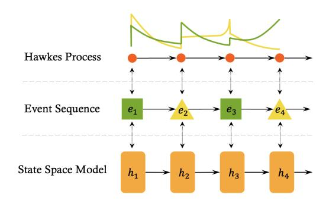
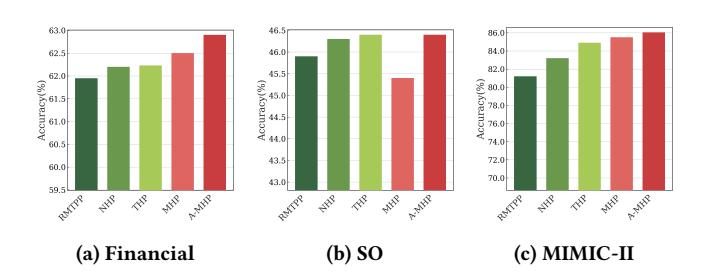
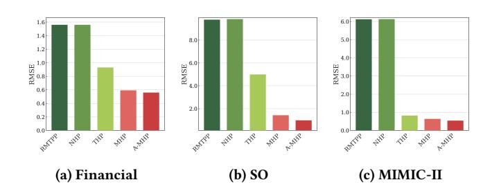
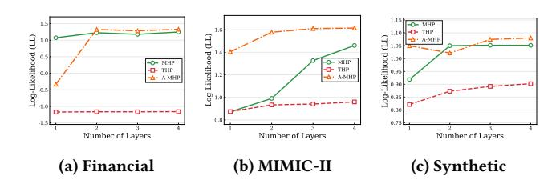

# Mamba Hawkes Process for Event Sequence Modeling

Shan Dai Shenzhen Research Institute of Big Data Shenzhen, China shandai@sribd.cn

Yuyang Shen The Chinese University of Hong Kong, Shenzhen Shenzhen, China yuyangshen889@gmail.com

Yuyang Liang The Chinese University of Hong Kong, Shenzhen Shenzhen, China yuyangliang@link.cuhk.edu.cn

Chenhao Ma∗ The Chinese University of Hong Kong, Shenzhen Shenzhen, China machenhao@cuhk.edu.cn

Anningzhe Gao∗ Shenzhen Research Institute of Big Data Shenzhen, China anningzhegao@gmail.com

# Abstract

Modeling asynchronous event sequences is crucial in numerous real-world applications such as healthcare monitoring, financial transaction analysis, and so on. Traditional temporal point processes, including Hawkes Processes, often fail to capture complex dependencies due to their parametric limitations. While neural approaches like RNNs and Transformers have improved flexibility, they struggle with computational inefficiency, and attention saturation. In this paper, we introduce the Mamba Hawkes Process (MHP), the first framework to integrate selective state space model (Mamba) with temporal point processes. MHP leverages time-varying state transitions and input-dependent gating to efficiently encode event history and capture long-term dependencies with linear complexity. Importantly, we provide theoretical guarantees showing that MHP generalizes both classical multi-exponential Hawkes processes and exponential-decay gated RNNs, underscoring its expressive power and theoretical soundness. To address the inherent constraints of pure state space models in handling heterogeneous event interactions, we further develop Adaptive Mamba Hawkes Process (A-MHP) that incorporates two novel mechanisms: a Time-Scaling Mechanism that adaptively weights time intervals based on event type and history, and a Dual-Channel State Transition that adaptively processes event content and temporal dynamics for more refined state updates. Extensive experiments on synthetic and realworld datasets demonstrate that MHP and A-MHP consistently outperform state-of-the-art baselines in event prediction tasks, particularly in long-sequence scenarios. Our work establishes a scalable and theoretically grounded paradigm for event sequence modeling, with practical implications for predictive maintenance, anomaly detection, and dynamic system analysis. The code is available at https://github.com/Ethan-Shen-Individual-Lab/Mamba-Hawkes-Process.

[This work is licensed under a Creative Commons Attribution 4.0 International License.](https://creativecommons.org/licenses/by/4.0) WWW '26, Dubai, United Arab Emirates © 2026 Copyright held by the owner/author(s). ACM ISBN 979-8-4007-2307-0/2026/04 <https://doi.org/10.1145/3774904.3792583>

## CCS Concepts

• Computing methodologies → Machine learning.

# Keywords

Asynchronous event, Hawkes Process, State Space Model, Timevarying State, Long-term dependency

### ACM Reference Format:

Shan Dai, Yuyang Shen, Yuyang Liang, Chenhao Ma, and Anningzhe Gao. 2026. Mamba Hawkes Process for Event Sequence Modeling. In Proceedings of the ACM Web Conference 2026 (WWW '26), April 13–17, 2026, Dubai, United Arab Emirates. ACM, New York, NY, USA, [10](#page-9-0) pages. [https://doi.org/10.1145/](https://doi.org/10.1145/3774904.3792583) [3774904.3792583](https://doi.org/10.1145/3774904.3792583)

# 1 Introduction

Large volumes of irregular and asynchronous event sequences are generated by both human activities and natural phenomena. Examples include user interactions on social media platforms [\[10,](#page-8-0) [36\]](#page-8-1), transaction histories in financial markets [\[1,](#page-8-2) [18\]](#page-8-3), electronic health records [\[32\]](#page-8-4), and earthquake occurrences with aftershocks in geophysics [\[29\]](#page-8-5). Unlike traditional sequential data such as time series, these asynchronous event sequences are characterized by irregular intervals between events, where the timing of events is as essential as their sequence order in describing underlying dynamics.

Temporal point processes (TPPs), defined by the intensity functions, are widely used for modeling asynchronous event sequences [\[3,](#page-8-6) [5\]](#page-8-7). Among TPPs, Hawkes Processes are particularly noteworthy for their non-negative intensity functions that capture the triggering effects of previous events. However, traditional Hawkes Processes have significant limitations. They do not account for mutual inhibition between events, a crucial factor in many real-world scenarios, and they lack robust nonlinear fitting capabilities, thereby limiting their expressive power. To address these limitations, researchers have introduced likelihood-free methods [\[24,](#page-8-8) [33\]](#page-8-9) and also

non-parametric approaches like kernel methods and splines [\[41\]](#page-8-10). The advancement of neural networks and deep learning has revolutionized sequence modeling. [\[9\]](#page-8-11) introduced RNN-based Hawkes process models, enabling neurally self-modulating point processes and capturing complex memory effects. However, RNNs, even with LSTM [\[19\]](#page-8-12) and GRU [\[4\]](#page-8-13), struggle with long-term dependencies due to vanishing and exploding gradients [\[30\]](#page-8-14). To overcome this, [\[42\]](#page-8-15) proposed the Transformer Hawkes Process (THP), which

∗Corresponding authors.

Figure 1: SSM is naturally aligned with the Hawkes Process

avoids RNN/CNN structures and achieves better performance. Yet, attention-based transformers also face challenges in modeling very long sequences, as their finite attention windows limit long-range dependency capture [\[12\]](#page-8-16).

Recently, structured state space sequence models (SSMs) [\[15\]](#page-8-17) have emerged as a powerful paradigm for modeling long sequences with continuous dynamics. The Mamba model [\[13\]](#page-8-18), a selective SSM, introduces data-dependent context compression by updating hidden states through a continuous transition kernel that controls how past information decays or persists over time. This mechanism closely parallels temporal point processes (TPPs), where each event modulates a continuous conditional intensity function. In both frameworks, the latent dynamics evolve between events and are updated upon event occurrences. Consequently, selective SSMs like Mamba offer a natural neural parameterization for temporal point processes (Figure [1\)](#page-1-0).

However, adapting Mamba to model Hawkes Processes introduces several theoretical and practical challenges. First, Mamba and other SSMs are typically designed for regularly sampled sequences, whereas Hawkes Processes operate on irregular, event-driven timelines, thereby requiring the state transitions of SSMs to be redefined to adapt to non-uniform event arrivals. Second, Mamba's linear state space formulation, while computationally efficient, limits its ability to represent nonlinear interactions common in real-world event dynamics. Third, while Mamba excels at capturing long-range dependencies, its selective scanning mechanism may overlook sparse but critical long-term excitatory or inhibitory effects in TPPs, such as delayed reactions in social contagion [\[8\]](#page-8-19). To address these challenges, we propose a novel Mamba Hawkes Process (MHP) model that integrates Mamba's selective state space framework with Hawkes Processes. Beyond this intuitive alignment, we provide theoretical guarantees that substantiate the connection between Mamba and temporal point processes. Specifically, we prove that the proposed MHP can be degraded into a multi-exponential Hawkes process as well as an exponential-decay gated RNN in Section [4.3.](#page-4-0)

While MHP establishes a principled foundation, its state transition nature and fixed temporal scaling limit its expressive power in capturing heterogeneous event interactions in sequences. To overcome these limitations, we further propose the Adaptive Mamba Hawkes Process (A-MHP), an extended framework that enhances the expressiveness of MHP by introducing adaptive temporal processing and dual embedding transitions to better capture heterogeneous event dynamics.

Contributions. Building on these innovations, the main contributions of this work are summarized as follows:

- Constructive Integration of Mamba into Temporal Point Processes. To the best of our knowledge, this is the inaugural work to adapt the Mamba state space model for temporal point processes, enabling efficient event history encoding and improved long-term dependency modeling beyond RNNs and Transformers. Importantly, we provide theoretical foundations proving that MHP can be reduced to multi-exponential Hawkes Processes and exponential-decay gated RNNs under specific configurations. This alignment not only validates the design of MHP but also highlights its generality and expressive capacity in capturing complex temporal dynamics.
- Adaptive Temporal Modeling with Dual Innovations. To address the inherent constraints of a state space model in handling heterogeneous event interactions, we develop A-MHP, which introduces two key mechanisms- Time-Scaling for adaptive temporal processing across event types, and Dual-Channel State Transition for content-dependent and time-dependent embedding computation, addressing limitations of MHP and enhancing event prediction accuracy.
- Comprehensive Experiment Validation and Practical Impact. We conducted extensive experiments on both synthetic and real-world datasets to assess the effectiveness of MHP and A-MHP , which consistently outperform state-ofthe-art baselines in both event type and timing and enable more accurate event prediction in practical applications.

# 2 Related Work

## 2.1 Neural Hawkes Process

Hawkes processes are widely used for temporal prediction in various fields. To enhance their performance, many deep learning approaches have been applied. The Recurrent Marked Temporal Point Process (RMTPP) [\[9\]](#page-8-11) employs RNNs to model the influence of event history on intensity functions. RMTPP inspired subsequent models that use dual RNNs, one for background intensity and another for the impact of historical events, enabling end-to-end sequence modeling [\[34\]](#page-8-20). Continuous-time LSTM models [\[27\]](#page-8-21) extend RMTPP by capturing self-modulating effects, addressing both excitation and inhibition from previous events.

With the development of self-attention mechanisms, self-attentionbased neural Hawkes processes were proposed. SAHP [\[39\]](#page-8-22) utilized self-attention to enhance these processes, while THP [\[42\]](#page-8-15) used the transformer encoder to convert sequence data into continuous conditional intensity functions. UTHP [\[37\]](#page-8-23) incorporated RNNs and CNNs to address issues in THP, such as parallel processing and recursive learning. TAA-THP [\[38\]](#page-8-24) improved attention structures by incorporating temporal encoding. Lastly, [\[35\]](#page-8-25) proposed Hawkesformer, linking hierarchical attention mechanisms to Hawkes processes for information cascade prediction.

## 2.2 State Space Model

State space models (SSMs) were initially developed as mathematical tools to describe dynamic systems in modern control theory. With the introduction of HiPPO [\[14\]](#page-8-26) initialization, the Linear State-Space

and Root Mean Square Error (Figure [3\)](#page-6-2) for event time prediction across five datasets. In what follows, we dive into a nuanced analysis of these results, examining the architectural and mechanistic advantages of our models.

Architectural Evolution Directly Drives Performance Gains. The progression of model performance from RMTPP, through SAHP and THP, to our proposed MHP/A-MHP reflects a clear architectural evolution in temporal point process modeling. RMTPP, grounded in a simple recurrent neural network, is constrained by recurrent bottlenecks, which hinder its ability to capture long-range and complex event dependencies. SAHP, introducing self-attention, allows the model to directly account for all historical events and yields notable improvements on metrics such as LL and RMSE. Continued with THP, which adopts the full Transformer architecture. Its superior performance, particularly in LL, highlights the effectiveness of multi-head self-attention in modeling global dependencies across entire event sequences. Collectively, these developments emphasize the central role of attention mechanisms in temporal point processes, while also revealing the scalability limitations of softmax-based attention that our model is designed to overcome.

Table 1: Log-Likelihood result of all baseline methods across five datasets.

| Method  | Financial | SO    | Synthetic | Retweet | MIMIC-II |
|---------|-----------|-------|-----------|---------|----------|
| RMTPP   | -3.89     | -2.60 | -1.33     | -5.99   | -1.35    |
| NHP     | -3.60     | -2.55 |           | -5.60   | -1.38    |
| SAHP    |           | -1.86 | 0.59      | -4.56   | -0.52    |
| THP     | -1.11     | -0.04 | 0.79      | -2.04   | 0.48     |
| AttnTPP | -4.26     | -2.97 | -1.20     | -5.99   | -1.05    |
| MHP     | 1.25      | 0.40  | 1.05      | 0.83    | 1.46     |
| A-MHP   | 1.33      | 0.42  | 1.08      | 1.07    | 1.62     |

Mamba Architecture Excels in Long-Range and Variable-Length Dependency Modeling. MHP and A-MHP demonstrate superior performance on datasets characterized by long and highly variable sequence lengths. While attention mechanisms can struggle with context dilution in highly variable-length sequences, the SSM's hidden state provides a continuous, fixed-size representation of the entire event history. This design makes the model's context processing inherently invariant to sequence length and resolution, allowing it to generalize seamlessly from short to extremely long sequences without performance degradation. This is evidenced by the substantial gains in LL and Acc on the Financial dataset and Retweet dataset. Furthermore, the low standard deviation of the Synthetic and MIMIC-II datasets explains why models perform reasonably well there, as the temporal patterns are more consistent.

Performance Margins Depend on Dataset Complexity. On datasets with fewer event types and shorter sequences, such as Synthetic, the relative improvements of our models over strong baselines are less pronounced. In these simpler settings, most modern architectures can capture the limited temporal variability with reasonable accuracy, which narrows the performance margins. By contrast, in more complex datasets like Financial, which involve long-range dependencies and heterogeneous event dynamics, the

Figure 2: Accuracy comparison on three datasets.

Figure 3: RMSE comparison on three datasets.

advantages of MHP and particularly A-MHP become much more evident.

Overall Superiority of MHP and A-MHP. Taken together, these results consistently show that A-MHP achieves the best overall performance across all datasets and metrics, with MHP also performing competitively. This confirms that the proposed architecture not only overcomes the limitations of existing approaches but also generalizes robustly across diverse temporal domains.

### 6.3 MHP V.S. THP

To further highlight the strengths of the proposed model, we conduct a direct comparison with the transformer-based THP model. We focus on two key dimensions: (i) Efficiency, which measures computational throughput across datasets, and (ii) Effectiveness, which evaluates predictive performance and model scalability.

6.3.1 Efficiency. To assess the efficiency of the proposed MHP against the Transformer-based THP, we report throughput (events per second) and relative speedup across five benchmark datasets (Table [6](#page-9-4) in the appendix). Overall, MHP achieves consistently higher training throughput, with the most significant gains observed on the Financial and Retweet datasets, where the speedup reaches 4.36× and 6.20×, respectively. This improvement stems from the architectural advantages of the Mamba backbone: unlike Transformers, which rely on quadratic self-attention operations, Mamba employs selective state-space dynamics with linear-time complexity. This design substantially reduces computational overhead, particularly in handling long or irregular event sequences.

6.3.2 Effectiveness. To elucidate the inherent architectural advantages of proposed models, Figure [4](#page-7-0) compares the scaling behaviors of MHP and A-MHP against THP, using network depth (1–4 layers) as a controlled variable to assess performance progression. As revealed by the results, all models exhibit performance gains

Table 2: Ablation study results on the Dual-Channel and Time-Scaling components.

| Method  | LL     | Financial Acc | RMSE   | LL     | SO Acc  | RMSE   | LL     | Synthetic Acc | RMSE   | LL     | Retweet Acc | RMSE   | LL     | MIMIC-II Acc | RMSE   |
|---------|--------|---------------|--------|--------|---------|--------|--------|---------------|--------|--------|-------------|--------|--------|--------------|--------|
| MHP     | 1.2469 | 0.6245        | 0.5956 | 0.3967 | 0.4539  | 1.4275 | 1.0516 | 0.3813        | 0.1817 | 0.8285 | 0.5605      | 5.4275 | 1.4607 | 0.8550       | 0.6353 |
| DC      | 1.3153 | 0.6276        | 0.5868 | 0.4131 | 0.4639  | 1.3335 | 1.0748 | 0.3813        | 0.1861 | 1.0514 | 0.6086      | 5.5523 | 1.5959 | 0.8514       | 0.6083 |
| TS      | 1.3250 | 0.6283        | 0.5883 | 0.4154 | 0.46284 | 1.1061 | 1.0682 | 0.3813        | 0.2016 | 1.0426 | 0.6080      | 5.5523 | 1.6056 | 0.8572       | 0.5511 |
| DC + TS | 1.3272 | 0.6290        | 0.5631 | 0.4233 | 0.4646  | 0.9835 | 1.0825 | 0.3813        | 0.1995 | 1.0708 | 0.6086      | 5.5523 | 1.6181 | 0.8605       | 0.5400 |

Figure 4: Performance of MHP, THP, and A-MHP across different layer counts, evaluated by Log-Likelihood.

with increasing layers, confirming the fundamental importance of network depth for capturing complex temporal dependencies. While THP improves slightly with increasing depth, its rate of growth quickly plateaus, indicating that its ability to leverage additional layers is limited due to its pure reliance on the Transformer architecture. In contrast, MHP and A-MHP exhibit stronger depth scalability, enabling them to more effectively model complex dependencies as the network becomes deeper.

### 6.4 Ablation Study

To validate the contribution of each proposed mechanism, we design two ablation variants that isolate individual components of A-MHP (Table [2\)](#page-7-1):

MHP+Time-Scaling (TS): Retains the complete time-scaling mechanism in [\(23\)](#page-4-3) but uses simple linear projection for state transition. The scaled time intervals Δ ′ �� are used throughout SSM computations, and time predictions are divided by scaling factors.

MHP+Dual-Channel (DC): Implements the dual-channel state transition in [\(25\)](#page-5-0) but removes time scaling entirely. Original time intervals �� are used in SSM, and time predictions are computed directly without scaling adjustments.

6.4.1 Individual Effectiveness of DC and TS. Both the DC and TS mechanisms individually contribute to performance improvements over the MHP model across most datasets and evaluation metrics. The DC variant shows consistent gains in LL and Acc, particularly evident in the Retweet dataset, where the Acc improves from 56.05% to 60.86%. The TS variant, on the other hand, delivers more pronounced improvements in time prediction accuracy, as seen by the lower RMSE on SO and MIMIC-II. This confirms its role in adapting to multi-timescale dynamics through resolution-aware interval scaling.

6.4.2 Complementary Nature and Synergistic Effects. The full A-MHP model achieves the best overall performance, frequently surpassing either variant used alone. This indicates that the two components are largely complementary. For instance, on the Financial dataset, while both DC and TS individually achieve an LL of 1.3153 and 1.3250, respectively, their combination pushes the performance further to 1.3272 while also yielding the best RMSE. This synergy suggests that the benefits of refined state transition (DC) and adaptive time representation (TS) can be effectively combined.

On the Synthetic and Retweet datasets, MHP alone performs best while additional modules do not yield further gains, and the metrics (ACC/RMSE) show repeated values due to rounding. This can be attributed to the simplicity of these datasets, as they involve fewer event types and relatively short sequences, reducing the benefit of additional modeling complexity.

### 7 Conclusion

In this work, we proposed the Mamba Hawkes Process (MHP), a novel model that integrates the selective state space framework of Mamba with temporal point processes to efficiently capture longrange dependencies in asynchronous event sequences with linear complexity. Theoretically, MHP generalizes classical Hawkes processes and certain neural point processes, providing a unified modeling perspective. We further introduced A-MHP, which enhances adaptability through a Time-Scaling Mechanism and Dual-Channel State Transition, enabling more nuanced handling of heterogeneous event dynamics. Extensive experiments across synthetic and realworld datasets demonstrate that MHP and A-MHP consistently outperform state-of-the-art baselines in both event type and time prediction, with particularly strong performance on long sequences. This work establishes a foundational integration of state space models into TPPs and opens avenues for future extensions, such as spatiotemporal modeling, causal interpretability, and resource-efficient deployment.

### Acknowledgments

This work was partially supported by Shenzhen Science and Technology Program under Grant RCBS20221008093331068, NSFC under Grant 62302421, Basic and Applied Basic Research Fund in Guangdong Province under Grant 2025A1515010439, and the Guangdong Provincial Key Laboratory of Big Data Computing, The Chinese University of Hong Kong, Shenzhen.

References [1] Emmanuel Bacry, Iacopo Mastromatteo, and Jean-François Muzy. 2015. Hawkes processes in finance. Market Microstructure and Liquidity 1, 01 (2015), 1550005. [2] Wonho Bae, Mohamed Osama Ahmed, Frederick Tung, and Gabriel L Oliveira. 2023. Meta Temporal Point Processes. In The International Conference on Learning Representations (ICLR). [3] David R Brillinger, Peter M Guttorp, Frederic Paik Schoenberg, Abdel H El-Shaarawi, and Walter W Piegorsch. 2002. Point processes, temporal. Encyclopedia of environmetrics 3 (2002), 1577–1581. [4] Junyoung Chung, Caglar Gulcehre, KyungHyun Cho, and Yoshua Bengio. 2014. Empirical Evaluation of Gated Recurrent Neural Networks on Sequence Modeling. arXiv preprint arXiv:1412.3555 (2014).<https://arxiv.org/abs/1412.3555> [5] David Roxbee Cox and Valerie Isham. 1980. Point processes. Vol. 12. CRC Press. [6] Daryl J Daley and David Vere-Jones. 2007. An introduction to the theory of point processes: volume II: general theory and structure. Springer Science & Business Media. [7] Daryl J Daley, David Vere-Jones, et al. 2003. An introduction to the theory of point processes: volume I: elementary theory and methods. Springer. [8] Xiao Ding, Jihao Shi, Junwen Duan, Bing Qin, and Ting Liu. 2021. Quantifying the effects of long-term news on stock markets on the basis of the multikernel Hawkes process. Science China Information Sciences 64, 9 (2021), 192102. [9] Nan Du, Hanjun Dai, Rakshit Trivedi, Utkarsh Upadhyay, Manuel Gomez-Rodriguez, and Le Song. 2016. Recurrent marked temporal point processes: Embedding event history to vector. In Proceedings of the 22nd ACM SIGKDD international conference on knowledge discovery and data mining. 1555–1564. [10] Guanhua Fang, Ganggang Xu, Haochen Xu, Xuening Zhu, and Yongtao Guan. 2023. Group network Hawkes process. J. Amer. Statist. Assoc. (2023), 1–17. [11] Daniel Y Fu, Tri Dao, Khaled K Saab, Armin W Thomas, Atri Rudra, and Christopher Ré. 2022. Hungry hungry hippos: Towards language modeling with state space models. arXiv preprint arXiv:2212.14052 (2022). [12] Anningzhe Gao and Shan Dai. 2024. RoTHP: Rotary Position Embedding-based Transformer Hawkes Process. arXiv preprint arXiv:2405.06985 (2024). [13] Albert Gu and Tri Dao. 2023. Mamba: Linear-time sequence modeling with selective state spaces. arXiv preprint arXiv:2312.00752 (2023). [14] Albert Gu, Tri Dao, Stefano Ermon, Atri Rudra, and Christopher Ré. 2020. Hippo: Recurrent memory with optimal polynomial projections. Advances in neural information processing systems 33 (2020), 1474–1487. [15] Albert Gu, Karan Goel, and Christopher Ré. 2021. Efficiently modeling long sequences with structured state spaces. arXiv preprint arXiv:2111.00396 (2021). [16] Albert Gu, Isys Johnson, Karan Goel, Khaled Saab, Tri Dao, Atri Rudra, and Christopher Ré. 2021. Combining recurrent, convolutional, and continuous-time models with linear state space layers. Advances in neural information processing systems 34 (2021), 572–585. [17] Alan G Hawkes. 1971. Spectra of some self-exciting and mutually exciting point processes. Biometrika 58, 1 (1971), 83–90. [18] Alan G Hawkes. 2018. Hawkes processes and their applications to finance: a review. Quantitative Finance 18, 2 (2018), 193–198. [19] Sepp Hochreiter and Jürgen Schmidhuber. 1997. Long short-term memory. Neural computation 9, 8 (1997), 1735–1780. [20] Alistair EW Johnson, Tom J Pollard, Lu Shen, Li-wei H Lehman, Mengling Feng, Mohammad Ghassemi, Benjamin Moody, Peter Szolovits, Leo Anthony Celi, and Roger G Mark. 2016. MIMIC-III, a freely accessible critical care database. Scientific data 3, 1 (2016), 1–9. [21] Diederik P Kingma and Jimmy Ba. 2014. Adam: A method for stochastic optimization. arXiv preprint arXiv:1412.6980 (2014). [22] Patrick J Laub, Thomas Taimre, and Philip K Pollett. 2015. Hawkes processes. arXiv preprint arXiv:1507.02822 (2015). [23] Jure Leskovec and Rok Sosič. 2016. Snap: A general-purpose network analysis and graph-mining library. ACM Transactions on Intelligent Systems and Technology (TIST) 8, 1 (2016), 1–20. [24] Shuang Li, Shuai Xiao, Shixiang Zhu, Nan Du, Yao Xie, and Le Song. 2018. Learning temporal point processes via reinforcement learning. Advances in neural information processing systems 31 (2018). [25] Opher Lieber, Barak Lenz, Hofit Bata, Gal Cohen, Jhonathan Osin, Itay Dalmedigos, Erez Safahi, Shaked Meirom, Yonatan Belinkov, Shai Shalev-Shwartz, et al. 2024. Jamba: A hybrid transformer-mamba language model. arXiv preprint arXiv:2403.19887 (2024). [26] Harsh Mehta, Ankit Gupta, Ashok Cutkosky, and Behnam Neyshabur. 2022. Long Range Language Modeling via Gated State Spaces. In The Eleventh International Conference on Learning Representations. [27] Hongyuan Mei and Jason M Eisner. 2017. The neural hawkes process: A neurally self-modulating multivariate point process. Advances in neural information processing systems 30 (2017). [28] Eric Nguyen, Michael Poli, Marjan Faizi, Armin Thomas, Michael Wornow, Callum Birch-Sykes, Stefano Massaroli, Aman Patel, Clayton Rabideau, Yoshua Bengio, et al. 2024. Hyenadna: Long-range genomic sequence modeling at single nucleotide resolution. Advances in neural information processing systems 36 (2024). [29] Yosihiko Ogata. 1998. Space-time point-process models for earthquake occurrences. Annals of the Institute of Statistical Mathematics 50 (1998), 379–402. [30] Razvan Pascanu, Tomas Mikolov, and Yoshua Bengio. 2013. On the difficulty of training recurrent neural networks. In International conference on machine learning. Pmlr, 1310–1318. [31] Bo Peng, Eric Alcaide, Quentin Gregory Anthony, Alon Albalak, Samuel Arcadinho, Stella Biderman, Huanqi Cao, Xin Cheng, Michael Nguyen Chung, Leon Derczynski, et al. 2023. RWKV: Reinventing RNNs for the Transformer Era. In The 2023 Conference on Empirical Methods in Natural Language Processing. [32] Lu Wang, Wei Zhang, Xiaofeng He, and Hongyuan Zha. 2018. Supervised reinforcement learning with recurrent neural network for dynamic treatment recommendation. In Proceedings of the 24th ACM SIGKDD international conference on knowledge discovery & data mining. 2447–2456. [33] Shuai Xiao, Mehrdad Farajtabar, Xiaojing Ye, Junchi Yan, Le Song, and Hongyuan Zha. 2017. Wasserstein learning of deep generative point process models. Advances in neural information processing systems 30 (2017). [34] Shuai Xiao, Junchi Yan, Xiaokang Yang, Hongyuan Zha, and Stephen Chu. 2017. Modeling the intensity function of point process via recurrent neural networks. In Proceedings of the AAAI conference on artificial intelligence, Vol. 31. [35] Liu Yu, Xovee Xu, Goce Trajcevski, and Fan Zhou. 2022. Transformer-enhanced Hawkes process with decoupling training for information cascade prediction. Knowledge-Based Systems 255 (2022), 109740. [36] Jingfei Zhang, Biao Cai, Xuening Zhu, Hansheng Wang, Ganggang Xu, and Yongtao Guan. 2023. Learning Human Activity Patterns Using Clustered Point Processes With Active and Inactive States. Journal of business & economic statistics 41, 2 (2023), 388–398. [37] Lu-ning Zhang, Jian-wei Liu, Zhi-yan Song, and Xin Zuo. 2021. Universal transformer Hawkes process with adaptive recursive iteration. Engineering Applications of Artificial Intelligence 105 (2021), 104416. [38] Lu-ning Zhang, Jian-wei Liu, Zhi-yan Song, and Xin Zuo. 2022. Temporal attention augmented transformer Hawkes process. Neural Computing and Applications (2022), 1–15. [39] Qiang Zhang, Aldo Lipani, Omer Kirnap, and Emine Yilmaz. 2020. Self-attentive Hawkes process. In International conference on machine learning. PMLR, 11183– 11193. [40] Qingyuan Zhao, Murat A Erdogdu, Hera Y He, Anand Rajaraman, and Jure Leskovec. 2015. Seismic: A self-exciting point process model for predicting tweet popularity. In Proceedings of the 21th ACM SIGKDD international conference on knowledge discovery and data mining. 1513–1522. [41] Ke Zhou, Hongyuan Zha, and Le Song. 2013. Learning triggering kernels for multi-dimensional hawkes processes. In International conference on machine learning. PMLR, 1301–1309. [42] Simiao Zuo, Haoming Jiang, Zichong Li, Tuo Zhao, and Hongyuan Zha. 2020. Transformer hawkes process. In International conference on machine learning. PMLR, 11692–11702.

| Info       | Financial | SO   | Synthetic | Retweet | MIMIC-II |
|------------|-----------|------|-----------|---------|----------|
| Len (Avg.) | 2074.0    | 72.4 | 60.3      | 108.8   | 3.7      |
| Len (Std.) | 1245.0    | 43.7 | 23.1      | 54.4    | 2.3      |
| #Type      | 2         | 22   | 5         | 3       | 75       |

| Dataset   | THP      | MHP      |      | Speedup |
|-----------|----------|----------|------|---------|
| Financial | 1167.40  | 5088.59  | 4.36 | ×       |
| SO        | 20203.13 | 21608.38 | 1.07 | ×       |
| Synthetic | 8064.19  | 15562.60 | 1.93 | ×       |
| Retweet   | 12733.84 | 78983.22 | 6.20 | ×       |
| MIMIC-II  | 302.12   | 494.26   | 1.64 | ×       |