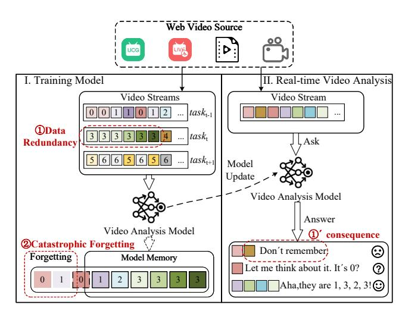
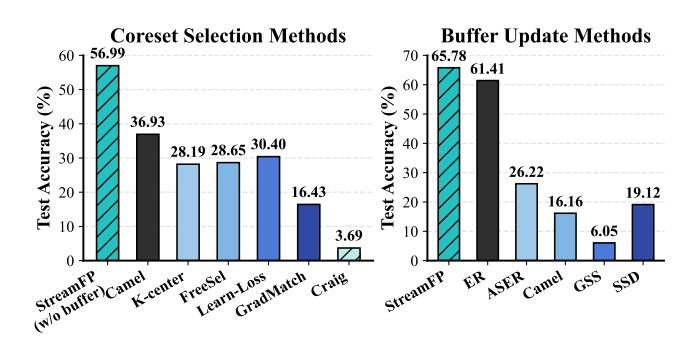
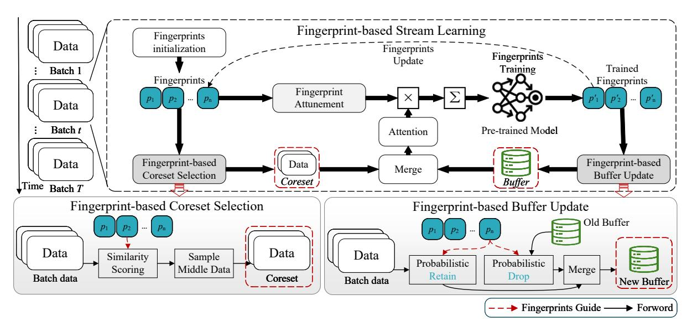
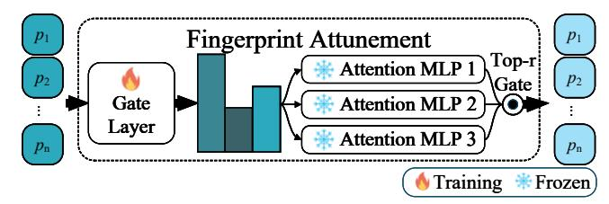
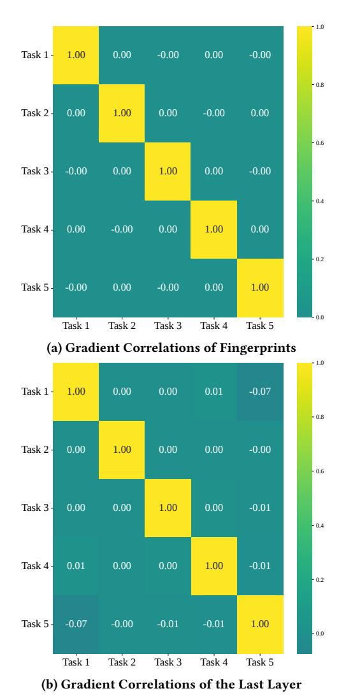
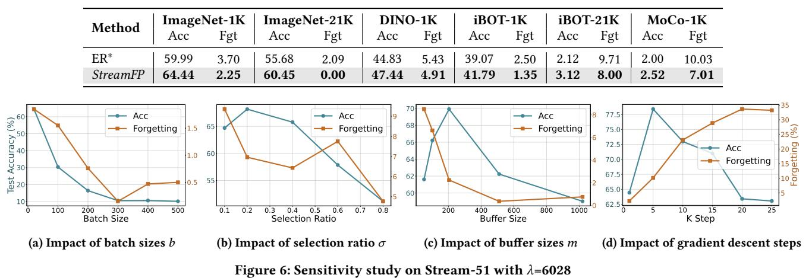

# StreamFP: Fingerprint-guided Data Selection for Efficient Stream Learning

[Changwu Li](https://orcid.org/0000-0002-1407-8875)∗† Huazhong University of Science and Technology Wuhan, China changwu\_li@hust.edu.cn

[Tongjun Shi](https://orcid.org/0009-0004-9058-5299)∗ Futu Holdings Limited Shenzhen, China tongjunshihhh@gmail.com

[Shuhao Zhang](https://orcid.org/0000-0002-9927-6925)†‡ Huazhong University of Science and Technology Wuhan, China shuhao\_zhang@hust.edu.cn

[Binbin Chen](https://orcid.org/0000-0002-9584-0082) Singapore University of Technology and Design Singapore, Singapore binbin\_chen@sutd.edu.sg

[Bingsheng He](https://orcid.org/0000-0001-8618-4581) National University of Singapore Singapore, Singapore hebs@comp.nus.edu.sg

[Xiaofei Liao](https://orcid.org/0000-0001-6302-813X)† Huazhong University of Science and Technology Wuhan, China xfliao@hust.edu.cn

[Hai Jin](https://orcid.org/0000-0002-3934-7605)† Huazhong University of Science and Technology Wuhan, China hjin@hust.edu.cn

# Abstract

Modern web applications—ranging from personalized recommendation to real-time fraud detection—rely on AI models to deliver timely and personalized services, yet the underlying user interaction data arrives as massive and evolving streams. Stream Learning (SL) offers a natural paradigm for building adaptive models, but it struggles with challenges such as redundant training data and catastrophic forgetting, which can undermine long-term predictive performance. To address these issues, recent studies have explored data selection strategies like coreset selection and buffer update, typically implemented through rule-based or model-based methods. However, fixed selection rules hinder the adaptability of rule-based approaches to changing data distributions, while model-based methods often depend on costly per-sample gradients, leading to throttled updates and reduced coverage of informative samples. In this paper, we propose StreamFP, a lightweight SL framework that introduces fingerprints—a set of compact, learnable parameter vectors that summarize the model state. Fingerprints compute similarity scores to jointly guide coreset selection and buffer update, prioritizing informative incoming samples while retaining representative historical ones. A lightweight fingerprint attunement plugin

[This work is licensed under a Creative Commons Attribution 4.0 International License.](https://creativecommons.org/licenses/by/4.0) WWW '26, Dubai, United Arab Emirates.

© 2026 Copyright held by the owner/author(s). ACM ISBN 979-8-4007-2307-0/2026/04 <https://doi.org/10.1145/3774904.3792584>

further calibrates fingerprints using pre-trained ViT attention with negligible overhead, thereby improving accuracy while mitigating forgetting. Extensive experiments demonstrate that StreamFP consistently achieves superior accuracy and efficiency compared with state-of-the-art methods across diverse real-world datasets and varying data arrival rates.

# CCS Concepts

### • Computing methodologies → Online learning settings.

### Keywords

Stream Learning, Data Selection, Learnable Fingerprints

### ACM Reference Format:

Changwu Li, Tongjun Shi, Shuhao Zhang, Binbin Chen, Bingsheng He, Xiaofei Liao, and Hai Jin. 2026. StreamFP: Fingerprint-guided Data Selection for Efficient Stream Learning. In Proceedings of the ACM Web Conference 2026 (WWW '26), April 13–17, 2026, Dubai, United Arab Emirates. ACM, New York, NY, USA, [11](#page-10-0) pages.<https://doi.org/10.1145/3774904.3792584>

### Resource Availability:

The source code of this paper has been made publicly available at [https:](https://doi.org/10.5281/zenodo.18368473) [//doi.org/10.5281/zenodo.18368473.](https://doi.org/10.5281/zenodo.18368473)

# 1 Introduction

Real-time web video applications—such as user-generated content platforms and live streaming services—rely on AI models to analyze continuously arriving video streams. As illustrated in Figure [1,](#page-1-0) these streams are highly non-stationary and introduce two fundamental challenges for Stream Learning (SL). First, incoming batches often contain substantial redundancy (e.g., near-duplicate frames or static segments), which wastes computation, biases model updates toward frequent patterns, and under-represents rare but informative samples, ultimately reducing analysis accuracy. Second,

∗Both authors contribute equally to this research.

†Also with National Engineering Research Center for Big Data Technology and System, Service Computing Technology and System Lab, Cluster and Grid Computing Lab, School of Computer Science and Technology.

Shuhao Zhang is the corresponding author (shuhao\_zhang@hust.edu.cn).

Figure 1: Illustration of a real-time web video analysis scenario for stream learning. Web video sources (e.g., UGC, live streams) produce non-stationary streams that are mini-batched for both model training (left) and online inference (right). On the training side, two challenges arise: (①) data redundancy, where consecutive batches contain many near-duplicate frames, and (②) catastrophic forgetting, where incremental updates overwrite earlier knowledge in memory. On the inference side, these issues manifest as (①') degraded predictions, where the model may fail to recall past knowledge or provide inconsistent answers.

frequent distribution shifts mean that incremental updates for new scenarios can overwrite earlier knowledge, eroding previously learned representations and leading to catastrophic forgetting [\[10\]](#page-8-0). Addressing data redundancy and knowledge preservation is therefore essential for effective SL in real-time video analysis.

A common strategy to mitigate these challenges in SL is data selection, which typically involves coreset selection and buffer update. Coreset selection identifies representative subsets from incoming batches, enabling efficient adaptation to evolving distributions while reducing redundant computation [\[16\]](#page-8-1). Buffer update maintains a small set of representative past samples, dynamically replacing them with new ones and replaying the buffer during training to alleviate forgetting [\[3\]](#page-8-2). To realize these two techniques, prior studies have adopted either rule-based or modelbased approaches [\[2,](#page-8-3) [6,](#page-8-4) [11,](#page-8-5) [15,](#page-8-6) [16,](#page-8-1) [20,](#page-8-7) [25,](#page-8-8) [26,](#page-8-9) [34,](#page-8-10) [35\]](#page-8-11).

As shown in Figure [2,](#page-1-1) existing coreset selection and buffer update methods fall short in real-time SL. For coreset selection, the test accuracy of representative rule-based approaches (Camel [\[16\]](#page-8-1), K-center [\[25\]](#page-8-8), FreeSel [\[34\]](#page-8-10)) and model-based approaches (GradMatch [\[15\]](#page-8-6), Learn-Loss [\[35\]](#page-8-11), Craig [\[20\]](#page-8-7)) remains below 40%, far behind our proposed StreamFP. For buffer update, ER [\[6\]](#page-8-4) with predefined rules reaches 61.41%, but still trails StreamFP, while other baselines perform even worse. The reasons are twofold. (1) Rule-based methods [\[34\]](#page-8-10) rely on fixed sampling and replacement rules, which fail to adapt to distribution shifts and sample informativeness, leading to redundant coresets and

Figure 2: For the Stream-51 dataset with an arrival rate of 6,028 images per second, the test accuracy is evaluated across coreset selection and buffer update methods. Left: In coreset selection, StreamFP outperforms rule-based methods (Camel [\[16\]](#page-8-1), K-center [\[25\]](#page-8-8), FreeSel [\[34\]](#page-8-10)) and model-based methods (GradMatch [\[15\]](#page-8-6), Learn-Loss [\[35\]](#page-8-11), Craig [\[20\]](#page-8-7)). Right: In buffer update, StreamFP surpasses rule-based methods (ER [\[6\]](#page-8-4), ASER [\[26\]](#page-8-9), Camel [\[16\]](#page-8-1)) and model-based methods (GSS [\[2\]](#page-8-3), and SSD [\[11\]](#page-8-5)).

low-quality buffers. (2) Model-based methods [\[11\]](#page-8-5) require persample gradients to construct gradient-aware coresets and update buffers. This computation is costly, slowing down updates and reducing coverage of informative samples, which in turn lowers accuracy. Therefore, neither rule-based nor model-based methods can simultaneously achieve efficient data selection and robust adaptation to distribution shifts in SL.

In this paper, we propose StreamFP, a lightweight SL framework designed to enable efficient data selection and knowledge retention under non-stationary streams. StreamFP introduces two fingerprintguided data selection strategies augmented by a lightweight fingerprint attunement plugin. Inspired by fingerprint-based continual learning methods such as CODA-Prompt [\[27\]](#page-8-12), we replace fixed rules and gradient-intensive selection with compact, dynamic, and learnable fingerprints that serve as model state summaries to track distribution shifts and guide data selection. This design improves predictive performance while mitigating catastrophic forgetting, with negligible computational overhead.

Concretely, StreamFP consists of three key modules. First, fingerprint-based coreset selection selects a compact and informative subset from each incoming batch, focusing computation on high-value samples while adapting to the current distribution. Second, fingerprint-based buffer update preserves representative past samples for replay, helping the model retain prior knowledge and reduce forgetting. Both modules are guided by a shared set of learnable fingerprints that co-evolve with the model and provide a unified signal for adaptive coreset construction and balanced buffer maintenance. Third, a lightweight fingerprint attunement plugin refines fingerprints online using pre-trained attention, further stabilizing their guidance with negligible overhead. In this work, StreamFP is instantiated with ViT [\[9\]](#page-8-13) for incremental classification tasks, and can be readily extended to other Transformer architectures such as CLIP [\[21\]](#page-8-14) and LLaMA [\[28\]](#page-8-15).

In summary, our contributions are as follows:

- We propose StreamFP, a fingerprint-guided framework for incremental classification tasks over non-stationary data

Figure 3: Our StreamFP centers on two data-management components: Fingerprint-based Coreset Selection (FCS) and Fingerprint-based Buffer Update (FBU). The workflow operates as follows: (1) Before training, FCS selects coreset data and integrates it with buffer samples for the training process; (2) Post-training, the system leverages these refined fingerprints to perform FBU. Building on these components, StreamFP adds a lightweight Fingerprint Attunement (FA) to further stabilize representations and improve streaming performance.

Figure 4: The structure of the fingerprint attunement plugin

probability to items with lower similarity, which prioritizes diverse samples and strengthens coverage of novel information. The formal representation of this process is:

��batch = S(�� �� , ��batch,���� ), ��buffer = S(�� ��−1 , ��buffer,���� ). (8)

Let S(�� , ��,���� ) denote probabilistic sampling that selects �� �� items from batch �� according to the distribution ��. The buffer update writes the retained batch indices into the positions of the discarded buffer indices, i.e., M [��buffer] ← �� [��batch]. This operation maintains a dynamic, diversity-aware buffer that remains relevant throughout SL.

### 5 Fingerprint Attunement (FA): A Lightweight Plugin Refinement

FA is a lightweight plug-in that leverages pre-trained ViT attention to perform online calibration of the learnable fingerprints, improving data selection efficiency and model adaptation in streaming settings, as illustrated in Figure [4.](#page-4-3)

The core of FA is the lightweight dual-module design. (1) Gating layer assigns weights to each expert based on its contribution to fingerprint generation, and selects the top-r experts with the highest weights to guide subsequent optimization. (2) �� attention-MLP experts, initialized from the layers of ViT, refine the fingerprints by leveraging their attention mechanism to extract meaningful features. Only the gating module is trained online, while the experts are kept frozen to preserve general knowledge and constrain computational cost.

In fact, FA can effectively stabilize fingerprint signals even when the data distribution changes, resulting in higher-quality feature set selection and more balanced buffer management, while its lightweight design incurs almost no additional resource consumption.

### 6 Experiments

In this section, we present the results of our experimental evaluation. The experiments are conducted on a server equipped with an i7- 13700K CPU, a GeForce RTX A6000 GPU, and 64 GB of memory.

### 6.1 Methodologies

Datasets. We evaluate data management performance in streaming environments using four datasets: Clear10, Clear100 [\[17\]](#page-8-29), CORe50 [\[19\]](#page-8-30), and Stream-51 [\[23\]](#page-8-31).

Evaluation Metrics. We evaluate SL with average Accuracy (Acc) and average Forgetting (Fgt) [\[26\]](#page-8-9). Let tasks be 1, . . . ,�� and ����,�� the accuracy on task �� after learning tasks 1 through ��.

Acc = 1 �� ∑︁ �� ��=1 ���� ,��, Fgt = 1 �� − 1 �� ∑︁−1 ��=1 ���� ,��,��ℎ������ ����,�� = max ��<�� ����,�� − ����,�� (9)

Table 1: Comparison of state-of-the-art coreset selection and buffer update methods on four datasets, where �� = 6028. For coreset selection without buffer, we compare StreamFP method with rule-based methods (Camel, K-center, FreeSel) and model-based methods (GradMatch, Learn-Loss, Craig). Parallelly, based on the coreset selection of StreamFP, we compare five state-of-the-art strategies (ER, ASER, Camel, GSS, SSD) for buffer update. Note that "Runtime" measures the overall running time of each method without considering the skipping constraints imposed by data arrival rates, and "-" indicates method failure due to excessive overall training time.

| Methods           | Acc   | Clear10 (%) Fgt (%) | Runtime | (s) Acc | Clear100 (%) Fgt (%) | Runtime  | (s) Acc | CORe50 (%) Fgt (%) | Runtime  | (s) Acc | Stream-51 (%) Fgt (%) | Runtime (s) |
|-------------------|-------|---------------------|---------|---------|----------------------|----------|---------|--------------------|----------|---------|-----------------------|-------------|
| Coreset Selection |       |                     |         |         |                      |          |         |                    |          |         |                       |             |
| None              | 29.35 | 23.44               | 0387.75 | 09.20   | 6.46                 | 1291.33  | 09.33   | 04.72              | 1407.65  | 33.17   | 13.11                 | 1770.73     |
| Camel             | 31.22 | 25.11               | 0326.70 | 11.96   | 8.25                 | 1088.01  | 12.58   | 14.25              | 1186.02  | 36.93   | 13.35                 | 1491.93     |
| K-center          | 22.26 | 21.44               | 0415.80 | 08.39   | 6.19                 | 1384.74  | 07.63   | 09.50              | 1509.48  | 28.19   | 12.71                 | 1898.82     |
| FreeSel           | 27.16 | 23.93               | 0407.55 | 08.35   | 6.22                 | 1357.27  | 09.93   | 04.38              | 1479.53  | 28.65   | 13.11                 | 1861.15     |
| Learn-Loss        | 22.48 | 22.36               | 0412.50 | 08.48   | 6.37                 | 1373.75  | 07.50   | 10.24              | 1497.50  | 30.40   | 12.82                 | 1883.75     |
| GradMatch         | 19.27 | 17.61               | 0592.35 | 06.70   | 4.86                 | 1972.71  | 06.74   | 07.57              | 2150.41  | 16.43   | 12.85                 | 2705.07     |
| Craig StreamFP    | 17.29 | 17.82               | 1465.20 | 01.76   | 3.02                 | 4879.56  | 04.03   | 04.03              | 5319.12  | 03.69   | 09.97                 | 6691.08     |
| (w/o buffer)      | 40.11 | 23.17               | 0229.35 | 19.85   | 8.30                 | 0763.81  | 17.70   | 10.99              | 0832.61  | 56.99   | 12.00                 | 1047.37     |
| Buffer Update     |       |                     |         |         |                      |          |         |                    |          |         |                       |             |
| ER                | 54.00 | 0.95                | 0427.35 | 35.97   | 4.42                 | 01423.21 | 24.07   | 9.23               | 01551.41 | 61.41   | 6.11                  | 01951.57    |
| ASER              | 19.92 | 4.32                | 1320.00 | 11.69   | 0.16                 | 04396.00 | 06.98   | 3.22               | 04792.00 | 26.22   | 1.86                  | 06028.00    |
| Camel             | 19.90 | 4.34                | 1994.85 | 05.96   | 0.49                 | 06643.46 | 05.09   | 0.83               | 07241.91 | 16.16   | 1.28                  | 09109.82    |
| GSS               |       |                     | 4600.20 |         |                      | 15320.06 | 06.35   | 1.23               | 16700.12 | 06.05   | 0.93                  | 21007.58    |
| SSD               | 16.37 | 6.73                | 1577.40 | 06.04   | 0.36                 | 05253.22 | 06.90   | 4.43               | 05726.44 | 19.12   | 2.12                  | 07203.46    |
| StreamFP          | 54.94 | 0.82                | 0448.80 | 36.57   | 3.02                 | 01494.64 | 25.24   | 7.68               | 01629.28 | 65.78   | 1.53                  | 02049.52    |

Data Arrival Rate. The data arrival rate is ��, which represents the amount of data arriving per second in SL. Real-world stream data does not always arrive at a rate that matches the model's learning speed [\[10\]](#page-8-0). Following prior work, we simulate diverse arrival rates by skipping batches. Specifically, given an arrival rate �� and the dataset batch size ����������ℎ, the total duration is ��total = ��Batch . For each method, we run 500 batches to measure the training time ��train per batch, and the expected overall training time is ��expected = ��train ×��Batch. We obtain the stream-model relative complexity ���� = ��expected ��total . When ���� &gt; 1, data batches have to be skipped as training time exceeds the total duration. We then perform uniform sampling across all batch data, retaining only a fraction 1 ���� of the overall batches, effectively skipping batches.

Comparing methods. We evaluate StreamFP against frameworks that perform coreset selection and buffer update, using Acc and Fgt. The baseline None is CODA-Prompt [\[27\]](#page-8-12), which uses neither coreset selection nor buffer updates. For coreset selection, we include rulebased methods Camel [\[16\]](#page-8-1), K-center [\[25\]](#page-8-8), FreeSel [\[34\]](#page-8-10) and modelbased methods GradMatch [\[15\]](#page-8-6), Learn-Loss [\[35\]](#page-8-11), Craig [\[20\]](#page-8-7). For buffer update, we compare ER [\[6\]](#page-8-4), ASER [\[26\]](#page-8-9), Camel [\[16\]](#page-8-1), GSS [\[2\]](#page-8-3), and SSD [\[11\]](#page-8-5).

Model Architecture. We adopt the ViT-B/16 backbone [\[9\]](#page-8-13); comparisons across pre-trained models appear in Appendix [B.](#page-9-0) Building on CODA-Prompt [\[27\]](#page-8-12), we set fingerprint length ���� = 8 and count �� = 100. Unless noted, the coreset ratio is �� = 0.4 and the rehearsal buffer size for buffer methods is �� = 102. Optimization uses Adam with learning rate 10−3 , one gradient step per timestamp (�� = 1), and batch size 20. All methods share the same pre-trained ViT-B/16 backbone to extract features, losses, or gradients. In Learn-Loss, the input dimension is �� = 768 with a hidden size of 128.

### 6.2 Experiment Results

E1: Comparison of Coreset Selection and Buffer Update Methods. Table [1](#page-5-0) shows that StreamFP surpasses conventional coreset selection and buffer update across datasets. By using fingerprints as model states, StreamFP selects more informative samples for both components and remains effective in dynamic environments.

In coreset selection (upper part of Table [1\)](#page-5-0), StreamFP consistently surpasses all baselines, delivering accuracy gains of 8.89%, 7.89%, 5.12%, and 20.06% over the respective second-best methods on Clear10, Clear100, CORe50, and Stream-51. Although rule-based approaches (Camel, K-center, FreeSel) are competitive, with Camel benefiting from submodular maximization, they still lag behind StreamFP because they cannot exploit evolving model knowledge. Model-based methods (GradMatch, Learn-Loss, Craig) perform worse due to high per-sample gradient costs and limited adaptability to distribution shift. StreamFP achieves these improvements with the lowest runtimes (229.35s, 763.81s, 832.61s, and 1047.37s), which highlights its efficiency in constructing representative coresets via fingerprint-based selection.

In contrast, StreamFP improves accuracy over ER by 0.94%, 0.60%, 1.17%, and 4.37% with comparable computational efficiency, demonstrating that the fingerprint-based data management strategy can effectively balance training efficiency and performance to achieve robust knowledge preservation.

In buffer update comparisons (lower part of Table [1\)](#page-5-0), StreamFP achieves the best results on all datasets, reducing forgetting by 0.13%, 1.40%, 1.55%, and 4.58% over the strongest baselines. These gains arise from fingerprint-guided sampling that tracks the model's knowledge evolution. Rule-based methods generally surpass model-based ones due to higher throughput; ER, while strong via reservoir sampling (54.00% to 61.41%), is limited by randomness and its inability to exploit model states, and model-based GSS and SSD incur heavy computation (4600.20s to 21007.58s) with occasional failures. StreamFP further improves accuracy over ER by 0.94%, 0.60%, 1.17%, and 4.37% with comparable runtime, demonstrating that fingerprint-based data management effectively balances efficiency and performance for robust knowledge preservation.

Table 2: Comprehensive comparison of SL methods on three settings. Note that: the \* notation indicates that StreamFP serves as either coreset selection for buffer update methods (ASER, GSS, and SSD) or as buffer update for coreset selection methods (K-center, FreeSel, Learn-Loss, GradMatch, and Craig), since these methods involve only a single component. ER∗ employs random sampling for coreset selection.

(a) Comparing on four datasets with ��=6028

|            | Method Acc | Clear10 (%) Fgt (%) | Runtime | (s) Acc | Clear100 (%) Fgt (%) | Runtime  | (s) Acc | (%) Fgt (%) | CORe50 Runtime | (s) Acc | (%) Fgt (%) | Stream-51 Runtime (s) |
|------------|------------|---------------------|---------|---------|----------------------|----------|---------|-------------|----------------|---------|-------------|-----------------------|
| None       | 25.21      | 13.68               | 0384.45 | 07.95   | 7.11                 | 01280.34 | 08.10   | 13.02       | 01395.67       | 38.04   | 12.12       | 01755.66              |
| Camel      | 22.71      | 01.39               | 2090.55 | 05.96   | 0.48                 | 06962.17 | 05.15   | 00.93       | 07589.33       | 13.20   | 00.85       | 09546.85              |
| K-center   | ∗ 50.45    | 00.50               | 0638.55 | 23.27   | 1.23                 | 02126.57 | 19.81   | 07.61       | 02318.13       | 44.90   | 01.23       | 02916.05              |
| FreeSel    | ∗ 46.37    | 00.23               | 0618.75 | 23.27   | 1.70                 | 02060.63 | 20.41   | 07.46       | 02246.25       | 46.21   | 02.10       | 02825.63              |
| Learn-Loss | ∗ 49.73    | 00.62               | 0628.65 | 22.28   | 0.53                 | 02093.60 | 17.67   | 07.72       | 02282.19       | 40.72   | 03.86       | 02870.84              |
| GradMatch  | ∗ 48.31    | 00.32               | 0815.10 | 16.88   | 0.60                 | 02714.53 | 12.48   | 06.00       | 02959.06       | 42.74   | 01.35       | 03722.29              |
| Craig      | ∗ 22.99    | 01.38               | 1686.30 | 12.06   | 0.39                 | 05615.89 | 08.89   | 04.26       | 06121.78       | 22.87   | 00.00       | 07700.77              |
| ER ∗       | 51.90      | 01.09               | 0412.50 | 36.24   | 4.04                 | 01373.75 | 23.95   | 09.71       | 01497.50       | 59.99   | 03.70       | 01883.75              |
| ASER       | ∗ 19.92    | 04.32               | 1320.00 | 11.69   | 0.16                 | 04396.00 | 06.98   | 03.22       | 04792.00       | 27.82   | 00.74       | 06028.00              |
| GSS        | ∗          |                     |         |         |                      |          |         |             |                |         |             |                       |
|            |            |                     | 4600.20 |         |                      | 15320.06 | 06.35   | 01.23       | 16700.12       | 05.99   | 00.27       | 21007.58              |
| SSD        | ∗ 16.37    | 06.73               | 1577.40 | 06.04   | 0.36                 | 05253.22 | 06.90   | 04.43       | 05726.44       | 22.80   | 01.15       | 07203.46              |
| StreamFP   | 54.94      | 00.82               | 0448.80 | 36.57   | 3.02                 | 01494.64 | 25.24   | 07.68       | 01629.28       | 64.44   | 02.25       | 02049.52              |

(b) Comparison on Stream-51 with diverse ��

Method

��=30140 ��=15070 ��=6028 Acc (%) Fgt (%) Acc (%) Fgt (%) Acc (%) Fgt (%)

None 04.70 5.43 11.59 11.07 38.04 12.12 Camel - - 03.76 02.86 13.20 00.85 K-center∗ 09.57 0.47 18.40 02.10 44.90 01.23 FreeSel∗ 09.32 0.69 18.18 00.82 46.21 02.10 Learn-Loss∗ 09.97 0.46 18.67 01.34 40.72 03.86 GradMatch∗ 06.79 0.32 13.13 00.34 42.74 01.35 Craig∗ 06.07 0.23 04.96 02.23 22.87 00.00 ER∗ 14.18 0.77 30.89 01.03 59.99 03.70 ASER∗ 05.99 0.27 08.52 01.63 27.82 00.74

GSS∗

- - - - 05.99 00.27

SSD∗ 05.37 0.40 05.88 02.84 22.80 01.15 StreamFP 15.99 0.36 33.41 00.68 64.44 02.25

(c) Comparison under different class orders on Stream-51 with ��=6028

Method

Class order 1 Class order 2 Class order 3 Class order 4 Class order 5 Overall Acc (%) Fgt (%) Acc (%) Fgt (%) Acc (%) Fgt (%) Acc (%) Fgt (%) Acc (%) Fgt (%) Acc (%) Fgt (%)

None 38.04 12.12 34.72 10.16 34.70 10.93 27.88 10.20 32.87 11.99 33.64±4.62 11.08±1.17 Camel 13.20 00.85 15.51 01.43 11.31 01.66 17.25 02.13 14.73 02.01 14.40±2.81 01.62±0.63 K-center∗ 44.90 01.23 53.64 02.53 49.33 02.15 46.57 06.46 48.26 02.30 48.54±4.11 02.93±2.52 FreeSel∗ 46.21 02.10 51.30 02.11 49.91 03.67 48.77 06.26 50.99 00.41 49.44±2.56 02.91±2.73 Learn-Loss∗ 40.72 03.86 54.48 02.23 50.09 03.35 45.96 07.11 51.85 01.36 48.62±6.70 03.58±2.73 GradMatch∗ 42.74 01.35 41.85 02.13 40.96 02.20 40.79 03.53 40.29 01.32 41.33±1.21 02.11±1.12 Craig∗ 22.87 00.00 17.80 01.55 19.08 02.26 18.95 00.93 19.19 00.41 19.58±2.39 01.03±1.12 ER∗ 59.99 03.70 60.60 02.27 57.57 06.49 54.89 09.19 58.11 06.76 58.23±2.80 05.68±3.38 ASER∗ 27.82 00.74 24.07 00.91 25.68 00.59 29.01 03.26 23.81 01.04 26.08±2.84 01.31±1.37 GSS∗ 05.99 00.27 07.11 01.69 04.69 01.63 05.92 01.77 06.72 01.39 06.09±1.15 01.35±0.77 SSD∗ 22.80 01.15 20.35 02.35 22.10 01.38 16.22 01.95 24.11 00.85 21.12±3.79 01.54±0.75 StreamFP 64.44 02.25 62.31 02.56 62.20 03.74 62.81 06.61 60.44 01.85 62.44±1.78 03.40±2.39

E2: Comparison of SL Methods on Four Datasets. Table [2a](#page-6-0) demonstrates StreamFP's superior performance against state-ofthe-art SL methods across four datasets at ��=6028. Our method achieves higher accuracy on all benchmarks (54.94%, 36.57%, 25.24%, and 64.44% on Clear10, Clear100, CORe50, and Stream-51), consistently outperforming the strongest baseline ER∗ with margins of 3.04%, 0.33%, 1.29%, and 4.45%. Notably, StreamFP exhibits significantly reduced forgetting rates (0.82% on Clear10 versus 1.09% for ER∗ ; 2.25% on Stream-51 versus 3.70% for ER∗ ), while competing approaches suffer substantial performance degradation, particularly model-based methods like GradMatch∗ and Craig∗ (achieving only 12.48% and 8.89% on CORe50).

Regarding computational efficiency, StreamFP maintains stable runtimes (448.80s, 1494.64s, 1629.28s, and 2049.52s) across all datasets, comparable to simple baselines like None and ER∗ . In contrast, some methods face severe computational challenges: GSS∗ fails to complete on Clear10 and Clear100 due to excessive runtime (reaching 21007.58s on Stream-51), and SSD∗ suffers from high computational overhead (1577.40s-7203.46s). These comprehensive results validate that our synergistic approach, integrating adaptive coreset selection and dynamic buffer update, achieves superior performance in streaming scenarios.

E3: Comparison of SL Methods on Data Arrival Rates. Table [2b](#page-6-0) evaluates StreamFP against state-of-the-art SL methods on Stream-51 under varying data arrival rates (��), demonstrating our method's robustness and superiority. In terms of accuracy, StreamFP consistently outperforms existing methods across all arrival rates. At high arrival rate (��=30140), StreamFP achieves 15.99% accuracy while maintaining a low forgetting rate of 0.36%, surpassing ER∗ (14.18% accuracy, 0.77% forgetting). Notably, several methods, including Camel, GSS∗ , and ASER∗ fail to handle such rapid data streams. At medium arrival rate (��=15070), StreamFP reaches 33.41% accuracy with 0.68% forgetting, significantly outperforming the accuracy of ER∗ (30.89%) and Learn-Loss∗ (18.67%). The advantage becomes more pronounced at lower arrival rate (��=6028), where StreamFP attains 64.44% accuracy, substantially exceeding ER∗ (59.99%) and FreeSel∗ (46.21%).

The performance trend across arrival rates reveals an interesting pattern: while all methods benefit from lower arrival rates (more processing time per batch), StreamFP maintains the largest performance margins (improvements of 1.81%, 2.52%, and 4.45% over ER∗ ) and the stable forgetting values (0.36%, 0.68%, and 2.25%). This robust scaling can be attributed to our synergistic design, which combines adaptive coreset selection for balanced

Table 3: Comparison of the settings with and without skipping batches under five class orders on Stream-51 with ��=300

knowledge acquisition and dynamic buffer updates for optimized memory utilization, enabling effective continual learning even under challenging streaming conditions.

E4: Comparison of Class Orders. In streaming scenarios, the order in which classes appear is critical in determining model performance. Variations in performance across different class orders arise from differences in knowledge similarity between consecutive tasks. When consecutive tasks share a higher degree of similarity, knowledge transfer is typically more effective, as the model can leverage shared features or patterns learned from earlier tasks to better adapt to new ones. In contrast, tasks with lower similarity may lack such shared characteristics, hindering the transfer of useful knowledge and resulting in degraded performance.

Experimental results in Table [2c](#page-6-0) validate the effectiveness of StreamFP across diverse class orders. StreamFP consistently outperforms baseline methods, achieving 62.44% mean accuracy compared to 58.43% (ER∗ ) and 49.44% (FreeSel∗ ). More importantly, StreamFP exhibits superior stability with only 4% accuracy variation (60.44%-64.44%) across different orders, while ER∗ shows larger fluctuations (54.89%-60.60%). In terms of catastrophic forgetting, StreamFP achieves a mean forgetting rate of 3.40%, substantially outperforming ER∗ (5.68%).

E5: Comparison of Different Skipping Settings.To handle stream–model mismatch under a fixed time budget, following prior work [\[10\]](#page-8-0), we evaluate two skipping strategies in streaming scenarios. (1) Batch skipping refers to dropping a fraction of entire batches when real-time processing is infeasible, while maintaining a predefined in-batch coreset ratio for the processed batches. (2) Low-ratio processing refers to processing every batch while using a uniformly small per-batch selection ratio to satisfy the real-time constraint.

As shown in Table [3,](#page-7-1) batch skipping consistently yields better results: average accuracy improves from 64.71% to 74.06% (+9.35%), and forgetting decreases from 35.80% to 29.50% (-6.30%). The gains hold across all class orders, with the largest improvements on Class order 3 (63.76%→77.11%, +13.35%) and Class order 4 (59.50%→68.54%, +9.04%). These results suggest that, although batch skipping is not ideal, it allows the model to prioritize more relevant data, thereby enhancing training efficiency and performance. While skipping shows better results, a fixed selection ratio may not be optimal due to a lack of adaptivity.

### 6.3 Effectiveness of Key Components

E6: Ablation Studies. Table [4](#page-7-2) reports an ablation of StreamFP on Stream-51 at �� = 6028 with selection ratio �� = 0.4 and buffer size �� = 102. The model without any component attains 33.29% accuracy and 15.41% forgetting. Adding FA alone raises performance to 35.69% accuracy and 13.82% forgetting with only 37.68s overhead. Incorporating FCS further improves to 56.74% accuracy and 11.35% forgetting, validating its ability to surface

Table 4: Ablation study on Stream-51 with ��=6028

| FA FCS | FBU Acc(%) | Fgt(%) | Runtime(s) |
|--------|------------|--------|------------|
| ✗ ✗    | ✗ 33.29    | 15.41  | 1702.91    |
| ✓ ✗    | ✗ 35.69    | 13.82  | 1740.59    |
| ✓ ✓    | ✗ 56.74    | 11.35  | 1047.37    |
| ✓ ✓    | ✓ 64.44    | 02.25  | 2049.52    |

informative samples and accelerate training. The full system (FA+FCS+FBU) achieves the best results—65.78% accuracy and 1.53% forgetting—indicating that FBU effectively balances acquisition and retention. Overall, relative to the baseline, the full configuration improves accuracy by 32.49 points and reduces forgetting by 13.88 points with only 346.61s additional time, and the combination of all components yields the optimal outcome. Besides, we also investigate the impact of hyperparameters on model performance. Due to space limitations, the detailed sensitivity analysis is provided in Appendix [C.](#page-9-1)

### 7 Conclusion

In this paper, we present StreamFP, a fingerprint-guided stream learning framework that uses compact, dynamically learned fingerprints to drive end-to-end optimization of coreset selection and buffer maintenance, thereby achieving efficient data selection and knowledge retention. StreamFP consists of three key innovations. (1) Fingerprint-based coreset selection prioritizes representative samples in each incoming batch. (2) Fingerprintbased buffer update balances retention of prior knowledge with the assimilation of new information during replay. (3) Fingerprint attunement calibrates the fingerprints online via a lightweight gating module over pre-trained ViT attention. Through coreset selection and buffer update, StreamFP effectively balances learning new information while preserving existing knowledge, addressing the core challenges of SL. Fingerprint attunement mechanism efficiently leverages pre-trained knowledge with minimal computational overhead, further enhancing overall performance. Extensive experiments on various datasets and in different scenarios demonstrate that our method significantly outperforms existing SL methods in terms of accuracy, adaptability, and training efficiency.

### Acknowledgments

This work is supported by the National Key Research and Development Program of China (No. 2023YFB4502300), the NSFC-RGC (Grant No. 62461160333), and partially supported by the National Research Foundation, Singapore and Infocomm Media Development Authority under the Future Communications Research & Development Programme (Grant No. FCP-SUTD-RG-2022-005).

References [1] Rahaf Aljundi, Lucas Caccia, Eugene Belilovsky, Massimo Caccia, Min Lin, Laurent Charlin, and Tinne Tuytelaars. 2019. Online Continual Learning with Maximal Interfered Retrieval. In Proceedings of Advances in Neural Information Processing Systems. 11872–11883. [2] Rahaf Aljundi, Min Lin, Baptiste Goujaud, and Yoshua Bengio. 2019. Gradient Based Sample Selection for Online Continual Learning. In Proceedings of Advances in Neural Information Processing Systems. 11817–11826. [3] Zalán Borsos, Mojmír Mutný, and Andreas Krause. 2020. Coresets via Bilevel Optimization for Continual Learning and Streaming. In Proceedings of Advances in Neural Information Processing Systems. 14879–14890. [4] Tom Brown, Benjamin Mann, Nick Ryder, Melanie Subbiah, Jared D Kaplan, Prafulla Dhariwal, Arvind Neelakantan, Pranav Shyam, Girish Sastry, Amanda Askell, Sandhini Agarwal, Ariel Herbert-Voss, Gretchen Krueger, Tom Henighan, Rewon Child, Aditya Ramesh, Daniel Ziegler, Jeffrey Wu, Clemens Winter, Christopher Hesse, Mark Chen, Eric Sigler, Mateusz Litwin, Scott Gray, Benjamin Chess, Jack Clark, Christopher Berner, Sam McCandlish, Alec Radford, Ilya Sutskever, and Dario Amodei. 2020. Language Models are Few-Shot Learners. In Proceedings of Advances in Neural Information Processing Systems. 1877–1901. [5] Mathilde Caron, Hugo Touvron, Ishan Misra, Hervé Jégou, Julien Mairal, Piotr Bojanowski, and Armand Joulin. 2021. Emerging Properties in Self-Supervised Vision Transformers. In Proceedings of the IEEE/CVF International Conference on Computer Vision. 9630–9640. [6] Arslan Chaudhry, Marcus Rohrbach, Mohamed Elhoseiny, Thalaiyasingam Ajanthan, Puneet K Dokania, Philip HS Torr, and Marc'Aurelio Ranzato. 2019. On Tiny Episodic Memories in Continual Learning. arXiv preprint arXiv:1902.10486 (2019). [7] Xinlei Chen, Saining Xie, and Kaiming He. 2021. An Empirical Study of Training Self-Supervised Vision Transformers. In Proceedings of the IEEE/CVF International Conference on Computer Vision. 9640–9649. [8] Jacob Devlin, Ming-Wei Chang, Kenton Lee, and Kristina Toutanova. 2019. BERT: Pre-training of Deep Bidirectional Transformers for Language Understanding. In Proceedings of the 2019 Conference of the North American Chapter of the Association for Computational Linguistics: Human Language Technologies. 4171–4186. [9] Alexey Dosovitskiy, Lucas Beyer, Alexander Kolesnikov, Dirk Weissenborn, Xiaohua Zhai, Thomas Unterthiner, Mostafa Dehghani, Matthias Minderer, Georg Heigold, Sylvain Gelly, Jakob Uszkoreit, and Neil Houlsby. 2021. An Image is Worth 16x16 Words: Transformers for Image Recognition at Scale. In Proceedings of International Conference on Learning Representations. [10] Yasir Ghunaim, Adel Bibi, Kumail Alhamoud, Motasem Alfarra, Hasan Abed Al Kader Hammoud, Ameya Prabhu, Philip HS Torr, and Bernard Ghanem. 2023. Real-Time Evaluation in Online Continual Learning: A New Hope. In Proceedings of the IEEE/CVF Conference on Computer Vision and Pattern Recognition. 11888– 11897. [11] Jianyang Gu, Kai Wang, Wei Jiang, and Yang You. 2024. Summarizing Stream Data for Memory-Constrained Online Continual Learning. In Proceedings of the AAAI Conference on Artificial Intelligence. 12217–12225. [12] Jiangpeng He and Fengqing Zhu. 2021. Online Continual Learning for Visual Food Classification. In Proceedings of the IEEE/CVF International Conference on Computer Vision. 2337–2346. [13] Menglin Jia, Luming Tang, Bor-Chun Chen, Claire Cardie, Serge Belongie, Bharath Hariharan, and Ser-Nam Lim. 2022. Visual Prompt Tuning. In European Conference on Computer Vision. 709–727. [14] Xisen Jin, Arka Sadhu, Junyi Du, and Xiang Ren. 2021. Gradient-based Editing of Memory Examples for Online Task-free Continual Learning. In Proceedings of Advances in Neural Information Processing Systems. 29193–29205. [15] Krishnateja Killamsetty, Sivasubramanian Durga, Ganesh Ramakrishnan, Abir De, and Rishabh Iyer. 2021. GRAD-MATCH: Gradient Matching based Data Subset Selection for Efficient Deep Model Training. In Proceedings of the 38th International Conference on Machine Learning. 5464–5474. [16] Yiming Li, Yanyan Shen, and Lei Chen. 2022. Camel: Managing Data for Efficient Stream Learning. In Proceedings of the 2022 International Conference on Management of Data. 1271–1285. [17] Zhiqiu Lin, Jia Shi, Deepak Pathak, and Deva Ramanan. 2021. The CLEAR Benchmark: Continual LEArning on Real-World Imagery. In Proceedings of Thirty-fifth Conference on Neural Information Processing Systems Datasets and Benchmarks Track. 1–39. [18] Pengfei Liu, Weizhe Yuan, Jinlan Fu, Zhengbao Jiang, Hiroaki Hayashi, and Graham Neubig. 2023. Pre-train, Prompt, and Predict: A Systematic Survey of Prompting Methods in Natural Language Processing. ACM Comput. Surv. 55, 9 (2023), 1–35. [19] Vincenzo Lomonaco and Davide Maltoni. 2017. CORe50: a New Dataset and Benchmark for Continuous Object Recognition. In Proceedings of the 1st Annual Conference on Robot Learning. 17–26. [20] Baharan Mirzasoleiman, Jeff Bilmes, and Jure Leskovec. 2020. Coresets for Data-efficient Training of Machine Learning Models. In Proceedings of the 37th International Conference on Machine Learning. 6950–6960. [21] Alec Radford, Jong Wook Kim, Chris Hallacy, Aditya Ramesh, Gabriel Goh, Sandhini Agarwal, Girish Sastry, Amanda Askell, Pamela Mishkin, Jack Clark, Gretchen Krueger, and Ilya Sutskever. 2021. Learning Transferable Visual Models From Natural Language Supervision. In Proceedings of the 38th International Conference on Machine Learning. 8748–8763. [22] Tal Ridnik, Emanuel Ben-Baruch, Asaf Noy, and Lihi Zelnik-Manor. 2021. ImageNet-21K Pretraining for the Masses. arXiv preprint arXiv:2104.10972 (2021). [23] Ryne Roady, Tyler L. Hayes, Hitesh Vaidya, and Christopher Kanan. 2020. Stream-51: Streaming Classification and Novelty Detection From Videos. In Proceedings of the IEEE/CVF Conference on Computer Vision and Pattern Recognition (CVPR) Workshops. 228–229. [24] Olga Russakovsky, Jia Deng, Hao Su, Jonathan Krause, Sanjeev Satheesh, Sean Ma, Zhiheng Huang, Andrej Karpathy, Aditya Khosla, Michael Bernstein, Alexander C. Berg, and Li Fei-Fei. 2015. ImageNet Large Scale Visual Recognition Challenge. International Journal of Computer Vision 115 (2015), 211–252. [25] Ozan Sener and Silvio Savarese. 2018. Active Learning for Convolutional Neural Networks: A Core-Set Approach. In Proceedings of International Conference on Learning Representations. [26] Dongsub Shim, Zheda Mai, Jihwan Jeong, Scott Sanner, Hyunwoo Kim, and Jongseong Jang. 2021. Online Class-Incremental Continual Learning with Adversarial Shapley Value. In Proceedings of the AAAI Conference on Artificial Intelligence. 9630–9638. [27] James Seale Smith, Leonid Karlinsky, Vyshnavi Gutta, Paola Cascante-Bonilla, Donghyun Kim, Assaf Arbelle, Rameswar Panda, Rogerio Feris, and Zsolt Kira. 2023. CODA-Prompt: COntinual Decomposed Attention-Based Prompting for Rehearsal-Free Continual Learning. In Proceedings of the IEEE/CVF Conference on Computer Vision and Pattern Recognition. 11909–11919. [28] Hugo Touvron, Thibaut Lavril, Gautier Izacard, Xavier Martinet, Marie-Anne Lachaux, Timothée Lacroix, Baptiste Rozière, Naman Goyal, Eric Hambro, Faisal Azhar, Aurelien Rodriguez, Armand Joulin, Edouard Grave, and Guillaume Lample. 2023. LLaMA: Open and Efficient Foundation Language Models. arXiv preprint arXiv:2302.13971 (2023). [29] Liyuan Wang, Jingyi Xie, Xingxing Zhang, Mingyi Huang, Hang Su, and Jun Zhu. 2024. Hierarchical Decomposition of Prompt-Based Continual Learning: Rethinking Obscured Sub-optimality. Proceedings of Advances in Neural Information Processing Systems 36 (2024). [30] Yabin Wang, Zhiwu Huang, and Xiaopeng Hong. 2022. S-Prompts Learning with Pre-trained Transformers: An Occam's Razor for Domain Incremental Learning. Proceedings of Advances in Neural Information Processing Systems, 5682–5695. [31] Zifeng Wang, Zizhao Zhang, Sayna Ebrahimi, Ruoxi Sun, Han Zhang, Chen-Yu Lee, Xiaoqi Ren, Guolong Su, Vincent Perot, Jennifer Dy, and Tomas Pfister. 2022. DualPrompt: Complementary Prompting for Rehearsal-Free Continual Learning. In Proceedings of European Conference on Computer Vision. 631–648. [32] Zifeng Wang, Zizhao Zhang, Chen-Yu Lee, Han Zhang, Ruoxi Sun, Xiaoqi Ren, Guolong Su, Vincent Perot, Jennifer Dy, and Tomas Pfister. 2022. Learning To Prompt for Continual Learning. In Proceedings of the IEEE/CVF Conference on Computer Vision and Pattern Recognition. 139–149. [33] Yuhao Wu, Karthick Sharma, Chun Seah, and Shuhao Zhang. 2023. SentiStream: A Co-Training Framework for Adaptive Online Sentiment Analysis in Evolving Data Streams. In Proceedings of the 2023 Conference on Empirical Methods in Natural Language Processing. 6198–6212. [34] Yichen Xie, Mingyu Ding, Masayoshi Tomizuka, and Wei Zhan. 2024. Towards Free Data Selection with General-Purpose Models. In Proceedings of Advances in Neural Information Processing Systems. 1309–1325. [35] Donggeun Yoo and In So Kweon. 2019. Learning Loss for Active Learning. In Proceedings of the IEEE/CVF conference on computer vision and pattern recognition. 93–102. [36] Jinghao Zhou, Chen Wei, Huiyu Wang, Wei Shen, Cihang Xie, Alan Yuille, and Tao Kong. 2022. Image BERT Pre-training with Online Tokenizer. In International Conference on Learning Representations. [37] Zhi-Hua Zhou. 2024. Learnability with Time-Sharing Computational Resource Concerns. National Science Review 11, 10 (2024), nwae204.

Figure 5: Heatmap of gradient correlations for diverse tasks on Stream-51.

### A Gradient Correlations between different Tasks

As demonstrated in Figure [5,](#page-9-2) the gradients of both fingerprints and the last layer demonstrate strong orthogonality across distinct tasks, as evidenced by near-zero correlation coefficients in offdiagonal elements. This gradient orthogonality indicates that fingerprint parameters evolve along task-specific trajectories during stream learning. The gradient correlation analysis of the last layer further reveals that independently optimized fingerprints, leveraging model-specific knowledge, effectively minimize crosstask interference in the final layer outputs.

# B Comparison of Different Pre-trained Models.

As StreamFP builds on the pre-trained ViT backbone, we further experiment with varying pre-trained models. Specifically, we consider supervised models (ImageNet-1K [\[24\]](#page-8-32) and ImageNet-21K [\[22\]](#page-8-33)), and self-supervised models (iBOT [\[36\]](#page-8-34), DINO [\[5\]](#page-8-35), and MoCo v3 [\[7\]](#page-8-36)). Results are shown in Table [5.](#page-10-1) Across all pre-training settings, StreamFP consistently outperforms ER∗ in both accuracy and forgetting. For example, with the pre-trained model ImageNet-1K, StreamFP attains 64.44% accuracy, compared to 59.99% for ER∗ . With the pre-trained model ImageNet-21K, StreamFP achieves the lowest forgetting while maintaining competitive accuracy.

### C Sensitivity Study.

Sensitivity analysis on Stream-51 at �� = 6028 (Figure [6\)](#page-10-2) examines batch size ��, selection ratio ��, buffer size ��, and gradient steps per timestamp ��.

(1) Batch size: performance declines as �� grows from 20 to 500, with the best accuracy at �� = 20, since smaller batches enable finer coreset selection (Figure [6a\)](#page-10-2).

(2) Selection ratio: lower �� ∈ {0.2, 0.4} yields high accuracy and lower forgetting; �� = 0.8 degrades accuracy and makes forgetting unstable, indicating that fewer updates per timestamp improve the accuracy–retention balance under fast streams (Figure [6b\)](#page-10-2).

(3) Buffer size: moderate �� ∈ {102, 204} outperforms larger �� ∈ {510, 1020}; �� = 204 offers the best accuracy–forgetting trade-off, while larger buffers reduce forgetting with diminishing accuracy gains due to maintenance overhead (Figure [6c\)](#page-10-2). Larger buffers reduce forgetting but offer diminishing accuracy gains, due to increased maintenance overhead. Finally, we fix the buffer size (�� = 102).

(4) Gradient steps: both accuracy and forgetting deteriorate when �� ≥ 10; the optimum is �� = 5 with 78.40% accuracy and 10.14% forgetting, as excessive repeated updates overwrite knowledge given a limited buffer (Figure [6d\)](#page-10-2). Sanity checks with �� ∈ {51, 204, 510} show the optimal �� increases to 5, 10, and 15, respectively, confirming that larger buffers support more update iterations while preserving learned information.

Table 5: Comparison of ER∗ and StreamFP based on different pre-trained models on Stream-51 with ��=6028

