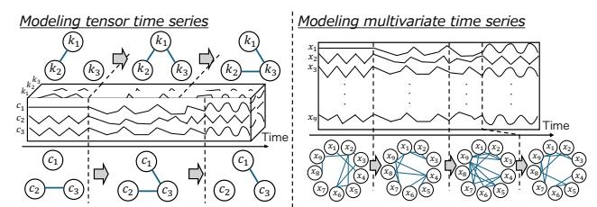
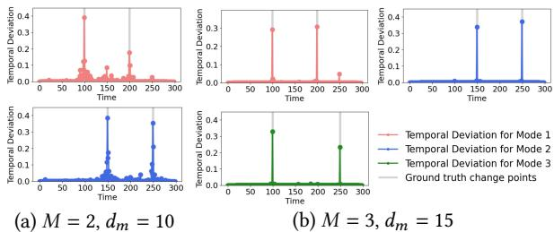
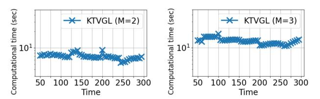
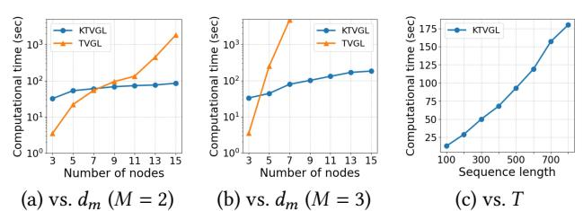
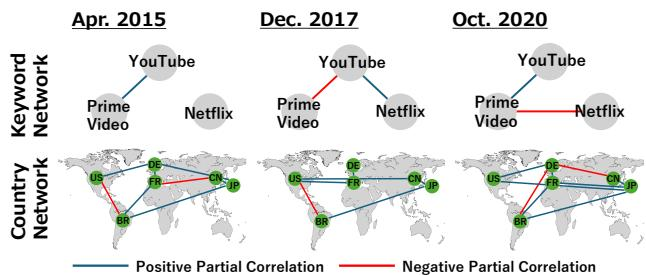
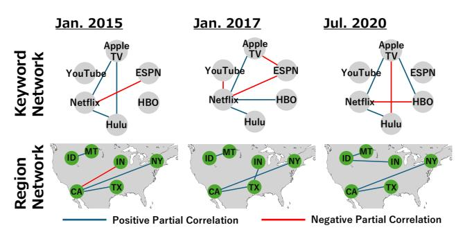

# Interpretable Dynamic Network Modeling of Tensor Time Series via Kronecker Time-Varying Graphical Lasso

Shingo Higashiguchi SANKEN, The University of Osaka Osaka, Japan shingo88@sanken.osaka-u.ac.jp

Koki Kawabata SANKEN, The University of Osaka Osaka, Japan koki@sanken.osaka-u.ac.jp

Yasuko Matsubara SANKEN, The University of Osaka Osaka, Japan yasuko@sanken.osaka-u.ac.jp

Yasushi Sakurai SANKEN, The University of Osaka Osaka, Japan yasushi@sanken.osaka-u.ac.jp

### Abstract

With the rapid development of web services, large amounts of time series data are generated and accumulated across various domains such as finance, healthcare, and online platforms. As such data often co-evolves with multiple variables interacting with each other, estimating the time-varying dependencies between variables (i.e., the dynamic network structure) has become crucial for accurate modeling. However, real-world data is often represented as tensor time series with multiple modes, resulting in large, entangled networks that are hard to interpret and computationally intensive to estimate. In this paper, we propose Kronecker Time-Varying Graphical Lasso (KTVGL), a method designed for modeling tensor time series. Our approach estimates mode-specific dynamic networks in a Kronecker product form, thereby avoiding overly complex entangled structures and producing interpretable modeling results. Moreover, the partitioned network structure prevents the exponential growth of computational time with data dimension. In addition, our method can be extended to stream algorithms, making the computational time independent of the sequence length. Experiments on synthetic data show that the proposed method achieves higher edge estimation accuracy than existing methods while requiring less computation time. To further demonstrate its practical value, we also present a case study using real-world data. Our source code and datasets are available at [https://github.com/Higashiguchi-Shingo/KTVGL.](https://github.com/Higashiguchi-Shingo/KTVGL)

# CCS Concepts

• Computing methodologies → Maximum likelihood modeling.

# Keywords

Tensor time series, Graphical lasso, Network inference

### ACM Reference Format:

Shingo Higashiguchi, Koki Kawabata, Yasuko Matsubara, and Yasushi Sakurai. 2026. Interpretable Dynamic Network Modeling of Tensor Time Series via Kronecker Time-Varying Graphical Lasso. In Proceedings of the ACM Web

[This work is licensed under a Creative Commons Attribution 4.0 International License.](https://creativecommons.org/licenses/by/4.0) WWW '26, Dubai, United Arab Emirates © 2026 Copyright held by the owner/author(s). ACM ISBN 979-8-4007-2307-0/2026/04 <https://doi.org/10.1145/3774904.3792608>

Conference 2026 (WWW '26), April 13–17, 2026, Dubai, United Arab Emirates. ACM, New York, NY, USA, [10](#page-9-0) pages[. https://doi.org/10.1145/3774904.3792608](https://doi.org/10.1145/3774904.3792608)

### 1 Introduction

In recent years, the rapid development and proliferation of web services have led to an explosive accumulation of time series data across diverse domains including finance [\[16,](#page-8-0) [33\]](#page-8-1), public health [\[22\]](#page-8-2), and online platforms such as social networks [\[25\]](#page-8-3) and web search logs [\[18,](#page-8-4) [31\]](#page-8-5). Because such data reflects users' social activities and interests, analyzing it is essential for tasks such as understanding user behavior and formulating marketing strategies. For instance, identifying pairs or groups of series that are positively or negatively correlated within multivariate time series can improve recommendation systems and demand forecasting, thereby facilitating decision-making processes.

Graphical-model-based methods, which infer a graph structure (i.e., network) where each node corresponds to a variable and edges represent conditional dependencies, are widely used for learning relationships from multivariate data. Graphical Lasso [\[6\]](#page-8-6) estimates a static precision matrix under sparsity constraints to capture such dependencies. To extend this framework to multivariate time series, it was extended to Time-varying graphical lasso (TVGL) [\[9\]](#page-8-7), enabling dynamic network inference. TVGL is notable for its ability to capture time-varying dependencies, which are common in many real-world time series data, and has inspired several extensions [\[40,](#page-8-8) [48\]](#page-9-1). However, real-world data is frequently obtained in the form of tensor time series with many attributes. For example, consider web search volume data obtained from GoogleTrends [\[7\]](#page-8-9): the data constitutes a 3-order tensor with attributes (time, keyword, country; value). To apply methods for multivariate time series (e.g., TVGL) to such tensor data, the tensor time series must be flattened into a higher dimensional time series. Such transformation causes the loss of structural information within the tensor data. As a result, the model mixes up all relationships among variables, captures spurious correlations, and yields a large, entangled network structure that reduces the interpretability of the modeling results. Moreover, its computational time increases significantly as the number of variables in a mode increases. Therefore, a new approach tailored for tensor time series is required. Figure [1](#page-1-0) illustrates the difference between our approach and existing methods. In the right figure, the input tensor time series is flattened to create a multivariate

time series before estimating the network. This leads to a substantial increase in computation time and reduced interpretability of the modeling results due to the large, entangled network. On the other hand, our method estimates multiple mode-specific dynamic networks corresponding to each non-temporal mode, as shown in the left figure. Our model disentangles the complex interactions within the tensor time series, enabling analysis of node interactions and their temporal evolution within each mode. Consequently, it provides users with powerful tools for gaining new insights into tensor time series. Specifically, it enables tasks that were previously unachievable with conventional methods, such as capturing interactions focused solely on specific modes or detecting change points focused exclusively on specific modes.

In this paper, we propose Kronecker Time-Varying Graphical Lasso (KTVGL), a method for dynamic network inference on tensor time series. The proposed method estimates multiple networks, each of which is a sparse dependency network of the corresponding non-temporal mode of the input tensor. This structure avoids estimating a single massive network, thereby reducing computational time and improving the interpretability of modeling results through concise multi-network representations. Furthermore, we impose a Kronecker structure on these networks. Specifically, the proposed model consists of mode-specific networks, whose Kronecker product represents the dependency structure of the entire data when regarded as a multivariate time series. This structure enables us to decompose the nonconvex optimization over multiple networks into an alternating optimization scheme of convex subproblems, leveraging the power of Kronecker product theory [\[37\]](#page-8-10). In addition, KTVGL can be extended to stream algorithms, which we call KTVGL-Stream. In this case, the computation time is independent of the sequence length thanks to incremental network updating.

- In summary, our method has the following characteristics:
- Interpretable: By estimating mode-specific networks, we prevent networks from becoming excessively large and entangled, which significantly improves the interpretability of modeling results.
- Scalable: Because the network is estimated separately for each mode, the number of nodes and computation time do not increase exponentially. In our experiments, our method is up to 60.5 times faster than existing dynamic network inference methods. In addition, KTVGL can be extended to stream algorithms, making the computational time independent of the sequence length.
- Accurate: Thanks to a model architecture carefully tailored for tensor data, our method accurately captures dependencies between variables. Our experiments demonstrate that our approach improves edge estimation accuracy by up to 73.5% based on AUC-ROC.

### 2 Preliminaries

Graphical Lasso. Graphical Lasso is a statistical method for estimating a graph structure (i.e., network) representing dependencies between variables from multivariate data. Specifically, it estimates the Gaussian inverse covariance matrix (i.e., network) Θ ∈ R ��×�� , also known as the precision matrix, based on the the covariance structure of the data. By applying ℓ1-regularization, it sets many elements to zero, yielding a sparse network. This allows us to interpret

Figure 1: Modeling tensor time series (left) versus multivariate time series obtained by flattening tensors (right). Dynamic network inference on flattened data results in large and entangled networks with reduced accuracy and interpretability, whereas estimating mode-specific networks yields clearer and more interpretable results.

pairwise conditional independence among �� variables, for example, if ���� = 0, variables �� and �� are conditionally independent given the values of all the other variables. Given a series of multivariate input data, the optimization problem is written as follows:

min Θ −ℓ( ˆ��, Θ) + ��∥Θ∥1,od, (1)

ℓ( ˆ��, Θ) = −tr( ˆ��Θ) + log det Θ (2)

where Θ must be symmetric positive-definite (S �� ++), ˆ�� is the empirical covariance 1 Í�� ��=1 ������ ⊤ , �� is the number of observations, ∥ · ∥1,od indicates the off-diagonal ℓ1-norm, and �� ≥ 0 is a hyperparameter for determining the sparsity level of the network.

Time-varying Graphical Lasso (TVGL). While Graphical Lasso estimates static networks, TVGL is a method for estimating dynamic networks. Given a sequence of multivariate observations, it estimates the precision matrix �� at each time point. TVGL imposes temporal consistency constraints in addition to sparsity constraints, based on the insight that networks at adjacent time points should share similar structures. The optimization problem is written as follows:

min Θ1,...,Θ�� ∑︁�� ��=1 n −ℓ( ˆ���� , Θ�� ) + ��∥Θ�� ∥1,odo + �� ∑︁�� ��=2 �� (Θ�� − Θ��−1), (3)

where ˆ���� is the empirical covariance at time ��,�� is a convex penalty function that encourages similarity between Θ��−1 and Θ�� , and �� ≥ 0 is a hyperparameter that determines how strongly correlated neighboring covariance estimations should be. The dependencies between variables and their dynamics are represented by the sequence of precision matrices {Θ1, . . . , Θ�� }. Regarding �� acting as a time-consistency constraint, various options such as the Laplacian penalty, ℓ1-penalty, ℓ2-penalty, and so on have been proposed, tailored to the domain knowledge of the target data [\[9\]](#page-8-7). This paper employs the Laplacian penalty, which assumes the entire network undergoes gradual changes, and the ℓ1-penalty, which assumes only a small number of edges change; however, other choices are certainly possible. TVGL optimization problem is convex, and convergence to the global optimum is guaranteed. The optimal network is obtained by alternating direction method of multipliers (ADMM) [\[3\]](#page-8-11). To infer an �� × �� network, the dominant computational cost arises from the eigenvalue decomposition required to update Θ, with a time complexity of ��(�� 3 ). Thus, the overall computational complexity of TVGL is ��(����3 ).

growth in computation time by leveraging a partitioned multinetwork structure.

3.3.3 Extension to stream processing. In scenarios where new data is constantly being observed, it is desirable to update the network incrementally as new data arrives [\[27,](#page-8-14) [38\]](#page-8-15). Our method can be extended to a stream algorithm using the sliding window approach. We refer to the extended algorithm as KTVGL-Stream. Specifically, with window size ��, dynamic network estimation is performed on the most recent�� time steps of data whenever new data is observed. Here, for the first �� − 1's Θ�� values within the window, ADMM updates are performed using the estimated values from the previous window as initial values. By starting the estimation from reliable initial values, the convergence time for each window is significantly reduced, as shown in Section [4.](#page-4-0) Thanks to the sliding window approach, the update time of this algorithm does not depend on the data length, which is an essential property for stream processing.

# 4 Experiments

In this section, we run several experiments of KTVGL on synthetic data, where there are clear ground truth networks. The experiments were designed to answer the following questions about KTVGL.

Q1. How accurately does it estimate the true network? Q2. How accurately does it detect network change points? Q3. How does it scale in terms of computational time?

Additionally, we evaluate the performance of KTVGL-Stream in streaming scenarios.

# 4.1 Synthetic datasets

We randomly generate synthetic 3rd or 4th-order tensor time series (i.e., �� = 2 or 3), X, which follow a multivariate normal distribution vec(X�� ) ∼ N 0, (⊗�� ��=1Θ (��) ) −1 . We set the sequence length �� = 300. For each non-temporal mode, we vary the network structure (i.e., edge positions and counts) at either �� = 100, 200, �� = 100, 250 or �� = 150, 250. The resulting dataset includes both cases where network changes occur at different timings per mode and cases where all networks change simultaneously. We created multiple datasets while varying the dimensionality per mode. The generation process for the ground truth network in each mode is based on Erdős-Rényi graph [\[29\]](#page-8-16), specifically as follows:

- (1) For �� = 1, . . . , �� and �� = 1, . . . ,�� , set Θ (��) ∈ R ���� ×���� equal to the adjacency matrix of an Erdos-Renyi directed random graph, where every edge has a 25% chance of being selected.
- (2) For every selected edge, set the value of that edge to ∼ Uniform( [−3.0, 3.0]). We enforce a symmetry constraint on the network.
- (3) Let �� be the smallest eigenvalue of Θ (��) �� , and set Θ (��) �� = Θ (��) �� + (0.1+ |��|)��, where �� is an identity matrix. This ensures that Θ (��) is invertible.

The precision matrix for the entire tensor time series is given by the Kronecker product ���� = ⊗ ��=1Θ (��) . At each ��, we observe one sample from true distributions.

Table 1: Performance comparison using three metrics: AUC-ROC, AUC-PR, Best ��1. T.O. denotes timeout under a 5000 seconds limit.

### 4.2 Experimental setting

4.2.1 Evaluation metrics. We introduce three metrics to measure the accuracy of estimating the true network structure.

- AUC-ROC: Based on the relationship between the true positive rate and the false positive rate.
- AUC-PR: Based on precision and recall, and particularly informative in imbalanced settings.
- Best-��1: The maximum ��1 score across all thresholds, reflecting the best trade-off between precision and recall.

In addition, based on [\[9\]](#page-8-7), we introduce Temporal Deviation Ratio (TDR) to measure how accurately each method could detect the change points in the network structure.

- Temporal Deviation Ratio (TDR): We define the temporal deviation as ∥Θ�� − Θ��−1 ∥�� /∥Θ�� ∥�� . It indicates how much the network structure changed at each time step. TDR is the ratio of the temporal deviation at change points to the average temporal deviation value across all the timestamps.

4.2.2 Baselines. We compare our approach to two different baselines: the static Kronecker Graphical Lasso (Static KGL) and Time-Varying Graphical Lasso (TVGL). For the static Kronecker Graphical Lasso, we estimate a static network for each mode that represents the entire dataset. Additionally, we will perform performance evaluations on KTVGL-Stream. Hyperparameter settings are described in the Appendix [B.1.](#page-9-3)

### 4.3 Results

4.3.1 Q1: Accuracy of edge estimation. Table [1](#page-4-1) shows the accuracy of edge estimation for each method. Thanks to our model structure and algorithm tailored for tensor data, KTVGL achieves the highest accuracy. We conducted experiments under a scenario natural for time series analysis, where one observation is obtained at each time step. In this case, as discussed in Section [3.3.1,](#page-3-4) TVGL calculates the empirical covariance matrix ˆ���� from a single observation, resulting in ˆ���� being rank-1 and leading to low accuracy. However, KTVGL leverages the structural information of tensor data to compute a full-rank empirical covariance matrix, significantly improving accuracy. Static KGL can effectively estimate mode-specific networks through its multi-network structure, but its accuracy decreases because it cannot capture temporal changes in the network. All elements of our method (i.e., the multi-network structure expressed as a Kronecker product and its dynamic estimation—significantly) contribute to improved accuracy. Overall, our Kronecker-structured dynamic model substantially improves the accuracy of network inference for tensor time series.

Table 2: Performance comparison using Temporal Deviation Ratio (TDR). T.O. denotes timeout under a 5000 seconds limit.

Figure 2: Temporal deviation of the estimated networks for datasets with different values of ��, ����, and ground truth network change points. The gray vertical lines indicate the true change points. Our method captures these change points across various settings and additionally identifies modespecific changes.

4.3.2 Q2: Accuracy of change point detection. We introduce Temporal Deviation Ratio (TDR) as a metric to measure the accuracy of estimating network change points. Temporal Deviation (TD) is a value indicating how much the network structure changes from one time point to the next. TDR is the ratio of the TD at a true change point to the average TD across the entire sequence. In other words, a higher TDR indicates that the network change at the true change point is more pronounced relative to other points, reflecting higher confidence in the detected change point. As shown in Table [2,](#page-5-0) our method achieves significantly higher TDR scores than the baseline across all datasets. As the dimensionality of the data increases, more structural information becomes available (see the discussion in Section [3.3.1\)](#page-3-4), and thus the accuracy of change point detection tends to be more stable at higher dimensions. Note that Static KGL is a method for static network inference and is therefore not included in the table. Additionally, Figure [2](#page-5-1) visualizes TD of the estimated networks and the ground truth change points. This dataset includes scenarios where multiple networks change simultaneously and scenarios where only one network changes. Our method accurately estimated the changes in network structure per mode in both scenarios by untangling the seemingly intertwined interactions within the tensor data. For example, consider the results shown in Figure [2](#page-5-1) (b). Here, the number of modes �� = 4, and the ground truth change points are �� (1) = {100, 200} for mode-1, �� (2) = {150, 250} for mode-2, and �� (3) = {100, 250} for mode-3. In this case, the change points for the entire tensor time series are �� (1) ∪ �� (2) ∪ �� (3) = {100, 150, 200, 250}, resulting in four change points. As shown in Figure [2](#page-5-1) (b), KTVGL correctly distinguishes network changes across modes and accurately identifies which change point originates from which mode. In other words, our model structure and alternating optimization algorithm leverage the structural information within tensor data, enabling precise mode-specific change point detection that is infeasible for baseline methods.

Figure 3: Scalability of KTVGL: (a, b) Wall clock time vs. number of nodes per mode (����) for number of mode �� = 2, 3. While the computational time of TVGL increases rapidly with ���� and ��, KTVGL avoids the exponential growth in computational complexity. (c) Wall clock time vs. sequence length �� . KTVGL scales linearly with sequence length.

Figure 4: Scalability of KTVGL-Stream: Wall clock time vs. sequence length. The computational time at each step is independent of the sequence length. We set ���� = 5, and �� = 2 (left) and �� = 3 (right) respectively.

Table 3: KTVGL-Stream performance.

4.3.3 Q3: Scalability. Figure [3](#page-5-2) shows the wall-clock time of KTVGL and TVGL. Figure [3](#page-5-2) (a) and (b) illustrate the change in computation time for KTVGL and TVGL when varying the number of modes �� and dimensions ����. Note that Static KGL, which performs single static network inference, is very fast (less than 1.0 second), therefore, it is not included in the figure. TVGL suffers from a significant increase in computation time with growing input data dimensions ���� and number of modes ��. This hinders the application of TVGL to tensor time series modeling. KTVGL, on the other hand, avoids the exponential increase in computation time due to increases in the number of modes or dimensionality, thanks to its partitioned network structure and efficient alternating optimization framework. In addition, Figure [3](#page-5-2) (c) shows the computation time of KTVGL as the sequence length �� varies. As described in Section [3.3.2,](#page-3-5) KTVGL scales linearly in terms of the sequence length.

4.3.4 Performance of stream algorithm. We also evaluated the performance of KTVGL-Stream, an extension of KTVGL to a streaming algorithm. Table [3](#page-5-3) shows the accuracy of edge estimation. By sliding the window, we continuously monitored the latest value within the window and calculated the accuracy between the estimated network and the ground truth network. KTVGL-Stream

exhibited a slight decrease in edge estimation accuracy and a substantial decrease in change point detection performance compared to KTVGL. This is due to our continuous monitoring of the latest value within the window. In the KTVGL algorithm, the temporal consistency constraint function considers both values before and after the current time. However, in the stream algorithm, future values are unobserved, so the current network must be estimated based only on past information. Nevertheless, its performance remains higher than that of TVGL. Figure [4](#page-5-4) shows the computational time of KTVGL-Stream. The update time of KTVGL-Stream at each step is less than 10 seconds for the case �� = 2 and less than 20 seconds for the case �� = 3, faster than KTVGL (i.e., Figure [3\)](#page-5-2). As described in Section [3.3.3,](#page-4-2) our stream algorithm uses a sliding window, making computation time independent of sequence length. Furthermore, thanks to incremental updates, the computation at each step becomes faster. It is noteworthy that despite its efficiency, KTVGL-Stream still achieves high accuracy in both edge estimation and change point detection.

# 5 Case Study

Many real-world datasets co-evolve through the interaction of multiple series [\[28\]](#page-8-17). Estimating these interactions from tensor time series reveals latent structures within the data, providing critical insights for numerous tasks such as marketing and user behavior analysis. As demonstrated in Section [4,](#page-4-0) our method achieved outstanding dynamic network inference accuracy in the common time series analysis scenario where one observation is obtained per time point. In this section, we present several case studies applying KTVGL to analyze real-world tensor time series.

### 5.1 Real-world dataset

Here, we use web search volume data obtained from GoogleTrends [\[7\]](#page-8-9). Specifically, this data represents weekly web search volumes for multiple keywords across multiple regions from 2015 to 2020. The data forms a tensor time series consisting of three modes: (time, keyword, location). This data is considered to reflect the strength of public interest in various keywords, and understanding dependencies between keywords and across regions is crucial for understanding users. For this study, we selected multiple video services as keywords and prepared two datasets: one representing web search volumes by country (referred to as country data) and another representing search volumes by U.S. state (referred to as region data). The data size and included keywords are listed in Table [5](#page-9-4) in Appnedix [C.1.](#page-9-5) We applied moving average smoothing to mitigate the effects of seasonal fluctuations and then normalized all data.

# 5.2 Modeling results

5.2.1 Country data. Figure [5](#page-6-0) shows modeling results for country data. The upper panel displays the keyword dependency networks, while the lower panel shows the country dependency networks. The left, center, and right figures present the estimated results for 2015, 2017, and 2020, respectively. Network edges represent partial correlations between nodes, i.e., the correlation between two variables after filtering out the influence of other variables. Focusing on the keyword network, "Prime Video" and "YouTube" showed a positive partial correlation in 2015. Amazon launched its "Prime

Figure 5: Snapshots of the time-varying networks estimated by KTVGL at three different time points for GoogleTrends country data. The upper panels represent keyword networks, while the lower panels represent country networks. Our multi-network structure provides interpretable modeling results for each non-temporal mode.

Video" service globally in 2015. The observed correlation between "Prime Video" and "YouTube" suggests that, during this period, "Prime Video" was also gaining public attention in a manner similar to other major video platforms. Furthermore, a positive partial correlation was observed between "YouTube" and "Netflix" in 2017. By that time, Netflix had already launched its global video-on-demand service. This correlation suggests that, as the demand for online video services continued to grow, public attention toward "Netflix" and "YouTube" may have increased concurrently. In addition, interestingly, a negative correlation was estimated between "Netflix" and "Prime Video" in 2020. In 2020, demand for video-on-demand services surged rapidly due to factors like pandemic lockdowns. During this period, "Prime Video" and "Netflix" are presumed to have been competing to acquire users. In other words, a potential competitive relationship existed between these two values: increased attention to one corresponded to decreased interest in the other. This competitive relationship can be interpreted as a negative correlation estimated after controlling for the effects of other variables. Focusing on country networks, while networks change over time, countries within the same area—Germany and France, Japan and China—exhibit positive partial correlations across all periods. We can analyze that neighboring countries in Europe and Asia interact and share related time-series patterns. Consequently, our method can summarize real-world circumstances as multiple dependent networks corresponding to distinct non-temporal modes, enabling effective interpretation of underlying interactions.

5.2.2 Region data. Figure [6](#page-7-0) shows modeling results for region data. Focusing on the keyword network for 2015, it indicates that keywords related to subscription-based video-on-demand services— "Netflix", "Hulu", and "Apple TV"—exhibit positive correlations among each other. In 2017, while maintaining the relationships observed in the previous snapshot, several new edges were added. As these edges are primarily connected to "Netflix", it can be interpreted as a phase where "Netflix" became central, reshaping the competitive landscape of the video service industry. Furthermore, significant network changes were also observed between 2017 and 2020. Specifically, the value of the partial correlation between "Netflix" and "HBO" has shifted from positive to negative. "HBO" launched its subscription-based video streaming service in

Figure 6: Snapshots of the time-varying networks estimated by KTVGL at three different time points for GoogleTrends region data.

2020, meaning it became a direct competitor to "Netflix". This negative correlation may reflect competition for user acquisition. Additionally, Apple launched its new video streaming service in 2019, which may have contributed to the network changes observed here, specifically, the negative correlation between "Hulu" and "Apple TV". Additionally, focusing on region networks, positive correlations were observed throughout all periods between California (CA) and Texas (TX), California and New York (NY), and Idaho (ID) and Montana (MT). This can be interpreted as clusters of urban areas (CA, TX, NY) and rural areas (ID, MT). These correlations suggest that regions sharing similar socioeconomic environments tend to exhibit comparable temporal trends in public attention.

As shown by the two case studies above, KTVGL serves as a valuable tool for providing insightful analysis of real-world data through its interpretable multi-network dynamic modeling.

### 6 Related Work

Graphical model. As described in Section [2,](#page-1-1) graphical lasso [\[1,](#page-8-18) [6,](#page-8-6) [49\]](#page-9-6) is a method for estimating static sparse dependency networks from multivariate data, and numerous extensions and applications have been explored [\[30,](#page-8-19) [33\]](#page-8-1). Extending this framework to multivariate time series data is a natural progression, as latent interactions in real-world data are typically time-varying, thereby motivating the study of dynamic network inference. Time-Varying Graphical Lasso (TVGL) [\[9\]](#page-8-7) was proposed as a method specifically designed to estimate time-varying sparse dependency networks. It has been recognized for enabling scalable and accurate dynamic network inference, which has in turn inspired a wide range of applications [\[5,](#page-8-20) [8\]](#page-8-21) and further extensions (e.g., Latent-Variable TVGL) [\[26,](#page-8-22) [40,](#page-8-8) [48\]](#page-9-1). However, applying TVGL to tensor time series, which are frequently observed in the real world, requires flattening the input tensor into a multivariate time series, leading to large and entangled networks. To address this limitation, our method directly estimates modespecific dynamic networks, thereby enhancing both interpretability and scalability. The idea of imposing a Kronecker structure on graphical lasso is based on [\[43\]](#page-8-12). However, it assumes modeling multidimensional time series and cannot be directly applied to tensor time series. Furthermore, it cannot estimate time-varying networks. In contrast, our method is designed specifically for modeling tensor time series. We utilize Kronecker theory and tensor geometry to formulate alternating optimization for tensor data (i.e., Lemma 1 and Eq. [\(11\)](#page-3-0)). This enables dynamic inference of each network, thereby providing new insights such as capturing interactions focused solely on specific modes and detecting change points focused exclusively on particular modes. Beyond network inference, graphical lasso has also been applied to various time series tasks, including clustering [\[10,](#page-8-23) [34\]](#page-8-24), missing value imputation [\[35,](#page-8-25) [42\]](#page-8-26), and forecasting [\[41\]](#page-8-27). Poisson graphical models for modeling count data have been proposed in addition to Gaussian-based networks [\[2,](#page-8-28) [46,](#page-8-29) [47\]](#page-8-30). Tensor time series analysis. Tensor decomposition methods [\[23,](#page-8-13) [50\]](#page-9-7), including CP and Tucker decompositions, are powerful techniques for analyzing tensor data. These methods extend matrix decomposition [\[44,](#page-8-31) [45\]](#page-8-32) to higher dimensions, extracting latent patterns and structures by decomposing the input tensor into multiple smaller factors. They are also widely used for analyzing tensor time series, serving not only for pattern extraction [\[12,](#page-8-33) [17,](#page-8-34) [39\]](#page-8-35) but also for anomaly detection [\[13,](#page-8-36) [15,](#page-8-37) [24\]](#page-8-38) and clustering [\[32\]](#page-8-39). Their application domains are diverse, spanning medical [\[14,](#page-8-40) [36\]](#page-8-41), finance [\[15\]](#page-8-37), web data [\[11,](#page-8-42) [19\]](#page-8-43), and IoT sensor data [\[4\]](#page-8-44). Various extensions have been proposed to accommodate different data properties, such as irregular tensors [\[20\]](#page-8-45), sparsity [\[36\]](#page-8-41), and non-negativity [\[21\]](#page-8-46). Tensor decomposition methods directly decompose data without flattening it into multivariate time series, enabling interpretable summaries that preserve structural information and correlations between modes. However, while they can capture interactions between modes, they cannot explicitly model correlations between variables within the same mode. Our method represents a distinct approach from tensor decomposition techniques in that it captures interactions within the same mode.

### 7 Conclusion

In this paper, we propose Kronecker Time-Varying Graphical Lasso (KTVGL), designed for modeling tensor time series. Our approach avoids large, entangled networks by estimating mode-specific networks corresponding to each non-temporal mode. This prevents exponential increases in computational complexity and leads to interpretable modeling results. Our model structure adopts a Kronecker structure for the multi-network, enabling the optimization problem for the multi-network to be decomposed into alternating convex optimization problems for each mode-specific network. This design allows the model to effectively and efficiently capture dependencies inherent in tensor time series. In addition, our method can be extended to stream algorithms, making the computational time independent of the sequence length. Experiments on synthetic data show that our approach improves edge estimation accuracy by up to 73.5% based on AUC-ROC and is up to 60.5 times faster than existing methods. Furthermore, case studies using real-world datasets demonstrated the effectiveness of our approach.

# acknowledgement

This work was partly supported by JST BOOST, Japan Grant Number JPMJBS2402, "Program for Leading Graduate Schools" of the Osaka University, Japan, JSPS KAKENHI Grant-in-Aid for Scientific Research Number JP20910053, JST CREST JPMJCR23M3, JST START JPMJST2553, JST CREST JPMJCR20C6, JST K Program JPMJKP25Y6, JST COI-NEXT JPMJPF2009, JST COI-NEXT JPMJPF2115, the Future Social Value Co-Creation Project - Osaka University, JSPS KAK-ENHI Grant-in-Aid for Scientific Research Number JP25K21208.

### References

- [1] Onureena Banerjee, Laurent El Ghaoui, and Alexandre d'Aspremont. 2008. Model selection through sparse maximum likelihood estimation for multivariate Gaussian or binary data. The Journal of Machine Learning Research 9 (2008), 485–516. [2] Julian Besag. 1974. Spatial interaction and the statistical analysis of lattice systems. Journal of the Royal Statistical Society: Series B (Methodological) 36, 2 (1974), 192–225. [3] Stephen Boyd, Neal Parikh, Eric Chu, Borja Peleato, Jonathan Eckstein, et al. 2011. Distributed optimization and statistical learning via the alternating direction method of multipliers. Foundations and Trends® in Machine learning 3, 1 (2011), 1–122. [4] Yongjie Cai, Hanghang Tong, Wei Fan, Ping Ji, and Qing He. 2015. Facets: Fast comprehensive mining of coevolving high-order time series. In Proceedings of the 21th ACM SIGKDD International Conference on Knowledge Discovery and Data Mining. 79–88. [5] Iván L Degano and Pablo A Lotito. 2021. Analyzing spatial mobility patterns with time-varying graphical lasso: Application to COVID-19 spread. Transactions in GIS 25, 5 (2021), 2660–2674. [6] Jerome Friedman, Trevor Hastie, and Robert Tibshirani. 2008. Sparse inverse covariance estimation with the graphical lasso. Biostatistics 9, 3 (2008), 432–441. [7] GoogleTrends. [n. d.]. https://trends.google.com/trends/. [8] Kristjan Greenewald, Seyoung Park, Shuheng Zhou, and Alexander Giessing. 2017. Time-dependent spatially varying graphical models, with application to brain fMRI data analysis. Advances in neural information processing systems 30 (2017). [9] David Hallac, Youngsuk Park, Stephen Boyd, and Jure Leskovec. 2017. Network inference via the time-varying graphical lasso. In Proceedings of the 23rd ACM SIGKDD international conference on knowledge discovery and data mining. 205–
- 213. [10] David Hallac, Sagar Vare, Stephen Boyd, and Jure Leskovec. 2017. Toeplitz inverse covariance-based clustering of multivariate time series data. In Proceedings of the 23rd ACM SIGKDD international conference on knowledge discovery and data mining. 215–223. [11] Shingo Higashiguchi, Yasuko Matsubara, Koki Kawabata, Taichi Murayama, and Yasushi Sakurai. 2025. D-Tracker: Modeling Interest Diffusion in Social Activity Tensor Data Streams. In Proceedings of the 31st ACM SIGKDD Conference on Knowledge Discovery and Data Mining V. 1. 460–471. [12] Bryan Hooi, Kijung Shin, Shenghua Liu, and Christos Faloutsos. 2019. SMF: Drift-aware matrix factorization with seasonal patterns. In Proceedings of the 2019 SIAM International Conference on Data Mining. SIAM, 621–629. [13] Jun-Gi Jang and U Kang. 2021. Fast and memory-efficient tucker decomposition for answering diverse time range queries. In Proceedings of the 27th ACM SIGKDD Conference on Knowledge Discovery & Data Mining. 725–735. [14] Jun-Gi Jang and U Kang. 2022. Dpar2: Fast and scalable parafac2 decomposition for irregular dense tensors. In 2022 IEEE 38th International Conference on Data Engineering (ICDE). IEEE, 2454–2467. [15] Jun-Gi Jang, Jeongyoung Lee, Yong-chan Park, and U Kang. 2023. Fast and accurate dual-way streaming parafac2 for irregular tensors-algorithm and application. In Proceedings of the 29th ACM SIGKDD Conference on Knowledge Discovery and Data Mining. 879–890. [16] Jun-Gi Jang, Yong-chan Park, and U Kang. 2024. Fast and accurate parafac2 decomposition for time range queries on irregular tensors. In Proceedings of the 33rd ACM International Conference on Information and Knowledge Management. 962–972. [17] Koki Kawabata, Siddharth Bhatia, Rui Liu, Mohit Wadhwa, and Bryan Hooi. 2021. SSMF: Shifting Seasonal Matrix Factorization. In Advances in Neural Information Processing Systems, Vol. 34. 3863–3873. [18] Koki Kawabata, Yasuko Matsubara, Takato Honda, and Yasushi Sakurai. 2020. Non-Linear Mining of Social Activities in Tensor Streams. In Proceedings of the 26th ACM SIGKDD International Conference on Knowledge Discovery and Data Mining. 2093–2102. [19] Koki Kawabata, Yasuko Matsubara, and Yasushi Sakurai. 2023. Modeling Dynamic Interactions over Tensor Streams. In Proceedings of the ACM Web Conference 2023. 1793–1803. [20] Henk AL Kiers, Jos MF Ten Berge, and Rasmus Bro. 1999. PARAFAC2—Part I. A direct fitting algorithm for the PARAFAC2 model. Journal of Chemometrics: A Journal of the Chemometrics Society 13, 3-4 (1999), 275–294. [21] Yong-Deok Kim and Seungjin Choi. 2007. Nonnegative Tucker Decomposition. In 2007 IEEE Conference on Computer Vision and Pattern Recognition. 1–8. [doi:10.](https://doi.org/10.1109/CVPR.2007.383405) [1109/CVPR.2007.383405](https://doi.org/10.1109/CVPR.2007.383405) [22] Tasuku Kimura, Yasuko Matsubara, Koki Kawabata, and Yasushi Sakurai. 2022. Fast Mining and Forecasting of Co-evolving Epidemiological Data Streams. In Proceedings of the 28th ACM SIGKDD Conference on Knowledge Discovery and Data Mining. 3157–3167. [23] Tamara G Kolda and Brett W Bader. 2009. Tensor decompositions and applications. SIAM review 51, 3 (2009), 455–500. [24] Taehyung Kwon, Inkyu Park, Dongjin Lee, and Kijung Shin. 2021. Slicenstitch: Continuous cp decomposition of sparse tensor streams. In 2021 IEEE 37th International Conference on Data Engineering (ICDE). IEEE, 816–827. [25] Jure Leskovec, Jon Kleinberg, and Christos Faloutsos. 2005. Graphs over time: densification laws, shrinking diameters and possible explanations. In Proceedings of the eleventh ACM SIGKDD international conference on Knowledge discovery in data mining. 177–187. [26] Junwei Lu, Mladen Kolar, and Han Liu. 2018. Post-regularization inference for time-varying nonparanormal graphical models. Journal of Machine Learning Research 18, 203 (2018), 1–78. [27] Yasuko Matsubara and Yasushi Sakurai. 2016. Regime shifts in streams: Realtime forecasting of co-evolving time sequences. In Proceedings of the 22nd ACM SIGKDD International Conference on Knowledge Discovery and Data Mining. 1045– 1054. [28] Yasuko Matsubara, Yasushi Sakurai, and Christos Faloutsos. 2015. The web as a jungle: Non-linear dynamical systems for co-evolving online activities. In Proceedings of the 24th international conference on world wide web. 721–731. [29] Karthik Mohan, Palma London, Maryam Fazel, Daniela Witten, and Su-In Lee. 2014. Node-based learning of multiple Gaussian graphical models. The Journal of Machine Learning Research 15, 1 (2014), 445–488. [30] Ricardo Pio Monti, Peter Hellyer, David Sharp, Robert Leech, Christoforos Anagnostopoulos, and Giovanni Montana. 2014. Estimating time-varying brain connectivity networks from functional MRI time series. NeuroImage 103 (2014), 427–443. [31] Taichi Murayama, Yasuko Matsubara, and Yasushi Sakurai. 2022. Mining Reaction and Diffusion Dynamics in Social Activities. In Proceedings of the 31st ACM International Conference on Information & Knowledge Management (CIKM '22). 1521–1531. [32] Kota Nakamura, Yasuko Matsubara, Koki Kawabata, Yuhei Umeda, Yuichiro Wada, and Yasushi Sakurai. 2023. Fast and Multi-aspect Mining of Complex Time-stamped Event Streams. In Proceedings of the ACM Web Conference 2023. 1638–1649. [33] Ali Namaki, Amir H Shirazi, R Raei, and GR Jafari. 2011. Network analysis of a financial market based on genuine correlation and threshold method. Physica A: Statistical Mechanics and its Applications 390, 21-22 (2011), 3835–3841. [34] Kohei Obata, Koki Kawabata, Yasuko Matsubara, and Yasushi Sakurai. 2024. Dynamic multi-network mining of tensor time series. In Proceedings of the ACM Web Conference 2024. 4117–4127. [35] Kohei Obata, Koki Kawabata, Yasuko Matsubara, and Yasushi Sakurai. 2024. Mining of switching sparse networks for missing value imputation in multivariate time series. In Proceedings of the 30th ACM SIGKDD Conference on Knowledge Discovery and Data Mining. 2296–2306. [36] Ioakeim Perros, Evangelos E Papalexakis, Fei Wang, Richard Vuduc, Elizabeth Searles, Michael Thompson, and Jimeng Sun. 2017. SPARTan: Scalable PARAFAC2 for large & sparse data. In Proceedings of the 23rd ACM SIGKDD International Conference on Knowledge Discovery and Data Mining. 375–384. [37] Kaare Brandt Petersen, Michael Syskind Pedersen, et al. 2008. The matrix cookbook. Technical University of Denmark 7, 15 (2008), 510. [38] Qingquan Song, Xiao Huang, Hancheng Ge, James Caverlee, and Xia Hu. 2017. Multi-aspect streaming tensor completion. In Proceedings of the 23rd ACM SIGKDD international conference on knowledge discovery and data mining. 435–443. [39] Tsubasa Takahashi, Bryan Hooi, and Christos Faloutsos. 2017. Autocyclone: Automatic mining of cyclic online activities with robust tensor factorization. In Proceedings of the 26th International Conference on World Wide Web. 213–221. [40] Federico Tomasi, Veronica Tozzo, Saverio Salzo, and Alessandro Verri. 2018. Latent variable time-varying network inference. In Proceedings of the 24th ACM SIGKDD International Conference on Knowledge Discovery & Data Mining. 2338– 2346. [41] Veronica Tozzo, Federico Ciech, Davide Garbarino, and Alessandro Verri. 2021. Statistical models coupling allows for complex local multivariate time series analysis. In Proceedings of the 27th ACM SIGKDD Conference on Knowledge Discovery & Data Mining. 1593–1603. [42] Veronica Tozzo, Davide Garbarino, and Annalisa Barla. 2020. Missing Values in Multiple Joint Inference of Gaussian Graphical Models. In International Conference on Probabilistic Graphical Models. PMLR, 497–508. [43] Theodoros Tsiligkaridis, Alfred O Hero III, and Shuheng Zhou. 2013. On convergence of Kronecker graphical lasso algorithms. IEEE transactions on signal processing 61, 7 (2013), 1743–1755. [44] Michael E Wall, Andreas Rechtsteiner, and Luis M Rocha. 2003. Singular value decomposition and principal component analysis. In A practical approach to microarray data analysis. Springer, 91–109. [45] Yu-Xiong Wang and Yu-Jin Zhang. 2012. Nonnegative matrix factorization: A comprehensive review. IEEE Transactions on knowledge and data engineering 25, 6 (2012), 1336–1353. [46] Eunho Yang, Genevera Allen, Zhandong Liu, and Pradeep Ravikumar. 2012. Graphical models via generalized linear models. Advances in neural information processing systems 25 (2012). [47] Eunho Yang, Pradeep K Ravikumar, Genevera I Allen, and Zhandong Liu. 2013. On Poisson graphical models. Advances in neural information processing systems 26 (2013).

| Name            | Keywords                              | Data size       |
|-----------------|---------------------------------------|-----------------|
| Video (Country) | AppleTV/ESPN/HBO/Hulu/Netflix/YouTube | ( 313 , 6 , 6 ) |
| Video (Region)  | PrimeVideo/Netflix/YouTube            | ( 313 , 3 , 6 ) |