# Time-TK: A Multi-Offset Temporal Interaction Framework Combining Transformer and Kolmogorov-Arnold Networks for Time Series Forecasting

[Fan Zhang](https://orcid.org/0000-0002-0343-3499) School of Computer Science and Technology, Shandong Technology and Business University Yantai, ShanDong, China zhangfan@sdtbu.edu.cn

[Shiming Fan](https://orcid.org/0009-0000-4858-8315) School of Computer Science and Technology, Shandong Technology and Business University Yantai, ShanDong, China 2024410061@sdtbu.edu.cn

[Hua Wang](https://orcid.org/0000-0002-8844-9667)∗ School of Computer and Artificial Intelligence, Ludong University Yantai, ShanDong, China hwa229@163.com

# Abstract

Time series forecasting is crucial for the World Wide Web and represents a core technical challenge in ensuring the stable and efficient operation of modern web services, such as intelligent transportation and website throughput. However, we have found that existing methods typically employ a strategy of embedding each time step as an independent token. This paradigm introduces a fundamental information bottleneck when processing long sequences, the root cause of which is that independent token embedding destroys a crucial structure within the sequence—what we term as multi-offset temporal correlation. This refers to the fine-grained dependencies embedded within the sequence that span across different time steps, which is especially prevalent in regular Web data. To fundamentally address this issue, we propose a new perspective on time series embedding. We provide an upper bound on the approximate reconstruction performance of token embedding, which guides our design of a concise yet effective Multi-Offset Time Embedding (MOTE) method to mitigate the performance degradation caused by standard token embedding. Furthermore, our MOTE can be integrated into various existing models and serve as a universal building block. Based on this paradigm, we further design a novel forecasting architecture named Time-TK. This architecture first utilizes a Multi-Offset Interactive KAN (MI-KAN) to learn and represent specific temporal patterns among multiple offset sub-sequences. Subsequently, it employs an efficient Multi-Offset Temporal Interaction mechanism (MOTI) to effectively capture the complex dependencies between these sub-sequences, achieving global information integration. Extensive experiments on 14 real-world benchmark datasets, covering domains such as traffic flow and BTC/USDT throughput, demonstrate that Time-TK significantly outperforms all baseline models, achieving state-of-the-art forecasting accuracy.

© 2026 Copyright held by the owner/author(s). ACM ISBN 979-8-4007-2307-0/2026/04 <https://doi.org/10.1145/3774904.3792618>

# CCS Concepts

• Applied computing → Forecasting; • Computing methodologies → Information extraction; • Information systems → Traffic analysis.

# Keywords

Kolmogorov-Arnold Networks, Web time series data, Multi-Offset embedding mechanism

#### ACM Reference Format:

Fan Zhang, Shiming Fan, and Hua Wang. 2026. Time-TK: A Multi-Offset Temporal Interaction Framework Combining Transformer and Kolmogorov-Arnold Networks for Time Series Forecasting. In Proceedings of the ACM Web Conference 2026 (WWW '26), April 13–17, 2026, Dubai, United Arab Emirates. ACM, New York, NY, USA, [12](#page-11-0) pages[. https://doi.org/10.1145/3774904.3792618](https://doi.org/10.1145/3774904.3792618)

# 1 Introduction

In the vast and dynamic ecosystem of the World Wide Web, Long-Term Time Series Forecasting (LTSF) has emerged as a crucial research frontier [\[5,](#page-8-0) [14,](#page-8-1) [16,](#page-8-2) [18,](#page-8-3) [26,](#page-8-4) [32\]](#page-8-5). Web platforms themselves are generators of massive time-series data [\[34,](#page-8-6) [41\]](#page-8-7), ranging from website traffic and user engagement metrics to the continuous data streams produced by Internet of Things (IoT) devices interacting via APIs. Unlike information-dense data such as images or text, the core value of time-series data lies in its temporal dynamics rather than in isolated, individual time points [\[9,](#page-8-8) [31\]](#page-8-9). This information sparsity at a single time step makes it extremely challenging to extract meaningful patterns from the data [\[1\]](#page-8-10). Consequently, the research focus has definitively shifted towards modeling complex temporal dynamics. This shift not only profoundly aligns with the intrinsic characteristics of web-generated data but also serves as the foundation for uncovering key underlying structures, such as the periodicity of daily user activity and long-term platform growth (trends), thereby enabling proactive resource planning and intelligent web services.

Recently, Transformer-based models have received increasing attention in the context of long-term time series forecasting. However, some work has shown that Transformer exhibits suboptimal performance in long-term multivariate time series forecasting tasks[\[46\]](#page-8-11). This is mainly attributed to the fact that most existing LTSF methods focus on reducing computational costs in univariate settings and lack targeted modeling approaches that address the unique characteristics of long-term multivariate time series. Time series data typically exhibit strong periodic characteristics along with

∗Corresponding author.

[This work is licensed under a Creative Commons Attribution 4.0 International License.](https://creativecommons.org/licenses/by/4.0) WWW '26, Dubai, United Arab Emirates

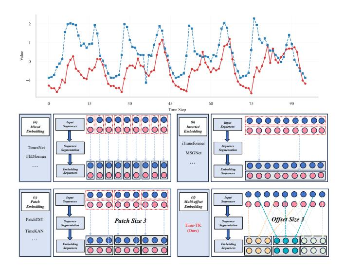

Figure 1: Illustration of four time series embedding strategies. (a) Mixed embedding of variables at the same time step. (b) Inverted embedding along the time axis. (c) Patch embedding based on temporal segmentation. (d) Multi-Offset embedding mechanism used in the proposed Time-TK.

irregular fluctuations, as illustrated in Figure [1.](#page-1-0) Therefore, the token embedding approach based on a single time step [\[38,](#page-8-12) [49,](#page-9-0) [50\]](#page-9-1) is difficult to capture these key features effectively. Some studies have attempted to perform token embedding in the time dimension [\[11,](#page-8-13) [36\]](#page-8-14) to enhance the model's understanding of the periodic structure. However, these methods typically rely on holistic sequence embeddings, which may overlook fine-grained temporal dynamics essential for accurate forecasting [\[45\]](#page-8-15). In addition, LTSF is more prone to overfitting than short-term prediction tasks. During training, the model may overfit to noisy patterns in the data and fail to capture the underlying trends and true temporal dependencies.

To address these issues, we propose Time-TK, a multi-offset temporal interaction framework that integrates Transformer and KAN. It focuses on capturing deep temporal dependencies from historical time series to enhance the model's long-term forecasting capability. Given that long-term time series forecasting relies heavily on modeling extensive historical information, we design our approach around the inherent temporal structure of the data. Specifically, we introduce a multi-offset temporal token embedding mechanism, as shown in Figure [1,](#page-1-0) which divides the original time series into multiple sub-sequences with different spans at fixed offsets along the temporal dimension and performs independent embedding operations on each sub-sequence. The Multi-Offset Interactive KAN (MI-KAN) module leverages the flexibility of KAN [\[4,](#page-8-16) [29\]](#page-8-17) in kernel function modeling to deeply model the temporal structure within each offset sub-sequence and capture its unique dynamic patterns. Based on these offset embedding tokens, the multi-offset temporal interaction module captures cross-step dependencies between time steps and compensates for long-term interleaved dynamics that are often overlooked by traditional continuous embedding methods. To achieve a more comprehensive understanding of the time series, we further design a global interaction mechanism that jointly **0.425**

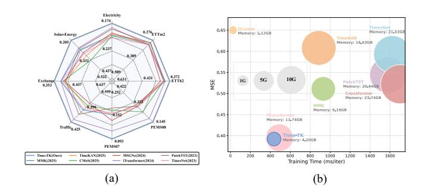

Figure 2: (a) Average performance across all prediction windows, showing improvements over the baseline on various datasets. (b) Comparison of memory usage (GB), training time (ms/iter), and MSE on the Traffic dataset. The prediction length was set to 96.

encodes the original sequence with the offset sub-sequences. This helps recover missing information in cross-offset segments and integrates it into a unified global representation, enhancing the model's ability to capture long-term global structure. As shown in Figure [2,](#page-1-1) Time-TK achieves state-of-the-art performance on several long-term time series forecasting tasks. It also adopts a lightweight architecture that outperforms more complex TSF models while using fewer computational resources.

Our main contributions are as follows:

- We find that existing embedding methods cannot effectively capture the dependencies between different time steps. To address this problem, this paper proposes a multi-offset temporal token embedding method, which is one of the few ways to explore directly from the original sequence.
- Time-TK is a lightweight and efficient model that incorporates the MI-KAN module. Leveraging the flexibility of KAN, it effectively models multi-offset sub-sequences. Moreover, Time-TK is among the few time series forecasting models that successfully integrate Transformer and KAN.
- We conduct extensive experiments on 14 real-world datasets, and the results demonstrate that Time-TK consistently achieves state-of-the-art performance, validating its effectiveness for long-term time series forecasting.

### 2 Related Works

With the breakthroughs of deep learning [\[8,](#page-8-18) [21,](#page-8-19) [23,](#page-8-20) [25,](#page-8-21) [39,](#page-8-22) [40,](#page-8-23) [43,](#page-8-24) [44\]](#page-8-25) in natural language processing [\[7,](#page-8-26) [22\]](#page-8-27) and computer vision [\[47,](#page-8-28) [48\]](#page-9-2), its application in time series forecasting has also grown rapidly. Traditional methods such as ARIMA [\[2\]](#page-8-29) are constrained by linear assumptions, making them inadequate for capturing nonlinear dynamics in temporal data. In contrast, deep learning models such as RNNs [\[13,](#page-8-30) [19\]](#page-8-31), LSTMs [\[10\]](#page-8-32), and Transformers [\[35\]](#page-8-33) have significantly improved forecasting accuracy by learning time dependencies. Embedding strategies play a crucial role in time series modeling, as they transform low-dimensional raw inputs into highdimensional representations, helping models to capture underlying temporal structures and semantic patterns. In this section, we summarize the mainstream embedding approaches for time series. As

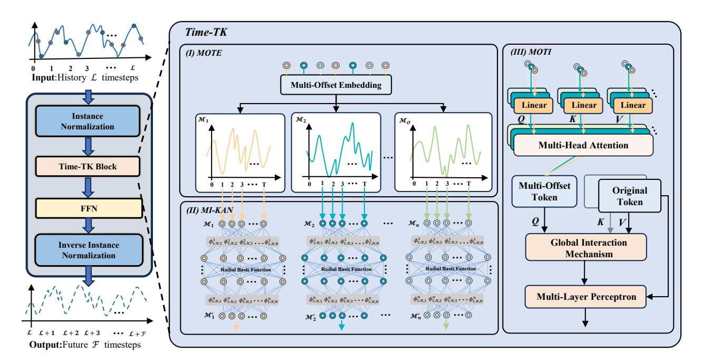

in Figure [1,](#page-1-0) unlike traditional approaches, we use multiple subsequences with different temporal offsets as token inputs to capture information across varying time scales. This design enables the model to capture time-dependent features at different granularities in long sequences—for example, some sub-sequences are more effective at modeling short-term fluctuations, while others are better suited for long-term trends. The introduction of Multi-Offset Token Embedding significantly enhances the model's adaptability to complex temporal patterns, while effectively mitigating overfitting caused by noise in the training data, thereby improving overall generalization.

### 3.3 Multi-Offset Interactive KAN

After the Multi-Offset Token Embedding process, we obtain multiple offset sub-sequences {M1, ..., ��O }. To further capture the temporal dependencies both within and across these sub-sequences, we design the Multi-Offset Interactive KAN (MI-KAN) module, which aims to learn dedicated representations for each offset subsequence and model their mutual relationships. Compared with traditional MLPs, KAN (Kolmogorov-Arnold Network)[\[29\]](#page-8-17) focuses more on approximating complex, high-dimensional mapping relationships through a set of combinable simple functions. Specifically, KAN enhances the network's ability to model nonlinear patterns by replacing traditional linear connections between neurons with learnable univariate functions. The mapping between neurons in adjacent layers can be formulated as:

Z (��+1) = Í �� ������ (Z(��) ) (1)

Where Z (��) represents the ��th neuron in the ��th layer, Z (��+1) �� represents the ��th neuron in the (�� + 1)th layer, and ������ is the univariate mapping function from the ��th to the ��th neuron. Early KAN implementations usually used spline functions as basic building blocks, but such methods often require complex rescaling and have poor stability when dealing with variables crossing the boundaries of the domain. To address these limitations, we adopt the more efficient and stable FastKANLayer [\[24\]](#page-8-37), which constructs univariate mappings using combinations of radially symmetric functions and offers greater flexibility and generalization capability. In our implementation, we employ Gaussian radial basis functions (RBFs) to model the nonlinear relationships in the input. The RBF is defined as follows:

�� (��) = exp(− �� 2ℎ ) (2)

Where �� represents the distance between the input and the center, and ℎ controls the smoothness of the function. The output of the RBF network is a linear combination of this radial basis function, weighted by an adjustable coefficient. The output of the entire RBF network can be expressed as:

�� (��) = Í�� ��=1 ������ (∥�� − ���� ∥) (3)

Where���� is the learnable weight and ���� is the RBF center. It is worth noting that FastKANLayer exhibits strong expressiveness and effectively captures the complex dynamic patterns present in time series data. It generates corresponding deep representations for each input sub-sequence. This design not only simplifies the model

structure but also enhances representation consistency across different sub-sequences through a unified modeling approach, thereby facilitating the interaction module in capturing correlations across time offsets. Finally, the learning process of the proposed MI-KAN module can be formulated as:

{M′ 1 , ..., ��′ } = ���� − ������ (M1, ..., ��O) (4)

The offset sub-sequence representations {M′ 1 , ..., ��′ } ∈ R O×�� ×�� obtained from the MI-KAN module, preserve the temporal dynamics within each individual sub-sequence.

#### 3.4 Multi-Offset Temporal Interaction Forecasting

To further capture correlations across different time steps, we introduce the Multi-Offset Temporal Interaction Mechanism. The primary objective of this mechanism is to leverage the previously proposed Multi-Offset Token Embedding to enhance the model's ability to capture implicit temporal structures across multiple related sub-sequences. Specifically, for each sub-sequences M′ ��, we apply a multi-head Self-Attention mechanism (������) on all its feature dimensions:

A�� = M′ �� + ������(M′ ��,M′ ��,M′ ��) (5)

Where M′ �� ∈ R �� ×�� represents the representation of the ��-th offset sub-sequence, and ������(·) is a multi-head self-attention operation. Due to the use of piecewise offset embeddings, each sub-sequence is significantly shortened, resulting in an attention computation with approximately linear time complexity at this stage [\[42\]](#page-8-38). After modeling the internal structure of each sub-sequence, we further introduce a global fusion operation to integrate the interaction results of the original sequence representation X with all offset sub-sequences A, in order to capture potential dependencies across different temporal segments. The fusion process is formally defined as:

H = X + ������(Q = A, K = X, V = X) (6)

The sequence processed by the Multi-Offset Interaction Mechanism serves as the query, while the original sequence acts as both the key and value, enabling information fusion across different temporal offsets. To generate the final prediction result, we map the time dimension to the prediction length of the target through a linear layer. The transformation can be expressed as:

Y = ������������(H ) ∈ R �� ×F (7)

#### 4 Experiments

# 4.1 Experimental Setup

Datasets. To validate the effectiveness of Time-TK, we conducted extensive experiments on 14 different datasets, as shown in the Table [1,](#page-4-0) including four subsets of ETT (ETTh1, ETTh2, ETTm1, and ETTm2), Electricity, Exchanges, Solar-Energy, weather [\[38\]](#page-8-12), and Traffic. For short-term forecasting, we used four subsets of PEMS (PEMS03, PEMS04, PEMS07, and PEMS08). Furthermore, we included 20,000 BTC/USDT data records with a 5-minute throughput. Accurate forecasts can significantly improve the effectiveness of remedial or preventive measures implemented by web applications,

Table 1: Detailed description of the dataset. Dim indicates the number of variables in each dataset. Dataset Size indicates the total number of time points in (training set, validation set, test set). Prediction Length indicates the future time points that need to be predicted. Each dataset contains four prediction settings. Frequency indicates the sampling interval of the time points. Data statistics are from iTransformer [\[28\]](#page-8-36).

| Dataset      | Dim | Prediction |      | Length |      | Dataset |        | Size   | Frequency | Information    |
|--------------|-----|------------|------|--------|------|---------|--------|--------|-----------|----------------|
| ETTh1, ETTh2 | 7   | {96,       | 192, | 336,   | 720} | {8545,  | 2881,  | 2881}  | Hourly    | Electricity    |
| ETTm1, ETTm2 | 7   | {96,       | 192, | 336,   | 720} | {34465, | 11521, | 11521} | 15min     | Electricity    |
| Exchange     | 8   | {96,       | 192, | 336,   | 720} | {5120,  | 665,   | 1422}  | Daily     | Economy        |
| Weather      | 21  | {96,       | 192, | 336,   | 720} | {36792, | 5271,  | 10540} | 10min     | Weather        |
| ECL          | 321 | {96,       | 192, | 336,   | 720} | {18317, | 2633,  | 5261}  | 10min     | Electricity    |
| Traffic      | 862 | {96,       | 192, | 336,   | 720} | {12185, | 1757,  | 3509}  | Hourly    | Transportation |
| Solar-Energy | 137 | {96,       | 192, | 336,   | 720} | {36601, | 5161,  | 10417} | 10min     | Energy         |
| PEMS03       | 358 | {12,       | 24,  | 48,    | 96}  | {15671, | 5135,  | 5135}  | 5min      | Transportation |
| PEMS04       | 307 | {12,       | 24,  | 48,    | 96}  | {10172, | 3375,  | 3375}  | 5min      | Transportation |
| PEMS07       | 883 | {12,       | 24,  | 48,    | 96}  | {16911, | 5622,  | 5622}  | 5min      | Transportation |
| PEMS08       | 170 | {12,       | 24,  | 48,    | 96}  | {10690, | 3548,  | 3548}  | 5min      | Transportation |
| BTC/USDT     | 5   |            | {12, | 288,   | 864} | {12989, | 2004,  | 4007}  | 5min      | Economy        |

Table 2: Comparison of multivariate time series forecasting results for 13 real datasets. Average long-term forecast results with a uniform lookback window L = 96 for all datasets. All results are averaged over 4 different forecast lengths: F = {12, 24, 48, 96} for the PEMS dataset and F = {96, 192, 336, 720} for all other datasets. The best model is shown in bold black, and the second-best is underlined. See Appendix [B](#page-9-4) for complete results.

| Models Metric | MSE   | Time-TK (Ours) MAE | MSE   | MMK (2025) MAE | MSE   | TimeKAN (2025) MAE | MSE   | CMoS (2025) MAE | MSE   | MSGNet (2024) MAE | MSE   | iTransformer (2024) MAE | MSE   | TimeMixer (2024) MAE | MSE   | PatchTST (2023) MAE | MSE   | TimesNet (2023) MAE | MSE   | DLinear (2023) MAE | MSE   | Crossformer (2023) MAE |
|---------------|-------|--------------------|-------|----------------|-------|--------------------|-------|-----------------|-------|-------------------|-------|-------------------------|-------|----------------------|-------|---------------------|-------|---------------------|-------|--------------------|-------|------------------------|
| ETTh1         | 0.432 | 0.430              | 0.432 | 0.436          | 0.425 | 0.430              | 0.448 | 0.442           | 0.453 | 0.453             | 0.463 | 0.454                   | 0.458 | 0.445                | 0.469 | 0.454               | 0.458 | 0.450               | 0.456 | 0.452              | 0.529 | 0.522                  |
| ETTh2         | 0.372 | 0.397              | 0.390 | 0.417          | 0.390 | 0.408              | 0.392 | 0.410           | 0.413 | 0.427             | 0.383 | 0.407                   | 0.384 | 0.407                | 0.389 | 0.411               | 0.414 | 0.427               | 0.559 | 0.515              | 0.942 | 0.684                  |
| ETTm1         | 0.379 | 0.393              | 0.384 | 0.397          | 0.379 | 0.396              | 0.412 | 0.410           | 0.400 | 0.412             | 0.405 | 0.410                   | 0.385 | 0.399                | 0.396 | 0.406               | 0.400 | 0.406               | 0.403 | 0.407              | 0.513 | 0.495                  |
| ETTm2         | 0.276 | 0.321              | 0.278 | 0.327          | 0.279 | 0.324              | 0.288 | 0.330           | 0.289 | 0.330             | 0.290 | 0.335                   | 0.280 | 0.325                | 0.291 | 0.336               | 0.291 | 0.333               | 0.350 | 0.401              | 0.757 | 0.611                  |
| Electricity   | 0.174 | 0.265              | 0.201 | 0.286          | 0.197 | 0.286              | 0.204 | 0.284           | 0.194 | 0.301             | 0.178 | 0.270                   | 0.182 | 0.272                | 0.211 | 0.301               | 0.193 | 0.295               | 0.212 | 0.300              | 0.244 | 0.334                  |
| Exchange      | 0.353 | 0.397              | 0.375 | 0.412          | 0.404 | 0.423              | 0.388 | 0.427           | 0.399 | 0.430             | 0.375 | 0.412                   | 0.408 | 0.422                | 0.378 | 0.415               | 0.416 | 0.443               | 0.354 | 0.414              | 0.471 | 0.478                  |
| Solar-Energy  | 0.205 | 0.257              | 0.243 | 0.299          | 0.287 | 0.321              | 0.332 | 0.322           | 0.263 | 0.292             | 0.233 | 0.262                   | 0.237 | 0.290                | 0.270 | 0.307               | 0.301 | 0.319               | 0.330 | 0.401              | 0.641 | 0.639                  |
| Weather       | 0.256 | 0.278              | 0.246 | 0.273          | 0.243 | 0.272              | 0.251 | 0.278           | 0.249 | 0.278             | 0.258 | 0.278                   | 0.245 | 0.276                | 0.259 | 0.281               | 0.259 | 0.287               | 0.265 | 0.317              | 0.259 | 0.315                  |
| Traffic       | 0.425 | 0.278              | 0.541 | 0.335          | 0.590 | 0.374              | 0.617 | 0.366           | 0.660 | 0.382             | 0.428 | 0.282                   | 0.485 | 0.298                | 0.555 | 0.362               | 0.620 | 0.336               | 0.625 | 0.383              | 0.550 | 0.304                  |
| PEMS03        | 0.112 | 0.219              | 0.158 | 0.261          | 0.171 | 0.258              | 0.147 | 0.253           | 0.150 | 0.251             | 0.113 | 0.221                   | 0.144 | 0.258                | 0.137 | 0.240               | 0.147 | 0.248               | 0.278 | 0.375              | 0.169 | 0.281                  |
| PEMS04        | 0.109 | 0.218              | 0.152 | 0.279          | 0.148 | 0.259              | 0.124 | 0.249           | 0.122 | 0.239             | 0.111 | 0.221                   | 0.161 | 0.272                | 0.145 | 0.249               | 0.129 | 0.241               | 0.295 | 0.388              | 0.209 | 0.314                  |
| PEMS07        | 0.093 | 0.195              | 0.138 | 0.233          | 0.139 | 0.240              | 0.154 | 0.247           | 0.122 | 0.227             | 0.101 | 0.204                   | 0.162 | 0.253                | 0.144 | 0.233               | 0.124 | 0.225               | 0.329 | 0.395              | 0.235 | 0.315                  |
| PEMS08        | 0.145 | 0.224              | 0.214 | 0.268          | 0.213 | 0.291              | 0.176 | 0.255           | 0.205 | 0.285             | 0.150 | 0.226                   | 0.206 | 0.296                | 0.200 | 0.275               | 0.193 | 0.271               | 0.379 | 0.416              | 0.268 | 0.307                  |
| Count         |       | 23                 |       | 0              |       | 4                  |       | 0               |       | 0                 |       | 0                       |       | 0                    |       | 0                   |       | 0                   |       | 0                  |       | 0                      |

such as in intelligent traffic management and website transactions. See Appendix [A.1](#page-9-5) for more detailed information.

Setup. All experiments are implemented in PyTorch. We use the mainstream MSE and MAE as our evaluation indicators. See Appendix [A.3](#page-9-6) for more detailed information.

Baselines. We select 10 latest models, including MMK [\[12\]](#page-8-39), TimeKAN [\[15\]](#page-8-40), CMoS [\[33\]](#page-8-41), MSGNet [\[6\]](#page-8-42), iTransformer [\[28\]](#page-8-36), TimeMixer [\[36\]](#page-8-14), PatchTST [\[30\]](#page-8-35), TimesNet [\[37\]](#page-8-34), DLinear [\[46\]](#page-8-11) and Crossformer [\[49\]](#page-9-0) as our baselines.

# 4.2 Main Results

The comprehensive prediction results of Time-TK and 13 baseline models are shown in Table [2.](#page-4-1) The best results are marked in bold and the second best results are marked in black underline. The lower the MSE and MAE, the more accurate the prediction results. Time-TK ranked first in 23 of the 26 experimental cases, demonstrating its excellent performance in both long and short time series prediction tasks. On the Weather dataset, TimeKAN [\[15\]](#page-8-40) achieved the best results. This may be because Weather data has multiple

periodic features such as seasonality and daily periodicity [\[17\]](#page-8-43), and is accompanied by strong non-stationarity. The frequency decomposition architecture adopted by TimeKAN can effectively model periodic signals of different frequencies, so it performs particularly well on multi-period datasets such as Weather.

It is worth noting that we also compare with existing models based on KAN architecture. Compared with MMK [\[12\]](#page-8-39), our model Time-TK reduces MSE by 6.69% and MAE by 7.90% on average on 13 real-world datasets. Compared with TimeKAN, Time-TK reduces MSE by 7.4% and MAE by 8.57%, indicating that Time-TK is successful in introducing KAN network into time series modeling. In addition, compared with iTransformer [\[28\]](#page-8-36) based on overall temporal embedding and PatchTST [\[30\]](#page-8-35) based on temporal patch embedding, Time-TK reduces MSE by 6.41%/10.84% and MAE by 5.47%/10.71%, respectively.

Additionally, Table [3](#page-5-0) presents the detailed prediction results of Time-TK against seven baseline models on the BTC/USDT dataset. The results clearly demonstrate a significant and consistent performance advantage for Time-TK across all prediction horizons.

Table 3: Performance comparison on the BTC/USDT dataset. We predict the transaction throughput for the next hour, day, and three days with an input length of L = 96.

| Setting          | Metric | Time-TK | MMK   | TimeKAN | CMoS  | MSGNet | iTransformer | TimeMixer |
|------------------|--------|---------|-------|---------|-------|--------|--------------|-----------|
| BTC/USDT->1 hour |        |         |       |         |       |        |              |           |
|                  | MAE    | 0.103   | 0.112 | 0.105   | 0.112 | 0.114  | 0.112        | 0.109     |
|                  | RSE    | 0.725   | 0.742 | 0.725   | 0.729 | 0.732  | 0.729        | 0.727     |
|                  | RMSE   | 0.402   | 0.418 | 0.407   | 0.411 | 0.415  | 0.411        | 0.409     |
|                  | MAPE   | 1.459   | 1.509 | 1.358   | 1.480 | 1.520  | 1.480        | 1.527     |
| BTC/USDT->1 day  |        |         |       |         |       |        |              |           |
|                  | MAE    | 0.228   | 0.237 | 0.232   | 0.242 | 0.242  | 0.238        | 0.230     |
|                  | RSE    | 0.904   | 0.93  | 0.913   | 0.945 | 0.925  | 0.922        | 0.910     |
|                  | RMSE   | 0.471   | 0.493 | 0.484   | 0.498 | 0.483  | 0.489        | 0.483     |
|                  | MAPE   | 3.606   | 3.661 | 3.568   | 3.726 | 3.740  | 3.710        | 3.560     |
| BTC/USDT->3 day  |        |         |       |         |       |        |              |           |
|                  | MAE    | 0.324   | 0.340 | 0.332   | 0.336 | 0.341  | 0.330        | 0.340     |
|                  | RSE    | 1.020   | 1.163 | 1.143   | 1.159 | 1.210  | 1.140        | 1.169     |
|                  | RMSE   | 0.531   | 0.544 | 0.534   | 0.548 | 0.551  | 0.533        | 0.547     |
|                  | MAPE   | 8.512   | 8.886 | 8.534   | 8.868 | 8.893  | 8.728        | 8.806     |

Out of 12 experimental evaluations (4 metrics across 3 settings), Time-TK secured the top result 8 times and placed within the top two 10 times. This strongly indicates that the Time-TK architecture is highly effective for modeling complex time series data.

For overall performance, we train on 10 representative datasets with 3 random seeds over 4 forecasting horizons, as shown in Table [9.](#page-11-2) Using TimeKAN as the baseline, a Wilcoxon test on the averaged MSE/MAE yields ��-values of 1.86 × 10−2 and 5.86 × 10−3 , both below 0.02, indicating that the overall improvement of Time-TK over TimeKAN is statistically significant at the 98% confidence level (99% for MAE).

Overall, these significant performance improvements are mainly due to the synergy between our proposed Multi-Offset Token Embedding and Multi-Offset Interaction mechanism, which enables the model to effectively capture complex and multi-scale dynamic patterns in the time dimension.

Table 4: Ablation experiments of multi-offset embedding and multi-offset interaction of Time-TK.

| Strategy Metric | MSE   | MOTI+MOTE MAE | MSE   | Time-TK MOTI MAE | MSE   | MOTE MAE | MSE   | iTransformer MAE |
|-----------------|-------|---------------|-------|------------------|-------|----------|-------|------------------|
| 96              | 0.370 | 0.393         | 0.378 | 0.396            | 0.416 | 0.427    | 0.394 | 0.409            |
| 192             | 0.423 | 0.421         | 0.433 | 0.424            | 0.468 | 0.457    | 0.448 | 0.441            |
| 336             | 0.465 | 0.444         | 0.473 | 0.444            | 0.510 | 0.479    | 0.491 | 0.464            |
| 720             | 0.470 | 0.462         | 0.493 | 0.470            | 0.490 | 0.489    | 0.519 | 0.502            |
| 96              | 0.315 | 0.354         | 0.326 | 0.362            | 0.347 | 0.382    | 0.336 | 0.370            |
| 192             | 0.356 | 0.378         | 0.367 | 0.382            | 0.389 | 0.400    | 0.381 | 0.395            |
| 336             | 0.393 | 0.402         | 0.405 | 0.403            | 0.417 | 0.422    | 0.417 | 0.418            |
| 720             | 0.453 | 0.439         | 0.468 | 0.443            | 0.470 | 0.454    | 0.487 | 0.456            |
| 96              | 0.083 | 0.202         | 0.084 | 0.203            | 0.092 | 0.214    | 0.088 | 0.209            |
| 192             | 0.168 | 0.292         | 0.178 | 0.299            | 0.189 | 0.312    | 0.183 | 0.308            |
| 336             | 0.322 | 0.411         | 0.332 | 0.416            | 0.356 | 0.432    | 0.336 | 0.418            |
| 720             | 0.838 | 0.684         | 0.890 | 0.706            | 1.149 | 0.784    | 0.893 | 0.714            |
| 12              | 0.076 | 0.175         | 0.085 | 0.186            | 0.091 | 0.195    | 0.079 | 0.182            |
| 24              | 0.106 | 0.206         | 0.122 | 0.226            | 0.123 | 0.224    | 0.115 | 0.219            |
| 48              | 0.183 | 0.251         | 0.199 | 0.276            | 0.160 | 0.272    | 0.186 | 0.235            |
| 96              | 0.215 | 0.262         | 0.245 | 0.302            | 0.242 | 0.300    | 0.221 | 0.267            |

# 4.3 Model Analysis

4.3.1 Ablation Study on the Design of MOTE. As shown in Table [4,](#page-5-1) we further evaluated the independent contribution of each component to the model performance. By comparing the prediction results after removing the two key components of Time-TK, Multi-Offset Token Embedding (MOTE) and Multi-Offset Temporal Interaction

Table 5: MOTE can effectively improve the forecasting performance of models with different embedding strategies.

| Model Setup Metric | MSE   | Inverted Original MAE | iTransformer MSE | Embedding +MOTE MAE | MSE   | Patch Original MAE | PatchTST Embedding MSE | +MOTE MAE | MSE   | Mixed Original MAE | TimesNet Embedding MSE | +MOTE MAE |
|--------------------|-------|-----------------------|------------------|---------------------|-------|--------------------|------------------------|-----------|-------|--------------------|------------------------|-----------|
| 96                 | 0.394 | 0.409                 | 0.389            | 0.405               | 0.414 | 0.419              | 0.403                  | 0.416     | 0.384 | 0.402              | 0.379                  | 0.398     |
| 192                | 0.448 | 0.441                 | 0.443            | 0.440               | 0.460 | 0.445              | 0.449                  | 0.439     | 0.436 | 0.429              | 0.431                  | 0.426     |
| 336                | 0.491 | 0.464                 | 0.487            | 0.461               | 0.501 | 0.466              | 0.488                  | 0.456     | 0.491 | 0.469              | 0.490                  | 0.467     |
| 720                | 0.519 | 0.502                 | 0.511            | 0.492               | 0.500 | 0.488              | 0.487                  | 0.477     | 0.521 | 0.500              | 0.513                  | 0.497     |
| Avg                | 0.463 | 0.454                 | 0.458            | 0.450               | 0.469 | 0.454              | 0.457                  | 0.447     | 0.458 | 0.450              | 0.453                  | 0.447     |
| 96                 | 0.297 | 0.349                 | 0.296            | 0.345               | 0.292 | 0.345              | 0.292                  | 0.344     | 0.340 | 0.374              | 0.312                  | 0.364     |
| 192                | 0.380 | 0.400                 | 0.375            | 0.397               | 0.388 | 0.405              | 0.376                  | 0.393     | 0.402 | 0.414              | 0.386                  | 0.403     |
| 336                | 0.428 | 0.432                 | 0.419            | 0.429               | 0.427 | 0.436              | 0.382                  | 0.410     | 0.452 | 0.452              | 0.423                  | 0.432     |
| 720                | 0.427 | 0.445                 | 0.419            | 0.438               | 0.447 | 0.458              | 0.411                  | 0.433     | 0.462 | 0.468              | 0.448                  | 0.462     |
| Avg                | 0.383 | 0.407                 | 0.377            | 0.402               | 0.389 | 0.411              | 0.365                  | 0.395     | 0.414 | 0.427              | 0.392                  | 0.415     |
| 96                 | 0.088 | 0.209                 | 0.088            | 0.208               | 0.090 | 0.211              | 0.084                  | 0.202     | 0.107 | 0.234              | 0.091                  | 0.211     |
| 192                | 0.183 | 0.308                 | 0.179            | 0.304               | 0.186 | 0.307              | 0.174                  | 0.296     | 0.226 | 0.344              | 0.192                  | 0.321     |
| 336                | 0.336 | 0.418                 | 0.321            | 0.411               | 0.339 | 0.424              | 0.320                  | 0.407     | 0.367 | 0.448              | 0.362                  | 0.403     |
| 720                | 0.893 | 0.714                 | 0.864            | 0.707               | 0.898 | 0.718              | 0.855                  | 0.696     | 0.964 | 0.746              | 0.912                  | 0.721     |
| Avg                | 0.375 | 0.412                 | 0.363            | 0.408               | 0.378 | 0.415              | 0.358                  | 0.400     | 0.416 | 0.443              | 0.389                  | 0.414     |
| 96                 | 0.203 | 0.238                 | 0.198            | 0.235               | 0.234 | 0.286              | 0.231                  | 0.278     | 0.250 | 0.292              | 0.237                  | 0.284     |
| 192                | 0.233 | 0.261                 | 0.226            | 0.269               | 0.267 | 0.310              | 0.257                  | 0.296     | 0.296 | 0.318              | 0.288                  | 0.311     |
| 336                | 0.248 | 0.273                 | 0.236            | 0.273               | 0.290 | 0.315              | 0.283                  | 0.308     | 0.319 | 0.330              | 0.292                  | 0.317     |
| 720                | 0.249 | 0.276                 | 0.243            | 0.283               | 0.289 | 0.317              | 0.286                  | 0.313     | 0.338 | 0.337              | 0.301                  | 0.319     |
| Avg                | 0.233 | 0.262                 | 0.226            | 0.265               | 0.270 | 0.307              | 0.264                  | 0.299     | 0.301 | 0.319              | 0.280                  | 0.308     |

(MOTI), we found that these two components have a significant positive effect on improving prediction efficiency.

Table 6: Ablation experiments of MI-KAN of Time-TK.

| Metric Datasets | MSE   | ETTh1 MAE | MSE   | ETTh2 MAE | MSE   | ETTm1 MAE | MSE   | ETTm2 MAE | MSE   | Solar-Energy MAE | MSE   | Electricity MAE |
|-----------------|-------|-----------|-------|-----------|-------|-----------|-------|-----------|-------|------------------|-------|-----------------|
| MLP             | 0.379 | 0.396     | 0.298 | 0.345     | 0.320 | 0.357     | 0.176 | 0.260     | 0.217 | 0.289            | 0.155 | 0.247           |
| Conv1d          | 0.375 | 0.394     | 0.300 | 0.346     | 0.318 | 0.357     | 0.176 | 0.257     | 0.214 | 0.287            | 0.161 | 0.252           |
| KAN             | 0.376 | 0.396     | 0.295 | 0.343     | 0.319 | 0.356     | 0.175 | 0.255     | 0.210 | 0.281            | 0.151 | 0.244           |
| RBF             | 0.370 | 0.393     | 0.293 | 0.340     | 0.315 | 0.354     | 0.173 | 0.253     | 0.187 | 0.234            | 0.147 | 0.240           |

4.3.2 Ablation Study on the Design of MI-KAN. In this section, we design several variants to investigate the effectiveness of MI-KAN: ○1 MLP, where each MI-KAN is replaced with a multilayer perceptron; ○2 Conv1d, where each MI-KAN is replaced with a 1D convolutional layer; ○3 KAN, which uses a B-spline-based KAN structure [\[12\]](#page-8-39); ○4 RBF, where radial basis functions (RBFs) [\[4,](#page-8-16) [24\]](#page-8-37) are used as the activation module in our MI-KAN. As shown in Table [6,](#page-5-2) MI-KAN achieves the best results. Notably, both MI-KAN and the B-spline-based KAN outperform MLP, indicating that KAN

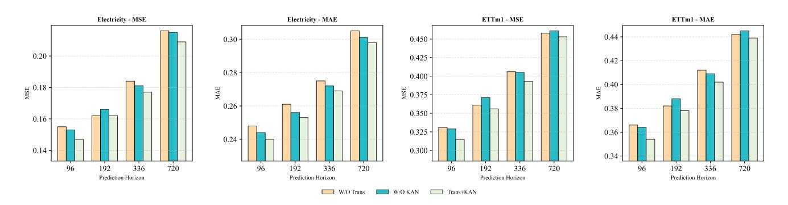

Figure 4: Ablation study comparing Time-TK with its architectural variants on the Electricity and ETTm1 datasets across multiple prediction horizons.

has stronger representational capacity than MLP. Moreover, MI-KAN outperforms the B-spline-based KAN, further validating the effectiveness of adopting RBFs.

Table 7: Prediction performance under different input lengths on the ETTm1 dataset. The input length is selected as L={48,96,144,192,288,384,480}, and the fixed prediction length is F=96. MOTE can effectively enhance the learning of historical information.

| Model Metric | MSE   | PatchTST MAE | MSE   | +MOTE MAE | MSE   | iTrans MAE | MSE   | +MOTE MAE |
|--------------|-------|--------------|-------|-----------|-------|------------|-------|-----------|
| 48           | 0.502 | 0.437        | 0.504 | 0.440     | 0.458 | 0.424      | 0.450 | 0.420     |
| 96           | 0.329 | 0.365        | 0.340 | 0.368     | 0.336 | 0.370      | 0.342 | 0.375     |
| 144          | 0.324 | 0.359        | 0.316 | 0.356     | 0.318 | 0.363      | 0.311 | 0.361     |
| 192          | 0.307 | 0.347        | 0.304 | 0.348     | 0.316 | 0.363      | 0.306 | 0.358     |
| 288          | 0.296 | 0.344        | 0.292 | 0.343     | 0.303 | 0.357      | 0.305 | 0.358     |
| 384          | 0.298 | 0.345        | 0.291 | 0.343     | 0.310 | 0.364      | 0.305 | 0.358     |
| 480          | 0.297 | 0.346        | 0.291 | 0.342     | 0.314 | 0.366      | 0.304 | 0.357     |

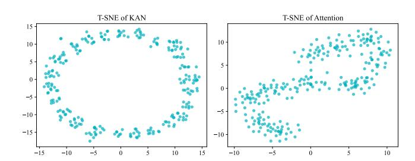

Figure 5: t-SNE visualization after KAN and Transformer.

### 4.4 Effectiveness of combining KAN and Transformer

To validate the synergistic effectiveness of the two core components in Time-TK, Transformer and KAN, we conducted a comprehensive ablation study, with the results shown in Figure [4.](#page-6-0) In the experiment, we compared the full model (Trans+KAN) with two variants: one with the Transformer attention mechanism removed (W/O Trans), and another with the KAN module removed (W/O KAN). The results clearly indicate that our full model achieved the optimal results across all prediction horizons. This finding strongly demonstrates that removing either key component leads to a significant degradation in model performance, thus confirming the indispensability of both modules. We further investigate this synergy by visualizing intermediate feature representations with t-SNE, as shown in Fig. tkt. As the first module in our architecture, KAN (Figure [5,](#page-6-1) left) acts as a nonlinear feature extractor that maps the raw input sequence onto a ring-shaped manifold with clear periodic structure, revealing the underlying nonlinear patterns before temporal dependencies are modeled. The subsequent Transformer attention (Figure [5,](#page-6-1) right) then performs weighted aggregation over multiple time steps on this manifold to capture long-range dependencies, which leads to a more "mixed" cloud in the t-SNE projection rather than strictly separated clusters. Overall, this visualization suggests that MOTE and KAN together organize the raw series into structured continuous representations and support multi-scale temporal integration on top of them.

#### 4.5 Performance promotion

In addition to the ablation study on Multi-Offset Token Embedding (MOTE), we further evaluate its generalizability and transferability across different models. Specifically, we integrate MOTE into three representative models with different embedding strategies to verify whether it can enhance performance:

i) For iTransformer [\[28\]](#page-8-36) with holistic embedding, we apply MOTE for embedding and interaction before the attention module to enhance intra-sequence modeling capability; ii) For PatchTST [\[30\]](#page-8-35) with patch embedding, we apply multi-offset sequences to its patch attention, enabling finer-grained modeling of the sequence structure; iii) For TimesNet [\[37\]](#page-8-34) with channel-mixing architecture, we introduce MOTE before the convolution operations, allowing the model to better capture complex periodic patterns.

As shown in Table [5,](#page-5-3) integrating the multi-offset embedding into all three architectures consistently improves forecasting performance, demonstrating that MOTE can be widely applied to various

prediction models and that our proposed embedding mechanism exhibits strong scalability.

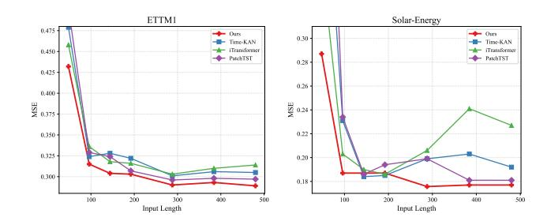

Figure 6: The prediction performance under different input lengths on two datasets. The input lengths are selected as L={48,96,144,192,288,384,480}, with a fixed prediction length of F=96

### 4.6 Increasing lookback Window

Theoretically, based on statistical methods [\[3\]](#page-8-44), rich historical information helps models capture long-term dependencies in time series. A well-designed forecasting model should be able to effectively leverage longer historical sequences to improve predictive performance. As shown in Figure [6,](#page-7-0) with the increase of input length, the iTransformer [\[28\]](#page-8-36) using full-sequence token embedding shows a significant drop in prediction accuracy, indicating that directly embedding the entire sequence may overlook finer-grained local information within the sequence, thus limiting modeling capacity for long inputs. In contrast, models using patch token embedding, such as TimeKAN [\[15\]](#page-8-40), and PatchTST [\[30\]](#page-8-35), exhibit more stable performance as the input length increases, suggesting that the patching mechanism helps mitigate performance degradation from long inputs. However, the increased number of patches also leads to higher memory costs, which limits scalability in long sequence modeling. Notably, our Time-TK benefits from the MOTE embedding strategy, where we embed multi-offset sub-sequences independently, enabling the model to adapt to longer lookback windows while maintaining low computational cost.

Previous studies show that the predictive performance of Transformer models does not necessarily improve with longer lookback lengths [\[46\]](#page-8-11). Therefore, we introduce MOTE into two attentionbased models, PatchTST and iTransformer. As shown in Table [7,](#page-6-2) the original models exhibit a general performance drop as input length increases, while after incorporating MOTE, both models surprisingly benefit from the extended historical window more effectively.

# 4.7 Computational Cost

To evaluate the computational cost of different models, we compare their GPU memory usage under varying input sequence lengths, as shown in Figure [7.](#page-7-1) iTransformer consistently maintains high GPU memory consumption across all input lengths, with minimal variation, primarily due to its full-sequence embedding strategy, which makes its computational complexity less sensitive to input length. In contrast, the memory usage of PatchTST and TimeKAN

increases significantly with longer sequences, owing to their patchbased embedding strategies, where the growing number of patches leads to higher memory overhead. Notably, our proposed Time-TK demonstrates excellent memory efficiency across different input lengths while still achieving superior predictive performance (see Figure [6\)](#page-7-0). This indicates that the designed Multi-Offset Token Embedding (MOTE) strategy can effectively utilize long historical information without introducing substantial computational burden, making Time-TK an efficient forecasting framework well-suited for long-sequence modeling.

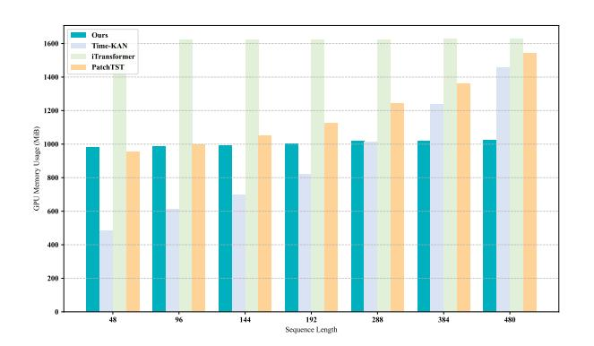

Figure 7: Comparison of GPU memory usage of different models at different input sequence lengths.

# 5 Conclusion

This paper proposes a novel time series forecasting framework, Time-TK, which combines a Multi-Offset Token Embedding (MOTE) strategy with Multi-Offset Temporal Interaction. Unlike existing mainstream embedding methods, MOTE models the input sequence at multiple offset positions, enabling more efficient capture of both local and global temporal dynamics. It enhances the utilization of long historical information without significantly increasing memory overhead. Specifically, we first apply multi-offset embedding and then perform multi-offset temporal interaction to learn temporal dependencies across different time spans. Extensive experiments on 13 public datasets demonstrate that Time-TK outperforms existing state-of-the-art methods in both prediction accuracy and generalization capability. Notably, the MOTE embedding not only improves our model's performance but also shows consistent gains when integrated into other architectures with different embedding schemes, further validating its generality and effectiveness. Time-TK offers new insights and directions for designing efficient and scalable time series forecasting models.

# Acknowledgements

This work was supported in part by the following: the Joint Fund of the National Natural Science Foundation of China under Grant Nos. U24A20219, U24A20328, U22A2033, the National Natural Science Foundation of China under Grant No. 62272281, the Special Funds for Taishan Scholars Project under Grant No. tsqn202306274, and the Youth Innovation Technology Project of Higher School in Shandong Province under Grant No. 2023KJ212.

### References

[1] Razan Alkhanbouli, Hour Matar Abdulla Almadhaani, Farah Alhosani, and Mecit Can Emre Simsekler. 2025. The role of explainable artificial intelligence in disease prediction: a systematic literature review and future research directions. BMC medical informatics and decision making 25, 1 (2025), 110. [2] Adebiyi A Ariyo, Adewumi O Adewumi, and Charles K Ayo. 2014. Stock price prediction using the ARIMA model. In 2014 UKSim-AMSS 16th international conference on computer modelling and simulation. IEEE, 106–112. [3] George EP Box and Gwilym M Jenkins. 1968. Some recent advances in forecasting and control. Journal of the Royal Statistical Society. Series C (Applied Statistics) 17, 2 (1968), 91–109. [4] Roman Bresson, Giannis Nikolentzos, George Panagopoulos, Michail Chatzianastasis, Jun Pang, and Michalis Vazirgiannis. 2024. Kagnns: Kolmogorov-arnold networks meet graph learning. arXiv preprint arXiv:2406.18380 (2024). [5] Ruichu Cai, Zhifan Jiang, Kaitao Zheng, Zijian Li, Weilin Chen, Xuexin Chen, Yifan Shen, Guangyi Chen, Zhifeng Hao, and Kun Zhang. 2025. Learning disentangled representation for multi-modal time-series sensing signals. In Proceedings of the ACM on Web Conference 2025. 3247–3266. [6] Wanlin Cai, Yuxuan Liang, Xianggen Liu, Jianshuai Feng, and Yuankai Wu. 2024. Msgnet: Learning multi-scale inter-series correlations for multivariate time series forecasting. In Proceedings of the AAAI conference on artificial intelligence, Vol. 38. 11141–11149. [7] Chaochao Chen, Yizhao Zhang, Yuyuan Li, Jun Wang, Lianyong Qi, Xiaolong Xu, Xiaolin Zheng, and Jianwei Yin. 2024. Post-training attribute unlearning in recommender systems. ACM Transactions on Information Systems 43, 1 (2024), 1–28. [8] Xiaohong Chen, Canran Xiao, and Yongmei Liu. 2024. Confusion-resistant federated learning via diffusion-based data harmonization on non-IID data. In Proceedings of the 38th International Conference on Neural Information Processing Systems. 137495–137520. [9] Shiming Fan, Hua Wang, and Fan Zhang. 2025. CAWformer: A cross variable attention with discrete wavelet denoising for multivariate time series forecasting. Knowledge-Based Systems (2025), 113846. [10] Felix A Gers, Jürgen Schmidhuber, and Fred Cummins. 2000. Learning to forget: Continual prediction with LSTM. Neural computation 12, 10 (2000), 2451–2471. [11] Lu Han, Xu-Yang Chen, Han-Jia Ye, and De-Chuan Zhan. 2024. Softs: Efficient multivariate time series forecasting with series-core fusion. arXiv preprint arXiv:2404.14197 (2024). [12] Xiao Han, Xinfeng Zhang, Yiling Wu, Zhenduo Zhang, and Zhe Wu. 2024. Are KANs Effective for Multivariate Time Series Forecasting? arXiv preprint arXiv:2408.11306 (2024). [13] Sepp Hochreiter and Jürgen Schmidhuber. 1997. Long short-term memory. Neural computation 9, 8 (1997), 1735–1780. [14] Qihe Huang, Zhengyang Zhou, Kuo Yang, and Yang Wang. 2025. Exploiting Language Power for Time Series Forecasting with Exogenous Variables. In Proceedings of the ACM on Web Conference 2025. 4043–4052. [15] Songtao Huang, Zhen Zhao, Can Li, and Lei Bai. 2025. Timekan: Kan-based frequency decomposition learning architecture for long-term time series forecasting. arXiv preprint arXiv:2502.06910 (2025). [16] Xuanwen Huang, Yang Yang, Yang Wang, Chunping Wang, Zhisheng Zhang, Jiarong Xu, Lei Chen, and Michalis Vazirgiannis. 2022. Dgraph: A large-scale financial dataset for graph anomaly detection. Advances in Neural Information Processing Systems 35 (2022), 22765–22777. [17] Zahra Karevan and Johan AK Suykens. 2020. Transductive LSTM for time-series prediction: An application to weather forecasting. Neural Networks 125 (2020), 1–9. [18] Zong Ke, Yuqing Cao, Zhenrui Chen, Yuchen Yin, Shouchao He, and Yu Cheng. 2025. Early warning of cryptocurrency reversal risks via multi-source data. Finance Research Letters (2025), 107890. [19] Zong Ke, Jiaqing Shen, Xuanyi Zhao, Xinghao Fu, Yang Wang, Zichao Li, Lingjie Liu, and Huailing Mu. 2025. A stable technical feature with GRU-CNN-GA fusion. Applied Soft Computing (2025), 114302. [20] Diederik P Kingma and Jimmy Ba. 2014. Adam: A method for stochastic optimization. arXiv preprint arXiv:1412.6980 (2014). [21] Yuyuan Li, Chaochao Chen, Yizhao Zhang, Weiming Liu, Lingjuan Lyu, Xiaolin Zheng, Dan Meng, and Jun Wang. 2023. Ultrare: Enhancing receraser for recommendation unlearning via error decomposition. Advances in Neural Information Processing Systems 36 (2023), 12611–12625. [22] Yuyuan Li, Xiaohua Feng, Chaochao Chen, and Qiang Yang. 2025. A Survey on Recommendation Unlearning: Fundamentals, Taxonomy, Evaluation, and Open Questions . IEEE Transactions on Knowledge & Data Engineering 01 (2025), 1–20. [doi:10.1109/TKDE.2025.3638174](https://doi.org/10.1109/TKDE.2025.3638174) [23] Yuyuan Li, Yizhao Zhang, Weiming Liu, Xiaohua Feng, Zhongxuan Han, Chaochao Chen, and Chenggang Yan. 2025. Multi-Objective Unlearning in Recommender Systems via Preference Guided Pareto Exploration. IEEE Transactions on Services Computing (2025). [24] Ziyao Li. 2024. Kolmogorov-arnold networks are radial basis function networks. arXiv preprint arXiv:2405.06721 (2024). [25] Zhiming Lin, Kai Zhao, Sophie Zhang, Peilai Yu, and Canran Xiao. 2025. CEC-Zero: Zero-Supervision Character Error Correction with Self-Generated Rewards. arXiv preprint arXiv:2512.23971 (2025). [26] Dingyuan Liu, Qiannan Shen, and Jiaci Liu. 2026. The Health-Wealth Gradient in Labor Markets: Integrating Health, Insurance, and Social Metrics to Predict Employment Density. (January 2026). [doi:10.21203/rs.3.rs-8497932/v1](https://doi.org/10.21203/rs.3.rs-8497932/v1) Preprint, posted January 4, 2026. [27] Minhao Liu, Ailing Zeng, Muxi Chen, Zhijian Xu, Qiuxia Lai, Lingna Ma, and Qiang Xu. 2022. Scinet: Time series modeling and forecasting with sample convolution and interaction. Advances in Neural Information Processing Systems 35 (2022), 5816–5828. [28] Yong Liu, Tengge Hu, Haoran Zhang, Haixu Wu, Shiyu Wang, Lintao Ma, and Mingsheng Long. 2024. iTransformer: Inverted Transformers Are Effective for Time Series Forecasting. In The Twelfth International Conference on Learning Representations.<https://openreview.net/forum?id=JePfAI8fah> [29] Ziming Liu, Yixuan Wang, Sachin Vaidya, Fabian Ruehle, James Halverson, Marin Soljačić, Thomas Y Hou, and Max Tegmark. 2024. Kan: Kolmogorov-arnold networks. arXiv preprint arXiv:2404.19756 (2024). [30] Yuqi Nie, Nam H Nguyen, Phanwadee Sinthong, and Jayant Kalagnanam. 2023. A time series is worth 64 words: Long-term forecasting with transformers. arXiv preprint arXiv:2211.14730 (2023). [31] Xiangfei Qiu, Xingjian Wu, Yan Lin, Chenjuan Guo, Jilin Hu, and Bin Yang. 2024. Duet: Dual clustering enhanced multivariate time series forecasting. arXiv preprint arXiv:2412.10859 (2024). [32] Qiannan Shen and Jing Zhang. 2025. AI-Enhanced Disaster Risk Prediction with Explainable SHAP Analysis: A Multi-Class Classification Approach Using XGBoost. [doi:10.21203/rs.3.rs-8437180/v1](https://doi.org/10.21203/rs.3.rs-8437180/v1) Preprint, Version 1, posted December 31, 2025. [33] Haotian Si, Changhua Pei, Jianhui Li, Dan Pei, and Gaogang Xie. 2025. CMoS: Rethinking Time Series Prediction Through the Lens of Chunk-wise Spatial Correlations. arXiv preprint arXiv:2505.19090 (2025). [34] Yixiao Teng, Jiamei Lv, Ziping Wang, Yi Gao, and Wei Dong. 2025. TimeChain: A Secure and Decentralized Off-chain Storage System for IoT Time Series Data. In Proceedings of the ACM on Web Conference 2025. 3651–3659. [35] Ashish Vaswani, Noam Shazeer, Niki Parmar, Jakob Uszkoreit, Llion Jones, Aidan N Gomez, Łukasz Kaiser, and Illia Polosukhin. 2017. Attention is all you need. Advances in neural information processing systems 30 (2017). [36] Shiyu Wang, Haixu Wu, Xiaoming Shi, Tengge Hu, Huakun Luo, Lintao Ma, James Y Zhang, and Jun Zhou. 2024. Timemixer: Decomposable multiscale mixing for time series forecasting. arXiv preprint arXiv:2405.14616 (2024). [37] Haixu Wu, Tengge Hu, Yong Liu, Hang Zhou, Jianmin Wang, and Mingsheng Long. 2023. Timesnet: Temporal 2d-variation modeling for general time series analysis. (2023). [38] Haixu Wu, Jiehui Xu, Jianmin Wang, and Mingsheng Long. 2021. Autoformer: Decomposition transformers with auto-correlation for long-term series forecasting. Advances in neural information processing systems 34 (2021), 22419–22430. [39] Canran Xiao, Jiabao Dou, Zhiming Lin, Zong Ke, and Liwei Hou. 2025. From Points to Coalitions: Hierarchical Contrastive Shapley Values for Prioritizing Data Samples. arXiv preprint arXiv:2512.19363 (2025). [40] Canran Xiao, Chuangxin Zhao, Zong Ke, and Fei Shen. 2025. Curiosity meets cooperation: A game-theoretic approach to long-tail multi-label learning. arXiv preprint arXiv:2510.17520 (2025). [41] Yongzheng Xie, Hongyu Zhang, and Muhammad Ali Babar. 2025. Multivariate Time Series Anomaly Detection by Capturing Coarse-Grained Intra-and Inter-Variate Dependencies. In Proceedings of the ACM on Web Conference 2025. 697–705. [42] Xiongxiao Xu, Canyu Chen, Yueqing Liang, Baixiang Huang, Guangji Bai, Liang Zhao, and Kai Shu. 2024. Sst: Multi-scale hybrid mamba-transformer experts for long-short range time series forecasting. arXiv preprint arXiv:2404.14757 (2024). [43] Jiawei Yao, Chuming Li, and Canran Xiao. 2024. Swift sampler: Efficient learning of sampler by 10 parameters. Advances in Neural Information Processing Systems 37 (2024), 59030–59053. [44] Hua Ye, Siyuan Chen, Ziqi Zhong, Canran Xiao, Haoliang Zhang, Yuhan Wu, and Fei Shen. 2026. Seeing through the Conflict: Transparent Knowledge Conflict Handling in Retrieval-Augmented Generation. arXiv preprint arXiv:2601.06842 (2026). [45] Guoqi Yu, Jing Zou, Xiaowei Hu, Angelica I Aviles-Rivero, Jing Qin, and Shujun Wang. 2024. Revitalizing multivariate time series forecasting: Learnable decomposition with inter-series dependencies and intra-series variations modeling. arXiv preprint arXiv:2402.12694 (2024). [46] Ailing Zeng, Muxi Chen, Lei Zhang, and Qiang Xu. 2023. Are transformers effective for time series forecasting?. In Proceedings of the AAAI conference on artificial intelligence, Vol. 37. 11121–11128. [47] Fan Zhang, Gongguan Chen, Hua Wang, Jinjiang Li, and Caiming Zhang. 2023. Multi-scale video super-resolution transformer with polynomial approximation. IEEE Transactions on Circuits and Systems for Video Technology 33, 9 (2023), 4496– 4506.

[48] Fan Zhang, Gongguan Chen, Hua Wang, and Caiming Zhang. 2024. CF-DAN: Facial-expression recognition based on cross-fusion dual-attention network. Computational Visual Media 10, 3 (2024), 593–608. [49] Yunhao Zhang and Junchi Yan. 2023. Crossformer: Transformer utilizing crossdimension dependency for multivariate time series forecasting. In The eleventh international conference on learning representations. [50] Haoyi Zhou, Shanghang Zhang, Jieqi Peng, Shuai Zhang, Jianxin Li, Hui Xiong, and Wancai Zhang. 2021. Informer: Beyond efficient transformer for long sequence time-series forecasting. In Proceedings of the AAAI conference on artificial intelligence, Vol. 35. 11106–11115. [51] Tian Zhou, Ziqing Ma, Qingsong Wen, Xue Wang, Liang Sun, and Rong Jin. 2022. Fedformer: Frequency enhanced decomposed transformer for long-term series forecasting. In International conference on machine learning. PMLR, 27268–27286.

## A Experimental Setting

# A.1 DATASET DESCRIPTIONS

To demonstrate the application effectiveness of Time-TK across various domains, we evaluated it on 14 different datasets. The descriptions of these datasets are as follows:

- ETT[2](#page-9-7) [\[50\]](#page-9-1): contains data with two different time granularities: one at the hourly level (ETTh) and the other at the 15-minute level (ETTm). This dataset records the temperature and load characteristics of seven oil transformers from July 2016 to July 2018.The Traffic dataset describes road occupancy, collected by sensors on the Francisco Freeway between 2015 and 2016, with hourly recordings.
- Exchange[3](#page-9-8) [\[38\]](#page-8-12): A panel dataset of daily exchange rates from eight countries, spanning from 1990 to 2016.
- Weather[4](#page-9-9) [\[38\]](#page-8-12): Records 21 weather indicators, such as air temperature and humidity, with data collected every 10 minutes in 2020, from locations in Germany.
- Electricity[5](#page-9-10) [\[38\]](#page-8-12): Includes hourly electricity consumption data from 321 customers between 2012 and 2014.
- Solar Energy[6](#page-9-11) : Contains solar power generation data from 137 photovoltaic plants in 2006, sampled every 10 minutes.
- PEMS[7](#page-9-12) [\[27\]](#page-8-45): Consists of California public transportation network data, collected in 5-minute windows. We use the same four public subsets (PEMS03, PEMS04, PEMS07, PEMS08) as those used in SCINet [\[27\]](#page-8-45).
- Traffic[8](#page-9-13) [\[38\]](#page-8-12): Collects hourly road occupancy data from 862 sensors on the San Francisco Freeway between January 2015 and December 2016.
- BTC/USDT[9](#page-9-14) : The latest 20,000 BTC/USDT data records, including the opening price, highest price, lowest price, closing price, and actual trading volume of each record.

The main details are provided in Table [1.](#page-4-0)

### A.2 Evaluation metrics

Mean square error (MSE) and Mean absolute error (MAE) are commonly used as measures of forecasting performance in time series

forecasting tasks. MSE represents the average of the squared differences between the predicted and actual values, giving more weight to larger deviations. MAE reflects the average of the absolute differences, thus providing a more balanced picture of the overall magnitude of the error. Together, these metrics constitute a comprehensive assessment of model accuracy. The mathematical definitions are as follows:

������ = F Í F ��=1 (Y�� − Yˆ ��) ������ = 1 F Í F ��=1 Y�� − Yˆ �������� = √︄ F Í F ��=1 (Y�� − Yˆ ��) ������ = √︄ ÍF ��=1 (Y�� −Yˆ �� ) √︄ ÍF ��=1 (Y�� −Y ) ¯ �������� = F Í F ��=1 Y�� −Yˆ Y�� (8)

Where F represents the size of the lookback window, Y�� represents the true value, and Yˆ �� represents the predicted value of the model.

# A.3 Experimental Details

Specifically, all experiments in this study were implemented using PyTorch and executed on a single NVIDIA A100-SXM GPU with 40 GB of memory. The models were trained using the Adam optimizer [\[20\]](#page-8-46) and optimized with the L2 loss function. The trainingvalidation-test split follows existing practices in the literature, such as those reported for iTransformer [\[28\]](#page-8-36) and TimesNet [\[37\]](#page-8-34). Specifically, the ETT and PEMS series datasets were split in a 6:2:2 ratio, while the remaining datasets used a 7:1:2 split. Time-TK was trained for 30 epochs with early stopping based on a patience of 3 on the validation set. For most datasets, the learning rate was set to 0.003, except for smaller datasets such as the ETT series, where it was reduced to 0.002. The batch size was adjusted based on the dataset size to maximize GPU utilization while avoiding memory overflow. For example, a batch size of 16 was used for the Traffic dataset, while a batch size of 64 was used for the Weather dataset. To ensure reproducibility, all experiments were conducted with a fixed random seed of 2024.

# B Full Results

In this section, we present the full results of the experiments conducted in this study, as shown in Table [8.](#page-10-0) The results cover evaluations across different datasets, demonstrating the robustness of the proposed method in various real-world scenarios. Additionally, we provide detailed performance curves, as shown in Figures 1-4, for a comprehensive understanding of the model's behavior. This section aims to provide readers with a complete view of the experimental outcomes, complementing the discussions in the main body of the paper. We provide detailed tables and figures to facilitate a deeper interpretation of the results and to support the conclusions drawn in the preceding sections. Table [9](#page-11-2) shows the statistical significance test results.

2<https://github.com/zhouhaoyi/ETDataset>

3<https://github.com/laiguokun/multivariate-time-series-data>

4<https://www.bgc-jena.mpg.de/wetter/>

5<https://archive.ics.uci.edu/ml/datasets/ElectricityLoadDiagrams20112014>

6<https://www.nrel.gov/grid/solar-power-data.html>

7<https://pems.dot.ca.gov/>

8<https://pems.dot.ca.gov/>

9[https://www.kaggle.com/datasets/shivaverse/btcusdt-5-minute-ohlc-volume-data-](https://www.kaggle.com/datasets/shivaverse/btcusdt-5-minute-ohlc-volume-data-2017-2025)[2017-2025](https://www.kaggle.com/datasets/shivaverse/btcusdt-5-minute-ohlc-volume-data-2017-2025)

Table 8: All experiments fix the lookback length L = 96. For PEMS, the prediction length is F ∈{12, 24, 48, 96}; for other datasets, the prediction length is F ∈ {96, 192, 336, 720}. The best result is bold, the second best result is underlined.

| Models Metrics | MSE   | Ours MAE | MSE   | MMK MAE | MSE   | TimeKAN MAE | MSE   | CMoS MAE | MSE   | MSGNet MAE | MSE   | iTrans MAE | MSE   | TimeMixer MAE | MSE   | PatchTST MAE | MSE   | TimesNet MAE | MSE   | DLinear MAE | MSE   | Crossformer MAE |
|----------------|-------|----------|-------|---------|-------|-------------|-------|----------|-------|------------|-------|------------|-------|---------------|-------|--------------|-------|--------------|-------|-------------|-------|-----------------|
| 96             | 0.370 | 0.393    | 0.374 | 0.397   | 0.373 | 0.397       | 0.396 | 0.403    | 0.390 | 0.411      | 0.394 | 0.409      | 0.381 | 0.401         | 0.414 | 0.419        | 0.384 | 0.402        | 0.386 | 0.400       | 0.423 | 0.448           |
| 192            | 0.423 | 0.421    | 0.419 | 0.429   | 0.414 | 0.421       | 0.432 | 0.428    | 0.443 | 0.442      | 0.448 | 0.441      | 0.440 | 0.433         | 0.460 | 0.445        | 0.436 | 0.429        | 0.437 | 0.432       | 0.471 | 0.474           |
| 336            | 0.465 | 0.444    | 0.461 | 0.450   | 0.451 | 0.442       | 0.481 | 0.454    | 0.482 | 0.469      | 0.491 | 0.464      | 0.501 | 0.462         | 0.501 | 0.466        | 0.491 | 0.469        | 0.481 | 0.459       | 0.570 | 0.546           |
| 720            | 0.470 | 0.462    | 0.474 | 0.467   | 0.460 | 0.460       | 0.482 | 0.482    | 0.496 | 0.488      | 0.519 | 0.502      | 0.501 | 0.482         | 0.500 | 0.488        | 0.521 | 0.500        | 0.519 | 0.516       | 0.653 | 0.621           |
| avg            | 0.432 | 0.430    | 0.432 | 0.436   | 0.425 | 0.430       | 0.448 | 0.442    | 0.453 | 0.453      | 0.463 | 0.454      | 0.458 | 0.445         | 0.469 | 0.454        | 0.458 | 0.450        | 0.456 | 0.452       | 0.529 | 0.522           |
| 96             | 0.293 | 0.340    | 0.301 | 0.353   | 0.293 | 0.341       | 0.309 | 0.351    | 0.329 | 0.371      | 0.297 | 0.349      | 0.292 | 0.343         | 0.292 | 0.345        | 0.340 | 0.374        | 0.333 | 0.387       | 0.745 | 0.584           |
| 192            | 0.368 | 0.388    | 0.379 | 0.405   | 0.377 | 0.391       | 0.396 | 0.404    | 0.402 | 0.414      | 0.380 | 0.400      | 0.378 | 0.397         | 0.388 | 0.405        | 0.402 | 0.414        | 0.477 | 0.476       | 0.877 | 0.656           |
| 336            | 0.410 | 0.423    | 0.432 | 0.446   | 0.423 | 0.435       | 0.431 | 0.437    | 0.440 | 0.445      | 0.428 | 0.432      | 0.432 | 0.434         | 0.427 | 0.436        | 0.452 | 0.452        | 0.594 | 0.541       | 1.043 | 0.731           |
| 720            | 0.418 | 0.438    | 0.446 | 0.463   | 0.467 | 0.465       | 0.431 | 0.446    | 0.480 | 0.477      | 0.427 | 0.445      | 0.454 | 0.458         | 0.447 | 0.458        | 0.462 | 0.468        | 0.831 | 0.657       | 1.104 | 0.763           |
| avg            | 0.372 | 0.397    | 0.390 | 0.417   | 0.390 | 0.408       | 0.392 | 0.410    | 0.413 | 0.427      | 0.383 | 0.407      | 0.384 | 0.407         | 0.389 | 0.411        | 0.414 | 0.427        | 0.559 | 0.515       | 0.942 | 0.684           |
| 96             | 0.315 | 0.354    | 0.320 | 0.358   | 0.324 | 0.361       | 0.354 | 0.381    | 0.319 | 0.366      | 0.336 | 0.370      | 0.328 | 0.363         | 0.329 | 0.365        | 0.338 | 0.375        | 0.345 | 0.372       | 0.404 | 0.426           |
| 192            | 0.356 | 0.378    | 0.364 | 0.383   | 0.357 | 0.383       | 0.390 | 0.396    | 0.377 | 0.397      | 0.381 | 0.395      | 0.364 | 0.384         | 0.380 | 0.394        | 0.374 | 0.387        | 0.380 | 0.389       | 0.450 | 0.451           |
| 336            | 0.393 | 0.402    | 0.395 | 0.405   | 0.386 | 0.404       | 0.423 | 0.418    | 0.417 | 0.422      | 0.417 | 0.418      | 0.390 | 0.404         | 0.400 | 0.410        | 0.410 | 0.411        | 0.413 | 0.413       | 0.532 | 0.515           |
| 720            | 0.453 | 0.439    | 0.457 | 0.440   | 0.447 | 0.437       | 0.481 | 0.445    | 0.487 | 0.463      | 0.487 | 0.456      | 0.458 | 0.445         | 0.475 | 0.453        | 0.478 | 0.450        | 0.474 | 0.453       | 0.666 | 0.589           |
| avg            | 0.379 | 0.393    | 0.384 | 0.397   | 0.379 | 0.396       | 0.412 | 0.410    | 0.400 | 0.412      | 0.405 | 0.410      | 0.385 | 0.399         | 0.396 | 0.406        | 0.400 | 0.406        | 0.403 | 0.407       | 0.513 | 0.495           |
| 96             | 0.173 | 0.253    | 0.176 | 0.261   | 0.174 | 0.255       | 0.186 | 0.270    | 0.182 | 0.266      | 0.185 | 0.271      | 0.178 | 0.259         | 0.193 | 0.280        | 0.187 | 0.267        | 0.193 | 0.292       | 0.287 | 0.366           |
| 192            | 0.238 | 0.298    | 0.240 | 0.302   | 0.239 | 0.299       | 0.248 | 0.307    | 0.248 | 0.306      | 0.251 | 0.312      | 0.242 | 0.303         | 0.246 | 0.307        | 0.249 | 0.309        | 0.284 | 0.362       | 0.414 | 0.492           |
| 336            | 0.298 | 0.339    | 0.299 | 0.342   | 0.305 | 0.343       | 0.308 | 0.344    | 0.312 | 0.346      | 0.314 | 0.350      | 0.304 | 0.342         | 0.314 | 0.351        | 0.321 | 0.351        | 0.369 | 0.427       | 0.597 | 0.542           |
| 720            | 0.395 | 0.395    | 0.397 | 0.401   | 0.399 | 0.400       | 0.409 | 0.400    | 0.414 | 0.404      | 0.411 | 0.405      | 0.395 | 0.397         | 0.410 | 0.405        | 0.408 | 0.403        | 0.554 | 0.522       | 1.730 | 1.042           |
| avg            | 0.276 | 0.321    | 0.278 | 0.327   | 0.279 | 0.324       | 0.288 | 0.330    | 0.289 | 0.330      | 0.290 | 0.335      | 0.280 | 0.325         | 0.291 | 0.336        | 0.291 | 0.333        | 0.350 | 0.401       | 0.757 | 0.611           |
| 96             | 0.147 | 0.240    | 0.166 | 0.256   | 0.174 | 0.266       | 0.179 | 0.262    | 0.165 | 0.274      | 0.148 | 0.240      | 0.153 | 0.244         | 0.188 | 0.280        | 0.168 | 0.272        | 0.197 | 0.282       | 0.219 | 0.314           |
| 192            | 0.162 | 0.253    | 0.187 | 0.274   | 0.182 | 0.273       | 0.186 | 0.269    | 0.185 | 0.292      | 0.162 | 0.253      | 0.166 | 0.256         | 0.193 | 0.285        | 0.184 | 0.289        | 0.196 | 0.285       | 0.231 | 0.322           |
| 336            | 0.177 | 0.269    | 0.204 | 0.290   | 0.197 | 0.286       | 0.202 | 0.285    | 0.197 | 0.304      | 0.178 | 0.269      | 0.184 | 0.275         | 0.211 | 0.302        | 0.198 | 0.300        | 0.209 | 0.301       | 0.246 | 0.337           |
| 720            | 0.209 | 0.298    | 0.247 | 0.323   | 0.236 | 0.320       | 0.247 | 0.321    | 0.231 | 0.332      | 0.225 | 0.317      | 0.226 | 0.313         | 0.253 | 0.335        | 0.220 | 0.320        | 0.245 | 0.333       | 0.280 | 0.363           |
| avg            | 0.174 | 0.265    | 0.201 | 0.286   | 0.197 | 0.286       | 0.204 | 0.284    | 0.194 | 0.301      | 0.178 | 0.270      | 0.182 | 0.272         | 0.211 | 0.301        | 0.193 | 0.295        | 0.212 | 0.300       | 0.244 | 0.334           |
| 96             | 0.083 | 0.202    | 0.089 | 0.208   | 0.084 | 0.203       | 0.098 | 0.232    | 0.102 | 0.230      | 0.088 | 0.209      | 0.087 | 0.206         | 0.090 | 0.211        | 0.107 | 0.234        | 0.088 | 0.218       | 0.139 | 0.265           |
| 192            | 0.168 | 0.292    | 0.183 | 0.302   | 0.187 | 0.307       | 0.202 | 0.324    | 0.195 | 0.317      | 0.183 | 0.308      | 0.193 | 0.310         | 0.186 | 0.307        | 0.226 | 0.344        | 0.176 | 0.315       | 0.241 | 0.375           |
| 336            | 0.322 | 0.411    | 0.349 | 0.431   | 0.374 | 0.441       | 0.355 | 0.433    | 0.359 | 0.436      | 0.336 | 0.418      | 0.345 | 0.425         | 0.339 | 0.424        | 0.367 | 0.448        | 0.313 | 0.427       | 0.392 | 0.468           |
| 720            | 0.838 | 0.684    | 0.880 | 0.707   | 0.972 | 0.739       | 0.896 | 0.718    | 0.940 | 0.738      | 0.893 | 0.714      | 1.008 | 0.747         | 0.898 | 0.718        | 0.964 | 0.746        | 0.839 | 0.695       | 1.110 | 0.802           |
| avg            | 0.353 | 0.397    | 0.375 | 0.412   | 0.404 | 0.423       | 0.388 | 0.427    | 0.399 | 0.430      | 0.375 | 0.412      | 0.408 | 0.422         | 0.378 | 0.415        | 0.416 | 0.443        | 0.354 | 0.414       | 0.471 | 0.478           |
| 96             | 0.187 | 0.234    | 0.216 | 0.298   | 0.231 | 0.288       | 0.286 | 0.295    | 0.210 | 0.246      | 0.203 | 0.238      | 0.215 | 0.294         | 0.234 | 0.286        | 0.250 | 0.292        | 0.290 | 0.378       | 0.310 | 0.331           |
| 192            | 0.205 | 0.256    | 0.241 | 0.282   | 0.290 | 0.323       | 0.323 | 0.318    | 0.265 | 0.290      | 0.233 | 0.261      | 0.237 | 0.275         | 0.267 | 0.310        | 0.296 | 0.318        | 0.320 | 0.398       | 0.734 | 0.725           |
| 336            | 0.213 | 0.271    | 0.263 | 0.304   | 0.326 | 0.345       | 0.364 | 0.339    | 0.294 | 0.318      | 0.248 | 0.273      | 0.252 | 0.298         | 0.290 | 0.315        | 0.319 | 0.330        | 0.353 | 0.415       | 0.750 | 0.735           |
| 720            | 0.214 | 0.267    | 0.251 | 0.313   | 0.300 | 0.329       | 0.355 | 0.335    | 0.285 | 0.315      | 0.249 | 0.276      | 0.244 | 0.293         | 0.289 | 0.317        | 0.338 | 0.337        | 0.356 | 0.413       | 0.769 | 0.765           |
| avg            | 0.205 | 0.257    | 0.243 | 0.299   | 0.287 | 0.321       | 0.332 | 0.322    | 0.263 | 0.292      | 0.233 | 0.262      | 0.237 | 0.290         | 0.270 | 0.307        | 0.301 | 0.319        | 0.330 | 0.401       | 0.641 | 0.639           |
| 96             | 0.173 | 0.213    | 0.164 | 0.210   | 0.161 | 0.208       | 0.170 | 0.217    | 0.163 | 0.212      | 0.174 | 0.214      | 0.165 | 0.212         | 0.177 | 0.218        | 0.172 | 0.220        | 0.196 | 0.255       | 0.158 | 0.230           |
| 192            | 0.222 | 0.257    | 0.210 | 0.251   | 0.207 | 0.249       | 0.216 | 0.257    | 0.211 | 0.254      | 0.221 | 0.254      | 0.209 | 0.253         | 0.225 | 0.259        | 0.219 | 0.261        | 0.237 | 0.296       | 0.206 | 0.277           |
| 336            | 0.277 | 0.296    | 0.265 | 0.290   | 0.263 | 0.290       | 0.270 | 0.294    | 0.273 | 0.299      | 0.278 | 0.296      | 0.264 | 0.293         | 0.278 | 0.297        | 0.280 | 0.306        | 0.283 | 0.335       | 0.272 | 0.335           |
| 720            | 0.351 | 0.346    | 0.343 | 0.342   | 0.340 | 0.341       | 0.348 | 0.344    | 0.351 | 0.348      | 0.358 | 0.347      | 0.342 | 0.345         | 0.354 | 0.348        | 0.365 | 0.359        | 0.345 | 0.381       | 0.398 | 0.418           |
| avg            | 0.256 | 0.278    | 0.246 | 0.273   | 0.243 | 0.272       | 0.251 | 0.278    | 0.249 | 0.278      | 0.258 | 0.278      | 0.245 | 0.276         | 0.259 | 0.281        | 0.259 | 0.287        | 0.265 | 0.317       | 0.259 | 0.315           |
| 96             | 0.392 | 0.263    | 0.511 | 0.324   | 0.608 | 0.383       | 0.576 | 0.342    | 0.608 | 0.349      | 0.395 | 0.268      | 0.462 | 0.285         | 0.544 | 0.359        | 0.593 | 0.321        | 0.650 | 0.396       | 0.522 | 0.290           |
| 192            | 0.415 | 0.273    | 0.529 | 0.330   | 0.571 | 0.364       | 0.596 | 0.361    | 0.634 | 0.371      | 0.417 | 0.276      | 0.473 | 0.296         | 0.540 | 0.354        | 0.617 | 0.336        | 0.598 | 0.370       | 0.530 | 0.293           |
| 336            | 0.430 | 0.279    | 0.545 | 0.334   | 0.561 | 0.364       | 0.630 | 0.371    | 0.669 | 0.388      | 0.433 | 0.283      | 0.498 | 0.296         | 0.551 | 0.358        | 0.629 | 0.336        | 0.605 | 0.373       | 0.558 | 0.305           |
| 720            | 0.463 | 0.297    | 0.580 | 0.351   | 0.619 | 0.385       | 0.667 | 0.390    | 0.729 | 0.420      | 0.467 | 0.302      | 0.506 | 0.313         | 0.586 | 0.375        | 0.640 | 0.350        | 0.645 | 0.394       | 0.589 | 0.328           |
| avg            | 0.425 | 0.278    | 0.541 | 0.335   | 0.590 | 0.374       | 0.617 | 0.366    | 0.660 | 0.382      | 0.428 | 0.282      | 0.485 | 0.298         | 0.555 | 0.362        | 0.620 | 0.336        | 0.625 | 0.383       | 0.550 | 0.304           |
| 12             | 0.065 | 0.168    | 0.077 | 0.185   | 0.095 | 0.202       | 0.091 | 0.204    | 0.078 | 0.187      | 0.071 | 0.174      | 0.076 | 0.185         | 0.073 | 0.178        | 0.085 | 0.192        | 0.122 | 0.243       | 0.090 | 0.203           |
| 24             | 0.086 | 0.195    | 0.119 | 0.231   | 0.138 | 0.221       | 0.113 | 0.213    | 0.108 | 0.218      | 0.093 | 0.201      | 0.112 | 0.224         | 0.105 | 0.212        | 0.118 | 0.223        | 0.201 | 0.317       | 0.121 | 0.240           |
| 48             | 0.123 | 0.235    | 0.184 | 0.291   | 0.180 | 0.279       | 0.153 | 0.269    | 0.178 | 0.272      | 0.125 | 0.236      | 0.181 | 0.281         | 0.159 | 0.264        | 0.155 | 0.260        | 0.333 | 0.425       | 0.202 | 0.317           |
| 96             | 0.172 | 0.277    | 0.251 | 0.336   | 0.272 | 0.329       | 0.232 | 0.324    | 0.238 | 0.328      | 0.164 | 0.275      | 0.205 | 0.343         | 0.210 | 0.305        | 0.228 | 0.317        | 0.457 | 0.515       | 0.262 | 0.367           |
| avg            | 0.112 | 0.219    | 0.158 | 0.261   | 0.171 | 0.258       | 0.147 | 0.253    | 0.150 | 0.251      | 0.113 | 0.221      | 0.144 | 0.258         | 0.137 | 0.240        | 0.147 | 0.248        | 0.278 | 0.375       | 0.169 | 0.281           |
| 12             | 0.076 | 0.178    | 0.096 | 0.205   | 0.102 | 0.202       | 0.092 | 0.208    | 0.086 | 0.199      | 0.078 | 0.183      | 0.091 | 0.203         | 0.085 | 0.189        | 0.087 | 0.195        | 0.148 | 0.272       | 0.098 | 0.218           |
| 24             | 0.091 | 0.199    | 0.128 | 0.247   | 0.133 | 0.241       | 0.112 | 0.253    | 0.101 | 0.218      | 0.095 | 0.205      | 0.129 | 0.243         | 0.115 | 0.222        | 0.103 | 0.215        | 0.224 | 0.340       | 0.131 | 0.256           |
| 48             | 0.119 | 0.231    | 0.164 | 0.309   | 0.142 | 0.271       | 0.128 | 0.247    | 0.127 | 0.247      | 0.120 | 0.233      | 0.199 | 0.303         | 0.167 | 0.273        | 0.136 | 0.250        | 0.355 | 0.437       | 0.205 | 0.326           |
| 96             | 0.150 | 0.262    | 0.221 | 0.355   | 0.214 | 0.321       | 0.163 | 0.286    | 0.174 | 0.292      | 0.150 | 0.262      | 0.223 | 0.338         | 0.211 | 0.310        | 0.190 | 0.303        | 0.452 | 0.504       | 0.402 | 0.457           |
| avg            | 0.109 | 0.218    | 0.152 | 0.279   | 0.148 | 0.259       | 0.124 | 0.249    | 0.122 | 0.239      | 0.111 | 0.221      | 0.161 | 0.272         | 0.145 | 0.249        | 0.129 | 0.241        | 0.295 | 0.388       | 0.209 | 0.314           |
| 12             | 0.058 | 0.153    | 0.072 | 0.174   | 0.083 | 0.196       | 0.073 | 0.186    | 0.079 | 0.182      | 0.067 | 0.165      | 0.069 | 0.175         | 0.068 | 0.163        | 0.082 | 0.181        | 0.115 | 0.242       | 0.094 | 0.200           |
| 24             | 0.076 | 0.176    | 0.117 | 0.222   | 0.101 | 0.211       | 0.110 | 0.209    | 0.099 | 0.206      | 0.088 | 0.190      | 0.107 | 0.216         | 0.102 | 0.201        | 0.101 | 0.204        | 0.210 | 0.329       | 0.139 | 0.247           |
| 48             | 0.106 | 0.211    | 0.169 | 0.246   | 0.172 | 0.264       | 0.165 | 0.264    | 0.133 | 0.239      | 0.110 | 0.215      | 0.175 | 0.272         | 0.170 | 0.261        | 0.134 | 0.238        | 0.398 | 0.458       | 0.311 | 0.369           |
| 96             | 0.132 | 0.241    | 0.192 | 0.291   | 0.199 | 0.289       | 0.268 | 0.328    | 0.179 | 0.279      | 0.139 | 0.245      | 0.295 | 0.350         | 0.236 | 0.308        | 0.181 | 0.279        | 0.594 | 0.553       | 0.396 | 0.442           |
| avg            | 0.093 | 0.195    | 0.138 | 0.233   | 0.139 | 0.240       | 0.154 | 0.247    | 0.122 | 0.227      | 0.101 | 0.204      | 0.162 | 0.253         | 0.144 | 0.233        | 0.124 | 0.225        | 0.329 | 0.395       | 0.235 | 0.315           |
| 12             | 0.076 | 0.175    | 0.088 | 0.191   | 0.103 | 0.217       | 0.095 | 0.202    | 0.105 | 0.211      | 0.079 | 0.182      | 0.093 | 0.202         | 0.098 | 0.205        | 0.112 | 0.212        | 0.154 | 0.276       | 0.165 | 0.214           |
| 24             | 0.106 | 0.206    | 0.139 | 0.243   | 0.176 | 0.287       | 0.118 | 0.231    | 0.141 | 0.243      | 0.115 | 0.219      | 0.148 | 0.261         | 0.162 | 0.266        | 0.141 | 0.238        | 0.248 | 0.353       | 0.215 | 0.260           |
| 48             | 0.183 | 0.251    | 0.265 | 0.302   | 0.241 | 0.329       | 0.189 | 0.285    | 0.211 | 0.300      | 0.186 | 0.235      | 0.280 | 0.357         | 0.238 | 0.311        | 0.198 | 0.283        | 0.440 | 0.470       | 0.315 | 0.355           |
| 96             | 0.215 | 0.262    | 0.363 | 0.336   | 0.332 | 0.331       | 0.302 | 0.301    | 0.364 | 0.387      | 0.221 | 0.267      | 0.301 | 0.363         | 0.303 | 0.318        | 0.320 | 0.351        | 0.674 | 0.565       | 0.377 | 0.397           |
| avg            | 0.145 | 0.224    | 0.214 | 0.268   | 0.213 | 0.291       | 0.176 | 0.255    | 0.205 | 0.285      | 0.150 | 0.226      | 0.206 | 0.296         | 0.200 | 0.275        | 0.193 | 0.271        | 0.379 | 0.416       | 0.268 | 0.307           |

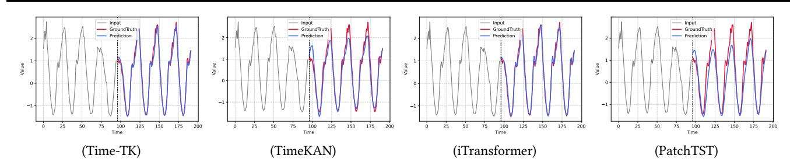

Figure 8: The performance of each model is visualized and compared on the traffic dataset with lookback window L =96, prediction window F = 96.

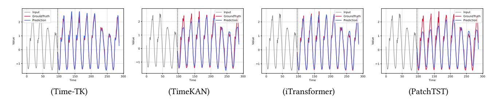

Figure 9: The performance of each model is visualized and compared on the traffic dataset with lookback window L =96, prediction window F = 192.

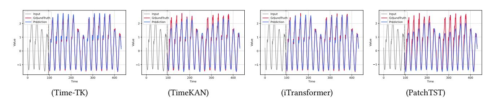

Figure 10: The performance of each model is visualized and compared on the traffic dataset with lookback window L =96, prediction window F = 336.

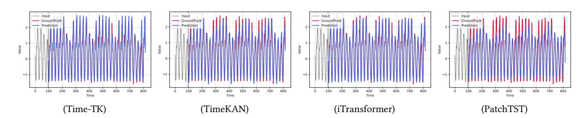

Figure 11: The performance of each model is visualized and compared on the traffic dataset with lookback window L =96, prediction window F = 720.

Table 9: Overall forecasting performance of Time-TK and TimeKAN on 10 benchmark datasets. We report mean ± standard deviation over three runs.

|              |   |     | MSE |     |   |     | MAE |     |   |     | MSE |     |   |     | MAE |     |
|--------------|---|-----|-----|-----|---|-----|-----|-----|---|-----|-----|-----|---|-----|-----|-----|
| ETTh1        | 0 | 433 | ± 0 | 005 | 0 | 430 | ± 0 | 003 | 0 | 425 | ± 0 | 005 | 0 | 430 | ± 0 | 004 |
| ETTh2        | 0 | 371 | ± 0 | 004 | 0 | 399 | ± 0 | 005 | 0 | 389 | ± 0 | 002 | 0 | 408 | ± 0 | 003 |
| ETTm1        | 0 | 380 | ± 0 | 004 | 0 | 395 | ± 0 | 004 | 0 | 381 | ± 0 | 005 | 0 | 397 | ± 0 | 004 |
| ETTm2        | 0 | 276 | ± 0 | 002 | 0 | 321 | ± 0 | 003 | 0 | 281 | ± 0 | 003 | 0 | 327 | ± 0 | 003 |
| Electricity  | 0 | 175 | ± 0 | 005 | 0 | 270 | ± 0 | 004 | 0 | 198 | ± 0 | 003 | 0 | 288 | ± 0 | 002 |
| Solar-Energy | 0 | 203 | ± 0 | 006 | 0 | 265 | ± 0 | 003 | 0 | 278 | ± 0 | 005 | 0 | 315 | ± 0 | 004 |
| Weather      | 0 | 255 | ± 0 | 003 | 0 | 278 | ± 0 | 002 | 0 | 244 | ± 0 | 005 | 0 | 273 | ± 0 | 003 |
| Traffic      | 0 | 425 | ± 0 | 004 | 0 | 278 | ± 0 | 002 | 0 | 593 | ± 0 | 003 | 0 | 378 | ± 0 | 005 |
| PEMS04       | 0 | 109 | ± 0 | 005 | 0 | 217 | ± 0 | 004 | 0 | 157 | ± 0 | 007 | 0 | 263 | ± 0 | 008 |
| PEMS08       | 0 | 149 | ± 0 | 005 | 0 | 232 | ± 0 | 006 | 0 | 217 | ± 0 | 004 | 0 | 293 | ± 0 | 006 |

#### C More Details of Time-TK

This algorithm describes the basic process of the Time-TK model. First, the input time series X ∈ R �� ×L is normalized using RevIN, resulting in X��. Then, the Multi-Offset Temporal Embedding (MOTE) method is applied to divide the normalized data into multiple subsequences with different time offsets,{M1, ..., ��O }. These subsequences are further processed by the Multi-Offset Interactive KAN (MI-KAN) module, yielding {M′ 1 , ..., ��′ }. For each subsequence, a Multi-Head Self-Attention (MSA) mechanism is applied to capture interactions, resulting in A�� . Subsequently, these interaction results are fused with the original sequence X through a global Multi-Head Self-Attention operation to generate the final representation H. Finally, the predictor is applied to H to obtain the prediction Yˆ , and the result is denormalized via the inverse ReVIN to obtain the final prediction output Yˆ . The algorithm continues until the stopping criteria are met.