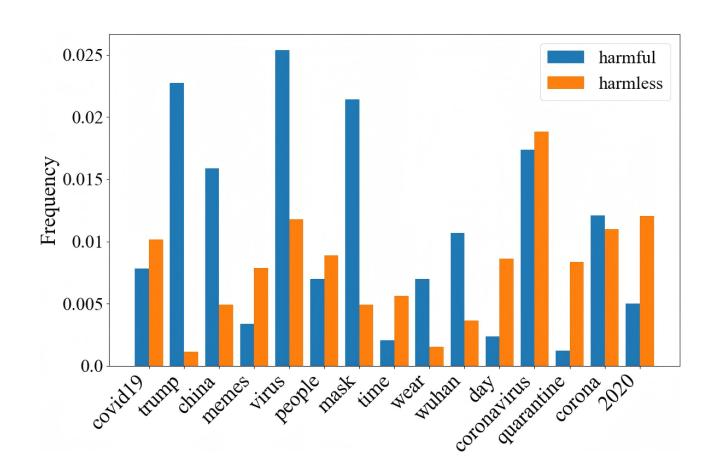
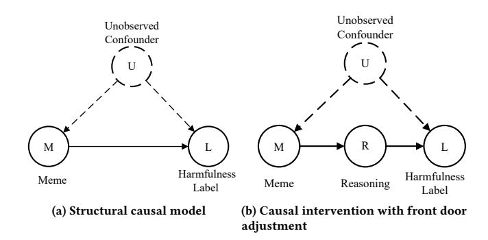
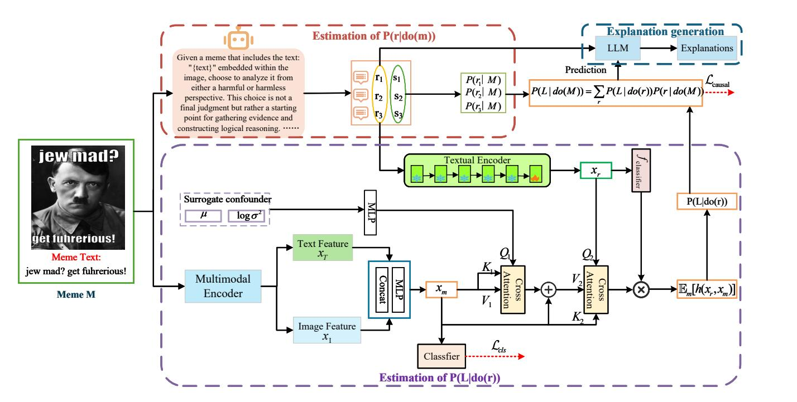
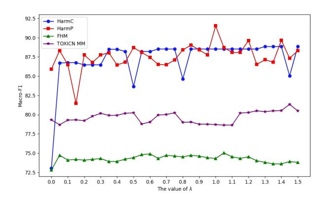
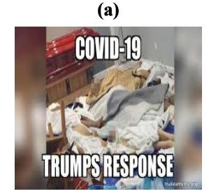
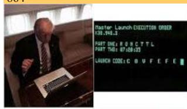

# Bias Mitigation for Harmful Meme Detection using Front-door Adjustment

[Jiangfeng Zeng](https://orcid.org/0000-0002-8270-0611)∗ Central China Normal University School of Information Management Wuhan, Hubei, China jfzeng@ccnu.edu.cn

[Cheng Xiong](https://orcid.org/0009-0004-7257-3681)∗ Wuhan University of Technology School of Computer and Artificial Intelligence Wuhan, Hubei, China chengxiong@whut.edu.cn

[Xiao Ma](https://orcid.org/0000-0002-2228-9955)† Zhongnan University of Economics and Law School of Information Engineering Wuhan, Hubei, China cindyma@zuel.edu.cn

[Jialin Qin](https://orcid.org/0009-0007-0613-5124) Central China Normal University School of Mathematics and Statistics Wuhan, Hubei, China shuijiao@mails.ccnu.edu.cn

### Abstract

Although Internet memes are frequently intended to be humorous, they can be deliberately weaponized to disseminate injurious content, exacerbate social cleavages, and incite discrimination. Existing harmful meme detectors predominantly focus on multimodal semantic fusion to capture the nuanced interplay across different modalities. However, they neglect latent data bias, resulting in incorrect predictions based on spurious label-specific features. To remedy this limitation, we propose CausalHM, a causally grounded framework that debiases harmful meme detection via front-door adjustment. We first reconstruct a structural causal model in which an unobserved confounder opens a back-door path between memes and harmfulness labels. Then, front-door adjustment blocks the back-door path by introducing reasoning as the mediator between memes and labels. Accordingly, the causal effect of memes on harmfulness labels is decomposed into: the effect of memes on the mediator, quantified by adopting multimodal large language models (MLLMs) with diverse beam search to calculate the probability of each reasoning sequence; and the effect of the mediator on labels, efficiently approximated by the normalised weighted geometric mean (NWGM) method. Finally, a LLM synthesizes post-hoc explanations from the reasoning sequences and predicted labels. Extensive empirical evaluations on four English and Chinese benchmarks demonstrate that CausalHM attains state-of-the-art performance while concurrently furnishing informative explanations.

## CCS Concepts

#### • Computing methodologies → Natural language processing.

#### Keywords

Harmful Meme Detection; Front-door Adjustment; Reasoning; Bias Mitigation; Explainability

#### ACM Reference Format:

Jiangfeng Zeng, Cheng Xiong, Xiao Ma, and Jialin Qin. 2026. Bias Mitigation for Harmful Meme Detection using Front-door Adjustment. In Proceedings

∗Both authors contributed equally to this research.

†Corresponding author.

[This work is licensed under a Creative Commons Attribution 4.0 International License.](https://creativecommons.org/licenses/by/4.0) WWW '26, Dubai, United Arab Emirates © 2026 Copyright held by the owner/author(s). ACM ISBN 979-8-4007-2307-0/2026/04 <https://doi.org/10.1145/3774904.3792627>

of the ACM Web Conference 2026 (WWW '26), April 13–17, 2026, Dubai, United Arab Emirates. ACM, New York, NY, USA, [12](#page-11-0) pages. [https://doi.org/10.1145/](https://doi.org/10.1145/3774904.3792627) [3774904.3792627](https://doi.org/10.1145/3774904.3792627)

### 1 Introduction

#### Figure 1: The word frequency distribution of embedded text on different labels (HarmC dataset).

Internet memes — multimodal artefacts that couple an image with a short text — have become a dominant vehicle for public commentary on socio-political events. Their humour and shareability accelerate viral dissemination across social media platforms, yet they can also be weaponized by unscrupulous creators in political and sociocultural conflicts, thereby shifting their impact from entertainment to harm. Harmful memes[1](#page-0-0) refer to maliciously exploited memes that use humor or satire as a cover to spread hate speech, discrimination, misleading information, or extremist ideologies, resulting in group stigmatization, online radicalization, and even real-world harm [\[37\]](#page-8-0). A paradigmatic case is Donald Trump, whose controversial social-media pronouncements were rapidly repurposed into harmful memes. These memes not only inflicted reputational harm on Trump personally, but also amplified stigmatizing discourse that could exacerbate international confrontation between the United States and China, particularly through the use of terms such as "Trump virus" and "China Virus". Therefore, efforts to protect users from toxic memes necessitate the development of automatic detectors capable of identifying harmful memes.

1Disclaimer: This paper contains content that may be disturbing to some readers.

Figure 2: Structural causal model for harmful meme detection.

Identifying harmful memes is inherently challenging due to the abstruse nature of memes. Earlier work [\[32\]](#page-8-1) leveraged pre-trained visual and textual unimodal detectors like BERT [\[9\]](#page-8-2) and Faster R-CNN [\[34\]](#page-8-3) to learn representations in isolation for prediction. Nevertheless, the strategical amalgamation of images and text prioritizes methods comprehensively analyzing the nuanced interplay across different modalities over isolated analysis of each modality. A considerable number of studies [\[15,](#page-8-4) [17,](#page-8-5) [18,](#page-8-6) [36\]](#page-8-7) are dedicated to capturing multimodal features from images, text, and implicit context to detect the harmfulness of memes. MOMENTA [\[33\]](#page-8-8) aligned local and global unimodal features with background context. Pro-Cap [\[2\]](#page-8-9) introduced a probing-based captioning technique by leveraging the frozen pre-trained vision-language model (PVLM) to yield descriptive image captions. Owing to the powerful semantic understanding capabilities of multimodal large language models (MLLMs) [\[46\]](#page-9-0), MLLMs were employed to enrich the background contextual information. ExplainHM [\[21\]](#page-8-10) elicited MLLMs in a debate manner to generate dialectical rationales from both harmful and harmless standpoints which not only facilitated multimodal fusion but also served as explanations behind decisions.

Despite their notable success in discerning harmful memes, these methods remain vulnerable to unexpected data bias that may mislead models to explore spurious correlations between meme patterns and labels. Due to the human-centric nature of data creation and collection, human annotators and data curators inevitably embed various implicit or explicit biases into datasets, including entity bias [\[51\]](#page-9-1), psycholinguistic bias [\[5\]](#page-8-11), etc. Further compounding this challenge, data bias exhibits high diversity and sophistication, thereby rendering manual enumeration and identification of all potential bias sources a computationally and cognitively intractable task. Take the HarmC dataset [\[32\]](#page-8-1) as example, as showcased in Figure [1,](#page-0-1) word frequency statistics uncover that terms such as "Trump", "mask", "China" and "Wuhan" exhibit strong statistical correlation with the label "HARMFUL" while "quarantine", "day" and "memes" are disproportionately associated with the label "HARMLESS". As a consequence, models learn spurious label-specific features from these biases as shortcuts rather than understanding the semantic rationales when training, which unavoidably undermines their ability to generalize to unseen test data where such biases are eliminated.

Recently, causal inference [\[31\]](#page-8-12) has emerged as a preferred paradigm for developing debiased models through causal intervention or counterfactual reasoning across various tasks [\[25,](#page-8-13) [44,](#page-9-2) [47\]](#page-9-3). As

illustrated in Figure [2\(](#page-1-0)a), conventional approaches directly estimate the total causal effect �� (�� | ��) of input memes (��) on output labels (��) while overlooking the unobserved confounder (�� ). From a causal inference standpoint, the presence of �� introduces a backdoor path [\[31\]](#page-8-12) �� ← �� → ��, thereby mixing the genuine causal effect of �� on �� with spurious correlations. However, back-door adjustment is infeasible here because the unobserved confounder �� absorbs various biases which cannot be exhaustively enumerated and identified.

To remedy this issue, we propose CausalHM[2](#page-1-1) , a novel debiasing framework that adopts the front-door adjustment to disentangle causal signals from bias, enabling robust and causally grounded predictions for harmful meme detection. As formalized in Figure [2\(](#page-1-0)b), reasoning (��), independent of the unobserved confounder �� , is introduced as the mediator that bridges memes (��) and harmfulness labels (��). The causal effect of �� on �� is then decomposed into two components: the causal effect of �� on �� and the causal effect of �� on ��. Specifically, to quantify the causal effect between �� and ��, we draw inspiration from [\[25\]](#page-8-13) and instantiate �� using reasoning sequences generated by multimodal large language models (MLLMs) with diverse beam search [\[38\]](#page-8-14). To calculate the causal effect between �� and ��, we apply the normalized weighted geometric mean (NWGM) [\[41,](#page-9-4) [47,](#page-9-3) [48\]](#page-9-5) approximation to yield unbiased outcomes based on the generated reasoning sequences. Furthermore, to render the model's predictions transparent, we prompt a LLM to synthesize post-hoc explanations from reasoning and the predicted harmfulness labels.

Our principal contributions are four-fold:

- (1) To the best of our knowledge, we are the first to debias harmful meme detection from the perspective of casual inference.
- (2) We propose CausalHM that performs causal intervention with front-door adjustment by introducing reasoning between memes and harmfulness labels as the mediator. The mediator is instantiated by reasoning sequences generated by MLLMs with diverse beam search.
- (3) We leverage a LLM to produce informative explanations that integrate reasoning with the final detection decision, thereby surfacing latent semantic cues embedded in the multimodal meme content.
- (4) Extensive experiments on four English and Chinese datasets demonstrate the superiority of our proposed CausalHM over other non-debiased competitors in both model generalization and interpretability.

## 2 Related Work

Harmful Meme Detection. Early efforts in harmful meme detection primarily relied on unimodal representation learning, applying pre-trained encoders like BERT [\[9\]](#page-8-2) and Faster R-CNN [\[34\]](#page-8-3) to either the textual or visual component of memes in isolation. [\[32\]](#page-8-1) revealed that unimodal detectors exhibited limited performance since the strategic interplay between image and text was extraordinarily complex. Mainstream studies have converged on integrating textual, visual, and even contextual information to capture the nuanced interplay across modalities. MaskPrompt [\[3\]](#page-8-15) devised a multimodal prompt and applied a pre-trained language model to generate the

2https://github.com/critivitycheng/CausalHM

Figure 3: The framework of our proposed CausalHM. First, we estimate �� (�� | do(��)) using MLLMs with diversity beam search. Next, we apply the NWGM to approximate an unbiased estimate of �� (�� | do(��)). Finally, a LLM synthesizes explanations based on reasoning and predictions.

Estimating �� (�� | ���� (��)). Conditioning on �� blocks the backdoor path �� ← �� ← �� → ��, thereby satisfying the back-door criterion. Hence, the causal effect of �� on �� can be estimated as

�� (�� | ���� (��)) = ∑︁ �� (�� | ��,��) �� (��) (4)

### 4 Methodology

As delineated in Figure [3,](#page-3-0) CausalHM integrates three synergistic modules: (i) Estimating of �� (�� | do(��)) [\(4.1\)](#page-3-1), (ii) Estimation of �� (�� | do(��)) [\(4.2\)](#page-4-0) and (iii) Explanation Generation [\(4.3\)](#page-5-0). Firstly, we quantify �� (�� | do(��)) by leveraging MLLMs to generate reasoning together with sequence scores from either a harmful or harmless perspective. Secondly, the NWGM is used to approximate an unbiased estimate of �� (�� | do(��)). Thirdly, we employ diverse beam search to estimate �� (�� | do(��)) and optimize the model with our well-designed objective function [\(4.4\)](#page-5-1). Finally, a LLM yields informative explanations based on reasoning and predictions.

## 4.1 Estimation of �� (�� | do(��))

As formalized in Equation [\(3\)](#page-2-1), the interventional distribution �� (�� | ���� (��)) is equivalently expressed as �� (�� | ��), thereby enabling direct estimation from the empirical data. The remaining challenge therefore centres on the sampling of the front-door variable R. Contemporary MLLMs have achieved substantial advances in comprehending multimodal semantics, extending beyond surface-level text and image cues to encompass implicit knowledge such as commonsense knowledge and cultural context. Following [\[25\]](#page-8-13), we employ MLLMs to sample the front-door variable.

Specifically, given a meme sample�� = {��,�� }, we curate a prompt template �� that embeds the textual component �� and is subsequently fed to a vision-language model (e.g., LLaVA [\[24\]](#page-8-27)). Based on this prompt, the MLLM generates one piece of reasoning �� articulated from either a harmful or harmless standpoint. The prompt template �� �� is designed as follows:

"Given a meme that includes the text: [�� ] embedded within the image, choose to analyze it from either a harmful or harmless perspective. This choice is not a final judgment but rather a starting point for gathering evidence and constructing logical reasoning. Examine how the visual and textual elements interact within broader cultural, social, and psychological frameworks. Assess whether the meme relies on stereotypes, references sensitive historical or political events, or generates strong emotional responses, and uncover how these clues might shape the viewer's interpretation. Under the selected perspective, pinpoint specific features within the meme that underpin the reasoning. The objective is to practice formulating structured reasoning by compiling relevant evidence and explaining how it aligns with the chosen perspective, rather than issuing a conclusive judgment."

Front-door adjustment necessitates a portfolio of high-probability yet distinct reasoning sequences. [\[25\]](#page-8-13) used the standard beam search to sample multiple pieces of reasoning as the front-door variables, resulting in insufficient diversity among reasoning sequences. Instead, we deploy the diverse beam search [\[38\]](#page-8-14) to sample multiple distinct reasoning sequences. Diverse beam search augments vanilla beam search by explicitly penalizing redundancy. Candidate sequences are partitioned into groups at each decoding step, and a group-wise diversity penalty suppresses intra-group similarity, thereby yielding a heterogeneous set of high-probability outputs.

#### 4.3 Explanation Generation

To overcome the opacity of black-box detectors, this section synthesizes human-readable textual explanations based on reasoning �� and prediction results, surfacing the implicit meaning embedded in memes. Specifically, given a meme sample �� = {��,�� }, we construct a prompt template �� that integrates the meme text �� , its corresponding reasoning �� = {��1, ��2, ..., ���� } generated by MLLMs, and the final predicted harmfulness label ��pred. The prompt template �� is structured as follows:

You are given a meme containing the embedded text: [�� ]. Below are [��] pieces of reasoning from either a harmful or harmless viewpoint: [��]. Your task is two-fold: (i) extract the reasons that support the classification of this meme as [��pred] from the reasoning; (ii) provide a clear and structured explanation that justifies this prediction on the basis of the selected reasons.

Based on this prompt template, the vision LLM distills evidence from multiple reasoning sequences, aligns the selected arguments with the predicted label ��pred, and generates an explanation �� that is simultaneously human-readable and information-rich.

#### 4.4 Loss function

To ensure the model encodes causal relations while learning discriminative representations, we devise a joint objective comprising the causal loss and the classification loss.

Causal Loss. The front-door adjustment introduces reasoning as the mediator ��, yielding a bias-free estimate of the causal effect of �� on �� without necessitating access to the unobserved confounder �� . In accordance with Equations [2,](#page-2-2) [6](#page-4-1) and [26,](#page-4-2) we can implement front-door adjustment as:

��causal = �� (�� | do(��)) (27)

= ∑︁ �� ∈�� exp(���� (��)) Í�� ��=1 exp(���� (���� )) softmax �������� + ������E�� [����] (28)

= E�� ∈�� [softmax �������� + ������E�� [����] ] (29)

Specifically, the binary cross-entropy loss is adopted for training:

Lcausal = −�� �� gold log�� �� causal − (1 − �� �� gold) log(1 − �� �� causal) (30)

where �� gold denotes the ground-truth label, and �� causal is the predicted probability based on front-door adjustment.

Classification Loss. To further enhance the discriminative capacity of multimodal representations, we introduce an auxiliary classification loss formulated as binary cross-entropy:

��cls = ��classifier(����) (31)

Lcls = −�� �� gold log�� �� cls − (1 − �� �� gold) log(1 − �� �� cls) (32)

where �� cls represents the predicted probability based solely on the multimodal features ����.

Joint Loss Function. To balance these complementary objectives, the overall optimization criterion is formulated as a weighted aggregation of the causal and classification losses:

Ltotal = Lcausal + ��Lcls (33)

where the trade-off hyper-parameter �� calibrates the relative influence of the causal and classification losses.

#### 5 EXPERIMENTS

#### 5.1 Experimental Setup

Datasets. We assess CausalHM on four real-world meme benchmarks: HarmC [\[32\]](#page-8-1), HarmP [\[33\]](#page-8-8), FHM [\[17\]](#page-8-5), and ToxiCN-MM [\[28\]](#page-8-24). As for HarmC and HarmP, originally annotated with three labels: very harmful, somewhat harmful, and not harmful, we collapse very harmful and somewhat harmful into a single harmful class to align with prior binarized evaluations [\[2,](#page-8-9) [3,](#page-8-15) [21,](#page-8-10) [33\]](#page-8-8). As for FHM, we manually annotate the unlabelled test split [\[3\]](#page-8-15). ToxiCN-MM[3](#page-5-2) , the first Chinese harmful meme dataset, consists of 12,000 samples. To preserve a standard train-validation-test split, we further partition the official training set into 8,400 training and 1,200 validation instances while keeping the original test set intact.

Baselines. CausalHM is evaluated against 10 competitors: 1) Text BERT [\[1,](#page-8-30) [8\]](#page-8-31); 2) Image-Region [\[34\]](#page-8-3); 3) Late Fusion [\[32\]](#page-8-1); 4) MMBT [\[16\]](#page-8-32); 5) VisualBERT COCO [\[20\]](#page-8-33); 6) ViLBERT CC [\[27\]](#page-8-34); 7) MOMENTA [\[33\]](#page-8-8); 8) MaskPrompt [\[3\]](#page-8-15); 9) Pro-Cap [\[2\]](#page-8-9); 10) ExplainHM [\[21\]](#page-8-10). In line with prior work [\[2,](#page-8-9) [3,](#page-8-15) [21,](#page-8-10) [33\]](#page-8-8), accuracy and macro-F1 score are reported as the evaluation metrics.

We append the data statistics, baseline descriptions, and implementation details in Appendices [A,](#page-9-11) [B,](#page-9-12) and [C,](#page-9-13) respectively.

### 5.2 Performance on Harmful Meme Detection

Table [1](#page-6-0) summarizes the harmful meme detection results on the four datasets, revealing the following salient findings:

1) Expectedly, our proposed CasualHM consistently delivers the state-of-the-art performance across all metrics and datasets, outperforming the strongest non-debiased baseline (ExplainHM) by 2.08%, 0.82%, 2.64%, and 1.81% in Macro-F1 on Harm-C, Harm-P, FHM, and ToxiCN\_MM, respectively. This confirms our hypothesis that non-debiased methods suffer heavily from hidden data bias, and demonstrates the efficacy of our debiasing framework with front-door adjustment in mitigating such unobserved bias.

2) Compared to ExplainHM, CausalHM yields substantially larger improvements on Harm-C, FHM, and ToxiCN-MM, while achieves comparatively modest gains on Harm-P. This indicates that Harm-C, FHM, and ToxiCN-MM are more susceptible to hidden data bias than Harm-P, and ExplainHM learned spurious label-specific features during training which didn't generalize well to the testing set. The comparatively modest gains on Harm-P may be attributed to the political domain's propensity for memes that repeatedly target identical figures or policies, thereby inducing spurious correlations that remain stable across training and test splits and consequently reduce the apparent benefit of causal debiasing.

3) Multimodal detectors demonstrate superior performance compared to unimodal counterparts, underscoring the critical importance of modeling fine-grained cross-modal interactions.

4) Among multimodal detectors, those that exploit LLMs to enrich background context systematically beat other baselines, suggesting the promising potential of LLMs for surfacing subtle harmful cues. For example, ExplainHM outperforms MMBT by 19.29%, 10.49%, 9.12%, and 2.75% in Macro-F1 on Harm-C, Harm-P, FHM, and ToxiCN-MM, respectively.

3[https://github.com/DUT-lujunyu/ToxiCN\\_MM](https://github.com/DUT-lujunyu/ToxiCN_MM)

Table 1: Harmful meme detection results on four datasets. The numbers marked with ♦ are taken from [\[21\]](#page-8-10). We mark the best and second-best results in bold and underlined, respectively.

| Model Text       | Dataset BERT [1, 8] |       | Accuracy 70.17 ♦ HarmC | Macro-F1 66.25 ♦ | Accuracy 80.12 ♦ HarmP | Macro-F1 78.35 ♦ Accuracy 63.48 | FHM Macro-F1 64.80 | Accuracy 79.92 | TOXICN MM Macro-F1 76.61 |
|------------------|---------------------|-------|------------------------|------------------|------------------------|---------------------------------|--------------------|----------------|--------------------------|
| Image-Region     | [34]                | 68.74 | ♦ 62.97                | ♦ 73.14          | ♦ 74.27                | ♦ 51.20                         | 49.88              | 69.25          | 63.93                    |
| Late Fusion      | [32]                | 73.24 | ♦ 70.25                | ♦ 78.26          | ♦ 76.50                | ♦ 64.20                         | 63.48              | 81.00          | 76.69                    |
| MMBT             | [16]                | 73.48 | ♦ 67.12                | ♦ 82.54          | ♦ 80.23                | ♦ 64.40                         | 63.26              | 80.63          | 76.78                    |
| VisualBERT       | COCO [20]           | 81.36 | ♦ 80.13                | ♦ 86.07          | ♦ 86.07                | ♦ 65.00                         | 64.89              | 73.25          | 68.15                    |
| ViLBERT          | CC [27]             | 78.70 | ♦ 77.09                | ♦ 87.25          | ♦ 86.01                | ♦ 65.70                         | 63.67              | 73.79          | 69.09                    |
| MOMENTA          | [33]                | 83.82 | ♦ 82.84                | ♦ 88.24          | ♦ 88.26                | ♦ 66.60                         | 64.72              | 76.13          | 69.97                    |
| MaskPrompt       | [3]                 | 84.47 | ♦ 81.51                | ♦ 88.17          | ♦ 87.09                | ♦ 70.40                         | 70.00              | 81.79          | 79.00                    |
| Pro-Cap          | [2]                 | 85.01 | ♦ 83.17                | ♦ 89.32          | ♦ 87.91                | ♦ 71.95                         | 71.30              | 81.62          | 79.34                    |
| ExplainHM        | [21]                | 87.00 | ♦ 86.41                | ♦ 90.73          | ♦ 90.72                | ♦ 72.90                         | 72.38              | 82.31          | 79.53                    |
| CasualHM         |                     | 89.27 | 88.49                  | 91.54            | 91.54                  | 75.02                           | 75.02              | 83.92          | 81.34                    |
| w/o intervention |                     | 85.03 | 83.81                  | 84.01            | 84.01                  | 68.20                           | 68.53              | 81.13          | 77.48                    |

5) Among unimodal detectors, Image-Region lags behind Text BERT across all metrics and datasets, indicating that the predominance of textual cues over visual ones in determining meme harmfulness. Identical visual elements can assume divergent harmfulness contingent on the accompanying text, making purely visual methods more susceptible to bias.

Figure 4: Impact of �� on F1-score across four datasets.

#### 5.3 Ablation Study

To investigate the contribution of causal intervention, we ablate the front-door adjustment part (denoted w/o intervention) by directly concatenating the multimodal meme encoding ���� with the reasoning encoding ���� for classification. It can be clearly seen from Table [1](#page-6-0) that excising the intervention part leads to a marked degradation: Macro-F1 drops from 88.49% to 83.81% on HarmC, from 91.54% to 84.01% on HarmP, from 75.02% to 68.20% on FHM and from 81.34% to 77.48% on ToxiCN-MM. These reductions underscore the indispensable role of front-door adjustment in bias mitigation.

### 5.4 Sensitivity analysis

The hyper-parameter �� governs the relative contribution of the causal loss and the classification loss. We performed a grid search over �� ∈ [0.0, 1.5] on the test splits of all four datasets. Figure [4](#page-6-1) shows that Macro-F1 curves first rise with mild oscillations and then fall with mild oscillations. This phenomenon illustrates the empirical trade-off imposed by front-door adjustment: if �� &lt; 1, the optimization is dominated by the causal loss, yielding poorly discriminative multimodal features and becoming easier to overfit especially when �� is too small; otherwise, the classification loss dominates, and the classifier is optimized almost exclusively for empirical risk when �� is too big, exposing model to hidden data bias. Peak Macro-F1s are attained at �� = 1.3, 1.0, 1.05, and 1.45 on HarmC, HarmP, FHM, and TOXIC-MM, respectively.

#### 5.5 Evaluation of Explainability

Automatic Evaluation. Conventional metrics fall short in evaluationg the quality of LLM-generated explanations [\[4\]](#page-8-35). Prior research has shown that ChatGPT-based assessors align closely with expert human judges [\[7,](#page-8-36) [14\]](#page-8-37). Following established studies [\[21,](#page-8-10) [39\]](#page-8-38), we employ GPT-5-mini to evaluate each explanation along four dimensions: 1) Informativeness reflects extent of novel background or contextual knowledge introduced; 2) Readability denotes grammatical correctness and structural clarity; 3) Soundness evaluates logical consistency and validity of the stated arguments; 4) Persuasiveness means convincingness and compellingness of the narrative. Quantification is performed on a five-point Likert scale, wherein 1 denotes the lowest and 5 the highest achievable quality.

Table [2](#page-7-0) reports the average ratings assigned by GPT-5-mini on HarmC test set and part of TOXICN-MM test set (i.e. randomly selecting 1,000 instances) for CausalHM versus ExplainHM. The results reveal two important findings.

1) CausalHM surpasses ExplainHM regarding Informativeness, Soundness, and Persuasiveness on both datasets. This advantage stems from their distinct generation pipelines: ExplainHM merely use the rationale of the "winning" LLM in a multimodal debate, whereas CausalHM aggregates reasoning from both harmful and harmless viewpoints and distills the evidence along with the predicted label. Therefore, CausalHM yields explanations that are simultaneously more comprehensive, logically coherent, persuasive, and information-rich.

2) In terms of readability, CausalHM scores slightly lower than ExplainHM on both datasets. This gap may be attributed to GPT-5-mini's preference for brevity. In the English dataset, ExplainHM

produces an average of 125.38 words per explanation, whereas CausalHM averages 253.15 words. Similarly, in the Chinese dataset, ExplainHM averages 144.31 words per explanation, while CausalHM averages 338.58 words. These results suggest that the richer level of detail provided by CausalHM is penalized under a concisenessoriented evaluation metric. Meanwhile, longer mean explanation length correlates positively with informativeness.

Table 2: Automatic GPT-5-mini evaluation of the explanation quality on harmful memes in HarmC and TOXICN MM datasets.

| Explanations    | ExplainHM | HarmC CausalHM | TOXICN ExplainHM | MM CausalHM |
|-----------------|-----------|----------------|------------------|-------------|
| Informativeness | 2.96      | 3.27           | 3.48             | 3.68        |
| Readability     | 4.36      | 3.71           | 4.48             | 3.89        |
| Soundness       | 2.97      | 3.27           | 3.44             | 3.71        |
| Persuasiveness  | 3.06      | 3.28           | 3.42             | 3.73        |

Human Evaluation. To alleviate the burden of manual assessment, we conduct a human evaluation on 100 randomly selected samples from each test split (HarmC and TOXICN-MM). 10 professional linguistic annotators are then asked to rate the explanations using metrics employed in automatic evaluation.

The results of human evaluation are presented in Table [3,](#page-7-1) from which we derive two principal findings:

1) Consistent with GPT-5-mini's assessment, the explanation scores of CausalHM exceeds ExplainHM across Informativeness, Soundness, and Persuasiveness. This infers that our method yields explanations of demonstrably superior quality.

2) CausalHM also marginally surpasses ExplainHM in Readability. Its superior logical coherence and persuasive force compensate for the slightly greater length, yielding explanations that raters judge easier to follow.

Table 3: Human evaluation of the explanation quality in HarmC and TOXICN-MM.

| Explanations    | ExplainHM | HarmC CausalHM | TOXICN ExplainHM | MM CausalHM |
|-----------------|-----------|----------------|------------------|-------------|
| Informativeness | 3.67      | 3.86           | 3.60             | 4.07        |
| Readability     | 3.90      | 3.96           | 3.83             | 3.95        |
| Soundness       | 3.59      | 3.91           | 3.51             | 4.01        |
| Persuasiveness  | 3.63      | 3.89           | 3.56             | 4.03        |

### 5.6 Case Study

Does CausalHM take effect on mitigating bias? Figure [1](#page-0-1) finds that "Donald Trump" and "2020" are strongly correlated with "harmful" and "harmless", respectively. As showcased in Figure [5,](#page-7-2) ExplainHM exploits these spurious correlations and mispredicts, whereas our CausalHM suppresses the shortcuts and yields correct decisions evidence that front-door adjustment effectively removes the embedded bias.

Does LLM-generated reasoning help to discern harmfulness? From the explanations we observe that the LLM' parametric knowledge accurately interprets multimodal content embeded in memes. In Figure [5\(](#page-7-2)a), the character Trump in the image is recognized and described as a well-known figure with controversial statements and actions. Figure [5\(](#page-7-2)b) is illustrated to be a harmful meme referencing the COVID-19 conspiracy theory. Treating such reasoning as the mediator variable, enabling CausalHM to base its decision on genuine rationales.

| Meme text: THROUGHOUT        |                                                                |
|------------------------------|----------------------------------------------------------------|
| MY LIFE, MY TWO              | GREATEST                                                       |
| ASSETS HAVE BEEN             | MENTAL                                                         |
| (a)                          | Label: Harmless                                                |
|                              | CausalHM: Harmless                                             |
|                              | ExplainHM: Harmful                                             |
| Meme text: mountain mama     |                                                                |
| (upockye O & Lucateero       | &                                                              |
| trump got it & 140 AM Det 2, |                                                                |
| 2020 Twitter tar Andioid     |                                                                |
|                              | Label: Harmful                                                 |
|                              | CausalHM: Harmful                                              |
|                              | to figure out if COVID is still a hoax now that trump got it " |
|                              | ExplainHM: Harmless                                            |

Figure 5: Case study. In contrast to ExplainHM, CausalHM correctly detects two biased examples in HarmC.

## 6 Conclusion and Future Work

We proposed CausalHM that debiases harmful meme detection with front-door adjustment by introducing reasoning between memes and harmfulness labels as the mediator. The true causal effect of M on L is accordingly decomposed into two components by the mediator. First, the effect of memes on the mediator was transformed to the probability of each reasoning sequence, estimated by MLLMs with diverse beam search. Second, the effect of the mediator on labels was efficiently approximated via the NWGM method. Moreover, a LLM was leveraged to yield informative explanations based on reasoning and predictions. Extensive experiments on four datasets showed CausalHM outperformed 10 competitors in both generalizability and interpretability. Despite the success, we intend to investigate a new explanation generation mechanism that enables explanations to reflect the debiasing effect on the model.

#### 7 Acknowledgments

This work is partially supported by National Natural Science Foundation of China (No. 62102159), Humanities and Social Science Fund of Ministry of Education of China (No. 21YJC870002), Natural Science Foundation of Hubei Province (No. 2023AFB1018 and No. 2024AFB957), Fundamental Research Funds for the Central Universities (No. CCNU25ZZ181) and International Research Center for Interdisciplinary Innovation in Artificial Intelligence and Digital Humanities.

#### References

- [1] Tom B. Brown, Benjamin Mann, Nick Ryder, Melanie Subbiah, Jared Kaplan, Prafulla Dhariwal, Arvind Neelakantan, Pranav Shyam, Girish Sastry, Amanda Askell, Sandhini Agarwal, Ariel Herbert-Voss, Gretchen Krueger, Tom Henighan, Rewon Child, Aditya Ramesh, Daniel M. Ziegler, Jeffrey Wu, Clemens Winter, Christopher Hesse, Mark Chen, Eric Sigler, Mateusz Litwin, Scott Gray, Benjamin Chess, Jack Clark, Christopher Berner, Sam McCandlish, Alec Radford, Ilya Sutskever, and Dario Amodei. 2020. Language Models are Few-Shot Learners. In Proceedings of the 34th Conference on Neural Information Processing Systems. [2] Rui Cao, Ming Shan Hee, Adriel Kuek, Wen-Haw Chong, Roy Ka-Wei Lee, and Jing Jiang. 2023. Pro-Cap: Leveraging a Frozen Vision-Language Model for Hateful Meme Detection. In Proceedings of the 31st ACM International Conference on Multimedia. 5244–5252. [3] Rui Cao, Roy Ka-Wei Lee, Wen-Haw Chong, and Jing Jiang. 2022. Prompting for Multimodal Hateful Meme Classification. In Proceedings of the 2022 Conference on Empirical Methods in Natural Language Processing. Association for Computational Linguistics, 321–332. [4] Yupeng Chang, Xu Wang, Jindong Wang, Yuan Wu, Linyi Yang, Kaijie Zhu, Hao Chen, Xiaoyuan Yi, Cunxiang Wang, Yidong Wang, Wei Ye, Yue Zhang, Yi Chang, Philip S. Yu, Qiang Yang, and Xing Xie. 2024. A Survey on Evaluation of Large Language Models. ACM Transactions on Intelligent Systems and Technology 15, 3 (2024), 39:1–39:45. [5] Ziwei Chen, Linmei Hu, Weixin Li, Yingxia Shao, and Liqiang Nie. 2023. Causal Intervention and Counterfactual Reasoning for Multi-modal Fake News Detection. In Proceedings of the 61st Annual Meeting of the Association for Computational Linguistics (Volume 1: Long Papers). 627–638. [6] Lu Cheng, Ruocheng Guo, Kasim Selçuk Candan, and Huan Liu. 2022. Effects of Multi-Aspect Online Reviews with Unobserved Confounders: Estimation and Implication. In Proceedings of the Sixteenth International Conference on Web and Social Media. 67–78. [7] David Cheng-Han Chiang and Hung-yi Lee. 2023. Can Large Language Models Be an Alternative to Human Evaluations?. In Proceedings of the 61st Annual Meeting of the Association for Computational Linguistics. 15607–15631. [8] Yiming Cui, Wanxiang Che, Ting Liu, Bing Qin, and Ziqing Yang. 2021. Pre-Training With Whole Word Masking for Chinese BERT. IEEE Transactions on Audio, Speech, and Language Processing 29 (2021), 3504–3514. [9] Jacob Devlin, Ming-Wei Chang, Kenton Lee, and Kristina Toutanova. 2019. BERT: Pre-training of Deep Bidirectional Transformers for Language Understanding. In Proceedings of the 2019 Conference of the North American Chapter of the Association for Computational Linguistics: Human Language Technologies, NAACL-HLT 2019(Long and Short Papers). 4171–4186. [10] Hexiang Gu, Qifan Yu, Saihui Hou, Zhiqin Fang, Huijia Wu, and Zhaofeng He. 2025. MemeMind: A Large-Scale Multimodal Dataset with Chain-of-Thought Reasoning for Harmful Meme Detection. arXiv preprint (2025). arXiv[:2506.18919](https://arxiv.org/abs/2506.18919) [11] Tianlong Gu, Mingfeng Feng, Xuan Feng, and Xuemin Wang. 2025. SCARE: A Novel Framework to Enhance Chinese Harmful Memes Detection. IEEE Transactions on Affective Computing 16, 2 (2025), 933–945. [12] Ming Shan Hee and Roy Ka-Wei Lee. 2025. Demystifying Hateful Content: Leveraging Large Multimodal Models for Hateful Meme Detection with Explainable Decisions. In Proceedings of the Nineteenth International AAAI Conference on Web and Social Media. 774–785. [13] Linmei Hu, Ziwei Chen, Ziwang Zhao, Jianhua Yin, and Liqiang Nie. 2023. Causal Inference for Leveraging Image-Text Matching Bias in Multi-Modal Fake News Detection. IEEE Transactions on Knowledge and Data Engineering 35, 11 (2023), 11141–11152. [14] Fan Huang, Haewoon Kwak, and Jisun An. 2023. Is ChatGPT better than Human Annotators? Potential and Limitations of ChatGPT in Explaining Implicit Hate Speech. In Proceedings of the ACM Web Conference 2023. 294–297. [15] Junhui Ji, Xuanrui Lin, and Usman Naseem. 2024. CapAlign: Improving Cross Modal Alignment via Informative Captioning for Harmful Meme Detection. In Proceedings of the ACM on Web Conference 2024. 4585–4594. [16] Douwe Kiela, Suvrat Bhooshan, Hamed Firooz, and Davide Testuggine. 2019. Supervised Multimodal Bitransformers for Classifying Images and Text. In NeurIPS 2019 Workshop. [17] Douwe Kiela, Hamed Firooz, Aravind Mohan, Vedanuj Goswami, Amanpreet Singh, Pratik Ringshia, and Davide Testuggine. 2020. The Hateful Memes Challenge: Detecting Hate Speech in Multimodal Memes. In Proceedings of the 33rd Conference on Neural Information Processing Systems. [18] Jian Lang, Rongpei Hong, Jin Xu, Yili Li, Xovee Xu, and Fan Zhou. [n. d.]. Biting Off More Than You Can Detect: Retrieval-Augmented Multimodal Experts for Short Video Hate Detection. In Proceedings of the ACM on Web Conference 2025, WWW 2025. 2763–2774. [19] Bo Li, Yuanhan Zhang, Dong Guo, Renrui Zhang, Feng Li, Hao Zhang, Kaichen Zhang, Peiyuan Zhang, Yanwei Li, Ziwei Liu, and Chunyuan Li. 2025. LLaVA-OneVision: Easy Visual Task Transfer. Trans. Mach. Learn. Res. 2025 (2025). [20] Liunian Harold Li, Mark Yatskar, Da Yin, Cho-Jui Hsieh, and Kai-Wei Chang. 2019. VisualBERT: A Simple and Performant Baseline for Vision and Language. arXiv preprint (2019). arXiv[:1908.03557](https://arxiv.org/abs/1908.03557) [21] Hongzhan Lin, Ziyang Luo, Wei Gao, Jing Ma, Bo Wang, and Ruichao Yang. 2024. Towards Explainable Harmful Meme Detection through Multimodal Debate between Large Language Models. In Proceedings of the ACM on Web Conference 2024. 2359–2370. [22] Hongzhan Lin, Ziyang Luo, Jing Ma, and Long Chen. 2023. Beneath the Surface: Unveiling Harmful Memes with Multimodal Reasoning Distilled from Large Language Models. In Findings of the Association for Computational Linguistics: EMNLP. 9114–9128. [23] Hongzhan Lin, Ziyang Luo, Bo Wang, Ruichao Yang, and Jing Ma. 2025. GOAT-Bench: Safety Insights to Large Multimodal Models through Meme-Based Social Abuse. ACM Transactions on Intelligent Systems and Technology (April 2025). [24] Haotian Liu, Chunyuan Li, Yuheng Li, and Yong Jae Lee. 2024. Improved Baselines with Visual Instruction Tuning. In Proceedings of the IEEE/CVF Conference on Computer Vision and Pattern Recognition. 26286–26296. [25] Yiran Liu, Xiaoang Xu, Zhiyi Hou, and Yang Yu. 2024. Causality Based Front-door Defense Against Backdoor Attack on Language Models. In Proceedings of the 41st International Conference on Machine Learning. [26] Ziyan Liu, Chunxiao Fan, Haoran Lou, Yuexin Wu, and Kaiwei Deng. 2025. MIND: A Multi-agent Framework for Zero-shot Harmful Meme Detection. In Proceedings of the 63rd Annual Meeting of the Association for Computational Linguistics. 923–
  - 947. [27] Jiasen Lu, Dhruv Batra, Devi Parikh, and Stefan Lee. 2019. ViLBERT: Pretraining Task-Agnostic Visiolinguistic Representations for Vision-and-Language Tasks. In Proceedings of the 33rd Conference on Neural Information Processing Systems. 13–23. [28] Junyu Lu, Bo Xu, Xiaokun Zhang, Hongbo Wang, Haohao Zhu, Dongyu Zhang, Liang Yang, and Hongfei Lin. 2024. Towards Comprehensive Detection of Chinese Harmful Memes. In Proceedings of the 38th Conference on Neural Information Processing Systems. [29] Abdullah Mazhar, Zuhair Hasan Shaik, Aseem Srivastava, Polly Ruhnke, Lavanya Vaddavalli, Sri Keshav Katragadda, Shweta Yadav, and Md. Shad Akhtar. [n. d.]. Figurative-cum-Commonsense Knowledge Infusion for Multimodal Mental Health Meme Classification. In Proceedings of the ACM on Web Conference 2025, WWW 2025. 637–648. [30] Jingbiao Mei, Jinghong Chen, Weizhe Lin, Bill Byrne, and Marcus Tomalin. 2024. Improving Hateful Meme Detection through Retrieval-Guided Contrastive Learning. In Proceedings of the 62nd Annual Meeting of the Association for Computational Linguistics. 5333–5347. [31] Judea Pearl, Madelyn Glymour, and Nicholas P Jewell. 2016. Causal inference in statistics: A primer. John Wiley & Sons. [32] Shraman Pramanick, Dimitar Dimitrov, Rituparna Mukherjee, Shivam Sharma, Md. Shad Akhtar, Preslav Nakov, and Tanmoy Chakraborty. 2021. Detecting Harmful Memes and Their Targets. In Findings of the Association for Computational Linguistics: ACL/IJCNLP 2021 (Findings of ACL, Vol. ACL/IJCNLP 2021). 2783–2796. [33] Shraman Pramanick, Shivam Sharma, Dimitar Dimitrov, Md. Shad Akhtar, Preslav Nakov, and Tanmoy Chakraborty. 2021. MOMENTA: A Multimodal Framework for Detecting Harmful Memes and Their Targets. In Findings of the Association for Computational Linguistics: EMNLP 2021. 4439–4455. [34] Shaoqing Ren, Kaiming He, Ross B. Girshick, and Jian Sun. 2017. Faster R-CNN: Towards Real-Time Object Detection with Region Proposal Networks. IEEE Transactions on Pattern Analysis and Machine Intelligence 39, 6 (2017), 1137–1149. [35] Naquee Rizwan, Paramananda Bhaskar, Mithun Das, Swadhin Satyaprakash Majhi, Punyajoy Saha, and Animesh Mukherjee. 2025. Exploring the Limits of Zero Shot Vision Language Models for Hate Meme Detection: The Vulnerabilities and their Interpretations. In Proceedings of the Nineteenth International AAAI Conference on Web and Social Media. 1669–1689. [36] Siddhant Bikram Shah, Shuvam Shiwakoti, Touhid Bhuiyan, Mohammad Ali Moni, Surendrabikram Thapa, and Usman Naseem. [n. d.]. Entity-Aware Optimal Transport and Residual Attention for Multimodal Content Moderation. In Companion Proceedings of the ACM on Web Conference 2025. 2306–2313. [37] Shivam Sharma, Firoj Alam, Md. Shad Akhtar, Dimitar Dimitrov, Giovanni Da San Martino, Hamed Firooz, Alon Y. Halevy, Fabrizio Silvestri, Preslav Nakov, and Tanmoy Chakraborty. 2022. Detecting and Understanding Harmful Memes: A Survey. In Proceedings of the 31st International Joint Conference on Artificial Intelligence. 5597–5606. [38] Ashwin K. Vijayakumar, Michael Cogswell, Ramprasaath R. Selvaraju, Qing Sun, Stefan Lee, David J. Crandall, and Dhruv Batra. 2018. Diverse Beam Search for Improved Description of Complex Scenes. In Proceedings of the 32nd AAAI Conference on Artificial Intelligence. 7371–7379. [39] Bo Wang, Jing Ma, Hongzhan Lin, Zhiwei Yang, Ruichao Yang, Yuan Tian, and Yi Chang. 2024. Explainable Fake News Detection with Large Language Model via Defense Among Competing Wisdom. In Proceedings of the ACM on Web Conference 2024. 2452–2463. [40] Yixin Wang and David M Blei. 2019. The blessings of multiple causes. J. Amer. Statist. Assoc. 114, 528 (2019), 1574–1596.

[41] Kelvin Xu, Jimmy Lei Ba, Ryan Kiros, Kyunghyun Cho, Aaron Courville, Ruslan Salakhutdinov, Richard S. Zemel, and Yoshua Bengio. 2015. Show, attend and tell: neural image caption generation with visual attention. In Proceedings of the 32nd International Conference on International Conference on Machine Learning. 2048–2057. [42] Shuyuan Xu, Juntao Tan, Shelby Heinecke, Vena Jia Li, and Yongfeng Zhang. 2023. Deconfounded Causal Collaborative Filtering. ACM Transactions on Recommender Systems 1, 4 (2023), 1–25. [43] Xiao Xu, Chenfei Wu, Shachar Rosenman, Vasudev Lal, Wanxiang Che, and Nan Duan. 2023. BridgeTower: Building Bridges between Encoders in Vision-Language Representation Learning. In Proceedings of the 37th AAAI Conference on Artificial Intelligence. 10637–10647. [44] Zhi Xu, Dingkang Yang, Mingcheng Li, Yuzheng Wang, Zhaoyu Chen, Jiawei Chen, Jinjie Wei, and Lihua Zhang. 2025. Debiased Multimodal Understanding for Human Language Sequences. In Proceedings of the 39th AAAI Conference on Artificial Intelligence. 14450–14458. [45] An Yang, Junshu Pan, Junyang Lin, Rui Men, Yichang Zhang, Jingren Zhou, and Chang Zhou. 2022. Chinese CLIP: Contrastive Vision-Language Pretraining in Chinese. arXiv preprint (2022). arXiv[:2211.01335](https://arxiv.org/abs/2211.01335) [46] Jie Yang, Wang Zeng, Sheng Jin, Lumin Xu, Wentao Liu, Chen Qian, and Ruimao Zhang. 2024. KptLLM: Unveiling the Power of Large Language Model for Keypoint Comprehension. In Proceedings of the 38th Conference on Neural Information Processing Systems. [47] Congzhi Zhang, Linhai Zhang, Jialong Wu, Yulan He, and Deyu Zhou. 2025. Causal Prompting: Debiasing Large Language Model Prompting Based on Front-Door Adjustment. In Proceedings of the 39th AAAI Conference on Artificial Intelligence. 25842–25850. [48] Congzhi Zhang, Linhai Zhang, and Deyu Zhou. 2024. Causal Walk: Debiasing Multi-Hop Fact Verification with Front-Door Adjustment. In Proceedings of the 38th AAAI Conference on Artificial Intelligence. 19533–19541. [49] Yang Zhang, Fuli Feng, Xiangnan He, Tianxin Wei, Chonggang Song, Guohui Ling, and Yongdong Zhang. 2021. Causal Intervention for Leveraging Popularity Bias in Recommendation. In Proceedings of the 44th International ACM SIGIR Conference on Research and Development in Information Retrieval. 11–20. [50] Yaochen Zhu, Yinhan He, Jing Ma, Mengxuan Hu, Sheng Li, and Jundong Li. 2024. Causal Inference with Latent Variables: Recent Advances and Future Prospectives. In Proceedings of the 30th ACM SIGKDD Conference on Knowledge Discovery and Data Mining. 6677–6687. [51] Yongchun Zhu, Qiang Sheng, Juan Cao, Shuokai Li, Danding Wang, and Fuzhen Zhuang. 2022. Generalizing to the Future: Mitigating Entity Bias in Fake News Detection. In Proceedings of the 45th International ACM SIGIR Conference on Research and Development in Information Retrieval. 2120–2125. [52] Yong Zhuang, Keyan Guo, Juan Wang, Yiheng Jing, Xiaoyang Xu, Wenzhe Yi, Mengda Yang, Bo Zhao, and Hongxin Hu. 2025. I know what you MEME! Understanding and Detecting Harmful Memes with Multimodal Large Language Models. In Proceedings of the 32nd Annual Network and Distributed System Security Symposium.

### A DATASETS AND METRICS

Summary statistics for the four datasets are presented in Table [4.](#page-9-14)

Table 4: Dataset statistics for harmful and harmless instances.

| Datasets  | #harmful | Train #harmless | #harmful | Val #harmless | #harmful | Test #harmless |
|-----------|----------|-----------------|----------|---------------|----------|----------------|
| Harm-C    | 1064     | 1949            | 61       | 116           | 124      | 230            |
| Harm-P    | 1486     | 1534            | 86       | 91            | 173      | 182            |
| FHM       | 3050     | 5450            | 250      | 250           | 500      | 500            |
| TOXICN MM | 2700     | 5700            | 375      | 825           | 765      | 1635           |

## B BASELINES

Ten SOTA methods were chosen to compete our propose CausalHM for harmful meme detection: 1) Text BERT [\[1,](#page-8-30) [8\]](#page-8-31), a text-only approach that leverages BERT for classification. 2) Image-Region [\[34\]](#page-8-3), a vision-only model that extracts image features using Faster R-CNN with ResNet-152. 3) Late Fusion [\[32\]](#page-8-1), a multimodal method that combines prediction scores from BERT and ResNet-152. 4) MMBT [\[16\]](#page-8-32), a multimodal bi-transformer designed to capture both intramodal and intermodal interactions. 5) VisualBERT COCO [\[20\]](#page-8-33), a variant of VisualBERT pretrained on the COCO dataset for

multimodal understanding. 6) ViLBERT CC [\[27\]](#page-8-34), a task-agnostic model that learns joint text-image representations. 7) MOMENTA [\[33\]](#page-8-8), which integrates global and local contextual information from both meme text and image. 8) MaskPrompt [\[3\]](#page-8-15), which constructs masked language modeling prompts by concatenating meme text with generated image captions. 9) Pro-Cap [\[2\]](#page-8-9), an enhanced caption-based variant of MaskPrompt that improves image captioning using PVLMs. 10) ExplainHM [\[21\]](#page-8-10), which employs multimodal debates between LLMs to generate explanations from both harmful and harmless viewpoints, followed by fine-tuning a SLM to serve as a debate judge for harmfulness prediction.

## C IMPLEMENTATION DETAILS

## C.1 Implementation of CasualHM

All experiments were conducted on a Linux server equipped with an NVIDIA RTX A6000 GPU. When estimating �� (�� | do(��)), we employed LLaVA-1.5-13B [\[24\]](#page-8-27) for English datasets and llavaonevision-qwen2-7b-si-hf [\[19\]](#page-8-39) for Chinese datasets to generate reasoning sequences. The diverse beam search was configured with six groups, a diversity penalty of 0.8, and three output sequences (�� = 3). When estimating �� (�� | do(��)), CausalHM used BridgeTower ("bridgetower-base") [\[43\]](#page-9-9) as the multimodal encoder and BERT ("bert-base-uncased") [\[9\]](#page-8-2) as the textual encoder for English datasets. For Chinese datasets, CausalHM employed Chinese-CLIP ("chinese-clip-vit-base-patch16") [\[45\]](#page-9-15) as the multimodal encoder and BERT ("chinese-bert-wwm-ext") [\[8\]](#page-8-31) as the textual encoder. During training, we froze the lower layers of both the multimodal encoder and BERT, and fine-tuned only the top layers. Table [5](#page-9-16) summarizes the hyperparameter configurations.

Table 5: Hyper-parameters.

|           | Hyper-Parameter | Harm-C | Harm-P | FHM    | TOXIC MM |
|-----------|-----------------|--------|--------|--------|----------|
| ��        |                 | 1.3    | 1.0    | 1.05   | 1.45     |
| Batch     | size            | 64     | 32     | 64     | 64       |
| Optimizer |                 | AdamW  | AdamW  | AdamW  | AdamW    |
| Learning  | rate            | 1e-4   | 1e-4   | 9e-4   | 7e-4     |
| Warmup    | ratio           | 0.01   | 0.01   | 0.01   | 0.04     |
| Warmup    | strategy        | Linear | Linear | Linear | Linear   |
| Weight    | decay           | 1e-5   | 1e-5   | 1e-5   | 1e-5     |

#### C.2 Prompting GPT-5-mini for Automatic Evaluation of Explainability

Since the GPT-5-mini API supports multimodal inputs (images and text), we include meme images and their embedded text within user prompts. Following [\[21\]](#page-8-10), we design our system prompt as follows:

"Suppose you have been specially designed to perform an explanation evaluation for the harmful meme detection task, you are required to score the provided explanations given the meme text and image. The image and the textual content in the meme are often uncorrelated,but its overall semantic information is presented holistically. Thus it is important to note that you are prohibited from relying on your own imagination, as your goal is to provide the most accurate and reliable score possible."

**Meme text:** COVID-19 & TRUMPS RESPONSE & makeamame.ony

**Label:** Harmful

**(b)**

**Meme text:** 十万个大傻逼 槽,第一页就是你(Out of a hundred thousand fucking idiots, you're right on the first

page)

**CausalHM:** Harmful

The reasons that support the classification of this meme as 'harmful' are:

1. The meme implies that the **former president is responsible for the global crisis**, which oversimplifies the complexities of the pandemic and its management. 2. **The meme relies on stereotypes and references sensitive historical events**, such as the Trump presidency, to create a negative association with the pandemic.3. The meme might be perceived as **a form of misinformation or propaganda**, as it juxtaposes the COVID-19 pandemic with a political figure, Donald Trump. 4. The meme could **evoke strong emotional response**s, such as anger or frustration, depending on the viewer's political beliefs and

experiences with the pandemic.……

**ExplainHM:** Harmful

The meme in the image is considered harmful because it makes light of a serious situation, specifically the COVID-19 pandemic. The meme depicts a response to the pandemic by Trump, which implies that the situation is being trivialized or treated humorously. **This kind of content can be misleading or offensive to those who have lost loved ones, are suffering from the virus, or are working tirelessly to combat the pandemic.** It is essential to maintain a respectful and serious tone

when discussing such matters……

**CausalHM:** Harmful

支持将该迷因分类为"有害"的理由包括(The reasons that support the classification of this meme as 'harmful' are): **1.** 侮辱性语言:迷因中的文字使用了"傻逼"这样的粗俗词汇,这些词汇在中文语境中通常被视为不尊重和不礼貌 的表达方式……(**Abusive language:** The text in the meme contains the vulgar term"fucking idiot", which is considered highly disrespectful and impolite in Chinese linguistic and cultural contexts……); **2.** 社会分裂:迷因中的文字可能被解读 为对特定群体的攻击,尤其是当这些词汇被广泛传播时,可能会加剧社会的分裂和对立情绪。(**Social division:** The text in the meme may be interpreted as an attack on a specific group. When such expressions are widely disseminated, they can exacerbate social division and intensify feelings of hostility and polarization……); 3. 心理健康影响:长期暴露于侮辱 性语言的环境中,个人可能会感到焦虑、抑郁或挫败感,这可能对心理健康产生负面影响。此外,这种类型的迷因 可能被用来作为一种形式的网络暴力,对个人的身心健康造成伤害……(**Mental health impact:** Prolonged exposure to environments saturated with abusive language may lead individuals to experience anxiety, depression, or a sense of frustration, which can have negative effects on their mental well-being. Furthermore, this type of meme may function as a

form of cyberbullying, inflicting harm on an individual's psychological and emotional health……)

**ExplainHM:** Harmful

这张迷因被认为是有害的,因为它包含了对个人的侮辱性语言和性别刻板印象。迷因中的文本"十万个大傻逼 槽,第一页就是你"使用了粗俗的词汇,对个人进行了侮辱,这在任何文化中都是不被接受的。此外,迷因中的文 本还暗示了对女性的刻板印象,即女性是"傻逼",这不仅不尊重女性,也违反了性别平等的原则……(This meme

is considered harmful because it **contains abusive language and reinforces gender stereotypes**. The text in the meme,"Out of a hundred thousand fucking idiots, you're right on the first page", employs vulgar and insulting language directed at an individual, which is unacceptable in any cultural context. In addition, the text implies a gender stereotype by suggesting that women are "idiots," a notion that is both disrespectful to women and contrary to the principles of gender

equality……)

Figure 6: More examples of correctly predicted harmful memes from the English dataset (HarmC) and the Chinese dataset (ToxiCN-MM) are presented.

Furthermore, to prompt GPT-5-mini to automatically evaluate explanations for each criterion, we use the following user-prompt template:

" Given a meme containing the text [�� ] and the label [��gold], please evaluate the following two explanations according to the criterion [Criterion]. For each explanation, assign an integer score values on a rating scale from 1 (worst) to 5 (best). 1) [Explanation\_causalhm]; 2) [Explanation\_explainhm]. Carefully analyze the explanations before assigning scores. Then, return the result strictly in the following JSON format: {'score1': '<score1>', 'score2': '<score2>'}."

## D MORE CASE STUDY

Here we provide additional two cases to show the advantage of our CausalHM over ExplainHM w.r.t explainability. Figure [6\(](#page-10-0)a) depicts a harmful meme targeting Donald Trump during the COVID-19 pandemic. ExplainHM-generated explanation is monothematic the meme is offensive to pandemic workers. In contrast, CausalHMgenerated explanation spans four facets: personal attack on Trump, references to sensitive historical events, dissemination of misinformation or propaganda, and evocation of strong emotional responses, yielding a richer, more persuasive narrative. Similar phenomenon is observed in Figure [6\(](#page-10-0)b), a Chinese harmful meme. ExplainHM flags only "abusive language", whereas CausalHM enumerates abusive language, social division, and mental health impact. The findings demonstrate our CausalHM outperforms ExplainHM in both detection accuray and interpretability.

### E ERROR ANALYSIS

To elucidate failure causes and guide future improvements, we inspect memes misclassified by CausalHM. We can conclude from this failure case that the model's performance is contingent upon the multimodal reasoning quality of the MLLMs that sample the frontdoor mediator. As shown in Figure [7,](#page-11-1) the harmful meme references the "covfefe" incident involving the U.S. President Donald Trump. However, low image resolution prevents the MLLM (LLaMA) from recognizing Trump and does not retrieve the requisite background.

#### **Label: Harmful**

#### **Reasoning 1:**

From a harmless perspective, the meme is a playful and lighthearted representation of a common internet scam. The image features a man sitting at a desk with a laptop, and the text reads "Covfefe When you get tricked into emailing the nuclear password to that Nigerian prince." **The meme uses humor to highlight the absurdity of such scams and the importance of being cautious when engaging with unsolicited emails. The man in the image is likely a caricature of a typical internet user who might fall for such scams. The meme does not rely on stereotypes or sensitive historical or political events, and it does not generate strong emotional responses.** Instead, it serves as a reminder to be vigilant and cautious when interacting with unknown sources online.

#### **Reasoning 2:**

Harmless perspective:**The meme is a playful and lighthearted representation of a common internet scam, where people are tricked into sending money to a Nigerian prince.** The image features a man sitting at a desk with a laptop, and the text "Covfefe When you get tricked into emailing the nuclear password to that Nigerian prince." The meme uses humor to highlight the absurdity of such scams and the importance of being cautious when engaging with unsolicited emails. The man in the image is not a real person but rather a symbolic representation of the scam's target. The meme does not rely on stereotypes or sensitive historical or political events, and it does not generate strong emotional responses. Instead, it serves as a reminder to be vigilant and cautious in the digital world.

#### **Reasoning 3:**

Harmful perspective: The meme depicts a man in a suit and tie, which might suggest a professional or authoritative figure. The presence of a computer and a cell phone in the image further emphasizes the man's professional role. **The text within the meme, "Covfefe When you get tricked into emailing the nuclear password to that Nigerian prince," implies a sense of danger and potential harm. The meme relies on a stereotype of a Nigerian prince, which can be considered offensive and racist. The man's professional attire and the implied threat of sharing sensitive information contribute to the harmful nature of the meme.** Harmless perspective:The meme features a man in a suit and tie, which could be interpreted as a professional or authoritative figure. The presence of a computer and a cell phone in the image suggests that the man is engaged in work-related activities. **The text within the meme, "Covfefe When you get tricked into emailing the nuclear password to that Nigerian prince," is a playful and humorous reference to a popular internet meme. The meme does not rely on stereotypes or sensitive historical or political events, and it does not generate strong emotional responses.** Instead, it is a light-hearted and amusing take on a common online experience.

**Meme text:** tHaster Launch EECUTOON ORBER\nK38.348.3\ nPART ONE:RONCTTL\nPART THOI 7 :9\nLAUNCH CONE: CO UFEFEL\nspuhuntress\nOsistntress\ ny Follow\n#Covfefe When you get tricked into emailing the\nnuciear password to that Nigerian prince.\ n10:22 AM - 31 May 2017\n\* ta 324 864

**Prediction: Harmless** The reasons that support the classification of this meme as 'harmless' are:1. **The meme does not rely on stereotypes or sensitive historical or political events**, which helps to avoid generating strong emotional responses. 2. **The meme uses humor to highlight the absurdity of internet scams and the importance of being cautious when engaging with unsolicited emails.** 3. **The meme serves as a reminder to be vigilant and cautious in the digital world**, without resorting to offensive or harmful content……

#### Figure 7: Examples of incorrectly predicted harmful memes from the English dataset (HarmC) are presented.

Consequently, the MLLM tends to generate reasoning from a harmless perspective, and the corresponding harmful arguments lack persuasive force, ultimately leading to a false-negative prediction. In response, we will (i) systematically compare alternative MLLMs as front-door samplers and (ii) augment parametric knowledge with retrieval-augmented generation (RAG) or other complementary strategies to supply the contextual cues.

### F LIMITATIONS AND FUTURE WORK

Upon a critical review of the model architecture and a comprehensive empirical evaluation, we identify the following limitations as priority targets for future research:

1) Front-door adjustment faces a great challenge in learning the mediator variable. Although we approximate the causal effect of the treatment on the outcome using MLLMs and NWGM, more accurate estimation necessitates new methods in the future.

2) Experimental results indicate that the cross-entropy loss treats causal effect estimation as vanilla classification, inviting overfitting to the mediator distribution. Future work will investigate alternative loss functions suitable for causal inference.

3) Explanations generated based on reasoning sequences and predictions fail to reflect the debiasing effect on the model. We will explore a new explanation generation mechanism, rendering the debiasing effect transparent to users.

## G ETHICS AND BROADER IMPACT

This paper includes examples of hateful and sarcastic memes that may be disturbing to some readers. These examples are sampled from public datasets (HarmC and TOXIC-MM) solely for illustrative research purposes and do not represent the authors' opinions. CausalHM is designed to diminish exposure to harmful memes, specifically hate speech, harassment, or violence-inciting content, by improving detection accuracy and transparency. Its front-door adjustment module targets getting rid of spurious dataset biases, while reasoning and explanations generated by LLMs serve as human-reviewable aids rather than infallible verdicts.