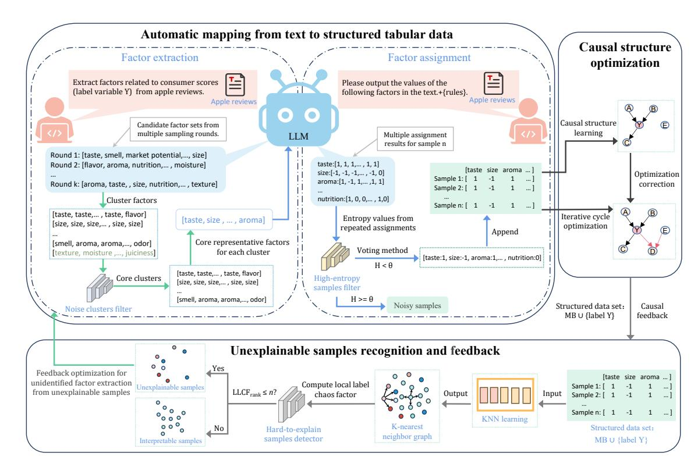
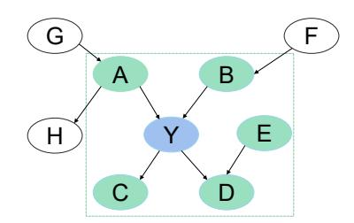
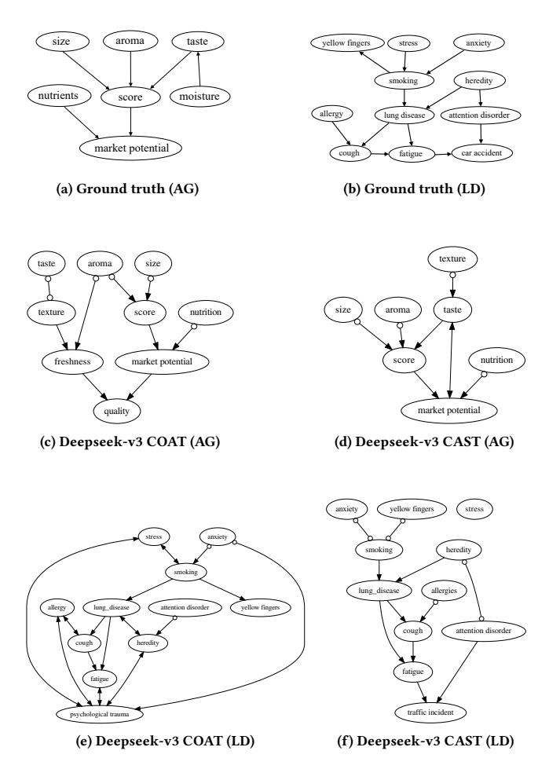

# Multistage Feedback-Driven Causal Discovery from Textual Data with Large Language Models

| Juntao Yang  |                 |
|--------------|-----------------|
| HFUT 1       |                 |
| Hefei, China |                 |
| Dayuan       | Cao             |
| HFUT         | 1               |
| Hefei,       | China           |
|              | Kui Yu ∗        |
|              | HFUT 1          |
|              | Hefei, China    |
|              | Xiang Wang ∗    |
|              | NUDT 2          |
|              | Changsha, China |

Jing Yang HFUT1 Hefei, China jing.yang@hfut.edu.cn

Lin Liu AU3 Adelaide, Australia lin.liu@adelaide.edu.au

Jiuyong Li AU3 Adelaide, Australia jiuyong.li@adelaide.edu.au

## Abstract

Learning causal relationships from unstructured textual data can significantly enhance decision-making capabilities and the robustness of AI inference. For example, extracting the underlying causal factors that influence consumer experience or product reputation from online reviews could provide valuable information to improve product recommendation strategies. However, existing mainstream data-driven causal discovery (CD) methods are primarily designed for structured numerical data, posing substantial challenges for application to textual data. Although large language models (LLMs) exhibit strong semantic understanding abilities, they still struggle to uncover complex causal relations among variables from such textual data. To address this gap, we propose a novel multistage feedback-driven CAusal diScovery from Textual data with LLMs (CAST). The core innovation lies in a self-reinforcing CD pipeline: First, it learns a set of low-redundancy, high-consistency causal factors through multi-round random sampling and semantic clustering. Then based on the learned causal factors, it transforms unstructured text into high-quality structured data via multi-round value assignment and entropy-based filtering. Finally, it presents a novel Local Label Chaos Factor (LLCF) to identify model-anomalous samples for the iterative discovery and validation of latent causal factors. Experimental results demonstrate that our framework can effectively identify causal relationships from unstructured textual data and significantly outperforms existing baseline methods in terms of both accuracy and robustness.

## CCS Concepts

### • Information systems → Data mining.

© 2026 Copyright held by the owner/author(s). ACM ISBN 979-8-4007-2307-0/2026/04 <https://doi.org/10.1145/3774904.3792633>

### Keywords

Causal discovery; Unstructured textual data; Large language models; Feedback optimization; Causal factor extraction

### ACM Reference Format:

Juntao Yang, Dayuan Cao, Kui Yu, Xiang Wang, Jing Yang, Lin Liu, and Jiuyong Li. 2026. Multistage Feedback-Driven Causal Discovery from Textual Data with Large Language Models. In Proceedings of the ACM Web Conference 2026 (WWW '26), April 13–17, 2026, Dubai, United Arab Emirates. ACM, New York, NY, USA, [12](#page-11-0) pages.<https://doi.org/10.1145/3774904.3792633>

### 1 Introduction

Causal discovery (CD) [\[5,](#page-8-0) [7,](#page-8-1) [18\]](#page-8-2) aims to identify the underlying causal relationships between variables from observational data and has emerged as a vital research direction in machine learning and data mining. In real-world scenarios, a vast amount of observational data containing latent causal information exists in the form of unstructured, user-generated texts [\[13\]](#page-8-3). The ability to directly and effectively extract causal relationships from such unstructured texts would offer valuable insights to enhance business decision-making and strengthen the robustness of AI inference [\[16,](#page-8-4) [21\]](#page-8-5). For example, in online healthcare communities, the identification of key causal drivers associated with a particular disease from medical histories and lifestyle records not only facilitates more accurate prediction of disease risk, but also provides explainable causal evidence to support personalized health interventions. Similarly, mining causal factors that influence consumer satisfaction and product reputation from online customer reviews can allow e-commerce platforms to better align with consumer preferences through optimized product presentation and recommendation strategies.

However, traditional data-driven CD methods (e.g. CMB [\[6\]](#page-8-6), PC [\[17\]](#page-8-7), and PCSL [\[7\]](#page-8-1)) are designed primarily for structured numerical data, which poses significant challenges when applied to textual data [\[3,](#page-8-8) [13\]](#page-8-3). Recently, large language models (LLMs) have emerged as a promising alternative to identify causal relations from text [\[12,](#page-8-9) [25\]](#page-8-10). Although LLMs have shown encouraging results in CD, they mainly focus on extracting pairwise causal relations between from text and often struggle to uncover more complex causal graphs between multiple variables [\[1,](#page-8-11) [8\]](#page-8-12). Consequently, LLMs are still commonly used in conjunction with traditional CD methods to extract causal relationships from structured numerical data [\[5,](#page-8-0) [25\]](#page-8-10). For example, they employ LLMs to initialize causal structures as priors or refine causal graphs generated by traditional CD approaches.

∗Corresponding author (Kui Yu, Xiang Wang).

1The Key Laboratory of Knowledge Engineering with Big Data (the Ministry of Education of China), Hefei University of Technology, Hefei, Anhui 230601, China. 2National University of Defense Technology, Changsha, China. 3Adelaide University, Adelaide, Australia.

[This work is licensed under a Creative Commons Attribution 4.0 International License.](https://creativecommons.org/licenses/by/4.0) WWW '26, Dubai, United Arab Emirates

Then mining causal relations directly from unstructured textual data remains an open research problem.

To address this challenge, Liu et al. [\[13\]](#page-8-3) proposed the COAT algorithm, which represents a pioneering effort to leverage LLMs for directly mining causal relations from unstructured textual data. The COAT algorithm primarily involves three steps: first, it extracts potential causal factors from unstructured text; second, it constructs a structured numerical data set based on these factors; and finally, it applies traditional CD algorithms to identify causal relations among the factors within the structured numerical data set. However, this approach is limited by an imprecise and unstable mechanism for extracting causal factors, as well as a non-systematic pipeline for converting unstructured text into structured numerical data. To enable end-to-end learning of causal relations directly from raw unstructured text and to overcome the limitations of existing methods, several key challenges remain:

- How to automatically and accurately extract semantically consistent and stable causal factors from unstructured text;
- How to accurately assign values to the identified factors based on textual content to generate a high-quality, lownoise structured numerical dataset;
- How to iteratively identify potential latent causal factors to enhance the completeness of the final causal factor set;
- How to construct benchmark data and evaluation metrics to assess CD methods from textual data.

To address the challenges, in this paper, we propose a multi-stage feedback-driven framework for CD from unstructured textual data using LLMs. Our main contributions are summarized as follows:

- We propose a robust factor extraction method by integrating LLMs with multi-round random sampling and semantic clustering for identifying potential causal factors in text.
- We design a factor assignment approach that employs multiround LLM assignment with voting mechanisms for the generation of high-quality structured numerical data.
- We propose a novel local label chaos factor to design a feedback optimization strategy to detect hard-to-explain samples that may contain latent causal factors.
- We develop a method capable of generating synthetic textual data and corresponding evaluation metrics for the assessment of CD methods in unstructured textual data.

### 2 Related Work

Existing research on LLM-based causal discovery can be broadly divided into two main types of approaches [\[14,](#page-8-13) [22,](#page-8-14) [25\]](#page-8-10): the first type aims to learn complete causal graphs from structured numerical data, while the second focuses on identifying pairwise causal relationships between user-defined variables directly from text.

Methods in the first category typically learn reliable causal graphs from structured numerical data by confining the causal discovery capability of LLMs to an auxiliary role through integrating LLMs with traditional causal discovery algorithms (e.g. PC and FCI algorithms). A pioneering work in this line is chatPC proposed by Cohrs et al. [\[4\]](#page-8-15), which reformulates conditional independence tests as natural language prompts and employs LLMs as statistical oracles to guide the PC algorithm. Zhang et al. [\[28\]](#page-8-16) further developed an interpretable causal auditing framework where LLMs

validate and explain causal discovery results to enhance credibility. Long et al. [\[15\]](#page-8-17) proposed a refined strategy that uses pairwise prompts and voting mechanisms to derive reliable causal priors which are integrated into scoring functions such as the BDeu score. Although these methods enhance the effectiveness of traditional causal discovery methods by leveraging LLMs, they rely on structured numerical data [\[2\]](#page-8-18).

In contrast, the second category of methods treats LLMs as knowledge bases, focusing on extracting pairwise causal relationships between user-defined variables directly from text without using structured numerical data [\[20\]](#page-8-19). Typically, given textual input or variable descriptions, researchers employ prompt engineering to elicit causal pairs (e.g., "smoking → lung cancer") from LLMs. For instance, Willig et al. [\[24\]](#page-8-20) were the first to explore LLMs to identify pairwise causal relations from text, while Kıcıman et al. [\[10\]](#page-8-21) demonstrated that directly querying LLMs can infer causal directions in a zero-shot setting. To improve performance, subsequent studies have introduced strategies such as contextual examples [\[11\]](#page-8-22), chain-of-thought reasoning [\[23\]](#page-8-23), and causal narratives embedded in natural language prompts [\[29\]](#page-8-24). Despite these advances, studies have indicated that while such methods perform reasonably well in identifying pairwise causal relationships, their reliability remains highly questionable [\[9\]](#page-8-25). Common issues include hallucinations, instability, and lack of verifiability. As noted by Zecevic et al. [\[27\]](#page-8-26), LLMs may simply "rephrase" causal knowledge memorized during training, rather than performing genuine causal reasoning. Tu et al. [\[19\]](#page-8-27) showed that LLMs are not able to infer causal graphs involving multiple variables from textual data. To address the limitations, Liu et al. [\[13\]](#page-8-3) proposed the COAT algorithm, which uses LLMs to mine causal relations between multiple variables directly from text. Despite this progress, COAT still faces several critical challenges. In this paper, we propose to tackle these challenges.

## 3 Proposed Method

In the section, we propose a multistage feedback-driven CAusal diScovery from Textual data with LLMs, named CAST. As shown in Figure [1,](#page-2-0) CAST comprises three components: 1)robust causal factor extraction (Section 3.1), 2)factor assignment and numerical data construction (Section 3.2), and 3) causal discovery and feedback optimization (Section 3.3). The three components are integrated into a single end-to-end framework.

### 3.1 Robust Causal Factor Extraction Module

This module aims to extract a set of high-quality candidate causal factors from unstructured text to accurately represent the original semantic content. For example, consider the following authentic watermelon review: "The watermelon was much smaller than expected, with pale flesh color indicating incomplete ripening, and almost no sweetness. Very disappointed - would not recommend." This concise yet informative statement implicitly contains multiple evaluation dimensions including size, ripeness, and taste, all of which may serve as key causal factors influencing product sales. In general, to accurately represent the semantic information of the original text, an ideal factor set satisfies three key properties: 1) low redundancy (by merging semantically similar factors), 2) low noise (by filtering out irrelevant factors), and 3) strong consensus (by retaining core

Figure 1: The overall framework of CAST.

concepts that are universally present across most samples and can be consistently identified by LLMs). To achieve this goal, we propose a robust extraction method consisting of iterative sampling, semantic clustering, and noise filtering stages.

1) Iterative sampling to extract potential causal factors. We employ LLMs for multiple rounds of stochastic sampling to mine potential causal factors from text. We first partition the text dataset D into groups based on labels, then construct �� diverse data sample subsets {��1, ��2, ..., ���� } through independent random sampling. For each subset ���� , we query LLMs using a specialized prompt ��factor to obtain causal factor set ���� . The factors extracted from each subset are merged: {��1, ��2, . . . , ���� } = �� ��=1 LLM(��factor, ����). This multiround approach ensures diversity in the factor extraction process while providing the foundation for assessing consensus factors (factors that are universally present across most samples).

2) Semantic clustering to reduce factor redundancy. With the identified causal factor sets, we perform semantic embedding and clustering for merging redundant factors. Specifically, we first combine all identified causal factor sets into an initial set ��total and encode each factor �� ∈ ��total to a high-dimensional vector using a pre-trained sentence embedding model and get the embedding set E of ��total. We then perform agglomerative hierarchical clustering on E, setting the number of clusters to ��, and obtain clusters {��1,��2, . . . ,���� } = AgglomerativeClustering(E, ��). The cluster count �� is estimated based on the scale of potential factors initially extracted by the LLM, ensuring it aligns with a reasonable range of latent factors present in the text and is not set arbitrarily. Each cluster ���� represents a potential causal concept containing semantically similar factors and can exhibit varying quality levels. Some contain inconsistent or irrelevant causal factors.

3) Noise filtering to eliminate irrelevant clusters. To evaluate cluster quality and identify noise clusters, we present the following two complementary metrics.

i) Normalized Intra-class Conditional Entropy (��norm(����)). The metric quantifies the semantic chaos within a cluster by measuring the disorder in the factor label distribution and is defined as follows.

��norm(����) = 0 if |���� | = 1, − Í �� ∈���� �� (�� ) log2 �� (�� ) log2 |���� if |���� | &gt; 1, (1)

 where ���� is the set of distinct factors in cluster ���� , |���� | is the size of this set, and ��(�� ) = ���� /�� is the relative frequency of factor �� in cluster ���� (���� is the occurrence count, �� is the total count). When all factors in a cluster are the same one, ��norm = 0 holds. The value of ��norm approaching 1 indicates uniform label distribution (high chaos). High chaos clusters typically represent noise clusters containing inconsistent LLM outputs or irrelevant concepts.

ii) Intra-class Dominant Factor Cohesion (IDFC). This metric measures the similarity between a cluster's actual factor distribution and an ideal distribution centered around the dominant factor �� ∗ (the highest-frequency factor in the cluster), evaluating how closely factors cluster around the core concept. The actual distribution ������ is derived from factor frequencies in a cluster:

������ (�� ) = ���� �� , ∀�� ∈ ���� . (2)

sample �� as the sum of repulsion potentials from neighbors with differing labels within its ��-neighborhood:

LLCF(��) = ∑︁ �� ∈���� (��) ������ · I(���� ≠ ����), (12)

where I(·) is the indicator function that equals 1 when ���� ≠ ���� and 0 otherwise. Within our CD framework, a sample with high LLCF scores indicates that the current factor set fails to explain why the particular sample appears in its current positions. LLCF acts as a "detector" that precisely locates the blind spots of the current model, then guiding subsequent factor mining procedures to focus on regions most likely to contain unidentified factors. We rank all samples by their LLCF scores and select the top-�� samples to form the hard-to-explain sample set ��hard. These samples represent the most significant "blind spots" in the current causal graph.

2) Progressively uncovering latent causal factors. Upon obtaining the hard-to-explain samples ��hard, we put them into the robust causal factor extraction module described in Section 3.1 to guide LLMs to focus on identify potential factors that "can explain why these specific samples behave so differently from their neighbors". This process yields a candidate set of new factors ��candidate. However, not all new identified factors are correct and necessary. To avoid introducing redundant or incorrect factors, we design a rigorous validation strategy. For each candidate factor ��cand ∈ ��candidate, we employ the factor assignment module in Section 3.2 to obtain its values across all samples, producing an extended dataset ��extended = [��, ��cand].

Based on the extended dataset, we recalculate the LLCF values for all samples. If the new factor ��cand indeed captures unidentified causal factors, it should effectively clarify the originally chaotic local neighborhood relationships, then significantly reduces the average LLCF value across the entire dataset. We select the candidate factors that achieve the maximum reduction in average LLCF and integrate them into the core factor set via ��new = ��current ∪ {�� ∗ cand}.

3) Closed-loop iterative Optimization and its termination conditions. Based on newly discovered factors, we re-perform causal discovery using the FCI algorithm based on the updated factor set ��new and the reconstructed structured dataset, and iteratively executes a closed-loop workflow, until any of the following termination conditions are satisfied: (1) performance convergence: The average LLCF falls below threshold ��; (2) no effective new factors: In a given iteration, no candidate factor passes the utility test; (3) maximum iterations reached: The process reaches the predefined maximum number of iterations.

This feedback mechanism transforms the entire CD process into a data-driven, self-improving intelligent system, forming a closedloop optimization mechanism of "factor extraction → factor assignment → causal graph learning → hard-to-explain sample identification → new factor extraction → causal graph updating", ultimately outputting a more explanatory and complete causal model ��final.

### 4 Experiment

This section systematically evaluates the performance of CAST with multiple dimensions, including factor extraction, factor assignment, and causal discovery. We conduct comprehensive testing using nine prominent language models in three datasets. Due to space

constraints, we present only representative experimental results in the main text, while the complete set of results is provided in Appendix B.

### 4.1 Experimental Setup

Datasets. To evaluate the effectiveness of CAST, we conduct experiments on three datasets spanning both synthetic and real-world scenarios. AppleGastronome (AG) [\[13\]](#page-8-3) is a synthetic e-commerce platform containing consumer reviews about apple purchases; LungDisease (LD) is a synthetic medical text dataset, and its details are provided in Appendix A; Watermelon (WM) is a real-world review dataset collected from Walmart's e-commerce platform, consisting solely of human-written product reviews. Table [1](#page-5-0) summarizes the statistics of these datasets.

Table 1: DESCRIPTION OF DATASETS

| Datasets        | Instances | Category  | Domain     |
|-----------------|-----------|-----------|------------|
| AppleGastronome | 200       | Synthetic | E-commerce |
| LungDisease     | 1300      | Synthetic | Medicine   |
| Watermelon      | 778       | Real      | E-commerce |

Evaluation Metrics. To systematically evaluate the performance of the CAST, we designed a four-stage evaluation system comprising factor extraction, factor assignment, causal discovery, and causal effect estimation. This system places particular emphasis on assessing the learning performance of the Markov Blanket (MB) since the MB represents the minimal set of causal features that provides optimal predictive power for the target variable, accurately identifying the MB not only helps reveal key causal factors influencing the target variable but also provides actionable causal insights for network platforms rich in textual data, thereby effectively enhancing decision quality. Based on this, we focus specifically on evaluating MB learning performance in both the factor extraction and causal discovery stages. The specific composition of the four evaluation stages is as follows: (i) factor extraction, assessing the number of correct Markov blanket (MB) factors that LLMs directly identify for the outcome variable; (ii) factor assignment, measuring the accuracy of the annotated values for these factors; (iii) causal learning, evaluating the number of MB factors identified by the algorithm and its ability to recover the true causal structure; and (iv) causal effect estimation, measuring the accuracy of treatment effect estimation using standard metrics including average treatment effect error, Pearson correlation, and PEHE (due to space constraints, the experimental results for this part are provided in Appendix B). Baselines. We compare CAST against two state-of-the art methods: DATA+CoT, which feeds raw texts to the LLM with chainof-thought prompting for MB identification; COAT [\[13\]](#page-8-3), a recent framework that combines LLMs with causal discovery.

### 4.2 Experimental Results and Analysis

Our experiments focus on evaluating method performance across three key dimensions: (1) the ability to extract key causal factors within the target variable's MB directly from raw text (Table 2); (2) the structural characteristics of learned causal graphs (Figure 2); and

Table 2: Comparison of three pipelines (DATA+CoT, COAT, CAST) across datasets and LLMs for factor extraction, Factor Assignment, and Causal Feature Learning. Best results are in bold.

| Dataset LLM Method       | Recall | Factor Extraction Precision | F1    | Factor Assignment Accuracy | Causal Recall | Feature Precision | Learning F1 |
|--------------------------|--------|-----------------------------|-------|----------------------------|---------------|-------------------|-------------|
| DATA+CoT Deepseek-r1:14b | 88.00  | 55.41                       | 68.00 | /                          | 40.00         | 44.44             | 42.11       |
| COAT                     | 92.00  | 61.13                       | 73.45 | 76.20                      | 80.00         | 82.38             | 81.17       |
| CAST(ours)               | 94.00  | 65.02                       | 76.87 | 82.33                      | 84.00         | 85.50             | 84.74       |
| DATA+CoT                 | 100.00 | 55.56                       | 71.43 | /                          | 84.00         | 52.54             | 64.65       |
| COAT Deepseek-v3-0324    | 100.0  | 55.40                       | 71.30 | 91.34                      | 80.00         | 81.25             | 80.62       |
| CAST(ours)               | 100.0  | 59.39                       | 74.52 | 91.80                      | 94.00         | 87.50             | 90.63       |
| DATA+CoT AG              | 80.00  | 32.14                       | 45.86 | /                          | 76.00         | 39.65             | 52.12       |
| COAT Qwen3:32b           | 84.00  | 49.31                       | 62.14 | 89.46                      | 68.00         | 79.00             | 73.09       |
| CAST(ours)               | 84.00  | 64.42                       | 72.92 | 90.36                      | 72.00         | 96.67             | 82.53       |
| DATA+CoT                 | 100.00 | 52.50                       | 68.85 | /                          | 76.00         | 45.60             | 57.00       |
| COAT Qwen-plus           | 100.0  | 75.00                       | 85.71 | 90.29                      | 94.00         | 86.14             | 89.90       |
| CAST(ours)               | 100.0  | 80.95                       | 89.47 | 90.43                      | 100.0         | 100.0             | 100.0       |
| DATA+CoT                 | 93.33  | 40.46                       | 56.45 | /                          | 86.67         | 37.89             | 52.73       |
| COAT Gpt-oss:20b         | 98.00  | 42.99                       | 59.76 | 87.07                      | 80.00         | 77.48             | 78.72       |
| CAST(ours)               | 100.0  | 51.64                       | 68.11 | 89.90                      | 82.00         | 80.38             | 81.18       |
| DATA+CoT                 | 76.00  | 8.33                        | 15.02 | /                          | 24.00         | 23.33             | 23.66       |
| COAT Deepseek-r1:14b     | 74.00  | 47.13                       | 57.58 | 90.70                      | 74.00         | 67.23             | 70.45       |
| CAST(ours)               | 96.00  | 53.08                       | 68.36 | 95.67                      | 84.00         | 78.00             | 80.89       |
| DATA+CoT                 | 88.00  | 48.89                       | 62.86 | /                          | 76.00         | 47.82             | 58.70       |
| COAT Deepseek-v3-0324    | 100.00 | 49.09                       | 65.85 | 99.96                      | 96.00         | 93.14             | 94.55       |
| CAST(ours)               | 100.00 | 50.00                       | 66.67 | 99.96                      | 98.00         | 88.33             | 92.91       |
| DATA+CoT LD              | 100.00 | 44.09                       | 61.20 | /                          | 88.00         | 67.84             | 76.62       |
| COAT Qwen3:32b           | 88.00  | 45.22                       | 59.74 | 99.97                      | 88.00         | 72.62             | 79.57       |
| CAST(ours)               | 98.00  | 49.44                       | 65.72 | 99.83                      | 98.00         | 96.67             | 97.33       |
| DATA+CoT                 | 100.00 | 52.50                       | 68.85 | /                          | 84.00         | 92.67             | 88.12       |
| COAT Qwen-plus           | 98.00  | 52.70                       | 68.54 | 100.00                     | 98.00         | 98.00             | 98.00       |
| CAST(ours)               | 100.00 | 52.70                       | 69.02 | 100.00                     | 100.00        | 98.33             | 99.16       |
| DATA+CoT                 | 73.33  | 73.33                       | 73.33 | /                          | 53.33         | 88.89             | 66.67       |
| COAT Gpt-oss:20b         | 92.00  | 41.47                       | 57.17 | 99.02                      | 92.00         | 77.74             | 84.27       |
| CAST(ours)               | 100.00 | 51.11                       | 67.65 | 99.88                      | 96.00         | 83.62             | 89.38       |
| DATA+CoT                 | 43.33  | 35.56                       | 39.06 | /                          | 20.00         | 22.00             | 20.95       |
| COAT Deepseek-r1:14b     | 76.67  | 40.16                       | 52.71 | 74.18                      | 43.33         | 29.43             | 35.05       |
| CAST(ours)               | 83.33  | 51.61                       | 63.74 | 77.34                      | 73.33         | 76.79             | 75.02       |
| DATA+CoT                 | 50.00  | 31.50                       | 38.65 | /                          | 46.67         | 43.81             | 45.19       |
| COAT Deepseek-v3-0324    | 76.67  | 30.27                       | 43.40 | 73.39                      | 13.33         | 8.00              | 10.00       |
| CAST(ours)               | 76.67  | 33.45                       | 46.58 | 73.52                      | 66.67         | 61.43             | 63.94       |
| DATA+CoT WM              | 66.67  | 15.87                       | 25.64 | /                          | 40.00         | 18.74             | 25.52       |
| COAT Qwen3:32b           | 66.67  | 18.72                       | 29.23 | 81.44                      | 66.67         | 44.03             | 53.03       |
| CAST(ours)               | 66.67  | 41.79                       | 51.38 | 79.08                      | 66.67         | 79.29             | 72.43       |
| DATA+CoT                 | 53.33  | 25.67                       | 34.66 | /                          | 50.00         | 36.67             | 42.31       |
| COAT Qwen-plus           | 66.67  | 38.57                       | 48.87 | 64.00                      | 45.00         | 48.79             | 46.82       |
| CAST(ours)               | 70.00  | 49.68                       | 58.11 | 67.05                      | 53.33         | 64.10             | 58.22       |
| DATA+CoT Gpt-oss:20b     | 80.00  | 25.50                       | 38.67 | /                          | 66.67         | 26.33             | 37.75       |
| COAT                     | 90.00  | 21.59                       | 34.83 | 87.11                      | 66.67         | 45.66             | 54.20       |
| CAST(ours)               | 96.67  | 60.31                       | 74.28 | 88.13                      | 90.00         | 82.24             | 85.95       |

(3) the accuracy of subsequent causal effect estimation (Appendix B).

4.2.1 Factor Extraction Performance. The factor extraction block of Table 2 reports the recall, precision, and F1-score for MB factor extraction across three datasets and different models. Experimental results show that CAST achieves the best recall in 14 out of 15 datasetmodel combinations, with only one exception on the LD dataset using Qwen3:32b, where it is 2% lower than DATA+CoT. However, in this case, CAST still outperforms the second-best method by 4.22% in precision and 4.55% in F1-score. Notably, on the LD dataset with Deepseek-14b, CAST improves recall by 20%. Furthermore, CAST achieves the highest precision across all experiments on all three datasets. On the real-world e-commerce review dataset WM, CAST also demonstrates significant improvements: with Deepseek-14b, the F1-score increases from 52.71% under COAT to 63.74% (+11.03%); with Qwen3:32b, it rises from 29.23% to 51.38% (+22.15%). These results indicate that the proposed multi-round sampling and semantic clustering mechanism effectively addresses challenges

such as textual sparsity and weak causal signals in real-world scenarios, establishing a solid foundation for extracting meaningful causal factors from user reviews or medical texts. For example, in apple and watermelon reviews, CAST more comprehensively captures key sales influencers such as "taste," "size," and "freshness," not only providing high-quality feature inputs for subsequent causal relationship learning but also offering more comprehensive data support for the design of practical marketing strategies.

4.2.2 Factor Value AssignmentQuality. The factor assignment stage aims to transform identified causal factors into high-quality structured data (see the "Accuracy" column in Table 2). Experimental results show that CAST achieves the highest accuracy in 13 out of 15 dataset-model combinations. In the two cases where it does not achieve the best performance, the gap is minimal—for instance, on the LD dataset with Qwen3-32b, CAST is only 0.14% lower than COAT. Meanwhile, CAST brings significant improvements across multiple models. For example, on the AG and LD datasets with Deepseek-14b, accuracy increases by 6.13% and 4.97%, respectively.

Figure 3: Causal graphs discovered by COAT and CAST(ours) across different LLMs.

Notably, the improvement is particularly pronounced in models with smaller parameter sizes. Taking Deepseek-8b on the AG and LD datasets as an example (experimental results can be found in Table 3 of Appendix B), accuracy improves by 8.16% and 17.95%, respectively. This indicates that CAST can effectively enhance assignment quality while maintaining low deployment costs, demonstrating strong potential for practical applications. These improvements are primarily attributed to the proposed multi-round assignment mechanism and entropy-aware noise filtering strategy, which work synergistically to significantly reduce annotation error rates. This enables the method to consistently output high-quality structured data even in real-world text scenarios characterized by irregular expressions and vague descriptions, providing a reliable foundation for constructing credible causal analysis tables from authentic internet texts, as well as establishing a data-driven basis for product optimization and user satisfaction mining in the e-commerce domain.

4.2.3 Causal Discovery Performance. To evaluate causal structure learning performance, we compare the causal graphs learned by CAST and baseline methods on the AG and LD datasets. As shown in Figure [3,](#page-7-0) on the AG dataset, CAST (Figure [3d](#page-7-0)) accurately identifies all key factors affecting apple quality evaluation—including size, aroma, taste—and establishes clear causal paths to the "score". In contrast, while the COAT method (Figure [3c](#page-7-0)) captures most factors, it completely misses the "taste" dimension, which could lead to overlooking the impact of scent on consumer purchase decisions in practical marketing scenarios. On the medical-domain LD dataset, CAST demonstrates stronger capability in filtering out spurious causal relationships. For instance, the causal graph obtained by Deepseek-v3 with COAT (Figure [3e](#page-7-0)) contains medically unsubstantiated edges such as "psychological trauma → heredity" and "allergy → psychological trauma", whereas CAST (Figure [3f](#page-7-0)) generates a more concise and reliable causal structure that precisely focuses on clinically recognized paths like "smoking → lung disease" and "heredity → lung disease". This accurate identification of key medical factors provides more credible support for auxiliary diagnostic decision-making.

Quantitative results (from the "Causal Feature Learning" module of Table 2) further validate the superiority of CAST: in the MB identification task, CAST achieves optimal F1 scores in 14 out of 15 dataset-model combinations, with only one exception on the LD dataset using Deepseek-v3-0324 where it trails COAT by 1.64%. Furthermore, our method achieves performance improvements exceeding 10% in 8 combinations, with this advantage being particularly notable on the real-world WM dataset.

In summary, through its multi-stage collaborative optimization architecture, CAST more accurately identifies key causal paths during the iterative process, thereby significantly enhancing the reliability of automatically mining causal relationships from textual data. This provides more powerful support for e-commerce marketing strategy formulation and medical auxiliary analysis.

### 5 Conclusion

We propose CAST, an innovative framework for causal discovery from unstructured text, which systematically integrates large language models with causal inference techniques to effectively address the core challenge of mining latent causal relationships from textual data. Experimental results demonstrate that CAST significantly outperforms existing baseline methods across all evaluation stages, including factor discovery, structured data construction accuracy, and causal structure learning. Notably, our framework maintains excellent performance even when employing smallerscale language models (with 8b-14b parameters) and when handling challenging real-world datasets, providing a practical and reliable solution for real-world deployment scenarios with limited resources. This research establishes a systematic methodology for directly extracting causal relationships from unstructured text. Looking ahead, we will continue to advance research on text-based causal discovery in online incremental learning and federated learning scenarios, further expanding the application boundaries of this technology.

### Acknowledgments

This work was supported in part by the National Science and Technology Major Project of China (No.2021ZD0111801) and in part by the National Natural Science Foundation of China (No.62376087).

- References [1] Ahmed Abdulaal, Adamos Hadjivasiliou, Nina Montana-Brown, Tiantian He, Ayodeji Ijishakin, Ivana Drobnjak, Daniel C Castro, and Daniel C Alexander. 2024. Causal modelling agents: Causal graph discovery through synergising metadata-and data-driven reasoning. In ICLR, Vol. 2024. [2] Taiyu Ban, Lyuzhou Chen, Derui Lyu, Xiangyu Wang, and Huanhuan Chen. 2024. Causal Structure Learning Supervised by Large Language Model. [3] Haoang Chi, He Li, Wenjing Yang, Feng Liu, Long Lan, Xiaoguang Ren, Tongliang Liu, and Bo Han. 2025. Unveiling Causal Reasoning in Large Language Models: Reality or Mirage?. In NeurIPS. Curran Associates Inc., Red Hook, NY, USA, Article 3064, 31 pages. ISBN: 9798331314385. [4] Kai-Hendrik Cohrs, Emiliano Diaz, Vasileios Sitokonstantinou, Gherardo Varando, and Gustau Camps-Valls. 2023. Large Language Models for Constrained-Based Causal Discovery. In AAAI 2024 Workshop on "Are Large Language Models Simply Causal Parrots?". [5] Huaming Du, Yujia Zheng, Baoyu Jing, Yu Zhao, Gang Kou, Guisong Liu, Tao Gu, Weimin Li, and Carl Yang. 2025. Causal Discovery through Synergizing Large Language Model and Data-Driven Reasoning. In KDD. 543–554. [6] Tian Gao and Qiang Ji. 2015. Local causal discovery of direct causes and effects. NeurIPS 28 (2015). [7] Xianjie Guo, Kui Yu, Lin Liu, Jiuyong Li, Jiye Liang, Fuyuan Cao, and Xindong Wu. 2024. Progressive skeleton learning for effective local-to-global causal structure learning. IEEE Transactions on Knowledge and Data Engineering (2024). [8] Kairong Han, Wenshuo Zhao, Ziyu Zhao, JunJian Ye, Lujia Pan, and Kun Kuang. 2025. CAT: Causal Attention Tuning For Injecting Fine-grained Causal Knowledge into Large Language Models. arXiv preprint arXiv:2509.01535 (2025). [9] Zhijing Jin, Yuen Chen, Felix Leeb, Luigi Gresele, Ojasv Kamal, Zhiheng Lyu, Kevin Blin, Fernando Gonzalez Adauto, Max Kleiman-Weiner, Mrinmaya Sachan, et al. 2023. Cladder: Assessing causal reasoning in language models. NeurIPS 36 (2023), 31038–31065. [10] Emre Kiciman, Robert Ness, Amit Sharma, and Chenhao Tan. 2023. Causal reasoning and large language models: Opening a new frontier for causality. Transactions on Machine Learning Research (2023). [11] Takeshi Kojima, Shixiang Shane Gu, Machel Reid, Yutaka Matsuo, and Yusuke Iwasawa. 2022. Large language models are zero-shot reasoners. NeurIPS 35 (2022), 22199–22213. [12] Oscar Lithgow-Serrano, Vani Kanjirangat, and Alessandro Antonucci. 2025. Causal Understanding by LLMs: The Role of Uncertainty. arXiv preprint arXiv:2509.20088 (2025). [13] Chenxi Liu, Yongqiang Chen, Tongliang Liu, Mingming Gong, James Cheng, Bo Han, and Kun Zhang. 2024. Discovery of the hidden world with large language models. NeurIPS 37 (2024), 102307–102365. [14] Xiaoyu Liu, Paiheng Xu, Junda Wu, Jiaxin Yuan, Yifan Yang, Yuhang Zhou, Fuxiao Liu, Tianrui Guan, Haoliang Wang, Tong Yu, et al. 2025. Large language models and causal inference in collaboration: A comprehensive survey. Findings of the Association for Computational Linguistics: NAACL 2025 (2025), 7668–7684. [15] Stephanie Long, Alexandre Piché, Valentina Zantedeschi, Tibor Schuster, and Alexandre Drouin. 2023. Causal Discovery with Language Models as Imperfect Experts. In ICML 2023 Workshop on Structured Probabilistic Inference & Generative Modeling. [16] Bernhard Schölkopf, Francesco Locatello, Stefan Bauer, Nan Rosemary Ke, Nal Kalchbrenner, Anirudh Goyal, and Yoshua Bengio. 2021. Toward causal representation learning. Proc. IEEE 109, 5 (2021), 612–634. [17] Peter Spirtes and Clark Glymour. 1991. An algorithm for fast recovery of sparse causal graphs. Social science computer review 9, 1 (1991), 62–72. [18] Yi-Kun Tang, Heyan Huang, Xuewen Shi, and Xian-Ling Mao. 2024. Beyond labels and topics: discovering causal relationships in neural topic modeling. In WWW. 4460–4469. [19] Ruibo Tu, Chao Ma, and Cheng Zhang. 2023. Causal-discovery performance of chatgpt in the context of neuropathic pain diagnosis. arXiv preprint arXiv:2301.13819 (2023). [20] Aniket Vashishtha, Abbavaram Gowtham Reddy, Abhinav Kumar, Saketh Bachu, Vineeth N. Balasubramanian, and Amit Sharma. 2024. Causal Inference Using LLM-Guided Discovery. [21] Matthew J Vowels, Necati Cihan Camgoz, and Richard Bowden. 2022. D'ya like dags? a survey on structure learning and causal discovery. Comput. Surveys 55, 4 (2022), 1–36. [22] Guangya Wan, Yuqi Wu, Mengxuan Hu, Zhixuan Chu, and Sheng Li. 2024. Bridging causal discovery and large language models: A comprehensive survey of integrative approaches and future directions. CoRR (2024). [23] Jason Wei, Xuezhi Wang, Dale Schuurmans, Maarten Bosma, Fei Xia, Ed Chi, Quoc V Le, Denny Zhou, et al. 2022. Chain-of-thought prompting elicits reasoning in large language models. NeurIPS 35 (2022), 24824–24837. [24] Moritz Willig, Matej Zečević, Devendra Singh Dhami, and Kristian Kersting. 2022. Can foundation models talk causality? arXiv preprint arXiv:2206.10591 (2022). [25] Xingyu Wu, Kui Yu, Jibin Wu, and Kay Chen Tan. 2025. LLM Cannot Discover Causality, and Should Be Restricted to Non-Decisional Support in Causal Discovery. arXiv preprint arXiv:2506.00844 (2025). [26] Kui Yu, Xianjie Guo, Lin Liu, Jiuyong Li, Hao Wang, Zhaolong Ling, and Xindong Wu. 2020. Causality-based feature selection: Methods and evaluations. ACM Computing Surveys (CSUR) 53, 5 (2020), 1–36. [27] Matej Zečević, Moritz Willig, Devendra Singh Dhami, and Kristian Kersting. 2023. Causal parrots: Large language models may talk causality but are not causal. arXiv preprint arXiv:2308.13067 (2023). [28] Cheng Zhang, Stefan Bauer, Paul Bennett, Jiangfeng Gao, Wenbo Gong, Agrin Hilmkil, Joel Jennings, Chao Ma, Tom Minka, Nick Pawlowski, et al. 2023. Understanding causality with large language models: Feasibility and opportunities. arXiv preprint arXiv:2304.05524 (2023). [29] LYU Zhiheng, Zhijing Jin, Rada Mihalcea, Mrinmaya Sachan, and Bernhard Schölkopf. 2022. Can large language models distinguish cause from effect?. In UAI 2022 Workshop on Causal Representation Learning. A Benchmark Data Construction and Evaluation Framework To address the lack of high-quality textual datasets for causal discovery methods, we design a systematic benchmark data construction framework. We employ ancestral sampling to generate structured datasets, starting from root node values, ensuring that the generated data conforms to predefined causal structures and probability distributions. Probability Table Acquisition. . Given a causal network with �� variables, we represent its structure using a directed acyclic graph �� = (�� , ��), where �� = {��1,��2, ...,���� } is the variable set. Each variable ���� can have different value spaces, such as binary variables ���� ∈ {0, 1} or multivariate variables ���� ∈ {1, 2, ..., ��}. For conditional probability model construction, we adopt two approaches:
  - 1) Using Existing Probability Tables. : If the causal graph under study already has validated Conditional Probability Tables (CPTs) through expert knowledge or historical data, we directly use these established parameters: �� (���� |Pa(����)) = CPT. (13)
  - 2) Generating Random Probability Tables. : When existing CPTs are unavailable (e.g., in newly constructed or theoretical causal graphs), we generate reasonable conditional probability distributions based on Dirichlet priors. The specific procedure is as follows: First, determine the number of parent state combinations: ��rows = Ö ���� ∈Pa(���� ) |���� |, (14) where |���� | represents the number of states of variable ���� . Then, for each parent state combination, sample conditional probability vectors from the Dirichlet distribution: p = (��1, ��2, ..., ������ ) ∼ Dirichlet(��1, ��2, ..., ������ ), (15) where ���� is the number of states of variable ���� , typically using symmetric hyperparameters ��1 = ��2 = · · · = ������ = 1 by default. The

hyperparameter �� primarily controls the concentration of generated conditional probability distributions. By adjusting �� values, we can generate datasets with varying certainty and noise levels.

Table 3: Comparison of three pipelines (DATA+CoT, COAT, CAST) across datasets and LLMs (additional models) for factor extraction, Factor Assignment, and Causal Feature Learning. Best results are in bold.

| Dataset LLM Method       | Recall | Factor Extraction Precision | F1    | Factor Assignment Accuracy | Causal Recall | Feature Precision | Learning F1 |
|--------------------------|--------|-----------------------------|-------|----------------------------|---------------|-------------------|-------------|
| DATA+CoT Deepseek-r1:8b  | 84.00  | 66.03                       | 73.94 | /                          | 68.00         | 61.75             | 64.72       |
| COAT                     | 90.00  | 65.99                       | 76.15 | 67.34                      | 70.00         | 78.71             | 74.10       |
| CAST(ours)               | 92.00  | 65.87                       | 76.77 | 75.50                      | 72.00         | 81.83             | 76.60       |
| DATA+CoT                 | 96.00  | 56.30                       | 70.98 | /                          | 88.00         | 72.60             | 79.56       |
| COAT Deepseek-r1:32b AG  | 96.00  | 57.90                       | 72.23 | 82.05                      | 90.00         | 80.19             | 84.81       |
| CAST(ours)               | 100.0  | 58.08                       | 73.48 | 88.12                      | 90.00         | 86.00             | 87.95       |
| DATA+CoT Qwen3:8b        | 72.00  | 42.00                       | 53.05 | /                          | 72.00         | 42.67             | 53.58       |
| COAT                     | 58.00  | 56.45                       | 57.21 | 87.49                      | 54.00         | 66.83             | 59.73       |
| CAST(ours)               | 72.00  | 67.38                       | 69.61 | 87.78                      | 62.00         | 87.17             | 72.46       |
| DATA+CoT Qwen3:14b       | 96.00  | 49.59                       | 65.40 | /                          | 84.00         | 54.72             | 66.27       |
| COAT                     | 76.00  | 57.89                       | 65.72 | 88.95                      | 68.00         | 77.50             | 72.44       |
| CAST(ours)               | 78.00  | 69.79                       | 73.67 | 89.76                      | 72.00         | 85.95             | 78.36       |
| DATA+CoT                 | 84.00  | 38.99                       | 53.26 | /                          | 52.00         | 47.68             | 49.74       |
| COAT Deepseek-r1:8b      | 52.00  | 46.34                       | 49.01 | 76.77                      | 52.00         | 55.33             | 53.61       |
| CAST(ours)               | 86.00  | 44.96                       | 59.05 | 94.72                      | 82.00         | 64.10             | 71.95       |
| DATA+CoT Deepseek-r1:32b | 88.00  | 56.19                       | 68.59 | /                          | 36.00         | 48.00             | 41.14       |
| COAT LD                  | 70.00  | 45.15                       | 54.89 | 97.88                      | 66.00         | 70.00             | 67.94       |
| CAST(ours)               | 98.00  | 49.65                       | 65.91 | 99.66                      | 98.00         | 79.29             | 87.66       |
| DATA+CoT                 | 100.00 | 45.76                       | 62.79 | /                          | 96.00         | 54.44             | 69.48       |
| COAT Qwen3:8b            | 92.00  | 45.32                       | 60.73 | 97.18                      | 92.00         | 72.90             | 81.34       |
| CAST(ours)               | 98.00  | 50.10                       | 66.30 | 99.19                      | 98.00         | 70.48             | 81.99       |
| DATA+CoT                 | 100.00 | 50.00                       | 66.67 | /                          | 76.00         | 73.67             | 74.82       |
| COAT Qwen3:14b           | 100.00 | 38.71                       | 55.81 | 99.15                      | 86.00         | 67.39             | 75.57       |
| CAST(ours)               | 98.00  | 47.14                       | 63.66 | 99.98                      | 90.00         | 72.02             | 80.01       |
| DATA+CoT Deepseek-r1:8b  | 56.67  | 21.91                       | 31.60 | /                          | 30.00         | 27.83             | 28.88       |
| COAT                     | 53.33  | 35.69                       | 42.76 | 62.22                      | 41.88         | 43.33             | 42.59       |
| CAST(ours)               | 70.00  | 67.71                       | 68.84 | 67.02                      | 60.00         | 64.10             | 61.98       |
| DATA+CoT Deepseek-r1:32b | 70.00  | 52.54                       | 60.03 | /                          | 30.00         | 53.33             | 38.40       |
| COAT WM                  | 60.00  | 32.08                       | 41.81 | 74.80                      | 43.33         | 29.02             | 34.76       |
| CAST(ours)               | 70.00  | 56.35                       | 62.44 | 79.13                      | 60.00         | 70.33             | 64.76       |
| DATA+CoT Qwen3:8b        | 60.00  | 20.78                       | 30.87 | /                          | 40.00         | 18.94             | 25.71       |
| COAT                     | 86.67  | 44.35                       | 58.68 | 73.10                      | 66.83         | 59.88             | 63.16       |
| CAST(ours)               | 90.00  | 74.62                       | 81.59 | 75.79                      | 83.33         | 76.24             | 79.63       |
| DATA+CoT Qwen3:14b       | 63.33  | 21.04                       | 31.59 | /                          | 43.33         | 19.81             | 27.19       |
| COAT                     | 80.00  | 31.96                       | 45.67 | 80.10                      | 56.67         | 65.71             | 60.86       |
| CAST(ours)               | 86.67  | 68.81                       | 76.71 | 81.62                      | 73.33         | 74.29             | 73.81       |

Finally, construct the complete CPT and ensure probability normalization:

∑︁���� ��=1 ����,�� = 1, ∀�� = 1, 2, . . . , ��rows. (16)

Structured Data Generation. . After obtaining the complete probability model, we employ the Ancestral Sampling method to generate structured datasets. This method strictly follows the topological order of the causal graph, ensuring that the generated data conforms to the predefined causal mechanisms.

First, generate values for all root nodes:

�� (��) �� ∼ �� (����), �� = 1, 2, ..., ��, (17)

where �� is the sample size.

Then, following the topological ordering of the network, sequentially generate values for each child node:

�� (��) �� ∼ �� (���� |Pa(����) = x (��) Pa(���� ) ), (18)

where x (��) Pa(���� ) represents the values of the parent nodes of ���� in the ��-th sample.

Two-level Verification Mechanism. . To ensure the reliability of the generated data, we employ a two-level verification mechanism:

Level 1: Conditional Independence Verification. : At this stage, we use the Kernel Conditional Independence Test (KCI) to verify whether the generated data contains the expected direct causal relationships. For each direct causal edge present in the causal graph, we test whether the corresponding two variables are significantly dependent given an empty conditioning set:

KCI(��, �� |∅) &lt; ��, �� = 0.01. (19)

This step ensures that the generated dataset genuinely reflects the predefined causal structure.

Level 2: Causal Structure Learning Verification. : After passing the conditional independence verification, we further employ causal structure learning algorithms such as FCI to learn causal structures from the generated data and verify their consistency with the true structure:

��learned = FCI(��, ��FCI), (20)

where ��FCI is the significance level used by the FCI algorithm. We systematically check the existence and direction of key causal relationships in the learned graph and strictly exclude any spurious reverse edges. If the structure learned fails verification, we regenerate the data and repeat the above process until a dataset that meets the requirements is obtained.

Textual Data Generation. . The verified structured data is used to generate corresponding textual descriptions. We employ an LLMbased text generation framework, establishing a mapping relationship between feature values and descriptive text for each sample in the structured dataset:

�� : (��,����) → Description�� . (21)

Based on the mapped feature descriptions, we construct structured prompt templates to guide the LLM in generating appropriate text, and conduct manual verification to ensure the correctness of the final generated textual data and high-quality linguistic expression.

This framework, through rigorous probability modeling, data generation, and verification mechanisms, ensures that the constructed datasets satisfy both the theoretical constraints of the causal graph and support subsequent textual causal discovery research, providing a reliable foundation for evaluating causal discovery methods.

## B Experimental Results

Compute-Efficient Effectiveness of CAST Across LLM Scales. Table [3](#page-9-0) demonstrates that CAST consistently surpasses DATA+CoT and COAT across three datasets and a range of LLM sizes, with particularly strong gains on smaller LLMs, indicating low compute requirements. Concretely, with 8b models CAST narrows or closes the gap to larger backbones—for example, on AG/Qwen3-8b it achieves extraction F1 69.61% vs 57.21% (COAT) and causal F1 72.46% vs 59.73%; on WM/Qwen3-8b it attains causal F1 79.63%; and on LD/Deepseek-8b it raises assignment accuracy to 94.72% vs 76.77% (COAT), with AG/Deepseek-8b also improving to 75.50% vs 67.34%. Similar trends persist at 32b, but the magnitude of improvements on 8b highlights that CAST's advantages derive from its stage-wise algorithmic design rather than model scale, making it attractive for resource-constrained deployments.

Causal Structure Learning Performance. As illustrated in Figure [4,](#page-10-0) the causal structures learned by CAST are consistently closer to the ground truth and more parsimonious than those produced by COAT. On the AG dataset, CAST stably recovers the correct parent set of score—including size, aroma, and taste—and accurately preserves the directed edge score → market\_potential. In contrast, COAT frequently introduces extraneous variables (e.g., freshness, texture, consumer\_satisfaction, risk), leading to fragmented graph structures and often misoriented edges around score. On the LD dataset, CAST fully reconstructs the core causal pathway anxiety/stress → smoking → lung\_disease → {cough, fatigue}, while correctly retaining key factors such as hereditary influences on attention\_disorder. COAT, however, produces disconnected components (e.g., occupation, environment) and long-range links unsupported by the ground truth. On the real-world WM dataset, CAST accurately identifies all key factors influencing the target variable (e.g., ripeness, freshness, and taste), whereas COAT not only extracts numerous irrelevant variables but also incorrectly infers the directions of all causal links affecting the target variable. Experimental results show that across base models of various parameter scales (14b, 20b and 32b), the causal graphs learned by CAST consistently exhibit more compact Markov blankets and clearer v-structures, demonstrating significant advantages even on challenging real-world datasets. This fully

score market potential size taste aroma nutrition freshness moisture texture (a) Deepseek-r1:14b COAT (AG) lung\_disease fatigue cough heredity stress trauma smoking anxiety occupation exposure environment allergy jaundice (b) Gpt-oss:20b COAT (LD) score market potential financial risk flavor size aroma taste nutrients moisture texture (c) Deepseek-r1:32b COAT (AG) score market potential size taste nutrition juiciness moisture aroma (d) Deepseek-r1:14b CAST (AG) lung\_disease fatigue cough allergy smoking heredity attention disorder anxiety stress trauma environmental exposure (e) Gpt-oss:20b CAST (LD) score market potential size taste nutrient content moisture aroma (f) Deepseek-r1:32b CAST (AG) quality rating service price ripeness freshness taste (g) Ground truth (WM) quality rating taste freshness expectation mismatch size price ripeness texture (h) Gpt-oss:20b CAST (WM) quality taste ripeness freshness rating loyalty trust satisfaction product reliability size labeling accuracy fairness visual appeal delivery third party handling availability consistency damage origin preference service store quality price sensitivity value transparency texture environmental influence authenticity seedlessness (i) Gpt-oss:20b COAT (WM)

Figure 4: Causal graphs discovered by COAT and CAST (ours) across different LLMs.

validates CAST's strong robustness to the choice of base models and its clear superiority over the COAT method.

Runtime Analysis. Table [4](#page-11-1) compares the running times of the COAT and CAST methods using different models on the Apple-Gastronome (AG) dataset. The experiments were conducted on a hardware platform equipped with an Intel Core i9-10900F CPU, 32GB RAM, and an NVIDIA GeForce RTX 3060 GPU (12GB VRAM), running Windows 11 and Python 3.12. The primary computational overhead for both methods comes from large language model (LLM) calls. Although CAST's multi-round voting strategy increases time overhead, its early-termination mechanism effectively controls the overall runtime. For instance, with the Deepseek-r1:8b model, the runtime increases from 859.31 seconds for COAT to 1141.44 seconds for CAST. Interestingly, with the Deepseek-v3-0324 model, CAST (1220.44 seconds) runs even faster than COAT (1343.34 seconds), primarily due to CAST's faster convergence. Overall, the moderate increase in runtime for CAST is acceptable, and it achieves an average improvement of 14.9% in F1 score across all models, demonstrating a good balance between efficiency and effectiveness.

Downstream Causal Effect Estimation. To further assess end-toend utility, Table [5](#page-11-2) and Table [6](#page-11-3) compares causal effect estimation based on the structured outputs of the two methods. On Deepseekr1:32b, the absolute error of the Average Treatment Effect (ATE) decreases from 0.067 to 0.036 (≈ 46% reduction), PEHE drops from 0.204 to 0.150, and Pearson �� increases from 0.448 to 0.585. Similar trends appear on Deepseek-r1:14b (ATE 0.086 → 0.046; ≈ 46.5% reduction). A mild trade-off appears on Qwen3:8b: ATE increases

Table 4: Running time (in seconds) of COAT and CAST (ours) methods with different models on the AG dataset.

Table 5: AppleGastronome dataset causal effect estimation results (ATE absolute error, Pearson correlation, PEHE). Best results are in bold.

| LLM              | Method |   |     | ATE | ↓   |   |     | Pearson | �� ↑ |   |     | PEHE | ↓   |
|------------------|--------|---|-----|-----|-----|---|-----|---------|------|---|-----|------|-----|
| Deepseek-r1:8b   | COAT   | 0 | 111 | ± 0 | 071 | 0 | 291 | ± 0     | 199  | 0 | 234 | ± 0  | 057 |
|                  | CAST   | 0 | 060 | ± 0 | 019 | 0 | 417 | ± 0     | 135  | 0 | 179 | ± 0  | 022 |
| Deepseek-r1:14b  | COAT   | 0 | 086 | ± 0 | 026 | 0 | 414 | ± 0     | 124  | 0 | 216 | ± 0  | 036 |
|                  | CAST   | 0 | 046 | ± 0 | 018 | 0 | 512 | ± 0     | 132  | 0 | 159 | ± 0  | 015 |
| Deepseek-r1:32b  | COAT   | 0 | 067 | ± 0 | 013 | 0 | 448 | ± 0     | 117  | 0 | 204 | ± 0  | 038 |
|                  | CAST   | 0 | 036 | ± 0 | 013 | 0 | 585 | ± 0     | 093  | 0 | 150 | ± 0  | 018 |
| Deepseek-v3-0324 | COAT   | 0 | 086 | ± 0 | 015 | 0 | 533 | ± 0     | 067  | 0 | 196 | ± 0  | 024 |
|                  | CAST   | 0 | 076 | ± 0 | 024 | 0 | 617 | ± 0     | 076  | 0 | 162 | ± 0  | 029 |
| Qwen3:8b         | COAT   | 0 | 054 | ± 0 | 021 | 0 | 508 | ± 0     | 114  | 0 | 180 | ± 0  | 030 |
|                  | CAST   | 0 | 065 | ± 0 | 019 | 0 | 458 | ± 0     | 103  | 0 | 172 | ± 0  | 021 |
| Qwen3:14b        | COAT   | 0 | 072 | ± 0 | 071 | 0 | 504 | ± 0     | 129  | 0 | 174 | ± 0  | 061 |
|                  | CAST   | 0 | 051 | ± 0 | 023 | 0 | 525 | ± 0     | 111  | 0 | 153 | ± 0  | 024 |
| Qwen3:32b        | COAT   | 0 | 078 | ± 0 | 042 | 0 | 413 | ± 0     | 169  | 0 | 207 | ± 0  | 035 |
|                  | CAST   | 0 | 054 | ± 0 | 019 | 0 | 523 | ± 0     | 163  | 0 | 156 | ± 0  | 023 |
| Qwen-plus        | COAT   | 0 | 047 | ± 0 | 005 | 0 | 689 | ± 0     | 035  | 0 | 134 | ± 0  | 008 |
|                  | CAST   | 0 | 047 | ± 0 | 008 | 0 | 716 | ± 0     | 038  | 0 | 126 | ± 0  | 006 |
| Gpt-oss:20b      | COAT   | 0 | 067 | ± 0 | 015 | 0 | 534 | ± 0     | 104  | 0 | 195 | ± 0  | 031 |
|                  | CAST   | 0 | 045 | ± 0 | 018 | 0 | 545 | ± 0     | 154  | 0 | 150 | ± 0  | 025 |

Table 6: LungDiesease dataset causal effect estimation results (ATE absolute error, Pearson correlation, PEHE). Better results (between COAT and CAST) are shown in bold.

| LLM              | Method |   |     | ATE | ↓   |   |     | Pearson | �� ↑ |   |     | PEHE | ↓   |
|------------------|--------|---|-----|-----|-----|---|-----|---------|------|---|-----|------|-----|
| Deepseek-r1:8b   | COAT   | 0 | 053 | ± 0 | 027 | 0 | 576 | ± 0     | 236  | 0 | 174 | ± 0  | 049 |
|                  | CAST   | 0 | 042 | ± 0 | 030 | 0 | 795 | ± 0     | 132  | 0 | 130 | ± 0  | 042 |
| Deepseek-r1:14b  | COAT   | 0 | 039 | ± 0 | 044 | 0 | 747 | ± 0     | 219  | 0 | 145 | ± 0  | 065 |
|                  | CAST   | 0 | 019 | ± 0 | 019 | 0 | 888 | ± 0     | 037  | 0 | 093 | ± 0  | 020 |
| Deepseek-r1:32b  | COAT   | 0 | 045 | ± 0 | 019 | 0 | 802 | ± 0     | 150  | 0 | 134 | ± 0  | 041 |
|                  | CAST   | 0 | 009 | ± 0 | 012 | 0 | 959 | ± 0     | 025  | 0 | 057 | ± 0  | 020 |
| Deepseek-v3-0324 | COAT   | 0 | 003 | ± 0 | 003 | 0 | 985 | ± 0     | 009  | 0 | 031 | ± 0  | 010 |
|                  | CAST   | 0 | 004 | ± 0 | 005 | 0 | 973 | ± 0     | 036  | 0 | 037 | ± 0  | 024 |
| Qwen3:8b         | COAT   | 0 | 017 | ± 0 | 014 | 0 | 910 | ± 0     | 057  | 0 | 086 | ± 0  | 027 |
|                  | CAST   | 0 | 006 | ± 0 | 006 | 0 | 952 | ± 0     | 023  | 0 | 062 | ± 0  | 014 |
| Qwen3:14b        | COAT   | 0 | 032 | ± 0 | 041 | 0 | 903 | ± 0     | 094  | 0 | 092 | ± 0  | 064 |
|                  | CAST   | 0 | 019 | ± 0 | 029 | 0 | 891 | ± 0     | 131  | 0 | 084 | ± 0  | 058 |
| Qwen3:32b        | COAT   | 0 | 004 | ± 0 | 002 | 0 | 961 | ± 0     | 031  | 0 | 052 | ± 0  | 025 |
|                  | CAST   | 0 | 003 | ± 0 | 001 | 0 | 984 | ± 0     | 011  | 0 | 034 | ± 0  | 010 |
| Qwen-plus        | COAT   | 0 | 006 | ± 0 | 013 | 0 | 970 | ± 0     | 046  | 0 | 041 | ± 0  | 028 |
|                  | CAST   | 0 | 005 | ± 0 | 005 | 0 | 971 | ± 0     | 026  | 0 | 046 | ± 0  | 019 |
| Gpt-oss:20b      | COAT   | 0 | 014 | ± 0 | 013 | 0 | 908 | ± 0     | 040  | 0 | 092 | ± 0  | 028 |
|                  | CAST   | 0 | 007 | ± 0 | 003 | 0 | 949 | ± 0     | 024  | 0 | 063 | ± 0  | 015 |

slightly (0.054 → 0.065), while PEHE still improves (0.180 → 0.172) and correlation remains competitive—consistent with heightened sensitivity to assignment uncertainty at minimal parameter scales; our feedback loop mitigates this but cannot fully eliminate it in the smallest models.

Prompt Design for Factor Extraction and Assignment. To ensure the reliability and interpretability of factor extraction, two structured prompts were designed for medical text analysis. The Factor Extraction Prompt (Figure [5\)](#page-11-4) instructs the model to extract novel, medically meaningful, and semantically independent base concepts

### system\_content = f'''

You are a medical research expert specializing. Your task is to extract new core factors that may be relevant to lung disease, based on the given clinical reports or patient descriptions. Each factor should be expressed as a single term or concise phrase. Note:

0. Extract ONLY BASE CONCEPTS (remove all adjectives,

modifiers and qualifiers).

1. Do not repeat existing factors or include meaningless ones

such as "factor", "new factor1", etc.

2. Extracted factors should be general, medically meaningful,

and semantically independent.

Please strictly use the following JSON format for the output:

"factor": ["new factor1", "new factor2", ...]

Figure 5: Factor Extraction Prompt

prompt\_template = { "template": """【Role Definition】 You are a clinical text analysis expert. Your task is to annotate whether certain medical-related factors are explicitly mentioned in each review.

# Annotation Guidelines ## Labeling Criteria

- YES (1): The text explicitly confirms the presence of the factor. - e.g., "The patient reports persistent anxiety", "Has a long history

of smoking"

- NO (-1): The text explicitly denies the factor OR states its

absence.

- Explicit denial: "No signs of anxiety", "Non-smoker" - Absence statement: "low stress levels", "stress is absent", "no

evidence of stress" - Not Mentioned (0): # Current Task ## Factor List {factors}

## Reviews to Annotate {reviews}

Please provide the output in the following JSON format:

""",

"factors": factor\_columns, "criteria": criteria

}

Figure 6: Factor Assignment Prompt

related to lung disease while avoiding redundant or overly specific terms. The Factor Assignment Prompt (Figure [6\)](#page-11-5) provides explicit labeling criteria—YES (1), NO (−1), and Not Mentioned (0)—for determining the presence or absence of each factor in clinical texts. Together, these prompts establish a standardized and interpretable framework for automated factor extraction and annotation.