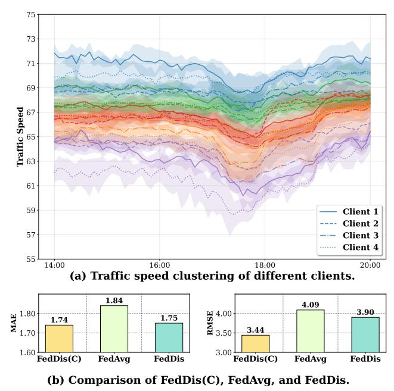
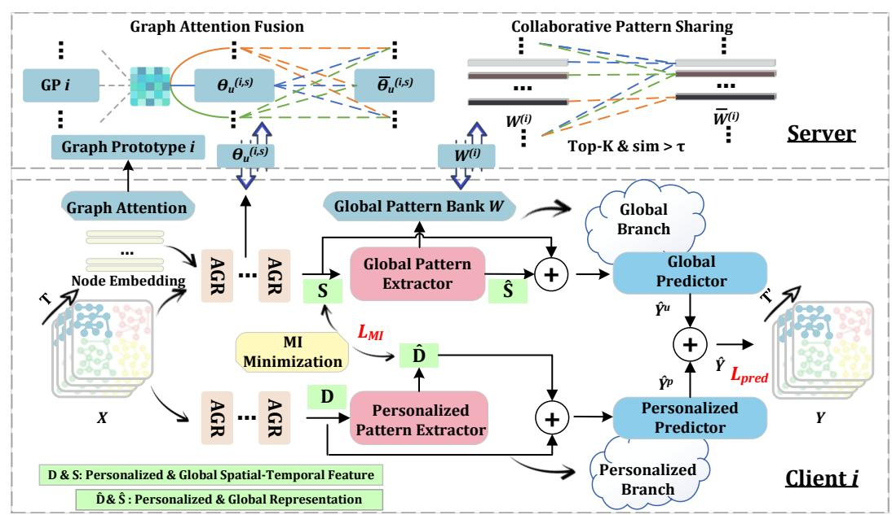
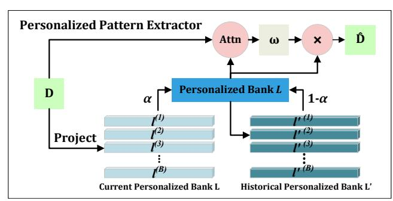
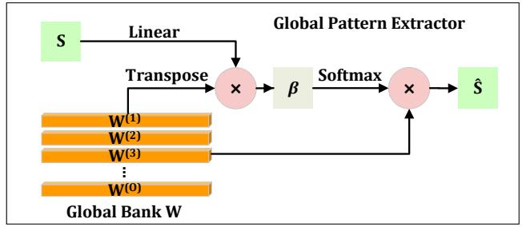
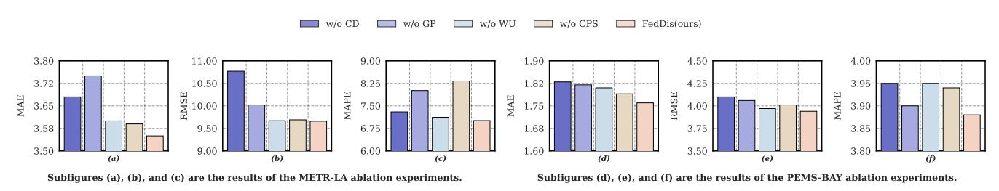
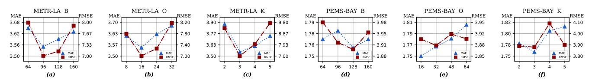
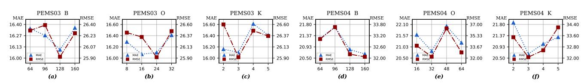

# FedDis: A Causal Disentanglement Framework for Federated Traffic Prediction

[Chengyang Zhou](https://orcid.org/0009-0004-8572-5429)∗ Jilin University Changchun, China chengyang25@mails.jlu.edu.cn

[Zijian Zhang](https://orcid.org/0000-0003-1194-8334)∗† Jilin University Changchun, China zhangzijian@jlu.edu.cn

[Chunxu Zhang](https://orcid.org/0000-0003-0825-872X)∗ Jilin University Changchun, China zhangchunxu@jlu.edu.cn

[Hao Miao](https://orcid.org/0000-0001-9346-7133) The Hong Kong Polytechnic University Hong Kong, China hao.miao@polyu.edu.hk

[Yulin Zhang](https://orcid.org/0009-0003-3848-3175) Jilin University Changchun, China ylzhang2123@mails.jlu.edu.cn

[Kedi Lyu](https://orcid.org/0000-0002-7905-3759) Jilin University Changchun, China kdlyu@jlu.edu.cn

[Juncheng Hu](https://orcid.org/0000-0002-6232-9093)† Jilin University Changchun, China jchu@jlu.edu.cn

# Abstract

Federated learning offers a promising paradigm for privacy-preserving traffic prediction, yet its performance is often challenged by the non-identically and independently distributed (non-IID) nature of decentralized traffic data. Existing federated methods frequently struggle with this data heterogeneity, typically entangling globally shared patterns with client-specific local dynamics within a single representation. In this work, we postulate that this heterogeneity stems from the entanglement of two distinct generative sources: client-specific localized dynamics and cross-client global spatial-temporal patterns. Motivated by this perspective, we introduce FedDis, a novel framework that, to the best of our knowledge, is the first to leverage causal disentanglement for federated spatial-temporal prediction. Architecturally, FedDis comprises a dual-branch design wherein a Personalized Bank learns to capture client-specific factors, while a Global Pattern Bank distills common knowledge. This separation enables robust cross-client knowledge transfer while preserving high adaptability to unique local environments. Crucially, a mutual information minimization objective is employed to enforce informational orthogonality between the two branches, thereby ensuring effective disentanglement. Comprehensive experiments conducted on four real-world benchmark datasets demonstrate that FedDis consistently achieves state-of-the-art performance, promising efficiency, and superior expandability.

# CCS Concepts

• Information systems → Spatial-temporal systems; • Computing methodologies → Distributed computing methodologies.

# Keywords

Traffic prediction, Spatial-temporal prediction, Federated learning

∗Also with the Key Laboratory of Symbolic Computation and Knowledge Engineering

#### ACM Reference Format:

Chengyang Zhou, Zijian Zhang, Chunxu Zhang, Hao Miao, Yulin Zhang, Kedi Lyu, and Juncheng Hu. 2026. FedDis: A Causal Disentanglement Framework for Federated Traffic Prediction. In Proceedings of the ACM Web Conference 2026 (WWW '26), April 13–17, 2026, Dubai, United Arab Emirates. ACM, New York, NY, USA, [11](#page-10-0) pages.<https://doi.org/10.1145/3774904.3792663>

# 1 Introduction

The proliferation of location-based services has generated massive traffic data, providing new opportunities to support urban planning and intelligent transportation systems [\[9,](#page-8-0) [26](#page-8-1)[–28,](#page-8-2) [35,](#page-8-3) [36\]](#page-8-4), centering on the challenge of modeling complex spatial-temporal dependencies across road networks [\[21\]](#page-8-5). The development of deep spatialtemporal models has significantly advanced this capability. Early approaches such as DCRNN [\[20\]](#page-8-6) and GWNet [\[37\]](#page-8-7) leverage diffusion graph convolutions and adaptive graph learning, while more recent transformer-based and hybrid architectures, like PDFormer [\[17\]](#page-8-8) and D2STGNN [\[32\]](#page-8-9), have achieved further breakthroughs in longrange temporal modeling and dynamic signal disentanglement.

However, the effectiveness of these centralized models is predicated on data aggregation, a requirement often unfeasible in practice, where traffic data is siloed across regions due to privacy and ownership concerns. Consequently, collaborative prediction without sharing raw data has become a pressing need for transportation authorities. Federated Learning (FL) [\[29,](#page-8-10) [40\]](#page-8-11), a computational paradigm designed to address this challenge, enables cross-client model training while preserving data privacy.

Federated learning methods have emerged for spatial-temporal prediction. FedGRU [\[25\]](#page-8-12) models temporal patterns with recurrent networks, CNFGNN [\[30\]](#page-8-13) captures spatial dependencies via Graph Neural Networks (GNNs), FedGTP [\[39\]](#page-8-14) exploits inter-client spatial correlations while preserving privacy, SFL [\[5\]](#page-8-15) simultaneously learns a global model and client-specific personalized models using relation graphs. Methods such as FedTPS [\[47\]](#page-9-0) and pFedCTP [\[43\]](#page-8-16) address data heterogeneity through pattern sharing or cross-region knowledge transfer. Despite its potential, applying FL to the spatialtemporal domain reveals a fundamental challenge: learning globally consistent patterns from locally heterogeneous data. The nonidentically and independently distributed (non-IID) nature of client data not only complicates the extraction of stable global patterns but

of Ministry of Education, Jilin University. †Corresponding authors.

[This work is licensed under a Creative Commons Attribution 4.0 International License.](https://creativecommons.org/licenses/by/4.0) WWW '26, Dubai, United Arab Emirates © 2026 Copyright held by the owner/author(s). ACM ISBN 979-8-4007-2307-0/2026/04 <https://doi.org/10.1145/3774904.3792663>

Figure 1: Illustration on PEMS-BAY. (a) The illustration of universal spatial-temporal patterns across clients. (b) Performance comparison of centralized, federated, and our FedDis.

also makes models highly susceptible to client-specific confounding factors [\[22,](#page-8-17) [23,](#page-8-18) [44\]](#page-8-19). Compounding this issue, existing federated frameworks entangle global and local knowledge within a unified representation, failing to explicitly distinguish their roles during optimization [\[23,](#page-8-18) [30,](#page-8-13) [39,](#page-8-14) [43,](#page-8-16) [44\]](#page-8-19). This compromises the model's adaptability to local environments and introduces potential privacy risks.

This challenge is directly reflected in real-world data. As illustrated in Figure [1](#page-1-0) (a), each line denotes the mean speed of a traffic pattern cluster, while the corresponding shaded band illustrates its distribution. The visualization reveals that different clients exhibit strong commonalities in both their overall speed distributions and their temporal dynamics, highlighting the existence of shared global patterns. This observation inspires our approach: an effective federated model should first identify common patterns locally, then maintain global insights through cross-client knowledge sharing, all while preserving personalized client dynamics.

To address these challenges, we propose a causal disentanglement framework for federated spatial-temporal prediction, FedDis, a dual-branch framework that explicitly disentangles globally stable patterns and personalized local factors. The global branch captures stable, cross-client traffic patterns that can be collaboratively aggregated, whereas the personalized branch models client-specific dynamics updated locally. This dual-branch causal disentanglement facilitates robust cross-region knowledge transfer, maintains local adaptability, safeguards sensitive client information, and improves interpretability and predictive accuracy.

Empirical results confirm the effectiveness of this design. As shown in Figure [1](#page-1-0) (b), we compare different training paradigms with our backbone, i.e., centralized training (FedDis (C)), representative federated training (FedAvg), and our disentangled federated

training (FedDis). Our FedDis consistently outperforms FedAvg, which jointly optimizes global and local information, achieving lower MAE and RMSE and approaching the performance of its centralized counterpart FedDis (C). These results demonstrate that separating shared and personalized patterns enables more robust, generalizable, and adaptive federated spatial-temporal traffic prediction, effectively addressing both local and global challenges under heterogeneous, decentralized traffic data.

Our major contributions can be summarized as:

- We identify and formalize two distinct yet complementary patterns within federated spatial-temporal data: globally stable correlations and personalized local dynamics, and propose a causal disentanglement framework to model them separately, addressing the core challenge of data heterogeneity.
- To our knowledge, we propose the first causal disentanglement federated framework for traffic prediction, named FedDis. It features a novel dual-branch architecture to isolate and learn the two aforementioned components separately, ensuring that clientspecific knowledge is not conflated with global patterns.
- We conduct extensive experiments on four real-world datasets, demonstrating that FedDis consistently achieves state-of-the-art performance against competitive baselines. Our in-depth analysis validates that this disentangled approach is robust, scalable, and effective for heterogeneous, decentralized traffic data.

# 2 Methodology

# 2.1 Problem Definition

Spatial-Temporal Prediction. Let the road network be modeled as a graph G = (V, A) with �� = |V | nodes, where each node represents a traffic sensor and A ∈ R �� ×�� encodes spatial correlations. Each node ���� is associated with a traffic time series X�� = {�� } ��total ��=1 , where �� �� ∈ R �� denotes the traffic state at time ��. Given historical observations X��−��+1:�� , spatial-temporal prediction aims to predict future traffic states over the next �� ′ steps: Yˆ = F X��−��+1:�� , A; �� , where F (·) denotes a learnable model parameterized with ��, and Y ∈ ˆ R �� ×�� ′×�� .

Federated Spatial-Temporal Prediction. Under the privacy constraint that traffic data are partitioned across multiple clients, each client �� maintains a local subgraph G (��) = (V(��) , A (��) ) and its associated traffic observations X(��) . The complete road network G is formed by the union of all �� clients' subgraphs, i.e., G = �� ��=1 G (��) .

In federated spatio-temporal prediction, the goal is to collaboratively learn a global model F�� that minimizes the aggregated prediction loss across all clients while preserving data privacy. Formally, the optimization objective is defined as,

min ∑︁�� ��=1 ���� L F X (��) ��−��+1:�� , A (��) ; �� , Y (��) , (1)

where L (·) denotes the local prediction loss for each client, ���� is a weight reflecting the relative importanceof client ��, Y(��) represents the future traffic states for client ��, and �� are the parameters of the shared global model optimized through federated learning.

Figure 2: FedDis framework. Each client adopts a dual-branch architecture with a global branch and a personalized branch, which enables causal decoupling. The Global Pattern Extractor maintains a Global Pattern Bank (W), which captures globally shared patterns, while the Personalized Pattern Extractor maintains a Personalized Pattern Bank (L), capturing local dynamic traffic variations. Client aggregates node embeddings to yield its Graph Prototypes (GP), which indicate the client's overall structural and properties. On the server side, GP guides the aggregation of sharable parameters �� (i,s) u , and the W facilitates global knowledge sharing across clients.

# 2.2 Framework Overview

As illustrated in Figure [2,](#page-2-0) we propose FedDis, a federated causal disentanglement spatio-temporal prediction framework designed to jointly model personalized and global patterns.

On each client, two stacked Adaptive Graph Convolutional Recurrent (AGR) cells (Section [2.3\)](#page-2-1) first encode the spatial-temporal data. The feature is then processed by the causal representation decoupling framework (Section [2.4\)](#page-3-0), which consists of two complementary branches: the Personalized Branch captures local, personalized influences, while the Global Branch extracts stable, global traffic patterns. On the server side, the global patterns and sharable parameters from all clients are aggregated to facilitate global knowledge sharing (Section [2.5\)](#page-4-0). After receiving the aggregated results from the server, each client combines the two branches to generate the final traffic predictions.

## 2.3 Spatial-Temporal Feature Extractor

Adaptive adjacency matrix has been widely adopted in spatialtemporal prediction [\[14,](#page-8-20) [20,](#page-8-6) [41,](#page-8-21) [45\]](#page-8-22), as it allows the model to dynamically capture interdependencies among different nodes. Motivated by this, we construct an adaptive adjacency matrix A = Softmax(ReLU(EE⊤)), where E ∈ R |V(��) |×�� is a learnable node embedding matrix. The resulting A ∈ R |V(��) |× |V(��) is incorporated into graph convolution and further combined with GRU [\[8\]](#page-8-23) to form an AGR cell [\[2\]](#page-8-24):

GraphConv(X, A;W, b) = AXW + b, (2)

where W and b are trainable parameters. Given spatial-temporal data X ∈ R |V(��) |×�� ×�� , GraphConv(·) can capture the spatial dependencies among nodes and yield transformed representations.

Then, we extend the GRU as AGR by replacing its linear transformations with adaptive graph convolution operator:

z�� = �� GraphConv( [X�� ||H��−1], A;W��, b�� ) , (3)

r�� = �� GraphConv( [X�� ||H��−1], A;W�� , b��) , (4)

H˜ �� = tanh GraphConv( [X�� || (r�� ⊙ H��−1)], A;Wℎ, bℎ) , (5)

H�� = z�� ⊙ H��−1 + (1 − z�� ) ⊙ H˜ . (6)

where ��(·) denotes the sigmoid function, ⊙ denotes the Hadamard product, || indicates concatenation. The variables z�� , r�� , and H˜ correspond to the update gate, the reset gate, and the candidate hidden state in the AGR cell, respectively.

For the input traffic sequence X, we employ a spatial-temporal encoder composed of stacked AGR layers. The encoder processes the sequence recurrently: at each time step ��, every AGR layer computes its current hidden state based on the input feature ���� and the previous hidden state H��−1. The output sequence from the final layer of the stack, H ∈ R |V(��) |×��, serves as the comprehensive spatial-temporal representation, where �� is the hidden dimension.

This encoder architecture serves as the foundation of our causal representation decoupling framework. We implement two structurally identical encoders with unshared parameters to maintain

Figure 3: Personalized pattern extractor.

the spatial-temporal representations into two distinct latent components, i.e., S and D. This design allows each branch to specialize in modeling different facets of the spatial-temporal dynamics.

## 2.4 Causal Representation Decoupling Framework

In this subsection, we propose a causal decoupling framework that explicitly separates personalized, dynamic fluctuations from stable, globally shared patterns. Our model features two complementary branches: a personalized branch to capture client-specific influences and a global branch to model common traffic behaviors, providing a comprehensive and disentangled view of the overall traffic state.

2.4.1 Personalized Branch. The Personalized Branch is designed to capture the unique local traffic behaviors of each individual client through a pattern bank that encodes latent personalized states. Its core component is a Personalized Pattern Extractor (Figure [3\)](#page-3-1), which maintains a bank of latent local patterns and adaptively retrieves them to inform the model's predictions. This allows the model to adjust to localized and ever-changing traffic dynamics.

#### Personalized Pattern Extractor.

The personalized pattern bank is denoted as L ∈ R ��×��, where �� denotes the number of personalized patterns. This bank is designed to store and evolve a set of representative local traffic states. To ensure the bank is both stable and adaptive, it is randomly initialized, refined via PCA whitening [\[1\]](#page-8-25), and then updated with momentum. Given the current traffic representation D ∈ R |V(��) |×�� from the upstream AGR layers, we first project it to generate a set of current patterns L. The bank L is then updated as L = ��L + (1 − ��)L ′ . Here, �� ∈ [0, 1] is a momentum coefficient that balances the influence of historical patterns (the existing L ′ ) against new observations (L). This allows the bank to preserve long-term context while integrating the most recent traffic dynamics.

With the updated pattern bank, the model must determine which historical patterns are most relevant to the current traffic state. To achieve this, we use an attention mechanism. For each feature vector D (��) in the current representation D, we compute a compatibility score �� (��) between D and every vector �� (��) in the pattern bank. These scores are calculated using a learnable function, typically a lightweight MLP, and then normalized via a softmax operation to produce attention weights �� = Softmax(��). The refined personalized representation Dˆ is then computed as a weighted combination

Figure 4: Global pattern extractor.

of the bank vectors:

Dˆ �� = ∑︁�� ��=1 �� (��,��) �� (��) , (7)

where �� (��) denotes the ��-th row of ��, and Dˆ is the ��-th row of the final personalized representation Dˆ .

The personalized representation is obtained by selectively attending to the most relevant vectors in the personalized bank. Through this attention-based fusion, the model adaptively captures diverse personalized patterns, allowing the learned representations to reflect heterogeneous dynamics under varying traffic contexts.

Personalized Predictor. The Personalized Branch generates its prediction by fusing the original dynamic features D with the refined, context-aware representation Dˆ . This integration allows the branch to adaptively model heterogeneous and client-specific traffic patterns. The combined features are then mapped to the output dimension via a a fully connected network Yˆ �� = MLP(D + Dˆ ).

2.4.2 Global Branch. The Global Branch is designed to capture stable, invariant traffic patterns that are common across all clients. Its primary component, a Global Pattern Extractor, distills these shared features while a Global Predictor generates the final branch output. This design ensures that the learned global patterns are robustly disentangled from local variations.

#### Global Pattern Extractor.

As illustrated in Figure [4,](#page-3-2) the global pattern extractor's main goal is to form a stable global representation without directly sharing features derived from raw client data, thus preserving privacy. To achieve this, it maintains a learnable global pattern bank W ∈ R ��×��, where �� denotes the number of global patterns. The bank uses random initialization followed by Xavier [\[13\]](#page-8-26) and continuously refined during training to encode globally consistent traffic patterns.

Each feature in S is projected into a query space through a learnable linear mapping, yielding S = S · W�� + b�� , where W�� and b�� are learnable projection parameters. The resulting queries interact with the pattern bank W to compute similarity scores, which are normalized via softmax to obtain attention weights �� ∈ R |V�� |×�� . These weights guide the aggregation of shared patterns, producing the final global representation Sˆ ∈ R |V�� |×��:

Sˆ = �� · W = Softmax(S · W⊤ ) · W. (8)

Global Predictor. The global predictor fuses the refined global representation Sˆ with the stable features S to generate the final prediction. By emphasizing invariant and cross-client dependencies, it captures globally consistent trends that complement the

Table 1: Datasets statistics.

| Dataset  | #Sensors | #Timesteps | Time    | Range     |
|----------|----------|------------|---------|-----------|
| METR-LA  | 207      | 34,272     | 03/2012 | – 06/2012 |
| PEMS-BAY | 325      | 52,116     | 01/2017 | – 06/2017 |
| PEMS03   | 358      | 26,208     | 09/2018 | – 11/2018 |
| PEMS04   | 307      | 16,992     | 01/2018 | – 02/2018 |

2.5.3 Federated Optimization. In federated optimization, the server coordinates multiple clients to collaboratively build a shared model without ever exposing their raw, sensitive data.

Server-side. In each federated round, the server collects updates from all clients, including the global pattern bank W(��) , graph prototypes h (��) �� , and shared model parameters �� (��,�� ) . It aggregates similar patterns across clients through collaborative pattern sharing and updates the shared parameters via graph attention fusion guided by the graph prototypes. The refined parameters and pattern banks are then redistributed to clients.

Client-side. Each client receives the updated shared parameters ¯�� (��,�� ) and global pattern bank W¯ (��) from the server and performs local training on both global and personalized branches. Let Yˆ�� and Yˆ �� denote the outputs from the global and personalized branches, fused as Yˆ = Yˆ�� + Yˆ �� .

The local objective combines prediction supervision via MAE loss Lpred and mutual information loss L���� to disentangle global and personalized features, where �� balances the two terms:

L = Lpred + ��L���� . (18)

During training pipeline, only global branch parameters �� (��,�� ) , graph prototypes h (��) �� , and the global pattern bank W(��) are uploaded to the server; personalized parameters �� (��,��) remain local, preserving client-specific information.

# 3 Experiments

This section presents the experimental results, including comparisons with state-of-the-art baselines, evaluation under different federated client configurations, ablation studies on core model components, and analysis of key hyper-parameters.

# 3.1 Datasets

Our experiments are conducted on four widely used traffic benchmarks: METR-LA, PEMS-BAY [\[20\]](#page-8-6), PEMS03, and PEMS04 [\[34\]](#page-8-29). METR-LA and PEMS-BAY record traffic speed from loop detectors in Los Angeles and the Bay Area, while PEMS03 and PEMS04 contain traffic flow measurements from the California PeMS system. All datasets have 5-minute intervals (288 per day). For fair comparison, each dataset is split into 60% training, 20% validation, and 20% testing. Detailed statistics are provided in Table [1.](#page-5-0)

# 3.2 Baselines

To evaluate the proposed model, we compare it with two groups of baselines using MAE, RMSE, and MAPE:

(1) Centralized traffic prediction methods: Serve as upperbound references, assuming all data are available centrally. GWNet [\[37\]](#page-8-7): Captures multiscale spatial and temporal dependencies via graph wavelet transforms. AGCRN [\[2\]](#page-8-24): Learns dynamic spatial

correlations with adaptive graph convolution and models temporal patterns using recurrent networks.

(2) Federated traffic prediction methods: Includes general federated optimization strategies and recent spatial-temporal traffic prediction approaches. FedAvg [\[29\]](#page-8-10): Averages client model updates. FedProx [\[19\]](#page-8-30): Adds a proximal term to mitigate heterogeneity across clients. STDN [\[4\]](#page-8-31): Trend-seasonality disentanglement-based and transformer-based model with federated setting. FedGTP [\[39\]](#page-8-14): Models inter-client spatial dependencies with a graph-based approach. pFedCTP [\[43\]](#page-8-16): Decouples spatial and temporal components for personalized cross-city traffic prediction.

#### 3.3 Experimental Setups

Our framework is implemented in Python 3.12.3 with PyTorch 2.7.0, and experiments are conducted on NVIDIA RTX 3090 GPUs. The look-back window and prediction horizon are set to 12, with 4 clients by default. We train the model using Adam with an initial learning rate of 0.005 and a batch size of 64. The momentum coefficient �� for personalized bank updates is set to 0.5, and the similarity threshold �� for collaborative pattern sharing is 0.3. We implement baselines and tune key hyper-parameters to attain the optimal performance. Federated training runs for 100 communication rounds, with each client performing 1 local epoch per round.

### 3.4 Overall Performance

As shown in Table [2,](#page-6-0) (1)Centralized models are strong baselines due to their efficient use of global data, while federated methods usually underperform because of data decentralization. Although our model does not consistently surpass centralized approaches, it achieves competitive performance under privacy constraints and shows advantages on specific metrics, such as lower MAPE on PEMS03 and PEMS04. These gains stem from the synergy of causal representation decoupling and cross-client collaboration, where disentangling global and client-specific factors produces sharable, interference-resistant representations, and similarity-aware aggregation with graph attention further improves global knowledge fusion and consistency under privacy constraints. (2) FedAvg and FedProx are implemented as federated variants of our backbone for fair comparison. They perform competitively on METR-LA and PEMS-BAY, confirming the strong representational capacity of our backbone, but degrade on sparser datasets (PEMS03/04) due to limited handling of client heterogeneity. In contrast, our method explicitly models structure-aware and pattern-level heterogeneity, yielding consistently lower prediction errors across all datasets. (3) Within the federated traffic prediction methods, our method consistently achieves the lowest or near-lowest error across datasets, demonstrating stable and accurate spatial-temporal predictions. Other methods also perform competitively, showing that federated designs can effectively share knowledge across clients while capturing spatial-temporal dependencies under heterogeneous data. For instance, it reduces MAE by 6.99% over FedGTP and 6.02% over pFedCTP on PEMS03. These consistent gains confirm that our approach further improves robustness and prediction accuracy by explicitly modeling both personalized and global traffic patterns. (4) In terms of computational efficiency, our method maintains competitive costs among federated traffic prediction baselines. FedDis

Table 2: Performance comparison of different methods. "(a)" means centralized traffic prediction methods, "(b)" means federated traffic prediction methods, and "(ours)" means our proposed method FedDis. "Time/r" represents the average time of federation rounds. Within each method group, the best results are bolded and the second-best results are underlined.

|        | Dataset Metric | MAE     | METR-LA RMSE | MAPE(%) | MAE     | PEMS-BAY RMSE | MAPE(%) | MAE     | PEMS03 RMSE | MAPE(%) | MAE     | PEMS04 RMSE | MAPE(%) | Time/r (s) |
|--------|----------------|---------|--------------|---------|---------|---------------|---------|---------|-------------|---------|---------|-------------|---------|------------|
| (a)    | GWNet          | 3.05    | 6.20         | 8.29    | 1.59    | 3.66          | 3.54    | 14.82   | 25.24       | 16.16   | 19.16   | 30.46       | 13.26   |            |
|        | AGCRN          | 3.19    | 6.46         | 9.00    | 1.64    | 3.77          | 3.71    | 15.89   | 28.12       | 15.38   | 19.83   | 32.26       | 12.97   |            |
| (ours) | FedDis         | 3.55    | 7.01         | 9.66    | 1.75    | 3.90          | 3.93    | 16.10   | 25.92       | 13.43   | 20.66   | 32.07       | 12.43   |            |
|        | FedAvg         | 4.14    | 9.48         | 13.56   | 1.84    | 4.09          | 4.18    | 18.71   | 29.48       | 15.92   | 26.50   | 43.37       | 16.55   | 214.61     |
|        | FedProx        | 3.81    | 7.53         | 10.80   | 2.15    | 5.97          | 4.83    | 18.52   | 33.77       | 16.12   | 26.20   | 40.96       | 16.78   | 220.99     |
| (b)    | STDN           | 3.57    | 7.31         | 11.06   | 1.86    | 4.43          | 4.17    | 18.59   | 30.21       | 15.38   | 21.77   | 33.21       | 13.39   | 101.80     |
|        | FedGTP         | 4.86    | 10.51        | 13.12   | 1.75    | 3.98          | 3.95    | 17.31   | 27.98       | 17.97   | 22.15   | 34.17       | 16.31   | 1,758.45   |
|        | pFedCTP        | 3.76    | 7.07         | 10.44   | 2.20    | 4.49          | 5.04    | 17.58   | 26.72       | 14.29   | 21.53   | 33.16       | 14.35   | 138.12     |
| (ours) | FedDis         | 3.55    | 7.01         | 9.66    | 1.75    | 3.90          | 3.93    | 16.10   | 25.92       | 13.43   | 20.66   | 32.07       | 12.43   | 253.69     |
|        | Impr ↑         | + 0.56% | + 0.85%      | + 7.47% | + 0.49% | + 0.21%       | + 0.51% | + 6.99% | + 2.99%     | + 6.02% | + 4.04% | + 3.29%     | + 7.17% |            |

Figure 5: Ablation study.

Table 3: Performance comparison under different numbers of clients. "#Clients" denotes the number of clients.

| # Clients Metric | FedGTP | pFedCTP | FedDis | Impr ↑  |
|------------------|--------|---------|--------|---------|
| MAE              | 4.86   | 3.76    | 3.55   | + 5.59% |
| RMSE             | 10.51  | 7.07    | 7.01   | + 0.85% |
| MAPE(%)          | 13.12  | 10.44   | 9.66   | + 7.47% |
| MAE              | 5.01   | 3.86    | 3.59   | + 6.99% |
| RMSE             | 12.45  | 6.81    | 6.79   | + 0.29% |
| MAPE(%)          | 12.76  | 10.54   | 9.84   | + 6.64% |
| MAE              | 4.81   | 3.74    | 3.60   | + 3.74% |
| RMSE             | 12.10  | 6.93    | 6.96   |         |
| MAPE(%)          | 12.22  | 10.36   | 9.95   | + 3.96% |
| MAE              | 5.10   | 3.87    | 3.64   | + 5.94% |
| RMSE             | 12.33  | 7.14    | 7.08   | + 0.84% |
| MAPE(%)          | 12.72  | 10.60   | 10.17  | + 4.06% |

required 253.69s per round, comparable to FedAvg and FedProx, and far more efficient than FedGTP (1,758.45s), indicating that the introduced collaboration mechanisms add only modest overhead. The similarity-aware pattern aggregation and graph attention fusion modules operate on compact pattern banks and graph prototypes rather than full model parameters, ensuring lightweight computation. As a result, the model effectively leverages shared knowledge without substantially increasing per-round computation or communication, achieving a favorable trade-off between predictive performance and efficiency in large-scale federated traffic prediction scenarios.

# 3.5 Expandability Analysis

A critical test for real-world federated learning systems is their ability to maintain performance as the network scales. To simulate this, we evaluate model robustness by progressively increasing the number of clients (�� = 4, 8, 16, 32) on the METR-LA dataset.

The results, presented in Table [3,](#page-6-1) reveal key advantages of our approach. While baseline methods exhibit notable performance degradation as client numbers grow, FedDis demonstrates remarkable resilience, maintaining its state-of-the-art accuracy across all scales. This superior scalability is a direct outcome of our model's fundamental design: by explicitly disentangling personalized dynamics from global patterns, FedDis is not overwhelmed by the increasing client heterogeneity that causes other entangled models to falter. This architectural choice ensures that the global model learns only from stable, shared knowledge, preserving its integrity regardless of network size. These findings highlight a key advantage of FedDis —its suitability for dynamic, large-scale federated systems where robustness under increasing complexity is essential.

# 3.6 Ablation Study

To assess the contribution of each component, we conduct ablation studies with the following variants: (1) w/o CD removes the causal disentanglement module, including the personalized pattern extractor and mutual information minimization; (2) w/o GP replaces graph attention fusion with standard FedAvg; (3) w/o WU disables the uploading of the global bank, making each client update it locally; and (4) w/o CPS removes the collaborative pattern sharing module and directly averages the global bank on the server before being distributed back to clients.

The quantitative results are presented in Figure [5,](#page-6-2) subfigures (a-c) show the ablation results on the METR-LA dataset, while subfigures (d-f) present the corresponding results on the PEMS-BAY dataset.

Figure 6: Hyper-parameter analysis of the number of personalized patterns ��, the number of global patterns ��, and the Top-�� patterns on METR-LA and PEMS-BAY.

From these figures, we observe that all components contribute positively to performance. Specifically, removing CD or GP results in the most notable degradation across all metrics, showing that causal disentanglement and graph-aware aggregation are fundamental for capturing heterogeneous spatial-temporal dependencies. The absence of WU leads to a moderate decline, indicating that uploading the global bank mainly facilitates cross-client knowledge transfer and global pattern refinement. Furthermore, the variant without CPS shows relatively larger RMSE fluctuations on both datasets, suggesting that the collaborative pattern sharing mechanism is crucial for enhancing similarity-aware knowledge exchange among clients while preventing the over-smoothing of diverse traffic patterns. This demonstrates that CPS effectively strengthens global collaboration without compromising representational diversity.

### 3.7 Hyper-Parameters Analysis

In this subsection, we analyze the sensitivity of FedDis to key hyperparameters. Specifically, �� is set to {8, 16, 24, 32} for METR-LA and {16, 32, 48, 64} for PEMS-BAY, �� is varied within {64, 96, 128, 160}, and Top-�� is tested with values {2, 3, 4, 5}. The results are reported on METR-LA and PEMS-BAY datasets, as shown in Figure [6.](#page-7-0)

From the results, several conclusions can be made: (1) The performance improves first and then degrades as �� increases. This suggests that too few universal patterns cannot fully capture the shared knowledge, while too many may introduce redundancy and noise. (2) The smaller dataset favors a moderate number of patterns, while the larger dataset requires more. This indicates that largerscale datasets tend to exhibit more complex dynamics, demanding richer patterns, whereas moderate settings are sufficient for smaller datasets. (3) Using a small number of selected patterns yields the best results across datasets. A very small �� may overlook useful knowledge, while a large �� may introduce mismatched patterns that harm prediction. Therefore, keeping �� small ensures more precise and effective knowledge aggregation.

### 4 Related Work

Spatial-Temporal Prediction. Spatial-temporal prediction methods aim to effectively capture both temporal dynamics and spatial dependencies [\[6,](#page-8-32) [12,](#page-8-33) [38,](#page-8-34) [41\]](#page-8-21). Early methods mainly employed RNNs for temporal modeling [\[3,](#page-8-35) [18,](#page-8-36) [33\]](#page-8-37), often combined with CNNs to extract spatial features [\[42\]](#page-8-38). To model real-world topologies, GNNs have emerged as the predominant tool for modeling non-Euclidean spatial correlations. Initial GNN-based models like DCRNN [\[20\]](#page-8-6) and STGCN [\[15\]](#page-8-39) operated on predefined graphs, while later works adaptively learned graph structures to capture hidden inter-node dependencies [\[2,](#page-8-24) [37\]](#page-8-7). Parallel efforts leverage attention mechanisms to model time-varying spatial relationships [\[10,](#page-8-40) [46\]](#page-9-1).

Despite achieving strong accuracy, centralized models face limitations due to privacy and data governance. Our proposed FedDis addresses these challenges by effectively modeling complex spatialtemporal dependencies while preserving locally stored private data, balancing predictive performance with privacy.

Federated Spatial-Temporal Prediction. FL naturally addresses distributed data and privacy constraints, allowing clients to train models locally and share only parameters [\[29\]](#page-8-10). FL has been increasingly applied to spatial-temporal prediction tasks [\[11,](#page-8-41) [24\]](#page-8-42). For instance, FedGRU [\[25\]](#page-8-12) integrates FL with gated recurrent units, leveraging ensemble clustering to capture traffic correlations, CN-FGNN [\[30\]](#page-8-13) collects local temporal embeddings from clients and applies GNNs to generate spatial embeddings, which are then returned to the respective clients for forecasting, while FedGTP [\[39\]](#page-8-14) uses privacy-preserving mechanisms to exploit inter-client spatial dependencies. To handle data heterogeneity, FedTPS [\[47\]](#page-9-0) extracts low-frequency traffic patterns for global sharing, and pFedCTP [\[43\]](#page-8-16) transfers knowledge from data-rich to data-scarce cities for personalized cross-city prediction.

However, these methods largely fail to disentangle local dynamic patterns from global stable patterns in federated spatial-temporal data. To address this, we explicitly model these two complementary components and propose, to the best of our knowledge, the first causal disentanglement framework for federated traffic prediction.

#### 5 Conclusion

Accurate traffic prediction is crucial for intelligent transportation systems, but it is challenging under federated settings where data are distributed and privacy must be preserved. In this context, we first identify the long-overlooked entanglement problem between personalized local patterns and global stable patterns, which existing methods fail to address effectively. To tackle this, we propose FedDis, a dual-branch causal disentanglement framework that leverages mutual information minimization, collaborative pattern sharing, and graph attention fusion to adaptively decouple and integrate global and personalized traffic knowledge. Extensive experiments on four real-world traffic datasets demonstrate that FedDis consistently outperforms existing federated baselines and approaches the performance of centralized models, highlighting its effectiveness in robust, privacy-preserving traffic prediction.

# 6 Acknowledgments

ZZ is supported by the China Postdoctoral Science Foundation (2025M771587), the Open Funding Programs of State Key Laboratory of AI Safety and the Key R&D Program of Jilin Province (20260205050GH). JH is supported by the National Key R&D Program (2024YFB3310200).

#### References

[1] Hervé Abdi and Lynne J Williams. 2010. Principal component analysis. Wiley interdisciplinary reviews: computational statistics 2, 4 (2010), 433–459. [2] Lei Bai, Lina Yao, Can Li, Xianzhi Wang, and Can Wang. 2020. Adaptive graph convolutional recurrent network for traffic forecasting. Advances in neural information processing systems 33 (2020), 17804–17815. [3] Zekun Cai, Renhe Jiang, Xinlei Lian, Chuang Yang, Zhaonan Wang, Zipei Fan, Kota Tsubouchi, Hill Hiroki Kobayashi, Xuan Song, and Ryosuke Shibasaki. 2023. Forecasting citywide crowd transition process via convolutional recurrent neural networks. IEEE Transactions on Mobile Computing 23, 5 (2023), 5433–5445. [4] Lingxiao Cao, Bin Wang, Guiyuan Jiang, Yanwei Yu, and Junyu Dong. 2025. Spatiotemporal-aware Trend-Seasonality Decomposition Network for Traffic Flow Forecasting. In Proceedings of the AAAI Conference on Artificial Intelligence, Vol. 39. 11463–11471. [5] Fengwen Chen, Guodong Long, Zonghan Wu, Tianyi Zhou, and Jing Jiang. 2022. Personalized federated learning with graph. arXiv preprint arXiv:2203.00829 (2022). [6] Weiqi Chen, Ling Chen, Yu Xie, Wei Cao, Yusong Gao, and Xiaojie Feng. 2020. Multi-range attentive bicomponent graph convolutional network for traffic forecasting. In Proceedings of the AAAI conference on artificial intelligence, Vol. 34. 3529–3536. [7] Pengyu Cheng, Weituo Hao, Shuyang Dai, Jiachang Liu, Zhe Gan, and Lawrence Carin. 2020. Club: A contrastive log-ratio upper bound of mutual information. In International conference on machine learning. PMLR, 1779–1788. [8] Kyunghyun Cho, Bart Van Merriënboer, Caglar Gulcehre, Dzmitry Bahdanau, Fethi Bougares, Holger Schwenk, and Yoshua Bengio. 2014. Learning phrase representations using RNN encoder-decoder for statistical machine translation. arXiv preprint arXiv:1406.1078 (2014). [9] Yuchen Fang, Hao Miao, Yuxuan Liang, Liwei Deng, Yue Cui, Ximu Zeng, Yuyang Xia, Yan Zhao, Torben Bach Pedersen, Christian S Jensen, et al. 2025. Unraveling Spatio-Temporal Foundation Models via the Pipeline Lens: A Comprehensive Review. arXiv preprint arXiv:2506.01364 (2025). [10] Yuchen Fang, Yanjun Qin, Haiyong Luo, Fang Zhao, Bingbing Xu, Liang Zeng, and Chenxing Wang. 2023. When spatio-temporal meet wavelets: Disentangled traffic forecasting via efficient spectral graph attention networks. In 2023 IEEE 39th International Conference on Data Engineering (ICDE). IEEE, 517–529. [11] Xingbo Fu, Binchi Zhang, Yushun Dong, Chen Chen, and Jundong Li. 2022. Federated graph machine learning: A survey of concepts, techniques, and applications. ACM SIGKDD Explorations Newsletter 24, 2 (2022), 32–47. [12] Xu Geng, Yaguang Li, Leye Wang, Lingyu Zhang, Qiang Yang, Jieping Ye, and Yan Liu. 2019. Spatiotemporal multi-graph convolution network for ride-hailing demand forecasting. In Proceedings of the AAAI conference on artificial intelligence, Vol. 33. 3656–3663. [13] Xavier Glorot and Yoshua Bengio. 2010. Understanding the difficulty of training deep feedforward neural networks. In Proceedings of the thirteenth international conference on artificial intelligence and statistics. JMLR Workshop and Conference Proceedings, 249–256. [14] Shengnan Guo, Youfang Lin, Ning Feng, Chao Song, and Huaiyu Wan. 2019. Attention based spatial-temporal graph convolutional networks for traffic flow forecasting. In Proceedings of the AAAI conference on artificial intelligence, Vol. 33. 922–929. [15] Haoyu Han, Mengdi Zhang, Min Hou, Fuzheng Zhang, Zhongyuan Wang, Enhong Chen, Hongwei Wang, Jianhui Ma, and Qi Liu. 2020. STGCN: a spatial-temporal aware graph learning method for POI recommendation. In 2020 IEEE International Conference on Data Mining (ICDM). IEEE, 1052–1057. [16] Kaiming He, Xiangyu Zhang, Shaoqing Ren, and Jian Sun. 2015. Delving deep into rectifiers: Surpassing human-level performance on imagenet classification. In Proceedings of the IEEE international conference on computer vision. 1026–1034. [17] Jiawei Jiang, Chengkai Han, Wayne Xin Zhao, and Jingyuan Wang. 2023. Pdformer: Propagation delay-aware dynamic long-range transformer for traffic flow prediction. In Proceedings of the AAAI conference on artificial intelligence, Vol. 37. 4365–4373. [18] Renhe Jiang, Zekun Cai, Zhaonan Wang, Chuang Yang, Zipei Fan, Quanjun Chen, Kota Tsubouchi, Xuan Song, and Ryosuke Shibasaki. 2021. DeepCrowd: A deep model for large-scale citywide crowd density and flow prediction. IEEE Transactions on Knowledge and Data Engineering 35, 1 (2021), 276–290. [19] Tian Li, Anit Kumar Sahu, Manzil Zaheer, Maziar Sanjabi, Ameet Talwalkar, and Virginia Smith. 2020. Federated optimization in heterogeneous networks. Proceedings of Machine learning and systems 2 (2020), 429–450. [20] Yaguang Li, Rose Yu, Cyrus Shahabi, and Yan Liu. 2017. Diffusion convolutional recurrent neural network: Data-driven traffic forecasting. arXiv preprint arXiv:1707.01926 (2017). [21] Fan Liu, Weijia Zhang, and Hao Liu. 2023. Robust spatiotemporal traffic forecasting with reinforced dynamic adversarial training. In Proceedings of the 29th ACM SIGKDD Conference on Knowledge Discovery and Data Mining. 1417–1428. [22] Lei Liu, Yuxing Tian, Chinmay Chakraborty, Jie Feng, Qingqi Pei, Li Zhen, and Keping Yu. 2023. Multilevel federated learning-based intelligent traffic flow forecasting for transportation network management. IEEE Transactions on Network and Service Management 20, 2 (2023), 1446–1458. [23] Qingxiang Liu, Sheng Sun, Yuxuan Liang, Min Liu, and Jingjing Xue. 2025. Personalized federated learning for spatio-temporal forecasting: A dual semantic alignment-based contrastive approach. In Proceedings of the AAAI Conference on Artificial Intelligence, Vol. 39. 12192–12200. [24] Rui Liu, Pengwei Xing, Zichao Deng, Anran Li, Cuntai Guan, and Han Yu. 2024. Federated graph neural networks: Overview, techniques, and challenges. IEEE transactions on neural networks and learning systems (2024). [25] Yi Liu, JQ James, Jiawen Kang, Dusit Niyato, and Shuyu Zhang. 2020. Privacypreserving traffic flow prediction: A federated learning approach. IEEE Internet of Things Journal 7, 8 (2020), 7751–7763. [26] Yisheng Lv, Yanjie Duan, Wenwen Kang, Zhengxi Li, and Fei-Yue Wang. 2014. Traffic flow prediction with big data: A deep learning approach. Ieee transactions on intelligent transportation systems 16, 2 (2014), 865–873. [27] Jiaming Ma, Binwu Wang, Guanjun Wang, Kuo Yang, Zhengyang Zhou, Pengkun Wang, Xu Wang, and Yang Wang. 2025. Less but more: Linear adaptive graph learning empowering spatiotemporal forecasting. Advances in Neural Information Processing Systems (2025). [28] Jiaming Ma, Binwu Wang, Pengkun Wang, Zhengyang Zhou, Xu Wang, and Yang Wang. 2025. Bist: A lightweight and efficient bi-directional model for spatiotemporal prediction. Proceedings of the VLDB Endowment 18, 6 (2025), 1663–1676. [29] Brendan McMahan, Eider Moore, Daniel Ramage, Seth Hampson, and Blaise Aguera y Arcas. 2017. Communication-efficient learning of deep networks from decentralized data. In Artificial intelligence and statistics. PMLR, 1273–1282. [30] Chuizheng Meng, Sirisha Rambhatla, and Yan Liu. 2021. Cross-node federated graph neural network for spatio-temporal data modeling. In Proceedings of the 27th ACM SIGKDD conference on knowledge discovery & data mining. 1202–1211. [31] Leland Gerson Neuberg. 2003. Causality: models, reasoning, and inference, by judea pearl, cambridge university press, 2000. Econometric Theory 19, 4 (2003), 675–685. [32] Zezhi Shao, Zhao Zhang, Wei Wei, Fei Wang, Yongjun Xu, Xin Cao, and Christian S Jensen. 2022. Decoupled dynamic spatial-temporal graph neural network for traffic forecasting. arXiv preprint arXiv:2206.09112 (2022). [33] Xingjian Shi, Zhourong Chen, Hao Wang, Dit-Yan Yeung, Wai-Kin Wong, and Wang-chun Woo. 2015. Convolutional LSTM network: A machine learning approach for precipitation nowcasting. Advances in neural information processing systems 28 (2015). [34] Chao Song, Youfang Lin, Shengnan Guo, and Huaiyu Wan. 2020. Spatialtemporal synchronous graph convolutional networks: A new framework for spatial-temporal network data forecasting. In Proceedings of the AAAI conference on artificial intelligence, Vol. 34. 914–921. [35] Binwu Wang, Yudong Zhang, Xu Wang, Pengkun Wang, Zhengyang Zhou, Lei Bai, and Yang Wang. 2023. Pattern expansion and consolidation on evolving graphs for continual traffic prediction. In Proceedings of the 29th ACM SIGKDD Conference on Knowledge Discovery and Data Mining. 2223–2232. [36] Jingyuan Wang, Jiawei Jiang, Wenjun Jiang, Chao Li, and Wayne Xin Zhao. 2021. Libcity: An open library for traffic prediction. In Proceedings of the 29th international conference on advances in geographic information systems. 145–148. [37] Zonghan Wu, Shirui Pan, Guodong Long, Jing Jiang, and Chengqi Zhang. 2019. Graph wavenet for deep spatial-temporal graph modeling. arXiv preprint arXiv:1906.00121 (2019). [38] Sijie Yan, Yuanjun Xiong, and Dahua Lin. 2018. Spatial temporal graph convolutional networks for skeleton-based action recognition. In Proceedings of the AAAI conference on artificial intelligence, Vol. 32. [39] Linghua Yang, Wantong Chen, Xiaoxi He, Shuyue Wei, Yi Xu, Zimu Zhou, and Yongxin Tong. 2024. FedGTP: exploiting inter-client spatial dependency in federated graph-based traffic prediction. In Proceedings of the 30th ACM SIGKDD conference on knowledge discovery and data mining. 6105–6116. [40] Qiang Yang, Yang Liu, Tianjian Chen, and Yongxin Tong. 2019. Federated machine learning: Concept and applications. ACM Transactions on Intelligent Systems and Technology (TIST) 10, 2 (2019), 1–19. [41] Bing Yu, Haoteng Yin, and Zhanxing Zhu. 2017. Spatio-temporal graph convolutional networks: A deep learning framework for traffic forecasting. arXiv preprint arXiv:1709.04875 (2017). [42] Junbo Zhang, Yu Zheng, and Dekang Qi. 2017. Deep spatio-temporal residual networks for citywide crowd flows prediction. In Proceedings of the AAAI conference on artificial intelligence, Vol. 31. [43] Yu Zhang, Hua Lu, Ning Liu, Yonghui Xu, Qingzhong Li, and Lizhen Cui. 2024. Personalized federated learning for cross-city traffic prediction. In 33rd International Joint Conference on Artificial Intelligence, IJCAI. 5526–5534. [44] Yudong Zhang, Xu Wang, Xuan Yu, Kuo Yang, Zhengyang Zhou, and Yang Wang. 2025. FedSTG: Breaking through Spatio-Temporal Data Silos with Federated Graph Learning. In Companion Proceedings of the ACM on Web Conference 2025. 1534–1538. [45] Ling Zhao, Yujiao Song, Chao Zhang, Yu Liu, Pu Wang, Tao Lin, Min Deng, and Haifeng Li. 2019. T-GCN: A temporal graph convolutional network for traffic

Figure 7: Hyper-parameter analysis of the number of personalized patterns ��, the number of global patterns ��, and the Top-�� patterns on PEMS03 and PEMS04.

Table 4: Performance comparison of different initialization strategies on the PEMS04 dataset.

| Method  | MAE   | RMSE  | MAPE(%) |
|---------|-------|-------|---------|
| Random  | 22.01 | 33.62 | 13.88   |
| Xavier  | 21.70 | 33.26 | 13.65   |
| Kaiming | 20.96 | 32.08 | 13.70   |
| FedDis  | 20.66 | 32.07 | 12.43   |

Top-�� to {2, 3, 4, 5}. For PEMS04,�� is set to {16, 32, 48, 64}, with the same ranges for �� and Top-��. The results are reported in Figure [7.](#page-10-1)

We observe that the model performance first improves and then declines as the number of universal patterns �� increases. For the larger PEMS03 dataset, the best MAE and RMSE are obtained at �� = 24, indicating that a moderate number of patterns is sufficient to capture the complex dynamics without introducing redundancy. For the smaller PEMS04 dataset, performance peaks at �� = 32, suggesting that even smaller datasets may require a moderate number of patterns to fully represent shared traffic characteristics.

Regarding the number of dynamic patterns ��, moderate values generally yield the best results. For PEMS03, �� = 128 achieves the lowest MAE and RMSE, while for PEMS04, �� = 160 slightly improves MAPE and RMSE. Too few dynamic patterns may underfit personalized traffic dynamics, whereas too many can introduce noise.

For Top-�� selection, small values consistently lead to better performance across both datasets. Selecting only the most relevant patterns ensures precise knowledge aggregation, whereas larger �� values may include mismatched patterns and degrade prediction accuracy. Specifically, �� = 3 achieves the best balance for both PEMS03 and PEMS04. Overall, these results demonstrate that Fed-Dis is robust to hyper-parameter variations when proper moderate values are chosen.

### A.3 Initialization Study.

We further investigate the impact of different initialization strategies for the pattern bank. Table [4](#page-10-2) compares Random, Xavier [\[13\]](#page-8-26), and Kaiming [\[16\]](#page-8-43) initialization with our proposed strategy on the PEMS04 dataset. As shown in Table 4, more appropriate initialization schemes consistently yield better performance, and FedDis achieves the best results across all evaluation metrics. Compared with standard initialization methods, FedDis provides a more informative starting point for pattern learning and refinement, enabling the model to capture more discriminative spatial-temporal patterns. These results demonstrate that, beyond architectural design, proper initialization and pattern refinement strategies are critical for achieving optimal performance.