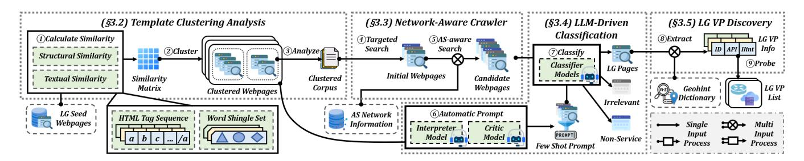
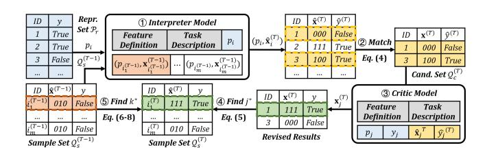
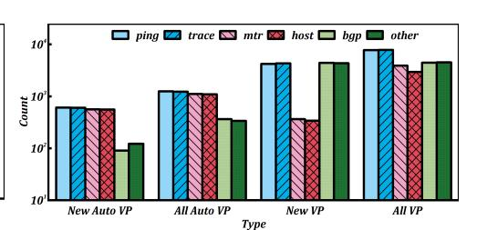
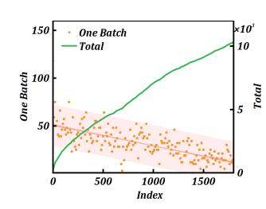
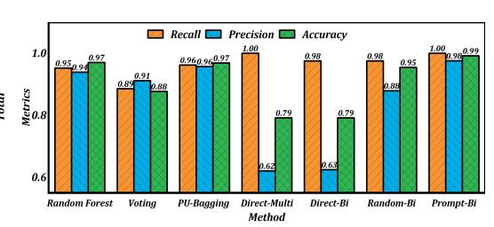
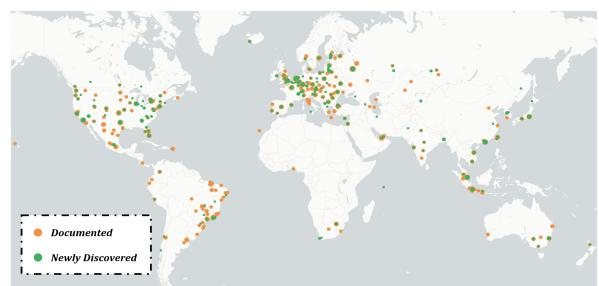
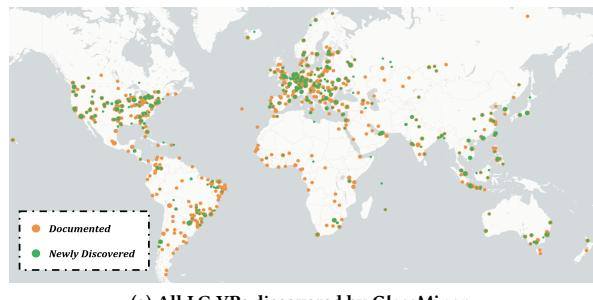
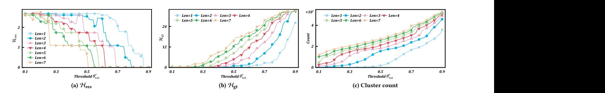
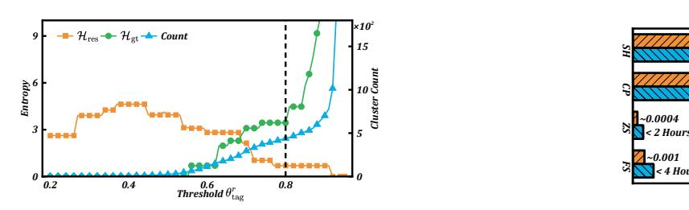
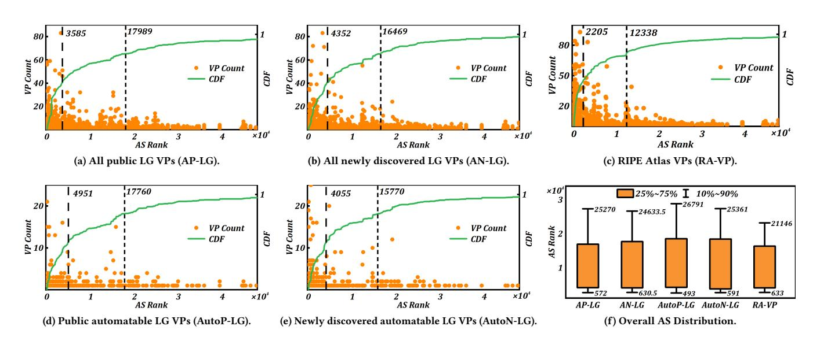

# GlassMiner: Mining Looking Glass Services via Structure-Semantics Fusion for Web Observability

[Yunze Wei](https://orcid.org/0009-0004-8126-7248) Tsinghua University Beijing, China weiyz23@mails.tsinghua.edu.cn

[Xingang Shi](https://orcid.org/0000-0001-6487-9526)∗ Tsinghua University Beijing, China Zhongguancun Laboratory Beijing, China shixg@cernet.edu.cn

[Han Zhang](https://orcid.org/0000-0003-4429-9959)∗ Tsinghua University Beijing, China Zhongguancun Laboratory Beijing, China zhhan@tsinghua.edu.cn

[Tianyu Zhang](https://orcid.org/0009-0009-5001-8368) Tsinghua University Beijing, China Zhongguancun Laboratory Beijing, China zhangty23@mails.tsinghua.edu.cn

[Yahui Li](https://orcid.org/0000-0002-0148-5965) Tsinghua University Beijing, China liyahui@mail.tsinghua.edu.cn

[Xia Yin](https://orcid.org/0009-0000-0037-2777) Tsinghua University Beijing, China Zhongguancun Laboratory Beijing, China yxia@tsinghua.edu.cn

### Abstract

Looking Glass (LG) vantage points (VPs) are valuable for enhancing the observability of distributed web infrastructures. However, their comprehensive discovery faces significant challenges due to the inherent heterogeneity and obscurity of LG services. We present GlassMiner, a novel mining framework that fuses structural and semantic features to discover Internet-wide LG web services and the corresponding VPs. To achieve comprehensive, efficient, and accurate discovery, GlassMiner employs structure-pattern fused clustering and targeted adaptive crawling on heterogeneous LG webpages and integrates large language models for semantic-driven classification. Overall, GlassMiner uncovers 3,867 LG webpages and 7,558 VPs that were previously undocumented in public lists and undetected by prior methods. Compared to state-of-the-art approaches, it represents a 1.82× increase in discovery while operating at 3.43× greater mining efficiency. To demonstrate their value for enhancing web infrastructure observability, we further leverage these newly discovered LGs to investigate routing performance and detours in two large-scale CDNs.

# CCS Concepts

• Information systems → Web searching and information discovery; Web mining; • Networks → Network measurement.

### Keywords

Web Mining; Looking Glass; Webpage Clustering; Prompt Engineering; Internet Measurement

[This work is licensed under a Creative Commons Attribution 4.0 International License.](https://creativecommons.org/licenses/by/4.0)

WWW '26, Dubai, United Arab Emirates. © 2026 Copyright held by the owner/author(s). ACM ISBN 979-8-4007-2307-0/2026/04 <https://doi.org/10.1145/3774904.3792698>

#### ACM Reference Format:

Yunze Wei, Xingang Shi, Han Zhang, Tianyu Zhang, Yahui Li, and Xia Yin. 2026. GlassMiner: Mining Looking Glass Services via Structure-Semantics Fusion for Web Observability. In Proceedings of the ACM Web Conference 2026 (WWW '26), April 13–17, 2026, Dubai, United Arab Emirates. ACM, New York, NY, USA, [12](#page-11-0) pages.<https://doi.org/10.1145/3774904.3792698>

#### Resource Availability:

The source code of this paper has been made publicly available at [https:](https://doi.org/10.5281/zenodo.18288225) [//doi.org/10.5281/zenodo.18288225.](https://doi.org/10.5281/zenodo.18288225) An interactive visualization demo can be accessed at [https://weiyz23.github.io/WWW26-GlassMiner/country/.](https://weiyz23.github.io/WWW26-GlassMiner/country/)

# 1 INTRODUCTION

Modern web services rely on globally distributed infrastructures such as content delivery networks (CDNs) to ensure their service quality [\[7,](#page-8-0) [62\]](#page-8-1), where accurate performance measurement and analysis require wide visibility into both end-to-end metrics [\[51,](#page-8-2) [61\]](#page-8-3) and the underlying routing behavior [\[22,](#page-8-4) [59,](#page-8-5) [64\]](#page-8-6). However, existing vantage points (VPs) used in such measurement fall short: residential proxies and client-side instrumentation offer only end-to-end metrics [\[7,](#page-8-0) [22,](#page-8-4) [59\]](#page-8-5), and public measurement platforms [\[32,](#page-8-7) [40\]](#page-8-8) suffer from deployment imbalance and lengthy schedules [\[2,](#page-8-9) [8,](#page-8-10) [18\]](#page-8-11). Moreover, they both lack the ability to obtain ground truth routing information, while such information provided by known route monitoring platforms [\[33,](#page-8-12) [35\]](#page-8-13) is far from complete.

Looking Glass (LG) services—measurement utilities operated by Internet service providers (ISPs)—offer valuable complements for providing both control-plane (routing) and data-plane (forwarding) observations. Yet, existing LG-indexing portals [\[21,](#page-8-14) [28,](#page-8-15) [34,](#page-8-16) [38,](#page-8-17) [44\]](#page-8-18) are often outdated, with 79.2% of their listed LGs being unreachable or dysfunctional, and they fail to capture many LGs that remain unindexed in the wild. Mining these undocumented LGs is quite challenging due to their heterogeneity—ranging from their underlying open-source software [\[49,](#page-8-19) [50\]](#page-8-20) to ISP-specific customizations and their obscurity, as LG webpages are highly isolated (i.e., they rarely crosslink) and poorly ranked by search engines [\[4,](#page-8-21) [17\]](#page-8-22).

To overcome these challenges, an effective LG discovery tool should meet the following requirements: Wide coverage (R1).

∗Corresponding authors.

Many well-known VPs are concentrated in top-tier autonomous systems (ASes) and network hubs [\[8,](#page-8-10) [18,](#page-8-11) [27,](#page-8-23) [65\]](#page-8-24). It is crucial to find VPs across diverse regions and levels of the Internet hierarchy to capture a more comprehensive view of the Internet. High efficiency (R2). LG sites are obscure and account for only a minuscule fraction of the billions of websites [\[26\]](#page-8-25). Consequently, the tool should minimize redundant crawling and efficiently filter out irrelevant pages. Accurate classification (R3). Even a small false positive rate of 1% can yield thousands of irrelevant pages in millions of candidates, drowning out valid LG webpages. Therefore, the tool should accurately distinguish LG sites from the vast number of irrelevant webpages despite their structural variations.

Prior research suffers from limited coverage [\[11,](#page-8-26) [24,](#page-8-27) [25,](#page-8-28) [39\]](#page-8-29) or low efficiency [\[3,](#page-8-30) [9,](#page-8-31) [23,](#page-8-32) [27,](#page-8-23) [47,](#page-8-33) [65\]](#page-8-24). To meet the above requirements, we present GlassMiner, a novel framework for comprehensive, efficient, and accurate LG service discovery through the following designs: Structure-pattern fused analysis. GlassMiner clusters webpages based on fused HTML structure and content patterns. This isolates template-specific interaction logic from content variations, enabling robust identification of LG webpages sharing a template while preserving tolerance across customizations. The selective TF-IDF keyword extraction within each cluster further produces diverse, cluster-specific keywords. Targeted adaptive crawling. GlassMiner reduces redundancy in candidate webpage discovery by generating targeted queries augmented with those keywords and AS metadata. It leverages search engine relevance constraints to suppress duplicates and prioritizes underexplored networks, thereby harvesting more related webpages and improving coverage of unpopular LG webpages. Semantics-driven classification. GlassMiner employs large language models (LLMs) to understand webpage semantics for LG webpage identification. To compensate for LLMs' lack of domain knowledge, GlassMiner automates few-shot sample selection. An interpreter model analyzes the semantics of representative webpages and extracts features, while a critic model refines these features for automated sample selection and prompt generation, yielding precise domain-aware classification with minimal manual effort.

We implemented GlassMiner and successfully discovered 7,525 LG webpages, among which 3,867 were not included in existing public lists. Our approach achieved a 1.82× improvement in discovery with 3.43× greater efficiency compared to the state-of-the-art (SOTA) method [\[27,](#page-8-23) [65\]](#page-8-24). Consequently, we identified 7,558 previously undocumented VPs, spanning 205 ASes and 128 cities that were beyond the reach of prior methods. Among them, 846 are automatable VPs that support programmatic measurements.

We also present a case study on CDN performance to demonstrate the utility of our discovered LG VPs. We leverage them to measure two major CDNs—Cloudflare and Google—analyzing their performance variations across regions. Using ground-truth routing data from LG VPs, we further identify the ASes responsible for detours that are invisible to route monitoring platforms.

To summarize, our main contributions are as follows:

- We propose a novel template clustering analysis method that leverages HTML structure and content patterns to analyze heterogeneous LG webpages, providing generalizable insights for template-driven webpage discovery.

- We implement GlassMiner, a comprehensive, efficient, and accurate LG mining tool. Besides template clustering analysis, it integrates a network-aware crawler for efficient candidate mining and an LLM-driven classifier for accurate LG identification.
- We deploy GlassMiner in the wild and achieve 1.82× more discovery yield with 3.43× greater efficiency over the SOTA methods. A case study on CDN performance evaluation further shows the practical value of the discovered LG VPs. We also release our code and the discovered VP list to facilitate future research [\[55\]](#page-8-34).

## 2 BACKGROUND

We begin by introducing LG services, then outline the requirements for their discovery and highlight the limitations of existing approaches, thereby motivating the design of GlassMiner.

### 2.1 Looking Glass Services

Looking Glass services are public web services that allow external users to run limited network measurements, typically via web portals. Users can execute tasks such as ping, traceroute, and Border Gateway Protocol (BGP) lookups through these portals. These tasks are performed from a set of designated routers or servers, referred to as LG VPs. Operators typically deploy VPs at critical infrastructures like backbone routers, Internet exchange points (IXPs), or data centers to provide integrated control-plane and data-plane perspectives with insightful results [\[16,](#page-8-35) [18\]](#page-8-11). However, these VPs are commonly protected by access control and not directly accessible, so all measurements must be issued through the LG service.

# 2.2 Related Work

Existing solutions are unable to meet the above requirements with roughly three strategies employed: Internet scanning, hyperlinkguided crawling, and common-keyword search.

Internet scanning discovers active web services via port scanning [\[9,](#page-8-31) [47\]](#page-8-33) or domain analysis [\[3,](#page-8-30) [23\]](#page-8-32). However, due to LG VP access restrictions, these methods cannot directly identify LG services. They require exhaustive address-space exploration without heuristics, leading to prohibitive overhead [\[26,](#page-8-25) [65\]](#page-8-24).

Hyperlink-guided crawling develops focused crawlers that exploit hyperlinks from seed pages to fetch candidate webpages and prioritize topic-relevant ones [\[11,](#page-8-26) [24,](#page-8-27) [25,](#page-8-28) [39\]](#page-8-29), effectively reducing irrelevant webpages. Nevertheless, such approaches are ineffective in discovering new LG services due to the weakly connected nature of LG webpages [\[65\]](#page-8-24), thus suffering from low coverage.

Common-keyword search utilizes search engines to discover LG services via shared keywords [\[27,](#page-8-23) [65\]](#page-8-24). By employing TF-IDF [\[56\]](#page-8-36) to extract frequent keywords from seed pages, these methods enable

targeted searches, significantly expanding the discovery scope [\[65\]](#page-8-24). However, they still suffer from two limitations. First, they introduce unfairness between different templates and underestimate diversity. Since TF-IDF assigns higher scores to globally frequent keywords, it favors dominant LG templates, leaving less common templates under-represented and limiting overall coverage. Second, search engine constraints hinder discovery. As many ISPs deploy LG services using similar templates, deduplication mechanisms (e.g., based on Jaccard [\[46\]](#page-8-37) or SimHash [\[41\]](#page-8-38)) often filter out valid pages. Furthermore, as specialized, low-traffic services, LGs typically rank

Figure 1: Framework overview of GlassMiner. It starts with template clustering analysis, followed by a network-aware crawler that prioritizes search based on network metadata and cluster-specific keywords. The candidate webpages then undergo LLM-driven classification using automated few-shot prompting, leading to LG VP discovery via active probing.

poorly and remain hidden in generic results [\[4,](#page-8-21) [17\]](#page-8-22), especially those operated by smaller ISPs.

#### 3 METHODOLOGY

In this section, we first introduce the overall framework of Glass-Miner. We then present a detailed design of each module, explaining their functionalities and interactions within the system.

#### 3.1 GlassMiner Overview

Considering the aforementioned design goals, we propose the overall framework of GlassMiner, illustrated in Figure [1,](#page-2-0) which comprises four key modules: template clustering analysis, networkaware crawler, LLM-driven classification, and LG VP discovery.

The template clustering analysis module employs unsupervised clustering based on structural and textual similarity to group LG webpages. This process identifies LG templates and diverse clusters within each template and further extracts specific keywords for each cluster. The network-aware crawler formulates queries based on the extracted keywords for clusters. It maintains a priority queue informed by network metadata to fetch candidate webpages, thereby enhancing the discovery efficiency. The LLM-driven classification module employs an interpreter model and a critic model to achieve automated few-shot selection, guiding the classifier to accurately identify LG webpages from the crawled results. Finally, the LG VP discovery module constructs requests and performs measurements based on the templates to extract LG VPs from the identified LG webpages.

#### 3.2 Template Clustering Analysis

GlassMiner distinguishes LG templates and extracts specific keywords via clustering analysis. This broadens the coverage of LG webpages (R1) and supports efficient, targeted querying (R2).

Challenge 1: Heterogeneity of LG webpages. LG webpages based on different templates may exhibit similar textual content, whereas those derived from the same template can vary significantly due to customization. Existing approaches often neglect this issue and thus cannot reliably determine template sharing. For instance, I-Match [\[13,](#page-8-39) [52\]](#page-8-40) depends on content features that are sensitive to minor textual changes, while SimHash [\[41\]](#page-8-38) and its variants generate fingerprints that hinder precise similarity measurement.

Design 1: Clustering based on fused similarity. To address this, GlassMiner employs a multi-stage unsupervised clustering framework for LG webpages, enabling template-level automated invocation and cluster-level keyword extraction. Two complementary measures are considered in the clustering process: structural similarity (HTML layout) and textual similarity (content pattern). This fusion effectively captures inter-template differences and intratemplate variations.

3.2.1 Structural Similarity Calculation. Although webpages from the same template may differ in style and content, their core components typically retain structural regularities. These components carry the primary interaction logic and are less affected by customization. Accordingly, GlassMiner first clusters webpages by analyzing HTML structures.

The preprocessing step removes style and script tags while retaining others. Considering the core components of LG webpages using the same template are often encapsulated in specific structures, GlassMiner transforms the remaining HTML tags into sequences containing only tag names. By computing the longest common subsequence (LCS) between two such tag sequences of two webpages, GlassMiner quantifies template similarity while reducing the effect of customization. Compared with tree edit distance methods [\[43,](#page-8-41) [60\]](#page-8-42), sequence analysis improves efficiency, lowering complexity from O (�� 3 ) to O (�� 2 ).

We employ the LCS algorithm to compute the longest shared subsequence between two HTML tag sequences, ��1 and ��2. The structural similarity function Sim1 (·) is defined as follows:

Sim1 (��1, ��2) = ℓ(LCS(��1, ��2)) min(ℓ(��1), ℓ(��2)) + log2 max(ℓ(��1), ℓ(��2)) . (1)

Here, ℓ(·) denotes the length of the sequence and LCS(��1, ��2) represents their longest common subsequence.

By prioritizing shorter webpages, GlassMiner captures structural and template-level consistency while reducing the impact of customized content. We also introduce a normalization mechanism that prevents bias toward excessively short pages while preserving symmetry in calculation. Together, these strategies enable robust quantification of structural similarity across LG webpages.

3.2.2 Textual Similarity Calculation. Although webpages within the same cluster typically share a template, their content can still vary significantly due to factors such as language or configurations. Relying solely on structural analysis may therefore introduce bias. A key observation is that webpages with similar content often contain recurring sequences of words [\[29\]](#page-8-43). We adopt the notion

Table 1: Comparison between GlassMiner and LG-focused crawlers in the retrieval processes. Unique pages (Unq. Pages) are deduplicated from all retrieved pages (Rtr. Pages).

| Method Origin           | #Keywords | #Querys | #Rtr.     | Pages #Unq. | Pages (%) |
|-------------------------|-----------|---------|-----------|-------------|-----------|
| General Text            | 67        | 67      | 58139     | 17,848      | (30.70%)  |
| URL LG-focused          | 3,658     | 3,658   | 1,109,983 | 334,276     | (30.12% ) |
| Title + Domain Crawlers | 125,557   | 220,259 | 2,799,188 | 493,684     | (17.64%)  |
| Total                   | 129,943   | 224,645 | 3,967,310 | 845,808     | (21.32%)  |
| Cluster Text            | 551       | 3,450   |           |             |           |
| General Text GlassMiner | 13        | 78      | 744,133   | * 369,297   | (49.63%)  |
| AS-aware                | 125,557   | 106,360 | 466,080   | 188,450     | (40.43%)  |
| Total                   | 126,121   | 109,810 | 1,210,213 | 449,866     | (37.17%)  |

\* GlassMiner retrieves the cluster and general queries together in random order.

Moreover, multi-class classification across unrelated, LG-related, and LG-service webpages requires complex prompts, which can increase inference overhead and reduce accuracy [\[12\]](#page-8-50). To address this, GlassMiner decomposes the task into two binary stages: first distinguishing LG-related webpages from unrelated ones, then separating LG service from other LG-related webpages. Automated few-shot selection is only applied in the second stage, as LLMs already achieve near-perfect recall in the first stage.

### 3.5 LG VP Discovery

Although LG webpages are identified, the locations, invocation methods, and parameters of the VPs listed on these pages still remain unclear. GlassMiner discovers their metadata to ensure usability and determine whether these VPs can be automatically invoked without manual interaction.

GlassMiner first analyzes the most common webpage templates to automatically extract the invocation methods and parameters of the listed VPs. It then invokes the API of each target VP to send ping requests to multiple controlled servers, thereby identifying the measurement IP addresses of the targets. Finally, GlassMiner geolocates these VPs by analyzing their geographical hints on the webpages [\[18\]](#page-8-11) or, if necessary, applying IP-based geolocation [\[59,](#page-8-5) [65\]](#page-8-24). The implementation details are provided in Appendix [B.](#page-9-1)

Through this procedure, GlassMiner efficiently discovers LG VPs distributed across the Internet, providing valuable resources for measurement tasks.

### 4 EVALUATION

In this section, we evaluate the effectiveness of GlassMiner along four dimensions: (1) the effectiveness of webpage template clustering; (2) the efficiency of the network-aware crawler; (3) the accuracy of the LLM-based classifier in identifying LG service webpages; and (4) the overall discovery coverage in uncovering LG webpages and VPs beyond existing public lists.

Seed Pages. We collect 9,452 candidate LG seed page URLs from multiple public LG list sources [\[20,](#page-8-51) [21,](#page-8-14) [28,](#page-8-15) [34,](#page-8-16) [38,](#page-8-17) [44\]](#page-8-18), contributing 1,969 valid seed pages. We also use the Fofa [\[47\]](#page-8-33) cyberspace asset search engine to find the top 10,000 web services with the keyword "looking glass" in the description. However, these pages are mostly unrelated. After semi-automated filtering, manual inspection, and deduplication, we confirmed 3,658 LG pages in total.

Table 2: Comparison of LG discovery efficiency. Values in parentheses indicate the harvest rate.

| Method              | #Total LGs | #New LGs      | #New VPs      | #New Auto. VPs |
|---------------------|------------|---------------|---------------|----------------|
| LG-focused Crawlers | 5,777      | 2,119 (0.25%) | 3,981 (0.47%) | 305 (0.04%)    |
| GlassMiner          | 7,525      | 3,867 (0.86%) | 7,558 (1.68%) | 846 (0.19%)    |

Table 3: Overall coverage of the LG webpages and LG VPs.

| Type               | #Total (#New)                | #ASes (#New) | #Countries (#New) | #Cities (#New) |
|--------------------|------------------------------|--------------|-------------------|----------------|
| LG webpages LG VPs | 7,525 (3,867) 12,775 (7,558) | 1,073 (205)  | 118 (8)           | 809 (128)      |
| Auto. VPs          | 1,483 (846)                  | 564 (205)    | 70 (10)           | 379 (131)      |

Baselines. We compare GlassMiner with the SOTA LG-focused crawlers [\[27,](#page-8-23) [65\]](#page-8-24). They use identical analysis and crawling methods, differing only in the classification stage, so we implement them within the same framework. Moreover, they both crawl all results for each query; we limit the maximum number of results to 500 for queries based on their Title + Domain keywords for fairness.

Environment. All experiments are conducted on a Dell PowerEdge R740 server with 256 GB of memory and Ubuntu 20.04 LTS, and all experiments are implemented using Python 3.11.13. All search queries are conducted via Microsoft Bing due to its relatively lenient query restriction [\[65\]](#page-8-24). The LLM model is based on DeepSeek-V3-0324 provided by SiliconCloud [\[14\]](#page-8-52).

### 4.1 Clustering Effectiveness

The clustering analysis identifies webpage templates and extracts targeted keywords, improving both coverage and efficiency of LG webpage mining. From 3,658 seed pages, we obtained 433 templates and further split them by textual similarity into 575 clusters. As shown in Table [1,](#page-5-0) filtering these clusters yielded 564 unique highfrequency keywords, including 13 general terms and 551 templatespecific terms. Each query is constructed with the bigrams of these keywords within one cluster.

Compared to whole-text methods, clustering produces more distinctive keywords and thus a higher proportion of unique webpages, reducing redundancy from generic queries and broadening search coverage. The keyword count is smaller than the number of clusters due to overlaps, especially in minority clusters, underscoring the need for multi-keyword queries. For the final discovered webpages, structural clustering produced 810 templates, demonstrating the generalization ability of this approach. We also evaluated different clustering algorithms, as detailed in Appendix [C.1,](#page-10-1) confirming the effectiveness of our method.

### 4.2 Crawling Efficiency

GlassMiner achieves significantly higher efficiency than traditional crawlers. As shown in Table [1](#page-5-0) and Table [2,](#page-5-1) it discovers new LG webpages, VPs, and automatable (Auto.) VPs with 3.43×, 3.56×, and 5.22× higher efficiency, while retrieving only 30.5% of webpages and 53.2% of unique webpages compared to LG-focused crawlers.

The main overhead comes from crawling, so we measure the efficiency using the harvest rate, i.e., the ratio to the number of unique webpages. GlassMiner achieves harvest rates of 0.86%, 1.68%,

Figure 3: Newly discovered AS count in each iteration. Figure 4: Comparison of webpage classification accuracy, recall, and precision. Figure 5: Number of supported measurement commands for different types of LG VPs.

(a) All LG VPs discovered by GlassMiner. (b) Automatable LG VPs discovered by GlassMiner.

Figure 6: Geolocation distribution of all discovered and automatable LG VPs. VPs from previously documented and newly discovered webpages are shown with different symbols, and symbol size indicates the number of VPs at each location.

and 0.19% for new LG webpages, VPs, and automatable VPs, respectively, consistently outperforming existing methods. Despite selecting fewer candidates per query, targeted retrieval enables broader discovery, mitigating search engine bias.

With the same number of candidate keywords, GlassMiner executes only 48.3% of the queries by AS-informed adaptive crawling. Figure [3](#page-6-0) further shows the number of ASes discovered per iteration and the cumulative count under the network-aware crawler. This strategy reduces redundant crawling and covers more ASes early. Thus, even under limited measurement budgets, researchers can harvest LG webpages spanning a wider set of ASes.

#### 4.3 Classification Accuracy

We compare GlassMiner with the existing approaches: supervised learning, PU-Bagging, and LLM-based classifiers. The supervised baselines include RandomForest and a voting ensemble (Voting) with RandomForest, XGBoost, and so on [\[27\]](#page-8-23). PU-Bagging [\[65\]](#page-8-24) employs an ensemble of RandomForest models. For LLM baselines, we test zero-shot multi-class (Direct-Multi), zero-shot binary (Direct-Bi), and a variant using random sample prompts (Random-Bi). All models use the same prompt instructions as our method (Prompted-Bi). The supervised and PU-Bagging models are trained on 4,000 webpages, evenly split between LG and non-LG webpages. The shared test set contains 600 webpages with the same distribution, and the LG service pages span 48 template categories.

As shown in Figure [4,](#page-6-0) traditional methods outperform pre-trained LLMs without fine-tuning or few-shot prompts. Although baseline LLMs have low accuracy, they achieve near-perfect recall, showing potential to capture diverse semantics in LG service webpages. By decomposing the task into two binary stages and applying fewshot prompts, GlassMiner achieves nearly perfect recall and 97.6% precision. This almost eliminates false negatives and substantially reduces human effort.

#### 4.4 Overall Discovery Coverage

4.4.1 Overall Discovery Numbers. Table [3](#page-5-2) shows the overall results. Due to many BGP LG VPs only providing BGP queries and not supporting data-plane measurements, we neither parse their template structures nor classify them as automatable VPs.

GlassMiner discovers 7,525 LG service webpages, with 3,867 (1.82×) not in public lists and 12,775 VPs including 7,558 (1.90×) new ones. It also identifies 846 (2.77×) new automatable VPs, which can be scripted for global measurements. It covers all webpages and VPs found by traditional methods and substantially expands the set of known LG services. Moreover, Figure [5](#page-6-0) shows the command support for LG webpages and VPs from different sources. The reduction of BGP commands in automatable VPs is due to our exclusion of BGPonly VPs. It can be seen that the command support for webpages and VPs discovered by GlassMiner is significantly better than that of existing public lists and traditional methods, indicating that researchers have more options when conducting measurements.

4.4.2 Network Coverage. Taking all VPs with parsable AS information, GlassMiner extends coverage by discovering LG resources in 205 ASes absent from public lists, and another 205 new ASes that support automated queries. This greatly increases the diversity of networks observable via LG measurements. Their detailed distribution across different ASes is shown in Appendix [C.4.](#page-11-1)

Table 4: Comparison of CDN replica site selection efficiency. (P: Provider's own service, C: Customer's service, w/oN: replicas are ranked purely by geographic distance, wN: including an additional set of the top 3 nearest replicas nationwide. )

| Provider   | CDN Service | Type    | Detected Sites | Success Rate | AF w/oN | wN    | AS w/oN | wN    | Efficient EU w/oN | Replica wN | Hit NA w/oN | Rate wN | OC w/oN | wN    | SA w/oN | wN    |
|------------|-------------|---------|----------------|--------------|---------|-------|---------|-------|-------------------|------------|-------------|---------|---------|-------|---------|-------|
| Cloudflare | P           | Anycast | 94             | 0.963        | 1.000   | 1.000 | 0.890   | 0.903 | 0.904             | 0.908      | 0.969       | 0.969   | 1.000   | 1.000 | 1.000   | 1.000 |
|            | C           | Anycast | 94             | 0.959        | 1.000   | 1.000 | 0.890   | 0.890 | 0.864             | 0.877      | 0.970       | 0.970   | 1.000   | 1.000 | 1.000   | 1.000 |
| Google     | P           | DNS     | 24             | 0.214        | 1.000   | 1.000 | 0.731   | 0.731 | 0.787             | 0.787      | 0.950       | 0.950   | 1.000   | 1.000 | 1.000   | 1.000 |
|            | C           | Anycast | 57             | 0.944        | 0.800   | 0.800 | 0.841   | 0.841 | 0.779             | 0.793      | 0.957       | 0.957   | 1.000   | 1.000 | 1.000   | 1.000 |

4.4.3 Geographical Coverage. Figure [6](#page-6-1) presents the geographic distribution. Compared to SOTA methods, GlassMiner finds LG VPs in 128 cities and 8 countries previously unreached and 131 new cities and 10 countries with automatable VPs. Notably, 2,989 new VPs and 377 automatable VPs are located in Asia, Africa, Latin America, and Oceania, significantly enhancing coverage in underrepresented regions, enabling more balanced network observations.

# 5 Case Study on Web Observability

We present a case study to demonstrate how the collected LG VPs enhance web observation. By combining traceroute with BGP queries, we integrate both data-plane and control-plane information to pinpoint CDN routing issues, which could be invisible to public platforms [\[32,](#page-8-7) [35\]](#page-8-13). We focus on two major CDN providers, Google and Cloudflare, selecting domains from their services and those of popular customer services as targets (detailed in Appendix [D\)](#page-11-2).

We first pinpoint the approximate locations of replica sites using traceroute by analyzing the final /28 subnet (excluding the destination IP) and combining geolocation data with theoretical speed constraints. We then compare the success rate of hitting these replica sites with that of the top 3 nearest sites.

As shown in Table [4,](#page-7-0) Cloudflare performs better than Google, with a preference for closer domestic sites, likely due to cross-border traffic regulations. Their apparent near-perfect hit rate in Africa, Oceania, and South America can be attributed to fewer replica sites in these regions, facilitating easier access to the top 3 nearest replica sites. The results also indicate traffic isolation between Google's own services and customer services, because they use different traffic distribution techniques and success rates.

We also analyzed detour paths using LG VP's BGP query capabilities to identify the responsible ASes. In one case, the LG VP in AS59886 (Istanbul, Turkey) redirected traffic to Frankfurt, Germany. The AS sequence parsed from the IPs in the forwarding path by WHOIS was [6762, 59886, 6762, 13335, 399358], which indicated an AS loop. However, by BGP queries from the VP, we matched the AS\_PATH as [47123, 6762, 13335, 399358], which was invisible on public platforms. The RTT rise occurred before entering AS6762, indicating that the routing issue stemmed from the policy between AS47123 and AS6762, rather than between AS59886 and AS6762.

This case study demonstrates that LG VPs enhance web observability by identifying responsible ASes and diagnosing CDN traffic distribution issues from a network perspective.

# 6 DISCUSSION

Ethical Considerations. Our study follows established ethical guidelines for large-scale web crawling. We limit the query rate to 1 QPS and randomize candidate URLs to avoid consecutive requests to the same domain. Each crawler instance also hosts a webpage disclosing our study purpose and contact information.

For LG servers, which are intended for public network observability, we do not bypass access restrictions such as JavaScript challenges or CAPTCHA mechanisms and respect site owners' preferences. We additionally provide contact information on our public LG list page to ensure transparency and responsible use. Limitations. GlassMiner faces challenges with webpages relying heavily on JavaScript or CSS, which can complicate template metadata extraction. However, as demonstrated in our open-source repository [\[55\]](#page-8-34), these pages remain parsable with additional processing overhead. Furthermore, such cases are rare, constituting only about 7% (57/810) of the identified templates. Additionally, the accessibility of certain LGs is constrained by ISP network policies, which limits the coverage of some remote VPs.

Future Work. We plan to continuously update the LG VP list to ensure reliability and integrate other methods such as RDNS analysis to expand coverage. Notably, many web applications, including e-commerce and content management systems, also exhibit a template-driven architecture [\[5\]](#page-8-53). We hope that the design principles of GlassMiner can be adapted to more valuable web services.

# 7 CONCLUSION

In this paper, we introduce GlassMiner, a novel LG-focused crawler designed to mine LG services and VPs for enhanced network observability. First, by fusing structural and semantic features, Glass-Miner identifies webpage templates across heterogeneous LG services and extracts unique patterns via differential analysis to guide discovery. Second, its targeted query generation and network-aware crawling design optimize the relevance and diversity of search results, thereby substantially reducing redundancy and boosting efficiency. Finally, leveraging these templates, GlassMiner automates feature engineering through few-shot selection, enabling LLMs to accurately identify LG webpages using high-quality prompts. Our experiments show that GlassMiner successfully mined 3,867 new LG webpages and 7,558 unlisted VPs (with 846 accessible for automated measurements), expanding coverage by 205 ASes and 131 cities. A case study on CDN performance evaluation further demonstrates the practical value of these VPs, highlighting GlassMiner's potential in advancing network observability research.

### Acknowledgments

This work is supported in part by the National Key R&D Program of China (Grant 2024YFB2906800) and Zhongguancun Laboratory. We thank Profs. Jilong Wang and Changqing An for their support.

References [1] Hossein Azgomi, M Ghasemi Mahsayeh, and Mostafa Mohammadpour. 2013. A Method for Finding Similar Documents Based on Selection a Range for Substring Length in Shingling Method. RRAMT 38, 5 (2013). [2] Vaibhav Bajpai, Steffie Jacob Eravuchira, and Jürgen Schönwälder. 2015. Lessons learned from using the ripe atlas platform for measurement research. SIGCOMM Comput. Commun. Rev. 45, 3 (2015), 35–42. [3] Genevieve Bartlett, John Heidemann, and Christos Papadopoulos. 2007. Understanding passive and active service discovery. In IMC. 57–70. [4] Microsoft Bing. 2025. Bing Webmaster Guidelines. [https://www.bing.com/](https://www.bing.com/webmasters/help/webmaster-guidelines-30fba23a) [webmasters/help/webmaster-guidelines-30fba23a](https://www.bing.com/webmasters/help/webmaster-guidelines-30fba23a) Accessed: 2025-09-01. [5] BuiltWith. 2025. BuiltWith Web Technology Usage Trends. [https://trends.](https://trends.builtwith.com/) [builtwith.com/](https://trends.builtwith.com/) Accessed: 2025-09-01. [6] CAIDA. 2025. CAIDA AS Rank.<http://as-rank.caida.org/> Accessed: 2025-09-01. [7] Matt Calder, Ashley Flavel, Ethan Katz-Bassett, Ratul Mahajan, and Jitendra Padhye. 2015. Analyzing the Performance of an Anycast CDN. In IMC. 531–537. [8] Massimo Candela, Enrico Gregori, Valerio Luconi, and Alessio Vecchio. 2019. Using RIPE Atlas for Geolocating IP Infrastructure. IEEE Access 7 (2019), 48816– 48829. [9] Censys. 2025. Censys Internet Scanning. [https://docs.censys.com/docs/internet](https://docs.censys.com/docs/internet-scanning)[scanning](https://docs.censys.com/docs/internet-scanning) Accessed: 2025-09-01. [10] Jacob Devlin, Ming-Wei Chang, Kenton Lee, and Kristina Toutanova. 2018. BERT: Pre-training of Deep Bidirectional Transformers for Language Understanding. CoRR abs/1810.04805 (2018). [11] Hai Dong and Farookh Khadeer Hussain. 2014. Self-Adaptive Semantic Focused Crawler for Mining Services Information Discovery. IEEE Trans. Ind. Informatics 10, 2 (2014), 1616–1626. [12] Aleksandra Edwards and Jose Camacho-Collados. 2024. Language Models for Text Classification: Is In-Context Learning Enough? arXiv[:2403.17661](https://arxiv.org/abs/2403.17661) [cs.CL] <https://arxiv.org/abs/2403.17661> [13] Jun Fan and Tiejun Huang. 2011. A Fusion of Algorithms in Near Duplicate Document Detection. In PAKDD, Vol. 7104. 234–242. [14] Silicon Flow. 2025. Silicon Cloud.<https://siliconflow.cn/siliconcloud/> Accessed: 2025-09-01. [15] GeoNames. 2025. The GeoNames geographical database. [https://download.](https://download.geonames.org/export/dump) [geonames.org/export/dump](https://download.geonames.org/export/dump) Accessed: 2025-09-01. [16] Vasileios Giotsas, Amogh Dhamdhere, and Kimberly C. Claffy. 2016. Periscope: Unifying Looking Glass Querying. In PAM. 177–189. [17] Google. 2025. How Does Google Determine Ranking Results - Google Search. [https://www.google.com/intl/en\\_us/search/howsearchworks/how](https://www.google.com/intl/en_us/search/howsearchworks/how-search-works/ranking-results/)[search-works/ranking-results/](https://www.google.com/intl/en_us/search/howsearchworks/how-search-works/ranking-results/) Accessed: 2025-09-01. [18] Allen Hong, Yahui Li, Han Zhang, Ming Wang, Changqing An, and Jilong Wang. 2023. A cheap and accurate delay-based IP Geolocation method using Machine Learning and Looking Glass. In IFIP Networking Conference. 1–9. [19] IPinfo. 2025. IP Data Types Developer Resource. [https://ipinfo.io/developers/data](https://ipinfo.io/developers/data-types#asn-data)[types#asn-data](https://ipinfo.io/developers/data-types#asn-data) Accessed: 2025-09-01. [20] IPInsight.io. 2025. Looking Glass List | IPInsight.io. [https://whois.ipinsight.io/](https://whois.ipinsight.io/looking-glass/) [looking-glass/](https://whois.ipinsight.io/looking-glass/) Accessed: 2025-09-01. [21] Thomas Kernen. 2025. Traceroute.org.<http://www.traceroute.org/> Accessed: 2025-09-01. [22] Thomas Koch, Ethan Katz-Bassett, John Heidemann, Matt Calder, Calvin Ardi, and Ke Li. 2021. Anycast in context: A tale of two systems. In SIGCOMM. 398–417. [23] Jan Kohout and Tomáš Pevny. 2015. Automatic discovery of web servers hosting ` similar applications. In IM. 1310–1315. [24] Manish Kumar, Rajesh Kumar Bhatia, and Dhavleesh Rattan. 2017. A survey of Web crawlers for information retrieval. WIREs Data Mining Knowl. Discov. 7, 6 (2017). [25] Mukesh Kumar and Renu Vig. 2011. Term-frequency inverse-document frequency definition semantic (TIDS) based focused web crawler. In ICCCS. 31–36. [26] Naveen Kumar. 2024. 27 Website Statistics (2025) — Traffic Data & Trends. <https://www.demandsage.com/website-statistics/> Accessed: 2025-09-01. [27] Jinlei Lin, Chenglong Li, Wenwen Gong, Guanglei Song, Linna Fan, Zhiliang Wang, and Jiahai Yang. 2024. ProbeGeo: A Comprehensive Landmark Mining Framework Based on Web Content. IEEE/ACM Trans. Netw. 32, 5 (2024), 4398– 4413. [28] LOOKING.HOUSE. 2025. LOOKING.HOUSE: Looking Glass, Virtual and Dedicated Server Search.<https://looking.house/> Accessed: 2025-09-01. [29] Mehdi Ebady Manaa and Ghufran Abdulameer. 2018. Web documents similarity using k-shingle tokens and minhash technique. JEAS 13, 6 (2018), 1499–1505. [30] MaxMind. 2025. GeoLite2 ASN Database. [https://dev.maxmind.com/geoip/docs/](https://dev.maxmind.com/geoip/docs/databases/asn/) [databases/asn/](https://dev.maxmind.com/geoip/docs/databases/asn/) Accessed: 2025-09-01. [31] Leland McInnes, John Healy, Steve Astels, et al. 2017. hdbscan: Hierarchical density based clustering. J. Open Source Softw. 2, 11 (2017), 205. [32] RIPE NCC. 2025. RIPE Atlas - Coverage and Statistics. [https://atlas.ripe.net/](https://atlas.ripe.net/statistics/coverage) [statistics/coverage](https://atlas.ripe.net/statistics/coverage) Accessed: 2025-09-01. [33] RIPE NCC. 2025. Routing Information Service (RIS). [https://www.ripe.net/](https://www.ripe.net/analyse/internet-measurements/routing-information-service-ris/) [analyse/internet-measurements/routing-information-service-ris/](https://www.ripe.net/analyse/internet-measurements/routing-information-service-ris/) Accessed: 2025-09-01. [34] Noction. 2025. BGP Looking Glass.<https://www.bgplookingglass.com/> Accessed: 2025-09-01. [35] University of Oregon. 2025. RouteViews - University of Oregon RouteViews Project.<https://www.routeviews.org/routeviews/> Accessed: 2025-09-01. [36] OurAirports. 2024. The IATA/ICAO List.<https://ourairports.com/data/> Accessed: 2025-09-01. [37] F. Pedregosa, G. Varoquaux, A. Gramfort, V. Michel, B. Thirion, O. Grisel, M. Blondel, P. Prettenhofer, R. Weiss, V. Dubourg, J. Vanderplas, A. Passos, D. Cournapeau, M. Brucher, M. Perrot, and E. Duchesnay. 2011. Scikit-learn: Machine Learning in Python. JMLR 12 (2011), 2825–2830. [38] PeeringDB. 2025. PeeringDB.<https://www.peeringdb.com/> Accessed: 2025-09-01. [39] Qiangqiang Peng, Yajun Du, Yufeng Hai, Shaoming Chen, and Zhaoqiong Gao. 2009. Topic-Specific Crawling on the Web with Concept Context Graph Based on FCA. In MASS. 1–4. [40] perfSONAR Project. 2025. perfSONAR.<https://www.perfsonar.net/index.html> Accessed: 2025-09-01. [41] Caitlin Sadowski and Greg Levin. 2007. Simhash: Hash-based similarity detection. [42] Amazon Web Services. 2025. Amazon SageMaker Ground Truth. [https://aws.](https://aws.amazon.com/cn/sagemaker-ai/groundtruth/pricing/) [amazon.com/cn/sagemaker-ai/groundtruth/pricing/](https://aws.amazon.com/cn/sagemaker-ai/groundtruth/pricing/) Accessed: 2025-09-01. [43] Grigori Sidorov, Helena Gómez-Adorno, Ilia Markov, David Pinto, and Nahun Loya. 2015. Computing text similarity using tree edit distance. In NAFIPS. 1–4. [44] Job Snijders. 2025. BGP IPv4/IPv6 Looking Glass Servers. [https://www.bgp4.as/](https://www.bgp4.as/looking-glasses/) [looking-glasses/](https://www.bgp4.as/looking-glasses/) Accessed: 2025-06-01. [45] Andrea Stocco, Maurizio Leotta, Filippo Ricca, and Paolo Tonella. 2016. Clusteringaided page object generation for web testing. In ICWE. 132–151. [46] Alexander Strehl, Joydeep Ghosh, and Raymond Mooney. 2000. Impact of similarity measures on web-page clustering. In AAAI, Vol. 58. 64. [47] Beijing Huashun Xin'an Technology. 2025. FOFA Internet Asset Search Engine. <https://en.fofa.info/> Accessed: 2025-06-01. [48] TelcoData. 2014. The CLLI code List. [http://wedophones.com/Manuals/](http://wedophones.com/Manuals/TelcoData/clli-lat-lon.txt) [TelcoData/clli-lat-lon.txt](http://wedophones.com/Manuals/TelcoData/clli-lat-lon.txt) Accessed: 2025-09-01. [49] telephone. 2015. LookingGlass.<https://github.com/telephone/LookingGlass> Accessed: 2025-09-01. [50] thatmattlove. 2025. hyperglass.<https://github.com/thatmattlove/hyperglass> Accessed: 2025-09-01. [51] Sipat Triukose, Zhihua Wen, and Michael Rabinovich. 2011. Measuring a commercial content delivery network. In WWW. 467–476. [52] Anthony K. H. Tung, Rui Zhang, Nick Koudas, and Beng Chin Ooi. 2006. Similarity Search: A Matching Based Approach. In VLDB. 631–642. [53] UNECE. 2025. The UN/LOCODE List. [https://unece.org/trade/cefact/unlocode](https://unece.org/trade/cefact/unlocode-code-list-country-and-territory)[code-list-country-and-territory](https://unece.org/trade/cefact/unlocode-code-list-country-and-territory) Accessed: 2025-09-01. [54] Wappalyzer. 2025. CDN market share, websites and contacts - Wappalyzer. <https://www.wappalyzer.com/technologies/cdn/> Accessed: 2025-09-01. [55] Yunze Wei, Xingang Shi, Han Zhang, Tianyu Zhang, Yahui Li, and Xia Yin. 2026. GlassMiner: Open Repository. [doi:10.5281/zenodo.18288225](https://doi.org/10.5281/zenodo.18288225) [56] Harry Wu and Gerard Salton. 1981. A Comparison of Search Term Weighting: Term Relevance vs. Inverse Document Frequency. In SIGIR. 30–39. [57] Wei Wu, Bin Li, Ling Chen, Junbin Gao, and Chengqi Zhang. 2020. A review for weighted minhash algorithms. IEEE Trans. Knowl. Data Eng. 34, 6 (2020), 2553–2573. [58] Peipei Xia, Li Zhang, and Fanzhang Li. 2015. Learning similarity with cosine similarity ensemble. Information sciences 307 (2015), 39–52. [59] Jing'an Xue, Weizhen Dang, Haibo Wang, Jilong Wang, and Hui Wang. 2019. Evaluating performance and inefficient routing of an anycast CDN. In IWQoS. 1–10. [60] Yuekui Yang, Yajun Du, Yufeng Hai, and Zhaoqiong Gao. 2009. A Topic-Specific Web Crawler with Web Page Hierarchy Based on HTML Dom-Tree. In APCIP, Vol. 1. 420–423. [61] Xiao Zhang, Tanmoy Sen, Zheyuan Zhang, Tim April, Balakrishnan Chandrasekaran, David Choffnes, Bruce M Maggs, Haiying Shen, Ramesh K Sitaraman, and Xiaowei Yang. 2021. Anyopt: Predicting and optimizing IP anycast performance. In SIGCOMM. 447–462. [62] Minyuan Zhou, Xiao Zhang, Shuai Hao, Xiaowei Yang, Jiaqi Zheng, Guihai Chen, and Wanchun Dou. 2023. Regional IP anycast: deployments, performance, and potentials. In SIGCOMM. 917–931. [63] Yongchao Zhou, Andrei Ioan Muresanu, Ziwen Han, Keiran Paster, Silviu Pitis, Harris Chan, and Jimmy Ba. 2023. Large Language Models are Human-Level Prompt Engineers. In ICLR. [64] Jiangchen Zhu, Kevin Vermeulen, Italo Cunha, Ethan Katz-Bassett, and Matt Calder. 2022. The best of both worlds: high availability CDN routing without compromising control. In IMC. 655–663. [65] Shuying Zhuang, Jessie Hui Wang, Jilong Wang, Zujiang Pan, Tianhao Wu, Fenghua Li, and Zhiyong Zhang. 2021. Discovering obscure looking glass sites

Table 5: Comparison of the clustering performance.

|      | Method | Shingling | Content-Based CosineSim | SimHash | Hash-Based MinHash | TagFreq | Structure-Based TreeDist | Ours |
|------|--------|-----------|-------------------------|---------|--------------------|---------|--------------------------|------|
| H    | res    | 2.46      | 7.24                    | 21.59   | 3.34               | 5.79    | 2.00                     | 0.00 |
| H    | gt     | 2.07      | 7.78                    | 21.37   | 2.74               | 5.55    | 1.83                     | 0.66 |
| Time | cost/s | 2.50      | 0.04                    | 0.12    | 1.44               | 1.69    | 183.73                   | 5.89 |

### A PREPROCESSING AND PROMPT DESIGN

#### A.1 Preprocessing of Webpages

To improve the efficiency of LLM-based classification and reduce inference overhead, we apply a series of preprocessing steps before feeding webpages into the model. First, GlassMiner performs a lightweight filtering step using loose keyword matching to discard clearly irrelevant webpages. The keyword list is constructed from potential measurement methods and domain-specific network terms that are expected to appear in nearly all LG service webpages, which we further validate through tests on all seed pages. Webpages without any matched keywords are excluded.

Next, GlassMiner applies a text refinement process similar to that in [§3.2.2,](#page-2-1) but with two key differences. (1) Hyperlinks are retained and embedded into the textual representation as auxiliary signals for webpage type identification. (2) To reduce inference costs, only the 200-character context surrounding each keyword occurrence is extracted, capped at 2000 characters per webpage. This strategy preserves essential content while limiting input size.

# A.2 Prompt Design for LLM

A.2.1 Interpreter and Critic Models. The interpreter and critic models aim to identify a small set of representative webpages that can guide the LLM in classification. By selecting some borderline cases, the model can better understand the decision boundaries and improve accuracy. We design key features x = (��1, ��2, ��3) ∈ {0, 1} 3 to guide classification, which are incorporated into the prompts:

Presence of measurement command keywords. LG service webpages should provide measurement functionalities that can be invoked. We also consider a special template where keywords are hidden by CSS styles but include the keyword hyperglass, which is added to the list.

Keywords not hyperlinked. Some webpages (e.g., ISP homepages or WHOIS pages) mention LG services and keywords but only as hyperlinks to external pages. A true LG service webpage should directly expose measurement functionalities. Since hyperlinks are preserved during preprocessing, the LLM can distinguish such cases.

Exclusion of pure information or WHOIS pages. Certain webpages contain network information such as prefixes, AS numbers, and geolocations, but they do not directly provide LG services. Without explicit guidance, these pages are often misclassified.

If all three conditions hold, the webpage can be identified as an LG service webpage. Because these features require contextual reasoning, we leverage the LLM's comprehension ability by embedding them into the instruction prompts.

The feature definitions are combined with the task description to construct the instruction prompt. For the interpreter model, the task is to predict binary labels for the three features along with the final classification result. Here, the instruction prompt is concatenated with the sample prompt to form the system message, while the webpage content is supplied as the user message.

For the critic model, the sample prompt is omitted. Its task is to analyze the given webpage content, revise incorrect feature labels, and provide justifications. In this case, the system message consists of the instruction prompt, accompanied by the webpage content as the user message.

A.2.2 Classifier Model. The prompt design for the classifier model is simpler, as the task description is straightforward. We combine the final compressed sample set with the task description to form the system message, while the webpage content is provided as the user message. To reduce inference costs, the webpages in the sample set are compressed by removing clearly irrelevant parts, such as ISP introductions and general webpage descriptions. Since these segments contain no useful information, this compression does not affect classification performance. In addition, we append feature-related explanations for each sample, which are derived from the refined outputs of the critic model.

# B LG VP DISCOVERY DETAILS

We analyze some common templates to automatically extract the invocation methods and parameters of the VPs listed on these webpages, which are available in our public repository. For each webpage template, we inspect the request headers and analyze their interactive elements, such as input and select, to identify the valid values for each parameter.

Because all the VP lists on LG webpages include some metadata such as geographical hints (geo-hints), GlassMiner can indicate the locations of VPs by analyzing their geo-hints. GlassMiner constructs a comprehensive geo-hint dictionary by combining multiple sources of geolocation information. This includes place names and aliases from GeoNames [\[15\]](#page-8-54), standard geographic codes (e.g., IATA/ICAO [\[36\]](#page-8-55), UN/LOCODE [\[53\]](#page-8-56), CLLI [\[48\]](#page-8-57)). We unify the format of these sources and the coordinates for each location by reverse geocoding to create a comprehensive geolocation dictionary. After the template analysis, GlassMiner extracts the geo-hints from the webpages. By matching VP metadata with this dictionary, Glass-Miner can directly infer many VP locations without relying on active measurements. If no geo-hints are present, GlassMiner performs geolocation based on IP addresses after measurements.

GlassMiner then invokes the API of each target LG VP to send ping requests to multiple self-controlled servers with collected parameters, while recording the task initiation time. After capturing the packets on the controlled servers and logging the send-receive time windows of the tasks, it cross-analyzes the ICMP traffic from those servers. If a unique source IP address can be observed in these time windows, it is considered the IP address of the LG VP for measurement, and the VP is deemed active and automatable. To account for clock asynchrony, a tolerance of 2 seconds is set for both the start and end timestamps. Additionally, any IP address observed in more than 40% of the time windows is removed to avoid interference from background traffic. This process is performed iteratively, removing each round of confirmed LG VP IP addresses from the candidate list until no new IP addresses can be found.

Figure 7: Results of textual similarity clustering under different �� �� txt thresholds and shingle lengths.

Figure 8: Results of structural similarity clustering under different threshold �� �� tag.

Figure 9: Comparison of the duration and the cost per page.

#### C ADDITIONAL EVALUATION RESULTS

#### C.1 Comparison of clustering algorithms.

We evaluate the clustering performance of GlassMiner by comparing different algorithms. The results show significant improvements in two clustering metrics, indicating that our algorithm is more effective in adapting to webpage template clustering. According to the template used, we constructed a balanced ground truth dataset containing 18 common clusters, each with 10 LG webpages.

To compare the performance in this scenario, we calculate two metrics: result entropy Hres and ground truth entropy Hgt. The former measures the entropy of the original labels of webpages in each result class, while the latter calculates the entropy of the result labels of webpages from each original class. In simpler terms, the former measures whether the method can distinguish between the webpages using different templates, while the latter assesses whether it can group webpages using the same template together.

Given ����,�� is the proportion of webpages with original class �� in the ��-th result class, and ����,�� is the proportion of webpages with result class �� in the ��-th original class. They are calculated as follows:

Hres = − ∑︁�� ��=1 ∑︁�� ��=1 ����,�� log2 (����,��), Hgt = − ∑︁�� ��=1 ∑︁�� ��=1 ����,�� log2 (����,��) (9)

where �� is the number of result classes and �� = 18 is the number of original classes. Ideal clustering results should yield Hres = 0 and Hgt as close to 0 as possible.

We test many common webpage similarity calculation methods, including Shingling [\[1\]](#page-8-58) and Cosine Similarity (CosineSim) [\[58\]](#page-8-59) based on the textual features; SimHash [\[41\]](#page-8-38) and MinHash [\[57\]](#page-8-60) based on the content summary; and Tag Frequency (TagFreq) [\[45\]](#page-8-61) and Tree Edit Distance (TreeDist) [\[43\]](#page-8-41) based on HTML DOM structure features. They are all applied with HDBSCAN [\[31\]](#page-8-62) as the clustering

algorithm without prior knowledge of the number of clusters to keep the comparison fair.

As shown in Table [5,](#page-9-2) the results show that our proposed twostage similarity clustering method outperforms other algorithms in both metrics while maintaining a reasonable time overhead. This indicates that in the webpage template clustering scenario, relying solely on textual or structural information does not yield good clustering results. This is because even with the same template, there can be significant differences in webpage content and structure.

#### C.2 Parameter Selection of Webpage Clustering

We explore the impact of hyperparameters on the clustering algorithm. Using the dataset and metrics from Appendix [C.1,](#page-10-1) we apply the algorithm to all LG seed pages, ensuring that the overall number of clusters remains within a reasonable range.

Given �� �� = �� �� +0.1, the results of structural similarity and textual similarity clustering are shown in Figures [8](#page-10-2) and [7,](#page-10-3) respectively. The results indicate that clustering based solely on structural similarity performs better. However, to align the clustering results with the true labels, a higher value of �� �� tag is required, which leads to an excessive number of clusters. By selecting �� �� tag = 0.8, we achieve a more reasonable clustering outcome. Additionally, setting �� �� txt = 0.4 and �� = 3 results in Hres = 0 and a total of 576 clusters, effectively addressing the previous issues. This demonstrates the effectiveness of our proposed two-stage similarity clustering method.

### C.3 Cost-effectiveness of LG VP Discovery

In terms of cost-efficiency, GlassMiner is effective both in terms of time and cost, as illustrated in Figure [9.](#page-10-2) According to commercial platform estimates [\[42\]](#page-8-63), self-hired annotators (SH) cost around \$0.1 per page, while their teams (CP) charge over \$0.02 per page and take over five days for 100,000 pages. In contrast, our LLM-based

Figure 10: AS network distribution of the discovered LG VPs and ASes. Dashes and short dashes indicate the median and 80th percentile of the rank of the AS associated with each VP, computed across all VPs.

method completes the task within hours via batch processing with \$0.137/M tokens. Among filtered pages, 67.3% are irrelevant and 32.7% are relevant, with an average content length of 267.18 tokens. A zero-shot prompt (ZS) adds 27 tokens per request, resulting in a per-page cost of 294.18 tokens, or approximately \$0.0004. Although prompts increase token usage, our few-shot design (FS) introduces only 140 and 365 tokens in the two respective stages. Thus, the average cost per page is 0.673 × 395.18 + 0.327 × 1027.18 = 563.18 tokens, amounting to less than \$0.001. These highlight that GlassMiner achieves accurate, fast, and low-cost classification.

# C.4 Detailed AS Distribution of LG VPs

Here we discuss the AS distribution of the discovered LG VPs and compare it with the mainstream measurement platform RIPE Atlas. Figure [10](#page-11-3) shows the distribution of AS types discovered by different VP sources. From the overall distribution and the comparison of median and 80th percentile, it can be observed that a significant proportion of LG VPs are located in lower-rank ASes compared to measurement platforms. This proves that LG VPs are more widely distributed across various networks.

Meanwhile, various types of LG exhibit similar AS distribution characteristics, but newly discovered LG VPs tend to be slightly more distributed in higher-rank ASes. We believe this may be related to the untimely updates of data sources. Many public LG

lists are primarily sourced from LG website links provided on PeeringDB [\[38\]](#page-8-17) network information pages, but many of these LG website links have expired or become invalid. For larger ISPs, they may have only migrated the domain name of the LG service without updating the information in a timely manner, while smaller ISPs are more likely to have deregistered the network and shut down the LG service. Therefore, in newly discovered LG VPs, a small portion of the data may exhibit a tendency to shift towards higher-rank

ASes compared to the overall distribution of LG VPs. In summary, LG VPs allow researchers to capture more detailed network characteristics, leading to a better understanding of web performance issues from the network perspective.

# D CASE STUDY SETUP

To select measurement targets, we combine popular website lists from online sources [\[54\]](#page-8-64) and confirm the hostnames and IP addresses of the corresponding sites through measurements to ensure that they indeed use the CDN services of the respective providers. For Cloudflare, we select cloudflare.com as its own service target and claude.ai, w3.org, and discord.com as its customer sites. For Google, we select google.com as its own service target and mozilla.org and bit.ly as its customer sites.

The number of detected replica sites is the total count of unique replica sites identified across all customer sites, while the hit rate is calculated using the average of all customer sites.