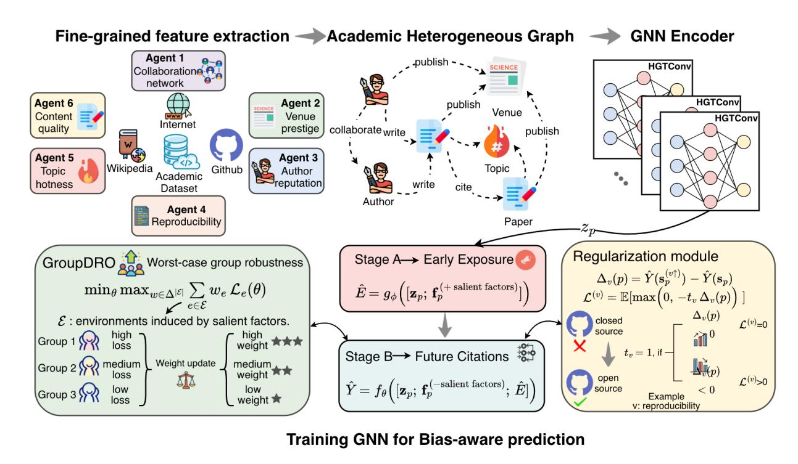
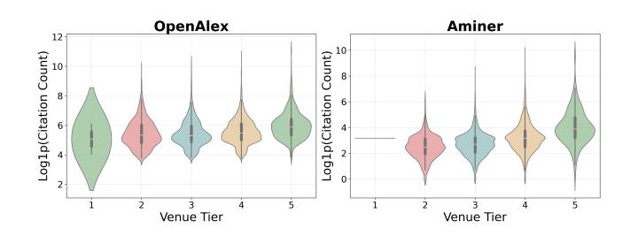
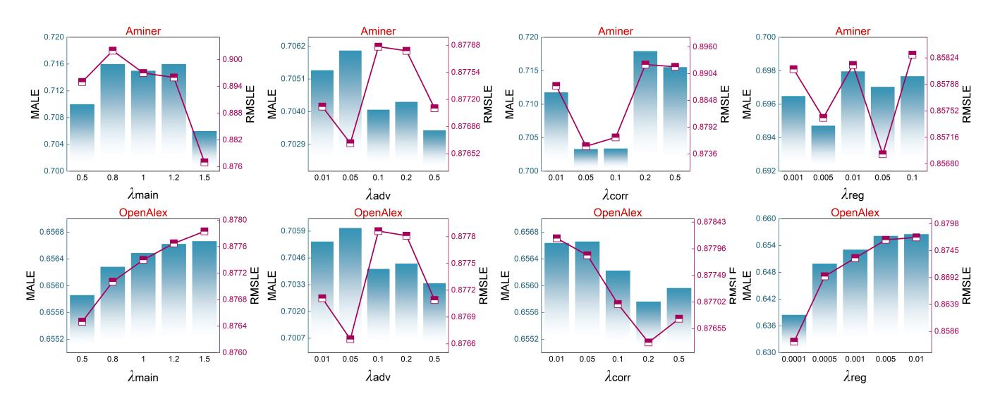
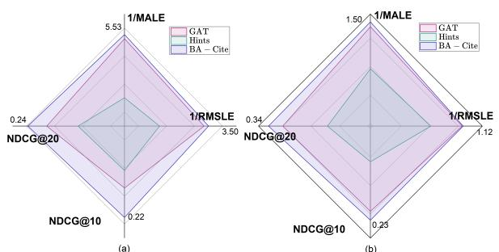

# From Newborn to Impact: Bias-Aware Citation Prediction

Mingfei Lu University of Technology Sydney Sydney, Australia mingfei.lu@student.uts.edu.au

Mengjia Wu University of Technology Sydney Sydney, Australia mengjia.wu@uts.edu.au

Jiawei Xu University of Texas at Austin Austin, United States jiaweixu@utexas.edu

Weikai Li

University of California, Los Angeles Los Angeles, United States weikaili@cs.ucla.edu

Feng Liu The University of Melbourne Melbourne, Australia feng.liu1@unimelb.edu.au

Ying Ding University of Texas at Austin Austin, United States ying.ding@austin.utexas.edu

Yizhou Sun University of California, Los Angeles Los Angeles, United States yzsun@cs.ucla.edu

Jie Lu University of Technology Sydney Sydney, Australia jie.lu@uts.edu.au

Yi Zhang∗ University of Technology Sydney Sydney, Australia yi.zhang@uts.edu.au

## Abstract

As a key to accessing research impact, citation dynamics underpins research evaluation, scholarly recommendation, and the study of knowledge diffusion. Citation prediction is particularly critical for newborn papers, where early assessment must be performed without citation signals and under highly long-tailed distributions. We identify two key research gaps: (i) insufficient modeling of implicit factors of scientific impact, leading to reliance on coarse proxies; and (ii) a lack of bias-aware learning that can deliver stable predictions on lowly cited papers. We address these gaps by proposing a Bias-Aware Citation Prediction Framework, which combines multi-agent feature extraction with robust graph representation learning. First, a multi-agent × graph co-learning module derives fine-grained, interpretable signals, such as reproducibility, collaboration network, and text quality, from metadata and external resources, and fuses them with heterogeneous-network embeddings to provide rich supervision even in the absence of early citation signals. Second, we incorporate a set of robust mechanisms: a two-stage forward process that routes explicit factors through an intermediate exposure estimate, GroupDRO to optimize worst-case group risk across environments, and a regularization head that performs what-if analyses on controllable factors under monotonicity and smoothness constraints. Comprehensive experiments on two real-world datasets demonstrate the effectiveness of our proposed model. Specifically, our model achieves around a 13% reduction in error metrics (MALE and RMSLE) and a notable 5.5% improvement in the ranking metric (NDCG) over the baseline methods. The code can be found at https://github.com/Maekfei/BA-Cite.

∗Corresponding author.

Permission to make digital or hard copies of all or part of this work for personal or classroom use is granted without fee provided that copies are not made or distributed for profit or commercial advantage and that copies bear this notice and the full citation on the first page. Copyrights for components of this work owned by others than the author(s) must be honored. Abstracting with credit is permitted. To copy otherwise, or republish, to post on servers or to redistribute to lists, requires prior specific permission and/or a fee. Request permissions from permissions@acm.org.

Conference'17, Washington, DC, USA

© 2026 Copyright held by the owner/author(s). Publication rights licensed to ACM. ACM ISBN 978-x-xxxx-xxxx-x/YYYY/MM

<https://doi.org/10.1145/nnnnnnn.nnnnnnn>

## CCS Concepts

• Information systems → World Wide Web.

## Keywords

Citation prediction; Multi-agent systems; Graph neural networks

## 1 Introduction

Citation dynamics, as a key to accessing research impact, is crucial for research evaluation, scholarly recommendation, and the study of knowledge diffusion. Citation prediction has thus become a particularly significant task for identifying scientific innovation from newborn papers. However, citation data are highly biased. Implicit factors such as reproducibility are not well reflected in modeling, while overly correlated explicit factors lead to shortcuts, e.g., top venue = high citations [\[14,](#page-8-0) [26\]](#page-8-1). Thus, accurately and robustly predicting citations in such a cold-start scenario remains a pressing challenge. As citation behaviors unfold across largescale web-based scholarly platforms, addressing this challenge also contributes to robust and generalizable web mining of academic content and information diffusion.

Previous work on citation prediction falls largely into two categories. (1) Early-cascade models use initial citation dynamics as predictors. DeepCas [\[15\]](#page-8-2) treats the citation cascade of a paper as a sequence, generating diffusion pathways through random walks and modeling them with BiGRU and attention to capture early spread signals. SI-HDGNN [\[35\]](#page-8-3) further embeds these processes in heterogeneous dynamic academic graphs, combining multi-relational structures with early citation sequences to forecast long-term scientific impact. However, these models require years of waiting for early citations to accumulate, making them ineffective in the coldstart stage when timely prediction is most needed. (2) Metadatadriven models leverage the author, institution, venue, and related descriptors. For example, HINTS [\[12\]](#page-8-4) models dynamic heterogeneous information networks, via graph neural networks (GNNs) to capture temporal evolution in citation time series. Cluster-Aware Text-Enhanced HGNN [\[36\]](#page-8-5) integrates signals with cluster-level and textual features to improve prediction. However, citation distributions are highly long-tailed [\[12,](#page-8-4) [20\]](#page-8-6), and these models perform

poorly on lowly cited papers. Moreover, they tend to overfit correlations with explicit factors while overlooking deeper implicit factors that may have comparably higher potential to influence citation behaviors in real-world scientific activities, leading to significant performance degradation under distribution shifts.

Despite some promising solutions, existing methods cannot achieve accurate and robust citation prediction for particularly lowly cited papers due to the following two research gaps: Gap 1: Insufficient attention to implicit factors, resulting in reliance on strong correlations with explicit factors and poor generalization across domains. Current models rely heavily on factors such as author reputation and venue prestige, which correlate with citations but cannot comprehensively cover all decisive determinants of citation behaviors. Lacking fine-grained representations of implicit factors such as topic hotness, reproducibility, and collaboration structure, models would default to superficial correlations, which ultimately degrade performance when the data distribution shifts. Gap 2: A lack of bias-aware models that remain robust on lowly cited papers. In this work, bias refers to the group-level prediction disparity induced jointly by the long-tailed citation distribution, feature sparsity in cold-start settings, and the empirical risk minimization (ERM) objective that minimizes average risk [\[7,](#page-8-7) [17\]](#page-8-8). This structural bias causes models to systematically underperform on low-citation subgroups. Most existing methods overlook the issue, since minimizing overall error inherently biases training toward highly cited papers that dominate the loss. As a result, lowly cited papers remain underrepresented and their citation dynamics is poorly predicted, undermining the early evaluation of underrepresented elements in the research community, e.g., early career researchers and emerging research directions. Based on these gaps, we pose our core question:

#### How can we design bias-aware models that deliver stable predictions on low-citation papers while revealing the underlying drivers of scientific impact?

To bridge these two significant gaps, we propose a Bias-Aware Citation Prediction Framework, termed BA-Cite, which combines fine-grained feature extraction with robust GNN learning. Specifically, to tackle Gap 1, we design a multi-source informed graph learning framework that jointly models agent-derived implicit factors and heterogeneous graph structures. Six agents automatically extract fine-grained features, including reproducibility, text quality, collaboration network, topical hotness, venue prestige and roleaware author reputation, from metadata and external resources. Instead of serving as isolated inputs, these signals are fused with graph-based paper embeddings and propagated through a twostage predictor, allowing the model to integrate implicit factors with graph context. In this way, the framework reduces reliance on explicit proxies and achieves stronger generalization. To overcome Gap 2, we center learning on a two-stage predictor: The model initially estimates an intermediate exposure variable from graph embeddings and agent-derived features, and then predicts citations based on both the exposure estimate and the remaining features, while excluding superficial correlates from direct inputs. Robust learning objectives are attached to the second stage's outputs: (i) Group Distributionally Robust Optimization (GroupDRO)

minimizes the worst-group risk on the prediction loss, countering head-dominated bias; and (ii) a regularization module performs what-if interventions on controllable factors, recomputing exposure and predictions while enforcing monotonicity and smoothness constraints. These objectives are jointly optimized and back-propagated through both stages and the graph encoder, shaping the pipeline toward bias-resistant and consistent behavior. We conduct systematic evaluations on two large-scale academic datasets, AMiner and OpenAlex. Experimental results demonstrate that, compared with the state-of-the-art baselines, our framework chieves around a 13% reduction in error metrics (MALE and RMSLE) and a notable 5.5% improvement in the ranking metric (NDCG).

The main contributions of this paper are highlighted as follows:

- (1) Empirical finding. We identify that prior citation predictors overfit explicit signals, leading to degradation on long-tail papers and under distribution shifts.
- (2) Multi-source Informed Graph Learning Framework. We propose a collaborative framework that combines agent-based fine-grained implicit feature extraction with graph representation learning, enabling robust prediction even without early citation information.
- (3) Bias-Aware GNN Learning. We design a robust mechanism that integrates Stage-A/Stage-B modeling, GroupDRO, and a regularization module, thereby suppressing superficial correlations, highlighting true correlations, and enhancing both accuracy and robustness.

## 2 Related Work

Research on scientific impact prediction and citation-network modeling falls into three directions: early-cascade modeling, metadata-

driven graph learning, and dynamic or contrastive graph approaches. Early-cascade models frame citation accumulation as a diffusion process. DeepCas [\[15\]](#page-8-2) captures early propagation via randomwalk citation paths and BiGRU attention, while SI-HDGNN [\[35\]](#page-8-3) embeds such cascades into heterogeneous academic graphs. Despite their effectiveness with sufficient citations, these models perform

poorly in cold-start settings where early prediction is crucial. Metadata-driven graph models leverage structural and textual metadata such as authors, venues, and topics. HINTS [\[12\]](#page-8-4) encodes dynamic heterogeneous networks with R-GCN and GRU, while CATE-HGNN [\[36\]](#page-8-5) and HLM-Cite [\[6\]](#page-8-9) enrich semantics via clustering and pretrained language models. However, they remain sensitive to long-tail imbalance and often overfit superficial correlations.

Dynamic and contrastive frameworks model evolving citation contexts more explicitly. H2CGL [\[8\]](#page-8-10) builds hierarchical heterogeneous graphs with citation-aware GIN, relation-aware GAT, and contrastive learning to integrate structural and temporal cues. Related work such as TGN-TRec [\[27\]](#page-8-11), NETEVOLVE [\[19\]](#page-8-12), and ResearchTown [\[39\]](#page-8-13) explores dynamic or agent-based paradigms emphasizing interpretability and network evolution. More recently, From Words to Worth [\[41\]](#page-8-14) proposes newborn article impact prediction, showing that fine-tuned LLMs can infer normalized impact (TNCSISP) from titles and abstracts alone, achieving competitive performance without citation history or external metadata.

LLM-based semantic feature extraction. Recent studies leverage large language models (LLMs) to extract high-level semantic

Figure 1: Overall architecture of the proposed BA-Cite framework.

features[\[3,](#page-8-15) [16,](#page-8-16) [33,](#page-8-17) [34,](#page-8-18) [38\]](#page-8-19) from titles, abstracts, and metadata for scholarly impact prediction. LLMs provide contextualized representations and latent signals such as novelty or interdisciplinarity, which are incorporated into downstream graph models as auxiliary embeddings[\[2,](#page-8-20) [11,](#page-8-21) [37\]](#page-8-22), especially under cold-start settings. However, these features are typically treated as static enhancements, without explicitly modeling their interaction with dynamic graph structures or citation bias.

Despite these advances, few studies examine the mechanisms and bias dynamics driving citation disparities. We address this gap with a unified multi-source graph learning framework, enabling robust citation prediction under cold-start and distribution shifts.

## 3 Methodology

In this section, we present our framework, BA-Cite, illustrated in Fig. [1.](#page-2-0) It consists of two parts: (i) agent-based fine-grained feature extraction, where multiple agents derive implicit factors from metadata and external resources; and (ii) graph learning on dynamic heterogeneous networks, where a GNN encoder integrates these signals through a two-stage forward process with bias- and robustness-oriented objectives. In the following parts, we first outline the motivation, then describe the functions of individual agents, and finally detail the three GNN modules that incorporate agentderived features into bias-aware representation learning.

### 3.1 Motivation

3.1.1 Addressing Bias in Long-Tailed Citation Prediction. In citation prediction, the inherently long-tailed distribution creates a persistent imbalance: a few highly cited papers dominate the learning process, while the majority receive limited attention. This skew causes models to produce inaccurate predictions—often overestimating lowly cited papers and failing to generalize under distribution shifts, such as when predicting citations for evaluating new venues or identifying emerging research topics. Such instability weakens the predictive reliability and limits the model's ability to capture the real scientific impact across domains and time, for example, leading to biased predictive results that underestimate the contributions of early-career researchers and non-mainstream research. Addressing bias under the long-tailed and shifting distributions is therefore essential not only for improving prediction robustness but also for promoting fairness and inclusiveness in scientific assessment.

3.1.2 Capturing Core Factors Driving Citation Dynamics with Agents and GNN(s). Existing citation prediction models often rely on handcrafted metadata or early citation signals, which are unavailable for newborn papers in cold-start settings and difficult to model manually. Agents, by contrast, can autonomously mine and reason over multi-source information — such as reproducibility, topic hotness, and collaboration network — to derive fine-grained, high-level semantic factors that are otherwise implicit or sparsely encoded in metadata. However, semantic cues alone cannot capture the structural and temporal dependencies that shape citation dynamics. While agents excel at extracting implicit knowledge, GNNs effectively model heterogeneous academic networks. Combining them

enables semantic knowledge to be structurally grounded, ensuring both predictive accuracy and robustness.

### 3.2 Fine-grained feature extraction

To enrich paper representations, we design six domain-specific agents that automatically derive implicit features from metadata and external resources. Each agent focuses on a distinct dimension of citation dynamics, leveraging domain heuristics and multi-source knowledge to uncover fine-grained semantic cues that are difficult to encode manually. Together, these agents capture complementary aspects such as author reputation, venue prestige, collaboration patterns, reproducibility, topic hotness, and text quality, thereby expanding the feature space and enabling more balanced and generalizable representations. Given a paper ��, the outputs are concatenated into a unified feature vector f�� = [��,�� , ��,��, ��, ��], where each component corresponds to one agent's extracted factor. Below we describe the reason for choosing these factors and how each agent extracts them from metadata and external sources.

Role-aware Author Reputation (A). Readers tend to cite works by reputable scholars or rising researchers, yet an author's position within the byline also matters—first authors indicate primary contribution, last authors reflect senior leadership, while middle authors exert weaker influence [\[21\]](#page-8-23).

Extraction process. We assess author reputation by partitioning the author list into three roles: first author, last author, and other coauthors. For each role, we retrieve metadata such as institutional affiliation, publication count, and total citations; institutional prestige is further enriched via external sources (e.g., Wikipedia). These signals are aggregated into a continuous score on a 1–5 scale. During training, the scores of different roles are assigned different weights to reflect their varying influence on citation outcomes.

Venue Prestige (V). Prestigious venues act as credibility signals, making their publications more visible and trusted, hence more likely to be cited [\[1\]](#page-8-24).

Extraction process. We assess venue prestige by matching the venue name against external rankings (China Computer Federation Recommended Rankings (CCF) and Computing Research and Education Association of Australasia (CORE)) using both exact and fuzzy matching. The agent outputs a score on a 1–5 scale.

Reproducibility (R). Open-source code or data enhances transparency, and reuse, driving credibility and long-term impact [\[23\]](#page-8-25). Extraction process. We assess reproducibility by scanning the content for open-source indicators (e.g., GitHub/GitLab links). If links are detected, we verify whether the repository contains code or datasets. The agent outputs a binary score (0/1).

Collaboration Network (C). Broad and diverse collaborations, especially across institutions or countries, increase attention and citation potential through higher credibility and dissemination [\[32\]](#page-8-26). Extraction process. We assess collaboration characteristics, including team size, institutional diversity, and cross-country collaboration. Institutional metadata are complemented with external lookups (e.g., Wikipedia) to estimate prestige and geographic dispersion. The agent outputs a composite score on a 1–5 scale.

Figure 2: Distribution of citation counts across venues of different prestige levels on the Aminer and OpenAlex datasets.

Topic Hotness (H). Work in trending or growing areas gains citations faster by aligning with the community's interests [\[31\]](#page-8-27). Extraction process. We assess topical hotness using the paper's keywords. For each keyword, we count the number of papers in the previous year; the mean count across keywords is used as the hotness score. The agent outputs a continuous value.

Text Quality (Q). Clear, well-structured titles and abstracts improve readability, directly influencing citation outcomes [\[13\]](#page-8-28). Extraction process. We assess text quality by prompting an LLM with the paper's title and abstract, together with best-paper exemplars as references. The LLM evaluates structural clarity and professional expression and produces a score on a 1–5 scale.

Output. The six features are concatenated into f�� and injected as attributes of the paper node �� in the heterogeneous academic graph. These enriched node features are then propagated through the GNN encoder, enabling the model to jointly capture structural patterns and implicit semantic signals.

## 3.3 Bias-Aware GNN Learning Modules

With agent-derived features injected as paper-node attributes in the heterogeneous graph, the GNN encoder propagates them together with structural and relational information to form enriched paper representations. A key challenge is that conventional metadatabased models often overfit explicit correlations such as venue, which reflect distributional skew rather than true importance. This shortcut undermines prediction on high-impact papers outside top venues and widens gaps on lowly cited cases. To address these issues, we introduce three complementary modules: (i) a two-stage predictor that first estimates an intermediate exposure variable from graph embeddings and agent-derived features, and then predicts future citations based on both the exposure estimate and remaining signals; (ii) a GroupDRO objective applied to the prediction loss, which minimizes worst-group risk and alleviates head-dominated bias; and (iii) a counterfactual intervention head that perturbs controllable factors and regularizes predictions through monotonicity and smoothness constraints. Together, these modules reduce overreliance on explicit venue cues, leverage implicit drivers of scientific impact, and yield more robust citation predictions.

3.3.1 Two-Stage Forward Strategy for Fair Representation. Venue serves as the most salient shortcut feature in citation prediction: it is strongly correlated with citation counts but does not constitute a true determinant [\[5,](#page-8-29) [12,](#page-8-4) [29\]](#page-8-30). As shown in Fig. [2,](#page-3-0) higher-ranked

where ��ˆ(·) = ���� (·) and the early-exposure estimate in s (��↑) �� is ��ˆ(��↑) = ���� ( [z�� ; f (+�� ) �� with �� ←high]).

Monotonicity and smoothness regularization. Let ���� ∈ {+1, −1} denote the expected direction of improvement (typically ���� = +1), and let ���� be a threshold that marks the "low" region of �� (e.g., ��=0). We enforce that raising �� should not hurt citations for low-value cases, and keep effects calibrated via a smoothness penalty:

L (��) mono = E max 0, −���� Δ�� (��) 1{��(��) &lt; ���� } , (7)

L (��) smooth = E -�� (��) 2 . (8)

Aggregating over controllable factors V, the total regularizer is

Lreg = ��mono ∑︁ ��∈V L (��) mono + ��smooth ∑︁ ��∈V L (��) smooth. (9)

Module Discussion. One major source of bias in citation prediction arises from the limited and coarse metadata used in traditional models, which makes explicit factors dominate the learning process. Within our regularization module, the model leverages fine-grained, implicitly derived features to regularize representation learning, thereby mitigating shortcut reliance. By distributing explanatory power across multiple implicit drivers—such as collaboration patterns, topic dynamics, and text quality—the model becomes less dependent on any single explicit factor and achieves more balanced generalization across varying citation environments.

3.3.4 Objective. Our training objective focuses on environmentaware risk (GroupDRO) and the proposed sensitivity regularization:

Ltotal = ��main Lgroupdro + ��reg Lreg. (10)

We also employ two lightweight auxiliaries on Stage B—an exposure calibration loss on ��ˆ and an adversarial venue-invariance loss—which are reported in ablations and described in Appendix [B,](#page-9-0) but omitted here for brevity.

## 4 Experiments

In this section, we conduct extensive experiments to answer the following four research questions:

RQ1: How does BA-Cite perform compared with other models in terms of predictive accuracy, and ranking quality?

RQ2: How does each component contribute to the overall performance of BA-Cite?

RQ3: Does BA-Cite achieve robust prediction across different data distributions after bias mitigation?

RQ4: How do different hyper-parameters affect BA-Cite ?

## 4.1 Experimental Setup

4.1.1 Datasets. We select two widely used publicly available academic datasets, Aminer [\[28\]](#page-8-32) and OpenAlex [\[22\]](#page-8-33), to verify the effectiveness of our proposed framework. Both datasets focus on the computer science domain and contain heterogeneous nodes, as well as temporal relations such as cites, writes, and has\_topic. The temporal coverage ranges from 2010 to 2025.

For each paper, the prediction target is its future citation number within the next five years (starting from the second year) after publication. We split the data by year, using papers published during 2010–2018 for training, 2019 for validation, and 2020 for testing. Within each split, we randomly sample 10,000 papers for training, 1,000 for validation, and 1,000 for testing. To reduce randomness, we repeat the sampling process three times and conduct five runs with different random seeds for each sample. The reported results include the mean and standard deviation across all runs.

4.1.2 Baselines. We compare our framework with representative methods from four categories, covering classical GNNs, sequential models, large language models, and metadata-based neural models. Graph Neural Network-based methods.

- GAT (ICLR'18) [\[30\]](#page-8-34): models citation relations using multi-head graph attention.
- HINTS (WWW'21) [\[12\]](#page-8-4): encodes temporal heterogeneous information networks for citation time-series prediction.
- DyGFormer (NeurIPS'23) [\[40\]](#page-8-35): applies transformer-style temporal encoding for dynamic graphs.

#### Sequence-based methods.

- BiLSTM-Meta (Scientometrics'21) [\[18\]](#page-8-36): captures citation sequences via bidirectional recurrent modeling.
- DeepCas (WWW'17) [\[15\]](#page-8-2): learns citation cascade representations through random walks and BiGRU-based attention.
- SI-HDGNN (KBS'22) [\[35\]](#page-8-3): builds heterogeneous dynamic academic networks for impact propagation.

#### Large Language Model-based methods.

- GPT-4o (OpenAI'24) [\[9\]](#page-8-37): leverages LLM reasoning and knowledge for citation impact estimation.
- Llama-3.1-405B (Meta'24) [\[4\]](#page-8-38): employs open-source LLM embeddings for academic impact inference.
- NAIP (AAAI'25) [\[41\]](#page-8-14): formulates newborn article impact prediction by fine-tuning large language models on title–abstract pairs with the TNCSISP metric, enabling content-only impact estimation without external metadata.

#### Metadata-based Neural Methods.

- BP-NN (J. Informetrics'20) [\[24\]](#page-8-39): A four-layer feed-forward neural network that predicts five-year citation counts.

These baselines represent diverse paradigms in scientific impact prediction, from early cascade modeling to metadata-driven, dynamic, and LLM-enhanced frameworks, providing a comprehensive comparison foundation. For all feature-dependent baselines, we supply the fine-grained semantic features extracted in Section [3.2](#page-3-1) to ensure consistent and enriched input representations.

4.1.3 Implementation Details. We implement the counterfactual two-stage HGT in PyTorch. The heterogeneous encoder uses two HGT layers (hidden size 128, 4 attention heads, dropout 0.4). Node features follow our schema: paper nodes have an 8-dimensional vector [��, ��,��, ��, ��, ��1, ��2, ��3], while author/venue/topic nodes are initialized with 1-dimensional metadata features. For counterfactual learning, we enable reproducibility (��) and content quality (��) as actionable variables and apply monotonicity regularization so that larger (��, ��) should not decrease predicted citations. We also employ adversarial training and an auxiliary loss. We adopt Group-DRO over 2 environments with step size �� = 0.1 and group-weight clipping to [0.1, 0.9]. Environments are constructed by venue prestige threshold �� = 0.8. Optimization uses AdamW (lr = 10−3 , weight decay = 10−4 ) with a 10-epoch warm-up followed by cosine decay

Table 1: Comparison on Aminer and OpenAlex: MALE, RMSLE, NDCG@10, and NDCG@20 (mean ± std). Lower is better for MALE/RMSLE; higher is better for NDCG. Best results are in bold, second best are underlined. "†" indicates statistically significant improvement over all baselines under a paired t-test with �� &lt; 0.05.

| Baselines      |      | MALE ↓   |      | RMSLE ↓  | Aminer | NDCG@10 | Graph          | ↑ Neural | NDCG@20     |        | ↑       | MALE    | ↓ methods |      | RMSLE ↓  | OpenAlex | NDCG@10  | ↑    | NDCG@20 ↑ |
|----------------|------|----------|------|----------|--------|---------|----------------|----------|-------------|--------|---------|---------|-----------|------|----------|----------|----------|------|-----------|
| GAT            | 0.94 | ± 0.02   | 1.09 | ± 0.02   | 0.09   | ±       | 0.11           | 0.10     | ±           | 0.11   | 0.87    | ±       | 0.04      | 1.14 | ± 0.03   | 0.23     | ± 0.17   | 0.25 | ± 0.16    |
| HINTS          | 0.99 | ± 0.01   | 1.14 | ± 0.01   | 0.03   | ±       | 0.01           | 0.04     | ±           | 0.01   | 0.98    | ±       | 0.00      | 1.14 | ± 0.00   | 0.04     | ± 0.02   | 0.05 | ± 0.03    |
| DyGFormer      | 1.36 | ± 0.36   | 1.55 | ± 0.38   | 0.27   | ±       | 0.09           | 0.26     | ±           | 0.07   | 1.09    | ±       | 0.23      | 1.36 | ± 0.24   | 0.39     | ± 0.06   | 0.43 | ± 0.05    |
|                |      |          |      |          |        |         | Sequence-based |          |             |        | methods |         |           |      |          |          |          |      |           |
| BiLSTM         | 0.79 | ± 0.02   | 0.98 | ± 0.03   | 0.32   | ±       | 0.08           | 0.33     | ±           | 0.06   | 2.21    | ±       | 0.11      | 2.35 | ± 0.11   | 0.17     | ± 0.06   | 0.13 | ± 0.08    |
| DeepCas        | 0.90 | ± 0.02   | 1.30 | ± 0.03   | 0.04   | ±       | 0.02           | 0.05     | ±           | 0.02   | 1.09    | ±       | 0.01      | 1.33 | ± 0.01   | 0.06     | ± 0.02   | 0.08 | ± 0.03    |
| SI-HDGNN       | 0.73 | ± 0.02   | 1.01 | ± 0.02   | 0.16   | ±       | 0.10           | 0.17     | ±           | 0.09   | 1.05    | ±       | 0.04      | 1.31 | ± 0.04   | 0.11     | ± 0.07   | 0.05 | ± 0.05    |
|                |      |          |      |          |        | Large   | Language       |          | Model-based |        |         | methods |           |      |          |          |          |      |           |
| GPT-4o         | 1.73 | ± 0.03   | 1.91 | ± 0.04   | 0.13   | ±       | 0.02           | 0.23     | ±           | 0.07   | 0.90    | ±       | 0.01      | 1.12 | ± 0.00   | 0.38     | ± 0.00   | 0.36 | ± 0.04    |
| Llama_3.1_405b | 1.62 | ± 0.01   | 1.80 | ± 0.01   | 0.12   | ±       | 0.02           | 0.18     | ±           | 0.01   | 1.02    | ±       | 0.08      | 1.23 | ± 0.10   | 0.31     | ± 0.09   | 0.34 | ± 0.03    |
| NAIP_Llama     | 0.77 | ± 0.02   | 0.97 | ± 0.03   | 0.05   | ±       | 0.01           | 0.06     | ±           | 0.01   | 2.53    | ±       | 0.01      | 2.73 | ± 0.01   | 0.01     | ± 0.01   | 0.01 | ± 0.02    |
| NAIP_Qwen      | 0.83 | ± 0.02   | 1.04 | ± 0.03   | 0.05   | ±       | 0.02           | 0.06     | ±           | 0.01   | 2.46    | ±       | 0.01      | 2.66 | ± 0.01   | 0.08     | ± 0.03   | 0.10 | ± 0.04    |
|                |      |          |      |          |        |         | Metadata-based |          |             | Neural | methods |         |           |      |          |          |          |      |           |
| BP-NN          | 0.84 | ± 0.05   | 1.05 | ± 0.06   | 0.27   | ±       | 0.12           | 0.31     | ±           | 0.12   | 2.25    | ±       | 0.25      | 2.38 | ± 0.24   | 0.23     | ± 0.07   | 0.20 | ± 0.04    |
|                |      |          |      |          |        |         |                | Our      |             | Method |         |         |           |      |          |          |          |      |           |
| BA-Cite        | 0.71 | ± 0.02 † | 0.88 | ± 0.03 † | 0.34   | ±       | 0.12 †         | 0.37     | ±           | 0.13 † | 0.67    | ±       | 0.01 †    | 0.92 | ± 0.04 † | 0.51     | ± 0.04 † | 0.47 | ± 0.01 †  |

Table 2: Ablation study of BA-Cite on Aminer and OpenAlex: MALE, RMSLE, NDCG@10, and NDCG@20 (mean ± std).

|         | Ablation  | Type | MALE ↓ |      | RMSLE ↓ | Aminer | NDCG@10 | ↑    | NDCG@20 | ↑    | MALE ↓ |      | RMSLE ↓ | OpenAlex | NDCG@10 | ↑    | NDCG@20 ↑ |
|---------|-----------|------|--------|------|---------|--------|---------|------|---------|------|--------|------|---------|----------|---------|------|-----------|
| w/o     | Feature   | 0.86 | ± 0.02 | 1.00 | ± 0.03  | 0.10   | ± 0.07  | 0.11 | ± 0.06  | 1.88 | ± 0.00 | 2.04 | ± 0.02  | 0.07     | ± 0.00  | 0.09 | ± 0.01    |
| w/o     | Two-Stage | 0.70 | ± 0.02 | 0.87 | ± 0.02  | 0.26   | ± 0.18  | 0.29 | ± 0.16  | 0.78 | ± 0.03 | 0.99 | ± 0.05  | 0.16     | ± 0.08  | 0.19 | ± 0.07    |
| w/o     | Reg       | 0.78 | ± 0.02 | 0.97 | ± 0.03  | 0.14   | ± 0.08  | 0.14 | ± 0.08  | 1.21 | ± 0.20 | 1.30 | ± 0.18  | 0.18     | ± 0.09  | 0.21 | ± 0.07    |
| w/o     | GroupDRO  | 0.79 | ± 0.02 | 0.89 | ± 0.03  | 0.01   | ± 0.00  | 0.03 | ± 0.01  | 0.99 | ± 0.02 | 1.09 | ± 0.03  | 0.05     | ± 0.02  | 0.07 | ± 0.03    |
| BA-Cite |           | 0.71 | ± 0.02 | 0.88 | ± 0.03  | 0.34   | ± 0.12  | 0.37 | ± 0.13  | 0.67 | ± 0.01 | 0.92 | ± 0.04  | 0.51     | ± 0.04  | 0.47 | ± 0.01    |

to 10−5 . We train up to 200 epochs with batch size 128 and early stopping on validation loss.

4.1.4 Evaluation Metrics. We evaluate model performance from two perspectives: (i) point accuracy using Mean Absolute Log Error (MALE) and Root Mean Squared Log Error (RMSLE); and (ii) ranking quality using Normalized Discounted Cumulative Gain (NDCG@K, ��=10, 20) [\[10\]](#page-8-40). All log-based metrics adopt log(1+��) to mitigate heavy-tailed citation counts. Lower is better for MALE/RMSLE, while higher is better for NDCG. The detailed calculation formulas are provided in the Appendix [A.](#page-8-41)

## 4.2 Overall Performance (RQ1)

Table [1](#page-6-0) summarizes the overall results on the Aminer and OpenAlex datasets. In general, BA-Cite achieves the best performance across all metrics. On Aminer, it outperforms the best baselines by reducing MALE by 2.7% and RMSLE by 9.3%, while improving NDCG@10

and NDCG@20 by 2% and 4%. On OpenAlex, BA-Cite further reduces MALE by 20.3% and RMSLE by 20.1%, and boosts NDCG@10 and NDCG@20 by 12% and 4%. These consistent gains demonstrate that integrating agent-derived fine-grained features with dynamic heterogeneous graph learning effectively improves both accuracy and ranking quality. Compared to other methods, GNN-based models generally perform better than sequence- or metadata-based baselines, highlighting the importance of structural and temporal modeling. LLM-based methods achieve competitive ranking performance, which may benefit from pretrained knowledge rather than structural understanding. Overall, BA-Cite provides balanced and stable improvements, confirming its advantage in handling cold-start and long-tailed citation prediction scenarios.

## 4.3 Ablation Study (RQ2)

We examine the effect of each module in BA-Cite on Aminer and OpenAlex (Table [2\)](#page-6-1). Removing fine-grained feature extraction (w/o

Figure 3: Parameter sensitivity results of BA-Cite on the Aminer and OpenAlex datasets.

Figure 4: Performance comparison of three models on Aminer dataset with different citation levels. (a) Results on lowly cited papers. (b) Results on highly cited papers.

Feature) leads to the largest drop, confirming the importance of agent-derived semantic cues. Eliminating the two-stage process (w/o Two-Stage) also reduces ranking quality, showing that staged optimization enhances representation robustness. However, on the relatively unbiased Aminer dataset (as evidenced in Fig. [2\)](#page-3-0), the two-stage mechanism introduces slight structural redundancy and optimization noise, which marginally reduces fitting efficiency despite its advantage in bias mitigation. Without bias regularization (w/o Reg), both MALE and RMSLE slightly increase, indicating reduced robustness. The absence of environment-aware training (w/o GroupDRO) causes severe degradation in NDCG, proving its necessity for balanced performance across domains. Overall, BA-Cite achieves robust and balanced performance, demonstrating that both agent-based feature extraction and bias-aware two-stage optimization are crucial for accurate and fair citation prediction.

## 4.4 Analysis of Robustness (RQ3)

As shown in Fig. [4,](#page-7-0) we further evaluate whether BA-Cite maintains stable performance after bias mitigation under varying data distributions. Following the partitioning strategy in [\[12\]](#page-8-4), we divide

papers into lowly cited and highly cited subsets by citation counts. Across all three compared models, BA-Cite achieves the best performance, showing strong results on both low- and high-citation papers, which indicates its robustness to distributional variation.

#### 4.5 Analysis of Parameter Sensitivity (RQ4)

As shown in Fig. [3,](#page-7-1) we analyze the sensitivity of four loss weights. (1) ����������. On Aminer, errors decrease with larger ����������, peaking at 1.2–1.5, indicating that a stronger main objective improves fit under mild bias. On OpenAlex, MALE and RMSLE increase with ����������, so smaller values (0.5–0.8) are preferable to preserve capacity for debiasing. (2) �������� . A small-to-moderate adversarial strength works best: Aminer achieves its lowest errors around 0.05, while OpenAlex shows a trade-off—MALE near 0.05 and RMSLE near 0.2—suggesting �������� in 0.05–0.2. Larger values introduce instability without gains. (3) ����������. Both datasets exhibit a U-shaped trend: mild regularization helps (optimum around 0.1–0.2), whereas overly weak or strong settings (e.g., 0.01 or 0.5) degrade performance by allowing redundancy or over-constraining embeddings. (4) ��������. Fairness regularization should be conservative. Aminer reaches minimum errors around 0.05, while OpenAlex favors very small values. Strong regularization degrades accuracy on both datasets.

### 5 Conclusion

We present BA-Cite, a bias-aware citation prediction framework combining multi-agent semantic extraction with dynamic heterogeneous graph learning. By modeling author, venue, and topic dynamics, BA-Cite provides a strong semantic basis for citation reasoning. Its two-stage optimization with GroupDRO enhances robustness and mitigates overfitting to high-prestige environments. Experiments on Aminer and OpenAlex show consistent improvements over strong baselines, with stability confirmed by ablation and sensitivity analyses. BA-Cite generalizes well under distribution shifts, supporting real-world scholarly impact evaluation. Future work

includes impact explanation, cross-domain transfer, and reinforcement learning–based adaptive bias mitigation. References [1] Michael Callaham, Robert L Wears, and Ellen Weber. 2002. Journal prestige, publication bias, and other characteristics associated with citation of published studies in peer-reviewed journals. Jama 287, 21 (2002), 2847–2850. [2] Junyi Chen, Mengjia Wu, Qian Liu, and Yi Zhang. 2026. Explainable prediction of knowledge recombination: A synergized method with heterogeneous hypergraph learning and large language models. Information Processing & Management 63, 1 (2026), 104336. [doi:10.1016/j.ipm.2025.104336](https://doi.org/10.1016/j.ipm.2025.104336) [3] Siming Deng, Runsong Jia, Chunjuan Luan, Mengjia Wu, and Yi Zhang. 2026. AIenhanced multi-dimensional measurement of technological convergence through heterogeneous graph and semantic learning. Scientometrics (2026), 1–28. [4] Abhimanyu Dubey, Abhinav Jauhri, Abhinav Pandey, Abhishek Kadian, Ahmad Al-Dahle, Aiesha Letman, Akhil Mathur, Alan Schelten, Amy Yang, Angela Fan, et al. 2024. The llama 3 herd of models. arXiv e-prints (2024), arXiv–2407. [5] Santo Fortunato, Carl T Bergstrom, Katy Börner, James A Evans, Dirk Helbing, Staša Milojević, Alexander M Petersen, Filippo Radicchi, Roberta Sinatra, Brian Uzzi, et al. 2018. Science of science. Science 359, 6379 (2018), eaao0185. [6] Qianyue Hao, Jingyang Fan, Fengli Xu, Jian Yuan, and Yong Li. 2024. Hlm-cite: Hybrid language model workflow for text-based scientific citation prediction. Advances in Neural Information Processing Systems 37 (2024), 48189–48223. [7] Tatsunori Hashimoto, Megha Srivastava, Hongseok Namkoong, and Percy Liang. 2018. Fairness without demographics in repeated loss minimization. In International Conference on Machine Learning. PMLR, 1929–1938. [8] Guoxiu He, Zhikai Xue, Zhuoren Jiang, Yangyang Kang, Star Zhao, and Wei Lu. 2023. H2CGL: Modeling dynamics of citation network for impact prediction. Information Processing & Management 60, 6 (2023), 103512. [9] Aaron Hurst, Adam Lerer, Adam P Goucher, Adam Perelman, Aditya Ramesh, Aidan Clark, AJ Ostrow, Akila Welihinda, Alan Hayes, Alec Radford, et al. 2024. Gpt-4o system card. arXiv preprint arXiv:2410.21276 (2024). [10] Kalervo Järvelin and Jaana Kekäläinen. 2002. Cumulated gain-based evaluation of IR techniques. ACM Transactions on Information Systems (TOIS) 20, 4 (2002), 422–446. [11] Runsong Jia, Mengjia Wu, Ying Ding, Jie Lu, and Yi Zhang. 2025. HetGCoT: Heterogeneous Graph-Enhanced Chain-of-Thought LLM Reasoning for Academic Question Answering. In Findings of the Association for Computational Linguistics: EMNLP 2025, Christos Christodoulopoulos, Tanmoy Chakraborty, Carolyn Rose, and Violet Peng (Eds.). Association for Computational Linguistics, Suzhou, China, 15950–15963. [doi:10.18653/v1/2025.findings-emnlp.864](https://doi.org/10.18653/v1/2025.findings-emnlp.864) [12] Song Jiang, Bernard Koch, and Yizhou Sun. 2021. HINTS: Citation Time Series Prediction for New Publications via Dynamic Heterogeneous Information Network Embedding. In Proceedings of the Web Conference 2021 (Ljubljana, Slovenia) (WWW '21). Association for Computing Machinery, New York, NY, USA, 3158–3167. [doi:10.1145/3442381.3450107](https://doi.org/10.1145/3442381.3450107) [13] Tan Jin, Huiqiong Duan, Xiaofei Lu, Jing Ni, and Kai Guo. 2021. Do research articles with more readable abstracts receive higher online attention? Evidence from Science. Scientometrics 126, 10 (2021), 8471–8490. [14] Thorsten Joachims, Adith Swaminathan, and Tobias Schnabel. 2017. Unbiased learning-to-rank with biased feedback. In Proceedings of the tenth ACM international conference on web search and data mining. 781–789. [15] Cheng Li, Jiaqi Ma, Xiaoxiao Guo, and Qiaozhu Mei. 2017. Deepcas: An end-toend predictor of information cascades. In Proceedings of the 26th international conference on World Wide Web. 577–586. [16] Xin Li, Zhuo Cai, Shoujin Wang, Kun Yu, and Fang Chen. 2025. A survey on enhancing causal reasoning ability of large language models. In Pacific-Asia Conference on Knowledge Discovery and Data Mining. Springer, 399–416. [17] Evan Z Liu, Behzad Haghgoo, Annie S Chen, Aditi Raghunathan, Pang Wei Koh, Shiori Sagawa, Percy Liang, and Chelsea Finn. 2021. Just train twice: Improving group robustness without training group information. In International Conference on Machine Learning. PMLR, 6781–6792. [18] Anqi Ma, Yu Liu, Xiujuan Xu, and Tao Dong. 2021. A deep-learning based citation count prediction model with paper metadata semantic features. Scientometrics 126, 8 (2021), 6803–6823. [19] Kentaro Miyake, Hiroyoshi Ito, Christos Faloutsos, Hirotomo Matsumoto, and Atsuyuki Morishima. 2024. Netevolve: Social network forecasting using multiagent reinforcement learning with interpretable features. In Proceedings of the ACM Web Conference 2024. 2542–2551. [20] Mark EJ Newman. 2005. Power laws, Pareto distributions and Zipf's law. Contemporary physics 46, 5 (2005), 323–351. [21] Alexander Michael Petersen, Santo Fortunato, Raj K Pan, Kimmo Kaski, Orion Penner, Armando Rungi, Massimo Riccaboni, H Eugene Stanley, and Fabio Pammolli. 2014. Reputation and impact in academic careers. Proceedings of the National Academy of Sciences 111, 43 (2014), 15316–15321. [22] Jason Priem, Heather Piwowar, and Richard Orr. 2022. OpenAlex: A fully-open index of scholarly works, authors, venues, institutions, and concepts. arXiv preprint arXiv:2205.01833 (2022). [23] Edward Raff. 2023. Does the market of citations reward reproducible work?. In Proceedings of the 2023 ACM Conference on Reproducibility and Replicability. 89–96. [24] Xuanmin Ruan, Yuanyang Zhu, Jiang Li, and Ying Cheng. 2020. Predicting the citation counts of individual papers via a BP neural network. Journal of Informetrics 14, 3 (2020), 101039. [25] Shiori Sagawa, Pang Wei Koh, Tatsunori B Hashimoto, and Percy Liang. 2019. Distributionally robust neural networks for group shifts: On the importance of regularization for worst-case generalization. arXiv preprint arXiv:1911.08731 (2019). [26] Tobias Schnabel, Adith Swaminathan, Ashudeep Singh, Navin Chandak, and Thorsten Joachims. 2016. Recommendations as treatments: Debiasing learning and evaluation. In international conference on machine learning. PMLR, 1670– 1679. [27] Junhao Shen, Mohammad Ausaf Ali Haqqani, Beichen Hu, Cheng Huang, Xihao Xie, Tsengdar Lee, and Jia Zhang. 2024. Temporal Graph Neural Network-Powered Paper Recommendation on Dynamic Citation Networks. arXiv preprint arXiv:2408.15371 (2024). [28] Jie Tang, Jing Zhang, Limin Yao, Juanzi Li, Li Zhang, and Zhong Su. 2008. Arnetminer: extraction and mining of academic social networks. In Proceedings of the 14th ACM SIGKDD international conference on Knowledge discovery and data mining. 990–998. [29] Brian Uzzi, Satyam Mukherjee, Michael Stringer, and Ben Jones. 2013. Atypical combinations and scientific impact. Science 342, 6157 (2013), 468–472. [30] Petar Veličković, Guillem Cucurull, Arantxa Casanova, Adriana Romero, Pietro Lio, and Yoshua Bengio. 2017. Graph attention networks. arXiv preprint arXiv:1710.10903 (2017). [31] Tian Wei, Menghui Li, Chensheng Wu, Xiao-Yong Yan, Ying Fan, Zengru Di, and Jinshan Wu. 2013. Do scientists trace hot topics? Scientific reports 3, 1 (2013), 2207. [32] Lingfei Wu, Dashun Wang, and James A Evans. 2019. Large teams develop and small teams disrupt science and technology. Nature 566, 7744 (2019), 378–382. [33] Mengjia Wu, Gunnar Sivertsen, Lin Zhang, Fan Qi, and Yi Zhang. 2025. Scaling research aim identification: Language models for classifying scientific and societal-oriented studies. Journal of the Association for Information Science and Technology 76, 11 (2025), 1470–1487. [34] MJ Wu, Yi Zhang, Robin Haunschild, and Lutz Bornmann. 2025. Leveraging large language models for post-publication peer review: Potential and limitations. In Proceedings of the 20th International Conference on Scientometrics & Informetrics (ISSI 2025). 1207–1226. [35] Xovee Xu, Ting Zhong, Ce Li, Goce Trajcevski, and Fan Zhou. 2022. Heterogeneous dynamical academic network for learning scientific impact propagation. Knowledge-Based Systems 238 (2022), 107839. [36] Carl Yang and Jiawei Han. 2023. Revisiting citation prediction with clusteraware text-enhanced heterogeneous graph neural networks. In 2023 IEEE 39th International Conference on Data Engineering (ICDE). IEEE, 682–695. [37] Xiaoyu Yang, Yufei Chen, Xiaodong Yue, Shaoxun Xu, and Chao Ma. 2023. Tdistributed spherical feature representation for imbalanced classification. In Proceedings of the AAAI Conference on Artificial Intelligence, Vol. 37. 10825–10833. [38] Xiaoyu Yang, Jie Lu, and En Yu. 2025. Adapting Multi-modal Large Language Model to Concept Drift From Pre-training Onwards. In The Thirteenth International Conference on Learning Representations. [https://openreview.net/forum?id=](https://openreview.net/forum?id=b20VK2GnSs) [b20VK2GnSs](https://openreview.net/forum?id=b20VK2GnSs) [39] Haofei Yu, Zhaochen Hong, Zirui Cheng, Kunlun Zhu, Keyang Xuan, Jinwei Yao, Tao Feng, and Jiaxuan You. 2024. Researchtown: Simulator of human research community. arXiv preprint arXiv:2412.17767 (2024). [40] Le Yu, Leilei Sun, Bowen Du, and Weifeng Lv. 2023. Towards better dynamic graph learning: New architecture and unified library. Advances in Neural Information Processing Systems 36 (2023), 67686–67700. [41] Penghai Zhao, Qinghua Xing, Kairan Dou, Jinyu Tian, Ying Tai, Jian Yang, Ming-Ming Cheng, and Xiang Li. 2025. From Words to Worth: Newborn Article Impact Prediction with LLM. In Proceedings of the AAAI Conference on Artificial Intelligence, Vol. 39. 1183–1191. A Experiments Details Point accuracy. Given �� papers with ground-truth five-year citations ���� and predictions ��ˆ�� , we compute: MALE = 1 ∑︁�� log(1 + ��ˆ��) − log(1 + ����) , (11)

�� ��=1

RMSLE = vt 1 �� ∑︁�� ��=1 log(1 + ��ˆ��) − log(1 + ����) 2 , (12)

Ranking quality. For papers published in the same year, let �� denote the predicted ranking and �� ∗ the ground-truth ranking:

NDCG@K = Í�� ��=1 ���� (��) log2 (��+1) Í�� ��=1 ����∗ (��) log2 (��+1) . (13)

#### B Auxiliary Losses for Stage B

To further stabilize optimization and mitigate residual bias, we incorporate two lightweight auxiliary objectives at Stage B: (i) exposure calibration loss and (ii) adversarial venue-invariance loss. Both are designed to regularize the learned citation representations without introducing additional parameters or inference overhead.

## B.1 Exposure Calibration Loss

Empirical studies have shown that citation counts are strongly correlated with exposure factors—such as publication venue, collaboration size, or open-source visibility—which may distort predictive learning. To prevent the model from over-amplifying these factors, we impose an auxiliary calibration constraint on the predicted exposure score ��ˆ:

Lexp = KL ��(��ˆ) ∥ ��(�� ∗ ) , (14)

where �� ∗ denotes the empirical exposure distribution estimated from the training data. This term penalizes deviations between the predicted and empirical exposure distributions, ensuring that the model's intermediate exposure estimation remains statistically consistent and well-calibrated.

## B.2 Adversarial Venue-Invariance Loss

Venue prestige is one of the most dominant shortcut features in citation prediction. To enhance robustness against venue bias, we introduce an adversarial objective that enforces venue-invariant latent representations. A discriminator ���� is trained to predict the venue label from the Stage B feature embedding s�� , while the main encoder ���� attempts to fool it:

min �� max �� E��∼D log������ (���� | ���� (s�� )) . (15)

This min–max game discourages the encoder from encoding venuespecific artifacts, resulting in a fairer and more transferable citation representation.

## B.3 Implementation Note

Both auxiliaries are assigned small weights (��exp = 0.1, ��adv = 0.05) relative to the primary Stage B objective. They are only active during training and disabled during inference. Ablation results in Table [2](#page-6-1) confirm that incorporating these auxiliaries improves fairness and stability, particularly under long-tailed or domainshifted scenarios.

## C Dataset Diagnostics and Descriptive Statistics

This appendix reports basic diagnostics of the evaluation splits used in our experiments, including overall scale and central tendency of citation counts, temporal coverage, authorship statistics, and venue/document-type compositions. These summaries help contextualize the long-tailed nature of citations and the salience of venue as a shortcut factor discussed in the main text.

### C.1 Global Characteristics

Table [3](#page-9-1) summarizes dataset-level statistics. We report the number of papers, citation central tendencies (mean/median/max), year range, average number of authors, and the highest venue tier present in each split.

### C.2 Venue Tier Distribution

Table [4](#page-9-2) reports the venue-tier composition for each split. Percentages are computed over all papers in the split.

Table 3: Dataset characteristics across splits.

| Dataset   | Avg   | Cit. Max Cit. | Avg Authors | Venue | Top Tier |
|-----------|-------|---------------|-------------|-------|----------|
| Aminer1   | 49.4  | 18,816        | 3.5         | Tier  | 4        |
| Aminer2   | 47.9  | 9,517         | 3.5         | Tier  | 4        |
| Aminer3   | 47.7  | 33,132        | 3.6         | Tier  | 4        |
| OpenAlex1 | 442.2 | 71,274        | 4.3         | Tier  | 4        |
| OpenAlex2 | 450.0 | 194,890       | 4.3         | Tier  | 4        |
| OpenAlex3 | 436.5 | 72,981        | 4.3         | Tier  | 4        |

Table 4: Venue tier distribution by split.

| Dataset   | Tier |        | 1 Tier | 2      |      | Tier 3  |      | Tier 4  | Tier | 5      |
|-----------|------|--------|--------|--------|------|---------|------|---------|------|--------|
| Aminer1   | 2    | (0.0%) | 813    | (6.8%) | 3190 | (26.6%) | 7698 | (64.1%) | 297  | (2.5%) |
| Aminer2   | 8    | (0.1%) | 782    | (6.5%) | 3215 | (26.8%) | 7681 | (64.0%) | 311  | (2.6%) |
| Aminer3   | 4    | (0.0%) | 823    | (6.9%) | 3152 | (26.3%) | 7736 | (64.5%) | 285  | (2.4%) |
| OpenAlex1 | 2    | (0.0%) | 1094   | (9.1%) | 2528 | (21.1%) | 7602 | (63.3%) | 774  | (6.5%) |
| OpenAlex2 | 1    | (0.0%) | 1060   | (8.8%) | 2541 | (21.2%) | 7652 | (63.8%) | 745  | (6.2%) |
| OpenAlex3 | 2    | (0.0%) | 1080   | (9.0%) | 2524 | (21.0%) | 7605 | (63.4%) | 789  | (6.6%) |