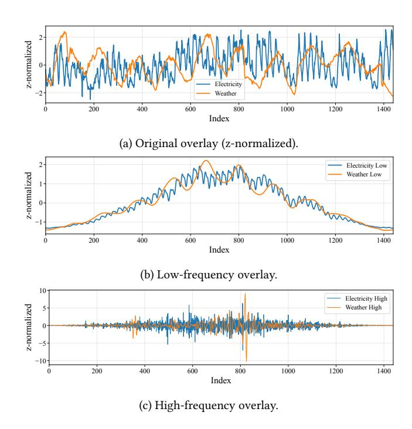
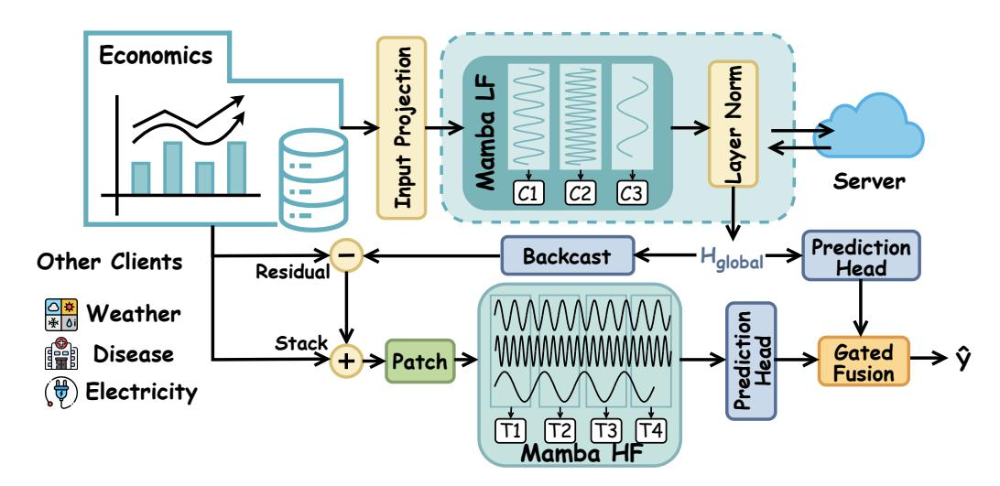
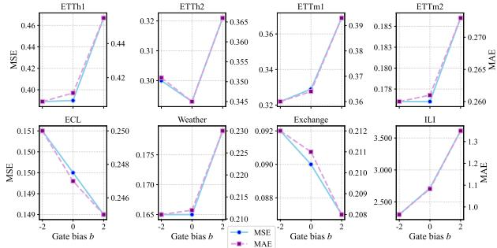
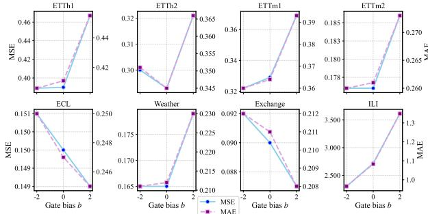
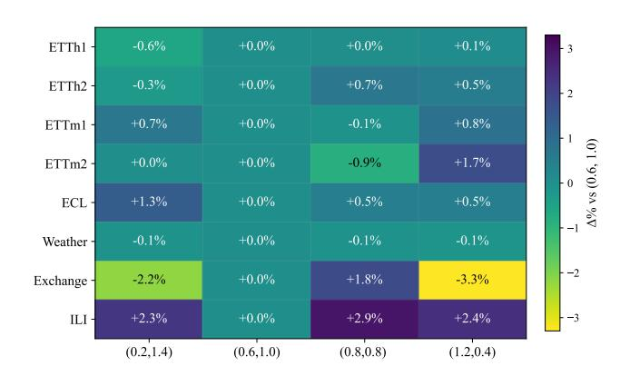

# FedRMamba: Federated Residual Mamba for Multivariate Time-Series Forecasting

Zhiwei Hu Shenzhen Research Institute of Big Data The Chinese University of Hong Kong, Shenzhen Shenzhen, China zhiweihu@link.cuhk.edu.cn

Liang Zhang∗ Shenzhen Campus of Sun Yat-sen University Shenzhen, China zhangliang27@mail.sysu.edu.cn

Guangxu Zhu∗ Shenzhen Research Institute of Big Data The Chinese University of Hong Kong, Shenzhen Shenzhen, China gxzhu@sribd.cn

# Abstract

Time series forecasting underpins many real-world services. Recent trends have focused on foundation models inspired by the paradigm of large language models, which rely on large volumes of centralized time-series data across diverse domains. However, such approaches raise significant concerns regarding data privacy. Federated learning (FL) has emerged as a promising paradigm for training unified time-series models using isolated datasets distributed across multiple clients. Nevertheless, existing FL methods face two critical challenges: heterogeneous variables and heterogeneous temporal correlations. To address these issues, we propose FedRMamba, a personalized federated forecasting framework built entirely from Mamba state-space blocks. Each client adopts a residual-coupled architecture, where a global frequency-aware Mamba module captures the common low-frequency structures shared across different variables, while a local patch-wise Mamba module learns personalized high-frequency patterns within the multivariate context. To clearly separate these responsibilities, we introduce a frequencyaware supervision that aligns the global path with low-frequency components and the local path with high-frequency residuals. Additionally, we design a gated fusion mechanism that dynamically combines the low-frequency and high-frequency components for improved prediction. We conduct extensive experiments to evaluate the performance of our proposed framework, demonstrating its effectiveness in handling heterogeneous data in federated settings. The code is available at [https://github.com/zhiweihu9/FedRMamba.](https://github.com/zhiweihu9/FedRMamba)

### CCS Concepts

• Mathematics of computing → Time series analysis.

### Keywords

Multivariate time series forecasting, Federated learning, Mamba

### ACM Reference Format:

Zhiwei Hu, Liang Zhang, and Guangxu Zhu. 2026. FedRMamba: Federated Residual Mamba for Multivariate Time-Series Forecasting. In Proceedings of the ACM Web Conference 2026 (WWW '26), April 13–17, 2026, Dubai, United

∗Corresponding authors.

© 2026 Copyright held by the owner/author(s). ACM ISBN 979-8-4007-2307-0/2026/04 <https://doi.org/10.1145/3774904.3792712>

Arab Emirates. ACM, New York, NY, USA, [11](#page-10-0) pages. [https://doi.org/10.1145/](https://doi.org/10.1145/3774904.3792712) [3774904.3792712](https://doi.org/10.1145/3774904.3792712)

# 1 Introduction

Time-series forecasting is a fundamental building block of web-scale platforms and real-world services, powering applications such as online economics, energy scheduling, intelligent transportation, and public health monitoring [\[16,](#page-8-0) [20,](#page-8-1) [32\]](#page-8-2). Deep learning methods, ranging from Recurrent Neural Networks (RNNs) [\[19,](#page-8-3) [29\]](#page-8-4) to Transformer-based models [\[18,](#page-8-5) [34,](#page-8-6) [39\]](#page-8-7), have significantly improved performance by effectively modeling temporal dependencies in sequential data. Recent advances focus on foundation-style models that are trained across diverse domains [\[2,](#page-8-8) [9,](#page-8-9) [12\]](#page-8-10), following the paradigm of large-scale pretraining established in Natural Language Processing (NLP) [\[10,](#page-8-11) [27,](#page-8-12) [28,](#page-8-13) [30\]](#page-8-14). Although datasets from different domains vary widely, foundation-style models have the potential to capture structural regularities across domains, holding the promise of broader applicability and more streamlined deployment [\[3,](#page-8-15) [26\]](#page-8-16).

Despite their success, single centralized foundation-style models rely on a large amount of time-series data across different domains. However, some raw time-series logs (e.g., household electricity usage and wearable biosignals) are sensitive and thus cannot leave devices or institutions under regulations such as GDPR and CCPA [\[6,](#page-8-17) [11\]](#page-8-18), creating challenges for collaborative training while ensuring data privacy. Federated learning (FL) has recently emerged as a promising approach for training unified time-series models on isolated datasets across distributed clients [\[7,](#page-8-19) [21,](#page-8-20) [37\]](#page-8-21). Traditional FL methods [\[4,](#page-8-22) [17\]](#page-8-23) usually assume that data across clients are independent and identically distributed (IID), which is impractical for federated time-series forecasting, as time series data are inherently heterogeneous. Moreover, cross-domain series differ significantly in dimensionality, history/prediction lengths, sampling frequencies, and temporal statistics [\[8\]](#page-8-24), which further exacerbates the heterogeneity problem. The heterogeneity challenge motivates heterogeneity-aware federated architectures that separate transferable global structure from domain-specific local dynamics.

Although existing approaches attempt to address the heterogeneity issue, they suffer from two serious challenges. 1) Heterogeneous variables. Variables within each client typically belong to a single domain and are highly correlated, whereas variables across different clients usually come from distinct domains, often with mismatched feature dimensionalities. Traditional methods, such as Time-FFM [\[21\]](#page-8-20) and FFTS [\[7\]](#page-8-19), often split multivariate time series into multiple univariate series, failing to effectively capture the complex

[This work is licensed under a Creative Commons Attribution 4.0 International License.](https://creativecommons.org/licenses/by/4.0) WWW '26, Dubai, United Arab Emirates

Figure 1: Electricity (1 h) vs. Weather (10 min): frequencydecomposition visualization.

relationships among variables within a single client. 2) Heterogeneous temporal correlations. When different clients monitor the same variables or dimensions across distinct entities, aggregating models that aim to capture heterogeneous temporal patterns often results in a degraded global model. The distinct domain-specific contextual meanings of different variables, such as weather fluctuations or electricity usage, carry unique interpretations, making cross-domain time series information fusion inherently challenging. Furthermore, different variables often operate on vastly different timescales, which can distort their meanings and complicate data integration during training. This necessitates that global models align these variables to suitable temporal scales for effective learning.

To address these challenges, we introduce Federated Residual Mamba (FedRMamba). Our design is motivated by a broad empirical regularity: across many domains, time series that look dissimilar in the time domain often share aligned low-frequency structure while differing markedly in high-frequency details. As an illustrative example, consider an hourly sampled Electricity series and a tenminute sampled Weather series. Viewed directly, their trajectories look dissimilar due to domain semantics and mismatched sampling scales (Fig. [1\(a\)](#page-1-0)). In the frequency domain, however, after removing daily and semi-daily harmonics, their slow components (periods &gt; 72 hours) align closely (Fig. [1\(b\)](#page-1-0)), whereas fast, band-limited fluctuations (1–4 hours) remain largely uncorrelated even under a constrained time lag of ±3 hours (Fig. [1\(c\)](#page-1-0)). We observe this pattern consistently across diverse dataset pairs. These observations motivate a divide-and-conquer solution: a globally aggregatable branch learns shared low-frequency structure across clients, while a local branch captures high-frequency, domain-specific variations.

Our Federated Residual Mamba framework adopts a divide-andconquer architecture to separately extract global low-frequency structure and personalized high-frequency structure. The global model splits the multivariate time series into independent univariate components and learns their common low-frequency patterns, while the local model treats the local multivariate data as a whole and focuses on the personalized high-frequency components that are overlooked by the global model. This divide-and-conquer approach effectively addresses the first challenge of heterogeneous variables by sharing a common low-frequency representation across variables while preserving the multivariate correlations in a personalized manner. To tackle the heterogeneous temporal correlation challenge, we propose two novel Mamba-based structures: the global frequency-aware Mamba, which is designed to capture the common low-frequency structure, and the local patch-wise Mamba, which captures the personalized high-frequency patterns that are missed by the frequency-aware Mamba. The Mamba architecture [\[13\]](#page-8-25) is well-suited for long-horizon time series, with compute and memory scaling linearly with sequence length. Since long-term sequences inherently contain multiscale information, the global frequency-aware Mamba with an input-dependent selective mechanism is well-suited to align variables that operate at different temporal scales. To clearly separate these responsibilities, we introduce a frequency-aware supervision that aligns the global Mamba with low-frequency components and the local Mamba with high-frequency residuals. Additionally, we design a gated fusion mechanism that dynamically combines low- and high-frequency forecasts based on the outputs of the global and local Mamba blocks for improved prediction.

In summary, we have the following contributions:

- To the best of our knowledge, this is the first federated Mamba framework for time-series forecasting that is trained on heterogeneous time series data across different domains and successfully addresses both the heterogeneous variable issue and the heterogeneous temporal correlation issue.
- We propose a novel residual federated Mamba framework, in which the global frequency-aware Mamba focuses on capturing the common low-frequency structure across different individual variables, while the local patch-wise Mamba focuses on the personalized high-frequency structure within the multivariate context.
- We conduct comprehensive experiments on eight time-series datasets to evaluate the performance of our proposed method. The results demonstrate its superior performance over the state-of-the-art methods.

### 2 Background

### 2.1 Preliminaries

State Space Models. A continuous-time linear time-invariant (LTI) system maps input �� (��) to output ��(��) via a latent state ℎ(��):

¤ℎ(��) = �� ℎ(��) + �� �� (��), ��(��) = �� ℎ(��) + �� �� (��). (1)

With zero-order hold at step Δ, the discrete state space model (SSM) can be written as:

ℎ�� = �� ℎ¯ ��−1 + �� ��¯ �� , ���� = �� ℎ�� + �� ���� , (2)

Table 1: Forecasting performance comparisons. All results are averaged over four prediction windows (���� ∈ {24, 36, 48, 60} for ILI and ���� ∈ {96, 192, 336, 720} for other datasets). Bold red: the best overall; underlined blue: the second best. Full results are presented in Table [6.](#page-10-1)

| Type Models Metric | MSE   | FedRMamba (Ours) MAE | Federated MSE | Time-FFM (2024b) MAE | MSE   | UniTime (2024a) MAE | MSE   | Cross-dataset GPT4TS (2023) MAE | MSE   | PatchTST (2023) MAE | MSE   | Timer-XL (2025) MAE | MSE   | DLinear (2023) MAE | Dataset-specific MSE | iTransformer (2023) MAE | MSE   | TimesNet (2022) MAE |
|--------------------|-------|----------------------|---------------|----------------------|-------|---------------------|-------|---------------------------------|-------|---------------------|-------|---------------------|-------|--------------------|----------------------|-------------------------|-------|---------------------|
| ETTh1              | 0.442 | 0.442                | 0.443         | 0.434                | 0.442 | 0.448               | 0.502 | 0.461                           | 0.472 | 0.451               | 0.449 | 0.442               | 0.456 | 0.452              | 0.456                | 0.448                   | 0.458 | 0.450               |
| ETTh2              | 0.388 | 0.408                | 0.383         | 0.406                | 0.378 | 0.403               | 0.386 | 0.406                           | 0.398 | 0.416               | 0.393 | 0.411               | 0.559 | 0.515              | 0.385                | 0.407                   | 0.414 | 0.427               |
| ETTm1              | 0.385 | 0.398                | 0.403         | 0.404                | 0.385 | 0.399               | 0.551 | 0.483                           | 0.971 | 0.629               | 0.412 | 0.411               | 0.403 | 0.407              | 0.408                | 0.412                   | 0.400 | 0.406               |
| ETTm2              | 0.277 | 0.324                | 0.286         | 0.332                | 0.293 | 0.334               | 0.321 | 0.356                           | 0.340 | 0.373               | 0.295 | 0.334               | 0.350 | 0.401              | 0.292                | 0.337                   | 0.291 | 0.333               |
| ECL                | 0.178 | 0.271                | 0.216         | 0.299                | 0.216 | 0.305               | 0.251 | 0.338                           | 0.221 | 0.311               | 0.184 | 0.273               | 0.212 | 0.300              | 0.180                | 0.271                   | 0.193 | 0.295               |
| Weather            | 0.248 | 0.276                | 0.270         | 0.289                | 0.253 | 0.276               | 0.293 | 0.309                           | 0.304 | 0.323               | 0.252 | 0.278               | 0.265 | 0.317              | 0.252                | 0.277                   | 0.259 | 0.287               |
| Exchange           | 0.369 | 0.412                | 0.344         | 0.393                | 0.364 | 0.404               | 0.421 | 0.446                           | 0.411 | 0.444               | 0.358 | 0.405               | 0.354 | 0.414              | 0.362                | 0.405                   | 0.416 | 0.443               |
| ILI                | 2.024 | 0.944                | 2.107         | 0.924                | 2.137 | 0.929               | 3.678 | 1.372                           | 4.210 | 1.480               | 2.087 | 0.916               | 2.616 | 1.090              | 2.282                | 0.968                   | 2.150 | 0.931               |
| Average            | 0.539 | 0.434                | 0.556         | 0.435                | 0.558 | 0.437               | 0.800 | 0.521                           | 0.916 | 0.553               | 0.554 | 0.434               | 0.652 | 0.487              | 0.577                | 0.441                   | 0.573 | 0.446               |
| st Count           |       | 12                   |               | 3                    |       | 5                   |       | 0                               |       | 0                   |       | 2                   |       | 0                  |                      | 1                       |       | 0                   |

# 4 Experiments

# 4.1 Experimental Setup

Datasets. We evaluate FedRMamba extensively on eight widely used long-term multivariate time-series benchmarks across diverse domains [\[33\]](#page-8-33): ETTh1, ETTh2, ETTm1, ETTm2, Electricity (ECL), Weather, Exchange, and Illness (ILI), following common practice [\[21,](#page-8-20) [22\]](#page-8-27). In the federated setting, each dataset constitutes a distinct client/domain (8 clients in total). We report Mean Squared Error (MSE) and Mean Absolute Error (MAE) as primary metrics. Further details on the datasets are provided in Appendix [A.1.](#page-9-0)

Baselines. We benchmark our method against eight state-of-the-art multivariate forecasters spanning three settings: (i) federated (Time-FFM [\[21\]](#page-8-20)); (ii) cross-dataset generalizable (UniTime [\[22\]](#page-8-27), GPT4TS [\[40\]](#page-8-28), PatchTST [\[25\]](#page-8-29)); and (iii) dataset-specific (Timer-XL [\[24\]](#page-8-30), DLinear [\[38\]](#page-8-31), iTransformer [\[23\]](#page-8-32), TimesNet [\[33\]](#page-8-33)). We directly cite results from the original papers when applicable. More details about baselines are shown in the Appendix [A.2.](#page-9-1)

Implementation Details. Following Time-FFM, the lookback window is ���� = 36 for ILI and ���� = 96 for all other datasets. The prediction horizon is ���� ∈ {24, 36, 48, 60} for ILI and ���� ∈ {96, 192, 336, 720} otherwise. Federated training is implemented using Flower. Each client trains for �� = 3 local epochs per round, and we run �� = 30 global rounds. Models are optimized with AdamW, using an initial learning rate of 1 × 10−4 under mixed-precision (AMP). For model selection, at the end of each round, we compute the validation loss on each client and average it across clients. The round with the lowest mean validation loss is selected, and its checkpoint is used for test evaluation. All experiments are implemented in PyTorch on a single NVIDIA A100 (80 GB) GPU.

# 4.2 Overall Performance

On the averaged benchmark in Table [1,](#page-5-0) FedRMamba attains the most balanced accuracy across datasets and metrics. It achieves the best MSE on six of eight datasets (ETTh1, ETTm1, ETTm2, ECL, Weather, ILI) and remains competitive on all datasets, while also obtaining the best or tied-best MAE on ETTm1, ETTm2, ECL, and Weather. Among centralized cross-dataset baselines, UniTime is particularly strong on ETTh2, and the federated foundation model Time-FFM performs best on Exchange. These results indicate complementary strengths: UniTime favors the ETTh2 regime, whereas FedRMamba—despite federated constraints—matches or surpasses centralized models on most medium/large multivariate datasets, suggesting that a Mamba backbone with frequency-aware guidance and a lightweight local residual branch can close, and in many cases reverse, the gap to centralized training without pooling data.

The horizon-wise results in Table [6](#page-10-1) (Appendix) corroborate these trends. FedRMamba achieves or ties for the best performance on most horizons for ETTm1, ETTm2, Weather, and ECL, and attains the best average MSE on ILI. Meanwhile, UniTime maintains an advantage on ETTh2, and Time-FFM remains competitive on Exchange. Overall, FedRMamba delivers state-of-the-art average accuracy with stable ranking across datasets and prediction lengths, demonstrating that federated parameter sharing, combined with frequency-aware supervision and personalized residual modeling, generalizes across heterogeneous time-series domains.

# 4.3 Ablation Studies

We conduct ablation studies on four variants of FedRMamba and summarize the results in Table [2](#page-6-0) (A.1–A.5). FedRMamba (A.1) delivers the strongest overall accuracy. We summarize four key observations: (1) Personalized residual modeling matters. Removing the client-specific local Mamba branch (A.2) consistently degrades performance across datasets and metrics, indicating that a shared backbone alone is insufficient to capture deployment-specific, highfrequency fluctuations. A lightweight local branch that models residuals is necessary to personalize predictions. (2) Frequency-aware

|     |           | Datasets Methods | MSE   | ETTh1 MAE | MSE   | ETTm2 MAE | MSE   | Weather MAE | MSE   | ECL MAE |
|-----|-----------|------------------|-------|-----------|-------|-----------|-------|-------------|-------|---------|
| A.1 | FedRMamba |                  | 0.375 | 0.398     | 0.174 | 0.258     | 0.163 | 0.210       | 0.148 | 0.244   |
| A.2 | w/o       | Mamba(HF)        | 0.384 | 0.403     | 0.180 | 0.265     | 0.177 | 0.219       | 0.153 | 0.249   |
| A.3 | w/o       | Mamba(LF)        | 0.431 | 0.436     | 0.189 | 0.277     | 0.189 | 0.232       | 0.189 | 0.274   |
|     | A.4       | w/o Loss         | 0.382 | 0.402     | 0.176 | 0.262     | 0.165 | 0.211       | 0.152 | 0.247   |
|     | A.5       | Local            | 0.383 | 0.404     | 0.177 | 0.261     | 0.175 | 0.216       | 0.164 | 0.257   |

Table 2: Ablation studies of FedRMamba on four datasets (96→96). Bold indicates the best.

Mamba modeling is indispensable. Eliminating the frequency-aware Mamba (A.3) leads to a clear and consistent degradation across datasets and metrics. This drop suggests that explicitly modeling low-frequency trends and seasonal structure is essential: without this part, the global backbone struggles to stabilize long-horizon behavior, and the local residual branch is forced to absorb slowvarying components, blurring the intended low/high-frequency division of labor and harming convergence stability. The drop is particularly evident on datasets with pronounced seasonality (e.g., Weather, ECL), underscoring the importance of a frequency-aware pathway. (3) Frequency-aware supervision is beneficial. Discarding the frequency-aligned losses (A.4) also leads to uniform drops, suggesting that encouraging the global path to focus on low-frequency components while steering the local path toward high-frequency details yields a cleaner division of labor and leads to more stable convergence. (4) Cross-client sharing improves generalization. Training local-only models without aggregation (A.5) underperforms the federated counterpart. Sharing the channel-scanning backbone via aggregation transfers common pattern structure across heterogeneous clients and dampens client-to-client variance, which translates into stronger out-of-domain robustness.

Figure 3: Gate bias controls the global–local prior. Most datasets prefer non-positive ��, while a positive �� consistently degrades performance, supporting our design of keeping the local branch corrective and the global backbone structural.

### 4.4 In-Depth Analysis

Architectural Prior via Gated Fusion. Our model FedRMamba fuses a global backbone (shared/aggregated; trend/low-frequency) with a local residual branch (personalized; high-frequency) through a per-channel gate with bias ��. The bias encodes a structural prior on the division of labor: more negative �� defaults to the global pathway, while more positive �� lets the local branch dominate. We evaluate �� ∈ {−2, 0, +2} on eight multivariate benchmarks under identical training. From Fig. [3,](#page-6-1) we observe a consistent trend: non-positive biases (�� = −2) deliver the most stable performance, while a strongly positive bias (�� = 2) systematically harms generalization. This pattern matches the design: with �� ≤ 0 the model separates frequencies cleanly (global learns structure; local corrects residuals), while �� &gt; 0 over-amplifies non-aggregated local corrections, hurting long-range generalization and cross-client transfer. Periodic/long-horizon datasets (ETT∗ ) and high-resolution Weather show this effect, aligning with our frequency-aware design (global for low-frequency structure; local for high-frequency residuals).

Figure 4: Frequency-aligned losses (MSE, Δ% vs. (0.6, 1.0)). A mild high-frequency allocation is a stable center, while extremes degrade in a dataset-dependent way, confirming the global–local split.

Frequency-Aligned Losses as Structural Constraints. FedR-Mamba separates modeling capacity into a global backbone (shared and aggregated; trend and low-frequency) and a local residual branch (personalized; high-frequency). To enforce this division of labor, we apply branch-specific spectral losses: a low-pass loss on global\_pred weighted by ����\_������ and a high-pass loss on its local\_pred weighted by ����\_ℎ��. Keeping the total budget nearly fixed (����\_������+����\_ℎ�� ≈ 1.6) isolates allocation from overall regularization strength; we sweep four allocations (����\_������, ����\_ℎ��) ∈ {(0.2, 1.4), (0.6, 1.0), (0.8, 0.8), (1.2, 0.4)} under the same training protocol as the main setup. Figure [4](#page-6-2) visualizes per-dataset heatmaps of the relative change (%) w.r.t. (0.6, 1.0) for MSE, under the four allocations. We find that a mild high-frequency bias, e.g., (0.6, 1.0), is consistently strongest or tied-strongest across datasets and metrics. This setting keeps the local branch firmly corrective (absorbing fast fluctuations/noise) while preserving the global pathway for structural low-frequency patterns—thereby reducing gradient interference between branches and stabilizing optimization and aggregation. By contrast, we find that extremes hurt generalization. Pushing the allocation to either side (e.g., (0.2, 1.4) or (1.2, 0.4)) breaks the intended specialization: too large ����\_ℎ�� overfits high-frequency noise in the non-aggregated local path; too large ����\_������ contaminates the global path with high-frequency details, weakening cross-client transfer. To be more specific, trend/seasonality-dominant domains are more tolerant to larger ����\_������, whereas noisy/high-resolution

| Dataset  | A (matched) | MSE B (mismatched) | C (extreme) |
|----------|-------------|--------------------|-------------|
| ETTh1    | 0.381       | 0.382              | 0.428       |
| ETTm2    | 0.175       | 0.169              | 0.183       |
| Weather  | 0.157       | 0.157              | 0.160       |
| Exchange | 0.089       | 0.089              | 0.081       |

Table 3: Three schemes of heterogeneous input lengths: (A) periodmatched, (B) period-mismatched, and (C) extreme heterogeneity.

domains benefit from larger ����\_ℎ��. Combined with a non-positive gate bias (�� ≤ 0), the frequency-aligned losses operationalize our architectural prior (global→low; local→high) and improve robustness in federated settings by lowering cross-client variance on the aggregated global backbone.

Heterogeneous Input Lengths. To test robustness to heterogeneous contexts, we assign a distinct observation window seq\_len to each dataset (client) while keeping the prediction horizon fixed. To ensure comparable compute/memory across clients, we scale the mini-batch approximately inversely with the window length so that batch\_size×seq\_len is a near-constant per optimizer step. All other training settings are identical across methods and datasets. We evaluate three schemes: (A) period-matched (align seq\_len to natural periods), (B) period-mismatched (deliberately off-period), and (C) extreme heterogeneity (mix very short and very long windows). As summarized in Table [3,](#page-7-0) FedRMamba remains stable across all schemes: (A) provides the strongest overall robustness on seasonal/hourly datasets (ETTh1, Weather), (C) effectively leverages longer contexts on trend-dominant domains (Exchange) without collapsing others, while (B) generally underperforms but can help noisy minute-level data (ETTm2). The aggregated global backbone models the low-frequency structure and is thus relatively insensitive to moderate changes in seq\_len. The personalized local residual operates on short patches to correct high-frequency errors; increasing seq\_len simply provides more residual opportunities rather than shifting its role. With a non-positive gate bias (�� ≤ 0) and frequency-aligned losses (global→low, local→high), this division of labor remains intact under heterogeneous input lengths—explaining the stability of (A), the long-context gains of (C), and the degradation under deliberate mismatch (B).

# 5 Related Work

Mamba for Time-Series Forecasting. State-space models (SSMs) and the Mamba family provide linear-time sequence modeling with strong inductive bias for long dependencies, offering an alternative to attention while remaining scalable for long-horizon TSF. HiPPO [\[14\]](#page-8-34) establishes optimal polynomial projection for recurrent memory, laying a theoretical basis for efficient long-range recurrence. S4 [\[15\]](#page-8-35) systematizes structured state spaces with stable frequency-domain parameterization and fast implementations for very long sequences. Mamba [\[13\]](#page-8-25) introduces selective scan to retain O (����) time while improving expressivity over classical SSMs. Wang et al. [\[31\]](#page-8-36) conduct a systematic study of Mamba for TSF across multiple benchmarks, clarifying when Mamba is competitive

and where gaps remain. Affirm [\[35\]](#page-8-37) augments Mamba with adaptive Fourier filters to better capture frequency components crucial for long-term forecasting. MambaTS [\[5\]](#page-8-38) tailors selective SSMs to long-horizon TSF with architectural refinements specific to forecasting. TimeMachine [\[1\]](#page-8-39) ensembles multiple Mambas/branches in parallel to strengthen long-range modeling and improve stability on extended horizons. Despite these advances, a unified Mambabased TSF model that simultaneously ensures stable training across datasets, strong multivariate (cross-channel) modeling, robust longhorizon extrapolation, and principled handling of irregular sampling and probabilistic outputs remains elusive; moreover, best practices for combining Mamba with decomposition/frequency priors and for deployment under cross-domain/federated heterogeneity are still open research questions.

Federated Time-Series Forecasting. Federated time-series forecasting (FTSF) aims to learn from decentralized temporal data under privacy and regulatory constraints, while coping with severe noniid heterogeneity, long horizons, and communication limitations. Time-FFM [\[21\]](#page-8-20) proposes LM-empowered federated foundation models for TSF, combining global pretraining with FL-style adaptation and showing gains under cross-domain variability. FFTS [\[7\]](#page-8-19) studies training protocols and adapter designs to reconcile client heterogeneity with foundation-model sharing, reporting consistent improvements on diverse TSF benchmarks. Yuan et al. [\[37\]](#page-8-21) systematically analyzes the sources of heterogeneity specific to federated TSF (feature/domain shift, sampling/windowing mismatch, and evaluation metrics) and outlines practical mitigation strategies across data processing, model design, and aggregation. Despite progress, FTSF still lacks a unified framework that jointly achieves (i) effective personalization vs. global sharing, (ii) robust long-horizon extrapolation under irregular sampling and domain shift, and (iii) communication/backbone efficiency compatible with real-world deployment across heterogeneous clients.

### 6 Conclusion

In this paper, we proposed FedRMamba, a federated residual Mamba framework that consists of a global frequency-aware Mamba module capturing the common low-frequency structures shared across different variables and a local patch-wise Mamba module learning personalized high-frequency patterns within the multivariate context. To clearly separate these responsibilities, we introduced frequency-aware supervision that aligns the global path with lowfrequency components and the local path with high-frequency residuals. We further designed a gated fusion mechanism that dynamically combines the low-frequency and high-frequency components. As future work, we plan to apply our framework to a broader range of time-series data across diverse domains.

### Acknowledgments

This work was supported in part by the National Key R&D Program of China (Grant No. 2022YFA1003900); the Guangdong Major Project of Basic and Applied Basic Research (Grant No. 2023B0303000001); the National Natural Science Foundation of China (Grant Nos. 62522118 and 62371313); the Guangdong Basic and Applied Basic Research Foundation (Grant No. 2023A1515110750); and the Guangdong Young Talent Research Project (Grant No. 2023TQ07A708).

References [1] Md Atik Ahamed and Qiang Cheng. 2024. Timemachine: A time series is worth 4 mambas for long-term forecasting. In ECAI 2024: 27th European Conference on Artificial Intelligence, 19-24 October 2024, Santiago de Compostela, Spain-Including 13th Conference on Prestigious Applications of Intelligent Systems. European Conference on Artificial Intelli, Vol. 392. 1688. [2] Abdul Fatir Ansari, Lorenzo Stella, Caner Turkmen, Xiyuan Zhang, Pedro Mercado, Huibin Shen, Oleksandr Shchur, Syama Sundar Rangapuram, Sebastian Pineda Arango, Shubham Kapoor, et al. 2024. Chronos: Learning the language of time series. arXiv preprint arXiv:2403.07815 (2024). [3] Rishi Bommasani. 2021. On the opportunities and risks of foundation models. arXiv preprint arXiv:2108.07258 (2021). [4] Keith Bonawitz, Hubert Eichner, Wolfgang Grieskamp, Dzmitry Huba, Alex Ingerman, Vladimir Ivanov, Chloe Kiddon, Jakub Konečny, Stefano Mazzocchi, ` Brendan McMahan, et al. 2019. Towards federated learning at scale: System design. Proceedings of machine learning and systems 1 (2019), 374–388. [5] Xiuding Cai, Yaoyao Zhu, Xueyao Wang, and Yu Yao. 2024. MambaTS: improved selective state space models for long-term time series forecasting. arXiv preprint arXiv:2405.16440 (2024). [6] California Legislature. 2018. California Consumer Privacy Act (CCPA), Cal. Civ. Code §§1798.100–1798.199. California Department of Justice. [https://oag.ca.gov/](https://oag.ca.gov/privacy/ccpa) [privacy/ccpa](https://oag.ca.gov/privacy/ccpa) CCPA. [7] Shengchao Chen, Guodong Long, Jing Jiang, and Chengqi Zhang. 2025. Federated foundation models on heterogeneous time series. In Proceedings of the AAAI Conference on Artificial Intelligence, Vol. 39. 15839–15847. [8] Mingyue Cheng, Zhiding Liu, Xiaoyu Tao, Qi Liu, Jintao Zhang, Tingyue Pan, Shilong Zhang, Panjing He, Xiaohan Zhang, Daoyu Wang, et al. 2025. A comprehensive survey of time series forecasting: Concepts, challenges, and future directions. Authorea Preprints (2025). [9] Abhimanyu Das, Weihao Kong, Rajat Sen, and Yichen Zhou. 2024. A decoderonly foundation model for time-series forecasting. In Forty-first International Conference on Machine Learning. [10] Jacob Devlin, Ming-Wei Chang, Kenton Lee, and Kristina Toutanova. 2019. Bert: Pre-training of deep bidirectional transformers for language understanding. In Proceedings of the 2019 conference of the North American chapter of the association for computational linguistics: human language technologies, volume 1 (long and short papers). 4171–4186. [11] European Parliament and the Council of the European Union. 2016. Regulation (EU) No 2016/679 of the European Parliament and of the Council of 27 April 2016 on the protection of natural persons with regard to the processing of personal data and on the free movement of such data (General Data Protection Regulation). Official Journal of the European Union, L 119/1–88.<https://gdpr-info.eu/> GDPR. [12] Azul Garza, Cristian Challu, and Max Mergenthaler-Canseco. 2023. TimeGPT-1. arXiv preprint arXiv:2310.03589 (2023). [13] Albert Gu and Tri Dao. 2023. Mamba: Linear-time sequence modeling with selective state spaces. arXiv preprint arXiv:2312.00752 (2023). [14] Albert Gu, Tri Dao, Stefano Ermon, Atri Rudra, and Christopher Ré. 2020. Hippo: Recurrent memory with optimal polynomial projections. Advances in neural information processing systems 33 (2020), 1474–1487. [15] Albert Gu, Karan Goel, and Christopher Ré. 2021. Efficiently modeling long sequences with structured state spaces. arXiv preprint arXiv:2111.00396 (2021). [16] Rob J Hyndman and George Athanasopoulos. 2018. Forecasting: principles and practice. OTexts. [17] Peter Kairouz, H Brendan McMahan, Brendan Avent, Aurélien Bellet, Mehdi Bennis, Arjun Nitin Bhagoji, Kallista Bonawitz, Zachary Charles, Graham Cormode, Rachel Cummings, et al. 2021. Advances and open problems in federated learning. Foundations and trends® in machine learning 14, 1–2 (2021), 1–210. [18] Nikita Kitaev, Łukasz Kaiser, and Anselm Levskaya. 2020. Reformer: The efficient transformer. arXiv preprint arXiv:2001.04451 (2020). [19] Guokun Lai, Wei-Cheng Chang, Yiming Yang, and Hanxiao Liu. 2018. Modeling long-and short-term temporal patterns with deep neural networks. In The 41st international ACM SIGIR conference on research & development in information retrieval. 95–104. [20] Bryan Lim and Stefan Zohren. 2021. Time-series forecasting with deep learning: a survey. Philosophical Transactions of the Royal Society A 379, 2194 (2021), 20200209. [21] Qingxiang Liu, Xu Liu, Chenghao Liu, Qingsong Wen, and Yuxuan Liang. 2024. Time-ffm: Towards lm-empowered federated foundation model for time series forecasting. Advances in Neural Information Processing Systems 37 (2024), 94512– 94538. [22] Xu Liu, Junfeng Hu, Yuan Li, Shizhe Diao, Yuxuan Liang, Bryan Hooi, and Roger Zimmermann. 2024. Unitime: A language-empowered unified model for crossdomain time series forecasting. In Proceedings of the ACM Web Conference 2024. 4095–4106. [23] Yong Liu, Tengge Hu, Haoran Zhang, Haixu Wu, Shiyu Wang, Lintao Ma, and Mingsheng Long. 2023. itransformer: Inverted transformers are effective for time series forecasting. arXiv preprint arXiv:2310.06625 (2023). [24] Yong Liu, Guo Qin, Xiangdong Huang, Jianmin Wang, and Mingsheng Long. 2025. Timer-XL: Long-Context Transformers for Unified Time Series Forecasting. In The Thirteenth International Conference on Learning Representations. [https:](https://openreview.net/forum?id=KMCJXjlDDr) [//openreview.net/forum?id=KMCJXjlDDr](https://openreview.net/forum?id=KMCJXjlDDr) [25] Yuqi Nie, Nam H Nguyen, Phanwadee Sinthong, and Jayant Kalagnanam. 2023. A Time Series is Worth 64 Words: Long-term Forecasting with Transformers. In The Eleventh International Conference on Learning Representations. [https:](https://openreview.net/forum?id=Jbdc0vTOcol) [//openreview.net/forum?id=Jbdc0vTOcol](https://openreview.net/forum?id=Jbdc0vTOcol) [26] Alec Radford, Jong Wook Kim, Chris Hallacy, Aditya Ramesh, Gabriel Goh, Sandhini Agarwal, Girish Sastry, Amanda Askell, Pamela Mishkin, Jack Clark, et al. 2021. Learning transferable visual models from natural language supervision. In International conference on machine learning. PmLR, 8748–8763. [27] Alec Radford, Karthik Narasimhan, Tim Salimans, Ilya Sutskever, et al. 2018. Improving language understanding by generative pre-training. (2018). [28] Alec Radford, Jeffrey Wu, Rewon Child, David Luan, Dario Amodei, Ilya Sutskever, et al. 2019. Language models are unsupervised multitask learners. OpenAI blog 1, 8 (2019), 9. [29] David Salinas, Valentin Flunkert, Jan Gasthaus, and Tim Januschowski. 2020. DeepAR: Probabilistic forecasting with autoregressive recurrent networks. International journal of forecasting 36, 3 (2020), 1181–1191. [30] Hugo Touvron, Thibaut Lavril, Gautier Izacard, Xavier Martinet, Marie-Anne Lachaux, Timothée Lacroix, Baptiste Rozière, Naman Goyal, Eric Hambro, Faisal Azhar, et al. 2023. Llama: Open and efficient foundation language models. arXiv preprint arXiv:2302.13971 (2023). [31] Zihan Wang, Fanheng Kong, Shi Feng, Ming Wang, Xiaocui Yang, Han Zhao, Daling Wang, and Yifei Zhang. 2025. Is mamba effective for time series forecasting? Neurocomputing 619 (2025), 129178. [32] Qingsong Wen, Linxiao Yang, Tian Zhou, and Liang Sun. 2022. Robust time series analysis and applications: An industrial perspective. In Proceedings of the 28th ACM SIGKDD conference on knowledge discovery and data mining. 4836–4837. [33] Haixu Wu, Tengge Hu, Yong Liu, Hang Zhou, Jianmin Wang, and Mingsheng Long. 2022. Timesnet: Temporal 2d-variation modeling for general time series analysis. arXiv preprint arXiv:2210.02186 (2022). [34] Haixu Wu, Jiehui Xu, Jianmin Wang, and Mingsheng Long. 2021. Autoformer: Decomposition transformers with auto-correlation for long-term series forecasting. Advances in neural information processing systems 34 (2021), 22419–22430. [35] Yuhan Wu, Xiyu Meng, Huajin Hu, Junru Zhang, Yabo Dong, and Dongming Lu. 2025. Affirm: Interactive mamba with adaptive fourier filters for long-term time series forecasting. In Proceedings of the AAAI Conference on Artificial Intelligence, Vol. 39. 21599–21607. [36] Annan Yu, Dongwei Lyu, Soon Hoe Lim, Michael W. Mahoney, and N. Benjamin Erichson. 2025. Tuning Frequency Bias of State Space Models. In The Thirteenth International Conference on Learning Representations. [https://openreview.net/](https://openreview.net/forum?id=wkHcXDv7cv) [forum?id=wkHcXDv7cv](https://openreview.net/forum?id=wkHcXDv7cv) [37] Wei Yuan, Guanhua Ye, Xiangyu Zhao, Quoc Viet Hung Nguyen, Yang Cao, and Hongzhi Yin. 2024. Tackling data heterogeneity in federated time series forecasting. arXiv preprint arXiv:2411.15716 (2024). [38] Ailing Zeng, Muxi Chen, Lei Zhang, and Qiang Xu. 2023. Are transformers effective for time series forecasting?. In Proceedings of the AAAI conference on artificial intelligence, Vol. 37. 11121–11128. [39] Haoyi Zhou, Shanghang Zhang, Jieqi Peng, Shuai Zhang, Jianxin Li, Hui Xiong, and Wancai Zhang. 2021. Informer: Beyond efficient transformer for long sequence time-series forecasting. In Proceedings of the AAAI conference on artificial intelligence, Vol. 35. 11106–11115. [40] Tian Zhou, Peisong Niu, Liang Sun, Rong Jin, et al. 2023. One fits all: Power general time series analysis by pretrained lm. Advances in neural information processing systems 36 (2023), 43322–43355.

Table 4: Detailed statistics of datasets. Dimension (Dim.) is the number of variables (channels). The dataset size is organized into (training, validation, test).

| Dataset     | Dim. | Dataset |        | Size   | Frequency |      | Domain      |
|-------------|------|---------|--------|--------|-----------|------|-------------|
| ETTh1       | 7    | (8545,  | 2881,  | 2881)  | 1         | hour | Temperature |
| ETTh2       | 7    | (8545,  | 2881,  | 2881)  | 1         | hour | Temperature |
| ETTm1       | 7    | (34465, | 11521, | 11521) | 15        | min  | Temperature |
| ETTm2       | 7    | (34465, | 11521, | 11521) | 15        | min  | Temperature |
| Electricity | 321  | (18317, | 2633,  | 5261)  | 1         | hour | Electricity |
| Weather     | 21   | (36792, | 5271,  | 10540) | 10        | min  | Weather     |
| Exchange    | 8    | (5120,  | 665,   | 1422)  | 1         | day  | Finance     |
| ILI         | 7    | (617,   | 74,    | 170)   | 1         | week | Illness     |

# A Experimental Details

### A.1 Dataset Details

We evaluate our model on eight widely used publicly available longterm multivariate time-series benchmarks: ETTh1, ETTh2, ETTm1, ETTm2 [\[39\]](#page-8-7), Electricity (ECL), Weather, Exchange, and Illness (ILI) from [\[33\]](#page-8-33). ETT records transformer-load related indicators from July 2016 to July 2018 in two counties in China and is split into four subsets with different sampling rates: ETTh1/ETTh2 (hourly) and ETTm1/ETTm2 (15-minute). Each record contains six power-load features plus one target. Electricity (ECL) contains hourly electricity consumption of 321 customers (2012–2014). Exchange consists of daily exchange rates of eight countries (1990–2016). Weather provides 10-minute measurements in 2020 with 21 meteorological variables collected from stations in Germany. Illness (ILI) is the weekly influenza-like illness ratio in the United States. A consolidated summary of variables, sampling frequencies, and data spans is provided in Table [4.](#page-9-2) These datasets differ substantially in semantics, sampling intervals, and scale, forming a comprehensive testbed for long-horizon forecasting across diverse real-world domains.

### A.2 Baselines

We compare with eight methods in three groups: (i) federated: Time-FFM; (ii) cross-dataset: UniTime, GPT4TS, PatchTST; (iii) datasetspecific: Timer-XL, DLinear, iTransformer, TimesNet.

Time-FFM [\[21\]](#page-8-20): A federated time-series foundation framework with a shared global backbone that fuses time- and frequencydomain representations. Only shareable parameters are aggregated via FedAvg, while lightweight client adapters absorb heterogeneity. UniTime [\[22\]](#page-8-27): A unified forecaster that tokenizes long histories into patches and decouples temporal and variable modeling. Joint multi-dataset training or pretrain–fine-tune yields robust zero/fewshot transfer with minimal per-dataset tuning.

GPT4TS [\[40\]](#page-8-28): A decoder-only, autoregressive Transformer adapted from pretrained GPT-style large language models to patchified time series, providing strong transfer and stable long-horizon behavior at higher compute/memory cost.

PatchTST [\[25\]](#page-8-29): Segments sequences into fixed-length time patches and applies channel-independent self-attention, preserving pervariable semantics with lower complexity.

Timer-XL [\[24\]](#page-8-30): A long-context Transformer using hierarchical tokens and cross-scale pathways (down/up-sampling and timeaware attention), delivering strong long-horizon accuracy on fixed distributions at larger capacity.

DLinear [\[38\]](#page-8-31): A minimalist linear baseline that decomposes trend or seasonality and applies per-channel linear mappings. Such a method is extremely fast and parameter-efficient but weaker under strong nonlinearity or cross-variable interactions.

iTransformer [\[23\]](#page-8-32): Treats variables as tokens (channel-as-token) and time as features, explicitly modeling cross-channel dependencies for high-dimensional multivariate data.

TimesNet [\[33\]](#page-8-33): Builds a 2D time–period representation and learns multi-periodicity with 2D blocks, excelling on datasets with pronounced seasonal structure while being sensitive to period-mapping choices in practice.

Table 5: Centralized forecasting on a proprietary telecom-domain 5G MR/call-level KPI dataset from real industry (33 variables). We report MSE/MAE averaged over all samples and horizons (equal weights over variables). Bold red and underlined blue denote the best and second best, respectively.

### B Supplementary Case Study: Telecom KPI Forecasting (Centralized)

To further validate practical applicability, we conduct a supplementary case study on a proprietary 5G MR/call-level telecom KPI dataset collected from real-world industrial operations. Due to datagovernance constraints, the data are only accessible in a centralized form; thus, this case study is not intended to evaluate federated optimization benefits. Instead, we aim to isolate and assess the forecasting capability of the client-side model architecture in FedR-Mamba. Concretely, we evaluate FedRMamba in its single-client instantiation (��=1), which degenerates to centralized training while keeping the same architecture and protocol. The dataset contains 17,360,588 KPI records, aggregated by call ID into 503,094 variablelength sequences (no padding); we keep sequences with lengths in [72, 500], resulting in 42,040 samples at a 5-second interval. We form supervised samples using a standard sliding-window setup with history ��=60 (5 minutes) and horizon ��=12 (1 minute), and select 33 business-critical KPI variables as multivariate inputs. Table [5](#page-9-3) reports MSE/MAE averaged over all samples and horizons, with equal weights over variables. Overall, FedRMamba achieves the best accuracy compared to Timer-XL and iTransformer, demonstrating the effectiveness of our residual Mamba design under real-world telecom KPI workloads from production 5G networks.

Table 6: Full results of forecasting performance comparisons. Bold red indicates the best overall, underlined blue indicates the second best.

| Type Models Metric | MSE   | FedRMamba (Ours) MAE | Federated MSE | Time-FFM (2024b) MAE | MSE   | UniTime (2024a) MAE | MSE   | Cross-dataset GPT4TS (2023) MAE | MSE   | PatchTST (2023) MAE | MSE   | Timer-XL (2025) MAE | MSE   | DLinear (2023) MAE | Dataset-specific MSE | iTransformer (2023) MAE | MSE   | TimesNet (2022) MAE |
|--------------------|-------|----------------------|---------------|----------------------|-------|---------------------|-------|---------------------------------|-------|---------------------|-------|---------------------|-------|--------------------|----------------------|-------------------------|-------|---------------------|
| 96                 | 0.375 | 0.398                | 0.388         | 0.401                | 0.397 | 0.418               | 0.449 | 0.424                           | 0.409 | 0.403               | 0.381 | 0.399               | 0.386 | 0.400              | 0.387                | 0.405                   | 0.384 | 0.402               |
| 192                | 0.432 | 0.430                | 0.440         | 0.431                | 0.434 | 0.439               | 0.503 | 0.453                           | 0.467 | 0.444               | 0.441 | 0.433               | 0.437 | 0.432              | 0.441                | 0.436                   | 0.436 | 0.429               |
| 336                | 0.474 | 0.455                | 0.480         | 0.449                | 0.468 | 0.457               | 0.540 | 0.477                           | 0.509 | 0.472               | 0.479 | 0.453               | 0.481 | 0.459              | 0.487                | 0.458                   | 0.491 | 0.469               |
| 720                | 0.487 | 0.484                | 0.462         | 0.456                | 0.469 | 0.477               | 0.515 | 0.489                           | 0.503 | 0.485               | 0.493 | 0.483               | 0.519 | 0.516              | 0.509                | 0.494                   | 0.521 | 0.500               |
| Avg                | 0.442 | 0.442                | 0.443         | 0.434                | 0.442 | 0.448               | 0.502 | 0.461                           | 0.472 | 0.451               | 0.449 | 0.442               | 0.456 | 0.452              | 0.456                | 0.448                   | 0.458 | 0.450               |
| 96                 | 0.293 | 0.345                | 0.303         | 0.351                | 0.296 | 0.345               | 0.303 | 0.349                           | 0.314 | 0.361               | 0.306 | 0.353               | 0.333 | 0.387              | 0.301                | 0.350                   | 0.340 | 0.374               |
| 192                | 0.380 | 0.398                | 0.380         | 0.398                | 0.374 | 0.394               | 0.391 | 0.399                           | 0.407 | 0.411               | 0.398 | 0.410               | 0.477 | 0.476              | 0.381                | 0.399                   | 0.402 | 0.414               |
| 336                | 0.426 | 0.433                | 0.423         | 0.431                | 0.415 | 0.427               | 0.422 | 0.428                           | 0.437 | 0.443               | 0.431 | 0.435               | 0.594 | 0.541              | 0.427                | 0.434                   | 0.452 | 0.452               |
| 720                | 0.453 | 0.457                | 0.427         | 0.444                | 0.425 | 0.444               | 0.429 | 0.449                           | 0.434 | 0.448               | 0.436 | 0.447               | 0.831 | 0.657              | 0.430                | 0.446                   | 0.462 | 0.468               |
| Avg                | 0.388 | 0.408                | 0.383         | 0.406                | 0.378 | 0.403               | 0.386 | 0.406                           | 0.398 | 0.416               | 0.393 | 0.411               | 0.559 | 0.515              | 0.385                | 0.407                   | 0.414 | 0.427               |
| 96                 | 0.319 | 0.359                | 0.341         | 0.374                | 0.322 | 0.363               | 0.509 | 0.463                           | 0.927 | 0.604               | 0.330 | 0.366               | 0.345 | 0.372              | 0.342                | 0.377                   | 0.338 | 0.375               |
| 192                | 0.362 | 0.382                | 0.380         | 0.392                | 0.366 | 0.387               | 0.537 | 0.476                           | 0.964 | 0.620               | 0.388 | 0.398               | 0.380 | 0.389              | 0.383                | 0.396                   | 0.374 | 0.387               |
| 336                | 0.395 | 0.405                | 0.411         | 0.410                | 0.398 | 0.407               | 0.564 | 0.488                           | 1.041 | 0.656               | 0.421 | 0.418               | 0.413 | 0.413              | 0.418                | 0.418                   | 0.410 | 0.411               |
| 720                | 0.465 | 0.444                | 0.469         | 0.441                | 0.454 | 0.440               | 0.592 | 0.504                           | 0.950 | 0.636               | 0.510 | 0.463               | 0.474 | 0.453              | 0.487                | 0.456                   | 0.478 | 0.450               |
| Avg                | 0.385 | 0.398                | 0.403         | 0.404                | 0.385 | 0.399               | 0.551 | 0.483                           | 0.971 | 0.629               | 0.412 | 0.411               | 0.403 | 0.407              | 0.408                | 0.412                   | 0.400 | 0.406               |
| 96                 | 0.174 | 0.258                | 0.181         | 0.267                | 0.183 | 0.266               | 0.229 | 0.304                           | 0.240 | 0.318               | 0.178 | 0.259               | 0.193 | 0.292              | 0.186                | 0.272                   | 0.187 | 0.267               |
| 192                | 0.239 | 0.301                | 0.247         | 0.308                | 0.251 | 0.310               | 0.287 | 0.338                           | 0.301 | 0.352               | 0.263 | 0.317               | 0.284 | 0.362              | 0.254                | 0.314                   | 0.249 | 0.309               |
| 336                | 0.297 | 0.338                | 0.309         | 0.347                | 0.319 | 0.351               | 0.337 | 0.367                           | 0.367 | 0.391               | 0.325 | 0.354               | 0.369 | 0.427              | 0.317                | 0.353                   | 0.321 | 0.351               |
| 720                | 0.399 | 0.398                | 0.406         | 0.404                | 0.420 | 0.410               | 0.430 | 0.416                           | 0.451 | 0.432               | 0.413 | 0.406               | 0.554 | 0.522              | 0.412                | 0.407                   | 0.408 | 0.403               |
| Avg                | 0.277 | 0.324                | 0.286         | 0.332                | 0.293 | 0.334               | 0.321 | 0.356                           | 0.340 | 0.373               | 0.295 | 0.334               | 0.350 | 0.401              | 0.292                | 0.337                   | 0.291 | 0.333               |
| 96                 | 0.148 | 0.244                | 0.198         | 0.282                | 0.196 | 0.287               | 0.232 | 0.321                           | 0.198 | 0.290               | 0.155 | 0.247               | 0.197 | 0.282              | 0.149                | 0.241                   | 0.168 | 0.272               |
| 192                | 0.162 | 0.255                | 0.199         | 0.285                | 0.199 | 0.291               | 0.234 | 0.325                           | 0.202 | 0.293               | 0.169 | 0.259               | 0.196 | 0.285              | 0.164                | 0.258                   | 0.184 | 0.289               |
| 336                | 0.181 | 0.275                | 0.212         | 0.298                | 0.214 | 0.305               | 0.249 | 0.338                           | 0.223 | 0.318               | 0.187 | 0.277               | 0.209 | 0.301              | 0.179                | 0.272                   | 0.198 | 0.300               |
| 720                | 0.219 | 0.309                | 0.253         | 0.330                | 0.254 | 0.335               | 0.289 | 0.366                           | 0.259 | 0.341               | 0.223 | 0.307               | 0.245 | 0.333              | 0.227                | 0.311                   | 0.220 | 0.320               |
| Avg                | 0.178 | 0.271                | 0.216         | 0.299                | 0.216 | 0.305               | 0.251 | 0.338                           | 0.221 | 0.311               | 0.184 | 0.273               | 0.212 | 0.300              | 0.180                | 0.271                   | 0.193 | 0.295               |
| 96                 | 0.163 | 0.210                | 0.192         | 0.232                | 0.171 | 0.214               | 0.212 | 0.251                           | 0.213 | 0.260               | 0.165 | 0.209               | 0.196 | 0.255              | 0.165                | 0.209                   | 0.172 | 0.220               |
| 192                | 0.212 | 0.254                | 0.236         | 0.268                | 0.217 | 0.254               | 0.261 | 0.288                           | 0.269 | 0.300               | 0.215 | 0.255               | 0.237 | 0.296              | 0.215                | 0.255                   | 0.219 | 0.261               |
| 336                | 0.268 | 0.294                | 0.289         | 0.304                | 0.274 | 0.293               | 0.313 | 0.324                           | 0.330 | 0.341               | 0.277 | 0.299               | 0.283 | 0.335              | 0.273                | 0.296                   | 0.280 | 0.306               |
| 720                | 0.347 | 0.346                | 0.363         | 0.351                | 0.351 | 0.343               | 0.386 | 0.372                           | 0.404 | 0.389               | 0.352 | 0.348               | 0.345 | 0.381              | 0.353                | 0.349                   | 0.365 | 0.359               |
| Avg                | 0.248 | 0.276                | 0.270         | 0.289                | 0.253 | 0.276               | 0.293 | 0.309                           | 0.304 | 0.323               | 0.252 | 0.278               | 0.265 | 0.317              | 0.252                | 0.277                   | 0.259 | 0.287               |
| 96                 | 0.089 | 0.212                | 0.082         | 0.200                | 0.086 | 0.209               | 0.142 | 0.261                           | 0.137 | 0.260               | 0.088 | 0.210               | 0.088 | 0.218              | 0.086                | 0.206                   | 0.107 | 0.234               |
| 192                | 0.184 | 0.307                | 0.171         | 0.293                | 0.174 | 0.299               | 0.224 | 0.339                           | 0.222 | 0.341               | 0.189 | 0.312               | 0.176 | 0.315              | 0.177                | 0.299                   | 0.226 | 0.344               |
| 336                | 0.344 | 0.428                | 0.304         | 0.398                | 0.319 | 0.408               | 0.377 | 0.448                           | 0.372 | 0.447               | 0.320 | 0.410               | 0.313 | 0.427              | 0.338                | 0.422                   | 0.367 | 0.448               |
| 720                | 0.859 | 0.701                | 0.817         | 0.679                | 0.875 | 0.701               | 0.939 | 0.736                           | 0.912 | 0.727               | 0.836 | 0.689               | 0.839 | 0.695              | 0.847                | 0.691                   | 0.964 | 0.746               |
| Avg                | 0.369 | 0.412                | 0.344         | 0.393                | 0.364 | 0.404               | 0.421 | 0.446                           | 0.411 | 0.444               | 0.358 | 0.405               | 0.354 | 0.414              | 0.362                | 0.405                   | 0.416 | 0.443               |
| 24                 | 2.206 | 0.949                | 2.259         | 0.950                | 2.460 | 0.954               | 3.322 | 1.278                           | 4.289 | 1.485               | 2.148 | 0.893               | 2.398 | 1.040              | 2.285                | 0.930                   | 2.317 | 0.934               |
| 36                 | 2.083 | 0.974                | 2.239         | 0.936                | 1.998 | 0.912               | 3.696 | 1.374                           | 4.360 | 1.510               | 2.068 | 0.928               | 2.646 | 1.088              | 2.132                | 0.938                   | 1.972 | 0.920               |
| 48                 | 1.860 | 0.925                | 1.953         | 0.894                | 1.979 | 0.912               | 3.765 | 1.402                           | 4.209 | 1.481               | 2.057 | 0.897               | 2.614 | 1.086              | 2.225                | 0.954                   | 2.283 | 0.940               |
| 60                 | 1.947 | 0.927                | 1.976         | 0.916                | 2.109 | 0.938               | 3.928 | 1.432                           | 3.981 | 1.444               | 2.074 | 0.945               | 2.804 | 1.146              | 2.485                | 1.051                   | 2.027 | 0.928               |
| Avg                | 2.024 | 0.944                | 2.107         | 0.924                | 2.137 | 0.929               | 3.678 | 1.372                           | 4.210 | 1.480               | 2.087 | 0.916               | 2.616 | 1.090              | 2.282                | 0.968                   | 2.150 | 0.931               |
| Average            | 0.539 | 0.434                | 0.556         | 0.435                | 0.558 | 0.437               | 0.800 | 0.521                           | 0.916 | 0.553               | 0.554 | 0.434               | 0.652 | 0.487              | 0.577                | 0.441                   | 0.573 | 0.446               |
| st Count           |       | 42                   |               | 16                   |       | 19                  |       | 0                               |       | 0                   |       | 6                   |       | 1                  |                      | 5                       |       | 1                   |