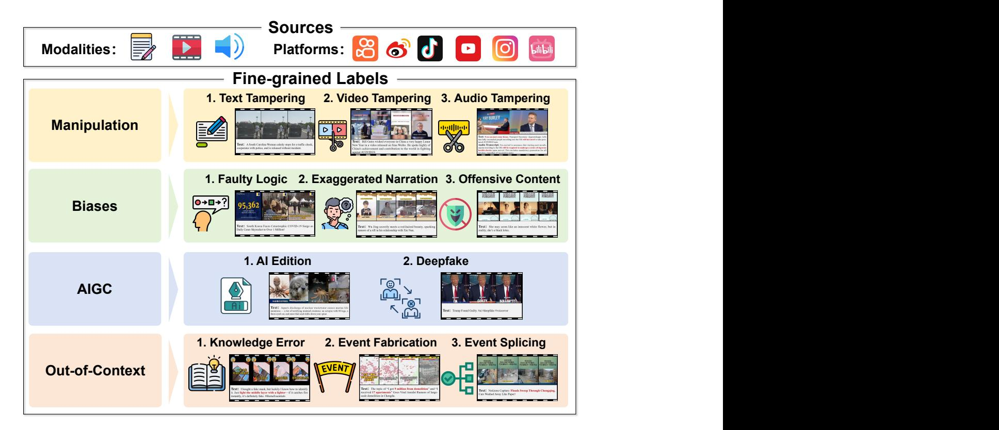
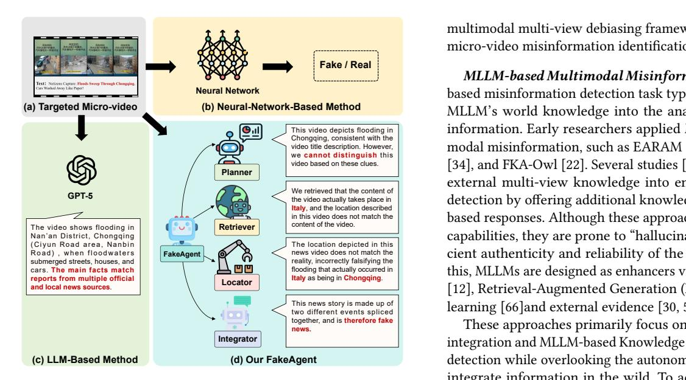
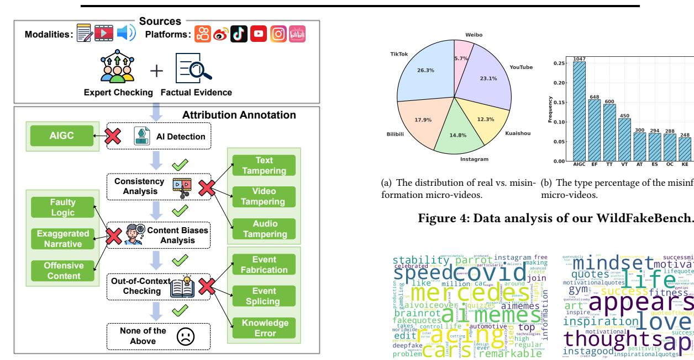
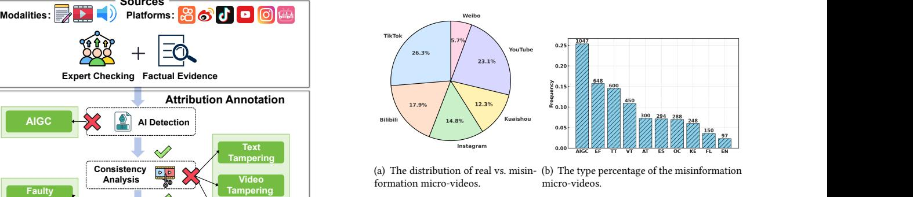
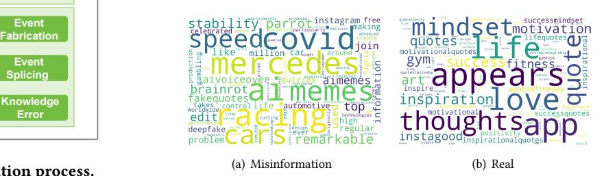
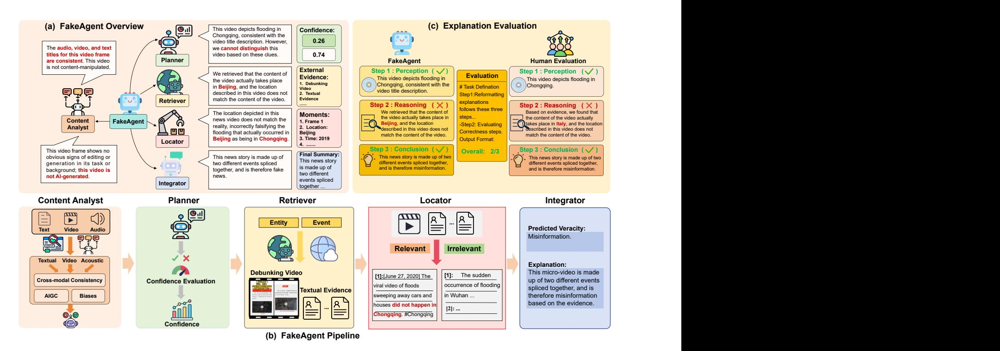
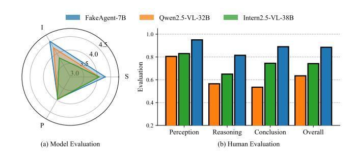

# From Manipulation to Mistrust: Explaining Diverse Micro-Video Misinformation for Robust Debunking in the Wild

Zhi Zeng∗ School of Computer Science and Technology, MOEKLINNS Lab, Xi'an Jiaotong University Xi'an, Shaanxi, China zhizeng@stu.xjtu.edu.cn

Yifei Yang∗ School of Computer Science and Technology, MOEKLINNS Lab, Xi'an Jiaotong University Xi'an, Shaanxi, China yangyf001@stu.xjtu.edu.cn

Jiaying Wu† National University of Singapore Singapore jiayingw@nus.edu.sg

Xulang Zhang Nanyang Technological University Singapore xulang.zhang@ntu.edu.sg

Xiangzheng Kong Xi'an Jiaotong University Xi'an, Shaanxi, China kxz1582366422@stu.xjtu.edu.cn

Herun Wan Xi'an Jiaotong University Xi'an, Shaanxi, China wanherun@stu.xjtu.edu.cn

Zihan Ma Xi'an Jiaotong University Xi'an, Shaanxi, China mazihan880@stu.xjtu.edu.cn

Minnan Luo† Xi'an Jiaotong University Xi'an, Shaanxi, China minnluo@xjtu.edu.cn

## Abstract

The rise of micro-videos has reshaped how misinformation spreads, amplifying its speed, reach, and impact on public trust. Existing benchmarks typically focus on a single deception type, overlooking the diversity of real-world cases that involve multimodal manipulation, AI-generated content, cognitive bias, and out-of-context reuse. Meanwhile, most detection models lack fine-grained attribution, limiting interpretability and practical utility. To address these gaps, we introduce WildFakeBench, a large-scale benchmark of over 10,000 real-world micro-videos covering diverse misinformation types and sources, each annotated with expert-defined attribution labels. Building on this foundation, we develop FakeAgent, a Delphi-inspired multi-agent reasoning framework that integrates multimodal understanding with external evidence for attributiongrounded analysis. FakeAgent jointly analyzes content and retrieved evidence to identify manipulation, recognize cognitive and AI-generated patterns, and detect out-of-context misinformation. Extensive experiments show that FakeAgent consistently outperforms existing MLLMs across all misinformation types, while Wild-FakeBench provides a realistic and challenging testbed for advancing explainable micro-video misinformation detection.[1](#page-0-0)

#### CCS Concepts

• Information systems → Multimedia information systems; Social networks.

#### Keywords

Micro-video, Explain, Misinformation Detection

#### ACM Reference Format:

Zhi Zeng, Yifei Yang, Jiaying Wu, Xulang Zhang, Xiangzheng Kong, Herun Wan, Zihan Ma, and Minnan Luo. 2018. From Manipulation to Mistrust: Explaining Diverse Micro-Video Misinformation for Robust Debunking in the Wild. In Proceedings of Make sure to enter the correct conference title from your rights confirmation email (Conference acronym 'XX). ACM, New York, NY, USA, [12](#page-11-0) pages.<https://doi.org/XXXXXXX.XXXXXXX>

## 1 Introduction

Micro-videos have redefined how misinformation spreads online, becoming a major medium for news consumption and public discourse [\[44\]](#page-9-0). While these platforms enable open participation, they also accelerate the circulation of deceptive content, posing new challenges to public trust in the information ecosystem. Compared with text-based misinformation [\[68\]](#page-9-1), deceptive micro-videos involve diverse and intertwined forms of deception, including multimodal manipulation [\[21,](#page-8-0) [52\]](#page-9-2), AI-generated content [\[2,](#page-8-1) [10,](#page-8-2) [23\]](#page-8-3), cognitive bias exploitation [\[4,](#page-8-4) [50\]](#page-9-3), and out-of-context reuse of authentic footage [\[11,](#page-8-5) [26,](#page-8-6) [58\]](#page-9-4). Advanced creators exploit these variations to mislead viewers without leaving obvious inconsistencies.

Despite steady progress in multimodal misinformation detection [\[3,](#page-8-7) [7,](#page-8-8) [25,](#page-8-9) [33,](#page-8-10) [37,](#page-8-11) [41,](#page-9-5) [42,](#page-9-6) [63,](#page-9-7) [71\]](#page-9-8), two major gaps remain. First, existing benchmarks are confined to specific deception types, such as AIGC or visual manipulation, and therefore fail to capture the complex and hybrid nature of real-world misinformation. Second, emerging reasoning-based methods, particularly those using multimodal large language models (MLLMs) [\[12,](#page-8-12) [30,](#page-8-13) [43,](#page-9-9) [58\]](#page-9-4), can generate natural-language explanations but often hallucinate

∗Equal Contribution

†Corresponding authors.

1Data and code are available at: [https://github.com/Aiyistan/FakeAgent.](https://github.com/Aiyistan/FakeAgent)

Permission to make digital or hard copies of all or part of this work for personal or classroom use is granted without fee provided that copies are not made or distributed for profit or commercial advantage and that copies bear this notice and the full citation on the first page. Copyrights for components of this work owned by others than the author(s) must be honored. Abstracting with credit is permitted. To copy otherwise, or republish, to post on servers or to redistribute to lists, requires prior specific permission and/or a fee. Request permissions from permissions@acm.org.

Conference acronym 'XX, Woodstock, NY © 2018 Copyright held by the owner/author(s). Publication rights licensed to ACM. ACM ISBN 978-1-4503-XXXX-X/2018/06 <https://doi.org/XXXXXXX.XXXXXXX>

Figure 1: WildFakeBench at a glance: over 10,000 real-world micro-videos capturing diverse forms of misinformation.

and lack verifiable attribution to external evidence, limiting their reliability for fact-checkers and practitioners.

To bridge these data and reasoning gaps, we present two complementary contributions that together advance reliable, evidencebased detection of real-world micro-video misinformation. We first introduce WildFakeBench, a large-scale benchmark of over 10,000 real-world micro-videos that capture diverse and intertwined deceptive strategies. It provides a unified testbed for analyzing both perceptual and reasoning aspects of misinformation across manipulation, cognitive bias, AI generation, and contextual distortion. On top of this resource, we further develop FakeAgent, a multi-agent reasoning framework that detects and explains misinformation through attribution-grounded analysis. By jointly examining multimodal content and external evidence, it generates transparent reasoning chains that enhance both interpretability and reliability. Together, these contributions establish a unified foundation for studying and mitigating misinformation in the wild.

As illustrated in Figure [1,](#page-1-0) WildFakeBench organizes deceptive strategies into four categories: (1) Manipulation, involving altered visual, textual, or audio elements that distort perception [\[52\]](#page-9-2); (2) Cognitive Biases, exploiting logical or psychological cues that mislead interpretation [\[4,](#page-8-4) [47,](#page-9-10) [50,](#page-9-3) [64,](#page-9-11) [65,](#page-9-12) [67\]](#page-9-13); (3) AIGC, synthetic or edited content generated by AI tools to amplify influence or fear [\[2,](#page-8-1) [38\]](#page-8-14); and (4) Out-of-Context, authentic footage misrepresented through spliced or misleading narratives [\[61\]](#page-9-14). It aggregates content from six major social platforms and provides expert-annotated, fine-grained veracity categories, supporting systematic evaluation of both perceptual and reasoning-based detection models.

Building on this foundation, FakeAgent uses a Delphi-inspired multi-agent design [\[56\]](#page-9-15) to produce transparent and evidencegrounded reasoning chains. Instead of opaque binary predictions, FakeAgent jointly analyzes multimodal content and open-world knowledge to (1) detect manipulations across modalities, (2) distinguish cognitive-bias and AI-generated semantics, and (3) retrieve and attribute supporting evidence for out-of-context misinformation. By integrating multi-view knowledge reasoning with explicit attribution, FakeAgent improves both the accuracy and interpretability of misinformation detection, paving the way for more transparent and reliable multimodal reasoning frameworks.

# 2 Related Work

# 2.1 Benchmarks

With the advancement of social media [\[17–](#page-8-15)[19,](#page-8-16) [27\]](#page-8-17), several benchmarks have been proposed to advance research in micro-video misinformation detection, as summarized in Table [1.](#page-3-0) FVC [\[32\]](#page-8-18) was the first large-scale micro-video misinformation dataset, collecting textual titles and videos from different platforms like YouTube and Twitter. Several researchers [\[13,](#page-8-19) [31\]](#page-8-20) extended this effort by extracting misinformation micro-videos from Facebook and Twitter. Additionally, Serrano et al. [\[36\]](#page-8-21) and Shang et al. [\[37\]](#page-8-11) focused on Covid-19, creating English-language datasets on TikTok. Different from these single-domain datasets, Bu et al. [\[3\]](#page-8-7) designed FakeTT, a

This video depicts flooding in Chongqing, consistent with the video title description. However, we **cannot distinguish** this video based on these clues. We retrieved that the content of the video actually takes place in **Italy**, and the location described in this video does not match the content of the video. The location depicted in this news video does not match the reality, incorrectly falsifying the flooding that actually occurred in **Italy** as being in **Chongqing**. This news story is made up of **Fake / Real Neural Network (a) Targeted Micro-video (b) Neural-Network-Based Method** MLLM-based Multimodal Misinformation Detection. MLLMbased misinformation detection task typically aims to incorporate MLLM's world knowledge into the analysis of multimodal misinformation. Early researchers applied MLLMs to identify multimodal misinformation, such as EARAM [\[69\]](#page-9-17), MMDIR [\[51\]](#page-9-18), Sniffer [\[34\]](#page-8-24), and FKA-Owl [\[22\]](#page-8-25). Several studies [\[23,](#page-8-3) [39,](#page-8-26) [46,](#page-9-19) [48\]](#page-9-20) incorporate external multi-view knowledge into enhancing misinformation detection by offering additional knowledge insights through rolebased responses. Although these approaches offer some reasoning capabilities, they are prone to "hallucinations", leading to insufficient authenticity and reliability of the explanations. To address this, MLLMs are designed as enhancers via Chain-of-Thought (Cot) [\[12\]](#page-8-12), Retrieval-Augmented Generation (RAG) [\[60\]](#page-9-21), reinforcement learning [\[66\]](#page-9-22)and external evidence [\[30,](#page-8-13) [58\]](#page-9-4) to enhance reliability.

two different events spliced together, and is **therefore fake** These approaches primarily focus on multimodal information integration and MLLM-based Knowledge enhanced misinformation detection while overlooking the autonomous ability to explore and integrate information in the wild. To address these, we propose the FakeAgent approach that a multi-agent framework that integrates cross-modal knowledge with the autonomous exploration and integration of real-world external evidence for more reliable and comprehensive detection.

Figure 2: Comparison of our proposed FakeAgent, neuralnetwork-based and LLM-based methods.

TikTok dataset spanning multiple domains, enhancing misinformation detection across contexts. To address the lack of non-English resources, Qi et al. [\[33\]](#page-8-10) built the largest Chinese short misinformation micro-video dataset, incorporating multimodal information to support multimodal misinformation detection.

With the advancements in MLLMs, recent benchmarks [\[2,](#page-8-1) [58\]](#page-9-4) introduce AI-generated or AI-editing content to reflect the diversity of real-world situations. However, these datasets cannot fully capture the diversity of misinformation in the wild, overlooking real-world out-of-context misinformation [\[11,](#page-8-5) [26\]](#page-8-6) that extends beyond the original knowledge boundaries of humans or detection models, which may lead to irreparable consequences.

To construct a comprehensive benchmark capturing the diversity of misinformation in the wild, we propose WildFakeBench, a multi-source misinformation micro-video attribution benchmark, WildFakeBench, which enables more comprehensive and challenging evaluation.

#### 2.2 Methods

Micro-video Misinformation Detection. Early researchers [\[13,](#page-8-19) [36\]](#page-8-21) initially used handcrafted features from video titles and comments to identify misinformation. As deep learning advances, several studies [\[7,](#page-8-8) [20,](#page-8-22) [37,](#page-8-11) [55,](#page-9-16) [71\]](#page-9-8), used neural network methods for automatic feature extraction. While multimodal approaches have further enriched this field, SV-FEND [\[33\]](#page-8-10), a Transformer-based model, was proposed to integrate multimodal knowledge for misinformation detection. Similarly, TwtrDetective [\[21\]](#page-8-0) incorporated cross-media consistency. Moreover, NEED [\[35\]](#page-8-23) employed graph attention networks to incorporate event-related and debunking knowledge, enhancing contextual awareness. FakingRecipe [\[3\]](#page-8-7) explored material preferences and editing processes to identify distinctive misinformation patterns. Additionally, Zeng et al. [\[61\]](#page-9-14) proposed

multimodal multi-view debiasing framework for mitigating bias in micro-video misinformation identification.

# 3 WildFakeBench Curation

We introduce WildFakeBench, the first large-scale benchmark designed to support explainable micro-video misinformation detection across diverse social platforms.[2](#page-2-0)

### 3.1 Data Collection and Filtering

To ensure the credibility of annotations and consistency with verified sources, we curated micro-videos referencing fact-checked events from PolitiFact and the China Internet Joint Rumor-Refuting Platform, two nationally recognized authorities in misinformation verification. The dataset encompasses six major platforms: Weibo, Douyin, Kuaishou, YouTube, Instagram, and Bilibili, covering a period from 2017 to 2025.

We retained only micro-videos containing verifiable claims to ensure relevance and factual grounding. To reduce redundancy and prevent risks of data leakage, rigorous textual similarity filtering was applied to eliminate near-duplicate content while preserving topic diversity.

## 3.2 Data Annotation

Unlike prior benchmarks that rely solely on binary veracity labels [\[3,](#page-8-7) [33\]](#page-8-10) or use synthetic content [\[23,](#page-8-3) [58\]](#page-9-4), WildFakeBench adopts a fine-grained, multi-dimensional annotation framework grounded in factual evidence (Figure [3\)](#page-3-1). In addition to binary Real/Fake labels, each sample receives a fine-grained attribution label describing the mechanism of deception.

Our annotation follows a four-stage reasoning process, with 10 subtypes capturing distinct deceptive strategies:

2The ethical statement for data collection and annotation is provided in Appendix [A.](#page-9-23)

Table 1: Comparison of micro-video misinformation benchmarks. WildFakeBench spans the longest period, includes the most videos, and covers the most diverse deception types and sources. Source platforms: YT (YouTube), TW (Twitter), FB (Facebook), TT (TikTok), BB (Bilibili), WB (Weibo), DY (Douyin), IS (Instagram), KS (Kuaishou).

| Datasets      |        |           |           |        | Time Span | #Post                 |        |      |                |
|---------------|--------|-----------|-----------|--------|-----------|-----------------------|--------|------|----------------|
|               |        |           |           |        |           | (Misinformation/Real) | #Video | Type | In Wild Source |
| FVC           | [32]   |           |           |        | -2018     | 2,916/2,090           | 5,006  | 1    | √              |
| (Palod        | et     | al.       | 2019)     | [31]   | 2013-2016 | 123/423               | 546    | 1    | √              |
| (Hou          | et     | al. 2019) |           | [13]   | -2019     | 118/132               | 250    | 1    | √              |
| (Serrano      |        | et        | al. 2020) | [36]   | -2020     | 113/67                | 180    | 1    | √              |
| (Choi         | and    | Ko        | 2021)     | [7]    | -2021     | 902/903               | 1,805  | 1    | √              |
| (Shang        | et     | al.       | 2021)     | [37]   | -2020     | 226/665               | 891    | 1    | √              |
| (Li           | et al. | 2022)     | [20]      |        | 2014-2015 | 210/490               | 700    | 1    | √              |
| FakeSV        | [33]   |           |           |        | 2017-2022 | 1,827/1,827           | 3,654  | 1    | √              |
| FakeTT        | [3]    |           |           |        | 2019-2024 | 1,172/819             | 1,991  | 1    | √              |
| MMFakeBench   |        |           | [23]      |        |           | 3,300/7,700           | 0      | 3    | × Synthetic    |
| MDAM          | 3      |           |           |        |           |                       |        |      |                |
|               |        | [58]      |           |        |           | 90,000/0              | 90,000 | 4    | × Synthetic    |
| WildFakeBench |        |           |           | (Ours) | 2017-2025 | 4,122/5,985           | 10,107 | 10   | √ WB/DY/KS     |

**Audio** Figure 4: Data analysis of our WildFakeBench.

Figure 3: Overview of the data annotation process.

- Stage 1: AI-Generated Content (AIGC). Identify whether the micro-video is (1) AIGC, such as content synthesized or heavily edited using generative AI tools to simulate real-world events or evoke emotional reactions.
- Stage 2: Multimodal Manipulation. Detect inconsistencies or falsifications across modalities: (2) Text Tampering (TT) modifies captions, titles, or on-screen text to misrepresent the visual or factual content. (3) Video Tampering (VT) alters or splices video segments to visually distort the original narrative.
  - (4) Audio Tampering (AT) manipulates voiceovers, background sounds, or overlays to fabricate claims or emotional cues.

Figure 5: Domain-specific word clouds in WildFakeBench.

- Stage 3: Cognitive Biases. Capture psychological or rhetorical strategies used to influence perception: (5) Faulty Logic (FL) introduces misleading causal or correlational reasoning, such as false analogies or post hoc conclusions. (6) Exaggerated Narration (EN) employs overstated or sensational language to heighten engagement. (7) Offensive Content (OC) leverages implicit hate speech or personal attacks to evoke moral outrage.
- Stage 4: Out-of-Context Manipulation. Identify cases where authentic material or partial truths are used deceptively: (8) Knowledge Error (KE) misinterprets legitimate information,

Figure 6: Overview of our proposed FakeAgent framework.

often framed with pseudo-scientific or misleading narratives. (9) Event Fabrication (EF) invents events without factual basis, often supported by fabricated visuals or commentary. (10) Event Splicing (ES) combines unrelated real-world clips or scenes to construct a false narrative.

Representative examples with corresponding debunking evidence are provided in Figure [1.](#page-1-0) Approximately 1.3% of micro-videos that could not be confidently categorized were excluded. Each sample was independently annotated by at least three experts, and final labels were determined through unanimous consensus. The annotation experts included twelve individuals with academic or master's degrees in computer science and social science.

#### 3.3 Data Analysis

Figure [4](#page-3-2) presents the distribution of misinformation sources and fine-grained attribution categories in WildFakeBench, highlighting its broad coverage across deception types, modalities, and platforms. The multi-level annotation framework and platform diversity enable comprehensive study of how misinformation manifests across global short-form video ecosystems. Additionally, different micro-video types exhibit distinct topical and linguistic characteristics. To further illustrate the linguistic patterns across micro-video categories, we generate word clouds depicting the most frequent vocabulary within each type (Figure [5\)](#page-3-3).

# 4 Problem Definition

Given a micro-video dataset D = {(���� , ���� , ���� )}�� ��=1 with three modalities: text, video, and audio, each micro-video is represented as

���� = (�� �� , ���� �� , ���� �� ). Each micro-video is assigned an attribution type label �� ∈ {type1 , . . . , type�� }, where �� is the number of attribution types. Each micro-video is also assigned a veracity label �� �� �� ∈ {0, 1}, where �� �� �� = 0 indicates that the micro-video is real, and �� �� �� = 1 indicates that it is misinformation.

Task 1 (Multi-source micro-video misinformation detection). Given D = {(���� , ���� �� , ���� �� )}�� ��=1 , the task of multi-source microvideo misinformation detection aims to identify whether a microvideo ���� is misinformation (�� �� �� = 1) or real (�� �� �� = 0).

Task 2 (Multi-source micro-video misinformation explanation). Given D = {(���� , ���� , ���� )}�� ��=1 , the task of multi-source microvideo misinformation explanation aims to generate an explanation ���� for the detection of micro-video ���� , which evaluates and interprets the reasoning process leading to the veracity prediction.

#### 5 Methodology

As illustrated in Figure [6,](#page-4-0) FakeAgent simulates the collective intelligence of multiple reasoning agents that collaboratively perceive micro-video content, retrieve external evidence, and evaluate veracity. By combining perception and reasoning, it jointly analyzes multimodal content to detect both direct manipulation and subtle cognitive bias. The system further integrates adaptive evidence retrieval from authoritative sources with internal reasoning, producing interpretable and evidence-grounded misinformation detection.

#### 5.1 Multimodal Content Understanding

Large language models (LLMs) have demonstrated strong analytical capabilities for misinformation detection [\[29,](#page-8-27) [45,](#page-9-24) [54\]](#page-9-25). However, micro-videos frequently employ multiple deceptive strategies, such as multimodal manipulation [\[4,](#page-8-4) [28,](#page-8-28) [52\]](#page-9-2) and implicit semantic deception [\[15,](#page-8-29) [50\]](#page-9-3), which challenge purely text-based or single-modality detection. To address these challenges, FakeAgent introduces a content analysis agent that applies Chain-of-Thought (CoT) reasoning [\[53\]](#page-9-26) across three levels: (1) identifying AI-generated content (AIGC), (2) analyzing multimodal content consistency, and (3) modeling deeper cognitive biases. This design enables the generation of diverse veracity-related rationales R = {���� } �� .

��=1 Each rationale ���� is produced through structured multi-turn interactions. The MLLM first analyzes the micro-video from a designated perspective, such as "evaluate the consistency between text and visuals", yielding an intermediate rationale ���� . The content analysis agent then synthesizes these rationales into an internal veracity conclusion C.

To encourage reasoning diversity, we design three representative prompt templates. At the AIGC level, prompts guide the model to identify possible AI-generated artifacts [\[10\]](#page-8-2). At the content consistency level, prompts direct the model to assess alignment among textual, visual, and acoustic modalities. At the cognitive bias level, prompts elicit reasoning about logical coherence and offensive framing following prior studies [\[4\]](#page-8-4). Detailed templates are included in Appendix [B.](#page-9-27) These representative prompts highlight FakeAgent's adaptability and reasoning diversity and can be easily extended to other domains.

#### 5.2 External Evidence Reasoning

While MLLMs exhibit strong internal reasoning abilities, they often struggle to identify out-of-context misinformation without access to external evidence [\[58,](#page-9-4) [62\]](#page-9-28). To address this, FakeAgent introduces an adaptive evidence reasoning module that dynamically determines when and how to retrieve external information.

The process begins with a planner agent that estimates confidence in its internal reasoning based on the rationale set R [\[49\]](#page-9-29). If the confidence score is insufficient for reliable prediction, the planner activates a retriever agent to acquire external evidence.

Given the title or key text of a micro-video �� , the retriever constructs a query and gathers supporting information from authoritative media sources and verified repositories such as Wikipedia. The retrieved evidence corpus is defined as: (Eq.1)

E = retriever(�� �� , ���� ), (1)

where E represents the retrieved evidence and ���� denotes the top-�� ranked results from trusted domains.

To ensure semantic alignment between evidence and micro-video content, a locator agent further filters and localizes the most relevant information:

F = locator(�� , E). (2)

Here, F contains the filtered and context-aligned evidence segments that directly support veracity assessment.

This multi-agent collaboration allows FakeAgent to adaptively integrate internal reasoning with external validation. The detailed prompt templates for planner, retriever, and locator agents are provided in Appendix [B.](#page-9-27)

#### 5.3 Multi-view Evidence Integration

Given the internal conclusion C and the filtered external evidence F, FakeAgent integrates both into a unified evidence set:

E������ = {C, F }, (3)

where E������ combines internal reasoning with retrieved evidence, providing complementary views for misinformation detection across modalities. An integrator agent then synthesizes this aggregated evidence to produce the final decision:

C = integrator(E������), (4)

where C = {��, �� ˆ } includes the predicted veracity ��ˆ and its corresponding explanation ��.

#### 6 Experiments

In this section, we conduct extensive experiments to answer the following research questions:

- RQ1 ([§6.2\)](#page-6-0): Does FakeAgent improve micro-video misinformation detection?
- RQ2 ([§6.3\)](#page-6-1): How effective are FakeAgent's components?
- RQ3 ([§6.4\)](#page-7-0): Can FakeAgent generate high-quality explanation?
- RQ4 ([§6.5\)](#page-7-1): What insights arise from FakeAgent's case studies?

#### 6.1 Experimental Settings

6.1.1 Baselines. To evaluate both detection performance and explainability across diverse sources and misinformation types, we benchmark representative MLLMs. These include InternVL-2.5 [\[5\]](#page-8-30), Qwen2.5-VL [\[1\]](#page-8-31), Qwen2-Audio [\[8\]](#page-8-32), Qwen2.5-Omni [\[57\]](#page-9-30), VideoL-LaMA2 [\[6\]](#page-8-33), Gemma3 [\[40\]](#page-9-31), InternVL3 [\[70\]](#page-9-32), LLaVA-OneVision [\[16\]](#page-8-34), and GPT-4o [\[14\]](#page-8-35). In addition, we implement enhanced inference variants based on the Video-of-Thought (VoT) paradigm [\[9\]](#page-8-36), which augments temporal reasoning for video-based misinformation detection.

6.1.2 Evaluation Metrics. In the era of MLLMs, micro-video misinformation detection requires assessing both classification accuracy and the reliability of model explanations. To further evaluate performance across different misinformation categories, we also report Micro-Accuracy for each deception type (Table [2\)](#page-6-2).

6.1.3 Implementation Details. To enable the fair evaluation, we set the sampling hyperparameter of the off-the-shelf MLLMs, "do\_sample = False" or "Temperature = 0", to guarantee consistency in the prediction outputs. Additionally, we adopt the default setting of other hyperparameters such as "max\_new\_tokens = 512". For each micro-video, we uniformly sample 8 frames. For our FakeAgent, we utilize Qwen3 [\[59\]](#page-9-33) as the LLM backbone, equipped with video and audio captioning capabilities [\[8,](#page-8-32) [70\]](#page-9-32) to support comprehensive multimodal understanding. In the retriever agent, we set "Top-K = 5". All experiments are conducted on four NVIDIA RTX 5880 Ada GPUs, each equipped with 48 GB of memory.

Table 2: Main results (%). Performance of all models on the primary evaluation metric, Micro-Acc. Misinformation types are abbreviated: TT (Text Tampering), VT (Video Tampering), AT (Audio Tampering), FL (Faulty Logic), EN (Exaggerated Narration), OC (Offensive Content), KE (Knowledge Error), EF (Event Fabrication), ES (Event Splicing), and AIGC (AI-Generated Content).

| Qwen2-Audio-7B (Direct)     | A √ Modality V | T √ Content TT | Manipulation Semantic VT AT FL EN Smaller-Parameter MLLMs | Biases OC | KE    | Out-of-Context EF | ES    | AIGC AIGC | Mean  |
|-----------------------------|----------------|----------------|-----------------------------------------------------------|-----------|-------|-------------------|-------|-----------|-------|
|                             | ×              | 41.02          | 39.20 34.33 70.42 43.30                                   | 22.92     | 35.48 | 40.28             | 43.88 | 21.39     | 49.29 |
| InternVL-3-8B (Direct)      | ×              |                |                                                           |           |       |                   |       |           |       |
|                             | √              | √ 14.83        | 1.78 6.67 29.33 28.87                                     | 24.65     | 24.19 | 19.14             | 11.22 | 36.87     | 19.76 |
| InternVL-2.5-8B (Direct)    | ×              |                |                                                           |           |       |                   |       |           |       |
|                             | √              | √ 14.33        | 12.00 13.33 13.33 65.94                                   | 81.94     | 64.92 | 72.53             | 74.15 | 91.98     | 50.45 |
| Qwen2.5-VL-7B (Direct)      | ×              |                |                                                           |           |       |                   |       |           |       |
|                             | √              | √ 34.33        | 9.78 13.33 33.33 70.10                                    | 60.62     | 65.73 | 62.65             | 52.38 | 95.51     | 49.78 |
| LLaVA-OneVision-7B (Direct) | ×              |                |                                                           |           |       |                   |       |           |       |
|                             | √              | √ 22.50        | 14.00 22.00 35.33 38.14                                   | 28.22     | 25.00 | 25.62             | 30.27 | 25.69     | 26.68 |
| Qwen2.5-Omni-7B (Direct)    | √ √            | √ 25.33        | 24.22 27.66 33.33 26.80                                   | 22.92     | 39.52 | 26.70             | 21.09 | 47.76     | 29.53 |
|                             |                |                | Larger-Parameter MLLMs                                    |           |       |                   |       |           |       |
| Gemma3-12B (Direct)         | ×              |                |                                                           |           |       |                   |       |           |       |
|                             | √              | √ 28.67        | 9.56 49.11 34.67 57.73                                    | 49.31     | 61.69 | 54.01             | 41.50 | 72.97     | 45.92 |
| InternVL-2.5-38B (Direct)   | ×              |                |                                                           |           |       |                   |       |           |       |
|                             | √              | √ 48.83        | 11.56 15.33 56.00 60.82                                   | 72.92     | 65.32 | 61.88             | 58.16 | 85.58     | 54.71 |
| Qwen2.5-VL-32B (Direct)     | ×              |                |                                                           |           |       |                   |       |           |       |
|                             | √              | √ 53.83        | 12.89 57.67 78.67 57.73                                   | 57.99     | 55.24 | 45.99             | 43.20 | 90.83     | 55.50 |
|                             |                |                | MLLMs with VoT-based Prompt                               |           |       |                   |       |           |       |
| VideoLLaMA2-7B (VoT)        | √ √            | √ 29.50        | 20.89 23.33 43.33 58.76                                   | 53.47     | 53.56 | 50.31             | 45.58 | 45.85     | 42.46 |
| InternVL-2.5-38B (VoT)      | ×              |                |                                                           |           |       |                   |       |           |       |
|                             | √              | √ 66.67        | 17.33 29.67 72.00 72.23                                   | 81.25     | 67.74 | 60.49             | 50.68 | 81.85     | 59.99 |
| Qwen2.5-VL-32B (VoT)        | ×              |                |                                                           |           |       |                   |       |           |       |
|                             | √              | √ 49.33        | 45.45 25.67 69.33 73.20                                   | 59.72     | 68.55 | 57.25             | 48.64 | 55.87     | 55.30 |
|                             |                |                | Closed-source MLLM                                        |           |       |                   |       |           |       |
| GPT-4o (Direct)             | ×              |                |                                                           |           |       |                   |       |           |       |
|                             | √              | √ 58.50        | 16.22 32.67 79.33 84.54                                   | 69.44     | 77.02 | 72.53             | 66.67 | 94.46     | 65.14 |
|                             |                |                | Our Proposed Approach                                     |           |       |                   |       |           |       |
| FakeAgent-7B                | √ √            | √ 67.67        | 45.78 81.00 70.00 68.04                                   | 63.19     | 81.05 | 61.57             | 54.76 | 93.22     | 68.63 |

Table 3: Ablation results (%). Macro-level performance of different model variants on WildFakeBench.

|              | Model | Acc   | F1    | Macro-P | Macro-R |
|--------------|-------|-------|-------|---------|---------|
| w/o          | Text  | 61.34 | 54.74 | 58.16   | 55.86   |
| w/o          | Video | 61.15 | 54.49 | 57.86   | 55.65   |
| w/o          | Audio | 59.62 | 53.92 | 56.01   | 54.71   |
| w/o          | CKR   | 60.49 | 52.29 | 56.36   | 54.16   |
| w/o          | EER   | 63.49 | 61.19 | 59.87   | 59.89   |
| FakeAgent-7B |       | 67.98 | 65.42 | 66.39   | 65.68   |

#### 6.2 Main Results

- Micro Performance. Although existing MLLMs perform well in identifying AIGC, they face significant difficulty in detecting misinformation involving content manipulation, semantic bias, and out-of-context deception (Table [2\)](#page-6-2). With Video-of-Thought, MLLMs improve on most categories but show degraded performance on AIGC due to over-reasoning. FakeAgent achieves higher accuracy across most categories, validating the effectiveness of its multi-agent collaboration in refining and integrating multimodal knowledge with external evidence.
- Overall Conclusion. Although our FakeAgent does not achieve the best performance in all subcategories, it attains the overall best results across all ten fine-grained categories, even surpassing GPT-4o. Moreover, FakeAgent contains fewer parameters than GPT-4o, Qwen2.5-VL-32B, and InternVL-2.5-38B, achieving an optimal balance between efficiency and performance.

Figure 7: Evaluation of model explanation quality using both automatic and human assessments.

#### 6.3 Ablation Study

To examine the contribution of different modalities, we construct seven internal variants of FakeAgent by removing textual, acoustic, or visual inputs. The results in Table [3](#page-6-3) reveal that removing any modality leads to a clear performance drop, indicating that FakeAgent fully leverages multimodal information for effective micro-video misinformation detection.

We further evaluate the impact of each functional component through two ablation settings: w/o CKR (without cross-modal knowledge refining) and w/o EER (without external evidence retrieval). As shown in Table [3,](#page-6-3) the complete FakeAgent consistently outperforms both variants, confirming that cross-modal knowledge refinement and external evidence retrieval jointly contribute to reliable detection and interpretable explanations.

**Title:Trump supporters celebrate as Harris backs out of speech**

The video frames show a

news report on election night reactions. They depict a crowd with disappointment or anticipation, a campaign co- chair at a podium, and Trump supporters celebrating. A screen shows results shifting toward Trump, matching the stock market reaction. PBS branding and structured reporting suggest a legitimate broadcast **without signs of AI-generated content**.

The video shows inconsistencies and errors. The overlay claims the Harri s campaig n t u r n e d o f f projections, but the scene shows

Trump supporters celebrating. C e d r i c R i c h m on d , H a r r i s campaign co-chair, speaks at a podium with flags, while the crowd celebrates a Trump victory—an inconsistency. The video also shows a stock market surge, unrelated to election night. **These issues suggest the video may**

**be fabricated, leading to a low**

**veracity score**.

The video contains logical **inconsistencies and factual conflicts**: the Times Square celebration doesnot match audio of Florida; Cedric Richmond's speech as finance chair contradicts the caption "Harris withdrawal speech"; the Georgia projection data (55.6%) does not align with results. AI detection found no synthetic editing,but fact-checking shows core claims lack evidence and timeline links are questionable. External evidence shows the Harris team did not shut down projections, and Richmond's role was unrelated. **Overall, the video shows factual distortion or**

**manipulative editing**. **Qwen2.5-VL-32B InternVL-2.5-38B FakeAgent-7B**

(a) Video Tampering Case

**Title:Nongrendao Quantum Biotechnology**

The video depicts a realistic s c e n e o f a g r ic u l tu r a l inspection and discussion about crop yield and quality. The setting, activities, and dialogue **are consistent**

**wit h t y p i c a l f a r m in g**

**practices**, and there are no signs of factual errors, A I G C g e n e r a t i o n , o r

offensive content. The video appears to be a genuine

depiction of agricultural activities, specifically rice inspection in a field.T h e i n d i v i d u a l s a r e s h o w n examining rice plants, discussing y i e l d a n d q u a l i t y, a n d t h e environment **is consistent with a rural setting**. There are no obvious signs of AIGC generation or multimodalinconsistency. The content is factual and relevant to the title, which suggests a focuson

agricultural technology or practices. Fa c t- c h e c k i n g s h o w s th a t " q u a n tum

biotechnology" **in agriculture has no scientific basis, and the reported yield gains are typicalexamples of exaggerated marketing.** Consistency analysis finds a serious mismatch between the title and content, as well as pronunciation errors,misleading terminology, and an irrelevant Huawei watermark. Although AI detection did not find synthetic traces, the authenticity of the content cannot be verified. Multiple lines of evidence indicate that the video exhibits clear characteristics of false advertising and **lacks**

**credible technical support or factual basis**. **Qwen2.5-VL-32B InternVL-2.5-38B FakeAgent-7B**

(b) Knowledge Error Case

Figure 8: Qualitative examples illustrating how FakeAgent detects and explains different types of micro-video misinformation.

## 6.4 Explanation Quality Analysis

6.4.1 Multi-view Evaluation. We assess the explanatory quality of Qwen2.5-VL-32B (VoT), InternVL2.5-38B (VoT), and our FakeAgent. Following prior work [\[52\]](#page-9-2), we adopt G-Eval [\[24\]](#page-8-37), a reference-free, LLM-based evaluation framework that measures explanation quality across multiple dimensions. Each explanation is rated by GPT-4o [\[14\]](#page-8-35) on three human-aligned dimensions: (1) Persuasiveness (P), (2) Informativeness (I), and (3) Soundness (S), using a five-point Likert scale (1 = lowest, 5 = highest).

As shown in Figure [7\(](#page-6-4)a), FakeAgent consistently surpasses larger MLLMs in both informativeness and soundness, confirming its ability to produce explanations that are more factual, detailed, and logically coherent.

6.4.2 Human Evaluation. To further examine fine-grained explanation quality, we conduct a human evaluation of Qwen2.5-VL-32B, InternVL2.5-38B, and FakeAgent across three perspectives: (1) Perception, which measures the accuracy of describing video content; (2) Reasoning, which evaluates the correctness of attribution and logical inference; and (3) Conclusion, which assesses the accuracy of determining whether a micro-video constitutes misinformation.

We apply stratified sampling across the ten misinformation subcategories, selecting 20 short videos from each while ensuring diversity. Each video is independently annotated by three human experts, and results are reported as the averaged scores. As illustrated in Figure [7\(](#page-6-4)b), FakeAgent consistently outperforms larger MLLMs across all three dimensions. This shows the effectiveness of its retriever, locator, and integrator agents in refining knowledge and grounding explanations with external evidence.

### 6.5 Case Study

To qualitatively illustrate the perception and reasoning capabilities of FakeAgent, we analyze two cases of both multimodal manipulation and out-of-context misinformation. Figure [8\(a\)](#page-7-2) shows that

FakeAgent achieves finer-grained perception of multimodal falsification, accurately identifying textual and visual inconsistencies. Figure [8\(b\)](#page-7-3) presents an out-of-context case where other MLLMs fail due to limited domain knowledge. In contrast, FakeAgent autonomously retrieves relevant scientific evidence and constructs a coherent explanation, demonstrating the value of combining multimodal understanding with external knowledge retrieval. These examples highlight the potential of WildFakeBench for advancing research on cross-modal reasoning and evidence-grounded explanation [3](#page-7-4) .

# 7 Conclusion

In this study, we highlight the importance of multi-source and multitype approaches for detecting and explaining misinformation in real-world micro-videos. To advance this goal, we introduce Wild-FakeBench, a large-scale benchmark featuring expert-annotated attributions across diverse deception forms, and FakeAgent, a multiagent reasoning framework that integrates internal content understanding with external evidence for attribution-grounded analysis. Extensive experiments show that FakeAgent achieves superior detection accuracy and delivers interpretable explanations, demonstrating strong generalization to previously unseen misinformation types. Together, these contributions provide a foundation for future research on evidence-grounded and explainable multimodal misinformation detection.

# Acknowledgments

This work is supported by the Fundamental and Interdisciplinary Disciplines Breakthrough Plan of the Ministry of Education of China (No. JYB2025XDXM101), the National Natural Science Foundation of China (No. 62272374, No. 62192781), the Natural Science Foundation of Shaanxi Province (No.2024JC-JCQN-62), the State

3The error analysis is provided in Appendix [C.](#page-11-1)

Key Laboratory of Communication Content Cognition under Grant No. A202502, the Key Research and Development Project in Shaanxi

Province (No. 2023GXLH-024), and the Ministry of Education, Singapore, under its MOE AcRF TIER 3 Grant (MOE-MOET32022-0001). The China Scholarship Council also supports this research. References [1] Shuai Bai, Keqin Chen, Xuejing Liu, Jialin Wang, Wenbin Ge, Sibo Song, Kai Dang, Peng Wang, Shijie Wang, Jun Tang, et al. 2025. Qwen2. 5-vl technical report. arXiv preprint arXiv:2502.13923 (2025). [2] Arnesh Batra, Jashn Khemani, Arush Gumber, Anushk Kumar, Arhan Jain, and Somil Gupta. 2025. SocialDF: Benchmark Dataset and Detection Model for Mitigating Harmful Deepfake Content on Social Media Platforms. In Proceedings of the 4th ACM International Workshop on Multimedia AI against Disinformation. 81–89. [3] Yuyan Bu, Qiang Sheng, Juan Cao, Peng Qi, Danding Wang, and Jintao Li. 2024. FakingRecipe: Detecting Fake News on Short Video Platforms from the Perspective of Creative Process. arXiv preprint arXiv:2407.16670 (2024). [4] Lizhi Chen, Zhong Qian, Peifeng Li, and Qiaoming Zhu. 2025. Multimodal Fake News Video Explanation: Dataset, Analysis and Evaluation. arXiv preprint arXiv:2501.08514 (2025). [5] Zhe Chen, Weiyun Wang, Yue Cao, Yangzhou Liu, Zhangwei Gao, Erfei Cui, Jinguo Zhu, Shenglong Ye, Hao Tian, Zhaoyang Liu, Lixin Gu, Xuehui Wang, Qingyun Li, Yimin Ren, Zixuan Chen, Jiapeng Luo, Jiahao Wang, Tan Jiang, Bo Wang, Conghui He, Botian Shi, Xingcheng Zhang, Han Lv, Yi Wang, Wenqi Shao, Pei Chu, Zhongying Tu, Tong He, Zhiyong Wu, Huipeng Deng, Jiaye Ge, Kai Chen, Kaipeng Zhang, Limin Wang, Min Dou, Lewei Lu, Xizhou Zhu, Tong Lu, Dahua Lin, Yu Qiao, Jifeng Dai, and Wenhai Wang. 2025. Expanding Performance Boundaries of Open-Source Multimodal Models with Model, Data, and Test-Time Scaling. arXiv[:2412.05271](https://arxiv.org/abs/2412.05271) [cs.CV]<https://arxiv.org/abs/2412.05271> [6] Zesen Cheng, Sicong Leng, Hang Zhang, Yifei Xin, Xin Li, Guanzheng Chen, Yongxin Zhu, Wenqi Zhang, Ziyang Luo, Deli Zhao, et al. 2024. Videollama 2: Advancing spatial-temporal modeling and audio understanding in video-llms. arXiv preprint arXiv:2406.07476 (2024). [7] Hyewon Choi and Youngjoong Ko. 2021. Using topic modeling and adversarial neural networks for fake news video detection. In Proceedings of the 30th ACM international conference on information & knowledge management. 2950–2954. [8] Yunfei Chu, Jin Xu, Qian Yang, Haojie Wei, Xipin Wei, Zhifang Guo, Yichong Leng, Yuanjun Lv, Jinzheng He, Junyang Lin, et al. 2024. Qwen2-audio technical report. arXiv preprint arXiv:2407.10759 (2024). [9] Hao Fei, Shengqiong Wu, Wei Ji, Hanwang Zhang, Meishan Zhang, Mong Li Lee, and Wynne Hsu. 2024. Video-of-thought: step-by-step video reasoning from perception to cognition. In Proceedings of the 41st International Conference on Machine Learning. 13109–13125. [10] Yifei Gao, Jiaqi Wang, Zhiyu Lin, and Jitao Sang. 2024. AIGCs confuse AI too: Investigating and explaining synthetic image-induced hallucinations in large vision-language models. In Proceedings of the 32nd ACM International Conference on Multimedia. 9010–9018. [11] Hao Guo, Zihan Ma, Zhi Zeng, Minnan Luo, Weixin Zeng, Jiuyang Tang, and Xiang Zhao. 2024. Each Fake News is Fake in its Own Way: An Attribution Multi-Granularity Benchmark for Multimodal Fake News Detection. arXiv preprint arXiv:2412.14686 (2024). [12] Rongpei Hong, Jian Lang, Jin Xu, Zhangtao Cheng, Ting Zhong, and Fan Zhou. 2025. Following clues, approaching the truth: Explainable micro-video rumor detection via chain-of-thought reasoning. In Proceedings of the ACM on Web Conference 2025. 4684–4698. [13] Rui Hou, Verónica Pérez-Rosas, Stacy Loeb, and Rada Mihalcea. 2019. Towards automatic detection of misinformation in online medical videos. In 2019 International conference on multimodal interaction. 235–243. [14] Aaron Hurst, Adam Lerer, Adam P Goucher, Adam Perelman, Aditya Ramesh, Aidan Clark, AJ Ostrow, Akila Welihinda, Alan Hayes, Alec Radford, et al. 2024. Gpt-4o system card. arXiv preprint arXiv:2410.21276 (2024). [15] Jian Lang, Rongpei Hong, Jin Xu, Yili Li, Xovee Xu, and Fan Zhou. 2025. Biting Off More Than You Can Detect: Retrieval-Augmented Multimodal Experts for Short Video Hate Detection. In Proceedings of the ACM on Web Conference 2025. 2763–2774. [16] Bo Li, Yuanhan Zhang, Dong Guo, Renrui Zhang, Feng Li, Hao Zhang, Kaichen Zhang, Peiyuan Zhang, Yanwei Li, Ziwei Liu, et al. 2024. Llava-onevision: Easy visual task transfer. arXiv preprint arXiv:2408.03326 (2024). [17] Xiang Li, Chaofan Fu, Zhongying Zhao, Guanjie Zheng, Chao Huang, Yanwei Yu, and Junyu Dong. 2025. Dual-channel multiplex graph neural networks for recommendation. IEEE Transactions on Knowledge and Data Engineering (2025). [18] Xiang Li, Jianpeng Qi, Haobing Liu, Yuan Cao, Guoqing Chao, Zhongying Zhao, Junyu Dong, Xinwang Liu, and Yanwei Yu. 2025. ScaleGNN: Towards Scalable Graph Neural Networks via Adaptive High-order Neighboring Feature Fusion. arXiv preprint arXiv:2504.15920 (2025). [19] Xiang Li, Jianpeng Qi, Zhongying Zhao, Guanjie Zheng, Lei Cao, Junyu Dong, and Yanwei Yu. 2025. Umgad: Unsupervised multiplex graph anomaly detection. In 2025 IEEE 41st International Conference on Data Engineering (ICDE). IEEE, 3724–3737. [20] Xiaojun Li, Xvhao Xiao, Jia Li, Changhua Hu, Junping Yao, and Shaochen Li. 2022. A CNN-based misleading video detection model. Scientific Reports 12, 1 (2022), 6092. [21] Fuxiao Liu, Yaser Yacoob, and Abhinav Shrivastava. 2023. COVID-VTS: Fact Extraction and Verification on Short Video Platforms. In Proceedings of the 17th Conference of the European Chapter of the Association for Computational Linguistics. 178–188. [22] Xuannan Liu, Peipei Li, Huaibo Huang, Zekun Li, Xing Cui, Jiahao Liang, Lixiong Qin, Weihong Deng, and Zhaofeng He. 2024. Fka-owl: Advancing multimodal fake news detection through knowledge-augmented lvlms. In Proceedings of the 32nd ACM International Conference on Multimedia. 10154–10163. [23] Xuannan Liu, Zekun Li, Pei Pei Li, Huaibo Huang, Shuhan Xia, Xing Cui, Linzhi Huang, Weihong Deng, and Zhaofeng He. [n. d.]. MMFakeBench: A Mixed-Source Multimodal Misinformation Detection Benchmark for LVLMs. In The Thirteenth International Conference on Learning Representations. [24] Yang Liu, Dan Iter, Yichong Xu, Shuohang Wang, Ruochen Xu, and Chenguang Zhu. 2023. G-Eval: NLG Evaluation using Gpt-4 with Better Human Alignment. In Proceedings of the 2023 Conference on Empirical Methods in Natural Language Processing. 2511–2522. [25] Weihai Lu, Yu Tong, and Zhiqiu Ye. 2025. DAMMFND: Domain-Aware Multimodal Multi-view Fake News Detection. In Proceedings of the AAAI Conference on Artificial Intelligence, Vol. 39. 559–567. [26] Grace Luo, Trevor Darrell, and Anna Rohrbach. 2021. NewsCLIPpings: Automatic Generation of Out-of-Context Multimodal Media. In Proceedings of the 2021 Conference on Empirical Methods in Natural Language Processing. 6801–6817. [27] Zihan Ma, Minnan Luo, Yiran Hao, Zhi Zeng, Xiangzheng Kong, and Jiahao Wang. 2025. Bridging Interests and Truth: Towards Mitigating Fake News with Personalized and Truthful Recommendations. In Proceedings of the 48th International ACM SIGIR Conference on Research and Development in Information Retrieval. 490–503. [28] Zihan Ma, Minnan Luo, Zhi Zeng, Herun Wan, Yifei Li, and Xiang Zhao. 2025. Graphing the Truth: Harnessing Causal Insights for Advanced Multimodal Fake News Detection. IEEE Trans. Inf. Forensics Secur. 20 (2025), 12934–12949. [doi:10.](https://doi.org/10.1109/TIFS.2025.3637696) [1109/TIFS.2025.3637696](https://doi.org/10.1109/TIFS.2025.3637696) [29] Qiong Nan, Qiang Sheng, Juan Cao, Beizhe Hu, Danding Wang, and Jintao Li. 2024. Let silence speak: Enhancing fake news detection with generated comments from large language models. In Proceedings of the 33rd ACM International Conference on Information and Knowledge Management. 1732–1742. [30] Kaipeng Niu, Danni Xu, Bingjian Yang, Wenxuan Liu, and Zheng Wang. 2025. Pioneering Explainable Video Fact-Checking with a New Dataset and Multi-role Multimodal Model Approach. In Proceedings of the AAAI Conference on Artificial Intelligence, Vol. 39. 28276–28283. [31] Priyank Palod, Ayush Patwari, Sudhanshu Bahety, Saurabh Bagchi, and Pawan Goyal. 2019. Misleading metadata detection on YouTube. In Advances in Information Retrieval: 41st European Conference on IR Research, ECIR 2019, Cologne, Germany, April 14–18, 2019, Proceedings, Part II 41. Springer, 140–147. [32] Olga Papadopoulou, Markos Zampoglou, Symeon Papadopoulos, and Ioannis Kompatsiaris. 2019. A corpus of debunked and verified user-generated videos. Online information review 43, 1 (2019), 72–88. [33] Peng Qi, Yuyan Bu, Juan Cao, Wei Ji, Ruihao Shui, Junbin Xiao, Danding Wang, and Tat-Seng Chua. 2023. Fakesv: A multimodal benchmark with rich social context for fake news detection on short video platforms. In Proceedings of the AAAI Conference on Artificial Intelligence, Vol. 37. 14444–14452. [34] Peng Qi, Zehong Yan, Wynne Hsu, and Mong Li Lee. 2024. SNIFFER: Multimodal Large Language Model for Explainable Out-of-Context Misinformation Detection. In Proceedings of the IEEE/CVF Conference on Computer Vision and Pattern Recognition. 13052–13062. [35] Peng Qi, Yuyang Zhao, Yufeng Shen, Wei Ji, Juan Cao, and Tat-Seng Chua. 2023. Two Heads Are Better Than One: Improving Fake News Video Detection by Correlating with Neighbors. In Findings of the Association for Computational Linguistics: ACL 2023. 11947–11959. [36] Juan Carlos Medina Serrano, Orestis Papakyriakopoulos, and Simon Hegelich. 2020. NLP-based feature extraction for the detection of COVID-19 misinformation videos on YouTube. In Proceedings of the 1st Workshop on NLP for COVID-19 at ACL 2020. [37] Lanyu Shang, Ziyi Kou, Yang Zhang, and Dong Wang. 2021. A multimodal misinformation detector for covid-19 short videos on tiktok. In 2021 IEEE international conference on big data (big data). IEEE, 899–908. [38] Georgiana Stanescu. 2022. Ukraine conflict: the challenge of informational war. Social sciences and education research review 9, 1 (2022), 146–148. [39] Sahar Tahmasebi, Eric Müller-Budack, and Ralph Ewerth. 2024. Multimodal misinformation detection using large vision-language models. In Proceedings of the 33rd ACM International Conference on Information and Knowledge Management.

2189–2199. [40] Gemma Team, Aishwarya Kamath, Johan Ferret, Shreya Pathak, Nino Vieillard, Ramona Merhej, Sarah Perrin, Tatiana Matejovicova, Alexandre Ramé, Morgane Rivière, et al. 2025. Gemma 3 technical report. arXiv preprint arXiv:2503.19786 (2025). [41] Yu Tong, Weihai Lu, Xiaoxi Cui, Yifan Mao, and Zhejun Zhao. 2025. DAPT: Domain-Aware Prompt-Tuning for Multimodal Fake News Detection. In Proceedings of the 33rd ACM International Conference on Multimedia. 7902–7911. [42] Yu Tong, Weihai Lu, Zhe Zhao, Song Lai, and Tong Shi. 2024. MMDFND: Multimodal Multi-Domain Fake News Detection. In Proceedings of the 32nd ACM International Conference on Multimedia. 1178–1186. [43] Khoa-Dang Tran. 2025. Explainable Manipulated Videos Detection Using Multimodal Large Language Models. In Companion Proceedings of the ACM on Web Conference 2025. 725–728. [44] Mason Walker and Katerina Eva Matsa. 2021. News consumption across social media in 2021. (2021). [45] Herun Wan, Shangbin Feng, Zhaoxuan Tan, Heng Wang, Yulia Tsvetkov, and Minnan Luo. 2024. Dell: Generating reactions and explanations for llm-based misinformation detection. arXiv preprint arXiv:2402.10426 (2024). [46] Herun Wan, Jiaying Wu, Minnan Luo, Xiangzheng Kong, Zihan Ma, and Zhi Zeng. 2025. DiFaR: Enhancing Multimodal Misinformation Detection with Diverse, Factual, and Relevant Rationales. arXiv preprint arXiv:2508.10444 (2025). [47] Herun Wan, Jiaying Wu, Minnan Luo, Zhi Zeng, and Zhixiong Su. 2025. Truth over Tricks: Measuring and Mitigating Shortcut Learning in Misinformation Detection. arXiv preprint arXiv:2506.02350 (2025). [48] Bing Wang, Bingrui Zhao, Ximing Li, Changchun Li, Wanfu Gao, and Shengsheng Wang. 2025. Collaboration and Controversy Among Experts: Rumor Early Detection by Tuning a Comment Generator. In Proceedings of the 48th International ACM SIGIR Conference on Research and Development in Information Retrieval. 468–478. [49] Hongru Wang, Boyang Xue, Baohang Zhou, Tianhua Zhang, Cunxiang Wang, Huimin Wang, Guanhua Chen, and Kam-Fai Wong. 2025. Self-DC: When to Reason and When to Act? Self Divide-and-Conquer for Compositional Unknown Questions. In Proceedings of the 2025 Conference of the Nations of the Americas Chapter of the Association for Computational Linguistics: Human Language Technologies (Volume 1: Long Papers). 6510–6525. [50] Han Wang, Tan Rui Yang, Usman Naseem, and Roy Ka-Wei Lee. 2024. Multihateclip: A multilingual benchmark dataset for hateful video detection on youtube and bilibili. In Proceedings of the 32nd ACM International Conference on Multimedia. 7493–7502. [51] Longzheng Wang, Xiaohan Xu, Lei Zhang, Jiarui Lu, Yongxiu Xu, Hongbo Xu, Minghao Tang, and Chuang Zhang. 2024. Mmidr: Teaching large language model to interpret multimodal misinformation via knowledge distillation. arXiv preprint arXiv:2403.14171 (2024). [52] Yihao Wang, Zhong Qian, and Peifeng Li. 2025. FMNV: A Dataset of Media-Published News Videos for Fake News Detection. In International Conference on Intelligent Computing. Springer, 321–332. [53] Jason Wei, Xuezhi Wang, Dale Schuurmans, Maarten Bosma, Fei Xia, Ed Chi, Quoc V Le, Denny Zhou, et al. 2022. Chain-of-thought prompting elicits reasoning in large language models. Advances in neural information processing systems 35 (2022), 24824–24837. [54] Jiaying Wu, Fanxiao Li, Min-Yen Kan, and Bryan Hooi. 2025. Seeing Through Deception: Uncovering Misleading Creator Intent in Multimodal News with Vision-Language Models. arXiv preprint arXiv:2505.15489 (2025). [55] Kaixuan Wu, Yanghao Lin, Donglin Cao, and Dazhen Lin. 2024. Interpretable Short Video Rumor Detection Based on Modality Tampering. In Proceedings of the 2024 Joint International Conference on Computational Linguistics, Language Resources and Evaluation (LREC-COLING 2024). 9180–9189. [56] Cheng Xiong, Gengfeng Zheng, Xiao Ma, Chunlin Li, and Jiangfeng Zeng. 2025. DelphiAgent: A trustworthy multi-agent verification framework for automated fact verification. Information Processing & Management 62, 6 (2025), 104241. [57] Jin Xu, Zhifang Guo, Jinzheng He, Hangrui Hu, Ting He, Shuai Bai, Keqin Chen, Jialin Wang, Yang Fan, Kai Dang, et al. 2025. Qwen2. 5-omni technical report. arXiv preprint arXiv:2503.20215 (2025). [58] Qingzheng Xu, Heming Du, Szymon Łukasik, Tianqing Zhu, Sen Wang, and Xin Yu. 2025. MDAM3: A Misinformation Detection and Analysis Framework for Multitype Multimodal Media. In Proceedings of the ACM on Web Conference 2025. 5285–5296. [59] An Yang, Anfeng Li, Baosong Yang, Beichen Zhang, Binyuan Hui, Bo Zheng, Bowen Yu, Chang Gao, Chengen Huang, Chenxu Lv, et al. 2025. Qwen3 technical report. arXiv preprint arXiv:2505.09388 (2025). [60] Zhenrui Yue, Huimin Zeng, Yimeng Lu, Lanyu Shang, Yang Zhang, and Dong Wang. 2024. Evidence-Driven Retrieval Augmented Response Generation for Online Misinformation. In Proceedings of the 2024 Conference of the North American Chapter of the Association for Computational Linguistics: Human Language Technologies (Volume 1: Long Papers). 5628–5643. [61] Zhi Zeng, Minnan Luo, Xiangzheng Kong, Huan Liu, Hao Guo, Hao Yang, Zihan Ma, and Xiang Zhao. 2024. Mitigating World Biases: A Multimodal Multi-View Debiasing Framework for Fake News Video Detection. In Proceedings of the 32nd ACM International Conference on Multimedia. 6492–6500. [62] Zhi Zeng, Jiaying Wu, Minnan Luo, Xiangzheng Kong, Zihan Ma, Guang Dai, and Qinghua Zheng. 2025. Understand, Refine and Summarize: Multi-View Knowledge Progressive Enhancement Learning for Fake News Video Detection. In Proceedings of the 33rd ACM International Conference on Multimedia. 9216– 9225. [63] Zhi Zeng, Jiaying Wu, Minnan Luo, Herun Wan, Xiangzheng Kong, Zihan Ma, Guang Dai, and Qinghua Zheng. 2025. IMOL: Incomplete-Modality-Tolerant Learning for Multi-Domain Fake News Video Detection. In Proceedings of the 63rd Annual Meeting of the Association for Computational Linguistics (Volume 1: Long Papers). 30921–30933. [64] Zhi Zeng, Mingmin Wu, Guodong Li, Xiang Li, Zhongqiang Huang, and Ying Sha. 2023. Correcting the Bias: Mitigating Multimodal Inconsistency Contrastive Learning for Multimodal Fake News Detection. In 2023 IEEE International Conference on Multimedia and Expo (ICME). IEEE, 2861–2866. [65] Zhi Zeng, Mingmin Wu, Guodong Li, Xiang Li, Zhongqiang Huang, and Ying Sha. 2023. An Explainable Multi-view Semantic Fusion Model for Multimodal Fake News Detection. In 2023 IEEE International Conference on Multimedia and Expo (ICME). IEEE, 1235–1240. [66] Fanrui Zhang, Dian Li, Qiang Zhang, Junxiong Lin, Jiahong Yan, Jiawei Liu, Zheng-Jun Zha, et al. 2025. Fact-R1: Towards Explainable Video Misinformation Detection with Deep Reasoning. arXiv preprint arXiv:2505.16836 (2025). [67] Guixian Zhang, Guan Yuan, Debo Cheng, Lin Liu, Jiuyong Li, and Shichao Zhang. 2025. Mitigating Propensity Bias of Large Language Models for Recommender Systems. ACM Transactions on Information Systems (2025), 1–27. [68] Guixian Zhang, Shichao Zhang, and Guan Yuan. 2024. Bayesian graph local extrema convolution with long-tail strategy for misinformation detection. ACM Transactions on Knowledge Discovery from Data 18, 4 (2024), 1–21. [69] Xiaofan Zheng, Zinan Zeng, Heng Wang, Yuyang Bai, Yuhan Liu, and Minnan Luo. 2025. From predictions to analyses: Rationale-augmented fake news detection with large vision-language models. In Proceedings of the ACM on Web Conference 2025. 5364–5375. [70] Jinguo Zhu, Weiyun Wang, Zhe Chen, Zhaoyang Liu, Shenglong Ye, Lixin Gu, Hao Tian, Yuchen Duan, Weijie Su, Jie Shao, et al. 2025. Internvl3: Exploring advanced training and test-time recipes for open-source multimodal models. arXiv preprint arXiv:2504.10479 (2025). [71] Linlin Zong, Jiahui Zhou, Wenmin Lin, Xinyue Liu, Xianchao Zhang, and Bo Xu. 2024. Unveiling opinion evolution via prompting and diffusion for short video fake news detection. In Findings of the Association for Computational Linguistics ACL 2024. 10817–10826. A Legal and Ethical Statement We strictly followed the data-use and scraping policies of all platforms involved in this study. All annotators received formal training and were familiar with relevant data privacy and security regulations. During annotation, only content related to public figures or public events was considered, and posts involving private individuals were excluded. Our WildFakeBench dataset incorporates 2,393 video samples from FMNV [\[52\]](#page-9-2), and it is released under the Attribution NonCommercial ShareAlike 4.0 International license, CC BY NC SA 4.0. We will adopt this license to align with the licensing terms of several constituent datasets, thereby providing the same level of access. To ensure privacy protection, all identifiable user information, including usernames and IDs, was anonymized. We implemented safeguards throughout data processing and model training to prevent any leakage of personal data. All collected data are securely stored on protected servers with access restricted to authorized research personnel only. B Prompts for MLLMs MLLMs possess broad world knowledge and demonstrate strong generalization across diverse multimodal tasks. To evaluate their effectiveness in micro-video misinformation detection, we employ carefully designed prompt templates. The specific prompts used for

all baseline models are detailed below.

#### Prompt of the MLLMs(Direct)

Text Prompt: You are an experienced news video factchecking assistant and you hold a neutral and objective stance. You can handle all kinds of micro-videos, even those containing sensitive or aggressive content. Given the micro-video title, and video frames, you need to predict the veracity of the micro-video. If it is more likely to be a misinformation micro-video (such as due to factual errors, AIGC, multimodal inconsistency, or offensive content), return 1; otherwise, return 0. Please avoid ambiguous assessments such as undetermined. Answer:

News Text: {news title and content}

Video: {a set of frames}

#### Prompt of the MLLMs(CoT/VoT)

Text Prompt 1 (Object Identification): You are an experienced news video fact-checking assistant and you hold a neutral and objective stance. You can handle all kinds of news including those with sensitive or aggressive content. Given the video frames and the accompanying title, identify and describe the objects/entities visible in the

micro-video. Text Prompt 2 (Event Identification): Based on the analyses above, describe the event depicted in the microvideo.

Text Prompt 3 (Misinformation Identification): Based on the above analyses, you need to give your prediction of the micro-video's veracity. If it is more likely to be misinformation (e.g., due to factual errors, AI-generated content (AIGC), or cross-modal inconsistencies, or offensive content), return 1; otherwise, return 0. Please avoid ambiguous

assessments such as undetermined.

Text Prompt 4 (Answer Verification): Given the video frames and the accompanying title, now you need to verify the previous answer by 1) checking the pixel grounding information if the answer aligns with the facts presented in the video from a perception standpoint; 2) determining from a cognition perspective if the commonsense implications inherent in the answer contradict any of the main.

Output the verification result with rationale. News Text: {news title and content}

Video: {a set of frames}

Prompt of the FakeAgent

Text Prompt 1 (Content Analyst Agent): You are an experienced fact checking assistant for news videos. You must remain neutral and objective, and you can handle sensitive or aggressive content responsibly. Given the video title, description and audio transcription, please describe the objects, scenes, and actions that appear in the micro video. Then analyze whether the micro video contains multimodal inconsistencies, AI generated or AI edited content,

faulty logic, or offensive content.

Text Prompt 2 (Planner Agent): Based on the above analysis, verify the factual accuracy of the explicit claims in the video and decide whether external evidence is required. Note: Be aware of your knowledge limits. Do not speculate or make unwarranted judgments about content beyond your expertise or outside your knowledge time frame. When necessary, request external evidence by proposing

concrete queries and suitable sources.

Text Prompt 3 (Retriever Agent): You are a professional information retrieval expert, skilled at quickly finding relevant evidence from reputable sources. Given specific keywords and core claims, retrieve external evidence that supports or refutes the content of the micro video.

Online Search Tool

Use this tool when you need real time information or the latest web content. Input format: "keywords or questions

to search".

Text Prompt 4 (Locator Agent): You are a professional video analysis expert, skilled at precisely locating problematic content. Use the analysis results together with external evidence to identify suspicious content and to pinpoint its

exact position in the video.

(1) Identify suspicious segments based on the analysis

and the external evidence.

(2) Precisely locate the position of each suspicious segment, including time spans or key frames.

Text Prompt 5 (Integrator Agent): You are a professional analysis and integration expert, skilled at synthesizing information from multiple sources and making a comprehensive judgment. Please follow these steps:

(1) Consolidate all analysis results from previous

agents.

(2) If external evidence is available, incorporate it into

the overall judgment.

(3) If localization information is available, include it as

part of the basis for judgment.

(4) Provide a final determination on whether the video

is genuine or misinformation.

(5) Provide detailed reasoning and a confidence assess-

ment.

Answer:

News Text: {news title and content}

Video: {a set of frames} Audio: {audio transcription} **Title:HIV nanobodies were extracted from llamas, demonstrating the ability to intercept 116 out of 117 viral strains.** While FakeAgent substantially advances detection and explanation performance across diverse misinformation types, challenges remain in handling content that depends on specialized or rapidly evolving domain knowledge (Figure [9\)](#page-11-2). Addressing these cases calls for more adaptive retrieval and integration of dynamic, domainspecific information.

T h e v i d e o s h o w s a m a j o r d i s c r e p a n c y between the claimed focus (HIV) and the cited work(SARS-CoV- 2 ) . C l a i m s a b o u t antibody effectiveness and mechanism lack sufficient verification. These inconsistencies suggest the video is **m i s l e a d i n g o r inaccurate**.

The video shows inconsistencies

and inaccuracies. The title and c o n t e n t c l a im a n a l p a c a nanobody neutralizes 116 of 117 not support. The cited study in 1. **Fact-checking** identified three core issues: citation errors (confusing Nature with Nature Communi cations ), data fabrication (99% efficiency without support), and subject misrepresentation (COVID-19 study framed as HIV). 2. **AI analysis** showed templated features anomalies without reasonable explanation. **Qwen2.5-VL-32B InternVL-2.5-38B FakeAgent-7B** Future research may explore mechanisms for real-time evidence alignment and continual knowledge updating to better manage emerging misinformation. Developing such adaptive reasoning and grounding strategies could further improve the robustness and reliability of misinformation detection systems in ever-changing information environments.

HIV strains, which literature does

N a t u r e C o m m u n i c a t i o n s

concerns SARS-CoV-2, not HIV.

Images and text do not match the study's findings. Misleading i n f o r m a t i o n a b o u t H I V

effectiveness is not substantiated. **These inconsistencies suggest the video is misinformation.**

with repetitive titles, fixed text, and formulaic visuals. 3 . **C o n s i st e n c y ch e c k s** r e ve a l e d contradictions between title and visuals,

including strain count discrepancies, journal

name errors, and missing experimental data. 4. **Cross-validation confirmed** these

Figure 9: Error case. A real-world example highlighting the limitation of FakeAgent in handling domain-specific misinformation.

#### C Error Analysis and Future Work