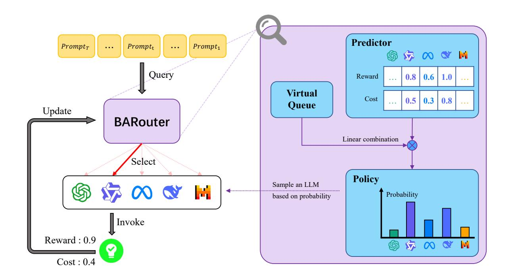
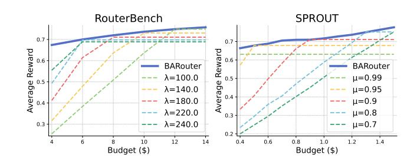
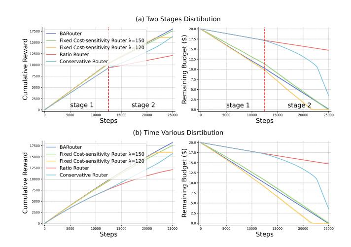
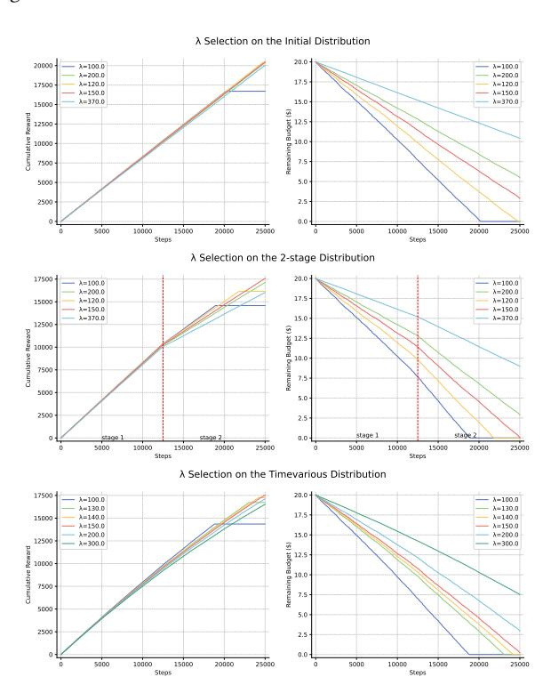

# BARouter: A Budget-adaptive Online Large Language Model Router Framework

Lingkai Zu zulk2024@shanghaitech.edu.cn ShanghaiTech University Shanghai, China

Xiyue Peng pengxy2024@shanghaitech.edu.cn ShanghaiTech University Shanghai, China

Xin Liu∗ liuxin7@shanghaitech.edu.cn ShanghaiTech University Shanghai, China

# Abstract

With the rapid advancement of large language models (LLMs), a diverse ecosystem of models with different scales and domain specializations has emerged, including LLM-based web agents and online multi-LLM server systems. LLM routing, which opportunistically leverages this diversity to balance response quality and computational cost, has become a central problem in optimizing the performance of LLM serving systems. We propose the Budget-Adaptive Router (BARouter), a budget-adaptive online routing framework for LLM serving systems. BARouter dynamically adjusts its routing policy for incoming queries based on the estimated response quality, query costs, and real-time budget consumption, enabling seamless adaptation to varying initial budgets and evolving input distributions without manual hyperparameter tuning. Theoretically, we prove that BARouter achieves sublinear regret over the time horizon �� . The extensive experiments show that BARouter effectively allocates the right budget to the queries at the right time, consistently outperforming baseline algorithms, and remains robust to varying budget levels and shifting query distributions.

# CCS Concepts

• Computing methodologies → Online learning settings.

## Keywords

Large language model serving, online routing, budget efficiency

## ACM Reference Format:

Lingkai Zu, Xiyue Peng, and Xin Liu. 2026. BARouter: A Budget-adaptive Online Large Language Model Router Framework. In Proceedings of the ACM Web Conference 2026 (WWW '26), April 13–17, 2026, Dubai, United Arab Emirates. ACM, New York, NY, USA, [12](#page-11-0) pages. [https://doi.org/10.1145/](https://doi.org/10.1145/3774904.3792725) [3774904.3792725](https://doi.org/10.1145/3774904.3792725)

# 1 Introduction

Large Language Models (LLMs) have achieved remarkable progress in recent years, demonstrating exceptional capabilities across a diverse range of tasks [\[2,](#page-8-0) [9,](#page-8-1) [10,](#page-8-2) [17,](#page-8-3) [29\]](#page-8-4), including web tasks such as booking hotels or tickets [\[19,](#page-8-5) [33\]](#page-8-6). These models are predominantly guided by the Scaling Laws, relying on massive models to ensure exceptional performance. This paradigm implies that deploying and utilizing such LLMs typically demands substantial

∗Corresponding author.

© 2026 Copyright held by the owner/author(s). ACM ISBN 979-8-4007-2307-0/2026/04 <https://doi.org/10.1145/3774904.3792725>

computational resources and incurs significant inference overhead. While these powerful general-purpose models, especially when augmented with sophisticated reasoning techniques (e.g., Chainof-Thought (CoT)), can tackle numerous challenging problems, in practice, many simple daily queries do not necessitate such formidable LLMs and complex reasoning strategies. For example, when solving a complex integral problem, it is worthwhile to employ CoT to ensure that the LLM engages in careful deliberation and precise computation. Conversely, if the objective is to query the spelling of a specific interface during programming, to minimize token consumption and enable rapid responses from the LLM, the use of CoT is unnecessary. Therefore, an alternative approach to enhancing language model performance is specialization, which develops domain-specific LLMs with a smaller size to beat the larger models within specific domains. For example, CodeQwen 7B [\[3\]](#page-8-7) has comparable code generation capabilities with GPT-4 [\[20\]](#page-8-8), For programming tasks, invoking CodeQwen can achieve comparable outcomes while incurring lower costs than GPT-4. Apollo [\[31\]](#page-8-9), a lightweight multilingual medical LLM, achieves the best performance in the medical domain, which means that assigning medical questions to Apollo can return superior response quality with low costs. Although such specialized models demonstrate strong performance on domain-specific tasks, the queries encountered in real-world scenarios typically exhibit substantial diversity. Neither large-scale general-purpose LLMs nor specialized models alone can efficiently accommodate such diverse prompts [\[15,](#page-8-10) [25\]](#page-8-11). Consequently, routing mechanisms have been increasingly adopted to enable cost-effective and responsive LLM serving [\[7,](#page-8-12) [26,](#page-8-13) [27\]](#page-8-14). Intuitively, LLM routing involves assigning user-input prompts to the most suitable LLMs, thereby achieving high response quality with minimal costs. By intelligently allocating users' prompts to appropriately scaled or domain-specific LLMs, the router enables the LLM server infrastructure to fulfill users' demands most cost-effectively.

Table 1: Existing LLM routing method with its budget/cost control strategies and feedback types.

| Method         |     | Pre-training | Budget/Cost  | Control Feedback Type |
|----------------|-----|--------------|--------------|-----------------------|
| [15, 32]       | Not | required     | Quality only | Bandit                |
| [24]           | Not | required     | Non-adaptive | Bandit                |
| [4]            |     | Required     | Quality only | Full                  |
| [30]           |     | Required     | Non-adaptive | Bandit                |
| [25]           |     | Required     | Non-adaptive | Preference            |
| [14, 18, 28]   |     | Required     | Non-adaptive | Full                  |
| BARouter(ours) | Not | required     | Adaptive     | Bandit                |

[This work is licensed under a Creative Commons Attribution 4.0 International License.](https://creativecommons.org/licenses/by/4.0) WWW '26, Dubai, United Arab Emirates

Figure 1: The pipeline of Budget-Adaptive Router (BARouter) framework. Left (workflow of the online LLM router server): Upon receiving a real-time user query/prompt, BARouter selects a suitable LLM to invoke, and the selected LLM generates the corresponding response. The observed reward and cost associated with this response are then utilized to iteratively refine subsequent routing decisions. Right (BARouter's internal policy generation mechanism): For each incoming query, the router computes a linear combination of the estimated reward and cost guided by the virtual queue, and subsequently derives the routing policy using the EXP3 technique.

The initial studies on LLM routing mainly focus on assigning user queries from various categories (e.g., mathematics, programming, medicine, etc.) to the most suitable LLM, with the aim of solely achieving optimal response quality [\[4,](#page-8-17) [15,](#page-8-10) [32\]](#page-8-15). However, such (cost-unaware) routing strategies may allocate the majority of queries to the LLMs with the highest capabilities, incurring substantially high costs. A line of subsequent work has incorporated costs or budgets into the routing design [\[4,](#page-8-17) [14,](#page-8-19) [18,](#page-8-20) [28\]](#page-8-21). These studies formulate this as maximizing a unified objective function ��(��, ��) = �� (��, ��) − ����(��, ��) [\[14,](#page-8-19) [18\]](#page-8-20) or a weighted average function ��(��, ��) = (1−��)�� (��, ��) −����(��, ��) [\[28\]](#page-8-21), where �� (��, ��) and ��(��, ��) denote the response quality (e.g. accuracy) and cost (e.g. API expense) for LLM �� on a given query ��, and �� ≥ 0 or 0 ≤ �� ≤ 1 quantify user's cost sensitivity. These approaches [\[4,](#page-8-17) [14,](#page-8-19) [18,](#page-8-20) [28\]](#page-8-21) balance the quality and cost consumption by searching an optimal cost-sensitivity parameter �� or �� under the assumption of perfect knowledge of the environment or dataset (e.g., the query distribution and the exact �� and �� values), making them inherently offline and non-adaptive. Intuitively, when incoming prompts, reward/cost functions or budget limits deviate from the training distribution, these approaches are prone to out-of-distribution (OOD) issues. It is worth noting that RouterBench [\[14\]](#page-8-19) and SPROUT [\[28\]](#page-8-21) provide two important and comprehensive datasets for LLM routing research. These datasets are widely used benchmarks that include detailed annotations of

response quality and token cost under varying budget constraints. Besides, most existing studies rely on offline datasets with full feedback on every pair of prompt and LLM to train the routing policy [\[4,](#page-8-17) [13,](#page-8-22) [18,](#page-8-20) [21,](#page-8-23) [28\]](#page-8-21), which is too expensive to design such datasets. An improved approach is to use preference-based feedback for training the router [\[25\]](#page-8-11), but it still requires additional unselected LLMs' feedback. In practical LLM serving, only the response quality and cost of the selected LLM can be observed, i.e., bandit feedback. The bandit feedback fundamentally differs from the full-feedback setting, where quality and cost of unselected LLMs remain unobservable during routing [\[15,](#page-8-10) [24,](#page-8-16) [30,](#page-8-18) [32\]](#page-8-15). The bandit-feedback, also named as "observational feedback" in Tsiourvas et al. [\[30\]](#page-8-18), is the most aligned with real-world scenarios. Table [1](#page-0-0) summarizes the aforementioned methods and categorizes them according to their cost-control strategies and feedback types. It can be observed that existing LLM routing approaches either lack adaptability to online and dynamic settings or require strong feedback, making them difficult to deploy in practice. Hence, a natural open question is raised:

## Can we design an online budget-adaptive LLM routing framework with bandit feedback?

In this paper, we provide a positive answer to this question by introducing the Budget-Adaptive Router (BARouter), an adaptive online LLM router framework. As illustrated in Figure [1,](#page-1-0) for

each real-time user query/prompt, BARouter dynamically computes the utility function by forming a linear combination of the estimated rewards and costs, weighted by a budget-adaptive virtual queue. Subsequently, BARouter translates the utility function into the routing probability using the exponential-weighting principle to balance exploration and exploitation (EXP3). The virtual queue, automatically adjusted based on the current budget and historical budget consumption, enables BARouter to make informed decisions under budget constraints. Meanwhile, the EXP3 design establishes a good balance between exploration and exploitation such that it can adapt to bandit feedback with time-varying incoming prompts. Overall, BARouter distinguishes itself from the methods in Table [1](#page-0-0) through the following key characteristics:

- Online Routing with Bandit-feedback. As an online LLM router framework, BARouter does not require pre-training and can achieve LLM routing under online bandit-feedback conditions. This setup better reflects real-world scenarios, as obtaining feedback from every available large language model for a user's query is often costly or infeasible. Hence, BARouter does not incur additional overhead for collecting training data. In scenarios with insufficient data (e.g., involving unseen LLMs or queries pertaining to unseen domains), the predictor may encounter challenges in generating accurate estimation. It addresses this limitation by engaging in exploration to acquire corresponding feedback, thereby enhancing the predictor's accuracy.
- Optimal Budget Adaptation. BARouter is capable of accurately allocating budgets to achieve near-optimal query response performance under various budget limits, without requiring any prior information beyond the number of incoming tasks and the initial budget. This is demonstrated on two comprehensive datasets, RouterBench [\[14\]](#page-8-19) and SPROUT [\[28\]](#page-8-21), as shown in Figure [2.](#page-2-0) Assuming perfect knowledge of incoming queries and their corresponding quality and cost functions, we search for the optimal cost-sensitivity parameters �� or �� in [\[14,](#page-8-19) [28\]](#page-8-21) under different budget limits, which serve as theoretical upper bounds. BARouter consistently matches these upper bounds across all budget settings.
- Adaptation to Dynamic Environment. BARouter operates fully online and requires minimal hyperparameter tuning, continuously adapting to shifting query distributions while providing precise and stable budget control in dynamic environments. This online adaptability makes BARouter respond to distributional changes in real time, preventing premature budget exhaustion and avoiding overly conservative routing policies as the environment shifts.

BARouter is justified with theoretical analysis and extensive empirical validation. Theoretically, we prove that BARouter achieves a sublinear regret bound of O (˜ �� 4�� 4 ), where �� is the number of incoming prompts (time horizon) and �� relates to the reward/cost estimation errors. Empirically, we demonstrate that BARouter consistently adapts to varying budget constraints and distribution shifts, achieving superior performance across settings compared to baseline methods. It also exhibits strong robustness across different predictors even with coarse-grained parameter tuning.

Figure 2: BARouter achieve optimal budget adaptation justified by two comprehensive datasets RouterBench [\[14\]](#page-8-19) and SPROUT [\[28\]](#page-8-21).

## 2 Related Work

LLM routing methods have been extensively studied. This section solely discusses the content most relevant to our approach.

LLM Router without Cost. A straightforward routing approach is simply selecting the LLM with the highest response quality. Chen et al. [\[4\]](#page-8-17) Fine-tunes a model that learning problems and LLM embeddings using contrastive learning. However, this method necessitates substantial computational resources for training and relies on a large-scale dataset. In contrast, Hu et al. [\[16\]](#page-8-24), Xia et al. [\[32\]](#page-8-15) formulate the routing problem as a contextual bandit problem, enabling online learning of the relationship between prompts and available LLMs, thereby reducing the dependence on computational resources and datasets. Such routing strategy overlook the costs associated with invoking LLMs, which may lead to increased substantial expenses.

Cost-aware LLM Router. Jitkrittum et al. [\[18\]](#page-8-20) and Mohammadshahi et al. [\[22\]](#page-8-25) incorporate the average cost of LLMs into their routing strategies while predicting LLM response quality for prompts, aiming to balance the quality and cost. Note that the cost is also associated with the prompt, Somerstep et al. [\[28\]](#page-8-21) and Mei et al. [\[21\]](#page-8-23) train a cost estimator with a structure similar to that of the quality estimator, aiming to more accurately estimate the expense of invoking LLMs. These methods typically introduce a utility function �� = �� − ����, where �� and �� represent the corresponding quality and cost, respectively, and �� is a predefined and fixed parameter indicating cost sensitivity. Tsiourvas et al. [\[30\]](#page-8-18) defines set of a series ��s (Λ = {��1, . . . , ���� }) and predict the utility function for each ��. For �� ∉ Λ, they use the corresponding joint network trained to generalize across the cost sensitivity. Hari and Thomson [\[13\]](#page-8-22) incorporate costs or user-defined constraints along with response quality into the loss function during training, with the objective of developing a routing strategy that balances response quality and cost. These methods are capable of accounting for the costs associated with invoking LLMs, thereby balancing response quality and cost. However, they are all static offline routing algorithms that require pretraining or parameter tuning. Such routing approaches are highly dependent on the distribution of the training dataset and require fine-tuning hyperparameters for different budget constrains, making them less adaptable to practical online settings. To design a routing policy for practical online settings, Zhao et al. [\[34\]](#page-8-26) selects the LLM that is expected to achieve the highest response quality while complying with the current budget constraints. However, this

Table 2: Averaged reward across different scenarios on different routers. The results are reported over 5 trials with different random seeds. We bold the best performance in each row. Since the Primal-Dual Router does not rely on predictors, we merge the cells in this column.

| Benchmark Budget (\$) | Predictor | Fixed |     |     | Router | Primal-Dual Router | Ratio |     | Router |   | Conservative |     | Router |   | BARouter |     | (Ours) |
|-----------------------|-----------|-------|-----|-----|--------|--------------------|-------|-----|--------|---|--------------|-----|--------|---|----------|-----|--------|
| �� = 2                |           |       |     |     |        |                    |       |     |        |   |              |     |        |   |          |     |        |
|                       | KNN       | 0     | 427 | ± 0 | 002    |                    |       |     |        |   |              |     |        |   |          |     |        |
|                       |           |       |     |     | 0      | 557 ± 0 001        |       |     |        |   |              |     |        |   |          |     |        |
|                       |           |       |     |     |        | 0                  | 431   | ± 0 | 001    | 0 | 546          | ± 0 | 002    | 0 | 590      | ± 0 | 004    |
|                       | K-Means   | 0     | 517 | ± 0 | 001    | 0                  | 467   | ± 0 | 001    | 0 | 508          | ± 0 | 001    | 0 | 595      | ± 0 | 002    |
| Gradient              | Boosting  | 0     | 454 | ± 0 | 001    | 0                  | 347   | ± 0 | 002    | 0 | 472          | ± 0 | 001    | 0 | 494      | ± 0 | 001    |
| �� = 5                |           |       |     |     |        |                    |       |     |        |   |              |     |        |   |          |     |        |
|                       | KNN       | 0     | 651 | ± 0 | 001    |                    |       |     |        |   |              |     |        |   |          |     |        |
|                       |           |       |     |     | 0      | 660 ± 0 005        |       |     |        |   |              |     |        |   |          |     |        |
| RouterBench           |           |       |     |     |        | 0                  | 431   | ± 0 | 001    | 0 | 653          | ± 0 | 003    | 0 | 675      | ± 0 | 003    |
|                       | K-Means   | 0     | 630 | ± 0 | 000    | 0                  | 467   | ± 0 | 001    | 0 | 617          | ± 0 | 001    | 0 | 686      | ± 0 | 002    |
| Gradient              | Boosting  | 0     | 624 | ± 0 | 001    | 0                  | 618   | ± 0 | 001    | 0 | 552          | ± 0 | 001    | 0 | 626      | ± 0 | 001    |
| �� = 10               |           |       |     |     |        |                    |       |     |        |   |              |     |        |   |          |     |        |
|                       | KNN       | 0     | 484 | ± 0 | 008    |                    |       |     |        |   |              |     |        |   |          |     |        |
|                       |           |       |     |     | 0      | 684 ± 0 006        |       |     |        |   |              |     |        |   |          |     |        |
|                       |           |       |     |     |        | 0                  | 431   | ± 0 | 000    | 0 | 672          | ± 0 | 001    | 0 | 716      | ± 0 | 003    |
|                       | K-Means   | 0     | 679 | ± 0 | 006    | 0                  | 467   | ± 0 | 000    | 0 | 636          | ± 0 | 001    | 0 | 718      | ± 0 | 004    |
| Gradient              | Boosting  | 0     | 640 | ± 0 | 001    | 0                  | 618   | ± 0 | 001    | 0 | 623          | ± 0 | 001    | 0 | 638      | ± 0 | 001    |
| �� = 0 5              |           |       |     |     |        |                    |       |     |        |   |              |     |        |   |          |     |        |
|                       | KNN       | 0     | 637 | ± 0 | 001    |                    |       |     |        |   |              |     |        |   |          |     |        |
|                       |           |       |     |     | 0      | 540 ± 0 005        |       |     |        |   |              |     |        |   |          |     |        |
|                       |           |       |     |     |        | 0                  | 637   | ± 0 | 000    | 0 | 656          | ± 0 | 004    | 0 | 659      | ± 0 | 007    |
|                       | K-Means   | 0     | 614 | ± 0 | 006    | 0                  | 606   | ± 0 | 001    | 0 | 631          | ± 0 | 001    | 0 | 651      | ± 0 | 001    |
| Gradient              | Boosting  | 0     | 648 | ± 0 | 001    | 0                  | 394   | ± 0 | 001    | 0 | 568          | ± 0 | 000    | 0 | 648      | ± 0 | 002    |
| Roberta               | (offline) | 0     | 680 | ± 0 | 000    | 0                  | 633   | ± 0 | 001    | 0 | 669          | ± 0 | 001    | 0 | 668      | ± 0 | 002    |
| �� = 0 9              |           |       |     |     |        |                    |       |     |        |   |              |     |        |   |          |     |        |
|                       | KNN       | 0     | 696 | ± 0 | 003    |                    |       |     |        |   |              |     |        |   |          |     |        |
|                       |           |       |     |     | 0      | 603 ± 0 004        |       |     |        |   |              |     |        |   |          |     |        |
|                       |           |       |     |     |        | 0                  | 637   | ± 0 | 001    | 0 | 690          | ± 0 | 002    | 0 | 722      | ± 0 | 006    |
| SPROUT                | K-Means   | 0     | 708 | ± 0 | 000    | 0                  | 606   | ± 0 | 002    | 0 | 704          | ± 0 | 000    | 0 | 715      | ± 0 | 006    |
| Gradient              | Boosting  | 0     | 647 | ± 0 | 007    | 0                  | 705   | ± 0 | 005    | 0 | 602          | ± 0 | 002    | 0 | 710      | ± 0 | 001    |
| Roberta               | (offline) | 0     | 711 | ± 0 | 000    | 0                  | 633   | ± 0 | 001    | 0 | 701          | ± 0 | 001    | 0 | 703      | ± 0 | 001    |
| �� = 1 6              |           |       |     |     |        |                    |       |     |        |   |              |     |        |   |          |     |        |
|                       | KNN       | 0     | 709 | ± 0 | 003    |                    |       |     |        |   |              |     |        |   |          |     |        |
|                       |           |       |     |     | 0      | 716 ± 0 004        |       |     |        |   |              |     |        |   |          |     |        |
|                       |           |       |     |     |        | 0                  | 637   | ± 0 | 002    | 0 | 756          | ± 0 | 004    | 0 | 777      | ± 0 | 004    |
|                       | K-Means   | 0     | 594 | ± 0 | 005    | 0                  | 606   | ± 0 | 001    | 0 | 722          | ± 0 | 002    | 0 | 786      | ± 0 | 003    |
| Gradient              | Boosting  | 0     | 737 | ± 0 | 004    | 0                  | 720   | ± 0 | 001    | 0 | 664          | ± 0 | 003    | 0 | 798      | ± 0 | 001    |
| Roberta               | (offline) | 0     | 754 | ± 0 | 002    | 0                  | 633   | ± 0 | 001    | 0 | 744          | ± 0 | 005    | 0 | 791      | ± 0 | 003    |

query text into a 768-dimensional vector. As for predictors, virtually all routing algorithms require predictors to estimate the reward and cost of a given query �� on each available LLM ��, denoted as ˆ �� (��, ��) and ��ˆ(��, ��), respectively. We consider the following predictors in our experimental setup:

- K-nearest-neighbors(KNN) The KNN regressor is a commonly employed estimator in LLM routing tasks [\[14,](#page-8-19) [18,](#page-8-20) [28\]](#page-8-21), characterized by its ability to operate effectively without requiring extensive training set.
- K-Means. We performed K-Means clustering based on the embeddings. For each cluster, we estimate the reward or cost as its average value.
- Gradient Boosting. We utilize gradient-boosted tree regression to do estimation. We concatenate the embeddings of user prompts and available LLMs as input to the regressor to fit reward and cost.
- Roberta. Somerstep et al. [\[28\]](#page-8-21) has open-sourced their predictor trained on the SPROUT dataset on Hugging Face, which is based on a fine-tuned RoBERTa-base architecture.

To simulate the online scenario, KNN, K-Means, and Gradient Boosting are adapted to acquire bandit feedback and can be updated during routing. For these online predictors, we established 200 queries as the initial dataset. That is, the predictor possesses a dataset comprising responses from all available LLMs to 200 questions. As for Roberta, it was pre-trained on the SPROUT training set (30968 samples) and is not updated during the routing process. Detailed settings for the predictors can be found in the Appendix [C.1.](#page-10-2)

Baselines. In the experiment, we considered multiple baseline algorithms, which can be classified into the following categories with detailed description in Appendix [C.2:](#page-11-1)

- Fixed Cost-sensitivity Router. Hu et al. [\[14\]](#page-8-19), Jitkrittum et al. [\[18\]](#page-8-20), Somerstep et al. [\[28\]](#page-8-21) adjust the sensitivity to the cost through tuning hyperparameters. Given a query ��, they compute a score for each available LLM �� and then select the LLM with the highest score. For carrot [\[28\]](#page-8-21), ���� = (1 − ��)��ˆ(��, ��) − ����ˆ(��, ��), where ��ˆ(��, ��) and ��ˆ(��, ��) represent the predicted reward and cost, respectively, �� is the fixed cost-sensitivity parameter. Although the other two methods have different computational forms, they are essentially convertible into each other.
- Primal-Dual Router. OmniRouter [\[21\]](#page-8-23) formulates the LLM routing problem as an integer programming problem with �� queries and �� LLMs. Notably, this approach constitutes an offline optimization problem and cannot adapt to online scenarios. To address this challenge, we first categorize queries. For each category of queries, we compute the probability of assigning a query to each LLM and apply it as a policy in online routing.
- Conservative Router. Zhao et al. [\[34\]](#page-8-26) ranks the candidate LLMs based on preference feedback and subsequently select the highest-ranking LLM within the user's budget. Inspired by this approach, Conservative Router selects the LLM with the highest response quality, subject to the constraint that the cost does not exceed the current budget per query.
- Ratio Router. Ratio router chooses the LLM with the highest predicted reward-cost ratio.

## 6.1 Benchmark Results

We evaluate BARouter in comparison to the aforementioned baselines on both RouterBench and SPROUT.

Experiments Setup. In the RouterBench dataset, we set the time horizon to �� = 20000 and defined three distinct global budget �� = {2, 5, 10}. For the SPROUT dataset, the time horizon was set to �� = 5309, with global budget �� = {0.5, 0.9, 1.6}. Regarding the hyperparameter settings, for the Fixed Cost-sensitivity Router, based on CARROT[\[28\]](#page-8-21), we adjust the cost weight ��. For different budgets �� = {2, 5, 10} in RouterBench, we set �� = {0.98, 0.8, 0.25}. For �� = {0.5, 0.9, 1.6} in SPROUT, we configure �� = {0.95, 0.9, 0.4}. In contrast, BARouter requires no hyperparameter tuning to adapt to various budgets. For �� and�� , which denote the exploration factor and the predictor error bound, respectively, we set �� = 20 and�� = 1 across all scenarios.

Experiments Results and Discussion. The experiment results are shown in Table [2.](#page-6-0) As can be observed from the table, BARouter outperforms the baseline methods under various budget settings across both datasets. BARouter uses a single hyperparameter setting �� = 20,�� = 1 across all scenarios, whereas the Fixed Costsensitivity Router requires meticulous hyperparameter tuning. The Fixed Cost-sensitivity Router shows suboptimal performance with certain predictors under the same hyperparameters. For instance, while the hyperparameter �� = 0.25 is quite appropriate for the Fixed Cost-sensitivity Router with K-Means under a budget of �� = 10, it leads to poor results when Online KNN is applied, induces an overly aggressive strategy, resulting in premature budget exhaustion, which makes the performance even worse than that at �� = 5. This verifies that hyperparameter selection for Fixed Cost-sensitivity Router is highly dependent on factors such as the predictor, making it difficult to choose optimally in practical deployment. It also demonstrates BARouter's strong adaptability to different budget scenarios, as it precisely controls the global budget under varying budget constraints.

# 6.2 Robustness under Dynamic Distribution

In practical deployment, the data distribution X may be dynamic and unobservable. This is a challenge for traditional offline or static methods [\[14,](#page-8-19) [18,](#page-8-20) [28\]](#page-8-21), which require a precise configuration of the user's cost sensitivity (�� or ��) to control the global reward-cost trade-off. However, BARouter dynamically optimizes the rewardcost trade-off in real-time without prior knowledge of data distributions through its budget-adaptation mechanism. To demonstrate BARouter's robustness under dynamic distribution, we introduce the following experiments.

Experiments Setup. We utilize two models from RouterBench with contrasting capability-cost profiles: a strong LLM (gpt-4-1106 preview) and a weak LLM (meta/llama-2-70b-chat). The queries in RouterBench are divided into an easy subset Xeasy and a hard subset Xhard based on the weak LLM's correctness. We consider two different dynamic distribution settings:

- The time horizon �� = 25000 are divided into two stages with budget �� = 20. For the first stage �� ∈ [0, 12500), prompts are sampled from Xeasy and Xhard in an 8 : 2 ratio; while for the second stage �� ∈ [12500, 25000), in a 2 : 8 ratio.

- The prompt distribution from Xeasy : Xhard = 2 : 8 linearly varies to Xeasy : Xhard = 8 : 2 during time horizon �� = 25000 with budget �� = 20.

We use the KNN predictor in these experiments and compare BARouter with baselines. In this experiment, we apply ���� = ��ˆ(��, ��)− ����ˆ(��, ��) for the Fixed Cost-sensitivity Router. To ensure a competitive baseline, we meticulously selected parameters for the fixed cost-sensitivity routers, specifically �� = {120, 150}. These values represent near-optimal choices under two idealized scenarios: full knowledge of the initial query distribution, and prior awareness of global distribution shifts. The detailed parameter selection procedure is provided in Appendix [C.3.](#page-11-2)

Figure 3: Online router reward over different dynamic distributions.

Experiments Results and Discussion. The experiment results are shown in Figure [3.](#page-7-0) As evidenced by the results, BARouter demonstrates superior performance over baseline algorithms under dynamic distribution shifts. Although the fixed cost-sensitivity routers with meticulously tuned parameters achieve cumulative rewards comparable to our method, such fine-grained parameter calibration in Appendix [C.3](#page-11-2) proves impractical to attain in realistic online deployment scenarios.

# 7 Conclusion

In this work, we introduce BARouter, a budget-adaptive online LLM routing framework that optimizes response quality under various budget scenarios without requiring parameter tuning. Theoretically, we provide a O (˜ �� 4�� 4 ) regret for BARouter. Through experiments, we demonstrate that BARouter outperforms existing LLM routing methods, and also validate its adaptability and strong budget control capabilities.

# Acknowledgment

This work was supported by the National Natural Science Foundation of China under Grant 62302305.

- References [1] Shipra Agrawal and Nikhil Devanur. 2016. Linear Contextual Bandits with Knapsacks. In Advances Neural Information Processing Systems (NeurIPS). [2] Anthropic. 2024. The Claude 3 Model Family: Opus, Sonnet, Haiku. Claude-3 Model Card (2024).<https://api.semanticscholar.org/CorpusID:268232499> [3] Jinze Bai, Shuai Bai, Yunfei Chu, Zeyu Cui, Kai Dang, Xiaodong Deng, Yang Fan, Wenbin Ge, Yu Han, Fei Huang, et al. 2023. Qwen technical report. arXiv preprint arXiv:2309.16609 (2023). [4] Shuhao Chen, Weisen Jiang, Baijiong Lin, James Kwok, and Yu Zhang. 2024. Routerdc: Query-based router by dual contrastive learning for assembling large language models. In Advances Neural Information Processing Systems (NeurIPS). [5] Xiangxiang Dai, Jin Li, Xutong Liu, Anqi Yu, and John Lui. 2024. Costeffective online multi-llm selection with versatile reward models. arXiv preprint arXiv:2405.16587 (2024). [6] Nikhil R Devanur, Kamal Jain, Balasubramanian Sivan, and Christopher A Wilkens. 2019. Near optimal online algorithms and fast approximation algorithms for resource allocation problems. J. ACM 66, 1 (2019), 1–41. [7] Dujian Ding, Ankur Mallick, Shaokun Zhang, Chi Wang, Daniel Madrigal, Mirian Del Carmen Hipolito Garcia, Menglin Xia, Laks V. S. Lakshmanan, Qingyun Wu, and Victor Rühle. 2025. BEST-Route: Adaptive LLM Routing with Test-Time Optimal Compute. In Int. Conf. Machine Learning (ICML). [8] Dylan J Foster and Alexander Rakhlin. 2023. Foundations of reinforcement learning and interactive decision making. arXiv preprint arXiv:2312.16730 (2023). [9] Aaron Grattafiori, Abhimanyu Dubey, Abhinav Jauhri, Abhinav Pandey, Abhishek Kadian, Ahmad Al-Dahle, Aiesha Letman, Akhil Mathur, Alan Schelten, Alex Vaughan, et al. 2024. The llama 3 herd of models. arXiv preprint arXiv:2407.21783 (2024). [10] Daya Guo, Dejian Yang, Haowei Zhang, Junxiao Song, Ruoyu Zhang, Runxin Xu, Qihao Zhu, Shirong Ma, Peiyi Wang, Xiao Bi, et al. 2025. Deepseek-r1: Incentivizing reasoning capability in llms via reinforcement learning. arXiv preprint arXiv:2501.12948 (2025). [11] Hengquan Guo and Xin Liu. 2024. Stochastic Constrained Contextual Bandits via Lyapunov Optimization Based Estimation to Decision Framework. In The Thirty Seventh Annual Conference on Learning Theory. PMLR, 2204–2231. [12] Hengquan Guo and Xin Liu. 2025. On Stochastic Contextual Bandits with Knapsacks in Small Budget Regime. In Int. Conf. on Learning Representations (ICLR). [13] Surya Narayanan Hari and Matt Thomson. 2023. Tryage: Real-time, intelligent routing of user prompts to large language models. arXiv preprint arXiv:2308.11601 (2023). [14] Qitian Jason Hu, Jacob Bieker, Xiuyu Li, Nan Jiang, Benjamin Keigwin, Gaurav Ranganath, Kurt Keutzer, and Shriyash Kaustubh Upadhyay. 2024. RouterBench: A Benchmark for Multi-LLM Routing System. In Agentic Markets Workshop at ICML 2024. [15] Xiaoyan Hu, Ho fung Leung, and Farzan Farnia. 2025. An Online Learning Approach to Prompt-based Selection of Generative Models and LLMs. In Int. Conf. Machine Learning (ICML). [16] Xiaoyan Hu, Ho-fung Leung, and Farzan Farnia. 2024. An online learning approach to prompt-based selection of generative models. arXiv preprint arXiv:2410.13287 (2024). [17] Aaron Jaech, Adam Kalai, Adam Lerer, Adam Richardson, Ahmed El-Kishky, Aiden Low, Alec Helyar, Aleksander Madry, Alex Beutel, Alex Carney, et al. 2024. Openai o1 system card. arXiv preprint arXiv:2412.16720 (2024). [18] Wittawat Jitkrittum, Harikrishna Narasimhan, Ankit Singh Rawat, Jeevesh Juneja, Congchao Wang, Zifeng Wang, Alec Go, Chen-Yu Lee, Pradeep Shenoy, Rina Panigrahy, et al. 2025. Universal model routing for efficient llm inference. arXiv preprint arXiv:2502.08773 (2025). [19] Dongjun Lee, Juyong Lee, Kyuyoung Kim, Jihoon Tack, Jinwoo Shin, Yee Whye Teh, and Kimin Lee. 2025. Learning to contextualize web pages for enhanced decision making by LLM agents. arXiv preprint arXiv:2503.10689 (2025). [20] Jiawei Liu, Chunqiu Steven Xia, Yuyao Wang, and Lingming Zhang. 2023. Is Your Code Generated by ChatGPT Really Correct? Rigorous Evaluation of Large Language Models for Code Generation. In Advances Neural Information Processing Systems (NeurIPS). [21] Kai Mei, Wujiang Xu, Shuhang Lin, and Yongfeng Zhang. 2025. OmniRouter: Budget and Performance Controllable Multi-LLM Routing. arXiv preprint arXiv:2502.20576 (2025). [22] Alireza Mohammadshahi, Arshad Rafiq Shaikh, and Majid Yazdani. 2024. Routoo: Learning to route to large language models effectively. arXiv preprint arXiv:2401.13979 (2024). [23] M. J. Neely. 2022. Stochastic network optimization with application to communication and queueing systems. Springer Nature. [24] Quang H Nguyen, Thinh Dao, Duy C Hoang, Juliette Decugis, Saurav Manchanda, Nitesh V Chawla, and Khoa D Doan. 2024. MetaLLM: A High-performant and Cost-efficient Dynamic Framework for Wrapping LLMs. arXiv preprint arXiv:2407.10834 (2024). [25] Isaac Ong, Amjad Almahairi, Vincent Wu, Wei-Lin Chiang, Tianhao Wu, Joseph E. Gonzalez, M Waleed Kadous, and Ion Stoica. 2025. RouteLLM: Learning to Route LLMs from Preference Data. In Int. Conf. on Learning Representations (ICLR). [26] Zhihong Pan, Kai Zhang, Yuze Zhao, and Yupeng Han. 2025. Route to Reason: Adaptive Routing for LLM and Reasoning Strategy Selection. arXiv preprint arXiv:2505.19435 (2025). [27] Tal Shnitzer, Anthony Ou, Mírian Silva, Kate Soule, Yuekai Sun, Justin Solomon, Neil Thompson, and Mikhail Yurochkin. 2024. Large Language Model Routing with Benchmark Datasets. In First Conference on Language Modeling. [28] Seamus Somerstep, Felipe Maia Polo, Allysson Flavio Melo de Oliveira, Prattyush Mangal, Mírian Silva, Onkar Bhardwaj, Mikhail Yurochkin, and Subha Maity. 2025. CARROT: A Cost Aware Rate Optimal Router. In ICLR 2025 Workshop on Foundation Models in the Wild. [29] Gemini Team, Rohan Anil, Sebastian Borgeaud, Jean-Baptiste Alayrac, Jiahui Yu, Radu Soricut, Johan Schalkwyk, Andrew M Dai, Anja Hauth, Katie Millican, et al. 2023. Gemini: a family of highly capable multimodal models. arXiv preprint arXiv:2312.11805 (2023). [30] Asterios Tsiourvas, Wei Sun, and Georgia Perakis. 2025. Causal LLM Routing: End-to-End Regret Minimization from Observational Data. arXiv preprint arXiv:2505.16037 (2025). [31] Xidong Wang, Nuo Chen, Junyin Chen, Yidong Wang, Guorui Zhen, Chunxian Zhang, Xiangbo Wu, Yan Hu, Anningzhe Gao, Xiang Wan, et al. 2024. Apollo: A lightweight multilingual medical LLM towards democratizing medical AI to 6B people. arXiv preprint arXiv:2403.03640 (2024). [32] Yu Xia, Fang Kong, Tong Yu, Liya Guo, Ryan A Rossi, Sungchul Kim, and Shuai
  - Li. 2024. Which llm to play? convergence-aware online model selection with time-increasing bandits. In Proc. Int. Conf. World Wide Web (WWW). [33] Ke Yang, Yao Liu, Sapana Chaudhary, Rasool Fakoor, Pratik Chaudhari, George Karypis, and Huzefa Rangwala. 2024. Agentoccam: A simple yet strong baseline for llm-based web agents. arXiv preprint arXiv:2410.13825 (2024). [34] Zesen Zhao, Shuowei Jin, and Z Morley Mao. 2024. Eagle: Efficient training-free router for multi-llm inference. arXiv preprint arXiv:2409.15518 (2024).

