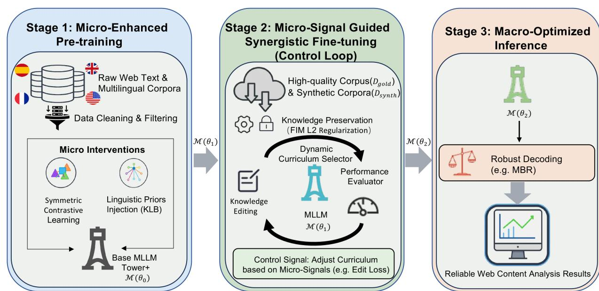
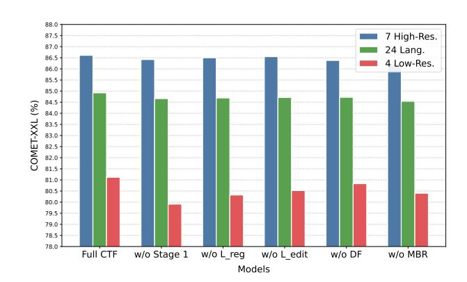
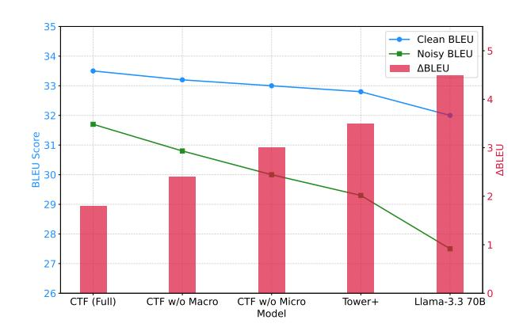

# Unlocking the Multilingual Long-Tail Web: A Fused Macro-Micro Framework for Scalable Content Analysis

[Jiarui Zhang](https://orcid.org/0000-0003-4274-1846) Institute of Information Engineering Chinese Academy of Sciences Beijing, China School of Cyber Security University of Chinese Academy of Sciences Beijing, China zhangjiarui@iie.ac.cn

[Yifan Deng](https://orcid.org/0000-0002-8684-0283) Institute of Information Engineering Chinese Academy of Sciences Beijing, China School of Cyber Security University of Chinese Academy of Sciences Beijing, China dengyifan@iie.ac.cn

[Qihao Wang](https://orcid.org/0009-0008-3308-0306) Institute of Information Engineering Chinese Academy of Sciences Beijing, China School of Cyber Security University of Chinese Academy of Sciences Beijing, China wangqihao@iie.ac.cn

# Abstract

Large Language Models (LLMs) enable Web-scale multilingual content analysis but face critical challenges in scaling to long-tail languages and ensuring robustness. Current research is split between two isolated trajectories: a Macro-Paradigm (system-level engineering) and a Micro-Paradigm (internal model intervention). We argue that a true Web-scale solution requires their systematic fusion, balancing large-scale data processing with fine-grained model control. We introduce the Control-Tower Framework (CTF), a novel methodology designed to systematically enhance powerful, pre-trained base models. Inspired by control-theoretic ideas, CTF transforms a base model into a controllable analysis engine via three synergistic stages: (1) Micro-enhanced pre-training that injects linguistic priors (e.g., syntax) to build a robust semantic foundation; (2) a control-inspired fine-tuning stage where a heuristic dynamic feedback loop, driven by micro-level error signals (e.g., knowledge editing loss), actively adjusts the macro-scale learning curriculum; and (3) Macro-optimized inference using Minimum Bayes Risk (MBR) decoding to enhance robustness on noisy user-generated content (UGC). Extensive experiments show that CTF surpasses the leading open-weights model, Tower+ 9B FT, by a substantial margin of +2.18 XCOMET-XXL on low-resource languages (WMT24++). Crucially, CTF unlocks large-scale cross-lingual Web mining by converting unstructured Web text into machine-analyzable assets. We evidence this with substantial gains across both document-level (on MARC) and aspect-based (on SemEval-2016) sentiment analysis tasks. Our work offers a practical pathway toward building more reliable, scalable, and controllable global information ecosystems.

# CCS Concepts

• Computing methodologies → Natural language processing; Machine translation; • Information systems → Web mining.

[This work is licensed under a Creative Commons Attribution 4.0 International License.](https://creativecommons.org/licenses/by/4.0) WWW '26, Dubai, United Arab Emirates. © 2026 Copyright held by the owner/author(s). ACM ISBN 979-8-4007-2307-0/2026/04 <https://doi.org/10.1145/3774904.3792733>

# Keywords

Large Language Models, Cross-lingual Web Mining, Controllable Language Models, Dynamic Fine-Tuning, Low-resource Languages

#### ACM Reference Format:

Jiarui Zhang, Yifan Deng, and Qihao Wang. 2026. Unlocking the Multilingual Long-Tail Web: A Fused Macro-Micro Framework for Scalable Content Analysis. In Proceedings of the ACM Web Conference 2026 (WWW '26), April 13–17, 2026, Dubai, United Arab Emirates.ACM, New York, NY, USA, [12](#page-11-0) pages. <https://doi.org/10.1145/3774904.3792733>

# 1 Introduction

Large Language Models (LLMs) are becoming a foundational infrastructure for the multilingual Web [\[49\]](#page-8-0). They enable content analysis and translation at an unprecedented scale to foster equitable global information access [\[7,](#page-8-1) [53,](#page-8-2) [75,](#page-8-3) [76\]](#page-8-4). However, the deployment of these models in the open, heterogeneous, and user-driven environment of the Web exposes two fundamental challenges. The first is a scalability challenge: effectively and economically serving the Web's "long tail" of thousands of low-resource languages, where a pronounced performance disparity persists compared to highresource languages [\[27,](#page-8-5) [31,](#page-8-6) [64\]](#page-8-7), e.g., languages with <1M parallel sentences, leading to 10-20 point score gaps [\[14,](#page-8-8) [41\]](#page-8-9) compared to high-resource pairs. The second is a robustness challenge: ensuring reliable and controllable performance when these specialized, blackbox models are confronted with the noisy, unpredictable nature of user-generated content (UGC) [\[4\]](#page-8-10), a trade-off that often sacrifices general instruction-following capabilities for task-specific performance [\[53\]](#page-8-2). Addressing these dual challenges is critical for moving beyond models that excel only on curated, high-resource benchmarks but fail on real-world Web content, and toward building a truly global and reliable information ecosystem [\[57\]](#page-8-11).

In response, research has fragmented into two largely isolated trajectories—a divergence often rooted in the distinct expertise of different research communities. The Macro-Paradigm, from a systems perspective, treats LLMs as opaque black boxes, focusing on Web-scale data engineering [\[58\]](#page-8-12) (e.g., curriculum learning for progressive adaptation and back-translation for synthetic data generation [\[13\]](#page-8-13)) and robust decoding strategies [\[59\]](#page-8-14) such as minimum Bayes risk [\[18,](#page-8-15) [53\]](#page-8-2) and non-autoregressive techniques [\[75\]](#page-8-3). In contrast, the Micro-Paradigm, being model-centric, opens the black box to intervene directly, for example, by injecting syntactic priors[\[50\]](#page-8-16) via dependency biases for low-resource languages,

editing factual knowledge[\[34,](#page-8-17) [39\]](#page-8-18) to correct Web-sourced errors, aligning cross-lingual representations via contrastive learning[\[73\]](#page-8-19), or optimizing model architectures and efficiency through methods like Mixture-of-Experts[\[68\]](#page-8-20) and pruning [\[31\]](#page-8-6).

While the Macro-Paradigm achieves scalability and the Micro-Paradigm offers controllability, their separation creates a fundamental tension: optimizations in one often undermine the other, leading to a trade-off between systems that are scalable but unreliable, and models that are precise but fail to scale.

To resolve this Web-specific tension, we introduce the Control-Tower Framework (CTF), a novel methodology that systematically unifies both paradigms. The CTF operates as a synergistic pipeline where each of its three stages is designed to resolve a specific aspect of the Macro-Micro trade-off: (1) Micro-Enhanced Pre-training. This initial stage builds a robust semantic foundation by injecting linguistic priors—such as syntactic structures—directly into the model. While this is a micro-level intervention, its purpose is to prepare the model to better generalize across the macro-scale diversity of the Web's long-tail languages. (2) Synergistic Fine-tuning. Forming the core of our framework, this novel fine-tuning stage is inspired by control theory. Here, macro-scale curriculum learning is dynamically guided by feedback from micro-level objectives defined over Web-mined error cases, enforcing constraints on factual accuracy and knowledge preservation. This ensures that as the model scales its capabilities, it does not lose its precision. (3) Macro-Optimized Inference. To ensure robustness in the wild, this final stage employs a system-level decoding strategy. We utilize Minimum Bayes Risk (MBR) decoding, which is specifically designed to handle the noisy and heterogeneous nature of user-generated content (UGC), thereby producing structured, reliable translations that enable downstream cross-lingual Web mining tasks, such as sentiment analysis on UGC.

Through this tightly integrated pipeline, CTF transforms a powerful base model into a controllable Web analysis engine, that balances macro-level scalability with micro-level controllability. Our main contributions are threefold:

- (1) We propose the Control-Tower Framework (CTF), a novel, dynamic, feedback-driven methodology that provides a unified pathway to resolve the inherent tension between scalability and controllability in Web-scale content analysis.
- (2) We design a control-inspired fine-tuning stage where microlevel feedback dynamically steers macro-level learning, enabling scalable yet precise model adaptation.
- (3) We demonstrate that CTF achieves competitive state-of-theart performance on low-resource translation, and that these gains directly enable superior results on downstream Web mining tasks like sentiment analysis.

# 2 BACKGROUND

The ascent of Large Language Models (LLMs) has revolutionized multilingual natural language processing [\[46\]](#page-8-21). However, unlocking their potential across diverse global applications requires finetuning to adapt general-purpose models to specific languages, tasks, and cultures—such as low-resource languages or domains like law and medicine. This process has emerged as the key challenge in

translating LLMs' promise into real-world value, particularly for scalable Web applications.

We define a Multilingual Large Language Model (MLLM) not merely as a generative model exposed to multilingual corpora, but as a high-capacity Transformer-based system explicitly optimized for cross-lingual transfer [\[46\]](#page-8-21). Unlike standard LLMs where multilingualism may emerge as a byproduct of scale, MLLMs are architected to align internal representation spaces across diverse language families, maximizing positive transfer (where high-resource languages boost low-resource performance) while mitigating negative transfer (interference). This definition implies a specific vulnerability: the "alignment gap" between the dominant languages (e.g., English, Chinese) and the long-tail languages, which the CTF is specifically designed to bridge.

To analyze MLLM fine-tuning's evolution, we frame the landscape through two fundamental paradigms: the Macro-Paradigm and the Micro-Paradigm. The Macro-Paradigm treats the LLM as a "black-box," guiding behavior via external interventions like data engineering and prompting, without internal changes. Conversely, the Micro-Paradigm views the LLM as a "white-box," directly altering its architecture and parameters to enhance core capabilities. This chapter surveys key technologies and trade-offs in each, providing a foundation for understanding the field and our contributions.

The Macro-Paradigm prioritizes scalability. It operates on the principle of "Web-scale data engineering," utilizing massive, often noisy, datasets to drive general capabilities. The optimization objective here is typically the minimization of perplexity over a broad distribution ����������. While this approach scales effectively—leveraging the "unreasonable effectiveness of data"—it inherently introduces stochasticity and hallucinations because the model learns the noise distribution alongside the signal. The system becomes robust in the aggregate but unreliable in the specific.

Conversely, the Micro-Paradigm prioritizes controllability. It treats the model as a "white box," employing techniques like knowledge editing (ROME [\[39\]](#page-8-18), MEMIT [\[40\]](#page-8-22)) and syntactic prior injection to enforce precise behaviors or correct specific facts. The optimization objective here is the minimization of error on specific tuples (��, ��) or adherence to strict syntactic constraints. However, these interventions suffer from the "Locality Trap": optimizing for specific constraints often degrades global performance, or the interventions are "washed out" when the model is exposed to further large-scale pre-training. See the appendix [A](#page-9-0) for more background information.

The tension, therefore, is structural:

- Macro undermines Micro: Massive continued pre-training dilutes the specific, fragile weights established by microinterventions. A syntactic bias injected for Hindi dependency parsing can be overwritten by billions of tokens of Englishcentric web text [\[12,](#page-8-23) [24\]](#page-8-24).
- Micro undermines Macro: Aggressive editing of specific facts or constraints can distort the model's manifold, creating "ripple effects" where general reasoning capabilities degrade because the weights have been forcibly shifted away from the global optimum to satisfy a local constraint [\[11,](#page-8-25) [69\]](#page-8-26).

The Control-Tower Framework (CTF) must be framed as the resolution to this Pareto conflict. It does not simply "combine" the two; it uses the Micro-signal to modulate the Macro-process, thereby

navigating the frontier rather than choosing a side. While CTF focuses on foundational alignment, it directly impacts downstream tasks. Previous cross-lingual sentiment analysis relied heavily on translation-based methods [\[30\]](#page-8-27), which often miss fine-grained nuances essential for Aspect-Based Sentiment Analysis (ABSA) [\[45\]](#page-8-28).

#### 3 The Control-Tower Framework (CTF)

We present the Control-Tower Framework (CTF), a novel threestage methodology that systematically bridges the macro-micro paradigm divide for scalable multilingual Web content analysis. Inspired by control theory, CTF employs a dynamic feedback mechanism where edit loss guides data curriculum adjustments. This framework overcomes the limitations of static, single-paradigm approaches (Figure [1\)](#page-3-0). We provide the template for the entire training process and evaluation in Appendix [D.](#page-10-0)

A key contribution of this work lies in its structured, dynamic synergistic architecture. Unlike the static multi-stage training philosophy of existing models (e.g., Tower+), the CTF introduces two distinctions: first, we incorporate novel micro-level constraints (e.g., knowledge preservation, online editing) during fine-tuning; second, a dynamic feedback mechanism is designed where performance on micro-level objectives directly guides the macro-level training process. This evolution from a static pipeline to a dynamic, self-adapting system is central to our framework's design.

The CTF's design follows a cascading logic across its three stages to address the fundamental challenges of applying LLMs to long-tail Web analysis: (1) The Foundation stage uses micro-interventions to build a solid cross-lingual semantic base. (2) The Specialization stage instills task-specific expertise via synergistic multi-objective learning. (3) The Deployment stage ensures robust performance on real-world inputs through a macro-level decoding strategy. This process begins with a base model M (��0), yields an enhanced model M (��1), produces a specialized model M (��2), and finally applies an optimized decoding strategy using the final parameters ��2.

# 3.1 Stage 1: Micro-Enhanced Pre-training

This stage aims to instill deeper and more efficient cross-lingual semantic representations. This is achieved through two targeted Micro-Paradigm interventions.

Our continued pretraining phase leverages a curated mixture of monolingual and parallel data, adopting a 66%:34% split. We construct a robust and diverse monolingual Web dataset. This comprises two Norwegian languages from OSCAR [\[1,](#page-8-29) [2\]](#page-8-30), 25 other languages/dialects aligned with TOWER+ [\[53\]](#page-8-2) support from CC-100 [\[70\]](#page-8-31) (see Appendix [B.3\)](#page-10-1), and a high-quality English subset of FineWeb (100B-500B tokens) [\[43\]](#page-8-32). This mix ensures broad linguistic coverage, deep English semantic grounding, and strong Web content representation, forming a solid multilingual foundation. For the monolingual data, we apply the EuroFilter-v1 [\[38\]](#page-8-33) quality filter to ensure high-quality text. Parallel data is sourced from OPUS [\[66\]](#page-8-34) and filtered using COMETKIWI [\[52\]](#page-8-35).

Using these high-quality parallel and monolingual datasets, we first employ symmetric contrastive learning to strengthen crosslingual semantic alignment. Given a training batch of �� translation pairs, where �� is the batch size, we obtain sentence representations ℎ���� and ℎ���� by taking the last token's hidden state from the model's

top layer [\[48\]](#page-8-36). For the decoder-only architectures we employ, the last token is the only representation that has attended to the entire sequence, making it a standard and effective choice for a sentence summary. We then minimize the NT-Xent loss [\[10\]](#page-8-37):

Lcontrastive = − 1 2�� ∑︁ �� ��=1 log �� sim(ℎ���� ,ℎ���� )/�� Í�� ��=1 �� sim(ℎ���� ,ℎ���� )/�� + log �� sim(ℎ���� ,ℎ���� )/�� Í�� ��=1 �� sim(ℎ���� ,ℎ���� )/��

where sim() is the cosine similarity and �� is a temperature hyperparameter (set to 0.07 following [\[10\]](#page-8-37)).

Second, we inject a structured inductive bias via a Knowledge-Guided Bias Matrix (KLB). We use UDPipe 2.0 [\[63\]](#page-8-38) for dependency parsing, falling back to a zero-shot projection strategy for extremely low-resource languages [\[22\]](#page-8-39). All dependency parses are precomputed offline to avoid runtime overhead during training. We then construct a sparse matrix �� by only considering the top-5 nearest neighbors (�� = 5) in the dependency tree for each token ���� , a value empirically chosen to balance the inclusion of core syntactic relations with computational and memory efficiency. The initial bias values for these syntactic neighbors are set using an inverse distance function:

��[��, ��] = 1 1 + dep\_dist(���� ,����) for ���� ∈ top-�� neighbors of ����

where dep\_dist(���� ,����) is the shortest path distance between tokens ���� and ���� in the dependency tree. This simple yet effective heuristic provides a soft structural prior that emphasizes locally connected nodes, with bias strength decaying monotonically with syntactic distance. The non-zero elements of this sparse KLB matrix �� are treated as learnable parameters, updated with a learning rate set to 1/10th of the main model's rate. The standard scaled dot-product attention is thus modified as:

Attention(��, ��,�� ) = softmax ������ √︁ ���� + �� ! ��

The overall pre-training objective combines both interventions: LStage1 = LMLM + ��conLcontrastive, yielding the enhanced parameters ��1. By explicitly modeling syntactic dependencies, we establish a structured latent space that is more responsive to the fine-grained control signals applied in the subsequent tuning stage.

### 3.2 Stage 2: Micro-Signal Guided Synergistic Fine-tuning

This stage adapts the model M (��1) via a micro-signal guided synergistic fine-tuning framework. Its core is a composite loss function:

LStage2 = Ltrans + ��regLreg + ��editLedit

The hyperparameters ��reg and ��edit are adjusted using a dynamic scheduling strategy consisting of a linear warm-up phase followed by a constant hold [\[62\]](#page-8-40). The specific values for these hyperparameters, including the warm-up duration ��warmup and maximum weights �� max, are detailed in Appendix [B.2.](#page-10-2)

an entity-rich development set. The translated entities are then automatically validated against a large-scale multilingual knowledge base (i.e., Wikidata in 27 languages/dialects). Any translation that is inconsistent with the knowledge base is flagged as a model-specific error. These instances are then compiled into a set of editing tuples �� = {(���� , loc�� , ��′ �� )}, where each tuple contains the source sentence, the error location, and the correct translation retrieved from the knowledge base. This data-driven approach ensures that our knowledge editing is not generic but is precisely tailored to correct the verifiable factual weaknesses exhibited by our model. The editing goal is then framed as an online, differentiable constraint:

Ledit = −E(����,loc��,��′ �� )∼�� log �� (�� ′ �� |�� ′ <�� , ���� ; ��) 

3.2.3 Synergistic Mechanism: Micro-Signal Guidance. We conceptualize the fine-tuning process as a feedback control system [\[71\]](#page-8-46). Formally, we treat the held-out editing loss Ledit,val as the controlled signal, and the gold-data sampling ratio ��gold as the actuator, forming a heuristic but effective closed-loop control system. We periodically evaluate Ledit on a held-out set �������� , which is reserved 10% of ��. If the loss surpasses a threshold, the system automatically adjusts the data sampling for Ltrans, temporarily increasing the ratio of ��gold. This mechanism is detailed in Algorithm [1.](#page-3-1)

# 3.3 Stage 3: Macro-Optimized Inference

Stage 3 addresses the critical challenge of deploying our specialized model on noisy, real-world Web content. While Stage 2 optimizes M (��2) for nuanced capabilities, Minimum Bayes Risk (MBR) [\[33\]](#page-8-47) decoding provides a final robustness layer by performing risk-aware selection from the model's diverse output space—essential for handling the heterogeneity of UGC. We employ MBR decoding, with its decision rule estimated empirically as:

��MBR = arg max �� (��) ∈ C 1 �� ∑︁ �� ��=1 �� (�� (��) , �� (��) )

where C is a set of �� candidates. To balance quality and latency, candidates can be sampled from a wider beam search. The utility function �� () is implemented using COMET-22 [\[51\]](#page-8-48) as an external scoring function. This stage is used off-the-shelf without any fine-tuning. COMET-22 is selected over alternatives due to its superior reported correlation with human judgments for low-resource languages. This decoding strategy is applied uniformly across all evaluated language pairs. This robust decoding ensures that the structured outputs fed into downstream Web mining pipelines (e.g., sentiment analysis) are reliable even under input noise.

# 4 Experiments

# 4.1 Experimental Setup

This section details the experimental setup designed to rigorously evaluate the effectiveness of our proposed Control-Tower Framework (CTF).

4.1.1 Core Tasks and Evaluation Datasets. We designed two core tasks: a primary task targeting fundamental cross-lingual generation capabilities (the core pain point of multilingual Web systems) and a downstream task validating generalization to real-world Web

mining scenarios. This dual-task design ensures we assess both the framework's technical robustness and practical value.

1) Primary Task: Multilingual Machine Translation. We select multilingual translation as the core evaluation task, as it directly reflects the model's capabilities in handling linguistic diversity and data sparsity, which are foundational for multilingual Web content analysis. We use the WMT24++ [\[16\]](#page-8-49) test set to evaluate the general translation capability of our method and the WMT-10 [\[37\]](#page-8-50) test set to evaluate its low-resource translation capability. More details are shown in Appendix [B.1.](#page-10-3)

2) Downstream Task: Cross-Lingual Sentiment Analysis. To verify the value-adding potential of the CTF framework for Web mining tasks, we introduce cross-lingual sentiment analysis. Sentiment analysis is a core task in Web content mining and business intelligence, effectively validating a model's ability to deeply understand user-generated content (UGC) in real-world scenarios. We further divide this into two sub-tasks of varying granularity: Document-Level Sentiment Analysis(DSA) on MARC test set [\[30\]](#page-8-27) and Aspect-Based Sentiment Analysis (ABSA) on SemEval-2016 Task 5 dataset [\[45\]](#page-8-28). More details are shown in Appendix [B.1.](#page-10-3)

In these two tasks, we identify English as the source language, with all the other languages considered as target languages.

4.1.2 Evaluation Metrics. We employ widely recognized evaluation metrics for different tasks to ensure a fair and rigorous assessment.

1) Multilingual Machine Translation. For the WMT24++ test set, we adopt the XCOMET-XXL metric [\[21\]](#page-8-51). We chose this metric because it significantly outperforms traditional metrics in its correlation with human judgment, especially for low-resource languages, making it a reliable choice for our multilingual evaluation. For the WMT-10 test set, we use the standard BLEU score [\[42\]](#page-8-52) to facilitate direct comparison with prior work.

2) Cross-Lingual Sentiment Analysis. For the document-level sentiment analysis task on the MARC dataset, we use Accuracy. As the class distribution in this task is relatively balanced, Accuracy provides an intuitive measure of the model's ability to correctly judge overall sentiment. For the aspect-based sentiment analysis task on SemEval-2016 Task 5, we use the Micro-F1 score. ABSA tasks often suffer from class imbalance. Micro-F1 comprehensively evaluates the model's performance across all sentiment-related instances, offering a more holistic view of the model's fine-grained sentiment judgment capabilities than Accuracy.

4.1.3 Base Model and Baselines. All of our experiments, including the implementation of our CTF framework and the main baselines, are built upon Unbabel/Tower-Plus-9B[1](#page-4-0) (Tower+) [\[53\]](#page-8-2). We select this model as our foundation due to its state-of-the-art performance in multilingual translation and its open-weight nature, which allows for the deep, micro-level interventions required by our framework.

To comprehensively evaluate CTF, we compare it against a suite of strong baselines representing different paradigms and levels of complexity:

Full Fine-Tuning: We perform full fine-tuning on the Tower-Plus-9B model using the same high-quality data as in our CTF's Stage 2. This serves as a strong, conventional upper-bound baseline for fine-tuning performance.

1https://huggingface.co/Unbabel/Tower-Plus-9B

Table 1: Model performance on WMT24++ (XCOMET-XXL%) and WMT-10 (x → en BLEU score). 7 high: pt\_BR, fr, de, es, zh\_CN, ru, it; 4 low: hi, is, hu, fi; averages reported for 7 high, 4 low, and all 24 languages.

| Models Closed     | Params | 7 high. | WMT24++ 4 low. | 24 lang. | cs    | fi    | WMT-10 ro | hi    |
|-------------------|--------|---------|----------------|----------|-------|-------|-----------|-------|
| GPT-4o-1120       | >100B  | 86.73   | 81.19          | 85.21    | 36.71 | 30.64 | 41.78     | 29.12 |
| Claude-Sonnet-3.7 | >100B  | 86.41   | 80.88          | 85.19    | 37.21 | 31.43 | 41.13     | 29.37 |
| Open Weights      |        |         |                |          |       |       |           |       |
| GemmaX            | 9B     | 84.26   | 53.38          | 75.76    | 31.29 | 23.92 | 37.97     | 26.75 |
| Gemma-2           | 9B     | 81.93   | 61.56          | 76.35    | 30.92 | 24.72 | 38.21     | 26.23 |
| Qwen-2.5          | 72B    | 84.72   | 64.38          | 76.73    | 32.96 | 26.97 | 40.17     | 27.84 |
| Llama-3.3         | 70B    | 82.74   | 71.01          | 79.48    | 34.65 | 28.33 | 40.42     | 28.21 |
| Tower+            | 9B     | 86.25   | 78.89          | 84.38    | 35.82 | 28.97 | 40.88     | 28.32 |
| Tower+            | 72B    | 86.68   | 75.53          | 83.74    | 35.73 | 28.79 | 40.69     | 28.48 |
| Tower+(FT) Ours   | 9B     | 86.29   | 78.94          | 84.36    | 35.77 | 28.95 | 40.77     | 28.52 |
| CTF               | 9B     | 86.61   | 81.12          | 84.92    | 37.13 | 29.92 | 41.68     | 29.33 |
| CTF w/o Micro     | 9B     | 86.39   | 78.99          | 84.61    | 35.81 | 29.13 | 41.38     | 28.71 |
| CTF w/o Macro     | 9B     | 86.21   | 80.96          | 84.50    | 36.79 | 29.76 | 41.43     | 29.29 |

Macro-Only Baseline (w/o Micro): To isolate the contribution of macro-level strategies, we implement a "CTF-MacroOnly" version. This applies our full macro pipeline (Stage 2's curriculum learning + Stage 3's MBR decoding) to the base model, but with all micro-level interventions (Stage 1 pre-training and Stage 2 constraints) disabled.

Micro-Only Baseline (w/o Macro): Correspondingly, we implement a "CTF-MicroOnly" version to isolate the impact of microlevel interventions. This applies our full micro pipeline (Stage 1 pre-training + Stage 2 constraints) but uses a simple data strategy (gold data only) and standard beam search decoding.

Zero-Shot LLMs: We evaluate a range of top-tier, instructiontuned models under a zero-shot setting to measure their out-of-thebox performance. Our evaluation spans both proprietary models, which represent the current state-of-the-art in general capabilities, including GPT-4o-1120 [\[26\]](#page-8-53) and Claude-Sonnet-3.7 [\[5\]](#page-8-54), and leading open-weight models, which serve as strong upper bounds for models that can be fine-tuned, such as Gemma 2 [\[65\]](#page-8-55), GemmaX [\[15\]](#page-8-56), Llama-3.3 [\[20\]](#page-8-57), and Qwen-2.5 [\[47\]](#page-8-58).

Downstream Task-Specific Baselines: For the MARC dataset, we compare our results against models fine-tuned from a diverse set of foundational multilingual LLMs. This includes XGLM[\[35\]](#page-8-59), mGPT[\[60\]](#page-8-60), BLOOM[\[72\]](#page-8-61), and Llama 2[\[67\]](#page-8-62). For the more challenging SemEval-2016 Task 5 (ABSA), our comparison is two-fold: we benchmark against state-of-the-art encoder-based methods (e.g., soft-MCC [\[54\]](#page-8-63), soft-F1 [\[54\]](#page-8-63), ELM [\[29\]](#page-8-64) on XLM-RoBERTa [\[12\]](#page-8-23)) and a strong LLM baseline from fine-tuning Llama 2, which serves as a robust upper bound for this fine-grained task.

Full Implementation details are in Appendix [B.2.](#page-10-2)

Table 2: Accuracy(%) on MARC(zero-shot).

| Model         | De     | Ja     | Fr     | Es     | Zh     | Avg.   |
|---------------|--------|--------|--------|--------|--------|--------|
| XGLM-2.9B     | 64.0   | 64.6   | 60.2   | 60.8   | 67.6   | 63.4   |
| mGPT-1.7B     | 65.9   | 56.3   | 64.1   | 65.6   | 53.9   | 61.2   |
| BLOOM-3B      | 52.7   | 59.3   | 62.4   | 63.6   | 63.1   | 60.2   |
| LLama 2-7B    | 76.3   | 58.3   | 67.9   | 67.5   | 64.2   | 66.7   |
| Tower-plus-9B | 87.5   | 76.1   | 80.3   | 79.8   | 79.4   | 80.6   |
| CTF           | 88.2   | 81.5   | 81.2   | 80.6   | 80.1   | 82.3   |
| CTF w/o Micro | 87.9 † | 78.8   | 81.0 † | 80.1 † | 79.6   | 81.5 † |
| CTF w/o Macro | 87.6   | 79.9 † | 80.5   | 79.8   | 79.8 † | 81.1   |

Table 3: Micro-F1(%) on SemEval 2016(zero-shot).

| Model         | Fr     | Es     | Nl     | Ru     | Avg.   |
|---------------|--------|--------|--------|--------|--------|
| soft-MCC      | 56.4   | 66.5   | 58.4   | 58.5   | 60.0   |
| soft-F1       | 57.4   | 65.8   | 62.8   | 60.4   | 61.6   |
| ELM           | 58.4   | 66.4   | 60.4   | 58.9   | 61.0   |
| LLama 2-7B    | 38.5   | 34.3   | 29.0   | 30.9   | 33.2   |
| Tower-plus-9B | 70.1   | 72.4   | 64.9   | 63.2   | 66.9   |
| CTF           | 72.7   | 73.5   | 66.1   | 66.4   | 69.7   |
| CTF w/o Micro | 72.3 † | 73.2 † | 65.8 † | 63.9   | 68.8 † |
| CTF w/o Macro | 70.7   | 72.9   | 65.7   | 65.2 † | 68.6   |

# 4.2 Main Results

We evaluate the CTF extensively on machine translation and downstream multilingual Web mining tasks to validate its overall effectiveness and its specific capability in overcoming low-resource challenges.

1) Performance on Multilingual Machine Translation. As shown in Table [1,](#page-5-0) our 9B-parameter CTF achieves competitive state-of-the-art performance on the WMT24++ benchmark, surpassing all evaluated open-weight models (e.g., +0.56% overall XCOMET-XXL over Tower+-9B FT) and even outperforming toptier closed models in several metrics. Notably, our framework demonstrates exceptional capability in low-resource scenarios: it attains an average XCOMET-XXL score of 81.12% across 4 low-resource languages, significantly outperforming all open-weight baselines (e.g., +2.18 over Tower+ 9B FT) and closing the gap with leading closed-source models like GPT-4o and Claude-Sonnet-3.7. This result robustly validates CTF's efficacy in overcoming data sparsity, and validates our core hypothesis: the "Control Loop" allows the model to retain the capacity needed for these languages that is usually lost during standard fine-tuning. The superiority is further corroborated on the WMT-10 test set, where CTF consistently secures the highest BLEU scores across all language directions.

2) Performance on Downstream Web Mining. The translation quality gains directly translate into superior performance on practical Web content analysis tasks. Table [2](#page-5-1) reports zero-shot accuracy on MARC. CTF attains 82.3% average, surpassing Tower+-9B (80.6%, +1.7%) across all languages, e.g., +5.4% on Ja, highlighting effective cross-lingual transfer for Web UGC classification. Table [3](#page-5-2) presents Micro-F1 on SemEval-2016 ABSA. CTF achieves 69.7% average, improving over Tower+-9B (66.9%), with gains in low-resource like Ru (+3.2%), underscoring CTF's precision in aspect-level Web sentiment analysis. For further analysis, the performance on SemEval (Aspect-Based Sentiment Analysis) is particularly telling. ABSA requires high precision—identifying specific aspects (e.g., "service" vs. "food") and their polarity. The "Micro-Only" baseline performs poorly here because it lacks the general fluency to parse the complex review structure. The "Macro-Only" baseline fails because it misses the specific entity-sentiment bindings. The Full CTF succeeds because the Micro-interventions (Knowledge Editing) enforced precise entity understanding, while the Macro-optimization (Curriculum) maintained the linguistic reasoning required to parse the review structure.

3) Ablation Studies. The results of our ablation models, CTF w/o Micro and CTF w/o Macro, consistently underperform the full CTF across all tasks. This empirically validates our core hypothesis: neither paradigm alone is sufficient. The performance drop of the "CTF w/o Micro" version on low-resource languages confirms that macrolevel strategies alone cannot resolve fine-grained, low-resource challenges without targeted micro-interventions. Conversely, while CTF w/o Macro surpasses the Tower+ baseline, its failure to reach the full model's performance indicates that micro-level interventions require complementary macro-level optimization to achieve their full potential. This consistent pattern underscores that the synergistic fusion of both paradigms is the key to CTF's success.

Figure 2: Further Ablation study results on WMT24++.

# 4.3 Analysis

4.3.1 Further Ablation Studies. To gain a deeper understanding of the synergistic effects within the CTF framework, we conduct a series of fine-grained ablation studies. We systematically remove or replace key components of our framework and evaluate their impact on the final performance. All ablation experiments are conducted on the WMT24++ test sets. Figure [2](#page-6-0) presents the detailed ablation results. We use the full CTF framework as our baseline and compare it against the following key variants:

1) w/o Stage 1: Removing the entire first stage (micro-enhanced pre-training) and directly fine-tuning on the Tower+ base model.

2) w/o Lreg: Removing the knowledge preservation regularization term from Stage 2.

3) w/o Ledit: Removing the online knowledge editing constraint from Stage 2.

4) w/o Dynamic Feedback: Using a fixed gold data sampling ratio (��gold = 0.5) instead of the dynamic adjustment mechanism.

5) w/o MBR: Replacing the MBR decoding in Stage 3 with standard beam search.

Key Findings: 1) Importance of Stage 1: Removing the entire first stage (w/o Stage 1) leads to the most significant performance drop, especially on low-resource languages (-1.21). This proves that micro-enhanced pre-training via contrastive learning and KLB is crucial for establishing a solid cross-lingual foundation for subsequent fine-tuning.

2) Effectiveness of Micro-Interventions: Removing knowledge preservation (w/o Lreg) and knowledge editing (w/o Ledit) both result in performance degradation, with the absence of Lreg having a larger impact (Low-Res. -0.80 vs. -0.60). This indicates that preventing catastrophic forgetting and correcting specific errors during specialized fine-tuning are vital for maintaining the model's overall capabilities.

3) Differential Impact of Decoding and Feedback: The removal of MBR decoding (w/o MBR) leads to a more significant performance drop across both high- and low-resource languages compared to removing the dynamic feedback mechanism (w/o Dynamic Feedback). This suggests that while the dynamic feedback is a valuable optimization, the risk-aware MBR decoding at inference time is a more dominant factor for final performance.

Figure 3: Performance degradation (ΔBLEU) of different models on noisy web data. The line plots (left axis) show the absolute BLEU scores on clean and noisy data, while the red bars (right axis) represent the performance drop (ΔBLEU). Lower bars indicate better robustness. Our full CTF model demonstrates the smallest performance degradation.

4.3.2 Robustness Analysis: Handling Real-World Noise. Given that real-world Web content is often noisy and ungrammatical, we assess CTF's robustness on a contaminated WMT-10 test set. This custom benchmark introduces a variety of realistic noise patterns, systematically simulating the characteristics of user-generated content (UGC).

1) Spelling Errors: Randomly introducing character-level typos, including insertions, deletions, and substitutions, to simulate common misspellings.

2) Grammatical Errors: Incorporating syntactic mistakes, such as subject-verb agreement errors and incorrect tense usage, to reflect the informal nature of UGC.

3) Semantic Errors: Altering words or phrases to create semantically incorrect sentences, thereby challenging the model's understanding of context and meaning.

As shown in Figure [3,](#page-7-0) CTF demonstrates superior robustness, with a significantly smaller performance drop (an average ΔBLEU of 1.8) compared to all baselines (e.g., Tower+ at 3.5). This robustness stems from two key design elements in our framework.

First, a training-time self-correction mechanism in Stage 2 uses dynamic feedback; a rise in edit loss (Ledit) on noisy samples automatically increases the sampling ratio of high-quality gold data (��gold), preventing the model from overfitting to noise.

Second, a robust inference-time safeguard in Stage 3 employs MBR decoding. It filters out noise artifacts by selecting the candidate translation with the highest expected utility, as scored by COMET-22, ensuring accurate and fluent outputs even from flawed inputs.

Together, these training and inference strategies make CTF a far more reliable system for processing authentic, noisy Web content.

# 5 Conclusion

This work confronts the tension between scalability and controllability in multilingual Web analysis by introducing the Control-Tower Framework (CTF). CTF reconciles the Macro-Paradigm of system-level engineering with the Micro-Paradigm of model-level

intervention through a synergistic, feedback-driven architecture. Experiments show CTF achieves competitive SOTA on low-resource translation, with gains that transfer to downstream tasks. The gains in ABSA (Aspect-Based Sentiment Analysis) demonstrate that CTF effectively bridges the semantic gap, allowing English-centric analysis logic to penetrate into the cultural nuances of low-resource languages. Its success rests on a clear division of labor: macro strategies provide robustness, while micro interventions address the Web's long tail. Concretely, CTF answers the two core challenges from the Introduction: Stage 1 micro-enhanced pretraining improves long-tail semantic alignment, Stage 2 dynamic feedback fine-tuning balances scalability and controllability, and Stage 3 MBR decoding strengthens robustness to noisy UGC. We thus present a principled blueprint for building reliable, global AI systems, a critical step toward unlocking the multilingual Web's full potential.

# 6 Ethical Considerations, Limitations & Scope 6.1 Data Sovereignty and Ethics

We recognize that publicly available Web data does not imply consent for AI training, particularly for low-resource communities where data sovereignty is critical. To mitigate digital extractivism, our Micro-Enhanced Pre-training (Stage 1) enforces PII filtering and toxicity removal. However, automated filters cannot fully resolve the tension between scale and provenance. We posit that future iterations of CTF must move toward "participatory design," allowing language communities to define inclusion criteria for their cultural data. Concretely, future work should partner with low-resource language communities to establish data inclusion review mechanisms, enabling native speakers to participate in dataset screening and annotation to reduce extractivism risks.

# 6.2 Bias and Epistemological Limitations

Our "Micro-Guided" fine-tuning (Stage 2) relies on Wikidata to correct errors, which introduces an epistemological bottleneck: alignment to global Knowledge Bases may enforce Western-centric perspectives and suppress regional narratives outside the consensus reality. Moreover, while MBR decoding (Stage 3) improves robustness to noisy UGC, it does not filter malicious intent. Deploying scalable analysis tools therefore requires strict safeguards against repurposing for surveillance of minority dialects.

# 6.3 The Scope of "Web-Scale"

We define "Web-scale" as architectural capacity to handle heterogeneous, noisy Web content, not immediate universal coverage. The 27 languages in this study—including morphologically complex lowresource languages like Icelandic, Hungarian, and Finnish—serve as a rigorous "stress test." The gains on these high-perplexity pairs (Table 1) validate CTF as a scalable blueprint for unlocking the broader long tail in future work.

# Acknowledgments

This work was supported by the Key Project of the Joint Fund for General Technology of the National Natural Science Foundation of China (No. U2336202) and the National Natural Science Foundation of China(No.U21B2009).

### References

[1] Julien Abadji et al. 2021. Ungoliant: An optimized pipeline for the generation of a very large-scale multilingual web corpus. In Proc. of CMLC. [2] Julien Abadji et al. 2022. Towards a cleaner document-oriented multilingual crawled corpus. arXiv preprint arXiv:2201.06642 (2022). [3] Kabir Ahuja et al. 2023. MEGA: Multilingual Evaluation of Generative AI. In Proc. of EMNLP. 4232–4267. [4] Amirhossein Aliakbarzadeh et al. 2025. Exploring Robustness of Multilingual LLMs on Real-World Noisy Data. arXiv preprint arXiv:2501.08322 (2025). [5] Anthropic. 2024. Claude 3.7 Sonnet Release. [https://www.anthropic.com/news/](https://www.anthropic.com/news/claude-3-7-sonnet) [claude-3-7-sonnet](https://www.anthropic.com/news/claude-3-7-sonnet) [6] Marta Bañón et al. 2020. ParaCrawl: Web-scale acquisition of parallel corpora. In Proc. of ACL. [7] Emily M Bender et al. 2021. On the dangers of stochastic parrots: Can language models be too big?. In Proc. of FAccT. 610–623. [8] Yoshua Bengio et al. 2009. Curriculum learning. In Proc. of ICML. 41–48. [9] Weilin Cai et al. 2025. A survey on mixture of experts in large language models. IEEE Trans. on Knowledge and Data Engineering (2025). [10] Ting Chen et al. 2020. A simple framework for contrastive learning of visual representations. In Proc. of ICML. 1597–1607. [11] Roi Cohen et al. 2024. Evaluating the ripple effects of knowledge editing in language models. TACL 12 (2024), 283–298. [12] Alexis Conneau et al. 2019. Unsupervised cross-lingual representation learning at scale. arXiv preprint arXiv:1911.02116 (2019). [13] Marta R Costa-Jussà et al. 2022. No language left behind: Scaling human-centered machine translation. arXiv preprint arXiv:2207.04672 (2022). [14] Marta R Costa-jussà et al. 2024. Scaling neural machine translation to 200 languages. Nature 630 (2024), 841–846. [15] Menglong Cui et al. 2025. Multilingual machine translation with open large language models at practical scale: An empirical study. arXiv preprint arXiv:2502.02481 (2025). [16] Daniel Deutsch et al. 2025. Wmt24++: Expanding the language coverage of wmt24 to 55 languages & dialects. arXiv preprint arXiv:2502.12404 (2025). [17] Taisei Enomoto et al. 2024. TMU-HIT at MLSP 2024: How Well Can GPT-4 Tackle Multilingual Lexical Simplification?. In Proc. of BEA. 590–598. [18] Markus Freitag et al. 2021. Minimum bayes risk decoding with neural metrics of translation quality. arXiv preprint arXiv:2111.09388 (2021). [19] Yunfan Gao et al. 2023. Retrieval-augmented generation for large language models: A survey. arXiv preprint arXiv:2312.10997 (2023). [20] Aaron Grattafiori et al. 2024. The llama 3 herd of models. arXiv preprint arXiv:2407.21783 (2024). [21] Nuno M Guerreiro et al. 2024. xcomet: Transparent machine translation evaluation through fine-grained error detection. TACL 12 (2024), 979–995. [22] Jiang Guo et al. 2015. Cross-lingual dependency parsing based on distributed representations. In Proc. of ACL. 1234–1244. [23] Zeyu Han et al. 2024. Parameter-efficient fine-tuning for large models: A comprehensive survey. arXiv preprint arXiv:2403.14608 (2024). [24] Yifei He et al. 2025. Scaling Laws for Multilingual Language Models. In Findings of ACL. 4257–4273. [25] Edward J Hu et al. 2022. Lora: Low-rank adaptation of large language models. ICLR (2022). [26] Aaron Hurst et al. 2024. Gpt-4o system card. arXiv preprint arXiv:2410.21276 (2024). [27] Ayyoob Imani et al. 2023. Glot500: Scaling Multilingual Corpora and Language Models to 500 Languages. In Proc. of ACL. 1082–1117. [28] Justin M Johnson and Taghi M Khoshgoftaar. 2019. Survey on deep learning with class imbalance. Journal of Big Data 6 (2019), 1–54. [29] Sota Kato and Kazuhiro Hotta. 2023. Enlarged large margin loss for imbalanced classification. In Proc. of SMC. 1696–1701. [30] Phillip Keung et al. 2020. The Multilingual Amazon Reviews Corpus. In Proc. of EMNLP. [31] Hwichan Kim et al. 2024. Pruning Multilingual Large Language Models for Multilingual Inference. arXiv preprint arXiv:2409.16911 (2024). [32] James Kirkpatrick et al. 2017. Overcoming catastrophic forgetting in neural networks. PNAS 114, 13 (2017), 3521–3526. [33] Shankar Kumar and Bill Byrne. 2004. Minimum Bayes-Risk Decoding for Statistical Machine Translation. In Proc. of NAACL. 169–176. [34] Xiaopeng Li et al. 2025. Swea: Updating factual knowledge in large language models via subject word embedding altering. In Proc. of AAAI, Vol. 39. 24494– 24502. [35] Xi Victoria Lin et al. 2022. Few-shot learning with multilingual generative language models. In Proc. of EMNLP. 9019–9052. [36] Xiaoxia Liu et al. 2023. Prompting frameworks for large language models: A survey. arXiv preprint arXiv:2311.12785 (2023). [37] Shuming Ma et al. 2020. Xlm-t: Scaling up multilingual machine translation with pretrained cross-lingual transformer encoders. arXiv preprint arXiv:2012.15547 (2020). [38] Pedro Henrique Martins et al. 2025. Eurollm-9b: Technical report. arXiv preprint arXiv:2506.04079 (2025). [39] Kevin Meng et al. 2022. Locating and editing factual associations in GPT. In Proc. of NeurIPS. 17359–17372. [40] Kevin Meng et al. 2023. Mass-Editing Memory in a Transformer. In ICLR. [41] Santanu Pal et al. 2023. Findings of the WMT 2023 shared task on low-resource Indic language translation. In Proc. of WMT. 682–694. [42] Kishore Papineni et al. 2002. Bleu: a method for automatic evaluation of machine translation. In Proc. of ACL. 311–318. [43] Guilherme Penedo et al. 2024. The FineWeb Datasets: Decanting the Web for the Finest Text Data at Scale. In Proc. of NeurIPS. [44] Jonas Pfeiffer et al. 2020. MAD-X: An Adapter-Based Framework for Multi-Task Cross-Lingual Transfer. In Proc. of EMNLP. 7654–7673. [45] Maria Pontiki et al. 2016. SemEval-2016 Task 5: Aspect Based Sentiment Analysis. In Proc. of SemEval. 19–30. [46] Libo Qin et al. 2025. A survey of multilingual large language models. Patterns 6, 1 (2025). [47] Qwen et al. 2024. Qwen2.5 Technical Report. arXiv preprint arXiv:2412.15115 (2024). [48] Alec Radford et al. 2019. Language models are unsupervised multitask learners. OpenAI blog (2019). [49] Jack W Rae et al. 2021. Scaling language models: Methods, analysis & insights from training gopher. arXiv preprint arXiv:2112.11446 (2021). [50] Mohammad Sadegh Rasooli and Michael Collins. 2019. Low-Resource Syntactic Transfer with Unsupervised Source Reordering. In Proc. of NAACL. 3845–3856. [51] Ricardo Rei et al. 2022. COMET-22: Unbabel-IST 2022 submission for the metrics shared task. In Proc. of WMT. 578–585. [52] Ricardo Rei et al. 2022. CometKiwi: IST-Unbabel 2022 Submission for the Quality Estimation Shared Task. In Proc. of WMT. 634–645. [53] Ricardo Rei et al. 2025. TOWER+: Bridging Generality and Translation Specialization in Multilingual LLMS. arXiv preprint arXiv:2506.17080 (2025). [54] Daniel Scholz et al. 2024. Imbalance-aware loss functions improve medical image classification. Medical Imaging with Deep Learning (2024). [55] Kirill Semenov et al. 2023. Findings of the WMT 2023 shared task on machine translation with terminologies. In Proc. of WMT. 663–671. [56] Barry Sennrich et al. 2016. Back-translation: A simple and effective method for low-resource machine translation. In Proc. of COLING. [57] Lingfeng Shen et al. 2024. The language barrier: Dissecting safety challenges of llms in multilingual contexts. arXiv preprint arXiv:2401.13136 (2024). [58] Yingli Shen et al. 2025. From Unaligned to Aligned: Scaling Multilingual LLMs with Multi-Way Parallel Corpora. arXiv preprint arXiv:2505.14045 (2025). [59] Chufan Shi et al. 2024. A thorough examination of decoding methods in the era of llms. arXiv preprint arXiv:2402.06925 (2024). [60] Oleh Shliazhko et al. 2024. mgpt: Few-shot learners go multilingual. TACL 12 (2024), 58–79. [61] Shivalika Singh et al. 2024. Aya Dataset: An Open-Access Collection for Multilingual Instruction Tuning. In Proc. of ACL. 11521–11567. [62] Leslie N Smith. 2017. Cyclical learning rates for training neural networks. In Proc. of WACV. 464–472. [63] Milan Straka. 2018. UDPipe 2.0 prototype at CoNLL 2018 UD shared task. In Proc. of CoNLL. 197–207. [64] Taofik O Tafa et al. 2025. Machine Translation Performance for LowResource Languages: A Systematic Literature Review. IEEE Access (2025). [65] Gemma Team et al. 2024. Gemma 2: Improving open language models at a practical size. arXiv preprint arXiv:2408.00118 (2024). [66] Jörg Tiedemann. 2012. Parallel data, tools and interfaces in OPUS. In Proc. of LREC. 2214–2218. [67] Hugo Touvron et al. 2023. Llama 2: Open foundation and fine-tuned chat models. arXiv preprint arXiv:2307.09288 (2023). [68] Qing Wang et al. 2025. MultiPL-MoE: Multi-Programming-Lingual Extension of Large Language Models through Hybrid Mixture-of-Experts. arXiv preprint arXiv:2508.19268 (2025). [69] Song Wang et al. 2024. Knowledge editing for large language models: A survey. Comput. Surveys 57, 3 (2024), 1–37. [70] Guillaume Wenzek et al. 2020. CCNet: Extracting High Quality Monolingual Datasets from Web Crawl Data. In Proc. of LREC. 4003–4012. [71] Norbert Wiener. 2019. Cybernetics or Control and Communication in the Animal and the Machine. MIT Press. [72] BigScience Workshop et al. 2022. Bloom: A 176b-parameter open-access multilingual language model. arXiv preprint arXiv:2211.05100 (2022). [73] Ziqing Yang et al. 2021. Bilingual alignment pre-training for zero-shot crosslingual transfer. arXiv preprint arXiv:2106.01732 (2021). [74] Elad Ben Zaken et al. 2022. BitFit: Simple Parameter-efficient Fine-tuning for Transformer-based Masked Language-models. In Proc. of ACL. [75] Huanran Zheng et al. 2024. NAT4AT: Using Non-Autoregressive Translation Makes Autoregressive Translation Faster and Better. In Proc. of WWW. 4181– 4192. [76] Shaolin Zhu et al. 2024. Multilingual Large Language Models: A Systematic

# A Additional Background

# A.1 The Macro Paradigm: System-level Intervention as a Black Box

The Macro-Paradigm, which treats LLMs as powerful but opaque black-box components, focuses on system-level interventions that manipulate a model's inputs and outputs without altering its internal parameters. This approach is foundational to deploying LLMs in real-world Web systems, as it prioritizes scalability, efficiency, and rapid adaptation [\[76\]](#page-8-4). Research within this paradigm primarily falls into two major categories: data engineering, which shapes the knowledge the model learns from, and advanced decoding strategies, which refine the quality of the model's final output.

A.1.1 Data Engineering: The Foundation for Model Knowledge. Data engineering is the cornerstone of the Macro-Paradigm, focusing on curating and augmenting high-quality datasets to shape the model's knowledge without altering its architecture. High-quality dataset construction often involves human-curated efforts, such as the Aya dataset, which employs crowdsourcing to ensure cultural authenticity across 65 languages [\[61\]](#page-8-65).

For data augmentation, techniques tailored for low-resource languages include back-translation and style transfer to enrich datasets [\[13\]](#page-8-13). To address inherent data imbalances, strategies like oversampling and cost-sensitive learning are employed [\[28\]](#page-8-66). Furthermore, understanding the marginal effects of language diversity—such as performance saturation as the number of languages increases—is crucial for optimizing resource allocation and balancing linguistic breadth with depth [\[24\]](#page-8-24).

A.1.2 Advanced Decoding and Inference Strategies: Optimizing Model Outputs. Beyond traditional greedy or beam search decoding, which suffer from limitations like local optima, the Macro-Paradigm employs sophisticated strategies to enhance output quality and robustness. Risk-based robust decoding, exemplified by Minimum Bayes Risk (MBR) decoding, maximizes expected utility over a candidate space, improving consistency and robustness in models like TOWER+ [\[53\]](#page-8-2).

Training-free prompting engineering further optimizes outputs. Techniques like direct prompting and code-switching can activate a model's latent multilingual capabilities [\[36\]](#page-8-67), while Retrieval-Augmented Generation (RAG) integrates external knowledge bases for dynamic fact updates and improved cross-lingual transfer [\[19\]](#page-8-68).

A.1.3 Limitations of the Macro-Paradigm Alone. While these macrolevel strategies are powerful for scaling, their exclusive reliance on a black-box approach reveals fundamental constraints, creating a critical performance and reliability ceiling for complex Web applications. Specifically, three systemic limitations emerge:

1) No Fine-Grained Control. Treating the model as opaque precludes surgical intervention. It cannot reliably correct specific factual errors or enforce strict formatting, failing applications requiring deterministic outputs [\[39\]](#page-8-18).

2) Risk of Capability Degradation. Broad data strategies can erode the model's general knowledge. For example, TOWER+'s Continued Pretraining improved translation but degraded general capabilities, disrupting the model's internal knowledge equilibrium [\[53\]](#page-8-2).

3) Inefficient Knowledge Acquisition. The Macro-Paradigm's reliance on data leads to a "brute-force" strategy of adding billions of tokens to fill knowledge gaps. This approach is not only computationally expensive but also triggers the "Curse of Multilinguality" [\[12,](#page-8-23) [27\]](#page-8-5), where adding languages to a fixed-capacity model dilutes performance, especially harming low-resource languages. Crucially, this data-centric method fails to address structural problems like systematic errors. Such issues require targeted micro-level interventions, not simply more data.

In conclusion, these limitations demonstrate that while the Macro-Paradigm is essential for Web-scale deployment, it is insufficient on its own for building the robust, controllable systems required by the modern multilingual Web. This necessitates the complementary Micro-Paradigm to inject precision and reliability.

# A.2 The Micro Paradigm: Precision Engineering for MLLMs as a White Box

The Micro-Paradigm counters the limitations of the macro-approach by treating MLLMs as composable "white-box" systems, enabling direct, surgical interventions on their internal parameters and architecture to achieve fine-grained control and reliable performance.

A.2.1 From Full to Parameter-Efficient Fine-Tuning. Parameter-Efficient Fine-Tuning (PEFT) [\[23\]](#page-8-69) has emerged as a cornerstone, overcoming the prohibitive cost and catastrophic forgetting of Full Fine-Tuning. By updating only a small subset of parameters, PEFT enables rapid, modular adaptation. Key strategies include: (1) Additive methods like Adapters [\[44\]](#page-8-70) and Low-Rank Adaptation (LoRA) [\[25\]](#page-8-71), which inject lightweight, trainable modules; and (2) Selective methods like BitFit [\[74\]](#page-8-72), which update a minimal set of existing parameters (e.g., bias terms). These techniques offer a spectrum of efficiency and modularity for deploying specialized models in dynamic Web environments.

A.2.2 Architectural Innovation and Knowledge Editing. Moving beyond parameter updates, the paradigm leverages architectural innovations like Mixture-of-Experts (MoE) to scale capacity efficiently [\[9\]](#page-8-73). At the most granular level, knowledge editing (e.g., ROME [\[39\]](#page-8-18), MEMIT [\[40\]](#page-8-22)) directly addresses factual errors by locating and modifying specific knowledge associations within the model's weights, representing the ultimate form of precision control. This evolution—from full fine-tuning to surgical knowledge edits—is fundamental for building MLLMs into reliable components of the Web ecosystem.

A.2.3 Limitations of the Micro-Paradigm Alone. While the Micro-Paradigm provides indispensable precision, its exclusive reliance introduces fundamental limitations rooted in a "bottom-up" philosophy that lacks a holistic, data-driven perspective.

1) The Locality Trap. Micro-interventions are inherently local. While knowledge editing can fix a single fact, it cannot enhance the model's broad reasoning or commonsense capabilities. This paradigm excels at patching specific bugs but offers no path toward the systemic improvements that emerge from learning on large, diverse datasets.

2) The Data-Dependency Bottleneck. The Micro-Paradigm operates on knowledge already latent within the model's parameters; it cannot create foundational understanding ex nihilo. For

instance, no amount of LoRA adaptation can instill native fluency in a low-resource language if the base model lacks basic representations. Thus, it remains fundamentally constrained by the scope and quality of the original pre-training—a weakness the Macro-Paradigm directly counteracts with large-scale data.

3) Fragility and Unpredictable Side Effects. The highly coupled nature of a model's parameters means that a local edit can have global, unintended consequences. Correcting one fact may inadvertently degrade performance on semantically related or even unrelated tasks. This inherent brittleness demands extensive validation, undermining the paradigm's promise of safe, scalable control.

4) The Scalability and Composition Challenge. The modularity of PEFT techniques creates a combinatorial problem. Managing a growing library of task- and language-specific modules (e.g., Lo-RAs, adapters) introduces significant operational complexity, with no guarantee that independently trained components will function coherently together. The Micro-Paradigm itself provides no solution for this necessary orchestration.

In conclusion, the Micro-Paradigm, though precise, is data-starved and myopic. It is a powerful tool for refinement but insufficient for building robust, web-scale systems. A synthesis of its surgical precision with the Macro-Paradigm's data-driven power is the critical next step for developing MLLMs capable of serving the global Web.

# B Supplementary Information for Experiments B.1 Evaluation Dataset Details

For WMT24++, this is a recent benchmark covering multiple languages, used to assess the model's performance against the current state-of-the-art standards. As WMT24++ encompasses all 22 source languages supported by our models, we assess translation performance across 24 target variants.

For WMT-10, we use test set for the following language pairs: English ← Czech, Finnish, Romanian, and Hindi. It is specifically chosen to evaluate low-resource translation capabilities, as it includes several languages with limited training data, reflecting the challenges faced in real-world multilingual Web applications.

For Document-Level Sentiment Analysis (DSA), we use the MARC test set [\[30\]](#page-8-27), which contains Amazon reviews in 6 languages (English, Japanese, German, French, Spanish, and Chinese), and we map the labels (1-5) to binary sentiment (positive/negative).

For Aspect-Based Sentiment Analysis (ABSA), we conduct experiments on the SemEval-2016 Task 5 dataset [\[45\]](#page-8-28), which contains customer reviews in 5 languages supported by our model (English, Spanish, French, Russian, Dutch) annotated with aspect terms and their associated sentiment polarity (positive, negative, neutral). This task is more challenging as it requires fine-grained understanding of specific aspects within the text.

# B.2 Implementation Details

All experiments are conducted on a server equipped with four NVIDIA A100 GPUs (80GB each). Key hyperparameters are optimized as follows. For Stage 1 contrastive alignment, we set the

NT-Xent temperature �� = 0.07 and the sparsity parameter �� = 5 for the KLB matrix. In Stage 2, the regularization weight ��reg and the editing weight ��edit follow a linear warm-up and constant hold schedule over ��warmup = 1000 steps, with maximum values set to �� max reg = 0.1 and �� max edit = 0.05, respectively. For the dynamic feedback mechanism (Algorithm [1\)](#page-3-1), the evaluation frequency ��val is set to 500 steps, the gold data sampling ratio adjustment step �� is set to 0.1, and the edit loss threshold �� is set to 1.1 times the initial edit loss. In Stage 3, we generate �� = 16 candidate translations using beam search with a beam size of 16, and we use COMET-22 [\[51\]](#page-8-48) as the utility function for MBR decoding.

### B.3 Covered languages

The model described in this paper is identical to Tower+ [\[53\]](#page-8-2), covering the following 27 languages/dialects: German, Spanish, Spanish (Latin American), French, Italian, Korean, Dutch, Russian, English, Portuguese (Portugal), Portuguese (Brazil), Chinese (Simplified), Chinese (Traditional), Czech, Ukrainian, Hindi, Icelandic, Japanese, Polish, Swedish, Hungarian, Romanian, Danish, Norwegian (Nynorsk), Norwegian (Bokmål), Finnish.

# C Why MBR for Web-Scale Analysis?

# C.1 Noise Filtering via Consensus

When the model is fed noisy UGC, it may generate some candidates that follow the noise (e.g., copying the typo) and some that "autocorrect" based on its internal language prior. The "noisy" candidates are often idiosyncratic—they differ from each other. The "clean" candidates tend to cluster semantically. MBR, by measuring the similarity of each candidate to all others, naturally favors the "dense cluster" of clean translations over the isolated "spikes" of noise.

# C.2 Robustness

MBR effectively integrates over the uncertainty of the model. It asks, "What translation is 'safest' given that the model is unsure?" This is the exact property required for robust analysis of the "unpredictable nature of UGC" mentioned in the Introduction.

By framing MBR not just as a "better decoder" but as a robust estimator of semantic intent in the presence of noise, the paper strengthens its theoretical contribution to the Macro-Paradigm.

# D Templates

The templates in Tables [4,](#page-11-1) [5,](#page-11-2) and [6](#page-11-3) are used in the CTF framework, and the templates in Tables [7,](#page-11-4) [8,](#page-11-5) and [9](#page-11-6) are used in evaluations. For multilingual machine translation, we adopt the template proposed by the authors of the translation-specific GemmaX, while generalpurpose LLMs use the templates listed in Table [7.](#page-11-4) For downstream sentiment analysis tasks, while it might seem intuitive to use a template in the same language as the test example, previous studies [\[3,](#page-8-74) [17\]](#page-8-75) have shown that an English template achieves the best performance for most languages. Therefore, we adopt an English template across all test languages.

#### Table 4: An example of a monolingual data template for training.

An example of a monolingual data template for training. <English (EN) sentence 1> \n ... \n <English (EN) sentence k> <Chinese (CN) sentence 1> \n ... \n <Chinese (CN) sentence k>

#### Table 5: An example of a bilingual data template for training.

An example of a bilingual data template for training. Translate this from English (EN) to Chinese (TW):

English (EN): <English (EN) sentence> Chinese (TW): <Chinese (TW) sentence>

#### Table 6: An example of a Stage-1 contrastive learning template.

An example of a Stage-1 contrastive learning template.

Translate this from English (EN) to Chinese (TW):

English (EN): <English (EN) sentence>

Preferred Chinese (TW): <Chinese (TW) sentence 1> Dis-Preferred Chinese (TW): <Chinese (TW) sentence 2>

# Table 7: An example of a translation evaluation template for all general-purpose LLMs.

An example of a translation evaluation template for all general-purpose LLMs.

Translate the English (EN) source text to Chinese (CN).

Return only the translation, without any additional explanations or commentary.

English (EN): <English (EN) sentence>

Chinese (CN):

#### Table 8: An example of a MARC sentiment evaluation template.

# An example of a MARC sentiment evaluation template.

Determine the sentiment of the following review text.

Respond with "Positive" if the sentiment is positive, and "Negative" if the sentiment is negative.

Review: <Review text>

Sentiment:

#### Table 9: An example of a SemEval-2016 sentiment evaluation template.

### An example of a SemEval-2016 sentiment evaluation template.

Determine the sentiment of the following review text.

Respond with "Positive" if the sentiment is positive, "Negative" if the sentiment is negative, and "Neutral" if the sentiment is neutral.

Review: <Review text>

Sentiment: