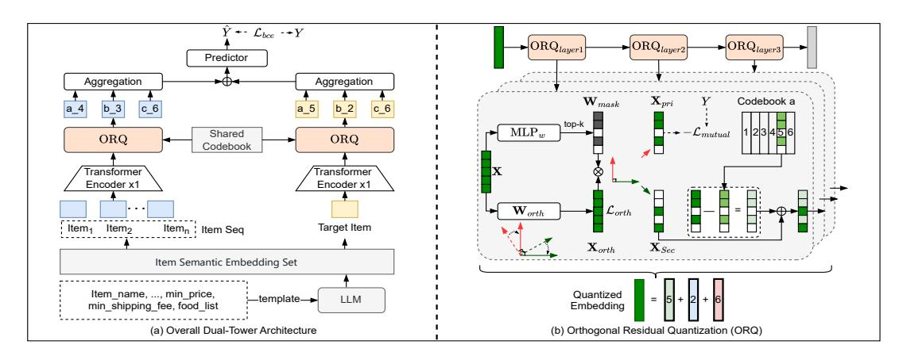

# DOS: Dual-Flow Orthogonal Semantic IDs for Recommendation in Meituan

Junwei Yin∗ Meituan Chengdu, China yinjunwei03@meituan.com

Senjie Kou∗ Meituan Chengdu, China kousenjie@meituan.com

Changhao Li Meituan Chengdu, China lichanghao@meituan.com

Shuli Wang† Meituan Chengdu, China wangshuli03@meituan.com

Xue Wei Meituan Chengdu, China weixue06@meituan.com

Yinqiu Huang Meituan Chengdu, China huangyinqiu@meituan.com

Yinhua Zhu Meituan Chengdu, China zhuyinhua@meituan.com

Haitao Wang Meituan Chengdu, China wanghaitao13@meituan.com

Xingxing Wang Meituan Beijing, China wangxingxing04@meituan.com

### Abstract

Semantic IDs serve as a key component in generative recommendation systems. They not only incorporate open-world knowledge from large language models (LLMs) but also compress the semantic space to reduce generation difficulty. However, existing methods suffer from two major limitations: (1) the lack of contextual awareness in generation tasks leads to a gap between the Semantic ID codebook space and the generation space, resulting in suboptimal recommendations; and (2) suboptimal quantization methods exacerbate semantic loss in LLMs. To address these issues, we propose Dual-Flow Orthogonal Semantic IDs (DOS) method. Specifically, DOS employs a user–item dual-flow framework that leverages collaborative signals to align the Semantic ID codebook space with the generation space. Furthermore, we introduce an orthogonal residual quantization scheme that rotates the semantic space to an appropriate orientation, thereby maximizing semantic preservation. Extensive offline experiments and online A/B testing demonstrate the effectiveness of DOS. The proposed method has been successfully deployed in Meituan's mobile application, serving hundreds of millions of users.

### CCS Concepts

- Information systems → Recommender systems; Computational advertising.

[This work is licensed under a Creative Commons Attribution-NonCommercial-](https://creativecommons.org/licenses/by-nc-nd/4.0)[NoDerivatives 4.0 International License.](https://creativecommons.org/licenses/by-nc-nd/4.0)

WWW '26, Dubai, United Arab Emirates © 2025 Copyright held by the owner/author(s). ACM ISBN 979-8-4007-2307-0/2026/04 <https://doi.org/10.1145/3774904.3792845>

### Keywords

Recommender Systems, Generative Recommendation, Semantic IDs

### ACM Reference Format:

Junwei Yin, Senjie Kou, Changhao Li, Shuli Wang, Xue Wei, Yinqiu Huang, Yinhua Zhu, Haitao Wang, and Xingxing Wang. 2025. DOS: Dual-Flow Orthogonal Semantic IDs for Recommendation in Meituan . In Proceedings of the ACM Web Conference 2026 (WWW '26), April 13–17, 2026, Dubai, United Arab Emirates. ACM, New York, NY, USA, [4](#page-3-0) pages. [https://doi.org/10.1145/](https://doi.org/10.1145/3774904.3792845) [3774904.3792845](https://doi.org/10.1145/3774904.3792845)

## 1 Introduction

Personalized recommendation in industrial settings involves selecting items from a candidate set of hundreds of millions. Traditional systems based on large-scale item-ID vocabularies pose a fundamental challenge to recommendation efficiency and parameter scaling. In contrast, the emerging paradigm of Generative Recommendation (GR), which utilizes Semantic IDs (SID), shows considerable promise for streamlining the recommendation pipeline and advancing scaling laws[\[2\]](#page-3-1). Semantic IDs serve as a critical module within this framework, notable for their ability to integrate the open-world knowledge from LLMs while simultaneously compressing the semantic space [\[1\]](#page-3-2) to alleviate the complexity of generation.

Despite their promise, current approaches to learning Semantic IDs remain suboptimal, primarily due to two inherent limitations. First, the Codebook-Generation Gap: Most existing methods learn Semantic IDs in a task-agnostic manner[\[1,](#page-3-2) [4\]](#page-3-3), often relying solely on reconstruction objectives. This approach overlooks the critical contextual information of the final generation task. Consequently, a significant gap emerges between the obtained Semantic ID codebook space and the generation space of the downstream task. This misalignment forces the generative model to operate with a suboptimal representation, ultimately leading to degraded recommendation quality. Second, Semantic Loss in Quantization: The quantization of continuous semantic representations into discrete tokens inevitably incurs information loss. While effective in other domains, prevailing quantization methods are not tailored

∗ Both authors contributed equally to this research.

† Corresponding author.

improves upon this by employing an encoder-decoder architecture to learn the quantization. DAS achieves inferior performance compared to our proposed DOS. This is because DAS aligns the user and item quantization processes indirectly through a collaborative information module, as opposed to the more integrated approach in DOS that directly models user behavior sequences with the target item. The relative indirectness of DAS's alignment may introduce semantic space deviation. Our DOS achieves even greater performance by utilizing an encoder coupled with an ORQ module, which proactively selects the most task-relevant semantic information. The rationale for not incorporating a decoder in DOS is elaborated upon in the ablation study (Section [3.3\)](#page-3-11).

Table 1: Performance Comparison with Respect to Downstream Task Metrics (AUC and F1-Score).

3.2.2 Downstream Next Token Prediction Performance. The quality of the SID generated by our DOS method is ascertained through evaluation within the HSTU framework. Model performance is benchmarked against the Hit@10 metric on both the overall dataset and four distinct business types (Busi\_A to Busi\_D). The results, summarized in Table [2,](#page-3-12) indicate that HSTU-DOS achieves significantly superior performance over HSTU-RQ-KMeans and HSTU-DAS. This finding is consistent with the downstream task results in Table [1,](#page-3-10) providing strong evidence for the enhanced efficacy of DOS in producing high-quality SID.

Table 2: Hit@10 Performance by Business Category.

| Model          | All    | Busi_A | Busi_B | Busi_C | Busi_D |
|----------------|--------|--------|--------|--------|--------|
| HSTU-RQ-KMeans | 0.0410 | 0.0252 | 0.0554 | 0.0398 | 0.0421 |
| HSTU-DAS       | 0.0511 | 0.0325 | 0.0672 | 0.0502 | 0.0541 |
| HSTU-DOS       | 0.0676 | 0.0457 | 0.0797 | 0.0730 | 0.0718 |

### 3.3 Ablation Study

To validate the design choices of our proposed DOS framework, we conducted comprehensive ablation studies. We evaluated three variants: "-w MLP-Encoder" (replacing the Transformer encoder with a two-layer MLP), "-w/o Share" (not sharing codebook), and "-w Decoder" (adding a decoder for reconstruction). As detailed in Table [3,](#page-3-13) all modifications lead to performance degradation. The MLP encoder fails to model sequence-item relationships effectively, while removing the shared codebook misaligns the semantic spaces of user behaviors and the target item. The performance drop from the added decoder stems from a conflict between its reconstruction objective and the goal of selecting task-relevant information.

Table 3: Ablation Study Results on AUC and F1-Score.

### 3.4 Online Experiment Results

To quantify the incremental gain from the SID generated by our DOS framework in a live environment, we conducted a one-week online A/B test using 30% of Meituan's production traffic. The experiment was designed to compare the original baseline model against a variant where SID were directly incorporated without any other architectural modifications.

The online A/B test demonstrated the effectiveness of our DOSgenerated Semantic ID (SID), which directly contributed to a 1.15% increase in online revenue. This result provides strong validation that the SID effectively captures task-relevant semantic information, leading to tangible business improvements.

### 4 Conclusion

In this paper, we propose Dual-flow Orthogonal Semantic IDs (DOS), a network devised to enhance generative recommendation by learning context-aware and semantically-rich compact representations. DOS models user–item interactions within a dual-flow integration framework (DFI) that aligns the Semantic ID codebook space with the generative space using collaborative signals. Specifically, we introduce an orthogonal residual quantization (ORQ) module, which rotates the semantic space to an optimal orientation to minimize information loss during quantization. Moreover, the orthogonal decomposition separates primary and residual semantic components, thereby maximizing semantic preservation and improving alignment for recommendation tasks. Extensive experiments on large-scale online A/B tests within Meituan's platform demonstrate the superiority of DOS in generative recommendation.

### References

[1] Yupeng Hou, Jiacheng Li, Ashley Shin, Jinsung Jeon, Abhishek Santhanam, Wei Shao, Kaveh Hassani, Ning Yao, and Julian McAuley. 2025. Generating long semantic IDs in parallel for recommendation. In Proceedings of the 31st ACM SIGKDD Conference on Knowledge Discovery and Data Mining V. 2. 956–966. [2] Yupeng Hou, Jianmo Ni, Zhankui He, Noveen Sachdeva, Wang-Cheng Kang, Ed H Chi, Julian McAuley, and Derek Zhiyuan Cheng. 2025. ActionPiece: Contextually Tokenizing Action Sequences for Generative Recommendation. arXiv preprint arXiv:2502.13581 (2025). [3] Xinchen Luo, Jiangxia Cao, Tianyu Sun, Jinkai Yu, Rui Huang, Wei Yuan, Hezheng Lin, Yichen Zheng, Shiyao Wang, Qigen Hu, et al. 2025. Qarm: Quantitative alignment multi-modal recommendation at kuaishou. In Proceedings of the 34th ACM International Conference on Information and Knowledge Management. 5915– 5922. [4] Shashank Rajput, Nikhil Mehta, Anima Singh, Raghunandan Hulikal Keshavan, Trung Vu, Lukasz Heldt, Lichan Hong, Yi Tay, Vinh Tran, Jonah Samost, et al. 2023. Recommender systems with generative retrieval. Advances in Neural Information Processing Systems 36 (2023), 10299–10315. [5] Bin Tan, Wangyao Ge, Yidi Wang, Xin Liu, Jeff Burtoft, Hao Fan, and Hui Wang. 2025. PCR-CA: Parallel Codebook Representations with Contrastive Alignment for Multiple-Category App Recommendation. arXiv preprint arXiv:2508.18166 (2025). [6] Yining Yao, Ziwei Li, Shuwen Xiao, Boya Du, Jialin Zhu, Junjun Zheng, Xiangheng Kong, and Yuning Jiang. 2025. SaviorRec: Semantic-Behavior Alignment for Cold-Start Recommendation. arXiv preprint arXiv:2508.01375 (2025). [7] Wencai Ye, Mingjie Sun, Shaoyun Shi, Peng Wang, Wenjin Wu, and Peng Jiang. 2025. DAS: Dual-Aligned Semantic IDs Empowered Industrial Recommender System. In Proceedings of the 34th ACM International Conference on Information and Knowledge Management. 6217–6224. [8] Neil Zeghidour, Alejandro Luebs, Ahmed Omran, Jan Skoglund, and Marco Tagliasacchi. 2021. Soundstream: An end-to-end neural audio codec. IEEE/ACM Transactions on Audio, Speech, and Language Processing 30 (2021), 495–507. [9] Jiaqi Zhai, Lucy Liao, Xing Liu, Yueming Wang, Rui Li, Xuan Cao, Leon Gao, Zhaojie Gong, Fangda Gu, Michael He, et al. 2024. Actions speak louder than words: Trillion-parameter sequential transducers for generative recommendations. arXiv preprint arXiv:2402.17152 (2024).