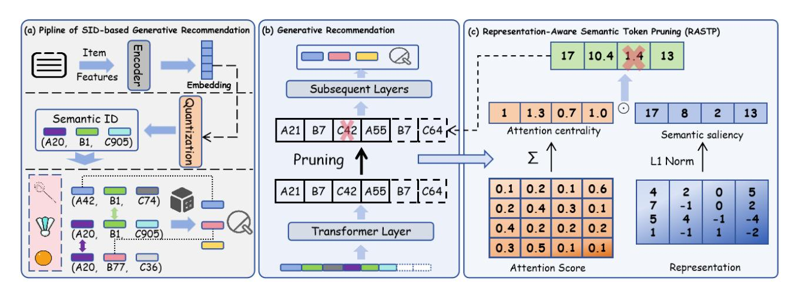
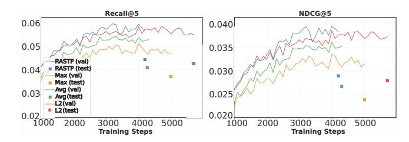
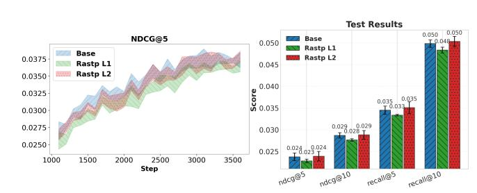

# RASTP: Representation-Aware Semantic Token Pruning for Generative Recommendation with Semantic Identifiers

Tianyu Zhan∗ Zhejiang University Hangzhou, Zhejiang, China yuzt@zju.edu.cn

Kairui Fu∗ Zhejiang University Hangzhou, Zhejiang, China fukairui.fkr@zju.edu.cn

Zheqi Lv† Zhejiang University Hangzhou, Zhejiang, China zheqilv@zju.edu.cn

Shengyu Zhang† Zhejiang University Hangzhou, Zhejiang, China sy\_zhang@zju.edu.cn

### Abstract

Generative recommendation systems typically leverage Semantic Identifiers (SIDs), which represent each item as a sequence of tokens that encode semantic information. However, representing item ID with multiple SIDs significantly increases input sequence length, which is a major determinant of computational complexity and memory consumption. While existing efforts primarily focus on optimizing attention computation and KV cache, we propose RASTP (Representation-Aware Semantic Token Pruning), which directly prunes less informative tokens in the input sequence. Specifically, RASTP evaluates token importance by combining semantic saliency, measured via representation magnitude, and attention centrality, derived from cumulative attention weights. Since RASTP dynamically prunes low-information or irrelevant semantic tokens, experiments on three real-world Amazon datasets show that RASTP reduces training time by 26.7%, while maintaining or slightly improving recommendation performance. The code has been open-sourced at https://github.com/Yuzt-zju/RASTP.

# CCS Concepts

- Information systems → Recommender systems.

# Keywords

Generative Recommendation Systems, Model Acceleration

### ACM Reference Format:

Tianyu Zhan, Kairui Fu, Zheqi Lv, and Shengyu Zhang. 2026. RASTP: Representation-Aware Semantic Token Pruning for Generative Recommendation with Semantic Identifiers . In Proceedings of the ACM Web Conference 2026 (WWW '26), April 13–17, 2026, Dubai, United Arab Emirates. ACM, New York, NY, USA, [4](#page-3-0) pages.<https://doi.org/10.1145/3774904.3792846>

∗Both authors contributed equally to this research. †Corresponding authors.

[This work is licensed under a Creative Commons Attribution 4.0 International License.](https://creativecommons.org/licenses/by/4.0) WWW '26, Dubai, United Arab Emirates © 2026 Copyright held by the owner/author(s). ACM ISBN 978-1-4503-XXXX-X/2018/06 <https://doi.org/10.1145/3774904.3792846>

# 1 INTRODUCTION

Generative Recommendation (GR) has recently emerged as a powerful paradigm in industrial recommender systems. Unlike prior methods that merely used large models to augment traditional pipelines [\[5,](#page-3-1) [11\]](#page-3-2), GR performs end-to-end next-item prediction by directly generating item identifiers. Central to this paradigm is the adoption of Semantic Identifiers (SIDs), which represent each item as a hierarchical sequence of semantic codewords [\[4,](#page-3-3) [13\]](#page-3-4). This design enables semantically similar items to share representations and supports a compact encoding of an exponentially large item space without a massive vocabulary.

Pioneered by TIGER [\[6\]](#page-3-5), which adapted transformer-based sequence modeling to predict item SIDs for recommendation, subsequent works have enhanced SID-based GR using auxiliary information or advanced architectures [\[7,](#page-3-6) [9\]](#page-3-7). Recent efforts have introduced standardized frameworks [\[3\]](#page-3-8) and industrial-scale benchmarks [\[1\]](#page-3-9) to advance SID-based generative recommendation.

Despite their strong performance, using SIDs incurs significant computational overhead. The representation of SIDs made of multiple tokens introduces substantially longer input sequences. This expansion leads to increased training times, which constitutes a critical bottleneck in industrial settings, where models must be retrained daily on billions of new interactions to remain up-to-date. While existing works primarily target attention computation [\[10\]](#page-3-10), KV caching [\[8\]](#page-3-11), direct optimization of the SIDs remains underexplored, leading to a significant waste of computational resources on meaningless calculations.

Therefore, to address the limitations of existing methods, we focus on observing semantic information and find that not all semantic features of items contribute equally to predictions, as users typically only attend to a subset of them. This phenomenon is reflected in the tokens. After processing through Transformer layers, certain tokens become redundant because their content has already been represented by more informative tokens. Motivated by these observations and related works [\[2,](#page-3-12) [12\]](#page-3-13), we propose RASTP (Representation-Aware Semantic Token Pruning), a efficient strategy that dynamically identifies and retains more informative SIDs. RASTP evaluates token importance based on attention weights and intermediate representations from Transformer layer, enabling the model to dynamically focus on the most discriminative SIDs.

We evaluate RASTP on three real-world datasets. Experimental results show that RASTP achieves a 26.7% reduction in training time

Figure 1: Overview of RASTP. (a) Workflow of SID-based generative recommendation (GR). (b) and (c) Detailed integration of RASTP into the GR framework.

Table 1: Training hyperparameters.

| Model Hyperparameter |                 | Setting                  |
|----------------------|-----------------|--------------------------|
| (T5 Encoder-Decoder) |                 |                          |
|                      | GPU             | NVIDIA A100-PCIE-40GB    |
| Optimizer            |                 | Adam                     |
| Learning             | rate            | 1 × 10 − 3               |
| Weight               | decay           | 1 × 10 − 4               |
| Dropout              | rate            | 0.15                     |
| Batch size           | (per device)    | 32                       |
| Sequence             | length          | 120                      |
| Transformer          | layers          | 8 (4 enc + 4 dec)        |
| Embed dim /          | Heads / MLP dim | 128 / 6 / 1024           |
| Validation           | interval        | 1,600 steps              |
| Early stopping       | patience        | 10                       |
| seeds                |                 | [1, 42, 999, 1024, 2025] |

### 3 EXPERIMENTS

In this section, we conduct extensive experiments on three real world datasets to answer the following research questions:

- RQ1: How does the introduction of RASTP influence the recommendation performance and training efficiency of SIDbased generative recommendation?
- RQ2: How do alternative token pruning strategies affect recommendation performance?
- RQ3: At which layer should pruning be applied to optimally balance model performance and computational efficiency?

### 3.1 Experimental Settings

3.1.1 Datasets. We conduct our evaluation on the 5-core filtered Amazon datasets for Beauty, Sports, and Toys. For each user, we reserve the last interaction as the test sample, the second-to-last for validation, and all earlier interactions for training.

3.1.2 Metrics. We report Recall@�� and NDCG@�� (�� ∈ {5, 10}) on the test set, using the checkpoint with the best validation Recall@5.

3.1.3 Implementation Details. For SID tokenization, item textual features are encoded by Flan-T5-XL. We use RK-Means with three codebooks by default, as the quantization method does not affect our

core findings. The generative recommendation model employs an encoder-decoder architecture with 8 Transformer layers (4 encoder + 4 decoder). All other hyperparameters are configured as detailed in Table [1.](#page-2-3)

### 3.2 Performance with RASTP (RQ1)

We present the recommendation performance with and without RASTP in Table [2,](#page-3-14) where all results are reported as mean ± standard deviation over five random seeds. According to statistics, applying RASTP after the second Transformer layer in the encoder achieves a 26.7% training speedup (computed as (��orig −��RASTP)/��orig) while maintaining highly competitive performance across all metrics and datasets. Notably, on the beauty and toys datasets, RASTP consistently delivers slight gains, suggesting that pruning semantically redundant or noisy tokens reduces interference and improves representation quality. These results confirm that RASTP effectively enhances training efficiency in generative recommendation without sacrificing accuracy.

### 3.3 Different Pruning Strategies (RQ2)

To investigate how different token pruning strategies affect recommendation performance, we compare RASTP against two baselines: (1) simple pooling methods, specifically max and average pooling, and (2) an information-aware selection strategy based on the ℓ2 norm of token representations. Results in Figure [2](#page-3-15) show that pooling methods cause a substantial performance drop due to excessive loss of fine-grained semantic information. Although ℓ2-norm-based pruning performs better, it still lags behind RASTP. In contrast, RASTP consistently maintains strong performance across all evaluation metrics, demonstrating that its representation-aware token selection effectively preserves semantic fidelity while enabling sequence compression.

### 3.4 Performance or Efficiency (RQ3)

Generative recommendation models typically employ multi-layer Transformer architectures, in which the timing of token pruning critically affects the trade-off between efficiency and performance.

Table 2: Performance comparison with (✓) and without (×) RASTP.

| Metric    |        | (×)      | beauty | ( ✓ )    |        | (×)      | sports | ( ✓ )    |        | (×)      | toys   | ( ✓ )    |
|-----------|--------|----------|--------|----------|--------|----------|--------|----------|--------|----------|--------|----------|
| Recall@5  | 0.0426 | ± 0.0013 | 0.0441 | ± 0.0010 | 0.0196 | ± 0.0007 | 0.0187 | ± 0.0007 | 0.0345 | ± 0.0010 | 0.0351 | ± 0.0014 |
| Recall@10 | 0.0645 | ± 0.0019 | 0.0656 | ± 0.0011 | 0.0289 | ± 0.0008 | 0.0278 | ± 0.0014 | 0.0499 | ± 0.0008 | 0.0504 | ± 0.0012 |
| NDCG@5    | 0.0282 | ± 0.0014 | 0.0289 | ± 0.0011 | 0.0128 | ± 0.0005 | 0.0123 | ± 0.0006 | 0.0238 | ± 0.0009 | 0.0240 | ± 0.0011 |
| NDCG@10   | 0.0353 | ± 0.0013 | 0.0358 | ± 0.0010 | 0.0158 | ± 0.0005 | 0.0153 | ± 0.0008 | 0.0287 | ± 0.0006 | 0.0289 | ± 0.0010 |

Figure 2: Comparison of Different Pruning Strategies.

Figure 3: Validation curves and test results of RASTP after different layers

As shown in Figure [3,](#page-3-16) applying RASTP after the first layer can achieve the highest training speedup 38.22% but incurs a noticeable drop in performance. This suggests that pruning at early layers may discard useful information, harming recommendation performance. In contrast, applying RASTP after the second layer strikes an optimal balance. It reduces training time by 26.7% while preserving recommendation accuracy, as reported in Table [2.](#page-3-14) Pruning at later layers matches the performance of the second layer but with significantly lower training speedup. These findings indicate that token pruning is more effective when applied at an intermediate layer, after less informative tokens have been sufficiently absorbed by more representative ones through contextual interaction.

# 4 CONCLUSION

In this work, we propose RASTP (Representation-Aware Semantic Token Pruning), a efficient strategy for SID-based generative recommendation systems. RASTP dynamically prunes less informative SIDs by combining attention centrality and semantic saliency. This speeds up model without harming recommendation quality. We evaluate RASTP on three real-world datasets and find that it achieves a 26.7% training speedup while maintaining performance. Future work will extend RASTP to diverse model architectures and explore layer-wise adaptive pruning strategies.

# 5 ACKNOWLEDGMENTS

This work is supported by the 2030 National Science and Technology Major Project (2022ZD0119100).

### References

[1] Kairui Fu, Tao Zhang, Shuwen Xiao, Ziyang Wang, Xinming Zhang, Chenchi Zhang, Yuliang Yan, Junjun Zheng, Yu Li, Zhihong Chen, et al. 2025. Forge: Forming semantic identifiers for generative retrieval in industrial datasets. arXiv preprint arXiv:2509.20904 (2025). [2] Zhiyu Guo, Hidetaka Kamigaito, and Taro Watanabe. 2024. Attention Score is not All You Need for Token Importance Indicator in KV Cache Reduction: Value Also Matters. In Proceedings of the 2024 Conference on Empirical Methods in Natural Language Processing. 21158–21166. [3] Clark Mingxuan Ju, Liam Collins, Leonardo Neves, Bhuvesh Kumar, Louis Yufeng Wang, Tong Zhao, and Neil Shah. 2025. Generative Recommendation with Semantic IDs: A Practitioner's Handbook. In Proceedings of the 34th ACM International Conference on Information and Knowledge Management (CIKM). [4] Doyup Lee, Chiheon Kim, Saehoon Kim, Minsu Cho, and Wook-Shin Han. 2022. Autoregressive image generation using residual quantization. In Proceedings of the IEEE/CVF conference on computer vision and pattern recognition. 11523–11532. [5] Zheqi Lv, Tianyu Zhan, Wenjie Wang, Xinyu Lin, Shengyu Zhang, Wenqiao Zhang, Jiwei Li, Kun Kuang, and Fei Wu. 2025. Collaboration of Large Language Models and Small Recommendation Models for Device-Cloud Recommendation. In Proceedings of the 31st ACM SIGKDD Conference on Knowledge Discovery and Data Mining V. 1. 962–973. [6] Shashank Rajput, Nikhil Mehta, Anima Singh, Raghunandan Hulikal Keshavan, Trung Vu, Lukasz Heldt, Lichan Hong, Yi Tay, Vinh Tran, Jonah Samost, et al. 2023. Recommender systems with generative retrieval. Advances in Neural Information Processing Systems 36 (2023), 10299–10315. [7] Juntao Tan, Shuyuan Xu, Wenyue Hua, Yingqiang Ge, Zelong Li, and Yongfeng Zhang. 2024. Idgenrec: Llm-recsys alignment with textual id learning. In Proceedings of the 47th international ACM SIGIR conference on research and development in information retrieval. 355–364. [8] Chaoqun Yang, Xinyu Lin, Wenjie Wang, Yongqi Li, Teng Sun, Xianjing Han, and Tat-Seng Chua. 2025. EARN: Efficient Inference Acceleration for LLM-based Generative Recommendation by Register Tokens. In Proceedings of the 31st ACM SIGKDD Conference on Knowledge Discovery and Data Mining V. 2. 3483–3494. [9] Yuhao Yang, Zhi Ji, Zhaopeng Li, Yi Li, Zhonglin Mo, Yue Ding, Kai Chen, Zijian Zhang, Jie Li, Shuanglong Li, et al. 2025. Sparse meets dense: Unified generative recommendations with cascaded sparse-dense representations. arXiv preprint arXiv:2503.02453 (2025). [10] Yufei Ye, Wei Guo, Hao Wang, Hong Zhu, Yuyang Ye, Yong Liu, Huifeng Guo, Ruiming Tang, Defu Lian, and Enhong Chen. 2025. Fuxi-\beta: Towards a lightweight and fast large-scale generative recommendation model. arXiv preprint arXiv:2508.10615 (2025). [11] Qihang Yu, Kairui Fu, Shengyu Zhang, Zheqi Lv, Fan Wu, and Fei Wu. 2025. ThinkRec: Thinking-based recommendation via LLM. arXiv[:2505.15091](https://arxiv.org/abs/2505.15091) [cs.IR] <https://arxiv.org/abs/2505.15091> [12] Zhenyu Zhang, Ying Sheng, Tianyi Zhou, Tianlong Chen, Lianmin Zheng, Ruisi Cai, Zhao Song, Yuandong Tian, Christopher Ré, Clark Barrett, et al. 2023. H2o: Heavy-hitter oracle for efficient generative inference of large language models. Advances in Neural Information Processing Systems 36 (2023), 34661–34710. [13] Guorui Zhou, Jiaxin Deng, Jinghao Zhang, Kuo Cai, Lejian Ren, Qiang Luo, Qianqian Wang, Qigen Hu, Rui Huang, Shiyao Wang, et al. 2025. OneRec Technical Report. arXiv preprint arXiv:2506.13695 (2025).