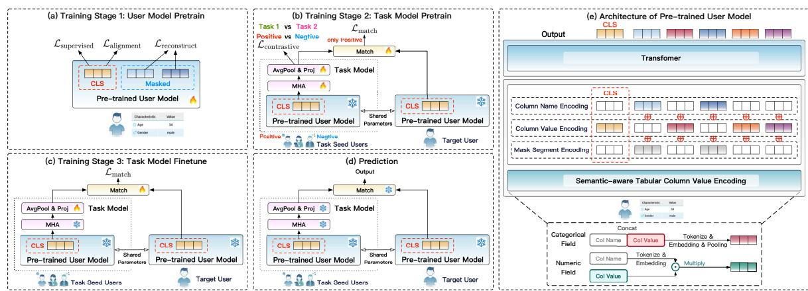
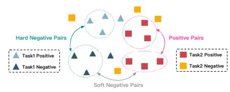
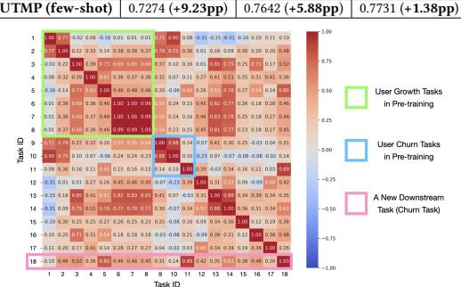

# Few-shot and Zero-shot Audience Expansion with User and Task Model Pre-training on Tabular Data

[Siwei Qiang](https://orcid.org/)∗ boyue.qsw@mybank.cn MYBank, Ant Group Shanghai, China

[Pengyu Li](https://orcid.org/)∗ fangqu.lpy@mybank.cn MYBank, Ant Group Hangzhou, China

[Zhe Yu](https://orcid.org/)∗ shangshan.yz@mybank.cn MYBank, Ant Group Hangzhou, China

[Mengyao Sun](https://orcid.org/)∗ 23120309@bjtu.edu.cn Beijing Jiaotong University Beijing, China

[Jun Chen](https://orcid.org/) jingyu.cj@mybank.cn MYBank, Ant Group Beijing, China

[Bo Zheng](https://orcid.org/) guangyuan@mybank.cn MYBank, Ant Group Hangzhou, China

# Abstract

To effectively promote products and services to target users, Internet companies conduct numerous marketing campaigns monthly. A critical challenge is audience expansion—identifying similar users from seed users—which is complicated by three factors: (1) high modeling costs due to the volume of campaigns; (2) limited user coverage per campaign, requiring precision in few-shot scenarios; and (3) the need for robust zero-shot performance for rapid adaptability. This paper introduces UTMP, a multi-stage pre-training framework for few-shot and zero-shot audience expansion on tabular data. The first stage employs hybrid pre-training for cross-task generalization. The second stage uses task contrastive learning and task-user matching to pre-train the task model based on seed users. The third stage includes optional fine-tuning for downstream tasks. Experiments on real-world datasets demonstrate its effectiveness.

# CCS Concepts

#### • Information systems → Online advertising.

# Keywords

Audience Expansion; Representation Learning; Model Pre-training

#### ACM Reference Format:

Siwei Qiang, Pengyu Li, Zhe Yu, Mengyao Sun, Jun Chen, and Bo Zheng. 2026. Few-shot and Zero-shot Audience Expansion with User and Task Model Pre-training on Tabular Data. In Proceedings of the ACM Web Conference 2026 (WWW '26), April 13–17, 2026, Dubai, United Arab Emirates. ACM, New York, NY, USA, [4](#page-3-0) pages.<https://doi.org/10.1145/3774904.3792847>

## 1 Introduction

In digital marketing, effectively targeting users is crucial for Internet companies [\[1,](#page-3-1) [10,](#page-3-2) [15\]](#page-3-3). Audience expansion, which identifies users similar to seed users, plays a key role. Seed users are often selected manually or derived from past campaigns. However, with the exponential growth of user data, automated and scalable solutions

∗The authors contributed equally to this research.

© 2026 Copyright held by the owner/author(s). ACM ISBN 979-8-4007-2307-0/2026/04 <https://doi.org/10.1145/3774904.3792847>

are essential. High-quality audience expansion boosts campaign reach, user engagement, and ROI, making it a pivotal research area.

Despite its importance, audience expansion faces key challenges. First, high campaign volumes make individual modeling costly, necessitating a generalizable solution. Second, in few-shot settings with limited seed users, models must achieve high precision despite scarce data. Third, in zero-shot scenarios requiring rapid responsiveness, models should infer similarities directly from pretrained knowledge. Existing methods include similarity-based [\[8,](#page-3-4) [9\]](#page-3-5) and embedding-based [\[3,](#page-3-6) [6\]](#page-3-7) approaches. Similarity-based methods rely on pairwise metrics, which are sensitive to definitions and may underperform if misdefined. Embedding-based methods map users into a latent space for efficiency but often struggle with limited capacity and generalization. Pre-training successes in NLP and computer vision demonstrate potential for learning transferable representations, offering promise for audience expansion.

However, effectively applying pre-training to audience expansion remains challenging. In this context, user features are typically represented in tabular form, including categorical (e.g., demographics) and numerical data (e.g., activity metrics). The main challenge stems from the unique nature of tabular data. Unlike sequential text or pixel-based image data, it is structured into rows and columns and often contains heterogeneous fields, such as categorical and numerical types. This heterogeneity poses substantial challenges for pre-training. Several algorithms have been proposed for tabular data pre-training [\[12](#page-3-8)[–14\]](#page-3-9). However, applying pre-training to audience expansion is still challenging due to the lack of mechanisms for aggregating user-level representations into task-level ones, creating a gap between user- and task-level understanding. Bridging this gap is crucial for effective audience expansion solutions.

To address these challenges, we propose User and Task Model Pre-training (UTMP). Our contributions are as follows:

- We propose a multi-stage training framework, comprising user model pre-training, task model pre-training, and optional downstream task fine-tuning, specifically designed for few-shot and zero-shot audience expansion.
- For user model pre-training, we propose a novel tabular encoding scheme and leverage reconstruction, supervised, and alignment learning to enhance cross-task generalization. For task model pre-training, we introduce task contrastive learning alongside a task-user matching learning approach for adaptive aggregation of seed user representations.

[This work is licensed under a Creative Commons Attribution 4.0 International License.](https://creativecommons.org/licenses/by/4.0) WWW '26, Dubai, United Arab Emirates.

Figure 1: Overview of workflow and model architecture of UTMP. The training process comprises three stages: user model pre-training, task model pre-training, and optional downstream task fine-tuning. In the user model, as shown in (e), tabular features are first encoded into embeddings using semantic-aware tabular column value encoding. During pre-training, random masking is applied, with mask segments providing distinction. The features are then processed via a Transformer, with the CLS token to extract an overall user representation. In (a) user model pre-training (training stage 1), the model adopts three pre-training strategies: reconstructing masked fields, supervised pre-training based on labeled data, and alignment pre-training on unlabeled data with two random masks. In (b) task model pre-training (training stage 2), the task model builds upon the user model by aggregating seed user representations into task-level representations through multi-head attention, average pooling, and projection layers. The model performs contrastive pre-training across different labels of various tasks and conducts matching pre-training based on users' task label affiliations. In (c) task model fine-tuning (training stage 3), the model can be further fine-tuned for downstream tasks as required. Finally, in (d) prediction, for new tasks, the task representation derived from seed users is utilized for audience expansion, predicting the probability of target users being positive samples for the given task.

#### 2 Methodology

#### 2.1 System Overview

The UTMP system training consists of three stages, as shown in Figure [1.](#page-1-0) In the first stage, the user model is pre-trained on labeled and unlabeled data using supervised learning and alignment learning at the sample level, along with masked field reconstruction at the feature level. In the second stage, the task model is pre-trained by aggregating seed users across tasks, labels, and sampling batches through task contrastive learning and task-user matching. An optional third stage fine-tunes the model for downstream tasks.

#### 2.2 User Model Pre-training

The first stage of training aims to pre-train the user model on tabular data for cross-task generalization. The user model architecture comprises a feature encoding layer, a Transformer-based feature interaction layer that leverages the Transformer's ability to capture complex feature dependencies, and a prediction layer.

The feature encoding layer uses a semantic-aware tabular feature encoder to transform tabular fields into low-dimensional vectors. Tabular column names are textual and semantically rich, while column values may include categorical, textual, or continuous data. To handle these value types, we process them separately. For categorical and textual features, the column name and value are concatenated, tokenized, and embedded using a pretrained language model, then pooled into a single input token. For numerical features, the column name is tokenized, embedded, and pooled, with the embedding scaled by the numerical value to reflect its magnitude.

e cat �� = Pooling Tokenize Concat �� cat name, ��cat value , e num �� = �� cat value · Pooling Tokenize Concat �� cat name , (1) H 0 = [e CLS , e cat 0 , ..., e cat �� , e num 0 , e num �� ]. (2)

Here, �� cat name, �� cat value, �� num name, and �� num value represent the column names and values of categorical (or textual) and numerical features, respectively. H 0 denotes the Transformer input, formed by concatenating all features with the [CLS] classification token embedding e CLS .

Since tabular data requires permutation invariance (i.e., column order should not affect predictions), positional encoding is omitted. To achieve cross-task generalization, we use a masking-based pretraining strategy. By predicting masked features from retained ones, the model learns feature relationships, enabling knowledge transfer across tasks. To address field reconstruction without positional encoding, we propose a novel masking mechanism: semantic-aware encodings for non-masked fields and column name embeddings for masked fields. Additionally, a mask segment encoding distinguishes masked numerical features from unmasked ones with a value of 1.

A ��-layer Transformer, with each layer comprising multi-head attention (MHA), layer normalization (LN), and feedforward (FFN) components, is utilized for feature interaction. For the ��-th layer:

H ��+1 = LN FFN LN H �� + MHA H . (3)

In the output layer, the primary pre-training task is feature reconstruction, combined with supervised prediction tasks when labels are available and the alignment task when labels are unavailable.

The reconstruction task requires the model to recover the original column values from the masked data. Specifically, cross-entropy loss (CE) is employed for categorical and textual features, while mean squared error loss (MSE) is utilized for numerical features.

Lreconstruct = 1 �� ∑︁�� ��=1 CE(�� cat �� , ��ˆ cat ) + 1 �� ∑︁�� ��=1 MSE(�� num �� , ��ˆ num �� ). (4)

Here, �� cat �� and �� num �� represent the true column values, while ��ˆ cat �� and ��ˆ num �� denote the reconstructed column values, with a total of �� categorical and textual features and �� numerical features.

For labeled data, supervised loss is employed. To prevent the dominance of larger tasks in model gradient optimization during multi-task learning, the cross-entropy loss for each task (assuming classification tasks) is first computed, followed by averaging across all tasks to ensure that smaller tasks are also effectively learned.

Lsupervised = 1 �� ∑︁�� ��=1 L task �� = 1 �� ∑︁�� ��=1 CE(�� task �� , ��ˆ task �� ). (5)

where �� task and ��ˆ task �� denote the true label and the predicted result based on the [CLS] token, respectively, across a total of �� tasks.

For unlabeled data, alignment loss is employed. Inspired by the method in SimCSE [\[4\]](#page-3-10), each sample is randomly masked twice, and the outputs of the [CLS] token are encouraged to be consistent.

Lalignment = | |e L,CLS ��������1 − e L,CLS ��������2 | |2 . (6)

where e L,CLS ��������1 and e L,CLS ��������2 represent the [CLS] token outputs from the last layer for two masked instances of the same sample.

The overall pre-training loss for the user model is defined as follows, where ��1 and ��2 are hyperparameters.

L user pre-train = Lreconstruct + ��1Lsupervised + ��2Lalignment. (7)

#### 2.3 Task Model Pre-training and Fine-tuning

The second stage of training focuses on pre-training the task model for audience expansion. This stage relies on aggregating seed user representations generated by the frozen user model. To facilitate adaptive learning of the user representation aggregation process, a multi-head attention mechanism is applied prior to the aggregation layer. This allows the model to capture inter-user interactions and emphasize the influence of key users. Subsequently, the representations are aggregated using average pooling, followed by a projection layer that extracts task-specific representations.

z task = Proj AvgPool MHA [e L,CLS 1 , ..., e L,CLS �� , (8)

where e L,CLS �� represents the output of the [CLS] token from the user model for the ��-th user, and there are a total of �� users.

To achieve audience expansion and provide supervision for learning task representations, we adopt a matching approach based on an MLP network to align task representations with user representations. This approach ensures that the task representation can effectively distinguish user-task affiliation relationships.

��task = MLP [z task , e L,CLS , (9)

where e L,CLS �� represents the encoded representation of the ��-th test user, and��task indicates the probability of this user being associated with the expansion of the seed users given above.

The loss in this stage consists of a contrastive learning loss for task representations and a supervised matching loss. The matching loss is the binary cross-entropy (BCE) that evaluates whether the estimated users and seed users belong to the same task and label.

Lmatch = BCE(��task ,��ˆ task ), (10)

where ��task and ��ˆ task denote the true and predicted user-task affiliation relationships for the ��-th sample, respectively.

The objective of the contrastive loss is to bring the task representations sampled from different seed users within the same task and label as close as possible, while pushing apart the task representations sampled from users with different tasks or labels. Inspired by SupCon [\[7\]](#page-3-11), the contrastive loss is defined as follows:

Figure 2: Illustration of task contrastive learning sample setup.

Lcontrastive = log Í �� ∈�� (��) �� (z�� , z�� ) Í �� ∈�� (��) �� (z�� , z�� ) +��1 Í �� ∈��h �� (z�� , z�� ) +��2 Í �� ∈��s(��) �� (z�� , z�� ) , �� (z�� , z�� ) = exp sim z�� , z�� /�� . (11)

Specifically, as illustrated in Figure [2,](#page-2-0) positive samples consist of batches from the same task and label, hard negative samples are derived from batches with the same task but different labels, and soft negative samples are derived from batches associated with different tasks. In Equation [\(11\)](#page-2-1), z�� and z�� are task embeddings, �� (��), ��h (��), and ��s(��) represent the positive, hard negative, and soft negative pairs for the ��-th seed user set, respectively. Additionally, sim(., .) denotes the cosine similarity, and ��1, ��2, and �� are hyperparameters.

The overall pre-training loss for the task model is defined below, with �� as a hyperparameter.

L task pre-train = Lmatch + �� Lcontrastive. (12)

An optional third stage on downstream task data can further finetune the model. During prediction, audience expansion is achieved by ranking users according to their match scores ��task.

#### 3 Experiments

### 3.1 Main Results

We validate the proposed UTMP method using an anonymized, real-world industrial dataset from an internet wealth management platform. We sample five major categories, covering user growth, user churn, user preference, marketing, and others, comprising a total of 17 tasks for pre-training and fine-tuning the user model and task model. The audience expansion performance is then evaluated on new tasks. Tabular features include user profile, behavior, and contextual data. To benchmark performance, we compare against widely-used CTR/CVR models, including Wide&Deep [\[2\]](#page-3-12), DeepFM [\[5\]](#page-3-13), and DCN [\[11\]](#page-3-14), which serve as strong baselines. To prevent data leakage, training and test sets, as well as pre-training and new tasks, are strictly isolated chronologically.

Experimental results for user models are presented in Table [1.](#page-3-15) Here, DeepFM is trained and tested independently for each task, while the DeepFM multi-task model adds a dedicated prediction head for each task and trains them jointly. The results show that multi-task learning outperforms single-task learning due to shared representations and inter-task dependency modeling. UTMP achieves the best performance, benefiting from its Transformerbased architecture, as well as its incorporation of a broader range of pre-training tasks that enrich the learned representations. Table [2](#page-3-16) shows the audience expansion results with task models. On new tasks, the pre-trained model achieves zero-shot inference with an average AUC improvement of 3.2pp over the best baseline. After fine-tuning with few-shot learning on downstream tasks, it demonstrates an average AUC improvement of 7.1pp. These results highlight the effectiveness of the proposed approach in utilizing

Table 1: Test AUC Values Across 4 Major Categories and 17 Tasks in Internet Wealth Management Operation Scenarios (Higher is Better). Models User Growth User Churn User Preferences Marketing Other

Task1 Task2 Task3 Task4 Task5 Task6 Task7 Task8 Task9 Task10 Task11 Task12 Task13 Task14 Task15 Task16 Task17 Avg

DeepFM 0.9596 0.8278 0.9824 0.9910 0.9956 0.9907 0.8032 0.5024 0.9003 0.8760 0.8863 0.7400 0.6357 0.7786 0.7763 0.9302 0.7712 0.8440 DeepFM multi-task 0.9767 0.9759 0.9863 0.9902 0.9955 0.9931 0.9873 0.9970 0.8934 0.8583 0.8970 0.7173 0.6213 0.7082 0.7662 0.9407 0.7546 0.8858 UTMP (user model) 0.9779 0.9878 0.9875 0.9928 0.9945 0.9932 0.9910 0.9954 0.9084 0.8595 0.8879 0.7754 0.6337 0.7532 0.7760 0.9410 0.7296 0.8932

Table 2: Comparison of Models for Audience Expansion in New Tasks (Higher is Better).

| Models           | AUC (Test Set | 1) AUC (Test Set | 2) AUC (Test Set 3) |
|------------------|---------------|------------------|---------------------|
| Wide&Deep        | 0.693         | 0.775            | 0.712               |
| DeepFM           | 0.682         | 0.695            | 0.730               |
| DCN              | 0.615         | 0.735            | 0.658               |
| UTMP (zero-shot) | 0.779         | 0.806            | 0.710               |
| UTMP (few-shot)  | 0.780         | 0.855            | 0.776               |

Table 3: Ablation Study for Task Model in Zero-Shot and Few-Shot Scenarios. Lift shows MHA's improvement over non-MHA models.

Table 4: Ablation Study for Few-Shot Learning with Varying Fine-Tuning Sizes. Bold values show improvements over DeepFM.

Models #sample=1000 #sample=5000 #sample=50000 DeepFM 0.6351 0.7054 0.7593

Figure 3: Visualization of Task Representation Cosine Similarity. pre-trained knowledge and task-specific fine-tuning, showcasing strong generalization and adaptability to novel tasks.

Our experiments were conducted using PyTorch on NVIDIA A100 80GB GPUs. For zero-shot learning, inference on 10 million samples with nearly 10,000 features takes 3.5 hours, meeting batch processing requirements and ensuring scalable deployment.

### 3.2 Ablation Study

To validate the effectiveness of MHA in the task model, we compare the full model with a variant that excludes MHA (using only average pooling to derive task representations from user representations), as shown in Table [3.](#page-3-17) The results show consistent performance improvements with MHA, indicating its ability to effectively leverage inter-user information for task representation extraction.

To evaluate UTMP's few-shot learning capability, we analyze the impact of varying sample sizes for new tasks on fine-tuning performance, as presented in Table [4.](#page-3-18) The results show more significant performance gains on smaller training sets, underscoring the model's strong adaptability in low-data scenarios.

# 3.3 Visualization

Figure [3](#page-3-19) displays the similarity between the 17 pre-training tasks and a new task. The green and blue boxes represent user growth and churn tasks, respectively, with higher similarity within the same task type. The pink box highlights the similarity of a new churn task to others. Notably, this new churn task is most similar to Task 11, also a churn task. These findings confirm the effectiveness and reasonableness of the learned task representations.

#### 4 Conclusion

In this paper, we propose UTMP, a pre-training framework for few-shot and zero-shot audience expansion. Hybrid learning (reconstruction, supervised, alignment) along with task contrastive learning and task-user matching is used for user and task model pretraining to enhance cross-task generalization. Experiments show its effectiveness, providing a scalable solution for audience expansion.

## References

[1] Gromit Yeuk-Yin Chan, Tung Mai, Anup B. Rao, Ryan A. Rossi, Fan Du, Cláudio T. Silva, and Juliana Freire. 2021. Interactive Audience Expansion On Large Scale Online Visitor Data. In Proceedings of the 27th ACM SIGKDD Conference on Knowledge Discovery & Data Mining. 2621–2631. [2] Heng-Tze Cheng, Levent Koc, Jeremiah Harmsen, Tal Shaked, Tushar Chandra, Hrishi Aradhye, Glen Anderson, Greg Corrado, Wei Chai, Mustafa Ispir, Rohan Anil, Zakaria Haque, Lichan Hong, Vihan Jain, Xiaobing Liu, and Hemal Shah. 2016. Wide & Deep Learning for Recommender Systems. In Proceedings of the 1st Workshop on Deep Learning for Recommender Systems. 7–10. [3] Stephanie deWet and Jiafan Ou. 2019. Finding Users Who Act Alike: Transfer Learning for Expanding Advertiser Audiences. In Proceedings of the 25th ACM SIGKDD International Conference on Knowledge Discovery & Data Mining. 2251–2259. [4] Tianyu Gao, Xingcheng Yao, and Danqi Chen. 2021. SimCSE: Simple Contrastive Learning of Sentence Embeddings. In Proceedings of the 2021 Conference on Empirical Methods in Natural Language Processing. 6894–6910. [5] Huifeng Guo, Ruiming Tang, Yunming Ye, Zhenguo Li, and Xiuqiang He. 2017. DeepFM: a factorization-machine based neural network for CTR prediction. In Proceedings of the 26th International Joint Conference on Artificial Intelligence. 1725–1731. [6] Yuchin Juan, Damien Lefortier, and Olivier Chapelle. 2017. Field-aware Factorization Machines in a Real-world Online Advertising System. In Proceedings of the 26th International Conference on World Wide Web Companion. 680–688. [7] Prannay Khosla, Piotr Teterwak, Chen Wang, Aaron Sarna, Yonglong Tian, Phillip Isola, Aaron Maschinot, Ce Liu, and Dilip Krishnan. 2020. Supervised Contrastive Learning. In Advances in Neural Information Processing Systems. 18661–18673. [8] Haishan Liu, David Pardoe, Kun Liu, Manoj Thakur, Frank Cao, and Chongzhe Li. 2016. Audience Expansion for Online Social Network Advertising. In Proceedings of the 22nd ACM SIGKDD International Conference on Knowledge Discovery and Data Mining. 165–174. [9] Qiang Ma, Eeshan Wagh, Jiayi Wen, Zhen Xia, Robert Ormandi, and Datong Chen. 2016. Score Look-Alike Audiences. In 2016 IEEE 16th International Conference on Data Mining Workshops (ICDMW). 647–654. [10] Md Mostafizur Rahman, Daisuke Kikuta, Yu Hirate, and Toyotaro Suzumura. 2024. Graph-Based Audience Expansion Model for Marketing Campaigns. In Proceedings of the 47th International ACM SIGIR Conference on Research and Development in Information Retrieval. 2970–2975. [11] Ruoxi Wang, Bin Fu, Gang Fu, and Mingliang Wang. 2017. Deep & Cross Network for Ad Click Predictions. In Proceedings of the ADKDD'17. 1–7. [12] Zifeng Wang and Jimeng Sun. 2022. TransTab: learning transferable tabular transformers across tables. In Proceedings of the 36th International Conference on Neural Information Processing Systems. 2902–2915. [13] Chao Ye, Guoshan Lu, Haobo Wang, Liyao Li, Sai Wu, Gang Chen, and Junbo Zhao. 2024. Towards Cross-Table Masked Pretraining for Web Data Mining. In Proceedings of the ACM Web Conference 2024. 4449–4459. [14] Bingzhao Zhu, Xingjian Shi, Nick Erickson, Mu Li, George Karypis, and Mahsa Shoaran. 2023. XTab: cross-table pretraining for tabular transformers. In Proceedings of the 40th International Conference on Machine Learning. 43181–43204. [15] Yongchun Zhu, Yudan Liu, Ruobing Xie, Fuzhen Zhuang, Xiaobo Hao, Kaikai Ge, Xu Zhang, Leyu Lin, and Juan Cao. 2021. Learning to Expand Audience via Meta Hybrid Experts and Critics for Recommendation and Advertising. In Proceedings of the 27th ACM SIGKDD Conference on Knowledge Discovery & Data Mining. 4005–4013.