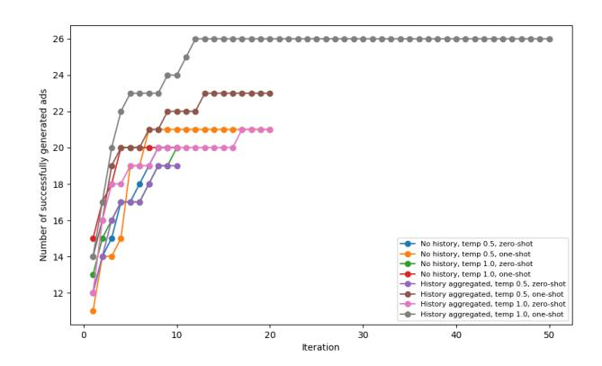
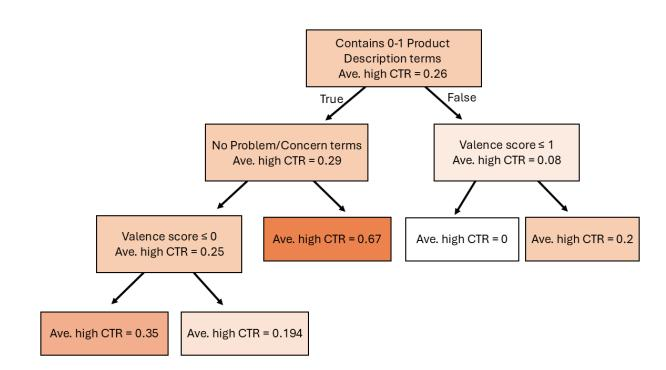
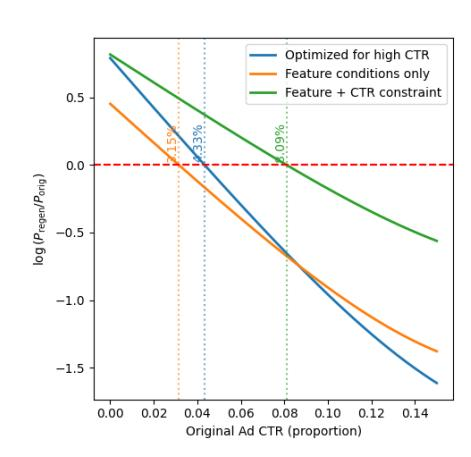

# Learning to Generate Effective Health Advertisements

Yuval Saadaty yuval.saadaty@biu.ac.il Bar-Ilan University Department of Computer Science Ramat Gan, Israel

Elad Yom-Tov elad.yom-tov@biu.ac.il Bar-Ilan University Department of Computer Science Ramat Gan, Israel

# Abstract

Despite extensive public health campaigns, many individuals remain resistant to adopting healthier behaviors due to personal preferences or life constraints. Online advertisements provide a scalable channel to encourage behavior change, yet both health authorities and advertising agencies often lack expertise in designing effective health ads. Automatically generating such ads could therefore represent a valuable tool for public health.

We propose a framework that learns which combinations of psychological attributes are most strongly associated with successful advertisements and leverages Large Language Models (LLMs) to generate ads guided by these attributes. Our pipeline integrates psychological constraints with LLM-based text generation and allows optimization toward specific campaign goals.

We evaluate the approach in a month-long Google Ads campaign, comparing four conditions: (1) human-generated ads, (2) ads optimized by the LLM for high click-through rate (CTR), (3) LLM-generated ads constrained by psychologically feature combinations, and (4) ads constrained by both psychological feature combinations and CTR predictions. A logistic regression model of campaign outcomes shows that ads generated under combined constraints significantly outperformed other conditions, with the strongest improvements observed for initially underperforming ads.

These findings highlight the potential of psychologically informed, LLM-based ad generation to enhance the effectiveness of digital health campaigns and offer a scalable pathway for promoting healthier behaviors.

# CCS Concepts

- Information systems → Sponsored search advertising; Applied computing → Consumer health.

# Keywords

Online advertising, LLM, health

#### ACM Reference Format:

Yuval Saadaty and Elad Yom-Tov. 2026. Learning to Generate Effective Health Advertisements. In Proceedings of the ACM Web Conference 2026 (WWW '26), April 13–17, 2026, Dubai, United Arab Emirates. ACM, New York, NY, USA, [4](#page-3-0) pages.<https://doi.org/10.1145/3774904.3792848>

[This work is licensed under a Creative Commons Attribution 4.0 International License.](https://creativecommons.org/licenses/by/4.0) WWW '26, Dubai, United Arab Emirates © 2026 Copyright held by the owner/author(s). ACM ISBN 979-8-4007-2307-0/2026/04 <https://doi.org/10.1145/3774904.3792848>

# 1 Introduction

Public health challenges persist despite sustained educational efforts and the demonstrated ability of advertising to influence knowledge, attitudes, and behaviors [\[15\]](#page-3-1). To fully harness this potential, health messages must be tailored not only to the targeted behavior but also to the audience segment. Yet, many health organizations lack the expertise and resources required to design such targeted campaigns. Automatically generating effective health advertisements could therefore provide a scalable means to improve health outcomes worldwide.

Techniques for advertisement text generation span a spectrum: template-based methods [\[1\]](#page-3-2) insert keywords into predefined structures, extractive approaches [\[4\]](#page-3-3) repurpose existing content to ensure message consistency, and abstractive generation [\[17\]](#page-3-4) employs advanced models such as encoder–decoder systems, reinforcement learning, and pre-trained language models—to create new and unique texts [\[11\]](#page-3-5). Recent advances in large language models (LLMs) open new opportunities for generating persuasive, audience-specific health messages at scale.

In this work, we propose a method that integrates identification of effective psychological mechanisms and marketing attributes with guided ad text generation using an LLM. We investigate three approaches: (i) direct CTR optimization, prompting the LLM to rewrite ads to maximize click-through rate (CTR); (ii) feature- constrained generation, where ads are regenerated to satisfy psychologically grounded feature combinations; and (iii) combined featureconstrained and CTR-ranked generation, where ads must both meet feature constraints and be predicted to outperform the original version in CTR. Feature constraints were derived by automatically annotating ads with psychologically grounded content attributes and identifying the most effective combinations for the given domain. We then evaluated these approaches through live A/B experiments against human-generated ads.

# 2 Methods

# 2.1 Data Collection

We conducted our offline analysis using the dataset introduced by Youngmann et al. [\[17\]](#page-3-4), which contains search advertisements related to health topics. The dataset includes both ad titles and descriptions, along with associated performance metrics from real-world campaigns, specifically the number of impressions and clicks. These data provide a natural basis for modeling engagement, enabling us to evaluate how different textual and psychological features contribute to advertisement effectiveness.

#### 2.2 Features Influencing Health Ad Effectiveness

Based on prior work in psychology and marketing, we identified a set of content features hypothesized to influence advertisement performance. These include: Call to Action (CTA) [\[13\]](#page-3-6); emotional engagement through arousal and valence [\[6,](#page-3-7) [16\]](#page-3-8); explicit references to problems or concerns [\[9\]](#page-3-9); use of second-person pronouns such as "you" or "your" [\[3\]](#page-3-10); framing the message as a question [\[7\]](#page-3-11); appeals emphasizing Free Offers, Quality, Product Lineup, Speed, or User-Friendliness [\[11\]](#page-3-5); Social Identity and Motive appeals [\[18\]](#page-3-12); and Curiosity-driven framing [\[10\]](#page-3-13).

These features have consistently been linked to higher engagement, memorability, and conversion in prior studies. They therefore serve as the foundation for our ad content analysis and subsequent feature-constrained generation.

Two independent human annotators manually tagged a sample of 67 health advertisements according to the features described above. Inter-annotator reliability was assessed using Cohen's Kappa [\[2\]](#page-3-14). To scale the annotation process, we designed prompts to replicate this labeling task using the GPT-4 Turbo API. After verifying the agreement between the LLM-generated sample and the human-labeled sample, we applied them to automatically annotate an additional 1,700 advertisements with the same feature set.

# 2.3 Subject identification

The dataset comprised both product-oriented health ads (e.g., promoting supplements or medical devices) and informational ads (e.g., health tips or awareness messages). A single-group analysis would therefore overlook heterogeneity in campaign objectives and audiences, which can influence the effectiveness of specific ad attributes [\[12\]](#page-3-15). To address this, we grouped ads into subject-based clusters.

Ads were represented as TF–IDF vectors of the Product Type feature, and K-means clustering was applied to these representations. Cluster quality was assessed using silhouette scores, while the appropriate number of clusters was determined using the Elbow Method [\[14\]](#page-3-16).

Subsequent analyses were restricted to clusters containing at least 50 ads to ensure sufficient statistical power.

# 2.4 Feature Importance Analysis

We used decision trees to identify feature combinations predictive of high click-through rate (CTR) within each ad cluster. High CTR ads were defined as those in the top 25��ℎ percentile of CTR values within a cluster. Decision trees were trained to distinguish these ads, with constraints to enhance interpretability and prevent overfitting: a minimum of five samples per child node and a maximum depth of three.

Model performance was evaluated using the Area Under the Receiver Operating Characteristic Curve (AUC). Clusters with low predictive performance (������ &lt; 0.6) were excluded from further analysis.

The path to leaves with the highest proportion of high CTR ads were interpreted as effective attribute combinations. These insights were then applied to regenerate low-performing ads, guiding GPT-4 Turbo to incorporate the identified feature combinations with the aim of producing higher-performing advertisements.

#### 2.5 Feature-Constrained Ad (re-)Generation

We experimented with eight configurations of the GPT-4 Turbo API to regenerate ads while enforcing all feature constraints identified in the decision tree analysis. The parameters varied across configurations included temperature settings (0.5 vs. 1.0), inclusion of a one-shot example of a high-performing ad, and provision of prompt history. The prompt history consisted of the model's prior outputs, annotated with their contained features and the feature constraints they were required to satisfy.

Thirty-three ads with low CTR served as the basis for regeneration under each configuration. For each regenerated ad, features were extracted using the same prompt-based labeling procedure described earlier and compared against the predefined feature constraints for the relevant cluster. If a generated ad failed to satisfy the constraints, additional iterations were performed until all conditions were met or the maximum number of iterations was reached.

The accuracy of each configuration was measured as the proportion of ads successfully regenerated under the required feature constraints.

# 2.6 CTR Ranker

We implemented a CTR ranker to further constrain generation to ads predicted to outperform their original versions. If a generated ad's predicted CTR was lower than that of the original, it was discarded and regeneration was repeated until both the feature constraints and an improved predicted CTR were satisfied, or a maximum number of iterations was reached.

We trained a CTR ranker using a pairwise approach [\[5\]](#page-3-17) with logistic regression. Each ad was represented as a TF-IDF weighted vector of its textual content. For each ad pair (���� , ����) with corresponding CTRs (���� , ����), the input was constructed as the vector difference (���� − ����), and the label was set to 1 if ���� &gt; ���� , and 0 otherwise. To focus on meaningful performance differences, we only included pairs with |���� − ���� | ≥ 0.1.

The training set contained 183,614 such pairs from 1,767 ads. The ranked was evaluated using AUC.

#### 2.7 Online Experiment

We evaluated regenerated ads through live Google Ads campaigns. Fifteen original ads were compared against three regeneration strategies: (1) high-CTR optimization, where GPT was prompted to generate a version of the original ad with a high CTR; (2) featureconstrained generation, using the attribute combinations identified from the decision tree analysis; and (3) combined feature- and CTRconstrained generation, where ads satisfied both the decision-tree features and were predicted to outperform the original ad in CTR.

Users searching for the same keywords were randomly assigned to see either the original ad or one of the regenerated versions. Each ad was run until it received a minimum of 100 impressions. This experiment was approved by the author's Institutional Review Board.

Results of the campaign were analyzed using a logistic regression model, where each row represents a single ad impression and the target label is whether the ad was clicked.

Figure 1: An example of a within-cluster decision tree, predicting high CTR values for different feature combinations.

### 3 Results

The agreement between the two human annotators averaged �� = 0.81 (range: 0.30-1.00). When comparing GPT-4 with a human annotator, the agreement was even higher, with an average of �� = 0.86 (range: 0.42-1.00), showing that the model's labels closely aligned with human judgment.

Silhouette analysis indicated that the best clustering of ads consisted of 15 clusters, representing diverse themes such as wellness services, vaccination campaigns, pharmaceuticals, dietary supplements, and digital health services. From these, the two clusters exhibiting the highest predictive performance (AUC) were selected for subsequent online testing.

Within each cluster, the decision trees revealed distinct feature combinations associated with higher CTR. Figure [1](#page-2-0) shows an example, where ads containing no more than one Product Description term and at least one Concerns/Problems term achieved the highest CTR. In contrast, ads with more than two Product Description terms and Valence ≤ 1 had the lowest CTR. Based on this analysis, we regenerated the seven lowest-performing ads by constraining

them to follow the feature path associated with the highest CTR. The number of successfully generated ads for different regeneration configurations are shown in Figure [2.](#page-2-1) As the figure shows, the best results were achieved with a temperature of 1, and inclusion of an example (one shot) and the prompt history. This configuration was therefore selected for subsequent ad regeneration. In general, regeneration strategies that included the prompt history were more successful than others.

In order to optimize the ad regeneration process, we trained a CTR ranker to predict whether a regenerated ad would achieve a higher CTR than its original counterpart. The CTR ranker achieved an AUC of 0.851 on a general test set of 12,142 ad pairs. After running the online experiment, we evaluated the CTR ranker on its results and found that it reached an AUC of 0.796 on those 15 ads.

When applied to constrain regeneration, the ranker ensured that only ads predicted to outperform their originals were retained. Among the 15 ads attempted under both feature and CTR constraints, GPT-4 failed to produce compliant outputs for 3 ads. These ads were published but did not outperform their originals, and were therefore excluded from the final analysis.

Figure 2: Number of successfully generated ads over iterations for different generation settings. The total number of requested ads was 33. Most ads that can be successfully generated appear within the first 10 iterations.

To assess the effect of regeneration, we trained separate logistic regression models for each regeneration configuration. The model coeffocients are shown in Table [1.](#page-2-2) In this table, Original Ad CTR is the CTR of the original ad, and this value is shared by both the original ad and its regenerated variants. The Interaction attribute represents the interaction between original CTR and whether the ad was regenerated.

As the table shows, the model coefficients of Original Ad CTR was positive across all experiments, indicating that higher original CTR predicted a higher likelihood of clicks. The model coefficients of Interaction was negative in all scenarios, which we interpret as an effect of diminishing returns: as the original CTR increases, the incremental benefit of regenerating the ad decreases.

The highest coefficient (0.84) was observed when ads were regenerated under both feature and CTR constraints, highlighting that combining these constraints was the most effective regeneration strategy for enhancing ad performance.

To further illustrate these findings, Figure [3](#page-3-18) shows the log probability ratio of regenerated ads to original ads across different values of the original CTR, as derived from the model coefficients. The curves highlight the effect of regeneration on CTR improvement. The figure also shows a threshold above which regeneration no longer provides an improvement over the baseline. The threshold is derived directly from the logistic regression model. Specifically, the probability of a click is modeled as:

Table 1: Logistic regression coefficients for three experimental comparisons. Results which are not statistically significant (�� &lt; 0.05, with Bonferroni correction) are denoted by N.S. .

| Predictor Variables Original Ad CTR | High CTR 24.55 | Feature constraints 24.55 | Feature constraints & High CTR 21.37 |
|-------------------------------------|----------------|---------------------------|--------------------------------------|
| Interaction                         | -18.63         | -14.61                    | -10.33                               |
| Is Regenerated Ad                   | 0.81           | 0.46 N.S.                 | 0.84                                 |
| Number of Impressions (rows)        | 6,770          | 6,659                     | 5,530                                |
| Pseudo ��                           |                |                           |                                      |
| (McFadden)                          | 0.01           | 0.02                      | 0.03                                 |

Figure 3: Log probability ratio of CTR for regenerated ads versus original ads across different experiments. The dotted red line shows equal performance.

logit(��) = ��0+��CTR ·CTR+��regen ·��regen+��interaction · (CTR×��regen), where ��regen = 1 for regenerated ads and 0 for original ads. The improvement from regeneration is given by the difference:

Δ = ��regen + ��interaction · CTR.

Thus, the threshold is defined as the CTR value at which this difference changes sign, i.e., Δ = 0, which means that

CTRthreshold = −��regen/��interaction

This threshold marks a pivot point: Regeneration of ads with an original CTR below the threshold improves their performance (Δ &gt; 0), but is reduced when the original CTR was above the threshold (Δ &lt; 0). The estimated thresholds are 4.33% (configuration 1), 3.15% (configuration 2), and 8.09% (configuration 3).

As Figure [3](#page-3-18) shows, regenerated ads provide the largest improvement over the baseline (the original ads) when the baseline CTR is low, and the benefit diminishes for ads with already high CTR. Configuration 3 exhibits the highest threshold (8.09%), meaning that regenerated ads under both feature and CTR constraints maintain a positive effect across a wider range of original CTR values. This supports the conclusion that combining feature guidance with CTR constraints yields the most robust improvements in ad performance.

### 4 Discussion

We developed and evaluated an automated framework for regenerating effective health advertisements by combining an analysis of features that drive ad performance with generative models capable of producing new ads subject to these features.

We compared three regeneration strategies: (1) optimization for high CTR, (2) optimization for effective feature combinations, and (3) a combined strategy integrating both effective features and high CTR prediction. The combined approach yielded the largest CTR gains, particularly for ads that initially performed poorly.

Beyond the specific application of health advertisement optimization, our framework demonstrates broader potential. By systematically integrating structured feature tagging, predictive modeling, and LLM-assisted text generation, the approach can be applied to generate any text designed to align with the psychological and behavioral characteristics of a target audience. This is true in both the health domain, where such text can be of use in other areas where personalized messaging is effective [\[8\]](#page-3-19) and in other areas of advertising.

The use of GPT-4 for ad regeneration also introduces the risk of producing content that may be inconsistent with the original advertisement or its landing page. Future work should explicitly verify alignment between regenerated ads and their corresponding landing pages to ensure accuracy and prevent the dissemination of misleading information.

#### References

[1] Kevin Bartz, Cory Barr, and Adil Aijaz. 2008. Natural language generation for sponsored-search advertisements. In Proceedings of the 9th ACM Conference on Electronic Commerce. ACM, 1–9. [2] Jacob Cohen. 1960. A coefficient of agreement for nominal scales. Educational and psychological measurement 20, 1 (1960), 37–46. [3] Ryan E Cruz, James M Leonhardt, and Todd Pezzuti. 2017. Second person pronouns enhance consumer involvement and brand attitude. Journal of Interactive Marketing 39, 1 (2017), 104–116. [4] Konstantin Golobokov, Junyi Chai, Victor Ye Dong, Mandy Gu, Bingyu Chi, Jie Cao, Yulan Yan, and Yi Liu. 2022. DeepGen: Diverse Search Ad Generation and Real-Time Customization. arXiv preprint arXiv:2208.03438 (2022). [5] Thorsten Joachims. 2002. Optimizing search engines using clickthrough data. In Proceedings of the eighth ACM SIGKDD international conference on Knowledge discovery and data mining. 133–142. [6] Elizabeth A Kensinger. 2004. Remembering emotional experiences: The contribution of valence and arousal. Reviews in the Neurosciences 15, 4 (2004), 241–252. [7] Erika Kirgios, Susan Athey, Angela L Duckworth, Dean Karlan, Michael Luca, Katherine L Milkman, and Molly Offer-Westort. 2025. Does Q&A Boost Engagement? Health Messaging Experiments in the US and Ghana. Technical Report. National Bureau of Economic Research. [8] Julie C. Lauffenburger, Elad Yom-Tov, Punam A. Keller, Marie E. McDonnell, Katherine L. Crum, Gauri Bhatkhande, Ellen S. Sears, Kaitlin Hanken, Lily G. Bessette, Constance P. Fontanet, Nancy Haff, Seanna Vine, and Niteesh K. Choudhry. 2024. The impact of using reinforcement learning to personalize communication on medication adherence: findings from the REINFORCE trial. 7, 1 (2024), 39. [doi:10.1038/s41746-024-01028-5](https://doi.org/10.1038/s41746-024-01028-5) [9] Minjie Li. 2021. The synergistic effects of solutions journalism and corporate social responsibility advertising. Digital Journalism 9, 3 (2021), 336–363. [10] Satya Menon and Dilip Soman. 2002. Managing the power of curiosity for effective web advertising strategies. Journal of Advertising 31, 3 (2002), 1–14. [11] Soichiro Murakami, Sho Hoshino, and Peinan Zhang. 2023. Natural language generation for advertising: A survey. arXiv preprint arXiv:2306.12719 (2023). [12] Soichiro Murakami, Peinan Zhang, Sho Hoshino, Hidetaka Kamigaito, Hiroya Takamura, and Manabu Okumura. 2022. Aspect-based analysis of advertising appeals for search engine advertising. arXiv preprint arXiv:2204.11445 (2022). [13] Ruth Rettie, Ursula Grandcolas, and Bethan Deakins. 2005. Text message advertising: Response rates and branding effects. Journal of targeting, measurement and analysis for marketing 13 (2005), 304–312. [14] Peter J Rousseeuw. 1987. Silhouettes: a graphical aid to the interpretation and validation of cluster analysis. Journal of computational and applied mathematics 20 (1987), 53–65. [15] Melanie A. Wakefield, Barbara Loken, and Robert C. Hornik. 2010. Use of Mass Media Campaigns to Change Health Behaviour. The Lancet 376, 9748 (2010), 1261–1271. [16] Taifeng Wang, Jiang Bian, Shusen Liu, Yuyu Zhang, and Tie-Yan Liu. 2013. Psychological advertising: exploring user psychology for click prediction in sponsored search. In Proceedings of the 19th ACM SIGKDD international conference on Knowledge discovery and data mining. 563–571. [17] Brit Youngmann, Elad Yom-Tov, Ran Gilad-Bachrach, and Danny Karmon. 2021. Algorithmic copywriting: Automated generation of health-related advertisements to improve their performance. Information Retrieval Journal 24, 3 (2021), 205–239. [18] Yuan Yuan, Fengli Xu, Hancheng Cao, Guozhen Zhang, Pan Hui, Yong Li, and Depeng Jin. 2021. Persuade to click: Context-aware persuasion model for online textual advertisement. IEEE Transactions on Knowledge and Data Engineering 35, 2 (2021), 1938–1951.