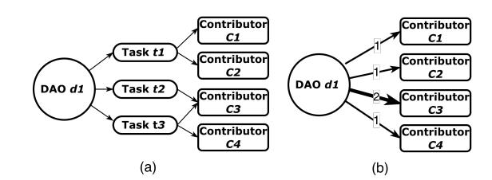
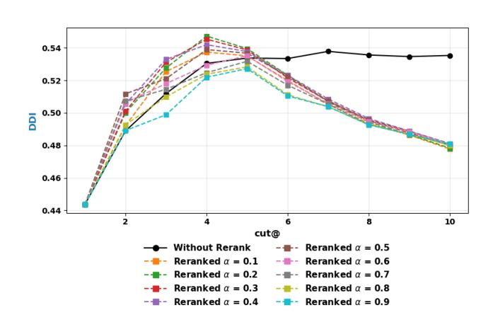
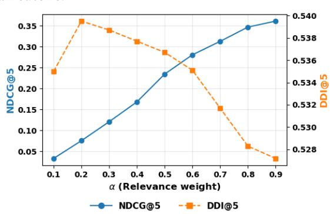

# Decentralized in Name Only: The Centralization of DAO Labor

[Lingling Zhang](https://orcid.org/0009-0002-8142-1853) Toronto Metropolitan University Toronto, Canada zhll@torontomu.ca

[Morteza Zihayat](https://orcid.org/0000-0002-1144-7364)∗ Toronto Metropolitan University Toronto, Canada mzihayat@torontomu.ca

[Ebrahim Bagheri](https://orcid.org/0000-0002-5148-6237) University of Toronto Toronto, Canada ebrahim.bagheri@utoronto.ca

### Abstract

This paper studies how decentralized the Decentralized Autonomous Organizations (DAOs) truly are in their everyday labor practices. We collect task assignment data from Dework and construct a clean subset of 266 DAOs with sufficient activity to support meaningful decentralization measurement. We measure decentralization through inequality, diversity, coverage, dominance and combine them into the Operational DAO Decentralization Index (DDI). We find that operational work is highly concentrated: a small group of contributors complete most tasks. A fine-tuned T5 model trained for contributor recommendation largely reproduces these patterns. We therefore propose a decentralization-aware reranking method that penalizes overrepresented contributors. Experiments reveal a tunable trade-off between relevance and decentralization, with small but consistent DDI gains at top ranks. DAO labor is far from decentralized, and lightweight post-hoc adjustments can broaden contributor exposure.

# CCS Concepts

• Human-centered computing → Empirical studies in collaborative and social computing.

## Keywords

Decentralized Autonomous Organizations; Web3 labor dynamics; Fairness-aware recommendation

### ACM Reference Format:

Lingling Zhang, Morteza Zihayat, and Ebrahim Bagheri. 2026. Decentralized in Name Only: The Centralization of DAO Labor. In Proceedings of the ACM Web Conference 2026 (WWW '26), April 13–17, 2026, Dubai, United Arab Emirates. ACM, New York, NY, USA, [4](#page-3-0) pages. [https://doi.org/10.1145/](https://doi.org/10.1145/3774904.3792849) [3774904.3792849](https://doi.org/10.1145/3774904.3792849)

# 1 Introduction

The Web has long supported large-scale collective action, motivating research on how participation is distributed and how platforms coordinate collaboration among distributed contributors. Web3 extends this line of work by introducing blockchain-based coordination mechanisms, among which Decentralized Autonomous Organizations (DAOs) have emerged as online communities that coordinate resources and decision-making through programmable

∗Corresponding author.

[This work is licensed under a Creative Commons Attribution-NonCommercial-](https://creativecommons.org/licenses/by-nc-nd/4.0)[NoDerivatives 4.0 International License.](https://creativecommons.org/licenses/by-nc-nd/4.0) WWW '26, Dubai, United Arab Emirates © 2026 Copyright held by the owner/author(s). ACM ISBN 979-8-4007-2307-0/2026/04 <https://doi.org/10.1145/3774904.3792849>

Figure 1: Illustration of data representation. (a) DAO-taskcontributor data structure. (b) Weighted DAO-contributor bipartite graph used to calculate DAO decentralization metrics (edge weight = number of tasks).

and transparent rules [\[10\]](#page-3-1). DAOs are framed as a decentralized organizational form: open, permissionless, and collectively governed [\[3\]](#page-3-2). Their scale reinforces this expectation: as of October 2025, over 50,000 DAOs collectively controlled more than 20 billion USD in on-chain treasury assets[1](#page-0-0) .

If DAO operations are genuinely distributed, operational work should be broadly shared rather than concentrated among a small group of contributors. However, prior research on DAOs focuses primarily on governance, examining voting mechanisms, proposal dynamics, token-based power, and participation inequalities [\[5,](#page-3-3) [6,](#page-3-4) [8\]](#page-3-5). Yet governance captures only formal decision-making. Substantial managerial and coordinative work occurs outside proposals and voting mechanisms [\[4\]](#page-3-6).

In practice, many DAOs coordinate daily work through operational task platforms such as Dework [\[1\]](#page-3-7), where tasks are posted and contributors participate as assignees and reviewers. Some tasks offer explicit rewards, which are paid upon completion when offered. We refer to this task-based work coordination process as DAO labor. Unlike governance, DAO labor is not restricted to token holders. Contributors can participate through task-based workflows that may be open or selectively permissioned. These operational tasks do not necessarily correspond to governance decisions and are largely invisible to vote-based analyzes. Thus, how tasks are allocated and how participation is distributed across contributors may shape the practical experience of decentralization more directly than voting outcomes alone.

This gap motivates our focus on operational decentralization: the distribution of day-to-day task execution across contributors. Studying operational decentralization reveals whether DAOs' everyday labor practices align with their stated decentralization principles. We ask: RQ1) How decentralized are DAOs operationally? and RQ2) What is the trade-off between relevance and decentralization in contributor recommendation models?

1<https://deepdao.io/organizations>

| Statistic |              |                                | Value  |
|-----------|--------------|--------------------------------|--------|
| Number    | of DAOs      |                                | 266    |
| Total     | completed    | tasks                          | 23,541 |
| Total     | tasks used   | for modelling (train+val+test) | 21,874 |
| Total     | tasks in     | test set                       | 4,739  |
| Total     | unique       | contributors                   | 4,369  |
| Median    | tasks        | per DAO                        | 27.5   |
| Median    | contributors | per DAO                        | 10     |
| Median    | tasks        | per contributor                | 2      |
| Assignee  | roles        | (%)                            | 92.7%  |
| Reviewer  | roles        | (%)                            | 26.2%  |

DDI components are: �� inv �� = 1 − minmax(Gini�� ), ��norm �� = minmax ���� /log2 ���� , ��norm �� = minmax(Coverage�� ), �� inv = 1 − minmax(Dom�� ( ⌈0.1���� ⌉)) .

�� DDI score is the unweighted average:

DDI�� = �� inv �� + �� norm �� + �� norm �� + �� inv �� 4

Higher values of DDI�� indicate more decentralized operational structures, characterized by broader participation and reduced contributor concentration.

### 3.3 Decentralization-Aware Reranking

We introduce a simple reranking mechanism that adjusts contributor exposure based on observed participation concentration. For each DAO ��, we penalize contributors with higher normalized participation share ���� (��). For a task ���� in DAO ���� , we compute a reranked score for each candidate contributor �� as

����(��) = ������(��) − (1 − ��)������ (��)

where �� ∈ [0, 1] controls the trade-off between relevance and decentralization. Since the baseline T5 model outputs an ordered list rather than explicit relevance scores, we convert its rankings into relevance weights using a DCG-style logarithmic discount: ����(��) = 1/log2 (rank��(��) + 1), and set ����(��) = 0 for unranked candidates.

### 4 Experiment Setup

Modeling Dataset. The contributor recommendation dataset is constructed at the task level. Each sample uses the task title, userdefined tags, and reward information as input, with the associated contributor hashes as the target. We use training/validation/test splits.

Models and evaluation. We fine-tune a T5-small seq2seq model [\[7\]](#page-3-8) as the baseline recommender, following a task-to-candidate formulation [\[12\]](#page-3-9). For each test-set task ���� , we rerank predicted contributors using ����(��), where participation shares ������ (��) are computed from the training and validation data. We evaluate both relevance (standard ranking metrics) and decentralization (DDI@k).

### 5 Results

### 5.1 RQ1: How Decentralized Are DAOs?

Table [2](#page-2-0) summarizes aggregate decentralization statistics across the 266 DAOs in our dataset. The results show extremely high Gini values (mean 0.9983) and low contributor coverage (median 0.19), suggesting that only a small subset of members perform most operational work. The top five contributors account for more than 82% of all completed tasks on average, and overall DDI scores remain low. These DAO-level patterns provide clear evidence of substantial operational centralization. Overall, operational activity within many DAOs is far from decentralized.

# 5.2 RQ2: How Do Models Affect Centralization?

Baseline Recommendation Behavior. As a consequence of this highly centralized participation structure, we examine whether contributor recommendation models reproduce or mitigate these patterns. The T5 baseline model's DDI@k results (Table [3\)](#page-2-1) suggest

Table 2: DAO operational decentralization statistics.

| Metric                      | Mean   | Median |
|-----------------------------|--------|--------|
| Gini                        | 0.9983 | 0.9990 |
| Entropy                     | 2.6400 | 2.6160 |
| Number of Contributors      | 19.43  | 10     |
| Contributor coverage        | 0.2154 | 0.1875 |
| Top-5 participation share   | 82.33% | 82.61% |
| Top-10% participation share | 85.69% | 88.55% |
| DDI                         | 0.3649 | 0.3463 |

that top-ranked positions are dominated by observed active contributors, indicating the model largely reproduces existing participation concentration.

Effect of Reranking on Relevance and Decentralization. Table [3](#page-2-1) summarizes model performance before and after applying reranking with �� = 0.5. As expected, relevance metrics decrease substantially: MAP@5 declines by 42.7%, NDCG@5 by 35.2%, and similar drops appear across other top-�� metrics. Despite the strong relevance reduction, decentralization increases modestly. DDI@3 rises by 1.8% and DDI@5 by 0.6%, indicating a shift in exposure away from observed dominant contributors. These results illustrate how strongly the model relies on observed participation dominance.

Table 3: Baseline vs. reranking performance comparison.

| Metric       | Baseline | Reranked �� | = 0.5 Improve |
|--------------|----------|-------------|---------------|
| Precision@5  | 0.1934   | 0.1418      | -0.0516       |
| Precision@10 | 0.0993   | 0.0709      | -0.0284       |
| Recall@5     | 0.5381   | 0.3825      | -0.1556       |
| Recall@10    | 0.547    | 0.3825      | -0.1645       |
| NDCG@5       | 0.3620   | 0.2345      | -0.1275       |
| NDCG@10      | 0.3656   | 0.2341      | -0.1315       |
| MAP@5        | 0.2723   | 0.1561      | -0.1162       |
| MRR@5        | 0.3238   | 0.2087      | -0.1151       |
| F1@5         | 0.2569   | 0.2073      | -0.0496       |
| DDI@3        | 0.5119   | 0.5210      | +0.0091       |
| DDI@5        | 0.5337   | 0.5367      | +0.0030       |
| DDI@10       | 0.5353   | 0.4806      | -0.0547       |

Cutoff Sensitivity. Figure [2](#page-3-10) shows DDI@k for �� = 1–10 across �� settings. Reranking yields its strongest decentralization effects for small cutoffs (DDI@2–4), where exposure is most concentrated. As �� increases, the reranked and baseline curves converge, indicating that deeper ranks are less sensitive to dominance adjustments.

Trade-off Sweep Over ��. Figure [3](#page-3-11) plots NDCG@5 and DDI@5 as functions of ��. Higher �� values preserve model relevance but reduce decentralization, while lower values increase exposure dispersion. This analysis illustrates how strongly the baseline ranking is tied to existing dominance and how exposure shifts as this preference is weakened.

Discussions. The experiments highlight a clear tension between predictive relevance and contributor decentralization. The baseline model largely reproduces the structural inequalities present in observed DAO activity. The reranking mechanism provides a

Figure 2: DDI@k across �� values, showing strongest gains at small cutoffs.

Figure 3: Reranking sensitivity to �� using DDI and NDCG.

controlled way to probe this sensitivity: reducing the influence of dominance broadens exposure, especially at early positions, by explicitly penalizing observed dominant contributors [\[2\]](#page-3-12). While relevance decreases substantially, these shifts reveal how strongly the model is anchored to existing participation patterns and provide an interpretable diagnostic of its centralization tendencies.

Although the numerical changes in DDI across different values of �� appear small, this behaviour is expected given the structure of top-�� predictions and the design of the reranking method. Because DDI@k is computed from only the top-�� recommended contributors, its components have limited room to change. As a result, reranking primarily affects the dominance term (top-10% share), which is most sensitive to rank reordering, while the other components change only marginally. Moreover, the scoring function of ����(��) applies a deliberately conservative adjustment that slightly demotes observed dominant contributors without replacing them, thereby preserving predictive relevance while inducing modest decentralization gains. Thus, the small but consistent improvements in DDI are fully aligned with the intended relevance-decentralization trade-off. The magnitude of this trade-off aligns with prior fairnessaware ranking studies [\[9,](#page-3-13) [11\]](#page-3-14).

# 6 Limitation

While DDI integrates complementary concentration indicators, some components are partially correlated (e.g., dominance and

inequality) and are computed over slightly different participation bases (global vs. DAO contributors), so the index should be interpreted as a composite operational measure rather than fully distinct dimensions. Additionally, contributor concentration may partly reflect skill specialization and role differentiation (e.g., core developers taking on repeated tasks), not solely systemic bias. Future work could integrate task difficulty and contributor skill signals to disentangle these mechanisms.

### 7 Conclusion

This work provides the first large-scale measurement of operational decentralization in DAO task execution and evaluates how contributor recommendation models reproduce these patterns. We find that contributor activity is heavily concentrated and that baseline predictions largely mirror this structure. By applying a simple decentralization-aware reranking adjustment, we test whether model outputs deviate from these imbalances and observe that reducing the influence of observed dominant contributors broadens exposure—especially at top ranks—while predictably lowering relevance. This controllable trade-off highlights the tight coupling between recommendation behavior and underlying participation distributions. Overall, our findings underscore the value of explicitly assessing decentralization in DAO tooling and offer a diagnostic framework for understanding when and how ranking systems may reinforce or mitigate organizational inequalities.

## References

[1] Dework Documentation (GitBook) 2022. What is Dework? Dework Documentation (GitBook).<https://dework.gitbook.io/product-docs/> Last updated Sept. 20, 2022; Accessed: Jan. 24, 2026. [2] Asia J Biega, Krishna P Gummadi, and Gerhard Weikum. 2018. Equity of attention: Amortizing individual fairness in rankings. In The 41st international acm sigir conference on research & development in information retrieval. 405–414. [3] Samer Hassan and Primavera De Filippi. 2021. Decentralized autonomous organization. Alexander von Humboldt Institute for Internet and Society (2021). [4] Rafał Łabędzki. 2025. Management in Decentralized Autonomous Organizations (DAO): Analysis of Proposals. Organizacja i Kierowanie 197, 1 (2025), 79–101. [5] Michael Lustenberger, Florian Spychiger, Lukas Küng, Eleonóra Bassi, and Sabrina Wollenschläger. 2025. DAO research trends: Reflections and learnings from the first European DAO workshop (DAWO). Applied Sciences 15, 7 (2025), 3491. [6] Andrea Peña-Calvin, Javier Arroyo, Andrew Schwartz, and Samer Hassan. 2024. Concentration of power and participation in online governance: the ecosystem of decentralized autonomous organizations. In Companion proceedings of the ACM Web conference 2024. 927–930. [7] Colin Raffel, Noam Shazeer, Adam Roberts, Katherine Lee, Sharan Narang, Michael Matena, Yanqi Zhou, Wei Li, and Peter J Liu. 2020. Exploring the limits of transfer learning with a unified text-to-text transformer. Journal of machine learning research 21, 140 (2020), 1–67. [8] Tanusree Sharma, Yujin Potter, Kornrapat Pongmala, Henry Wang, Andrew Miller, Dawn Song, and Yang Wang. 2024. Future of Algorithmic Organization: Large-Scale Analysis of Decentralized Autonomous Organizations (DAOs). arXiv preprint arXiv:2410.13095 (2024). [9] Ashudeep Singh and Thorsten Joachims. 2018. Fairness of exposure in rankings. In Proceedings of the 24th ACM SIGKDD international conference on knowledge discovery & data mining. 2219–2228. [10] Shuai Wang, Wenwen Ding, Juanjuan Li, Yong Yuan, Liwei Ouyang, and Fei-Yue Wang. 2019. Decentralized autonomous organizations: Concept, model, and applications. IEEE Transactions on Computational Social Systems 6, 5 (2019), 870–878. [11] Meike Zehlike, Francesco Bonchi, Carlos Castillo, Sara Hajian, Mohamed Megahed, and Ricardo Baeza-Yates. 2017. Fa\*ir: A Fair Top-k Ranking Algorithm. In CIKM. [12] Lingling Zhang, Radin Hamidi Rad, Morteza Zihayat, and Ebrahim Bagheri. 2025. Say the Task, Build the Team: Prompt-Based Team Formation. In International Conference on Advances in Social Networks Analysis and Mining (ASONAM 2025). Springer. To appear.