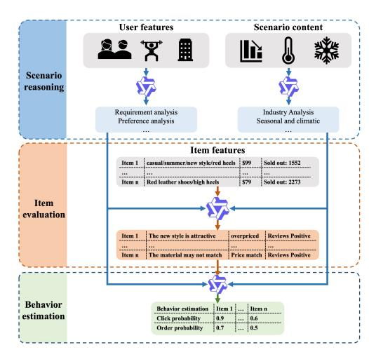
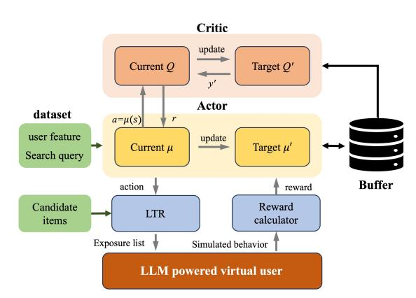
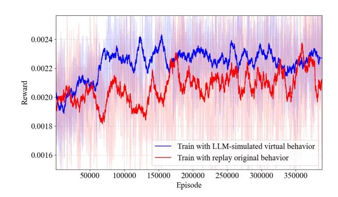

# A Reinforcement Learning Based Hyper-Parameter Generation System Guided by LLM-Powered Virtual Users

[Changlin Qiu](https://orcid.org/0000-0001-9973-1214) qiuchanglin.qcl@taobao.com Alibaba Group Hangzhou, China

[Bang Lin](https://orcid.org/0009-0008-1817-1875) linbang.lb@taobao.com Alibaba Group Hangzhou, China

[Tao Zhang](https://orcid.org/0000-0003-4545-7701) guyan.zt@taobao.com Alibaba Group Hangzhou, China

[Chengfu Huo](https://orcid.org/0009-0003-0459-4723) chengfu.huocf@taobao.com Alibaba Group Hangzhou, China

# Abstract

In e-commerce search systems, the personalized optimization of hyper-parameters associated with search scenario characteristics can significantly improve the quality of exposed item sequences. Recently, Reinforcement Learning (RL) algorithms have been applied to process complex scenario features and generate personalized parameters. Nevertheless, the high cost and risk of online exploration still present significant challenges for the training and deployment of RL agents. To address these challenges, a DDPG-based hyperparameter generation system incorporating personalized search scenario features is proposed, and a virtual user behavior simulation system is developed based on Large Language Models (LLMs) for the exploration interactions of the RL agent. In addition, for improving the simulation performance of virtual users, a Chain of Thought for e-commerce scenario (e-CoT) is derived based on the counterfactual reasoning of real e-commerce user behavior. And the virtual user is fine-tuned based on a realistic dataset extracted from Alibaba e-commerce platform interactions, which also provides a critical foundation for developing and validating e-commerce search algorithms. Finally, both offline and online experiments demonstrate that the proposed hyper-parameter generation method can significantly enhance the performance of e-commerce search systems. These results are expected to provide valuable insights for deploying large-scale exploration algorithms in e-commerce search system.

## CCS Concepts

• Information systems → Learning to rank.

## Keywords

Hyper-parameter optimization, reinforcement learning, large language model, fine-tuning

#### ACM Reference Format:

Changlin Qiu, Bang Lin, Tao Zhang, and Chengfu Huo. 2026. A Reinforcement Learning Based Hyper-Parameter Generation System Guided by LLM-Powered Virtual Users. In Proceedings of the ACM Web Conference 2026

[This work is licensed under a Creative Commons Attribution 4.0 International License.](https://creativecommons.org/licenses/by/4.0) WWW '26, Dubai, United Arab Emirates © 2026 Copyright held by the owner/author(s). ACM ISBN 979-8-4007-2307-0/2026/04 <https://doi.org/10.1145/3774904.3792850>

(WWW '26), April 13–17, 2026, Dubai, United Arab Emirates. ACM, New York, NY, USA, [4](#page-3-0) pages.<https://doi.org/10.1145/3774904.3792850>

# 1 Introduction

In e-commerce search systems, the exposure item sequence is typically generated by the aggregation of multidimensional scores in the Learning to Rank (LTR) module. In order to match user preferences, it is essential to optimize the hyper-parameters based on user and search scenario features.

In recent years, Reinforcement Learning (RL) has been applied to personalized parameter optimization in recommender systems [\[1,](#page-3-1) [8,](#page-3-2) [13,](#page-3-3) [19\]](#page-3-4). For instance, Xi et al. combined transformer models with reinforcement learning to process long sequence information, effectively enhancing the long-term value of recommender systems [\[15\]](#page-3-5). However, user behavior in e-commerce search scenarios is influenced by multiple factors, including search queries, personal preferences, and potential intentions. Additionally, the risks associated with exploration actions in search systems are more significant than in recommender systems, and policy evaluation through online A/B experiments is highly costly. Therefore, developing efficient, reasonable, and safe methods for evaluating agent exploration remains an urgent challenge.

To support RL agent exploration, developing virtual behavior simulation environments represents a valuable research direction [\[12,](#page-3-6) [21\]](#page-3-7). Previous work by Shi et al. established a user behavior simulation system (Virtual-Taobao) using generative adversarial networks[\[12\]](#page-3-6). However, such approaches exhibit significant dependence on training data and struggle to capture complex user decision-making psychology due to reasoning limitations. In recent years, the emergence of Large Language Models (LLMs)[\[7,](#page-3-8) [9,](#page-3-9) [17\]](#page-3-10) has introduced anthropomorphic reasoning capabilities that show promise for user behavior simulation. Recent studies have applied LLMs to estimate user preferences toward items[\[5,](#page-3-11) [10,](#page-3-12) [11,](#page-3-13) [18,](#page-3-14) [20\]](#page-3-15). Yet current LLM-based simulation methods typically lack structured decision-making processes, particularly the chain of thought (CoT) framework[\[14\]](#page-3-16) needed for e-commerce scenarios. This highlights the need to develop a realistic CoT framework based on actual e-commerce user thinking diagram. Such advancement would significantly enhance LLM behavior simulation validity, thereby providing a more reliable foundation for RL agent training and ranking strategy evaluation.

Figure 1: The thought process of e-CoT in LLM-powered virtual user behavior simulation system

To achieve personalized hyper-parameter optimization in search scenarios, we proposes a comprehensive RL-based framework for e-commerce search systems. The primary contributions include:

- In order to assess the ranking quality reasonably, a virtual user simulation system is developed, where a LLM acts as customer and interacts with the items virtually.
- In order to improve the performance of virtual user, an ecommerce decision-making CoT (e-CoT) framework is derived from real user behavior diagram. And the LLM is finetuned based on Real platform user log dataset.
- A personalized hyper-parameter optimization agent is developed using the Deep Deterministic Policy Gradient (DDPG) algorithm. And a comprehensive multi-objective reward function designed is designed to enable efficient and effective training of the DDPG agent.

#### 2 Problem and Formulation

In e-commerce search systems, candidate items are typically evaluated across multiple dimensions, including relevance, conversion efficiency, and other performance metrics. These diverse feature scores are aggregated into a final ranking score through a learningto-rank (LTR) module, formulated as:

S = �� ��=1 �������� �� ��=1 ���� , (1)

where the importance of each score is controlled by corresponding weight parameters ���� , which affects the characteristics of the ranking results. Consequently, personalized parameter optimization can significantly enhance both the quality of the exposure sequence and the overall performance of the search scenario.

### 3 Methodology

#### 3.1 LLM-Powered Virtual User Behavior Simulation System

To safely and efficiently evaluate the exploration behavior of the DDPG agent during training, a virtual user behavior simulation system is implemented. In this system, the LLM acts as an e-commerce

buyer and replicates the characteristics of sampled users, including static attributes (e.g., gender) and behavioral patterns (e.g., browsing history). The input context combines search queries, scenario metadata, and promotional campaigns. Candidate items are presented to the LLM as an ordered list mimicking real-world e-commerce platforms, complete with product titles, pricing, and user reviews. By analyzing user profiles, contextual signals, and item features, the virtual behavior simulation system sequentially predicts clickthrough and purchase probabilities for each item as follows:

������������ = [�� 1 , ���� 2 , ...���� ], ������������ = [�� 1 , ���� 2 , ...���� ] (2)

Given the complexity of e-commerce search and interaction behaviors, the counterfactual reasoning of e-commerce behavior logic is carried out based on Qwen3-235B. With a batch of real user behavior logs, the complete e-commerce decision-making CoT (e-CoT) is summarized to enhance the logical coherence and consistency of simulated virtual behavior. As illustrated in Figure [1,](#page-1-0) the e-CoT comprises three core reasoning nodes: scenario pre-reasoning, item evaluation, and behavior estimation. In the phase of scenario prereasoning, user requirements and preferences are estimated by analyzing static characteristics and historical behavioral sequences. Additionally, by incorporating the search query, the expected product characteristics are inferred as intermediate information for the following inference stage. In parallel, the factors that potentially influence user decisions, such as discount information, seasonal factors, and other contextual variables, are comprehensively analyzed to support the following decision-making process. On the basis of scenario pre-reasoning, candidate items in the exposure sequence are evaluated from multiple aspects such as relevance, matching degree of user preference, and so on. Finally, the unified virtual behavior reasoning is realized by integrating the results of scenario pre-reasoning and the evaluation reasoning candidate items.

For further improving the inference performance of LLM-based virtual users, a dataset including 10k search scenario, 100k item information, and 10k user information is constructed from the Alibaba e-commerce platform. On this basis, the LLM is fine-tuned based on Group Relative Policy Optimization (GRPO) algorithm, where the virtual behavior generation reward is calculated based on the cross-entropy function as follows:

�� = − Í �� (���� ∗ ������(����) + (1 − ����) ∗ ������(1 − ����)) �� (3)

#### 3.2 RL-Based Hyper-Parameter Optimization

In order to realize the personalized hyper-parameter configuration according to complex and high-dimensional user characteristics in e-commerce search system, a complete continuous parameter optimization framework is developed based on the Deep Deterministic Policy Gradients algorithm (DDPG)[\[2,](#page-3-17) [6\]](#page-3-18), as illustrated in Figure [2,](#page-2-0) with detailed descriptions provided in the subsequent sections.

The input state of the agent is defined by a ��–dimensional vector representing encoded user features. Specifically, continuous attributes such as user age are directly input as raw values, binary attributes such as gender are encoded as 0 or 1, and discrete attributes such as user profile classifications are mapped to corresponding integer codes. Besides, the search query is encoded as a predicted category id and embedded into the input state. The

Figure 3: Training loss with different simulation environment

behavior simulation system generates more rational and stable interaction behaviors that demonstrate stronger correlations with user characteristics. Consequently, the convergence speed and training stability of the agent are significantly improved, as demonstrated in Figure [3.](#page-3-22)

# 4.3 Online A/B Experiments

To further evaluate the online effectiveness of the hyper-parameter optimization system, an A/B experiment is conducted on the Alibaba e-commerce search engine. After a continuous one-month trial, the conversion rate (L2O) and Gross Merchandise Value (GMV) increased by 0.84% and 3.06%, respectively. And it is more significant than the improvement obtained by the evolutionary algorithm, with 0.11% increase in L2O and 1.15% increase in GMV. These results demonstrate that the LLM-powered user behavior simulation environment exhibits strong consistency with real-world conditions, and the DDPG-based personalized optimization algorithm effectively aligns with the habits of online users.

### 5 Conclusion

In this paper, a personalized hyper-parameter optimization algorithm considering search scenario characteristics is proposed based on DDPG To improve the performance of e-commerce search system, and an efficient reward function is designed to improve user experience and platform revenue. In addition, a LLM-based virtual user behavior simulation system is developed to evaluate the exploration behavior of DDPG agent while training. Furthermore, for improving the rationality and consistency of LLM reasoning, a ecommerce decision-making e-CoT is summarized with , and GRPO fine-tuning is applied based on real Alibaba e-commerce dataset. Finally, both the offline and online experiments validate the effectiveness of the proposed optimization algorithm and simulation environment.

#### References

[1] Sanjay Agrawal, Srujana Merugu, and Vivek Sembium. 2023. Enhancing ecommerce product search through reinforcement learning-powered query reformulation. In Proceedings of the 32nd ACM International Conference on Information and Knowledge Management. 4488–4494. [2] Tianchi Cai, Shenliao Bao, Jiyan Jiang, Shiji Zhou, Wenpeng Zhang, Lihong Gu, Jinjie Gu, and Guannan Zhang. 2023. Model-free Reinforcement Learning with Stochastic Reward Stabilization for Recommender Systems. In Proceedings of the 46th International ACM SIGIR Conference on Research and Development in Information Retrieval. 2179–2183. [3] Israel Cohen, Yiteng Huang, Jingdong Chen, Jacob Benesty, Jacob Benesty, Jingdong Chen, Yiteng Huang, and Israel Cohen. 2009. Pearson correlation coefficient. Noise reduction in speech processing (2009), 1–4. [4] Louis Guttman. 1945. A basis for analyzing test-retest reliability. Psychometrika 10, 4 (1945), 255–282. [5] Akira Kasuga and Ryo Yonetani. 2024. CXSimulator: A User Behavior Simulation using LLM Embeddings for Web-Marketing Campaign Assessment. In Proceedings of the 33rd ACM International Conference on Information and Knowledge Management. 3817–3821. [6] Timothy P Lillicrap, Jonathan J Hunt, Alexander Pritzel, Nicolas Heess, Tom Erez, Yuval Tassa, David Silver, and Daan Wierstra. 2015. Continuous control with deep reinforcement learning. arXiv preprint arXiv:1509.02971 (2015). [7] Aixin Liu, Bei Feng, Bing Xue, Bingxuan Wang, Bochao Wu, Chengda Lu, Chenggang Zhao, Chengqi Deng, Chenyu Zhang, Chong Ruan, et al. 2024. Deepseek-v3 technical report. arXiv preprint arXiv:2412.19437 (2024). [8] Ali Montazeralghaem, James Allan, and Philip S Thomas. 2021. Large-scale interactive conversational recommendation system using actor-critic framework. In Proceedings of the 15th ACM conference on recommender systems. 220–229. [9] Humza Naveed, Asad Ullah Khan, Shi Qiu, Muhammad Saqib, Saeed Anwar, Muhammad Usman, Naveed Akhtar, Nick Barnes, and Ajmal Mian. 2023. A comprehensive overview of large language models. arXiv preprint arXiv:2307.06435 (2023). [10] Qiyao Peng, Hongtao Liu, Hua Huang, Qing Yang, and Minglai Shao. 2025. A Survey on LLM-powered Agents for Recommender Systems. arXiv preprint arXiv:2502.10050 (2025). [11] Ruiyang Ren, Peng Qiu, Yingqi Qu, Jing Liu, Wayne Xin Zhao, Hua Wu, Ji-Rong Wen, and Haifeng Wang. 2024. Bases: Large-scale web search user simulation with large language model based agents. arXiv preprint arXiv:2402.17505 (2024). [12] Jing-Cheng Shi, Yang Yu, Qing Da, Shi-Yong Chen, and An-Xiang Zeng. 2019. Virtual-taobao: Virtualizing real-world online retail environment for reinforcement learning. In Proceedings of the AAAI Conference on Artificial Intelligence, Vol. 33. 4902–4909. [13] Omprakash Sonie. 2022. Conversational Recommender System Using Deep Reinforcement Learning. In Proceedings of the 16th ACM Conference on Recommender Systems. 718–719. [14] Jason Wei, Xuezhi Wang, Dale Schuurmans, Maarten Bosma, Fei Xia, Ed Chi, Quoc V Le, Denny Zhou, et al. 2022. Chain-of-thought prompting elicits reasoning in large language models. Advances in neural information processing systems 35 (2022), 24824–24837. [15] Xumei Xi, Yuke Zhao, Quan Liu, Liwen Ouyang, and Yang Wu. 2023. Integrating offline reinforcement learning with transformers for sequential recommendation. In Proceedings of the 17th ACM Conference on Recommender Systems. 1–1. [16] An Yang, Anfeng Li, Baosong Yang, Beichen Zhang, Binyuan Hui, Bo Zheng, Bowen Yu, Chang Gao, Chengen Huang, Chenxu Lv, et al. 2025. Qwen3 technical report. arXiv preprint arXiv:2505.09388 (2025). [17] An Yang, Baosong Yang, Beichen Zhang, Binyuan Hui, Bo Zheng, Bowen Yu, Chengyuan Li, Dayiheng Liu, Fei Huang, Haoran Wei, et al. 2024. Qwen2. 5 technical report. arXiv preprint arXiv:2412.15115 (2024). [18] Erhan Zhang, Xingzhu Wang, Peiyuan Gong, Yankai Lin, and Jiaxin Mao. 2024. Usimagent: Large language models for simulating search users. In Proceedings of the 47th International ACM SIGIR Conference on Research and Development in Information Retrieval. 2687–2692. [19] Qihua Zhang, Junning Liu, Yuzhuo Dai, Yiyan Qi, Yifan Yuan, Kunlun Zheng, Fan Huang, and Xianfeng Tan. 2022. Multi-task fusion via reinforcement learning for long-term user satisfaction in recommender systems. In Proceedings of the 28th ACM SIGKDD conference on knowledge discovery and data mining. 4510–4520. [20] Zijian Zhang, Shuchang Liu, Ziru Liu, Rui Zhong, Qingpeng Cai, Xiangyu Zhao, Chunxu Zhang, Qidong Liu, and Peng Jiang. 2024. LLM-Powered User Simulator for Recommender System. arXiv preprint arXiv:2412.16984 (2024). [21] Kesen Zhao, Shuchang Liu, Qingpeng Cai, Xiangyu Zhao, Ziru Liu, Dong Zheng, Peng Jiang, and Kun Gai. 2023. KuaiSim: A comprehensive simulator for recommender systems. Advances in Neural Information Processing Systems 36 (2023), 44880–44897.