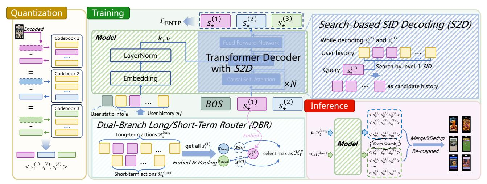
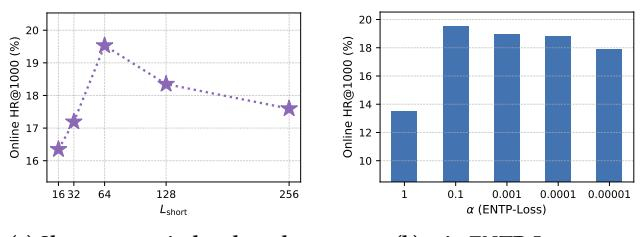

# DualGR: Generative Retrieval with Long and Short-Term Interests Modeling

Zhongchao Yi∗ University of Science and Technology of China Hefei, China zhongchaoyi@mail.ustc.edu.cn

Kai Feng Kuaishou Technology Beijing, China fengkai90@yeah.net

Xiaojian Ma Kuaishou Technology Beijing, China maxiaojian@kuaishou.com

Yalong Wang Kuaishou Technology Beijing, China wangyalong03@kuaishou.com

Yongqi Liu Kuaishou Technology Beijing, China liuyongqi@kuaishou.com

Han Li Kuaishou Technology Beijing, China lihan08@kuaishou.com

Zhengyang Zhou† University of Science and Technology of China Hefei, China Suzhou Institute for Advanced Research, University of Science and Technology of China Suzhou, China zzy0929@ustc.edu.cn

Yang Wang University of Science and Technology of China Hefei, China Suzhou Institute for Advanced Research, University of Science and Technology of China Suzhou, China angyan@ustc.edu.cn

### Abstract

In large-scale industrial recommendation systems, retrieval must produce high-quality candidates from massive corpora under strict latency. Recently, Generative Retrieval (GR) has emerged as a viable alternative to Embedding-Based Retrieval (EBR), which quantizes items into a finite token space and decodes candidates autoregressively, providing a scalable path that explicitly models target-history interactions via cross-attention. However, deploying GR in shortvideo feeds remains challenged by long-short interest interference, context-induced noise in hierarchical SID generation, and the lack of explicit learning from exposed-but-unclicked feedback. To address these challenges, we propose DualGR, which combines (i) a Dual-Branch Long/Short-Term Router (DBR) with selective activation, (ii) Search-based SID Decoding (S2D) that constrains fine-level decoding within the current coarse bucket for efficiency and noise control, and (iii) an Exposure-aware Next-Token Prediction Loss (ENTP-Loss) that treats unclicked exposures as coarse-level hard negatives to promote timely interest fade-out. On the large-scale Kuaishou short-video recommendation system, DualGR has achieved outstanding performance. Online A/B testing shows +0.527% video views and +0.432% watch time lifts, validating DualGR as a practical and effective paradigm for industrial generative retrieval.

# CCS Concepts

### • Information systems → Retrieval models and ranking.

© 2026 Copyright held by the owner/author(s). ACM ISBN 979-8-4007-2307-0/2026/04 <https://doi.org/10.1145/3774904.3792851>

# Keywords

Generative Retrieval, Short-Video Recommendation, User Interest Modeling

### ACM Reference Format:

Zhongchao Yi, Kai Feng, Xiaojian Ma, Yalong Wang, Yongqi Liu, Han Li, Zhengyang Zhou, and Yang Wang. 2026. DualGR: Generative Retrieval with Long and Short-Term Interests Modeling. In Proceedings of the ACM Web Conference 2026 (WWW '26), April 13–17, 2026, Dubai, United Arab Emirates. ACM, New York, NY, USA, [4](#page-3-0) pages.<https://doi.org/10.1145/3774904.3792851>

# 1 Introduction

In large-scale industrial recommender systems, retrieval is the first stage, which must select thousands of high-quality candidates from a multi-billion-item corpus for downstream ranking. Our work is deployed in Kuaishou's double-column Explore feed, akin to Instagram's two-column waterfall layout, where multiple cards appear on the same screen. Compared with the single-column full-screen feed, this layout places stricter demands on candidate diversity, which must produce diverse yet relevant candidates in real time to cover multiple topics and intents, also to rapidly track emerging interests, therefore it magnifies modeling and efficiency challenges at the retrieval stage. In industry, the dominant approach is Embedding-Based Retrieval (EBR), whose DNN twin-tower architecture retrieves user-item matches via approximate nearest neighbors (ANN) [\[3,](#page-3-1) [5\]](#page-3-2). While highly scalable, EBR is inherently limited in multi-interest modeling and target-aware interaction, and is vulnerable to exposure bias [\[1,](#page-3-3) [9\]](#page-3-4).

Recently, inspired by the generative progress of LLMs and Transformers [\[10\]](#page-3-5), industry has begun adopting Generative Retrieval (GR), whose items are discretized into multi-level semantic IDs (SIDs) and candidates are decoded autoregressively along the hierarchy [\[7,](#page-3-6) [8,](#page-3-7) [11\]](#page-3-8). Operating within the same finite and discrete token space during both training and inference can effectively alleviate exposure bias; moreover, cross-attention in decoding enables

∗Work done during internship at Kuaishou Technology.

†Corresponding author.

[This work is licensed under a Creative Commons Attribution 4.0 International License.](https://creativecommons.org/licenses/by/4.0) WWW '26, Dubai, United Arab Emirates

Figure 1: Overview of the proposed DualGR.

explicit target-history interaction. Combined with beam search, the model can naturally produce diverse candidate sets under comparable latency budgets, aligning with retrieval's coverage and exploration goals. Despite this promise, deploying the generative paradigm robustly in multi-interest, short-video retrieval still faces three key challenges: ❶ Long-short interest interference. The double-column feed is highly sensitive to both persistent preferences and hotspot tracking; existing "multi-interest" effects often emerge passively via multi-beam decoding and lack explicit control across time scales. When stable preferences and transient hotspots coexist, attention and gradients can dilute each other, destabilizing routing and decoding and upsetting the relevance-diversity balance. ❷ Context noise and long-history constraints. During finegrained (level-2/3) SIDs generation, the model struggles to separate target-relevant fragments from irrelevant noise, akin to context engineering issues observed in LLMs [\[4\]](#page-3-9). In the same time, under the strict latency budgets of retrieval, without category-wise coarse screening before interaction, the use of long histories will become prohibitive [\[5,](#page-3-2) [6\]](#page-3-10). ❸ Missing negative feedback. Industrial logs contain many unclicked exposed items, yet in the next-token prediction (NTP) [\[7,](#page-3-6) [11\]](#page-3-8), it's difficult to encode them as explicit negative signals, impeding the timely fade-out of non-interest directions and thereby degrading decoding quality and coverage efficiency.

To address these issues, we propose DualGR, a generative retrieval framework with two explicit interest branches and searchbased decoding, while enabling the timely fade-out of non-interest. First, we utilizes Dual-Branch Long/Short-Term Router (DBR) to decompose a user's history into long-term and short-term summaries, compute target-aware similarities, and route to exactly one branch to suppress cross-branch dilution; at inference, run one forward pass per branch and merge the candidates to cover both stable preferences and transient intents. Second, we introduce Search-based SID Decoding (S2D), when predicting fine-grained (level-2/3) SIDs, candidate actions are constrained to the current coarse (level-1) bucket, which shrinks the search space and reinforces intra-bucket consistency, thereby enabling longer usable histories while reducing noise interference and improving computational efficiency. Third, to overcome the lack of negatives, we propose Exposure-aware Next-Token Prediction Loss (ENTP-Loss), at level-1, we treat unclicked exposures as hard negatives, explicitly penalizing the corresponding coarse categories to accelerate the fade-out of non-interest directions. Considering latency and compute budgets, we adopt an encoder-free lightweight frontend (embeddings + LayerNorm) and perform step-wise cross attention over the action list, achieving SIM-like target awareness without redundant re-encoding [\[6\]](#page-3-10). The contributions are as follows:

- We propose DualGR, a generative retriever that explicitly models users' long- and short-term interests while enabling the timely fade-out of non-interest, providing a practical and effective paradigm for industrial generative retrieval.
- We design Dual-Branch Long/Short-Term Router (DBR) to capture users' long- and short-term preferences, Search-based SID Decoding (S2D) to suppress context-induced noise, and improve computational efficiency; and Exposure-aware Next-Token Prediction (ENTP-Loss) to bring in unclicked exposures for timely fade-out of non-interest. Taken together, these components make retrieval more interpretable and controllable.
- Extensive experiments on Kuaishou's double-column Explore feed short-video recommendation with hundreds of millions of users, demonstrates the effectiveness of DualGR.

### 2 Methodology

## 2.1 Preliminary

In short-video recommendation, we model user interests from past interactions and predict which videos the user is likely to engage with next. Let V be the universe of videos, for a user �� at request time ��, the context consists of a static user feature u (e.g., age, gender) and a chronologically ordered action history H�� = (a1, . . . , a���� ), where each action a�� includes the video ID ���� ∈ V, author ID, interaction tags (e.g., like, follow), and watch time, etc. The goal of retrieval stage is to return a candidate set

R�� (u, H�� ) = argmax �� R�� ; u, H�� . (1)

where R�� (u, H�� ) = {��1, ��2, ..., ���� } ⊆ V, �� (·) denotes the overall online-utility objective (e.g., watch time, video views, diversity).

For generative retrieval, each video �� ∈ V is discretized into hierarchical semantic IDs (SIDs): (1) , ��(2) , . . . , ��(��) , where �� (ℓ) ∈

Table 1: Overall online HR@K performance.

| Method     | HR@100 | HR@500  | HR@1000 |
|------------|--------|---------|---------|
| ComiRec    | 2.539% | 6.134%  | 8.249%  |
| PDN        | 2.343% | 5.483%  | 7.249%  |
| KuaiFormer | 4.495% | 7.251%  | 12.356% |
| TIGER      | 4.936% | 8.184%  | 14.442% |
| DualGR     | 6.827% | 10.319% | 19.529% |

widely adopted in prior work [\[3\]](#page-3-1). DualGR adopts an encoderfree decoder of 4 Transformer blocks with model dimension 512, 8 attention heads, and feed-forward dimension 1024. Videos are pre-quantized into ��=3 hierarchical codebooks with per-level size |C(ℓ) |=8192. For inputs, we use the user's most recent positive interactions where |H�� |=1000, the DBR employs window lengths ��long=1000 and ��short=64. Training uses the ENTP-Loss with ��=0.1. Overall Performance. Table [1](#page-3-12) summarizes the results on the shortvideo recommendation. DualGR consistently outperforms strong baselines and the implemented generative retriever, demonstrating clear advantages. These gains indicate that explicitly modeling longand short-term interests with search-based activation, coupled with fade-out of non-interest, yields a more effective and robust generative retrieval paradigm for industrial short-video feeds.

Sensitivity Analysis. We study the impact of the short-term window length ��short (Fig. [2a\)](#page-3-13). Small windows underfit recency, missing short-term interests, while large windows blur the boundary with the long-term branch, so a moderate ��short can best captures recency and remains complementary. For �� in ENTP-Loss (Fig. [2b\)](#page-3-13), overly large values over-penalize unclicked exposures, thus destabilizing training and suppressing true interests, whereas overly small values yield slow fade-out. A moderate setting strikes the best balance.

(a) Short-term window length. (b) �� in ENTP-Loss.

Figure 2: Sensitivity analysis of DualGR.

### 3.1 Online A/B Test

We conducted a week-long online A/B experiment on Kuaishou's double-column Explore feed with 6% traffic, integrating DualGR as an additional retrieval channel. Results show consistent lifts of +0.527% video views and +0.432% watch time, while keeping end-toend latency within service-level budgets (no measurable response time increase), validating DualGR's practical effectiveness.

# 3.2 Ablation Study

We assess the contribution of each module via three variants (Table [2\)](#page-3-14), i.e., w/o DBR replaces the DBR with long branch only, w/o S2D removes S2D and performs unconstrained fine-level decoding, and w/o ENTP-Loss trains with vanilla NTP without exposureaware negatives. DualGR consistently outperforms all variants verifying that all components are necessary and complementary.

Table 2: Ablation study of DualGR.

|        | Method    | HR@100 | HR@500  | HR@1000 |
|--------|-----------|--------|---------|---------|
| w/o    | DBR       | 5.134% | 8.892%  | 15.379% |
| w/o    | S2D       | 6.257% | 9.182%  | 16.287% |
| w/o    | ENTP-Loss | 6.672% | 9.837%  | 17.576% |
| DualGR |           | 6.827% | 10.319% | 19.529% |

### 4 Conclusion

We present DualGR, a generative retriever that explicitly models long- and short-term interests via a Dual-Branch Router (DBR), controls context noise through Search-based SID Decoding (S2D), and accelerates non-interest fade-out with an Exposure-aware NTP Loss (ENTP-Loss). Built on an encoder-free, step-wise target-aware decoder, DualGR delivers consistent HR@K gains and strong online lifts in our production setting, demonstrating its effectiveness as a practical paradigm for industrial generative retrieval.

### Acknowledgements

This paper is partially supported by the National Natural Science Foundation of China (No.62502488, No.12227901), Natural Science Foundation of Jiangsu Province (BK20240460), the grant from State Key Laboratory of Resources and Environmental Information System.

### References

[1] Yukuo Cen, Jianwei Zhang, Xu Zou, Chang Zhou, Hongxia Yang, and Jie Tang. 2020. Controllable multi-interest framework for recommendation. In Proceedings of the 26th ACM SIGKDD international conference on knowledge discovery & data mining. 2942–2951. [2] Houyi Li, Zhihong Chen, Chenliang Li, Rong Xiao, Hongbo Deng, Peng Zhang, Yongchao Liu, and Haihong Tang. 2021. Path-based Deep Network for Candidate Item Matching in Recommenders. arXiv preprint arXiv:2105.08246 (2021). [3] Chi Liu, Jiangxia Cao, Rui Huang, Kai Zheng, Qiang Luo, Kun Gai, and Guorui Zhou. 2024. KuaiFormer: Transformer-Based Retrieval at Kuaishou. arXiv preprint arXiv:2411.10057 (2024). [4] Nelson F Liu, Kevin Lin, John Hewitt, Ashwin Paranjape, Michele Bevilacqua, Fabio Petroni, and Percy Liang. 2023. Lost in the middle: How language models use long contexts. arXiv preprint arXiv:2307.03172 (2023). [5] Yue Meng, Cheng Guo, Xiaohui Hu, Honghu Deng, Yi Cao, Tong Liu, and Bo Zheng. 2025. User Long-Term Multi-Interest Retrieval Model for Recommendation. In Proceedings of the Nineteenth ACM Conference on Recommender Systems. 1112–1116. [6] Qi Pi, Guorui Zhou, Yujing Zhang, Zhe Wang, Lejian Ren, Ying Fan, Xiaoqiang Zhu, and Kun Gai. 2020. Search-based user interest modeling with lifelong sequential behavior data for click-through rate prediction. In Proceedings of the 29th ACM International Conference on Information & Knowledge Management. 2685–2692. [7] Shashank Rajput, Nikhil Mehta, Anima Singh, Raghunandan Hulikal Keshavan, Trung Vu, Lukasz Heldt, Lichan Hong, Yi Tay, Vinh Tran, Jonah Samost, et al. 2023. Recommender systems with generative retrieval. Advances in Neural Information Processing Systems 36 (2023), 10299–10315. [8] Liu Yang, Fabian Paischer, Kaveh Hassani, Jiacheng Li, Shuai Shao, Zhang Gabriel Li, Yun He, Xue Feng, Nima Noorshams, Sem Park, et al. 2024. Unifying generative and dense retrieval for sequential recommendation. arXiv preprint arXiv:2411.18814 (2024). [9] Xinyang Yi, Ji Yang, Lichan Hong, Derek Zhiyuan Cheng, Lukasz Heldt, Aditee Kumthekar, Zhe Zhao, Li Wei, and Ed Chi. 2019. Sampling-bias-corrected neural modeling for large corpus item recommendations. In Proceedings of the 13th ACM conference on recommender systems. 269–277. [10] Wayne Xin Zhao, Kun Zhou, Junyi Li, Tianyi Tang, Xiaolei Wang, Yupeng Hou, Yingqian Min, Beichen Zhang, Junjie Zhang, Zican Dong, et al. 2023. A survey of large language models. arXiv preprint arXiv:2303.18223 1, 2 (2023). [11] Guorui Zhou, Jiaxin Deng, Jinghao Zhang, Kuo Cai, Lejian Ren, Qiang Luo, Qianqian Wang, Qigen Hu, Rui Huang, Shiyao Wang, et al. 2025. OneRec Technical Report. arXiv preprint arXiv:2506.13695 (2025).