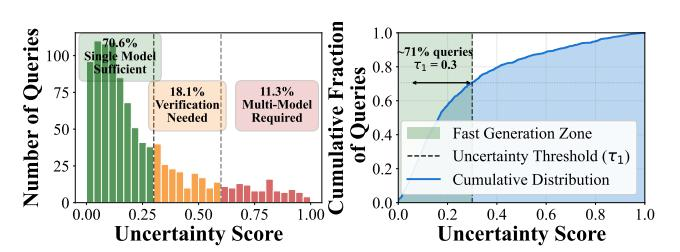
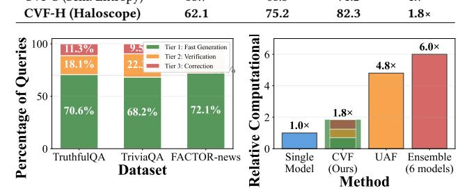
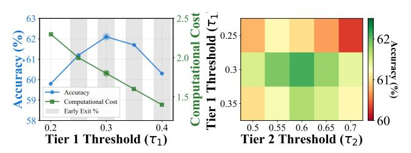
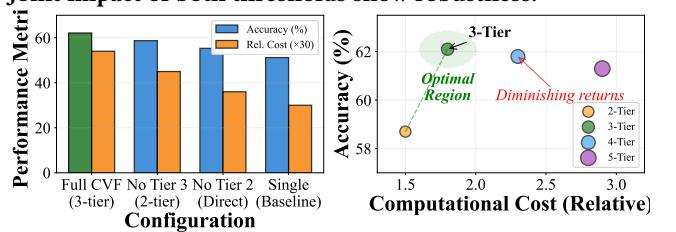
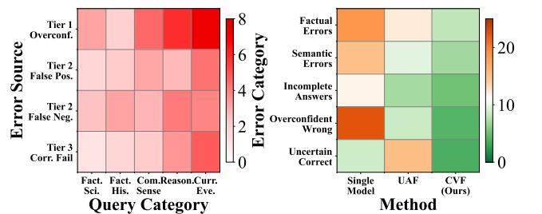
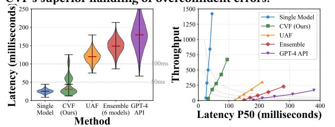

# Cascaded Verification Framework: A Progressive Approach for Mitigating Hallucinations in Large Language Models

Shu Zhou∗ shuzhou@smail.nju.edu.cn School of Information Management, Nanjing University, China

Yufei Song∗ yufeisong@smail.nju.edu.cn School of Information Management, Nanjing University, China

Jinman Leng∗ jmleng@smail.nju.edu.cn School of Information Management, Nanjing University, China

Xin Wang xinwang2749@gmail.com Baidu Inc., Beijing, China

Tao Fan fantao0916@gmail.com Nanjing University of Finance & Economics, Nanjing, China

Hao Wang† ywhaowang@nju.edu.cn School of Information Management, Nanjing University, China

# Abstract

Large Language Models (LLMs) are prone to generating hallucinated content that undermines their reliability in critical applications. While recent ensemble-based methods like Uncertainty-Aware Fusion have shown promise in mitigating hallucinations, they typically employ static model selection and require computationally expensive parallel processing of multiple LLMs for every query. Through extensive analysis on factoid question answering tasks, we observe that the complexity of queries varies significantly, with simpler questions often achievable by single models with high confidence, while only complex or ambiguous queries benefit from multi-model verification. Leveraging this insight, we propose the Cascaded Verification Framework (CVF), a progressive approach that dynamically determines the necessary level of verification based on uncertainty signals. CVF employs a three-tier cascade: fast generation with lightweight models, selective verification triggered by uncertainty thresholds, and targeted correction for identified hallucinations. Empirical evaluation on TruthfulQA, TriviaQA, and FACTOR-news datasets demonstrates that CVF achieves superior accuracy to state-of-the-art methods while reducing computational costs by up to 67% through selective model activation. Our framework not only narrows the performance gap with GPT-4 but also provides interpretable verification trails, offering practical advantages for deployment in resource-constrained environments.

# CCS Concepts

### • Computing methodologies → Natural language processing.

# Keywords

Large Language Models, Hallucinations, Cascade, Efficiency

### ACM Reference Format:

Shu Zhou, Yufei Song, Jinman Leng, Xin Wang, Tao Fan, and Hao Wang. 2026. Cascaded Verification Framework: A Progressive Approach for Mitigating

∗These authors contributed equally to this work.

†Corresponding author.

[This work is licensed under a Creative Commons Attribution 4.0 International License.](https://creativecommons.org/licenses/by/4.0) WWW '26, Dubai, United Arab Emirates

© 2026 Copyright held by the owner/author(s). ACM ISBN 979-8-4007-2307-0/2026/04 <https://doi.org/10.1145/3774904.3792852>

Hallucinations in Large Language Models. In Proceedings of the ACM Web Conference 2026 (WWW '26), April 13–17, 2026, Dubai, United Arab Emirates. ACM, New York, NY, USA, [4](#page-3-0) pages.<https://doi.org/10.1145/3774904.3792852>

Figure 1: Query uncertainty distribution in TruthfulQA. (Left) Histogram showing 70% of queries have low uncertainty (<0.3). (Right) CDF confirming the skewed distribution that motivates our cascaded design.

### 1 Introduction

Large Language Models (LLMs) have demonstrated remarkable capabilities across diverse natural language processing tasks, from question answering to code generation [\[1\]](#page-3-1). However, their propensity to generate plausible-sounding but factually incorrect content—commonly known as hallucinations—remains a critical challenge that undermines their deployment in high-stakes applications. This limitation is particularly pronounced in factoid question answering, where accuracy is paramount and even subtle factual errors can have significant consequences.

Related Work: Current approaches to mitigate hallucinations can be broadly categorized into three paradigms. First, inferencetime intervention methods modify the generation process directly. Representation editing techniques like ITI [\[8\]](#page-3-2) and TruthX [\[11\]](#page-3-3) identify truthful directions in model activations and steer outputs accordingly. Contrastive decoding approaches such as DoLa [\[2\]](#page-3-4) and SH2 [\[6\]](#page-3-5) adjust output probabilities by comparing distributions across layers or models. While effective, these methods often require additional training data, involve complex implementation, and may struggle with domain generalization.

Second, ensemble-based methods leverage multiple LLMs to harness collective intelligence. LLM-Blender [\[5\]](#page-3-6) learns to optimally combine responses from different models, while Consistent [\[10\]](#page-3-7) employs self-consistency through majority voting. Recently, Uncertainty-Aware Fusion (UAF) [\[3\]](#page-3-8) introduced uncertainty signals

where Context(·) incorporates the initial response and verification feedback to guide the correction process.

2.2.4 DYNAMIC THRESHOLD ADAPTATION. To optimize the tradeoff between accuracy and efficiency, CVF can adapt thresholds based on task-specific requirements:

��1 = �� · Acc(���� ������) + (1 − ��) · Speed (5)

where �� balances accuracy and computational efficiency.

2.2.5 COMPLEXITY ANALYSIS. The computational cost of CVF is:

Cost���� �� = ��1 + ��1 · (�� · ��2) + ��1 · ��2 · ��3 (6)

where ���� represents the cost of tier ��, ��1 = �� (��1 ≥ ��1) is the probability of entering Tier 2, and ��2 = �� (������������ ≤ ��2 |��1 ≥ ��1) is the conditional probability of requiring correction. In practice, ��1 ≪ 1 for most queries, resulting in significant computational savings compared to static ensemble methods where Cost������������ = �� · �������� for all queries.

### 3 Experiments

# 3.1 Experimental Setup

Baselines: We compare CVF against three categories of state-ofthe-art methods. For representation editing, we evaluate ITI [\[8\]](#page-3-2) and TruthX [\[11\]](#page-3-3). For contrastive decoding, we include DoLa [\[2\]](#page-3-4) and SH2 [\[6\]](#page-3-5). For ensemble methods, we compare against Consistent [\[10\]](#page-3-7), MLM [\[9\]](#page-3-10), LLM-Blender [\[5\]](#page-3-6), and the recent UAF [\[3\]](#page-3-8). We also include GPT-4 [\[1\]](#page-3-1) as an upper bound reference.

Datasets: Following prior work, we evaluate on three benchmark datasets: TruthfulQA, TriviaQA, and FACTOR-news.

Implementation Details: For CVF, we implement three uncertainty estimation methods following UAF: Perplexity, Semantic Entropy [\[7\]](#page-3-9), and Haloscope [\[4\]](#page-3-11). We reserve 10% of each dataset as a validation set for threshold tuning and report results on the remaining 90% test set.

LLM Pool: Our model pool M consists of six open-source LLMs with varying capabilities and computational requirements: Lightweight (���� ������): Llama3.2-3B, Alpaca-7B Medium: Vicuna-7B, Mistralv3- 7B Heavy (��������������): Llama2-13B, Opt-13B. The categorization is based on both model size and inference latency. For Tier 1, we use Llama3.2-3B as ���� ������. For Tier 2 verification, we employ the medium-tier models. For Tier 3 correction, we use Llama2-13B.

Metrics: Accuracy: For multiple-choice tasks (TruthfulQA, FAC-TOR), we measure the percentage of correctly selected answers. For TriviaQA, we use exact match accuracy following standard evaluation protocols. Computational Cost: We measure the average number of LLM forward passes required per query, normalized by model size (FLOPs).

Hyperparameters: Through validation set experiments, we determine optimal thresholds for each dataset: ��1 ∈ {0.25, 0.3, 0.35} and ��2 ∈ {0.5, 0.6, 0.7}. For verification, we use �� = 3 models based on ablation studies. All experiments use greedy decoding with temperature 0 for reproducibility.

Table 1: Accuracy (%) and computational cost comparison. Bold: best results excluding GPT-4. Rel. Cost: relative to single model inference.

| Method               | TruthfulQA | TriviaQA | FACTOR | Rel. Cost |
|----------------------|------------|----------|--------|-----------|
| ITI                  | 38.9       | 65.9     | 53.3   | 1.2×      |
| TruthX               | 54.2       | 69.8     | 65.8   | 1.3×      |
| DoLa                 | 33.2       | 66.1     | 66.2   | 1.5×      |
| SH2                  | 34.2       | 70.2     | 77.0   | 1.4×      |
| Consistent           | 41.7       | 65.6     | 61.4   | 6.0×      |
| MLM                  | 29.0       | 57.6     | 50.8   | 6.0×      |
| LLM-Blender          | 48.4       | 59.0     | 64.7   | 6.5×      |
| GPT-4                | 59.0       | 87.0     | –      |           |
| UAF (Haloscope)      | 60.8       | 71.5     | 81.4   | 4.8×      |
| CVF-P (Perplexity)   | 58.2       | 74.8     | 73.6   | 1.6×      |
| CVF-S (Sem. Entropy) | 53.7       | 68.3     | 71.2   | 1.7×      |
| CVF-H (Haloscope) )  | 62.1       | 75.2     | 82.3   | 1.8×      |

Figure 2: (Left) Query distribution across cascade tiers shows 70% early exit at Tier 1. (Right) Computational cost comparison demonstrates CVF's efficiency advantage.

### 3.2 Experimental Results

RQ1: How does CVF's accuracy compare to state-of-the-art hallucination mitigation methods while achieving computational efficiency? Table [1](#page-2-0) compares accuracy across baselines on three benchmarks. CVF-H achieves the highest accuracy on TruthfulQA (62.1%, surpassing GPT-4) and FACTOR-news (82.3%), while reaching 75.2% on TriviaQA. Crucially, CVF requires only 1.8× computational cost versus 4.8-6.5× for ensemble methods—a 67% reduction compared to UAF. This stems from our cascaded design where 70% of queries exit at Tier 1 (Figure [1\)](#page-0-0).

RQ2: What is the distribution of queries across the three cascade tiers and how does this impact overall computational cost? Figure [2](#page-2-1) analyzes query distribution across cascade tiers. In all datasets, 68-72% of queries are resolved in Tier 1 with single-model inference, 18-22% require verification in Tier 2, and only 8-11% need full correction in Tier 3. This distribution directly translates to computational savings: CVF's average cost of 1.8× represents the weighted sum of tier costs, achieving a 67% reduction versus UAF's uniform 4.8× cost while maintaining superior accuracy.

RQ3: How sensitive is CVF to threshold selection (��1, ��2), and can we identify optimal values for different datasets? Figure [3](#page-3-12) shows threshold sensitivity. The left plot reveals ��1=0.30 as optimal, achieving 62.1% accuracy at 1.8× cost; lower values increase cost without accuracy gains, while higher values sacrifice accuracy for marginal efficiency. The right heatmap demonstrates robustness: accuracy varies by only 2.1% across all threshold pairs, with (��1=0.30, ��2=0.60) reaching peak performance.

RQ4: What is the contribution of each tier to the overall performance, and is the three-tier design optimal? Figure [4](#page-3-13) validates our three-tier design through ablation studies. Removing Tier 3

Figure 3: Threshold sensitivity analysis. (Left) Trade-off between accuracy and efficiency for different ��1 values. (Right) Joint impact of both thresholds show robustness.

Figure 4: (Left) Ablation study showing each tier's contribution to overall performance. (Right) Cascade depth analysis reveals 3-tier design as optimal.

(correction) drops accuracy by 3.4%, while removing Tier 2 (verification) causes a 6.8% decline, demonstrating each tier's essential contribution. The right plot confirms three tiers as optimal: adding more tiers yields diminishing returns, while fewer tiers sacrifice significant accuracy. Our 3-tier CVF achieves the best accuracyefficiency balance in the Pareto-optimal region.

RQ5: What types of queries does CVF fail on, and how do error patterns differ from baseline methods? Figure [5](#page-3-14) analyzes CVF's failure modes. The left heatmap shows CVF struggles with current events and reasoning queries due to Tier 1 overconfidence on complex questions. However, the right comparison shows significant improvements: overconfident wrong answers drop by 52% and factual errors by 33%. CVF's cascaded verification effectively prevents high-confidence mistakes that plague single models. ics Laboratory. **Fact.**

RQ6: What is the real-world latency and throughput performance of CVF? Figure [6](#page-3-15) shows latency measurements on NVIDIA A100 GPUs. The violin plot reveals a bimodal distribution: most queries complete in 25ms (Tier 1), with a smaller peak at 60ms (Tier 2/3). CVF achieves 32ms mean latency (73% reduction vs. UAF's 120ms) and 108ms P99 latency (below UAF's mean). At batch size 32, CVF reaches 427 queries/sec with 75ms latency, balancing latency, throughput, and accuracy for production deployment.

### 4 Conclusion

CVF introduces a dynamic three-tier cascade that achieves sota accuracy while reducing computational costs by 67% and latency by 73% compared to UAF. By exploiting the insight that 70% of queries require only single-model processing, CVF delivers productionready hallucination mitigation without sacrificing quality.

# Acknowledgments

This work is supported by National Natural Science Foundation of China (Grant No. 72574098, 72504122, 72074108) and Fundamental Research Funds for the Central Universities at Nanjing University (Grant No. 010814370338) and Jiangsu International Joint Informat-

Figure 5: Error analysis revealing failure patterns. (Left) CVF error distribution shows higher rates on current events and reasoning tasks. (Right) Comparative analysis demonstrates CVF's superior handling of overconfident errors.

Figure 6: Real-world performance on NVIDIA A100. (Left) Latency distribution showing CVF's bimodal pattern with 73% reduction vs UAF. (Right) CVF achieves optimal latencythroughput trade-off. References

[1] Josh Achiam, Steven Adler, Sandhini Agarwal, et al. 2023. GPT-4 Technical Report. arXiv preprint arXiv:2303.08774 (2023). [2] Yung-Sung Chuang, Yujia Xie, Hongyin Luo, Yoon Kim, James Glass, and Pengcheng He. 2024. DoLa: Decoding by Contrasting Layers Improves Factuality in Large Language Models. arXiv[:2309.03883](https://arxiv.org/abs/2309.03883) [cs.CL] [https://arxiv.org/](https://arxiv.org/abs/2309.03883) [abs/2309.03883](https://arxiv.org/abs/2309.03883) [3] Prasenjit Dey, Srujana Merugu, and Sivaramakrishnan Kaveri. 2025. Uncertainty-Aware Fusion: An Ensemble Framework for Mitigating Hallucinations in Large Language Models. In Companion Proceedings of the ACM on Web Conference 2025 (WWW '25). ACM, 947–951. [doi:10.1145/3701716.3715523](https://doi.org/10.1145/3701716.3715523) [4] Tianxiang Du, Yanbin Zhao, Yilun Zhou, Joshua B Tenenbaum, and Chuang Gan. 2024. Haloscope: Towards Comprehensive Detection and Mitigation of Hallucinations in Large Vision-Language Models. arXiv preprint arXiv:2402.15930 (2024). [5] Dongfu Jiang, Xiang Ren, and Bill Yuchen Lin. 2023. LLM-Blender: Ensembling Large Language Models with Pairwise Ranking and Generative Fusion. In Proceedings of the 61st Annual Meeting of the Association for Computational Linguistics. 14165–14178. [6] Jushi Kai, Tianhang Zhang, Hai Hu, and Zhouhan Lin. 2024. SH2: Self-Highlighted Hesitation Helps You Decode More Truthfully. In Findings of the Association for Computational Linguistics: EMNLP 2024, Yaser Al-Onaizan, Mohit Bansal, and Yun-Nung Chen (Eds.). Association for Computational Linguistics, Miami, Florida, USA, 4514–4530. [doi:10.18653/v1/2024.findings-emnlp.260](https://doi.org/10.18653/v1/2024.findings-emnlp.260) [7] Lorenz Kuhn, Yarin Gal, and Sebastian Farquhar. 2023. Semantic Uncertainty: Linguistic Invariances for Uncertainty Estimation in Natural Language Generation. arXiv[:2302.09664](https://arxiv.org/abs/2302.09664) [cs.CL]<https://arxiv.org/abs/2302.09664> [8] Kenneth Li, Oam Patel, Fernanda Viégas, Hanspeter Pfister, and Martin Wattenberg. 2024. Inference-Time Intervention: Eliciting Truthful Answers from a Language Model. arXiv[:2306.03341](https://arxiv.org/abs/2306.03341) [cs.LG]<https://arxiv.org/abs/2306.03341> [9] Julian Salazar, Davis Liang, Toan Q Nguyen, and Katrin Kirchhoff. 2020. Masked language model scoring. In Proceedings of the 58th Annual Meeting of the Association for Computational Linguistics. 2699–2712. [10] Xuezhi Wang, Jason Wei, Dale Schuurmans, Quoc Le, Ed Chi, Sharan Narang, Aakanksha Chowdhery, and Denny Zhou. 2023. Self-Consistency Improves Chain of Thought Reasoning in Language Models. arXiv[:2203.11171](https://arxiv.org/abs/2203.11171) [cs.CL] <https://arxiv.org/abs/2203.11171> [11] Shaolei Zhang, Tian Yu, and Yang Feng. 2024. TruthX: Alleviating Hallucinations by Editing Large Language Models in Truthful Space. In Proceedings of the 62nd Annual Meeting of the Association for Computational Linguistics (Volume 1: Long Papers), Lun-Wei Ku, Andre Martins, and Vivek Srikumar (Eds.). Association for Computational Linguistics, Bangkok, Thailand, 8908–8949. [doi:10.18653/v1/2024.](https://doi.org/10.18653/v1/2024.acl-long.483) [acl-long.483](https://doi.org/10.18653/v1/2024.acl-long.483)