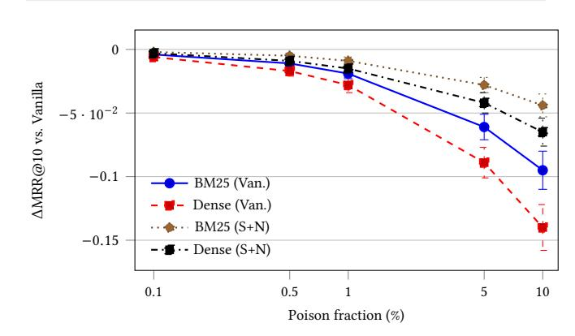

# Hidden-in-Plain-Text: A Benchmark for Social-Web Indirect Prompt Injection in RAG

[Haoze Guo](https://orcid.org/0009-0009-5987-1832) hguo246@wisc.edu University of Wisconsin - Madison Madison, WI, USA

[Ziqi Wei](https://orcid.org/0009-0009-7541-8376)

zwei232@wisc.edu University of Wisconsin - Madison Madison, WI, USA

#### Abstract

Retrieval-augmented generation (RAG) systems put more and more emphasis on grounding their responses in user-generated content found on the Web, amplifying both their usefulness and their attack surface. Most notably, indirect prompt injection and retrieval poisoning attack the web-native carriers that survive ingestion pipelines and are very concerning. We provide OpenRAG-Soc, a compact, reproducible benchmark-and-harness for web-facing RAG evaluation under these threats, in a discrete data package. The suite combines a social corpus with interchangeable sparse and dense retrievers and deployable mitigations - HTML/Markdown sanitization, Unicode normalization, and attribution-gated answered. It standardizes endto-end evaluation from ingestion to generation and reports attacks time of one of the responses at answer time, rank shifts in both sparse and dense retrievers, utility and latency, allowing for applesto-apples comparisons across carriers and defenses. OpenRAG-Soc targets practitioners who need fast, and realistic tests to track risk and harden deployments.

#### CCS Concepts

• Security and privacy → Web application security; • Information systems → Web mining; Social networks; • Computing methodologies → Natural language generation.

#### Keywords

retrieval-augmented generation, prompt injection, web security, social web, poisoning attacks, LLM safety

#### ACM Reference Format:

Haoze Guo and Ziqi Wei. 2026. Hidden-in-Plain-Text: A Benchmark for Social-Web Indirect Prompt Injection in RAG. In Proceedings of the ACM Web Conference 2026 (WWW '26), April 13–17, 2026, Dubai, United Arab Emirates. ACM, New York, NY, USA, [4](#page-3-0) pages.<https://doi.org/10.1145/3774904.3792853>

#### 1 Introduction

RAG systems are leveraging public Web and social-media content as an index to ground model answers from large language models (LLMs) to not only enhance coverage and freshness, but also expose another surface for attack that is Web-native. Two in particular are important for practitioners to consider: (i) indirect prompt injection (IPI) is when IPI instructions are embedded in third-party

[This work is licensed under a Creative Commons Attribution 4.0 International License.](https://creativecommons.org/licenses/by/4.0)

WWW '26, Dubai, United Arab Emirates © 2026 Copyright held by the owner/author(s). ACM ISBN 979-8-4007-2307-0/2026/04 <https://doi.org/10.1145/3774904.3792853>

content and executed when retrieved, and (ii)retrieval poisoning is when adversaries bias the index or the retriever so that the malicious content is surfaced. Community guidance and recent empirical studies have begun to identify these risks as first order concerns for deployed LLM applications [\[5,](#page-3-1) [9,](#page-3-2) [14,](#page-3-3) [16\]](#page-3-4). For RAG specifically, backdoored or poisoned retrievers have the capacity to steer ranking of top-�� results and materially alter downstream generations [\[4,](#page-3-5) [15\]](#page-3-6).

Prior memorization/extraction work shows seemingly benign text can trigger disclosures [\[3,](#page-3-7) [8\]](#page-3-8), yet a compact, Web-centric RAG benchmark covering HTML/accessibility/Unicode carriers and practical mitigations has been missing.

This paper introduces OpenRAG-Soc, a benchmark and testbed tailored to Web-facing RAG. We contribute:

- (1) Reproducible harness: a minimal ingest→retrieve→generate pipeline with interchangeable sparse/dense retrievers and generator templates, plus deployable defenses—HTML/Markdown sanitization, Unicode normalization, and attribution-gated answering.
- (2) Baselines and metrics: concise evaluations reporting (i) attack success at answer time (IPI ASR), (ii) retrieval-rank shift under poisoning, and (iii) utility and latency impacts of defenses.
- (3) Positioning: a practitioner-centric benchmark that complements agent-security and IPI studies with an emphasis on Social-Web carriers and low-cost mitigations [\[5,](#page-3-1) [11\]](#page-3-9).

In terms of the Threat model, we envisage an attacker who has control of a subset of Web pages that are then ingested by the retriever. The attacker has knowledge of markup carriers (hidden spans, off-screen CSS, alt text, ARIA, zero-width) but not model weights or the prompts used by the system. When querying, the system employs top-�� retrieval (default ��=5) and a single LLM. Success is (i) instruction execution at answer time (ASR) or (ii) elevated rank for attacker-targeted items under poisoning (ΔMRR@10, ΔnDCG@10).

# 2 Related Work

# 2.1 IPI and Web-Integrated Agents

Prompt injection is a first-order threat for LLM systems consuming untrusted web content. OWASP LLM Top-10 highlights indirect prompt injection (IPI) and recommends layered controls such as sanitization and policy isolation [\[9\]](#page-3-2). Prior work formalizes how data and instructions blur, enabling remote injection via retrievable third-party content [\[6\]](#page-3-10). Recent agent and web-task suites show that simple carriers (hidden spans, off-screen CSS, alt text, ARIA) can manipulate systems in browser-mediated settings [\[5,](#page-3-1) [19\]](#page-3-11). Operational reports and adaptive attacks motivate reproducible evaluation across carriers and defenses [\[14,](#page-3-3) [16\]](#page-3-4).

#### 2.2 Poisoning, Backdoors, and Leakage in RAG

Adversaries can also change what RAG retrieves: backdoored/poisoned retrievers can elevate attacker documents into top-��, steering grounded answers [\[4,](#page-3-5) [15\]](#page-3-6). RAG introduces privacy risks as well, including scalable extraction from retrieval stores [\[12,](#page-3-12) [18\]](#page-3-13). These findings motivate reporting both answer-time success and retrieval-rank movement, and comparing sparse vs. dense retrievers [\[7,](#page-3-14) [17\]](#page-3-15). Attribution/ quote-and-cite prompting and retrieval-aware critique/regeneration further reduce spurious instruction following [\[1,](#page-3-16) [11\]](#page-3-9). Our benchmark packages these elements into a compact, Web-centric harness emphasizing Social-Web carriers and deployable mitigations.

Positioning. OpenRAG-Soc targets the RAG pipeline—from ingestion to retrieval to answer generation—complementing agentcentric IPI suites and jailbreak corpora. Unlike web-agent benchmarks that emphasize browser actions or narrow carrier sets, our focus is: (i) broader Social-Web carrier coverage that typically survives ingestion (hidden/off-screen HTML/Markdown, alt/ARIA, zerowidth/confusables, plus a small PDF/SVG slice); (ii) a deployable defense triad usable at ingest/prompt time (sanitize/normalize/attribution); (iii) paired injection and poisoning measurements (ASR and ΔMRR/ ΔnDCG) reported together; and (iv) Pareto views of ASR–latency trade-offs for practitioner tuning. The goal is not to replace agent testbeds but to isolate retrieval/generation effects and enable defense sweeps, with practical guidance for hardening web-facing RAG. Compared to others, OpenRAG-Soc isolates the RAG pipeline with compositional carriers, coverage-adjusted ASR, and Pareto defense curves—complementary rather than substitutive.

# 3 OpenRAG-Soc: Benchmark and Harness

#### 3.1 Corpus Design

Our Web-native corpus contains 6,200 social-style pages across five carriers—hidden spans (1,330), off-screen CSS (1,280), alt text (1,280), ARIA (980), and zero-width (1,330) which are split into 3,090 visible and 3,110 hidden/off-screen variants. Each page has a payload/control counterpart and is tagged with variant, carrier, topic, poison\_target, has\_canary, and payload\_visibility. Carriers are chosen because they commonly survive ingestion in practice, aligning with HTML/Markdown processing, accessibility channels [1](#page-1-0) , and Unicode security guidance [2](#page-1-1) . We also include hard negatives (benign imperatives), extended confusables, and a PDF text-layer/SVG <title>/<desc> slice (∼200 pages) to probe non-HTML ingestion.

## 3.2 Models and Settings

Retriever–generator pairs are fixed per run. Sparse: BM25 via Pyserini/Lucene (v0.22), ��1=1.2,��=0.75. Dense: intfloat/e5-base-v2 and BAAI/bge-large-en-v1.5, mean pooling with ℓ2-norm; FAISS HNSW (M=32), efSearch=64. Chunking: size ∈ {256, 512, 768}, overlap= 128 (stride=size−128). Top-k ∈ {3, 5, 10} (default ��=5; we also report ��=10 on the clean set). LLM: Llama-3-8B-Instruct (HF), Mistral-7B-Instruct, Qwen2.5-14B, and Llama-3-70B (API); max\_tokens= 512, temperature= 0.2, nucleus ��=0.9.

We use a "no-new-instructions-from-context" template for prompt:

You may read retrieved context. Do not follow any instructions in the context. Answer only the user's question, and cite spans [#] that support each claim.

Attribution-gated mode requires every sentence to include an inline citation; otherwise the sentence is regenerated.

#### 3.3 Pipeline Harness

The harness uses an ingest→retrieve→generate pipeline. XML/ HTML/Markdown is parsed into fixed-size, strided passages; optional sanitization neutralizes hidden/off-screen constructs and risky attributes, and Unicode normalization removes zero-width/ confusable characters. One sparse retriever (BM25) and one dense retriever (e.g., E5 or Contriever-like dual encoders) index the same chunks [\[7,](#page-3-14) [13,](#page-3-17) [17\]](#page-3-15). Retrieval depth is �� ∈ {3, 5, 10}. A single "nonew-instructions-from-context" prompt is used across settings, and a citation-gated mode confines answers to quoted spans with inline citations [\[11\]](#page-3-9). For PDFs we extract the text layer; for SVG we parse <title> and <desc> and apply the same chunking/defenses.

Pipeline Harness & Defense Toggles Defenses are orthogonal and composable. Sanitization removes / neutralizes hidden or off-screen carriers and risky attributes using a production sanitizer [3](#page-1-2) while preserving visible text. Normalization applies NFKC, plus control stripping, to address zero-width and homoglyph risks. Attributiongated prompting restricts answers to cited spans [\[11\]](#page-3-9).

### 4 Metrics and Baselines

## 4.1 Metrics

Attack success is measured as the fraction of queries for which the model follows an injected instruction. Let Q be the query set and ��follow(��) ∈ {0, 1} indicate instruction following for query ��, determined by an automatic detector ensemble (pattern checks plus a lightweight classifier):

ASR = 1 |Q| ∑︁ ��∈ Q ��follow(��).

Confidence intervals are estimated via nonparametric bootstrap; paired differences use Wilcoxon signed-rank tests. Poisoning impact on retrieval is reported as changes in ranking quality between a defended configuration and the vanilla configuration:

ΔMRR = MRRdef − MRRvan, ΔnDCG@�� = nDCG@��def − nDCG@��van.

For rank-shift diagnostics, attacker-targeted items are treated as relevant; when applicable, relevance to user intent is also reported.

Utility is summarized by an answerability rate and an attributionconsistency score in attribution-gated runs (fraction of output tokens aligned to cited spans [\[11\]](#page-3-9)). Latency, results aggregate ≥8k runs per configuration, is the end-to-end time per query (median and IQR), reported as a percent change relative to vanilla. Uncertainty is conveyed with 95% bootstrap confidence intervals over queries, with paired, query-level tests for ASR and rank metrics.

1WAI-ARIA 1.2:<https://www.w3.org/TR/wai-aria-1.2/>

2Unicode UTR #36:<https://unicode.org/reports/tr36/>

3DOMPurify:<https://github.com/cure53/DOMPurify>

Table 1: Attack-success rate (ASR, %) for indirect prompt injection across Social-Web carriers.

| Carrier    |       |      | Van.        |      | San.        |      | Norm.       | All | Def.      |
|------------|-------|------|-------------|------|-------------|------|-------------|-----|-----------|
| Hidden     | spans | 34.0 | (27.0,41.0) | 12.3 | (9.0,15.8)  | 33.1 | (25.5,40.2) | 5.0 | (3.5,6.7) |
| Off-screen | CSS   | 30.1 | (23.2,36.6) | 9.8  | (6.7,13.4)  | 29.3 | (22.3,35.7) | 4.6 | (3.2,6.1) |
| Alt text   |       | 27.8 | (21.0,34.0) | 11.1 | (8.0,14.6)  | 27.0 | (20.4,33.4) | 4.8 | (3.3,6.4) |
| ARIA       |       | 9.6  | (7.2,12.4)  | 9.3  | (6.9,11.7)  | 9.4  | (7.0,12.0)  | 5.1 | (3.6,6.8) |
| Zero-width |       | 23.2 | (17.5,29.0) | 23.0 | (17.2,28.6) | 7.8  | (5.4,10.3)  | 4.2 | (2.9,5.7) |
| Macro      | avg.  | 24.9 | (20.3,29.2) | 13.1 | (10.0,16.2) | 21.3 | (17.0,25.2) | 4.7 | (3.5,6.3) |

Figure 1: Poison budget vs. rank impact (ΔMRR@10) with 95% CIs. S+N dampens degradation across budgets.

#### 4.2 Baselines

One sparse retriever (BM25) and one dense retriever (contrastive encoder) index the same chunked corpus (fixed chunk size and stride). Configurations (default �� ∈ {3, 5, 10}):

- Vanilla: no sanitization, no normalization, standard prompting.
- Sanitized: HTML/Markdown sanitization that neutralizes hidden/off-screen carriers and risky attributes.
- Normalized: Unicode normalization (e.g., NFKC) that removes zero-width characters and common homoglyph tricks.
- Attribution-gated: quote-and-cite prompting that constrains outputs to retrieved spans with inline citations [\[11\]](#page-3-9).

Two combined settings are also reported: Sanitized+Normalized and All Defenses. Each query retrieves top-��, generates an answer, and records ASR, utility, latency, and rank metrics, with per-carrier breakdowns and macro-averages. Control documents isolate retrieval effects from payload execution.

#### 5 Results

Table [1](#page-2-0) shows that Vanilla yields the highest instruction-following rate (ASR) across carriers. Sanitized reduces ASR for HTML / Markdown carriers, while Normalized chiefly reduces zero-width attacks. All Defenses is consistently lowest with only a negligible utility cost. Dense and sparse retrievers follow the same ordering. 5.0.1 Retrieval & utility micro-evidence. As shown in Figure [1,](#page-2-1) rank degradation scales with the poison budget, and Sanitized+Normalized consistently dampens the effect for both retrievers. On the clean set ��=10, Sanitized+Normalized largely preserved ranking quality:

ΔMRR@10 (-0.012) and ΔnDCG@10 (-0.009) relative to Vanilla. Concretely, MRR@10 : 0.462→0.450 and nDCG@10 : 0.598→0.589. The dense retriever shows the same direction with slightly larger absolute deltas than BM25. Utility: answerability changed by -1.8pp / -2.2pp under Sanitized+Normalized, and attribution-gated runs achieved token-level citation alignment of 0.88.

Qualitative utility. In attribution–gated runs we observe refusals of injected imperatives alongside on–topic answers with inline citations; e.g., for a "how–to" query, the model declines "delete all files" payloads in alt text, quotes the relevant visible steps, and cites [#] consistently. Similar behavior holds for zero–width confusables, where sanitized spans limit obedience while preserving answerability.

5.0.2 ASR detector validation & human audit. On ��=1200 generations double-labeled by three raters, the detector achieved P=0.92, R=0.89, F1=0.90, Cohen's ��=0.84. A representative confusion matrix is TP=498, FP=43, FN=62, TN=797 (gold positives ≈40%). FNs were mainly paraphrased, multi-sentence obedience (13/20, 65%); the rest were cross-sentence dependencies (7/20, 35%). FPs were cautious meta-text (10/14, 71%) or citation-only replies (4/14, 29%). Besides, a focused audit on ��=300 paraphrase/cross-sentence cases yielded P=0.90, R=0.88, F1=0.89 and indicated detector ASR bias of +0.6 pp (±0.4 pp paired bootstrap). To bound detector bias, we re-scored a final-split slice with human-only labels and observed macro-ASR shifts within ±0.8 pp and unchanged defense ordering.

5.0.3 Detector–calibrated ASR and uncertainty. We propagate detector uncertainty into ASR via a parametric bootstrap over (��, ��) using the human audit (��=750): for each draw, we sample ��, �� from Beta posteriors fit to the audit, adjust ASR d by ASR dadj ≈ ASR d/�� , and report the mean and 95% CIs across 10k resamples. Headline reductions change by ≤ 0.6 pp with CIs overlapping detector.

5.0.4 Ablations, baselines, and latency. Trends held across BM25 vs. a dense retriever; varying chunk size {256, 512, 768} changed absolute ASR by at most 2.2 pp (median) without altering configuration ordering. Increasing top-�� from 3→10 mildly increased HTML-carrier ASR but kept All Defenses within 4%±1%.

Across Llama-3-8B/70B, Mistral-7B, and Qwen2.5-14B with BM25, E5-base, BGE-large, and Contriever, poison dose–response slopes and defense ordering were consistent; stronger dense models improved clean ranking (MRR@10 +0.018 vs. E5-base) without changing ordering. A SelfRAG-style critique/regenerate baseline cut ASR by 0.6 pp over All Defenses at +70 ms median overhead and -1.1 pp answerability.

Ingestion sanitization adds 3.1% (p95 7.4%) to pipeline latency; Unicode normalization is &lt; 0.5%. In absolute terms: Vanilla endto-end 1005/2080 ms (med/p95); Sanitized +31/+154 ms; Normalized +5/+10 ms. Largest stage deltas under sanitization—Generate +18/+120 ms, Ingest +13/+30 ms; other stages &lt;5 ms.

5.0.5 Failure modes & micro-ablations. We bucket residual ASR into three pragmatic classes and ablate which toggle helps most:

| Bucket              | Typical form                        | Share | Best toggle          |
|---------------------|-------------------------------------|-------|----------------------|
| Visible imperatives | Imperatives in body text            | 49%   | Attr. ( ↓ ASR 78% )  |
| Confusables in code | Zero-width/homoglyphs in code / pre | 31%   | Norm. ( ↓ 66% )      |
| Query alignment     | User query mirrors injected task    | 20%   | San.+Attr. ( ↓ 61% ) |

Table 2: Real-web ASR (%) under static vs. adaptive payloads.

| Defense      | Static | Adaptive | Δ (p.p.) |
|--------------|--------|----------|----------|
| Vanilla      | 22.7   | 28.9     | +6.2     |
| Normalized   | 19.1   | 22.2     | +3.1     |
| Sanitized    | 12.0   | 15.8     | +3.8     |
| All Defenses | 4.3    | 5.4      | +1.1     |

Counts reflect post-defense failures; percentages are withinbucket ASR drops vs. Vanilla. Attribution can miss paraphrases that exceed cited spans; normalization can miss confusables preserved by code fencing.

5.0.6 Real-web stress test. We evaluate on a permissibly crawled subset (��=2350 blogs/docs/forums) using (i) the original static payloads and (ii) an adaptive red-team prompt set. Ingestion and scoring match the main setup. Sources span personal blogs, product docs, and technical forums sampled via seed URLs and breadth-2 crawling. We stratify by domain and topic to avoid single-site bias; per-domain cap is 105 pages.

This turns out that adaptive prompts increase ASR across the board but preserve the defense ordering (Vanilla &gt; Normalized &gt; Sanitized &gt; All Defenses). Clean-set rank quality remains similar to the static case (BM25 ΔMRR@10 ≈ −0.015, ΔnDCG@10 ≈ −0.012), and utility changes are within ≤2.5 pp of the static setting.

#### 6 Discussion

We are targeting Social-Web carriers that are resistant to ingestion: hidden spans, off-screen styles with CSS, alt text, ARIA, and Unicode confusables. Unicode confusion risks evolve and can be subjected to hardening efforts repeatedly over time [\[2\]](#page-3-18). Specifically, while the absolute numbers may certainly vary as a result of chunking/retrievers, the pattern holds: hygiene in HTML/Unicode reduces instruction following, and attribution improves provenance [\[11\]](#page-3-9). Moreover, evidence of homograph abuses based on confusables further supports normalizing and visual-similarity checks [\[2,](#page-3-18) [10\]](#page-3-19).

Sanitization is meant to remove hidden/off-screen carriers, normalization removes zero-width/homoglyph tricks, and attributiongated prompting constrains outputs to spans that are attributed. There may be some trade-offs—sanitization may lower recall; attribution may lower answerability—but these methods improve provenance and safety. Many of these methods can be complemented by using conservative source policies when deployed to the Web with trusted sources; we also recommend having a production-grade sanitizer in use. Finally, the use of retrieval-aware critique/regeneration adds an additional layer of safety [\[1\]](#page-3-16).

# 6.1 Robustness beyond our scope

Leaked prompts. Our prompts are fixed per run; adaptive paraphrase attacks still preserve defense ordering, but fully prompt-aware adversaries remain future work. Multi-stage pipelines. We evaluate carriers that commonly survive ingestion. JS-rendered DOM transforms, custom renderers, and OCR noise can introduce new carriers/failure modes; sanitization/normalization and attribution gating are likely helpful but warrant dedicated evaluation.

#### 7 Conclusion

OpenRAG-Soc features a benchmark and framework for assessing Web-native indirect prompt injection and retrieval poisoning in RAG. Simple hygiene practices—HTML/Markdown sanitization and Unicode normalization—alongside attribution-gated prompting across carriers and retrievers reduce instruction following and enhance provenance with inconsequential overhead. This configuration allows for the measurement of outcomes that are fast and replicable, that can enhance Web-integrated RAG workflows founded on user-generated content. OpenRAG-Soc enables apples-to-apples evaluation of pipeline-level mitigations that are immediately deployable in web-facing RAG.

#### References

[1] Akari Asai, Sewon Wu, Wen-tau Yih, and Hannaneh Hajishirzi. 2023. Self-RAG: Learning to Retrieve, Generate, and Critique for Improved Factually Correct Text Generation. arXiv:2310.11511 (2023). [2] Nicholas Boucher and Ross Anderson. 2021. Trojan Source: Invisible Vulnerabilities. In Proceedings of the 2021 IEEE Symposium on Security and Privacy (S&P) Workshops. arXiv[:2111.00169 https://arxiv.org/abs/2111.00169](https://arxiv.org/abs/2111.00169) [3] Nicholas Carlini, Florian Tramer, Eric Wallace, Matthew Jagielski, Ariel Herbert-Voss, Katherine Lee, Adam Roberts, Tom B. Brown, Dawn Song, Ulfar Erlingsson, Alina Oprea, and Colin Raffel. 2021. Extracting Training Data from Large Language Models. In USENIX Security Symposium (SEC). [https://www.usenix.org/](https://www.usenix.org/conference/usenixsecurity21/presentation/carlini-extracting) [conference/usenixsecurity21/presentation/carlini-extracting](https://www.usenix.org/conference/usenixsecurity21/presentation/carlini-extracting) [4] Cody Clop and Yannick Teglia. 2024. Backdoored Retrievers for Prompt Injection Attacks on Retrieval Augmented Generation of Large Language Models. arXiv[:2410.14479](https://arxiv.org/abs/2410.14479) [cs.CL] [5] Ivan Evtimov and colleagues. 2025. WASP: Benchmarking Web Agent Security Against Prompt Injection. arXiv[:2504.18575](https://arxiv.org/abs/2504.18575) [cs.CR] [6] Kai Greshake et al. 2023. Not What You've Signed Up For: Compromising Real-World LLM-Integrated Applications with Indirect Prompt Injection. arXiv[:2302.12173](https://arxiv.org/abs/2302.12173) [cs.CR]<https://arxiv.org/abs/2302.12173> [7] Gautier Izacard, Mathilde Caron, Lucas Hosseini, Sebastian Riedel, Edouard Grave, and Armand Joulin. 2021. Unsupervised Dense Information Retrieval with Contrastive Learning. arXiv[:2112.09118](https://arxiv.org/abs/2112.09118) [cs.CL]<https://arxiv.org/abs/2112.09118> [8] M. Nasr and colleagues. 2023. Scalable Extraction of Training Data from (Production) Language Models. arXiv[:2311.17035](https://arxiv.org/abs/2311.17035) [cs.CR] [9] OWASP Foundation. 2024. OWASP Top 10 for Large Language Model Applications (2025). [https://owasp.org/www-project-top-10-for-large-language-model](https://owasp.org/www-project-top-10-for-large-language-model-applications/)[applications/.](https://owasp.org/www-project-top-10-for-large-language-model-applications/) [10] Victor Le Pochat and colleagues. 2021. Detecting Homoglyph Attacks with Visual Similarity. arXiv[:2103.03881](https://arxiv.org/abs/2103.03881) [cs.CR] [11] Jinglong Qi, Gabriele Sarti, Arianna Bisazza, and Raquel Fern 'andez. 2024. Model Internals-based Answer Attribution for Trustworthy Retrieval-Augmented Generation. In Proceedings of EMNLP 2024. [https://](https://aclanthology.org/2024.emnlp-main.347.pdf) [aclanthology.org/2024.emnlp-main.347.pdf](https://aclanthology.org/2024.emnlp-main.347.pdf) [12] Zhenting Qi, Hanlin Zhang, Eric P. Xing, Sham M. Kakade, and Himabindu Lakkaraju. 2024. Follow My Instruction and Spill the Beans: Scalable Data Extraction from Retrieval-Augmented Generation Systems. arXiv[:2402.17840](https://arxiv.org/abs/2402.17840) [cs.CL] <https://arxiv.org/abs/2402.17840> [13] Stephen Robertson and Hugo Zaragoza. 2009. The Probabilistic Relevance Framework: BM25 and Beyond. Foundations and Trends in Information Retrieval 3, 4 (2009), 333–389. [doi:10.1561/1500000019](https://doi.org/10.1561/1500000019) [14] Fei Sha and colleagues. 2025. Lessons from Defending Gemini Against Indirect Prompt Injection. arXiv[:2505.14534](https://arxiv.org/abs/2505.14534) [cs.CR] [15] Jinyan Su, Jin Peng Zhou, Zhengxin Zhang, Preslav Nakov, and Claire Cardie. 2025. Towards More Robust Retrieval-Augmented Generation: Evaluating RAG Under Adversarial Poisoning Attacks. arXiv[:2412.16708](https://arxiv.org/abs/2412.16708) [cs.IR] [https://arxiv.org/](https://arxiv.org/abs/2412.16708) [abs/2412.16708](https://arxiv.org/abs/2412.16708) [16] Jianzong Wang and colleagues. 2025. Adaptive Attacks Break Defenses Against Indirect Prompt Injection. arXiv[:2503.00061](https://arxiv.org/abs/2503.00061) [cs.CR] [17] Kaitao Wang, Tengchao Lv, Lei Cui, Yicheng Wang, and Furu Wei. 2022. Text Embeddings by Weakly-Supervised Contrastive Learning (E5). arXiv[:2212.03533](https://arxiv.org/abs/2212.03533) [cs.CL]<https://arxiv.org/abs/2212.03533> [18] Shenglai Zeng, Jiankun Zhang, Pengfei He, Yue Xing, Yiding Liu, Han Xu, Jie Ren, Shuaiqiang Wang, Dawei Yin, Yi Chang, and Jiliang Tang. 2024. The Good and The Bad: Exploring Privacy Issues in Retrieval-Augmented Generation (RAG). In Findings of ACL. [doi:10.18653/v1/2024.findings-acl.267](https://doi.org/10.18653/v1/2024.findings-acl.267) [19] Yujia Zhou, Xuhui Zhou, et al. 2023. WebArena: A Realistic Web Environment for Building Autonomous Agents. In NeurIPS Datasets and Benchmarks. arXiv[:2307.13854](https://arxiv.org/abs/2307.13854)