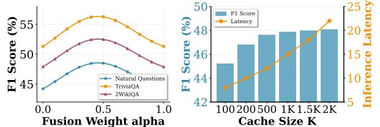
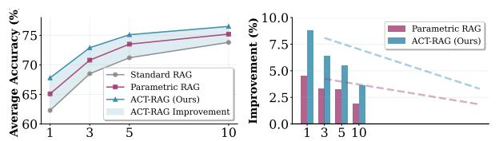
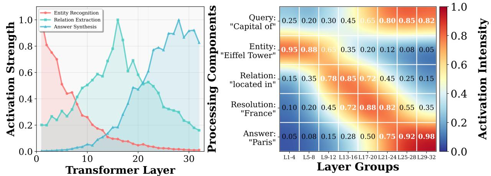

# Activation Caching for Retrieval-Augmented Generation

Shu Zhou∗ shuzhou@smail.nju.edu.cn School of Information Management, Nanjing University, China

Yufei Song∗ yufeisong@smail.nju.edu.cn School of Information Management, Nanjing University, China

Jinman Leng∗ jmleng@smail.nju.edu.cn School of Information Management, Nanjing University, China

Xin Wang xinwang2749@gmail.com Baidu Inc., Beijing, China

Tao Fan

fantao0916@gmail.com Nanjing University of Finance & Economics, Nanjing, China

Hao Wang†

ywhaowang@nju.edu.cn School of Information Management, Nanjing University, China

# Abstract

Retrieval-augmented generation (RAG) has emerged as a prominent approach to enhance large language models (LLMs) with external knowledge. While existing RAG methods have explored various knowledge injection strategies—from appending documents to input contexts (in-context RAG) to encoding them as model parameters (parametric RAG)—they each face fundamental limitations. In-context methods suffer from increased computational costs and degraded performance with longer contexts, while parametric approaches require extensive offline training and lack the flexibility to adapt knowledge representations based on queries. To address these challenges, we introduce ACT-RAG (Activation Caching for Retrieval-Augmented Generation), a novel RAG paradigm that precomputes and caches document activation patterns across model layers. Unlike previous approaches that modify either inputs or parameters, our method leverages the rich semantic information already encoded in intermediate model representations. During inference, cached activations are dynamically fused with query processing through lightweight fusion layers, enabling efficient knowledge integration without context expansion or parameter updates. This approach not only reduces online computational overhead by eliminating redundant document encoding, but also preserves the semantic richness of document representations across all model layers. Experimental results on multiple benchmarks demonstrate that ACT-RAG achieves superior performance compared to existing RAG methods while requiring significantly less storage than parametric approaches and lower latency than in-context methods.

# CCS Concepts

• Information systems → Information retrieval; • Computing methodologies → Natural language processing.

# Keywords

Large Language Models, Retrieval-Augmented Generation, Activation Caching, Knowledge Integration, Neural Representations

∗These authors contributed equally to this work.

†Corresponding author.

[This work is licensed under a Creative Commons Attribution 4.0 International License.](https://creativecommons.org/licenses/by/4.0) WWW '26, Dubai, United Arab Emirates.

© 2026 Copyright held by the owner/author(s). ACM ISBN 979-8-4007-2307-0/2026/04 <https://doi.org/10.1145/3774904.3792854>

#### ACM Reference Format:

Shu Zhou, Yufei Song, Jinman Leng, Xin Wang, Tao Fan, and Hao Wang. 2026. Activation Caching for Retrieval-Augmented Generation. In Proceedings of the ACM Web Conference 2026 (WWW '26), April 13–17, 2026, Dubai, United Arab Emirates. ACM, New York, NY, USA, [4](#page-3-0) pages. [https://doi.org/10.1145/](https://doi.org/10.1145/3774904.3792854) [3774904.3792854](https://doi.org/10.1145/3774904.3792854)

# 1 Introduction

Large Language Models (LLMs) have achieved remarkable success across diverse natural language processing tasks [\[3,](#page-3-1) [5\]](#page-3-2). However, a fundamental limitation persists: once training completes, their internal knowledge becomes static, unable to incorporate emerging information or correct outdated facts. Retrieval-Augmented Generation (RAG) has emerged as the predominant solution, enabling LLMs to dynamically access external knowledge during inference.

Existing RAG methods, despite their variations in retrieval timing, document selection, and knowledge organization, share a common characteristic: they inject external knowledge by placing retrieved documents into the LLM's input context—what we term in-context knowledge injection [\[4,](#page-3-3) [6\]](#page-3-4). While this approach is intuitive and often effective, recent studies reveal critical limitations. First, longer contexts introduce substantial computational overhead and can degrade performance, particularly in complex reasoning tasks. Second, and more fundamentally, LLMs process contextual information differently from their parametric knowledge. Studies show that LLMs store knowledge primarily within their feed-forward network (FFN) parameters [\[7\]](#page-3-5), while in-context injection only affects attention computations, creating a fundamental gap in how external knowledge is utilized.

Recent work on Parametric RAG [\[7\]](#page-3-5) attempts to address this gap by encoding documents directly as model parameters through low-rank adaptations. While this aligns external knowledge with internal representations, it requires extensive offline training for each document and produces static representations that cannot adapt to different queries. This raises a critical question: Can we achieve efficient knowledge integration without the computational burden of in-context methods or the rigidity of parametric approaches?

We propose a novel perspective: rather than modifying inputs or parameters, we can leverage the rich semantic information already computed in the model's intermediate activations. During standard forward passes, transformer layers progressively build hierarchical representations—from lexical patterns in early layers to abstract concepts in deeper layers. These activations inherently encode

document semantics in the model's native representation space, yet current RAG methods discard this valuable information after each inference.

In this paper, we introduce ACT-RAG (Activation Caching for Retrieval-Augmented Generation), a new RAG paradigm that precomputes and caches document activations for reuse during inference. Our approach follows a simple yet effective principle: compute once, use many times. In the offline phase, we pass each document through the LLM and cache compressed representations of the intermediate activations. During inference, these cached activations are efficiently fused with the query's processing through lightweight adaptation layers, enabling knowledge integration without context expansion or parameter modification.

Our contributions are threefold: (1) We propose ACT-RAG, the first RAG method that systematically leverages intermediate activations for knowledge augmentation; (2) We design efficient compression and fusion mechanisms that reduce storage to 640KB per document while preserving semantic richness; (3) We demonstrate through extensive experiments that ACT-RAG outperforms both incontext and parametric RAG methods across multiple benchmarks while achieving 20× latency reduction compared to standard RAG.

#### 2 Method

### 2.1 Problem Formulation

Consider an LLM L with parameters �� and �� transformer layers. Given a query �� and an external corpus K = {��1, ��2, ..., ���� }, the goal of RAG is to generate an accurate response by leveraging relevant documents from K. We denote the retrieval function as ��(��, K) → {����1 , ..., ������ } which returns top-�� relevant documents.

#### 2.2 ACT-RAG Overview

Our approach consists of two phases: (1) offline activation caching where we pre-compute and store compressed activation patterns for each document, and (2) online inference where cached activations are dynamically fused with query processing. Unlike existing methods that modify inputs or parameters, we operate directly on intermediate representations.

### 2.3 Offline Activation Caching

For each document ���� ∈ K, we compute its activation signature across all model layers:

Forward Pass and Collection: We input the tokenized document x�� = Tokenize(����) through the model and collect hidden states at each layer:

h (ℓ) �� = Layerℓ (h (ℓ−1) �� ), ℓ = 1, ..., �� (1)

where h (0) �� = Embed(x��) is the initial embedding.

Compression: To reduce storage, we apply pooling and dimensionality reduction:

a (ℓ) = �� (Pool(h (ℓ) �� )) (2)

where Pool(·) performs mean pooling over sequence length, and �� (·) is a learned projection that reduces dimensionality while preserving semantic information. The compressed activation a (ℓ) �� ∈ �� ′ where �� ′ ≪ �� (typically �� ′ = ��/8).

Storage: The activation cache for document ���� is:

A�� = {a (1) �� , a (2) �� , ..., a (��) �� } (3)

Total storage per document is �� × �� ′ × 4 bytes (using float32), approximately 0.5-1MB for typical models.

#### 2.4 Online Inference with Activation Fusion

During inference, we retrieve relevant documents and fuse their cached activations with the query processing:

Retrieval: Given query ��, retrieve top-�� documents: {����1 , ..., ������ } = ��(��, K) and their corresponding activation caches {A��1 , ..., A���� }. Layer-wise Fusion: For each transformer layer ℓ, we process the query while incorporating cached activations through learnable fusion functions:

h (ℓ) �� = Layerℓ (h (ℓ−1) �� ) + �� (ℓ) · ��ℓ (h (ℓ−1) , a¯ (ℓ) ) (4)

where a¯ (ℓ) = Í�� ��=1 ���� a (ℓ) ���� is the weighted combination of cached activations, with weights ���� computed based on retrieval scores. The fusion function ��ℓ is a lightweight MLP:

��ℓ (h, a) = MLPℓ ( [hcls; a]) (5)

where hcls is the CLS token representation and [·; ·] denotes concatenation.

Adaptive Weighting: The scaling factor �� (ℓ) controls the influence of cached activations at each layer, learned during training to balance query-specific and document knowledge.

#### 2.5 Training Procedure

The fusion functions {��1, ..., ����} and projection �� are trained on a small set of QA pairs while keeping the base model frozen:

L = E(��,��,D ) [− log �� (��|��, AD)] (6)

where D are relevant documents and AD their activation caches. This requires minimal training data (few hundred examples) and converges quickly.

#### 2.6 Complexity Analysis

Storage: ��(�� ·�� ·�� ′ ) for �� documents, significantly less than Parametric RAG's ��(�� · ��) where �� is the number of LoRA parameters. Inference: Additional cost is ��(�� · �� · �� ′ ) for fusing �� document activations, negligible compared to the model's forward pass ��(�� 2 · ��) where �� is sequence length.

Preprocessing: One-time cost of ��(�� · �� · �� · ��) for computing all activation caches, amortized over many queries.

#### 3 Experiments

#### 3.1 Experimental Setup

Datasets: We evaluate on four knowledge-intensive QA benchmarks: 2WikiMultihopQA (2WQA) for multi-hop reasoning, HotpotQA (HQA) for explainable QA, PopQA (PQA) for factual knowledge, and ComplexWebQuestions (CWQ) for complex queries. We use the first 500 test examples from each dataset.

Baselines: We compare against (1) Standard RAG: appending retrieved documents to input; (2) Parametric RAG [\[7\]](#page-3-5): encoding documents as LoRA parameters; (3) FLARE: multi-round retrieval with

Table 1: F1 scores on QA benchmarks. Bold indicates best performance with p < 0.05 level of significance.

| Method     |     | 2WQA  | HQA LLaMA-3-8B | PQA   | CWQ   |
|------------|-----|-------|----------------|-------|-------|
| No RAG     |     | 0.287 | 0.195          | 0.142 | 0.238 |
| Standard   | RAG | 0.421 | 0.363          | 0.287 | 0.392 |
| Parametric | RAG | 0.453 | 0.401          | 0.304 | 0.425 |
| FLARE      |     | 0.438 | 0.382          | 0.291 | 0.407 |
| ACT-RAG    |     | 0.479 | 0.418          | 0.326 | 0.441 |
| No RAG     |     | 0.213 | 0.162          | 0.118 | 0.195 |
| Standard   | RAG | 0.358 | 0.294          | 0.241 | 0.318 |
| Parametric | RAG | 0.382 | 0.327          | 0.259 | 0.346 |
| FLARE      |     | 0.371 | 0.308          | 0.247 | 0.332 |
| ACT-RAG    |     | 0.405 | 0.341          | 0.278 | 0.369 |

Table 2: Ablation studies on LLaMA-3-8B (2WQA dataset).

| Configuration                  | F1 Score |
|--------------------------------|----------|
| Full Method                    | 0.479    |
| w/o Compression (full dim)     | 0.476    |
| w/o Adaptive Weighting         | 0.461    |
| w/o Layer-wise Fusion          | 0.443    |
| Fixed Pooling (no learning)    | 0.458    |
| Single Layer Cache (last only) | 0.412    |

uncertainty-based triggering; (4) No RAG: base model without external knowledge.

Models: We experiment with LLaMA-3-8B and Qwen2.5-1.5B. For all methods, we use BM25 for retrieval and retrieve top-3 documents per query.

Implementation: Activation compression ratio is set to 8× (d'=512 for LLaMA-3-8B). Fusion MLPs have 2 hidden layers with ReLU activation. Training uses AdamW optimizer with learning rate 1e-4 for 500 steps on 1000 QA pairs.

# 3.2 Experimental Results

Main Results. ACT-RAG demonstrates a substantial advantage on multi-hop reasoning tasks (2WQA, HQA), outperforming all baselines across both models as shown in Table 1. This result supports our central hypothesis: by fusing cached activations at each layer, our method effectively preserves the integrity of reasoning chains. In contrast, conventional methods that use single-point knowledge injection tend to disrupt these chains.

Ablation Studies. Table [2](#page-2-0) presents ablation results on 2WQA. Layer-wise processing proves most critical: using only the last layer's cache drops F1 from 0.479 to 0.412 (-14%), confirming that hierarchical representations are essential. Compression shows excellent efficiency-performance trade-off, with full dimensionality losing only 0.003 F1 while requiring 8× storage. Both adaptive weighting (0.461) and layer-wise fusion (0.443) contribute significantly, validating our design choices for capturing and integrating document semantics.

Efficiency Analysis. ACT-RAG achieves 7.4× storage reduction compared to Parametric RAG while maintaining lower inference latency. The latency gain over Standard RAG (20×) comes from eliminating redundant document encoding.

Sensitivity Analysis. We conduct sensitivity analysis on two critical hyperparameters (Figure [1\)](#page-2-1). The fusion weight �� controls the

Table 3: Storage and latency comparison (LLaMA-3-8B, per document).

| Method       | Storage  |    | Inference Latency |
|--------------|----------|----|-------------------|
| Standard RAG | 0        | KB | +245ms            |
| Parametric   | RAG 4720 | KB | +18ms             |
| FLARE        | 0        | KB | +892ms            |
| ACT-RAG      | 640      | KB | +12ms             |

Figure 1: Sensitivity analysis of key hyperparameters in ACT-RAG. (a) Impact of fusion weight �� on performance across three datasets shows optimal performance at �� ≈ 0.35, where activation and model contributions are balanced. (b) Performance-efficiency trade-off with varying cache size K reveals that K=500 provides the sweet spot, achieving 97% of maximum performance while maintaining low latency (12ms) and moderate storage.

**Number of Retrieved Documents Number of Retrieved Documents** Figure 2: Impact of retrieval context size on RAG performance. (a) Performance comparison across three RAG variants with varying numbers of retrieved documents. (b) Relative improvement over Standard RAG shows ACT-RAG maintains 3.7-8.8% advantage across all settings, demonstrating that activation caching effectively complements retrieval context regardless of size. The trend lines indicate both methods converge as retrieval size increases, but ACT-RAG's activation cache provides consistent additional value.

balance between cached activations and model outputs, with optimal performance at �� = 0.35 across all datasets, indicating that a 35:65 ratio between activation and model contributions yields best results. For cache size K, we observe diminishing returns beyond K=500, where performance plateaus while latency and storage continue to increase linearly. This sweet spot (K=500) achieves 97% of maximum performance with only 25% of the storage required at K=2000, demonstrating ACT-RAG's efficiency in leveraging selective activation caching.

Impact of Retrieval Context Size. We analyze how retrieval context size affects performance across different RAG approaches (Figure [2\)](#page-2-2). ACT-RAG demonstrates consistent superiority across all retrieval sizes (1-10 documents), with the most significant advantage occurring at minimal retrieval (8.8% improvement with single document). This pattern validates our hypothesis that cached activations serve as complementary knowledge source: when retrieval is limited, the activation cache compensates by providing rich semantic representations; when retrieval is comprehensive,

Figure 3: Visualization of layer-wise activation patterns in ACT-RAG. (a) Semantic specialization across transformer layers: Entity recognition peaks in early layers (L1-8), relation extraction dominates middle layers (L9-22), and answer synthesis emerges in deep layers (L23-32). The discrete measurements from 32 transformer layers show natural variations while maintaining clear trends. (b) Activation intensity heatmap for the multi-hop question "What is the capital of the country where the Eiffel Tower is located?" Different processing components show distinct activation patterns across layer groups, with clear progression from entity identification (0.95 in L1-4) to final answer synthesis (0.98 in L29-32). Values indicate normalized activation strengths, demonstrating how ACT-RAG leverages hierarchical representations for complex reasoning.

the cache still contributes through its hierarchical encoding of document semantics. Notably, while all methods improve with more retrieved documents, ACT-RAG maintains a stable 3.7-8.8% advantage, indicating robust integration between cached activations and retrieved context.

Qualitative Analysis. We visualize activation influence across layers for multi-hop questions as shown in Figure [3.](#page-3-6) The layer-wise specialization emerges naturally: early layers (L1-8) show strong activation for entity recognition (e.g., "Eiffel Tower"), middle layers (L9-22) extract relations (e.g., "located in"), and deep layers (L23-32) synthesize the final answer through reasoning. This hierarchical decomposition, which emerges without explicit supervision, validates our hypothesis that different layers naturally specialize in different aspects of semantic processing, justifying our approach of caching activations from all layers rather than just the final output.

# 4 Related Work

Retrieval-Augmented Generation: RAG methods enhance LLMs with external knowledge through retrieval [\[3,](#page-3-1) [5\]](#page-3-2). Recent work explores adaptive retrieval [\[4\]](#page-3-3), iterative refinement [\[6\]](#page-3-4), and knowledge graph integration.

Parameter-Efficient Adaptation: LoRA and adapters enable efficient model customization. Parametric RAG [\[7\]](#page-3-5) applies this to knowledge injection but requires document-specific training.

Activation Analysis: Prior work studies information flow in transformers [\[1\]](#page-3-7) and uses activations for interpretation [\[2\]](#page-3-8). We are the first to systematically cache and reuse activations for knowledge augmentation.

# 5 Conclusion

We presented ACT-RAG (Activation Caching for RAG), a novel RAG paradigm that leverages intermediate model representations for efficient knowledge integration. By pre-computing and caching document activations, ACT-RAG achieves superior performance with minimal computational overhead. Key advantages include storage efficiency, fast inference, and preservation of hierarchical semantics. Future work includes exploring dynamic cache updates and cross-model activation transfer.

### Acknowledgments

This work is supported by National Natural Science Foundation of China (Grant No. 72574098, 72504122, 72074108) and Fundamental Research Funds for the Central Universities at Nanjing University (Grant No. 010814370338), Jiangsu International Joint Informatics Laboratory, Jiangsu Young Talents in Social Sciences and Tang Scholar of Nanjing University.

# References

[1] Nelson Elhage, Neel Nanda, Catherine Olsson, Tom Henighan, Nicholas Joseph, Ben Mann, Amanda Askell, Yuntao Bai, Anna Chen, Tom Conerly, et al. 2021. A mathematical framework for transformer circuits. Transformer Circuits Thread 1, 1 (2021), 12. [2] Mor Geva, Avi Caciularu, Kevin Wang, and Yoav Goldberg. 2023. Dissecting recall of factual associations in auto-regressive language models. In Proceedings of the 2023 Conference on Empirical Methods in Natural Language Processing. 12216– 12235. [3] Kelvin Guu, Kenton Lee, Zora Tung, Panupong Pasupat, and Mingwei Chang. 2020. Realm: Retrieval-augmented language model pre-training. In International Conference on Machine Learning. PMLR, 3929–3938. [4] Zhengbao Jiang, Frank Xu, Luyu Gao, Zhiqing Sun, Qian Liu, Jane Dwivedi-Yu, Yiming Yang, Jamie Callan, and Graham Neubig. 2023. Active Retrieval Augmented Generation. (Dec. 2023), 7969–7992. [doi:10.18653/v1/2023.emnlp-main.495](https://doi.org/10.18653/v1/2023.emnlp-main.495) [5] Patrick Lewis, Ethan Perez, Aleksandra Piktus, Fabio Petroni, Vladimir Karpukhin, Naman Goyal, Heinrich Küttler, Mike Lewis, Wen-tau Yih, Tim Rocktäschel, et al. 2020. Retrieval-augmented generation for knowledge-intensive nlp tasks. In Advances in Neural Information Processing Systems, Vol. 33. 9459–9474. [6] Zhihong Shao, Yeyun Gong, Yelong Shen, Minlie Huang, Nan Duan, and Weizhu Chen. 2023. Enhancing Retrieval-Augmented Large Language Models with Iterative Retrieval-Generation Synergy. In Findings of the Association for Computational Linguistics: EMNLP 2023, Houda Bouamor, Juan Pino, and Kalika Bali (Eds.). Association for Computational Linguistics, Singapore, 9248–9274. [doi:10.18653/v1/2023.findings-emnlp.620](https://doi.org/10.18653/v1/2023.findings-emnlp.620) [7] Weihang Su, Yichen Tang, Qingyao Ai, Junxi Yan, Changyue Wang, Hongning Wang, Ziyi Ye, Yujia Zhou, and Yiqun Liu. 2025. Parametric retrieval augmented generation. (2025), 1240–1250.