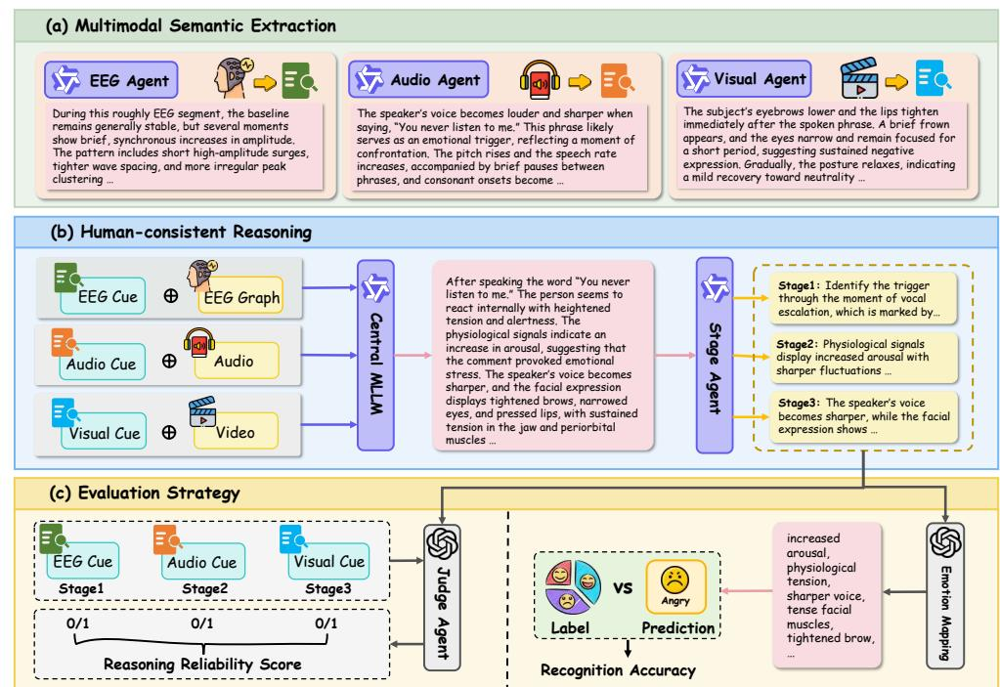

# PH-EMO: Decoding Emotions from the Brain Inward – EEG-Grounded Multimodal Reasoning with LLMs

Kehong Liu

Department of Computer Science Hong Kong Baptist University Kowloon, Hong Kong SAR, China cskhliu@comp.hkbu.edu.hk

Yang Liu

Department of Computer Science Hong Kong Baptist University Kowloon, Hong Kong SAR, China csygliu@comp.hkbu.edu.hk

Jiming Liu

Department of Computer Science Hong Kong Baptist University Kowloon, Hong Kong SAR, China jiming@comp.hkbu.edu.hk

# Abstract

Recent advances in multimodal large language models (MLLMs) have transformed emotion understanding by enabling rich descriptions and reasoning over visual and auditory cues. Yet most existing approaches still treat emotions as static labels or superficial descriptions, sidelining the physiological signals—such as electroencephalography (EEG)—that capture the body's involuntary response and lie at the core of human emotions. This omission not only weakens interpretability but also limits the real-world impact in areas such as mental health monitoring, where trustworthy explanations are crucial. To bridge this gap, we introduce PH-EMO, a novel framework that grounds audiovisual analysis in physiological evidence through a human-consistent reasoning pipeline. The proposed framework first utilizes specialized perception modules to distill semantic evidence from raw EEG, audio, and video streams. A central MLLM then integrates these multimodal cues into a transparent cognitive workflow that mirrors how humans integrate bodily signals with external stimuli. The result is an emotion recognition system that not only predicts emotions but also articulates how multimodal evidence evolves over time—delivering explanations users can trust. Evaluations on two public multimodal benchmarks demonstrate that PH-EMO achieves robust performance in terms of both recognition accuracy and reasoning reliability. Code is available at: https://github.com/KehongBeyondMask/PH-EMO

# CCS Concepts

#### • Computing methodologies → Artificial intelligence; Machine learning; • Human-centered computing;

### Keywords

Large Language Models (LLMs), Multimodality, Electroencephalography (EEG) Signals, Emotion Analysis, Cognitive Workflow

#### ACM Reference Format:

Kehong Liu, Yang Liu, and Jiming Liu. 2026. PH-EMO: Decoding Emotions from the Brain Inward – EEG-Grounded Multimodal Reasoning with LLMs. In Companion Proceedings of the ACM Web Conference 2026 (WWW Companion'26), April 13–17, 2026, Dubai, United Arab Emirates. ACM, New York, NY, USA, [4](#page-3-0) pages.<https://doi.org/10.1145/3774904.3792855>

[This work is licensed under a Creative Commons Attribution-NonCommercial-](https://creativecommons.org/licenses/by-nc-nd/4.0)[NoDerivatives 4.0 International License.](https://creativecommons.org/licenses/by-nc-nd/4.0) WWW Companion'26, Dubai, United Arab Emirates © 2026 Copyright held by the owner/author(s). ACM ISBN 979-8-4007-2307-0/2026/04 <https://doi.org/10.1145/3774904.3792855>

# 1 Introduction

Emotion recognition and understanding have long sought to equip machines with the ability to read human emotions from faces, voices, and text. Early efforts relied on hand-crafted features and simple fusion strategies, such as early concatenation [\[4\]](#page-3-1) or late voting [\[3\]](#page-3-2). Deep learning later brought attention mechanisms and Transformers that learn cross-modal alignments directly from largescale datasets.

The recent development of multimodal large language models (MLLMs) [\[8\]](#page-3-3) has significantly raised the bar. Models like Video-LLaMA [\[18\]](#page-3-4) and Qwen2.5-VL [\[2\]](#page-3-5) show strong capabilities in videolanguage reasoning, and emotion-specific adaptations, such as AffectGPT [\[12\]](#page-3-6), now produce rich, open-vocabulary descriptions instead of rigid labels. These advances have improved the accuracy and flexibility of emotion recognition and understanding.

Yet current MLLM-based emotion analysis approaches fall short in two critical ways. First, they bypass the natural progression of human emotion: external stimuli trigger internal physiological shifts, which then surface as expressive behaviors [\[1\]](#page-3-7). Instead of tracing this causal chain, most models leap directly from video or text cues to emotion labels, yielding shallow interpretations that reveal little about how an emotion arises and evolves. Second, most existing methods overlook physiological signals, especially electroencephalography (EEG). EEG captures involuntary neural dynamics at the heart of human emotions [\[14\]](#page-3-8), while expressions can be masked, exaggerated, or faked. Excluding this objective evidence leaves emotion analysis vulnerable to deception and disconnected from the biological reality of emotion, which are critical shortcomings for applications such as mental-health monitoring [\[13\]](#page-3-9) and emotion-aware communication analysis [\[15\]](#page-3-10).

To address these challenges, we introduce PH-EMO, a framework that re-centers emotion recognition and understanding on the human process. Three specialized perception modules first extract semantic evidence from EEG waveform graph, raw audio, and video streams. A central MLLM then integrates these cues into a transparent, step-by-step narrative that follows the emotion cycle: trigger → neural response → expression. The result is a system that not only classifies emotions but also explains how multimodal evidence converges over time—delivering reasoning traces for analysis.

Our contributions are threefold:

- We introduce PH-EMO, a novel MLLM framework that grounds audiovisual analysis in EEG-derived physiological evidence through a human-consistent reasoning pipeline.
- We design a reasoning mechanism that enforces internalexternal alignment and end-to-end interpretability in emotion understanding.

Figure 1: Overview of the PH-EMO framework.

- We conducted extensive experiments on two public benchmarks, demonstrating superior recognition accuracy, reasoning coherence, and faithfulness of generated descriptions.

### 2 PH-EMO Framework

Figure [1](#page-1-0) presents the PH-EMO pipeline, which consists of three phases: (a) multimodal semantic extraction via modality-specific agents, (b) human-consistent Chain-of-Thought (CoT) reasoning by a central MLLM, and (c) automated evaluation of recognition accuracy and reasoning reliability.

# 2.1 Multimodal Semantic Extraction

Three perception agents convert raw signals into textual cues:

- The EEG Agent ���� receives the EEG waveform graph �� and prompt ����, outputting the textual EEG Cue ���� = ���� (��, ����) that characterizes temporal neural dynamics related to arousal and valence. Specifically, raw EEG signals are preprocessed with a band-pass filter to suppress baseline drift and highfrequency noises. The resulting signals are organized as waveform graphs that preserve temporal structure.
- The Audio Agent ���� processes the raw audio stream �� with a task-specific prompt ���� and produces the Audio Cue ���� = ���� (��, ����), which describes emotion-relevant acoustic patterns (pitch variation, tone, prosody) and affective verbal content.
- The Visual Agent ���� takes the video stream �� and prompt ���� , generating the Visual Cue ���� = ���� (�� , ���� ) that details micro-expressions, facial action unit dynamics, body posture, and surroundings.

The resulting triplet {����, ����, ���� } — denoted as EEG Cue, Audio Cue, and Visual Cue — forms structured textual evidence for the subsequent reasoning stage.

# 2.2 Human-Consistent Reasoning

In this phase, a central MLLM integrates the three textual cues {����, ����, ���� }, the EEG waveform graph and the original audio and video streams {��, ��,�� } to infer the latent emotion states. Unlike conventional multimodal fusion that collapses all modalities into a single representation, PH-EMO enforces an explicit reasoning order that follows established psychological models of emotion emergence [\[1\]](#page-3-7): external trigger → internal physiological response → observable expression.

The reasoning process is formalized as follows:

�� = ��MLLM ( [����, ����, ���� , ��, ��,�� ], ��CoT), (1)

where the CoT prompt ��CoT requires the model to generate reasoning in exactly three sequential stages:

- Stage 1 (Trigger): Identify the external event or verbal content that initiates the emotional episode, using primarily the audio and video signals, �� and �� .
- Stage 2 (Physiological): Interpret the internal affective state from the EEG Cue, ����, describing neural evidence of arousal or valence that precedes any visible reaction.
- Stage 3 (Expressive): Analyze the Audio Cue and Visual Cue, ���� and ���� , to determine how vocal and facial behavior confirms, modulates, or potentially mask the internal state inferred in Stage 2.

A Stage Agent converts the output �� into structured stagespecific outputs. This produces an ordered trace��trigger → ��physio →

��expr. Because the reasoning sequence mirrors the actual temporal–causal progression of human emotion (rather than treating all cues simultaneously), the resulting explanations are more transparent and directly verifiable against modality-specific evidence, which is an advantage that prior MLLM-based emotion systems, which fuse modalities without explicit causal structure, do not provide.

#### 2.3 Evaluation Strategy

PH-EMO produces free-form textual explanations rather than direct class labels. We therefore evaluate both final emotion correctness and the fidelity of the reasoning process using two metrics.

Recognition Accuracy: The complete reasoning stages ��trigger, ��physio and ��expr is fed into an Emotion Mapping Agent. This agent extracts emotion-related keywords from reasoning stages and maps them to one of the emotional classes:

��ˆ = ��map (��trigger, ��physio, ��expr). (2)

Standard Accuracy and weighted F1 are then computed between the predicted (��ˆ) and the ground truth emotion label (��).

Reasoning Reliability Score (RRS): Recognition Accuracy measures only the final outcome; it does not verify whether the intermediate reasoning is grounded in the provided evidence. To assess this, a separate Judge Agent independently checks the output of each of the three reasoning stages against its corresponding input: Stage 1: ��trigger vs. �� and �� ; Stage 2: ��physio vs. ����; and Stage 3: ��expr vs. ���� and ���� . For each sample ��, it receives a binary consistency score ����,�� ∈ {0, 1} for each stage ��. The Reasoning Reliability Score is the average over all stages and samples:

RRS = 1 3�� ∑︁�� ��=1 ∑︁3 ��=1 ����,�� . (3)

RRS quantifies how faithfully the generated chain-of-thought adheres to the multimodal evidence and respects the enforced psychological order—a property not captured by prior MLLM-based emotion systems that lack explicit stage-wise grounding.

Together, Recognition Accuracy and RRS provide a comprehensive picture: the former evaluates predictive performance, the latter directly measures interpretability and causal fidelity.

#### 3 Experiments

#### 3.1 Experimental setups

3.1.1 Datasets. We evaluate PH-EMO on two public multimodal benchmarks that jointly capture physiological and expressive information: EAV [\[11\]](#page-3-11) and LUMED-2 [\[7\]](#page-3-12).

- EAV [\[11\]](#page-3-11) records synchronized 30-channel EEG, facial video, and audio from 42 participants during dyadic conversations designed to elicit five emotions: Neutral, Happy, Angry, Sad, and Calm. Each trial includes distinct listening and speaking phases, enabling fine-grained analysis of emotional dynamics across natural interaction.
- LUMED-2 [\[7\]](#page-3-12) provides EEG, facial video, and galvanic skin response (GSR) from subjects under controlled stimulusdriven conditions (Neutral, Happy, Sad). It complements EAV by emphasizing passive emotional induction, offering a stress test for models that must infer emotions from internal neural patterns and subtle external cues. For fair comparison

Table 1: Performance comparison (ACC, F1 score, and RRS) of various MLLMs on EAV and LUMED-2. All reported values are in percentage (%).

|                               | Model | ACC     | EAV F1 | RRS   | ACC   | LUMED-2 F1 | RRS   |
|-------------------------------|-------|---------|--------|-------|-------|------------|-------|
| GPT-4o Closed                 | [10]  | 78.12   | 77.63  | 74.27 | 72.31 | 70.24      | 68.83 |
| Gemini-2.5-Flash Source       | [9]   | 77.58   | 77.09  | 73.43 | 72.76 | 70.47      | 69.38 |
| AffectGPT                     | [12]  | 76.83   | 76.18  | 72.14 | 71.92 | 69.23      | 68.74 |
| Human-Omni                    | [20]  | 74.19   | 73.64  | 70.21 | 70.47 | 66.81      | 64.58 |
| R1-Omni                       | [19]  | 77.14   | 76.43  | 72.53 | 71.39 | 67.83      | 65.24 |
| Video-LLaMA Open              | [18]  | 75.78   | 74.63  | 71.27 | 70.83 | 67.19      | 66.38 |
| Video-LLaMA2 Source           | [5]   | 76.20   | 75.68  | 72.48 | 71.52 | 68.76      | 67.49 |
| Qwen2.5-VL-7B                 | [2]   | 75.64   | 75.12  | 72.37 | 71.77 | 69.94      | 68.67 |
| Qwen2-VL-7B                   | [16]  | 73.05   | 72.51  | 71.63 | 69.81 | 66.21      | 64.19 |
| Qwen2.5-Omni                  | [17]  | 77.33   | 76.89  | 73.19 | 72.63 | 70.43      | 69.18 |
| PH-EMO (Video-LLaMA Our       | [18]  | ) 78.84 | 78.21  | 74.46 | 75.07 | 70.88      | 69.45 |
| PH-EMO (Video-LLaMA2 Variants | [5]   | ) 79.18 | 78.57  | 75.24 | 75.63 | 71.79      | 70.92 |
| PH-EMO (Qwen2.5-Omni          | [17]  | ) 80.71 | 79.43  | 76.62 | 76.42 | 73.68      | 71.83 |

across frameworks, we use only EEG and facial video from LUMED-2, excluding GSR.

3.1.2 Implementation Details. PH-EMO deploys three specialized perception agents: Physiological Agent ����: Qwen2.5-VL [\[2\]](#page-3-5), trained to interpret raw EEG waveforms and output neural evidence ����; Auditory Agent ����: Qwen2-Audio [\[6\]](#page-3-20), analyzing speech audio for audio cues ����; and Visual Agent ���� : Qwen2.5-VL [\[2\]](#page-3-5), processing video frames to produce visual cues ���� . A central reasoning MLLM, Qwen2.5-Omni [\[17\]](#page-3-19), integrates {����, ����, ���� } via chain-ofthought prompting, enforcing the trigger → physiology → expression causal flow. We apply ChatGPT-4o [\[10\]](#page-3-13) for Judge Agent and Emotion Mapping, and we perform few-shot prompting on all comparison models. All experiments are conducted on NVIDIA A100 GPUs.

#### 3.2 Quantitative Results

Performance Comparison: Table [1](#page-2-0) reports accuracy (ACC), F1 score, and Reasoning Reliability Score (RRS) across various models. The proposed PH-EMO attains 80.71% ACC and 79.43% F1 on EAV, outperforming all open-source baselines and matching the level of closed-source systems such as GPT-4o (78.12% ACC) and Gemini-2.5-Flash (77.58% ACC). On LUMED-2, it achieves 76.42% ACC and 73.68% F1, again exceeding both open-source and closed-source baselines. These gains confirm that grounding multimodal fusion in EEG evidence improves classification performance. In addition to the ACC and F1 score, a notable advantage of the proposed framework is its interpretability. PH-EMO achieves RRS of 76.62% on EAV and 71.83% on LUMED-2, outperforming the second-best result by more than 2 percent. This gap suggests that PH-EMO generates explanations that are more faithful to the input evidence than prior models.

Ablation Study: Table [2](#page-3-21) isolates the contributions of EEG and the CoT reasoning module. Omitting EEG reduces ACC by 2% percent on EAV and by around 3% points on LUMED-2, with comparable drops in F1 and RRS. This confirms that physiological signals supply discriminative information not redundant with visual or auditory cues. Furthermore, removing the CoT module lowers RRS by more than 3 percent on both EAV and LUMED-2. This result suggests that structured causal reasoning is essential for faithful explanations.

Table 2: Ablation study on EAV and LUMED-2. Here, E, A, and V denote the EEG, audio, and visual modalities, respectively. All reported values are in percentage (%).

| Setting A V E | ACC   | EAV F1 | RRS   | ACC   | LUMED-2 F1 | RRS   |
|---------------|-------|--------|-------|-------|------------|-------|
| ✓             | 78.71 | 77.33  | 73.98 | 73.45 | 71.22      | 69.54 |
| ✓ ✓ Modality  | 78.64 | 77.75  | 74.32 |       |            |       |
| ✓ ✓ ✓         | 80.71 | 79.43  | 76.62 |       |            |       |
| ✓ ✓           | 80.02 | 79.16  | 75.89 | 76.42 | 73.68      | 72.83 |
| w/o CoT CoT   | 79.36 | 78.52  | 73.45 | 73.86 | 71.63      | 69.72 |
| PH-EMO        | 80.71 | 79.43  | 76.62 | 76.42 | 73.68      | 72.83 |

**STAGE:**

Stage 1: Identify emotional trigger through the brief brow-tightening and tense vocal

onset in "every time we have a group project," revealing rising frustration. Stage 2: Detect strong internal arousal from the rapid, synchronized EEG amplitude increases. Capture additional escalation through the sharper, faster speech with sudden

loudness peaks.

Stage 3: Observe outward tension reflected in frown, narrowed eyes, and pressed lips.

**Trigger Physiological Cue Audio Cue Visual Cue**

**Label**

*Angry*

**Description:** The multimodal cues reveal a clear emotional shift. A sharp brow tension, a tense vocal onset, and the phrase "every time we have a group project" indicate the trigger, reflecting accumulated frustration. EEG signals show synchronized rapid amplitude increases, with frontal high-frequency activity suggesting heightened arousal. The speaker's tone becomes sharper and faster, with sudden loudness peaks. Externally, a brief frown, narrowed eyes, and pressed lips appear, with facial tension persisting throughout. Together, these signals outline a natural progression from the triggering

moment to internal arousal and restrained outward expression.

Figure 2: Qualitative case from EAV. The proposed PH-EMO generates a step-by-step explanation that traces emotion from trigger to physiological arousal to expressive output. Color bars below the text indicate modality timing.

### 3.3 Qualitative Analysis

To illustrate the interpretability of PH-EMO, we examine a representative example from the EAV dataset (Fig. [2\)](#page-3-22). The model traces an "anger" episode through a human-like causal chain. It first identifies the trigger: a subtle brow tightening paired with the spoken complaint "every time we have a group project," reflecting perceived unfairness. This inference draws jointly from visual microexpressions and speech semantics. Next, PH-EMO links the trigger to internal arousal via EEG evidence, specifically the synchronized high-amplitude bursts across multiple channels, a pattern associated with heightened emotional activation. Finally, it maps this physiological increase to external signs: sharper, louder speech and sustained facial tension. By sequencing evidence in this trigger → physiology → expression order, the explanation is coherent and evidence-aligned, which directly supports the quantitative improvement in RRS.

# 4 Conclusion

This work presents PH-EMO to integrate EEG signals with audiovisual inputs via a reasoning pipeline aligned with human emotional progression. By explicitly modeling the sequence from external triggers to physiological arousal and expressive output, the system yields explanations that are evidence-faithful. Experiments on EAV and LUMED-2 show consistent performance improvement in classification accuracy and reasoning reliability over existing MLLMs. Qualitative analysis further confirms that structured fusion of physiological evidence enhances the interpretability. Future work will explore broader benchmarks and investigate how the pipeline can be extended to other physiological indicators.

#### Acknowledgments

We acknowledge the use of ChatGPT (GPT-5.1, OpenAI's language model: https://openai.com) in polishing some of the wording in the manuscript. The final revision was reviewed and approved by all authors. This work was supported in part by the General Research Fund from the Research Grant Council of Hong Kong SAR under Projects RGC/HKBU12203122 and RGC/HKBU12200124, the NSFC/RGC Joint Research Scheme under Project N\_HKBU222/22, and the Guangdong Basic and Applied Basic Research Foundation under Projects 2022A1515010124 and 2024A1515011837.

#### References

[1] Laith Al-Shawaf, Daniel Conroy-Beam, Kelly Asao, et al. 2016. Human Emotions: An Evolutionary Psychological Perspective. Emotion Review 8, 2 (2016), 173–186. [2] Shuai Bai, Keqin Chen, Xuejing Liu, et al. 2025. Qwen2.5-VL Technical Report. arXiv preprint arXiv:2502.13923 (2025). [3] Tadas Baltrusaitis, Chaitanya Ahuja, and Louis-Philippe Morency. 2019. Multimodal Machine Learning: A Survey and Taxonomy. IEEE TPAMI 41, 2 (2019), 423–443. [4] Jing Chen, Bin Hu, Lixin Xu, et al. 2015. Feature-Level Fusion of Multimodal Physiological Signals for Emotion Recognition. In Proc. BIBM. 395–399. [5] Zesen Cheng, Sicong Leng, Hang Zhang, et al. 2024. VideoLLaMA 2: Advancing Spatial-Temporal Modeling and Audio Understanding in Video-LLMs. arXiv preprint arXiv:2406.07476 (2024). [6] Yunfei Chu, Jin Xu, Qian Yang, et al. 2024. Qwen2-Audio Technical Report. arXiv preprint arXiv:2407.10759 (2024). [7] Yucel Cimtay, Erhan Ekmekcioglu, Caglar-Ozhan, et al. 2020. Cross-Subject Multimodal Emotion Recognition Based on Hybrid Fusion. IEEE Access 8 (2020), 168865–168878. [8] Lancheng Gao, Ziheng Jia, Yunhao Zeng, et al. 2025. EEmo-Bench: A Benchmark for Multi-modal Large Language Models on Image Evoked Emotion Assessment. In Proc. ACM MM. 7064–7073. [9] Gemini Team, Rohan Anil, Sebastian Borgeaud, et al. 2023. Gemini: A Family of Highly Capable Multimodal Models. arXiv preprint aXiv:2312.11805 (2023). [10] Aaron Hurst, Adam Lerer, Adam P. Goucher, et al. 2024. GPT-4o System Card. arXiv preprint arxiv:2410.21276 (2024). [11] Min-Ho Lee, Adai Shomanov, Balgyn Begim, et al. 2024. EAV: EEG-Audio-Video Dataset for Emotion Recognition in Conversational Contexts. Scientific Data 11 (2024). [12] Zheng Lian, Haoyu Chen, Lan Chen, et al. 2025. AffectGPT: A New Dataset, Model, and Benchmark for Emotion Understanding with Multimodal Large Language Models. In Proc. ICML. 36993–37014. [13] Abdullah Mazhar, Zuhair Hasan Shaik, Aseem Srivastava, et al. 2025. Figurativecum-Commonsense Knowledge Infusion for Multimodal Mental Health Meme Classification. In Proc. WWW. 637–648. [14] Ghulam Muhammad, Sumayah Almuntasheri, Fadia Alenezi, et al. 2025. EEGbased Multimodal Emotion Recognition: Recent Progress, Challenges, and Future Directions. ACM TMCCA (2025). [15] Geng Tu, Bingbing Wang, Erik Cambria, et al. 2025. SupportPlay: A Multi-Agent Role-Playing System for Personalized and Sustained Multimodal Emotional Support Conversation. In Proc. WWW Companion. 2915–2918. [16] Peng Wang, Shuai Bai, Sinan Tan, et al. 2024. Qwen2-VL: Enhancing Vision-Language Model's Perception of the World at Any Resolution. arXiv preprint Arxiv:2409.12191 (2024). [17] Jin Xu, Zhifang Guo, Jinzheng He, et al. 2025. Qwen2.5-Omni Technical Report. arXiv preprint arXiv:2503.20215 (2025). [18] Hang Zhang, Xin Li, and Lidong Bing. 2023. Video-LLaMA: An Instruction-tuned Audio-Visual Language Model for Video Understanding. In Proc. EMNLP (System Demonstrations). 543–553. [19] Jiaxing Zhao, Xihan Wei, and Liefeng Bo. 2025. R1-Omni: Explainable Omni-Multimodal Emotion Recognition with Reinforcement Learning. arXiv preprint arXiv:2503.05379 (2025). [20] Jiaxing Zhao, Qize Yang, Yixing Peng, et al. 2025. HumanOmni: A Large Vision-Speech Language Model for Human-Centric Video Understanding. arXiv preprint arXiv:2501.15111 (2025).