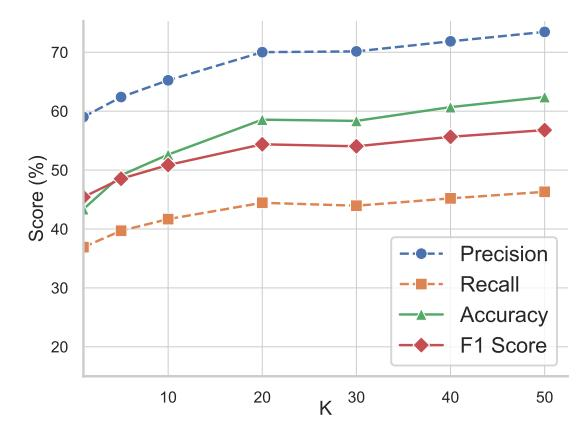

# GPR: Empowering Generation with Graph-Pretrained Retriever

Xiaochen Wang, Zongyu Wu, Yuan Zhong, Xiang Zhang, Suhang Wang, Fenglong Ma

The Pennsylvania State University

{xcwang,zongyuwu,yfz5556,xzz89,szw494,fenglong}@psu.edu

#### Abstract

Graph retrieval-augmented generation (GRAG) places high demands on graph-specific retrievers. However, existing retrievers often rely on language models pretrained on plain text, limiting their effectiveness due to *domain misalignment* and *structure ignorance*. To address these challenges, we propose GPR, a graph-based retriever pretrained directly on knowledge graphs. GPR aligns natural language questions with relevant subgraphs through LLM-guided graph augmentation and employs a structure-aware objective to learn fine-grained retrieval strategies. Experiments on two datasets, three LLM backbones, and five baselines show that GPR consistently improves both retrieval quality and downstream generation, demonstrating its effectiveness as a robust retrieval solution for GRAG.

### 1 Introduction

Graph Retrieval-Augmented Generation (GRAG) has emerged as an effective paradigm for enhancing the capabilities of large language models (LLMs) [\(Min et al.](#page-4-0) , [2019\)](#page-4-0). By retrieving structured and high-quality knowledge from graphs, these models are able to acquire comprehensive context regarding questions and generate more accurate and grounded responses [\(Zhang et al.](#page-5-0) , [2025\)](#page-5-0).

The effectiveness of GRAG hinges on the quality of the retrieved graph components, placing high demands on the retriever. To meet this challenge, retrievers based on pretrained language models (PLMs) [\(Karpukhin et al.](#page-4-1) , [2020\)](#page-4-1) have emerged as a promising solution. These retrievers operate directly on natural language queries without relying on handcrafted rules [\(Mavromatis and](#page-4-2) [Karypis](#page-4-2) , [2024\)](#page-4-2) or task-specific features [\(Luo et al.](#page-4-3) , [2023\)](#page-4-3), offering greater flexibility and generalizability compared to traditional approaches such as non-parametric or graph neural network-based retrievers [\(Peng et al.](#page-5-1) , [2024](#page-5-1) ; [Li et al.](#page-4-4) , [2023\)](#page-4-4). However, despite these advantages, existing PLM-based retrievers exhibit the following shortcomings:

S1: Domain Misalignment. Most of the current PLM-based retrievers are built on models pretrained solely on plain text [\(He et al.,](#page-4-5) [2024;](#page-4-5) [Li et al.,](#page-4-4) [2023\)](#page-4-4). These models are proficient in understanding natural language queries, but struggle to interpret graph-structured data, which are composed of semi-structured triplets with irregular formats. The misalignment between query representations in text and the structured nature of graph data leads to suboptimal retrieval, constraining the overall effectiveness of GRAG systems.

S2: Structure Ignorance. In addition, many approaches directly apply language models to retrieve individual nodes [\(He et al.,](#page-4-5) [2024\)](#page-4-5), triplets [\(Li](#page-4-4) [et al.](#page-4-4) , [2023\)](#page-4-4), or subgraphs [\(Li et al.](#page-4-6) , [2024](#page-4-6) ; [Hu et al.](#page-4-7) , [2024\)](#page-4-7), mirroring strategies used in traditional textbased retrieval-augmented generation [\(Karpukhin](#page-4-1) [et al.](#page-4-1) , [2020\)](#page-4-1). However, this overlooks the fundamental property of knowledge graphs: connectivity. Encoding graph elements as isolated units fails to capture the relational structure essential for effective graph retrieval.

To address these limitations, we propose Graph Pretrained Retriever (GPR), a simple yet effective retriever pretrained directly on knowledge graphs. To resolve S1 , GPR leverages LLM-guided graph augmentation to align natural language questions with relevant subgraphs, without relying on additional supervision or schema-specific features. To tackle S2 , GPR employs a structure-aware pretraining objective that distinguishes triplets based on their relevance with questions, encouraging the model to selectively capture comprehensive context that could boost the LLMs.

We evaluate GPR on two benchmark datasets using three backbone LLMs and five baselines. Results show that GPR consistently retrieves more relevant knowledge from graph and enhances downstream generation. These findings establish GPR

as a generalizable and effective solution for graphbased retrieval, advancing the development of knowledge-grounded language models.

#### 2 Related Work

Retrieval-augmented generation (RAG) [\(Gao et al.,](#page-4-8) [2023;](#page-4-8) [Guo et al.,](#page-4-9) [2023;](#page-4-9) [Ma et al.,](#page-4-10) [2023\)](#page-4-10) has emerged as a promising approach to mitigate intrinsic limitations of large language models, such as hallucinations [\(Zhang et al.,](#page-5-2) [2023;](#page-5-2) [Tonmoy](#page-5-3) [et al.,](#page-5-3) [2024\)](#page-5-3). Its specialized variant, Graph RAG (GRAG) [\(Min et al.,](#page-4-0) [2019\)](#page-4-0), extends this paradigm by retrieving high-quality knowledge from structured knowledge graphs, demonstrating strong potential in knowledge-intensive tasks [\(Zhang et al.,](#page-5-0) [2025\)](#page-5-0). Pretrained Language Model (PLM)-based retrievers [\(Karpukhin et al.,](#page-4-1) [2020\)](#page-4-1) have been widely adopted in GRAG systems, enabling knowledge retrieval at various granularities, including nodes [\(He](#page-4-5) [et al.,](#page-4-5) [2024\)](#page-4-5), triplets [\(Li et al.,](#page-4-4) [2023\)](#page-4-4), and subgraphs [\(Li et al.,](#page-4-6) [2024;](#page-4-6) [Hu et al.,](#page-4-7) [2024\)](#page-4-7). In these approaches, knowledge is encoded using language models pretrained on general plain text, and the retrieved results are either directly fed into the large language models for reasoning or processed by additional adaptation modules to enhance the model's ability to interpret the retrieved content. While most methods simply leverage pretrained language models, some prior work [\(Dong et al.,](#page-4-11) [2023\)](#page-4-11) has explored pretraining these models on knowledge graphs using conventional objectives such as InfoNCE [\(Oord et al.,](#page-4-12) [2018\)](#page-4-12) and Masked Language Modeling [\(Devlin et al.,](#page-4-13) [2019\)](#page-4-13). Nevertheless, these efforts overlook the alignment between the textual query modality and the graph-structured knowledge, often degrading retrieval effectiveness.

### 3 Graph Pretrained Retriever (GPR)

Problem Formulation. We consider the graph retrieval-augmented generation (RAG) setting, where a large language model (LLM) generates answers based on a question q and a retrieved knowledge subgraph Sq. The model takes the pair (q, Sq) as input, where Sq is retrieved from a knowledge graph G conditioned on q, i.e., Sq = Q(q, G), and Q denotes the retriever. We define Sq as the union of triplets τ = (h, r, t), where each τ ∈ G represents a factual statement relevant to the question.

Following prior work [\(Li et al.,](#page-4-6) [2024\)](#page-4-6), we reduce subgraph retrieval to a triplet ranking task, where the goal is to learn a retriever Q that assigns higher

scores to relevant triplets τ given the question q. The retriever is optimized to improve downstream generation quality by supplying more informative context to the LLM.

Establishing Question-triplet Alignment via Graph Augmentation. In typical retrieval training, the retriever Q is optimized to align questions with their corresponding documents. In our formulation, this translates to learning a mapping between a natural language question q and a relevant set of knowledge triplets Tq ⊆ G. However, under the general RAG framework, only question-answer pairs are available, with no explicit supervision for question-triplet alignment [\(Peng et al.,](#page-5-1) [2024\)](#page-5-1). This motivates us to establish the question-triplet alignment by augmenting the knowledge graph. Specifically, we generate synthetic natural language questions from triplets by performing masked triplet prompting. For each triplet τ = (h, r, t) ∈ G, we mask one entity to construct masked triplet τ ′ ∈ {([MASK], r, t),(h, r, [MASK])}, and prompt LLaMA-3.1-8B-Instruct [\(Grattafiori et al.,](#page-4-14) [2024\)](#page-4-14) with instructions to generate a synthetic question in natural language qτ , corresponding to the original triplet τ .

Each synthetic question qτ aligns with its original triplet τ , as well as neighboring triplets τnb that share at least one entity with τ . We treat both types as positive signals: the original triplet τ is directly relevant to the question qτ , while its neighbors provide contextual support for better understanding. Formally, we construct the positive set:

Dpos = {(qτ , τ ), (qτ , τnb)}, τnb ∈ G, τnb ∩τ ̸= ∅. (1)

We further introduce negative set Dneg by randomly sampling triplets from G such that they do not overlap with τ , serving as irrelevant distractors τneg:

Dneg = {(qτ , τneg)}, τneg ∩ τ = ∅. (2)

By integrating these sets, we construct the final pretraining dataset that captures varying levels of alignment between queries and knowledge triplets:

D = {(qτ , τ, τnb, τneg)}. (3)

Examples of the graph augmentation procedure are available in Appendix [A.](#page-5-4)

Mining Question-triplet Alignment with Pretraining. To model the varying level of alignment constructed in dataset D with our retriever Q, we

Table 1: Question answering results (%) on WebQSP and CWQ datasets. The best-performing results are highlighted in bold.

|                | Methods     | Accuracy | WebQSP Precision | Recall | F1    | Accuracy | CWQ Precision | Recall | F1    |
|----------------|-------------|----------|------------------|--------|-------|----------|---------------|--------|-------|
| ChatGPT        |             | 46.62    | 65.97            | 39.48  | 49.40 | 37.88    | 42.19         | 35.63  | 38.63 |
| +              | G-Retriever | 42.70    | 63.32            | 36.44  | 46.26 | 33.51    | 39.42         | 31.84  | 34.99 |
| +              | G-RAG       | 39.40    | 57.55            | 33.63  | 42.45 | 31.87    | 36.44         | 30.55  | 33.21 |
| +              | Hybrid      | 50.38    | 64.25            | 37.52  | 47.37 | 39.55    | 44.52         | 37.06  | 40.47 |
| +              | SKP         | 44.80    | 62.10            | 36.98  | 46.36 | 33.43    | 38.71         | 31.71  | 34.83 |
| +              | Two Tower   | 39.14    | 57.30            | 34.30  | 42.67 | 30.85    | 36.34         | 29.60  | 32.64 |
| +              | GPR         | 62.40    | 73.46            | 46.31  | 56.79 | 43.25    | 47.59         | 39.59  | 43.22 |
| LLaMA2-Chat-7B |             | 40.16    | 59.82            | 34.85  | 43.76 | 28.23    | 9.99          | 28.23  | 14.70 |
| +              | G-Retriever | 44.00    | 66.22            | 37.68  | 47.84 | 30.77    | 36.51         | 29.32  | 32.52 |
| +              | G-RAG       | 20.81    | 36.43            | 19.29  | 25.26 | 9.53     | 11.81         | 9.21   | 10.31 |
| +              | Hybrid      | 53.40    | 71.44            | 42.08  | 52.79 | 35.12    | 40.70         | 33.25  | 36.61 |
| +              | SKP         | 43.93    | 63.02            | 37.11  | 46.61 | 28.54    | 33.48         | 27.04  | 29.86 |
| +              | Two Tower   | 38.51    | 58.23            | 33.54  | 42.44 | 27.38    | 32.57         | 26.12  | 29.01 |
| +              | GPR         | 61.90    | 77.57            | 47.44  | 58.76 | 44.27    | 15.41         | 44.27  | 22.93 |
| Flan-T5-xl     |             | 10.86    | 19.16            | 10.40  | 13.41 | 12.22    | 16.94         | 12.22  | 14.21 |
| +              | G-Retriever | 21.41    | 39.37            | 20.49  | 26.91 | 17.97    | 22.51         | 17.62  | 19.76 |
| +              | G-RAG       | 19.72    | 35.20            | 18.86  | 24.32 | 16.89    | 20.31         | 16.40  | 18.17 |
| +              | Hybrid      | 31.37    | 49.82            | 27.67  | 35.54 | 25.14    | 29.94         | 24.24  | 26.77 |
| +              | SKP         | 21.29    | 37.04            | 20.53  | 26.45 | 18.82    | 22.66         | 18.32  | 20.26 |
| +              | Two Tower   | 18.00    | 33.05            | 17.58  | 22.83 | 16.23    | 20.22         | 15.90  | 17.81 |
| +              | GPR         | 39.48    | 56.94            | 35.23  | 43.51 | 28.20    | 38.54         | 28.20  | 32.47 |

firstly encode query and triplets with retriever Q, then optimize the retriever with a structure-aware objective function.

*Encoding.* We adopt a two-tower architecture [\(Karpukhin et al.,](#page-4-1) [2020\)](#page-4-1), commonly used in information retrieval, as the basis for our retriever. It consists of separate encoders for natural language queries and knowledge triplets, denoted by Eq and Eτ , respectively, i.e., Q = {Eq, Eτ }. For question qτ and triplets τ , τnb, τneg, their embeddings are computed as zq = Eq(qτ ), zτ = Eτ (τ ), znb = Eτ (τnb), and zneg = Eτ (τneg), serving as a prerequisite for subsequent structure-aware optimization.

*Optimization.* To effectively answer knowledgeintensive questions, the retriever should prioritize facts that are directly relevant to the query. In addition, supporting knowledge that addresses secondary aspects of the queried fact can provide helpful context and improve answer quality. On the other hand, retrieving irrelevant knowledge offers little benefit and may introduce noise, reducing overall performance. Based on this motivation, we optimize the retriever using a customized variant of

triplet loss [\(Schroff et al.,](#page-5-5) [2015\)](#page-5-5), which is designed to learn from varying levels of preference. Given a query q, a more preferred triplet p, and a less preferred triplet n, the basic triplet loss is defined as:

M(p, n, q, γ) = max(0, γ+cos(n, q)−cos(p, q)), (4)

where cos(·, ·) denotes cosine similarity, and γ is the margin hyperparameter. This formulation encourages the model to assign higher similarity to preferred triplets relative to less preferred ones.

We apply and customize this loss by enforcing a soft preference ordering among triplets conditioned on the question qτ : the exact matching triplet τ is preferred over its neighbors qnb, which in turn are preferred over irrelevant triplets qneg. The final pretraining loss is represented as:

L = M(zτ , znb, zq, γ1) + M(znb, zneg, zq, γ2), (5)

with separate margins γ1 and γ2 for each preference level.

Leveraging Question-triplet Alignment during Inference. At inference time, the pretrained

Figure 1: Top-ranked triplets retrieved by pretraining-free two tower retriever and GPR, given the query *"What does Jamaican people speak?".*

retriever Q, optimized with augmented questiontriplet alignment with structure-awareness (Eq. [5\)](#page-2-0), is used to query the knowledge graph G and retrieve top-K triplets to construct the subgraph Sq. This subgraph provides knowledge-rich context to enhance the LLM's performance, without requiring any additional fine-tuning on the question answering task.

#### 4 Experiments

Experiment Settings. All experiments settings are available in Appendix [B.](#page-5-6)

Evaluation Results. The experiment results are available in Table [1.](#page-2-1) Key insights we obtain through the analysis include:

*Pretrained language models struggle to perform effective retrieval over structured graph data.* Using language models pretrained on plain text as retrievers often results in limited and inconsistent gains. While effective for natural language understanding, they lack the structural alignment and graph-specific inductive biases necessary for reasoning over knowledge graphs. Notably, the two tower retriever, which shares the same architecture as GPR but omits graph pretraining, performs poorly, highlighting the limitations of relying solely on plain-text pretrained models for graph-based retrieval tasks.

GPR *advances graph retrieval by bridging text and graph with structure-awareness.* Across all evaluated settings, GPR consistently outperforms retrievers without targeted pretraining, effectively aligning textual queries with relevant subgraphs. Its improvements on downstream question answering tasks reflect the quality of retrieved subgraphs in providing accurate and contextually relevant information. Given that the pretraining-free two tower variant performs poorly, the strong performance of GPR stems not from its structure alone but from its carefully designed pretraining strategy. This highlights the effectiveness of our question-triplet alignment objective and our success in modeling structural relations between text and graph through pretraining.

Qualitative Analysis. We conduct a case study

Figure 2: Performance vs K in the selection of topranked triplets.

to qualitatively analyze the retrieved facts of GPR, with results shown in Figure [1.](#page-3-0) Intuitively, methods relying on language models pretrained on general text struggle to bridge the gap between natural language queries and knowledge graph content, retrieving low-relevance and noisy results. In contrast, GPR benefits from knowledge graph-based pretraining with a discriminative optimization objective, resulting in retrieved facts that are more relevant and coherent with the input query.

Quantitative Analysis. We further conduct a quantitative analysis by varying the top-K value used during triplet retrieval, as shown in Figure [2.](#page-3-1) All metrics exhibit a consistent upward trend as K increases. These results highlight that GPR consistently benefits from an increasing amount of retrieved content, demonstrating its ability to capture broader context while maintaining robustness to potential noise introduced by retrieval.

#### 5 Conclusion

We introduced GPR, a simple yet effective retriever pretrained on knowledge graphs to support retrieval-augmented generation over knowledge graphs. Through LLM-guided graph augmentation and structure-aware pretraining, GPR learns to align questions with informative subgraphs in a flexible and data-agnostic manner. Comprehensive experiments show that GPR consistently enhances both retrieval quality and downstream generation performance.

Limitations While GPR demonstrates strong performance in graph retrieval, it still has two limitations. First, our pretraining currently considers only 1-hop neighbors due to computational constraints, which may limit the model's effectiveness in capturing larger contextual subgraphs or longer reasoning paths. Extending the method to incorporate multi-hop structures remains feasible and is worth exploring. Second, although the pretraining strategy is broadly applicable, we adopt a basic two-tower retriever for implementation due to limited bandwidth. Investigating more expressive retriever architectures presents a promising direction for future work. References Josh Achiam, Steven Adler, Sandhini Agarwal, Lama Ahmad, Ilge Akkaya, Florencia Leoni Aleman, Diogo Almeida, Janko Altenschmidt, Sam Altman, Shyamal Anadkat, and 1 others. 2023. Gpt-4 technical report. *arXiv preprint arXiv:2303.08774*. Kurt Bollacker, Colin Evans, Praveen Paritosh, Tim Sturge, and Jamie Taylor. 2008. Freebase: a collaboratively created graph database for structuring human knowledge. In *Proceedings of the 2008 ACM SIG-MOD international conference on Management of data*, pages 1247–1250. Hyung Won Chung, Le Hou, Shayne Longpre, Barret Zoph, Yi Tay, William Fedus, Yunxuan Li, Xuezhi Wang, Mostafa Dehghani, Siddhartha Brahma, and 1 others. 2024. Scaling instruction-finetuned language models. *Journal of Machine Learning Research*, 25(70):1–53. Jacob Devlin, Ming-Wei Chang, Kenton Lee, and Kristina Toutanova. 2019. Bert: Pre-training of deep bidirectional transformers for language understanding. In *Proceedings of the 2019 conference of the North American chapter of the association for computational linguistics: human language technologies, volume 1 (long and short papers)*, pages 4171–4186. Guanting Dong, Rumei Li, Sirui Wang, Yupeng Zhang, Yunsen Xian, and Weiran Xu. 2023. Bridging the kb-text gap: Leveraging structured knowledge-aware pre-training for kbqa. In *Proceedings of the 32nd ACM International Conference on Information and Knowledge Management*, pages 3854–3859. Yunfan Gao, Yun Xiong, Xinyu Gao, Kangxiang Jia, Jinliu Pan, Yuxi Bi, Yixin Dai, Jiawei Sun, Haofen Wang, and Haofen Wang. 2023. Retrieval-augmented generation for large language models: A survey. *arXiv preprint arXiv:2312.10997*, 2:1. Aaron Grattafiori, Abhimanyu Dubey, Abhinav Jauhri, Abhinav Pandey, Abhishek Kadian, Ahmad Al-Dahle, Aiesha Letman, Akhil Mathur, Alan Schelten, Alex Vaughan, and 1 others. 2024. The llama 3 herd of models. *arXiv preprint arXiv:2407.21783*. Zhicheng Guo, Sijie Cheng, Yile Wang, Peng Li, and Yang Liu. 2023. [Prompt-guided retrieval augmen](https://doi.org/10.18653/v1/2023.findings-acl.693)[tation for non-knowledge-intensive tasks.](https://doi.org/10.18653/v1/2023.findings-acl.693) In *Findings of the Association for Computational Linguistics*, pages 10896–10912. Association for Computational Linguistics. Xiaoxin He, Yijun Tian, Yifei Sun, Nitesh Chawla, Thomas Laurent, Yann LeCun, Xavier Bresson, and Bryan Hooi. 2024. G-retriever: Retrieval-augmented generation for textual graph understanding and question answering. *Advances in Neural Information Processing Systems*, 37:132876–132907. Yuntong Hu, Zhihan Lei, Zheng Zhang, Bo Pan, Chen Ling, and Liang Zhao. 2024. Grag: Graph retrieval-augmented generation. *arXiv preprint arXiv:2405.16506*. Vladimir Karpukhin, Barlas Oguz, Sewon Min, Patrick SH Lewis, Ledell Wu, Sergey Edunov, Danqi Chen, and Wen-tau Yih. 2020. Dense passage retrieval for open-domain question answering. In *EMNLP (1)*, pages 6769–6781. Mufei Li, Siqi Miao, and Pan Li. 2024. Simple is effective: The roles of graphs and large language models in knowledge-graph-based retrieval-augmented generation. *arXiv preprint arXiv:2410.20724*. Shiyang Li, Yifan Gao, Haoming Jiang, Qingyu Yin, Zheng Li, Xifeng Yan, Chao Zhang, and Bing Yin. 2023. Graph reasoning for question answering with triplet retrieval. *arXiv preprint arXiv:2305.18742*. Ilya Loshchilov and Frank Hutter. 2017. Decoupled weight decay regularization. *arXiv preprint arXiv:1711.05101*. Linhao Luo, Yuan-Fang Li, Gholamreza Haffari, and Shirui Pan. 2023. Reasoning on graphs: Faithful and interpretable large language model reasoning. *arXiv preprint arXiv:2310.01061*. Xinbei Ma, Yeyun Gong, Pengcheng He, Hai Zhao, and Nan Duan. 2023. [Query rewriting in retrieval](https://doi.org/10.18653/v1/2023.emnlp-main.322)[augmented large language models.](https://doi.org/10.18653/v1/2023.emnlp-main.322) In *Proceedings of the Conference on Empirical Methods in Natural Language Processing*, pages 5303–5315. Association for Computational Linguistics. Costas Mavromatis and George Karypis. 2024. Gnnrag: Graph neural retrieval for large language model reasoning. *arXiv preprint arXiv:2405.20139*. Sewon Min, Danqi Chen, Luke Zettlemoyer, and Hannaneh Hajishirzi. 2019. Knowledge guided text retrieval and reading for open domain question answering. *arXiv preprint arXiv:1911.03868*. Aaron van den Oord, Yazhe Li, and Oriol Vinyals. 2018. Representation learning with contrastive predictive coding. *arXiv preprint arXiv:1807.03748*.

Boci Peng, Yun Zhu, Yongchao Liu, Xiaohe Bo, Haizhou Shi, Chuntao Hong, Yan Zhang, and Siliang Tang. 2024. Graph retrieval-augmented generation: A survey. *arXiv preprint arXiv:2408.08921*. Victor Sanh, Lysandre Debut, Julien Chaumond, and Thomas Wolf. 2019. Distilbert, a distilled version of bert: smaller, faster, cheaper and lighter. *ArXiv*, abs/1910.01108. Florian Schroff, Dmitry Kalenichenko, and James Philbin. 2015. Facenet: A unified embedding for face recognition and clustering. In *Proceedings of the IEEE conference on computer vision and pattern recognition*, pages 815–823. Alon Talmor and Jonathan Berant. 2018. The web as a knowledge-base for answering complex questions. *arXiv preprint arXiv:1803.06643*. SM Tonmoy, SM Zaman, Vinija Jain, Anku Rani, Vipula Rawte, Aman Chadha, and Amitava Das. 2024. A comprehensive survey of hallucination mitigation techniques in large language models. *arXiv preprint arXiv:2401.01313*, 6. Hugo Touvron, Louis Martin, Kevin Stone, Peter Albert, Amjad Almahairi, Yasmine Babaei, Nikolay Bashlykov, Soumya Batra, Prajjwal Bhargava, Shruti Bhosale, and 1 others. 2023. Llama 2: Open foundation and fine-tuned chat models. *arXiv preprint arXiv:2307.09288*. Wen-tau Yih, Matthew Richardson, Christopher Meek, Ming-Wei Chang, and Jina Suh. 2016. The value of semantic parse labeling for knowledge base question answering. In *Proceedings of the 54th Annual Meeting of the Association for Computational Linguistics (Volume 2: Short Papers)*, pages 201–206. Qinggang Zhang, Shengyuan Chen, Yuanchen Bei, Zheng Yuan, Huachi Zhou, Zijin Hong, Junnan Dong, Hao Chen, Yi Chang, and Xiao Huang. 2025. A survey of graph retrieval-augmented generation for customized large language models. *arXiv preprint arXiv:2501.13958*. Yue Zhang, Yafu Li, Leyang Cui, Deng Cai, Lemao Liu, Tingchen Fu, Xinting Huang, Enbo Zhao, Yu Zhang, Yulong Chen, and 1 others. 2023. Siren's song in the ai ocean: a survey on hallucination in large language models. *arXiv preprint arXiv:2309.01219*.

#### A Example of Graph Augmentation

Table [2](#page-6-0) presents examples in Freebase [\(Bollacker](#page-4-15) [et al.,](#page-4-15) [2008\)](#page-4-15) that appear in our augmented dataset, demonstrating how the graph augmentation process operates.

### B Experiment Details

Datasets. Following previous studies[\(Luo et al.,](#page-4-3) [2023\)](#page-4-3), we adopt two prevalent datasets for experiments, i.e., WebQSP [\(Yih et al.,](#page-5-7) [2016\)](#page-5-7), under the CC BY 4.0 License, and CWQ [\(Talmor and Berant,](#page-5-8) [2018\)](#page-5-8), under the Apache-2.0 License. The WebQSP test set used for inference contains 1.628 question–answer pairs, while the CWQ test set comprises 3.531 pairs.

Implementation. We implement our two-tower retriever with two distilbert-base-uncased [\(Sanh](#page-5-9) [et al.,](#page-5-9) [2019\)](#page-5-9) encoders. We choose the same text encoder for all retrievers for the fair comparison. For methods requiring pretraining (SKP and GPR), we perform pretraining on a subset of Freebase [\(Bol](#page-4-15)[lacker et al.,](#page-4-15) [2008\)](#page-4-15) that includes entities related to the WebQSP and CWQ datasets, which are independent of the question answering task, eliminating any data leakage concern. Pretraining is conducted for 5 epochs using AdamW [\(Loshchilov and Hutter,](#page-4-16) [2017\)](#page-4-16), with a batch size of 512 and a learning rate of 2e-5. Margins γ1 and γ2 in Eq. [5](#page-2-0) are both set to 0.5. The retrievers are further evaluated in the zero-shot setting.

Backbones. Retrieval strategies are evaluated with LLM backbones pretrained in general domains, including ChatGPT-3.5 Turbo [\(Achiam](#page-4-17) [et al.,](#page-4-17) [2023\)](#page-4-17), LLaMA2-7B [\(Touvron et al.,](#page-5-10) [2023\)](#page-5-10), and Flan-T5-XL [\(Chung et al.,](#page-4-18) [2024\)](#page-4-18), covering large language models of varying sizes and both open- and closed-source types. The usage of these artifacts aligns with their intended use for research purposes.

Computational Devices. All experiments were conducted on four NVIDIA A6000 GPUs with CUDA version 12.0, running on an Ubuntu 20.04.6 LTS server.

Baselines. We include the following graphretrieval baselines for comparison:

*G-Retriever* [\(He et al.,](#page-4-5) [2024\)](#page-4-5) is a retrievalaugmented generation framework designed for question answering over textual graphs. It retrieves relevant nodes and edges based on semantic similarity and constructs subgraphs using the Prize-Collecting Steiner Tree (PCST) algorithm to form

| Original  | Triplet   | τ     | (Attention deficit hyperactivity disorder, treatments, Modafinil)       |
|-----------|-----------|-------|-------------------------------------------------------------------------|
| Generated | Questions |       | q τ                                                                     |
|           |           |       | What is a treatment for Attention deficit hyperactivity disorder?       |
|           |           |       | What is Modafinil used to treat?                                        |
| Neighbor  | Triplets  | τ     | nb                                                                      |
|           |           |       | (Attention deficit hyperactivity disorder, treatments, Zooey Deschanel) |
|           |           |       | (Cephalon, product, Modafinil)                                          |
| Negative  | Triplets  | τ neg |                                                                         |
|           |           |       | (Prednisone, active_moiety_of_formulation, Prednisone 10 tablet)        |
|           |           |       | (Welcome To The Jungle, written_by, Jonathan Hensleigh)                 |

Table 2: Example of graph augmentation.

concise, query-relevant subgraphs for generation .

*G-RAG* [\(Hu et al.,](#page-4-7) [2024\)](#page-4-7) is a graph retrievalaugmented generation method that enhances LLMs by retrieving and integrating textual subgraphs. It represents subgraphs as pooled embeddings of khop ego-graphs and retrieves them to incorporate both textual and topological information through dual prompting, improving performance on multihop reasoning tasks .

*Hybrid* [\(Li et al.,](#page-4-4) [2023\)](#page-4-4) is a hybrid retrieval model that combines sparse retrieval (BM25) and dense retrieval (DPR) for coarse retrieval, followed by reranking with a cross-encoder to improve retrieval performance.

*SKP* [\(Dong et al.,](#page-4-11) [2023\)](#page-4-11) leverages traditional approaches like contrastive learning and masked language prediction on graphs to obtain a more graphconcentrated encoder for retrieval, enhancing the model's ability to represent complex subgraphs.

*Two-tower* [\(Karpukhin et al.,](#page-4-1) [2020\)](#page-4-1) is a dense passage retrieval approach for open-domain question answering. Utilizing a dual-encoder framework, it learns dense representations from questionpassage pairs, outperforming traditional sparse retrieval methods like BM25 in top-20 passage retrieval accuracy.

All the baselines are required to retrieve knowledge without prior information about entities in question or answer of the question. For approaches containing multiple stages such as GNN-tuning [\(He](#page-4-5) [et al.,](#page-4-5) [2024;](#page-4-5) [Hu et al.,](#page-4-7) [2024\)](#page-4-7) or parameter-efficient fine-tuning [\(Hu et al.,](#page-4-7) [2024\)](#page-4-7), we just take their PLM-based graph-retrieval module for fair comparison.

## C Potential Risk

Although GPR demonstrates strong performance, it is still possible for the retrieved results to reflect biases. Blind reliance on these results—treating them as factual without contextual

verification—may raise societal concerns. Users of GPR are encouraged to critically assess the retrieved content within the specific application context to mitigate potential ethical risks.