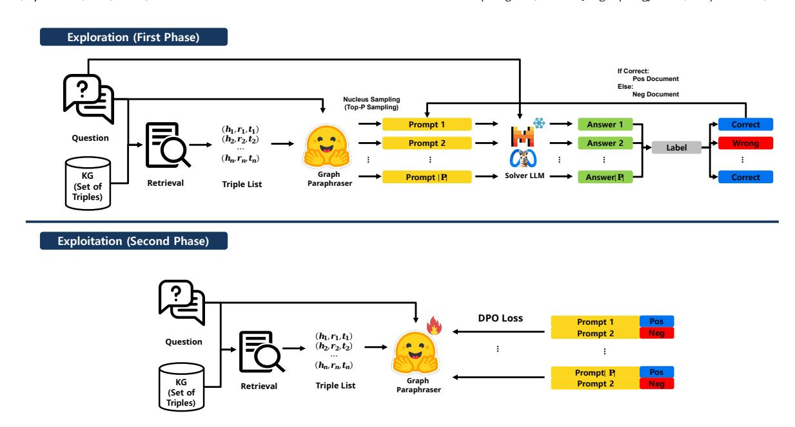

# Graph Discrete Prompt Optimization for Knowledge Graph Question Answering

[Wooyoung Kim](https://orcid.org/0009-0001-5930-9892) timothy@yonsei.ac.kr Department of Industrial Engineering Yonsei University Seoul, Republic of Korea

[Haemin Jung](https://orcid.org/0000-0002-1182-9303) hmjung@ut.ac.kr Department of Industrial and Management Engineering Korea National University of Transportation Chungju, Republic of Korea

[Byeongjin Kim](https://orcid.org/0009-0005-2213-0388) jin\_kbj@yonsei.ac.kr Department of Industrial Engineering Yonsei University Seoul, Republic of Korea

[Suhyeon Kwon](https://orcid.org/0009-0006-5714-8200) rnjstn0426@yonsei.ac.kr Department of Intelligent Data and Optimization Yonsei University Seoul, Republic of Korea

[Wooju Kim](https://orcid.org/0000-0001-5828-178X)∗ wkim@yonsei.ac.kr Department of Industrial Engineering Yonsei University Seoul, Republic of Korea

# Abstract

Integrating structured Knowledge Graphs (KGs) with black-box Large Language Models (LLMs) lacking fine-tuning access remains a persistent challenge. This paper introduces Graph Paraphraser (GP), a framework that reframes graph-to-text conversion as a discrete prompt optimization problem. GP learns to paraphrase KG data into optimal prompts by directly using the Solver's correctness feedback as a reward signal. GP operates in two phases: Exploration, generating and labeling prompt candidates, and Exploitation, learning the preference-aligned policy. On three KGQA benchmarks (SimQ, WebQSP, Mintaka), GP consistently outperforms rule-based and standard verbalization baselines. Notably, GP demonstrates exceptional generalization, maintaining high performance not only when the Solver is swapped with a new, unseen model but also when transferred to unseen datasets without any re-optimization. These findings highlight discrete prompt optimization as an effective and general mechanism for integrating structured knowledge into black-box LLM reasoning. Our models and datasets are available at [https://github.com/timothy-coshin/GraphParaphraser.](https://github.com/timothy-coshin/GraphParaphraser)

# CCS Concepts

### • Computing methodologies → Natural language processing; Semantic networks.

### Keywords

Knowledge Graph Question Answering, Graph-to-Text, Prompt Optimization, Large Language Models

∗Corresponding Author

[This work is licensed under a Creative Commons Attribution 4.0 International License.](https://creativecommons.org/licenses/by/4.0)

WWW '26, Dubai, United Arab Emirates © 2026 Copyright held by the owner/author(s). ACM ISBN 979-8-4007-2307-0/2026/04 <https://doi.org/10.1145/3774904.3792857>

### ACM Reference Format:

Wooyoung Kim, Haemin Jung, Byeongjin Kim, Suhyeon Kwon, and Wooju Kim. 2026. Graph Discrete Prompt Optimization for Knowledge Graph Question Answering. In Proceedings of the ACM Web Conference 2026 (WWW '26), April 13–17, 2026, Dubai, United Arab Emirates. ACM, New York, NY, USA, [4](#page-3-0) pages.<https://doi.org/10.1145/3774904.3792857>

# 1 Introduction and Related Work

Recent progress in large language models (LLMs) has motivated growing interest in combining them with graph-structured knowledge to enhance factual reasoning and multi-hop inference. Early attempts, such as Knowledge Graph as Pretraining Corpus [\[6\]](#page-3-1), integrated graph triples directly into pretraining data, while later studies proposed graph-augmented retrieval and generation frameworks [\[9\]](#page-3-2), showing that relational structures can improve both reasoning depth and factual completeness.

However, most graph-augmented LLM systems assume an openweight setting, where the model can be fine-tuned or its representations adapted through continuous prompting or embedding-level optimization for instance, by parameter-efficient tuning or adapterbased learning [\[7,](#page-3-3) [10\]](#page-3-4). In practical scenarios, by contrast, many LLMs are closed-weight models provided via APIs, exposing only a textual interface. Since their parameters and gradients are inaccessible, any improvement in reasoning performance must come from optimizing the input text itself rather than from modifying the model. This makes discrete prompt optimization a necessary alternative.

A few recent studies have begun to explore the use of graph information for textual prompting, but most rely on rule-based or manually designed transformations that are not explicitly optimized for downstream objectives [\[1,](#page-3-5) [3,](#page-3-6) [17\]](#page-3-7). In this work, we take a different approach: rather than treating graph-to-text conversion as a fixed preprocessing step, we frame it as a discrete prompt optimization problem, where a model learns to paraphrase retrieved triples into textual forms aligned with the Solver's reasoning behavior. Our proposed framework, Graph Paraphraser, automates this process through preference-based optimization, allowing closed LLM

Table 1: Comparison of KGQA Performance (Exact Match). The table reports EM scores across three datasets, with the average (Avg.) shown in the last column.

| Solver LLM Prompting Method | SimQ  | WebQSP | Mintaka | Avg. |
|-----------------------------|-------|--------|---------|------|
| Without KG                  | 9.82  | 26.22  | 29.20   | 21.7 |
| Linearization               | 28.95 | 30.81  | 22.88   | 27.5 |
| Frozen                      | 24.63 | 31.80  | 33.22   | 29.9 |
| KG2T LLaMa2                 | 24.77 | 27.32  | 19.26   | 23.8 |
| GP-SFT LLaMa2               | 24.49 | 33.20  | 34.85   | 30.8 |
| GP-DPO                      | 30.72 | 39.58  | 39.88   | 36.7 |
| Frozen                      | 26.25 | 30.81  | 19.65   | 25.6 |
| KG2T Mistral                | 25.50 | 28.02  | 20.20   | 24.6 |
| GP-SFT                      | 26.31 | 33.10  | 22.51   | 27.3 |
| GP-DPO                      | 30.84 | 39.28  | 26.19   | 32.1 |
| Without KG                  | 12.40 | 31.51  | 29.60   | 24.5 |
| Linearization               | 27.96 | 28.51  | 22.83   | 26.4 |
| Frozen                      | 25.73 | 29.31  | 24.14   | 26.4 |
| KG2T LLaMa2                 | 25.56 | 22.63  | 19.34   | 22.5 |
| GP-SFT Mistral              | 25.52 | 31.01  | 26.69   | 27.7 |
| GP-DPO                      | 32.32 | 37.59  | 32.93   | 34.3 |
| Frozen                      | 25.60 | 26.32  | 18.68   | 23.5 |
| KG2T Mistral                | 26.35 | 23.53  | 18.89   | 22.9 |
| GP-SFT                      | 23.90 | 26.22  | 21.60   | 23.9 |
| GP-DPO                      | 32.60 | 31.90  | 30.41   | 31.6 |

feeds only the question to the Solver, while Linearization converts triples into fixed "(subject, relation, object)" strings [\[1\]](#page-3-5). Frozen instead leverages a pretrained LLM to rewrite the retrieved triples into free-form sentences without any additional training, following the retrieve–rewrite strategy of [\[19\]](#page-3-18). KG2T denotes a conventional KG-to-Text model trained on human-annotated datasets such as WebNLG [\[8\]](#page-3-19), optimized for linguistic fidelity rather than downstream reasoning. Unlike our proposed methods, it does not incorporate query-awareness or alignment tuning, serving as a zero-shot baseline that reflects the raw generative capability of the frozen model. GP-SFT fine-tunes our proposed GP on automatically labeled positive paraphrases, and GP-DPO further applies DPO to align GP's outputs with the Solver's implicit preference for effective prompts. Throughout all experiments, the Solver LLMs remain frozen, isolating the effect of the paraphrasing method itself.

As shown in Table [1,](#page-2-0) GP-DPO achieves the highest EM across all datasets and Solvers. It consistently surpasses both Linearization, which represents KG triples in a fixed textual form, and Frozen freeform rewriting. Compared with these baselines, GP-DPO yields a substantial improvement, indicating that preference-guided paraphrasing more effectively utilizes KG information for QA than either rule-based or unguided text generation.

### 3.2 Ablation: Query-awareness and Training

Table [2](#page-2-1) presents an ablation study on two key factors: (i) incorporating query context during paraphrasing and (ii) applying GP training. Introducing query-awareness alone substantially improves EM, while the inclusion of GP training further amplifies this effect. When both factors are combined, therelative improvement reaches an average gain of 43%, indicating strong complementarity between

Table 2: Impact of Query Context and GP Training. The values in the table represent the average EM scores for each configuration in Table [1.](#page-2-0) The ratios show relative improvements (%) when incorporating query context or GP training, demonstrating that both factors contribute positively and their combination yields the largest gain.

Table 3: Results of Robustness Experiments. It shows the change in EM for each dataset when the Solver is swapped during testing. The ratio is calculated by dividing the performance when the Solver is swapped by the performance when the Solver remains the same during training and testing.

| Train   | Solver LLM Test | SimQ  | GP-DPO WebQSP | (LLaMa2) Mintaka | SimQ  | GP-DPO WebQSP | (Mistral) Mintaka |
|---------|-----------------|-------|---------------|------------------|-------|---------------|-------------------|
| LLaMa2  | LLaMa2          | 30.72 | 39.58         | 39.88            | 30.84 | 39.28         | 26.19             |
| LLaMa2  | Mistral         | 30.31 | 36.19         | 41.54            | 31.93 | 33.00         | 26.97             |
|         | Ratio           | 0.99  | 0.91          | 1.04             | 1.04  | 0.84          | 1.03              |
| Mistral | Mistral         | 32.32 | 37.59         | 32.93            | 32.60 | 31.90         | 30.41             |
| Mistral | LLaMa2          | 30.90 | 39.28         | 30.07            | 29.82 | 36.29         | 29.49             |
|         | Ratio           | 0.96  | 1.04          | 0.91             | 0.91  | 1.14          | 0.97              |

contextual conditioning and preference-based learning. These results confirm that query-aware alignment constitutes a primary source of GP's effectiveness across Solvers and datasets.

### 3.3 Robustness to Solver Substitution

We next examine whether GP-DPO maintains effectiveness when the downstream Solver is replaced at test time (LLaMa 2 ↔ Mistral). This analysis is critical because, although GP itself does not directly train the Solver, it is trained on preference signals derived from a specific Solver. This raises the question of whether GP overfits to that specific Solver's behavior or learns a more general, transferable paraphrasing strategy. Following the same evaluation setup, we define the robustness ratio as the relative EM between the swapped and original Solver configurations:

Ratio = EMTrainSolver≠TestSolver EMTrainSolver=TestSolver

Table [3](#page-2-2) summarizes the results. Ratios remain close to 1.0 (0.84–1.14) across datasets. These findings indicate that GP does not overfit to a specific Solver's internal behavior but instead learns a transferable paraphrasing strategy. By optimizing prompts through a black-box interface without accessing or modifying Solver parameters, GP exhibits adaptability across different architectures and instructiontuning schemes. This property suggests that GP can serve as a general-purpose front-end reasoning module capable of enhancing diverse Solvers without additional retraining.

### 3.4 Cross-Dataset Transferability

To assess whether the learned paraphrasing strategy generalizes beyond Solver and dataset boundaries, we further conduct crossdataset transfer experiments. Specifically, GP-DPO is trained on

the SimQ dataset and directly applied to two unseen benchmarks— WebQSP and Mintaka—without any retraining or parameter updates. The same ratio metric used in [§3.3](#page-2-3) is adopted, defined as the relative EM compared to the in-domain SimQ result:

Ratio = EMSimQ→�� EMSimQ→SimQ ��ℎ������, �� ∈ {WebQSP, Mintaka}

The results are shown in Table [4.](#page-3-20) GP-DPO shows stable performance when transferred from SimQ to other benchmarks, with ratios remaining within a comparable range (approximately 0.85–1.17). These results suggest that GP can generalize its learned paraphrasing strategy across datasets without re-optimization, enabling a flexible application to new KGQA domains. In practice, this indicates that GP possesses strong extensibility: Once trained on one dataset, it can be effectively applied to others without task-specific retraining, facilitating broader deployment of graph-based prompting in diverse knowledge settings.

Table 4: Cross-dataset transfer results of GP-DPO. The paraphraser is trained on SimQ and evaluated on unseen datasets (WebQSP, Mintaka) without retraining. Each score denotes EMSimQ→�� /EMSimQ→SimQ.

| Solver  | LLM GP LLM | SimQ → WebQSP | SimQ → Mintaka |
|---------|------------|---------------|----------------|
| LLaMa2  | LLaMa2     | 0.90          | 0.85           |
| LLaMa2  | Mistral    | 0.91          | 1.17           |
| Mistral | LLaMa2     | 0.97          | 1.15           |
| Mistral | Mistral    | 1.13          | 1.04           |

### 4 Conclusion

This paper presented Graph Paraphraser, a framework that learns to transform knowledge graphs into optimized, query-aware textual prompts for improving question answering with closed-weight LLMs. GP formulates this transformation as a discrete prompt optimization process, leveraging Solver feedback to automatically refine how graph information is verbalized. Experiments across multiple KGQA benchmarks confirmed that GP consistently enhances reasoning performance compared to linearization and conventional KG-to-Text baselines. Moreover, GP demonstrated exceptional generalization across both unseen Solvers and new datasets, maintaining high performance without any re-optimization. These results highlight the potential of learning adaptive graph verbalization strategies as a practical and general approach for integrating structured knowledge with black-box LLMs.

### Acknowledgments

This work was supported (in part) by the Yonsei University Research Fund (Post Doc. Researcher Supporting Program) of 2025 (project no.: 2025-12-0204).

### References

[1] Jinheon Baek, Alham Fikri Aji, and Amir Saffari. 2023. Knowledge-augmented language model prompting for zero-shot knowledge graph question answering. arXiv preprint arXiv:2306.04136 (2023).

- [2] Dennis Diefenbach, Thomas Pellissier Tanon, Kamal Deep Singh, and Pierre Maret. 2017. Question Answering Benchmarks for Wikidata. In Proceedings of the ISWC 2017 Posters & Demonstrations and Industry Tracks co-located with 16th International Semantic Web Conference (ISWC 2017), Vienna, Austria, October 23rd
- - to - 25th, 2017. <http://ceur-ws.org/Vol-1963/paper555.pdf> [3] Bahare Fatemi, Jonathan Halcrow, and Bryan Perozzi. 2023. Talk like a graph: Encoding graphs for large language models. arXiv preprint arXiv:2310.04560 (2023). [4] Ari Holtzman, Jan Buys, Li Du, Maxwell Forbes, and Yejin Choi. 2019. The curious case of neural text degeneration. arXiv preprint arXiv:1904.09751 (2019). [5] Albert Q Jiang, Alexandre Sablayrolles, Arthur Mensch, Chris Bamford, Devendra Singh Chaplot, Diego de las Casas, Florian Bressand, Gianna Lengyel, Guillaume Lample, Lucile Saulnier, et al. 2023. Mistral 7B. arXiv preprint arXiv:2310.06825 (2023). [6] Wooyoung Kim, Haemin Jung, and Wooju Kim. 2025. Knowledge Graph as Pre-Training Corpus for Structural Reasoning via Multi-Hop Linearization. IEEE Access 13 (2025), 7273–7283. [doi:10.1109/ACCESS.2024.3523579](https://doi.org/10.1109/ACCESS.2024.3523579) [7] Wooyoung Kim and Wooju Kim. 2026. Addressing information bottlenecks in graph augmented large language models via graph neural summarization. Information Fusion 127 (2026), 103784. [doi:10.1016/j.inffus.2025.103784](https://doi.org/10.1016/j.inffus.2025.103784) [8] Xintong Li, Aleksandre Maskharashvili, Symon Jory Stevens-Guille, and Michael White. 2020. Leveraging Large Pretrained Models for WebNLG 2020. In Proceedings of the 3rd International Workshop on Natural Language Generation from the Semantic Web (WebNLG+), Thiago Castro Ferreira, Claire Gardent, Nikolai Ilinykh, Chris van der Lee, Simon Mille, Diego Moussallem, and Anastasia Shimorina (Eds.). Association for Computational Linguistics, Dublin, Ireland (Virtual), 117–124.<https://aclanthology.org/2020.webnlg-1.12/> [9] Boci Peng, Yun Zhu, Yongchao Liu, Xiaohe Bo, Haizhou Shi, Chuntao Hong, Yan Zhang, and Siliang Tang. 2024. Graph retrieval-augmented generation: A survey. arXiv preprint arXiv:2408.08921 (2024). [10] Bryan Perozzi, Bahare Fatemi, Dustin Zelle, Anton Tsitsulin, Mehran Kazemi, Rami Al-Rfou, and Jonathan Halcrow. 2024. Let your graph do the talking: Encoding structured data for llms. arXiv preprint arXiv:2402.05862 (2024). [11] Rafael Rafailov, Archit Sharma, Eric Mitchell, Christopher D Manning, Stefano Ermon, and Chelsea Finn. 2024. Direct preference optimization: Your language model is secretly a reward model. Advances in Neural Information Processing Systems 36 (2024). [12] Pranav Rajpurkar, Jian Zhang, Konstantin Lopyrev, and Percy Liang. 2016. Squad: 100,000+ questions for machine comprehension of text. arXiv preprint arXiv:1606.05250 (2016). [13] Nils Reimers and Iryna Gurevych. 2019. Sentence-BERT: Sentence Embeddings using Siamese BERT-Networks. In Proceedings of the 2019 Conference on Empirical Methods in Natural Language Processing. Association for Computational Linguistics.<https://arxiv.org/abs/1908.10084> [14] Priyanka Sen, Alham Fikri Aji, and Amir Saffari. 2022. Mintaka: A Complex, Natural, and Multilingual Dataset for End-to-End Question Answering. In Proceedings of the 29th International Conference on Computational Linguistics. International Committee on Computational Linguistics, Gyeongju, Republic of Korea, 1604– 1619.<https://aclanthology.org/2022.coling-1.138> [15] Daniil Sorokin and Iryna Gurevych. 2018. Modeling Semantics with Gated Graph Neural Networks for Knowledge Base Question Answering. In Proceedings of the 27th International Conference on Computational Linguistics (Santa Fe, New Mexico, USA). Association for Computational Linguistics, 3306–3317. [http:](http://aclweb.org/anthology/C18-1280) [//aclweb.org/anthology/C18-1280](http://aclweb.org/anthology/C18-1280) [16] Hugo Touvron, Louis Martin, Kevin Stone, Peter Albert, Amjad Almahairi, Yasmine Babaei, Nikolay Bashlykov, Soumya Batra, Prajjwal Bhargava, Shruti Bhosale, et al. 2023. Llama 2: Open foundation and fine-tuned chat models. arXiv preprint arXiv:2307.09288 (2023). [17] Heng Wang, Shangbin Feng, Tianxing He, Zhaoxuan Tan, Xiaochuang Han, and Yulia Tsvetkov. 2023. Can language models solve graph problems in natural language? Advances in Neural Information Processing Systems 36 (2023), 30840– 30861. [18] Xiaozhi Wang, Tianyu Gao, Zhaocheng Zhu, Zhengyan Zhang, Zhiyuan Liu, Juanzi Li, and Jian Tang. 2021. KEPLER: A unified model for knowledge embedding and pre-trained language representation. Transactions of the Association for Computational Linguistics 9 (2021), 176–194. [19] Yike Wu, Nan Hu, Sheng Bi, Guilin Qi, Jie Ren, Anhuan Xie, and Wei Song. 2023. Retrieve-rewrite-answer: A kg-to-text enhanced llms framework for knowledge graph question answering. arXiv preprint arXiv:2309.11206 (2023).