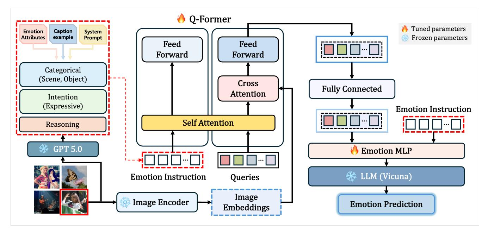
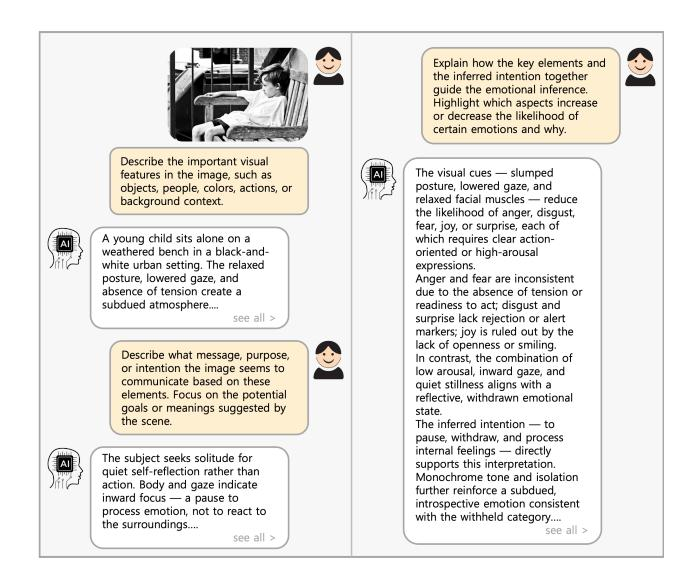

# AIMER: Affective Intention-guided Multimodal Emotion Reasoner for Visual Emotion Analysis in Social Media

Yubeen Lee Sungkyunkwan University Seoul, Korea yubeenlee@skku.edu

Shinyu Park∗ Sungkyunkwan University Seoul, Korea sinew13@skku.edu

Jiwon Park∗ Sungkyunkwan University Seoul, Korea orilove1@skku.edu

Eunil Park† Sungkyunkwan University Seoul, Korea eunilpark@skku.edu

# Abstract

Emotions arise from a complex cognitive process fundamentally shaped by underlying intentions and contextual factors, extending beyond mere visual perception. Existing visual emotion analysis approaches primarily rely on surface-level visual cues and fail to capture the intrinsic meaning of emotional expressions. To overcome this limitation, we propose AIMER, a framework that integrates both the perceptual and intentional aspects of emotion. AIMER combines intention-aware emotion instructions generated using GPT-5.0 with visual embeddings to jointly learn the motivational and contextual dimensions of emotional expression. A lightweight Emotion MLP is inserted between the visual projection and frozen large language model, enabling efficient residual adaptation without full fine-tuning. Extensive experiments on diverse visual emotion datasets demonstrate that AIMER consistently outperforms existing vision-based and multimodal models. These results confirm that integrating intention-aware reasoning with feature-level adaptation enhances not only the accuracy and interpretability of emotion understanding but also its cognitive alignment with human affective reasoning. The code is available at [https://github.com/leeyubin10/AIMER.git.](https://github.com/leeyubin10/AIMER.git)

# CCS Concepts

• Computing methodologies → Image representations; Reasoning about belief and knowledge; • Human-centered computing → Social media.

# Keywords

Visual Emotion Analysis, Intention-aware Reasoning, Instructiontuned Vision-Language Models, Multimodal Learning

WWW '26, Dubai, United Arab Emirates © 2026 Copyright held by the owner/author(s). ACM ISBN 979-8-4007-2307-0/2026/04 <https://doi.org/10.1145/3774904.3792860>

#### ACM Reference Format:

Yubeen Lee, Shinyu Park, Jiwon Park, and Eunil Park. 2026. AIMER: Affective Intention-guided Multimodal Emotion Reasoner for Visual Emotion Analysis in Social Media. In Proceedings of the ACM Web Conference 2026 (WWW '26), April 13–17, 2026, Dubai, United Arab Emirates. ACM, New York, NY, USA, [4](#page-3-0) pages.<https://doi.org/10.1145/3774904.3792860>

# 1 Introduction

Figure 1: Examples of visually similar emotion categories that convey distinct expressive intentions.

Visual Emotion Analysis (VEA) aims to recognize and interpret human emotional states from visual cues, such as facial expressions, body posture, and scene composition [\[5\]](#page-3-1). This technology has been utilized in diverse application domains, including human-computer interaction, social media analysis, and emotion-based recommendations. However, to accurately understand emotions, it is necessary to move beyond the recognition of expressions at the surface level and grasp their underlying intentions. From a psychological perspective, intention is a mental state that reflects human motivation and goal-directed cognition, known to be a key factor that dictates the direction and intensity of emotional expression [\[17\]](#page-3-2). As illustrated in Figure [1,](#page-0-0) images with similar visual features, such as 'smiling faces' or 'bright lightning', can convey distinct intentions or emotional nuances (e.g., lively 'amusement' versus calm 'contentment'). Therefore, a deep understanding of emotion requires

∗Both authors contributed equally to this work

†Corresponding author

[This work is licensed under a Creative Commons Attribution-NonCommercial-](https://creativecommons.org/licenses/by-nc-nd/4.0)[NoDerivatives 4.0 International License.](https://creativecommons.org/licenses/by-nc-nd/4.0)

Figure 2: The overall architecture of AIMER; AIMER integrates GPT-5.0–generated emotion instructions and visual embeddings through a Q-Former, enabling intention-aware emotion reasoning. A lightweight Emotion MLP between the fully connected projection and the frozen LLM allows residual adaptation without full fine-tuning.

extending mere perception to reasoning that infers the underlying motivations.

Recent advances in large multimodal models, such as LLaVA [\[7\]](#page-3-3) and BLIP-2 [\[6\]](#page-3-4), which incorporate instruction-following capabilities through Visual Instruction Tuning, have significantly improved the alignment between visual inputs and linguistic representations. For example, EmoVIT [\[11\]](#page-3-5) enhances the precision of emotion recognition through instruction-based learning, while Emotion-LLaMA [\[2\]](#page-3-6) explores language-driven descriptions of affective attributes. Despite these advancements, current methods still lack an integrated framework that jointly models perceptual expression and intentional reasoning in a unified structure.

We propose the Affective Intention-guided Multimodal Emotion Reasoner, AIMER, an intention-aware multimodal framework that interprets both the external expression and internal intention of emotion. AIMER fuses visual and linguistic information to learn the categorical, motivational, and contextual aspects of emotion while efficiently leveraging pretrained large language models (LLMs) to achieve intention-aware emotion reasoning.

The contributions of this study are summarized as follows:

- We propose AIMER, a reasoning-centered framework that extends conventional classification-based emotion recognition to an interpretation that jointly considers affective intention and contextual meaning.
- We construct Intention-aware Emotion Instructions using GPT-5.0, integrating categorical, intentional, and reasoning dimensions of emotion understanding
- Through a lightweight architecture, AIMER maintains parameter efficiency while consistently improving performance across multiple emotion datasets.

# 2 Methodology

# 2.1 Overview

Figure [2](#page-1-0) illustrates the overall architecture of AIMER. AIMER is an instruction-tuned multimodal framework designed to extend emotion understanding through intention-aware reasoning and achieve efficient learning through a lightweight adaptation.

In this framework, GPT-5.0 is used to generate structured emotion instructions that incorporate the categorical, intentional, and reasoning dimensions of emotion understanding. These instructions are then aligned with visual embeddings through the Q-Former, where self-attention and cross-attention mechanisms enable expressive grounding between the emotional semantics and visual cues. Subsequently, a lightweight Emotion MLP is inserted between the fully connected projection and frozen LLM, performing residual adaptation for emotion reasoning without requiring full fine-tuning.

# 2.2 Intention-Aware Emotion Instruction

Conventional emotion recognition models primarily rely on categorical emotion labels, which limits their ability to capture the underlying intention and contextual nuances of emotional expression. To overcome this limitation, AIMER employs GPT-5.0 to generate intention-aware emotion instructions that expand emotion understanding across multiple dimensions. These instructions jointly encode the categorical identity of the emotion, the motivational intent behind its expression, and the reasoning that links observable visual cues to emotional inference. In this way, AIMER learns to interpret emotions not only in terms of what is being expressed but also why such expressions occur.

Figure 3: Illustration of the intention-guided instruction generation process.

As shown in Figure [3,](#page-2-0) the emotion instructions generated by GPT-5.0 describe not only the external manifestation of emotion but also the internal intention and contextual grounding underlying the expression. For instance, the instruction, "The subject seeks solitude for quiet self-reflection rather than action. Body and gaze indicate inward focus, representing a pause to process emotion rather than a reaction to the surroundings.", captures the motivational context of the emotion through visual evidence such as gaze direction, posture, and the absence of overt action. AIMER integrates these structured, intention-based instructions with visual features extracted from real images to construct instruction-level emotion data that explicitly encode causal and contextual information. By aligning visual representations with linguistic intention, this mechanism enables AIMER to reason about emotions in terms of both what is expressed and why it occurs, leading to more nuanced and interpretable emotion analysis.

### 2.3 Lightweight Emotion MLP for Residual Adaptation

AIMER integrates a lightweight Emotion MLP between the fully connected projection layer and frozen LLM to enhance emotional reasoning without fine-tuning the entire model. Given the output �� from the Q-Former, the Emotion MLP performs a residual connection, defined as:

�� ′ = �� + ��emo (��), (1)

where ��emo (·) denotes a two-layer MLP with a hidden dimension of 256. This structure enables selective adaptation within emotionrelated representational subspaces while preserving the linguistic and visual knowledge stored in the frozen LLM. As a result, AIMER achieves fine-grained intention-aware modulation of emotional representations while maintaining high parameter efficiency.

Table 1: Performance comparison of AIMER across five visual emotion datasets (%).

| Method       |      | Instagram | Emotion6 | FI    | EmotionROI | EmoSet |
|--------------|------|-----------|----------|-------|------------|--------|
| WSCNet       | [14] | 81.81     | 58.47    | 70.07 | 58.25      | 76.32  |
| PDANet       | [16] | 83.80     | 59.24    | 68.05 |            | 76.95  |
| MDAN         | [12] | 83.52     | 61.66    | 76.41 |            | 75.75  |
| EmoVIT       | [11] |           | 57.81    | 68.09 | 53.87      | 83.36  |
| Flamingo     | [1]  | 77.19     | 21.67    | 14.91 | 21.72      | 29.59  |
| LLaVA        | [7]  | 78.02     | 49.44    | 56.04 | 46.46      | 44.03  |
| BLIP2        | [6]  | 84.87     | 50.00    | 57.72 | 50.51      | 46.79  |
| InstructBLIP | [3]  | 55.56     | 46.11    | 37.97 | 46.13      | 42.20  |
| Qwen2-VL     | [10] | 69.97     | 38.55    | 53.54 | 16.67      | 39.45  |
| AIMER        |      | 87.10     | 62.33    | 79.63 | 65.66      | 75.14  |

#### 2.4 Emotion Reasoning

The emotion–language fused representation refined through the Emotion MLP is then passed to the frozen LLM, Vicuna, for final emotion prediction. Conditioned on intention-aware instructions, the LLM infers emotional semantics and generates consistent emotion reasoning. Through this process, AIMER achieves interpretable emotion reasoning that jointly integrates the cognitive intention underlying emotional expression with visual cues embedded in the image.

### 3 Experiments

# 3.1 Implementation Details

3.1.1 Datasets. We evaluate our framework using five visual emotion datasets annotated with diverse emotional hierarchies. The Instagram [\[4\]](#page-3-13) dataset contains 42,804 images annotated with binary sentiment labels. The Emotion6 [\[8\]](#page-3-14) dataset comprises 1,980 images annotated according to Ekman's taxonomy of six basic emotions. The FI [\[15\]](#page-3-15), EmotionROI [\[9\]](#page-3-16), and EmoSet [\[13\]](#page-3-17) datasets follow Mikels's eight-category emotion hierarchy, consisting of 21,364, 1,980, and 118,102 images, respectively. By leveraging diverse hierarchical emotion datasets, we aim to evaluate the consistency of our method across different levels of emotional granularity.

3.1.2 Experimental Setup. The framework was implemented using Python 3.8 and PyTorch-GPU 1.13.1. All experiments were conducted on a single NVIDIA RTX A6000 GPU with 49GB VRAM, and the random seed was fixed to ensure reproducibility. The model was implemented based on the LAVIS library, with a pretrained InstructBLIP adopted as the initial backbone. During training, only the Q-Former module was fine-tuned, whereas both the image encoder and language model remained frozen. All experiments were optimized using the Adam optimizer and performed under the same hardware and configuration settings to ensure a consistent performance comparison. AIMER comprises 7.9B total parameters, of which 186M are fine-tuned for efficient adaptation.

# 3.2 Results

The proposed AIMER model achieved superior performance compared to existing state-of-the-art vision-based and multimodal emotion recognition models across various datasets, as shown in Table [1.](#page-2-1) The comparison includes traditional VEA approaches such as WSC-Net [\[14\]](#page-3-7), PDANet [\[16\]](#page-3-8), and MDAN [\[12\]](#page-3-9), as well as recent large-scale

Table 2: Ablation study on AIMER.

| Method                       | Emotion6 | FI    | EmotionROI |
|------------------------------|----------|-------|------------|
| Baseline (w/o Intention)     | 57.81    | 68.09 | 53.87      |
| + Intention Prompt           | 59.66    | 70.74 | 60.00      |
| + Emotion MLP (w/ Intention) | 62.33    | 79.63 | 65.66      |

vision–language models like Flamingo [\[1\]](#page-3-10), LLaVA [\[7\]](#page-3-3), BLIP2 [\[6\]](#page-3-4), InstructBLIP [\[3\]](#page-3-11), Qwen2-VL [\[10\]](#page-3-12), and EmoVIT [\[11\]](#page-3-5).

On the Instagram dataset, AIMER achieved the highest accuracy of 87.10%, surpassing MDAN and PDANet by 3.58% and 3.3%, respectively. For the Emotion6 dataset, AIMER outperformed MDAN by 0.67%, achieving 62.33% compared to 61.66%, while significantly surpassing multimodal foundation models such as Flamingo and LLaVA. Similarly, on the FI dataset, AIMER achieved 79.63%, outperforming BLIP2 and EmoVIT by 21.91% and 11.54%, respectively. On the EmotionROI dataset, AIMER reached 65.66%, exceeding WSCNet by 7.41% and Qwen2-VL by over 48.99%. On the EmoSet dataset, AIMER achieved 75.14%, demonstrating consistent robustness across visually diverse and affectively nuanced images.

# 3.3 Ablation Study

We perform an ablation study to assess the contributions of the Intention Prompt and Emotion MLP in AIMER across multiple visual emotion datasets (Table [2\)](#page-3-18). Removing either component leads to a performance drop, while incorporating the Intention Prompt consistently improves emotion recognition by aligning visual cues with affective semantics. Furthermore, adding the Emotion MLP enables lightweight residual adaptation, yielding the best results (62.33% on Emotion6, 79.63% on FI, and 65.66% on EmotionROI) and confirming its effectiveness in fine-grained emotion representation learning.

# 4 Conclusion

In this study, we propose AIMER, an instruction-tuned multimodal framework designed to advance emotion understanding through intention-aware reasoning and lightweight adaptation. AIMER leverages GPT-5.0-generated intention-aware emotion instructions to capture the motivational and contextual dimensions of emotional expression, while the proposed Emotion MLP enables efficient residual adaptation without full fine-tuning. Extensive experiments across multiple visual emotion datasets demonstrated that AIMER consistently outperforms both vision-based and large-scale multimodal models, achieving robust and interpretable emotion reasoning. The integration of structured intention prompts and featurelevel adaptation allows AIMER to bridge the gap between perceptual emotion cues and cognitive interpretation, aligning model inference more closely with human affective comprehension. AIMER can be extended for real-time emotion inference, enhancing cognitive understanding of social media interactions. AIMER can be extended to real-world platforms for real-time emotion inference, enhancing cognitive understanding of affective interactions in social media.

#### Acknowledgments

This research was supported by the MSIT (Ministry of Science, ICT), Korea, under the Global Research Support Program in the Digital Field program (RS-2024-00419073), the ICAN (ICT Challenge and Advanced Network of HRD) support program (RS-2024-00436934), and the ITRC (Information Technology Research Center) grant (RS-2024-00436936), supervised by the IITP (Institute for Information & Communications Technology Planning & Evaluation).

# Generative AI Disclosure

We used generative AI tools for minor grammar and spelling refinement. For code, AI-based tools were used as standard IDE features (e.g., completion or linting). All conceptual, textual, and coding contributions were created and verified by the authors.

#### References

[1] Jean-Baptiste Alayrac, Jeff Donahue, Pauline Luc, Antoine Miech, Iain Barr, Yana Hasson, Karel Lenc, Arthur Mensch, Katherine Millican, Malcolm Reynolds, et al. 2022. Flamingo: a visual language model for few-shot learning. Advances in neural information processing systems 35 (2022), 23716–23736. [2] Zebang Cheng, Zhi-Qi Cheng, Jun-Yan He, Kai Wang, Yuxiang Lin, Zheng Lian, Xiaojiang Peng, and Alexander Hauptmann. 2024. Emotion-llama: Multimodal emotion recognition and reasoning with instruction tuning. Advances in Neural Information Processing Systems 37 (2024), 110805–110853. [3] Wenliang Dai, Junnan Li, Dongxu Li, Anthony Tiong, Junqi Zhao, Weisheng Wang, Boyang Li, Pascale N Fung, and Steven Hoi. 2023. Instructblip: Towards general-purpose vision-language models with instruction tuning. Advances in neural information processing systems 36 (2023), 49250–49267. [4] Marie Katsurai and Shin'ichi Satoh. 2016. Image sentiment analysis using latent correlations among visual, textual, and sentiment views. In 2016 IEEE ICASSP '16. IEEE, 2837–2841. [5] Yubeen Lee, Sangeun Lee, Junyeop Cha, Jufeng Yang, and Eunil Park. 2025. BOVIS: Bias-Mitigated Object-Enhanced Visual Emotion Analysis. In Proc. of CIKM '25. 1508–1518. [6] Junnan Li, Dongxu Li, Silvio Savarese, and Steven Hoi. 2023. Blip-2: Bootstrapping language-image pre-training with frozen image encoders and large language models. In Proc. of ICML '23. PMLR, 19730–19742. [7] Haotian Liu, Chunyuan Li, Qingyang Wu, and Yong Jae Lee. 2023. Visual instruction tuning. Advances in neural information processing systems 36 (2023), 34892–34916. [8] Kuan-Chuan Peng, Tsuhan Chen, Amir Sadovnik, and Andrew C Gallagher. 2015. A mixed bag of emotions: Model, predict, and transfer emotion distributions. In Proc. of CVPR '15. 860–868. [9] Kuan-Chuan Peng, Amir Sadovnik, Andrew Gallagher, and Tsuhan Chen. 2016. Where do emotions come from? predicting the emotion stimuli map. In Proc. of ICIP '16. IEEE, 614–618. [10] Peng Wang, Shuai Bai, Sinan Tan, Shijie Wang, Zhihao Fan, Jinze Bai, Keqin Chen, Xuejing Liu, Jialin Wang, Wenbin Ge, et al. 2024. Qwen2-vl: Enhancing vision-language model's perception of the world at any resolution. [https://arxiv.](https://arxiv.org/abs/2409.12191) [org/abs/2409.12191.](https://arxiv.org/abs/2409.12191) [11] Hongxia Xie, Chu-Jun Peng, Yu-Wen Tseng, Hung-Jen Chen, Chan-Feng Hsu, Hong-Han Shuai, and Wen-Huang Cheng. 2024. Emovit: Revolutionizing emotion insights with visual instruction tuning. In Proc. of CVPR '24. 26596–26605. [12] Liwen Xu, Zhengtao Wang, Bin Wu, and Simon Lui. 2022. Mdan: Multi-level dependent attention network for visual emotion analysis. In Proc. of CVPR '22. 9479–9488. [13] Jingyuan Yang, Qirui Huang, Tingting Ding, Dani Lischinski, Danny Cohen-Or, and Hui Huang. 2023. Emoset: A large-scale visual emotion dataset with rich attributes. In Proc. of CVPR '23. 20383–20394. [14] Jufeng Yang, Dongyu She, Yu-Kun Lai, Paul L Rosin, and Ming-Hsuan Yang. 2018. Weakly supervised coupled networks for visual sentiment analysis. In Proc. of CVPR '18. 7584–7592. [15] Quanzeng You, Jiebo Luo, Hailin Jin, and Jianchao Yang. 2016. Building a large scale dataset for image emotion recognition: The fine print and the benchmark. In Proc. of AAAI '16, Vol. 30. [16] Sicheng Zhao, Zizhou Jia, Hui Chen, Leida Li, Guiguang Ding, and Kurt Keutzer. 2019. PDANet: Polarity-consistent deep attention network for fine-grained visual emotion regression. In Proc. of ACM MM '19. 192–201. [17] Michael Zimmerman. 1989. Review Essay: Intention, Plans, and Practical Reason. Philosophy and Phenomenological Research 50, 1 (1989), 189–197.