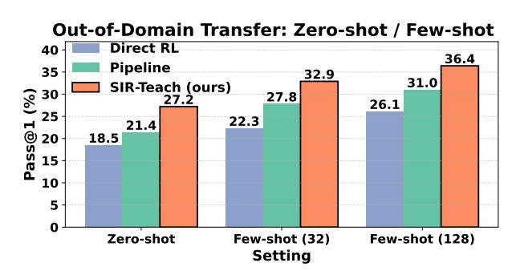
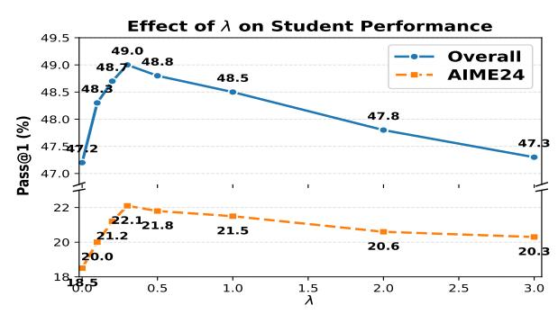
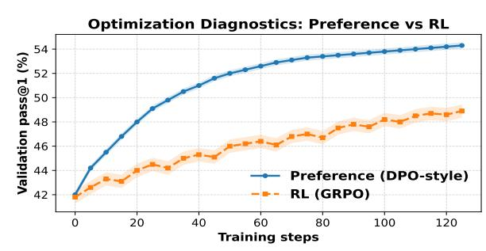

# SIR-Teach: Student-Implicit Reward Teaching

Haochen You∗ William and Mary, Columbia University United States of America hyou@wm.edu

Baojing Liu

Hebei Institute of Communications Shijiazhuang, China liubj@hebic.edu.cn

### Abstract

Post-training is critical for turning large language models into effective reasoners, yet current paradigms face limits: reinforcement learning suffers from sparse, high-variance rewards, while naive imitation lacks inductive bias for stepwise reasoning. Teacher-student pipelines partially address this gap, but teachers are often trained with objectives misaligned to their role of producing pedagogical explanations. We present SIR-Teach (Student-Implicit-Reward Teaching), a framework that aligns teacher optimization with student learning by conditioning teachers on both question and solution and scoring explanations with a student-implicit reward that combines solution likelihood and a KL term encouraging transferable tokens. Optimized with a stable preference-based objective, teachers yield raw traces directly usable for distillation. Experiments show that SIR-Teach outperforms SFT, RL teachers, and curated pipelines across reasoning benchmarks, scales effectively (7B→32B, 1K→17K), provides stronger RL cold-starts, and transfers zero-shot to new domains, highlighting implicit-reward teaching as a principled and practical paradigm for reasoning models.

# CCS Concepts

• Computing methodologies → Natural language processing.

# Keywords

Reinforcement Learning, Implicit Reward, Knowledge Distillation, Teaching Models

### ACM Reference Format:

Haochen You∗ and Baojing Liu. 2026. SIR-Teach: Student-Implicit Reward Teaching. In Proceedings of the ACM Web Conference 2026 (WWW '26), April 13–17, 2026, Dubai, United Arab Emirates. ACM, New York, NY, USA, [4](#page-3-0) pages. <https://doi.org/10.1145/3774904.3792861>

# 1 Introduction

Post-training turns general-purpose language models into capable task solvers. Two families dominate today's practice [\[15\]](#page-3-1). The first is imitation (supervised fine-tuning, SFT), which learns from demonstrations [\[14\]](#page-3-2). The second is preference-/RL-based optimization, which learns from evaluative signals and has recently driven progress in long-form reasoning [\[12\]](#page-3-3). Despite their success, both paradigms exhibit structural limitations for reasoning models [\[20\]](#page-3-4): correctness rewards are sparse and hard to explore from, while

∗Corresponding author.

© 2026 Copyright held by the owner/author(s). ACM ISBN 979-8-4007-2307-0/2026/04 <https://doi.org/10.1145/3774904.3792861>

naïve imitation often lacks the inductive bias needed to internalize step-by-step reasoning [\[6,](#page-3-5) [18\]](#page-3-6).

A widely adopted remedy is the teacher-student pipeline: a strong model produces "reasoning traces" which are distilled into a smaller student [\[9\]](#page-3-7). Yet the objective used to train today's teachers (solve from scratch under sparse rewards) is misaligned with their downstream role (produce explanations that help a student recover the solution) [\[24\]](#page-3-8). In parallel, recent theory shows that post-training objectives can be viewed through implicit rewards that emerge from distribution matching-offering a bridge between SFT and preference learning-but this lens is rarely operationalized for explanation-centric teaching [\[17,](#page-3-9) [22\]](#page-3-10). Existing studies have also highlighted that dense pedagogical signals from teacher models can improve distillation efficiency across model scales and domains, while preference-based objectives such as DPO unify RL with pairwise supervision, revealing the potential of implicit-reward formulations to overcome KL-regularization limits [\[19,](#page-3-11) [23\]](#page-3-12).

We present SIR-Teach, which aligns teacher optimization with student learning: given a question and its verifiable solution, the teacher generates explanations scored by an implicit reward that couples the student's solution likelihood with a teacher–student KL encouraging transferable intermediate tokens. The teacher is trained with a critic-free, DPO-style preference objective relative to a frozen reference policy, and the resulting traces directly supervise student distillation. Theoretically, this training can be viewed as implicit-reward distribution matching that unifies SFT and preference learning. Empirically, across 7B/32B models and 1K/17K budgets, SIR-Teach improves student performance, strengthens RL cold-starts, and transfers zero-shot to new domains.

# 2 Methodology

# 2.1 Framework Overview

We consider a teacher–student setting for tasks with verifiable solutions. Let D = {(���� , ����)}�� ��=1 be question–solution pairs. The teacher policy ���� (· | ��, ��) generates a stepwise explanation �� = (��1, . . . , ����), and the student policy ���� (· | ��, ��) learns to predict �� from (��, ��). Thus, the teacher is optimized not to solve from scratch, but to produce pedagogical traces for distillation.

Regularized objective. Given an implicit reward ��(��, ��, ��) that evaluates �� from the student's perspective, the teacher is updated via KL-regularized policy improvement:

�� ★ �� = arg max �� E��∼�� (· |��,�� ) [��(��, ��, ��) ] − �� DKL �� (·|��, ��) ∥ ��ref(·|��, ��) , (1)

where ��ref is a frozen reference policy and �� &gt; 0 controls a trust region.

[This work is licensed under a Creative Commons Attribution 4.0 International License.](https://creativecommons.org/licenses/by/4.0) WWW '26, Dubai, United Arab Emirates

(GRPO) [\[21\]](#page-3-24) and cold-start RL with each trace source. All baselines share the same student backbones and 1K/17K budgets.

Evaluation Protocol. We report pass@1 accuracy using LightEvalstyle execution [\[8\]](#page-3-25) with identical decoding across methods. Results are averaged over three seeds with 95% CIs. For transfer, models are trained in-domain and evaluated zero-shot on Countdown.

### 3.2 Main Results: Student Performance

Table [1](#page-2-0) compares Qwen and Mistral backbones, showing that SIR-Teach yields the strongest students under both 1K and 17K budgets. Gains are most pronounced at 1K and remain when scaling to 32B. This suggests student-centered implicit rewards generate explanations that distill more effectively than large closed-source teachers or post-processed pipelines.

Table 1: Main results across Qwen (7B/32B students) and Mistral (7B students) families under different data budgets. Reference models are shown only for context.

| Model / Reference    | Method (not directly         | Data comparable) |      | AIME24 |     |      | MATH500 |     |      | Overall |     |
|----------------------|------------------------------|------------------|------|--------|-----|------|---------|-----|------|---------|-----|
| QwQ-32B              |                              | N.A.             |      | 50.0   |     |      | 90.6    |     |      | 65.0    |     |
| DeepSeek-R1          |                              | 800K +           | 79.8 |        |     |      | 97.3    |     | 82.9 |         |     |
| Qwen 7B              | student, 1K distillation     | samples          |      |        |     |      |         |     |      |         |     |
| SFT-only             | (small-LR)                   | 1K               | 12.0 | ±      | 0.8 | 76.0 | ±       | 0.8 | 41.4 | ±       | 0.8 |
| SFT →                | DPO                          | 1K               | 17.0 | ±      | 0.8 | 79.0 | ±       | 0.7 | 45.2 | ±       | 0.7 |
| SFT →                | SimPO                        | 1K               | 18.2 | ±      | 0.8 | 79.8 | ±       | 0.7 | 46.2 | ±       | 0.7 |
| s1-7B (pipeline)     |                              | 1K               | 13.3 | ±      | 0.9 | 80.0 | ±       | 0.8 | 42.4 | ±       | 0.8 |
| Bespoke-7B           | (pipeline)                   | 1K               | 16.7 | ±      | 0.8 | 80.2 | ±       | 0.7 | 45.0 | ±       | 0.7 |
| SIR-Teach-7B         | (ours)                       | 1K               | 22.1 | ±      | 0.7 | 82.1 | ±       | 0.7 | 49.0 | ±       | 0.7 |
| Qwen 7B              | student, 17K distillation    | samples          |      |        |     |      |         |     |      |         |     |
| SFT-only             | (small-LR)                   | 17K              | 18.1 | ±      | 0.5 | 81.0 | ±       | 0.5 | 45.3 | ±       | 0.5 |
| Bespoke-7B           | (pipeline)                   | 17K              | 20.0 | ±      | 0.5 | 82.0 | ±       | 0.4 | 46.6 | ±       | 0.5 |
| SIR-Teach-7B         | (ours)                       | 17K              | 24.1 | ±      | 0.4 | 83.2 | ±       | 0.4 | 50.2 | ±       | 0.4 |
| Qwen 32B             | student, 1K distillation     | samples          |      |        |     |      |         |     |      |         |     |
| s1-32B               | (pipeline)                   | 1K               | 50.0 | ±      | 0.5 | 92.6 | ±       | 0.4 | 66.4 | ±       | 0.5 |
| s1-32B               | + budget                     | 1K               | 56.7 | ±      | 0.5 | 93.0 | ±       | 0.4 | 69.8 | ±       | 0.5 |
| Bespoke-32B          | (pipeline)                   | 1K               | 46.7 | ±      | 0.6 | 92.6 | ±       | 0.5 | 65.6 | ±       | 0.5 |
| SFT →                | DPO                          | 1K               | 57.3 | ±      | 0.4 | 92.4 | ±       | 0.5 | 69.4 | ±       | 0.4 |
| SIR-Teach-32B        | (ours)                       | 1K               | 61.2 | ±      | 0.4 | 94.3 | ±       | 0.3 | 71.8 | ±       | 0.4 |
| Qwen 32B             | student, 17K distillation    | samples          |      |        |     |      |         |     |      |         |     |
| Sky-T1-32B           | (pipeline)                   | 17K              | 43.3 | ±      | 0.4 | 82.4 | ±       | 0.3 | 60.8 | ±       | 0.4 |
| Bespoke-32B          | (pipeline)                   | 17K              | 63.3 | ±      | 0.3 | 93.0 | ±       | 0.3 | 71.5 | ±       | 0.3 |
| SIR-Teach-32B        | (ours)                       | 17K              | 67.8 | ±      | 0.3 | 93.6 | ±       | 0.3 | 73.9 | ±       | 0.3 |
| Mistral              | 7B student, 1K distillation  | samples          |      |        |     |      |         |     |      |         |     |
| SFT-only             | (small-LR)                   | 1K               | 10.8 | ±      | 0.9 | 74.5 | ±       | 0.8 | 39.8 | ±       | 0.8 |
| SFT →                | DPO                          | 1K               | 15.6 | ±      | 0.8 | 77.4 | ±       | 0.7 | 43.5 | ±       | 0.8 |
| SFT →                | SimPO                        | 1K               | 16.3 | ±      | 0.8 | 78.1 | ±       | 0.7 | 44.3 | ±       | 0.8 |
| s1-7B (pipeline)     |                              | 1K               | 12.5 | ±      | 0.9 | 78.9 | ±       | 0.8 | 41.5 | ±       | 0.9 |
| Bespoke-7B           | (pipeline)                   | 1K               | 15.9 | ±      | 0.8 | 79.1 | ±       | 0.7 | 44.0 | ±       | 0.8 |
| SIR-Teach-Mistral-7B |                              | (ours) 1K        | 20.3 | ±      | 0.7 | 81.0 | ±       | 0.7 | 47.5 | ±       | 0.7 |
| Mistral              | 7B student, 17K distillation | samples          |      |        |     |      |         |     |      |         |     |
| SFT-only             | (small-LR)                   | 17K              | 16.2 | ±      | 0.5 | 80.2 | ±       | 0.5 | 44.0 | ±       | 0.5 |
| Bespoke-7B           | (pipeline)                   | 17K              | 18.9 | ±      | 0.5 | 81.5 | ±       | 0.4 | 45.6 | ±       | 0.5 |
| SIR-Teach-Mistral-7B |                              | (ours) 17K       | 22.7 | ±      | 0.4 | 82.6 | ±       | 0.4 | 49.1 | ±       | 0.4 |

# 3.3 Cold-Start RL with SIR-Teach

We evaluate SIR-Teach as a cold-start for RL: starting from Qwen-7B, we run GRPO with correctness rewards under four initializations-(i) none, (ii) raw R1 traces, (iii) curated pipelines (s1/Bespoke), and (iv) SIR-Teach explanations selected by implicit-reward top-�� (��=1). As shown in Table [2,](#page-2-1) SIR-Teach attains the best overall performance, including +13.2 on AIME24, and it improves MATH500 and overall accuracy over curated pipelines without post-processing. Ablations show limited sensitivity to larger ��, sharp drops without reward-based ranking, and strong results even with smaller teachers-supporting SIR-Teach as a simple, robust cold-start for RL.

Table 2: Cold-start RL on Qwen-7B.

|            |     |             |               |      | AIME24 |      | MATH500 |      | GPQA-D |      | Overall |
|------------|-----|-------------|---------------|------|--------|------|---------|------|--------|------|---------|
| RL         | (no | cold-start) |               | 13.2 | ± 1.0  | 74.4 | ± 0.9   | 34.8 | ± 1.2  | 40.8 | ± 1.0   |
| RL         | +   | R1-raw      | traces        | 11.1 | ± 0.9  | 71.2 | ± 0.8   | 34.9 | ± 1.0  | 38.7 | ± 1.0   |
| RL         | +   | Pipeline    | traces        | 16.8 | ± 0.7  | 78.3 | ± 0.7   | 36.9 | ± 0.8  | 44.0 | ± 0.7   |
| Bespoke-7B |     |             | + RL pipeline | 16.9 | ± 0.5  | 82.7 | ± 0.6   | 45.4 | ± 0.7  | 48.2 | ± 0.7   |
| RL         | +   | SIR-Teach   | (ours)        | 26.4 | ± 0.4  | 84.1 | ± 0.5   | 43.0 | ± 0.6  | 50.6 | ± 0.5   |

### 3.4 Out-of-Domain Transfer

We evaluate cross-domain generalization on the Countdown arithmetic composition task, using three settings: Zero-shot, Few-shot (32), and Few-shot (128). For each setting, we compare Direct RL, Pipeline traces, and SIR-Teach by training students under identical protocols and reporting pass@1. Figure [1](#page-2-2) shows that SIR-Teach consistently dominates across all regimes, with the largest margins in the zero-shot case, suggesting that student-centered implicit rewards yield explanations with stronger cross-task transferability.

Figure 1: Out-of-domain transfer on Countdown. Bars show pass@1 (%) under Zero-shot, Few-shot (32), and (128) settings.

### 3.5 Ablations on the Implicit Reward

We analyze the contribution of reward components, the role of the trade-off ��, and the agreement between reward ranks and downstream learning, with a note on leakage. Table [3](#page-3-26) compares using only �� SS, only �� KL, and the combination on Qwen-7B under 1K/17K budgets. The transferability term alone is weaker, but its combination with the student-likelihood term consistently yields the best accuracy. Figure [2](#page-3-27) then plots Overall and AIME24 versus �� ∈ {0, 0.1, 0.3, 1.0, 3.0}, showing a clear peak around ��=0.3, which balances correctness and transferability. Correlation analysis further confirms that reward rankings align with downstream gains: Kendall's ��={0.66, 0.61, 0.58} and Spearman's ��={0.84, 0.79, 0.76} on AIME24/MATH500/GPQA-D (��&lt;10−4 ). Finally, leakage is reduced when the KL term is weighted more: on Qwen-7B (1K), the rate drops from 7.8% at ��=0 to 5.0% at ��=0.3.

Table 3: Component ablation on Qwen-7B.

Figure 2: Effect of �� on Qwen-7B (1K).

### 3.6 Optimization Diagnostics: Preference vs RL

To better understand why preference-based optimization is stable, we compare its learning dynamics with GRPO reinforcement learning. Figure [3](#page-3-28) plots validation pass@1 over training steps. Preference learning improves steadily with low variance, while GRPO exhibits higher fluctuations and slower convergence. This supports the view that preference objectives optimize relative differences between explanations, providing smoother gradients than scalar RL rewards. Consistent with our analysis that preference logits approximate ��-values, this stability highlights the advantage of preference supervision in reasoning tasks.

Figure 3: Training dynamics: preference optimization vs. GRPO—faster and more stable convergence.

# 4 Conclusion

We presented SIR-Teach, a teacher-student framework where explanations are evaluated from the student's perspective via an implicit reward combining solution likelihood and transferability. This yields pedagogical traces that scale across model sizes and data budgets. Experiments show consistent gains over SFT, preference optimization, and pipeline distillation, while also enabling effective RL cold-starts and robust out-of-domain transfer. These results

highlight implicit-reward teaching as a practical and theoretically grounded approach for aligning reasoning models.

### References

[1] Shuai Bai, Keqin Chen, Xuejing Liu, Jialin Wang, Wenbin Ge, Sibo Song, Kai Dang, Peng Wang, Shijie Wang, Jun Tang, et al. 2025. Qwen2. 5-vl technical report. arXiv preprint arXiv:2502.13923 (2025). [2] Greg Burnham. 2025. GPQA Diamond: What's left? [https://epoch.ai/gradient](https://epoch.ai/gradient-updates/gpqa-diamond-whats-left)[updates/gpqa-diamond-whats-left](https://epoch.ai/gradient-updates/gpqa-diamond-whats-left) Accessed: 2025-08-30. [3] Edoardo Cetin, Tianyu Zhao, and Yujin Tang. 2025. Reinforcement Learning Teachers of Test Time Scaling. arXiv preprint arXiv:2506.08388 (2025). [4] Imre Csiszár and János Körner. 2011. Information theory: coding theorems for discrete memoryless systems. Cambridge University Press. [5] Guanting Dong, Hongyi Yuan, Keming Lu, Chengpeng Li, Mingfeng Xue, Dayiheng Liu, Wei Wang, Zheng Yuan, Chang Zhou, and Jingren Zhou. 2023. How abilities in large language models are affected by supervised fine-tuning data composition. arXiv preprint arXiv:2310.05492 (2023). [6] Subhabrata Dutta, Joykirat Singh, Soumen Chakrabarti, and Tanmoy Chakraborty. 2024. How to think step-by-step: A mechanistic understanding of chain-ofthought reasoning. arXiv preprint arXiv:2402.18312 (2024). [7] Kanishk Gandhi, Denise Lee, Gabriel Grand, Muxin Liu, Winson Cheng, Archit Sharma, and Noah D Goodman. 2024. Stream of search (sos): Learning to search in language. arXiv preprint arXiv:2404.03683 (2024). [8] Nathan Habib, Clémentine Fourrier, Hynek Kydlíček, Thomas Wolf, and Lewis Tunstall. 2023. LightEval: A lightweight framework for LLM evaluation. [https:](https://github.com/huggingface/lighteval) [//github.com/huggingface/lighteval](https://github.com/huggingface/lighteval) [9] Alex Havrilla, Yuqing Du, Sharath Chandra Raparthy, Christoforos Nalmpantis, Jane Dwivedi-Yu, Maksym Zhuravinskyi, Eric Hambro, Sainbayar Sukhbaatar, and Roberta Raileanu. 2024. Teaching large language models to reason with reinforcement learning. arXiv preprint arXiv:2403.04642 (2024). [10] Chaoqun He, Renjie Luo, Yuzhuo Bai, Shengding Hu, Zhen Leng Thai, Junhao Shen, Jinyi Hu, Xu Han, Yujie Huang, Yuxiang Zhang, et al. 2024. Olympiadbench: A challenging benchmark for promoting agi with olympiad-level bilingual multimodal scientific problems. arXiv preprint arXiv:2402.14008 (2024). [11] Dan Hendrycks, Collin Burns, Saurav Kadavath, Akul Arora, Steven Basart, Eric Tang, Dawn Song, and Jacob Steinhardt. 2021. Measuring mathematical problem solving with the math dataset. arXiv preprint arXiv:2103.03874 (2021). [12] Cheng-Yu Hsieh, Chun-Liang Li, Chih-Kuan Yeh, Hootan Nakhost, Yasuhisa Fujii, Alexander Ratner, Ranjay Krishna, Chen-Yu Lee, and Tomas Pfister. 2023. Distilling step-by-step! outperforming larger language models with less training data and smaller model sizes. arXiv preprint arXiv:2305.02301 (2023). [13] Albert Q. Jiang, Alexandre Sablayrolles, Arthur Mensch, and et al. 2023. Mistral 7B. arXiv[:2310.06825](https://arxiv.org/abs/2310.06825) [cs.CL] [14] Timo Kaufmann, Paul Weng, Viktor Bengs, and Eyke Hüllermeier. 2024. A survey of reinforcement learning from human feedback. (2024). [15] Yi-Chen Li, Tian Xu, Yang Yu, Xuqin Zhang, Xiong-Hui Chen, Zhongxiang Ling, Ningjing Chao, Lei Yuan, and Zhi-Hua Zhou. 2025. Generalist Reward Models: Found Inside Large Language Models. arXiv preprint arXiv:2506.23235 (2025). [16] Yu Meng, Mengzhou Xia, and Danqi Chen. 2024. Simpo: Simple preference optimization with a reference-free reward. Advances in Neural Information Processing Systems 37 (2024), 124198–124235. [17] Subhabrata Mukherjee, Arindam Mitra, Ganesh Jawahar, Sahaj Agarwal, Hamid Palangi, and Ahmed Awadallah. 2023. Orca: Progressive learning from complex explanation traces of gpt-4. arXiv preprint arXiv:2306.02707 (2023). [18] Ben Prystawski, Michael Li, and Noah Goodman. 2023. Why think step by step? reasoning emerges from the locality of experience. Advances in Neural Information Processing Systems 36 (2023), 70926–70947. [19] Rafael Rafailov and et al. 2023. Direct preference optimization: Your language model is secretly a reward model. Advances in neural information processing systems 36 (2023), 53728–53741. [20] Leonardo Ranaldi and Andre Freitas. 2024. Self-refine instruction-tuning for aligning reasoning in language models. arXiv preprint arXiv:2405.00402 (2024). [21] Zhihong Shao et al. 2024. Deepseekmath: Pushing the limits of mathematical reasoning in open language models. arXiv preprint arXiv:2402.03300 (2024). [22] Charlie Snell, Jaehoon Lee, Kelvin Xu, and Aviral Kumar. 2024. Scaling llm testtime compute optimally can be more effective than scaling model parameters. arXiv preprint arXiv:2408.03314 (2024). [23] Bo Wang et al. 2025. Implicit Reward as the Bridge: A Unified View of SFT and DPO Connections. arXiv preprint arXiv:2507.00018 (2025). [24] Hongling Xu, Qi Zhu, Heyuan Deng, Jinpeng Li, Lu Hou, Yasheng Wang, Lifeng Shang, Ruifeng Xu, and Fei Mi. 2025. KDRL: Post-Training Reasoning LLMs via Unified Knowledge Distillation and Reinforcement Learning. arXiv preprint arXiv:2506.02208 (2025). [25] Haochen You and Baojing Liu. 2025. Mover: Multimodal optimal transport with volume-based embedding regularization. In Proceedings of the 34th ACM International Conference on Information and Knowledge Management. 5444–5448.