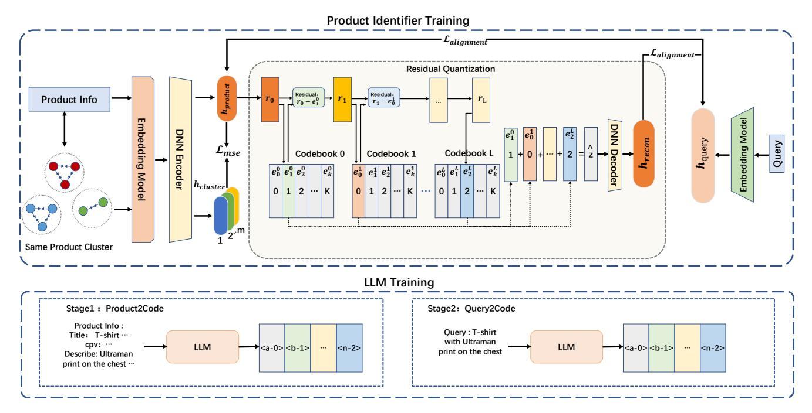

# Generative Retrieval for E-commerce: Jointly Learning Embedding and Codebook with Same Product Cluster

[Songtao Fang](https://orcid.org/0009-0001-7713-0415)∗ Alibaba Group HangZhou, CHINA fangsongtao.fst@taobao.com

[Zihao Xu](https://orcid.org/0009-0002-2973-8183) Alibaba Group HangZhou, CHINA xiyu.xzh@taobao.com

[Shaowei Wei](https://orcid.org/0009-0004-9473-0895) Alibaba Group HangZhou, CHINA leqian.wsw@taobao.com

[Jin Zhang](https://orcid.org/0009-0006-4073-7869) Alibaba Group HangZhou, CHINA zj146372@taobao.com

[Zhuojun Wang](https://orcid.org/0009-0008-8685-4467) Alibaba Group HangZhou, CHINA jerry.wangzj@taobao.com

## Abstract

With the development of large language models (LLMs), generative retrieval is becoming increasingly important in e-commerce scenarios. Current mainstream approaches typically use a two-stage training strategy: first train a product embedding model, and then learn a codebook that maps embeddings to product IDs. This cascaded approach suffers from two major issues: (1) error accumulation—if the embedding model in the first stage produces biased representations, the codebook in the second stage cannot correct these errors, degrading final retrieval performance; and (2) codebook learning relies solely on product embeddings and lacks modeling of query-to-product and product-to-product interactions. As a result, products belonging to the same cluster may be assigned inconsistent IDs by the codebook, further hurting retrieval accuracy. To address these problems, we propose a novel method that jointly trains the embedding model and the codebook, and incorporates same product cluster information as an additional supervision signal. Experimental results demonstrate that our method significantly improves e-commerce retrieval performance while simultaneously enhancing both embedding and codebook learning.

# CCS Concepts

• Information systems → Online shopping; Retrieval tasks and goals; Language models; Novelty in information retrieval.

## Keywords

Large Language Model, Information Retrieval, E-Commerce Search

### ACM Reference Format:

Songtao Fang, Zihao Xu, Shaowei Wei, Jin Zhang, and Zhuojun Wang. 2026. Generative Retrieval for E-commerce: Jointly Learning Embedding and Codebook with Same Product Cluster. In Proceedings of the ACM Web Conference 2026 (WWW '26), April 13–17, 2026, Dubai, United Arab Emirates. ACM, New York, NY, USA, [4](#page-3-0) pages.<https://doi.org/10.1145/3774904.3792862>

∗Corresponding author.

© 2026 Copyright held by the owner/author(s). ACM ISBN 979-8-4007-2307-0/2026/04 <https://doi.org/10.1145/3774904.3792862>

# 1 Introduction

Generative retrieval (GR) has emerged as a promising approach in information retrieval. Unlike sparse or dense methods—which rely on shallow semantic matching and often fail to capture implicit intent[\[9,](#page-3-1) [10\]](#page-3-2) or handle colloquial queries (e.g., "gifts for a 10-yearold who loves science"). GR leverages large generative models to better interpret user intent and produce more relevant results.

GR can directly produce document identifiers (DocIDs) from user queries using the capabilities of pre-trained models. DPI[\[12\]](#page-3-3) introduced transformer-based autoregressive models that preprocess documents into hierarchical identifiers using k-means clustering. Other approaches, such as MERGE[\[16\]](#page-3-4), LETTER[\[15\]](#page-3-5), Tiger[\[7\]](#page-3-6), and UniSearch[\[1\]](#page-3-7), learn DocIDs for retrieval based on RQ-VAE[\[7\]](#page-3-6) or VQ-VAE[\[14\]](#page-3-8). However, mainstream approaches employ a two-stage pipeline: first learning product embeddings, then deriving a codebook to map these embeddings to DocIDs. This introduces two fundamental limitations. First, error accumulation: inaccuracies in the learned embeddings are propagated and amplified during codebook training. Second, insufficient interaction modeling: the codebook relies solely on static embeddings and thus fails to capture query–product and inter-product interactions, often resulting in inconsistent product IDs assignments even among semantically equivalent products within the same product cluster (i.e., variations of the same product from different suppliers or in different sizes).

To address these issues, we propose a novel joint training framework that simultaneously optimizes both the product embedding and the codebook. Our framework uses product cluster assignments as auxiliary supervision, which explicitly enhances the semantic consistency among products within the same cluster. By jointly training both components, our approach eliminates the error propagation inherent in conventional two-stage pipelines and optimizes them under a unified objective. The main contributions of this paper are as follows:

- (1) We propose a joint training framework to optimize product embedding and the codebook, addressing error accumulation in traditional two-stage methods.
- (2) By leveraging product cluster information as additional supervision, we enhance both the semantic consistency of IDs and the quality of embeddings for identical products.
- (3) Extensive experiments on multiple e-commerce retrieval tasks show that our method outperforms existing approaches.

[This work is licensed under a Creative Commons Attribution 4.0 International License.](https://creativecommons.org/licenses/by/4.0) WWW '26, Dubai, United Arab Emirates

Table 1: Performance comparison of different models

| Model        | Recall@1 | Recall@10 | Recall@100 | ALSP |
|--------------|----------|-----------|------------|------|
| BM25         | 1.23     | 2.66      | 9.80       | —    |
| DPR          | 3.57     | 7.09      | 24.24      | —    |
| DSI          | 3.79     | 7.99      | 23.91      | 2.89 |
| Tiger rq-vae | 4.33     | 8.84      | 26.38      | 3.92 |
| ours         | 4.49     | 9.90      | 30.71      | 4.42 |
| ours-cluster | 4.39     | 8.91      | 28.47      | 4.01 |

### 4.4 Experiment Settings

For product identifier training, we utilize the gte embedding model[\[17\]](#page-3-16) as the shared query and product embedding model. In our RQ-VAE implementation, the codebook is configured with 5 layers (��=5), each containing 32 entries (��=32), and the embedding size for each entry is set to 768. Additionally, up to 5 products are sampled from the same product cluster corresponding to each product and we use the AdamW optimizer with a learning rate of 1e-4. We follow[\[7\]](#page-3-6) to set �� as 0.25, �� is set as 0.5 �� and �� is set to as 0.5. For LLM training, we employ Qwen2.5-7B[\[13\]](#page-3-17) to learn the mapping from product and query to product IDs with a learning rate of 5e-5.

# 4.5 Results and Analysis

The experimental results are shown in Table [1.](#page-3-18) ours-cluster denotes our model with the product-cluster constraint removed. Overall, the experimental results indicate that the proposed model outperforms all baselines on a large-scale real-world dataset. Specifically, compared to sparse (e.g., BM25) and dense retrieval methods (e.g., DPR), our model significantly outperforms them on the dataset. Sparse retrieval relies on keyword matching, while dense retrieval is constrained by the construction of positive and negative samples and cannot leverage general world knowledge. These limitations make both approaches struggle to handle complex or implicit-intent queries effectively.

Compared with generative retrieval methods, our model exhibits superior effectiveness and practicality. DSI and Tigerrq-vae, which rely on item embeddings for clustering and residual quantization, tend to amplify inherent biases in the embedding space. Furthermore, their non-end-to-end learning paradigm introduces information loss, degrading overall retrieval performance. As evidenced by the ASLP metric, items within the same product cluster exhibit significantly higher common prefixes than those generated by other generative methods. Crucially, when the cluster-based vector constraints are removed, both ASLP and other key metrics exhibit substantial degradation. This demonstrates that the product-cluster constraint provides a powerful, semantically rich supervision signal for learning consistent item ID representations. By aligning item IDs with meaningful semantic groupings, our approach reduces ambiguity in subsequent LLM training, enabling more coherent and hierarchical semantic structures in the ID space. By comparing the performance of ours-cluster with Tigerrq-vae, we can observe that end-to-end training brings performance improvements, as the interaction between queries and products during training helps mitigate the bias inherent in codebook learning that relies solely on embeddings.

### 5 Conclusion

In this paper, we propose a joint-training framework for generative retrieval that simultaneously optimizes product embedding and codebook, using same product cluster information to enforce ID consistency. Our method eliminates error accumulation in twostage pipelines and significantly outperforms existing approaches on real-world e-commerce data. Ablations confirm that both joint training and cluster supervision are crucial for enhancing retrieval accuracy and improving product ID consistency within the same cluster.

### References

[1] Jiahui Chen, Xiaoze Jiang, Zhibo Wang, Quanzhi Zhu, Junyao Zhao, Feng Hu, Kang Pan, Ao Xie, Maohua Pei, Zhiheng Qin, et al. 2025. UniSearch: Rethinking Search System with a Unified Generative Architecture. arXiv preprint arXiv:2509.06887 (2025). [2] Jacob Devlin, Ming-Wei Chang, Kenton Lee, and Kristina Toutanova. 2019. Bert: Pre-training of deep bidirectional transformers for language understanding. In Proceedings of the 2019 conference of the North American chapter of the association for computational linguistics: human language technologies, volume 1 (long and short papers). 4171–4186. [3] Vladimir Karpukhin, Barlas Oguz, Sewon Min, Patrick SH Lewis, Ledell Wu, Sergey Edunov, Danqi Chen, and Wen-tau Yih. 2020. Dense Passage Retrieval for Open-Domain Question Answering.. In EMNLP (1). 6769–6781. [4] Omar Khattab and Matei Zaharia. 2020. Colbert: Efficient and effective passage search via contextualized late interaction over bert. In Proceedings of the 43rd International ACM SIGIR conference on research and development in Information Retrieval. 39–48. [5] Aaron van den Oord, Yazhe Li, and Oriol Vinyals. 2018. Representation learning with contrastive predictive coding. arXiv preprint arXiv:1807.03748 (2018). [6] Ming Pang, Chunyuan Yuan, Xiaoyu He, Zheng Fang, Donghao Xie, Fanyi Qu, Xue Jiang, Changping Peng, Zhangang Lin, Zheng Luo, et al. 2025. Generative Retrieval and Alignment Model: A New Paradigm for E-commerce Retrieval. In Companion Proceedings of the ACM on Web Conference 2025. 413–421. [7] Shashank Rajput, Nikhil Mehta, Anima Singh, Raghunandan Hulikal Keshavan, Trung Vu, Lukasz Heldt, Lichan Hong, Yi Tay, Vinh Tran, Jonah Samost, et al. 2023. Recommender systems with generative retrieval. Advances in Neural Information Processing Systems 36 (2023), 10299–10315. [8] Stephen Robertson, Hugo Zaragoza, et al. 2009. The probabilistic relevance framework: BM25 and beyond. Foundations and Trends® in Information Retrieval 3, 4 (2009), 333–389. [9] Rulin Shao, Rui Qiao, Varsha Kishore, Niklas Muennighoff, Xi Victoria Lin, Daniela Rus, Bryan Kian Hsiang Low, Sewon Min, Wen-tau Yih, Pang Wei Koh, et al. 2025. ReasonIR: Training Retrievers for Reasoning Tasks. arXiv preprint arXiv:2504.20595 (2025). [10] Hongjin Su, Howard Yen, Mengzhou Xia, Weijia Shi, Niklas Muennighoff, Han-yu Wang, Haisu Liu, Quan Shi, Zachary S Siegel, Michael Tang, et al. 2024. Bright: A realistic and challenging benchmark for reasoning-intensive retrieval. arXiv preprint arXiv:2407.12883 (2024). [11] Weiwei Sun, Lingyong Yan, Zheng Chen, Shuaiqiang Wang, Haichao Zhu, Pengjie Ren, Zhumin Chen, Dawei Yin, Maarten de Rijke, and Zhaochun Ren. 2023. Learning to Tokenize for Generative Retrieval. CoRR abs/2304.04171 (2023). [12] Yi Tay, Vinh Tran, Mostafa Dehghani, Jianmo Ni, Dara Bahri, Harsh Mehta, Zhen Qin, Kai Hui, Zhe Zhao, Jai Gupta, et al. 2022. Transformer memory as a differentiable search index. Advances in Neural Information Processing Systems 35 (2022), 21831–21843. [13] Qwen Team et al. 2024. Qwen2 technical report. arXiv preprint arXiv:2407.10671 2, 3 (2024). [14] Aaron Van Den Oord, Oriol Vinyals, et al. 2017. Neural discrete representation learning. Advances in neural information processing systems 30 (2017). [15] Wenjie Wang, Honghui Bao, Xinyu Lin, Jizhi Zhang, Yongqi Li, Fuli Feng, See-Kiong Ng, and Tat-Seng Chua. 2024. Learnable item tokenization for generative recommendation. In Proceedings of the 33rd ACM International Conference on Information and Knowledge Management. 2400–2409. [16] Fuwei Zhang, Xiaoyu Liu, Xinyu Jia, Yingfei Zhang, Shuai Zhang, Xiang Li, Fuzhen Zhuang, Wei Lin, and Zhao Zhang. 2025. Multi-level Relevance Document Identifier Learning for Generative Retrieval. In Proceedings of the 63rd Annual Meeting of the Association for Computational Linguistics (Volume 1: Long Papers). 10066–10080. [17] Xin Zhang and Y Zhang. 2024. mGTE: Generalized Long-Context Text Representation and Reranking Models for Multilingual Text Retrieval,(2024). URL https://arxiv. org/abs/2407.19669 (2024).