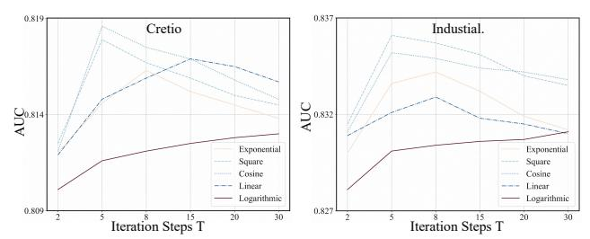

# Infer As You Train: A Symmetric Paradigm of Masked Generative for Click-Through Rate Prediction

Moyu Zhang Alibaba Group Beijing, China zhangmoyu@butp.cn

Yujun Jin Alibaba Group Beijing, China jinyujun.jyj@alibaba-inc.com

Yun Chen Alibaba Group Beijing, China jinuo.cy@alibaba-inc.com

Jinxin Hu∗ Alibaba Group Beijing, China jinxin.hjx@alibaba-inc.com

Yu Zhang Alibaba Group Beijing, China daoji@alibaba-inc.com

Xiaoyi Zeng Alibaba Group Beijing, China yuanhan@taobao.com

### Abstract

Generative models are increasingly being explored in click-through rate (CTR) prediction field to overcome the limitations of the conventional discriminative paradigm, which rely on a simple binary classification objective. However, existing generative models typically confine the generative paradigm to the training phase, primarily for representation learning. During online inference, they revert to a standard discriminative paradigm, failing to leverage their powerful generative capabilities to further improve prediction accuracy. This fundamental asymmetry between the training and inference phases prevents the generative paradigm from realizing its full potential. To address this limitation, we propose the Symmetric Masked Generative Paradigm for CTR prediction (SGCTR), a novel framework that establishes symmetry between the training and inference phases. Specifically, after acquiring generative capabilities by learning feature dependencies during training, SGCTR applies the generative capabilities during online inference to iteratively redefine the features of input samples, which mitigates the impact of noisy features and enhances prediction accuracy. Extensive experiments validate the superiority of SGCTR, demonstrating that applying the generative paradigm symmetrically across both training and inference significantly unlocks its power in CTR prediction.

#### Keywords

Symmetric Paradigm, Generative Models, CTR Prediction

#### ACM Reference Format:

Moyu Zhang, Yujun Jin, Yun Chen, Jinxin Hu, Yu Zhang, and Xiaoyi Zeng. 2018. Infer As You Train: A Symmetric Paradigm of Masked Generative for Click-Through Rate Prediction. In Woodstock '18: ACM Symposium on Neural Gaze Detection, June 03–05, 2018, Woodstock, NY . ACM, New York, NY, USA, [4](#page-3-0) pages.<https://doi.org/10.1145/1122445.1122456>

∗Corresponding Author

Woodstock '18, Woodstock, NY © 2018 ACM. ACM ISBN 978-1-4503-XXXX-X/18/06 <https://doi.org/10.1145/1122445.1122456>

# 1 Introduction

With the recent development of deep learning, the performance of click-through rate (CTR) prediction models in the recommender system domain has also seen rapid advancements. These models, by utilizing methods such as factorization machines (FM) [\[4,](#page-3-1) [6\]](#page-3-2) and the attention mechanism [\[13\]](#page-3-3), can effectively capture complex interactions among input features, thereby improving the accuracy of predictions. However, conventional CTR prediction models also face persistent challenges, such as training instability and representation collapse arising from data sparsity, which ultimately limits their generalization ability. Addressing the above challenges has therefore become a key focus of CTR prediction research filed.

Inspired by the recent success of Large Language Models (LLMs) in the natural language processing domain, generative paradigms have gained widespread attention in recommender systems. Recommender research often treats user behavior sequences as sentences and employs auto-regressive models to predict the next item that the target user will click [\[3,](#page-3-4) [12\]](#page-3-5). While this approach moves beyond simple binary classification by introducing a generative paradigm, it fundamentally neglects crucial cross-features and item attribute features, leading to significant performance degradation [\[14\]](#page-3-6). To address this issue, subsequent research has shifted its focus from modeling sequences to modeling the distribution of features in samples. By employing techniques such as dropout and discrete diffusion processes[\[11,](#page-3-7) [14\]](#page-3-6), these CTR models learn to capture complex feature dependencies. This, in turn, effectively mitigates representation collapse and enhances the modeling of feature interactions.

Despite their progress, existing generative CTR models suffer from a critical problem in their application: they employ asymmetric paradigms for training and inference. During training, the generative objectives are used to enhance the model's understanding of data distributions and to learn robust feature representations. During online inference, however, these models revert to a conventional discriminative approach, performing predictions based on potentially noisy input samples. This asymmetry means that the powerful generative capabilities acquired during training are entirely discarded at inference time, preventing these generative models from realizing their full potential in conducting predictions.

Therefore, to better leverage the potential of generative models, this paper proposes the Symmetric Masked Generative Paradigm for CTR prediction (SGCTR) which fully utilizes the model's feature generation capabilities by iteratively generating features for input

Permission to make digital or hard copies of all or part of this work for personal or classroom use is granted without fee provided that copies are not made or distributed for profit or commercial advantage and that copies bear this notice and the full citation on the first page. Copyrights for components of this work owned by others than ACM must be honored. Abstracting with credit is permitted. To copy otherwise, or republish, to post on servers or to redistribute to lists, requires prior specific permission and/or a fee. Request permissions from permissions@acm.org.

| Dataset     | # Feature Fields   | # Impressions | # Positive |
|-------------|--------------------|---------------|------------|
| Criteo      | 39                 | 45M           | 26%        |
| Avazu       | 23                 | 40M           | 17%        |
| Malware     | 81                 | 8.9M          | 50%        |
| Industrial. | 72                 | 782M          | 2.8%       |
| Table 1:    | Statistics of four | benchmark     | datasets.  |

feature positions in ���� , we directly set their confidence score to 1. • Feature Redefine and Mask. We calculate the number of features to be masked, based on the masking scheduling function �� by ���� = [�� ( �� )��], where �� is the total number of feature fields and �� is the total number of iterations. We sort the confidence scores of the features at each position from smallest to largest, mask the top ���� features with the lowest confidence scores, retain the remaining features, and use the product of each feature and its corresponding confidence score as the input for the next iteration, as below:

����+1 = [�� 1 ��+1 , �� 2 ��+1 , ..., �� �� ��+1 ] (4)

�� ��+1 = 0, if �� �� &lt; Min[���� ] �� �� , else (5)

where Min[���� ] denotes the the top ���� -th lowest confidence score.

Through this iterative redefinition process of �� discrete steps, we construct the final sample ���� . At this point, each feature in ���� has been redefined using the model's feature generation capability. It is worth mentioning that, theoretically, if the model's generation capability is strong enough, we can replace the original features of the sample with the generated features. However, considering the high dimensionality of ID features and the limited number of training samples for the model, we will temporarily compromise by using the above redefine method.

Prediction. Finally, we conduct predictions as DGenCTR does. We use the iteratively redefined sample generated from the iteration process to calculate the final prediction score, as defined below:

��(��|����+1) = 1 1 + �� − ( F (��=1|����+1 )−F (��=0|����+1 ) ) (6)

where the scoring function F (·) is retrived from the training stage.

## 4 Experiments

### 4.1 Datasets

To validate the efficacy of our proposed framework, four datasets are used for performance evaluation. The statistics of four datasets are detailed in Table [1.](#page-2-0) • Criteo [1](#page-2-1) . It is a canonical public benchmark for CTR models, which consists of one week of real-world ad click data, featuring 13 continuous features and 26 categorical features.• Avazu [2](#page-2-2) . It is widely-used for CTR prediction, consisting of 10 days of chronologically ordered ad click logs with 23 feature fields in a sample. • Malware [3](#page-2-3) . It comes from a Kaggle competition and its objective is to predict the infection probability of a Windows device. The dataset consists of 81 feature fields. • Industrial Dataset. We gathered a dataset from an e-commerce platform's online advertising system. The training set is composed of samples from the last 20 days, while the test set is the subsequent day.

Table 2: Prediction performance on datasets of CTR prediction models. \* indicates p-value < 0.05 in the significance test.

| Method    | Dataset Criteo | Avazu   | AUC Malware | Industrial. |
|-----------|----------------|---------|-------------|-------------|
| FM        | 0.8037         | 0.7858  | 0.7413      | 0.8191      |
| Wide&Deep | 0.8018         | 0.7758  | 0.7363      | 0.8201      |
| DeepFM    | 0.8029         | 0.7839  | 0.7424      | 0.8207      |
| DCN       | 0.8029         | 0.7839  | 0.7424      | 0.8232      |
| AutoInt   | 0.8025         | 0.7826  | 0.7403      | 0.8241      |
| FibiNET   | 0.8042         | 0.7832  | 0.7441      | 0.8250      |
| GDCN      | 0.8103         | 0.7855  | 0.7452      | 0.8267      |
| MaskNet   | 0.8083         | 0.7845  | 0.7445      | 0.8256      |
| PEPNet    | 0.8107         | 0.7860  | 0.7445      | 0.8272      |
| HSTU      | 0.8113         | 0.7907  | 0.7458      | 0.8294      |
| HSTU+GEN  | 0.8142         | 0.7931  | 0.7479      | 0.8314      |
| DGenCTR   | 0.8167         | 0.7986  | 0.7503      | 0.8338      |
| SGCTR     | 0.8186*        | 0.7999* | 0.7526*     | 0.8361*     |

#### 4.2 Competitors

We evaluate SGCTR against: 1) Discriminative Models: FM [\[6\]](#page-3-2), Wide&Deep [\[2\]](#page-3-8), DeepFM [\[4\]](#page-3-1), DCN [\[9\]](#page-3-9), AutoInt [\[7\]](#page-3-10), FiBiNet [\[5\]](#page-3-11), GDCN [\[8\]](#page-3-12), MaskNet [\[10\]](#page-3-13), PEPNet [\[1\]](#page-3-14), and HSTU [\[13\]](#page-3-3). 2) Generative Models: HSTU+GEN [\[11\]](#page-3-7) and DGenCTR [\[14\]](#page-3-6). All models were implemented in TensorFlow using the Adam optimizer and Xavier initialization. The activation function was ReLU. We determined the optimal hyper-parameters through an extensive grid search.

### 4.3 Effectiveness Verification

Table [2](#page-2-4) summarizes the overall prediction performance of all methods on all datasets, along with a statistical significance test of our model's improvements over the best-performing baseline. As shown in the table [2,](#page-2-4) our proposed method, SGCTR, consistently outperforms all models across all datasets, demonstrating its superiority.

Furthermore, our results indicate that introducing a generative paradigm enables CTR models to achieve performance competitive with that of discriminative models, showcasing the paradigm's potential. However, because these existing generative models do not apply their generative capabilities during the online inference phase, their prediction performance remains inferior to that of SGCTR. This comparison further validates the significant potential of extending the generative paradigm to the online inference phase.

### 4.4 Ablation Study

We conducted an ablation study on three variants: SGCTR(BERT), which employs BERT's random masking strategy during training; SGCTR(OneStep), which performs generation for all masked positions in a single step during inference; SGCTR(GenFea), which directly replaces the original features with the model-generated ones during inference. The results are reported in Table [3.](#page-3-15) First, SGCTR outperforms SGCTR(BERT), as the discrete diffusion process enables the model to more precisely capture the dependencies among features, which in turn enhances the feature refinement process during inference. Second, SGCTR(OneStep) also exhibits a performance drop. This is because single-step generation introduces a discrepancy between the training and inference processes,

1http://labs.criteo.com/downloads/download-terabyte-click-logs/

2http://www.kaggle.com/c/avazu-ctr-prediction

3https://www.kaggle.com/c/microsoft-malware-prediction

Table 3: Performance of variants on four datasets.

| Method SGCTR   | Dataset Criteo 0.8186* | Avazu 0.7999* | AUC Malware 0.7526* | Industrial. 0.8361* |
|----------------|------------------------|---------------|---------------------|---------------------|
| SGCTR(BERT)    | 0.8153                 | 0.7958        | 0.7492              | 0.8326              |
| SGCTR(OneStep) | 0.8099                 | 0.7897        | 0.7451              | 0.8281              |
| SGCTR(GenFea)  | 0.8085                 | 0.7846        | 0.7413              | 0.8215              |

Table 4: Performance of different functions on four datasets.

| Function    | Dataset Criteo | Avazu   | AUC Malware | Industrial. |
|-------------|----------------|---------|-------------|-------------|
| Exponential | 0.8163         | 0.7988  | 0.7508      | 0.8342      |
| Square      | 0.8179         | 0.7999* | 0.7522      | 0.8361*     |
| Cosine      | 0.8186*        | 0.7991  | 0.7526*     | 0.8352      |
| Linear      | 0.8169         | 0.7979  | 0.7502      | 0.8329      |
| Logarithmic | 0.8130         | 0.7934  | 0.7481      | 0.8311      |

leading to less effective. Finally, SGCTR(GenFea) shows the poorest performance among all variants. This strongly suggests that, given the challenges of high-dimensional ID features, the model struggles to generate high-fidelity samples from scratch.

### 4.5 Hyper-Parameters Sensitivity Analysis

In the inference phase of SGCTR, the mask scheduling function �� and iteration steps �� will influence the model's performance. We evaluated the effectiveness of five schedules: exponential, square, cosine, linear, and logarithmic and observed that the cosine and square schedules performed best across all datasets. This result is intuitive: as concave functions, they ensure a high mask ratio in the early iterations, compelling the model to focus on refining a small number of core features first. As the iterations progress, the number of redefined features gradually increases. In contrast, the exponential schedule, which attempts to redefine a large number of features in the final steps, resulted in performance degradation. Furthermore, we experimented with varying the number of iteration steps, �� with the results shown in Figure [1.](#page-3-16) We observed that as �� increases, performance initially improves, reaches an optimal point, and then begins to decline. This indicates that an excessive number of iterations is counterproductive, as it would impose overly strict constraints on the feature selection at each step and place excessively high demands on the model's prediction scores.

### 4.6 Online A/B Testing Results

We conducted a ten-day online A/B test from October 16–26, 2025, on a large-scale e-commerce platform. SGCTR was tested against a production baseline model that also employs a DGenCTR-based architecture. The results showed that SGCTR achieved a significant 2.1% relative improvement in click-through rate (CTR), strongly demonstrating the practical value and effectiveness of SGCTR.

Online Deployment. For the online deployment, an iteration step of �� = 5 provides the optimal trade-off between performance and latency. To mitigate the computational overhead, we cache the keys and values after the initial computation. Consequently, subsequent iterations only need to re-compute the query and ensures that the overall computational complexity remains at ��(��).

Figure 1: Prediction performance under different steps.

#### 5 Conclusions

In this paper, we propose the Symmetric Masked Generative Paradigm for CTR Prediction (SGCTR), a novel framework that establishes symmetry between the training and inference phases. Specifically, after learning feature dependencies to build its generative capabilities during training, SGCTR leverages these capabilities during inference to iteratively redefine the input sample's features. This process mitigates the impact of noisy features and significantly improves the model's prediction accuracy. Finally, extensive experimental results demonstrate that SGCTR effectively unleashes the full potential of generative paradigms in CTR prediction models.

#### References

[1] Jianxin Chang, Chenbin Zhang, Yiqun Hui, Dewei Leng, Yanan Niu, Yang Song, and Kun Gai. 2023. PEPNet: Parameter and Embedding Personalized Network for Infusing with Personalized Prior Information. In Proceedings of the 29th ACM SIGKDD Conference on Knowledge Discovery and Data Mining (KDD). 3795-3804. [2] Heng-Tze Cheng, Levent Koc, Jeremiah Harmsen, Tal Shaked, Tushar Chandra, Hrishi Aradhye, Glen Anderson, Greg Corrado, Wei Chai, Mustafa Ispir, Rohan Anil, Zakaria Haque, Lichan Hong, Vihan Jain, Xiaobing Liu, and Hemal Shah. 2016. Wide & Deep Learning for Recommender Systems. In Proceedings of the 1st Workshop on Deep Learning for Recommender Systems (DLRS@RecSys). [3] Jiaxin Deng, Shiyao Wang, Kuo Cai, Lejian Ren, Qigen Hu, Weifeng Ding, Qiang Luo, and Guorui Zhou. 2025. OneRec: Unifying Retrieve and Rank with Generative Recommender and Iterative Preference Alignment. arXiv preprint (2025). [4] Huifeng Guo, Ruiming Tang, Yunming Ye, Zhenguo Li, and Xiuqiang He. 2017. Deepfm: a factorization-machine based neural network for ctr prediction. In Proceedings of International Joint Conference on Artificial Intelligence (IJCAI). [5] Tongwen Huang, Zhiqi Zhang, and Junlin Zhang. 2019. FiBiNET: combining feature importance and bilinear feature interaction for click-through rate prediction. In Proceedings of ACM Conference on Recommender Systems (RecSys). 169–177. [6] Steffen Rendle. 2010. Factorization Machines. In Proceedings of the 10th IEEE International Conference on Data Mining (ICDM). (Dec. 2020), 995-1000. [7] Weiping Song, Chence Shi, Zhiping Xiao, Zhijian Duan, Yewen Xu, Ming Zhang, and Jian Tang. 2019. AutoInt: Automatic Feature Interaction Learning via SelfAttentive Neural Networks. In Proceedings of the 28th ACM International Conference on Information and Knowledge Management (CIKM). 1161–1170. [8] Fangye Wang, Hansu Gu, Dongsheng Li, Tun Lu, Peng Zhang, and Ning Gu. 2023. Towards Deeper, Lighter and Interpretable Cross Network for CTR Prediction. In International Conference on Information and Knowledge Management (CIKM). [9] Ruoxi Wang, Bin Fu, Gang Fu, and Mingliang Wang. 2017. Deep & Cross Network for Ad Click Predictions. In Proceedings of the ADKDD'17. (Aug. 2017), 12:1-12:7. [10] Zhiqiang Wang, Qingyun She, Junlin Zhang. 2021. MaskNet: Introducing Feature-Wise Multiplication to CTR Ranking Models by Instance-Guided Mask. DLP-KDD. [11] Mingjia Yin, Junwei Pan, Hao Wang, Ximei Wang, Shangyu Zhang, Jie Jiang, Defu Lian, and Enhong Chen. 2025. From Feature Interaction to Feature Generation: A Generative Paradigm of CTR Prediction Models. In Proceedings of the 42nd International Conference on Machine Learning (ICML). (Jul. 2025). [12] Yuhao Yang, Zhi Ji, Zhaopeng Li, Yi Li, Zhonglin Mo, Yue Ding, Kai Chen, Zijian Zhang, Jie Li, Shuanglong Li, and Lin Liu. 2025. Sparse Meets Dense: Unified Generative Recommendations with Cascaded Sparse-Dense Representations. CoRR abs/2503.02453 (2025). [13] Jiaqi Zhai, Lucy Liao, Xing Liu, Yueming Wang, Rui Li, Xuan Cao, Leon Gao, Zhaojie Gong, Fangda Gu, Jiayuan He, Yinghai Lu, and Yu Shi. 2024. Actions Speak Louder than Words: Trillion-Parameter Sequential Transducers for Generative Recommendations. In International Conference on Machine Learning (ICML). [14] Moyu Zhang, Yun Chen, Yujun Jin, Jinxin Hu, and Yu Zhang. 2025. DGenCTR:Towards a Universal Generative Paradigm for Click-Through Rate Prediction via Discrete Diffusion. arXiv preprint arXiv:2508.14500 (2025).