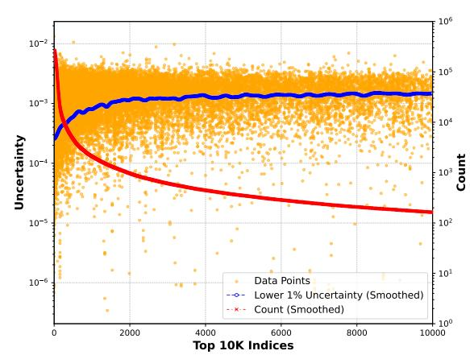

# Learning Probabilistic Distributions for CTR Uncertainty

Biho Kim

Kakao Corp.

Seongnam-si, Gyeonggi-do, Republic of Korea louie.kim@kakaocorp.com

# Abstract

Click-through rate (CTR) prediction is central to modern recommender and advertising systems, where prediction quality directly affects ranking, bidding, and downstream auction outcomes. Yet CTR modeling operates under extreme class imbalance, distribution shift from evolving users and content, and feedback loops, all of which amplify predictive uncertainty. Existing uncertainty estimators, often designed for multi-class settings, are not directly aligned with binary CTR and frequently incur substantial inference cost (e.g., multiple forward passes) or require architectural changes, limiting real-time deployment.

To address these challenges, we propose Learning Probabilistic Distributions (LPD), a method that extends model outputs to Beta distributions for joint CTR prediction and uncertainty quantification. By leveraging a reparameterization-based training strategy, LPD achieves efficient learning and inference with minimal changes to existing models. Experimental results on benchmark datasets demonstrate that LPD provides accurate predictions while effectively quantifying uncertainty, offering a practical and interpretable solution for improving reliability in CTR-based applications.

# CCS Concepts

• Information systems → Recommender systems; Online advertising.

# Keywords

Uncertainty, Click-Through Rate, Recommendation

#### ACM Reference Format:

Biho Kim. 2026. Learning Probabilistic Distributions for CTR Uncertainty. In Proceedings of the ACM Web Conference 2026 (WWW '26), April 13–17, 2026, Dubai, United Arab Emirates. ACM, New York, NY, USA, [4](#page-3-0) pages. <https://doi.org/10.1145/3774904.3792866>

# 1 Introduction

Recommendation systems are indispensable in modern digital platforms, playing a critical role in delivering personalized content. In advertising, accurate click-through rate (CTR) prediction is essential as it directly impacts bidding strategies, budget allocation, and overall performance. Given its significant influence on revenue and engagement, models must not only yield precise predictions but also provide reliable measures of predictive uncertainty to support informed decision-making.

[This work is licensed under a Creative Commons Attribution 4.0 International License.](https://creativecommons.org/licenses/by/4.0) WWW '26, Dubai, United Arab Emirates

© 2026 Copyright held by the owner/author(s). ACM ISBN 979-8-4007-2307-0/2026/04 <https://doi.org/10.1145/3774904.3792866>

CTR prediction presents several intrinsic challenges: the imbalanced nature of CTR data (rare clicks) complicates training, while dynamic user behavior and evolving ad content cause continuous distribution shifts, intensifying uncertainty. Moreover, real-time requirements demand efficient models, yet many existing uncertainty estimation methods are computationally intensive or require significant modifications to the model architecture.

These issues are acute in online advertising, where uncertainty in CTR predictions can substantially impact both advertisers and platform providers. In auction-based settings, inaccurate estimates can lead to suboptimal bidding, adversely affecting revenue and user satisfaction. Therefore, effectively quantifying uncertainty is vital for balancing exploration and exploitation and adjusting bid intensities in real time.

Recent advancements have explored various approaches, including ensemble methods [\[6\]](#page-3-1), Bayesian techniques like MC Dropout [\[2\]](#page-3-2), and deterministic strategies like Deep Deterministic Uncertainty (DDU) [\[8\]](#page-3-3). Although promising, their application to binary CTR prediction is limited by computational overhead and the need for substantial architectural alterations [\[9\]](#page-3-4).

To address these challenges, we propose Learning Probabilistic Distributions (LPD), a novel framework that extends traditional CTR prediction models by representing their outputs as Beta distributions. This formulation naturally aligns with the binary nature of CTR prediction, enabling the model to jointly estimate the expected CTR and its associated uncertainty in a unified manner. By leveraging a reparameterization-based training strategy, LPD integrates uncertainty estimation directly into the learning process, achieving both high predictive accuracy and robust uncertainty quantification with minimal additional computational cost.

The main contributions of this work are summarized as follows:

- (1) We propose a unified approach for CTR prediction that models outputs as Beta distributions, effectively incorporating uncertainty estimation into binary classification tasks.
- (2) We introduce a reparameterization-based training method that facilitates efficient optimization within a single forward pass.
- (3) We validate the effectiveness of the proposed method through comprehensive experiments on multiple benchmark datasets, demonstrating improvements in both predictive accuracy and uncertainty quantification.

# 2 Related Works

# 2.1 CTR Prediction

CTR prediction requires both memorization and generalization. Early models like Wide&Deep [\[1\]](#page-3-5) combined linear and deep components to address these dual objectives. Subsequently, models like DeepFM [\[3\]](#page-3-6) and Deep Interest Network (DIN) [\[14\]](#page-3-7) enhanced feature

interaction and user behavior modeling. Deep & Cross Network (DCN) [\[12\]](#page-3-8) and its variant DCNv2 [\[13\]](#page-3-9) further advanced high-order feature learning, becoming a standard for web-scale tasks. While these models excel in accuracy, they are deterministic and lack explicit uncertainty quantification, which is essential for robust decision-making.

#### 2.2 Uncertainty Estimation

Uncertainty methods are broadly Aleatoric (data-related) or Epistemic (model-related). Common approaches like MC Dropout [\[2\]](#page-3-2) and Deep Ensembles [\[6\]](#page-3-1) are computationally costly, requiring multiple inferences. Deterministic methods like DDU [\[8\]](#page-3-3) are faster but often ill-suited for binary CTR tasks. In the recommendation context, PRU [\[9\]](#page-3-4) analyzes residuals, but can struggle with the high sparsity and dynamic nature of CTR data, leading to suboptimal performance.

#### 2.3 Probabilistic Modeling

Probabilistic modeling is a powerful tool for uncertainty. Variational Autoencoders (VAEs) [\[5\]](#page-3-10) use latent distributions and the reparameterization trick [\[4\]](#page-3-11) for efficient learning. For binary tasks, Beta distributions provide a natural framework for capturing success probabilities [\[10\]](#page-3-12). Building on these insights, LPD adopts Beta distributions to extend CTR model outputs, providing a principled and efficient approach to jointly predict CTR and quantify uncertainty, making it well-suited for large-scale deployment.

# 3 Proposed Method

### 3.1 Overview

In this section, we introduce our proposed method, LPD, which integrates uncertainty estimation directly into CTR prediction models. The key idea is to extend the model's output from a deterministic point estimate to a probabilistic Beta distribution, requiring minimal modifications to existing CTR models. This approach provides a unified framework for efficiently obtaining both CTR predictions and their corresponding uncertainty estimates.

#### 3.2 Modeling Uncertainty with Beta Distribution Outputs

Traditional CTR models output a single scalar predicted click probability. In contrast, our method replaces this point estimate with two concentration parameters, �� and ��, defining a Beta distribution over a latent click propensity �� ∈ (0, 1), where �� ∼ Beta(��, ��) and �� ∼ Bernoulli(��). We obtain �� and �� via a simple extension of the output head, applying softplus and adding 1 to ensure ��, �� &gt; 1. The resulting distribution yields the expected CTR through its mean and captures inherent uncertainty through its variance. This is wellsuited for binary CTR prediction since the Beta distribution is a natural prior over probabilities and is conjugate to the binomial likelihood, providing a principled and interpretable uncertainty representation while remaining compatible with standard CTR frameworks.

#### Algorithm 1 Training Procedure for LPD

Input: input features, ��, ��

Output: loss

1: ��, �� ← model(input) 2: ��\_ℎ����\_�������� ← Beta(��, ��) 3: ��\_ℎ���� ← ��\_ℎ����\_�������� .rsample() 4: loss ← BCE(��\_ℎ����, ��) − �� · ��\_ℎ����\_�������� .entropy() 5: return loss

#### 3.3 Efficient Learning via Reparameterization Trick

We model a latent click propensity �� ∈ (0, 1) with a hierarchical formulation: �� ∼ Beta(��, ��) and �� ∼ Bernoulli(��). Under this view, a statistically natural objective is to maximize the expected Bernoulli log-likelihood under the predicted Beta distribution,

E��∼Beta(��,��) log ��(�� | ��) = E��∼Beta(��,��) log Bernoulli(�� | ��) . (1)

In practice, we approximate this expectation with a single differentiable sample ��ˆ ∼ Beta(��, ��) obtained via the reparameterization (pathwise-gradient) trick (e.g., rsample), yielding a Binary Cross Entropy (BCE) term with minimal overhead:

LBCE(��, ��) ≈ − log Bernoulli(�� | ��ˆ) = BCE(��, �� ˆ ). (2)

This choice avoids two pitfalls: (i) using only the mean �� ��+�� provides little incentive to represent uncertainty (variance), and (ii) directly optimizing the Beta negative log-likelihood often becomes numerically unstable when predictions concentrate near the boundary labels 0 or 1.

Finally, we add an entropy regularizer to discourage overly confident (near-deterministic) distributions and to promote meaningful predictive dispersion:

L = LBCE(��, ��) − �� H (Beta(��, ��)) , (3)

where �� controls the strength. Since the Beta entropy decreases as the distribution becomes highly concentrated (large �� +��), this term helps prevent variance collapse and improves robustness of uncertainty estimation. The overall training procedure is summarized in Algorithm [1.](#page-1-0)

### 3.4 Uncertainty Quantification

To quantify uncertainty, we adopt a measure based on the coefficient of variation [\[7\]](#page-3-13), which normalizes the variance of the Beta distribution by its mean:

Uncertainty = �� 2 �� (4)

This measure is used because the variance of a Beta distribution inherently increases with its mean. By normalizing the variance, we provide a consistent and interpretable metric that captures the relative uncertainty of the CTR prediction. This is especially useful in real-world scenarios where predicted CTRs span a wide range of values.

# 4 Experiment

# 4.1 Experimental Settings

4.1.1 Datasets. We evaluated our methods on three benchmarks, all preprocessed via the BARS framework [\[15\]](#page-3-14): MovieLens[1](#page-2-0) (2.0M instances, 3 features), Avazu[2](#page-2-1) (40.4M instances, 22 features), and Criteo[3](#page-2-2) [\[11\]](#page-3-15) (45.8M instances, 39 features).

4.1.2 Methods Used for Comparison. We compared LPD (our proposed method) against prominent uncertainty quantification methods: MC Dropout [\[2\]](#page-3-2), a Bayesian approximation using 10 inference passes; Deep Ensembles [\[6\]](#page-3-1), using an ensemble of 5 models; DDU (Deep Deterministic Uncertainty) [\[8\]](#page-3-3), a deterministic method analyzing feature distributions; and PRU (Predictive Residual Uncertainty) [\[9\]](#page-3-4), which uses residual analysis.

4.1.3 Implementation and Reproducibility. We implemented all methods using the FuxiCTR framework [\[15\]](#page-3-14) with DCNv2 [\[13\]](#page-3-9) as the backbone model. To ensure fair comparison, we followed the standardized BARS benchmark configurations for preprocessing, dataset splits, and training protocols. For baseline methods, MC Dropout utilized 10 inference passes and Deep Ensembles used 5 models. For PRU, we experimented with GMM component values 4 or 5, following the range specified in its original paper [\[9\]](#page-3-4). The hyperparameters for LPD remained consistent across all experiments, with the entropy regularizer �� fixed at 0.001.

4.1.4 Metrics. We adopt the metrics from PRU [\[9\]](#page-3-4) to assess reliability by measuring performance improvement after filtering out high-uncertainty samples. We report results in basis points (bps, where 1 bps = 0.01%).

- AUC-X: Measures the AUC improvement after removing the top (100-X)% most uncertain samples. For example, AUC-95 removes the top 5%, AUC-90 removes the top 10%, and AUC-80 removes the top 20%.
- PRAUC-90: Measures the PRAUC improvement (for minority class detection) after removing the top 10% most uncertain samples.

Both metrics highlight the model's ability to leverage uncertainty for improving prediction reliability.

# 4.2 Results

4.2.1 Quantitative Evaluation. Table [1](#page-2-3) shows that LPD consistently provides robust performance, especially on the complex Avazu and Criteo datasets where other methods falter. Methods like Deep Ensemble and DDU are less effective on sparse, high-dimensional CTR data. PRU, while strong on simpler data, deteriorates significantly on Criteo, likely due to GMMs' susceptibility to uneven sample distributions. LPD's adaptability makes it a reliable solution for real-world tasks.

4.2.2 Unified pCTR and Uncertainty Estimation. LPD uniquely integrates prediction and uncertainty estimation. Table [2](#page-2-4) shows LPD achieves this unified goal effectively, performing nearly identically

Table 1: Performance Comparison Across Datasets (Metrics in Basis Points)

| Dataset Method | AUC-95  | AUC-90  | AUC-80  | PRAUC-90 |
|----------------|---------|---------|---------|----------|
| MC Dropout     | 41.21   | 77.89   | 135.67  | 123.49   |
| Deep Ensemble  | −40.56  | −92.04  | −261.94 | −272.67  |
| DDU MovieLens  | 11.54   | 9.94    | −57.38  | 2.30     |
| PRU            | 35.95   | 62.42   | 102.81  | 97.13    |
| LPD            | 41.79   | 73.38   | 125.31  | 117.48   |
| MC Dropout     | −1.06   | −6.43   | −29.06  | 15.61    |
| Deep Ensemble  | −177.12 | −223.97 | −340.31 | −1018.48 |
| DDU Avazu      | −62.04  | −101.31 | −148.17 | −294.42  |
| PRU            | 52.89   | 84.80   | 131.47  | −16.85   |
| LPD            | 47.13   | 87.31   | 171.35  | 115.94   |
| MC Dropout     | 34.40   | 72.46   | 150.37  | 85.69    |
| Deep Ensemble  | −236.18 | −406.42 | −663.27 | −1715.67 |
| DDU Criteo     | −51.28  | −84.41  | −139.57 | −252.16  |
| PRU            | −64.23  | −109.52 | −171.93 | −556.13  |
| LPD            | 59.28   | 122.24  | 255.05  | 186.06   |

Table 2: Performance comparison (raw AUC scores) of unified models at various filtering thresholds.

| Data pCTR          | Uncert.   | AUC-100 | AUC-95 | AUC-90 | AUC-80 |
|--------------------|-----------|---------|--------|--------|--------|
| Baseline MovieLens | LPD       | 0.9691  | 0.9732 | 0.9764 | 0.9816 |
| Deep Ens.          | Deep Ens. | 0.4587  | 0.5305 | 0.6036 | 0.6774 |
| LPD                | LPD       | 0.9679  | 0.9722 | 0.9754 | 0.9802 |
| Baseline Avazu     | LPD       | 0.7635  | 0.7682 | 0.7722 | 0.7806 |
| Deep Ens.          | Deep Ens. | 0.5642  | 0.5918 | 0.5917 | 0.5865 |
| LPD                | LPD       | 0.7619  | 0.7666 | 0.7707 | 0.7790 |
| Baseline Criteo    | LPD       | 0.8141  | 0.8200 | 0.8263 | 0.8396 |
| Deep Ens.          | Deep Ens. | 0.5665  | 0.5640 | 0.5567 | 0.5457 |
| LPD                | LPD       | 0.8140  | 0.8200 | 0.8263 | 0.8396 |

Table 3: PRAUC-90 (bps) results using partial training data.

| Data Method          | 20%     | 40%     | 60%     | 80%     | 100%    |
|----------------------|---------|---------|---------|---------|---------|
| MC Dropout MovieLens | 106.41  | 113.74  | 112.61  | 120.40  | 123.49  |
| PRU                  | 83.83   | 112.85  | 123.72  | 117.41  | 97.13   |
| LPD                  | 113.06  | 115.42  | 118.36  | 119.80  | 117.48  |
| MC Dropout Avazu     | 21.59   | 66.53   | 47.03   | −11.42  | 15.61   |
| PRU                  | 23.61   | −125.98 | 72.88   | −94.53  | −16.85  |
| LPD                  | 58.46   | 86.93   | 90.72   | 103.93  | 115.94  |
| MC Dropout Criteo    | 86.52   | 83.90   | 87.61   | 90.54   | 85.69   |
| PRU                  | −534.02 | −537.37 | −530.03 | −522.55 | −556.13 |
| LPD                  | 184.11  | 184.30  | 184.41  | 185.26  | 186.06  |

to the baseline pCTR model while simultaneously providing robust uncertainty estimates. On the complex Criteo dataset, LPD maintains this strong performance for both tasks. In contrast, Deep Ensembles, the only other comparable unified method, suffers a severe drop in AUC, highlighting the limitations of applying Gaussian assumptions to this task.

4.2.3 Robustness Analysis. Table [3](#page-2-5) demonstrates LPD's robustness to varying training data proportions. LPD's performance consistently scales with data size. This contrasts with PRU, which shows

1<https://grouplens.org/datasets/movielens>

2<https://www.kaggle.com/c/avazu-ctr-prediction>

3[http://labs.criteo.com/downloads/2014-kaggle-displayadvertising-challenge](http://labs.criteo.com/downloads/2014-kaggle-displayadvertising-challenge-dataset)[dataset](http://labs.criteo.com/downloads/2014-kaggle-displayadvertising-challenge-dataset)

Figure 1: Uncertainty analysis for top 10K 'C3' IDs (Criteo). Lower 1% uncertainty (blue) is inversely correlated with feature frequency (red), confirming LPD's appropriate confidence scaling.

Table 4: AUC-80 (in Basis Points) across different �� values.

| Dataset   | 10 − 1  | 10 − 2  | 10 − 3 | 10 − 4 | 10 − 5 | 10 − 6 |
|-----------|---------|---------|--------|--------|--------|--------|
| MovieLens | 32.23   | 120.69  | 124.26 | 123.06 | 123.66 | 120.77 |
| Avazu     | −390.90 | −160.50 | 160.36 | 138.50 | 124.96 | 104.42 |
| Criteo    | −327.10 | 71.02   | 256.38 | NaN    | NaN    | NaN    |

significant variability and performance degradation, especially on Criteo and Avazu, highlighting its sensitivity to uneven or sparse data distributions where GMMs struggle.

4.2.4 Uncertainty Analysis. Figure [1](#page-3-16) analyzes uncertainty for the high-cardinality 'C3' feature in Criteo. It shows that LPD's uncertainty (Lower 1% line) is inversely correlated with the feature's occurrence count, demonstrating that the model becomes appropriately more confident as more training data for a feature is available.

4.2.5 Ablation on the Entropy Regularization ��. As shown in Table [4,](#page-3-17) AUC-80 peaks at �� = 10−3 . Over-regularization (�� ≥ 10−2 ) degrades performance, while under-regularization (�� ≤10−4 ) yields overconfident posteriors and instability on Criteo. Sensitivity increases with dataset complexity, confirming �� = 10−3 as a robust default.

4.2.6 Efficiency and Scalability. LPD achieves ��(1) inference via a single forward pass (�� = 1), significantly outperforming MC Dropout (�� = 10) and Deep Ensembles (�� = 5). Unlike deterministic baselines (DDU, PRU) that require costly feature density estimation or GMM-based residual analysis, LPD eliminates postprocessing overhead and remains robust against CTR data sparsity. Architecturally, LPD is extremely lightweight, adding only a single scalar parameter (��), which results in a negligible parameter increase of &lt; 0.001%.

# 5 Conclusion

In this paper, we introduced Learning Probabilistic Distributions (LPD), a novel approach that integrates uncertainty quantification into CTR prediction models. By representing model outputs as Beta distributions, LPD offers a principled framework for jointly predicting CTR and quantifying uncertainty with minimal changes to the model architecture. Experimental results on complex datasets like Avazu and Criteo validate the effectiveness of LPD, which consistently delivers superior and more robust performance compared to ensemble-based and Bayesian approaches.

The proposed method provides several practical benefits. LPD requires minimal modifications to existing CTR models and achieves efficient prediction and uncertainty estimation in a single forward pass, making it suitable for real-time, large-scale applications. Furthermore, using the Beta distribution, which is tailored for binary outcomes, aligns closely with the needs of CTR prediction tasks and introduces an interpretable uncertainty metric for reliable decisionmaking.

Future research will focus on extending LPD to multi-task settings and dynamic, real-time environments, such as adaptive systems and interactive user modeling. Additionally, developing intuitive tools for visualizing uncertainty could further enhance decision-making in recommendation and advertising platforms.

# References

[1] H.-T. Cheng, L. Koc, J. Harmsen, T. Shaked, T. Chandra, H. Aradhye, G. Anderson, G. Corrado, W. Chai, and M. et al. Ispir. 2016. Wide & Deep Learning for Recommender Systems. In Proceedings of the 1st Workshop on Deep Learning for Recommender Systems (DLRS '16). ACM, Boston, USA, 7–10. [2] Y. Gal and Z. Ghahramani. 2016. Dropout as a Bayesian Approximation: Representing Model Uncertainty in Deep Learning. In Proceedings of the 33rd International Conference on Machine Learning (ICML). PMLR, New York, NY, USA, 1050–1059. [3] H. Guo, R. Tang, Y. Ye, Z. Li, and X. He. 2017. DeepFM: A Factorization-Machine Based Neural Network for CTR Prediction. arXiv preprint arXiv:1703.04247 (2017). [4] D.P. Kingma and M. Welling. 2014. Stochastic Gradient VB and the Variational Auto-Encoder. In Proceedings of the 2nd International Conference on Learning Representations (ICLR). Banff, Canada. [5] D. P. Kingma and M. Welling. 2014. Auto-Encoding Variational Bayes. In Proceedings of the 2nd International Conference on Learning Representations (ICLR '14). Banff, Canada, 1–14. [6] B. Lakshminarayanan, A. Pritzel, and C. Blundell. 2017. Simple and Scalable Predictive Uncertainty Estimation using Deep Ensembles. In Advances in Neural Information Processing Systems (NeurIPS), Vol. 30. Curran Associates, Inc., Long Beach, CA, USA, 6402–6413. [7] Russell Lande. 1977. On Comparing Coefficients of Variation. Systematic Zoology 26, 2 (1977), 214–217. [doi:10.2307/2412845](https://doi.org/10.2307/2412845) [8] J. Mukhoti, A. Kirsch, J. van Amersfoort, P.H.S. Torr, and Y. Gal. 2023. Deep Deterministic Uncertainty: A New Simple Baseline. In Proceedings of the IEEE/CVF Conference on Computer Vision and Pattern Recognition (CVPR). IEEE, New Orleans, LA, USA, 24384–24394. [9] C. Paliwal, A. Majumder, and S. Kaveri. 2024. Predictive Relevance Uncertainty for Recommendation Systems. In Proceedings of the ACM Web Conference 2024 (WWW '24). ACM, Singapore, 3900–3909. [10] F.J.R. Ruiz, M.K. Titsias, and D.M. Blei. 2016. The Generalized Reparameterization Gradient. In Advances in Neural Information Processing Systems (NeurIPS '16). Barcelona, Spain, 460–468. [11] Jean-Baptiste Tien, joycenv, and Olivier Chapelle. 2014. Display Advertising Challenge. [https://kaggle.com/competitions/criteo-display-ad-challenge.](https://kaggle.com/competitions/criteo-display-ad-challenge) Kaggle. [12] R. Wang, B. Fu, G. Fu, and M. Wang. 2017. Deep & Cross Network for Ad Click Predictions. In Proceedings of the 2017 AdKDD & TargetAd Workshop (ADKDD '17). ACM, Halifax, Canada, 12–21. [13] R. Wang, S. Zhang, X. Wang, J. Xu, X. Zhao, and M. Wang. 2021. DCNv2: Improved Deep & Cross Network and Practical Lessons for Web-scale Learning to Rank Systems. In Proceedings of the 14th ACM International Conference on Web Search and Data Mining (WSDM '21). ACM, Virtual Event, 13–21. [14] G. Zhou, N. Mou, Y. Fan, Q. Pi, W. Bian, C. Zhou, and K. Gai. 2018. Deep Interest Network for Click-Through Rate Prediction. In Proceedings of the 24th ACM SIGKDD International Conference on Knowledge Discovery & Data Mining (KDD '18). ACM, London, UK, 1059–1068. [15] J. Zhu, Q. Dai, L. Su, R. Ma, J. Liu, G. Cai, X. Xiao, and R. Zhang. 2022. BARS: Towards Open Benchmarking for Recommender Systems. In Proceedings of the 45th International ACM SIGIR Conference on Research and Development in Information Retrieval (SIGIR '22). ACM.