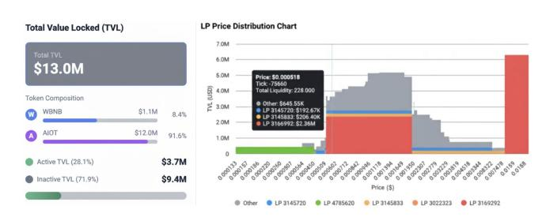
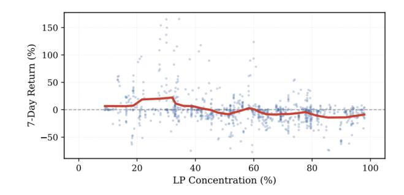

# Structure Over Scale: Diagnosing Liquidity Fragility in Concentrated-Liquidity AMMs

Qiangqiang Liu Binance Dubai, United Arab Emirates codi.l@binance.com

Runfa Jiang Binance Manama, Bahrain leslie.j@binance.com

Qian Huang Binance Hong Kong, China qian.huang@binance.com

Frank Fan Binance Hong Kong, China frank.f@binance.com

Kunpeng Ren National University of Singapore Singapore, Singapore dcsrenk@nus.edu.sg

Wei Cai University of Washington Tacoma, WA, USA weicaics@uw.edu

# Abstract

We investigate whether liquidity stability in Concentrated Liquidity Automated Market Makers (CLAMMs) is determined by how liquidity is structured (who owns it and where it is placed) rather than by its total value locked (TVL). Using 4,454 pool-day observations from PancakeSwap V3 on BNB Chain, we show that LP ownership concentration is the primary structural risk: pools in which a single LP controls more than 75% of active liquidity exhibit substantially lower seven-day returns and 2.3× higher crash probability, while TVL has no predictive power. We further find that effective buffer liquidity (moderate depth positioned 5–30% from the current price and accounting for at least 20% of active TVL) functions as a shock absorber; yet only 0.8% of pools maintain such buffers, and none of them experience crashes. The absence of effective buffers, combined with either hyper-concentrated or overly dispersed liquidity, produces a U-shaped fragility pattern in which both extremes are unstable and only balanced structures remain resilient. These results demonstrate that in CLAMMs, structure, not scale, governs market stability.

# CCS Concepts

• Social and professional topics → Financial technology.

# Keywords

DeFi, Concentrated-Liquidity AMMs, Liquidity Fragility, Structural Risk, Market Microstructure

#### ACM Reference Format:

Qiangqiang Liu, Runfa Jiang, Qian Huang, Frank Fan, Kunpeng Ren, and Wei Cai. 2026. Structure Over Scale: Diagnosing Liquidity Fragility in Concentrated-Liquidity AMMs. In Proceedings of the ACM Web Conference 2026 (WWW '26), April 13–17, 2026, Dubai, United Arab Emirates. ACM, New York, NY, USA, [4](#page-3-0) pages.<https://doi.org/10.1145/3774904.3792867>

[This work is licensed under a Creative Commons Attribution 4.0 International License.](https://creativecommons.org/licenses/by/4.0) WWW '26, Dubai, United Arab Emirates © 2026 Copyright held by the owner/author(s). ACM ISBN 979-8-4007-2307-0/2026/04 <https://doi.org/10.1145/3774904.3792867>

### 1 Introduction

Decentralized exchanges (DEXs) have become a core component of decentralized finance (DeFi), enabling permissionless and automated trading. CLAMMs introduced by Uniswap V3 [\[8\]](#page-3-1), allow liquidity providers (LPs) to allocate capital within chosen price intervals, so that only ranges covering the current price contribute to active liquidity. This design improves capital efficiency but introduces discontinuities when prices move beyond active bands, creating an efficiency–stability trade-off absent in uniform constantproduct AMMs such as Uniswap V2. By late 2025, concentratedliquidity models have become the de facto standard, holding \$1.59B on Uniswap V3 (38% of total) and \$1.45B on PancakeSwap V3 (41%)[1](#page-0-0) .

A case in our dataset illustrates the fragility of concentratedliquidity design. On July 9, 2025, the Bedrock (BR) pool on PancakeSwap V3 collapsed within minutes: 83 LPs withdrew \$29M from a \$49M pool, wiping out 47.9% of its value. Over 80% of liquidity sat in ultra-narrow 0.01% ranges, so when the price moved slightly, active depth did not decline gradually—it vanished, falling from near-maximum to below 20% in a few ticks. With no buffer layers to absorb the transition, visible deactivations triggered a withdrawal cascade.

Traditional DeFi metrics often treat TVL as a proxy for stability, yet TVL captures only the quantity of liquidity, not its structure. In CLAMMs, stability depends on how liquidity is distributed—who owns it and where it is placed—making endogenous design fragility more important than external forces such as MEV or sandwich attacks.

Our results reveal two structural drivers of instability: (1) Ownership concentration—when few LPs control most active liquidity, synchronized exits become likely, producing lower returns and higher crash rates; (2) Missing buffer liquidity—most pools lack transitional depth, while pools with moderate buffers (5–30%) experience no crashes, generating a U-shaped fragility pattern where both hyper-concentrated and over-dispersed configurations are unstable.

These findings motivate a structural-risk perspective: in CLAMMs, it is structure, not scale, that ultimately determines stability.

1[https://app.uniswap.org/explore/pools;](https://app.uniswap.org/explore/pools)<https://pancakeswap.finance/info>

#### 2 Related Work

CLAMMs mechanisms. Uniswap V3 [\[8\]](#page-3-1) lets liquidity providers (LPs) choose price ranges; only positions whose ranges cover the current market price contribute to active liquidity. When the price crosses a range boundary, the corresponding position deactivates, producing discrete drops in available depth. Prior work shows that active provision in Uniswap V3 requires frequent rebalancing and yields highly variable LP returns [\[6\]](#page-3-2), analyzes the capital-efficiency gains of range placement [\[5\]](#page-3-3), and examines loss–rebalancing tradeoffs [\[7\]](#page-3-4). However, these studies focus on efficiency and profitability rather than stability: to our knowledge, none constructs interpretable on-chain structural-risk metrics or quantifies the systemic impact of missing buffer liquidity near the market price.

DeFi security. Most security research models manipulation as an exogenous process (e.g., frontrunning and sandwiching) [\[3,](#page-3-5) [4\]](#page-3-6). We instead highlight endogenous fragility that arises from transparent, deterministic CLAMM configurations: who owns the liquidity and where it is placed in price space. This perspective aligns with classical market-microstructure theory [\[1\]](#page-3-7), where stability depends not on total value locked (TVL) alone but on the distribution of liquidity ownership and placement.

# 3 Data, Features and Methodology

# 3.1 Data Collection

We collect position-level and market data for PancakeSwap V3 on the BNB Smart Chain in September 2025. On-chain transactional records are obtained from NodeReal[2](#page-1-0) , a high-performance blockchain infrastructure provider offering archive node access for the BNB Smart Chain. The dataset includes all relevant contract events: Mint and Burn (position creation and closure), Increas eLiquidity and DecreaseLiquidity (liquidity adjustments), S wap (token exchanges between traders, reflecting realized trades and price movements), and Transfer (position token transfers). Together, these events capture the complete lifecycle of each liquidity position and enable reconstruction of pool-level activity. Token prices are derived directly from on-chain swap transactions, which record realized exchange rates between trading pairs. All data are publicly available on-chain and contain no personally identifiable information. Address data are pseudonymous by blockchain design, ensuring compliance with open-data and privacy standards.

After filtering, the dataset includes 16,480 positions across 4,454 liquidity pools. Filtering follows standard DeFi data-cleaning practices [\[2\]](#page-3-8):

(1) Primary PancakeSwap V3 pool selection. Each token may have multiple liquidity pools across different versions or trading pairs. Since our analysis focuses on how PancakeSwap V3 liquidity distribution affects price dynamics, we retain tokens whose dominant pool resides on V3. An empirical threshold is applied: if a single V3 pool accounts for more than 80% of the token's total TVL, it is considered the main venue influencing its price formation.

(2) Data validation. We exclude positions with data-integrity issues, such as malformed tick values inconsistent with the Uniswap V3 tick-spacing specification, zero-liquidity entries resulting from complete withdrawals or failed transactions, and decoding errors caused by non-standard contract implementations.

(3) Liquidity persistence (14-day lifespan). A pool's lifespan is defined by its active trading period, which is measured from the first to the last Swap event and considered ended once trading ceases for an extended time. Pools with less than 14 days of observed activity are excluded to remove short-lived or fraudulent pools (e.g., rug-pull schemes) and to ensure sufficient observation windows for forward-return computation.

#### 3.2 Feature Construction

To characterize the fragility of CLAMM liquidity structures, we construct three complementary structural risk indicators. Figure [1](#page-1-1) illustrates these indicators using an AIOT/WBNB pool.

Figure 1: Structural risk analysis of AIOT/WBNB pool (\$13.0M TVL). Left: TVL composition showing 91.6% AIOT vs 8.4% WBNB (11:1 sell-to-buy imbalance), with only 28.1% active liquidity. Right: Liquidity distribution across price ranges. LP 3168992 dominates 67.6% of active liquidity, while a \$6.31M block sits at \$0.019 with significant voids in between.

(1) LP Ownership Concentration. This indicator measures the proportion of active liquidity contributed by the largest LP. Active liquidity refers to the liquidity provided by LP positions whose price ranges cover the current market price. High concentration implies single-point failure risk. As shown in Figure [1,](#page-1-1) LP 3168992 contributes 67.6% of active liquidity. If this LP withdraws, active liquidity would drop by over two-thirds.

(2) Liquidity Spatial Distribution. This indicator measures how liquidity is distributed across the price space. CLAMMs discretize price space by ticks, where each tick represents a 0.01% price change (�� = 1.0001tick). Since each LP position provides liquidity only within its specified price range [��lower, ��upper], the total liquidity at any tick �� is the aggregation of all LP positions active at that tick:

��tick�� = ∑︁ �� ∈A�� ����

where A�� denotes the set of all LP positions whose price range covers tick ��, and ���� is the liquidity provided by position ��.

For a given price range, the liquidity ratio is defined as:

liq\_ratio[range] = Í ��∈range ��tick�� ��active × 100%

where ��active is the total active liquidity at the current tick. If liquidity concentrates at immediate proximity, small price movements

2<https://nodereal.io>

may penetrate the liquidity layer; if substantial liquidity exists at distant ranges with empty intermediate zones, fragmentation occurs. Figure [1](#page-1-1) shows a fragmented distribution: active liquidity clusters near the current price, while a \$6.31M block sits at 27× the current price with significant voids in between. Only 28.1% of total TVL remains active.

(3) Limit Order Directional Asymmetry. For example, if an LP sets a price range of \$0.001–\$0.002 and the current price is \$0.0007 (below the min price of \$0.001), the LP holds entirely \$AIOT, waiting for the price to rise above \$0.001 to sell, constituting a limit sell order. If the current price is \$0.003 (above the max price of \$0.002), the LP holds entirely \$WBNB, waiting for the price to fall below \$0.002 to buy, constituting a limit buy order. We measure the balance of buy-sell forces by calculating the proportion of limit buy orders and limit sell orders relative to total TVL. Figure [1](#page-1-1) shows that \$AIOT account for 91.6% in total TVL, while \$WBNB account for only 8.4% in total TVL. This indicates that the min prices of most LP positions are above the current price, with liquidity existing as limit sell orders. Once the price rises, substantial selling pressure will be released, while buy-side support remains severely insufficient.

These three dimensions collectively characterize the AIOT/WBNB pool's risk: high ownership concentration (67.6%), fragmented spatial distribution (71.9% inactive), and directional imbalance (\$AIOT value/ \$WBNB value = 91.6% / 8.4% = 11), all pointing to a liquidity structure prone to instability.

#### 4 Results

Throughout our analysis, we focus on seven-day windows as they balance short-term market dynamics with sufficient time for structural risks to manifest, while filtering out daily noise. The seven-day forward return serves as the continuous performance metric. We use Pearson's correlation coefficient (��) to quantify the strength and direction of linear relationships between structural features and returns, where larger absolute values indicate stronger associations. Statistical significance is assessed using ��-values: small values (e.g., �� &lt; 0.05) denote significant relationships, while large values indicate no meaningful association.

#### 4.1 LP Concentration Dominates Risk

As shown in Figure [2,](#page-2-0) the relationship between LP concentration and seven-day returns is not a simple monotonic negative pattern, but instead exhibits a clear segmented structure. The curve displays a distinct inflection around a concentration level of approximately 40%, which we adopt as the breakpoint for a piecewise examination of the return–concentration relationship.

When LP concentration remains below 40%, no significant linear pattern is observed between concentration and returns ( �� = 0.0592, �� = 0.3568 ). In this regime, liquidity is relatively dispersed across LPs, limiting the possibility of synchronized withdrawal behavior. The slight upward slope in the curve reflects random market fluctuations rather than meaningful structural effects. Once LP concentration exceeds 40%, the relationship shifts markedly to a significant negative correlation ( �� = −0.1755∗∗∗, �� = 10−6 ). This structural change indicates that liquidity ownership begins to enter a dominance stage in which the actions of major LPs can materially

Figure 2: LP concentration versus seven-day returns with LOWESS smoothing. Blue dots represent individual poolday observations, and the red line represents the LOWESSsmoothed curve.

influence the pool's active depth, causing returns to decline systematically. For the full sample, the negative association becomes stronger ( �� = −0.3081∗∗∗ ), reflecting the greater prevalence of high-concentration pools and their disproportionate influence on overall return dynamics. Overall, the evidence demonstrates that LP concentration affects performance in a nonlinear and stagedependent manner, with the 40% threshold representing a clear structural turning point.

#### 4.2 Buffer Zones and the U-Shaped Fragility Curve

An effective buffer zone refers to the portion of liquidity that remains active within the mid-range distance from the current price (e.g., 5%–30%). This liquidity stays in the market even as prices fluctuate, providing a transitional layer of active depth. The presence of such buffers prevents liquidity gaps when prices move into adjacent ranges and thus constitutes an essential component of structural stability.

Across all pools, only 35 pools (0.8%) allocate an effective buffer zone of 5%–30%—where "effective" indicates that the buffer accounts for more than 20% of active TVL—and none of these pools experienced crashes. We define crash events as cases where a pool's price drops by more than 30% within a seven-day window (e.g., from day �� to �� + 7). In contrast, the crash rate rises to 8.8% among pools lacking any buffer zone. The buffer layer acts as a shock absorber: it preserves continuous depth during price movements and prevents discrete liquidity jumps that trigger panic. As illustrated by the previous \$BR case, the complete absence of a buffer zone caused slippage to spike abruptly when ultra-narrow positions deactivated, leading to a collapse in active liquidity.

A "over-dispersion paradox" also emerges: pools with little effective liquidity near the current price (i.e., highly dispersed liquidity) and no buffer zone perform the worst (return of –4.6%, crash rate of 11.0%), exhibiting even greater fragility than extremely concentrated pools (return of –1.99%, crash rate of 4.1%). This pattern forms a characteristic U-shaped risk structure: both excessive concentration and excessive dispersion amplify fragility, whereas only a very small fraction of pools maintain a relatively balanced liquidity structure and remain stable.

#### 4.3 Directional Liquidity Asymmetry

We analyze how the balance between limit sell and limit buy orders influences pool stability. In CLAMMs, when the current price falls below an LP's minimum price, the LP holds only the base token, creating a limit sell position; conversely, when the current price exceeds the LP's maximum price, the LP holds only the quote token, forming a limit buy position.

Descriptive statistics show a moderate directional imbalance across pools: the mean limit-sell ratio is 27.69%, the mean limit-buy ratio is 12.16%, and mean active liquidity is 60.15%. Notably, 14.3% of pools exhibit extreme sell-side dominance (more than 80% limit sell orders), while 4.7% display extreme buy-side dominance (more than 80% limit buy orders).

The linear relationship between the limit-sell ratio and sevenday returns is negligible (�� = 0.0020), suggesting that directional asymmetry alone is a much weaker predictor of performance compared with LP ownership concentration. Nonetheless, the extreme tails remain informative: pools with severe directional imbalance, regardless of whether dominated by sell-side or buy-side liquidity, are substantially more prone to crashes.

#### 4.4 Mechanistic Interpretation

Our findings challenge the conventional "liquidity depth" paradigm in DeFi. TVL shows virtually no correlation with price outcomes (�� = −0.016), indicating that total liquidity alone does not predict stability. Instead, fragility arises from the structure of liquidity—its ownership distribution, spatial placement, and the presence (or absence) of transitional depth between active and inactive regions.

(1) Ownership concentration versus spatial configuration. Ownership concentration governs coordination risk. When most active liquidity is controlled by few LPs, withdrawals become highly synchronized, generating abrupt drops in effective depth even when TVL is large. Spatial configuration introduces an additional channel: liquidity densely clustered at a single tick deactivates in bulk when prices move slightly, while excessively dispersed liquidity leaves the near-price region functionally illiquid. These two dimensions explain why pools with similar TVL exhibit sharply different performance under stress.

(2) Buffer-zone mechanism and the U-shaped fragility pattern. Buffer liquidity provides the missing "shock absorber" in CLAMMs. When prices transition across ranges without sufficient mid-range depth, active liquidity collapses discontinuously rather than decaying smoothly. Pools with moderate buffers (5–30%) exhibit no crashes, confirming that transitional liquidity, not total depth, prevents discrete structural breaks. This produces the U-shaped fragility curve: hyper-concentrated pools suffer from bulk deactivation and coordinated exits, while over-dispersed pools lack near-range support. Only balanced liquidity distributions achieve robustness, confirming that CLAMMs stability is fundamentally structure-driven rather than quantity-driven.

# 4.5 Limitations and Future Work

Our analysis uses PancakeSwap V3 data from September 2025, providing a representative but time-limited view of concentratedliquidity behavior. A broader dataset covering multiple months and

market regimes would allow us to test the temporal robustness of the structural-risk patterns identified here.

A second limitation concerns temporal granularity: daily position states prevent us from observing high-frequency dynamics such as tick-level price transitions, rapid band deactivations, or short-lived liquidity cycling. Intraday data may reveal transitional states and shock-propagation mechanisms that daily snapshots smooth over.

Finally, although ownership concentration is strongly associated with synchronized LP exits, our dataset cannot distinguish reactive withdrawals from strategic behavior. Large LPs may coordinate liquidity changes with spot trading or futures positioning, potentially amplifying structural shocks. Future work could incorporate cross-market transaction timing, derivatives exposure, and LP-level behavioral clustering to separate passive responses from coordinated strategies and better understand how CLAMMs design interacts with broader market structure.

#### 5 Conclusion

We show that stability in concentrated-liquidity AMMs is determined not by how much liquidity a pool holds, but by how that liquidity is structured. TVL has no predictive power for returns or crashes, whereas ownership concentration, spatial allocation, and the presence of buffer liquidity consistently explain fragility.

Three patterns emerge: concentrated ownership enables exits, missing buffers create discontinuous depth losses, and both hyperconcentrated and over-dispersed liquidity configurations exhibit elevated crash risk. These insights form a structural-risk framework that captures CLAMMs instability more accurately than traditional depth-based metrics.

A simple model combining concentration and buffer indicators reliably predicts crash events, suggesting clear design implications: protocols should encourage balanced buffer maintenance and improve visibility of liquidity concentration. As DeFi scales, robust liquidity structures (not merely deeper pools) will be critical for sustainable AMM stability.

#### References

[1] Jun Aoyagi and Yuki Ito. 2025. Coexisting Exchange Platforms: Limit Order Books and Automated Market Makers. Journal of Political Economy Microeconomics 3, 3 (2025), 000–000. [2] Massimo Bartoletti, James Hsin-yu Chiang, and Alberto Lluch Lafuente. 2021. SoK: Lending Pools in Decentralized Finance. In International Conference on Financial Cryptography and Data Security. Springer, 553–578. [3] Michael Brolley and Marius Zoican. 2023. On-Demand Fast Trading on Decentralized Exchanges. Finance Research Letters 51 (2023), 103350. [4] Philip Daian, Steven Goldfeder, Tyler Kell, Yunqi Li, Xueyuan Zhao, Iddo Bentov, Lorenz Breidenbach, and Ari Juels. 2020. Flash Boys 2.0: Frontrunning in Decentralized Exchanges, Miner Extractable Value, and Consensus Instability. In 2020 IEEE Symposium on Security and Privacy (SP). IEEE, 910–927. [5] Robin Fritsch. 2021. Concentrated Liquidity in Automated Market Makers. In Proceedings of the 2021 ACM CCS Workshop on Decentralized Finance and Security. 15–20. [6] Lioba Heimbach, Eric Schertenleib, and Roger Wattenhofer. 2022. Risks and Returns of Uniswap V3 Liquidity Providers. In Proceedings of the 4th ACM Conference on Advances in Financial Technologies. 89–101. [7] Jason Milionis, Ciamac C Moallemi, Tim Roughgarden, and Anthony Lee Zhang. 2022. Automated Market Making and Loss-Versus-Rebalancing. arXiv preprint arXiv:2208.06046 (2022). [8] Andrey Urusov, Rostislav Berezovskiy, and Yury Yanovich. 2025. Backtesting Framework for Concentrated Liquidity Market Makers on Uniswap V3 Decentralized Exchange. Blockchain: Research and Applications 6, 1 (2025), 100256.