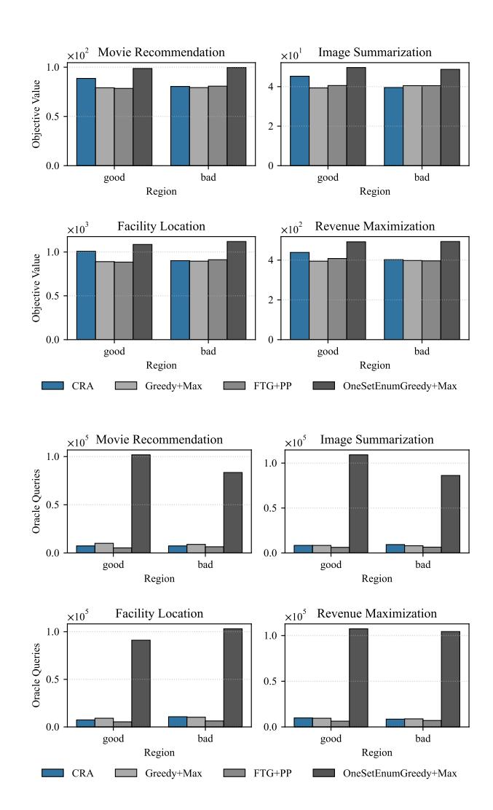

# Cost Ratio Aware Algorithm for Representative Subset Selection

[Tong Cheng](https://orcid.org/0000-0002-2183-8588) Nanyang Technological University Singapore tong030@e.ntu.edu.sg

[Xueyan Tang](https://orcid.org/0000-0002-7404-7595) Nanyang Technological University Singapore asxytang@ntu.edu.sg

### Abstract

Representative subset selection is an important problem in web data mining and machine learning, which is commonly modeled as monotone submodular maximization under a knapsack constraint with a cost function �� and a budget ��. Despite extensive studies, it remains unclear whether there exists any deterministic combinatorial algorithm that can achieve an approximation ratio �� &gt; 1/2 with subquadratic query complexity. In this paper, we introduce the max/min cost ratio of all elements �� := max�� ��(��)/min�� ��(��) as a structural parameter that facilitates the exploration of this gap with a hardness result and several intuitive insights for algorithm design. We first show that when ⌊��/��⌋ = 1, no deterministic combinatorial algorithm with �� (�� ) query complexity can achieve an approximation ratio �� &gt; 1/2. When ⌊��/��⌋ ≥ 2, we identify non-trivial regions in the (��, ��)-plane where thresholding greedy-based algorithms achieve (5/9 − ��)-approximation ratios with ��( (��/��) log(��/��)) query complexities. Finally, we propose a Cost Ratio Aware (CRA) algorithm that switches between these algorithms based on the property of (��, ��). Experiments on four web-based applications show that CRA outperforms other baselines within the identified regions, implying that the cost ratio is an effective indicator of algorithmic performance.

### CCS Concepts

• Information systems → Web mining; • Mathematics of computing → Submodular optimization and polymatroids.

### Keywords

web data mining; machine learning; submodular maximization; knapsack constraint; approximation ratio

### ACM Reference Format:

Tong Cheng and Xueyan Tang. 2026. Cost Ratio Aware Algorithm for Representative Subset Selection. In Proceedings of the ACM Web Conference 2026 (WWW '26), April 13–17, 2026, Dubai, United Arab Emirates. ACM, New York, NY, USA, [4](#page-3-0) pages.<https://doi.org/10.1145/3774904.3792869>

## 1 Introduction

Representative subset selection is a core application in modern web systems with well-known applications such as data summarization,

sensor placement, influence maximization and resource allocation. These applications could be formulated as the monotone submodular maximization under a knapsack constraint (SMK) problem.

[This work is licensed under a Creative Commons Attribution-NonCommercial-](https://creativecommons.org/licenses/by-nc-nd/4.0)[NoDerivatives 4.0 International License.](https://creativecommons.org/licenses/by-nc-nd/4.0) WWW '26, Dubai, United Arab Emirates © 2026 Copyright held by the owner/author(s). ACM ISBN 979-8-4007-2307-0/2026/04 <https://doi.org/10.1145/3774904.3792869>

Let �� be the ground set with size ��. The goal of SMK is to choose a subset �� ⊆ �� with ��(��) ≤ �� that maximizes a utility function �� (��) where �� : 2�� → R≥0 is a non-negative monotone submodular function, �� : �� → R>0 is a modular cost function and �� &gt; 0 is the budget. This formulation captures the ubiquitous trade-off between coverage (or influence) and resource limitations in webbased systems. For instance, the budget �� can represent CPU limits for scoring and re-ranking, bandwidth or memory limits for serving content. In the value oracle model, an algorithm makes a query by inputting a set ��, and the oracle returns the value �� (��). The query complexity of the algorithm is the total number of sets �� for which the algorithm requests the value �� (��) from the oracle.

In the offline setting, Sviridenko [\[5\]](#page-3-1) proposes an algorithm achieving a (1 − �� −1 )-approximation ratio for SMK by enumerating all three-element subsets with ��(�� ) query complexity. Feldman et al. [\[3\]](#page-3-2) improve this enumeration idea by showing that enumerating two-element subsets also achieves (1 − �� −1 )-approximation with ��(�� 4 ) query complexity. They further present a One-Set Enumeration algorithm achieving approximately 0.97(1−�� −1 )-approximation with ��(�� ) queries. All these algorithms could be accelerated from ��(�� ��) (�� ∈ {3, 4, 5}) to ��˜ (�� ��−1 /��) using the thresholding technique in [\[1\]](#page-3-3) at the cost of worsening the approximation ratio by a factor of (1 − ��) where the ��˜ notation disregards poly-logarithmic terms. Despite offering strong approximation guarantees, these algorithms suffer from a quadratic or higher query complexity, rendering them impractical for web-based applications. In contrast, algorithms with subquadratic query complexities are favorable in web-based applications.

For more efficient algorithms, Ene et al. [\[2\]](#page-3-4) propose a multilinear extension framework that achieves a (1 − �� −1 − ��)-approximation ratio in near-linear time. However, since the query complexity becomes extremely large by �� and the cost of evaluating multilinear extension is expensive, their method is impractical in real-world applications. A complementary line of work focuses on more practical algorithms without leveraging continuous extensions (we call this algorithm as combinatorial). The Greedy+Max algorithm, proposed by Avdiukhin et al. [\[6\]](#page-3-5), achieves a (1/2)-approximation ratio with ��(�� ) query complexity and can be accelerated to ��˜ (��/��). Subsequently, Li et al. [\[4\]](#page-3-6) propose Fast Threshold Greedy with Post-Processing (FTG+PP), a near-linear-time algorithm that guarantees a (1/2 − ��)-approximation ratio for SMK. However, these two nearlinear-time algorithms have lower approximation ratios than the previous works [\[2,](#page-3-4) [3,](#page-3-2) [5\]](#page-3-1).

These observations raise a fundamental algorithmic question: Does there exist any deterministic combinatorial algorithm that could achieve an approximation ratio �� &gt; 1/2 for SMK with subquadratic query complexity? To facilitate the investigation of this question, we introduce a simple structural parameter called the cost ratio and study how it affects both hardness and algorithmic performance.

Figure 1: Average objective value and number of oracle queries across two regions and four applications.

two categories: (i) good when (�� ★, ��★) ∈ �� ∪ �� ∪ ��; (ii) bad otherwise. Our experiments are conducted on a 36-core Linux server with an Intel Core i9-10980XE CPU @ 3.00GHz and 125GB of RAM.

We compare CRA against three baselines: 1) Greedy+Max proposed by [\[6\]](#page-3-5); 2) FTG+PP proposed by [\[4\]](#page-3-6); 3) OneSetEnumGreedy+Max proposed by [\[3\]](#page-3-2). We implement Greedy+Max and OneSetEnum-Greedy+Max using the thresholding technique from [\[1\]](#page-3-3) to ensure comparison fairness. The accuracy parameter �� of all algorithms are set to 10−3 . For each application and sampled pair (�� ★, ��★), we run CRA and other baselines for the problem instance, and record the objective value of the final output and the number of oracle queries. For each region type (i.e., good or bad), we compute the average objective value and number of oracle queries, which are illustrated in Figure [1.](#page-3-7)

We observe that in both regions OneSetEnumGreedy+Max achieves the highest average objective values while its number of oracle

queries are way much higher than other methods. In the good region, CRA achieves higher average objective values than Greedy+Max and FTG+PP while having almost the same average number of oracle calls as Greedy+Max and FTG+PP. In the bad region, CRA achieves almost the same average objective values as Greedy+Max and FTG+PP and loses its advantage. These observations are consistent with our theoretical results, suggesting that if the SMK problem instance lies in the good region, we could use CRA to achieve better performance without increasing the overhead of oracle queries.

### 4 Conclusion

In this paper, we have studied the problem of monotone submodular maximization under a knapsack constraint and aim to find a deterministic combinatorial algorithm with subquadratic query complexity and approximation ratio strictly larger than 1/2. In order to investigate this problem, we introduce a structural parameter called cost ratio. With this tool, we firstly prove that when ⌊��/��⌋ = 1, no deterministic combinatorial algorithm with subquadratic query complexity can achieve an approximation ratio �� &gt; 1/2. Furthermore, we propose a Greedy Power Density algorithm and through dedicated analysis identify three regions ��, ��,�� in the (��, ��)-plane where Greedy Power Density achieves a (5/9)-approximation ratio. These regions cover at least 37.8% of all (��, ��) pairs with ⌊��/��⌋ ≥ 2. Building on this theoretical result, we design a Cost Ratio Aware algorithm that switches between different sub-procedures based on the property of (��, ��) with near-linear query complexity, achieving (5/9 − ��)-approximation in �� ∪ �� ∪�� and (1/2 − ��)-approximation elsewhere. Experiments on four web-based applications shows that CRA outperforms baselines with a lower approximation ratio and near-linear query complexity in the favorable region and remains competitive outside the favorable region.

### Acknowledgments

This research is supported by the Ministry of Education, Singapore, under its AcRF Tier 2 (Award MOE-T2EP20122-0007).

### References

[1] Ashwinkumar Badanidiyuru and Jan Vondrák. 2014. Fast algorithms for maximizing submodular functions. In Proceedings of the Twenty-Fifth Annual ACM-SIAM Symposium on Discrete Algorithms (Portland, Oregon) (SODA '14). Society for Industrial and Applied Mathematics, USA, 1497–1514. [2] Alina Ene and Huy L. Nguyen. 2019. A Nearly-Linear Time Algorithm for Submodular Maximization with a Knapsack Constraint. In 46th International Colloquium on Automata, Languages, and Programming (ICALP 2019), Christel Baier, Ioannis Chatzigiannakis, Paola Flocchini, and Stefano Leonardi (Eds.), Vol. 132. Schloss Dagstuhl – Leibniz-Zentrum für Informatik, Dagstuhl, Germany, 53:1– 53:12. [doi:10.4230/LIPIcs.ICALP.2019.53](https://doi.org/10.4230/LIPIcs.ICALP.2019.53) [3] Moran Feldman, Zeev Nutov, and Elad Shoham. 2022. Practical Budgeted Submodular Maximization. Algorithmica 85, 5 (Dec. 2022), 1332–1371. [doi:10.1007/s00453-](https://doi.org/10.1007/s00453-022-01071-2) [022-01071-2](https://doi.org/10.1007/s00453-022-01071-2) [4] Wenxin Li, Moran Feldman, Ehsan Kazemi, and Amin Karbasi. 2022. Submodular maximization in clean linear time. In Proceedings of the 36th International Conference on Neural Information Processing Systems (New Orleans, LA, USA) (NIPS '22). Curran Associates Inc., Red Hook, NY, USA, Article 1270, 15 pages. [5] Maxim Sviridenko. 2004. A note on maximizing a submodular set function subject to a knapsack constraint. Operations Research Letters 32, 1 (Jan. 2004), 41–43. [doi:10.1016/S0167-6377\(03\)00062-2](https://doi.org/10.1016/S0167-6377(03)00062-2) [6] Grigory Yaroslavtsev, Samson Zhou, and Dmitrii Avdiukhin. 2020. "Bring Your Own Greedy"+Max: Near-Optimal 1/2-Approximations for Submodular Knapsack. In Proceedings of the Twenty Third International Conference on Artificial Intelligence and Statistics (Proceedings of Machine Learning Research, Vol. 108), Silvia Chiappa and Roberto Calandra (Eds.). PMLR, 3263–3274. [https://proceedings.mlr.press/](https://proceedings.mlr.press/v108/yaroslavtsev20a.html) [v108/yaroslavtsev20a.html](https://proceedings.mlr.press/v108/yaroslavtsev20a.html)