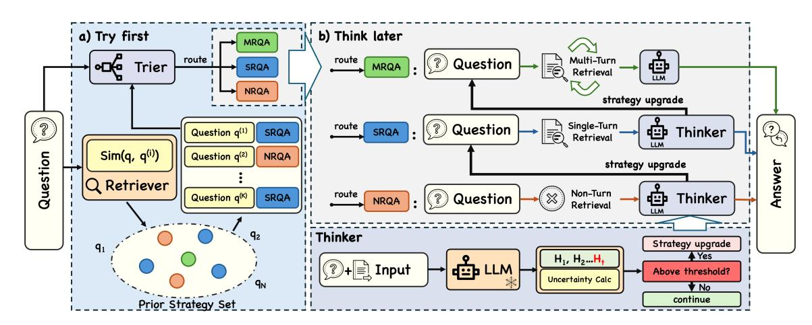
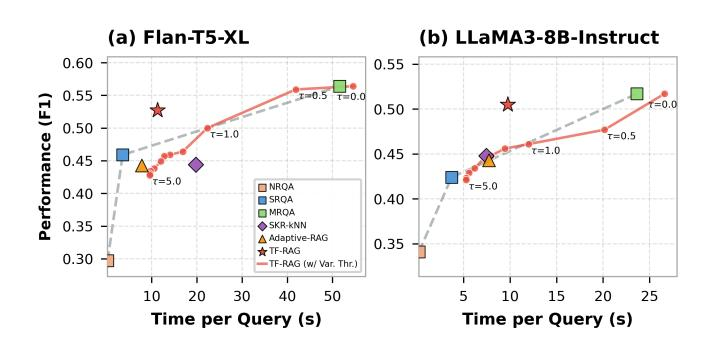
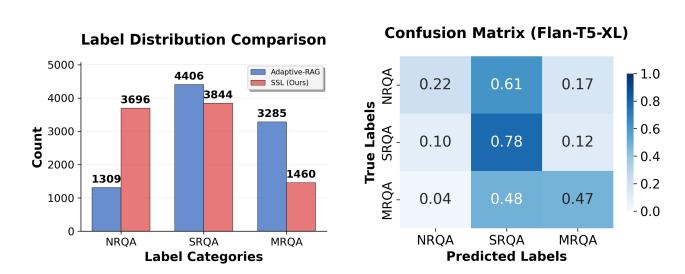

# Let It Try First: Uncertainty-Guided Retrieval Switching for Retrieval-Augmented Question Answering

[Xiaohai Wang](https://orcid.org/0009-0004-0736-3346)

School of Software, Yunnan University Kunming, Yunnan, China wangxiaohai@stu.ynu.edu.cn

[Yu Liang](https://orcid.org/0009-0003-0528-409X)

School of Software, Yunnan University Kunming, Yunnan, China yuliang@ynu.edu.cn

[Wei Zhou](https://orcid.org/0000-0002-5881-9436) School of Engineering, Yunnan University Kunming, Yunnan, China zwei@ynu.edu.cn

[Sixing Wu](https://orcid.org/0000-0001-7278-8720)∗

School of Software, Yunnan University Kunming, Yunnan, China wusixing@ynu.edu.cn

# Abstract

Adaptive Retrieval-Augmented Generation (RAG) can dynamically select the best retrieval strategy for each query, thereby balancing answer quality and efficiency. However, existing approaches either follow fixed multi-stage pipelines or use a single-pass classifier to determine the strategy, leading to irreversible decisions once the strategy is selected. To address this limitation, we propose TF-RAG (Try First), an adaptive RAG framework for question-answering that first attempts to answer the question with the initial retrieval strategy, and can be dynamically switched to a stronger strategy if needed. To this end, TF-RAG monitors token-level entropy signals during generation, allowing the model to recognize when its confidence is low. This uncertainty-guided switching strikes a balance between accuracy and computational efficiency, while requiring only a lightweight routing classifier and no modifications to the underlying model architecture. Experiments across six different QA benchmarks show that TF-RAG consistently improves answer correctness while substantially reducing retrieval cost.

# CCS Concepts

• Computing methodologies → Natural language generation.

# Keywords

RAG; Question Answering; Adaptive Retrieval

### ACM Reference Format:

Xiaohai Wang, Yu Liang, Wei Zhou, and Sixing Wu. 2026. Let It Try First: Uncertainty-Guided Retrieval Switching for Retrieval-Augmented Question Answering. In Proceedings of the ACM Web Conference 2026 (WWW '26), April 13–17, 2026, Dubai, United Arab Emirates. ACM, New York, NY, USA, [4](#page-3-0) pages.<https://doi.org/10.1145/3774904.3792870>

# 1 Introduction

Large language models (LLMs) have demonstrated remarkable performance in question-answering (QA) [\[3\]](#page-3-1). Nevertheless, LLMs are

∗Corresponding author.

© 2026 Copyright held by the owner/author(s). ACM ISBN 979-8-4007-2307-0/2026/04 <https://doi.org/10.1145/3774904.3792870>

prone to generating occasional hallucinatory answers that sound plausible yet are factually inaccurate, which may risk misleading users and propagate erroneous knowledge. To this end, researchers have proposed Retrieval-Augmented Generation (RAG) [\[6\]](#page-3-2) to integrate retrieved external knowledge to augment LLMs' knowledge reserves and mitigate the hallucination. Although recent RAG works have achieved notable results, they still struggle to balance performance and efficiency because they blindly execute the computationally expensive knowledge retrieval process for all given questions, overlooking the potential of LLMs' built-in parametric knowledge, an inherently more efficient way for simple questions.

Intuitively, the unnecessary introduction of external knowledge will inevitably damage the overall computational efficiency. Addressing this challenge, adaptively determining whether and how to incorporate RAG into the QA process remains non-trivial. Recently, DRAGIN [\[9\]](#page-3-3) leverages model uncertainty regarding a given question to decide when retrieval is necessary. However, it relies exclusively on empirically defined thresholds and fails to account for the trade-off between answer quality and efficiency. To jointly optimize these two key objectives, Adaptive-RAG [\[5\]](#page-3-4) employs a classifier to assess query difficulty, then selects the optimal generation strategy from direct answering, Naïve RAG, and IRCoT [\[10\]](#page-3-5). Nevertheless, Adaptive-RAG makes a one-time strategy decision, failing to dynamically adjust strategies after the prediction.

Consequently, we propose a novel TF-RAG (Try First RAG) to flexibly switch from using the efficient yet weaker parametric knowledge to the more powerful yet costly external knowledge retrieval at the right time. The core idea is to first predict an initial answering strategy suited to the given question, and escalate to retrieval-enhanced strategies only when the initial strategy proves insufficient. Specifically, we introduce a Strategy Router (Trier) that leverages prior questions and their corresponding optimal strategies to select an initial answering strategy for the given question. During the answer generation, TF-RAG incorporates a Strategy Upgrader (Thinker) that monitors the LLM's internal state in real time; whenever the estimated uncertainty exceeds a predefined computational efficiency threshold, it triggers an upgrade to a higher-cost

but more powerful strategy, thereby ensuring the answer quality. Extensive experiments show that TF-RAG achieves superior performance on six QA datasets while maintaining reasonable computational cost. Further analysis confirms that TF-RAG provides a scalable and adaptive solution for RAG strategy selection.

[This work is licensed under a Creative Commons Attribution 4.0 International License.](https://creativecommons.org/licenses/by/4.0) WWW '26, Dubai, United Arab Emirates.

| Method             | EM    | F1    | Flan-T5-XL Acc | RC   | EM    | F1    | LLaMA3-8B-Instruct Acc | RC   |
|--------------------|-------|-------|----------------|------|-------|-------|------------------------|------|
| NRQA               | 0.147 | 0.205 | 0.157          | 0.00 | 0.272 | 0.350 | 0.293                  | 0.00 |
| SRQA               | 0.342 | 0.436 | 0.382          | 1.00 | 0.321 | 0.415 | 0.378                  | 1.00 |
| Adaptive Retrieval | 0.248 | 0.327 | 0.275          | 0.50 | 0.306 | 0.395 | 0.347                  | 0.50 |
| Self-RAG ∗         | 0.103 | 0.218 | 0.286          | 0.48 | 0.103 | 0.218 | 0.286                  | 0.48 |
| DRAGIN             | 0.200 | 0.275 | 0.237          | 2.98 | 0.292 | 0.399 | 0.387                  | 2.13 |
| SKR ������         | 0.301 | 0.386 | 0.338          | 1.78 | 0.335 | 0.428 | 0.384                  | 1.31 |
| Adaptive-RAG       | 0.318 | 0.413 | 0.357          | 0.94 | 0.331 | 0.423 | 0.372                  | 0.70 |
| TF-RAG (Ours)      | 0.356 | 0.452 | 0.401          | 1.58 | 0.364 | 0.462 | 0.414                  | 1.40 |
| MRQA               | 0.384 | 0.482 | 0.431          | 4.91 | 0.362 | 0.461 | 0.425                  | 3.59 |

Table 2: Ablation study on Flan-T5-XL

| Method |         | EM          | F1    | Acc   | RC   |
|--------|---------|-------------|-------|-------|------|
| TF-RAG | (Ours)  | 0.356       | 0.452 | 0.401 | 1.58 |
| w/o    | Trier   | 0.295       | 0.383 | 0.326 | 1.16 |
| w/o    | Thinker | 0.324       | 0.419 | 0.370 | 1.02 |
| w/o    | Thinker | + PSR 0.292 | 0.380 | 0.326 | 0.74 |

cost (RC 1.40 vs. 3.59). It demonstrates that a strategy-routing approach can outperform a single, highly complex QA strategy.

3.2.2 Ablation Study. To investigate the contribution of different components in our method, three experimental modes were designed. As shown in Table [2,](#page-3-12) removing Trier leads to a substantial performance drop, removing Thinker (w/o Thinker) further reduces EM (0.324 vs. 0.356), and removing both Thinker and PSR yields the worst performance (EM 0.292, RC 0.74). These results indicate that these modules play a complementary role in enhancing answer accuracy while maintaining efficiency.

Figure 2: Label distributions for SSL vs. Adaptive-RAG (left) and confusion matrix (right) on Flan-T5-XL

3.2.3 Distribution Analysis. We compare SSL with the labeling approach used in Adaptive-RAG, as shown on the left of Figure [2.](#page-3-13) It can be observed that our SSL maintains QA quality while placing greater emphasis on reducing computational overhead. The right side of Figure [2](#page-3-13) illustrates the strategy classification results of TF-RAG. TF-RAG performs reasonably well in selecting SRQA, but there remains room for improvement in distinguishing between SRQA and NRQA as well as between MRQA and SRQA. This potential improvement will be explored as a direction for future research.

3.2.4 Efficiency Analysis. The relationship between QA performance and average time is shown in Figure [3.](#page-3-14) Our method achieves higher efficiency than SKRKNN and Adaptive-RAG. In addition, we conduct an analysis in which the upgrade thresholds �� (��ˆ) are not computed but instead treated as the hyperparameter which noted as TF-RAG (w/ Var. Thr.). We set both thresholds to values from 0.0 to 5.0 and report the performance. This comparison with our method highlights the effectiveness of our computed threshold.

## 4 Conclusion

We propose the TF-RAG, which first selects an initial answering strategy to generate an answer and then monitors the LLM's internal states during the answering process to determine whether an

Figure 3: The QA performance (F1) and efficiency (Time/Query) of different methods on 2WikiMultiHopQA.

upgrade to a different strategy is needed. Experiments on multiple datasets demonstrate that TF-RAG outperforms baseline methods while maintaining reasonable computational cost. Future work will focus on refining the classification mechanism to further improve decision accuracy and reduce cost.

### Acknowledgments

This work has been supported by the Yunnan Research Project (Grant Nos. 202503AG380006, 202401AT070474, 202501AU070059, 202403AP140021), National Natural Science Foundation of China (Grant Nos. 62562061, 62502422 and 62462067), and Yunnan Provincial Department of Education Science Research Project (Grant Nos. 2025J0006, 2024J0010 and 2025J0007).

## References

[1] Akari Asai, Zeqiu Wu, Yizhong Wang, et al. 2024. Self-RAG: Learning to Retrieve, Generate, and Critique through Self-Reflection. In The Twelfth International Conference on Learning Representations, ICLR 2024. [2] Hyung Won Chung, Le Hou, Shayne Longpre, et al. 2024. Scaling instructionfinetuned language models. Journal of Machine Learning Research 25, 70 (2024), 1–53. [3] Yunfan Gao, Yun Xiong, Xinyu Gao, et al. 2023. Retrieval-augmented generation for large language models: A survey. arXiv preprint arXiv:2312.10997 2, 1 (2023). [4] Aaron Grattafiori, Abhimanyu Dubey, Abhinav Jauhri, et al. 2024. The llama 3 herd of models. arXiv preprint arXiv:2407.21783 (2024). [5] Soyeong Jeong, Jinheon Baek, Sukmin Cho, et al. 2024. Adaptive-RAG: Learning to Adapt Retrieval-Augmented Large Language Models through Question Complexity. In 2024 Conference of the North American Chapter of the Association for Computational Linguistics: Human Language Technologies, NAACL 2024. 7029–7043. [6] Patrick Lewis, Ethan Perez, Aleksandra Piktus, et al. 2020. Retrieval-Augmented Generation for Knowledge-Intensive NLP Tasks. In Advances in Neural Information Processing Systems 33: Annual Conference on Neural Information Processing Systems 2020, NeurIPS 2020, December 6-12, 2020, virtual. [7] Tsung-Yi Lin, Priya Goyal, Ross Girshick, et al. 2017. Focal loss for dense object detection. In Proceedings of the IEEE international conference on computer vision. 2980–2988. [8] Alex Mallen, Akari Asai, Victor Zhong, et al. 2023. When Not to Trust Language Models: Investigating Effectiveness of Parametric and Non-Parametric Memories. In Proceedings of the 61st Annual Meeting of the Association for Computational Linguistics (Volume 1: Long Papers). 9802–9822. [9] Weihang Su, Yichen Tang, Qingyao Ai, et al. 2024. DRAGIN: Dynamic Retrieval Augmented Generation based on the Real-time Information Needs of Large Language Models. In Proceedings of the 62nd Annual Meeting of the Association for Computational Linguistics (Volume 1: Long Papers). 12991–13013. [10] Harsh Trivedi, Niranjan Balasubramanian, Tushar Khot, et al. 2023. Interleaving Retrieval with Chain-of-Thought Reasoning for Knowledge-Intensive Multi-Step Questions. In Proceedings of the 61st Annual Meeting of the Association for Computational Linguistics (Volume 1: Long Papers). 10014–10037. [11] Yile Wang, Peng Li, Maosong Sun, et al. 2023. Self-Knowledge Guided Retrieval Augmentation for Large Language Models. In Findings of the Association for Computational Linguistics: EMNLP 2023. 10303–10315.