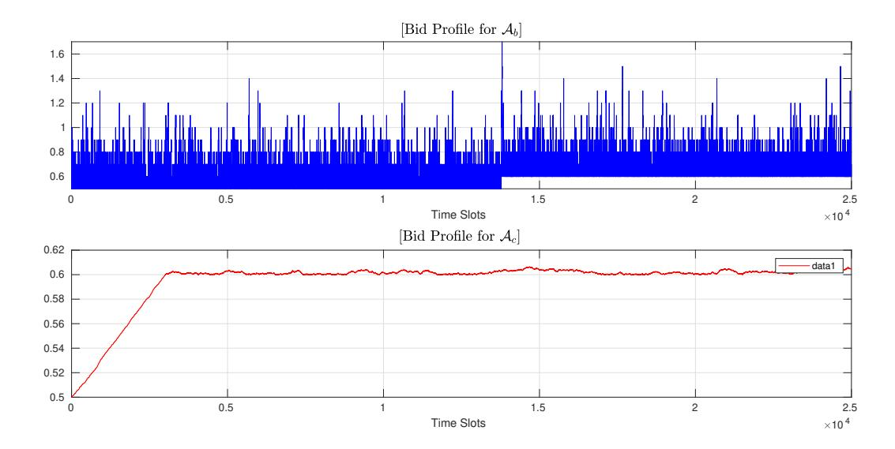
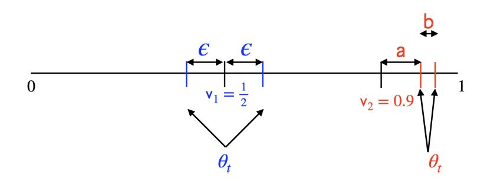
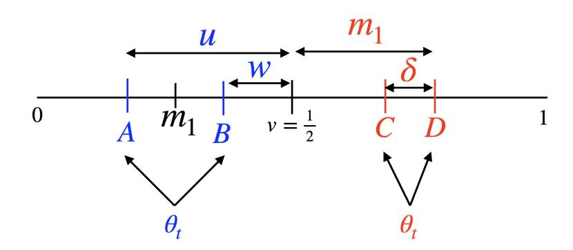

# Online Bidding Algorithms with Strict Return on Spend (ROS) Constraint

Rahul Vazea , Abhishek Sinhab

*aSchool of Technology and Computer Science, Tata Institute of Fundamental Research, Mumbai, India*

*bSchool of Technology and Computer Science, Tata Institute of Fundamental Research, Mumbai, India*

### Abstract

Auto-bidding problem under a strict return-on-spend constraint (ROSC) is considered, where an algorithm has to make decisions about how much to bid for an ad slot depending on the revealed value, and the hidden allocation and payment function that describes the probability of winning the ad-slot depending on its bid. The objective of an algorithm is to maximize the expected utility (product of ad value and probability of winning the ad slot) summed across all time slots subject to the total expected payment being less than the total expected utility, called the ROSC. A (surprising) impossibility result is derived that shows that no online algorithm can achieve a sub-linear regret even when the value, allocation and payment function are drawn i.i.d. from an unknown distribution. The problem is non-trivial even when the revealed value remains constant across time slots, and an algorithm with regret guarantee that is optimal up to logarithmic factor is derived.

*Keywords:* auto-bidding, online algorithm,regret, return-on-spend constraint.

# 1. Introduction

In this paper, we consider the *auto-bidding* problem, an important example of online optimization under time varying constraints, that is relevant for many resource allocation settings, especially for online advertising. With autobidding, in each time slot t, an auction is conducted, where an ad-query defined by a three-tuple, *value* vt, *allocation function* xt(.) and *payment function* pt(.) is generated that is independent and identically distributed (i.i.d.) with some unknown distribution. Allocation function xt(bt) is essentially the probability of winning the auction in slot t depending on the bid value bt. Corresponding to the allocation function is the expected payment pt that the bidder has to pay if allocation function is non-zero for the submitted bid. Both the allocation and payment functions are assumed to be monotonic.

In each slot, a single auto-bidder gets to see only the value and is asked to bid, while the allocation and payment functions remains hidden. Once the bid is submitted, the bidder receives the outcome of the auction: the hidden allocation function and the required payment. The realized value for the bidder in a slot is the product of the *value* and the *allocation function* evaluated at the submitted bid for that slot. Because of financial considerations, a typical return-on-spend constraint (ROSC) is imposed that requires that the *total expected realized value summed across all slots* should be at least as much as the *total expected payment made across all slots*.

The optimization problem is to maximize the total expected realized value summed across all slots subject to the ROSC. The problem is *online*, since at any time slot an online algorithm can only use the revealed value of that slot, and all the past information. Regret RA(T) quantifies the performance of any online algorithm A, defined as the expected difference between the total realized value of an optimal offline algorithm OPT and A, over a time horizon of T slots.

Auto-bidding is the dominant model in online advertising [\[1,](#page-10-0) [2,](#page-10-1) [3,](#page-10-2) [4,](#page-11-0) [5,](#page-11-1) [6,](#page-11-2) [7\]](#page-11-3), where auto-bidders are deployed on behalf of advertisers to win ad-slots on webpages. Once a user arrives on a webpage, the effective value of showing an ad to that user is some fixed basic value (intrinsic to the user) multiplied by the probability of an advertiser winning that auction depending on its bid, and the associated payment rule that is required to be truthful for maintaining incentive compatibility.

*Email addresses:* rahul.vaze@gmail.com (Rahul Vaze), abhishek.sinha@tifr.res.in (Abhishek Sinha)

### *1.1. Prior Work*

Single learner auto-bidding problem has been considered quite extensively in literature, but one allowance that is almost universally made is accepting some violation of the ROSC. For example, in [\[8\]](#page-11-4), an algorithm with R(T) = O( √ T) is proposed but it violates the ROSC by an amount O( √ T log T). Prior to this, [\[9\]](#page-11-5) derived an algorithm with R(T) = O(T 3/4 ) together with O(T 3/4 ) ROSC violation. For a slightly different objective function of (vt − st) at time t, where st is the second largest bid at time t from other bidders, and both vt, st are generated i.i.d., [\[10\]](#page-11-6) derives a threshold based algorithm with R(T) = O(T 2/3 ) and satisfies the ROSC. In addition to ROSC, additional constraint on total payment made has also been considered in [\[8,](#page-11-4) [9,](#page-11-5) [10\]](#page-11-6). Related to auto-bidding problem is the online allocation problem [\[11\]](#page-11-7), that only has budget constraints and no ROSC.

More complicated auto-bidding models [\[12,](#page-11-8) [4,](#page-11-0) [13,](#page-11-9) [14\]](#page-11-10) have also been studied where multiple agents compete directly, however, always following a second-price auction, for which O( √ T) regret and ROSC satisfaction with high probability are known.

# *1.2. Related Problems*

In constrained online convex optimization (COCO), on each round, the online policy first chooses an action, and then the adversary reveals a convex cost function and multiple convex constraints. Since constraints are revealed after the action has been chosen, no policy can satisfy the constraints exactly, and hence in addition to regret, cumulative constraint violation (CCV) is a relevant performance metric. COCO has been studied with both stochastic [\[15,](#page-11-11) [16,](#page-11-12) [17,](#page-11-13) [18\]](#page-11-14) as well as worst case input [\[19,](#page-11-15) [20,](#page-11-16) [21\]](#page-11-17), where simultaneous regret and CCV bounds are derived. Compared to COCO, with auto-bidding, value vt is revealed before action is taken and the input is i.i.d.

Other related models of online optimization with constraints have also been studied, e.g. [\[22\]](#page-11-18), where at each slot a discrete set of vectors are revealed, and an algorithm has to choose one of them with the goal of minimizing a (prespecified) loss function evaluated at the average of the chosen vectors, subject to the average of the chosen vectors to lie in a (pre-specified) convex region. Similar to COCO, simultaneous regret and constraint violation bounds are derived in [\[22\]](#page-11-18).

Bandits with Knapsack (BwK) Bandits with knapsacks is a popular model [\[18,](#page-11-14) [23,](#page-11-19) [24,](#page-11-20) [25\]](#page-11-21), where there are K arms, and at each time slot only one arm can be pulled/sampled by an algorithm. Pulling an arm reveals the associated reward, and a d-dimensional non-negative resource consumption vector. For each resource i = 1, . . . , d, there is a budget constraint Bi , and the algorithm can sample any arm for only as long as the cumulative consumption for any of the i = 1, . . . , d resources is at most its constraint Bi . The objective is to find an algorithm that maximizes the cumulative reward. For BwK, when the reward and consumption vector are stochastic with unknown distribution, algorithms with regret O( √ T) are known [\[18,](#page-11-14) [23,](#page-11-19) [24,](#page-11-20) [25\]](#page-11-21), when Bi = Ω(√ T) for all i, and T is the time horizon. The adversarial setting is also considered for BwK where competitive ratio guarantees of log(T) have been obtained [\[24,](#page-11-20) [25\]](#page-11-21).

The connection of stochastic BwK with the considered auto-bidding can be understood as follows. For the autobidding problem, at time t, once the value vt is revealed, consider an infinite number of arms corresponding to possible bids than an algorithm can make. For an arm that corresponds to bid b, the associated reward of that arm is vt · xt(b) and the consumption is xt(b)(vt − pt(b)), the expected utility minus the expected payment. Moreover, the ROSC corresponds to overall consumption constraint of B = 0, but the consumption xt(b)(vt − pt(b)) at time t is possibly negative as well. The fact that the consumption can be both positive and negative unlike BwK, an algorithm for autobidding does not have to necessarily terminate at any time (budget exhaustion time for BwK) earlier than the end of time horizon. Thus, there are basic conceptual differences between Stochastic BwK and the considered auto-bidding problem, which result in fundamentally different technical results as will be described next.

Knapsack Problem: The auto-bidding problem is closely related to an interesting variant (unstudied as far as we know) of the usual online knapsack problem [\[26\]](#page-11-22), where on an item's arrival, only its value is revealed but the size (it occupies) is hidden. An algorithm is allowed to advertise the maximum size it is willing to accept knowing the value, and if the size is at most the advertised size, the item is accepted. If the input is worst-case, it is not difficult to see that for this variant of the knapsack problem, the competitive ratio of any online algorithm is unbounded. Thus, the auto-bidding problem's special structure and the i.i.d. input makes it amenable for non-trivial analysis. Knapsack problem with unknown but fixed capacities has been studied [\[27\]](#page-11-23), but not under above constraints.

Resource Allocation: The single auto-bidder problem is essentially a resource allocation problem, where a decision maker needs to choose an action that consumes a certain amount of resources and generates utility/revenue. The revenue function and resource consumption of each request are drawn i.i.d. from an unknown distribution. The objective is to maximize cumulative revenue subject to some constraint on the total consumption of resources. Thus, the considered problem is relevant for very general settings that include inventory management for hotels and airlines with limited resources [\[28\]](#page-11-24), buying energy/power under i.i.d. demand and pricing [\[29\]](#page-11-25), etc.

### *1.3. Our Contributions*

In this paper, we consider the single auto-bidding problem with i.i.d. input, where in contrast to prior work that allowed ROSC violation, the main object of interest is the characterization of achievable regret under strict ROSC satisfaction. Towards that end, our contributions are as follows.

- We show a major negative result that the regret of any online algorithm that strictly satisfies the ROSC is Ω(T). Thus imposing strict ROSC satisfaction makes all online algorithms 'weak' for auto-bidding, and to get sub-linear regret, ROSC has to be violated. What is the best simultaneous regret and ROSC violation that any online algorithm can achieve remains an open question. O( √
  - T) regret and O( √ T log T) are currently the best known simultaneously achievable regret and ROSC violation bound [\[8\]](#page-11-4).
- For the case of repeated identical auction when value (vt) revealed in each slot is a constant, we show that the sum of the regret and the ROSC violation for any online algorithm is Ω(√ T). This implies that the regret of any online algorithm that strictly satisfies the ROSC is Ω(√ T).
- We show that the best known algorithm [\[8\]](#page-11-4) for the considered auto-bidding problem which violates the ROSC by at most O( √ T log T) has regret Ω(√
  - T) even for repeated identical auction. Thus the O( √
  - T) regret bound of [\[8\]](#page-11-4) is tight.
- For the repeated identical auction when value (vt) revealed in each slot is a constant, we propose a simple algorithm that satisfies the ROSC on a sample path basis and show that its regret is at most O( √ T log T) for a specific class of allocation and payment functions under some mild assumptions. As far as we know, this is first such result.
- Since achieving sub-linear regret is not possible for auto-bidding when vt ̸= vt ′ , we consider the metric of competitive ratio and propose an algorithm with competitive ratio close to 1/2 for a specific class of allocation and payment functions.

### 2. Problem Formulation

We consider the following online learning model, where time is discrete and in time slot t: an ad query is generated that has three attributes, its value vt ∈ [0, 1], the allocation function xt : R + ∪ {0} → [0, 1], and the payment function qt : R + ∪ {0} → [0, 1]. The allocation function xt(bt) is effectively the probability of 'winning' the slot t by bidding bt, and the expected valuation accrued from slot t is vtxt(bt). The allocation function xt is required to be a nondecreasing function of the bid bt with xt(0) = 0. The payment function qt is also non-decreasing, is zero when the allocation is zero, and is at most the bid. Thus, the expected payment function is pt(bt) = qt(bt)xt(bt) which for bt = vt satisfies

pt(vt) ≤ vtxt(vt). (1)

Instead of working with qt, we work with pt from here onwards. The value vt is visible to the online learner before making a decision at time slot t about the bid bt it wants to make. Once bt is chosen, both xt(bt) and pt(bt) are revealed. We consider the stochastic model, where the input (vt, xt, pt) is generated i.i.d. from an unknown distribution D.

The problem for the online learner is to choose bt in slot t knowing the past information

{(vτ , xτ (bτ ), pτ (bτ ))τ=1,...,t−1}

and the present value vt so as to maximize the total expected accrued valuation subject to ROSC, *that requires that the total expected payment should be at most the total accrued valuation*. Formally, the online problem is

max bt V (T) = E ( X T t=1 vtxt(bt) ) , subj. to E (X T t=1 pt(bt) ) ≤ E ( X T t=1 vtxt(bt) ) . (2)

where constraint in [\(2\)](#page-3-0) is the ROSC. We refer to our benchmark as the OPT, that solves [\(2\)](#page-3-0) knowing D, the distribution for (vt, xt, pt).

Remark 1. *Our benchmark is weaker than what is typically assumed in literature that knows the realizations of* vt, xt(b), pt(b), t = 1, . . . , T *for all* b *at time* 1 *itself and makes its bids* bt *while satisfying the ROSC. In particular, the benchmark's reward is*

V¯ (T) = E ( max bt X T t=1 vtxt(bt) ) , *subj. to* E (X T t=1 pt(bt) ) ≤ E ( X T t=1 vtxt(bt) ) . (3)

*We are considering a weaker benchmark for two reasons; i) it is more fair comparison for an online algorithm and ii) our primary interest is in deriving lower bounds, which are stronger with with weaker benchmarks.*

To characterize the performance of any online learning algorithm A, we define its regret as

RA(T) = max D (VOPT(T) − VA(T)) (4)

where D is the distribution for (vt, xt, pt). We have defined ROSC as a constraint in expectation. With abuse of notation, its sample path counterpart is defined as ROSC-S.

Definition 1. *Let CV*(t) = pt(bt) − vtxt(bt) *be the contribution to ROSC-S at slot* t*. Let CCV*(τ ) = Pτ t=1 *CV*(t) *denote the cumulative contribution to ROSC-S till slot* τ *. Let Margin*(τ ) = max{0, −*CCV*(τ )}*. For ROSC to be satisfied,* E{*CCV*(T)} ≤ 0*.*

For deriving our lower bounds we will consider the following special class of the allocation and payment functions xt(b), pt(b) that are of threshold type, denoted by x θ t , pθ t , defined as follows.

xt(b) = ( 1 for b ≥ θ, 0 otherwise, p θ t (b) = ( θ for b ≥ θ, 0 otherwise, (5)

where θ ≤ 1 without loss of generality (WLOG) since vt ≤ 1. When we consider allocation function of type [\(5\)](#page-3-1), succinctly we write the input as (vt, xθ t ), where (vt, θt) is i.i.d. generated from an unknown distribution, and the payment function is [\(5\)](#page-3-1).

Note that the threshold allocation and payment functions [\(5\)](#page-3-1) satisfy the Myerson's condition [\[30\]](#page-11-26),

pt(b) = bxt(b) − Z b 0 xt(u)du, (6)

that is satisfied by large classes of auction, e.g. second price auction. Thus, our derived lower bounds are valid also for structured inputs and for not inputs chosen absolutely adversarially.

Remark 2. *Myerson's condition is known to evoke truthful bids in a usual auction where the utility is simply* vt − pt(bt) *without any constraints.*

Definition 2. *For allocation functions of type* x θt t [\(5\)](#page-3-1)*, an algorithm is defined to* win *a slot if its bid* bt *is at least as much as* θt*. A slot that is not won is called* lost*. Let 1 ¯* A(t) = 1 *if algorithm* A *wins the slot* t*, and is zero otherwise.*

With allocation functions of type [\(5\)](#page-3-1), the contribution to ROSC-S comes only from slots that are *won*, i.e., when bt ≥ θt, and is equal to vt − θt, which can be both positive and negative. To satisfy the ROSC, the expected positive contribution has to be used judiciously to win slots where the expected contribution is negative. To illustrate this concretely, consider the following example.

Example 3. *Let* vt = v = 1/2 *for all* t*. Moreover, let the allocation function be of type* [\(5\)](#page-3-1)*, where* θt ∈ {0.4, 0.6, 0.7} *with equal probability in any slot* t*. The positive contribution ROSC-S comes from slots where* θt = 0.4 *of amount* v − θt = 0.1*. In expectation, there are* T /3 *slots with* θt = 0.4*, thus the total expected positive contribution to ROSC is* 0.1T /3 *which can be used by any algorithm to bid for slots when* θt ∈ {0.6, 0.7} > v*, where it can either get a negative per-slot contribution of* 0.1 *or* 0.2 *towards ROSC-S. To satisfy the ROSC, any algorithm has to win slots such that the sum of the expected negative contribution to ROSC is at least* −0.1T /3*.*

### 3. WarmUp

To better understand the problem, we first consider the simplest algorithm As that always bids bt = vt. From [\(1\)](#page-2-0), it follows that As satisfies the ROSC. Thus, the only question is what is the regret of As?

Lemma 4. RAs (T) = Ω(T) *regret even when* vt = v ∀ t*.*

Proof: Let vt = 1/2 for any t. For any slot t, let the allocation function be x θt t and θt = vt ±ϵ with equal probability with 0 < ϵ < 1/2. Then As that bids bt = vt gets a valuation of vt = 1/2 with probability 1/2 whenever θt = vt − ϵ and a valuation of 0 with probability 1/2 whenever θt = vt + ϵ. Thus the expected accrued valuation of As is T · 1 .

2 2 OPT on the other hand can choose to bid b OPT t = θt, ∀ t, and accrues a valuation of 1/2 on each slot, while satisfying the ROSC, since p θt t (b OPT t ) − vtx θt t (b OPT t ) = ±ϵ with equal probability. Thus,

RAs (T) = T 2 − T 4 ≥ T /4.

✷

We next consider the question of whether a more intelligent algorithm can do better than As and answer it in the negative.

# 4. Lower Bound on Regret of Any Online Algorithm that strictly satisfies the ROSC

Theorem 5. RA = Ω(T) *for any* A *that solves* [\(2\)](#page-3-0) *while strictly satisfying ROSC.*

Theorem [5](#page-4-0) is a major negative result and precludes the existence of any online algorithm with sub-linear regret while strictly satisfying the ROSC. The proof of Theorem [5](#page-4-0) is provided in Appendix [10,](#page-12-0) where the main idea is to construct two inputs with small K-L divergence (making them difficult to distinguish for any A) but for which the behaviour of OPT is very different to ensure that the ROSC is satisfied. Interestingly, the lower bound is derived when vt takes only two possible values v1, v2 such that that v2/v1 < 2. Then A's limitation in not knowing the input beforehand is utilized to derive the result.

Moreover, Theorem [5](#page-4-0) is derived by using allocation functions of the type [\(5\)](#page-3-1) that also satisfy the Myerson's condition. Thus, Theorem [5](#page-4-0) is also surprising since the ROSC is a constraint in expectation and there is a lot of structure to the problem, e.g., the input is i.i.d., and the allocation and the payment functions are structured.

Trivially, Algorithm As that always bids bt = vt has regret O(T). Thus, we get the following result.

Corollary 6. *Algorithm* As *that always bids* bt = vt *and exactly satisfies the ROSC is order-wise optimal.*

Remark 3. *Note that Theorem [5](#page-4-0) sheds no light on the refined question: what is the smallest regret possible when ROSC is allowed to be violated by* O(T α) *for* 0 < α < 1*.*

In light of Theorem [5'](#page-4-0)s negative result, instead of regret, the more meaningful performance metric for studying Problem [\(2\)](#page-3-0) is the competitive ratio [\[26\]](#page-11-22) defined as follows.

Definition 7. *For any* A*, its competitive ratio* µA = minD E{ PT t=1 vtxt(b A )} E{ PT t=1 vtxt(b OPT t )} , *where* A *and* OPT *satisfy ROSC, and* D *is the unknown distribution.*

The objective is to derive an algorithm with largest competitive ratio as possible, which we do in Section [8.](#page-9-0)

Next, we continue our lower bound expedition and consider Problem [2](#page-3-0) in the repeated identical auction setting where vt = v for all t, where the goal is only to maximize the number of slots won by an algorithm while strictly satisfying the ROSC.

# 5. Repeated Identical Auction Setting vt = v > 0 ∀ t.

# *5.1. Lower Bound on Regret for Any Online Algorithm* A

We derive a general result connecting the regret and the CCV for any online algorithm A that solves [\(2\)](#page-3-0) when vt = v for all t, as follows.

Theorem 8. *Even when* vt = v, ∀ t*, for any* A *that solves* [\(2\)](#page-3-0)*, we have that* RA(T) + E{*CCV*A(T)} = Ω(√ T).

As a corollary of Theorem [8,](#page-5-0) we get that the following main result of this section.

Lemma 9. *Even when* vt = v, ∀ t*,* RA(T) = Ω(√ T) *for any* A *that solves* [\(2\)](#page-3-0) *and strictly satisfies the ROSC.*

The proof of Theorem [8](#page-5-0) is provided in Appendix [11,](#page-14-0) where the main idea is similar to that of Theorem [5](#page-4-0) of constructing two inputs with small K-L divergence (making them difficult to distinguish for any A) but for which the behaviour of OPT is very different to ensure that the ROSC is satisfied. Compared to Theorem [5](#page-4-0) there is less freedom since vt = v for all t, and hence we get a weaker lower bound.

Lemma [9](#page-5-1) exposes the inherent difficulty in solving Problem [2,](#page-3-0) that is even if vt = v is known, the problem remains challenging, and either the regret or the ROSC violation has to scale as Ω(√ T).

Currently, the best known algorithm [\[8\]](#page-11-4) for solving Problem [\(2\)](#page-3-0) when Myerson's condition [\(6\)](#page-3-2) is satisfied has both regret and ROSC violation guarantee of O( √ T). Thus, Theorem [8](#page-5-0) does not imply a lower bound of Ω(√ T) on the regret of algorithm [\[8\]](#page-11-4). In the next section, we separately show that the regret of algorithm [\[8\]](#page-11-4) is Ω(√ T) irrespective of its constraint violation even in the repeated identical auction setting. This is accomplished by connecting the regret of algorithm [\[8\]](#page-11-4) to the hitting probability of a reflected random walk.

### 6. Lower Bound on Regret for algorithm [\[8\]](#page-11-4)

The primal-dual based algorithm Apd constructed in [\[8\]](#page-11-4) for minimizing the regret [\(4\)](#page-3-3), chooses

bt = vt + vt λt ,

where

λt = exp (α CCV(t − 1))

with λ1 = 1 and α = 1/ √ T. From [\[8\]](#page-11-4), we have RApd (T) = O( √ T) and ROSC-S of CCV(T) = O( √ T log T). Next, we show that RApd (T) = Ω(√ T).

Lemma 10. RApd (T) = Ω(√ T) *even if* vt = v ∀ t *and the Myerson's condition* [\(6\)](#page-3-2) *is satisfied.* Proof: Input: Let vt = v = 1/2 ∀ t. Let the allocation function be x θt t [\(5\)](#page-3-1) in any slot, where θt = {0, 1} with equal probability which satisfies the Myerson's condition [\(6\)](#page-3-2). Since θt is symmetric around vt = 1/2, OPT can bid bt = θt for each slot t, and win every slot resulting in its total accrued valuation of vT = T /2, while clearly satisfying the ROSC.

Since vt = 1/2 ∀ t, the total accrued valuation of algorithm Apd is

X T t=1 1 ¯ Apd (t)v = X T t=1 1 ¯ Apd (t) 1 2 .

Note that because of the choice of vt and θt, CV(t) = p θt t (bt) − vtx θt t (bt) takes only two values − 1 2 , 1 2 for a slot that is won by Apd. For a slot that is lost, CV(t) = 0.

By the choice of the algorithm Apd, whenever CCV(t − 1) = 1/2, λt = exp (α CCV(t − 1)) ≥ 1 and its bid bt = vt + vt λt < 1 and Apd wins that slot t only if θt = 0. Therefore the CCV process for Apd evolves as follows,

CCV(t) = CCV(t − 1) ± 1/2 w.p. {1/2, 1/2} if CCV(t − 1) < 1/2, CCV(t − 1) − 1/2 if θt = 0 and CCV(t − 1) = 1/2, CCV(t − 1) if θt = 1 and CCV(t − 1) = 1/2, (7)

where the first equation for CCV(t−1) < 1/2 in [\(7\)](#page-6-0) follows for the following reason. Recall that the per-slot CV(t) ∈ {−1/2, 0, 1/2}. Thus CCV(t), only takes values that are integral multiples of 1/2. Thus, when CCV(t − 1) < 1/2, it is in fact CCV(t − 1) ≤ 0 and hence λt ≤ 1 and Apd wins every slot and the increment CV(t) to CCV(t) takes only two values {−1/2, 1/2} with equal probability corresponding to θt = 0 and 1, respectively.

Thus, the CCV(t) process is a simple reflected (backwards at 1/2) random walk with increments ±1/2 with equal probability. Using classical results on reflected random walks we proceed further.

Definition 11. *[\[31\]](#page-11-27) Consider a simple random walk process* W *with i.i.d. increments* Xi *(a random variable) having* E{X1} = 0 *and* E{X2 1 } < ∞ *reflected at zero, i.e.* Wn = max{Wn−1 + Xn, 0}*, where* W0 = 0*. Let* Pn(x, y) *be the probability that* Wn = y *given* W0 = x*.*

Proposition 1. *[\[31\]](#page-11-27) For Definition [11,](#page-6-1)*

limn→∞ Pn(0, 0)√ n = c,

*for constant* c > 0*. Moreover,*

limn→∞ Pn+1(x, 0) Pn(0, 0) = 1, ∀ x.

Using the two parts of Proposition [1](#page-6-2) for the CCV process [\(7\)](#page-6-0), and noting that [\(7\)](#page-6-0) is reflected at 1/2, we have P(CCV(t) = 1/2) ≥ c/√ t for t large. Whenever, CCV(t) = 1/2, Apd's bid is < 1 and it wins a slot t only if θt = 0, which happens with probability 1/2. Therefore, using linearity of expectation, we get that the expected number of slots lost by Apd is ≥ 2 PT t=T /2 √c t = Ω(√ T), where we are accounting only for t ≥ T /2 since Proposition [1](#page-6-2) applies for large t. Recall that OPT wins all the slots, thus the regret of Apd is at least as much as its number of lost slots. ✷

As far as we know there is no known algorithm even in the repeated auction setting vt = v ∀ t for Problem [2](#page-3-0) that strictly satisfies the ROSC and achieves the lower bound of Lemma [9](#page-5-1) unless one considers a trivial setting [\[8\]](#page-11-4) to be described in Remark [5.](#page-8-0) In the next section, we construct one such algorithm when the allocation and payment function are of the threshold type [\(5\)](#page-3-1) under some mild assumptions.

#### 7. Algorithm with regret O( √ T log T ) in the Repeated Identical Auction strictly satisfying the ROSC

Note that from Lemma [9,](#page-5-1) we know that even the constant v case (vt = v > 0 ∀ t) is not trivial for any A to solve [\(2\)](#page-3-0) that strictly satisfies the ROSC. To belabour the point, consider a simple algorithm Ab that satisfies the ROSC on a sample path basis, i.e., CCV(T) ≤ 0, by bidding

bt = vt + Margin(t − 1),

Figure 1: Bid Profiles for algorithm Ab and Ac for Example [3.](#page-4-1)

where Margin(t − 1) has been defined in Definition [1.](#page-3-4)

Using Example [3,](#page-4-1) we next show that RAb (T) = Ω(T). Let the allocation function be of type [\(5\)](#page-3-1), where Ab wins a slot if bt ≥ θt. Since vt is a constant, any algorithm is just trying to maximize the number of slots it can win while satisfying the ROSC. First we describe the OPT. For the input defined in Example [3,](#page-4-1) slots with θt = 0.4 are won for 'free' since OPT always bids bt ≥ v = 1/2, and provide with a positive contribution towards ROSC-S of 0.1 in each such slot. Since vt = v ∀ t, among slots where θt > v, OPT only wins those slots where θt = 0.6 (negative contribution towards ROSC-S of 0.1) by bidding bt = 0.6 to ensure satisfying the ROSC, since θt takes values 0.4 and 0.6 with probability 1/3. Thus, b OPT t = 0.6 for all t, and VOPT = T · v · (2/3).

The bid profile of Ab is, however, different than OPT, as can be seen from Fig. [1,](#page-7-0) where it wins slots with both θ = 0.6 and θ = 0.7 because of large variability in its bid values bt. Winning a single slot with θ = 0.7 precludes winning two slots with θ = 0.6, and since the objective is to maximize the total number of won slots, Ab falls behind OPT and has linear regret with respect to OPT since it wins slots having θ = 0.7 with non-zero probability. This can be shown rigorously by using the same results on random walks as done in Lemma [10.](#page-5-2)

Thus, an algorithm that hopes to achieve a sub-linear regret has to inherently learn the maximum bid OPT will make. Towards that end, we propose algorithm Ac that bids

bt = v + 1 √ T Margin(t − 1) (8)

where the Margin process is as defined in Definition [1.](#page-3-4) Similar to Ab, Ac also satisfies the ROSC on a sample path basis.

For allocations functions satisfying [\(5\)](#page-3-1), the Margin process simplifies to

Margin(t) = ( Margin(t − 1) + (v − θt) if bt ≥ θt Margin(t − 1), otherwise. (9)

Ac is a conservative algorithm that overbids by an amount exactly equal to its non-negative slack in ROSC-S until that slot scaled down by √ T. Motivation behind Ac can be best understood by following the execution of Ac again over Example [3.](#page-4-1) Ac, in contrast to OPT, initially does not win any slots with θt ∈ {0.6, 0.7}, but once its bid value 'converges' (as can be seen in Fig. [1\)](#page-7-0), wins all slots t with θt = 0.6 and no slot t with θt = 0.7. With Ac, bt crosses the optimal maximum bid value of 0.6 of OPT in O( √ T) time and stays very close to it throughout, thereby avoiding winning any slots with θt = 0.7.

In general, Ac lets its bid process converge to a value close to the maximum bid that OPT will make, and then operates its bid profile in a narrow band around that value which avoids winning slots with large values of θ (that OPT avoids), while ensuring that enough slots that OPT wins are also won by it. To achieve this, Ac sacrifices a regret of O( √ T) in the initial phase where its bid is very low because of scaling down by 1/ √ T. Next, we make this intuition formal, and the main result of this section is as follows.

Theorem 12. *When* vt = v > 0, ∀ t*, the regret of* Ac *is at most* O( √ T log T) *when allocation functions are of type* [\(5\)](#page-3-1) *and Assumptions [14](#page-8-1) and [15](#page-8-2) holds.*

Remark 4. *Theorem [12](#page-8-3) holds against the stronger benchmark* [\(3\)](#page-3-5) *(Remark [1\)](#page-3-6) as well with an identical proof.*

Combining Theorem [12](#page-8-3) with Lemma [9,](#page-5-1) we conclude that algorithm Ac achieves optimal regret up to logarithmic terms. Even though Theorem [12](#page-8-3) is applicable only for allocation functions of type [\(5\)](#page-3-1) and under some assumptions, it is an important (first) step towards finding algorithms with optimal regret that strictly satisfies the ROSC. Conceptually, Ac is expected to work well for general allocation functions, however, how to generalize the regret guarantee is not obvious, and remains a challenging open question.

Full proof of Theorem [12](#page-8-3) is provided in Appendix [12,](#page-16-0) with the following proof outline. As assumed, let vt = v > 0, ∀ t. We first define a few quantities. For fixed v, let µL = E{1v≥θ · (v − θ)}, while µR = E{1v<θ · (v − θ)}. Note that µL and µR are expected per-slot positive and negative contributions to the ROSC, respectively, if all slots are won, e.g. by bidding bt = 1 ∀ t. Let µL + µR ≤ 0. The other case is easier to handle since then the per-slot expected contribution to ROSC is non-negative, and an algorithm can win all slots by bidding bt = 1 while satisfying the ROSC.

Remark 5. *Algorithm* Apd *of [\[8\]](#page-11-4) is shown to satisfy the ROSC when* µL + µR > 0*. But in this setting the problem is trivial, since bidding* bt = 1 *always guarantees zero regret while satisfying the ROSC in the repeated identical auction setting.*

Given that vt = v for all t, the objective is to maximize the total number of won slots while satisfying the ROSC. Essentially, the identity of which slots are won is immaterial. Therefore, for OPT, there exists a θ ⋆ and 0 < π⋆ ≤ 1 such that it bids bt = θt whenever θt < θ⋆ and wins all those slots, while bids bt = θ ⋆ with probability π ⋆ when θt = θ ⋆ (wins slots with θt = θ ⋆ with probability π ⋆ ) such that the ROSC is satisfied. In particular,

π ⋆E{1v=θ ⋆ · (v − θ ⋆ )} + E{1v<θ⋆ · (v − θ ⋆ )} + µL = 0. (10)

Let µ θ ⋆ R = E{1 ¯ v<θ · (v − θ)|θ < θ⋆} and µ¯ θ ⋆ R = E{1 ¯ v<θ · (v − θ)|θ ≥ θ ⋆}.

Definition 13. *For* Ac*, the increments (positive jumps) to the Margin process* [\(9\)](#page-7-1) *have mean* µL*, while the mean of the decrements (negative jumps) to the Margin process* [\(9\)](#page-7-1) *is* µ θ ⋆ R *(a negative quantity) until* bt < θ⋆ *. Thus, the Margin*(t) *process* [\(9\)](#page-7-1) *has drift* ∆ = µL + µ θ ⋆ R *until* bt < θ⋆ *. Following* [\(10\)](#page-8-4)*,* ∆ > 0*.*

Assumption 14. ∆ *does not depend on* T*.*

Assumption 15. |µ¯ θ ⋆ R | ≤ |µ θ ⋆ R |*.*

Assumption [14](#page-8-1) implies that the positive drift (function of unknown distribution D) of the Margin process of Ac does not depend on T, which is necessary. For example, if ∆ = 1/T, it will take Ω(T) time for algorithm Ac's bid to cross any constant level, making its regret Ω(T).

Assumption [15](#page-8-2) implies that the negative drift to Margin(t) process [\(9\)](#page-7-1) obtained by winning slots with θt > v is weaker after the bid process crosses θ ⋆ compared to before crossing θ ⋆ . Thus, the excursions of the Margin process around θ ⋆ are 'well behaved' and we can use the result from [\[32\]](#page-11-28). It is worth noting that Assumption [15](#page-8-2) does not make the problem trivial, and is needed for technical reasons in the proof.

Definition 16. *Let* τmin = min{t : bt ≥ θ ⋆} *be the earliest time at which* bt *process* [\(8\)](#page-7-2) *crosses* θ ⋆ *.* Definition 17. *Let the set of all* T *slots be denoted by* T *. For* t ≥ τmin *the subset of slots where* θ = θ ⋆ *be denoted by* Tθ ⋆ *, while where* θ > θ⋆ *by* T + θ ⋆ *and* θ < θ⋆ *by* T − θ ⋆ *.*

Using Definition [17](#page-9-1) we can write the regret for Ac as

RAc (T) = RAc ([1 : τmin]) + RAc (Tθ ⋆ ) + RAc (T + θ ⋆ ) + RAc (T − θ ⋆ ).

From definition [\(10\)](#page-8-4), OPT does not win any slots of T + θ ⋆ , thus, RAc (T + θ ⋆ ) ≤ 0. Under Assumption [14,](#page-8-1) the rest of the proof of Theorem [12](#page-8-3) is divided in three parts, i) we show that E{τmin} = O( √ T) which implies that RA([1 : τmin]) = O( √ T), ii) RAc (Tθ ⋆ ) ≤ 0 by showing that Ac and OPT win equal number of slots in expectation when θ = θ ⋆ , and finally iii) RAc (T − θ ⋆ ) = O( √ T log T) using a result from [\[32\]](#page-11-28) stated in Lemma [29](#page-17-0) that shows that bid process [\(8\)](#page-7-2) concentrates very close to θ ⋆ , and Ac wins any slots having θ < θ⋆ with probability Ω(1 − 1/ √ T). Putting all of this together implies the result.

We next move on to the more challenging and interesting case when vt ̸= v, ∀ t and derive a 1/2-competitive algorithm.

# 8. 1/2-Competitive Algorithm for Problem [2](#page-3-0)

In Section [4,](#page-4-2) we showed that regret of any online algorithm for solving [\(2\)](#page-3-0) is Ω(T) while strictly satisfying the ROSC. In this section, hence we consider a weaker multiplicative guarantee of competitive ratio (Definition [7\)](#page-5-3), and present an algorithm that can achieve a competitive ratio of close to 1/2 while satisfying the ROSC with high probability.

In this section, for notational simplicity, we consider the discrete version of Problem [2,](#page-3-0) where in any slot t, vt takes K (arbitrary) possible values v1 > · · · > vK, v1 ≤ 1 with probabilities p1, . . . , pK that are independent of T. Note that K, v1 > · · · > vK and p1, . . . , pK are unknown to begin with. We consider allocation and payment functions of type [\(5\)](#page-3-1). The results generalize in a straightforward manner for general allocation and payment functions unlike Theorem [12](#page-8-3) which is specific to allocation and payment functions of type [\(5\)](#page-3-1).

Let D, the distribution for (vt, xt, pt) be known. Consequently, let the expected per-slot positive and negative contribution to ROSC when vt = vk be ℓk = E{vk − θt|vt = vk, θt ≤ vk} and rk = E{θt − vk|vt = vk, θt > vk}, respectively. Moreover, let ←−w k = P(θt ≤ vt|vt = vk) and −→w k = P(θt > vt|vt = vk). Thus, Pk i=1 pi ←−w iℓi is the total expected positive contribution to ROSC which can be used to win slots where θt > vt.

Since v1 ≤ 1 and θt ≤ 1 for all t, let an algorithm bid bt = 1 when vt = vk with probability qk. Doing so, if θt ≤ vt, then bidding bt = 1 is same as bidding bt = vt. In case θt > vt, then by bidding bt = 1, the expected per-slot negative contribution to the ROSC is simply rk. Then the benchmark OPT's solution (which is assumed to know D) to problem [\(2\)](#page-3-0) can be recast as the following LP,

max 0≤qk≤1 X K k=1 pk ←−w kvk + X K k=1 pk −→w kvkqk subj. to X K k=1 pk −→w krkqk + X K k=1 pk ←−w kℓk ≥ 0, ∀ k, (11)

where the constraint in [\(11\)](#page-9-2) exactly corresponds to the ROSC. Let Plight = {K, pk, ←−w k, −→w k, rk, ℓk}. Assuming the knowledge of Plight, [\(11\)](#page-9-2) is similar to the fractional knapsack problem [\[26\]](#page-11-22) and the optimal solution has the following structure.

Lemma 18. *For* [\(11\)](#page-9-2)*,* ∃ *a threshold* σ ⋆ *, such that for indices* k *such that for* vk rk > σ⋆ *,* q ⋆ k = 1*, and for* vk rk < σ⋆ *,* q ⋆ k = 0*. The only fractional solution* q ⋆ k *is for index* k *such that* vk rk = σ ⋆ *.*

Assuming the knowledge of Plight Lemma [18](#page-9-3) implies an optimal algorithm to find the exact solution of [\(11\)](#page-9-2). Solve [\(11\)](#page-9-2) to find σ ⋆ . Bid bt = 1 with probability 1 for as many k's in order for which vk rk > σ⋆ , bid bt = 1 with probability q < 1 (so as to make the constraint tight in [\(11\)](#page-9-2)) for index k for which vk rk = σ ⋆ . For all other k's, bid bt = vk, i.e. win such a slot only if θt ≤ vk and do not spend any positive accrued contribution to the ROSC-S for winning them.

The quantities involved in [\(11\)](#page-9-2), Plight = {K, pk, ←−w k, −→w k, rk, ℓk}, except K, are all just expected values and can be easily estimated. In reality, Plight is unknown, algorithm Learn-Alg (with pseudo-code in Algorithm [1\)](#page-10-3) first learns the parameters of Plight by dedicating the first half of the time horizon T, and then applies the solution implied by Lemma [18.](#page-9-3)

# Algorithm 1 Learn-Alg

1: Begin Learning Phase 2: Dedicate slots t = 1, . . . , T /2 for learning parameters of Plight by bidding bt = vt and using sample mean estimator Xˆ = 1 n Pn i=1 Xi for each quantity, Kˆ = # distinct values of vt's observed in time period [1, T /2]. 3: Arrange all items in decreasing order of vk rk for k = 1, . . . , Kˆ , and find σ ⋆ following Lemma [18](#page-9-3) with K = Kˆ 4: Begin Decision Phase 5: For any slot t ≥ T /2 6: If vk rk > σ⋆ Bid bt = 1 7: Else If vk rk = σ ⋆ Bid bt = 1 with probability qk: qk makes the equality in [\(11\)](#page-9-2) tight 8: Else If vk rk < σ⋆ Bid bt = vt 9: End

Remark 6. *As defined in Algorithm [1,](#page-10-3)* Kˆ *is the estimated number of distinct values that* vt *takes. Since* p1, . . . , pK *do not depend on* T*, the probability that* Kˆ ̸= K *is* o(1/T)*.*

Theorem 19. *The competitive ratio (Definition [7\)](#page-5-3)*

µ*Learn-Alg* ≥ 1/2 − (1 − O(K log(1/δ)/ √ T))

*and Learn-Alg satisfies the ROSC with probability*

1 − (1 − O(K log(1/δ)/ √ T))

*.*

Remark 7. *Choosing the length of the learning phase appropriately, we can tradeoff the competitive ratio with the probability with which the ROSC is satisfied.*

### 9. Conclusions

In this paper, we considered an important online optimization problem, single auto-bidding under strict ROSC, and characterized the performance of any online algorithm. Compared to prior work which allowed ROSC violation, our focus was on enforcing strict ROSC. For the case when the valuation can be different for different slots, we showed an impossibility result that no online algorithm can achieve a sub-linear regret, which is a bit surprising. Having closed the door on obtaining a sub-linear regret, we consequently considered the weaker metric of competitive ratio and showed that a simple algorithm can achieve a competitive ratio close to one-half. With strict ROSC, we showed that the problem is non-trivial even if the valuation remains constant across time slots. In particular, we showed that the sum of the regret and the constraint violation scales as square-root of the time horizon, and derived an algorithm for threshold type allocation functions that achieves the regret bound up to logarithmic factors while satisfying the strict ROSC constraint.

### References

[1] S. R. Balseiro, Y. Gur, Learning in repeated auctions with budgets: Regret minimization and equilibrium, Management Science 65 (9) (2019) 3952–3968. [2] G. Aggarwal, A. Badanidiyuru, A. Mehta, Autobidding with constraints, in: Web and Internet Economics: 15th International Conference, WINE 2019, New York, NY, USA, December 10–12, 2019, Proceedings 15, Springer, 2019, pp. 17–30. [3] M. Babaioff, R. Cole, J. Hartline, N. Immorlica, B. Lucier, Non-quasi-linear agents in quasi-linear mechanisms, arXiv preprint arXiv:2012.02893 (2020).

- [4] N. Golrezaei, I. Lobel, R. Paes Leme, Auction design for roi-constrained buyers, in: Proceedings of the Web Conference 2021, 2021, pp. 3941–3952. [5] Y. Deng, J. Mao, V. Mirrokni, S. Zuo, Towards efficient auctions in an auto-bidding world, in: Proceedings of the Web Conference 2021, 2021, pp. 3965–3973. [6] S. Balseiro, Y. Deng, J. Mao, V. Mirrokni, S. Zuo, Robust auction design in the auto-bidding world, Advances in Neural Information Processing Systems 34 (2021) 17777–17788. [7] S. R. Balseiro, Y. Deng, J. Mao, V. S. Mirrokni, S. Zuo, The landscape of auto-bidding auctions: Value versus utility maximization, in: Proceedings of the 22nd ACM Conference on Economics and Computation, 2021, pp. 132–133. [8] Z. Feng, S. Padmanabhan, D. Wang, Online bidding algorithms for return-on-spend constrained advertisers?, in: Proceedings of the ACM Web Conference 2023, 2023, pp. 3550–3560. [9] M. Castiglioni, A. Celli, A. Marchesi, G. Romano, N. Gatti, A unifying framework for online optimization with long-term constraints, Advances in Neural Information Processing Systems 35 (2022) 33589–33602. [10] N. Golrezaei, P. Jaillet, J. C. N. Liang, V. Mirrokni, Bidding and pricing in budget and ROI constrained markets, arXiv preprint arXiv:2107.07725 8 (8.1) (2021) 3. [11] S. Balseiro, H. Lu, V. Mirrokni, Dual mirror descent for online allocation problems, in: International Conference on Machine Learning, PMLR, 2020, pp. 613–628. [12] C. Borgs, J. Chayes, N. Immorlica, K. Jain, O. Etesami, M. Mahdian, Dynamics of bid optimization in online advertisement auctions, in: Proceedings of the 16th international conference on World Wide Web, 2007, pp. 531–540. [13] X. Chen, C. Kroer, R. Kumar, The complexity of pacing for second-price auctions, Mathematics of Operations Research (2023). [14] B. Lucier, S. Pattathil, A. Slivkins, M. Zhang, Autobidders with budget and ROI constraints: Efficiency, regret, and pacing dynamics, in: The Thirty Seventh Annual Conference on Learning Theory, PMLR, 2024, pp. 3642–3643. [15] S. Mannor, J. N. Tsitsiklis, J. Y. Yu, Online learning with sample path constraints., Journal of Machine Learning Research 10 (3) (2009). [16] M. Mahdavi, T. Yang, R. Jin, Stochastic convex optimization with multiple objectives, Advances in neural information processing systems 26 (2013). [17] H. Yu, M. Neely, X. Wei, Online convex optimization with stochastic constraints, Advances in Neural Information Processing Systems 30 (2017). [18] A. Badanidiyuru, R. Kleinberg, A. Slivkins, Bandits with knapsacks, Journal of the ACM (JACM) 65 (3) (2018) 1–55. [19] H. Yu, M. J. Neely, A low complexity algorithm with o( √
- T) regret and o(1) constraint violations for online convex optimization with long term constraints, arXiv preprint arXiv:1604.02218 (2016). [20] H. Guo, X. Liu, H. Wei, L. Ying, Online convex optimization with hard constraints: Towards the best of two worlds and beyond, Advances in Neural Information Processing Systems 35 (2022) 36426–36439. [21] A. Sinha, R. Vaze, [Optimal algorithms for online convex optimization with adversarial constraints](https://arxiv.org/abs/2310.18955) (2024). [arXiv:2310.18955](http://arxiv.org/abs/2310.18955). URL <https://arxiv.org/abs/2310.18955> [22] S. Agrawal, N. R. Devanur, Fast algorithms for online stochastic convex programming, in: Proceedings of the twenty-sixth annual ACM-SIAM symposium on Discrete algorithms, SIAM, 2014, pp. 1405–1424. [23] A. Rangi, M. Franceschetti, L. Tran-Thanh, Unifying the stochastic and the adversarial bandits with knapsack, arXiv preprint arXiv:1811.12253 (2018). [24] N. Immorlica, K. Sankararaman, R. Schapire, A. Slivkins, Adversarial bandits with knapsacks, Journal of the ACM 69 (6) (2022) 1–47. [25] A. Rivera Cardoso, H. Wang, H. Xu, The online saddle point problem and online convex optimization with knapsacks, Mathematics of Operations Research 50 (1) (2025) 1–39. [26] R. Vaze, Online Algorithms, Cambridge University Press, 2023. [27] Y. Disser, M. Klimm, N. Megow, S. Stiller, Packing a knapsack of unknown capacity, SIAM Journal on Discrete Mathematics 31 (3) (2017) 1477–1497. [28] K. Talluri, G. Van Ryzin, An analysis of bid-price controls for network revenue management, Management science 44 (11-part-1) (1998) 1577–1593. [29] L. Yang, M. H. Hajiesmaili, R. Sitaraman, E. Mallada, W. S. Wong, A. Wierman, Online inventory management with application to energy procurement in data centers, arXiv preprint arXiv:1901.04372 (2019). [30] R. B. Myerson, Optimal auction design, Mathematics of operations research 6 (1) (1981) 58–73. [31] S. C. Port, On random walks with a reflecting barrier, Transactions of the American Mathematical Society 117 (1965) 362–370. [32] R. Srivastava, C. E. Koksal, Basic performance limits and tradeoffs in energy-harvesting sensor nodes with finite data and energy storage, IEEE/ACM Transactions on Networking 21 (4) (2013) 1049–1062. [doi:10.1109/TNET.2012.2218123](https://doi.org/10.1109/TNET.2012.2218123). [33] T. Lattimore, C. Szepesvari, Bandit algorithms, Cambridge University Press, 2020. ´ [34] W. Feller, An introduction to probability theory and its applications, Volumes 1-3, Vol. 81, John Wiley & Sons, 1991. [35] S. Boyd, L. Vandenberghe, Convex optimization, Cambridge university press, 2004.

Figure 2: Input used to prove Theorem [5.](#page-4-0)

### 10. Proof of Theorem [5](#page-4-0)

Proof: Let vt take two values {v1, v2} = {0.5, 0.9} with equal probability for all t. The allocation functions are x θt t (of type [\(5\)](#page-3-1)) where θt are distributed as follows.

Input 1: If for slot t, vt = v1, then θt ∈ {vt ±ϵ} with equal probability, where 0 < ϵ small. Moreover, if for slot t, vt = v2, then θt = vt+a+X where X ∈ {0, b} with probability r, 1−r, respectively, and a+E{X} = a+(1−r)b = ϵ with a, b ≥ 0, v2 + b ≤ 1 and a > 2ϵ 3 , r < 1 − r, i.e., r < 1 2 .

Input 2: If for slot t, vt = v1, then θt ∈ {v1 ± ϵ} with equal probability and if for slot t vt = v2, then θt = vt + a + X′ where X′ ∈ {0, b} with probability r − δ, 1 − r + δ, respectively with r − δ < 1 − r + δ. Let the choice of a, b, δ be such that a + E{X′} = 4ϵ. Essentially, δ = Θ(ϵ).

See Fig. [2](#page-12-1) for a pictorial description where quantities with blue and red color correspond to the values of vt and θt that appear together.

Note that with both Input 1 and 2, the only case where θt < vt is when vt = v1. Thus, given the distribution, the total expected per-slot positive contribution to ROSC is ϵ 4 with both Input 1 and 2 which can be used by OPT or any algorithm to win slots with θt > vt.

OPT's actions: By the choice of Input 1, the expected per-slot negative contribution to ROSC by winning a slot with vt = v1 and θt = vt + ϵ is −ϵ/4 while the expected per-slot negative contribution to ROSC by winning a slot with vt = v2 and θt = vt+X is −ϵ/2. Moreover, the expected value from winning a slot with vt = v1 and θt = vt+ϵ is v1/4 while by winning a slot with vt = v2 and θt = vt + X is v2/2. Thus, since v2 > v1, with Input 1, consider an algorithm B that spends all the available total expected per-slot positive contribution to ROSC of ϵ 4 in winning the maximum number slots with vt = v2 while satisfying the ROSC. Thus, B's bidding profile on input 1 is: bid bt = vt whenever vt = v1, and bid bt = 1 with probability 1/2 whenever vt = v2. Thus, B satisfies the ROSC exactly, and its expected accrued valuation is v1T /4 + v2T /4. Since OPT is at least as good as any other algorithm while satisfying the ROSC exactly, OPT's expected accrued valuation is ≥ v1T /4 + v2T /4.

Next, we characterize the structure of OPT with Input 2.

Definition 20. *Let any algorithm bid* bt = vt + ϵ *whenever* vt = v1 *and* θt = v1 + ϵ*, with probability* g1*, bid* bt = vt + a *whenever* vt = v2 *and* θt = v2 + a*, with probability* g2*, and bid* bt = vt + b *whenever* vt = v2 *and* θt = v2 + b*, with probability* g3*.*

Following Definition [20,](#page-12-2) the expected accrued valuation per-slot by OPT with Input 2 is

max g1,g2,g3 1 4 v1 + 1 4 g1v1 + g2v2 1 2 (r − δ) + g3v2 1 2 (1 − r + δ) (12)

subject to satisfying the ROSC that translates to

g1 1 4 ϵ + g2a 1 2 (r − δ) + g3(a + b) 1 2 (1 − r + δ) ≤ ϵ 4 . (13)

Lemma 21. *With Input 2, let* p ⋆ = (g ⋆ 1 , g⋆ 2 , g⋆ 3 ) *be the* OPT*'s solution to maximize* [\(12\)](#page-12-3) *satisfying* [\(13\)](#page-12-4)*. Then* g ⋆ 3 = 0*.*

Proof: Let OPT's solution be g1 = (g1, g2, g3) to maximize [\(12\)](#page-12-3) satisfying [\(13\)](#page-12-4), where g3 > 0. To prove the result, we will perturb g1 to create a new solution g ′ 1 that has g ′ 3 = 0 and a higher valuation than that of g1, as follows. It is easy to see that for OPT, g2 ≥ g3, since the expected per-slot negative contribution to ROSC with the two choices which are chosen with probability g2 and g3 are −a 1 2 (r − δ) and −(a + b) 2 (1 − r + δ), respectively, where r − δ < 1 − r + δ, while the accrued value is v2 in both cases. Also for OPT, the constraint in [\(13\)](#page-12-4) will be tight. Thus, [\(13\)](#page-12-4) is

g1 1 4 ϵ + g2a 1 2 (r − δ) + g3(a + b) 1 2 (1 − r + δ) = ϵ 4 , g1 1 4 ϵ + (g2 − g3)a 1 2 (r − δ) + g3 2 (a (r − δ) + (a + b) (1 − r + δ)) (a) = ϵ 4 , g1 1 4 ϵ + (g2 − g3)a 1 2 (r − δ) + g3 2 4ϵ (b) = ϵ 4 , (14)

where (a) follows by adding and subtracting g3a 2 (r − δ) to the L.H.S. while (b) follows since a (r − δ) + (a + b) (1 − r + δ) = a + E{X′} = 4ϵ. Compared to g1 = (g1, g2, g3), consider another solution g ′ 1 = (g1 + 8g3, g2 − g3, 0) that also satisfies [\(14\)](#page-13-0). Moreover, the valuation [\(12\)](#page-12-3) with g ′ 1 is larger than g1, since r − δ ≤ 1, (1 − r + δ) ≤ 1, and v2/v1 = 0.9/0.5 = 1.8. Hence, g1 cannot be optimal when g3 > 0. ✷

To summarize, with Input 2, OPT never bids bt > vt+a whenever vt = v2. The following corollary is immediate.

Corollary 22. *With Input 2, any online algorithm* A *that uses* g3 > c > 0 *(*c *is a constant) has regret of* Ω(T) *or* A *violates the ROSC.*

Winning slots with option i) vt = v2, θt = v2 +a+b compared to option ii) vt = v1, θt = v1 +ϵ gives higher accrued value but consumes a disproportionately larger per-slot expected negative contribution to ROSC. Thus, one way to understand Corollary [22](#page-13-1) is that for any A that exactly satisfies the ROSC and has g3 > c (a constant), must suffer a regret of Ω(T) with Input 2, since with Input 2, having g3 > c, winning slots with vt = v2 and θt = v2 + a + b comes at a disproportionate (ROSC) cost of losing out on winning slots with vt = v1 and θt = v1 + ϵ given that v2/v1 < 2.

Let the probability measure or expectation under Input i, i = 1, 2 be denoted as P i or E i . Consider any online algorithm A. Let the number of slots for which A bids bt ≥ v2 + b when vt = v2 be NA. Recall Definition [20](#page-12-2) for g1, g2, g3. Let E be the event that NA = o(T), i.e. g3 = o(T) .

T Similar to [\(13\)](#page-12-4), for A to satisfy the ROSC with Input 1, we have

g1 1 4 ϵ + g2a 1 2 (r) + g3(a + b) 1 2 (1 − r) ≤ ϵ 4 .

Given that g3 = o(T) T , we have

g1 1 4 ϵ + g2a 1 2 (r) + o(T) T (a + b) 1 2 (1 − r) ≤ ϵ 4 .

Moreover, by definition a ≥ 2ϵ 3 . Thus, we get

g1 1 4 ϵ + g2 2ϵ 3 1 2 r ≤ ϵ 4 , (15)

since o(T) T (a + b) 1 2 (1 − r) ≥ 0. Moreover, the expected accrued valuation of A with Input 1 is

 v1T 4 + g1v1T 4 + v2g2T 2 + v2(1 − r)o(T) .

Enforcing [\(15\)](#page-13-2) and recalling that r < 1 2 implies that the expected accrued valuation of A with Input 1 is at most

 v1T 4 + cv2T 4 + v2(1 − r)o(T) ,

Figure 3: Input used to prove Theorem [8.](#page-5-0)

since v2 = 0.9 and v1 = 0.5 for some constant c < 1.

Recall that with Input 1, the total accrued valuation for OPT is at least v1T 4 + v2T 4 . Thus, when event E happens (NA = o(T)),

R1 A(T) ≥ v2(1 − c)T 4 P 1 (E) > Ω(T)P 1 (E).

However, if E c is true, then g3 > c1 (for some constant c1) for A, in which case Corollary [22](#page-13-1) implies that either the ROSC is violated by A or the regret of A is at least Ω(T). Thus, for A that satisfies the ROSC, we have

R2 A(T) ≥ Ω(T)P 2 (E c ).

From the Bretagnolle-Huber inequality [\[33\]](#page-11-29) we have

P 1 (E) + P 2 (E c ) ≥ 1 2 exp −KL(P 1 ||P 2 ) (a) ≥ 1 2 exp −2T c2δ 2 ,

where (a) follows from simple computation given the choice of Input 1 and Input 2 and c2 is a constant.

Therefore, we get

R1 A(T) + R2 A(T) ≥ Ω(T) exp −2c2T δ2 .

Choosing ϵ = 1/ √ T and since δ = Θ(ϵ), we get that R1 A(T) + R2 A(T) ≥ Ω(T). ✷

### 11. Proof of Theorem [8](#page-5-0)

Proof: Consider Input 1: vt = 1 2 ∀ t, and allocation functions are x θt t [\(5\)](#page-3-1), where θt takes four possible values A = 2 − u, B = 2 − w, C = 2 + m1 − δ, D = 2 + m1, with equal probability of 1/4 where 0 < w < u < 1 2 , m1 = 1 2 −u+ 1 2 −w 2 (the conditional mean of θt given θt ∈ {A, B}) and δ = √ 1 .

T Similarly let Input 2: vt = 2 ∀ t, and allocation functions are x θt t [\(5\)](#page-3-1), where θt takes the same four values as in Input 1, A, B, C, D, but with perturbed probabilities. In particular, P(θt ∈ {A, B}) = 1 2 , but the marginal probabilities of {A, B} are chosen such that the conditional mean of θt given θt ∈ {A, B} is m1 + δ, while θt ∈ {C, D} are chosen with probability 1/4 each as with Input 1.

See Fig. [3](#page-14-1) for a pictorial description where quantities with blue and red color correspond to same sign on their ROSC contribution.

With both Input 1 and Input 2, (vt = 1/2, θt) is realized i.i.d. in each slot t with distribution as described above.

Consider the behaviour of OPT. If the input is Input 1, OPT bids bt = D for all slots and wins all of them while satisfying the ROSC, since the expected positive (negative) per-slot contribution to ROSC when θ ∈ {A, B} (θ ∈ {C, D}) is m1 (≥ −m1). Consequently, the total accrued valuation by OPT is v · T = T /2, while satisfying the ROSC.

In contrast, if the input is Input 2, then consider an algorithm B (that need not be OPT) that always bids bt = C. Clearly, B satisfies the ROSC, thus so can OPT.

Given that the input is either Input 1 and Input 2, WLOG, we let any A only bid either bt = C or bt = D for all t.

Lemma 23. *For any slot* t*, if* A *bids* bt = C*, then under Input 2,*

E{*CV*A(t)} = − 1 4 − 3m1 4 − δ 4 .

*With* m1 = 4 *,* E{*CV*A(t)} = −( 1 16 − δ 4 )*.*

Proof: Whenever A bids bt = C and let under Input 2. if θt = D, then CVA(t) = 0 since A loses that slot and p θt t = 0, vtx θt t (bt) = 0. Thus, the only cases to consider are when θt ∈ {A, B, C}, and for which we get E{CVA(t)} = − 4 2 − C − 1 2 1 2 − (m1 + δ) = − 4 − 3m1 4 − δ 4 , where the last equality is obtained by plugging in the value for C. Let m1 = 4 , then E{CVA(t)} = −( 1 16 − δ 4 ) when A chooses bt = C for any slot t. ✷

Lemma 24. *For any slot* t*, if* A *bids* bt = D*, and then under Input 2, then* E{*CV*A(t)} = δ 4 .

Proof: With Input 2, if A chooses bt = D in slot t, all possible values of θt ∈ {A, B, C, D} result in non-trivial CV. We compute the expected CV as follows.

E{CVA(t)} = − 1 4 1 2 − C − 1 4 1 2 − D − 1 2 1 2 − (m1 + δ) = δ 4 .

✷

Lemma 25. *If the number of slots for which* A *chooses* bt = D *is at least as much as* T − √ T*, then if the input is Input 2,* E{*CCV*A(T)} ≥ √ T 16 − T 1/4 4 *for* δ = √ T *.*

Proof: E{CCVA(T)} = PT t=1 E{CVA(t)}

(a) ≥ − 1 16 − δ 4 √ T + δ 4 (T − √ T) (b) ≥ √ T 16 − T 1/4 4 ,

where (a) follows by combining Lemma [23](#page-15-0) and [24](#page-15-1) if the number of slots for which bt = D is at least as much as T − √ T, while (b) follows by plugging in δ = √ 1 . ✷

T Let the probability measure or expectation under Input i, i = 1, 2 be denoted as P i or E i . Let

E = {#of slots t for which bt = C by A > T − √ T}.

Recall that with Input 1, θt = D with probability 1/4. Therefore all slots, where A chooses bt = C and for which θt = D, are lost by A. Recall that with Input 1, the total accrued reward of OPT is T /2. Thus, the regret of A is at least

RA(T) ≥ √ T 4 P 1 (E).

As pointed before, any online algorithm A will only bid bt = C or bt = D for all t given the definition of Input 1 and 2, i.e., either event E happens or its complement E c . Thus, from Lemma [25,](#page-15-2) the constraint violation for A is

E{CCVA(T)} ≥ √ T 16 − T 1/4 4 ! P 2 (E c ).

From the Bretagnolle-Huber inequality [\[33\]](#page-11-29) we have

P 1 (E) + P 2 (E c ) ≥ 1 2 exp −KL(P 1 ||P 2 ) (a) ≥ 1 2 exp −2T δ2 ,

where (a) follows from the choice of Input 1 and Input 2.

Therefore, we get

RA(T) + E{CCVA(T)} ≥ √ T 16 exp −2T δ2 − o(T).

Since δ = 1/ √ T, we get the result. ✷

### 12. Proof of Theorem [12](#page-8-3)

Case I µL + µR ≤ 0

Proposition 2. E{τmin} = O( √ T) *if* ∆ = µL + µ θ ⋆ = µL + E{*1* v<θ · (v − θ)|θ < θ⋆} > 0 *does not depend on* T*.*

R *¯* Proof: From Definition [13,](#page-8-5) Margin(t) process for Ac has drift ∆ > 0 until bt < θ⋆ (and consequently the bt process has drift ∆/ √ T). Moreover, since θ ⋆ ≤ 1, following a standard result from random walks with positive drift [\[34\]](#page-11-30), we have E{τmin} = O( √ T ) = O( √ T). ✷

∆ Proposition [2](#page-16-1) implies the following Lemma.

Lemma 26. RAc ([1 : τmin]) = O( √ T) *when* ∆ *does not depend on* T*.*

Next, we characterize RAc (T − θ ⋆ ) by establishing a concentration bound for b(t) as follows.

Lemma 27. *For* Ac*, at any* t ≥ τmin*,* P(bt < (1 − δ)θ ⋆ ) ≤ exp −δ∆θ ⋆ √ T c *, where* c *is a constant that depends on the distribution of allocation function* [\(5\)](#page-3-1)*.*

Proof: Consider the following process

N(t) = max{N(t − 1) + A(t) − B(t), 0} (16)

and

B(t) = ( µ − ν − if N(t) ≤ U/2, µ + ν + if N(t) > U/2, (17)

where A(t) ≥ 0 is a "well-behaved" arrival process[1](#page-16-2) with E{A(t)} = µ and U > 0 is some threshold, and 0 < ν + < ν− < µ. Essentially, N(t) can be thought of as a queue length process where arrivals A(t) are exogenous, and departures B(t) are regulated by a controller with an objective of keeping N(t) close to a threshold of U/2 as much as possible. To achieve this, the control B(t) is chosen to be little more (less) than the expected arrival rate µ whenever N(t) is above (below) the threshold U/2. The upward drift whenever N(t) ≤ U/2 in [\(17\)](#page-16-3) is ν − and downward drift is ν + when N(t) ≤ U/2.

In [\[32,](#page-11-28) Lemma 2] show that

P(N(t) = 0) ≤ exp −ν −U c , (18)

for any U, and where c depends on the distribution of A(t).

To derive our result we make the following connection between Margin(t) process [\(9\)](#page-7-1) and [\(16\)](#page-16-4). The Margin(t) process [\(9\)](#page-7-1) (that drives the bid process [\(8\)](#page-7-2)) is similar to [\(16\)](#page-16-4), where the possible increments/decrements at slot t are (vt − θt) (which can be positive/negative) only if Margin(t − 1) ≥ √ T(vt − θt). Thus, √ T θ⋆ in [\(9\)](#page-7-1) is analogous to the threshold U/2 in [\(16\)](#page-16-4), and the increments/decrements (vt − θt) are analogous to A(t) − B(t) in [\(16\)](#page-16-4), and the enforced drift ν − in [\(17\)](#page-16-3) below U/2 is now µL + µ θ ⋆ R = ∆ &gt; 0 when the Margin process is below √ T θ⋆ for [\(8\)](#page-7-2)) and ν + is µL + ¯µ θ ⋆ R when the Margin process is above √ T θ⋆ . From Assumption [15,](#page-8-2) |µL + ¯µ θ ⋆ R | < |∆|. Thus, following an identical proof to [\[32,](#page-11-28) Lemma 2] used to derive [\(18\)](#page-16-5), we get

P(b(t) < (1 − δ)θ ⋆ ) ≤ exp −δ∆θ ⋆ √ T c .

✷ Using Lemma [27,](#page-16-6) next, we upper bound RAc (T − θ ⋆ ). Choose δ = q log(T) T . Lemma [27](#page-16-6) implies that Ac wins any slot belonging to T − for which θ < (1 − δ)θ ⋆ with probability at least 1 − √c1 T when ∆ is independent of T. Thus, using the linearity of expectation, the expected number of slots that Ac wins among T − θ ⋆ for which θ < (1 − δ)θ ⋆ is 1 − √c1 T |T − θ ⋆ |. Moreover, for the interval, [(1−δ)θ ⋆ , θ⋆ ), let T be large enough such that the total probability mass

1Asymptotic semi-invariant log moment generating function exists for (− inf, r) for some r > 0.

of θ ∈ [(1 − δ)θ ⋆ , θ⋆ ) be at most δ = q log(T) T , since θ ⋆ ≤ 1. Thus, the expected number of slots that Ac can lose among T − θ ⋆ for which [(1 − δ)θ ⋆ , θ⋆ ) is T · δ = T q log(T) T = √ T log T. Thus,

RAc (T − θ ⋆ ) = O( p T log T). (19)

Next, we identify the rate at which the bt process of Ac crosses the threshold θ ⋆ [\(10\)](#page-8-4) as a function of π ⋆ [\(10\)](#page-8-4).

Lemma 28. *For* t ≥ τmin*, for* bt [\(8\)](#page-7-2)*,* P(bt ≥ θ ⋆ ) ≥ ρ ⋆ *, where* ρ ⋆P(θ = θ ⋆ ) = π ⋆ *.*

Proof: Let the claim be false, i.e, P(bt ≥ θ ⋆ ) < ρ⋆ . Then the probability of winning any slot by Ac when θ = θ ⋆ is P(bt ≥ θ ⋆ )P(θ = θ ⋆ ) < ρ⋆P(θ = θ ⋆ ) < π⋆ . But from the definition [\(10\)](#page-8-4) of θ ⋆ and π ⋆ when P(bt ≥ θ ⋆ )P(θ = θ ⋆ ) < π ⋆ , the Margin(t) process [\(9\)](#page-7-1) and effectively the bt process [\(8\)](#page-7-2) of Ac has positive drift[2](#page-17-1) even when bt = θ ⋆ . Thus, similar to Lemma [27,](#page-16-6) we will get that with high probability bt > θ⋆ for t ≥ τmin. However, given that the algorithm Ac satisfies the ROSC on a sample path basis, this contradicts the definition of θ ⋆ , since θ ⋆ is the highest bid that OPT can make with non-zero probability while satisfying the ROSC. Thus, we get a contradiction to the claim that P(bt ≥ θ ⋆ ) < ρ⋆ . ✷

Next, using Lemma [28,](#page-17-2) we show that RAc (Tθ ⋆ ) = 0.

Lemma 29. RAc (Tθ ⋆ ) = 0.

Proof:

RAc (Tθ ⋆ ) = E{#slots won by OPT in Tθ ⋆ } − E{#slots won by Ac in Tθ ⋆ }, (a) ≤ 0,

where (a) follows from Lemma [28](#page-17-2) that shows that both Ac and OPT win slots with θ = θ ⋆ with probability π ⋆ . ✷

Proof: [Proof of Theorem [12\]](#page-8-3) When ∆ does not depend on T, combining Lemma [26,](#page-16-7) Lemma [29,](#page-17-0) and [\(19\)](#page-17-3) and recalling that RAc (T + θ ⋆ ) ≤ 0, we get

RA(T) = RA([1 : τmin]) + RAc (T + θ ⋆ ) + RAc (Tθ ⋆ ) + RAc (T − θ ⋆ ) ≤ O( p T log T).

Case II µL + µR > 0 In this case, OPT wins all slots since satisfying the ROSC is trivial by bidding b OPT t = 1 for all t. For Ac, let τ ′ min = min{t : bt ≥ 1}. Since µL + µR > 0, the Margin(t) process [\(9\)](#page-7-1) for Ac has a positive drift for all slots. Thus, similar to Lemma [26,](#page-16-7) E{τ ′ min} = O( √ T), and similar to Lemma [27,](#page-16-6) with high probability bt ≥ 1 for t ≥ τ ′ min. Thus, similar to Case I, we get RAc (T) = O( √ T log T). ✷

### 13. Proof of Lemma [18](#page-9-3)

Proof: Without loss of generality, let all vk rk be distinct. Let the statement be false, and in particular in the optimal solution q there exists a k ′ (in order) for which qk′ < 1 but qk′+1 > 0. We will contradict to the optimality of q by creating a new solution with larger objective function while satisfying the constraint. Consider a new solution qˆ where we keep all qk's the same other than qk′ and qk′+1 which are changed to qˆk′ = qk′ +qk′+1 rk′+1 rk′ and qˆk′+1 = 0. Clearly, qˆ satisfies the constraint. However, the change in objective function value (going from q to qˆ) is

qk′+1rk′+1 vk′ rk′ − vk′+1 rk′+1 > 0,

since vk′ rk′ &gt; vk′+1 rk′+1 by definition. Thus, q cannot be optimal. ✷

2The expected increase minus the expected decrease in any slot.

### 14. Proof of Theorem [19](#page-10-4)

Proof: Since all the parameters of Plight are expected values of i.i.d. random variables that are estimated using sample mean estimator 1 n Pn i=1 Xi , from Chernoff bound, we have P  1 n Pn i=1 Xi − E{X1}  > ϵ ≤ exp−(2nϵ2 . Thus, we get that dedicating T /2 slots for learning, the probability that any of parameters of Plight deviate from their means by more than O(log(1/δ)/ √ T) is at most Kδ (union bound).

Once the learning is complete at the end of the T /2 th slot, Learn-Alg employs the optimal solution (Lemma [18\)](#page-9-3) assuming all the parameters of Plight are known exactly. However, since the parameters of Plight are learnt, there is always a residual error, and hence we appeal next to the sensitivity analysis [\[35\]](#page-11-31) of LPs, which deals with the effect of perturbation of parameters/constraints on the optimal LP solution. From [Section 5.6.3 [\[35\]](#page-11-31)], for LPs (where strong duality holds, which is true in our case since [\(11\)](#page-9-2) is feasible and bounded), choosing δ = 1/T, we get that the solution obtained by Learn-Alg satisfies

E n PT t=T /2+1 vtxt(b A t ) o E n PT t=T /2+1 vtxt(b OPT t ) o ≥ (1 − O(K log(1/δ)/ √ T)),

since when random variables are well estimated within an error of O(log(1/δ)/ √ T), the value accrued by algorithm Learn-Alg is within (1 − O(K log(1/δ)/ √ T)) fraction of that of OPT, while otherwise, the value accrued by algorithm Learn-Alg is at least 0.

Since the input is i.i.d., E n PT t=1 vtxt(b OPT t ) o = 2E n PT t=T /2+1 vtxt(b OPT t ) o . Thus, we get that c.r.Learn-Alg ≥ 1/2−(1−O(K log(1/δ)/ √ T)). Recall that until slot T /2, bt = vt, thus Learn-Alg satisfies the ROSC until slot T /2 following Section [3.](#page-4-3) Moreover, for t > T /2, the solution output by Learn-Alg satisfies the ROSC with probability 1 − (1 − O(K log(1/δ)/ √ T)). ✷