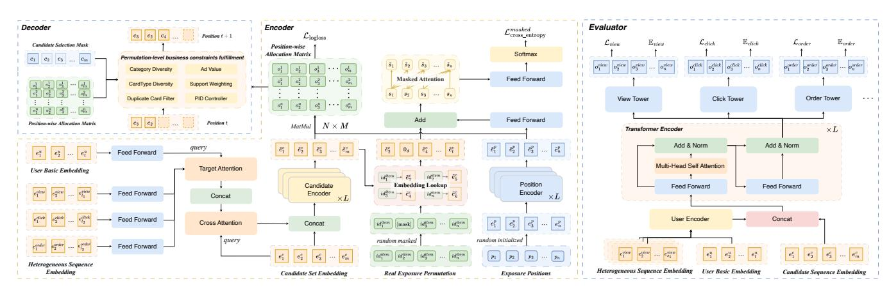

# OMGRec: One-time Matching-based Generative Rerank with Permutation-level Modeling in E-commerce

Junwei Xu∗ Shenzhen Key Laboratory of Ubiquitous Data Enabling , Shenzhen International Graduate School Tsinghua University Shenzhen, China xjw23@mails.tsinghua.edu.cn

Zhibo Xiao Chuxin Chen xiaozhibo.xzb@alibaba-inc.com chenchuxin.ccx@alibaba-inc.com Taobao & Tmall Group of Alibaba Hangzhou, China

Chengyu Lai Qijie Shen lcy477544@alibaba-inc.com qijie.sqj@alibaba-inc.com Taobao & Tmall Group of Alibaba Hangzhou, China

Jiuning Lin Dimin Wang linjiuning.ljn@alibaba-inc.com dimin.wdm@alibaba-inc.com Taobao & Tmall Group of Alibaba Hangzhou, China

Jialin Zhu xiafei.zjl@alibaba-inc.com Taobao & Tmall Group of Alibaba Hangzhou, China

Xiao-Ping Zhang† Shenzhen Key Laboratory of Ubiquitous Data Enabling , Shenzhen International Graduate School Tsinghua University Shenzhen, China xpzhang@ieee.org

### Abstract

Reranking in large-scale e-commerce recommender systems determines the final exposure list by modeling user intent with contextual interactions among candidate items. However, most existing approaches either rely on point-wise scoring, which overlooks permutation-level dependencies, or adopt autoregressive paradigms that enhance context modeling at the cost of prohibitively high inference latency in practical applications. To address these limitations, we present OMGRec, a one-time matching-based generative reranking method. OMGRec employs request-level modeling with a lightweight dual-encoder architecture: a candidate encoder and a position encoder jointly produce a position-wise allocation matrix. Furthermore, a candidate-aware interest fuser dynamically enriches the user representation by attending to heterogeneous behavioral sequences and contextual candidate information, and a permutation perception module leverages masked prediction to explicitly capture permutation-level cues. To prioritize business-critical metrics, we introduce a sample-wise importance weighting scheme driven by user browse depth, clicks, and conversions.

Extensive offline evaluations demonstrate that OMGRec consistently outperforms the baselines, improving HR@20 by +4.27% and NDCG@20 by +2.13%. Large-scale online A/B tests on the Taobao App further show a +0.34% lift in Click, along with +0.39% and +1.88% improvements in Order and GMV, respectively.

### CCS Concepts

### • Information systems → Retrieval models and ranking.

∗This work is done during an internship at Alibaba.

†Corresponding author.

[This work is licensed under a Creative Commons Attribution 4.0 International License.](https://creativecommons.org/licenses/by/4.0) WWW '26, Dubai, United Arab Emirates © 2026 Copyright held by the owner/author(s). ACM ISBN 979-8-4007-2307-0/2026/04 <https://doi.org/10.1145/3774904.3792875>

### Keywords

Recommender System, Re-ranking, Generative Models

### ACM Reference Format:

Junwei Xu, Zhibo Xiao, Chuxin Chen, Chengyu Lai, Qijie Shen, Jiuning Lin, Dimin Wang, Jialin Zhu, and Xiao-Ping Zhang. 2026. OMGRec: One-time Matching-based Generative Rerank with Permutation-level Modeling in E-commerce. In Proceedings of the ACM Web Conference 2026 (WWW '26), April 13–17, 2026, Dubai, United Arab Emirates. ACM, New York, NY, USA, [4](#page-3-0) pages.<https://doi.org/10.1145/3774904.3792875>

# 1 Introduction

Reranking is the final stage of industrial cascaded recommender systems, transforming a scored candidate set into the exposure list that users actually see. Beyond assessing item relevance, effective reranking must reason about permutation-level dependencies [\[7\]](#page-3-1). The combinatorial nature of the reranking task exacerbates both modeling and efficiency challenges. Classic point-wise methods [\[2,](#page-3-2) [3\]](#page-3-3) capture local relevance well, but typically ignore cross-item context and position effects, which limits list-wise quality. Specifically, the key business metrics such as CTR and CVR vary across different positions [\[12\]](#page-3-4). Point-wise rerankers with position-invariant scores cannot model candidates–position interactions, struggling to optimize list-wise utility that depends jointly on which candidates are shown and where they appear.

A growing body of work frames reranking as sequence generation, often with a generator–evaluator paradigm: a generator proposes permutations and an evaluator estimates their list-wise utility [\[4,](#page-3-5) [8,](#page-3-6) [10\]](#page-3-7). For generators, although autoregressive (AR) generation is well-suited for capturing sequential dependencies, it is prone to exposure bias and error propagation, and its sequential decoding induces unacceptable latency[\[9\]](#page-3-8). Non-autoregressive (NAR) alternatives, such as NLGR [\[11\]](#page-3-9) and DCDR [\[5\]](#page-3-10), generate sequences in a faster way, but they still rely on iterative refinement steps with uncertain convergence to enhance overall permutation quality.

We propose OMGRec, a one-time matching-based generative reranking model for e-commerce recommendation. OMGRec achieves

*Permutation-level business constraints fulfillment* one-time inference through a dual-encoder architecture that simultaneously processes candidates and positions, producing a single allocation matrix without iterative refinement. To strengthen user representation, a candidate-aware interest fuser (CIF) dynamically attends to heterogeneous behavioral sequences, aligning user intent with the current candidate set. To inject list-level signals without multiple inference passes, a permutation perception module (PPM) employs masked sequence modeling to learn global permutation cues. Finally, we introduce sample-wise importance weights that prioritize high-quality training sequences to better align optimization with business-critical objectives. Both offline and online experiments on the Taobao App, one of the world's largest e-commerce platforms, confirm the effectiveness and practicality of our method.

Figure 1: Left part shows the overall architecture of OMGRec. Right part illustrates our evaluator model.

# 2 Problem Formulation

Reranking operates on an unordered candidate set C produced by the upstream ranking stage, aiming to select and arrange a subset of candidates into an ordered exposure list V that maximizes expected user engagement. Formally, given a user set U and an item set I, the request-level reranking sample is represented as (��, C, V, Y), where �� ∈ U is the target user, C ⊂ I is the candidate set with |C| = ��, V = [��1, ��2, . . . , ����] is the ordered exposure sequence with �� ≤ ��, and Y = {�� ���� } denotes user feedback. We define �� ���� = 1 if user �� interacts with item ���� at position �� (e.g., click, purchase).

The reranking task is to learn a mapping function �� : (��, C) → V that generates the optimal exposure sequence V∗ . Unlike pointwise rankers that score items independently, reranking must capture cross-candidate dependencies to optimize list-wise utility.

### 3 Methodology

Figure [1](#page-1-0) illustrates the overall architecture of OMGRec. We will elaborate on each component below.

# 3.1 Candidate-aware Interest Fuser

User understanding is critical for personalized reranking; yet, it remains challenging to align heterogeneous behavioral histories with the current candidate set. To address this, we design a Candidateaware Interest Fuser (CIF) to dynamically generate user representations aligned with each candidate.

Specifically, we first obtain the basic user embedding from the user profiles. Heterogeneous behavior sequences (e.g, browsing, adding-to-cart, and purchasing) are encoded and fused with targetaware attention conditioned on the basic embedding. We then concatenate the outputs with the basic embedding to form a comprehensive user context. To align with the candidate set, we embed all candidates and apply cross-attention with candidates as queries and the user context as key–value to produce candidate-aware user signals. The resulting representation is broadcast and concatenated with each candidate embedding for subsequent encoding.

### 3.2 Main Encoder

Our main encoder decouples candidate and position modeling, enabling efficient computation and fine-grained position-awareness.

For each candidate, we concatenate its embedding with the candidate-aware user representation e . The candidate encoder then applies �� layers of Transformer blocks to capture inter-item dependencies. Notably, we incorporate user-aware attention into the candidate encoder by computing the Hadamard product between the output of the vanilla attention and the transformed user representation �� (e ):

Attention∗ (Q, K, V, e �� ) = softmax QK⊤ √ �� V ⊙ �� (e �� ). (1)

Similarly, to model position-specific characteristics, we initialize learnable position embeddings {e �� 1 , e �� 2 , . . . , e �� �� }, where e �� �� ∈ R �� encodes the properties of the ��-th display position. These embeddings are processed by another ��-layer Transformer.

Suppose the encoded candidate and position representations are E˜ �� ∈ R ��×�� and E˜ �� ∈ R ��×�� , we then compute the positionwise allocation matrix via scaled dot-product, which captures the compatibility between each candidate and each position:

Oˆ = softmax E˜ ��E˜ ⊤ �� √ �� ! ∈ R ��×��, (2)

where ��ˆ �� �� is the probability of assigning candidate �� to position ��.

Table 1: Offline performance comparison results. Best results are in bold and second-best are underlined.

Table 2: Online A/B testing on Taobao's homepage feed.

# 4.2 Offline Experiments

Table [1](#page-3-13) summarizes the overall performance of OMGRec and baseline methods. We observe that OMGRec consistently outperforms all baselines across various metrics, demonstrating its effectiveness. It validates the advantages of our one-time matching-based generative reranking approach with permutation-level modeling.

To assess the contributions of key components in OMGRec, we conduct an ablation study by removing specific modules: (1) w/o CIF removes the Candidate-aware Interest Fuser; (2) w/o PPM removes the Permutation Perception Module; (3) w/o �� removes weighted training. Results show that CIF improves user interest modeling by integrating candidate context, and PPM has a particularly significant impact on permutation-level modeling, reflecting on NDCG@20. Weighted training also contributes to better alignment with business objectives, enhancing overall performance.

# 4.3 Online A/B Testing

We deploy OMGRec in Taobao's homepage feed and conduct a large-scale online A/B test. The results can be seen in Table [2.](#page-3-14) While maintaining comparable failover rates, OMGRec demonstrates substantial improvements across all core business metrics compared to the production baseline, a highly-optimized sequential reranking model. These results further confirm the practical effectiveness of OMGRec in a real-world e-commerce setting.

### 5 Conclusion

We presented OMGRec, a one-time matching-based generative reranking method that addresses the fundamental trade-off between permutation-level modeling and online efficiency in large-scale ecommerce recommendation. Extensive experiments on the Taobao App demonstrate that OMGRec consistently outperforms existing baselines in both offline metrics and online A/B testing. Future work may explore advanced methods for permutation-level information injection as well as reinforcement learning.

# Acknowledgments

This research is supported by the Shenzhen Ubiquitous Data Enabling Key Lab under grant ZDSYS20220527171406015 and by the Tsinghua Shenzhen International Graduate School-Shenzhen Pengrui Endowed Professorship Scheme of the Shenzhen Pengrui Foundation.

### References

[1] Irwan Bello, Sayali Kulkarni, Sagar Jain, Craig Boutilier, Ed Chi, Elad Eban, Xiyang Luo, Alan Mackey, and Ofer Meshi. 2019. Seq2slate: Re-ranking and slate optimization with rnns. ICLR (2019). [2] Heng-Tze Cheng, Levent Koc, Jeremiah Harmsen, Tal Shaked, Tushar Chandra, Hrishi Aradhye, Glen Anderson, Greg Corrado, Wei Chai, Mustafa Ispir, Rohan Anil, Zakaria Haque, Lichan Hong, Vihan Jain, Xiaobing Liu, and Hemal Shah. 2016. Wide & Deep Learning for Recommender Systems. In Proceedings of the 1st Workshop on Deep Learning for Recommender Systems (Boston, MA, USA) (DLRS 2016). Association for Computing Machinery, New York, NY, USA, 7–10. [doi:10.1145/2988450.2988454](https://doi.org/10.1145/2988450.2988454) [3] Huifeng Guo, Ruiming Tang, Yunming Ye, Zhenguo Li, and Xiuqiang He. 2017. DeepFM: a factorization-machine based neural network for CTR prediction. arXiv preprint arXiv:1703.04247 (2017). [4] Guangda Huzhang, Zhen-Jia Pang, Yongqing Gao, Yawen Liu, Weijie Shen, Wen-Ji Zhou, Qianying Lin, Qing Da, An-Xiang Zeng, Han Yu, Yang Yu, and Zhi-Hua Zhou. 2023. AliExpress Learning-to-Rank: Maximizing Online Model Performance Without Going Online. IEEE Transactions on Knowledge and Data Engineering 35, 2 (2023), 1214–1226. [doi:10.1109/TKDE.2021.3098898](https://doi.org/10.1109/TKDE.2021.3098898) [5] Xiao Lin, Xiaokai Chen, Chenyang Wang, Hantao Shu, Linfeng Song, Biao Li, and Peng Jiang. 2024. Discrete Conditional Diffusion for Reranking in Recommendation. In Companion Proceedings of the ACM Web Conference 2024 (Singapore, Singapore) (WWW '24). Association for Computing Machinery, New York, NY, USA, 161–169. [doi:10.1145/3589335.3648313](https://doi.org/10.1145/3589335.3648313) [6] Liang Pang, Jun Xu, Qingyao Ai, Yanyan Lan, Xueqi Cheng, and Jirong Wen. 2020. SetRank: Learning a Permutation-Invariant Ranking Model for Information Retrieval. In Proceedings of the 43rd International ACM SIGIR Conference on Research and Development in Information Retrieval (Virtual Event, China) (SI-GIR '20). Association for Computing Machinery, New York, NY, USA, 499–508. [doi:10.1145/3397271.3401104](https://doi.org/10.1145/3397271.3401104) [7] Changhua Pei, Yi Zhang, Yongfeng Zhang, Fei Sun, Xiao Lin, Hanxiao Sun, Jian Wu, Peng Jiang, Junfeng Ge, Wenwu Ou, and Dan Pei. 2019. Personalized re-ranking for recommendation. In Proceedings of the 13th ACM Conference on Recommender Systems (Copenhagen, Denmark) (RecSys '19). Association for Computing Machinery, New York, NY, USA, 3–11. [doi:10.1145/3298689.3347000](https://doi.org/10.1145/3298689.3347000) [8] Yuxin Ren, Qiya Yang, Yichun Wu, Wei Xu, Yalong Wang, and Zhiqiang Zhang. 2024. Non-autoregressive Generative Models for Reranking Recommendation. In Proceedings of the 30th ACM SIGKDD Conference on Knowledge Discovery and Data Mining (Barcelona, Spain) (KDD '24). Association for Computing Machinery, New York, NY, USA, 5625–5634. [doi:10.1145/3637528.3671645](https://doi.org/10.1145/3637528.3671645) [9] Florian Schmidt. 2019. Generalization in Generation: A closer look at Exposure Bias. In Proceedings of the 3rd Workshop on Neural Generation and Translation, Alexandra Birch, Andrew Finch, Hiroaki Hayashi, Ioannis Konstas, Thang Luong, Graham Neubig, Yusuke Oda, and Katsuhito Sudoh (Eds.). Association for Computational Linguistics, Hong Kong, 157–167. [doi:10.18653/v1/D19-5616](https://doi.org/10.18653/v1/D19-5616) [10] Xiaowen Shi, Fan Yang, Ze Wang, Xiaoxu Wu, Muzhi Guan, Guogang Liao, Wang Yongkang, Xingxing Wang, and Dong Wang. 2023. PIER: Permutation-Level Interest-Based End-to-End Re-ranking Framework in E-commerce. In Proceedings of the 29th ACM SIGKDD Conference on Knowledge Discovery and Data Mining (Long Beach, CA, USA) (KDD '23). Association for Computing Machinery, New York, NY, USA, 4823–4831. [doi:10.1145/3580305.3599886](https://doi.org/10.1145/3580305.3599886) [11] Shuli Wang, Xue Wei, Senjie Kou, Chi Wang, Wenshuai Chen, Qi Tang, Yinhua Zhu, Xiong Xiao, and Xingxing Wang. 2025. NLGR: Utilizing Neighbor Lists for Generative Rerank in Personalized Recommendation Systems. In Companion Proceedings of the ACM on Web Conference 2025 (Sydney NSW, Australia) (WWW '25). Association for Computing Machinery, New York, NY, USA, 530–537. [doi:10.](https://doi.org/10.1145/3701716.3715251) [1145/3701716.3715251](https://doi.org/10.1145/3701716.3715251) [12] Ruitao Zhu, Yangsu Liu, Dagui Chen, Zhenjia Ma, Chufeng Shi, Zhenzhe Zheng, Jie Zhang, Jian Xu, Bo Zheng, and Fan Wu. 2025. Contextual Generative Auction with Permutation-level Externalities for Online Advertising. In Proceedings of the 31st ACM SIGKDD Conference on Knowledge Discovery and Data Mining V.1 (Toronto ON, Canada) (KDD '25). Association for Computing Machinery, New York, NY, USA, 2171–2181. [doi:10.1145/3690624.3709313](https://doi.org/10.1145/3690624.3709313)