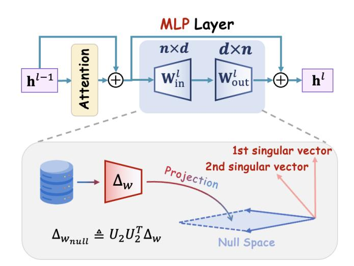

# LPEdit: Locality-Preserving Knowledge Editing for MultiModal Large Language Models

| Tianyu Zhang                         |                                      |
|--------------------------------------|--------------------------------------|
| University of Science and Technology |                                      |
| of China                             |                                      |
| Hefei, Anhui, China                  |                                      |
| Junfeng                              | Fang ∗                               |
| National University                  | of Singapore                         |
| Singapore,                           | Singapore                            |
|                                      | Houcheng Jiang                       |
|                                      | University of Science and Technology |
|                                      | of China                             |
|                                      | Hefei, Anhui, China                  |
| Xingyu Zhu                           |                                      |
| University of Science and Technology |                                      |
| of China                             |                                      |
| Hefei, Anhui, China                  |                                      |
| Xiang                                | Wang                                 |
| University of Science                | and Technology                       |
|                                      | of China                             |
| Hefei,                               | Anhui, China                         |
|                                      | Xiangnan He                          |
|                                      | MoE Key Lab of BIPC, University of   |
|                                      | Science and Technology of China      |
|                                      | Hefei, Anhui, China                  |

### Abstract

Large Language Models (LLMs) and Vision Large Language Models (VLLMs) demonstrate impressive abilities in comprehending natural language and interpreting visual information, but they can also preserve outdated or incorrect information in both forms. Existing knowledge editing methods can efficiently update erroneous text information in LLMs, avoiding the need for full retraining. The locality in knowledge editing refers to that editing should affect only the targeted outputs while preserving the model's behavior on unrelated inputs. Existing multimodal methods often overlook this principle and do not explicitly design to preserve the consistency of unrelated information in both textual and visual modalities. Here, we propose LPEdit, a novel method that leverages the null space projection on key layers to focus editing on conveyed visual information without influencing unrelated knowledge. Experiments show that our method achieves strong performance across different models and datasets. Moreover, our work advances the understanding and development of locality in multimodal knowledge editing.

### CCS Concepts

- Computing methodologies → Artificial intelligence; Information systems → Multimedia information systems.

### Keywords

Multimodal Large Language Models, Knowledge Editing, Model Explainability

### ACM Reference Format:

Tianyu Zhang, Junfeng Fang, Houcheng Jiang, Xingyu Zhu, Xiang Wang, and Xiangnan He. 2026. LPEdit: Locality-Preserving Knowledge Editing for MultiModal Large Language Models. In Proceedings of the ACM Web Conference 2026 (WWW '26), April 13–17, 2026, Dubai, United Arab Emirates. ACM, New York, NY, USA, [4](#page-3-0) pages.<https://doi.org/10.1145/3774904.3792876>

[This work is licensed under a Creative Commons Attribution 4.0 International License.](https://creativecommons.org/licenses/by/4.0) WWW '26, Dubai, United Arab Emirates. © 2026 Copyright held by the owner/author(s). ACM ISBN 979-8-4007-2307-0/2026/04 <https://doi.org/10.1145/3774904.3792876>

## 1 Introduction

LLMs store vast amounts of factual knowledge acquired from largescale pretraining corpora [\[2,](#page-3-1) [19\]](#page-3-2). However, these corpora often contain outdated or incorrect information, prompting growing interest in model editing techniques that can efficiently revise specific knowledge without full retraining. This line of work addresses the need for dynamic updates in deployed models while avoiding the high cost of retraining [\[21\]](#page-3-3). Recent model editing efforts have mainly focused on the text modality and can be broadly classified into two categories. The first directly modifies model parameters to embed new knowledge [\[11,](#page-3-4) [15](#page-3-5)[–17\]](#page-3-6), while the second introduces external mechanisms (e.g., memory modules or adapters) without altering internal weights [\[18,](#page-3-7) [24\]](#page-3-8).

Editing VLLMs introduces unique challenges due to the complex interactions between visual and textual modalities, making it a relatively nascent yet rapidly evolving research area. Prior work has extended text-based editing methods to VLLMs[\[3,](#page-3-9) [6\]](#page-3-10), but results suggest that such editors are often suboptimal due to cross-modal dependencies beyond decoder weights. While recent methods have made notable progress in ensuring the correctness of edited answers, they often struggle to preserve stable behavior on unrelated samples and tasks. As a result, they may introduce unintended failures, such as off-topic responses, factual interference, or linguistic degradation [\[9\]](#page-3-11). These limitations underscore the need to satisfy the accuracy of edited outputs and the reliability of untargeted samples and other tasks at the same time.

To achieve this, we introduce LPEdit, which adopt null space projection to ensure that the model's performance on unrelated inputs remains unaffected while correcting the target outputs. By applying null space projection to the MLP (Multi-Layer Perceptron) projection matrix, we constrain the parameter updates to occur along directions without interfering with prior knowledge. Our method effectively guarantees that the edited model produces correct outputs for target inputs while maintaining stability on unrelated inputs. In this way, our approach not only corrects errors of editing outputs but also avoids introducing biases to irrelevant tasks or degrading the model's essential capabilities. Specifically, in multimodal tasks, we ensure that the interaction between visual and textual information is not disrupted by unnecessary interference.

Table 1: Performance comparison on E-VQA and E-IC datasets on BLIP2-OPT (2.7B) and LLaVA-V1.5 (7B)

| Model Method    | Rel.  | T-Gen. | M-Gen. | E-VQA T-Loc. | M-Loc. | Avg.  | Rel.  | T-Gen. | M-Gen. | E-IC T-Loc. | M-Loc. | Avg.  |
|-----------------|-------|--------|--------|--------------|--------|-------|-------|--------|--------|-------------|--------|-------|
| FT-V            | 23.00 | 15.41  | 19.08  | 97.87        | 86.97  | 48.47 | 40.14 | 38.66  | 34.65  | 98.94       | 88.39  | 60.16 |
| FT-L            | 23.63 | 15.86  | 19.94  | 96.75        | 88.41  | 48.92 | 40.00 | 38.15  | 35.41  | 98.02       | 87.46  | 59.81 |
| IKE             | 97.31 | 89.80  | 90.17  | 12.38        | 1.77   | 58.35 | 95.38 | 76.48  | 81.16  | 12.67       | 2.05   | 53.55 |
| SERAC           | 89.25 | 90.41  | 88.47  | 100.00       | 0.31   | 73.69 | 92.59 | 93.79  | 89.68  | 100.00      | 0.45   | 75.30 |
| MEND BLIP2-OPT  | 90.59 | 89.86  | 90.46  | 94.52        | 63.74  | 85.83 | 64.23 | 35.88  | 34.21  | 90.99       | 55.07  | 56.08 |
| TP              | 66.64 | 59.39  | 55.04  | 97.50        | 83.77  | 72.47 | 47.03 | 46.72  | 42.92  | 91.65       | 79.16  | 61.50 |
| LTE             | 95.78 | 96.18  | 95.15  | 93.09        | 83.56  | 92.75 | 94.50 | 93.76  | 92.66  | 93.22       | 86.70  | 92.17 |
| VisEdit         | 96.66 | 96.74  | 97.39  | 100.00       | 90.04  | 96.17 | 95.82 | 95.02  | 93.66  | 100.00      | 90.63  | 95.03 |
| LPEdit          | 97.74 | 97.53  | 96.86  | 100.00       | 97.41  | 97.91 | 96.44 | 96.02  | 93.97  | 100.00      | 94.58  | 96.20 |
| FT-V            | 29.92 | 28.19  | 25.87  | 98.32        | 89.97  | 54.45 | 52.02 | 50.85  | 46.23  | 98.30       | 91.12  | 67.70 |
| FT-L            | 30.06 | 29.03  | 25.89  | 98.54        | 90.66  | 54.84 | 51.91 | 50.25  | 46.98  | 97.59       | 93.78  | 68.10 |
| IKE             | 89.88 | 89.15  | 89.17  | 59.32        | 50.56  | 75.62 | 92.49 | 86.66  | 78.46  | 74.88       | 64.11  | 79.32 |
| SERAC           | 80.78 | 79.86  | 78.87  | 100.00       | 56.17  | 79.14 | 41.23 | 39.98  | 40.99  | 100.00      | 7.29   | 45.90 |
| MEND LLaVA-V1.5 | 90.06 | 90.52  | 90.52  | 89.43        | 80.11  | 88.13 | 91.90 | 92.43  | 90.81  | 89.46       | 85.44  | 90.01 |
| TP              | 47.35 | 46.97  | 43.05  | 93.62        | 89.30  | 64.06 | 57.86 | 56.23  | 54.28  | 63.35       | 87.04  | 63.75 |
| LTE             | 92.99 | 92.12  | 91.57  | 81.73        | 79.70  | 87.62 | 92.04 | 90.77  | 89.78  | 84.38       | 87.21  | 88.84 |
| VisEdit         | 95.12 | 95.02  | 93.85  | 100.00       | 93.97  | 95.59 | 95.06 | 94.19  | 93.12  | 100.00      | 94.74  | 95.42 |
| LPEdit          | 95.15 | 94.98  | 93.92  | 100.00       | 98.39  | 96.49 | 95.23 | 94.50  | 93.43  | 100.00      | 97.41  | 96.11 |

correlations among input features without mean subtraction. Since not every covariance matrix possesses a strict null space in practice, we approximate it via singular value decomposition (SVD) [\[23\]](#page-3-21).

To formalize, SVD factorizes the covariance matrix as

�� = �� Σ�� ⊤ , (4)

where Σ = diag(��1, . . . , ���� ) with ��1 ≥ · · · ≥ ���� ≥ 0. This admits the spectral expansion

�� = ∑︁ �� ��=1 ���� ������ ⊤ �� , (5)

where ���� are the singular vectors of ��. Small singular values ���� indicate weakly expressed representation directions, which form an approximate null subspace.

### 3.3 Low-Variance Projection for Editing

Building on the representation decomposition introduced above, we now describe how to constrain model updates using low-variance directions identified via singular value analysis. Specifically, we partition �� = [��1,��2] such that it ��1 spans high-variance (informative) directions and ��2 spans near-zero singular directions. We therefore restrict model updates to the null subspace by projecting the gradient:

Δ��null = ��2�� ⊤ 2 Δ��, (6)

ensuring that only low-energy directions are modified while the primary representational subspace remains intact.

We apply this projection to the MLP projection matrices in highcontribution layers, identified via consistently high gradient norms on the editing loss. MLPs are chosen over attention layers for their

localized role in intra-token transformations and factual encoding. The projection confines updates to the null space formed by lowsingular-value directions, avoiding interference with the primary representational structure. By restricting edits to this low-impact subspace, the model incorporates new factual associations while keeping its responses to unrelated visual and textual inputs intact.

### 4 Experiments

### 4.1 Experiment Setting

Datasets: In line with Cheng et al. [\[6\]](#page-3-10), we use E-VQA and E-IC as benchmark datasets for evaluating editing performance. E-VQA comprises 6,345 training and 2,093 testing examples from the VQAv2 benchmark [\[1\]](#page-3-22), where the model answers questions about images based on both visual and textual input. E-IC, derived from the COCO Caption dataset [\[5\]](#page-3-23), targets caption correction and includes 2,849 training and 1,000 testing samples.

VLLM Backbones: To ensure a comprehensive evaluation on scale and architecture, we select two representative VLLMs for experimentation: BLIP2-OPT (2.7B) [\[12\]](#page-3-17), LLaVA-V1.5 (7B) [\[13\]](#page-3-18). Evaluation metrics: We use Rel., T-Gen., M-Gen., T-Loc., M-Loc., and Avg. to denote Reliability, Textual Generality, Multimodal Generality, Textual Locality, Multimodal Locality, and the average score of these five metrics. All scores are reported in percentage format. Baselines: Existing approaches primarily adapt LLM editors in the multimodal setting [\[6\]](#page-3-10). We include several representative baselines in our evaluation: FT-V (fine-tuning the visual encoder), TF-L (finetuning the final language model layer)[\[22\]](#page-3-24), IKE [\[24\]](#page-3-8), SERAC [\[18\]](#page-3-7), MEND [\[17\]](#page-3-6), TP [\[10\]](#page-3-13), and LTE [\[11\]](#page-3-4).

Table 2: Performance comparison on Qwen2.5-VL (7B)

| Dataset Method | Rel.  | T-Gen. | M-Gen. | T-Loc. | M-Loc. | Avg.  |
|----------------|-------|--------|--------|--------|--------|-------|
| TP             | 51.75 | 45.80  | 46.64  | 94.54  | 89.06  | 65.56 |
| LTE E-VQA      | 93.86 | 92.83  | 92.25  | 89.19  | 85.60  | 90.75 |
| VisEdit        | 96.59 | 96.21  | 95.10  | 100.00 | 90.57  | 95.69 |
| LPEdit         | 96.81 | 97.63  | 97.74  | 100.00 | 99.27  | 98.29 |
| TP             | 57.49 | 58.27  | 55.93  | 67.72  | 78.16  | 63.52 |
| LTE E-IC       | 92.96 | 92.12  | 90.13  | 88.74  | 83.27  | 89.44 |
| VisEdit        | 95.22 | 94.48  | 92.98  | 100.00 | 90.26  | 94.59 |
| LPEdit         | 96.25 | 96.09  | 94.34  | 100.00 | 98.61  | 97.06 |

## 4.2 Analysis of Editing Performance

Table [1](#page-2-0) presents the overall editing results. In the following, we provide a detailed experimental analysis from multiple perspectives. In terms of methods, LPEdit exhibits the strongest overall performance among all editing methods, particularly excelling in both locality metrics (T-Loc and M-Loc). VisEdit stands out as the most effective among existing baselines, leveraging precise visual-pathway manipulations across diverse evaluation dimensions. LTE achieves competitive results through fine-tuning, but shows limitations in maintaining stable performance on non-edited outputs.

In terms of datasets, editing on E-VQA generally yields higher performance, as the required corrections typically involve modifying short, discrete answers or a few key tokens in response to visual questions. These edits are often localized and less entangled with the broader input context, making it easier for the model to apply targeted updates. In contrast, E-IC requires full-sentence caption rewriting grounded in comprehensive image understanding, which poses greater challenges for maintaining locality.

In terms of models, most editors demonstrate greater stability on BLIP2-OPT, likely due to clearer modular separation between visual and language pathways, allowing local interventions to remain more contained. In contrast, LLaVA-V1.5 integrates visual features more deeply into the language decoder, making localized editing more difficult and leading to increased performance variation among editors. This highlights the importance of architectural compatibility in multimodal editing. Qwen2.5-VL exhibits consistently higher editing robustness relative to LLaVA, suggesting that its modular interaction between visual encoders and the language backbone facilitates localized parameter adjustments.

In terms of evaluation metrics, LPEdit achieves the highest performance on both textual and visual locality metrics, indicating strong consistency on unrelated samples across modalities. FT-V and VisEdit, which apply edits to the visual modality, naturally preserve the language generation pathway and maintain linguistic locality and overall output quality. SERAC leverages a classifier to identify purely textual inputs, which helps maintain locality on the language side but oversees visual samples. Methods with lower overall performance often exhibit high locality at the expense of reliability and generality, suggesting that these objectives are difficult to satisfy simultaneously. In contrast, LPEdit demonstrates a more balanced performance: it significantly enhances locality while maintaining competitive reliability and generality.

### 5 Conclusions

We present LPEdit, a locality-preserving method using null-space projection for multimodal knowledge editing. By constraining parameter updates to directions that minimally affect unrelated knowledge, our method achieves accurate edits while preserving model behavior on non-target information. Experimental results across multiple models and tasks demonstrate LPEdit's effectiveness and generalization ability, showcasing its potiential to make reliable and general knowledge editing in multimodal systems.

### Acknowledgments

This research is supported by National Natural Science Foundation of China (U24B20180, 62525211).

### References

[1] Stanislaw Antol, Aishwarya Agrawal, Jiasen Lu, et al. 2015. VQA: Visual Question Answering. In ICCV. [2] Shuai Bai, Keqin Chen, Xuejing Liu, et al. 2025. Qwen2.5-VL Technical Report. CoRR abs/2502.13923 (2025). arXiv[:2502.13923](https://arxiv.org/abs/2502.13923) [3] Samyadeep Basu, Martin Grayson, Cecily Morrison, Besmira Nushi, Soheil Feizi, and Daniela Massiceti. 2024. Understanding Information Storage and Transfer in Multi-Modal Large Language Models. In NeurIPS. [4] Qizhou Chen, Taolin Zhang, Chengyu Wang, Xiaofeng He, Dakan Wang, and Tingting Liu. 2025. Attribution Analysis Meets Model Editing: Advancing Knowledge Correction in Vision Language Models with VisEdit. In AAAI. [5] Xinlei Chen, Hao Fang, Tsung-Yi Lin, et al. 2015. Microsoft COCO Captions: Data Collection and Evaluation Server. CoRR abs/1504.00325 (2015). arXiv[:1504.00325](https://arxiv.org/abs/1504.00325) [6] Siyuan Cheng, Bozhong Tian, Qingbin Liu, Xi Chen, Yongheng Wang, Huajun Chen, and Ningyu Zhang. 2023. Can We Edit Multimodal Large Language Models?. In EMNLP. [7] Alexey Dosovitskiy, Lucas Beyer, Alexander Kolesnikov, et al. 2021. An Image is Worth 16x16 Words: Transformers for Image Recognition at Scale. In ICLR. [8] Yifan Du, Zikang Liu, Junyi Li, and Wayne Xin Zhao. 2022. A Survey of Vision-Language Pre-Trained Models. In IJCAI. [9] Jia-Chen Gu, Hao-Xiang Xu, Jun-Yu Ma, Pan Lu, Zhen-Hua Ling, Kai-Wei Chang, and Nanyun Peng. 2024. Model Editing Can Hurt General Abilities of Large Language Models. CoRR abs/2401.04700 (2024). [10] Zeyu Huang, Yikang Shen, Xiaofeng Zhang, Jie Zhou, Wenge Rong, and Zhang Xiong. 2023. Transformer-Patcher: One Mistake Worth One Neuron. In ICLR. [11] Yuxin Jiang, Yufei Wang, Chuhan Wu, Wanjun Zhong, Xingshan Zeng, Jiahui Gao, Liangyou Li, Xin Jiang, Lifeng Shang, Ruiming Tang, Qun Liu, and Wei Wang. 2024. Learning to Edit: Aligning LLMs with Knowledge Editing. In ACL. [12] Junnan Li, Dongxu Li, Silvio Savarese, and Steven C. H. Hoi. 2023. BLIP-2: Bootstrapping Language-Image Pre-training with Frozen Image Encoders and Large Language Models. In ICML, Vol. 202. [13] Haotian Liu, Chunyuan Li, Qingyang Wu, and Yong Jae Lee. 2023. Visual Instruction Tuning. In NeurIPS. [14] Jiasen Lu, Dhruv Batra, Devi Parikh, and Stefan Lee. 2019. ViLBERT: Pretraining Task-Agnostic Visiolinguistic Representations for Vision-and-Language Tasks. In NeurIPS. [15] Kevin Meng, David Bau, Alex Andonian, and Yonatan Belinkov. 2022. Locating and Editing Factual Associations in GPT. In NeurIPS. [16] Kevin Meng, Arnab Sen Sharma, Alex J. Andonian, Yonatan Belinkov, and David Bau. 2023. Mass-Editing Memory in a Transformer. In ICLR. [17] Eric Mitchell, Charles Lin, Antoine Bosselut, Chelsea Finn, and Christopher D. Manning. 2022. Fast Model Editing at Scale. In ICLR. [18] Eric Mitchell, Charles Lin, Antoine Bosselut, Christopher D. Manning, and Chelsea Finn. 2022. Memory-Based Model Editing at Scale. In ICML. [19] OpenAI. 2023. GPT-4 Technical Report. CoRR abs/2303.08774 (2023). [20] Kaihang Pan, Zhaoyu Fan, Juncheng Li, Qifan Yu, Hao Fei, Siliang Tang, Richang Hong, Hanwang Zhang, and Qianru Sun. 2024. Towards Unified Multimodal Editing with Enhanced Knowledge Collaboration. In NeurIPS. [21] Fabio Petroni, Tim Rocktäschel, Sebastian Riedel, et al. 2019. Language Models as Knowledge Bases?. In EMNLP. [22] Katherine Tian, Eric Mitchell, Huaxiu Yao, Christopher D. Manning, and Chelsea Finn. 2024. Fine-Tuning Language Models for Factuality. In ICLR. [23] Shipeng Wang, Xiaorong Li, Jian Sun, and Zongben Xu. 2021. Training Networks in Null Space of Feature Covariance for Continual Learning. In CVPR. [24] Ce Zheng, Lei Li, Qingxiu Dong, Yuxuan Fan, Zhiyong Wu, Jingjing Xu, and Baobao Chang. 2023. Can We Edit Factual Knowledge by In-Context Learning? CoRR abs/2305.12740 (2023).