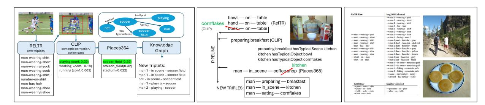

# Img2KG: Ontology-Driven Correction of Visual Triples

Christina Kanetou

Institute of Computer Science, Foundation for Research and Technology – Hellas (FORTH)

Heraklion, Greece

Computer Science Department, University of Crete Heraklion, Greece

kanetouchristina@gmail.com

Yannis Tzitzikas

Institute of Computer Science, Foundation for Research and Technology – Hellas (FORTH)

Heraklion, Greece

Computer Science Department, University of Crete Heraklion, Greece tzitzik@ics.forth.gr

# Abstract

Scene Graph Generation (SGG) models such as RelTR accurately localize objects but often produce semantically inconsistent or contextually implausible relations. We present Img2KG, a hybrid neurosymbolic framework whose core contribution is an ontology-driven correction layer that repairs, enriches, and re-ranks visual triples predicted by neural detectors. Img2KG integrates RelTR (initial triples), CLIP (open-vocabulary grounding), and Places365 (scene priors), but its distinctive component is a semantic Knowledge Graph (KG) imposing conceptual constraints on entities, relations, and activities. We formalize the correction process as an operator that maps raw triples to semantically valid ones using ontology-guided compatibility scoring and predicate re-selection. Experiments on Visual Genome show improvements in relational validity, semantic diversity (Scene Entropy), and contextual coherence. Qualitative results demonstrate label revision, predicate correction, scene realignment, and action inference. To showcase the gain of the proposed approach, we make public an indicative curated set of 100 diverse Visual Genome examples.

# CCS Concepts

• Information systems → Ontologies; • Computing methodologies → Scene understanding; Activity recognition and understanding; Visual inspection.

# Keywords

Scene Graph Generation, Ontology Reasoning, Neuro-Symbolic AI, Open-Vocabulary Vision, Knowledge Graphs, Scene Understanding

#### ACM Reference Format:

Christina Kanetou and Yannis Tzitzikas. 2026. Img2KG: Ontology-Driven Correction of Visual Triples. In Proceedings of the ACM Web Conference 2026 (WWW '26), April 13–17, 2026, Dubai, United Arab Emirates. ACM, New York, NY, USA, [4](#page-3-0) pages.<https://doi.org/10.1145/3774904.3792877>

# 1 Introduction

Understanding an image requires identifying not only what objects are present but also how they relate. Transformer-based SGG models such as RelTR [\[3\]](#page-3-1) have advanced visual relation extraction, yet they remain vulnerable to semantic inconsistencies: mislabeling

[This work is licensed under a Creative Commons Attribution 4.0 International License.](https://creativecommons.org/licenses/by/4.0) WWW '26, Dubai, United Arab Emirates

© 2026 Copyright held by the owner/author(s). ACM ISBN 979-8-4007-2307-0/2026/04 <https://doi.org/10.1145/3774904.3792877>

a cereal box as a "book", predicting an indoor "coffee shop" despite domestic objects, or generating incorrect relationships such as "hand–on–table" when the hand is not touching the surface. Such inconsistencies arise from the absence of explicit reasoning mechanisms and structured semantic knowledge.

Research Gap. Current SGG approaches primarily rely on statistical patterns learned from training data. They lack mechanisms for enforcing semantic plausibility, contextual compatibility, or commonsense grounding.

Hypothesis. A structured ontology integrated with neural predictions can correct implausible relations, disambiguate noisy labels, and enrich scene interpretations with inferred knowledge.

Contribution. We introduce an Ontology-Driven Correction Layer that maps raw triples �� = {(���� , ���� , ����)} to refined triples �� ′ = Φ(�� ), and this layer:

- enforces entity–predicate constraints from a domain ontology,
- resolves ambiguous labels using ontological typing + CLIP [\[8\]](#page-3-2) (open-vocabulary grounding) similarity,
- enriches triples via action inference and scene realignment,
- improves semantic diversity and consistency beyond closed vocabularies. The proposed pipeline and example corrections are shown in Fig. [1,](#page-1-0)

the image examples are from Visual Genome [\[4\]](#page-3-3).

# 2 Motivating Examples

Before describing the methodology, we highlight typical errors made by tools and how the ontology resolves them:

(1) Misclassified Objects. A cereal box is detected as "book". CLIP similarity and ontological associations with bowls, spoons, and milk allow the correction layer to reassign it to "cornflakes box". (2) Incorrect Scene Type. Places365 predicts a "coffee shop", yet detected objects (bowl, milk, cereal box) strongly indicate a "kitchen". The ontology re-ranks scenes based on object–scene compatibility. (3) Implausible Relations. RelTR may output relations such as "window–on–table" or "head–on–bowl" due to accidental boundingbox overlap. Ontology rules identify these as physically or semantically impossible and remove them, preserving only meaningful anatomical or object-based relations.

(4) Missing Higher-Level Relations. From objects such as {man, bowl, cereal box, milk}, the ontology infers actions such as man– preparing–breakfast.

These examples demonstrate the necessity of structured correction mechanisms.

Figure 1: Left: Overview of the Img2KG pipeline integrating RelTR, CLIP, Places365, and the ontology-driven correction layer. Middle: Example of contextual correction showing how noisy RelTR triples are revised using CLIP, Places365, and ontology rules. Right: At the left side we see the raw RelTR triples and on the right Img2KG corrections and contextual enrichments.

#### 3 Related Work

Scene Graph Generation. Early models such as VTransE [\[11\]](#page-3-4), IMP [\[9\]](#page-3-5), and KERN [\[1\]](#page-3-6) relied on statistical co-occurrence priors. Transformer-based models like SGTR [\[6\]](#page-3-7) and RelTR [\[3\]](#page-3-1) improve relational prediction but remain limited by closed vocabularies and lack semantic validation mechanisms.

Neuro-Symbolic Reasoning. Knowledge-augmented systems such as ZSVQA [\[2\]](#page-3-8) demonstrate that KGs can support answer reasoning, but they do not modify underlying scene representations. Prior work does not correct or refine SGG outputs.

Open-Vocabulary Visual Understanding. Models like CLIP enable category refinement using text–image alignment, but do not enforce relational compatibility. In Img2KG, CLIP provides perceptual cues while the ontology performs symbolic reasoning.

Semantic-Prior and Constraint-Based SGG. MotifNet [\[10\]](#page-3-9), GPS-Net [\[7\]](#page-3-10), ReGAT [\[5\]](#page-3-11), and GB-Net [\[12\]](#page-3-12) incorporate semantic or attentional priors. However, these approaches remain statistical rather than ontological and cannot correct incorrect triples or enforce domain/range constraints as in Img2KG.

# 4 Methodology

Img2KG adopts a hybrid two–stage architecture consisting of: (1) a neural perception layer that produces open-vocabulary visual evidence, and (2) an ontology-driven reasoning layer that validates, corrects, and enriches the extracted triples using semantic and contextual constraints.

# 4.1 Neural Perception: Initial Triple Extraction

RelTR serves as the primary perception module, producing an initial set of scene-graph triples �� = {(���� , ���� , ����)}, together with bounding boxes and confidence scores. Two additional components refine these predictions:

- Global CLIP inference. A single forward pass over the full image yields a semantic embedding that provides high-level cues for actions and coarse object categories.
- Local CLIP inference. Each detected region is re-encoded with CLIP to disambiguate coarse or ambiguous labels (e.g., "fruit" → "banana", "seat" → "sofa") and to verify the plausibility of predicted object types.
- Places365 scene cues. Top-�� scene predictions (e.g., kitchen, office, soccer field) act as global context priors that inform downstream semantic compatibility checks.

Outputs from these perceptual modules are consolidated into a unified representation of the scene.

Auxiliary Perceptual Cues. Beyond object and relation predictions, Img2KG extracts lightweight cues that support semantic correction. Dominant object colors are estimated via masked color histograms, enabling hasColor attribute inference. Human facing direction is computed from the geometry of head and torso boxes, supporting relations such as man 1 – facing – man 2. These cues enrich the perceptual evidence without requiring additional heavy models.

# 4.2 Ontology and Compatibility Model

Img2KG integrates a curated ontology encoding object types, actions, scenes, typical tools, typical objects, and domain/range constraints. This knowledge enables two complementary forms of reasoning:

- Semantic compatibility. Candidate triples are checked against ontological constraints (e.g., cup – on – table is permissible, whereas shirt – on – table is rejected), and action–scene pairs are validated for contextual coherence.
- Contextual enrichment. The ontology defines expected tools and objects for each action and scene. This allows Img2KG to infer missing but contextually required triples (e.g., working + office ⇒ computer; playing + soccer field ⇒ ball, net). Such rules yield enriched relations like man – in\_front\_of – computer and man – playing – soccer.

The final output is a set of corrected, validated, and enriched triples that are both semantically coherent and contextually grounded.

We used an ontology in the form of a directed labelled graph ���� = (�� , ��), containing ∼180 object, action, material, and scene classes, and 30 relation types. Each predicate is annotated with explicit domain and range constraints: dom(��), ran(��) ⊆ �� . The contextual rules that we employ (e.g., hasTypicalObject, hasScene) model object–scene coherence such as bowls and cereal boxes being typical of "kitchen" scenes, while skis and snow are incompatible with "beach". Based on the above, for each triple, we define the semantic compatibility score as:

��(��, ��, ��) = ��1 ∗ ��������������(��, ��) + ��2 ∗ ��������������(��, ��) + ��3 ∗ sim�������� (��, ��) + ��4 ∗ ctx(��, ��, ��),

where ��������������(��, ��) = 1 if �� ∈ ������(��), otherwise 0,

��������������(��, ��) = 1 if �� ∈ ������(��), otherwise 0,

�������������� (��, ��) is the similarity as produced by CLIP, and

������ (��, ��, ��) = incorporates Places365 scene priors and ontology rules. The weights ���� were selected through light manual tuning on a held-out set of 150 images. Since our model is hybrid rather than learned end-to-end, each weight controls the relative importance of a different evidence source (ontological validity, perceptual similarity, and contextual cues). We iteratively adjusted the weights by inspecting cases in which the system made semantically implausible predictions (e.g., invalid subject–predicate domain, scene–incompatible actions), increasing the contribution of the corresponding term until the final triples became consistent across the validation set. This procedure stabilizes the compatibility function while avoiding overfitting, and reflects the complementary roles of symbolic constraints (��1,��2), CLIP similarity (��3), and scene/ontology context (��4).

# 4.3 Correction Operator

The correction operator Φ : �� → �� ′ updates labels or predicates whenever a more compatible alternative (i.e. with higher semantic compatibility score) exists. The corrections include:

- Label revision: e.g., "bag" → "backpack", "book" → "cereal box".
- Predicate repair: removing or replacing implausible relations (e.g., "car–on–tree" → "car–next to–tree").
- Scene re-ranking: Places365 predictions are adjusted using object–scene compatibility.
- Action inference: high-level actions are introduced when typical object sets appear (e.g., {man, bat, helmet} → playing baseball).
- Contextual object replacement. If a human is detected holding an object that is incompatible with the inferred scene, the system replaces it with a scene-appropriate alternative. For example, in a bowling alley the implausible prediction "man holding skateboard" is corrected to "man holding bowling ball" considering that sufficient visual and contextual evidence supports the latter.

Implementation Details. The pipeline is implemented in Python 3.10 using PyTorch 2.0, RDFlib, and NumPy. Execution proceeds sequentially: (1) RelTR for raw structured predictions, (2) CLIP (global + local) for semantic refinement, (3) Places365 for scene priors, (4) Ontology-based compatibility scoring, (5) Correction operator Φ for final enriched triples. All intermediate steps are logged and can be exported to an interactive HTML interface for human evaluation.

# 5 Evaluation and Results

Functional Comparison. Table [1](#page-2-0) summarizes capabilities relative to representative SGG models.

Table 1: Comparing Img2KG and other SGG systems.

Quantitative and Qualitative Evaluation. Below we evaluate Img2KG across both quantitative and qualitative dimensions using the Visual Genome (VG) dataset (108,077 images). We selected this dataset because it is considered one of the hardest and contains images from various domains. To showcase the behaviour of the pipeline, we have made public[1](#page-2-1) a curated set of 100 diverse examples covering sports, outdoor, indoor, and work scenarios. Our aim is not to compete with closed-vocabulary SGG baselines on VG's recall-oriented metrics, which favor co-occurrence patterns and trivial part–whole relations, but to assess whether an ontologydriven layer can increase semantic validity, contextual coherence, and structural diversity in extracted visual triples.

Semantic-Aware Matching Procedure. To evaluate open vocabulary scene–graph outputs, we employ a custom semantic-aware matching function that compares triples at the conceptual rather than purely lexical level. Both VG and Img2KG triples are first normalized through synonym and singular/plural resolution, predicate canonicalization (e.g., "wears", "wearing", "has on" → wearing), and removal of trivial anatomical VG relations (e.g., woman–has–hand). The evaluation then applies a match-strength rule (1.0, 0.5, 0) and highlights strict (green) and contextual (yellow) matches through an HTML interface, enabling consistent quantitative scoring and transparent qualitative inspection.

Strict vs. Contextual Equivalence. Since Img2KG operates in an open-vocabulary setting, VG and Img2KG may express the same fact using different but semantically identical forms (e.g., singular/plural variants, near-synonyms, or canonical part–whole inversions such as building–has–window vs. window–on–building). A strict match (green) is therefore assigned only when two triples are semantically equivalent after canonicalization (same predicate class and same entities up to synonym and number normalization). Non-identical but contextually compatible triples receive soft credit (yellow). All equivalence rules are global and ontology-based, with no per-image tuning.

#### Quantitative Metrics.

- Human Validation Rate (HVR). Three annotators judged predicted triples as correct or incorrect, and we compute: ���� �� = #correct #total .
- Concept Recall. To capture semantic coverage independently of phrasing, we compute: ���� = |��pred∩��GT | |��GT | , where �� is the set of unique subjects, predicates, and objects. This measures whether Img2KG recovers VG's conceptual space.
- Predicate Diversity (Scene Entropy). We quantify relational expressiveness through predicate entropy, in the sense that higher entropy indicates richer and more contextual relation structures. We use: �� = − Í �� ��(��) log ��(��), Δ�� = ��ours − ��VG.
- Graph Coverage. We measure scene completeness using: ���������������� = |��pred | |��VG | . Values &gt; 1 reflect valid relations that VG does not annotate (e.g., colors, weather, surface types, inferred actions), indicating a richer graph.
- Strict ��1: requires exact (��, ��, ��) match with VG.
- Soft ��1: grants partial credit using a match-strength function match(��, ��′ ) ∈ {1, 0.5, 0} for lexically or ontologically compatible triples (e.g., shirt–on–man ∼ man–wearing–shirt).

1<https://demos.isl.ics.forth.gr/Img2KG/>

Table [2](#page-3-13) reports the quantitative results over a 1,000-image subset of Visual Genome that was randomly selected. Since Img2KG produces open-vocabulary triples and contextually inferred relations, traditional Recall@K metrics used in SGG (e.g., [\[1,](#page-3-6) [3,](#page-3-1) [10\]](#page-3-9)) are not directly applicable. Instead, we adopt the semantic-aware measures described above, which quantify correctness (Strict/Soft ��1), conceptual coverage, and structural diversity.

Table 2: Evaluation of Img2KG vs. RelTR on 1,000 VG images.

The Human Validation Rate (HVR) of 98.5% indicates that almost all triples produced by Img2KG are judged as semantically correct by annotators, even when absent from the VG ground truth. Concept Recall of 55% further shows that Img2KG recovers more than half of the unique entities and predicates appearing in VG, despite operating with an expanded open-label space. Scene entropy also increases markedly, with a positive Scene Entropy Gap of Δ�� = +0.85, addressing the known predicate imbalance of VG. Beyond correctness, Img2KG produces substantially richer scene graphs, achieving a Graph Coverage of 3.10× relative to VG. This reflects the system's ability to infer plausible but unannotated relations—such as scene affordances, action-specific tools, and commonsense spatial links. Img2KG achieves a Strict ��1 of 30% and a Soft ��1 of 41%, which are substantially higher than what is typically observed in SGG models when evaluated with strict triplelevel criteria, where even strong baselines such as IMP, MotifNet, KERN, and RelTR [\[1,](#page-3-6) [3,](#page-3-1) [9,](#page-3-5) [10\]](#page-3-9) are known to perform poorly due to long-tail predicates, annotation sparsity, and the limitations of closed-vocabulary training. Overall, these results demonstrate that combining neural perception with symbolic reasoning yields more coherent, complete, and contextually grounded scene graphs than purely statistical SGG models.

Qualitative Analysis. Qualitative evaluation highlights the strengths of the ontology-driven layer:

- Label corrections: e.g., replacing "book" with cereal box or "fruit" with banana.
- Predicate corrections: e.g., "car–on–tree" → "car–next to–tree".
- Scene realignment: preferring kitchen over coffee shop when food-related objects dominate.
- Action inference: {man, bat, helmet} → man–playing–baseball.
- High-level reasoning: generating relations absent in VG, e.g.: man – preparing breakfast – kitchen, car – parked on – street, tree – next to – sidewalk, man 1 – facing – woman 2.

As illustrated in Fig. [1\(](#page-1-0)Right) Img2KG consistently improves contextual coherence and produces a more interpretable scene representation than raw RelTR predictions alone.

# 6 Concluding Remarks

Img2KG demonstrates that lightweight ontology-driven reasoning can substantially improve the semantic validity, contextual coherence, and interpretability of visual triples produced by neural SGG

models. Across Visual Genome and a curated set of 100 diverse images, Img2KG corrected or enriched approximately all of raw RelTR predictions (strict or soft matches), while also recovering valid but unannotated relations, highlighting the value of hybrid neurosymbolic pipelines in open-vocabulary settings, reaching HVR (Human Validation Rate) 98.5%. We could not report comparative results with other systems, since, as evidenced from Table [1,](#page-2-0) to the best of our knowledge, there is not any other system that supports the same functionality to compare with. Several examples that showcase the functionality are available at [https://demos.isl.ics.forth.gr/Img2KG/.](https://demos.isl.ics.forth.gr/Img2KG/) Limitations and Further Research. Despite these gains, several limitations, and issues for further research, remain. The ontology is compact and manually curated, which keeps reasoning transparent but constrains coverage of long-tail concepts and domain-specific entities. Nevertheless, we should note that currently there are ontologies for almost every domain, and there has been progress also in producing ontologies through LLMs. Moreover, certain components rely on heuristic compatibility thresholds rather than learned scoring functions, which may impact robustness under substantial domain shifts. Finally, the overall performance remains fundamentally tied to the quality of upstream detections: missed or poorly localized objects cannot be fully recovered through semantic reasoning. All these are issues for further work and research. Overall, our findings show that combining neural perception with structured semantic knowledge offers measurable and interpretable improvements over purely statistical SGG models, reinforcing the importance of hybrid approaches in visual understanding.

# References

[1] Long Chen, Hanwang Zhang, Jun Xiao, et al. 2019. Knowledge-Embedded Routing Network for Scene Graph Generation. In Proceedings of the IEEE/CVF Conference on Computer Vision and Pattern Recognition (CVPR). 6163–6172. [2] Xinyu Chen, Xiaoyang Wang, and Yixin Zhu. 2021. Zero-Shot Visual Question Answering Using Knowledge Graphs. In Proceedings of the AAAI Conference on Artificial Intelligence. 1210–1218. [3] Yuliang Cong, Yiming Liao, Yuxin Zhao, Dong Xu, and Jiebo Luo. 2023. RelTR: Relation Transformer for Scene Graph Generation. In Proceedings of the IEEE/CVF International Conference on Computer Vision (ICCV). 19653–19663. [4] Ranjay Krishna et al. 2017. Visual genome: Connecting language and vision using crowdsourced dense image annotations. International journal of computer vision 123, 1 (2017). [5] Linjie Li, Zhe Gan, Yu Cheng, and Jingjing Liu. 2019. Relation-Aware Graph Attention Network for Visual Question Answering. In Proceedings of the IEEE/CVF International Conference on Computer Vision (ICCV). 10313–10322. [6] Yikang Li, Wenhai Wang, Xizhou Zhang, and Jian Sun. 2023. SGTR: End-to-End Scene Graph Generation with Transformer. In Proceedings of the IEEE/CVF Conference on Computer Vision and Pattern Recognition (CVPR). 2229–2238. [7] Jie Lin, Guiguang Ding, et al. 2020. GPS-Net: Graph Property Sensing Network for Scene Graph Generation. In Proceedings of the IEEE/CVF Conference on Computer Vision and Pattern Recognition (CVPR). 3746–3755. [8] Alec Radford, Jong Wook Kim, Chris Hallacy, Aditya Ramesh, et al. 2021. Learning Transferable Visual Models From Natural Language Supervision. In Proceedings of the 38th International Conference on Machine Learning (ICML). 8748–8763. [9] Danfei Xu, Yuke Zhu, Christopher B Choy, and Li Fei-Fei. 2017. Scene Graph Generation by Iterative Message Passing. In Proceedings of the IEEE Conference on Computer Vision and Pattern Recognition (CVPR). 5410–5419. [10] Rowan Zellers, Mark Yatskar, Sam Thomson, and Yejin Choi. 2018. Neural Motifs: Scene Graph Parsing with Global Context. In Proceedings of the IEEE Conference on Computer Vision and Pattern Recognition (CVPR). 5831–5840. [11] Hanwang Zhang, Zaw Kyaw, Shih-Fu Chang, and Tat-Seng Chua. 2017. Visual Translation Embedding Network for Visual Relation Detection. In Proceedings of the IEEE Conference on Computer Vision and Pattern Recognition (CVPR). [12] Zhisheng Zhong et al. 2021. Global-Local Balanced Network for Scene Graph Generation. In Proceedings of the IEEE/CVF International Conference on Computer Vision (ICCV). 7390–7399.