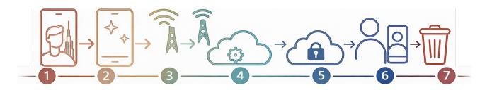
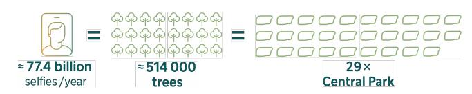

# A Life-Cycle Assessment of the Hidden Environmental Cost of Selfies

[Tilen Hliš](https://orcid.org/0000-0002-4973-4844)

tilen.hlis@um.si

Faculty of Electrical Engineering and Computer Science, University of Maribor Maribor, Slovenia

[Urška Butolen](https://orcid.org/0009-0005-4219-5023) urska.butolen@proton.me Faculty of Mechanical Engineering, University of Maribor Maribor, Slovenia

[Iztok Fister](https://orcid.org/0000-0002-9964-6957)

iztok.fister@um.si

Faculty of Electrical Engineering and Computer Science, University of Maribor Maribor, Slovenia

[Iztok Fister Jr.](https://orcid.org/0000-0002-6418-1272)

iztok.fister1@um.si

Faculty of Electrical Engineering and Computer Science, University of Maribor Maribor, Slovenia

# Abstract

While the selfie is studied widely as a socio-technological phenomenon, its environmental impact remains largely unexplored. With over 212 million taken daily, even small digital actions carry measurable consequences. This paper quantifies the carbon footprint of a single selfie using the cradle-to-grave life cycle approach aligned with ISO 14067:2018. The energy use was estimated across seven phases, capturing, processing, uploading, platform processing, storage, revisiting, and deletion, and multiplied by the electricity emission factors (EFs) to calculate the total carbon footprint. The differences in electricity EFs challenge precise estimates. Using the European average EF, one selfie emits 0.145 gCO2e, half the global estimate. India's one gives 0.497 gCO2e, Sweden's just 0.006 gCO2e, a 70-fold gap. These calculations assume the same electricity mix, although parts like social media handling may occur in the USA. Uncertainty also arises from the limited energy data, so representative literature values were used for a conservative estimate. Even so, the global selfie footprint, assuming uploads, remains significant. Offsetting it would require about 514,000 trees, equivalent to 29 Central Parks, or up to 1.28 million in arid regions like Dubai, covering 23.4 % of the city's urban tree stock. However, the key message lies not in the exact numbers, but in awareness about the environmental impact of everyday digital actions. If one selfie has a footprint the impact of all shared content is far greater, an insight relevant to both research and climate policy.

## CCS Concepts

• Applied computing → Environmental sciences; • Social and professional topics → Sustainability; • Information systems → Information lifecycle management; • Human-centered computing → Social networking sites.

# Keywords

Selfie, Digital carbon footprint, Social media, Life Cycle Assessment

[This work is licensed under a Creative Commons Attribution 4.0 International License.](https://creativecommons.org/licenses/by/4.0) WWW '26, Dubai, United Arab Emirates

© 2026 Copyright held by the owner/author(s). ACM ISBN 979-8-4007-2307-0/2026/04 <https://doi.org/10.1145/3774904.3792878>

#### ACM Reference Format:

Tilen Hliš, Urška Butolen, Iztok Fister, and Iztok Fister Jr.. 2026. A Life-Cycle Assessment of the Hidden Environmental Cost of Selfies. In Proceedings of the ACM Web Conference 2026 (WWW '26), April 13–17, 2026, Dubai, United Arab Emirates. ACM, New York, NY, USA, [4](#page-3-0) pages. [https://doi.org/10.1145/](https://doi.org/10.1145/3774904.3792878) [3774904.3792878](https://doi.org/10.1145/3774904.3792878)

# 1 Introduction

The greater pervasiveness of digital technology has transformed everyday life, but alongside this has come a new, insidious source of Greenhouse Gas (GHG) emissions the digital Carbon Footprint (CFP). As social media use has grown to over 5.4 billion individuals worldwide in 2025, equating to 65.7 % of the total global population [\[22\]](#page-3-1), the environmental cost of seemingly trivial online actions has become increasingly relevant. Among these, the selfie stands out as a symbolic act of digital self-expression and a micro-unit of the digital economy. Each day, humanity points its cameras at itself around 212 million times, devoting 54 hours a year nearly a week of waking life taking selfies [\[10\]](#page-3-2), typically defined as self-images taken with handheld devices and shared on social media [\[36\]](#page-3-3). Each image captured, posted, and stored, incurs energy usage on smartphones, data transmission networks, and cloud facilities. The selfie has been studied widely as a socio-technological phenomenon embedded in contemporary consumer culture. Despite the growing body of research, little to no attention has been paid to its impact on the environment [\[25\]](#page-3-4). This paper addresses that gap by introducing the quantification of the CFP of a selfie. The digital CFP is the GHG emissions resulting from the production, use, and data transfer of digital services and infrastructure [\[28\]](#page-3-5). Alarmingly, the current global average consumption of web surfing, social media, video and music streaming, and web conferencing, is estimated to account for up to 40 % per capita CFP allowance aligned with the 1.5°C global warming target [\[20\]](#page-3-6). If the carbon cost of daily digital activities is 40 % of our total carbon budget, then it might be the time to zoom in on just one action, a simple selfie, and ask ourselves: Is it worth the price future generations will pay for it? This paper responds to that question by offering the following unique contributions:

- the quantification of the CFP of a selfie, following the methodological principles of ISO 14067:2018,
- the inclusion of the entire Life Cycle Assessment (LCA) of a selfie, adopting a cradle-to-grave perspective.

The remainder of the paper is structured into five sections as follows: Section [2](#page-1-0) presents the current state of research on the topic. In Section [3,](#page-1-1) the quantification of the CFP of a selfie is presented through its entire lifetime. Section [4](#page-2-0) discusses the key findings and their implications, while Section [5](#page-3-7) concludes the paper by providing foundations for further reflection, research, and policy-making.

#### 2 Related work

Research on the digital CFP generally follows three strands: the efficiency of the Information Communication Technology (ICT) infrastructure, device LCAs, and user-level evaluations of the digital content consumption. These approaches measure aggregate impacts while differing in boundaries, units, and assumptions on geography, compression, file size, device type, and lifespan, but only rarely isolate emissions from a single activity, such as taking, uploading, and re-viewing a selfie. Within the first strand, recent research on digital content studies a typical user's round the clock mix of behaviors, (web, social media, music/video streaming, video calls) and traces effects from devices, home routers, networks, to data centers. Linking data traffic (e.g., social media ≈0.31 GB/h) and multi-tier infrastructure to a global average footprint of about 229 kg CO2e/user/year. Here, we must also mention the strong dependence on local electricity mixes, which implies that the same selfie can embody different emissions, depending on where it is processed and viewed [\[20\]](#page-3-6). In parallel, device focused LCAs for smartphones refine the cradle-to-grave picture, separating manufacturing, distribution, use or consuming, and end of life. Studies found that smartphone manufacturing dominates these cradle-tograve impacts, while the use phase is comparatively small, and highly sensitive to service life and end of life. A recent case study estimates ∼306.7 kg CO2e from production, compared with roughly 10.7–11.7 kg CO2e over typical use [\[37\]](#page-3-8). Platforms specific papers add another layer by converting time or data into CO2e for popular services, but the results vary widely by method and assumption [\[35\]](#page-3-9), e.g., Netflix ∼1,681 g CO2e/h [\[8\]](#page-3-10). This underlines the need to state boundaries clearly when moving from a per hour metric to a per image estimate. Closest to our focus is the idea from CORE Econ from 2019, the Selfie Index, turning megabytes into electricity and then into CO2e [\[15\]](#page-3-11). To the best of our knowledge, the scientific peer-reviewed literature has not yet provided a focused treatment of this topic.

# 3 From snap to CO2

Photography has evolved as a flexible, all but ubiquitous kind of human activity, incorporated fully into everyday life. Based on research [\[23\]](#page-3-12), people take and use personal photos not only for their appearance, but as part of developed social and coping strategies [\[23\]](#page-3-12). Smartphones have facilitated this behavior, but the motive lies in the human nature. People photograph to create meaning, capture emotional experience, strengthen social connections, and cope with uncertainty. Daily photography serves many purposes: storing, editing, sharing, revisiting, or deleting images as acts of memory, connection, or digital tidying [\[23\]](#page-3-12). To cover the whole LCA and potential CFP of one selfie, we identified seven basic stages. We propose the following lifecycle stages (Fig [1\)](#page-1-2):

Figure 1: Lifecycle of a selfie.

- (1) Capturing
- (2) On-device processing
- (3) Uploading
- (4) Platform processing
- (5) Short/long-term storage
- (6) Revisiting/replaying
- (7) Deletion

These stages reflect the typical lifecycle of a user's image and form the basis of our CFP estimation. According to ISO 14067:2018, the CPF of a product is defined as 'the sum of GHG emissions and GHG removals in a product system, expressed as CO2 equivalents, and based on an LCA using the single impact category of climate change', while product can be categorized as 'goods or service' [\[2\]](#page-3-13). Applied to the selfies, this includes the proportional share of emissions from device production, repeated access, and the infrastructure for online distribution. The CFP expresses the total contribution to global warming by converting all significant GHG emissions and removals over a product's lifecycle into CO2 equivalent units. This is done by multiplying the mass of each GHG by its 100-year Global Warming Potential (GWP), as defined by the Intergovernmental Panel on Climate Change (IPCC) [\[2\]](#page-3-13). As introduced by CORE Econ [\[15\]](#page-3-11), the Selfie Index estimates the CFP of an uploaded image by converting file size (2 MB) into electricity use for network and data-center processing. As the Selfie Index was introduced in 2019, it relies on data and EFs from that year. We updated the metric by incorporating the additional life-cycle stages contributing to the selfie's total CFP (Table [1\)](#page-2-1).

Capturing: Recent work shows that a typical smartphone consumes up to 14 Wh/day of electricity, depending on the model and the intensity of the usage [\[24\]](#page-3-14), due partly to the idle power [\[11\]](#page-3-15). Camera operation accounts for roughly 2.7 % of a user's total smartphone time derived from an average screen-time of 5.5 hours/day [\[38\]](#page-3-16), and averaging 54 hours/year for taking selfies [\[10\]](#page-3-2). Based on [\[10\]](#page-3-2), around 4 % of all images are selfies, and we estimate that each selfie consumes up to 0.015 Wh. Scaled globally, this amounts to 1.1607 GWh/year solely for pointing the camera and pressing the shutter.

On-device processing: Empirical measurements indicate that image processing tasks consume an additional 0.001–0.010 Wh/image, depending on the algorithmic complexity [\[19,](#page-3-17) [27,](#page-3-18) [33,](#page-3-19) [40\]](#page-3-20).

Uploading: The average selfie occupies 5 MB of storage [\[34\]](#page-3-21), which we use as the baseline size. The upload energy depends on the radio link (Wi-Fi or cellular base station), back-haul, Internet, and cloud-datacenter ingress. Uploading a 5 MB image from a smartphone to the cloud consumes a small, but measurable amount of electricity in both the phone and the network. Over a mobile 4/5-G network, the network infrastructure energy intensity is in the order of about 0.9 Wh/selfie [\[18\]](#page-3-22), while using Wi-Fi (fixed broadband) is far more efficient at about 0.03 to 0.07 Wh/selfie [\[18\]](#page-3-22). The phone itself adds around 0.015 Wh/selfie [\[24\]](#page-3-14). Because the routing paths, hop counts, tower or router load, and idle-power draw of telecom gear vary, the actual consumption can deviate markedly [\[18\]](#page-3-22). These factors give an average estimate of 0.05 Wh/selfie [\[7\]](#page-3-23). Under poor connectivity a 5 MB upload on a weak 3-G link can exceed 8Wh [\[39\]](#page-3-24).

Platform processing: Once a selfie reaches the platform, three main server-side tasks occur: (1) format conversion, compression and resizing; (2) AI-based moderation for content or intellectual property violations, and (3) distribution of the renditions [\[13,](#page-3-25) [30\]](#page-3-26). Each of these steps draws power in data center servers, though per image energy is relatively low compared to transmissions. While precise data are lacking, estimates can be made from the related metrics. Storing a 5 MB file to disk (plus writing a few smaller thumbnails) might consume a few joules. For example, a content server handling an image request would consume on around 0.012 Wh/image in the worst case. Initial writes may be buffered and batched, and disks are often writing many files concurrently, so the incremental energy to write one image is likely lower [\[21\]](#page-3-27). Converting the image to various resolutions or formats uses CPU and GPU cycles. These are typically millisecond scale operations. A computationally intensive task, e.g., 1 s of CPU time at full load, would be of the order of 0.014 Wh/image for a typical server CPU, and actual image compression tends to be faster. If a deep neural network scans the image for policy violations with similar energy use, AI based moderation algorithms could add an overhead of 0.007-0.04 Wh/image [\[26\]](#page-3-28). These processing energies are relatively minor compared to the energy for data transmission.

Short/long term storage: Once uploaded, the image is stored in cloud data centers potentially for years, incurring a standing energy cost. Energy is consumed: (1) by keeping the storage hardware powered even when the file is idle, and (2) by occasional retrievals for backups, migrations, or user access. The per-image standby draw is minuscule (under 0.001 Wh) and essentially zero for long term archival until the file is read. A "cold" image that is later accessed may require a one-off 0.01 Wh to spin up disks and cache the data. Consequently, uncertainties in the per-image storage footprint are negligible, even large estimation errors barely affect the total Wh figure [\[8,](#page-3-10) [21\]](#page-3-27). The larger uncertainty is systemic, how providers manage aging data. If, for example, a provider did not use efficient cold storage, the per image annual energy would be higher. But industry trends favor aggressive energy optimization for rarely accessed media, making a near-zero long-term cost a reasonable assumption for modern social networks.

Revisiting/replaying: Delivering a shared selfie is often the main energy sink, involving Content Delivery Network (CDN) or data-center servers, network transport, and the viewer's device. Popular images are cached on edge servers, so per-view energy fluctuates with the number of viewers and their connection type. Assuming a rough estimate of an average scenario, 50 to 100 friends seeing the image, split between mobile and Wi-Fi, the delivery energy can reach up to 0.3 Wh [\[7,](#page-3-23) [21\]](#page-3-27). Under high engagement (e.g., a well-liked image seen several hundred times, especially on mobile networks), serving would easily consume several tenths of a Wh/image [\[21\]](#page-3-27), with additional interactions such as commenting and tagging increasing the total energy demand.

Deletion: Removing a selfie uses only a few CPU cycles (millijoules), so its direct electricity use is negligible. The real environmental benefit comes from halting storage and replication. LCA studies show that keeping a 5 MB image online consumes about 0.14-0.23 Wh/year/copy, and typical triple replication used by cloud platforms raises this to 0.42-0.69 Wh/year [\[41\]](#page-3-29). Over half of enterprise data are "dark data", are never accessed again, and recent

Table 1: Per-selfie energy use and CFP.

Table 2: Electricity emission factors and electricity prices.

forecasts indicate that about 65 % of data-center content falls into this category [\[12\]](#page-3-32). Such unused images, logs and duplicate files still draw power for storage, backup, and cooling, making them a major contributor to the digital CFP.

To estimate the CFP of the seven behavior stages in accordance with ISO 14067, the GHG emissions were quantified by multiplying the activity data for each phase, expressed as energy consumption, with the corresponding EFs. The factors vary significantly by country (Table [2\)](#page-2-2). Using the global average, the total CFP of one selfie is quantified to 0.332 gCO2e. To understand the CFP of a selfie, we also need to include the proportional part of the CFP of the device used. Tian et al. [\[37\]](#page-3-8) estimated a cradle-to-grave footprint of 306.74 kg CO2e per smartphone, excluding the use phase. This value varies by model, brand, and region [\[14\]](#page-3-33). Based on Section [3,](#page-1-1) about 0.11% of total smartphone use is attributable to taking selfies. While this underscores the role of embodied emissions, the study focuses on energy-related impacts.

### 4 Discussion

The differences in EFs already present the challenges in providing a precise and generalizable CFP estimation. Using the European average electricity EF, the total CFP of a one selfie, is estimated to be 0.145 gCO2e, twice as low as the estimate using the global average, while applying the reported EF for India results in an estimated CFP of a selfie to be 0.497 gCO2e, and applying the reported EF for Sweden results in an estimated CPF of 0.006 gCO2e, indicating a more than 70-fold difference between India and Sweden. These estimations are based on the assumption, that all the stages of electricity consumption are performed using the same electricity mix. In reality, this is not neccessarily the case, as different parts of the process may occur across regions with different electricity mixes. For Europe, the selected EFs are likely to reflect the actual situation, as the General Data Protection Regulation (GDPR) requirements encourage companies to store and process EU user data within the EEA [\[1\]](#page-3-34). In global context, this assumption becomes more uncertain.

Figure 2: Selfie CFP vs. tree sequestration.

For the stages of social media processing and storage the USA EF of 0.384 kgCO2e/kWh [\[17\]](#page-3-30) might be more appropriate, as most data center locations of Meta Platforms, Inc. are in the USA [\[6\]](#page-3-35). Beyond the differences in EFs, the difficulty of quantifying the energy consumption associated with each phase accurately contributes further to the overall uncertainty of the assessment. To ensure a conservative baseline, we intentionally adopted the most representative energy consumption figures from the literature, which better reflect typical scenarios. Even this cautious estimate, when scaled to the global amounts of selfies, under the assumption that users upload their images to social media, does present a significant contribution to the global CFP. To put the calculation in perspective, we have compared the quantified annual emissions of all selfies with the carbon sequestration of trees (Fig [2\)](#page-3-36). Assuming a conservative average of 50 kgCO2e/year per mature tree [\[29,](#page-3-37) [31\]](#page-3-38), the global annual selfie footprint would require approximately 513,875 trees to offset, which is equivalent to the capacity of nearly 29 Central Parks [\[3\]](#page-3-39). In more arid environments like Dubai, trees typically sequester only 20 to 30 kgCO2e/year, due to water scarcity and limited biomass growth [\[16,](#page-3-40) [32\]](#page-3-41), meaning that offsetting the emissions would require 856,458 to 1,284,686 trees, estimated somewhere between 15.6% and 23.4% of the total urban tree stock of the city of Dubai [\[4\]](#page-3-42).

# 5 Conclusion

This article introduces the assessment of the total CFP of one selfie taken and shared on social media, which varies based on different factors, and is also expected to decrease in the future due to decarbonization efforts and policies. However, the true takeaway should not lie in the specific number itself, but in the awareness it raises about the impacts of simple digital actions. If a single selfie has a quantifiable impact, imagine what that implies for other content-related images shared on social media. Even simple choices, such as taking a photo without uploading it, can serve as lower-impact alternatives that reduce the cumulative digital footprint. Berglez et al. [\[9\]](#page-3-43) stated that users are often showcasing their high-carbon lifestyles on social media, which adds to the embedded emissions behind the social media image. Future research should extend the analysis to other forms of digital content shared on social media, especially content with an extensive audience reach. Comparative assessments across platforms and content types could offer a clearer picture of the carbon intensity associated with everyday digital practices. These insights are important for both academic research and policy development, suggesting that digital consumption patterns should not be overlooked in climate strategies.

# Acknowledgments

Funded by the Slovenian Research Agency (P2-0057).

#### References

[1] 2016. Regulation (EU) 2016/679 — General Data Protection Regulation. [www.eur](www.eur-lex.europa.eu/eli/reg/2016/679/oj)[lex.europa.eu/eli/reg/2016/679/oj.](www.eur-lex.europa.eu/eli/reg/2016/679/oj) [2] 2018. ISO 14067:2018 — Greenhouse gases — Carbon footprint of products — Requirements and guidelines for quantification. [3] 2022. Park, City, Healthy: Central Park Trees.<www.centralparknyc.org> [4] 2025. Dubai Municipality completes landscaping projects.<www.mediaoffice.ae> [5] 2025. Electricity prices around the world. [www.globalpetrolprices.com/](www.globalpetrolprices.com/electricity_prices/) [electricity\\_prices/](www.globalpetrolprices.com/electricity_prices/) Accessed: 2025-10-30. [6] 2025. US Data Center Locations. [www.datacenters.atmeta.com/us-locations/.](www.datacenters.atmeta.com/us-locations/) [7] J. Aslan et al. 2018. Electricity intensity of internet data transmission: Untangling the estimates. Journal of industrial ecology 22, 4 (2018). [8] A. Batmunkh. 2022. Carbon footprint of the most popular social media platforms. Sustainability 14, 4 (2022). [9] P. Berglez and U. Olausson. 2023. Climate irresponsibility on social media. A critical approach to "high-carbon visibility discourse". 33, 5 (2023). [10] M. Broz. 2025. Selfie Statistics.<www.photutorial.com> Accessed: 2025-10-14. [11] A. Carroll and G. Heiser. 2010. An analysis of power consumption in a smartphone. In USENIX ATC 10. [12] V. Castro et al. 2024. Digital data demand and renewable energy limits: Forecasting the impacts on global electricity supply and sustainability. 195 (2024). [13] Cambridge Consultants. 2019. Use of AI in Online Content Moderation. Technical Report.<www.ofcom.org.uk/> [14] M. Cordella et al. 2020. Guidance for the assessment of material efficiency: Application to smartphones. (2020). [15] CORE Econ. 2019. The environmental costs of being selfiesh. Technical Report. <www.core-econ.org/> [16] M. Elhag et al. 2020. Estimating environmental and economic benefits of urban trees in desert environments. 192, 5 (2020). [17] Ember. 2025. Global Electricity Review.<www.ember-energy.org> [18] ENGIE Impact. 2025. Electricity consumption of videos viewed on Meta. Technical Report.<www.sustainability.atmeta.com/> [19] S. W. Hasinoff et al. 2016. Burst photography for high dynamic range and lowlight imaging on mobile cameras. ToG 35, 6 (2016). [20] R. Istrate et al. 2024. The environmental sustainability of digital content consumption. Nature Communications 15, 1 (2024). [21] F. Jalali et al. 2014. Energy consumption of photo sharing in online social networks. In 2014 14th IEEE/ACM CCGrid. [22] S. Kemp. 2025. Digital 2025: Global Overview Report. [www.datareportal.com/](www.datareportal.com/social-media-users) [social-media-users](www.datareportal.com/social-media-users) Accessed: 2025-10-14. [23] L. Kislinger and K. Kotrschal. 2021. Hunters and gatherers of pictures: Why photography has become a human universal. Frontiers in Psychology 12 (2021). [24] M. Kögler et al. 2024. Sustainable use of a smartphone and regulatory needs. Sustainable Development 32, 6 (2024). [25] W. M. Lim. 2016. Understanding the selfie phenomenon: current insights and future research directions. European Journal of Marketing 50, 9/10 (2016). [26] S. Luccioni et al. 2024. Power hungry processing: Watts driving the cost of AI deployment?. In Proceedings of the 2024 ACM FAccT. [27] A. Monod et al. 2021. An analysis and implementation of the hdr+ burst denoising method. Image Processing On Line 11 (2021). [28] R. Naeem et al. 2023. Social media platforms and their digital carbon footprints: Analyzing awareness level of social media users. Int J Media Net 1, 1 (2023). [29] D. J. Nowak et al. 2013. Carbon storage and sequestration by trees in urban and community areas of the United States. Environmental Pollution 178 (2013). [30] M.-R. Ra et al. 2013. Toward {Privacy-Preserving} Photo Sharing. In NSDI 13. [31] J. Riikonen et al. 2022. Carbon balance and climate impact of urban trees in different environments. Urban Forestry & Urban Greening 70 (2022). [32] D. Saini. 2017. Screening and evaluation of candidate trees for terrestrial carbon sequestration. Carbon Management 8, 5-6 (2017). [33] K. M. Saipullah et al. 2012. Measuring power consumption for image processing on android smartphone. American Journal of Applied Sciences 9, 12 (2012). [34] Samsung Electronics. 2025. How much memory do you need on your phone? <www.samsung.com/uk/mobile-phone-buying-guide> Accessed: 20 October 2025. [35] P. Sharma and B. Dash. 2023. The digital carbon footprint: Threat to an environmentally sustainable future. [36] P. Sorokowski et al. 2015. Selfie posting behaviors are associated with narcissism among men. Personality and individual Differences 85 (2015). [37] L. Tian et al. 2025. A Method for Calculating the Life Cycle Carbon Footprints of Smartphones Driven by Scenarios. In ICIMCC. [38] Ł. Tomczyk et al. 2023. Is real screen time a determinant of problematic smartphone and social network use among young people? Telemat. Inform. 82 (2023). [39] M. Uijttewaal et al. 2021. Carbon footprint of unwanted data-use by smartphones—An analysis for the EU. CE Delft, Delft (2021). [40] H. Wang et al. 2020. Energy drain of the object detection processing pipeline for mobile devices: Analysis and implications. Trans. Green Commun. Netw. (2020). [41] Q. Zhang et al. 2021. Evaluating the sustainability of big data centers using the analytic network process and fuzzy TOPSIS. Environ. Sci. Pollut. Res. (2021).