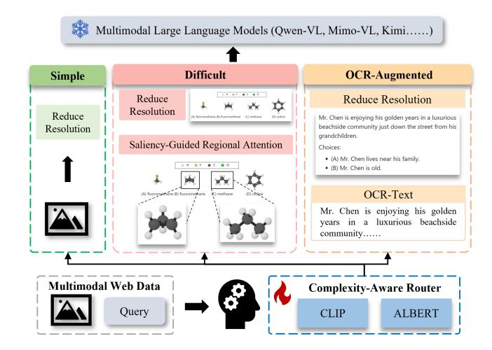
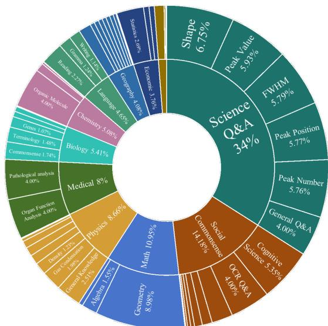

# We May Not Need Much Visual Encoding of Web Data for Question Answering

[Tan Yue](https://orcid.org/0000-0002-5798-6304)†

Wangxuan Institute of Computer Technology, Peking University Beijing, China yuetan@pku.edu.cn

[Qiong Wu](https://orcid.org/0009-0009-7699-1510)† Wangxuan Institute of Computer Technology, Peking University Beijing, China wu\_qiong@stu.pku.edu.cn

[Dongyan Zhao](https://orcid.org/0000-0002-0396-6703)∗ Wangxuan Institute of Computer Technology, Peking University National Engineering Research Center of New Electronic Publishing Technologies Beijing, China zhaody@pku.edu.cn

# Abstract

With the growing scale of multimodal large language models, multimodal understanding and question answering systems have achieved remarkable progress in processing and analyzing web data. However, these improvements require excessive visual token encoding, resulting in high memory usage and computational costs. To address this limitation, we propose LightVAM, a plug-and-play lightweight visual augmented model that adaptively adjusts visual encoding according to input complexity. We construct a human-annotated multimodal complexity-aware dataset (MCA10K) covering 60 domains from web with 10,000 samples. The MCA10K is used to train a CLIP–based router that assigns instances to three processing types: simple, difficult, and OCR-augmented. For each type, LightVAM adopts distinct encoding strategies: 1) reducing image resolution for simple cases, 2) applying saliency-guided regional attention for complex visual reasoning cases, and 3) incorporating OCR-based textual enhancement for text-rich images. Experiments on multiple visual question answering benchmark datasets demonstrate that LightVAM significantly reduces visual tokens while maintaining or even improving model accuracy, providing an efficient and generalizable solution for web-scale multimodal understanding.

# CCS Concepts

- Computing methodologies → Computer vision; Natural language processing.

# Keywords

Multimodal Web Data, Multimodal Large Language Model, Lightweight Visual Encoding, Visual Question Answering

#### ACM Reference Format:

Tan Yue, Qiong Wu, and Dongyan Zhao. 2026. We May Not Need Much Visual Encoding of Web Data for Question Answering. In Proceedings of the ACM Web Conference 2026 (WWW '26), April 13–17, 2026, Dubai, United

\*Corresponding author.

[This work is licensed under a Creative Commons Attribution 4.0 International License.](https://creativecommons.org/licenses/by/4.0) WWW '26, Dubai, United Arab Emirates © 2026 Copyright held by the owner/author(s). ACM ISBN 979-8-4007-2307-0/2026/04 <https://doi.org/10.1145/3774904.3792879>

Arab Emirates. ACM, New York, NY, USA, [4](#page-3-0) pages. [https://doi.org/10.1145/](https://doi.org/10.1145/3774904.3792879) [3774904.3792879](https://doi.org/10.1145/3774904.3792879)

# 1 Introduction

With the rapid advancement of multimodal large language models (MLLMs), remarkable progress has been achieved in representing joint visual–textual information, enabling these models to effectively process multimedia web data. Models based on visual–textual joint modeling, such as BLIP-2 [\[6\]](#page-3-1) and GPT series [\[4\]](#page-3-2), have been widely applied to web-oriented tasks, including visual question answering (VQA) and web content understanding. Leveraging large-scale web image–text alignment data, these models demonstrate strong cross-modal understanding and generation capabilities. However, as model sizes grow, the cost of training and inference increases sharply. To maintain fine-grained visual accuracy, current models encode a large number of visual tokens, which results in high GPU memory usage, significant computational overhead, and increased inference latency.

To address these challenges, researchers have explored various lightweight visual encoding methods. Early works mainly focused on improving Vision Transformer (ViT) architectures, such as DynamicViT [\[9\]](#page-3-3), which reduces redundant visual features by dynamically pruning or selecting inter-layer tokens. Then, Token Merging (ToMe) [\[2\]](#page-3-4) and BLIP-2's Q-Former [\[6\]](#page-3-1) achieved end-to-end token reduction through token aggregation and visual compression, effectively alleviating redundancy during multimodal inference. More recent studies like VisionZip [\[14\]](#page-3-5) and ATP-LLaVA [\[15\]](#page-3-6) introduced learnable token pruning mechanisms that dynamically preserved critical information from images, significantly reducing visual token counts with minimal performance loss. Despite these advances, several key limitations remain: 1) Most general MLLMs adopt a fixed number of visual tokens, which can only be manually adjusted through hyperparameters and cannot adapt dynamically to input complexity or task requirements. 2) Although ViT-based encoders improve visual attention, they often overlook small and fine-grained visual cues, lacking a mechanism for "zoom-in and attention enhancement." 3) Existing methods are often model-specific, showing limited transferability and generalization across different MLLMs or web-based vision tasks, which restricts their practical deployment and scalability.

Accordingly, we propose LightVAM, a plug-and-play lightweight visual augmented model designed to enable adaptive adjustment

†Equal contribution.

and enhancement of visual information. LightVAM can be integrated into mainstream MLLMs and dynamically optimizes visual encoding according to the features of the input data. Specifically, we construct a multimodal complexity-aware dataset (MCA10K) containing over 10,000 manually annotated samples, covering multimodal web data with varying levels of complexity. Using this dataset, we train a CLIP–ALBERT fusion model (router) to assign multimodal inputs to three processing types: simple, difficult, and OCR-augmented. 1) Simple: Image resolution is reduced to minimize visual tokens; 2) Difficult: LightVAM first performs global downsampling to reduce visual tokens of the raw image, then applies saliency-guided regional attention to highlight key visual cues and integrates the enhanced regions with the raw image. 3) OCR-Augmented: Text extracted by an OCR model [\[1\]](#page-3-7) is integrated with the reducing raw image, improving text comprehension.

Experimental results show that LightVAM consistently reduces visual tokens by more than 50% across multiple benchmark datasets and MLLMs, with the maximum reduction reaching 65.79%. Also, it maintains or even improves accuracy, achieving up to 2.27%. Without training or modifying the structure of MLLMs, LightVAM achieves generalizable and adaptive lightweight visual encoding with only 1B model size, providing an efficient and flexible solution for large-scale web-based multimodal understanding tasks.

Our main contributions are as follows: 1) We propose LightVAM, a plug-and-play lightweight visual augmented model that enables flexible integration across diverse MLLMs, demonstrating strong adaptability and generalization capabilities. 2) We construct a multimodal complexity-aware dataset (MCA10K) encompassing 10,000 samples across 60 web domains. All samples are manually annotated and cross-proofread to ensure the high quality. 3) Experimental results across multiple VQA benchmark datasets demonstrate that LightVAM can significantly reduce visual tokens while maintaining or even improving model performance, validating the efficiency and generalizability of the proposed method.

### 2 Methodology

To achieve lightweight and adaptive visual encoding, we propose a complexity-aware lightweight visual augmented model (LightVAM). LightVAM first assigns each input image–text pair to a specific complexity level and then processes the visual input differently. As shown in Figure [1,](#page-1-0) it consists of two main modules: 1) A multimodal complexity-aware router built on ALBERT [\[5\]](#page-3-8) and CLIP [\[8\]](#page-3-9) to classify sample complexity (Simple, Difficult, and OCR-Augmented). 2) A routing and processing module that applies distinct visual encoding strategies based on the complexity. This design enables the model to dynamically balance computational cost and accuracy during inference, achieving efficient multimodal understanding and reasoning at web scale.

# 2.1 Complexity-Aware Router

Given a sample (��,�� , ��), where �� denotes the image, �� denotes the text query, and �� ∈ {Simple, Difficult, OCR} denotes the label, text and image encoders produce embeddings: t = ALBERT(�� ), v = CLIP(��), which are ℓ2-normalized to remove scale variance:

˜t = t ∥t∥2 + �� , v˜ = v ∥v∥2 + �� . (1)

Figure 1: The proposed LightVAM model.

To characterize the text density in the image, we first construct a binary map �� by applying Sobel gradients, Otsu thresholding, and morphological closing to the grayscale input. Let �� ∈ {0, 255} �� ×�� , where �� and �� denote image height and width. To estimate the number of text rows, we compute the horizontal projection �� (��) = Í�� ��=1 ��(��, ��) and count projection responses above an adaptive threshold ��proj. The ratio of text-like pixels �� and the normalized number of text lines �� are defined:

�� = E(��,��) ∈Ω ��(��, ��) 255 , �� = 1 6 log 1 + ∑︁�� ��=1 I �� (��) &gt; ��proj ! . (2)

The normalized visual, textual, and density features are concatenated: z = [ ˜t; v˜; (��,��)], and passed through a two-layer feed-forward network to output the probability distribution:

��(��|��,�� ) = Softmax(��2 ReLU(��1z + ��1) + ��2) . (3)

The model is optimized with the cross-entropy loss:

L = − ∑︁ �� ���� log ��(�� = ��|��,�� ). (4)

### 2.2 Routing and Processing

At inference time, the trained router ���� ∗ predicts the complexity probabilities p = ���� ∗ (��,�� ) and determines the processing type: �� ∗ = arg max�� ���� . Three routing branches are designed as follows.

1) Simple: Reduce the resolution of images to ��×��. 2) OCR-Augmented: When dense textual regions are detected, the OCR model extracts the textual content �� and concatenates it with the original question to form �� ′ = [�� ; ��], which enhances the model's understanding of text-rich images. Although text tokens are added, the resolution of the image input is also reduced to ��×��.

3) Difficult: For visually complex samples, both the original image and automatically generated regional-attention augmented images are used as inputs. The resolution of the original image is first reduced to ����, preserving global features. Then, a textguided relevance heatmap is computed:

��(��, ��) = ⟨vˆ��,��,ˆt⟩, (5)

where vˆ��,�� denotes the normalized visual embedding at position (��, ��) and ˆt denotes the textual embedding. An integral image enables efficient sliding-window scoring:

score(��) = 1 |��| ∑︁ (��,��) ∈�� ��(��, ��), (6)

followed by non-maximum suppression (NMS) to select the top-�� salient regions {�� ∗ } �� ��=1 . Each region is cropped and resized, and the patches are concatenated:

��reg = M W (�� |�� ∗ 1 ), . . . ,W (�� |�� ∗ �� ) , (7)

whereW denotes cropping and rescaling, and M indicates concatenation. Both the original (��ori) and regional-attention augmented images (��reg, ����) are fed into the downstream MLLMs:

Xdif = {(��ori,�� ), (��reg,�� )}. (8)

This dual-image input maintains a low pixel budget while improving the model's focus on informative regions. The proposed complexity-aware method integrates routing and adaptive visual processing into a unified pipeline. By dynamically selecting the three branches, the model preserves essential semantics with reduced redundant encoding, thus achieving efficient and accurate multimodal reasoning under limited computational budgets.

#### 3 Dataset

Collection: We construct a multimodal complexity-aware dataset (MCA10K) containing 10,000 manually annotated samples to support the training of LightVAM. Samples are collected from publicly available multimodal question answering data from the web, covering 11 main domains and 60 sub-domains. The detail of the domain distribution is shown in Figure [2.](#page-2-0) During sampling, we follow three key criteria: semantic diversity, domain coverage, and task balance. (1) We prioritize samples with rich question semantics and diverse visual contexts to include various image types and reasoning requirements. (2) Within each domain, we maintain a balanced proportion of descriptive, selective, and reasoning-type questions. (3) Blurry, low-resolution, or noisy samples are filtered out to ensure visual clarity and semantic consistency. As a result, the dataset achieves broad coverage across tasks and domains, providing a solid foundation for enhancing the generalization of trained models.

Annotation: The annotation process consisted of three stages. Stage 1: Definition of annotation criteria. Each sample is categorized into one of three types. 1) Simple: The image contains straightforward content directly aligned with the text, and the answer can be derived through global visual understanding. 2) Difficult: The question involves complex reasoning, multi-object recognition, or cross-region information integration, requiring stronger visual reasoning. 3) OCR-Augmented: The image contains substantial textual or tabular information, and the answer depends on the semantic understanding of the text in the image. Stage 2: Initial annotation. Each sample is independently labeled by two annotators according to the defined criteria to minimize subjective bias. Stage 3: Consistency verification. Samples with inconsistent annotations are reviewed and corrected by a senior annotator. In cases of disagreement, three annotators discuss and finalize the label through a majority voting process. To evaluate the quality of annotation,

Figure 2: Domain Distribution of the MCA10K Dataset.

we report the Cohen's Kappa score of 0.89, demonstrating high annotation reliability and consistency.

#### 4 Experiment

Setup. To comprehensively evaluate the effectiveness and generalization of LightVAM, we conduct experiments across three representative VQA benchmarks: MathVista [\[7\]](#page-3-10), M3CoT [\[3\]](#page-3-11), and SciChart [\[12\]](#page-3-12). These datasets collectively cover a wide range of scenarios, including mathematical reasoning, multimodal commonsense understanding, and scientific question answering, ensuring a diverse evaluation across domains with distinct visual-textual features. We integrate LightVAM into multiple mainstream MLLMs, including Qwen2.5-VL-3B/7B [\[11\]](#page-3-13), MiMo-VL-RL-7B [\[13\]](#page-3-14), and Kimi-Instruct [\[10\]](#page-3-15), to verify its model-agnostic and plug-and-play adaptability. As for router training, we use CLIP (ViT-L/14) [\[8\]](#page-3-9) and ALBERT-base [\[5\]](#page-3-8) models to encode visual-textual data, and set learning rate is 1×10−5 , optimizer is AdamW, batch size = 8,�� = 448, weight decay = 1 × 10−4 , epoch = 50. Experiments are conducted on eight GPUs (H800).

Main Results. We evaluate the performance of LightVAM+Qwen on three benchmarks (as shown in Table [1\)](#page-3-16). Both Qwen2.5-VL-3B and Qwen2.5-VL-7B achieve significant lightweight visual encoding improvements when integrated with LightVAM. On average, the number of visual tokens decreases by more than 60% without notable performance loss, and in some cases even yields slight performance gains. The Qwen2.5-VL-7B model maintains or slightly surpasses the baseline across all three datasets. On SciChart, it improves accuracy by 2.27% while reducing visual tokens by 63.27%. These results show that LightVAM efficiently compresses visual representations without training or modifying MLLMs, reducing inference cost while maintaining strong multimodal performance.

Ablation Study. To verify the independent and joint contributions of LightVAM modules, we perform ablation experiments on the

Table 1: Performance comparison on benchmark datasets.

| Model      | Acc   | MathVista Tokens | Acc    | M3CoT Tokens | Acc    | SciChart Tokens |
|------------|-------|------------------|--------|--------------|--------|-----------------|
| Qwen2.5-3B | 62.1  | 543.2            | 48.06  | 535.95       | 29.5   | 756             |
| Δ          | ↓ 4.3 | ↓ 65.79%         | ↑ 0.78 | ↓ 54.51%     | ↑ 1.15 | ↓ 63.27%        |
| +LightVAM  | 57.8  | 185.85           | 48.84  | 243.79       | 30.65  | 277.65          |
| Qwen2.5-7B | 67.6  | 543.2            | 57.89  | 535.95       | 38.7   | 756             |
| Δ          | ↓ 0.1 | ↓ 65.79%         | ↑ 0.61 | ↓ 54.51%     | ↑ 2.27 | ↓ 63.27%        |
| +LightVAM  | 67.5  | 185.85           | 58.5   | 243.79       | 40.97  | 277.65          |

Table 2: Ablation study results. CA=Complexity-Aware.

| Model            | Acc   | MathVista Tokens | Acc    | M3CoT Tokens |
|------------------|-------|------------------|--------|--------------|
| Qwen-7B w/o CA   | 67.3  | 565.78           | 58.01  | 557.16       |
| Δ                | ↓ 0.2 | ↑ 204.43%        | ↓ 0.49 | ↑ 128.54%    |
| Qwen-7B w/o OCR  | 66.3  | 168.56           | 57.1   | 227.31       |
| Δ                | ↓ 1.2 | ↓ 9.30%          | ↓ 1.4  | ↓ 6.76%      |
| Qwen-7B+LightVAM | 67.5  | 185.85           | 58.5   | 243.79       |

Qwen2.5-VL-7B model, as shown in Table [2.](#page-3-17) The analysis focuses on two key components: 1) The complexity-aware (CA) routing module, which distinguishes between simple and difficult samples for parallel processing, and 2) the OCR Text Enhancement module, which improves model understanding in text-rich visual scenarios. Results show that removing CA module (w/o CA) decreases accuracy by 0.2% and 0.49% on MathVista and M3CoT, respectively, while greatly increasing the number of visual tokens by 204.43% and 128.54%. This highlights the crucial role of the CA module in reducing visual redundancy. Removing OCR enhancement (w/o OCR) leads to accuracy drops of 1.2%-1.4% on the two datasets, showing that text-aware augmentation remains essential for text-rich images. In contrast, the full LightVAM achieves the best trade-off between accuracy and token efficiency, maintaining high performance while significantly reducing visual tokens.

Model-Agnostic Adaptability. To verify the model-agnostic adaptability of LightVAM, we integrate it into two more MLLMs with distinct architectures: Mimo-VL-RL-7B and Kimi-Instruct-16/A3B, and evaluate performance on the M3CoT dataset, as shown in Table [3.](#page-3-18) Results show that LightVAM achieves stable and consistent lightweight visual encoding across different MLLMs. For Mimo-VL-RL-7B, integrating LightVAM reduces the number of visual tokens by 54.51%, with only a 0.3% decrease in accuracy. For Kimi-Instruct-16/A3B, the number of visual tokens decreases by 57.57%, while performance remains almost unchanged, dropping by only 0.1%. These findings confirm that LightVAM efficiently adapts to MLLMs with different architectures and parameter scales without any training or modification.

# 5 Conclusion

In this paper, we present LightVAM, a plug-and-play 1B model that enables adaptive lightweight visual encoding for MLLMs. Using the

Table 3: Model Adaptability Experiment.

| Model     | Acc   | Mimo-VL-RL-7B Tokens | Acc   | Kimi-Instruct-16/A3B Tokens |
|-----------|-------|----------------------|-------|-----------------------------|
| Raw       | 65.1  | 535.95               | 58.7  | 511.09                      |
| Δ         | ↓ 0.3 | ↓ 54.51%             | ↓ 0.1 | ↓ 57.57%                    |
| +LightVAM | 64.8  | 243.79               | 58.6  | 216.84                      |

MCA10K dataset and a complexity-aware router, LightVAM applies targeted encoding strategies for different input types. Extensive experiments across multiple benchmarks and MLLMs show that LightVAM significantly reduces visual tokens while maintaining or improving model accuracy. Without training or modifying MLLMs, LightVAM provides an efficient and generalizable solution for weboriented multimodal understanding systems.

# Acknowledgments

This work is supported in part by the National Natural Science Foundation of China (NSFC, 62576016 and 62506014).

## References

[1] Lukas Blecher, Guillem Cucurull, Thomas Scialom, and Robert Stojnic. 2023. Nougat: Neural optical understanding for academic documents. arXiv preprint arXiv:2308.13418 (2023). [2] Daniel Bolya, Cheng-Yang Fu, Xiaoliang Dai, Peizhao Zhang, Christoph Feichtenhofer, and Judy Hoffman. 2023. Token Merging: Your ViT But Faster. In ICLR. [3] Qiguang Chen, Libo Qin, Jin Zhang, Zhi Chen, Xiao Xu, and Wanxiang Che. 2024. M3CoT: A Novel Benchmark for Multi-Domain Multi-step Multi-modal Chain-of-Thought. In Proceedings of the 62nd Annual Meeting of the Association for Computational Linguistics (Volume 1: Long Papers). 8199–8221. [4] Aaron Hurst, Adam Lerer, Adam P Goucher, Adam Perelman, Aditya Ramesh, Aidan Clark, AJ Ostrow, Akila Welihinda, Alan Hayes, Alec Radford, et al. 2024. Gpt-4o system card. arXiv preprint arXiv:2410.21276 (2024). [5] Zhenzhong Lan, Mingda Chen, Sebastian Goodman, Kevin Gimpel, Piyush Sharma, and Radu Soricut. 2020. ALBERT: A Lite BERT for Self-supervised Learning of Language Representations. In International Conference on Learning Representations. [6] Junnan Li, Dongxu Li, Silvio Savarese, and Steven Hoi. 2023. Blip-2: Bootstrapping language-image pre-training with frozen image encoders and large language models. In International conference on machine learning. PMLR, 19730–19742. [7] Pan Lu, Hritik Bansal, Tony Xia, Jiacheng Liu, Chunyuan Li, Hannaneh Hajishirzi, Hao Cheng, Kai-Wei Chang, Michel Galley, and Jianfeng Gao. [n. d.]. MathVista: Evaluating Mathematical Reasoning of Foundation Models in Visual Contexts. In The Twelfth International Conference on Learning Representations. [8] Alec Radford, Jong Wook Kim, Chris Hallacy, Aditya Ramesh, Gabriel Goh, Sandhini Agarwal, Girish Sastry, Amanda Askell, Pamela Mishkin, Jack Clark, Gretchen Krueger, and Ilya Sutskever. 2021. Learning Transferable Visual Models From Natural Language Supervision. arXiv[:2103.00020](https://arxiv.org/abs/2103.00020) [cs.CV] [9] Yongming Rao, Wenliang Zhao, Benlin Liu, Jiwen Lu, Jie Zhou, and Cho-Jui Hsieh. 2021. Dynamicvit: Efficient vision transformers with dynamic token sparsification. Advances in neural information processing systems 34 (2021), 13937–13949. [10] Kimi Team, Angang Du, Bohong Yin, Bowei Xing, Bowen Qu, Bowen Wang, Cheng Chen, Chenlin Zhang, Chenzhuang Du, Chu Wei, et al. 2025. Kimi-vl technical report. arXiv preprint arXiv:2504.07491 (2025). [11] Qwen Team. 2025. Qwen2.5 Technical Report. arXiv[:2412.15115](https://arxiv.org/abs/2412.15115) [cs.CL] [https:](https://arxiv.org/abs/2412.15115) [//arxiv.org/abs/2412.15115](https://arxiv.org/abs/2412.15115) [12] SciChart Team. 2025. SciChart: Visual Question Answering and Reasoning for Scientific Spectral Chart. [https://github.com/yuetanbupt/SciChart.](https://github.com/yuetanbupt/SciChart) [13] LLM-Core Xiaomi. 2025. MiMo-VL Technical Report. arXiv[:2506.03569](https://arxiv.org/abs/2506.03569) [cs.CL] <https://arxiv.org/abs/2506.03569> [14] Senqiao Yang, Yukang Chen, Zhuotao Tian, Chengyao Wang, Jingyao Li, Bei Yu, and Jiaya Jia. 2025. Visionzip: Longer is better but not necessary in vision language models. In Proceedings of the Computer Vision and Pattern Recognition Conference. 19792–19802. [15] Xubing Ye, Yukang Gan, Yixiao Ge, Xiao-Ping Zhang, and Yansong Tang. 2025. Atp-llava: Adaptive token pruning for large vision language models. In Proceedings of the Computer Vision and Pattern Recognition Conference. 24972–24982.